# 第二章：Apple Core ML 简介

在本章中，我们将简要介绍我们将在这本书中使用的框架——Core ML。但在这样做之前，我们将详细阐述训练和推理是什么，特别是它们之间的区别；然后我们将探讨在边缘执行**机器学习**（**ML**）的动机，即在您的 iOS 设备上。

在本章中，我们将涵盖以下主题：

+   强调训练模型和使用模型进行推理之间的区别

+   在边缘执行推理的动机和机会

+   介绍 Core ML 和一般工作流程

+   一些机器学习算法的简要介绍

+   在开发具有机器学习功能的应用程序时需要考虑的一些事项

# 训练和推理的区别

训练和推理之间的区别类似于学生在学校学习代数等知识后将其应用于现实世界的情况。在学校，学生会做大量的练习；对于每个练习，学生会尝试回答问题，并将答案交给教师，教师会提供反馈，指出答案是否正确。最初，这种反馈可能倾向于学生答错多于答对，但经过多次尝试，随着学生对概念的理解开始建立，反馈逐渐转向主要是正确的。此时，学生被认为已经足够了解代数，能够将其应用于现实世界中的未见问题，在那里他/她可以根据在学校课程中提供的练习来自信地回答问题。

机器学习模型也没有不同；构建模型的初始阶段是通过**训练**过程完成的，在这个过程中，模型被提供了许多示例。对于每个示例，使用**损失函数**代替教师提供反馈，这反过来又用于调整模型以减少损失（模型答案错误的程度）。这个过程可能需要多次迭代，通常是计算密集型的，但它提供了并行化的机会（特别是对于神经网络）；也就是说，很多计算可以并行进行。因此，通常在云端或一些具有足够内存和计算能力的专用机器上执行训练。以下图表展示了这个过程：

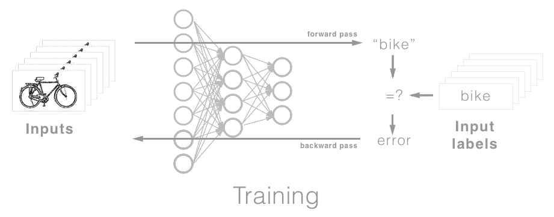

为了更好地说明所需的计算能力，在博客文章《Cortana Intelligence and Machine Learning Blog》中，微软数据科学家 Miguel Fierro 和其他人详细介绍了在 ImageNet 数据集（1,000 个类别，超过 1.2 百万张照片）上使用 18 层 ResNet 架构进行训练的基础设施和时间要求。在一个配备 4 个 GPU、24 个 CPU 核心和 224 GB 内存的 Azure N-series NC-24 虚拟机上，大约需要三天时间训练超过 30 个 epoch。详细内容描述在这里：[`blogs.technet.microsoft.com/machinelearning/2016/11/15/imagenet-deep-neural-network-training-using-microsoft-r-server-and-azure-gpu-vms/`](https://blogs.technet.microsoft.com/machinelearning/2016/11/15/imagenet-deep-neural-network-training-using-microsoft-r-server-and-azure-gpu-vms/)。

训练完成后，模型现在可以用于现实世界；就像我们的学生一样，我们现在可以部署并使用我们的模型来解决未见过的难题。这被称为**推理**。与训练不同，推理只需要通过模型进行单次遍历，使用其在训练中获得的认知，即权重和系数。此外，我们的模型中还有一些部分不再需要，因此可以进行一定程度的剪枝（减少不影响准确性的不那么重要的方面），以进一步优化模型：

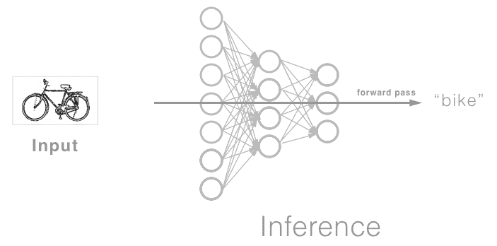

由于这些条件，单次遍历和剪枝，我们可以在性能较差的机器上执行推理，比如我们的智能手机。但为什么你想这样做呢？在边缘进行推理的优势是什么？这是下一节的主题。

# 边缘推理

对于那些不熟悉“边缘计算”这个术语的人来说，它简单指的是在网络末端或边缘进行的计算，而不是将其发送到中央服务器进行计算。边缘设备的例子包括汽车、机器人、**物联网**（**IoT**）和当然，智能手机。

在数据所在边缘进行计算的动力在于，将数据通过网络发送是昂贵且耗时的；这种产生的延迟和成本限制了我们可以提供给用户的体验。移除这些障碍将开启原本不可能的新应用。在边缘进行推理的另一个好处是数据隐私；无需通过网络传输个人数据，减少了恶意用户获取它的机会。

幸运的是，技术以惊人的速度发展，硬件和软件的改进现在使得在边缘进行推理变得可行。

由于本书的重点是 iOS 上的应用机器学习；**详细**的模型架构和训练已被有意省略，因为当前的训练需要大量的计算能力，而这对于今天的大多数边缘设备来说仍然难以达到——尽管随着边缘设备的日益强大，这种情况可能会在不久的将来改变，最有可能的下一步进展将是使用设备上存储的个人数据调整和个性化模型。

设备上机器学习的常见用例包括：

+   **语音识别**：目前通常在本地执行唤醒（或热）词检测，而不是在网络中持续传输数据。例如，“嘿，Siri”很可能是在本设备上本地执行的，一旦检测到，它将语音传输到服务器进行进一步处理。

+   **图像识别**：设备能够理解它所看到的内容，以便协助用户拍照，例如应用适当的滤镜、添加标题以便更容易找到照片以及将相似图像分组，这些功能可能不足以证明连接到远程服务器是合理的。但由于这些功能可以在本地执行，我们可以使用它们而无需担心成本、延迟或隐私问题。

+   **目标定位**：有时，知道视图中的内容以及它们在视图中的位置是有用的。这种例子可以在**增强现实**（**AR**）应用中看到，其中信息被叠加到场景上。这些体验的响应性对于其成功至关重要，因此在进行推理时需要极低的延迟。

+   **光学字符识别**：神经网络最早的商业应用之一，即使在 1989 年用于美国邮局时也依然有用。能够读取内容使得数字化物理副本或在其上进行计算成为可能；例如语言翻译或解决数独谜题。

+   **翻译**：即使没有网络连接，也能快速准确地翻译一种语言到另一种语言，这是一个重要的用例，并且补充了我们之前讨论的许多基于视觉的场景，例如增强现实和光学字符识别。

+   **手势识别**：手势识别为我们提供了一种丰富的交互模式，允许快速捷径和直观的用户交互，这可以改善和增强用户体验。

+   **文本预测**：能够预测用户将要输入的下一个单词，甚至预测用户的响应，已经将一个相当繁琐且使用起来痛苦的东西（智能手机软键盘）变成了与它的对应物（传统键盘）一样快，甚至更快。能够在设备上执行这种预测提高了您保护用户隐私和提供响应式解决方案的能力。如果请求必须路由到远程服务器，这是不可行的。

+   **文本分类**：这涵盖了从情感分析到主题发现的所有内容，并促进了许多有用的应用，例如为用户提供推荐相关内容或消除重复内容的方法。

这些用例和应用的示例可能展示了为什么我们可能想在边缘执行推理；这意味着您可以提供比在设备上执行推理更高的交互级别。它允许您在设备网络连接差或没有网络连接的情况下提供体验。最后，它是可扩展的——需求的增加并不直接与服务器负载相关。

到目前为止，我们已经介绍了推理及其在边缘执行的重要性。在下一节中，我们将介绍在 iOS 设备上促进这一功能的框架：Core ML。

# Core ML 简介

随着 iOS 11 和 Core ML 的发布，执行推理只需几行代码。在 iOS 11 之前，推理是可能的，但需要一些工作来将预训练的模型通过现有的框架（如**Accelerate**或**metal 性能着色器**（MPSes））迁移过来。**Accelerate**和 MPSes 仍然在 Core ML 的底层使用，但 Core ML 负责决定您的模型应该使用哪个底层框架（对于内存密集型任务使用 CPU 的**Accelerate**，对于计算密集型任务使用 GPU 的 MPSes）。它还负责抽象掉很多细节；这一层抽象在以下图中展示：

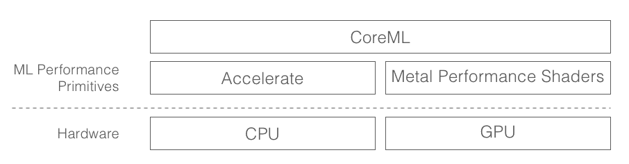

除了这些额外的层之外；iOS 11 引入并扩展了特定领域的层，这些层进一步抽象了您在处理图像和文本数据时可能使用的许多常见任务，例如人脸检测、对象跟踪、语言翻译和**命名实体识别**（NER）。这些特定领域的层封装在**视觉**和**自然语言处理**（NLP）框架中；我们在这里不会深入探讨这些框架的细节，但在后面的章节中，您将有机会使用它们：

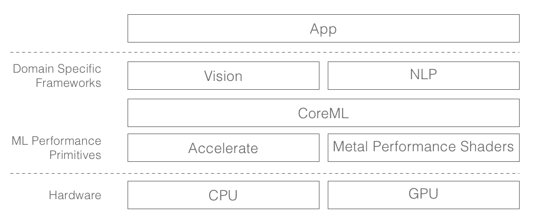

值得注意的是，这些层并不是相互排斥的，你可能会发现自己同时使用它们，特别是那些提供有用的预处理方法的特定领域框架，我们可以在将数据发送到 Core ML 模型之前使用这些方法来准备数据。

那么，Core ML 究竟是什么呢？你可以将 Core ML 视为一套工具，用于简化将机器学习模型带到 iOS 并封装在标准接口中的过程，这样你就可以轻松地在代码中访问和使用它们。现在让我们更详细地看看使用 Core ML 时的典型工作流程。

# 工作流程

如前所述，机器学习工作流程的两个主要任务包括**训练**和**推理**。训练涉及获取和准备数据，定义模型，然后进行实际训练。一旦你的模型在训练期间达到了令人满意的结果，并且能够进行适当的预测（包括对之前未见过的数据），那么你的模型就可以部署并使用训练集之外的数据进行推理。Core ML 提供了一套工具，以简化将训练好的模型导入 iOS 的过程，其中之一就是名为**Core ML Tools**的 Python 打包工具；它用于从一个众多流行的包中提取模型（包括架构和权重），并导出`.mlmodel`文件，然后可以将其导入你的 Xcode 项目中。

一旦导入，Xcode 将为模型生成一个接口，使其通过你熟悉的代码轻松访问。最后，当你构建你的应用程序时，模型将得到进一步优化并打包到你的应用程序中。生成模型的流程总结如下图所示：

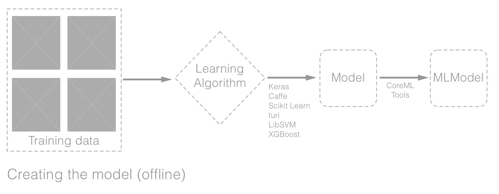

上一张图展示了创建`.mlmodel`的过程，无论是使用支持框架中的一个现有模型，还是从头开始训练。Core ML Tools 支持大多数框架，无论是内部还是第三方插件，包括 Keras、turi、Caffe、scikit-learn、LibSVN 和 XGBoost 框架。苹果公司还使这个包开源并模块化，以便于其他框架或你自己进行适配。导入模型的流程如下图所示：

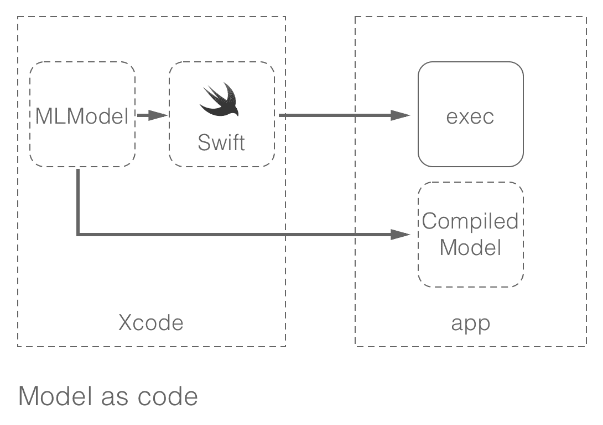

此外，还有一些与 Core ML 更紧密集成的框架，如**Turi Create**、**IBM Watson Services for Core ML**和**Create ML**，它们负责生成 Core ML 模型。

我们将在第十章介绍 Create ML；对于那些对 Turi Create 和 IBM Watson Services for Core ML 感兴趣并想了解更多信息的人，请通过以下链接访问官方网站：

Turi Create; [`github.com/apple/turicreate`](https://github.com/apple/turicreate)

IBM Watson Services for Core ML; [`developer.apple.com/ibm/`](https://developer.apple.com/ibm/)

一旦模型被导入，如前所述，Xcode 会生成一个界面，该界面封装了 **模型**、模型 **输入** 和 **输出**。你将在本书的其余部分熟悉这些内容，所以我们不会在这里进一步详细介绍。

在之前的图中，我们已经看到了训练和导入 **模型** 的工作流程——现在让我们深入了解这个模型是什么以及 Core ML 当前支持的内容。

# 学习算法

在 第一章，*机器学习简介*中，我们看到了许多不同类型的机器学习算法，并了解到机器学习实际上是一个在给定一组示例的情况下自动发现规则的过程。这个过程所需的主要组件，特别是对于监督学习，包括：

+   **输入数据点**：对于图像分类，我们需要我们想要分类的领域的图像，例如，动物。

+   **对于这些输入的预期输出**：继续我们之前关于动物图像分类的例子，预期输出可以是与每张图像关联的标签，例如，猫、狗以及更多。

+   **机器学习算法**：这是用于自动学习如何将输入数据点转换为有意义输出的算法。这些通过学习过程（称为 **训练**）推导出的规则集就是我们所说的模型。

通过一个简单的例子来具体化这些概念。

# 瑞典汽车保险

如果你还没有这样做，请导航到 [`github.com/joshnewnham/MachineLearningWithCoreML`](https://github.com/joshnewnham/MachineLearningWithCoreML) 上的存储库并下载最新代码。下载完成后，导航到 `Chapter2/Start/` 目录并打开 playground `LinearRegression.playground`。

我们将创建一个模型，该模型将根据索赔数量（x）预测所有索赔的总支付额（y）；我们将使用的数据集是瑞典的汽车保险索赔数据。它包含 2 列和 64 行，第一列包含索赔数量，第二列包含所有索赔的总支付额。以下是数据集的摘录：

| **索赔数量** | **所有索赔的总支付额（瑞典克朗千位）** |
| --- | --- |
| 108 | 329.5 |
| 19 | 46.2 |
| 13 | 15.7 |
| 124 | 422.2 |
| ... | ... |

更多详情，请访问源网站：[`college.cengage.com/mathematics/brase/understandable_statistics/7e/students/datasets/slr/frames/slr06.html`](http://college.cengage.com/mathematics/brase/understandable_statistics/7e/students/datasets/slr/frames/slr06.html)。

在 playground 脚本中，你会看到我们正在创建一个 `ScatterPlotView` 类型的视图，并将其分配给 playground 的实时视图。我们将使用这个视图来可视化模型的数据和预测：

```py
let view = ScatterPlotView(frame: CGRect(x: 20, y: 20, width: 300, height: 300))

PlaygroundPage.current.liveView = view
```

通过使用这种视图，我们可以使用 `view.scatter(dataPoints:)` 方法绘制一系列数据点，并使用 `view.line(pointA:,pointB)` 方法绘制一条线。让我们加载数据并可视化它：

```py
let csvData = parseCSV(contents:loadCSV(file:"SwedishAutoInsurance"))

let dataPoints = extractDataPoints(data: csvData, xKey: "claims", yKey: "payments")

view.scatter(dataPoints)
```

在前面的代码片段中，我们首先将数据加载到 `csvData` 变量中，然后将其转换为强类型数组 `DataPoint`（一个强类型数据对象，我们的视图所期望的）。一旦加载，我们就通过 `scatter` 方法将我们的数据传递给视图，它渲染以下输出：

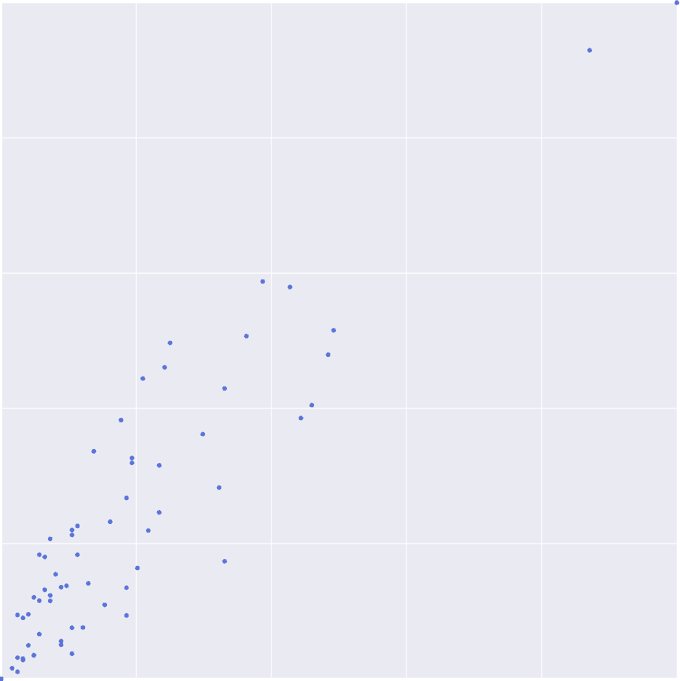

每个点代表一个单独的数据点，它与索赔数量（*x*轴）和所有索赔的总支付额（*y*轴）相对应。从这种可视化中，我们可以推断出索赔数量和所有索赔的总支付额之间的一些线性关系；也就是说，索赔数量的增加会导致所有索赔的总支付额增加。利用这种直觉，我们将尝试根据线性模型建模数据，这种模型在给定索赔数量时能够预测所有索赔的总支付额。我们在这里描述的是一种称为**简单线性回归**的算法；本质上，这只是在寻找最适合我们数据的直线。它可以描述为函数 *y = w * x + b*，其中 *y* 是所有索赔的总支付额，*x* 是索赔数量，*w* 是 *y* 和 *x* 之间的关系，而 *b* 是截距。

线性回归是一种回归模型，它将一组连续输入映射到一个连续输出上的线性函数。例如，你可能想要建模和预测**房价**；在这里，你的输入可能是**卧室数量**和**浴室数量**。使用这两个特征，你将想要找到一个可以预测房价的函数，它假设存在线性相关性。

简单易懂！我们接下来的问题是找到最适合我们数据的这条线。为此，我们将使用一种称为**梯度下降**的方法；关于梯度下降的理论和技术细节有很多书籍进行深入探讨，所以在这里我们只介绍一些背后的直觉，并留给好奇的读者去研究细节。

梯度下降是一组算法，用于最小化一个函数；在我们的情况下，它们最小化输出与实际输出之间的损失。它们通过从一个初始参数集（权重或系数）开始，并迭代调整这些参数以最小化计算出的损失来实现这一点。这些调整的方向和幅度由预测值与预期误差以及参数贡献之间的差异决定。

你可以将梯度下降视为寻找某个最小点的搜索；决定这个最小点的东西被称为**损失函数**。对我们来说，它将是我们的预测与实际索赔数量之间的绝对误差。算法通过计算我们每个变量的相对贡献（这里是指*w*和*b*）来引导。让我们通过`train`方法来看看它在代码中的样子：

```py
func train(
    x:[CGFloat],
    y:[CGFloat],
    b:CGFloat=0.0,
    w:CGFloat=0.0,
    learningRate:CGFloat=0.00001,
    epochs:Int=100,
    trainingCallback: ((Int, Int, CGFloat, CGFloat) -> Void)? = nil) -> (b:CGFloat, w:CGFloat){

    var B = b // bias
    var W = w // weight

    let N = CGFloat(x.count) // number of data points

    for epoch in 0...epochs{
        // TODO: create variable to store this epoch's gradient for b and w
        for i in 0..<x.count{
            // TODO: make a prediction (using the linear equation y = b + x * w
            // TODO: calculate the absolute error (prediction - actual value)
            // TODO: calculate the gradient with respect to the error and b (); adding it to the epochs bias gradient
            // TODO: calculate the gradient with respect to the error and w (); adding it to the epochs weight gradient
        }
        // TODO: update the bias (B) using the learningRate
        // TODO: update the weight (W) using the learningRate
        if let trainingCallback = trainingCallback{
            trainingCallback(epoch, epochs, W, B)
        }
    }

    return (b:B, w:W)
}   
```

我们的`train`方法接受以下参数：

+   `x`：一个包含索赔数量的`DataPoint`数组

+   `y`：一个包含总支付次数的`DataPoint`数组

+   `b`：这是在我们的线性函数中用于开始搜索的随机值

+   `w`：在我们的线性函数中用于开始搜索的另一个随机值

+   `learningRate`：我们调整权重的速度

+   `epochs`：我们迭代的次数，也就是说，进行预测，并根据预测值和期望值之间的差异调整我们的系数

+   `trainingCallback`：这个函数在每个时代之后被调用以报告进度

接下来，我们创建一些将在整个训练过程中使用的变量，并开始搜索（`for epoch in 0...epochs`）。让我们逐步通过每个`TODO`并将它们替换为相应的代码。

首先，我们创建两个变量来保存变量`b`和`w`的梯度（这些是我们需要对其各自的系数进行调整以最小化损失，也称为**绝对误差**）：

```py
// TODO: create variable to store this epoch's gradient for b and w
var bGradient : CGFloat = 0.0
var wGradient : CGFloat = 0.0
```

接下来，我们遍历每个数据点，并对每个数据点进行预测，然后计算绝对误差：

```py
// TODO: make a prediction (using the linear equation y = b + x * w
let yHat = W * x[i] + B
// TODO: calculate the absolute error (prediction - actual value)
let error = y[i] - yHat
```

现在，计算关于误差的偏导数。将这视为引导搜索正确方向的方法，也就是说，计算这个值给我们提供了改变`b`和`w`以最小化我们的误差所需的**方向**和**大小**：

注意，这是在遍历所有数据点之后完成的；也就是说，它受到所有数据点的影响。另一种选择是针对每个数据点或子集（称为**批次**）执行此更新。

```py
// TODO: calculate the gradient with respect to the error and b (); adding it to the epochs bias gradient
B = B - (learningRate * bGradient)

// TODO: calculate the gradient with respect to the error and w (); adding it to the epochs weight gradient 
W = W - (learningRate * wGradient)
```

在遍历每个数据点之后，我们使用它们的累积梯度调整系数`B`和`W`。

每经过一个时代，就会调用`trainingCallback`来使用当前模型的系数（其当前最佳拟合线，该线适合数据）绘制一条线；这个过程在下面的图中显示：

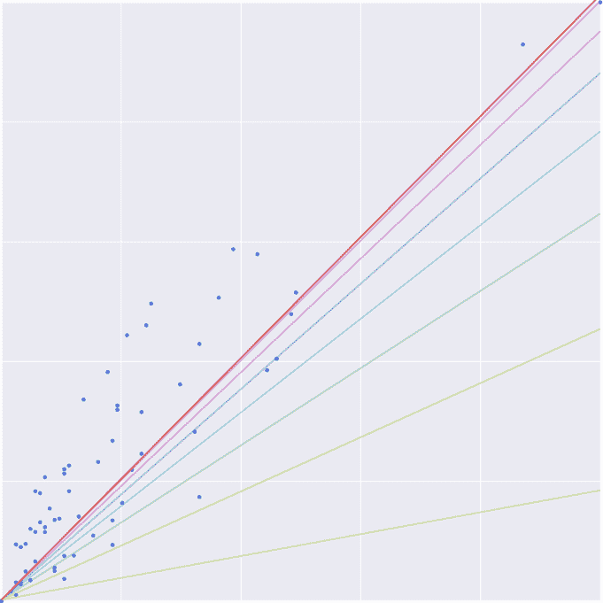

诚然，没有关键信息很难解释！但希望模式会很明显；随着每次迭代的进行，我们的线将更好地拟合数据。经过 100 个时代后，我们得到这个模型：

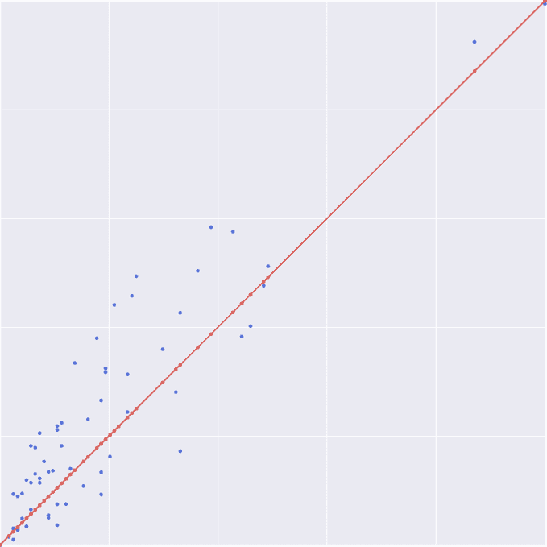

描述这条线的函数是`y = 0.733505317339142 + 3.4474988368438 * x`。使用这个模型，我们可以根据**索赔数量**（只需将*x*替换为**索赔数量**）预测**所有索赔的总支付额**。

# 支持的学习算法

在前面的例子中，我们使用**线性回归**（算法）构建了一个模型，该模型根据索赔数量（输入）预测所有索赔的总支付额（输出）。这是许多机器学习算法之一；以下图表中绘制了一些算法，分为**无监督**或**监督**，以及**连续**或**分类**：

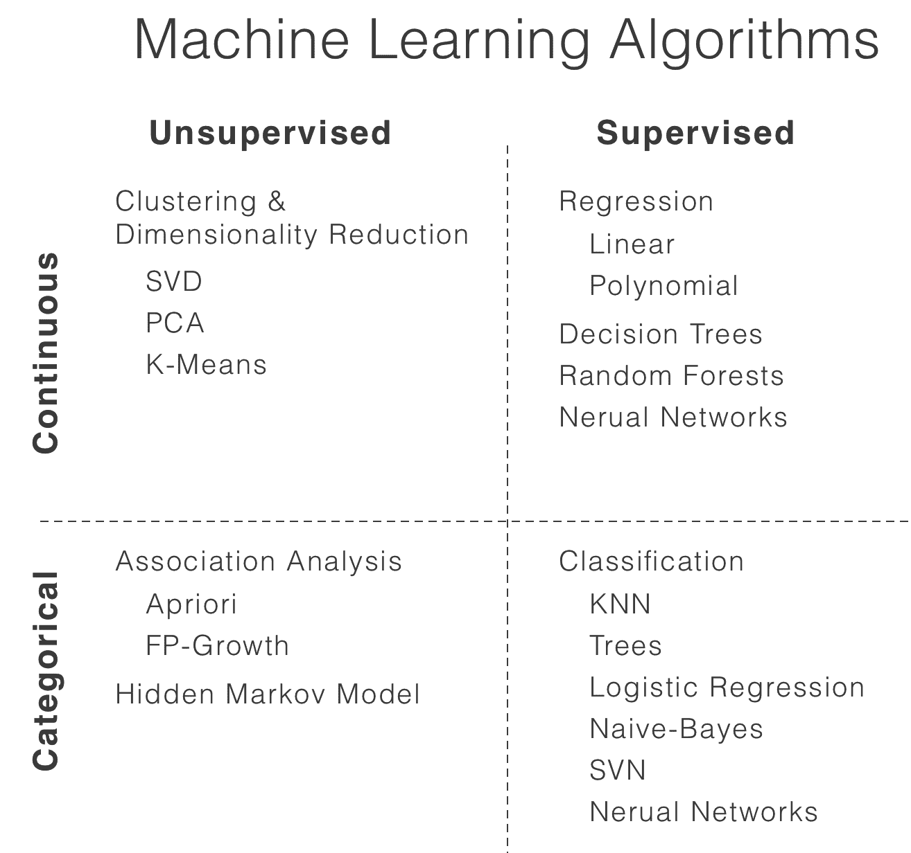

创建 Core ML 模型的过程涉及将模型从源框架转换为可以在 iOS 上运行的形式。以下图表显示了 Core ML 目前支持的学习算法：

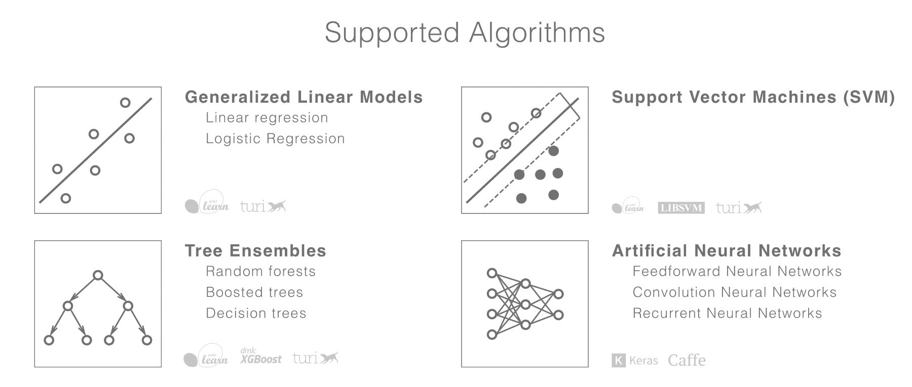

支持的算法和神经网络应该足够灵活，以适应大多数机器学习任务，但鉴于这个领域发展迅速，你不可避免地会遇到一些不受支持的算法。苹果公司已经预见到这一点，并提供了两种扩展框架的协议；`MLCustomLayer`可用于创建自定义层（我们将在后续章节中介绍）和`MLCustomModel`用于创建自定义模型。

这可能让你对 Core ML 在一般机器学习工作流程中的位置以及苹果为何做出这些设计决策有了些了解。我们将通过查看在 iOS 设备上处理机器学习时的一些高级考虑因素来结束本章，或者更普遍地说，在总结之前，关注边缘计算。

# 考虑因素

在边缘执行机器学习时，你会失去在更强大的设备上运行时通常拥有的某些奢侈（尽管这一切都在不断变化）。以下是一些需要记住的考虑因素：

+   **模型大小**：之前，我们介绍了构建一个简单的线性回归模型。该模型本身由两个浮点数（偏差和权重系数）组成，当然在内存需求方面是可以忽略不计的。但是，当你深入到深度学习的世界时，你会发现模型的大小通常是几百兆字节。例如，VGG16 模型是一个 16 层的传统神经网络架构，在用于图像分类的 ImageNet 数据集上训练，可在苹果网站上找到。它的大小正好超过 500 兆字节。目前，苹果允许应用的大小为 2 吉字节，但要求用户下载如此大的文件可能会让他们望而却步。

+   **内存**：你需要注意的不仅仅是可执行文件的大小，还有可用的工作内存量。桌面机器通常具有 16-32 吉字节的内存，但最新 iPhone（iPhone 8）的内存仅为 2 吉字节——对于一个移动设备来说非常令人印象深刻，但与其对应设备相比，差距很大。这种限制可能会决定你选择哪种模型，而不是它在磁盘上占用的内存量。还值得一提的是，你需要加载到内存中的不仅仅是模型权重；你还需要加载任何标签数据，当然，还有你正在执行推理的输入数据。

+   **速度**：这当然与模型大小（在正常情况下）相关，并适用于您的特定用例。只需记住，执行推理只是工作流程的一部分。您还需要考虑预处理和后处理任务，例如加载和预处理输入数据。在某些情况下，您可能需要在准确性和性能、大小之间进行权衡。

+   **支持算法和数据类型**：在前一节中，我们介绍了 Core ML 当前支持的算法。除此之外，Core ML 还支持一部分数据类型，以下表格中为了方便起见进行了总结：

| **输入类型** | **数据类型** |
| --- | --- |
| 数字 | `Double`, `Int64` |
| 类别 | `String`, `Int64` |
| 图像 | `CVPixelBuffer` |
| 数组 | `MLMultiArray` |
| 字典 | `[String : Double]`, `[Int64, Double]` |

在这里，我们仅从高层次上介绍了在移动设备上执行机器学习时的一些考虑因素。具体细节将取决于您的用例和可用的模型，但值得将这些考虑因素放在心中，并提醒自己，尽管这些设备功能强大，但它们仍然是移动设备。它们运行在电池上，因此需要考虑通常对移动项目所需的典型考虑和优化。对于计划创建自己模型的人来说，这些考虑因素尤为重要，如果您的计划是利用机器学习。

# 摘要

在本章中，我们讨论了训练和推理之间的区别，以及典型的机器学习工作流程以及 Core ML 如何融入其中。我们还看到了 Core ML 不仅仅是一个框架，而是一套工具，它有助于将预训练模型引入 iOS 平台，并通过熟悉且简单的界面使它们对您的应用程序可用。因此，它使机器学习民主化，并将其交到许多 iOS 应用开发者的手中。

有观点认为，各种应用的激增有助于智能手机采用的成功；如果这是真的，那么请准备好迎接下一个增强型 AI 应用的爆炸式增长。并且请放心，您正处于开始和引领这一旅程的完美位置，我们将探索许多与 Core ML 相关的计算机视觉概念和示例，包括以下内容：

+   通过摄像头视频流识别物体

+   利用目标检测构建智能图像搜索，允许您搜索具有特定物体及其相对位置的图像

+   识别面部表情并推断人的情绪状态

+   使用卷积神经网络识别手绘草图，然后使用循环神经网络

+   学习 Prisma 风格转换背后的秘密并实现自己的版本

+   最后，使用图像分割创建动作镜头效果

有很多内容需要了解，让我们开始吧！
