# 第一章：引言 - 机器学习与统计学

机器学习无疑是近年来讨论最多的领域之一，而且有充分的理由。每天都有新的应用和模型被发现，世界各地的研究人员每天都在宣布在结果质量方面的令人印象深刻的进展。

每天都有许多新的从业者决定参加课程并寻找入门材料，以便他们可以使用这些新可用的技术来改进他们的应用。但在许多情况下，机器学习的整个体系，如文献中通常所解释的，需要良好的数学概念理解作为先决条件，从而为程序员设置了很高的门槛，而程序员通常具有良好的算法技能，但对高等数学概念不太熟悉。

这第一章将是对该领域的总体介绍，涵盖机器学习的主要研究领域，并会概述基本的统计学、概率论和微积分，同时通过源代码示例，以允许你实验所提供的公式和参数的方式呈现。

在这一章中，你将学习以下主题：

+   什么是机器学习？

+   机器学习领域

+   统计学和概率论的基本要素

+   微积分的基本要素

我们周围的世界提供了大量的数据。在基本层面上，我们不断地从周围的文本、图像、声音和其他类型的信息中获取和吸收知识。因此，数据的可用性是获取执行任务技能的过程中的第一步。

世界各地有成千上万的计算设备收集和存储了大量的基于图像、视频和文本的信息。因此，学习的原材料显然是丰富的，并且以计算机可以处理的形式提供。

这本书所讨论的学科崛起的起点：研究允许计算机从数据中学习而不需要明确编程的技术和方法。

机器学习的更正式定义，来自*汤姆·米切尔*，如下所示：

“如果一个计算机程序在任务 T 和性能度量 P 方面，通过经验 E 学习，那么它的性能随着经验 E 的提高而提高。”

这个定义是完整的，并重新确立了在每一个机器学习项目中扮演角色的要素：要执行的任务、连续的实验以及清晰和适当的性能度量。用更简单的话说，我们有一个程序，它根据经验并在一定标准的指导下改进其完成任务的方式。

# 机器学习在大图景中的位置

机器学习作为一个学科，不是一个孤立的领域——它被包含在一个更广泛的领域内，即**人工智能**（**AI**）。但正如你可以猜到的，机器学习并不是凭空出现的。作为一个学科，它有其前辈，并且它已经按照越来越复杂的阶段在以下四个明显区分的步骤中不断发展：

1.  机器学习的第一个模型涉及基于规则的决策和基于数据算法的简单级别，它本身包括所有可能的后果和决策规则，作为先决条件，意味着所有可能的选项都将由该领域的专家事先硬编码到模型中。这种结构在 1950 年第一代编程语言出现以来的大多数应用中得到了实施。这类算法处理的主要数据类型和函数是布尔类型，因为它专门处理是或否的决策。

1.  在统计推理的第二发展阶段，我们开始让数据的概率特性发挥作用，除了之前预先设定的选择。这更好地反映了现实世界问题的模糊性，在这些问题中，异常值很常见，而且比固定的提问方式更重要的是考虑数据的非确定性倾向。这个学科向数学工具的混合体中增加了**贝叶斯概率理论**的元素。属于这一类的方法包括曲线拟合（通常是线性或多项式），它具有与数值数据一起工作的共同特性。

1.  机器学习阶段是我们将在整本书中工作的领域，它涉及比上一阶段最简单的贝叶斯元素更复杂的任务。

    机器学习算法最突出的特点是它们可以从数据中泛化模型，但模型能够生成自己的特征选择器，这些选择器不受刚性目标函数的限制，因为它们是在训练过程中生成和定义的。这类模型的另一个不同之处在于，它们可以接受大量不同类型的数据作为输入，例如语音、图像、视频、文本以及其他可以表示为向量的数据。

1.  人工智能是抽象能力规模中的最后一步，在某种程度上包括所有之前的算法类型，但有一个关键的区别：人工智能算法能够将学习到的知识应用于解决训练期间从未考虑过的任务。与此算法一起工作的数据类型甚至比机器学习支持的数据类型更通用，并且根据定义，它们应该能够将解决问题的能力从一个数据类型转移到另一个数据类型，而无需对模型进行完全重新训练。这样，我们就可以开发一个用于黑白图像目标检测的算法，并且模型可以将知识抽象出来，将模型应用于彩色图像。

在以下图表中，我们表示了这些四个向真实人工智能应用发展的阶段：

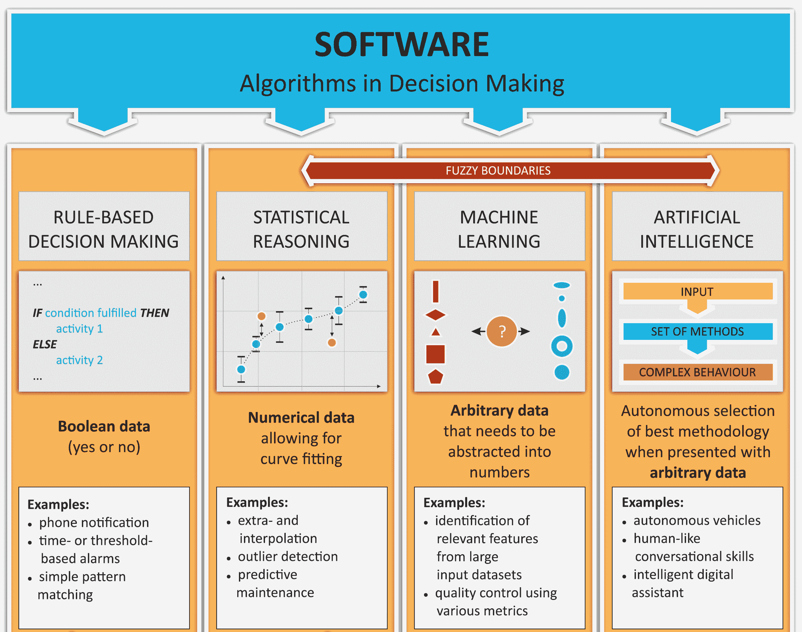

# 机器学习的类型

让我们尝试剖析不同类型的机器学习项目，从实施者的角度出发，从先前知识等级开始。项目可以是以下类型：

+   **监督学习**：在这种学习类型中，我们被提供一组真实数据的样本集，以及模型应用后应给出的结果。在统计术语中，我们有所有训练集实验的结果。

+   **无监督学习**：这种学习类型仅提供问题域中的样本数据，但将相似数据分组并应用类别的任务没有先前信息可以从中推断。

+   **强化学习**：这种学习类型没有标记的样本集，并且参与元素的数量不同，包括代理、环境和学习最优策略或步骤集，通过使用奖励或惩罚（每次尝试的结果）来最大化以目标为导向的方法。

看一下以下图表：

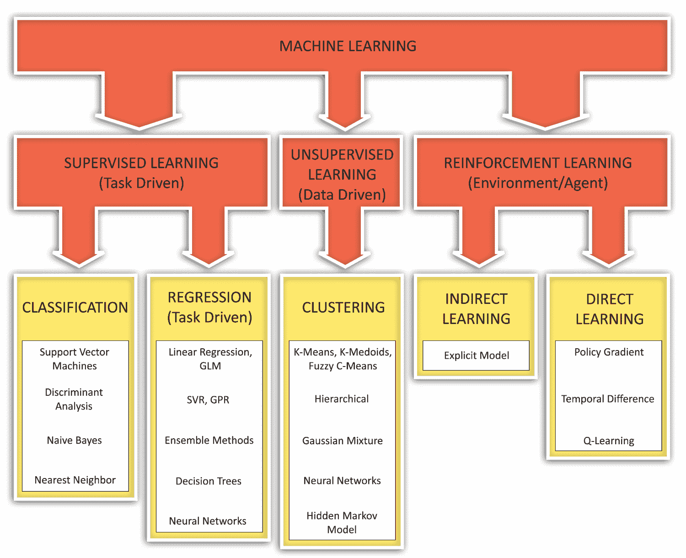

机器学习的主要领域

# 监督等级

学习过程支持监督领域的逐步步骤：

+   无监督学习没有关于任何样本的类别或值的先验知识，它应该自动推断。

+   半监督学习需要已知样本的种子，模型从该种子推断剩余样本的类别或值。

+   监督学习：这种方法通常包括一组已知样本，称为训练集，另一组用于验证模型的泛化能力，第三组，称为测试集，在训练过程之后使用，以获得训练集之外的独立样本数量，并保证测试的独立性。

在以下图表中，描述了提到的方法：

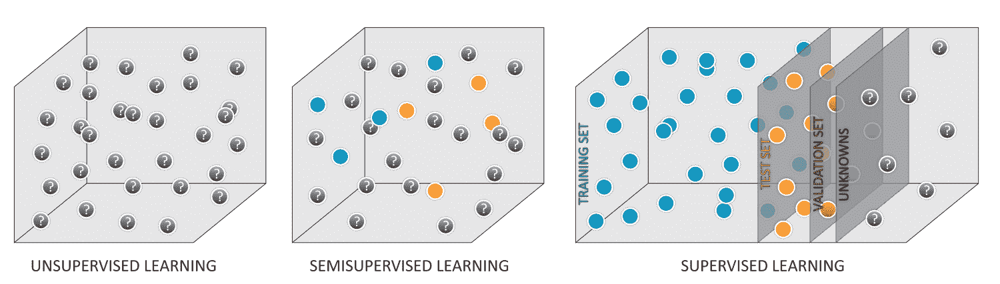

无监督学习、半监督学习和监督学习的训练技术的图形表示

# 监督学习策略 - 回归与分类

这种学习类型有两个主要问题类型需要解决：

+   **回归问题**：这类问题接受问题域中的样本，并在训练模型后，通过比较输出与真实答案来最小化误差，这允许在给定一个新未知样本时预测正确答案

+   **分类问题**：这类问题使用领域中的样本为新未知样本分配标签或组

# 无监督问题解决——聚类

大多数无监督问题解决都是通过观察项的相似性或共享特征的价值来对项进行分组，因为没有关于先验类别的确切信息。这种技术被称为聚类。

在这些主要问题类型之外，还存在两者的混合，这被称为半监督问题解决，其中我们可以在训练时训练一组标记的元素，并使用推理将信息分配给未标记数据。为了将数据分配给未知实体，使用了三个主要标准——平滑性（彼此靠近的点属于同一类）、聚类（数据倾向于形成簇，这是平滑性的特殊情况）和流形（数据属于比原始领域维度低得多的流形）。

# 交易工具——编程语言和库

由于本书的目标读者是开发者，我们认为使用真实代码解释数学概念的方法是自然而然的选择。

在选择代码示例的编程语言时，最初的方法是使用多种技术，包括一些前沿的库。在咨询社区后，很明显，在解释概念时，简单语言会更受欢迎。

在选项中，理想的候选者将是一种易于理解的语言，具有现实世界的机器学习采用，并且也相关。

对于这项任务，最明显的候选者是 Python，它满足了所有这些条件，尤其是在过去几年中，它已经成为了机器学习的首选语言，无论是对于新手还是专业从业者。

在下面的图表中，我们比较了机器学习编程语言领域的先前明星 R，我们可以清楚地得出使用 Python 的巨大、有利趋势。这意味着在这本书中学到的技能现在和可预见的未来都将相关：

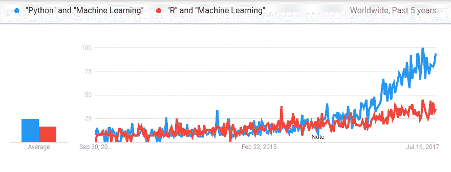

机器学习领域的 R 和 Python 的兴趣图。

除了 Python 代码外，我们还将得到 Python 生态系统中一些最著名的数值、统计和图形库的帮助，即 pandas、NumPy 和 matplotlib。对于**深度神经网络**示例，我们将使用 Keras 库，以 TensorFlow 作为后端。

# Python 语言

Python 是一种通用脚本语言，由荷兰程序员 Guido Van Rossum 于 1989 年创建。它具有非常简单的语法和极大的可扩展性，这得益于其众多的扩展库，使其非常适合原型设计和通用编码。由于其本地的 C 绑定，它也可以成为生产部署的候选者。

这种语言实际上被用于各种领域，从网络开发到科学计算，以及作为通用脚本工具的使用。

# NumPy 库

如果我们必须选择本书中必须使用的库，以及用 Python 编写的非平凡数学应用，那它必须是 NumPy。这个库将帮助我们使用以下组件实现统计和线性代数应用：

+   一种多功能的 N 维数组对象，性能出色

+   许多可以无缝应用于这些数组的数学函数

+   线性代数基本操作

+   随机数分布和强大的统计软件包

+   与所有主要的机器学习软件包兼容

本书将广泛使用 NumPy 库，利用其许多基本操作来简化代码中的概念解释。

# matplotlib 库

数据绘图是数据科学的一个基本组成部分，通常是分析师执行的第一步，以了解提供的数据集中发生了什么。

因此，我们需要一个非常强大的库来能够绘制输入数据，并且也要能够表示结果输出。在本书中，我们将使用 Python 的 matplotlib 库来描述概念和模型的结果。

# 那么，什么是 matplotlib？

Matplotlib 是一个广泛使用的绘图库，特别设计用于 2D 图表。从这个库中，我们将专注于使用`pyplot`模块，它是 matplotlib API 的一部分，具有 MATLAB 类似的方法，并直接支持 NumPy。对于那些不熟悉 MATLAB 的人来说，它已经数十年来是科学和工程领域的默认数学笔记本环境。

描述的方法将被用来展示涉及的大多数概念，实际上，读者只需使用这两个库和提供的代码，就能生成本书中的许多示例。

# Pandas

**Pandas**通过一种特殊的结构，称为`DataFrame`，补充了之前提到的库，并添加了许多统计和数据操作方法，例如 I/O，用于多种不同格式，如切片、子集、处理缺失数据、合并和重塑等。

`DataFrame` 对象是整个库中最有用的特性之一，它提供了一个特殊的二维数据结构，列可以是不同的数据类型。其结构非常类似于数据库表，但沉浸在灵活的编程运行时和生态系统中，如 SciPy。这些数据结构也与 NumPy 矩阵兼容，因此我们可以以最小的努力对数据进行高性能操作。

# SciPy

**SciPy** 是一组非常实用的科学 Python 库，包括 NumPy、pandas、matplotlib 等，但它也是生态系统中的核心库，我们可以通过它执行许多额外的基本数学运算，例如积分、优化、插值、信号处理、线性代数、统计学和文件 I/O。

# Jupyter 笔记本

**Jupyter** 是一个成功的基于 Python 的项目例子，它也是我们将要使用的最强大的工具之一，通过代码探索和理解数据。

Jupyter 笔记本是由代码、图形或格式化文本交织的单元格组成的文档，从而形成一个非常灵活和强大的研究环境。所有这些元素都被一个方便的 Web 界面所包裹，该界面与 **IPython** 交互式解释器交互。

一旦加载了 Jupyter 笔记本，整个环境和所有变量都存储在内存中，可以更改和重新定义，从而允许研究和实验，如下面的截图所示：

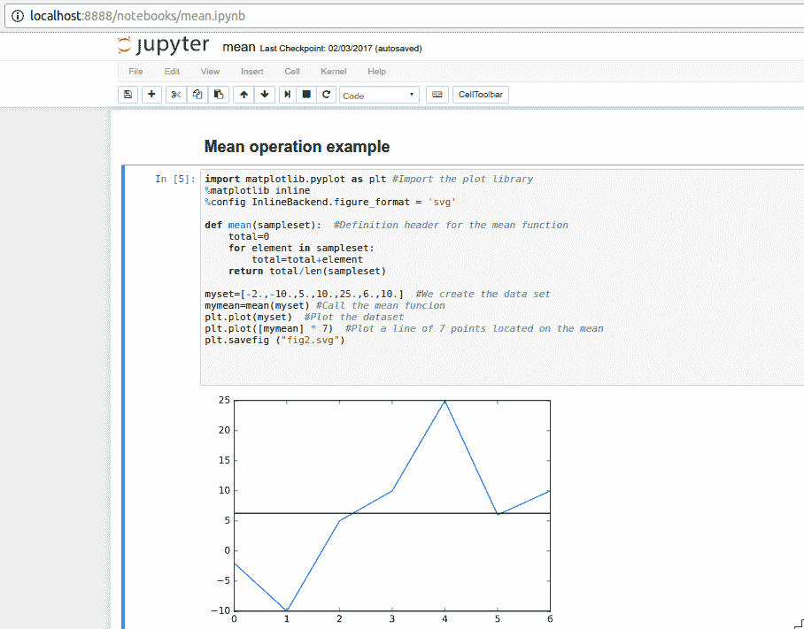

Jupyter 笔记本

这个工具将是本书教学过程中的一个重要部分，因为大多数 Python 示例都将以这种格式提供。在本书的最后一章，你可以找到完整的安装说明。

安装完成后，你可以进入你的笔记本所在的目录，然后通过输入 `jupyter notebook` 来调用 Jupyter。

# 基本数学概念

正如我们在前面的章节中看到的，本书的主要目标受众是希望理解机器学习算法的开发者。但为了真正掌握其背后的动机和原因，有必要回顾和构建所有基本推理，这包括统计学、概率论和微积分。

我们将首先从统计学的一些基础知识开始。

# 统计学 - 模型不确定性的基本支柱

统计学可以被定义为一种学科，它使用数据样本来提取和支撑对更大数据样本的结论。鉴于机器学习包括数据属性研究和数据赋值的大部分，我们将使用许多统计概念来定义和证明不同的方法。

# 描述性统计学 - 主要操作

在接下来的章节中，我们将开始定义统计学领域的根本操作和度量，以便能够从基本概念出发。

# 平均值

这是统计学中最直观且最常用的概念之一。给定一组数字，该组数字的均值是所有元素的总和除以该组中元素的数量。

表示均值的公式如下：

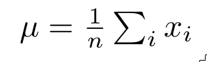

尽管这是一个非常简单的概念，但我们将编写一个 Python 代码示例，我们将创建一个样本集，将其表示为线形图，并将整个集的均值标记为一条线，这条线应该位于样本的加权中心。这将作为 Python 语法的介绍，也是实验 Jupyter 笔记本的一种方式：

```py
    import matplotlib.pyplot as plt #Import the plot library 

    def mean(sampleset):  #Definition header for the mean function 
        total=0 
        for element in sampleset: 
            total=total+element 
        return total/len(sampleset) 

    myset=[2.,10.,3.,6.,4.,6.,10.]  #We create the data set 
    mymean=mean(myset) #Call the mean funcion 
    plt.plot(myset)  #Plot the dataset 
    plt.plot([mymean] * 7)  #Plot a line of 7 points located on the mean 
```

该程序将输出数据集元素的时序，然后绘制一条均值高度的线。

如下所示，均值是描述样本集趋势的一种简洁（一个值）方式：

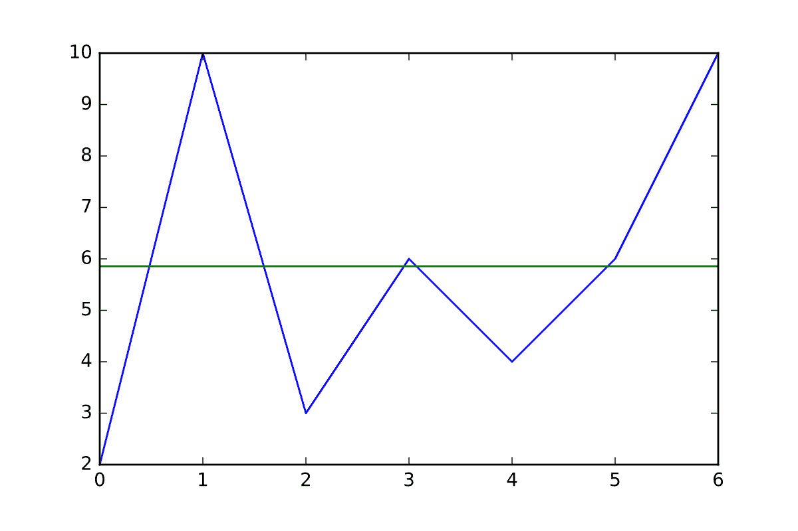

在这个第一个例子中，我们处理的是一个非常均匀的样本集，因此均值对其值非常有信息量。但让我们尝试使用一个非常分散的样本集进行相同的操作（也鼓励您尝试调整这些值）：

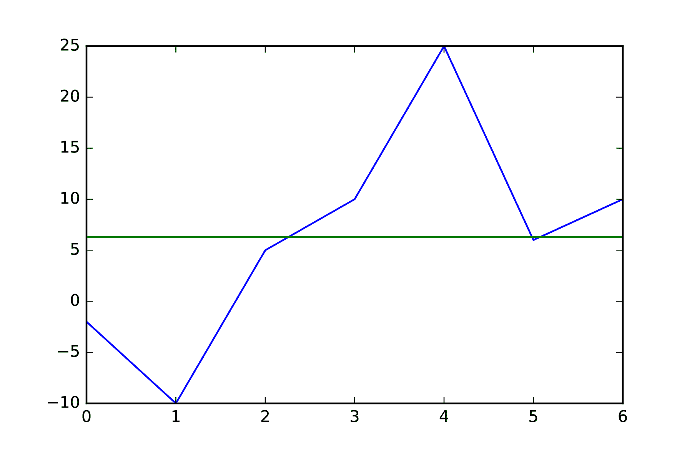

# 方差

正如我们在第一个例子中看到的，均值不足以描述非均匀或非常分散的样本。

为了添加一个描述样本集值分散程度的唯一值，我们需要查看方差的概念，这需要从样本集的均值开始，然后平均样本与提供的均值的距离。方差越大，样本集越分散。

方差的经典定义如下：

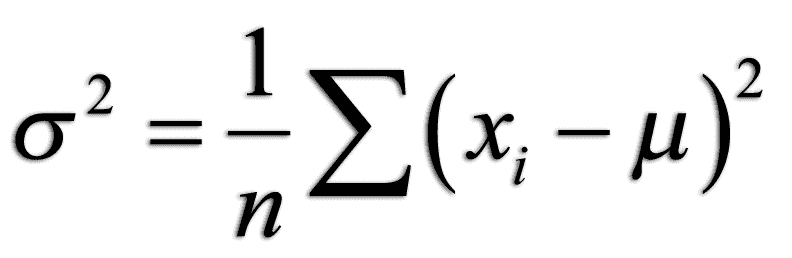

让我们编写以下示例代码片段来阐述这一概念，采用之前使用的库。为了清晰起见，我们重复声明`mean`函数：

```py
    import math #This library is needed for the power operation 
    def mean(sampleset):  #Definition header for the mean function 
        total=0 
        for element in sampleset: 
            total=total+element 
        return total/len(sampleset) 

    def variance(sampleset):  #Definition header for the mean function 
        total=0 
        setmean=mean(sampleset) 
        for element in sampleset: 
            total=total+(math.pow(element-setmean,2)) 
        return total/len(sampleset) 

    myset1=[2.,10.,3.,6.,4.,6.,10.]  #We create the data set 
    myset2=[1.,-100.,15.,-100.,21.] 
    print "Variance of first set:" + str(variance(myset1)) 
    print "Variance of second set:" + str(variance(myset2)) 

```

上述代码将生成以下输出：

```py
    Variance of first set:8.69387755102
    Variance of second set:3070.64
```

如您所见，第二个集合的方差由于实际分散的值而要高得多。我们计算平方距离的均值有助于真正突出差异，因为它是一个二次运算。

# 标准差

标准差简单来说是一种使均值平方的平方性质正规化的方法，有效地线性化这一项。这种度量对于其他更复杂的操作可能是有用的。

这是标准差的官方形式：

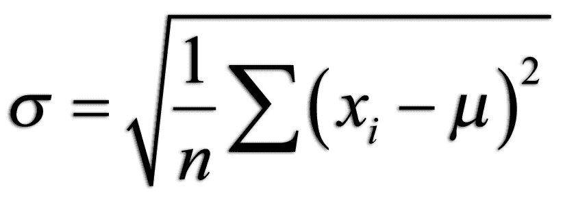

# 概率和随机变量

我们现在将要研究理解本书所有概念所需的最重要学科。

**概率**是一门数学学科，其主要任务是研究随机事件。在更实用的定义中，概率通常试图量化与事件相关联的确定性（或相反，不确定性）的水平，从可能发生的事件的总体中。

# 事件

为了理解概率，我们首先需要定义事件。事件是在一个实验中，我们执行一个具有不同可能结果的确定动作，该实验的所有可能结果的一个子集。

事件的一些例子是特定骰子的数字出现，以及在装配线上出现特定类型的产品缺陷。

# 概率

根据前面的定义，概率是事件发生的可能性。概率被量化为一个介于*0*和*1*之间的实数，并且当事件发生的可能性增加时，分配的概率*P*趋向于*1*。

事件发生的概率的数学表达式是`P(E)`。

# 随机变量和分布

在分配事件概率时，我们也可以尝试覆盖整个样本，并为样本域的每个可能结果分配一个概率值。

这个过程确实具有函数的所有特征，因此我们将有一个随机变量，它将为每个可能的事件结果都有一个值。我们将把这个函数称为随机函数。

这些变量可以是以下两种类型之一：

+   **离散**：如果结果的数量是有限的，或者可数的无限。

+   **连续**：如果结果集属于一个连续区间。

这个概率函数也被称为**概率分布**。

# 有用的概率分布

在多种可能的概率分布中，有许多函数因其特殊的性质或它们代表的流行问题而被研究和分析。

我们将描述那些对机器学习发展有特殊影响的最常见的分布。

# 伯努利分布

让我们从一种简单的分布开始：一种具有二元结果，并且非常类似于抛掷一枚（公平的）硬币的分布。

这个分布代表一个事件，该事件以概率*p*（我们称之为*正面*）取值为*1*，以概率*1-p*（我们称之为*反面*）取值为*0*。

为了可视化这一点，让我们使用`np`生成大量伯努利分布的事件，并绘制这个分布的趋势，以下只有两种可能的结果：

```py
    plt.figure() 
    distro = np.random.binomial(1, .6, 10000)/0.5 
    plt.hist(distro, 2 , normed=1) 
```

下面的图表通过直方图显示了二项分布，展示了结果概率的互补性质：

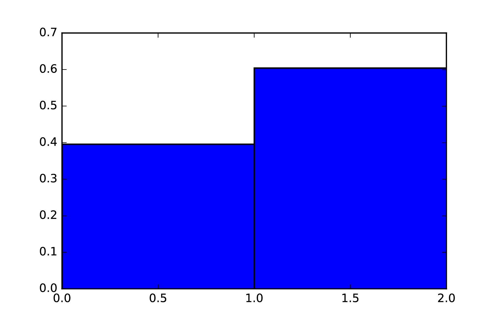

二项分布

因此，在这里我们看到可能结果的补集概率的非常明显的趋势。现在让我们用更多的可能结果来补充模型。当它们的数量大于 2 时，我们谈论的是**多项分布**：

```py
    plt.figure()
    distro = np.random.binomial(100, .6, 10000)/0.01 
    plt.hist(distro, 100 , normed=1) 
    plt.show() 
```

看一下下面的图表：

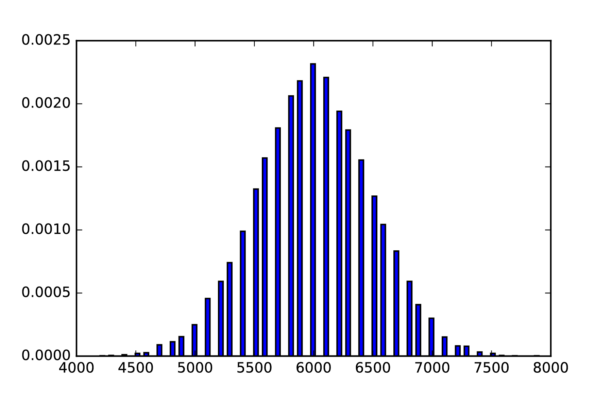

有 100 个可能结果的多项分布

# 均匀分布

这个非常常见的分布是我们将看到的第一个连续分布。正如其名所示，它在域的任何区间上都有恒定的概率值。

为了积分到 1，*a*和*b*是函数的极值，这个概率的值为*1/(b-a)*。

让我们使用以下代码生成一个具有非常规则直方图的样本均匀分布的图表：

```py
    plt.figure() 
    uniform_low=0.25 
    uniform_high=0.8 

    plt.hist(uniform, 50, normed=1) 
    plt.show() 
```

看一下下面的图表：

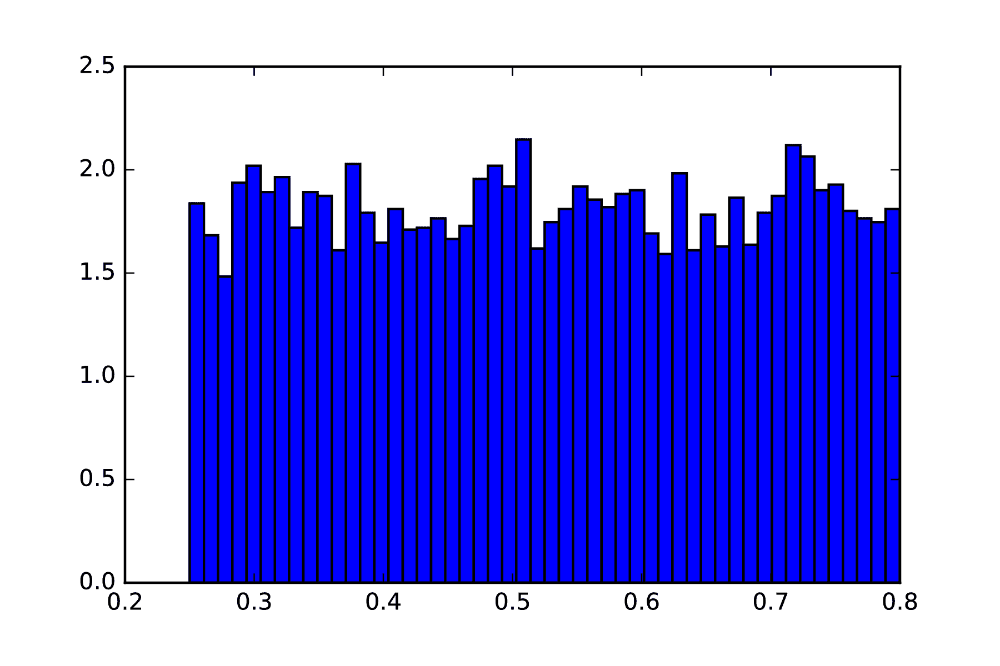

均匀分布

# 正态分布

这个非常常见的连续随机函数，也称为**高斯**函数，可以用均值和方差这样的简单度量来定义，尽管形式上有些复杂。

这是函数的规范形式：

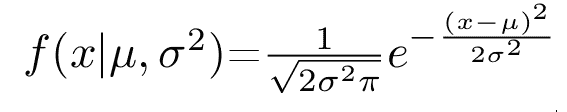

看一下下面的代码片段：

```py
    import matplotlib.pyplot as plt #Import the plot library 
    import numpy as np 
    mu=0\. 
    sigma=2\. 
    distro = np.random.normal(mu, sigma, 10000) 
    plt.hist(distro, 100, normed=True) 
    plt.show() 
```

下面的图表显示了生成的分布的直方图：

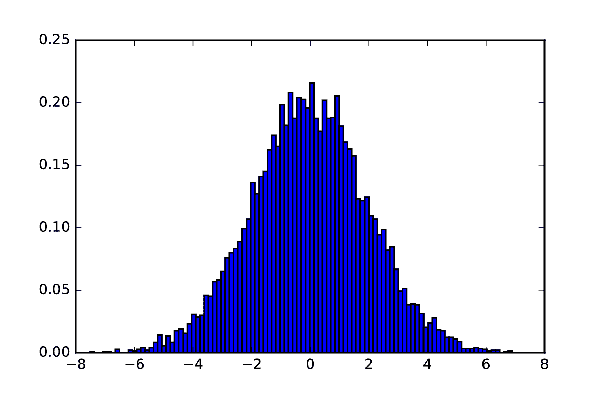

正态分布

# 逻辑分布

这个分布与正态分布相似，但形态上的差异是尾部更细长。这个分布的主要重要性在于它的**累积分布函数**（CDF），我们将在接下来的章节中使用，并且肯定会看起来很熟悉。

让我们首先使用以下代码片段来表示基本分布：

```py
    import matplotlib.pyplot as plt #Import the plot library 
    import numpy as np 
    mu=0.5 
    sigma=0.5 
    distro2 = np.random.logistic(mu, sigma, 10000) 
    plt.hist(distro2, 50, normed=True) 
    distro = np.random.normal(mu, sigma, 10000) 
    plt.hist(distro, 50, normed=True) 
    plt.show() 
```

看一下下面的图表：

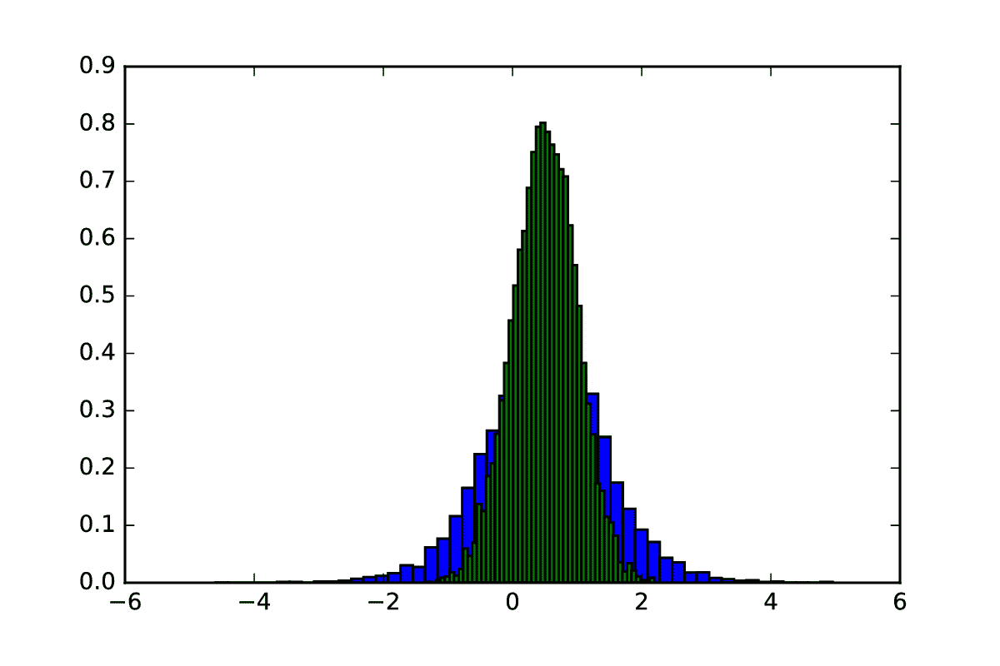

逻辑分布（红色）与正态分布（蓝色）

然后，如前所述，让我们计算逻辑分布的累积分布函数（CDF），这样你将看到一个非常熟悉的图形，**S 型**曲线，我们将在回顾神经网络激活函数时再次看到：

```py
    plt.figure() 
    logistic_cumulative = np.random.logistic(mu, sigma, 10000)/0.02 
    plt.hist(logistic_cumulative, 50, normed=1, cumulative=True) 
    plt.show() 
```

看一下下面的图表：

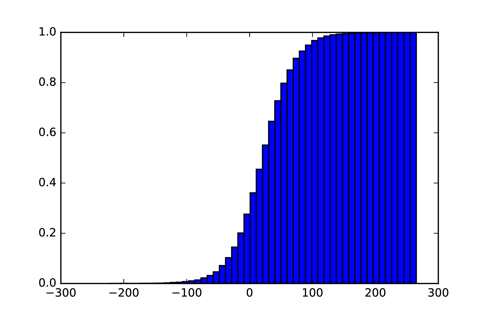

逻辑分布的倒数

# 概率函数的统计量

在本节中，我们将看到可以应用于概率的最常见的统计量。第一组度量是均值和方差，它们与我们看到的统计学介绍中的定义没有区别。

# 偏度

这个度量表示横向偏差，或者更一般地说，是从中心偏离，或者概率分布的对称性（或缺乏对称性）。一般来说，如果偏度为负，则表示向右偏离，如果为正，则表示向左偏离：

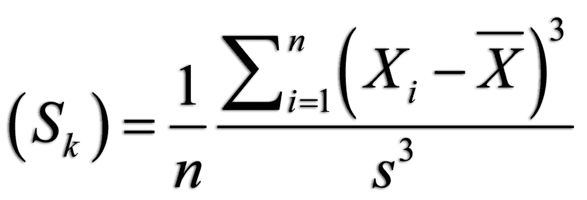

看一下下面的图表，它描述了偏度的统计分布：

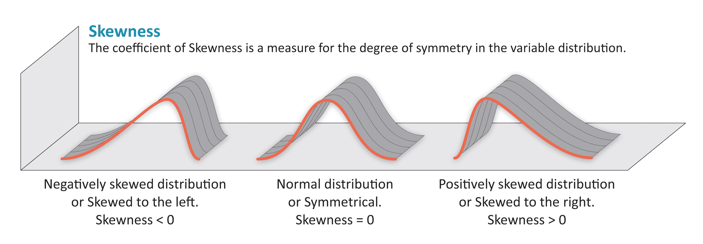

分布形状如何影响偏度的描述。

# 峰度

**峰度**给我们一个关于分布集中趋势的概念，定义了中心区域有多尖锐，或者相反——函数的尾部分布有多分散。

峰度的公式如下：

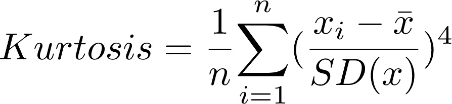

在下面的图表中，我们可以清楚地看到我们正在学习的新的度量如何直观地理解：

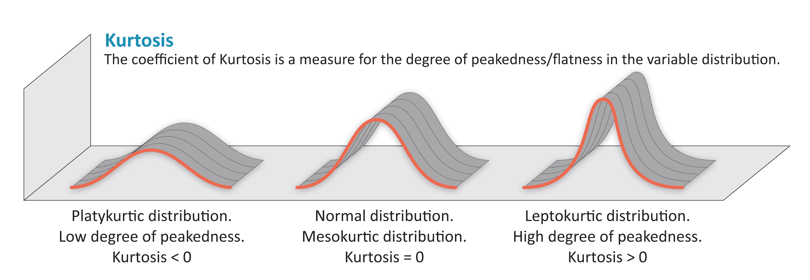

分布形状如何影响峰度的描述。

# 微分学元素

为了涵盖机器学习的基本知识，特别是如梯度下降这样的学习算法，我们将向您介绍微分学中涉及的概念。

# 基础知识

要涵盖达到梯度下降理论所需的微积分术语，需要许多章节，因此我们假设您已经理解了最著名连续函数的性质（如**线性**、**二次**、**对数**和**指数**）以及**极限**的概念。

为了清晰起见，我们将发展一元函数的概念，然后简要扩展以涵盖多元函数。

# 寻找变化——导数

在上一节中，我们建立了函数的概念。除了在整个定义域中定义的常数函数外，所有函数都有某种价值动态。这意味着对于某些确定的 x 值，*f(x1)*与*f(x2)*是不同的。

微分学的目的是衡量变化。对于这个具体任务，17 世纪许多数学家（莱布尼茨和牛顿是最杰出的代表）努力寻找一个简单的模型来衡量和预测一个符号定义的函数随时间的变化。

这项研究引导该领域到一个美妙的概念——一个符号结果，在特定条件下，告诉你函数在某个点的变化程度和方向。这就是导数的概念。

# 滑动在斜率上

如果我们要衡量函数随时间的变化，第一步直观的步骤就是取函数的值，然后在随后的点进行测量。从第二个值中减去第一个值将给我们一个关于函数随时间变化多少的概念：

```py
    import matplotlib.pyplot as plt 
    import numpy as np 
     %matplotlib inline 

    def quadratic(var): 
        return 2* pow(var,2) 
    x=np.arange(0,.5,.1) 
    plt.plot(x,quadratic(x)) 
    plt.plot([1,4], [quadratic(1), quadratic(4)],  linewidth=2.0) 
    plt.plot([1,4], [quadratic(1), quadratic(1)],  linewidth=3.0, 
    label="Change in x") 
    plt.plot([4,4], [quadratic(1), quadratic(4)],  linewidth=3.0, 
    label="Change in y") 
    plt.legend() 
    plt.plot (x, 10*x -8 ) 
    plt.plot() 
```

在前面的代码示例中，我们首先定义了一个样本二次方程（`2*x²`）*，然后定义了我们将在其中使用`arange`函数的域的部分（从`0`到`0.5`，以`0.1`为步长）。

然后，我们定义一个区间，在这个区间内我们测量 y 随 x 的变化，并画出表示这种测量的线条，如下面的图表所示：

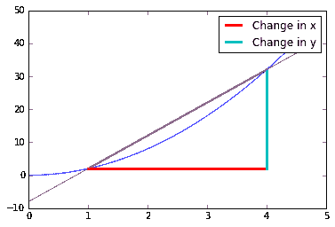

实施微分的初始设置图示

在这种情况下，我们在 *x=1* 和 *x=4* 处测量函数，并定义这个区间的变化率为以下：

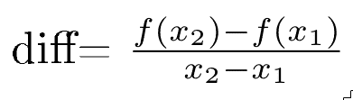

应用公式，样本的结果是 *(36-0)/3= 12*。

这种初始方法可以作为一种近似测量这种动态的方式，但它太依赖于我们进行测量的点，并且需要在每一个我们需要的区间进行测量。

为了更好地理解函数的动态，我们需要能够在函数定义域的每一个点上定义和测量瞬时变化率。

这种瞬时变化的概念让我们需要减小定义域的 *x* 值之间的距离，在这一点上它们之间的距离非常短。我们将用初始值 *x* 和随后的值， *x + Δx* 来制定这种方法：


在下面的代码中，我们近似差值，逐步减小 *Δx*：

```py
    initial_delta = .1 
    x1 = 1  
    for power in range (1,6): 
        delta = pow (initial_delta, power) 
        derivative_aprox= (quadratic(x1+delta) - quadratic (x1) )/ 
        ((x1+delta) - x1 ) 
        print "del    ta: " + str(delta) + ", estimated derivative: " + 
        str(derivative_aprox)  
```

在前面的代码中，我们首先定义了一个初始的 delta，这带来了一个初始近似。然后，我们应用差分函数，随着 delta 值的减小，这要归功于对 `0.1` 进行递增幂运算。我们得到的结果如下：

```py
    delta: 0.1, estimated derivative: 4.2 
    delta: 0.01, estimated derivative: 4.02 
    delta: 0.001, estimated derivative: 4.002 
    delta: 0.0001, estimated derivative: 4.0002 
    delta: 1e-05, estimated derivative: 4.00002 
```

随着分离的减小，很明显变化率将围绕 `4` 上下波动。但这个过程何时停止呢？实际上，我们可以说这个过程可以无限进行下去，至少在数值意义上是这样。

这时，极限的概念直观地出现了。然后我们将定义这个过程，即让 Δ 无限减小，并将其称为 *f(x)* 或 *f'(x)* 的导数：

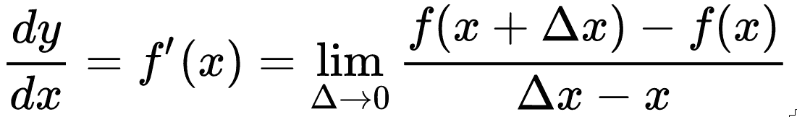

这就是导数的正式定义。

但是数学家并没有止步于这些繁琐的计算，进行了大量的数值运算（在 17 世纪这些运算大多是通过手工完成的），并希望进一步简化这些运算。

*如果我们再进行一步，可以象征性地定义一个函数的导数会怎样呢？*

这就需要构建一个函数，通过替换 `x` 变量的值，就能得到相应函数的导数。这一巨大的步骤在 17 世纪就已经实现，对于不同的函数族，从抛物线 *(y=x²+b)* 开始，然后是更复杂的函数：

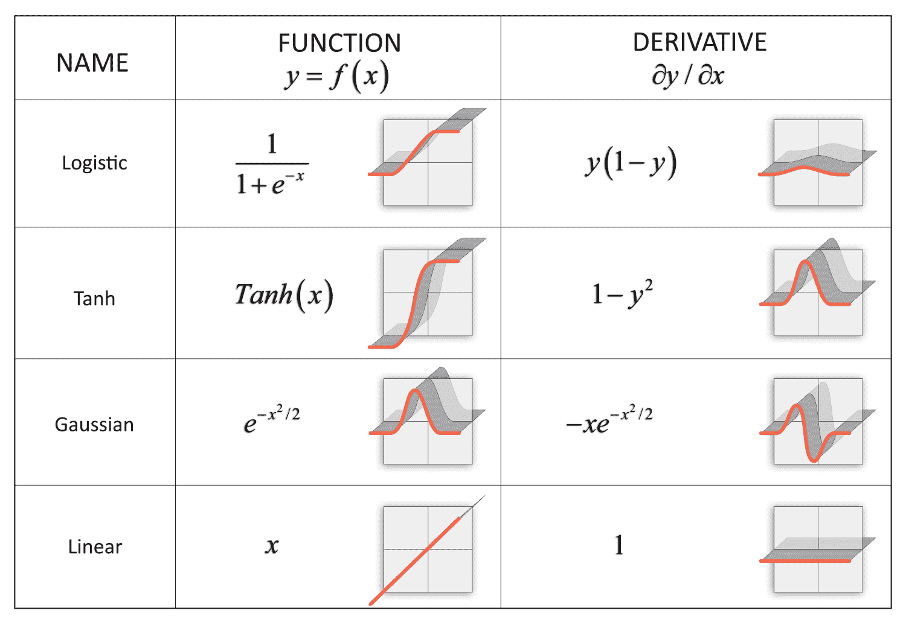

# 链式法则

函数导数的符号确定的一个非常重要的结果是链式法则。这个公式最早在 1676 年莱布尼茨的一篇论文中提到，使得解决复合函数的导数变得非常简单和优雅，简化了非常复杂函数的求解。

为了定义链式法则，如果我们假设一个函数 *f*，它被定义为另一个函数 *g* 的函数，即 *F* 中的 *f(g(x))*，其导数可以定义为以下：

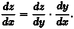

链式法则的公式使我们能够对输入值依赖于另一个函数的公式进行求导。这等同于搜索与先前函数相关联的函数变化率。链式法则是神经网络训练阶段使用的主要理论概念之一，因为在那些分层结构中，第一层神经元的输出将是后续层的输入，从而产生一个复合函数，大多数情况下，这个函数是多层嵌套的。

# 偏导数

到目前为止，我们一直在处理单变量函数，但我们将主要从现在开始处理的是多元函数，因为数据集将包含的列不止一列，每一列都将代表一个不同的变量。

在许多情况下，我们需要知道函数在仅与一个维度相关的关系中的变化情况，这将涉及到查看数据集的一列如何对函数总变化数做出贡献。

偏导数的计算包括将已知的导数规则应用于多元函数，考虑到变量不是作为常数进行求导。

看一下以下幂规则：

*f(x,y) = 2x³y*

当对这个函数关于 *x* 求导，将 *y* 视为常数时，我们可以将其重写为 *3.2y x²*，并将导数应用于变量 *x*，这样我们就可以得到以下导数：

*d/dx (f(x,y)) = 6y*x²*

使用这些技术，我们可以处理更复杂的多元函数，这些函数将是我们特征集的一部分，通常包含的变量不止两个。

# 摘要

在本章中，我们探讨了多个不同的概念元素，包括一些基本数学概念的概述，这些概念是机器学习概念的基础。

当我们正式解释不同建模方法的机制时，这些概念将非常有用，我们鼓励你在阅读章节之前和阅读过程中尽可能多地提高对这些概念的理解，以便更好地掌握算法的工作原理。

在下一章中，我们将快速概述机器学习项目的完整工作流程，这将帮助我们理解涉及的各种元素，从数据收集到结果评估。
