# 第二章：学习过程

在第一章中，我们看到了机器学习领域的数学概念、历史和领域的概述。

由于本书旨在提供一种既实用又形式正确的学习方法，现在是时候探索任何机器学习过程的一般思想过程了。这些概念将贯穿整个章节，并帮助我们定义该领域最佳实践的共同框架。

本章我们将涵盖以下主题：

+   理解问题和定义

+   数据集检索、预处理和特征工程

+   模型定义、训练和评估

+   理解结果和指标

每个机器学习问题都有其特定的特点。然而，随着学科随着时间的推移而发展，出现了机器学习过程应包括哪些步骤以及最佳实践的模式。以下各节将列出这些步骤，包括适用于这些情况的代码示例。

# 理解问题

在解决机器学习问题时，花时间分析数据和可能的工作量是很重要的。这个初步步骤比列表中随后的所有步骤都要灵活和非正式。

从机器学习的定义来看，我们知道我们的最终目标是让计算机从一组样本数据中学习或泛化某种行为或模型。因此，我们首先应该做的是理解我们想要学习的新能力。

在企业领域，现在是时候进行更多实际讨论和头脑风暴了。在这个阶段，我们可以提出的主要问题可能如下：

+   我们真正试图解决的问题是什么？

+   当前信息管道是什么？

+   我该如何简化数据获取？

+   进来的数据是否完整，或者是否存在缺失？

+   我们可以合并哪些额外的数据源，以便有更多的变量可供使用？

+   数据发布是否定期，或者能否实时获取？

+   对于这个特定问题，最小的时间代表性单位应该是什么？

+   我试图描述的行为在本质上是否发生变化，或者其基本原理在时间上是否相对稳定？

理解问题需要从业务知识方面入手，审视所有可能影响模型的有价值的信息来源。一旦确定，接下来的任务将生成一组有组织和结构的值，这些值将成为我们模型的输入。

让我们来看一个初始问题定义的例子，以及初始分析的思想过程。

假设公司 A 是一家零售连锁店，希望能够预测特定日期某种产品的需求。这可能是一项具有挑战性的任务，因为它涉及到人类行为，其中包含一些非确定性因素。

建立这样的模型需要什么样的数据输入？当然，我们希望得到该类商品的交易清单。但如果商品是商品呢？如果商品依赖于大豆或面粉的价格，当前和过去的收获量可以丰富模型。如果产品是中档商品，当前的通货膨胀和工资变化也可能与当前的收益相关。

理解问题需要一些业务知识，并寻找所有可能影响模型的有价值的信息来源。在某种程度上，这更像是一种艺术形式，但这并没有减少它的重要性。

假设我们已经分析了问题的基本要素，并且对输入数据和期望输出的行为和特征有了更清晰的了解。接下来的任务将生成一组有组织和结构化的值，这些值将成为我们模型的输入。经过清理和调整后，这组数据将被称为我们的数据集。

# 数据集定义和检索

一旦我们确定了数据源，下一个任务就是收集所有元组或记录作为一个同质集合。格式可以是表格排列，一系列实值（如音频或天气变量），以及 N 维矩阵（一组图像或云点）等。

# ETL 过程

大数据处理领域的前几个阶段在几十年的时间里以数据挖掘的名义发展，然后采用了流行的名称**大数据**。

这些学科中最好的成果之一是**提取**、**转换**、**加载**（**ETL**）过程的规范。

这个过程从来自商业系统的多个数据源混合开始，然后过渡到一个将数据转换成可读状态的系统，最后通过生成具有非常结构化和文档化的数据类型的数据库结束。

为了应用这个概念，我们将这个过程的各种元素与结构化数据集的最终结果混合，其最终形式包括一个额外的标签列（在监督学习问题的情况下）。

这个过程在以下图中表示：

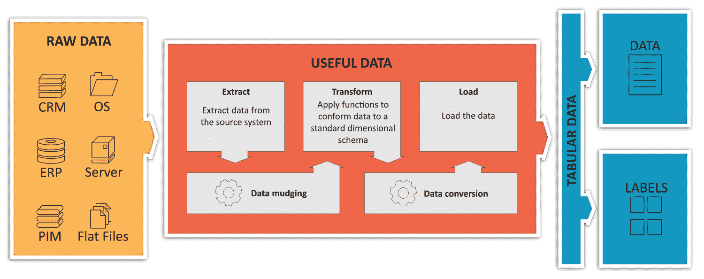

从原始数据到有用数据集的 ETL 过程描述

图表说明了数据管道的第一阶段，从整个组织的所有数据开始，无论是商业交易、物联网设备原始值还是其他有价值的数据源的信息元素，这些元素通常具有非常不同类型和组成。ETL 过程负责使用不同的软件过滤器从它们中收集原始信息，应用必要的转换以以有用的方式安排数据，最后以表格格式呈现数据（我们可以将其视为具有最后一个特征或结果列的单个数据库表，或者是一个包含合并数据的巨大 CSV 文件）。最终结果可以方便地被后续过程使用，而无需实际考虑数据格式的许多怪癖，因为它们已经被标准化为非常清晰的表格结构。

# 使用 SciPy 和 pandas 加载数据集并进行探索性分析

为了获得一些数据集格式类型的实际概述，我们将使用之前介绍的 Python 库（SciPy 和 pandas）来演示这个例子，因为它们几乎被普遍使用。

让我们从导入并执行几个数据集输入格式的简单统计分析开始。

样本数据文件将位于每个章节代码目录中的 data 目录内。

# 使用 IPython 进行交互式工作

在本节中，我们将介绍**Python 交互式控制台**，或**IPython**，这是一个命令行外壳，允许我们以交互式的方式探索概念和方法。

要运行 IPython，你可以在命令行中调用它：

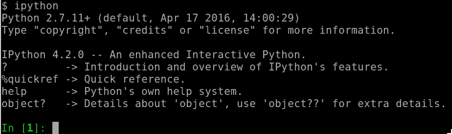

在这里，我们看到 IPython 正在执行，然后是初始的快速帮助。最有趣的部分是最后一行——它将允许你导入库并执行命令，并显示结果对象。IPython 的一个额外且方便的特性是，你可以即时重新定义变量以查看不同输入下的结果差异。

在当前示例中，我们使用的是撰写时的标准 Python 版本，这是当时最支持的 Linux 发行版（Ubuntu 16.04）。这些示例对于 Python 3 应该是等效的。

首先，让我们导入 pandas 并加载一个样本`.csv`文件（一种非常常见的格式，每行一个记录）。它包含一个非常著名的用于分类问题的数据集，包含 150 个鸢尾花实例的属性维度，以及一个表示类别的数值列（1、2 或 3）：

```py
In [1]: import pandas as pd #Import the pandas library with pd alias
```

在这一行中，我们以通常的方式导入 pandas，使其方法可以通过`import`语句使用。`as`修饰符允许我们使用简短的名字来引用库中的所有对象和方法：

```py
In [2]: df = pd.read_csv ("data/iris.csv") #import iris data as dataframe
```

在这一行中，我们使用`read_csv`方法，允许 pandas 猜测`.csv`文件的可能的项分隔符，并将其存储在`dataframe`对象中。

让我们对数据集进行一些简单的探索：

```py
In [3]: df.columns
Out[3]:
Index([u'Sepal.Length', u'Sepal.Width', u'Petal.Length', u'Petal.Width',
u'Species'],
dtype='object')

In [4]: df.head(3)
Out[4]:
5.1 3.5 1.4 0.2 setosa
0 4.9 3.0 1.4 0.2 setosa
1 4.7 3.2 1.3 0.2 setosa
2 4.6 3.1 1.5 0.2 setosa
```

现在，我们能够看到数据集的列名并探索其前*n*个实例。查看前几个记录，您可以看到`setosa`鸢尾花类的不同度量。

现在，让我们访问特定列的子集并显示前三个元素：

```py
In [19]: df[u'Sepal.Length'].head(3)
Out[19]:
0 5.1
1 4.9
2 4.7
Name: Sepal.Length, dtype: float64
```

Pandas 包括许多用于导入表格数据格式的相关方法，例如 HDF5（`read_hdf`）、JSON（`read_json`）和 Excel（`read_excel`）。有关完整格式的列表，请访问[`pandas.pydata.org/pandas-docs/stable/io.html`](http://pandas.pydata.org/pandas-docs/stable/io.html)[.](http://pandas.pydata.org/pandas-docs/stable/io.html)

除了这些简单的探索方法之外，我们现在将使用 pandas 获取我们已看到的所有描述性统计概念，以便表征`Sepal.Length`列的分布：

```py
#Describe the sepal length column
print "Mean: " + str (df[u'Sepal.Length'].mean())
print "Standard deviation: " + str(df[u'Sepal.Length'].std())
print "Kurtosis: " + str(df[u'Sepal.Length'].kurtosis())
print "Skewness: " + str(df[u'Sepal.Length'].skew())
```

这里是这个分布的主要指标：

```py
Mean: 5.84333333333
Standard deviation: 0.828066127978
Kurtosis: -0.552064041316
Skewness: 0.314910956637
```

现在，我们将通过查看该分布的直方图来图形化评估这些指标的准确性，这次使用内置的`plot.hist`方法：

```py
#Plot the data histogram to illustrate the measures
import matplotlib.pyplot as plt
%matplotlib inline
df[u'Sepal.Length'].plot.hist()
```

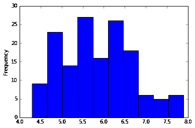

鸢尾花萼长度的直方图

如指标所示，分布是右偏斜的，因为偏度是正的，并且它是明显分布类型（具有比 1 大得多的分布范围），正如峰度指标所指示的。

# 处理 2D 数据

在这里，我们停止表格数据的讨论，转向 2D 数据结构。由于图像是流行机器学习问题中最常用的数据类型，我们将向您展示 SciPy 堆栈中包含的一些有用方法。

以下代码已优化，可在带有内联图形的 Jupyter 笔记本上运行。您可以在源文件`Dataset_IO.pynb`中找到源代码：

```py
import scipy.misc
from matplotlib import pyplot as plt
%matplotlib inline
testimg = scipy.misc.imread("data/blue_jay.jpg")
plt.imshow( testimg)
```

导入单个图像基本上包括导入相应的模块，使用`imread`方法将指定的图像读入矩阵，并使用 matplotlib 显示。以`%`开始的行对应于参数修改，表示以下`matplotlib`图形应在笔记本中内联显示，以下为结果（轴对应于像素数）：

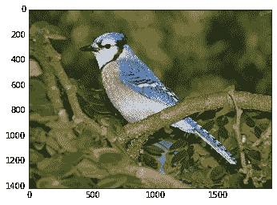

初始 RGB 图像已加载

测试变量将包含一个高度*宽度*通道数数组，包含每个图像像素的所有红色、绿色和蓝色值。让我们获取这些信息：

```py
testimg.shape
```

解释器将显示以下内容：

```py
(1416, 1920, 3)
```

我们还可以尝试将通道分离并分别用红色、绿色和蓝色尺度表示，以了解图像中的颜色模式：

```py
plt.subplot(131)
plt.imshow( testimg[:,:,0], cmap="Reds")
plt.title("Red channel")
plt.subplot(132)
plt.imshow( testimg[:,:,1], cmap="Greens")
plt.title("Green channel")
plt.subplot(133)
plt.imshow( testimg[:,:,2], cmap="Blues")
plt.title("Blue channel")
```

在前面的例子中，我们使用三位代码创建三个子图，以指示结构和位置。第一个表示行号，第二个表示列号，最后一个表示在该结构上的绘图位置。`cmap`参数表示分配给每个图形的颜色映射。

输出将如下所示：


样本图像分离通道的描述。

注意，红色和绿色通道具有相似的图案，而蓝色调在这只鸟的图像中占主导地位。这种通道分离可能是检测这种鸟类在其栖息地中的极其基础的初步方法。

本节是对加载数据集的不同方法的简化介绍。在接下来的章节中，我们将看到获取数据集的不同高级方法，包括加载和训练不同批次的样本集。

# 特征工程。

特征工程在某种程度上是机器学习过程中最被低估的部分之一，尽管许多社区知名人士认为它是学习过程的基础。

这个过程的目的是什么？简而言之，它从数据库、传感器、档案等来源提取原始数据，并以一种使模型易于泛化的方式对其进行转换。这个学科从许多来源获取标准，包括常识。这确实更像是一门艺术，而不是一门僵化的科学。它是一个手动过程，即使其中的一些部分可以通过特征提取领域的某些技术实现自动化。

作为这个过程的一部分，我们还有许多强大的数学工具和降维技术，如**主成分分析**（**PCA**）和**自编码器**，这些工具允许数据科学家跳过那些不能以有用方式丰富数据表示的特征。

# 缺失数据的插补。

当处理不太完美或不完整的数据集时，缺失的记录本身可能不会为模型增加价值，但行中的其他元素可能对模型有用。这在模型有很高比例的不完整值时尤其如此，因此不能丢弃任何行。

在这个过程中，主要问题是“你如何解释缺失值？”有很多方法，通常取决于问题本身。

一种非常简单的方法可能是将值设为零，假设数据分布的平均值为 0。一个改进的步骤是将缺失数据与周围内容相关联，分配整个列的平均值，或者相同列的*n*个元素的平均值。另一个选择是使用列的中位数或最频繁的值。

此外，还有一些更高级的技术，如鲁棒方法甚至 k-最近邻，我们在这本书中不会涉及。

# 单热编码。

数值或分类信息可以很容易地用整数表示，每个选项或离散结果一个。但在某些情况下，`bins`表示当前选项更受欢迎。这种数据表示形式称为**单热编码**。这种编码简单地将某个输入转换为一个只包含零的二元数组，除了由变量的值指示的值，该值将为 1。

在简单的整数情况下，这将是列表[1, 3, 2, 4]在单热编码中的表示：

```py
[[0 1 0 0 0]
 [0 0 0 1 0]
 [0 0 1 0 0]
 [0 0 0 0 1]]
```

让我们实现一个整数数组单热编码器的简单示例，以便更好地理解这个概念：

```py
import numpy as np
def get_one_hot(input_vector):
result=[]
for i in input_vector:
 newval=np.zeros(max(input_vector))
 newval.itemset(i-1,1)
 result.append(newval)
 return result
```

在这个例子中，我们首先定义`get_one_hot`函数，它接受一个数组作为输入并返回一个数组。

我们所做的是逐个取数组的元素，对于数组中的每个元素，我们生成一个长度等于数组最大值的零数组，以便为所有可能的值留出空间。然后我们在由当前值指示的索引位置插入`1`（我们减去`1`是因为我们从基于 1 的索引转换为基于 0 的索引）。

让我们尝试我们刚刚编写的函数：

```py
get_one_hot([1,5,2,4,3])

#Out:
[array([ 1., 0., 0., 0., 0.]),
array([ 0., 0., 0., 0., 1.]),
array([ 0., 1., 0., 0., 0.]),
array([ 0., 0., 0., 1., 0.]),
array([ 0., 0., 1., 0., 0.])]
```

# 数据集预处理

当我们第一次涉足数据科学时，一个常见的错误是期望所有数据从一开始就非常精致，具有良好的特征。唉，在许多情况下，这并不是事实，原因有很多，比如空数据、传感器错误导致异常值和 NAN、故障寄存器、仪器引入的偏差以及所有导致模型拟合不良并必须根除的各种缺陷。

这个阶段两个关键的过程是数据归一化和特征缩放。这个过程包括应用简单的变换称为**仿射**，它将当前不平衡的数据映射到一个更易于管理的形状，保持其完整性但提供更好的随机属性，并改善未来应用的模型。标准化技术的共同目标是使数据分布更接近正态分布，以下技术：

# 归一化和特征缩放

数据集预处理中的一个非常重要的步骤是归一化和特征缩放。数据归一化允许我们的优化技术，特别是迭代技术，更好地收敛，并使数据更易于管理。

# 归一化或标准化

这种技术旨在使数据集具有正态分布的性质，即均值为 0，标准差为 1。

获得这些性质的方法是计算所谓的*Z*分数，基于数据集样本，以下公式：


让我们借助 scikit-learn 可视化并练习这个新概念，读取`MPG`数据集的一个文件，该数据集包含每加仑英里数（miles per gallon）的城市循环燃油消耗，基于以下特征：`mpg`、`cylinders`、`displacement`、`horsepower`、`weight`、`acceleration`、`model year`、`origin`和`car name`。

```py
from sklearn import preprocessing
import pandas as pd
import numpy as np
import matplotlib.pyplot as plt

df=pd.read_csv("data/mpg.csv")
plt.figure(figsize=(10,8))
print df.columns
partialcolumns = df[['acceleration', 'mpg']]
std_scale = preprocessing.StandardScaler().fit(partialcolumns)
df_std = std_scale.transform(partialcolumns)
plt.scatter(partialcolumns['acceleration'], partialcolumns['mpg'], color="grey", marker='^')
plt.scatter(df_std[:,0], df_std[:,1])
```

下面的图片使我们能够比较非归一化和归一化的数据表示：

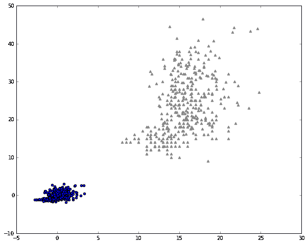

原始数据集的描述和其归一化对应物的描述。

在评估时对结果数据进行去规范化非常重要，这样你才不会失去数据的代表性，尤其是如果模型应用于回归时，未缩放的数据将不再有用。

# 模型定义

如果我们只想用一个词来总结机器学习过程，那一定是模型。这是因为我们用机器学习构建的是抽象或模型，它们代表并简化现实，使我们能够根据我们在其上训练的模型解决现实生活中的问题。

随着几乎每天都有新模型出现，选择使用哪个模型的任务变得越来越困难，但你可以通过按你想要执行的任务类型和输入数据的类型对方法进行分组，从而将问题简化为更小的一组选项。

# 提出正确的问题

有过度概括的风险，让我们尝试总结一个用于模型的示例决策问题：

+   我们是否试图通过仅根据其特征对信息进行分组来表征数据，而不需要任何或仅有少量先前的提示？这是聚类技术的领域。

+   第一个也是最基本的问题：我们是在尝试预测变量的即时结果，还是将数据标记或分类到不同的组中？如果是前者，我们正在解决回归问题。如果是后者，这属于分类问题的领域。

+   在解决前面的问题并选择第 2 点中的任何选项后，我们应该问自己：数据是否是序列的，或者我们是否应该考虑序列？循环神经网络应该是首选之一。

+   继续探讨非聚类技术：我们要发现的数据或模式是否在空间上有位置？卷积神经网络是这类问题的一个常见起点。

+   在最常见的情况下（没有特定排列的数据），如果函数可以用一个单变量或多变量函数表示，我们可以应用线性、多项式或逻辑回归，如果我们想提升模型，多层神经网络将提供更复杂非线性解决方案的支持。

+   我们正在处理多少维度和变量？我们只是想提取最有用的特征（以及数据维度），排除不那么有趣的那些吗？这是降维技术的领域。

+   我们是否想要学习一组具有有限步骤的策略，以实现目标？这属于强化学习的领域。如果这些经典方法都不适合我们的研究，那么会出现大量利基技术，应该进行额外的分析。

在接下来的章节中，你将找到关于如何根据更严格的准则做出决策的更多信息，并最终将模型应用于你的数据。此外，如果你发现你的答案与这一节中解释的简单准则关系不大，你可以查看*第八章*，*最近模型和发展*，以了解更高级的模型。

# 损失函数定义

这个机器学习过程步骤也非常重要，因为它提供了衡量你模型质量的一个独特指标，如果选择不当，可能会破坏模型的准确性或其收敛速度的效率。

简单来说，损失函数是一个衡量模型估计值与真实期望值之间距离的函数。

我们必须考虑的一个重要事实是，几乎所有模型的目的是最小化误差函数，为此，我们需要它可导，并且误差函数的导数应该尽可能简单。

另一个事实是，当模型变得越来越复杂时，误差的导数也会变得更加复杂，因此我们需要使用迭代方法来近似导数的解，其中之一就是众所周知的梯度下降法。

# 模型拟合和评估

在这个机器学习过程的这部分，我们已经准备好了模型和数据，然后我们继续训练和验证我们的模型。

# 数据集划分

在训练模型时，我们通常将提供的数据分成三组：训练集，它实际上将被用来调整模型的参数；验证集，它将被用来比较应用于该数据的替代模型（如果我们只有一个模型和架构在心中，则可以忽略）；以及测试集，它将被用来衡量所选模型的准确性。这些划分的比例通常是 70/20/10。

# 常见的训练术语 – 迭代、批次和 epoch

在训练模型时，有一些常见的术语表示迭代优化的不同部分：

+   **迭代**定义了一次计算误差梯度和调整模型参数的实例。当数据被分成样本组时，每个这样的组被称为**批次**。

+   批次可以包括整个数据集（传统批次），或者只包括一个非常小的子集，直到整个数据集被前馈，这被称为小批量。每个批次中的样本数量称为**批次大小**。

+   整个数据集的每次遍历称为一个**epoch**。

# 训练类型 – 在线处理和批量处理

训练过程提供了许多遍历数据集和根据输入数据和误差最小化结果调整模型参数的方法。

当然，在训练阶段，数据集将被多次以多种方式评估。

# 参数初始化

为了确保良好的拟合开始，模型权重必须初始化为最有效的值。通常具有*tanh*激活函数的神经网络对范围[-1,1]或[0,1]非常敏感；因此，对数据进行归一化以及参数也应处于该范围内非常重要。

模型参数应该有有用的初始值，以便模型收敛。训练开始时的重要决策之一是模型参数的初始化值（通常称为**权重**）。一个经典的初始规则不是将变量初始化为 0，因为这会阻止模型优化，因为它们没有合适的函数斜率乘数来调整。一个常见的合理标准是使用正态随机分布来为所有值。

使用 NumPy，你通常会使用以下代码初始化一个系数向量：

```py
mu, sigma = 0, 1 
dist = np.random.normal(mu, sigma, 1000)
>>> dist = np.random.normal(mu, sigma, 10)
>>> print dist
[ 0.32416595 1.48067723 0.23039378 -0.59140674 1.65827372 -0.8241832
 0.86016434 -0.05996878 2.2855467 -0.19759244]

```

在这个阶段，一个特定的问题来源是将模型的所有参数都设置为 0。因为许多优化技术通常通过乘以一个确定的系数来近似最小值，乘以 0 将阻止模型发生任何变化，除了偏差项。

# 模型实现和结果解释

如果模型不能在训练和测试集之外使用，那么它就不实用。这就是模型部署到生产中的时候。

在这个阶段，我们通常会加载所有模型的操作和训练好的权重，等待新的未知数据，当它到达时，我们通过模型的全部链式函数将其输入，通过 Web 服务通知输出层或操作的输出结果，打印到标准输出，等等。

然后，我们将有一个最终任务——在现实世界中解释模型的输出结果，以不断检查它是否在当前条件下工作。在生成模型的情况下，预测的适用性更容易理解，因为目标通常是表示一个先前已知的实体。

# 回归指标

对于回归指标，计算了多个指标，以给出回归模型拟合度的简明概念。以下是主要指标列表。

# 均方绝对误差

`mean_absolute_error`函数计算平均绝对误差，这是一个与绝对误差损失期望值相对应的风险指标，或称为*l1-norm*损失。

如果*ŷ[i]*是第*i*个样本的预测值，而*y[i]*是对应的真实值，那么在*n*个样本上估计的**平均绝对误差**（**MAE**）定义如下：

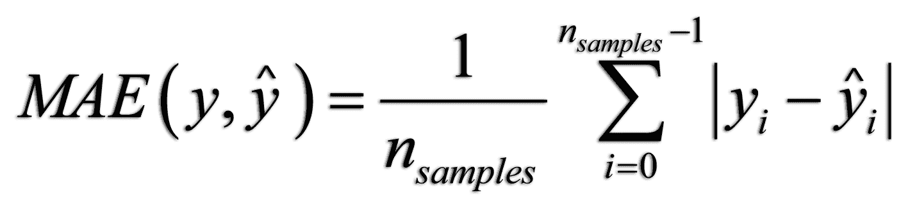

# 中位数绝对误差

中位数绝对误差特别有趣，因为它对异常值具有鲁棒性。损失是通过计算目标与预测之间的所有绝对差异的中位数来计算的。

如果 *ŷ* 是第 *i* 个样本的预测值，而 *y[i]* 是相应的真实值，那么在 *n* 个样本上估计的绝对误差中位数定义如下：

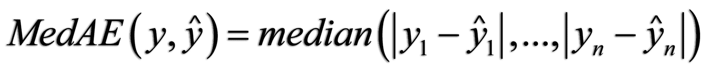

# 均方误差

**均方误差**（**MSE**）是一个风险指标，等于平方（二次）误差损失的期望值。

如果 *ŷ[i]* 是第 *i* 个样本的预测值，而 *y[i]* 是相应的真实值，那么在 *n* 个样本上估计的 MSE 定义如下：

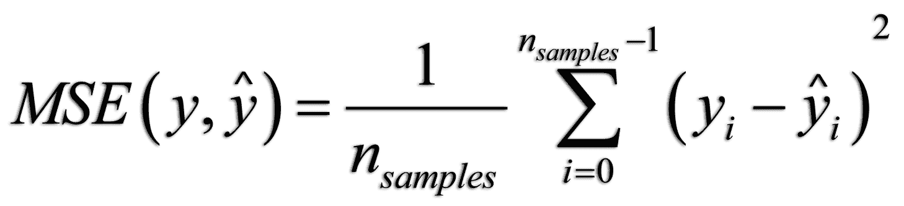

# 分类指标

分类任务意味着在估计误差时遵循不同的规则。我们所拥有的优势是输出的数量是离散的，因此可以以二进制方式精确地确定预测是否失败。这使我们转向主要指标。

# 准确度

准确度计算模型正确预测的分数或计数。

在多标签分类中，该函数返回子集的准确率。

如果一个样本的所有预测标签严格匹配真实标签集，那么子集的准确率是 *1.0*；否则，它是 *0.0*。

如果 *ŷ[i]* 是第 *i* 个样本的预测值，而 *y[i]* 是相应的真实值，那么在 *n* 个样本中正确预测的比例定义如下：

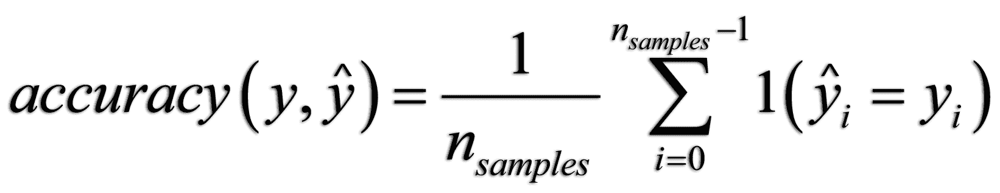

# 精确度得分、召回率和 F 度量

**精确度**得分如下：

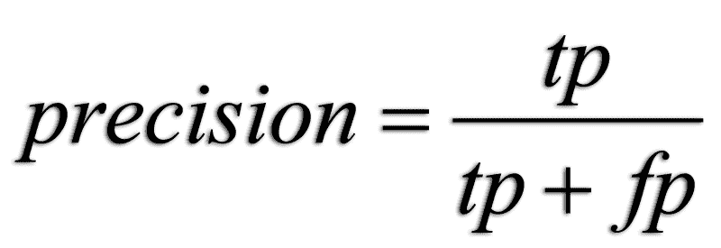

在这里，*t[p]* 是真正例的数量，而 *f[p]* 是假正例的数量。精确度是分类器不将负样本标记为正样本的能力。最佳值是 1，最差值是 *0*。

**召回率**如下：

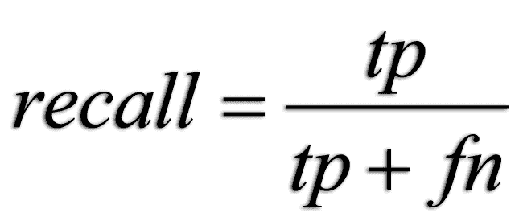

在这里，*t[p]* 是真正例的数量，而 *f[n]* 是假阴性数量。召回率可以描述为分类器找到所有正样本的能力。其值从 1（最佳）到 0。

**F 度量**（*F[β]* 和 F[1] 度量）可以解释为精确度和召回率的特殊类型的平均值（加权调和平均值）。*F[β]* 度量的最佳值是 1，其最差得分是 0。当 *β = 1* 时，*F[β]* 和 *F[1]* 是等价的，召回率和精确度同等重要：

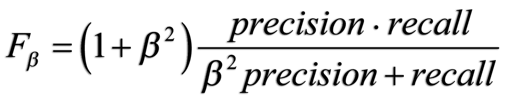

# 混淆矩阵

每个分类任务都旨在为新未知数据预测一个标签或标记。展示分类准确率的一种非常有效的方式是通过混淆矩阵，其中我们展示了 [分类样本，真实值] 对，以及预测表现的具体视图。

预期输出应该是矩阵的主对角线，得分为 1.0；也就是说，所有预期值都应该与实际值相匹配。

在以下代码示例中，我们将进行预测值和真实值的合成样本，并生成最终数据的混淆矩阵：

```py
from sklearn.metrics import confusion_matrix
import matplotlib.pyplot as plt
import numpy as np
y_true = [8,5,6,8,5,3,1,6,4,2,5,3,1,4]
y_pred = [8,5,6,8,5,2,3,4,4,5,5,7,2,6]
y = confusion_matrix(y_true, y_pred)
print y 
plt.imshow(confusion_matrix(y_true, y_pred), interpolation='nearest', cmap='plasma')
plt.xticks(np.arange(0,8), np.arange(1,9))
plt.yticks(np.arange(0,8), np.arange(1,9))
plt.show()
```

结果将是以下内容：

```py
[[0 1 1 0 0 0 0 0]
 [0 0 0 0 1 0 0 0]
 [0 1 0 0 0 0 1 0]
 [0 0 0 1 0 1 0 0]
 [0 0 0 0 3 0 0 0]
 [0 0 0 1 0 1 0 0]
 [0 0 0 0 0 0 0 0]
 [0 0 0 0 0 0 0 2]]
```

这些值的最终混淆矩阵图形表示如下：

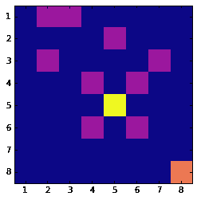

混淆矩阵

在图像中，我们看到在(*5,5*)对角线上的高准确度值有三个正确预测，以及(*8,8*)值有两个。正如我们所看到的，通过分析图表可以直观地提取准确度的分布。

# 聚类质量测量

无监督学习技术，理解为没有真实标签的数据标注，使得为模型实现显著的度量指标变得有些困难。尽管如此，为此类技术实现了一系列的度量。在本节中，我们列出了最著名的几种。

# 轮廓系数

**轮廓系数**是一个不需要知道数据集标签的度量。它给出了簇之间分离的概念。

它由两个不同的元素组成：

+   样本与其同一类中所有其他点的平均距离（*a*）

+   样本与其最近簇中所有其他点的平均距离（*b*）

该系数*s*的公式定义如下：

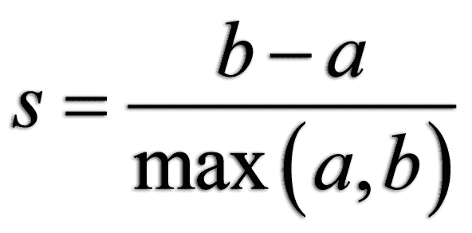

轮廓系数仅在类别的数量至少为两个时才定义，整个样本集的系数是所有样本系数的平均值。

# 纯度、完整性和 V 度量

纯度、完整性和 V 度量是聚类操作质量的关键相关指标。在以下公式中，我们将使用*K*表示簇的数量，*C*表示类别的数量，*N*表示样本总数，*a[ck]*表示在簇*k*中类*c*的元素数量。

**纯度**是单个簇中属于单个类别的样本比率的度量。一个簇中包含的不同类别越少，越好。下限应为 0.0，上限应为 1.0（越高越好），其公式如下所示：

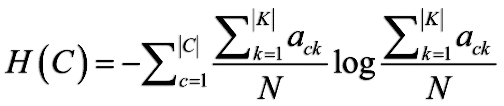

**完整性**衡量的是分配到同一簇的给定类成员的比率：


**V 度量**是纯度和完整性的调和平均值，其公式如下：

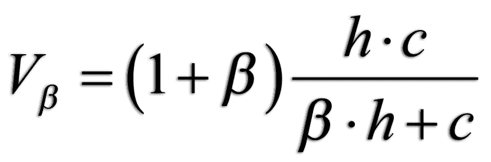

# 摘要

在本章中，我们回顾了机器学习过程中涉及的所有主要步骤。我们将间接地在整本书中使用它们，并希望它们能帮助您构建未来的工作。

在下一章中，我们将回顾我们将使用来解决所有机器学习问题并熟练掌握它们的编程语言和框架。

# 参考文献

+   Lichman, M. (2013). UCI 机器学习仓库 ([`archive.ics.uci.edu/ml`](http://archive.ics.uci.edu/ml)). 加利福尼亚州欧文，加州大学信息与计算机科学学院。

+   Quinlan, R. (1993). 结合实例学习和基于模型的学习。在第十届国际机器学习会议论文集，236-243 页，麻省大学阿默斯特分校。摩根考夫曼出版社。

+   Townsend, James T. *字母混淆矩阵的理论分析*。注意，感知与心理学 9.1 (1971): 40-50。

+   Peter J. Rousseeuw (1987). *轮廓：聚类分析的图形辅助解释和验证*。计算与应用数学 20: 53-65。

+   Kent, Allen 等人，机器文献检索 VIII. *设计信息检索系统的操作标准*。信息科学和技术协会杂志 6.2 (1955): 93-101。

+   Rosenberg, Andrew 和 Julia Hirschberg，V-Measure：*基于条件熵的外部聚类评估度量*。EMNLP-CoNLL。第 7 卷。2007 年。
