# 第三章：聚类

恭喜！你已经完成了这本书的引言部分，其中你探索了许多主题，如果你能够跟上，你就准备好开始了解许多机器学习模型的内部运作之旅了。

在本章中，我们将探讨一些有效且简单的方法来自动发现有趣的数据聚集体，并开始研究数据自然分组的原因。

本章将涵盖以下主题：

+   K-means 算法的一个逐行实现的示例，包括对数据结构和例程的解释

+   对**k-最近邻（K-NN）**算法的详细解释，使用代码示例来解释整个过程

+   确定代表一组样本的最佳分组数量的额外方法

# 分组作为一种人类活动

人类通常倾向于将日常元素聚集到具有相似特征的组中。人类思维的这个特性也可以通过算法来复制。相反，可以最初应用于任何未标记数据集的最简单操作之一是将元素分组到共同特征周围。

正如我们所描述的，在这个学科发展的阶段，聚类被教授为一个入门主题，应用于元素集合的最简单类别。

但作为一个作者，我建议研究这个领域，因为社区暗示当前模型的表现将都会达到一个平台期，在追求人工智能任务的全局泛化之前。那么，哪些方法将是跨越人工智能前沿下一阶段的主要候选者？形式上非常复杂的方法，正如这里所解释的方法。

但现在我们不要偏离主题，让我们从最简单的分组标准开始，即到共同中心的距离，这被称为**K-means**。

# 自动化聚类过程

用于聚类的信息分组遵循所有技术的一个共同模式。基本上，我们有一个初始化阶段，随后是迭代插入新元素，之后更新新的分组关系。这个过程一直持续到满足停止标准，此时分组特征化完成。以下流程图说明了这个过程：

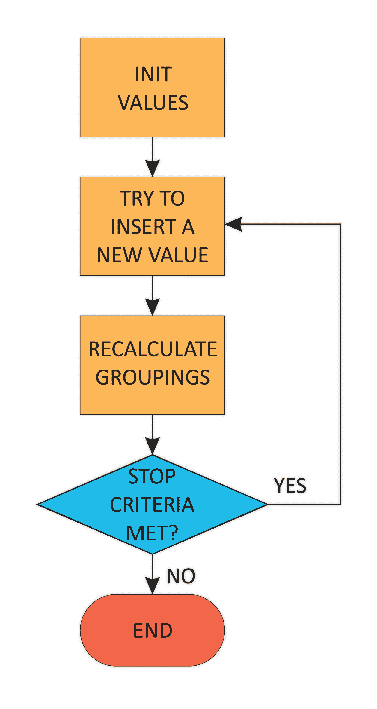

聚类算法的一般方案

在我们对整体过程有了清晰的认识之后，让我们开始处理一些应用了这种方案的案例，从**K-means**开始。

# 寻找共同中心 - K-means

我们开始了！经过一些必要的准备复习后，我们最终将开始从数据中学习；在这种情况下，我们希望对现实生活中观察到的数据进行标记。

在这个例子中，我们有以下元素：

+   一组 N 维数值类型的元素

+   预先确定的小组数量（这有点棘手，因为我们不得不做出一个有根据的猜测）

+   每个组的一组常见代表点（称为**质心**）

这种方法的主要目标是把数据集分成任意数量的簇，每个簇都可以用提到的质心表示。

“质心”这个词来自数学领域，已经被翻译到微积分和物理学中。在这里，我们找到了三角形质心分析计算的经典表示：

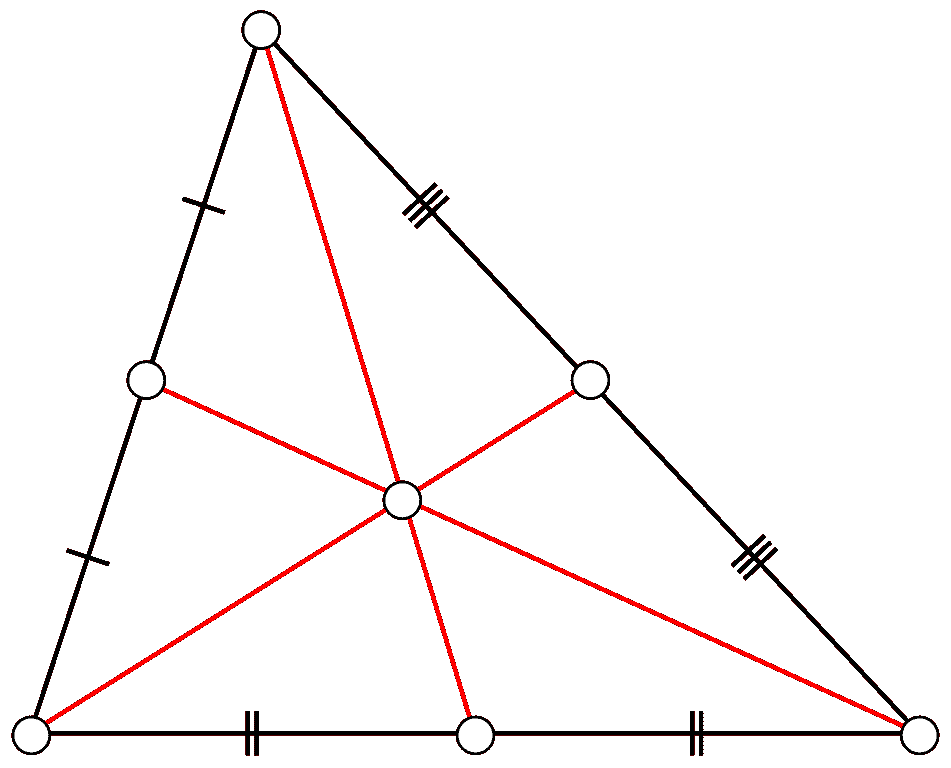

三角形质心寻找方案的图形描述

在 R^n 空间中，有限个点集的质心，*x[1 ,]x[2], ..., x[k]*，如下所示：

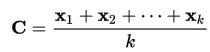

质心的解析定义

因此，现在我们已经定义了这个中心度量，让我们提出问题，“*这与数据元素的分组有什么关系？*”

要回答这个问题，我们首先必须理解**到质心的距离**的概念。距离有许多定义，可以是线性的、二次的，以及其他形式。

因此，让我们回顾一下主要的距离类型，然后我们将提到通常使用哪一种：

在这篇综述中，当我们定义度量类型时，我们将使用二维变量，作为一种简化的手段。

让我们看看以下几种距离类型：

+   **欧几里得距离**：这种距离度量计算两点之间的直线距离，或者具有以下公式：

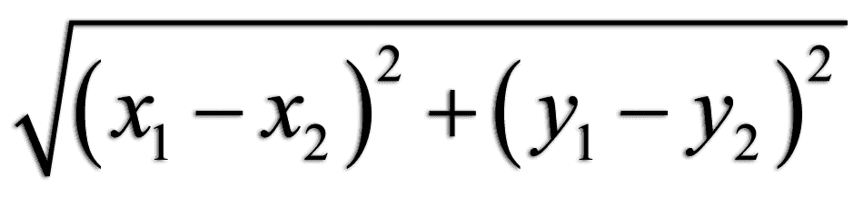

+   **切比雪夫距离**：这种距离等于沿任何轴的最大距离。它也被称为**棋盘**距离，因为它给出了国王从初始点到最终点所需的最小移动次数。其定义为以下公式：

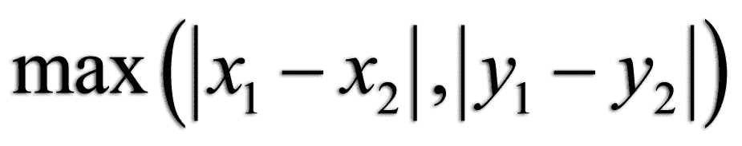

+   **曼哈顿距离**：这种距离相当于在具有单位方格的城市中从一个点到另一个点的距离。这种 L1 型距离总结了水平前进的单位数和垂直的单位数。其公式如下：

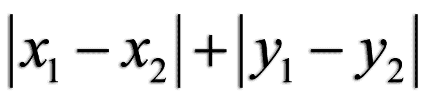

以下图表进一步解释了不同类型距离的公式：


一些最著名的距离类型的图形表示

K-means 选择的距离度量是欧几里得距离，它易于计算，并且很好地扩展到多个维度。

现在我们已经拥有了所有元素，是时候定义我们将用来定义我们将分配给任何给定样本的标签的标准了。让我们用以下陈述总结学习规则：

“样本将被分配到由最近的质心表示的组。”

这种方法的目的是最小化从簇成员到包含样本的所有簇的实际质心的平方距离之和。这也被称为**惯性最小化**。

在以下图中，我们可以看到将典型的 K-means 算法应用于类似 blob 的样本群体的结果，预设的簇数为 3：

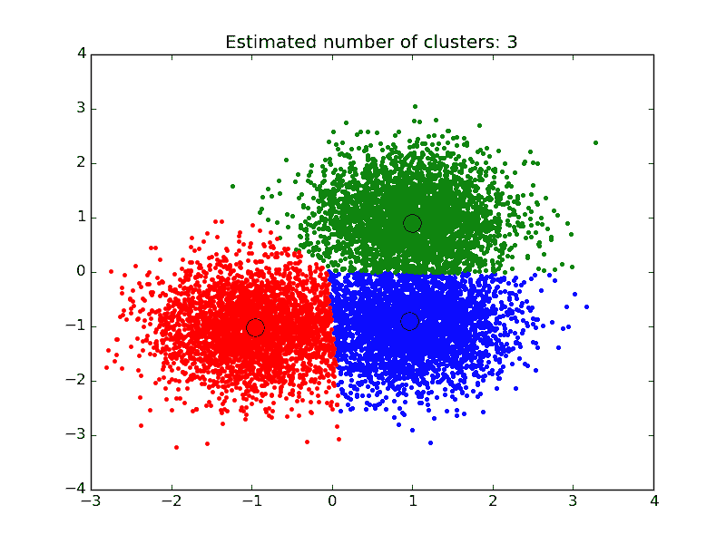

使用 3 个质心种子进行 K-means 聚类的典型聚类过程结果

K-means 是一种简单而有效的算法，可以用来快速了解数据集是如何组织的。其主要区别在于属于同一类的对象将共享一个共同的距离中心，这个中心将随着每个新样本的添加而逐步升级。

# K-means 的优缺点

这种方法的优点如下：

+   它具有良好的可扩展性（大多数计算可以并行运行）

+   它已经被应用于非常广泛的领域

但简单也有其代价（没有银弹规则适用）：

+   它需要先验知识（簇的可能数量应该事先知道）

+   异常值可能会扭曲质心的值，因为它们与任何其他样本具有相同的权重

+   由于我们假设该图是凸的和各向同性的，因此它与非 blob 相似的簇不太适用。

# K-means 算法分解

K-means 算法的机制可以用以下流程图来概括：

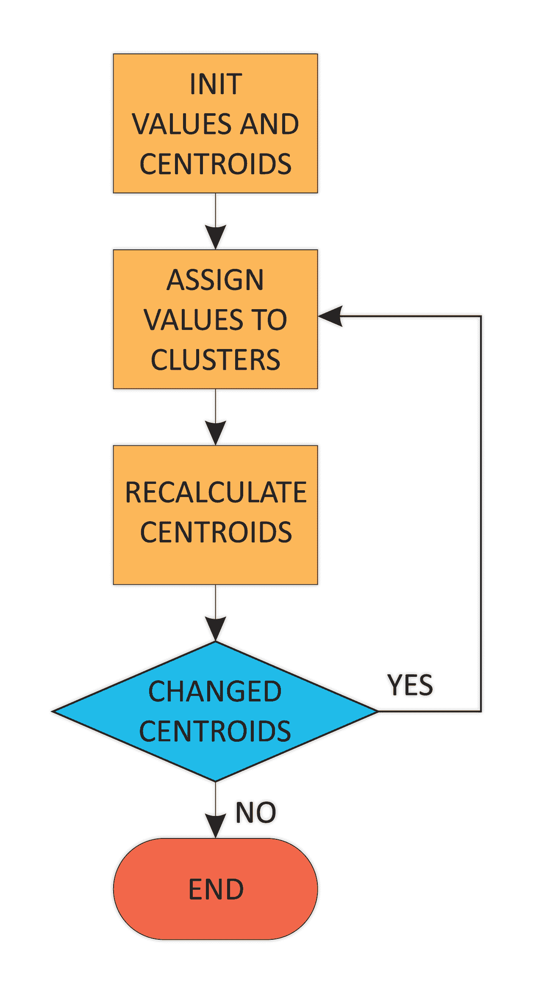

K-means 过程流程图

让我们更详细地描述这个过程：

我们从未分类的样本开始，并取 K 个元素作为起始质心。为了简洁起见，也有可能简化这个算法，取元素列表中的第一个元素。

我们然后计算样本与第一个选择的样本之间的距离，从而得到第一次计算出的质心（或其他代表性值）。您可以在插图中的移动质心中看到向更直观（并且数学上正确）的中心位置的偏移。

在质心改变后，它们的位移将导致单个距离的变化，因此簇成员资格可能会改变。

这是我们重新计算质心并重复第一步的时候，以防停止条件没有满足。

停止条件可以是各种类型：

+   在 n 次迭代之后。可能的情况是，我们选择了一个非常大的数字，这将导致不必要的计算轮次，或者它可能收敛得很慢，如果质心没有非常稳定的均值，我们将得到非常不可信的结果。

+   对于迭代的收敛性，一个可能的更好的标准是查看质心的变化，无论是总的位移还是总的簇元素交换。通常使用后者，因此一旦没有更多的元素从当前簇转移到另一个簇，我们将停止这个过程。

N 次迭代条件也可以作为最后的手段，因为它可能导致非常长的过程，在大量迭代中观察不到任何可观察的变化。

让我们尝试通过几个步骤直观地总结 K-NN 聚类的过程，观察聚类随时间的变化：

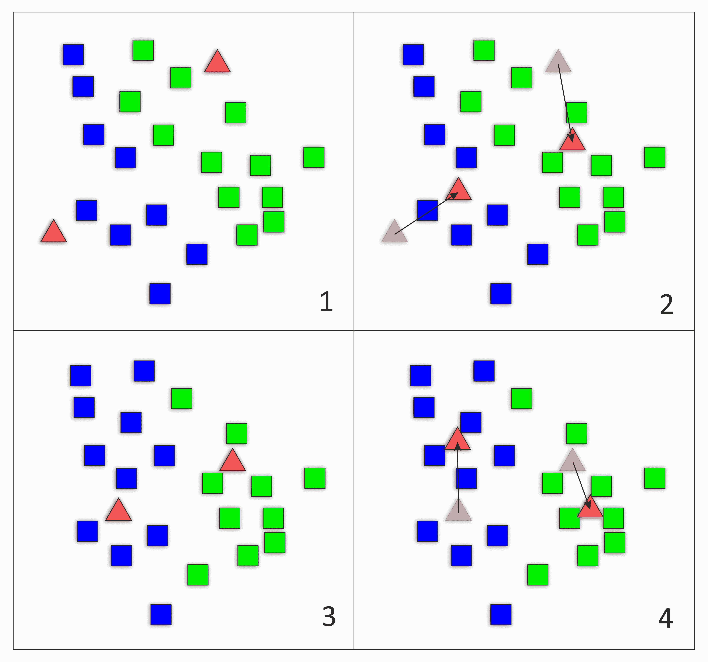

聚类重构循环的图形示例

在子图 1 中，我们开始在随机位置种下可能的质心，并将最接近的数据元素分配给它们；然后在子图 2 中，我们将质心重新配置为新聚类的中心，这反过来又重新配置了聚类（子图 3），直到我们达到稳定状态。元素聚合也可以逐个进行，这将触发更柔和的重配置。这将是本章实际部分的实现策略。

# K-means 实现

在本节中，我们将通过实际样本从基本概念开始回顾 K-means 的概念。

首先，我们将导入所需的库。为了提高对算法的理解，我们将使用`numpy`库。然后我们将使用著名的`matplotlib`库来图形化表示算法：

```py
import numpy as np

import matplotlib
import matplotlib.pyplot as plt

%matplotlib inline
```

这将包含多个二维元素，然后生成候选中心，这些中心将包含四个二维元素。

为了生成数据集，通常使用随机数生成器，但在此情况下，我们希望将样本设置为预定的数字，以便于操作，并允许您手动重复这些过程：

```py
samples=np.array([[1,2],[12,2],[0,1],[10,0],[9,1],[8,2],[0,10],[1,8],[2,9],[9,9],[10,8],[8,9] ], dtype=np.float)
centers=np.array([[3,2], [2,6], [9,3], [7,6]], dtype=np.float)
N=len(samples)
```

让我们表示样本的中心。首先，我们将初始化一个新的`matplotlib`图形，以及相应的坐标轴。`fig`对象将允许我们更改所有图形的参数。

`plt`和`ax`变量名称是引用图形的一般方式和引用图形的一个轴的标准方式。

因此，让我们尝试了解样本的外观。这将通过`matplotlib`库的`scatter`绘图类型来完成。它接受参数为*x*坐标、*y*坐标、大小（以点平方为单位）、标记类型和颜色。

有许多标记可供选择，例如点（`.`）、圆圈（`o`）、方块（`s`）。要查看完整列表，请访问[`matplotlib.org/api/markers_api.html.`](https://matplotlib.org/api/markers_api.html)

让我们看一下以下代码片段：

```py
        fig, ax = plt.subplots()
        ax.scatter(samples.transpose()[0], samples.transpose()[1], marker = 
        'o', s = 100 )
        ax.scatter(centers.transpose()[0], centers.transpose()[1], marker = 
        's', s = 100, color='black')
        plt.plot()
```

现在让我们看一下以下图表：

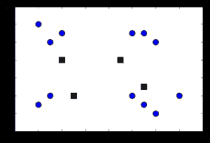

初始聚类状态，中心以黑色方块表示

让我们定义一个函数，给定一个新样本，将返回一个包含到所有当前质心的距离的列表，以便将此新样本分配给其中一个，然后重新计算质心：

```py
    def distance (sample, centroids):
        distances=np.zeros(len(centroids))
        for i in range(0,len(centroids)):
            dist=np.sqrt(sum(pow(np.subtract(sample,centroids[i]),2)))
            distances[i]=dist
        return distances
```

然后，我们需要一个函数，该函数将逐步构建我们应用程序的图形。

它期望最多有 12 个子图，`plotnumber`参数将确定在 6 x 2 矩阵中的位置（`620`将是左上角的子图，621 是右侧的下一个，依此类推）。

之后，对于每个图像，我们将对聚类样本进行散点图绘制，然后绘制当前质心的位置：

```py
    def showcurrentstatus (samples, centers, clusters, plotnumber):
        plt.subplot(620+plotnumber)
        plt.scatter(samples.transpose()[0], samples.transpose()[1], marker = 
        'o', s = 150 , c=clusters)
        plt.scatter(centers.transpose()[0], centers.transpose()[1], marker = 
        's', s = 100, color='black')
        plt.plot()
```

以下名为`kmeans`的函数将使用之前的距离函数来存储样本分配到的质心（它将是一个从`1`到`K`的数字）。

主循环将从样本`0`到`N`，对于每一个样本，它将寻找最近的质心，将质心编号分配给聚类数组的索引`n`，并将样本坐标加到当前分配的质心上。

然后，为了获取样本，我们使用`bincount`方法计算每个质心的样本数量，并通过构建`divisor`数组，我们将一个类别的元素总和除以之前的`divisor`数组，从而得到新的质心：

```py
    def kmeans(centroids, samples, K, plotresults):
        plt.figure(figsize=(20,20))
        distances=np.zeros((N,K))
        new_centroids=np.zeros((K, 2))
        final_centroids=np.zeros((K, 2))
        clusters=np.zeros(len(samples), np.int)

        for i in range(0,len(samples)):
            distances[i] = distance(samples[i], centroids)
            clusters[i] = np.argmin(distances[i])
            new_centroids[clusters[i]] += samples[i]        
            divisor = np.bincount(clusters).astype(np.float)
            divisor.resize([K])
            for j in range(0,K):
            final_centroids[j] = np.nan_to_num(np.divide(new_centroids[j] , 
            divisor[j]))
            if (i>3 and plotresults==True):
                showcurrentstatus(samples[:i], final_centroids, 
                clusters[:i], i-3)
            return final_centroids
```

现在是时候启动 K-means 过程了，使用我们最初设置的初始样本和中心。当前算法将展示聚类如何从少数元素开始，发展到最终状态：

```py
    finalcenters=kmeans (centers, samples, 4, True)
```

让我们看一下以下屏幕截图：

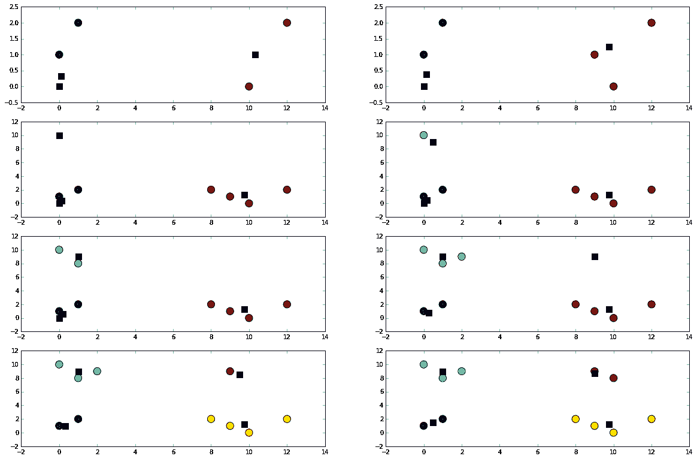

聚类过程的描述，其中质心以黑色方块表示

# 最近邻

K-NN 是另一种经典的聚类方法。它构建样本组，假设每个新样本将与它的邻居具有相同的类别，而不寻找全局代表性的中心样本。相反，它观察环境，寻找每个新样本环境中最频繁的类别。

# K-NN 的原理

K-NN 可以在许多配置中实现，但在这章中，我们将使用半监督方法，从一定数量的已分配样本开始，然后使用主要标准猜测聚类成员资格。

在以下图中，我们对算法进行了分解。它可以总结为以下步骤：

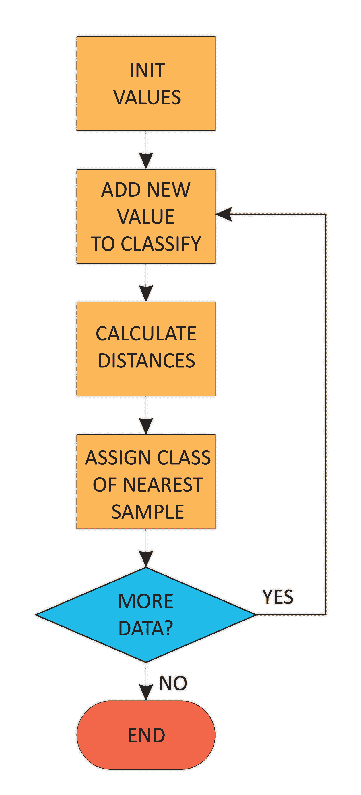

K-NN 聚类过程的流程图

让我们以简化的形式回顾以下所有涉及步骤：

1.  我们将先前已知的样本放置在数据结构中。

1.  然后，我们读取下一个待分类的样本，并计算新样本与训练集中每个样本的欧几里得距离。

1.  我们通过选择最近样本的类别来确定新元素的类别，通过欧几里得距离。K-NN 方法需要 K 个最近样本的投票。

1.  我们重复此过程，直到没有更多剩余样本。

这张图片将给我们一个关于新样本如何被添加的思路。在这种情况下，我们使用`K`为`1`，以简化：

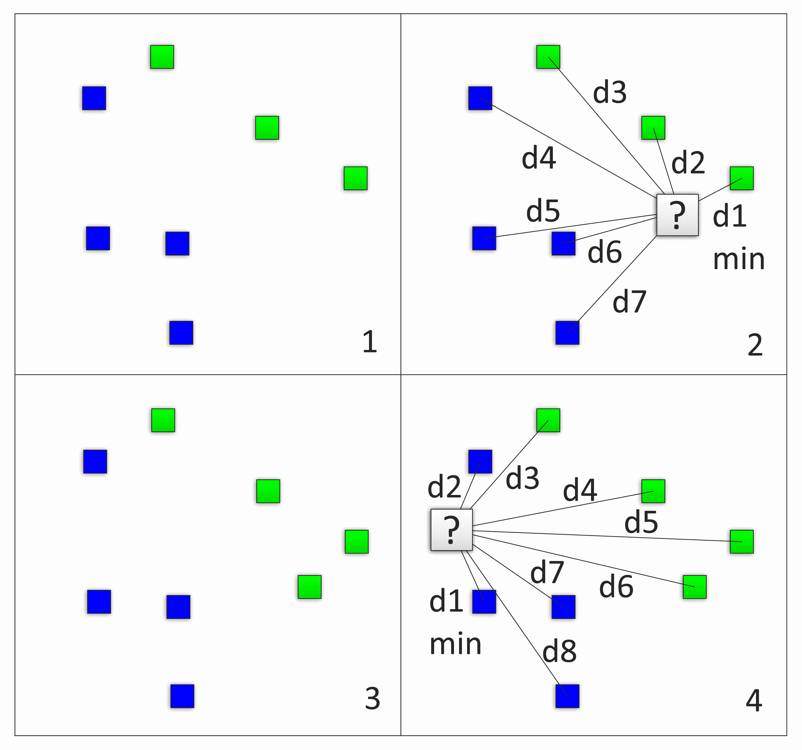

K-NN 循环的示例应用

K-NN 可以使用我们所学到的多种配置之一来实现，但在这章中，我们将使用半监督方法；我们将从一个已经分配了一定数量的样本开始，然后根据训练集的特征来猜测簇的成员资格。

# K-NN 的优缺点

这种方法的优点如下：

+   **简单性**：无需调整参数

+   **无需正式训练**：我们只需要更多的训练示例来改进模型

不利之处如下：

计算成本高 - 在原始方法中，除了实现缓存时，必须计算所有点与新样本之间的距离。

# K-NN 示例实现

对于 K-NN 方法的简单实现，我们将使用 NumPy 和 Matplotlib 库。此外，为了更好地理解，我们将使用 scikit-learn 的 `make_blobs` 方法生成合成数据集，这将生成定义良好且分离的信息组，以便我们有可靠的实现参考。

导入所需的库：

```py
    import numpy as np

    import matplotlib
    import matplotlib.pyplot as plt

    from sklearn.datasets.samples_generator import make_blobs
    %matplotlib inline
```

因此，现在是生成这个示例数据样本的时候了。`make_blobs` 函数的参数包括样本数量、特征或维度的数量、中心或组数、样本是否需要打乱，以及簇的标准差，以控制组样本的分散程度：

```py
    data, features = make_blobs(n_samples=100, n_features = 2, centers=4, 
    shuffle=True, cluster_std=0.8)
    fig, ax = plt.subplots()
    ax.scatter(data.transpose()[0], data.transpose()[1], c=features,marker = 
    'o', s = 100 )
    pl
```

这里是生成的样本聚类的表示：

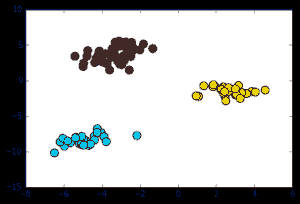

首先，让我们定义我们的 `distance` 函数，它将用于找到所有新元素的邻居。我们基本上提供一个样本，并返回提供的新元素与所有对应元素之间的距离：

```py
    def distance (sample, data):
        distances=np.zeros(len(data))
        for i in range(0,len(data)):
            dist=np.sqrt(sum(pow(np.subtract(sample,data[i]),2)))
            distances[i]=dist
        return distances
```

`add_sample` 函数将接收一个新的二维样本、当前数据集和一个标记相应样本组（在这种情况下为 `0` 到 `3`）的数组。在这种情况下，我们使用 `argpartition` 来获取新样本最近三个邻居的索引，然后使用它们从 `features` 数组中提取一个子集。然后，`bincount` 将返回该三个元素子集上任何不同类别的计数，然后通过 `argmax`，我们将选择该两个元素集中元素最多的组的索引（在这种情况下，类号）：

```py
    def add_sample(newsample, data, features):
        distances=np.zeros((len(data),len(data[0])))
        #calculate the distance of the new sample and the current data
        distances = distance(newsample, data)
        closestneighbors = np.argpartition(distances, 3)[:3]
        closestgroups=features[closestneighbors]
        return np.argmax(np.bincount(closestgroups))
```

然后我们定义我们的主要 `knn` 函数，它接受要添加的新数据，并使用由 `data` 和 `features` 参数表示的原始分类数据来决定新元素的类别：

```py
    def knn (newdata, data, features):
        for i in newdata:
            test=add_sample (i, data, features);
            features=np.append(features, [test],axis=0)
            data=np.append(data, [i],axis=0)
        return data,features
```

最后，是时候启动这个过程了。因此，我们在 `-10` 到 `10` 的范围内定义了一组新的样本，在 `x` 和 `y` 维度上，然后我们将使用它调用我们的 `knn` 例程：

```py
        newsamples=np.random.rand(20,2)*20-8.
    >    finaldata, finalfeatures=knn (newsamples, data, features)
```

现在是时候表示最终结果了。首先，我们将表示初始样本，它们比我们的随机值形成得更好，然后是我们的最终值，用空方框表示（`c='none'`），这样它们将作为这些样本的标记：

```py
    fig, ax = plt.subplots()
    ax.scatter(finaldata.transpose()[0], finaldata.transpose()[1], 
    c=finalfeatures,marker = 'o', s = 100 )
    ax.scatter(newsamples.transpose()[0], newsamples.transpose()
    [1],c='none',marker =  
    's', s = 100 )
    plt.plot()
```

让我们看看下面的图表：

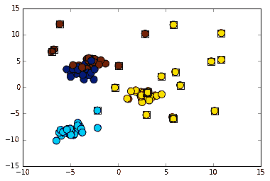

最终聚类状态（新分类的项目用方块标记）

在前面的图表中，我们可以看到我们的简单模型如何随着过程的推进很好地对分组进行资格认证和改革。如图所示，新的分组不一定呈圆形；它们根据 incoming data 的进展方式而变化。

# 超越基础

现在我们已经完成了对两种主要聚类技术示例的审查，让我们探索一些更高级的指标和技术，这样我们就可以将它们放入我们的工具箱中。

# 拐点法

在实现 K-means 时可能出现的疑问之一可能是“我怎么知道目标簇数量是最佳或对数据集最具代表性的？”

对于这个任务，我们有**拐点法**。它由一个独特的统计量组成，用于衡量分组中的总组分散。它通过重复 K-means 过程，使用不断增加的初始簇数量，并计算所有组的总簇内内部距离来实现。

通常情况下，该方法将以一个非常高的值开始（除非我们以正确的质心数量开始），然后我们会观察到总簇内距离会迅速下降，直到达到一个点，它不会显著变化。恭喜，我们找到了所谓的“拐点”，在下面的图表中表现为一个拐点：

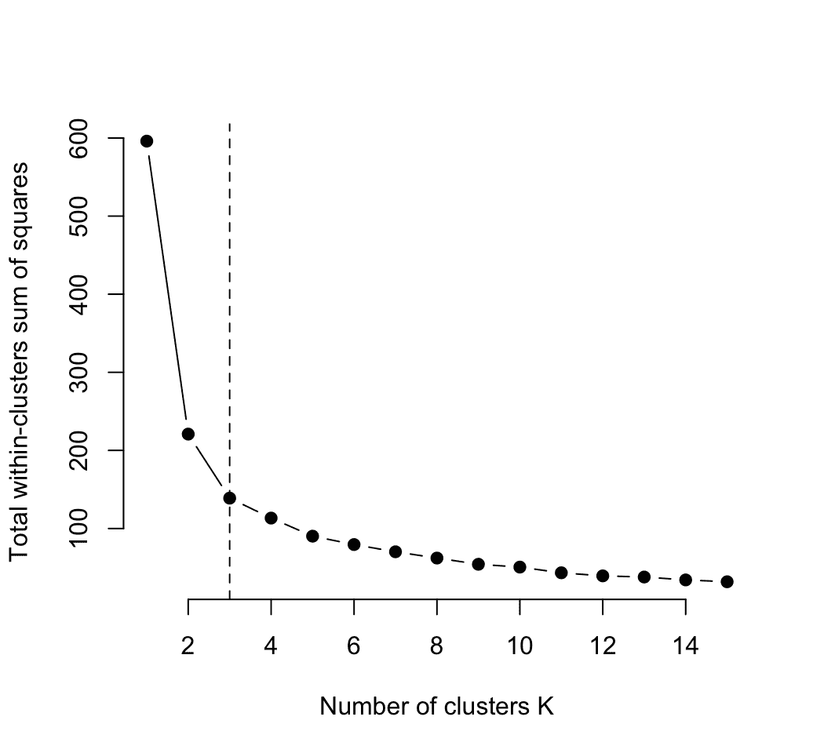

随着簇数量的增加，错误演变的图形表示，以及拐点。

关于这个指标的准确性，正如你所看到的，拐点法是一个启发式方法，而不是数学上确定的，但如果你想要快速估计正确的簇数量，它可能是有用的，尤其是在曲线在某些点突然变化时。

# 摘要

在本章中，我们以极其实用的方式介绍了最简单但仍非常实用的机器学习模型，以便我们在复杂性尺度上开始。

在接下来的章节中，我们将介绍几种回归技术，那时我们将去解决一种我们尚未处理过的新类型的问题，即使使用聚类方法（回归）通过新的数学工具来近似未知值也是可能的。在它里面，我们将使用数学函数来建模过去的数据，并尝试基于这些建模函数来建模新的输出。

# 参考文献

+   Thorndike, Robert L, *Who belongs in the family?,* Psychometrika 18.4 (1953): 267-276.

+   Steinhaus, H，*关于物质分割成部分的问题*。波兰科学院学报 1 (1956): 801–804。

+   MacQueen, James，*一些用于多元观测分类和分析的方法*。第五次伯克利数学统计与概率研讨会论文集。第 1 卷。第 14 号。1967 年。

+   *Cover, Thomas, 和 Peter Hart*，*最近邻模式分类*。IEEE 信息系统传输 13.1 (1967): 21-27。
