# 第五章：神经网络

作为一名开发者，你一定从每天在常规设备上看到的令人难以置信的神奇应用中产生了对机器学习的兴趣——自动语音翻译、图片风格转换、从样本图片生成新图片的能力等等。做好准备吧...我们将直接进入使所有这些成为可能的技术。

线性和逻辑模型，如我们所观察到的，在训练数据集的复杂度方面存在某些局限性，即使它们是高度细致和高效解决方案的基础。

一个模型需要有多复杂才能捕捉到作者的写作风格、猫和狗的图像概念，或基于视觉元素的植物分类？这些事情需要大量低级和高级细节的汇总，在我们的大脑中是通过专门的神经元集合捕获的，在计算机科学中是通过神经网络模型捕获的。

与预期相反，在这本书中，我将省略对神经系统的典型介绍，包括其能力、神经系统中的神经元数量、其化学特性等等。我发现这些话题给问题增添了一种不可能性，但我们即将学习的模型是简单的数学方程式，具有计算对应物，我们将尝试强调这一点，以便你，一个对算法感兴趣的人，能够轻松理解它们。

在本章中，我们将涵盖以下主题：

+   神经模型的历史，包括感知器和 ADALINE

+   神经网络和它们解决的问题类型

+   多层感知器

+   实现一个简单的神经网络层来模拟二元函数

本章将使你能够使用你每天看到的绝大多数令人惊叹的机器学习应用的基础构建块。那么，让我们开始吧！

# 神经模型的历史

在计算机科学的时间尺度上，神经模型作为一种试图构建大脑内部工作表示的学科，起源相当遥远。它们甚至可以追溯到现代计算机起源的中期——20 世纪 40 年代中期。

在那时，神经科学和计算机科学开始通过研究模拟大脑处理信息的方式开始合作，从其构成单元——神经元开始。

人类大脑学习功能的第一种数学方法可以归功于麦卡洛克和皮茨，他们在 1943 年的论文《内在于神经活动的逻辑演算：*A Logical Calculus of Ideas Immanent in Nervous Activity:*》中提出。

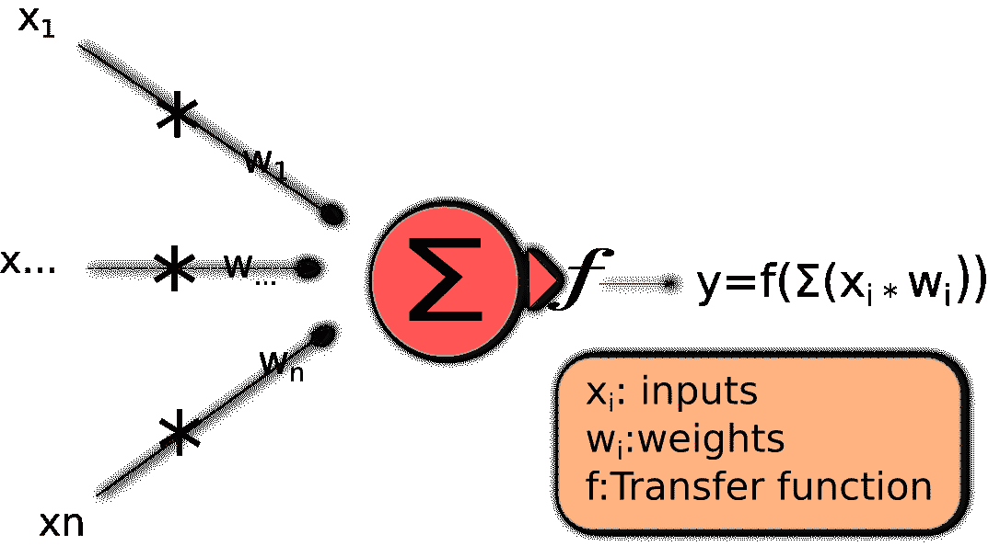

麦卡洛克和皮茨模型

这个简单的模型是一个基本但现实的算法模型。如果你使用线性函数作为传递函数，你会对发生的事情感到惊讶；这是一个简单的线性模型，就像我们在上一章中看到的那样。

你可能已经注意到我们现在使用`w`字母来指定模型要调整的参数。从现在开始，这将成为新的标准。我们旧的线性回归模型中的`β`参数现在将是`w`。

但模型还没有确定调整参数的方法。让我们向前推进到 20 世纪 50 年代，回顾一下**感知器**模型。

# 感知器模型

感知器模型是实现人工神经元的最简单方法之一。它最初在 20 世纪 50 年代末开发，第一个硬件实现是在 20 世纪 60 年代进行的。最初，它是机器的名字，后来变成了算法的名字。是的，感知器并不是我们一直认为的奇怪实体，它们是你作为开发者每天处理的算法！

让我们看看以下步骤，并学习它是如何工作的：

1.  使用随机（低值）分布初始化权重。

1.  选择一个输入向量并将其呈现给网络。

1.  计算指定输入向量和权重值的网络的输出*y'*。

感知器的函数如下：

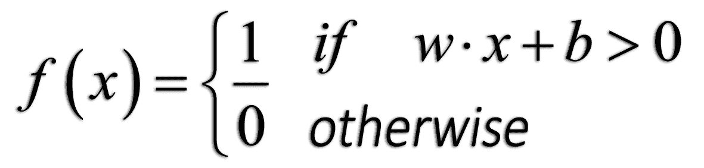

1.  如果*y’ ≠ y*，通过添加变化*Δw = yxi*来修改所有连接，*wi*。

1.  返回到*步骤 2*。

它基本上是一个学习二进制分类函数并将实函数映射到单个二进制函数的算法。

让我们在以下图中描述感知器的新架构，并分析算法的新方案：

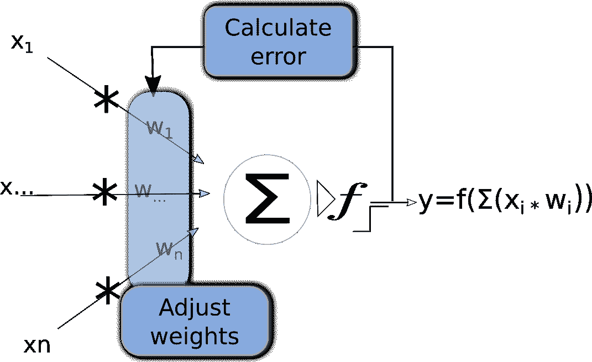

感知器模型（与之前模型的变化突出显示）

感知器建立在它的前辈们的思想之上，但这里的创新之处在于我们增加了一个适当的学习机制！在下面的图中，我们用预定的公式突出了模型的新特性——反馈回路，其中我们计算我们的结果的误差，以及权重的调整：

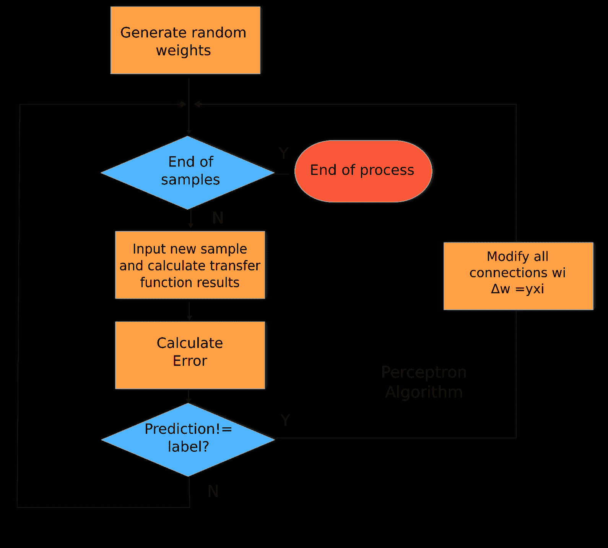

感知器算法流程图

# 提高我们的预测能力——ADALINE 算法

ADALINE 是另一种用于训练神经网络的算法（是的，记住我们正在谈论算法）。在某种程度上，ADALINE 比感知器更先进，因为它增加了一种新的训练方法：梯度下降，你现在应该已经知道了。此外，它改变了在将激活输出应用于权重总和之前测量误差的点：

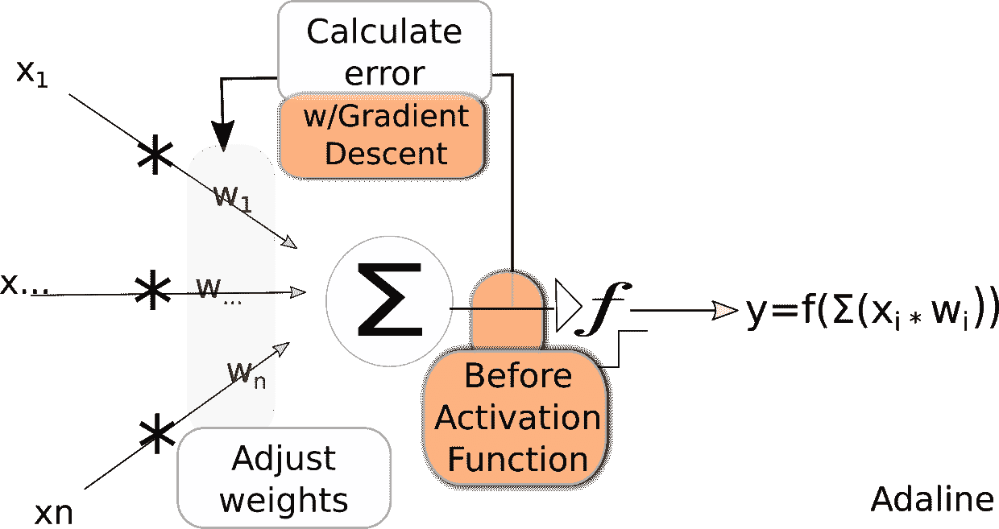

Adaline 模型（感知器增加的部分突出显示）

因此，这是以结构化方式表示 ADALINE 算法的标准方法。作为一个算法由一系列步骤组成，让我们以更详细的方式汇总这些步骤，并添加一些额外的数学细节：

1.  使用随机（低值）分布初始化权重。

1.  选择一个输入向量并将其呈现给网络。

1.  计算指定输入向量和权重值的网络的输出 *y'*。

1.  我们将取的输出值将是求和后的值：

**y=Σ(xi * wi)**

1.  计算误差，比较模型输出与正确标签 *o*：

*E=(o-y)²*

它看起来像我们已经见过的东西吗？是的！我们基本上是在解决一个回归问题。

1.  使用以下梯度下降递归调整权重：

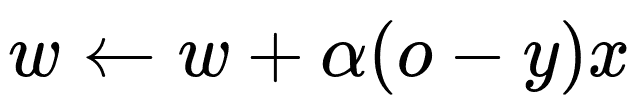

1.  返回到 *步骤 2*：

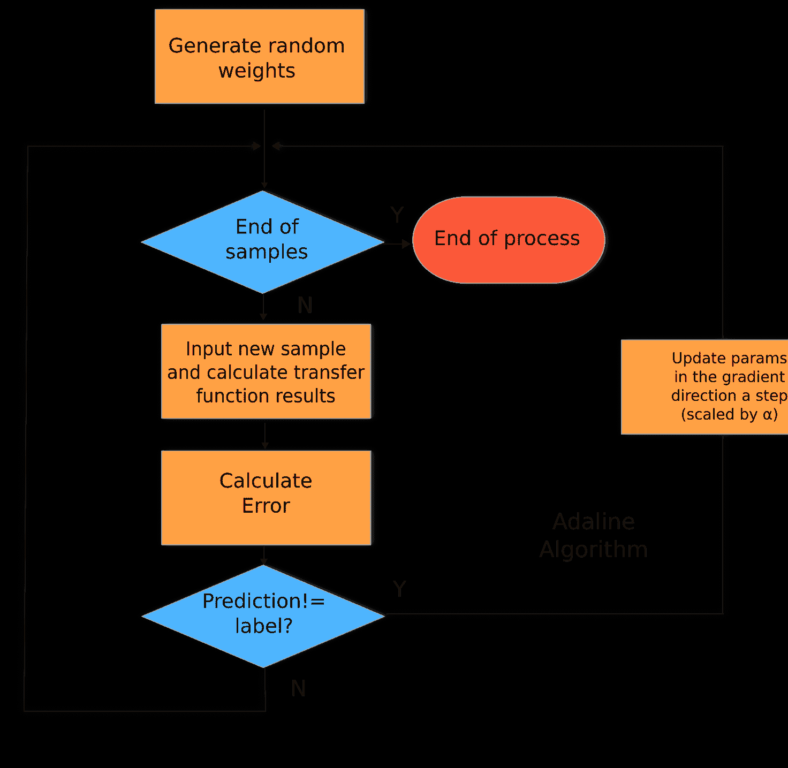

Adaline 算法流程图

# 感知器和 ADALINE 之间的相似之处和不同之处

我们已经介绍了现代神经网络先驱的简化解释。正如你所见，现代模型的所有元素几乎都是在 1950 年代和 1960 年代确定的！在继续之前，让我们尝试比较一下方法：

+   **相似之处**:

    +   它们都是算法（重要的是要强调这一点）

    +   它们应用于单层神经网络模型

    +   它们是二分类的分类器

    +   它们都有一个线性决策边界

    +   它们都可以迭代学习，样本样本（感知器自然，ADALINE 通过随机梯度下降）

    +   它们都使用阈值函数

+   **差异**:

    +   感知器使用最终的类别决策来训练权重

    +   ADALINE 使用连续的预测值（来自网络输入）来学习模型系数，并使用连续的浮点数等级来衡量误差的微妙变化，而不是布尔或整数

在我们完成单层架构和模型之前，我们将回顾 1960 年代末的一些发现，这些发现引发了神经网络社区的热烈讨论，并被认为是第一个 AI 寒冬，即对机器学习研究兴趣的突然下降。幸运的是，在那之后几年，研究人员找到了克服他们面临局限性的方法，但这将在本章的后续部分进行讨论。

# 早期模型的局限性

模型本身现在具有任何正常神经网络模型的大部分元素，但它有自己的问题。经过几年的快速发展，Minsky 和 Papert 在 1969 年出版的书籍 *P**erceptrons* 由于其主要观点——感知器只能处理线性可分问题，而这些问题只是从业者认为可解问题的一小部分——在领域内引起了轰动。在某种程度上，这本书暗示感知器几乎无用，除了最简单的分类任务。

这种新发现的缺陷可以表示为模型无法表示 XOR 函数，这是一个 `布尔` 函数，当输入不同时输出为 `1`，当它们相等时输出为 `0`：

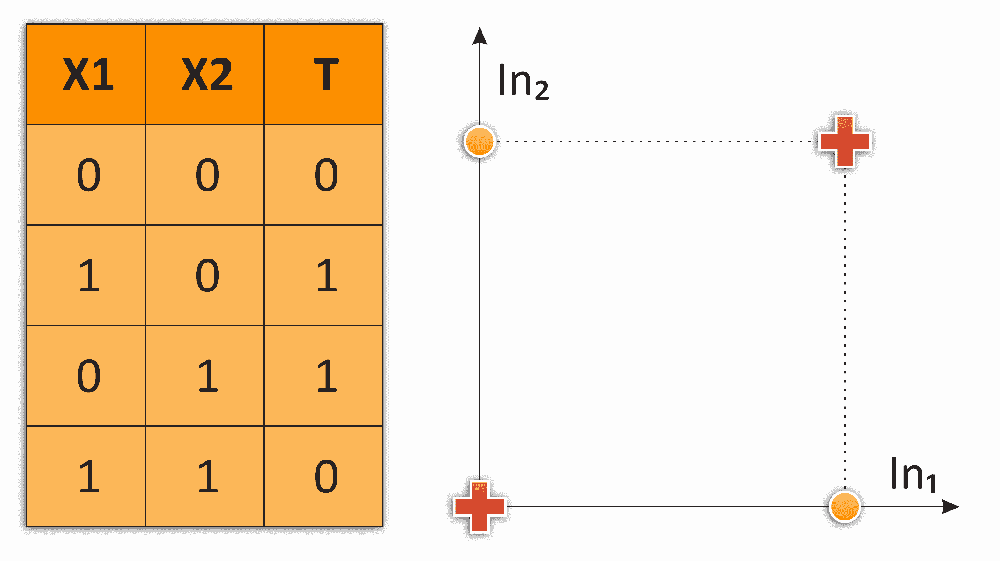

模拟 XOR 函数的问题。没有任何一条线能够正确地分离 0 和 1 的值

如前图所示，主要问题是两个类别（交叉和点）都不是线性可分的；也就是说，我们无法在平面上用任何线性函数将它们分开。

这个检测到的问题导致该领域活动减少，持续了大约五年，直到反向传播算法的发展，这始于 20 世纪 70 年代中期。

# 单层和多层感知器

现在，我们将讨论更现代的时期，基于先前概念，以允许更复杂的现实元素被建模。

在本节中，我们将直接研究**多层感知器**（**MLPs**），这是最常用的配置，并将**单层感知器**视为前者的一个特例，突出它们之间的差异。

单层和多层感知器在 20 世纪 70 年代和 80 年代是最常用的架构，在神经网络的能力方面取得了巨大的进步。它们带来的主要创新如下：

+   它们是前馈网络，因为计算从输入开始，从一层流向另一层，没有任何循环（信息永远不会返回）

+   他们使用反向传播方法来调整他们的权重

+   将`step`函数作为传递函数的使用被非线性函数如 sigmoid 所取代

# MLP 起源

在探索了单单元神经网络模型的力量之后，一个明显的步骤是生成层或一组通常相互连接的单元（我们定义连接为将一个单元的输出发送给另一个单元的求和部分）：

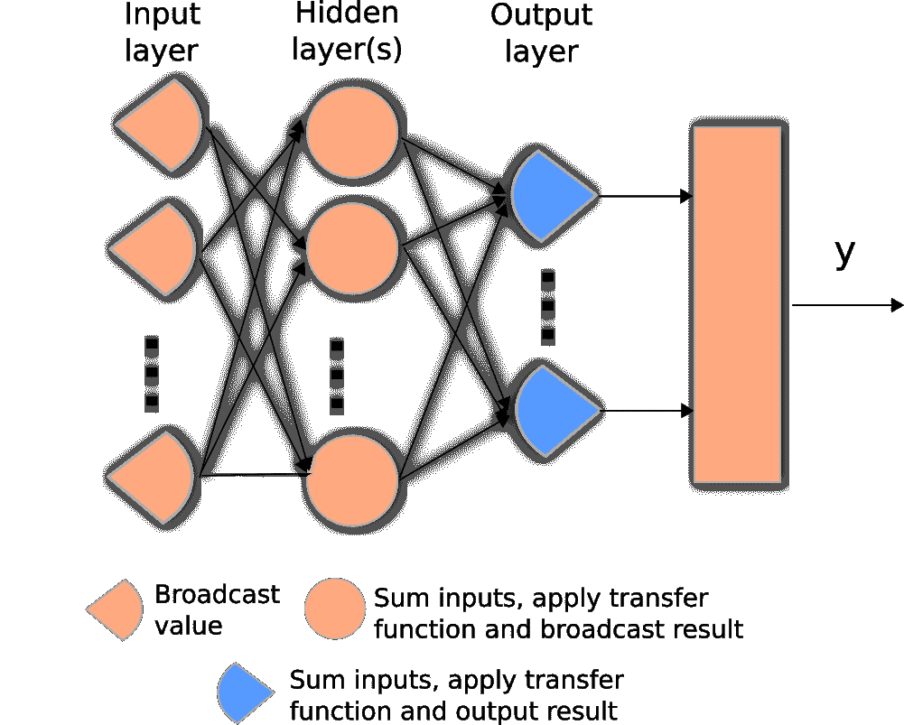

简单多层前馈神经网络示意图

# 前馈机制

在网络操作的这一阶段，数据将被输入到第一层，并从每个单元流向下一层的相应单元。然后它将在隐藏层中进行求和并传递，最后由输出层处理。这个过程是完全单向的，因此我们避免了数据流中的任何递归复杂性。

前馈机制在 MLP 中对应于建模过程的训练部分，负责提高模型性能。通常选择的算法被称为**反向传播**。

# 选择的优化算法——反向传播

从感知器算法开始，每个神经网络架构都有一种基于真实值与模型输出比较来优化其内部参数的方法。常见的假设是取（当时简单的）模型函数的导数，并迭代地朝着最小值工作。

对于复杂的多层网络，存在额外的开销，这与输出层的输出是函数复合的长链的结果有关，其中每一层的输出都被下一层的传递函数所包裹。因此，输出导数将涉及一个极其复杂的函数的导数。在这种情况下，提出了反向传播方法，并取得了优异的结果。

反向传播可以总结为一种用于计算导数的算法。其主要属性是计算效率高，适用于复杂函数。它也是线性感知器中最小均方误差算法的推广，这是我们已知的！

在反向传播算法中，错误的职责将在整个架构中应用于所有应用于数据的函数。因此，目标是最小化误差，即损失函数的梯度，在一系列深度复合函数上，这又将再次得到链式法则的帮助。

现在是时候定义我们现代神经网络的一般算法了，以下是一些步骤：

1.  计算从输入到输出的前向信号。

1.  根据预测值 *a[k]* 和目标值 *t[k]* 计算输出误差 *E*。

1.  通过加权前一层中的权重和关联激活函数的梯度来反向传播错误信号。

1.  根据反向传播的错误信号和从输入的前向信号，计算参数的梯度 𝛿*E*/𝛿*θ*。

1.  使用计算出的梯度更新参数 *θ ← θ - η* 𝛿E/𝛿θ *.

让我们以图形方式回顾这个过程：

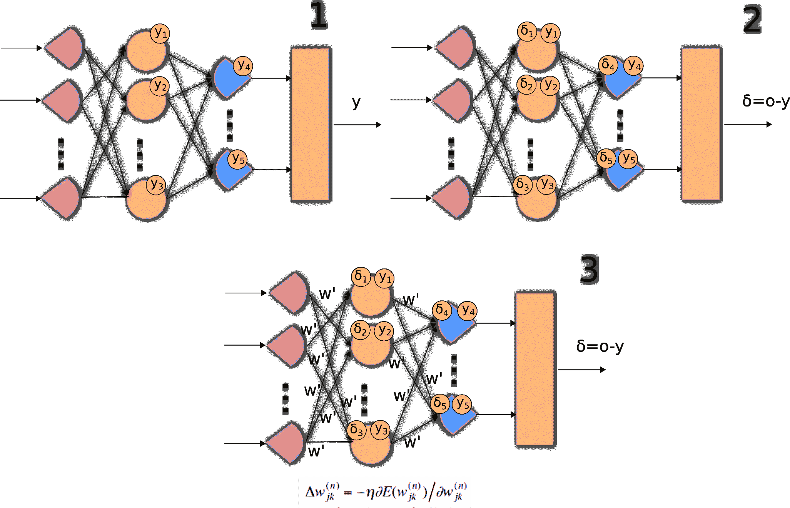

逐步展示前向传播和反向传播训练过程

在以下图中，我们将整个过程以算法方式表示。您可以看到与先前优化方法的巧合之处，以及涉及的计算块数量较少：

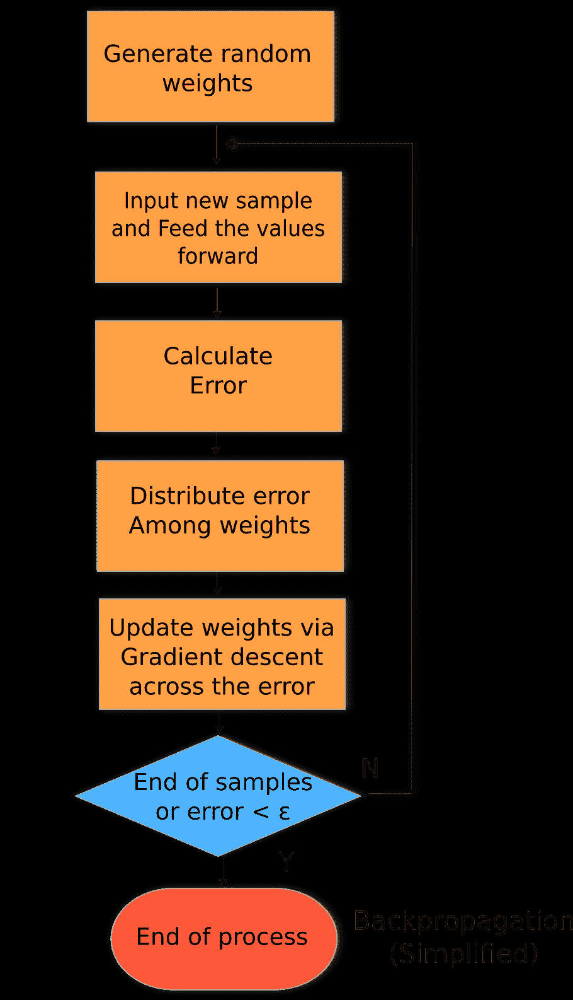

前向/反向传播方案的流程图

# 要解决的问题类型

神经网络可以用于回归问题和分类问题。常见的架构差异在于输出层：为了能够得到基于实数的结果，不应应用任何标准化函数，如 sigmoid 函数。这样，我们不会将变量的结果改变为许多可能的类别值之一，从而得到一系列可能的连续结果。让我们看看以下要解决的问题类型：

+   **回归/函数逼近问题**：这类问题使用最小平方误差函数、线性输出激活和 sigmoid 隐藏激活。这将给出一个输出实数值。

+   **分类问题（两类，每类一个输出）**：在这种问题中，我们通常有一个交叉熵损失函数、一个 S 型输出和隐藏激活。S 型函数将给我们一个类发生的概率或非发生的概率。

+   **分类问题（多类，每类一个输出）**：在这种问题中，我们将有一个交叉熵损失函数、softmax 输出和 sigmoid 隐藏激活，以便对单个输入的任何可能的类输出概率。

# 使用单层感知器实现简单函数

看一下以下代码片段，以实现一个单层感知器的单个函数：

```py
    import numpy as np
    import matplotlib.pyplot as plt
    plt.style.use('fivethirtyeight')
    from pprint import pprint
    %matplotlib inline
    from sklearn import datasets
    import matplotlib.pyplot as plt
```

# 定义和绘制传递函数类型

仅靠单变量线性分类器，神经网络的学习能力不会很好。甚至在机器学习中的一些轻微复杂的问题也涉及多个非线性变量，因此开发了多种变体来替代感知器的传递函数。

为了表示非线性模型，激活函数中可以使用多种不同的非线性函数。这意味着神经元对输入变量变化的反应方式将发生变化。在接下来的章节中，我们将定义主要的不同的传递函数，并通过代码定义和表示它们。

在本节中，我们将开始使用一些 **面向对象编程**（**OOP**）技术来表示问题域的实体。这将使我们能够在示例中以更清晰的方式表示概念。

让我们先创建一个 `TransferFunction` 类，它将包含以下两个方法：

+   `getTransferFunction(x)`: 此方法将返回由类类型确定的激活函数

+   `getTransferFunctionDerivative(x)`: 此方法将明确返回其导数

对于这两个函数，输入将是一个 NumPy 数组，函数将逐元素应用，如下所示：

```py
    >class TransferFunction:
        def getTransferFunction(x):
            raise NotImplementedError
        def getTransferFunctionDerivative(x):
            raise NotImplementedError
```

# 表示和理解传递函数

让我们看一下以下代码片段，以了解传递函数是如何工作的：

```py
    def graphTransferFunction(function):
        x = np.arange(-2.0, 2.0, 0.01)
        plt.figure(figsize=(18,8))
        ax=plt.subplot(121)
        ax.set_title(function.__name__)
        plt.plot(x, function.getTransferFunction(x))

        ax=plt.subplot(122)
        ax.set_title('Derivative of ' + function.__name__)
        plt.plot(x, function.getTransferFunctionDerivative(x))
```

# S 型或逻辑函数

S 型或逻辑函数是标准的激活函数，非常适合用于计算分类属性中的概率。首先，让我们准备一个函数，该函数将用于绘制所有传递函数及其导数，范围从公共的 `-2.0` 到 `2.0`，这将使我们能够看到它们在 *y* 轴附近的主要特征。

S 型函数的经典公式如下：

```py
    class Sigmoid(TransferFunction):  #Squash 0,1
        def getTransferFunction(x):
            return 1/(1+np.exp(-x))
        def getTransferFunctionDerivative(x):
        return x*(1-x)

    graphTransferFunction(Sigmoid)
```

看一下以下图表：

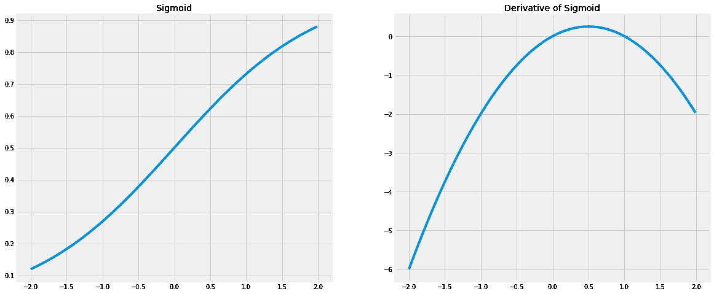

# 玩转 S 型函数

接下来，我们将进行一项练习，以了解 sigmoid 函数在乘以权重并偏移以适应最终函数的最小值时是如何变化的。然后我们首先改变单个 sigmoid 函数的可能参数，看看它是如何拉伸和移动的：

```py
  ws=np.arange(-1.0, 1.0, 0.2)
    bs=np.arange(-2.0, 2.0, 0.2)
    xs=np.arange(-4.0, 4.0, 0.1)
    plt.figure(figsize=(20,10))
    ax=plt.subplot(121)
    for i in ws:
        plt.plot(xs,  Sigmoid.getTransferFunction(i *xs),label= str(i));
    ax.set_title('Sigmoid variants in w')
    plt.legend(loc='upper left');

    ax=plt.subplot(122)
    for i in bs:
        plt.plot(xs,  Sigmoid.getTransferFunction(i +xs),label= str(i));
    ax.set_title('Sigmoid variants in b')
    plt.legend(loc='upper left');
```

看一下下面的图表：

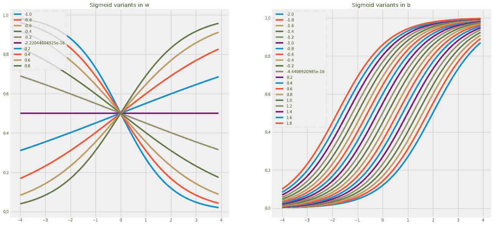

让我们看一下下面的代码片段：

```py
    class Tanh(TransferFunction):  #Squash -1,1
        def getTransferFunction(x):
            return np.tanh(x)
        def getTransferFunctionDerivative(x):
            return np.power(np.tanh(x),2)
    graphTransferFunction(Tanh)
```

让我们看一下下面的图表：

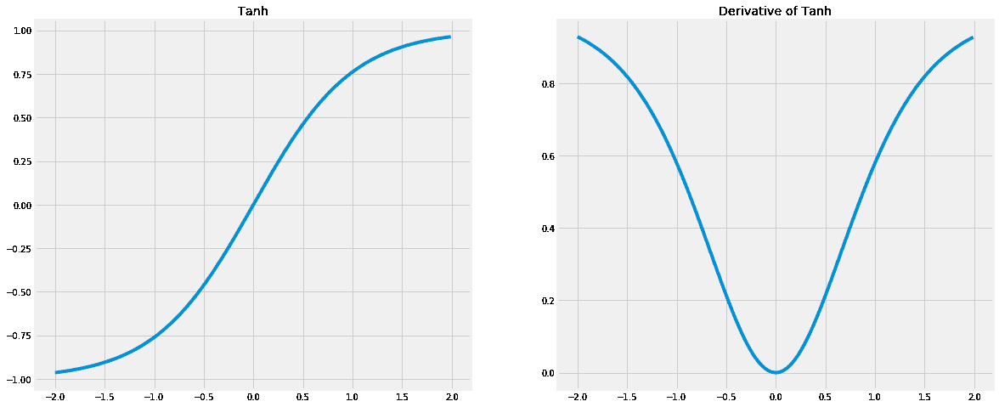

# 矩形线性单元或 ReLU

**ReLU** 被称为矩形线性单元，它的一大优点是它不受梯度消失问题的影响，这个问题通常包括网络的第一层趋向于零值，或者是一个非常小的 epsilon：

```py
    class Relu(TransferFunction):
        def getTransferFunction(x):
            return x * (x>0)
        def getTransferFunctionDerivative(x):
            return 1 * (x>0)
    graphTransferFunction(Relu)
```

让我们看一下下面的图表：

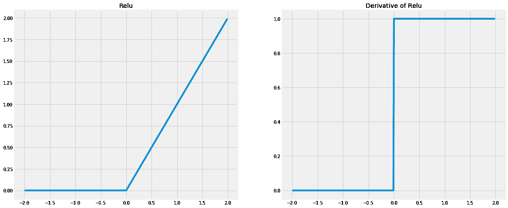

# 线性传递函数

让我们看一下下面的代码片段，以了解线性传递函数：

```py
    class Linear(TransferFunction):
        def getTransferFunction(x):
            return x
        def getTransferFunctionDerivative(x):
            return np.ones(len(x))
    graphTransferFunction(Linear)
```

让我们看一下下面的图表：

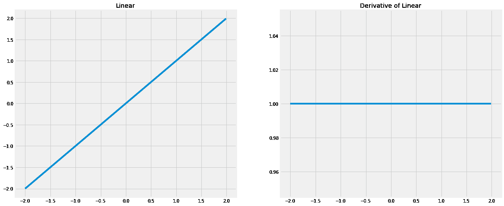

# 定义神经网络的损失函数

就像机器学习中的每一个模型一样，我们将探讨我们将使用的可能函数，以确定我们的预测和分类做得有多好。

我们将要做的第一种区分是 L1 和 L2 误差函数类型。

L1，也称为**最小绝对偏差**（**LAD**）或**最小绝对误差**（**LAE**），具有非常有趣的属性，它简单地由模型最终结果与预期结果之间的绝对差值组成，如下所示：

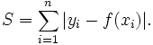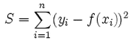

# L1 与 L2 属性

现在是时候对两种类型的损失函数进行面对面比较了：

+   **鲁棒性**：L1 是一个更鲁棒的损失函数，它可以表示为函数在受到异常值影响时的抵抗力，它将二次函数投影到非常高的值。因此，为了选择 L2 函数，我们应该对其进行非常严格的数据清理，以便它能够高效运行。

+   **稳定性**：稳定性属性评估了当出现大误差值时，误差曲线跳动的程度。L1 更不稳定，尤其是在非归一化数据集的情况下（因为`[-1, 1]`范围内的数字在平方后会减小）。

+   **解的唯一性**：正如其二次性质所暗示的，L2 函数确保我们在寻找最小值时将有一个唯一的答案。L2 总是有一个唯一的解，但 L1 可能有多个解，因为我们可以找到许多路径，这些路径以分段线性函数的形式具有最小长度，与 L2 情况下的单线距离相比。

关于使用，过去属性的总和允许我们在正常情况下使用 L2 误差类型，特别是在解唯一性方面，这在我们开始最小化误差值时给我们提供了所需的确定性。在第一个例子中，我们将从简单的 L1 误差函数开始，用于教育目的。

让我们通过绘制样本 L1 和 L2 损失误差函数的误差结果来探索这两种方法。在下一个简单的例子中，我们将展示两种误差的非常不同的性质。在前两个例子中，我们将输入规范化在`-1`和`1`之间，然后是超出该范围的值。

如您所见，从样本`0`到`3`，二次误差稳步且连续地增加，但与非归一化数据相比，它可能会爆炸，尤其是在异常值的情况下，如下面的代码片段所示：

```py
    sampley_=np.array([.1,.2,.3,-.4, -1, -3, 6, 3])
    sampley=np.array([.2,-.2,.6,.10, 2, -1, 3, -1])

    ax.set_title('Sigmoid variants in b')
    plt.figure(figsize=(10,10))
    ax=plt.subplot()
    plt.plot(sampley_ - sampley, label='L1')
    plt.plot(np.power((sampley_ - sampley),2), label="L2")
    ax.set_title('L1 vs L2 initial comparison')
    plt.legend(loc='best')
    plt.show()
```

让我们看一下下面的图表：

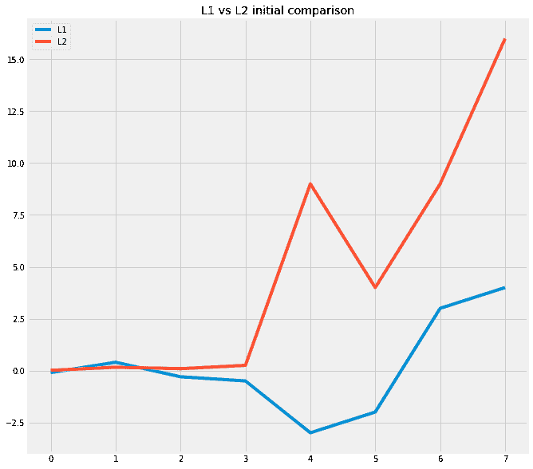

让我们以`LossFunction`类和`getLoss`方法的形式定义损失函数，该方法接收两个 NumPy 数组作为参数，`y_`或估计的函数值，以及`y`，期望值：

```py
    class LossFunction:
        def getLoss(y_ , y ):
            raise NotImplementedError

    class L1(LossFunction):
        def getLoss(y_, y):
            return np.sum (y_ - y)

    class L2(LossFunction):
        def getLoss(y_, y):
            return np.sum (np.power((y_ - y),2))
```

现在是定义目标函数的时候了，我们将将其定义为简单的`Boolean`。为了允许更快地收敛，它将第一个输入变量和函数的输出之间有一个直接的关系：

```py
    # input dataset
    X = np.array([  [0,0,1],
                    [0,1,1],
                    [1,0,1],
                    [1,1,1] ])

    # output dataset            
    y = np.array([[0,0,1,1]]).T
```

我们将使用的第一个模型是一个非常简单的神经网络，具有三个细胞和每个细胞的权重，没有偏差，以保持模型复杂度最小：

```py
    # initialize weights randomly with mean 0
    W = 2*np.random.random((3,1)) - 1
    print (W)
```

看一下以下由运行前面的代码生成的输出：

```py
    [[ 0.52014909]
     [-0.25361738]
     [ 0.165037  ]]
```

然后我们将定义一组变量来收集模型的误差、权重和训练结果进度：

```py
    errorlist=np.empty(3);
    weighthistory=np.array(0)
    resultshistory=np.array(0)
```

然后就是进行迭代误差最小化的时候了。在这种情况下，它将包括通过权重和神经元的传递函数 100 次传递整个真实表，调整权重的方向以减小误差。

注意，这个模型没有使用学习率，所以它应该快速收敛（或发散）：

```py
    for iter in range(100):

        # forward propagation
        l0 = X
        l1 = Sigmoid.getTransferFunction(np.dot(l0,W))
        resultshistory = np.append(resultshistory , l1)

        # Error calculation
        l1_error = y - l1
        errorlist=np.append(errorlist, l1_error)

        # Back propagation 1: Get the deltas
        l1_delta = l1_error * Sigmoid.getTransferFunctionDerivative(l1)

        # update weights
        W += np.dot(l0.T,l1_delta)
        weighthistory=np.append(weighthistory,W)
```

让我们简单地回顾一下最后的评估步骤，通过打印`l1`的输出值。现在我们可以看到，我们正在非常直接地反映原始函数的输出：

```py
    print (l1)
```

看一下以下由运行前面的代码生成的输出：

```py
    [[ 0.11510625]
     [ 0.08929355]
     [ 0.92890033]
     [ 0.90781468]]
```

为了更好地理解这个过程，让我们看看参数随时间的变化。首先，让我们绘制神经元权重图。如您所见，它们从随机状态变为接受第一列的整个值（这总是正确的），然后变为第二列几乎为`0`（正确 50%的时间），然后变为第三列的`-2`（主要是因为它必须触发表中的前两个元素的`0`）：

```py
    plt.figure(figsize=(20,20))
    print (W)
    plt.imshow(np.reshape(weighthistory[1:],(-1,3))[:40], cmap=plt.cm.gray_r,     
    interpolation='nearest');
```

看一下以下输出，这是通过运行前面的代码生成的：

```py
[[ 4.62194116]
 [-0.28222595]
 [-2.04618725]]
```

让我们看一下下面的截图：

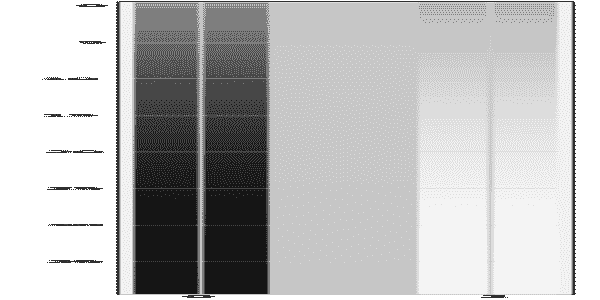

让我们也回顾一下我们的解决方案是如何演变（在前 40 次迭代中）直到达到最后一次迭代；我们可以清楚地看到收敛到理想值：

```py
    plt.figure(figsize=(20,20))
    plt.imshow(np.reshape(resultshistory[1:], (-1,4))[:40], cmap=plt.cm.gray_r,     
    interpolation='nearest');
```

让我们看一下以下截图：


我们可以看到错误是如何演变并趋向于零的，在不同的时期。在这种情况下，我们可以观察到它从负值摆动到正值，这是可能的，因为我们首先使用了 L1 误差函数：

```py
    plt.figure(figsize=(10,10))
    plt.plot(errorlist);
```

让我们看一下以下截图：

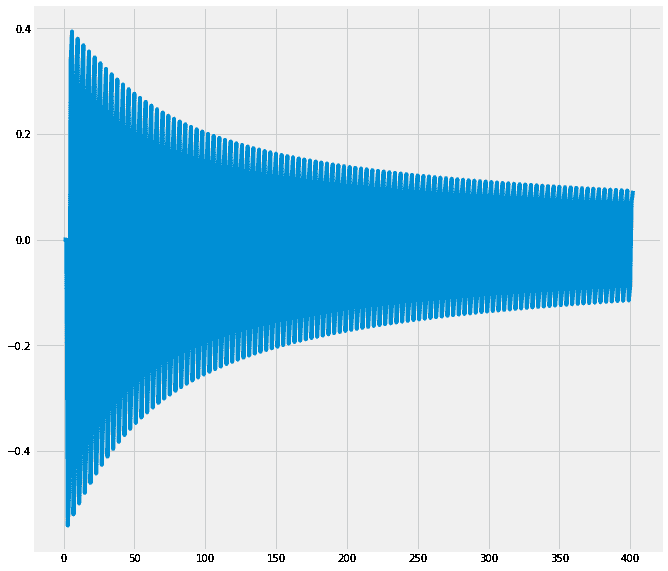

简单神经网络训练误差的下降描述

# 摘要

在本章中，我们通过实现我们的第一个神经网络，迈出了解决复杂问题的重要一步。现在，以下架构将包含熟悉元素，我们将能够将本章获得的知识应用到新的架构中。

在下一章中，我们将探索更复杂的模型和问题，使用更多层和特殊配置，例如卷积和 dropout 层。

# 参考文献

参考以下内容：

+   McCulloch, Warren S. 和 Walter Pitts*，*神经活动中内在思想的逻辑演算。数学生物物理学通报 5.4 (1943)：115-133.* Kleene, Stephen Cole。神经网和有限自动机中事件的表现。RAND 项目空军圣莫尼卡，1951。

+   Farley, B. W. A. C. 和 W. Clark*，*通过数字计算机模拟自组织系统。IRE 专业组信息理论交易 4.4 (1954)：76-84。

+   Rosenblatt, Frank*，《感知器：大脑中信息存储和组织的概率模型》，心理评论 65.6 (1958)：386.Rosenblatt, Frank. x.

+   神经动力学原理：感知器和大脑机制理论。斯巴丹图书，华盛顿特区，1961

+   Werbos, P.J. (1975)，*超越回归：行为科学预测和分析的新工具。*

+   Preparata, Franco P. 和 Michael Ian Shamos*，“引言。”计算几何。斯普林格纽约，1985\. 1-35.*

+   Rumelhart, David E.，Geoffrey E. Hinton 和 Ronald J*，Williams。通过误差传播学习内部表示。No. ICS-8506\. 加利福尼亚大学圣地亚哥认知科学研究所，1985.*

+   Rumelhart, James L. McClelland 和 PDP 研究组。*并行分布式处理：认知微观结构的探索，第 1 卷：基础。麻省理工学院出版社，1986.*

+   Cybenko, G. 1989*. 通过 Sigmoid 函数的叠加进行逼近 数学控制、信号与系统，2(4)，303–314.*

+   Murtagh, Fionn*。用于分类和回归的多层感知器。神经计算 2.5 (1991)：183-197.*

+   Schmidhuber, Jürgen*。神经网络中的深度学习：概述。神经网络 61 (2015)：85-117.*
