# 第七章：循环神经网络

在我们回顾了深度学习的最新发展之后，我们现在已经达到了机器学习的尖端，我们现在通过一系列称为 **循环神经网络（RNNs）** 的新算法，给我们的模型增加了一个非常特殊的维度（时间，因此是输入序列）。

# 解决有序问题——RNNs

在前面的章节中，我们考察了许多模型，从简单的到更复杂的，它们有一些共同的特性：

+   它们接受独特且独立的输入

+   它们有独特且固定大小的输出

+   输出将完全取决于当前输入的特征，而不依赖于过去或之前的输入

在现实生活中，大脑处理的信息具有固有的结构和顺序，我们感知到的每一个现象的组织和序列都会影响我们如何处理它们。这包括语音理解（句子中单词的顺序）、视频序列（视频中的帧顺序）和语言翻译。这促使新的模型被创造出来。其中最重要的模型被归类在 RNN 的范畴下。

# RNN 定义

RNNs 是 **人工神经网络**（**ANN**）模型，其输入和输出都是序列。一个更正式的定义可以表达如下：

“一个 RNN 通过一个固定维度的多维向量（称为隐藏状态）来表示一个序列，该向量使用复杂的非线性函数结合新的观察结果。”

RNNs 具有高度的表达能力，可以实现任意内存限制的计算，因此，它们可以被配置以在困难的序列任务上实现非平凡的性能。

# 要建模的序列类型

RNNs 在输入和输出领域都使用序列模型。基于这一点，我们可以有所有可能的组合来解决不同类型的问题。在下面的图中，我们展示了该领域使用的主要架构，然后是递归架构的参考：

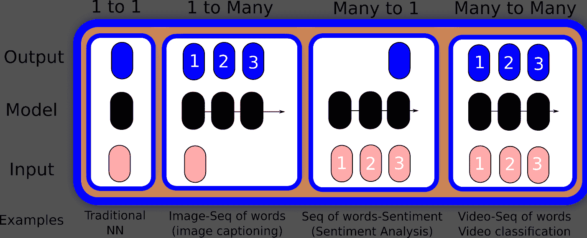

序列模式类型

# RNN 的发展

RNNs 的起源与其他现代神经网络架构惊人地相似，可以追溯到 20 世纪 80 年代的 Hopfield 网络，但在 20 世纪 70 年代就有对应的网络。

循环架构第一次迭代的常见结构可以表示如下：

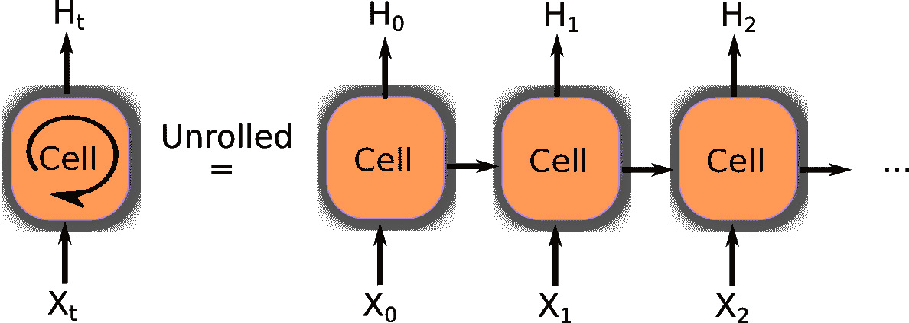

循环单元展开

经典的 RNN 节点具有与自身的循环连接，因此它们可以随着输入序列的进展而调整它们的权重。此外，在图右边的部分，你可以看到网络如何被*展开*以生成基于它内部保存的随机模型的一组输出。它以激活的形式存储最近输入事件的表示（**短期记忆**，与**长期记忆**相对，由缓慢变化的权重体现）。这对许多应用都具有重要意义，包括语音处理、音乐创作（如*Mozer, 1992*）、**自然语言处理**（**NLP**）以及许多其他领域。

# 训练方法——时间反向传播

在我们研究过的大量模型类型之后，你可能已经能够在训练步骤的实施中看到一种模式。

对于循环神经网络来说，最著名的误差最小化技术是众所周知的（对我们来说）反向传播方法的变体，其中有一个简单的元素——**时间反向传播**（**BPTT**）通过展开所有输入时间步来实现。每个时间步有一个输入时间步，整个网络的一个副本和一个输出。每个时间步计算并累积误差，最后网络被卷起，权重被更新。

在空间上，展开的循环神经网络中的每个时间步可以看作是一个额外的层，考虑到从一个时间步到另一个时间步的依赖性以及每个时间步的输出如何作为后续时间步的输入。这可能导致非常复杂的训练性能要求，因此，**时间反向传播**应运而生。

以下伪代码表示整个过程：

```py
Unfold the network to contain k instances of the cell
While (error < ε or iteration>max):
    x = zeros(sequence_legth)
    for t in range (0, n-sequence_length)  # initialize the weights 
        copy sequence_length input values into the input x
        p = (forward-propagate the inputs over the whole unfolded network)
        e = y[t+k] - p;           # calculate error as target - prediction
        Back-propagate the error e, back across the whole unfolded network
        Sum the weight changes in the k model instances together.
            Update all the weights in f and g.
            x = f(x, a[t]);    # compute new input for the next time-step
```

# 传统 RNNs 的主要问题——梯度爆炸和消失

然而，循环神经网络（RNNs）的训练证明是困难的，尤其是在具有复杂长距离时间结构的难题上——这正是 RNNs 应该最有用的设置。由于它们的潜力尚未得到实现，解决 RNNs 训练困难的方法非常重要。

然而，用于学习短期记忆内容的最广泛使用的算法，却花费了太多时间或者根本不起作用，尤其是在输入和相应的教师信号之间的最小时间延迟很长的情况下。尽管从理论上来说非常吸引人，但现有方法并没有在传统前馈网络之上提供明显的实际优势。

RNNs 中的一个主要问题出现在反向传播阶段。由于其循环性质，错误反向传播的步数对应一个非常深的网络。这种梯度计算的级联可能导致最后阶段非常微小的值，或者相反，参数不断增长且无界。这些现象被称为梯度消失和梯度爆炸。这也是 LSTM 被创造出来的原因之一。

传统 BPTT 的问题在于，随时间向后传播的错误信号往往会爆炸或消失——反向传播错误的时序演化指数依赖于权重的尺寸。它可能导致权重振荡，或者花费过多时间，或者根本不起作用。

作为解决梯度消失和梯度爆炸问题的一系列不同尝试的结果，最终在 1997 年，*Schmidhuber* 和 *Sepp* 发表了一篇关于 RNNs 和 LSTM 的基础论文，为该领域所有现代发展铺平了道路。

# LSTM

**LSTMs** 是 RNNs 的一个基本步骤，因为它们将长期依赖引入到细胞中。展开的细胞包含两条不同的参数线：一条代表长期状态，另一条代表短期记忆。

在步骤之间，长期遗忘不那么重要的信息，并添加来自短期事件的过滤信息，将它们纳入未来。

LSTMs 在其可能的用途上非常灵活，它们是最常用的循环模型之一，与稍后我们将解释的 GRUs 一起。让我们尝试将 LSTM 分解为其组成部分，以更好地理解它们是如何工作的。

# 门和乘法操作

LSTMs 有两个基本值：记住现在的重要事情，并缓慢忘记过去的不重要事情。我们可以使用什么机制来应用这种过滤？这被称为 **门** 操作。

门操作基本上有一个多元向量输入和一个过滤器向量，该向量将与输入进行点乘，允许或拒绝从输入中传输的元素。我们如何调整这个门的过滤器？这个多元控制向量（在图中用箭头标记）与一个具有 sigmoid 激活函数的神经网络层相连。如果我们应用控制向量并通过 sigmoid 函数，我们将得到一个类似二进制的输出向量。

在下面的图中，门将由一系列开关表示：

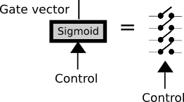

LSTM 门

过程中的另一个重要部分是乘法，它将训练好的过滤器形式化，有效地通过一个包含的门来乘以输入。箭头图标表示过滤信息将流动的方向：

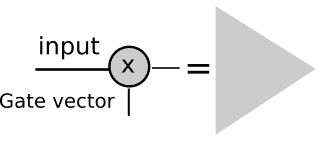

门乘法步骤

现在，是时候更详细地描述一个 LSTM 细胞了。

LSTM 有三个门来保护和控制细胞状态：一个在数据流的开始，另一个在中间，最后一个在细胞信息边界的末端。这个操作将允许丢弃（希望不是重要的）低重要性的状态数据，并将（希望重要的）新数据纳入状态。

以下图显示了单个 LSTM 细胞操作中的所有概念。作为输入，我们有以下内容：

+   细胞状态，它将存储长期信息，因为它携带从细胞训练起源的优化权重

+   短期状态，*h(t)*，它将在每次迭代中直接与当前输入结合，因此它将对输入的最新值有更大的影响：

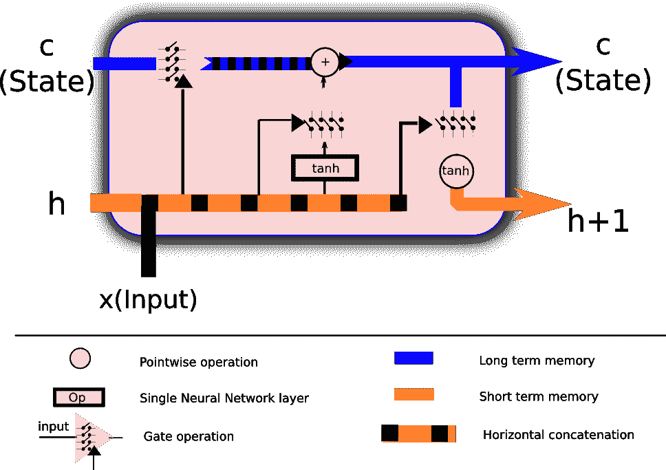

LSTM 细胞的描绘，包括所有其组成部分

现在，让我们探索这个 LSTM 单元上的数据流，以便更好地理解不同的门和操作如何在单个细胞中协同工作。

# 第一部分 — 设置要遗忘的值（输入门）

在这个阶段，我们将来自短期记忆的值与输入本身结合，然后这些值将输出一个二进制函数，由一个多变量 Sigmoid 表示。根据输入和短期记忆的值，Sigmoid 输出将过滤长期知识，由细胞状态的权重表示：

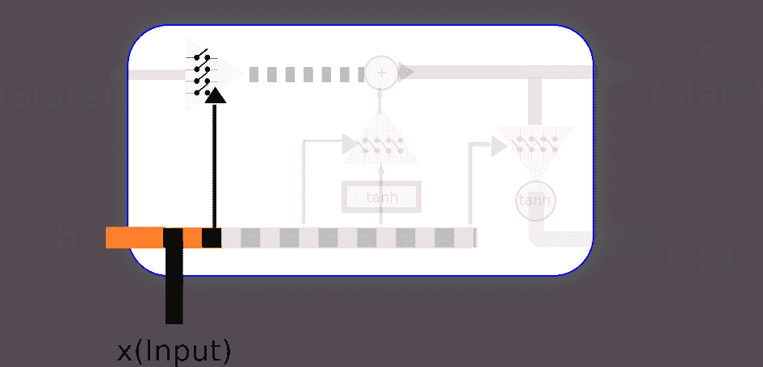

状态遗忘参数设置

# 第二部分 — 设置要保留的值

现在，是时候设置过滤器，允许或拒绝将新的和短期记忆纳入细胞的半永久状态。然后是设置过滤器，允许或拒绝将新的和短期记忆纳入细胞的半永久状态。

因此，在这个阶段，我们将确定多少新的和半新的信息将被纳入细胞的新状态：

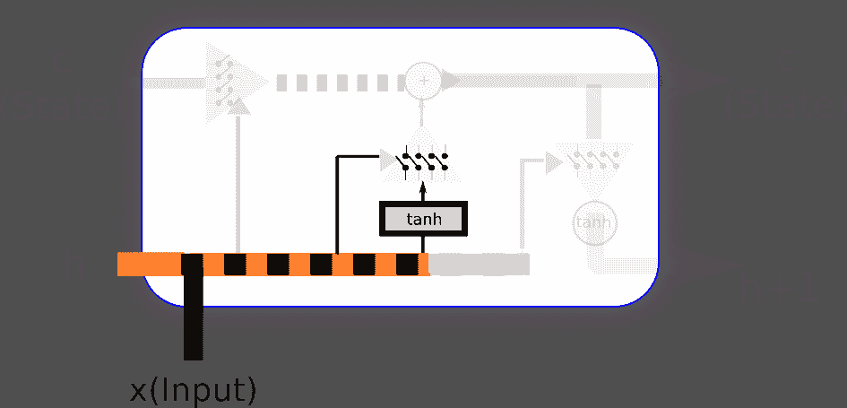

短期值选择步骤

# 第三部分 — 应用到细胞的变化

在这个序列的这一部分，我们最终将通过我们一直在配置的信息过滤器，结果我们将有一个更新的长期状态。

为了使新的和短期信息归一化，我们通过具有**tanh**激活的神经网络传递新的输入和短期状态。这将使我们能够以归一化的*[-1,1]*范围提供新的信息：

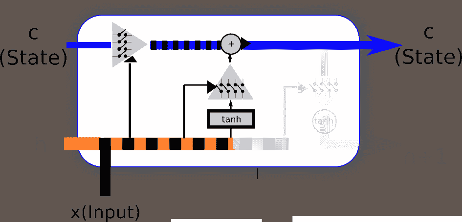

状态变化持久步骤

# 第四部分 — 输出过滤后的细胞状态

现在，轮到短期状态了。它也将使用新的和之前的短期状态来设置过滤长期状态的过滤器，再次通过 tanh 函数点乘，以将信息归一化到*(-1,1)*范围：

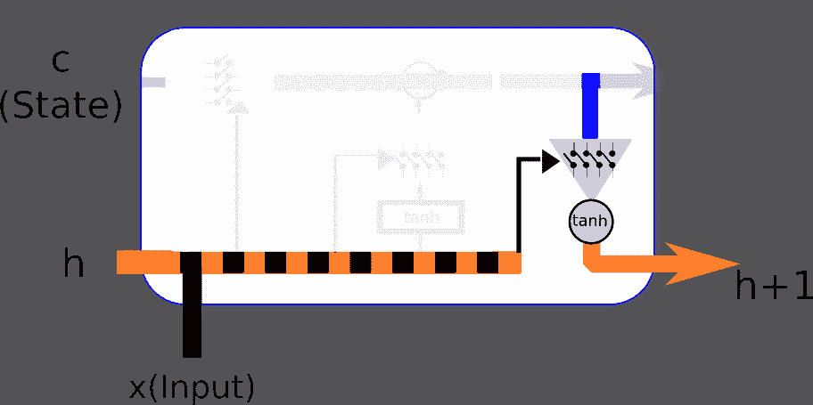

新短期生成步骤

# 使用能源消耗数据进行单变量时间序列预测

在这个例子中，我们将解决回归领域的问题。因此，我们将构建一个包含两个 LSTMs 的多层 RNN。我们将进行的回归类型是*多对一*类型，因为网络将接收一系列能源消耗值，并尝试根据前四个记录输出下一个值。

我们将要工作的数据集是关于一个家庭在一段时间内电力消耗的许多测量的汇编。正如我们可能推断的那样，这种行为很容易遵循模式（当居民使用微波炉准备早餐并在白天使用电脑时，它会增加，下午稍微减少，然后在晚上随着所有灯光的增加而增加，最后当居民入睡时减少到零）。

让我们先设置适当的环境变量并加载所需的库：

```py
%matplotlib inline
%config InlineBackend.figure_formats = {'png', 'retina'}

import numpy as np
import pandas as pd
import tensorflow as tf
from matplotlib import pyplot as plt

from keras.models import Sequential  
from keras.layers.core import Dense, Activation  
from keras.layers.recurrent import LSTM
from keras.layers import Dropout

Using TensorFlow backend.
```

# 数据集描述和加载

在这个例子中，我们将使用**电力负荷图数据集**，来自*Artur Trindade* ([`archive.ics.uci.edu/ml/datasets/ElectricityLoadDiagrams20112014`](https://archive.ics.uci.edu/ml/datasets/ElectricityLoadDiagrams20112014))。这是原始数据集的描述：

"数据集没有缺失值。

数值以每 15 分钟的 kW 为单位。要将数值转换为 kWh，必须将数值除以 4。

每一列代表一个客户。有些客户是在 2011 年之后创建的。在这些情况下，消费被视为零。

所有时间标签都报告葡萄牙小时。然而，所有日子都有 96 个测量值（24*15）。每年 3 月时间变化日（只有 23 小时）凌晨 1:00 至 2:00 之间的值对所有点都是零。每年 10 月时间变化日（有 25 小时）凌晨 1:00 至 2:00 之间的值汇总了两个小时的消耗。"

为了简化我们的模型描述，我们只取了一个客户的完整测量数据，并将其格式转换为标准 CSV。它位于本章代码文件夹的`data`子文件夹中。

因此，我们将从数据集中加载一个样本家庭消费的前 1500 个值：

```py
df = pd.read_csv("data/elec_load.csv", error_bad_lines=False)
plt.subplot()
plot_test, = plt.plot(df.values[:1500], label='Load')
plt.legend(handles=[plot_test])
```

下面的图表显示了我们需要建模的数据子集：

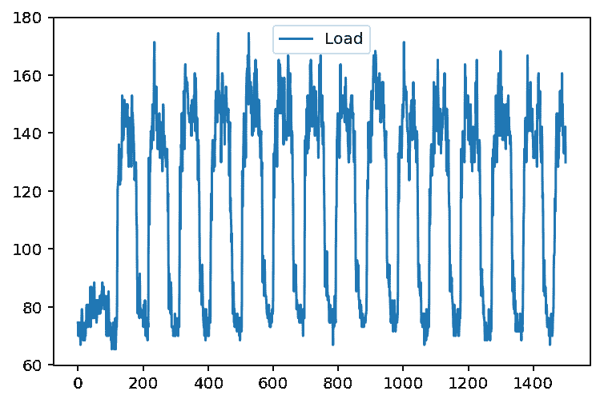

如果我们看一下这个表示（我们取了前 1500 个样本），我们可以看到一个初始瞬态状态，可能是当测量被放置时，然后我们看到一个非常清晰的消费水平高低的周期。从简单的观察中，我们还可以看到周期大约是 100 个样本，非常接近这个数据集每天 96 个样本。

# 数据集预处理

为了确保反向传播方法的更好收敛，我们应该尝试对输入数据进行归一化。因此，我们将应用经典的缩放和居中技术，减去平均值，并按最大值的`floor()`进行缩放。为了获取所需值，我们使用 pandas 的`describe()`方法：

```py
print(df.describe())
array=(df.values - 145.33) /338.21
plt.subplot()
plot_test, = plt.plot(array[:1500], label='Normalized Load')
plt.legend(handles=[plot_test])

                Load
count  140256.000000
mean      145.332503
std        48.477976
min         0.000000
25%       106.850998
50%       151.428571
75%       177.557604
max       338.218126
```

这是我们的归一化数据的图表：

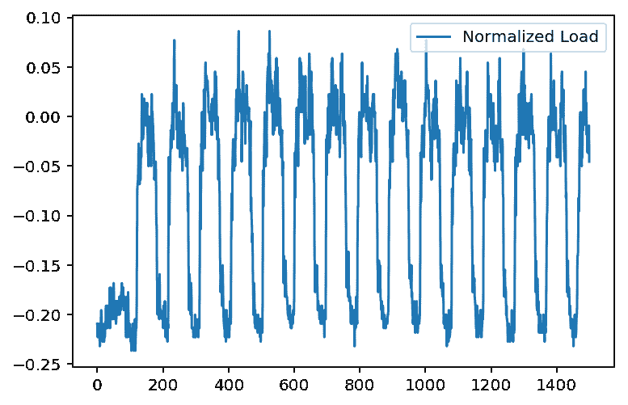

在这一步中，我们将准备我们的输入数据集，因为我们需要一个输入`x`（前 5 个值）以及相应的输入`y`（5 个时间步后的值）。然后，我们将前 13,000 个元素分配给训练集，然后我们将接下来的 1,000 个样本分配给测试集：

```py
listX = []
listy = []
X={}
y={}

for i in range(0,len(array)-6):
    listX.append(array[i:i+5].reshape([5,1]))
    listy.append(array[i+6])

arrayX=np.array(listX)
arrayy=np.array(listy)

X['train']=arrayX[0:13000]
X['test']=arrayX[13000:14000]

y['train']=arrayy[0:13000]
y['test']=arrayy[13000:14000]
```

现在，我们将构建模型，它将是一个具有每个末尾都有 dropout 层的双 LSTM：

```py
#Build the model
model = Sequential()

model.add(LSTM( units=50, input_shape=(None, 1), return_sequences=True))

model.add(Dropout(0.2))

model.add(LSTM( units=200, input_shape=(None, 100), return_sequences=False))
model.add(Dropout(0.2))

model.add(Dense(units=1))
model.add(Activation("linear"))

model.compile(loss="mse", optimizer="rmsprop")  
```

现在是运行模型并调整权重的时候了。模型适配器将使用数据集的 8%作为验证集：

```py
#Fit the model to the data

model.fit(X['train'], y['train'], batch_size=512, epochs=10, validation_split=0.08)

Train on 11960 samples, validate on 1040 samples
Epoch 1/10
11960/11960 [==============================] - 41s - loss: 0.0035 - val_loss: 0.0022
Epoch 2/10
11960/11960 [==============================] - 61s - loss: 0.0020 - val_loss: 0.0020
Epoch 3/10
11960/11960 [==============================] - 45s - loss: 0.0019 - val_loss: 0.0018
Epoch 4/10
11960/11960 [==============================] - 29s - loss: 0.0017 - val_loss: 0.0020
Epoch 5/10
11960/11960 [==============================] - 30s - loss: 0.0016 - val_loss: 0.0015
Epoch 6/10
11960/11960 [==============================] - 28s - loss: 0.0015 - val_loss: 0.0013
Epoch 7/10
11960/11960 [==============================] - 43s - loss: 0.0014 - val_loss: 0.0012
Epoch 8/10
11960/11960 [==============================] - 37s - loss: 0.0013 - val_loss: 0.0013
Epoch 9/10
11960/11960 [==============================] - 31s - loss: 0.0013 - val_loss: 0.0012
Epoch 10/10
11960/11960 [==============================] - 25s - loss: 0.0012 - val_loss: 0.0011

<keras.callbacks.History at 0x7fa435512588>
```

在重新缩放后，是时候看看我们的模型如何预测值与实际测试值相比，这些值没有参与模型的训练，以了解模型如何泛化样本住宅的行为：

```py
# Rescale the test dataset and predicted data

test_results = model.predict( X['test'])

test_results = test_results * 338.21 + 145.33
y['test'] = y['test'] * 338.21 + 145.33

plt.figure(figsize=(10,15))
plot_predicted, = plt.plot(test_results, label='predicted')

plot_test, = plt.plot(y['test']  , label='test');
plt.legend(handles=[plot_predicted, plot_test]);
```

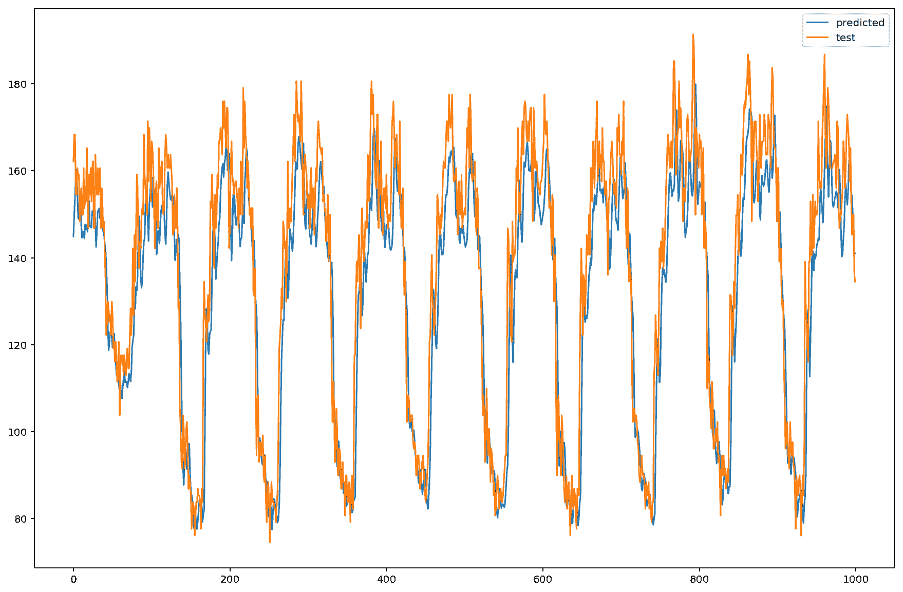

最终回归数据

# 摘要

在这一章中，我们的范围进一步扩大，将时间维度添加到我们想要包含在泛化中的元素集合中。此外，我们还学习了如何基于真实数据使用 RNN 解决实际问题。

但如果你认为你已经涵盖了所有可能的选项，还有许多更多的模型类型可以查看！

在下一章中，我们将讨论可以训练以产生非常聪明元素的尖端架构，例如，将著名画家的风格转移到图片上，甚至玩电子游戏！继续阅读以了解强化学习和生成对抗网络。

# 参考文献

+   Hopfield, John J，*具有涌现集体计算能力的神经网络和物理系统*。美国国家科学院院刊 79.8（1982）：2554-2558。

+   Bengio, Yoshua，Patrice Simard 和 Paolo Frasconi，*使用梯度下降学习长期依赖性是困难的*。IEEE 神经网络杂志 5.2（1994）：157-166。

+   Hochreiter, Sepp 和 Jürgen Schmidhuber，*长短期记忆*。神经计算 9.8（1997）：1735-1780。

+   Hochreiter, Sepp。*循环神经网络学习和梯度消失*。国际不确定性和模糊知识系统杂志 6.2（1998）：107-116。

+   Sutskever, Ilya，*训练循环神经网络*。多伦多大学，多伦多，安大略省，加拿大（2013）。

+   Chung, Junyoung, 等人，*门控循环神经网络在序列建模中的实证评估*。arXiv 预印本 arXiv:1412.3555（2014）。
