# 第九章：软件安装和配置

因此，现在是时候开始我们的告别了！在本章中，我们将详细说明构建我们的开发环境的所有指令。

在本章中，你将了解以下内容：

+   Linux 上的 Anaconda 和 pip 环境安装

+   macOS 上的 Anaconda 和 easy install 环境安装

+   Windows 上的 Anaconda 环境安装

因此，让我们从 Linux 的逐步说明开始。

# Linux 安装

在我们看来，Linux 是你可以用于机器学习项目的最灵活的平台。正如你可能知道的，Linux 领域有大量的替代品，它们都有自己的特定包管理。

由于为所有这些发行版编写说明将占用大量页面，我们将专注于 **Ubuntu 16.04** 发行版的说明。

Ubuntu 无疑是最广泛的 Linux 发行版，在 Ubuntu 16.04 的特定情况下，它是一个 LTS 版本，即长期支持。这意味着我们将在本书中运行的基软件将得到直到 2021 年的支持。

你可以在 [`wiki.ubuntu.com/LTS`](https://wiki.ubuntu.com/LTS) 上找到关于 LTS 意义的更多信息。

关于 Ubuntu 作为科学计算发行版的可行性，尽管许多人认为它是面向新手的，但它提供了当前机器学习环境所需的所有技术的必要支持，并且拥有一个非常庞大的用户基础。

本章中的说明与基于 Debian 的发行版的说明非常相似；它们将需要最少的或没有更改即可工作。

# 初始发行版要求

对于 Python 环境的安装，你需要以下东西：

+   一种能够执行 AMD64 指令的计算机（通常称为 64 位处理器）

+   在云上运行的基于 AMD64 的镜像

在 AWS 上，一个合适的 **Amazon Machine Image**（**AMI**）是代码 [ami-cf68e0d8](https://console.aws.amazon.com/ec2/home?region=us-east-1#launchAmi=ami-cf68e0d8)。

# 在 Linux 上安装 Anaconda

安装 Python 发行版的一个非常流行的方式是通过软件包 Anaconda。它包含了一个完整的高性能 Python、Scala 和 R 生态系统，包括数据科学中最著名的包。它还包括通过 `conda` 可用的众多其他包，`conda` 是该包的主要实用工具，负责管理环境、包和依赖关系。

Anaconda 由 **Continuum Analytics**（[continuum.io](http://continuum.io)）构建和分发，该公司还维护这些包及其依赖关系。

为了安装 Anaconda，让我们首先下载安装程序包，写作时的版本为 4.2.0。

你可以在 [`www.anaconda.com/download/`](https://www.anaconda.com/download/) 找到最新的包版本。

查看以下步骤以在 Linux 上安装 Anaconda：

1.  让我们运行以下命令：

```py
 curl -O https://repo.continuum.io/archive/Anaconda3-4.2.0-Linux-
      x86_64.sh
```

上述命令将生成以下输出：

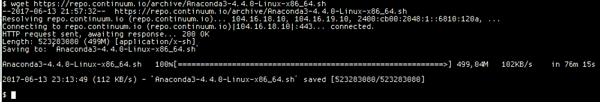

1.  然后，我们需要验证包的数据完整性，使用校验和或 SHA-256 类型。执行此操作的 Linux 命令是`sha256sum`，如下所示：

```py
 sha256sum Anaconda3-4.4.0-Linux-x86_64.sh
```

上述命令将生成以下输出：

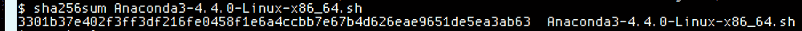

1.  然后，让我们使用`bash`解释器执行安装程序，如下所示：

```py
 bash Anaconda3-4.2.0-Linux-x86_64.sh
```

上述命令将生成以下输出：

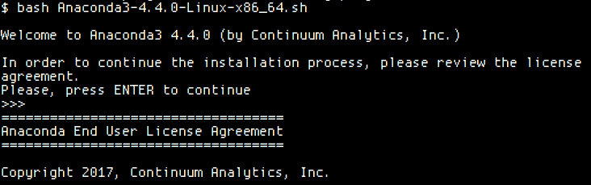

1.  按下*Enter*后，我们将看到许可协议，阅读后你可以通过输入`yes`来接受，如下截图所示：

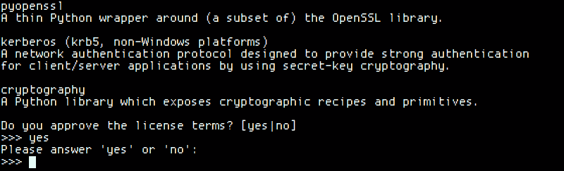

1.  然后，是时候选择位置并开始安装所有包，如下截图所示：

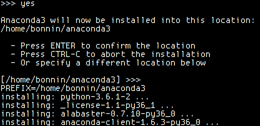

1.  在此之后，我们将被要求将已安装的 Anaconda 安装添加到路径中，主要是为了将库和二进制文件，特别是`conda`实用工具，集成到系统中。然后安装完成，如下截图所示：

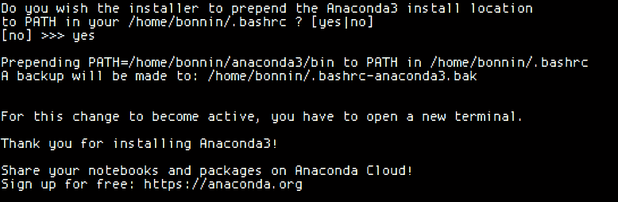

1.  让我们通过运行以下命令测试当前的 Anaconda 安装：

```py
 source ~/.bashrc
 conda list
```

上述命令将生成以下输出：

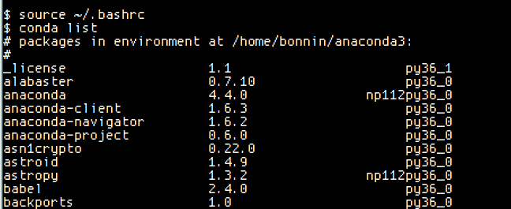

1.  现在是时候通过运行以下命令创建一个 Python 3 环境：

```py
 conda create --name ml_env python=3
```

上述命令将生成以下输出：

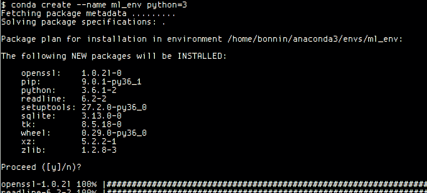

1.  要激活此新环境，让我们通过运行以下命令使用`source`命令：

```py
 source activate ml_env
```

上述命令将生成以下输出：

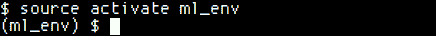

1.  当你的环境激活后，你的命令提示符前缀将如下所示：

```py
 python --version
```

上述命令将生成以下输出：

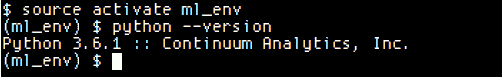

1.  当你不再想使用该环境时，运行以下命令：

```py
 source deactivate
```

上述命令将生成以下输出：

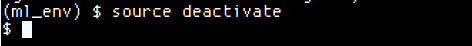

1.  如果你想要检查所有 conda 环境，你可以使用以下 conda 命令：

```py
 conda info --envs
```

上述命令将生成以下输出：

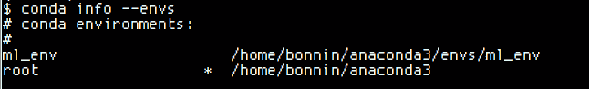

星号（`*`）表示当前活动环境。

1.  通过运行以下命令安装额外的包：

```py
 conda install --name ml_env numpy
```

上述命令将生成以下输出：

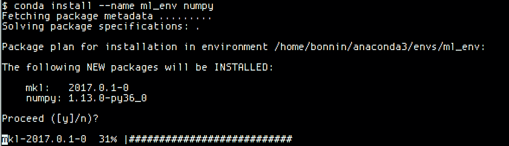

1.  要删除一个环境，你可以使用以下命令：

```py
 conda remove --name ml_env --all
```

1.  添加剩余的库：

```py
conda install tensorflow conda install -c conda-forge keras
```

# pip Linux 安装方法

在本节中，我们将使用 pip（`pip`安装包）包管理器来安装项目所需的所有库。

Pip 是 Python 的默认包管理器，拥有大量的可用库，包括几乎所有主要的机器学习框架。

# 安装 Python 3 解释器

Ubuntu 16.04 默认解释器是 Python 2.7。因此，我们的第一步将是安装 Python 3 解释器和所需的库：

```py
sudo apt-get install python3
```

# 安装 pip

为了安装`pip`包管理器，我们将使用 Ubuntu 的本地`apt-get`包管理器安装`python3-pip`包：

```py
sudo apt-get install python3-pip
```

# 安装必要的库

执行以下命令来安装剩余的必要库。其中许多库是本书中实际示例所必需的：

```py
sudo pip3 install pandas
sudo pip3 install tensorflow
sudo pip3 install keras
sudo pip3 install h5py
sudo pip3 install seaborn
sudo pip3 install jupyter 
```

# macOS X 环境安装

现在轮到 macOS X 安装了。安装过程与 Linux 非常相似，并且基于**OS X High Sierra**版本。

安装需要安装用户的`sudo`权限。

# Anaconda 安装

Anaconda 可以通过图形安装程序或基于控制台的安装程序进行安装。在本节中，我们将介绍图形安装程序。首先，我们将从[`www.anaconda.com/download/`](https://www.anaconda.com/download/)下载安装程序包，并选择 64 位包：

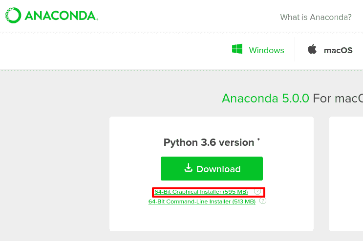

一旦我们下载了安装程序包，我们将执行安装程序，并出现逐步的图形用户界面：

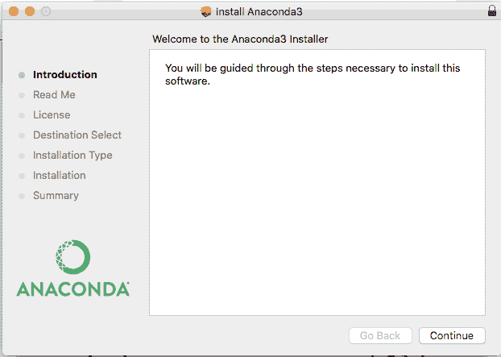

然后，我们选择安装位置（请注意，整个包需要大约 2 GB 的磁盘空间来安装）：

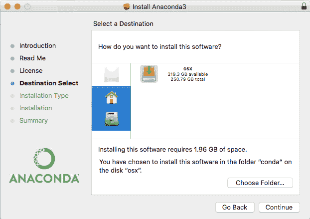

首先，我们接受许可协议，然后实际安装所有必需的文件：

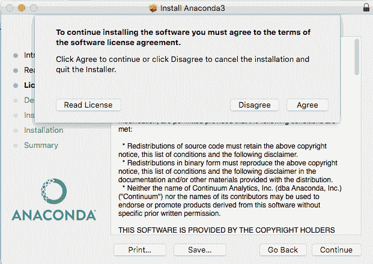

在完成必要的文件解压缩和安装过程后，我们就可以开始使用 Anaconda 工具了：

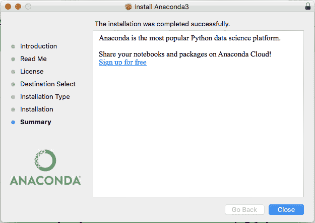

最后一步将是使用`conda`命令安装 Anaconda 分布中缺少的包：

```py
conda install tensorflow conda install -c conda-forge keras
```

# 安装 pip

在本节中，我们将使用包含在`setuptools`Python 包中的`easy_install`包管理器安装`pip`包管理器，它是操作系统默认包含的。

对于这个过程，我们将在终端中执行以下命令：

```py
/usr/bin/ruby -e "$(curl -fsSL https://raw.githubusercontent.com/Homebrew/install/master/install)"

$ sudo brew install python3
```

# 通过 pip 安装剩余库

然后是安装所有剩余库的时候了：

```py
sudo pip3 install pandas
sudo pip3 install tensorflow
sudo pip3 install keras
sudo pip3 install h5py
sudo pip3 install seaborn
sudo pip3 install jupyter

```

因此，Mac 的安装过程到此结束；让我们继续 Windows 安装过程。

# Windows 安装

Windows 是一个 Python 可以无问题运行的平台。在本节中，我们将介绍在 Windows 平台上安装 Anaconda。

# Anaconda Windows 安装

安装 Anaconda 的过程与 macOS 的非常相似，因为使用了图形安装程序。让我们首先从[`www.anaconda.com/download/`](https://www.anaconda.com/download/)下载安装程序包，并选择 64 位包：

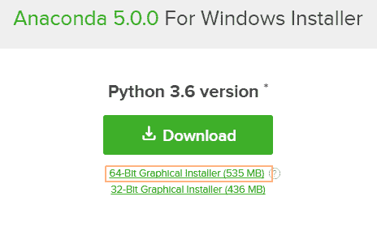

下载安装程序后，接受许可协议，然后进入下一步：

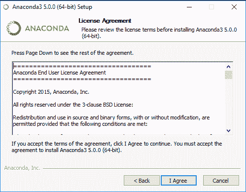

然后，你可以选择为当前用户安装平台，或者为所有用户安装：

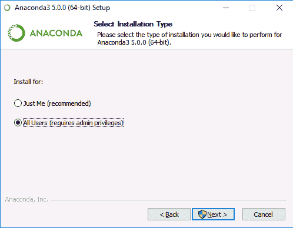

然后，你选择整个安装的安装目录。记住，这将占用接近 2 GB 的磁盘空间来安装：

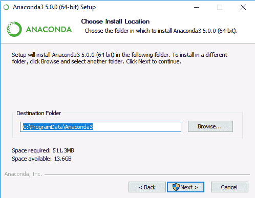

环境安装完成后，你将在主 Windows 菜单中找到 Jupyter Notebook 快捷方式：

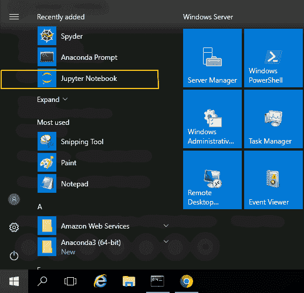

为了使用 Python 命令和 `conda` 工具，有一个方便的 Anaconda 提示符，它将加载所需的路径和环境变量：

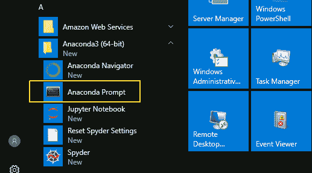

最后一步是从 Anaconda 提示符中执行以下 `conda` 命令来安装缺失的包：

```py
conda install tensorflow conda install -c conda-forge keras
```

# 摘要

恭喜！你已经到达了本节关于机器学习基本原理的实践总结的结尾。在本章的最后，我们介绍了很多帮助你构建机器学习计算环境的方法。

我们想借此机会真诚地感谢您仔细阅读，希望您觉得我们提供的材料有趣且引人入胜。希望你现在已经准备好开始利用我们提供的工具以及不断开发的新工具，以及我们努力提供的知识，去解决新的挑战性问题。

对于我们来说，编写这本书并寻找帮助您以实用方式理解概念的最佳方法是一段愉快的经历。不要犹豫，向出版商提供的渠道发送问题、建议或错误报告。

最好的祝愿，祝您学习愉快！
