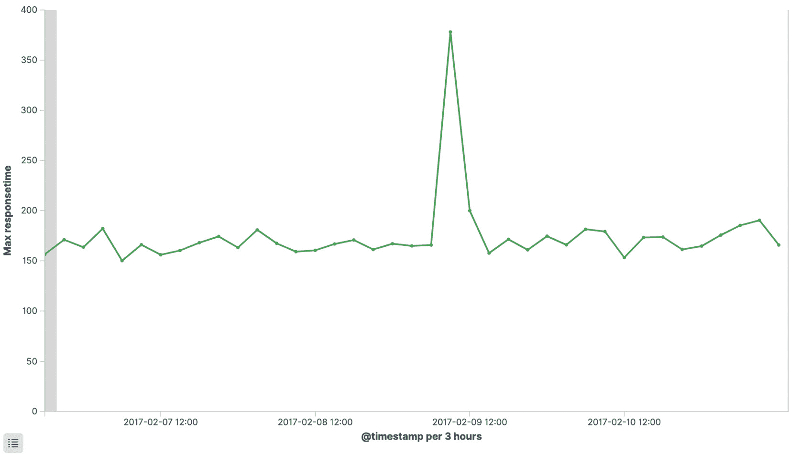
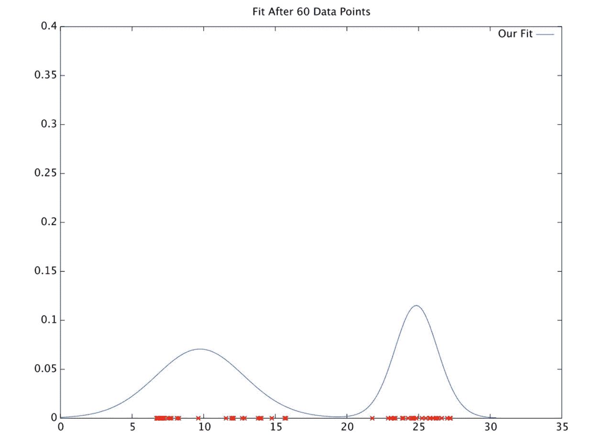
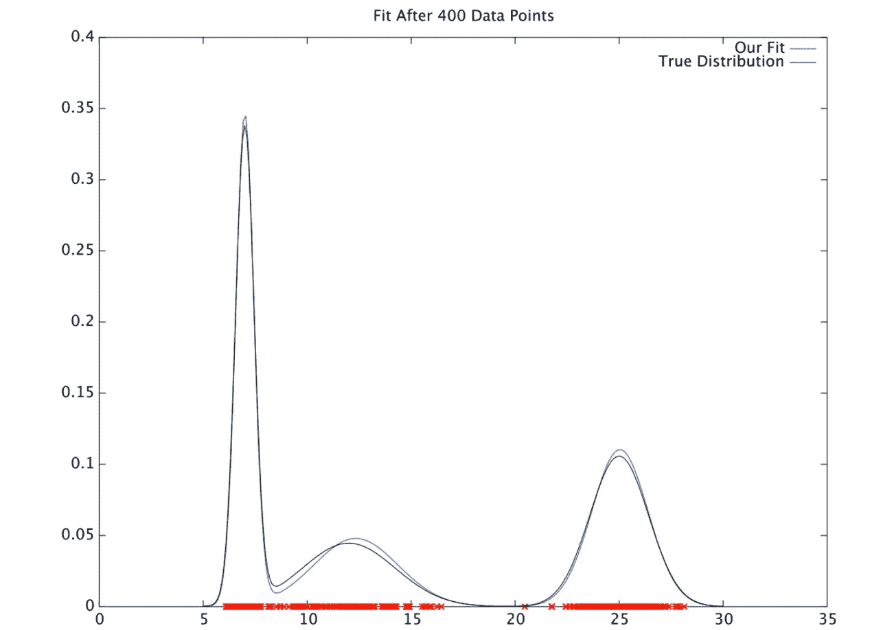
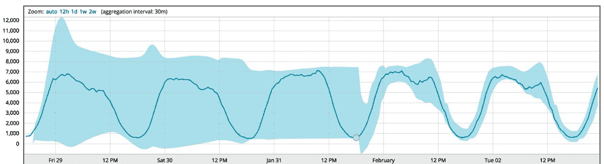
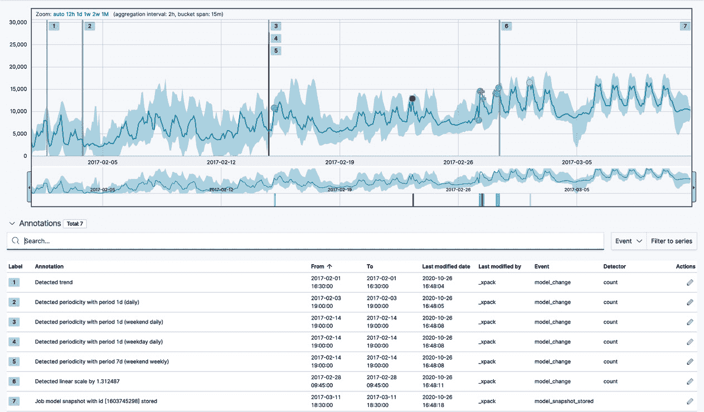
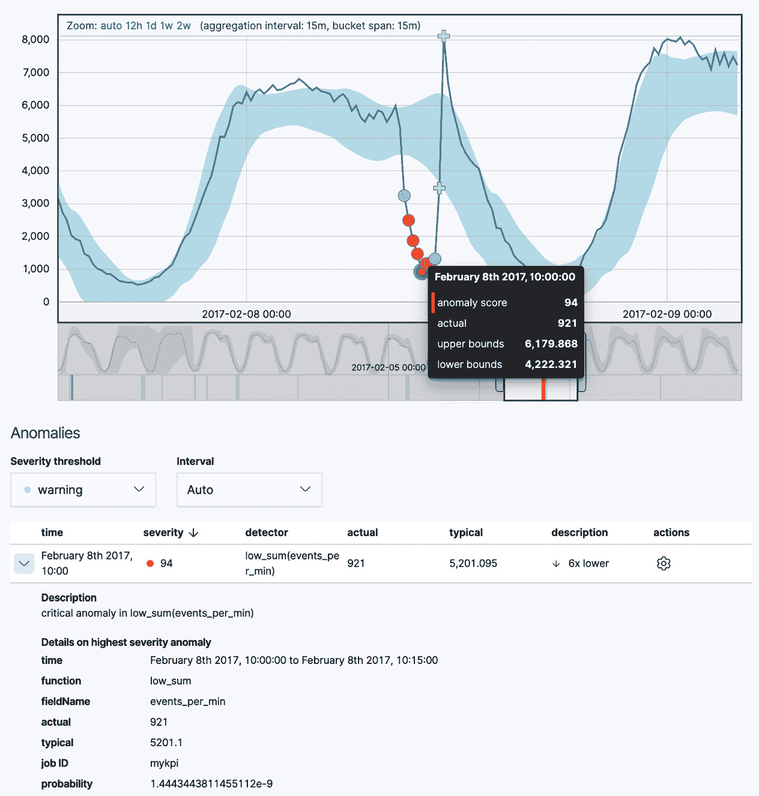
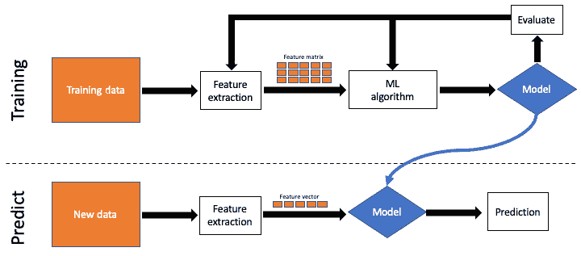

# 第一章：IT 领域的机器学习

十年前，使用基于**机器学习**（**ML**）的技术在 IT 运营或 IT 安全中似乎有点像科幻小说。然而，如今，它已成为软件供应商最常用的热门词汇之一。显然，对技术需求的认知和技术最先进实现所能带来的能力都发生了重大转变。这种演变对于充分理解 Elastic ML 的出现及其旨在解决的问题至关重要。

本章致力于回顾 Elastic ML 背后的历史和概念。它还讨论了可以进行的不同类型的分析和可以解决的问题的类型。具体来说，我们将涵盖以下主题：

+   克服 IT 历史上的挑战

+   应对数据繁多的问题

+   自动化异常检测的出现

+   无监督机器学习与监督机器学习

+   使用无监督机器学习进行异常检测

+   将监督机器学习应用于数据框分析

# 克服 IT 历史上的挑战

IT 应用支持专家和应用架构师的工作要求很高，期望值也很高。他们不仅要负责将新的创新项目引入业务，还要尽可能平稳地保持当前部署的应用程序运行。今天的应用程序比以往任何时候都要复杂得多——它们高度组件化、分布式，并且可能是虚拟化/容器化的。它们可能使用敏捷方法或外包团队开发。此外，它们很可能不断变化。一些 DevOps 团队声称他们通常每天可以对实时生产系统进行 100 多次更改。试图理解现代应用程序的健康和行为就像机械师在汽车行驶时检查汽车一样。

IT 安全运营分析师在跟上日常运营方面面临类似的挑战，但他们显然有不同的重点，那就是确保企业安全并减轻新兴威胁。黑客、恶意软件和恶意内部人员已经变得如此普遍和复杂，以至于普遍的观点是，不再是一个组织是否会受到攻击的问题——而是他们何时会发现这个问题。显然，尽早（在造成太多损害之前）了解攻击情况，比从执法机构或晚间新闻首次得知攻击情况要好。

那么，他们如何得到帮助？问题的关键是应用专家和安全分析师缺乏数据来帮助他们有效地完成工作吗？实际上，在大多数情况下，情况正好相反。许多 IT 组织正陷入数据海洋。

# 应对数据繁多的问题

IT 部门在监控工具上的投资已有几十年，拥有十几个或更多工具积极收集和存档每天可测量为太字节甚至拍字节的数据并不罕见。这些数据可以从基本的基础设施和网络级数据到深入的诊断数据以及/或系统和应用程序日志文件。

也可以跟踪业务层面的**关键绩效指标**（**KPIs**），有时包括关于最终用户体验的数据。在某些方面，可用的数据深度和广度比以往任何时候都要全面。为了检测隐藏在数据中的新兴问题或威胁，传统上有几种主要方法可以将数据提炼成信息洞察：

+   **筛选/搜索**：一些工具允许用户定义搜索条件，以帮助将数据缩减到更易于管理的集合。虽然这一功能非常有用，但通常只在怀疑有问题时以临时方式使用。即便如此，使用这种方法的成功通常取决于用户知道他们在寻找什么以及他们的经验水平——这包括对先前知识的了解、通过类似过去情况的经历以及在对搜索技术本身的专长。

+   **可视化**：仪表板、图表和小部件也非常有用，可以帮助我们了解数据的行为和趋势。然而，可视化是被动的方式，需要有人监视以检测到有意义的偏差。一旦收集和绘制的指标数量超过了可供监视的眼睛数量（甚至屏幕显示它们的空间），仅视觉分析变得越来越没有用。

+   **阈值/规则**：为了绕过需要有人实时监视数据才能使其具有主动性这一要求，许多工具允许用户定义在已知条件或已知项目之间的已知依赖关系触发规则或条件。然而，在当今复杂和分布式的应用程序中，您可能无法现实地定义所有适当的操作范围或模拟所有实际依赖关系。此外，应用程序或环境中的变化数量和速度可能会迅速使任何静态规则集变得无用。分析师发现自己正在追逐许多误报警报，建立了一个“狼来了”的范式，导致对生成警报的工具的怨恨和对警报可能提供的价值的怀疑。

最终，需要一种不同的方法——这种方法并不一定完全否定过去的技术，但可以以有意义的方式带来自动化和经验数据的评估。让我们面对现实，人类是不完美的——我们有着隐藏的偏见和记忆信息的能力限制，我们很容易分心和疲劳。如果正确使用，算法可以轻松弥补这些不足。

# 自动化异常检测的出现

机器学习（ML），虽然是一个非常广泛的话题，涵盖了从自动驾驶汽车到赢得比赛的计算机程序的一切，但它是寻找解决方案的自然选择。如果你意识到，有效的应用监控或安全威胁搜索的大多数要求仅仅是“找出与正常情况不同的事物”这一主题的变体，那么异常检测学科就自然成为开始使用机器学习技术解决这些问题的起点，这对于 IT 专业人员来说。

异常检测的科学当然不是什么新鲜事物。许多非常聪明的人已经研究并使用了多年各种算法和技术。然而，对于 IT 数据的异常检测的实际应用提出了一些有趣的限制条件，使得其他在学术上值得称道的算法不适合这项工作。以下是一些包括：

+   **及时性**：对于停电、违规或其他重大异常情况的通知应尽可能快地得知，以便减轻其影响。如果能够迅速修复或控制，停机时间或持续安全妥协的风险就会最小化。无法跟上当今 IT 数据实时性的算法价值有限。

+   **可扩展性**：如前所述，IT 环境中的 IT 数据量、速度和变化继续爆炸式增长。检查这些大量数据的算法必须能够与数据成线性比例扩展，以便在实际意义上可用。

+   **效率**：IT 预算经常受到高度审查，以防止浪费支出，许多组织不断被要求以更少的资源做更多的事情。添加一整个超级计算机集群来运行算法并不实际。相反，必须能够使用具有典型规格的普通硬件作为解决方案的一部分。

+   **通用性**：虽然高度专业化的数据科学通常是解决特定信息问题的最佳方式，但 IT 环境中的数据多样性推动了对一种可以广泛适用于大多数用例的东西的需求。在长期来看，相同技术的可重用性要更加经济高效。

+   **适应性**：不断变化的 IT 环境将很快使脆弱的算法变得无用。训练和重新训练机器学习模型只会引入另一个浪费时间且无法承担的冒险。

+   **准确性**：我们已经知道，来自传统阈值和基于规则的系统的警报疲劳是一个真正的问题。用一个假警报生成器替换另一个不会给任何人留下印象。

+   **易用性**：即使所有之前提到的限制条件都可以满足，任何需要大量数据科学家来实施其解决方案的解决方案都会过于昂贵，并且会立即被淘汰。

因此，我们现在正进入挑战的核心——创建一个快速、可扩展、准确、低成本的反常检测解决方案，每个人都将使用并喜爱它，因为它工作得完美无瑕。没问题！

虽然听起来很令人畏惧，但 Prelert 的创始人兼首席技术官 Steve Dodson 在 2010 年就接受了这个挑战。虽然 Dodson 确实带来了他的学术才能，但最终成为 Elastic ML 的技术起源于解决真实 IT 应用问题的努力——首先是解决一家主要伦敦金融公司交易平台上的一个讨厌的间歇性故障。Dodson 和几位加入这个项目的工程师帮助银行的团队使用异常检测技术自动识别出麦田里的针，使分析师能够专注于那些出现问题的少量相关指标和日志消息。识别根本原因（一个故障服务，其恢复导致一系列后续网络问题，造成了混乱）最终使应用程序稳定，并防止银行在之前解决方案上花费大量金钱，那个解决方案是一个未计划的、昂贵的网络升级。

随着时间的推移，然而，变得明显的是，即使是那个初始的成功也只是个开始。几年和几千个实际应用案例之后，Prelert 与 Elastic 的结合是自然而然的——这是一个使大数据易于访问的平台与帮助克服人类分析局限性的技术的结合。

快进到 2021 年，自联合以来已经过去了整整 5 年，Elastic ML 在成熟和扩展 ML 平台功能方面已经取得了长足的进步。本书的第二版总结了多年来对 Elastic ML 所做的更新，包括将集成引入 Elastic 在可观察性和安全方面的几个解决方案。第二版还包括了“数据帧分析”的引入，这在书的第三部分有详细的讨论。为了对 Elastic ML 的工作有一个扎实、内在的理解，我们首先需要掌握一些术语和概念，以便进一步了解事物。

# 无监督学习与监督学习的比较

尽管机器学习有许多子类型，但其中两个非常突出（并且与 Elastic ML 相关）的是无监督学习和监督学习。

在无监督机器学习中，没有来自人类的外部指导或方向。换句话说，算法必须完全依靠自身学习（并建模）数据的模式。一般来说，这里最大的挑战是让算法能够准确地揭示输入数据正常模式的检测偏差，为用户提供有意义的见解。如果算法无法做到这一点，那么它就无用了，也不适合使用。因此，算法必须非常稳健，能够考虑到输入数据可能表现出的所有复杂性。

在监督机器学习中，输入数据（通常是多元数据）用于帮助建模期望的结果。与无监督机器学习的关键区别在于，人类事先决定使用哪些变量作为输入，并提供预期目标变量的“真实”示例。然后，算法评估输入变量如何相互作用并影响已知的输出目标。为了准确地获得期望的输出（例如预测），算法不仅必须“正确类型的数据”确实表达了情况，而且输入数据必须足够多样化，以便有效地学习输入数据与输出目标之间的关系。

因此，这两种情况都需要良好的输入数据、良好的算法方法和良好的机制，以允许机器学习既学习数据的模式，又将这种学习应用于评估该数据的后续观察。让我们更深入地探讨 Elastic ML 如何利用无监督和监督学习的具体细节。

# 使用无监督机器学习进行异常检测

为了更直观地理解 Elastic ML 如何使用无监督机器学习进行异常检测，我们将讨论以下内容：

+   关于技术的异常的严格定义

+   无监督学习中的学习直观示例

+   技术模型、去趋势和评分数据的描述

## 定义异常

异常检测是我们大多数人都有基本直觉的东西。人类在模式识别方面非常擅长，所以如果我问 100 个街头的人以下图表中有什么不寻常之处，绝大多数人（包括非技术人员）都会识别出绿色线上的峰值：

图 1.1 – 一张显示异常的折线图

同样，假设我们询问以下照片中有什么不寻常之处：

图 1.2 – 一张展示海豹在企鹅中的照片

我们可能会再次得到大多数正确指出海豹是不寻常事物的结论。但人们可能难以用显著的语言描述得出这些结论所使用的实际启发式方法。

我们可以使用两种不同的启发式方法来定义这些图像中显示的不同类型的异常：

+   如果某个实体的行为与其过去历史中建立的模式或范围有显著偏差，那么这种情况是不寻常的。

+   如果某个实体的某个特征与集合或群体中其他成员的相同特征有显著差异，那么这种情况是不寻常的。

这些关键定义将对 Elastic ML 的异常检测相关，因为它们形成了异常检测算法的两个主要基本操作模式（时间分析 versus 群体分析，将在*第三章*，*异常检测*中探讨）。正如我们将看到的，用户将能够控制针对特定用例采用的操作模式。

## 学习什么是正常

正如我们所言，Elastic ML 的异常检测使用无监督学习，这意味着学习过程没有进行任何教学。没有人类协助来塑造学习的决策；它只是通过检查呈现给它的数据自行进行。这与通过沉浸式学习语言的过程略为相似，而不是通过词汇书和语法规则书来学习。

要从一个完全无知的状态过渡到一个可以以相当大的确定性做出预测的状态，需要构建一个关于该情况的情况模型。这个模型是如何创建的极其重要，因为基于此模型采取的所有后续行动的有效性将高度依赖于模型的准确性。该模型需要根据新信息灵活调整并持续更新，因为这就是在这个无监督范式下它所依赖的一切。

## 概率模型

概率分布可以很好地发挥这种作用。有许多基本的分布类型（Elastic ML 使用多种分布类型，例如泊松分布、高斯分布、对数正态分布，甚至是模型混合），但泊松分布是一个很好的起点，因为它适用于存在离散事件（“计数”）与时间相关的场景：

![图 1.3 – 展示泊松分布的图表（来源：https://en.wikipedia.org/wiki/Poisson_distribution#/media/File:Poisson_pmf.svg）]

![img/B17040_01_003.jpg]

图 1.3 – 展示泊松分布的图表（来源：https://en.wikipedia.org/wiki/Poisson_distribution#/media/File:Poisson_pmf.svg）

这里显示了分布的三个不同变体，每个变体都有不同的平均值（λ）和最高的预期值*k*。我们可以做一个类比，说这些分布模拟了一个人每天在家收到的预期邮件量，用*x*轴上的*k*表示：

+   对于λ = 1，每天收到零件或一件邮件的概率大约为 37%。这可能适合一个收到的邮政邮件不多的大学学生。

+   对于λ = 4，收到三件或四件物品的概率大约为 20%。这可能是一个年轻专业人士的良好模型。

+   对于λ = 10，每天收到 10 件物品的概率大约为 13%——这可能代表一个大家庭或者某个方式下发现自己处于许多邮件列表中的家庭！

每条曲线上的离散点也给出了*k*的其他值的可能性（概率）。因此，该模型可以提供信息并回答诸如“收到 15 件邮件的可能性大吗？”等问题。正如我们所见，对于学生（λ = 1）或年轻专业人士（λ = 4）来说，这不太可能，但对于大家庭（λ = 10）来说，可能性就稍微大一些。显然，这里简单声明了所展示的模型适用于所描述的某些人——但应该很明显，需要有一种机制来学习每个个体情况下的模型，而不仅仅是断言它。学习这个过程是直观的。

## 学习模型

坚持使用邮政邮件的类比，本能地意识到确定特定家庭最适合的模型的方法可能只是每天在邮箱旁等待并记录邮递员放入邮箱的物品。也应该很明显，观察到的越多，你对模型准确性的信心应该越高。换句话说，只在邮箱旁待 3 天提供的信息和信心不如待 30 天，更不用说 300 天了。

算法上，可以设计一个类似的过程，根据观察来自动选择合适的模型。仔细审查算法对模型类型本身的选择（即泊松、高斯、对数正态等）以及该模型类型的特定系数（如前例中的λ）也必须作为自我选择过程的一部分。为此，需要不断评估模型的适用性。贝叶斯技术也被用来评估整个数据集给出的模型的可能参数值，但允许根据在特定时间点之前看到的信息量来调整这些决策。机器学习算法自动完成这项工作。

注意

对于那些想要深入了解幕后一些代表性数学的人，请参阅学术论文[`www.ijmlc.org/papers/398-LC018.pdf`](http://www.ijmlc.org/papers/398-LC018.pdf)。

最重要的是，所进行的建模是连续的，因此新信息会与旧信息一起考虑，对较新的信息给予指数加权。这样的模型在 60 次观察后可能如下所示：

图 1.4 – 60 次观察后的样本模型

在 400 次观察之后，数据将呈现出非常不同的样子，因为数据呈现出一连串新的观察值，其值在`5`和`10`之间：

图 1.5 – 400 次观察后的样本模型

此外，请注意，模型可能具有多个模式或高概率区域/簇。所学习模型（以蓝色曲线表示）与理论理想模型（黑色）的复杂性和拟合度非常重要。模型越准确，该数据集的正常状态表示就越准确，从而最终更准确地预测未来值如何与该模型相符。

模型的连续性也推动了这一要求，即该模型能够序列化到长期存储中，以便如果模型创建/分析被暂停，可以在稍后时间重新启动并继续。正如我们将看到的，模型创建、存储和利用的运营是一个复杂的协调过程，幸运的是，这个过程由弹性机器学习自动处理。

## 去趋势

在忠实模拟现实世界数据方面，另一个重要方面是考虑自然出现的显著泛音趋势和模式。数据是否每小时和/或每天波动，在办公时间和工作日有更多活动？如果是这样，这需要被考虑进去。弹性机器学习自动在数据中寻找显著的趋势（线性增长、周期性谐波等）并将它们排除。让我们观察以下图表：

图 1.6 – 实际中的周期性检测

在这里，周期性的每日周期被学习，然后被排除。模型预测边界（以浅蓝色信封围绕深蓝色信号表示）在自动检测到该周期的三个连续迭代后显著调整。

因此，随着时间的推移观察到更多的数据，模型在概率分布函数变得更加成熟以及通过自动识别和去趋势其他常规模式（如工作日、周末等）方面都获得了准确性，这些模式可能不会在几天或几周内出现。在以下示例中，随着时间的推移发现了几个趋势，包括每日、每周以及整体线性斜率：

图 1.7 – 检测到多个趋势

这些模型变化被记录为系统注释。注释作为一个一般概念，将在后面的章节中介绍。

## 不寻常性评分

一旦构建了模型，就可以在概率分布中找到任何未来观察值的可能性。之前，我们提出了问题“收到 15 封邮件的可能性大吗？”现在，根据模型，这个问题可以通过一个介于 0（不可能）和 1（绝对确定）之间的数字来经验性地回答。Elastic ML 将使用模型来计算这个分数值，精确到大约 300 位有效数字（这在处理非常低的概率时可能很有帮助）。让我们观察以下图表：

图 1.8 – 异常评分

在这里，实际值为 921 的观察概率现在计算为 1.444e-9（或者更常见的是，仅有 0.0000001444%的机会）。这个非常小的值可能对大多数人来说并不直观。因此，ML 将进行这个概率计算，并通过分位数归一化的过程，将这个观察结果重新评估在 0 到 100 的严重性量表上，其中 100 是该特定数据集可能出现的最高异常水平。在前一个例子中，1.444e-9 的概率计算归一化到 94 分。这个归一化分数将后来作为评估异常严重性的手段，用于警报和/或分类。

## 时间元素

在 Elastic ML 中，本书后面将要讨论的所有异常检测都将与数据和分析相关的内在时间元素。换句话说，对于异常检测，Elastic ML 期望数据是时间序列数据，并且数据将按时间增量进行分析。这是一个关键点，也有助于区分异常检测和数据框分析，以及无监督/监督范式。

你将看到，在人口分析（在第*第三章*，*异常检测*中介绍）和异常值检测（在第*第十章*，*异常值检测*中介绍）方面存在细微差别。虽然它们都有效地找到了与同伴明显不同的实体，但在异常检测中的人口分析是关于时间的，而异常值检测分析不受时间的限制。随着这些主题在后面的章节中深入讨论，更多的内容将变得明显。

# 将监督机器学习应用于数据框分析

除了异常值检测（在第*第十章*，*异常值检测*中介绍，实际上是一种无监督方法）之外，其余的数据框分析都使用监督方法。具体来说，Elastic ML 数据框分析允许你解决两种主要类型的问题：

+   **回归**：用于预测连续数值（如价格、持续时间、温度等）

+   **分类**：用于预测某物是否属于某个类别标签（欺诈交易与非欺诈交易等）

在这两种情况下，模型都是通过使用训练数据来映射输入变量（可以是数值或分类的）通过训练决策树来预测输出。Elastic ML 使用的特定实现是 XGBoost 的一个自定义变体，这是一个开源的梯度提升决策树框架，最近在数据科学家中因其允许他们赢得 Kaggle 比赛的能力而声名鹊起。

## 监督式学习的过程

监督式机器学习的整体过程与无监督方法非常不同。在监督方法中，你明确地将训练阶段与预测阶段分开。这个过程的一个非常简化的版本如下：

图 1.9 – 监督式机器学习过程

在这里，我们可以看到在训练阶段，从原始训练数据中提取特征以创建特征矩阵（也称为数据框）来提供给机器学习算法并创建模型。模型可以通过数据的一部分来验证其效果，并且可以采取后续的细化步骤来调整提取哪些特征，或者细化机器学习算法的参数，以提高模型预测的准确性。

一旦用户决定模型有效，该模型就会被“移动”到预测工作流程中，在那里它被用于新数据。一次一个，单个新的特征向量被*推断*与模型相匹配以形成预测。

为了直观地理解这个过程，想象一个场景：你想出售你的房子，但不知道应该标什么价格。你研究了你所在地区的先前销售情况，并注意到基于不同因素（卧室数量、浴室数量、面积、学校/购物场所的邻近性、房屋年龄等）的房价差异。这些因素是“特征”，在考虑每个先前销售时都是整体考虑的（而不是单独考虑）。

这个历史销售语料库是你的训练数据。它很有帮助，因为你确切地知道每处房产的售价（这正是你最终希望对你自己的房子进行预测的事情）。如果你足够研究，你可能会对房价如何强烈地受到某些特征（例如，卧室数量）的影响有所了解，而其他特征（可能是房屋的年龄）可能对定价影响不大。这是一个称为“特征重要性”的概念，将在后面的章节中再次讨论。

凭借足够的训练数据，你可能会对一套三居室、两卫、1700 平方英尺、30 岁的房子的价值有一个很好的估计。换句话说，你已经根据过去一年左右售出的类似房屋的研究，在你的脑海中构建了一个模型。如果过去的销售是“训练数据”，那么你的房屋规格（卧室、浴室等）将是定义预期价格的特征向量，基于你学到的“模型”。

你的简单心理模型显然不如使用机器学习进行回归分析时构建的模型那么严谨，该分析使用了数十个相关输入特征，但这个简单的类比希望巩固了从先前已知情况中学习，然后将该知识应用于当前新情况的过程。

# 摘要

总结本章所讨论的内容，我们涵盖了 IT 中机器学习的起源故事——它源于在企业环境中对收集的大量、不断增长的数据进行自动分析的需求。我们还对 Elastic ML 中的不同类型机器学习有了更直观的了解，这包括无监督的异常检测和监督数据框分析。

在我们浏览剩余的章节时，我们经常会将我们试图解决的问题的用例映射到 Elastic ML 的不同操作模式。

记住，如果数据是时间序列，意味着它在时间上定期出现（指标/性能数据、日志文件、交易等），那么 Elastic ML 的异常检测可能就是你所需要的全部。正如你将看到的，它非常灵活且易于使用，能够在广泛的数据类型上完成许多用例。它就像瑞士军刀！本书的大部分内容（第三章至第八章）将致力于如何利用异常检测（以及相关的预测能力）来最大限度地发挥 Elastic Stack 中时间序列数据的价值。

如果你更感兴趣于在人群/队列（用户/实体行为）中寻找异常实体，你可能会在异常检测中的群体分析和使用数据框分析中的异常检测之间做出艰难的选择。主要因素可能在于你是否需要在近实时进行这项操作——在这种情况下，你可能会选择群体分析。如果近实时不是必需的，或者你需要同时考虑多个特征，那么你会选择异常检测。参见*第十章*，以获取关于每种方法比较和优点的更详细信息。

这留下了许多其他需要多变量建模方法的应用场景。这不仅与之前提到的房地产定价示例相一致，还包括语言检测、客户流失分析、恶意软件检测等用例。这些将完全属于数据框分析的有监督机器学习的范畴，并在第十一章至第十三章中进行介绍。

在下一章中，我们将深入探讨如何启用 Elastic ML 以及它在实际操作中的工作原理。系好安全带，享受这次旅程吧！
