# 第五章：解释结果

如我们在前几章中看到的，Elastic ML 在异常检测和预测方面都创建出极其有用的分析。但是，直到现在，我们只以相对肤浅的方式查看 Elastic ML 创建的结果。在本章中，我们将更深入地了解创建的结果，它们是如何存储的，以及您如何以不同的方式利用这些结果来获得额外的洞察。

具体来说，本章将涵盖以下主题：

+   查看 Elastic ML 结果索引

+   异常分数

+   结果索引模式细节

+   多桶异常

+   预测结果

+   结果 API

+   自定义仪表板和 Canvas 工作台

# 技术要求

本章中的信息基于 v7.10 版本的 Elastic Stack。

# 查看 Elastic ML 结果索引

随着我们讨论用户应该如何解释 Elastic ML 异常检测作业的结果，将有助于将所传达的信息与 Elastic ML 内部结果索引中存储的信息联系起来。为了快速初步查看该索引，您可以直接使用 Elasticsearch 中的 `_search` API 直接查询索引模式，或者更直观地，将索引模式添加到 Kibana 中，并使用原生 Kibana 工具查看索引。为了做到这一点，我们首先必须使用以下程序将 Elastic ML 的内部结果索引暴露给 Kibana：

1.  在 Kibana 中，点击侧菜单，然后从列表中选择**堆栈管理**：![图 5.1 – 选择堆栈管理

    ![图片 B17040_05_1.jpg]

    图 5.1 – 选择堆栈管理

1.  选择**索引模式**：![图 5.2 – 选择索引模式

    ![图片 B17040_05_2.jpg]

    图 5.2 – 选择索引模式

1.  选择**创建索引模式**：![图 5.3 – 选择创建索引模式按钮

    ![图片 B17040_05_3.jpg]

    图 5.3 – 选择创建索引模式按钮

1.  将**索引模式名称**输入为 `.ml-anomalies-*`，然后切换**包括系统和隐藏索引**开关到开启状态。然后，点击**下一步**按钮：![图 5.4 – 命名索引模式

    ![图片 B17040_05_4.jpg]

    图 5.4 – 命名索引模式

1.  选择**时间字段**为 `timestamp`，然后点击**创建索引模式**按钮：![图 5.5 – 定义时间字段

    ![图片 B17040_05_5.jpg]

    图 5.5 – 定义时间字段

1.  确认索引模式已定义：

![图 5.6 – 确认索引模式已定义

![图片 B17040_05_6.jpg]

图 5.6 – 确认索引模式已定义

现在，`.ml-anomalies-*` 的索引模式已定义，我们可以使用 Kibana 的 Discover 来探索结果索引的内容（从主 Kibana 菜单中选择**Discover**）：

![图 5.7 – 在 Kibana Discover 中查看结果索引

![图片 B17040_05_7.jpg]

图 5.7 – 在 Kibana Discover 中查看结果索引

现在我们能够在 Kibana Discover 中查看结果索引，我们可以使用 Discover 的搜索和过滤功能以任何我们想要的方式探索结果。例如，您可以检索具有特定异常检测作业名称的所有记录级异常，其中记录的异常分数超过某个值：

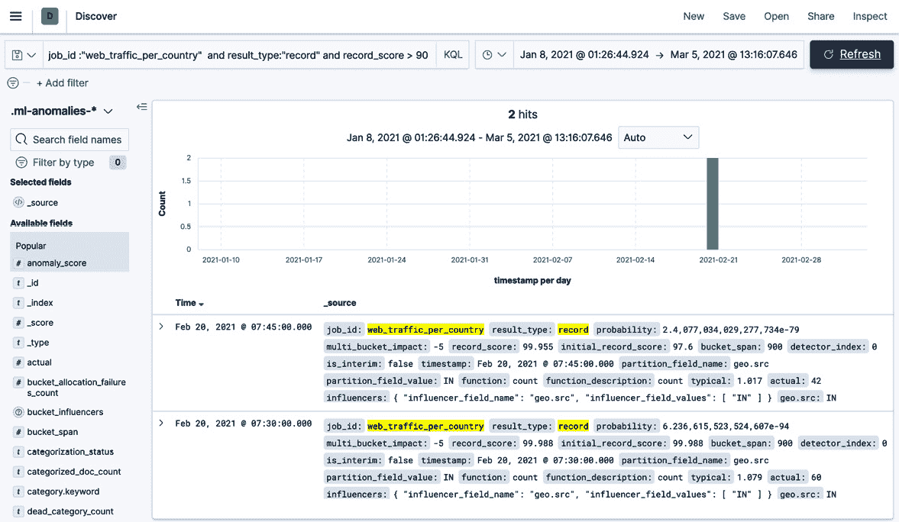

图 5.8 – 使用 Kibana Discover 搜索和过滤异常

在 KQL 中，此查询的语法如下：

```py
job_id:"web_traffic_per_country" and result_type:"record" and record_score>90
```

在这里，我们可以看到两个与我们查询匹配的具体事件。结果索引中包含大量信息，我们将系统地学习在本章中解析这些信息的大部分。

注意

虽然查看和查询`.ml-anomalies-*`索引模式内的结果和查询是安全的，但我们应记住，与此索引模式匹配的索引是系统索引，尝试手动修改或删除这些索引的内容是不明智的。

首先要理解的概念是，存在不同类型的结果（因此有`result_type`字段）以及不同类型的分数，它们从不同的角度或层面反映了分析。因此，让我们从更好地理解不同类型的评分以及这些分数是如何在结果索引中计算和存储的入手。

# 异常分数

首先解读 Elastic ML 异常检测作业的结果需要具备识别以下事实的能力：结果中有几个不同级别的异常评分，如下所示：

+   `result_type:bucket`): 此级别总结了每个时间桶内整个异常检测作业的结果。本质上，它表示了给定作业配置的时间桶有多不寻常。

+   `result_type:influencer`): 这用于更好地理解在特定时间段内最不寻常的实体（影响者）。

+   `result_type:record`): 这是关于每个时间桶内每个异常发生或异常实体的最详细信息。同样，根据作业配置（多个检测器、拆分等），每个时间桶可能有多个记录级文档。

此外，为了完全理解评分是如何进行的，我们还需要完全理解以下概念：

+   **归一化**：将异常性投射到 0 到 100 之间的固定尺度上的概念。

+   **影响者**：在异常发生时，通过对其数据集的有影响力贡献而引发异常创建的实体。

让我们在本节中更深入地研究这五个概念。

## 桶级别评分

桶级别的异常得分类似于回答这样的问题：“相对于这个作业的所有其他时间间隔，这个时间间隔有多不寻常？”，其中这个时间间隔由异常检测作业的`bucket_span`定义。如果你的作业有多个检测器或分析中的分割，导致可能同时为许多实体生成结果，那么每个桶级别的结果都是所有这些事物的聚合表示。桶级别的异常得分可以通过几种方式查看，第一种是在异常探索器 UI 顶部的**总体**泳道：

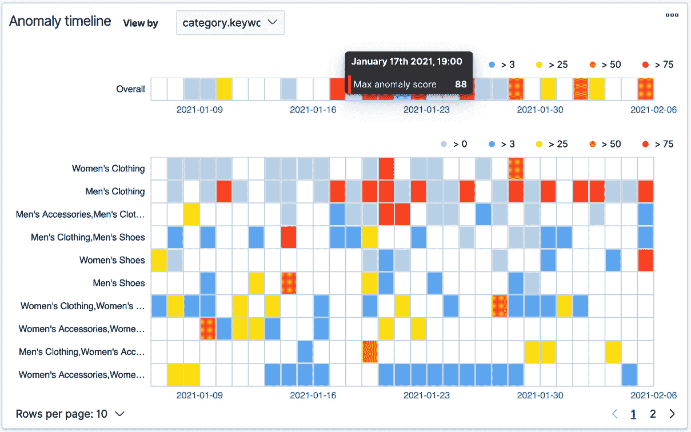

图 5.9 – 异常探索器的泳道

在这里，我们可以看到“最大异常得分”为`88`。在此需要注意的是，在此视图中显示的时间范围涵盖了从 1 月 6 日到 2 月 5 日的数据；因此，泳道中大约有 30 个“瓷砖”，每个代表一天。异常检测作业被配置为 15 分钟的桶跨度，因此每个瓷砖显示的是整个一天的最大得分。如果我们使用 Kibana 的时间选择器（屏幕右上角的时间/日期范围控制）仅放大显示一天，我们会看到更多细节，具体来说，**总体**泳道中的桶级别异常发生在凌晨 02:00 至 02:30 之间：

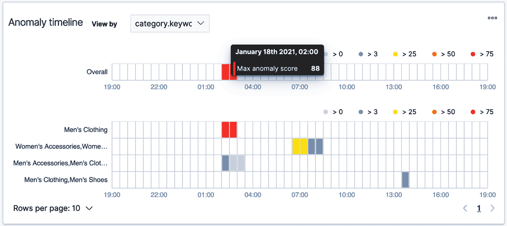

图 5.10 – 放大后的异常探索器泳道

同样重要的是要注意**总体**泳道如何（或不如何）与下面的泳道网格相关联。这个泳道网格显示了影响者级别的评分（将在下一节中讨论），因此它并不直接与桶级别的评分相关。这是一个常见的误解，因为许多人认为**总体**泳道是其下方网格列（例如，最大得分）的一种组合。你当然可以在*图 5.10*中看到这显然是不正确的，因为网格第二行（大约 07:00 AM）的影响者级别评分在**总体**（桶）级别没有相应的得分。为什么是这样？简短的答案是**总体**泳道是时间桶相互之间的比较。因此，最不寻常的时间桶得到最高的得分，而那些非常不寻常的时间桶（由于该时间桶内单个异常的数量和严重性）得到较小的得分，甚至没有得分。确定这种相对评分的过程称为**正则化**。这是所有级别评分的重要部分，值得独立解释。

## 正则化

如在*第一章*中首次介绍，即《IT 领域的机器学习》，我们了解到特定异常的原始概率值在 0 到 100 的范围内进行了标准化。这个过程使得异常的相对排名成为可能，同时也将值限制在一个固定区间内，这对于评估严重性以进行分类和/或警报是有用的。

最后一句中的关键方面是这个相对排名的概念。换句话说，标准化值考虑了异常检测工作到目前为止所看到的东西，并据此进行排名。这也意味着，随着新异常的发现，先前分配的标准化分数可能会随时间而改变。因此，您会注意到结果索引中的分数既有“初始”值，也有当前值，例如：

+   `initial_anomaly_score`: 在异常创建时记录的桶级别异常分数

+   `anomaly_score`: 当前桶级别的标准化异常分数

这两个值可能相同，但确实可能会随着时间的推移而分歧。初始分数是一个固定值，但当前分数可能会随着时间调整，例如，可能会遇到更多的严重异常。标准化过程在实时操作中每几个小时发生一次，或者在分析检测到标准化表中的剧烈变化时自发发生。如果异常检测工作被*关闭*（置于关闭状态），也会进行标准化。标准化可能会重新评分时间上可以追溯到`renormalization_window_days`设置配置的任何时间（默认值为 30 天或 100 个桶跨度，并且只有在通过 API 或高级作业向导直接修改作业的配置 JSON 创建作业时，该值才可更改）。

## 影响者级别评分

在影响者级别的异常分数类似于回答问题，“在这段时间里，哪些实体最不寻常？”，其中我们现在正在将这些实体相互比较。影响者级别的分数可以通过几种方式查看，第一种是在异常探索器 UI 中间的主网格泳道，第二种是在左侧的**顶级影响者**列表：

![Figure 5.11 – 异常探索器中的影响者

![img/B17040_05_11.jpg]

图 5.11 – 异常探索器中的影响者

在这里，我们看到在泳道的主网格中，`geo.src`字段的国籍代码按总影响因素分数递减排列。请注意，尽管网格设置为每页显示 10 行，但只列出了六个异常的国籍代码（在此时间段内没有更多具有显著影响因素分数的代码）。此外，主要影响因素列在左侧，显示每个实体的最大影响因素分数（`geo.src:IN` 为 99）以及此时间范围内所有影响因素分数的总和（`geo.src:IN` 为 223）。在这种情况下，由于此作业只定义了一个影响因素，所以这些信息可能看起来是多余的。然而，许多作业定义了多个影响因素，所以在这种情况下，视图变得更加合理。例如，如果我们查看在 `kibana_sample_data_logs` 索引上进行的群体分析作业，我们选择 `distinct_count("url.keyword") over clientip` 作为检测器，并选择 `clientip` 和 `response.keyword` 作为影响因素，异常检测探索器视图可能看起来像这样：

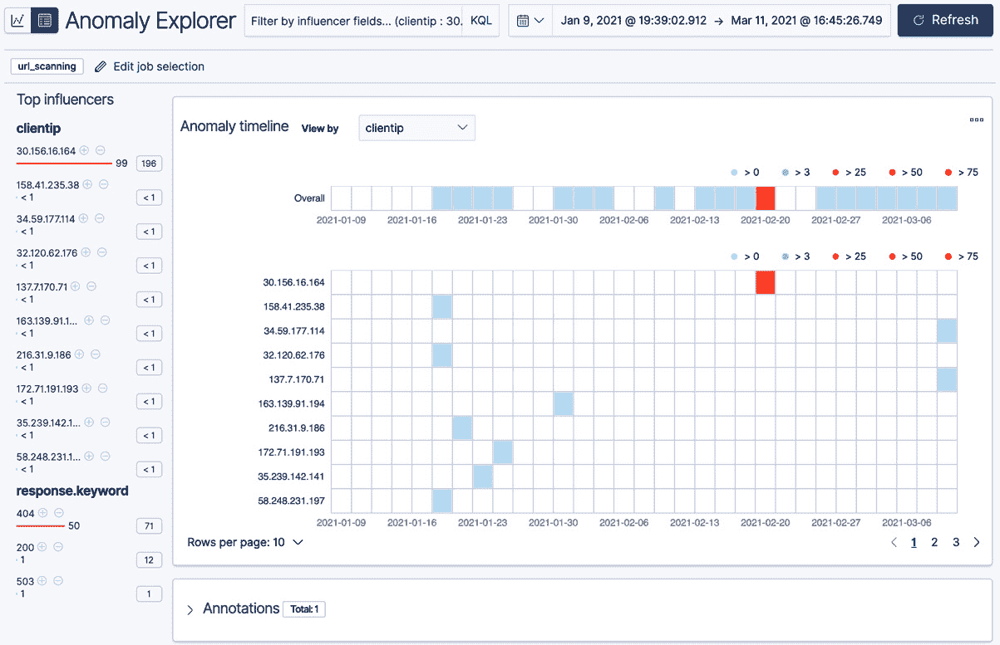

图 5.12 – 异常检测探索器中的多个影响因素

注意到网格的 `clientip`，但左边的**主要影响因素**列表显示了两个影响因素列表。

异常检测探索器是交互式的，所以如果我们选择 2 月 19 日**总体**泳道中的关键异常瓷砖，影响因素网格和列表会随着该时期的过滤器隐式应用而改变：

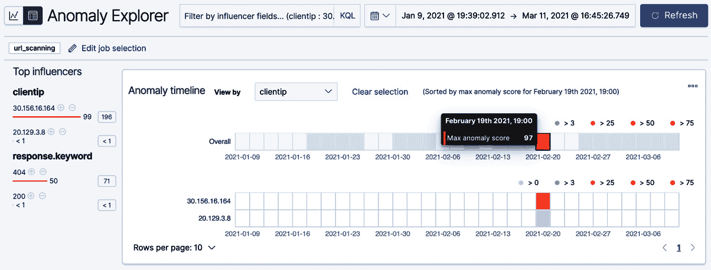

图 5.13 – 对特定一天进行过滤的异常检测探索器

我们现在只看到所选日期的相关实体。既然我们已经对影响因素有了一定的了解，你可能会问，如果它们可以以这种方式表示，哪些字段是好的影响因素候选者？让我们快速偏离一下，更深入地讨论一下影响因素。

## 影响因素

在异常检测作业配置中，可以定义字段作为影响因素。影响因素的概念是描述一个实体的字段，你想要知道它是否是异常存在的原因，或者至少是否做出了重大贡献。请注意，任何被选为候选影响因素的字段不需要是检测逻辑的一部分，尽管选择用作拆分或群体的字段作为影响因素是很自然的。

如果我们重新审视*图 5.13*中展示的例子，我们会看到`clientip`和`response.keyword`字段都被声明为作业的影响因子（其中`clientip`是检测器配置的一部分，但`response.keyword`不是）。客户端 IP 地址`30.156.16.164`被识别为顶级影响因子。这种声明似乎有点冗余，因为异常正是针对该客户端 IP 地址的——但这是在为定义人口或分割字段选择影响因子时预期的情况。另一个顶级影响因子(`response.keyword`)的值为`404`。这个特定的信息非常相关，因为它为用户提供了一个关于`30.156.16.164` IP 地址在异常期间所做事情的即时线索。如果我们调查异常发生时的异常 IP 地址，我们会看到 100%的请求都导致了`404`响应代码：

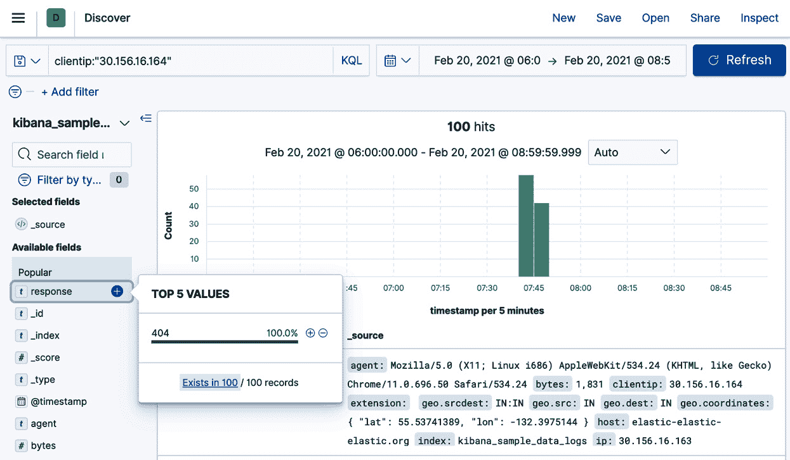

图 5.14 – 异常发生时，影响字段值 404 主导了结果

因此，`404`的值具有高影响因子得分（如图 5.13 所示为`50`）。你可能认为，由于 100%的请求都是`404`，影响因子得分也应该为 100，但事实并非如此简单。影响因子得分是相对于其他影响因子得分进行归一化的，影响因子得分也表达了`404`值随时间变化的不寻常程度。在这个特定的示例数据集中，随着时间的推移，有数百次`404`的发生，但其中大多数并没有与异常相关联。因此，这个特定异常的影响因子得分受到了这一事实的调和。对于 Elastic ML 来说，可能有一个有说服力的论点来区分这两个概念——一个分数表示实体随时间的不寻常程度，另一个分数表示字段值对特定异常的影响程度——但到目前为止，这些概念被融合到了影响因子得分中。

还需要理解的是，寻找潜在影响因子的过程发生在 Elastic ML 找到异常之后。换句话说，它不会影响作为检测一部分所做的任何概率计算。一旦确定异常，机器学习将系统地遍历每个候选影响因子字段的每个实例，并移除该实例在时间桶中的数据贡献。如果移除后剩余的数据不再异常，那么通过反事实推理，该实例的贡献必须是具有影响力的，并且会相应地进行评分（结果中的`influencer_score`）。

影响者可以成为在查看单个机器学习作业的结果时非常强大的工具，甚至可能是几个相关作业。在*第七章*，“AIOps 和根本原因分析”中，我们将看到如何有效地使用影响者来协助根本原因分析。

## 记录级评分

记录级别的异常得分是结果中的最低抽象级别，包含最多的细节。在异常探索器 UI 中，记录级结果显示在底部的表格中：


图 5.15 – 显示记录级结果的异常表

注意，如果**间隔**选择器设置为**自动**，则任何在时间上连续相邻的异常将被合并，只显示得分最高的异常。将**间隔**字段设置为**显示所有**将揭示每个单独的异常，如果需要的话。

一个常见的误解是记录级异常得分与在 `41x higher)` 中阐述的偏差直接相关。得分完全由概率计算驱动，使用之前描述的相同归一化过程。**描述**字段，甚至**典型**值，都是简化后的上下文信息，以便更容易理解异常。实际上，正如你稍后将会看到的，**描述**字段并没有存储在结果索引中——它只是在 Kibana 中即时计算的。

当查看 `.ml-anomalies-*` 索引中的不同级别异常记录时，我们可以看到那里有许多字段可供我们使用。其中一些可能是明显的，而另一些可能不明显。在下一节中，我们将系统地介绍结果索引的模式，并将描述重要字段的含义。

# 结果索引模式细节

正如我们已经暗示的，在结果索引内部，有各种不同的文档，每个文档都有其自身的用途，有助于理解异常检测作业的结果。在本节中，我们将讨论的文档是与我们在本章先前讨论的三个抽象级别直接相关的。它们被恰当地命名为以下内容：

+   `result_type:bucket`：以提供桶级结果

+   `result_type:record`：以提供记录级结果

+   `result_type:influencer`：以提供影响者级结果

这些文档类型的分布将取决于机器学习作业的配置以及正在分析的数据集的特征。这些文档类型是根据以下启发式方法编写的：

+   `result_type:bucket`：对于每个桶跨度的时间，都会写入一个文档。换句话说，如果桶跨度是 15 分钟，那么每 15 分钟就会有一个这种类型的文档被写入。其时间戳将等于桶的前沿。例如，对于包含 11:30 到 11:45 范围的时间桶，此类型的结果文档将有一个 11:30 的时间戳。

+   `result_type:record`：对于时间桶内的每个异常情况，都会写入一个文档。因此，对于包含许多实体（IP 地址、主机名等）的大数据集，在重大异常事件或大规模故障期间，一个特定的时间桶可能会有数百甚至数千个异常记录。此文档也将有一个时间戳，等于桶的前沿。

+   `result_type:influencer`：对于每个异常记录中找到的每个影响者，都会写入一个文档。因为每个异常记录可能找到多个影响者类型，所以这种类型的文档可能比记录结果更庞大。此文档也将有一个时间戳，等于桶的前沿。

当我们进入 *第六章*，*基于机器学习的警报* 时，理解这些文档类型中的字段尤其重要，因为不可避免地会在警报细节（通常，越多越好）和单位时间内的单个警报数量（通常，越少越好）之间取得平衡。我们将在开始编写实际警报时重新审视这一点。

## 桶结果

在最高抽象级别上，是桶级别的结果。请记住，这是整个作业随时间聚合的结果，本质上回答了“这个时间桶有多不寻常？”的问题。

让我们通过使用 Kibana Discover 和执行以下 KQL 查询来查看 `.ml-anomalies-*` 索引中的一个示例文档：

```py
result_type :"bucket" and anomaly_score >98
```

这将产生以下输出：

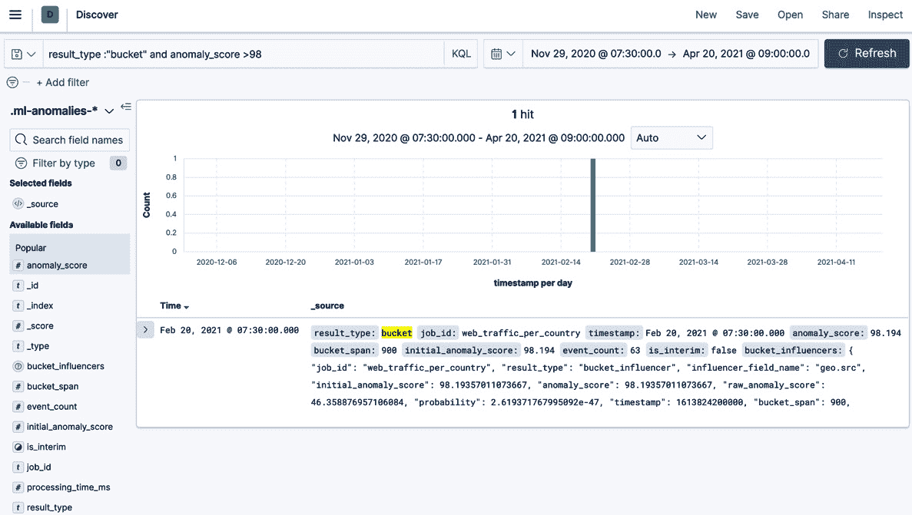

图 5.16 – Kibana Discover 中看到的桶级别结果文档

点击图 5.16 中文档时间戳旁边的 **>** 图标，可以将其展开，以便您可以看到所有详细信息：

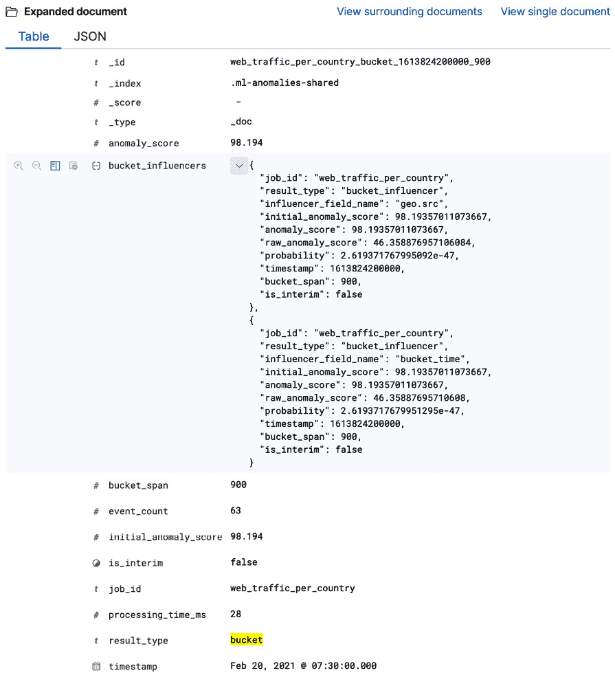

图 5.17 – Kibana Discover 中的桶级别文档细节

您可以从图 5.16 中看到，我们的查询只返回了一个桶级别的文档，一个单独的异常时间桶（时间戳为 `1613824200000`，或者在我的时区中，2021 年 2 月 20 日上午 07:30:00 GMT-05:00），其 `anomaly_score` 大于 98。换句话说，在这个时间范围内没有其他时间桶有如此大的异常。让我们看看关键字段：

+   `timestamp`: 时间桶的前沿时间戳。在 Kibana 中，此字段将默认以您的本地时区显示（尽管它在索引中以 UTC 时区的纪元格式存储）。

+   `anomaly_score`: 基于整个作业中看到的概率范围，桶的当前标准化分数。随着作业处理新数据和新异常的发现，此分数的值可能会随时间波动。

+   `initial_anomaly_score`: 桶的标准化分数，即当该桶首次由分析分析时。与 `anomaly_score` 不同，随着更多数据的分析，此分数不会改变。

+   `event_count`: 在桶跨度内由 ML 算法看到的原始 Elasticsearch 文档的数量。

+   `is_interim`: 一个标志，表示桶是否已最终确定，或者是否仍在等待桶跨度内的所有数据接收。对于在实时中运行的工作，此字段是相关的。对于某些类型的分析，即使桶中并非所有数据都已看到，也可能有临时结果。

+   `job_id`: 创建此结果的异常检测作业的名称。

+   `processing_time_ms`: 分析处理此桶数据所需处理时间（以毫秒为单位）的内部性能度量。

+   `bucket_influencers`: 为当前桶识别出的影响因子（及其详细信息）的数组。即使在工作配置中没有选择影响因子，或者分析中没有影响因子，也始终会存在一个默认的 `influencer_field_name:bucket_time` 类型的影响因子，这主要是一个内部记录工具，以便在无法确定显式影响因子的情况下对桶级别的异常进行排序。

如果作业具有命名和识别的影响因子，那么 `bucket_influencers` 数组可能看起来像 *图 5.17* 所示。

注意，除了默认的 `influencer_field_name:bucket_time` 类型条目外，在这种情况下，还有一个针对 `geo.src` 字段的由分析识别出的影响因子的字段名条目。这是一个提示，表明 `geo.src` 是在此次异常发生时发现的有关影响因子类型。由于在作业配置中可以选择多个影响因子候选人，应注意的是，在这种情况下，`geo.src` 是唯一的影响因子字段，没有发现其他具有影响力的字段。还应注意的是，在这个细节级别，`geo.src` 的特定实例（即哪一个）没有公开；当在较低层次抽象查询时，将公开该信息，我们将在下一节讨论。

## 记录结果

在较低层次的抽象级别，存在记录级别的结果。提供最大量的细节，记录结果显示了异常的具体实例，并基本上回答了问题：“哪个实体不寻常以及程度如何？”

让我们通过使用 Kibana Discover 和执行以下 KQL 查询来查看 `.ml-anomalies-*` 索引中的一个示例文档：

```py
result_type :"record" and record_score >98
```

这将导致类似以下内容：

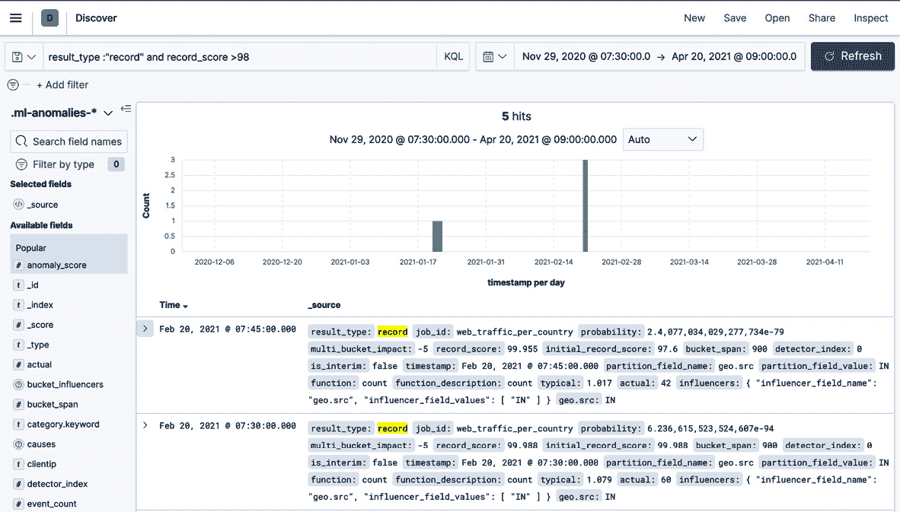

图 5.18 – 在 Kibana Discover 中看到的记录级别结果文档

点击文档时间戳旁边的 **>** 图标将展开它，以便您可以看到所有详细信息：

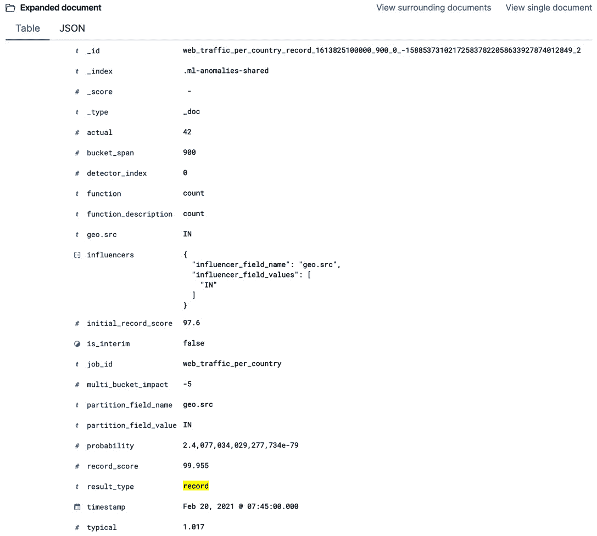

图 5.19 – 在 Kibana Discover 中的记录级别文档详情

你可以在 *图 5.18* 中看到，我们的查询返回了一些桶级别文档。让我们看看关键字段：

+   `timestamp`：时间桶的前沿时间戳，其中发生了此异常。这与前面解释的类似。

+   `job_id`：创建此结果的事务检测作业的名称。

+   `record_score`：基于整个作业中看到的概率范围，异常记录的当前归一化分数。随着作业处理新数据并发现新的异常，此分数的值可能会随时间波动。

+   `initial_record_score`：异常记录的归一化分数，即当该桶首次由分析处理时的分数。与 `record_score` 不同，随着更多数据的分析，此分数不会改变。

+   `detector_index`：一个内部计数器，用于跟踪此异常所属的检测器配置。显然，对于单检测器作业，此值将为零，但在具有多个检测器的作业中，此值可能不为零。

+   `function`：一个引用，用于跟踪用于创建此异常的检测器函数。

+   `is_interim`：一个标志，表示桶是否已最终确定，或者桶是否仍在等待接收桶跨度内的所有数据。对于在实时中运行的作业，此字段是相关的。对于某些类型的分析，即使桶中尚未看到所有数据，也可能有临时结果。

+   `actual`：在此桶中分析的数据的实际观察值。例如，如果函数是 `count`，则这表示在此时间桶中遇到（并计数）的文档数量。

+   `typical`：基于此数据集的机器学习模型的预期或预测值的表示。

+   `multi_bucket_impact`：一个测量值（从 -5 到 +5 的范围），用于确定此特定异常受后续多桶分析（本章后面解释）影响的程度，从无影响（-5）到全部影响（+5）。

+   `influencers`：一个数组，其中包含哪些影响者（以及这些影响者的值）与这个异常记录相关。

如果作业定义了拆分（无论是使用`by_field_name`和/或`partition_field_name`）并确定了影响者，那么记录结果文档将包含更多信息，例如*图 5.19*中所示：

+   `partition_field_name`：一个提示，表明已定义分区字段，并且对于分区字段值之一发现了异常。

+   `partition_field_value`：发生异常的分区字段的值。换句话说，这是发现异常的实体名称。

除了这里提到的字段（如果作业配置为使用`by`字段，则将是`by_field_name`和`by_field_value`），我们还看到了`geo.src`字段的显式实例。这只是一个快捷方式——结果中的每个分区、`by`或`over_field_value`都将有一个直接的字段名。

如果你的作业正在进行人口分析（通过使用`over_field_name`），那么记录结果文档将组织得略有不同，因为报告是以人口中不寻常成员的取向进行的。例如，如果我们查看在`kibana_sample_data_logs`索引上的人口分析作业，并选择`distinct_count("url.keyword") over clientip`作为检测器，那么一个示例记录级结果文档也将包含一个原因数组：

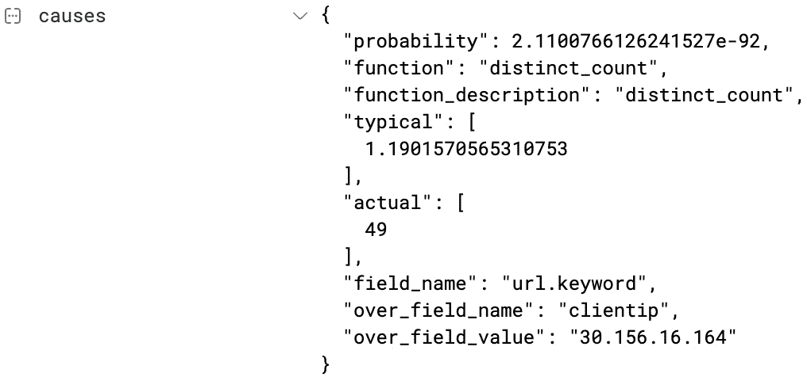

图 5.20 – 显示人口作业原因数组的记录级文档

`causes`数组旨在紧凑地表达该 IP 在该桶中做的所有异常事情。再次强调，许多事情看起来似乎是多余的，但这主要是因为在仪表板或警报中展示结果时，可能存在不同的信息聚合方式。

此外，在本人口分析案例中，我们发现`influencers`数组中既包含`clientip`字段，也包含`response.keyword`字段：

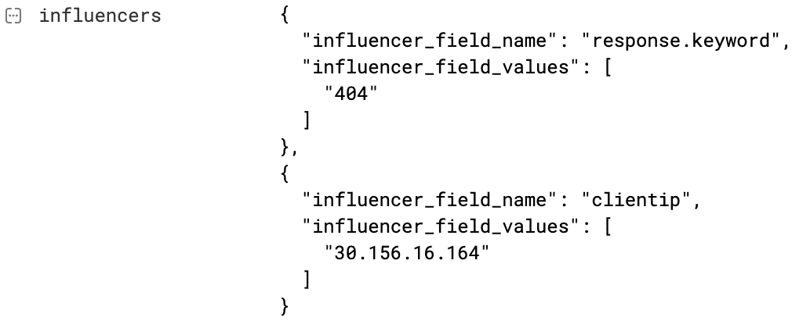

图 5.21 – 显示人口作业影响者数组的记录级文档

让我们通过查看影响者级别的结果来结束我们对结果索引模式的调查。

## 影响者结果

通过影响者这一视角来查看结果，我们可以回答问题：“在我的机器学习作业中，哪些实体最不寻常，以及它们何时变得不寻常？”为了理解影响者级别结果的结构和内容，让我们通过使用 Kibana Discover 和执行以下 KQL 查询来查看`.ml-anomalies-*`索引中的一个示例文档：

```py
result_type :"influencer" and response.keyword:404
```


图 5.22 – 在 Kibana Discover 中看到的影响者级别结果文档

注意，在这种情况下，我们没有查询分数（`influencer_score`），而是查询一个预期的实体名称和值。列出的最后一份文档（`influencer_score`为`50.174`）与我们在*图 5.13*中看到的一致。

让我们看看关键字段：

+   `timestamp`: 包含此推广者异常活动的时间桶的前沿时间戳。这与之前解释的类似。

+   `job_id`: 创建此结果的异常检测作业的名称。

+   `influencer_field_name`: 在作业配置中声明的推广者字段的名称。

+   `influencer_field_value`: 该结果相关的推广者字段值。

+   `influencer_score`: 推广者在此点对异常的贡献程度和异常性的当前标准化分数。

+   `initial_influencer_score`: 分析首次分析该桶时推广者的标准化分数。与`influencer_score`不同，此分数在分析更多数据时不会改变。

+   `is_interim`: 一个标志，表示桶是否已最终确定，或者桶是否仍在等待桶跨度内的所有数据接收。对于实时运行的作业，此字段相关。对于某些类型的分析，即使桶中尚未看到所有数据，也可能有临时结果。

现在我们已经详尽地解释了用户可用的相关字段，我们可以在后续章节中构建自定义仪表板、可视化以及复杂的警报时将这些信息存档。但是，在我们离开这一章之前，我们还有一些重要的概念需要探讨。接下来是关于一种特殊类型的异常——多桶异常的讨论。

# 多桶异常

到目前为止，我们研究的大多数关于由 Elastic ML 的异常检测作业生成的异常，都是关于在特定时间查看特定异常，但以`bucket_span`的间隔进行量化。然而，我们当然可以有一些情况，其中桶跨度内的特定观察可能并不那么异常，但一个扩展的时间窗口，如果整体来看，可能比任何单个观察更显著地异常。让我们看一个例子。

## 多桶异常示例

在*第三章*（[B17040_03_Epub_AM.xhtml#_idTextAnchor049]）的示例中首次展示的*异常检测*，在*图 3.17*中，我们在此重复该图，以展示多桶异常如何在 Elastic ML UI 中展现：

![图 5.23 – 多桶异常首次在第三章展示

![图片 B17040_05_23.jpg]

图 5.23 – 多桶异常首次在第三章展示

如在*第三章*中讨论的，*异常检测*，多桶异常在 UI 中以不同的符号表示（一个十字而不是一个点）。它们表示实际的单个值可能不一定异常，但在 12 个连续桶的滑动窗口中存在一个趋势。在这里，您可以注意到几个相邻桶中存在一个明显的下滑。

然而，请注意，一些多桶异常标记有时会在数据“恢复”之后放置在数据上。这可能会让用户感到有些困惑，直到你意识到，由于多桶异常的确定是一种二级分析（除了桶级分析之外）并且由于这种分析是一个向后看的滑动窗口，当异常被记录时，窗口的前沿可能会在情况恢复之后。

## 多桶评分

正如之前提到的，多桶分析是一种二级分析。因此，对于每个桶跨度，计算两个概率——当前桶中观察到的观测值的概率，以及多桶特征的概率——这是当前桶和前 11 个桶的加权平均值。如果这两个概率大致处于相同的数量级，那么`multi_bucket_impact`将较低（在-5 到+5 的负值范围内）。另一方面，如果多桶特征的概率明显较低（因此更不寻常），那么`multi_bucket_impact`将较高。

在*图 5.23*中显示的示例中，UI 将向用户显示多桶影响为`高`，但不会给出实际的评分：

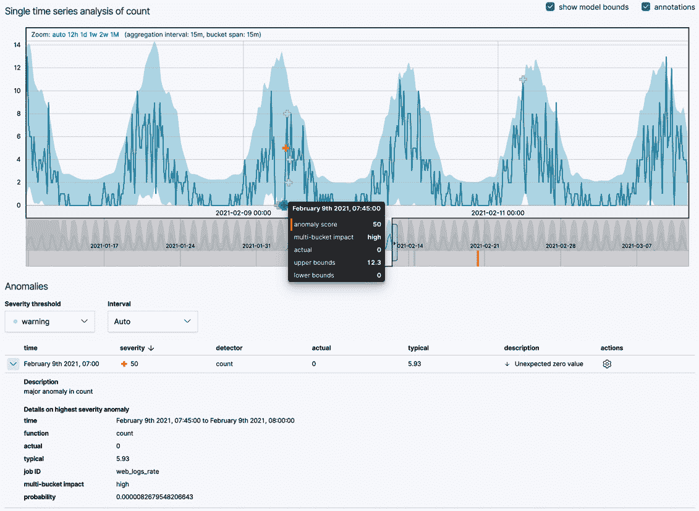

图 5.24 – 多桶异常，显示影响评分

然而，如果您查看原始记录级结果，您将看到`multi_bucket_impact`确实被赋予了+5 的值：

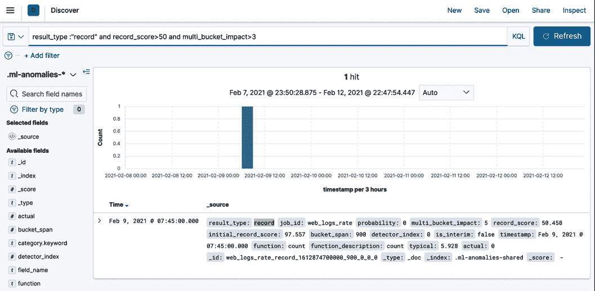

图 5.25 – 多桶异常记录，显示原始分数

多桶异常为您提供了对数据行为的不同视角。您需要记住它们是如何通过`multi_bucket_impact`字段来表示和评分的，以便您可以根据需要将它们包含或排除在报告或警报逻辑中。

让我们现在来看看（是的，这里有意使用了双关语）预测结果在结果索引中的表示方式。

# 预测结果

如在*第四章*中详细解释的，*预测*，我们可以让 Elastic ML 将分析过的数据趋势外推到未来。回想一下我们在*图 4.21*中展示了什么：

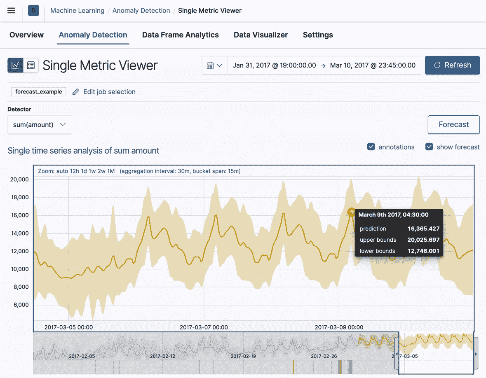

图 5.26 – 预测结果首次在第四章展示

记住，预测值是最有可能的值（概率），阴影区域是置信度 95% 的范围。这三个关键值存储在 `.ml-anomalies-*` 结果索引中，名称如下：

+   `forecast_prediction`

+   `forecast_upper`

+   `forecast_lower`

## 查询预测结果

当在 `.ml-anomalies-*` 结果索引中查询预测结果时，重要的是要记住预测结果是短暂的——它们在创建后的默认生命周期为 14 天，尤其是在从 Kibana UI 创建时。如果需要不同的过期持续时间，则必须通过 `_forecast` API 端点调用预测并显式设置 `expires_in` 持续时间。

另一件需要注意的事情是，可能在同一数据集的不同时间点调用了多个预测。正如之前在 *图 4.4* 中所示并在此重复，多次调用预测会产生多个预测结果：

![Figure 5.27 – 在不同时间调用多个预测的符号表示

![img/B17040_05_27.jpg]

图 5.27 – 在不同时间调用多个预测的符号表示

因此，我们需要一种方法来区分结果。在 Kibana UI 中，只需查看 **创建** 日期即可简单区分：

![Figure 5.28 – 查看多次运行的预测结果

![img/B17040_05_28.jpg]

图 5.28 – 查看多次运行的预测结果

然而，当查看结果索引时，应注意每个调用的预测都有一个唯一的 `forecast_id`：

![Figure 5.29 – 在 Kibana Discover 中查看预测结果

![img/B17040_05_29.jpg]

图 5.29 – 在 Kibana Discover 中查看预测结果

当使用 `_forecast` API 调用预测时，这个 `forecast_id` 才是明显的，因为 `forecast_id` 是 API 调用负载的一部分返回的。

因此，如果创建了跨越相同时间框架的多个预测，将会有多个具有不同 ID 的结果。

当查询预测结果时，你可以考虑两种可能的查询方向：

+   **值聚焦**：查询提供一个日期和时间，结果返回该时间的特定值。例如，“5 天后我的利用率是多少？”就是一个很好的例子。

+   **时间聚焦**：查询提供一个值，结果是一个实现该值的时间。例如，“我的利用率何时达到 80%？”就是一个很好的例子。

显然，任何一种查询都是可能的。例如，为了满足以时间为重点的查询，我们需要稍微调整查询，要求它返回预测值满足某些标准的时间（或日期）。用户可以使用其他传统查询方法（KQL、Elasticsearch DSL）查询预测结果，但为了稍微变化一下，我们将在 Kibana Dev Tools 控制台中使用 Elastic SQL 提交查询：

```py
POST _sql?format=txt
{
   "query": "SELECT forecast_prediction,timestamp FROM \".ml-anomalies-*\" WHERE job_id='forecast_example' AND forecast_id='Fm5EiHcBpc7Wt6MbaGcw' AND result_type='model_forecast' AND forecast_prediction>'16890' ORDER BY forecast_prediction DESC"
}
```

在这里，我们询问是否存在任何预测值超过我们设定的 16,890 值限制的时间。响应如下：

```py
forecast_prediction|       timestamp        
-------------------+------------------------
16893.498325784924 |2017-03-17T09:45:00.000Z
```

换句话说，我们可能在 3 月 17 日上午 9:45 GMT 时突破阈值（尽管请记住，从*第四章*，*预测*中，所使用的样本数据来自过去，因此预测预测也属于过去）。现在我们已经很好地理解了如何查询预测结果，我们可以将它们包含在仪表板和可视化中，我们将在本章后面部分介绍——甚至可以在警报中，正如我们在*第六章*，*基于机器学习的警报*中看到的。

但是，在我们查看如何在自定义仪表板和可视化中包含结果之前，让我们再简要介绍一个主题——Elastic ML 结果 API。

# 结果 API

如果程序化访问结果是你的事情，除了直接查询结果索引外，你还可以选择查询 Elastic ML 的结果 API。API 的一些部分与我们之前探索的内容重复，而一些部分是独特的。我们现在将在接下来的部分中检查它们。

## 结果 API 端点

有五个不同的结果 API 端点可用：

+   获取桶

+   获取影响因素

+   获取记录

+   获取整体桶

+   获取类别

前三个 API 端点提供的结果与我们通过直接查询结果索引（通过 Kibana 或使用 Elasticsearch `_search` API）在本章中已经涵盖的内容重复，这种方法实际上提供了更多的灵活性，所以我们在这里不会详细讨论它们。然而，最后两个 API 端点是新颖的，每个都值得解释。

## 获取整体桶 API

整体桶 API 调用是一种以编程方式返回多个异常检测作业的汇总结果的方法。我们不会探索请求体的每个参数，也不会描述响应体中的每个字段，因为你可以参考文档。但我们将讨论这个 API 调用的重要功能，即请求任意数量的作业的结果，并接收一个单一的结果评分（称为`overall_score`），它封装了每个请求作业的最大桶`anomaly_score`的`top_n`平均值。如文档所示，一个示例调用是请求桶异常评分平均高于`50.0`的前两个作业（在以`job-`开头的作业集中），从特定的时间戳开始：

```py
GET _ml/anomaly_detectors/job-*/results/overall_buckets
{
  "top_n": 2,
  "overall_score": 50.0,
  "start": "1403532000000"
}
```

这将导致以下样本返回：

```py
{
  "count": 1,
  "overall_buckets": [
    {
      "timestamp" : 1403532000000,
      "bucket_span" : 3600,
      "overall_score" : 55.0,
      "jobs" : [
        {
          "job_id" : "job-1",
          "max_anomaly_score" : 30.0
        },
        {
          "job_id" : "job-2",
          "max_anomaly_score" : 10.0
        },
        {
          "job_id" : "job-3",
          "max_anomaly_score" : 80.0
        }
      ],
      "is_interim" : false,
      "result_type" : "overall_bucket"
    }
  ]
}
```

注意，在这种情况下，`overall_score`是两个最高分数的平均值（`overall_score`的`55.0`是`job-3`分数`80.0`和`job-1`分数`30.0`的平均值），尽管有三个异常检测作业匹配`job-*`的查询模式。虽然这确实很有趣，也许是为了构建复合警报，你应该意识到这种报告的限制，特别是如果你只能访问桶级别的异常分数，而不能访问记录或影响因素级别的任何信息。在*第六章*，“基于机器学习分析的警报”，我们将探讨一些关于复合警报的选项。

## 获取类别 API

`categories` API 调用仅适用于使用分类的作业，如*第三章*“异常检测”中详细描述。`categories` API 返回在文档文本分析过程中发现的类别的一些有趣的内部定义。如果我们对在*第三章*“异常检测”中创建的分类作业运行 API（为了简洁起见，仅返回一条记录），输出如下：

```py
GET _ml/anomaly_detectors/secure_log/results/categories
{
  "page":{
    "size": 1
  }
}
```

我们将看到以下响应：

```py
{
  "count" : 23,
  "categories" : [
    {
      "job_id" : "secure_log",
      "category_id" : 1,
      "terms" : "localhost sshd Received disconnect from port",
      "regex" : ".*?localhost.+?sshd.+?Received.+?disconnect.+?from.+?port.*",
      "max_matching_length" : 122,
      "examples" : [
        "Oct 22 15:02:19 localhost sshd[8860]: Received disconnect from 58.218.92.41 port 26062:11:  [preauth]",
        "Oct 22 22:27:20 localhost sshd[9563]: Received disconnect from 178.33.169.154 port 53713:11: Bye [preauth]",
        "Oct 22 22:27:22 localhost sshd[9565]: Received disconnect from 178.33.169.154 port 54877:11: Bye [preauth]",
        "Oct 22 22:27:24 localhost sshd[9567]: Received disconnect from 178.33.169.154 port 55723:11: Bye [preauth]"
      ],
      "grok_pattern" : ".*?%{SYSLOGTIMESTAMP:timestamp}.+?localhost.+?sshd.+?%{NUMBER:field}.+?Received.+?disconnect.+?from.+?%{IP:ipaddress}.+?port.+?%{NUMBER:field2}.+?%{NUMBER:field3}.*",
      "num_matches" : 595
    }
  ]
}
```

回复中包含以下几个元素：

+   `category_id`: 这是消息类别的编号（从 1 开始递增）。它对应于结果索引中`mlcategory`字段的值。

+   `terms`: 这是一个从消息中提取的静态、不可变的单词列表。

+   `examples`: 一个包含完整、未修改的样本日志行的数组，这些行属于此类。这些用于向用户展示一些真实日志行的样子。

+   `grok_pattern`: 一个正则表达式样式的模式匹配，可以用于 Logstash 或一个可以用来匹配此消息类别的摄取管道。

+   `num_matches`: 在此数据集上运行的异常检测作业中，此消息类别在日志中出现的次数。

也许这个 API 最有趣的使用不是用于异常检测，而是仅仅为了理解你的非结构化日志中类别类型的唯一数量及其分布——以回答诸如“我的日志中有什么类型的消息，每种类型有多少？”等问题。这些功能中的一些可能在将来被利用来创建一个“数据准备”管道，以帮助用户更容易地将非结构化日志摄取到 Elasticsearch 中。

现在我们来探讨如何利用从 Elastic ML 的异常检测和预测作业中获得的结果，在自定义仪表板、可视化以及 Canvas 工作垫中发挥作用。

# 自定义仪表板和 Canvas 工作垫

很明显，现在我们知道了结果索引的来龙去脉，该索引存储了 Elastic ML 的异常检测和预测分析的精华，我们关于如何以对我们自己的目标有意义的方 式表达这些结果的想象力是无限的。本节将简要探讨一些概念和想法，您可以使用它们将 Elastic ML 的结果带到您附近的大屏幕上！

## 仪表板“可嵌入内容”

Elastic ML 功能的一个最近增加是能够将异常探索器时间线（“泳道”）嵌入到现有的自定义仪表板中。要完成此操作，只需点击异常时间线右上角的“三个点”菜单，并选择**添加到仪表板**选项：

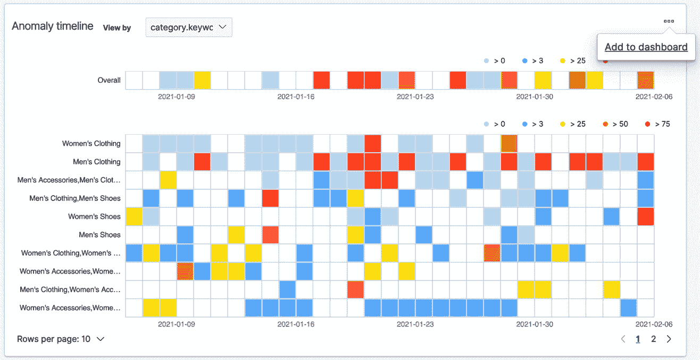

图 5.30 – 将异常时间线添加到另一个仪表板

在这一点上，选择您想要包含的泳道视图的哪个部分，并选择您希望将它们添加到哪个仪表板（们）：

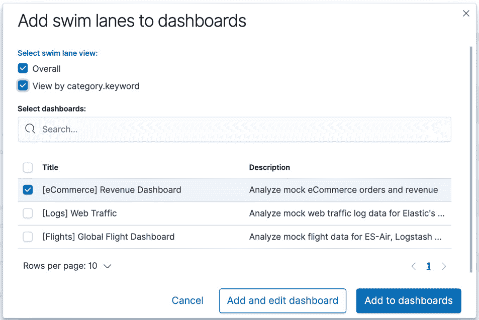

图 5.31 – 将异常时间线添加到特定仪表板

点击**添加和编辑仪表板**按钮，然后会将用户带到目标仪表板，并允许他们移动和调整嵌入的面板大小。例如，我们可以将异常与其他可视化并排显示：

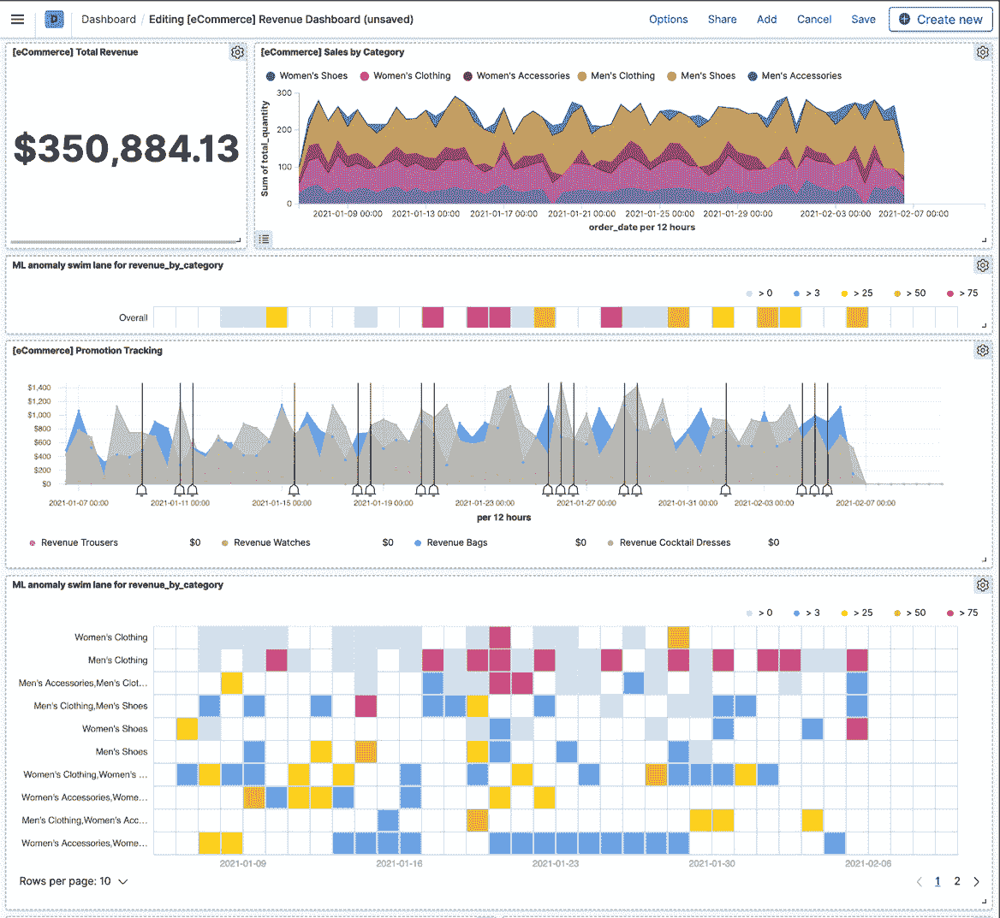

图 5.32 – 新仪表板现在包含异常泳道可视化

## 在 TSVB 中的异常作为注释

`kibana_sample_data_logs`具有以下面板选项：

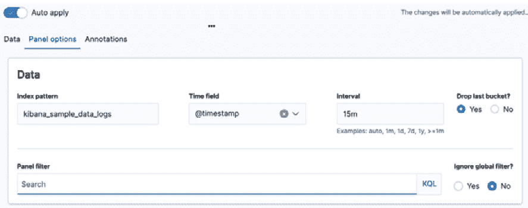

图 5.33 – 创建新的 TSVB 可视化 – 面板选项

然后，这是`geo.src`的以下配置）：

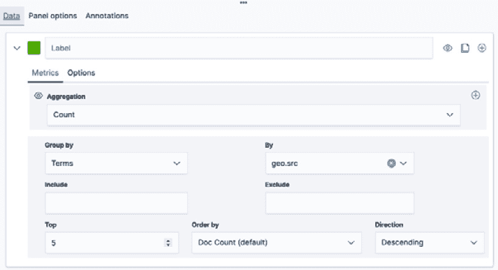

图 5.34 – 创建新的 TSVB 可视化 – 数据选项

然后，我们有以下配置的`web_traffic_per_country`以选择记录分数超过`90`的异常：

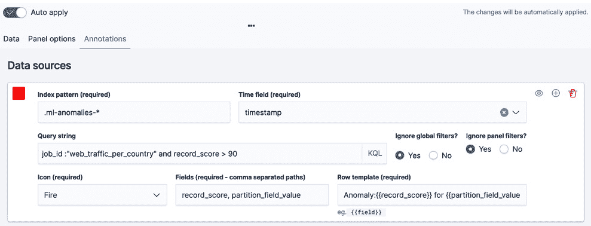

图 5.35 – 创建新的 TSVB 可视化 – 注释选项

注意`record_score`和`partition_field_value`)以及`Anomaly:{{record_score}} for {{partition_field_value}}`)。一旦完成，我们就得到了最终结果：


图 5.36 – 创建新的 TSVB 可视化，包含异常注释

我们现在有一个很好的可视化面板，异常数据叠加在原始原始数据上。

## 自定义画布工作垫

Kibana Canvas 是创建由 Elasticsearch 驱动的像素完美信息图的终极工具。您可以使用一组可定制的元素创建高度定制化的报告。Canvas 中的体验与标准的 Kibana 仪表板非常不同。Canvas 为您提供了一个工作区，您可以在其中构建一系列幻灯片（在概念上类似于 Microsoft PowerPoint），称为**工作垫**。

要在 Canvas 工作垫中利用异常检测和/或预测结果，不需要做任何特别的事情——本章迄今为止学到的所有内容都适用。这是因为使用 `essql` 命令在 Canvas 中查询 `.ml-anomalies-*` 索引模式并提取我们关心的信息非常容易。

当我们安装 Kibana 样本数据时，我们也会得到一些样本 Canvas 工作垫来享受：

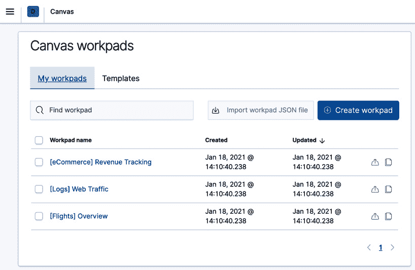

图 5.37 – 样本 Canvas 工作垫

点击**[日志]网络流量**样本工作垫，我们可以打开它进行编辑：

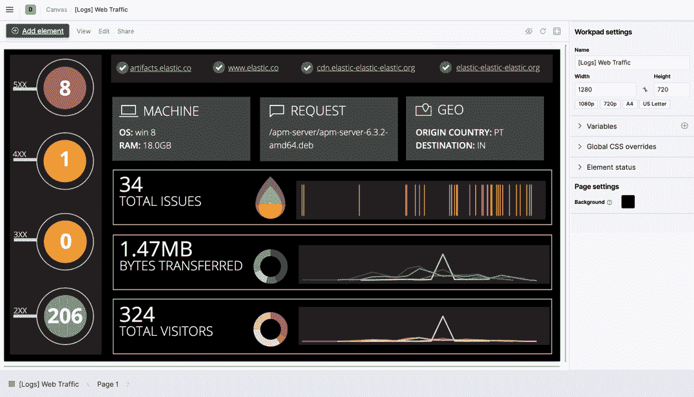

图 5.38 – 样本网络流量工作垫

选择页面上的一个元素（可能是 `324`），然后在 Canvas 的右下角选择**表达式编辑器**，将显示该元素的详细信息：

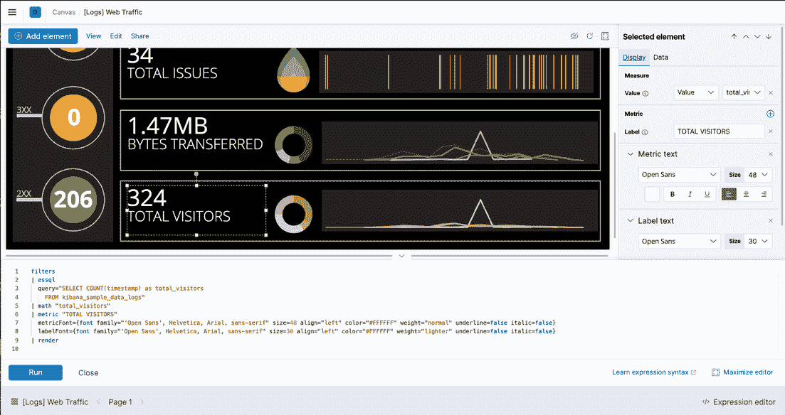

图 5.39 – 在表达式编辑器中编辑 Canvas 元素

注意，获取实时数据的真正“魔法”嵌入在 `essql` 命令中——表达式其余部分仅仅是格式化。作为一个简单的例子，我们可以使用以下语法调整 SQL：

```py
SELECT COUNT(timestamp) as critical_anomalies FROM \".ml-anomalies-*\" WHERE job_id='web_logs_rate' AND result_type='record' AND record_score>'75'
```

注意，由于 `.ml-anomalies-*` 索引模式的名字以非字母字符开头，因此名字需要用双引号括起来，并且这些双引号需要用反斜杠字符转义。

这将返回特定数据集上特定异常检测作业中关键异常（`record_score` 大于 `75` 的异常）的总数：

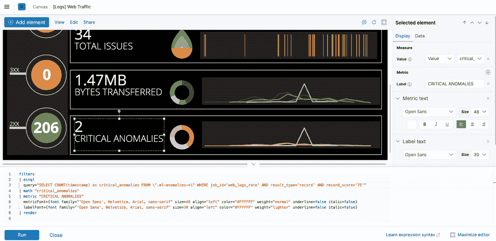

图 5.40 – 显示关键异常的数量

简而言之，使用 Canvas 创建非常美丽和有意义的数据可视化以及利用异常检测结果或预测结果中的信息非常容易。

# 摘要

Elastic ML 的异常检测和预测分析通过 Kibana 中提供的丰富 UI 或通过直接查询结果索引和 API 的编程方式创建出奇妙而有意义的结果。理解您的异常检测和预测作业的结果，并能够适当地利用这些信息进行进一步的定制可视化或警报，使这些定制资产更加强大。

在下一章中，我们将利用这些结果来创建复杂且实用的主动警报，以进一步提高 Elastic ML 的操作价值。
