# 第六章：基于机器学习分析的警报

前一章（*第五章**，结果解释*）深入讲解了异常检测和预测结果是如何存储在 Elasticsearch 索引中的。这为我们现在创建主动的、可操作的、信息丰富的警报提供了适当的背景。

在撰写本书时，我们发现我们正处于一个转折点。多年来，Elastic ML 一直依赖于 Watcher（Elasticsearch 的一个组件）的警报功能，因为这是唯一可以针对数据进行警报的机制。然而，一个新的警报平台已经被设计为 Kibana 的一部分（并在 v7.11 中被认为是 GA），这种新的方法将成为未来警报的主要机制。

Watcher 仍然提供一些有趣的功能，这些功能在 Kibana 警报中尚未提供。因此，本章将展示使用 Kibana 警报和 Watcher 创建警报的使用方法。根据您的需求，您可以选择您想使用的方法。

具体来说，本章将涵盖以下主题：

+   理解警报概念

+   从机器学习 UI 构建警报

+   使用 watch 创建警报

# 技术要求

本章中的信息将使用 v7.12 版本的 Elastic Stack。

# 理解警报概念

希望不会过于咬文嚼字，这里可以提出一些关于警报和某些警报方面（尤其是关于异常检测）的重要性声明，在我们深入研究配置这些警报的机制之前，这些方面是非常重要的。

## 异常不一定是警报

这需要明确指出。通常，最初接受异常检测的用户一旦意识到可以针对异常发出警报，就会感到有必要对一切发出警报。如果异常检测部署在数百、数千甚至数万个实体上，这可能会是一个极具挑战性的情况。异常检测虽然确实可以释放用户从定义特定的、基于规则的异常或硬编码的阈值警报中解脱出来，但也可能在大规模数据中广泛部署。我们需要意识到，如果我们不小心，对每一个小异常的详细警报可能会非常嘈杂。

幸运的是，我们在*第五章**，结果解释*中已经了解了一些机制，这些机制有助于我们减轻这种情况：

+   **总结**：我们了解到异常性不仅报告了单个异常（在“记录级别”），还在桶级别和影响因素级别进行了总结。如果我们愿意，这些总结分数可以促进更高层次的抽象警报。

+   **标准化** **评分**：由于每个异常检测作业都有一个定制的标准化范围，它是专门为特定的检测配置和正在分析的数据集构建的，这意味着我们可以利用 Elastic ML 输出的标准化评分来限制典型的警报频率。也许对于您创建的特定作业，以至少 10 分的异常分数进行警报通常每天会收到大约一打警报，50 分的分数每天会收到大约一个警报，90 分的分数每周会收到大约一个警报。换句话说，您可以有效地调整警报，以适应您对每单位时间内希望接收的警报数量的容忍度（当然，除了意外系统级故障的情况，这可能会产生比平时更多的警报）。

+   **相关性**/**组合**：也许对单个指标异常（例如，主机的 CPU 异常高）的警报不如对一组相关异常（CPU 高、空闲内存低、响应时间也高）的警报有说服力。在某些情况下，对复合事件或序列的警报可能更有意义。

事实是，尽管没有一种适合所有情况的哲学来结构警报并提高警报的有效性，但用户仍然有一些选项可供选择，以确定最适合您的方法。

## 在实时警报中，时间很重要

在*第二章**，启用和实施*中，我们了解到异常检测作业是一个相对复杂的原始数据查询、数据分析以及结果报告的持续过程，这个过程可以在接近实时的情况下运行。因此，作业配置的几个关键方面决定了该过程的节奏，即`bucket_span`、`frequency`和`query_delay`参数。这些参数定义了结果何时“可用”以及值将具有哪个时间戳。这一点非常重要，因为对异常检测作业的警报将涉及对结果索引（`.ml-anomalies-*`）的后续查询，显然，查询何时运行以及使用的时间范围将决定您是否真正找到了所寻找的异常。

为了说明这一点，让我们看看以下内容：

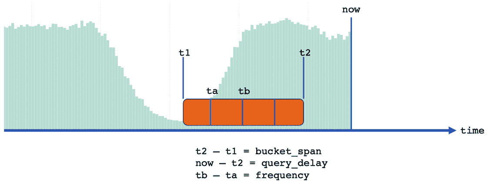

图 6.1 – 当前时间下桶跨度、查询延迟和频率的表示

在*图 6.1*中，我们看到一个特定的时间桶（由等于*t2-t1*的时间宽度表示），滞后于当前系统时间（`query_delay`）。在桶内，可能存在由`frequency`参数定义的时间细分。关于这个桶的结果如何写入结果索引（`.ml-anomalies-*`），我们应该记住，为这个桶编写的文档的`timestamp`值都将等于桶的前沿时间*t1*。

为了讨论一个实际例子，让我们想象以下情况：

+   `bucket_span` = 15 分钟

+   `frequency` = 15 分钟

+   `query_delay` = 2 分钟

如果`query_delay`）并且结果文档在不久之后写入`.ml-anomalies-*`（但带有 11:45 A.M.的时间戳）。因此，如果在 12:05 P.M.我们查看`.ml-anomalies-*`以查看 11:45 A.M.的结果是否存在，我们相当有信心它们会存在，并且我们可以检查内容。然而，如果**现在**只有 12:01 P.M.，那么对应于 11:45 A.M.-12:00 P.M.的桶的结果文档尚不存在，并且将在大约一分钟之后写入。我们可以看到，事情的时间安排非常重要。

如果在我们的示例场景中，我们将`frequency`的值降低到 7.5 分钟或 5 分钟，那么我们确实可以更早地访问桶的结果，但结果会被标记为**临时**，并且当桶最终确定时，结果可能会发生变化。

注意

如果频率是桶跨度的一个子倍数，则会在桶内创建临时结果，但并非所有检测器都生成临时结果。例如，如果你有一个`max`或`high_count`检测器，那么显示高于典型值的临时结果是有可能且合理的——你不需要看到整个桶的内容就能知道你已经超过了预期。然而，如果你有一个`mean`检测器，你确实需要在确定平均值之前看到整个桶的观测值——因此，不会生成临时结果，因为它们没有意义。

所以，说到这里，如果我们现在从*图 6.1*的图中稍微推进时间，但也画出这个桶之前和之后的桶，它看起来会像以下这样：

![图 6.2 – 连续桶的表示

![img/B17040_06_2.jpg]

图 6.2 – 连续桶的表示

在这里，*图 6.2*中，我们看到当前系统时间（再次，由`is_interim:true`标志表示，如*第五章**，解释结果*中首次展示）。

如果我们想要调用一个基本询问“自上次我查看以来是否有任何新的异常产生？”的警报搜索，并且我们调用该搜索的时间是在*图 6.2*中所示的时间**现在**，那么我们应该注意以下情况：

+   “回顾”的时间段应该是 `bucket_span` 宽度的两倍左右。这是因为这保证了我们将看到当前时间桶（此处为 **bucket t2**）可能发布的任何中间结果，以及前一个时间桶（此处为 **bucket t1**）的任何最终结果。来自 **bucket t0** 的结果将不会匹配，因为 **bucket t0** 的时间戳在查询的时间窗口之外——只要我们确保警报查询能够按照适当的计划重复执行（参见以下要点）。

+   运行此查询选择的时间可能几乎在任何时间桶 *t2* 的时间窗口内，并且这仍然会按描述的方式工作。这很重要，因为警报查询的运行计划可能与异常检测作业运行的计划（以及写入结果）不同步。

+   我们可能会将警报搜索的重复操作间隔安排在等于 `bucket_span` 的最大间隔内，但如果我们对捕捉当前尚未最终确定的时间桶中的中间异常感兴趣，它可能会更频繁地执行。

+   如果我们不希望考虑中间结果，我们需要修改查询，使得 `is_interim:false` 成为查询逻辑的一部分，以避免匹配它们。

考虑到所有这些条件，你可能会认为需要某种类型的黑暗魔法才能正确且可靠地实现这一点。幸运的是，当我们使用 Elastic ML UI 从 Kibana 构建警报时，这些考虑因素会为你处理。然而，如果你觉得自己是一位巫师并且完全理解这一切是如何工作的，那么你可能不会对使用 Watcher 构建非常定制的警报条件感到太害怕，在那里你将拥有完全的控制权。

在以下主要部分中，我们将使用每种方法进行一些示例，以便您可以比较和对比它们的工作方式。

# 从 ML UI 构建警报

随着 v7.12 版本的发布，Elastic ML 将其默认警报处理程序从 Watcher 更改为 Kibana 警报。在 v7.12 之前，如果用户从 ML UI 选择警报，可以选择接受默认的 **watch**（Watcher 脚本的一个实例），或者用户可以从头创建一个 watch。本节将重点介绍自 v7.12 以来使用 Kibana 警报的新工作流程，它提供了灵活性和易用性之间的良好平衡。

为了创建一个工作且具有说明性的实时警报示例，我们将使用 Kibana 样本网络日志数据集构建一个场景，这是我们首先在 *第三章**，异常检测* 中使用的。 

本节概述的过程如下：

1.  在样本数据上定义一些样本异常检测作业。

1.  在两个异常检测作业上定义两个警报。

1.  运行异常行为的模拟，以便在警报中捕捉这种行为。

让我们先定义一些样本异常检测作业。

## 定义样本异常检测作业

当然，在我们能够构建警报之前，我们需要实时运行的工作。我们可以利用与同一 Kibana 网络日志数据集一起提供的示例 ML 工作。

注意

如果你仍然在你的集群中加载了这个数据集，你应该删除它并重新添加。这将重置数据集的时间戳，使得大约一半的数据在过去，另一半在将来。有一些数据在未来将允许我们假装数据是实时出现的，因此我们的实时异常检测工作和针对这些工作的警报将表现得像是真正的实时。

要开始，让我们重新加载示例数据并构建一些示例工作：

1.  从 Kibana 首页，点击**尝试我们的示例数据**：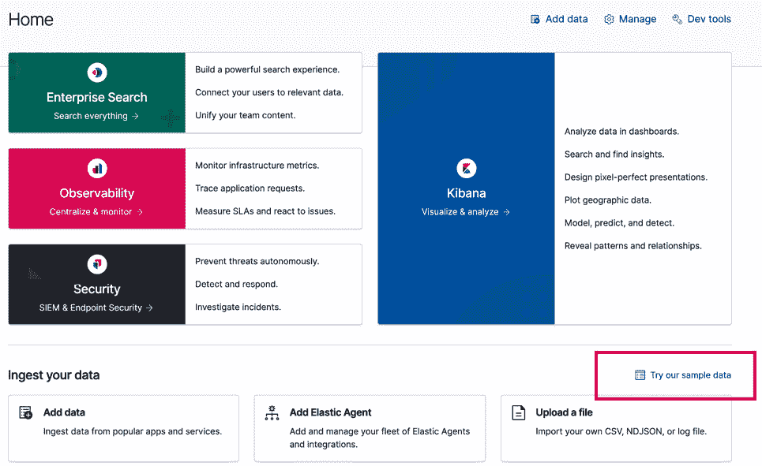

    图 6.3 – Kibana 首页

1.  在**示例网络日志**部分点击**索引模式**（如果已经加载，请删除并重新添加）：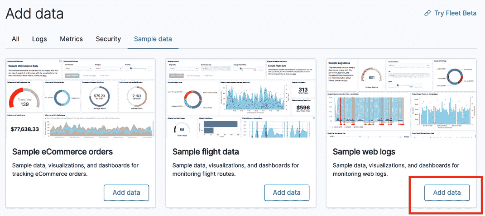

    图 6.4 – 添加示例网络日志数据

1.  在**查看数据**菜单下，选择**ML 工作**来创建一些示例工作：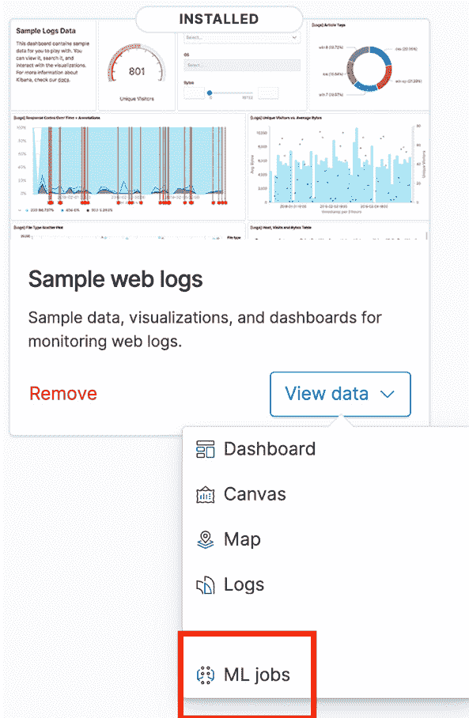

    图 6.5 – 选择创建一些示例 ML 工作

1.  给三个示例工作分配一个工作 ID 前缀（这里选择了`alert-demo-`），并确保你取消选择使用完整的`kibana_sample_data_logs`数据，并选择结束时间为你当前系统时间（在你所在的时区）最近的 15 分钟：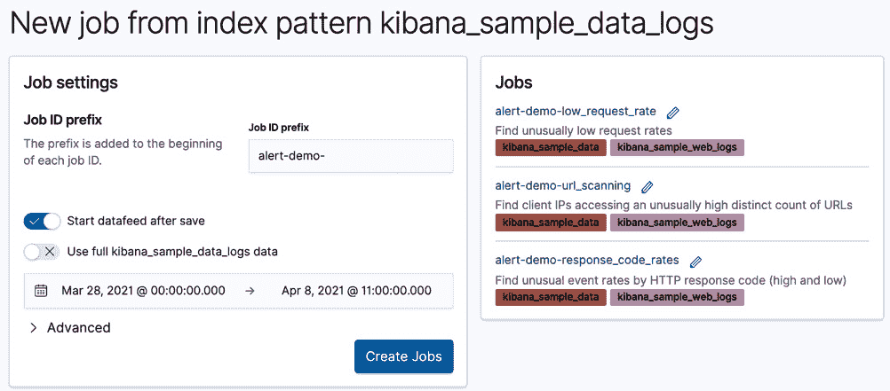

    图 6.6 – 使用前缀命名示例工作并选择当前时间作为结束时间

1.  注意在*图 6.6*中，**2021 年 4 月 8 日 11:00:00.00**被选为结束时间，而 11 天前的日期（**2021 年 3 月 28 日 00:00:00.00**）被选为开始时间（示例数据从你安装它的时候开始大约 11 天）。这个截图的时间是 4 月 8 日上午 11:10。这在尝试使这个示例数据看起来是实时数据的精神上很重要。点击**创建工作**按钮开始工作创建。一旦工作创建完成，你将看到以下屏幕：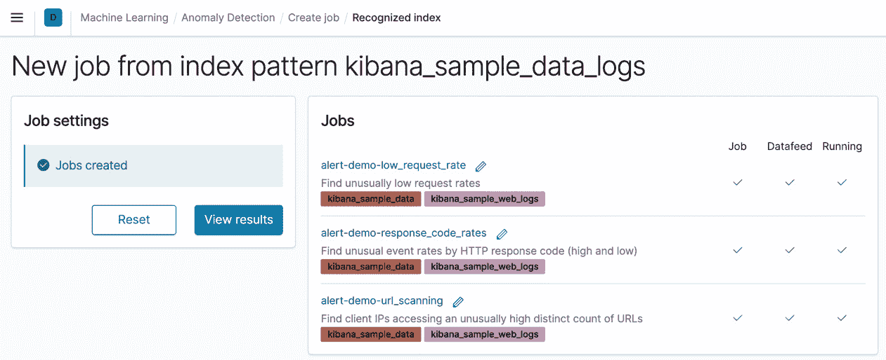

    图 6.7 – 示例工作完成初始运行

1.  我们现在还不需要查看结果。相反，我们需要确保这三个工作正在实时运行。让我们点击顶部的**异常检测**返回到**工作** **管理**页面。在那里我们可以看到我们的三个工作已经分析了一些数据，但现在处于关闭状态，数据源目前已停止：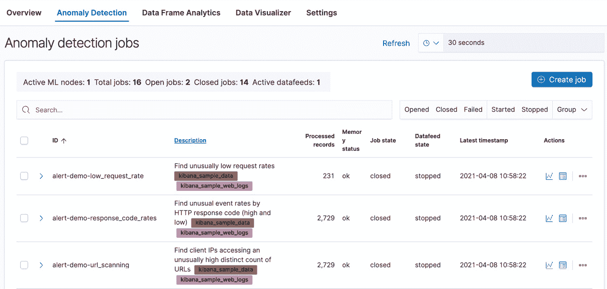

    图 6.8 – 工作管理屏幕中的示例工作

1.  现在我们需要启用这三个作业以实时运行。点击每个作业旁边的方框，然后选择齿轮图标以弹出菜单来为所有三个作业选择**启动数据流**：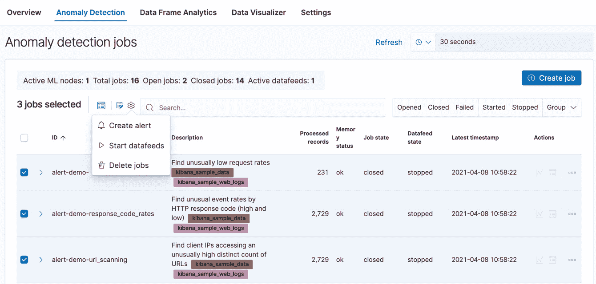

    图 6.9 – 启动所有三个示例作业的数据流

1.  在弹出窗口中，选择**搜索开始时间**和**搜索结束时间**的最高选项，确保作业将继续实时运行。现在，我们将保留**数据流启动后创建警报**未勾选，因为我们将在稍后创建自己的警报：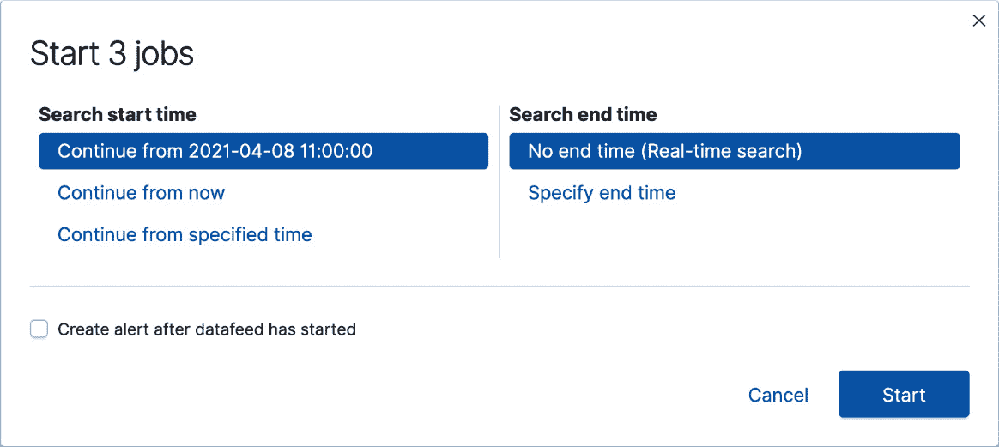

    图 6.10 – 启动三个示例作业的数据流以实时运行

1.  点击**启动**按钮后，我们会看到我们的三个作业现在处于打开/启动状态：

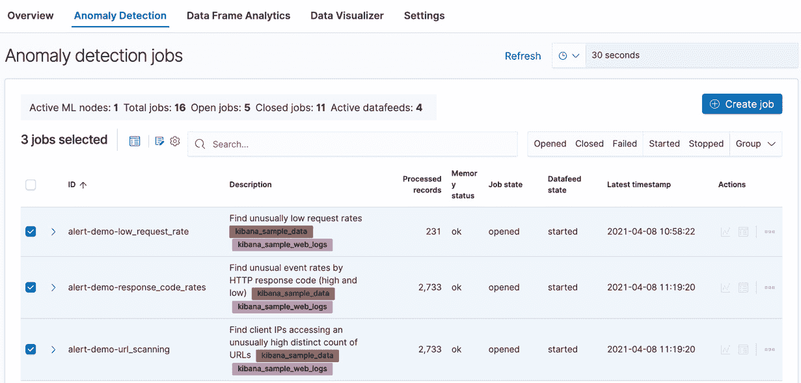

图 6.11 – 示例作业现在实时运行

现在我们已经让作业运行起来，接下来定义一些针对它们的警报。

## 对示例作业创建警报

我们的作业现在正在实时运行，我们可以为我们的作业定义一些警报：

1.  对于`alert-demo-response_code_rates`作业，点击**…**图标并选择**创建警报**：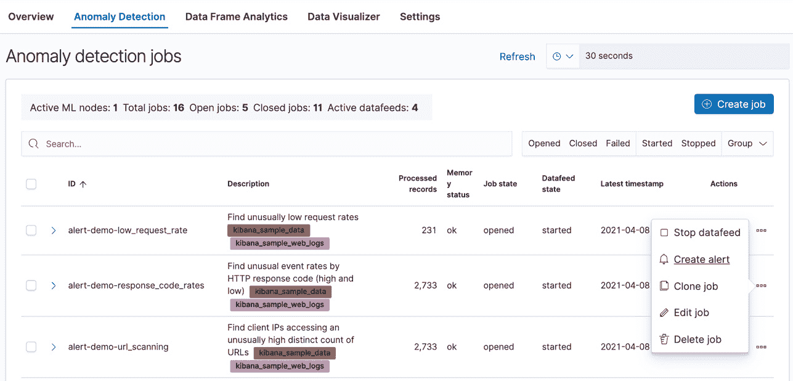

    图 6.12 – 为示例作业创建警报

1.  现在出现**创建警报**弹出窗口，我们可以开始填写我们想要的警报配置：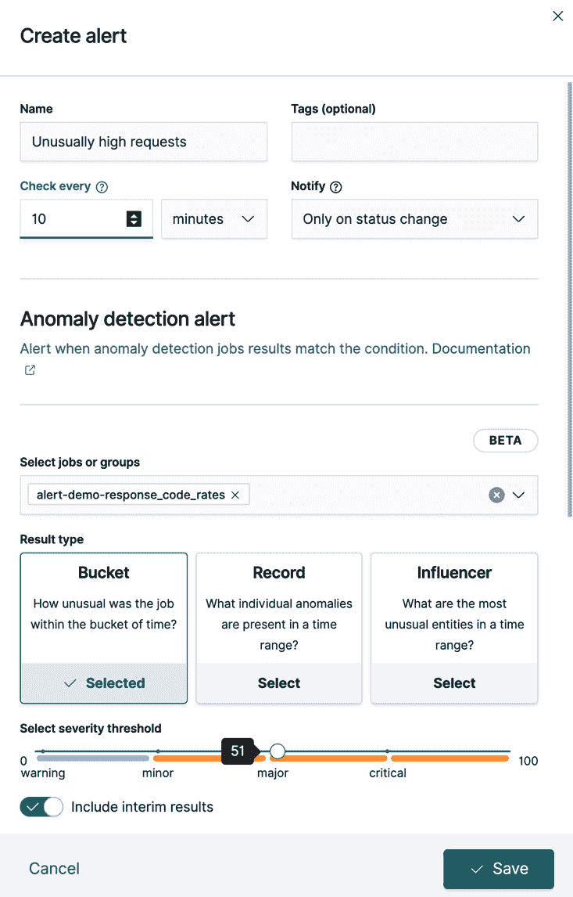

    图 6.13 – 创建警报配置

1.  在*图 6.13*中，我们将命名我们的警报，但也会定义我们希望这个警报每 10 分钟检查一次异常。这个作业的`bucket_span`设置为 1 小时，但频率设置为 10 分钟——因此中间结果将比完整桶时间更早可用。这也是我们选择在警报配置中包含中间结果的原因，这样我们就可以尽快收到通知。我们还设置了**结果类型**为**桶**类型，以便我们得到异常性的总结处理，如前所述。最后，我们将严重程度阈值设置为**51**，以便只有得分超过该值的异常才会生成警报。

1.  在我们继续之前，我们可以检查历史数据上的警报配置。将`30d`输入测试框中，我们可以看到在过去 30 天的数据中只有一个其他警报符合这个警报条件：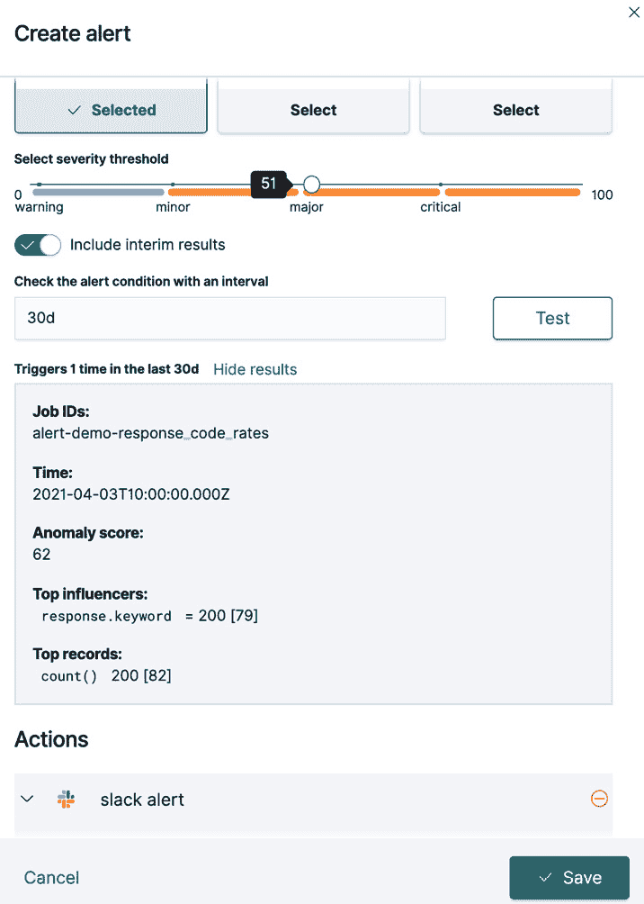

    图 6.14 – 在历史数据上测试警报配置

1.  最后，我们可以在警报触发时配置一个要调用的操作。在这种情况下，我们的系统预先配置为使用 Slack 作为警报操作，因此我们将选择它，但用户还有许多其他选项可供考虑（请参阅[`www.elastic.co/guide/en/kibana/current/action-types.html`](https://www.elastic.co/guide/en/kibana/current/action-types.html)以探索所有选项以及如何自定义警报消息）：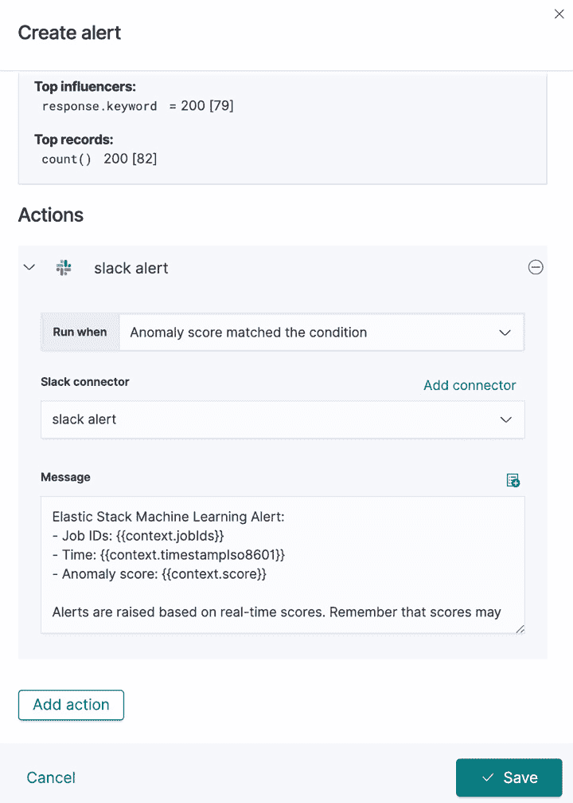

    图 6.15 – 配置警报操作

1.  点击**保存**按钮显然会保存警报，然后可以通过 Kibana 的**堆栈管理 | 警报和操作**区域查看和修改：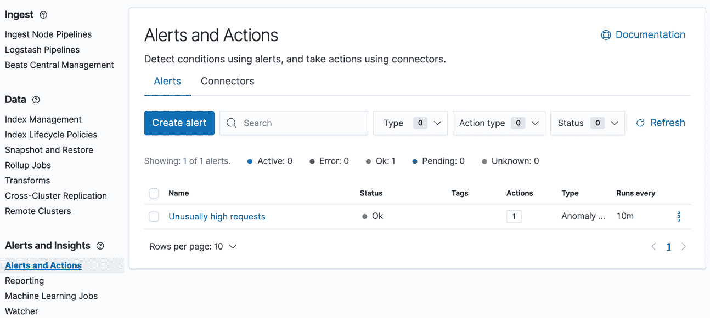

    图 6.16 – 警报管理

1.  我们将创建一个额外的警报，针对`alert-demo-url_scanning`作业。这次，我们将创建一个**记录**警报，但与其他配置参数类似先前的示例：

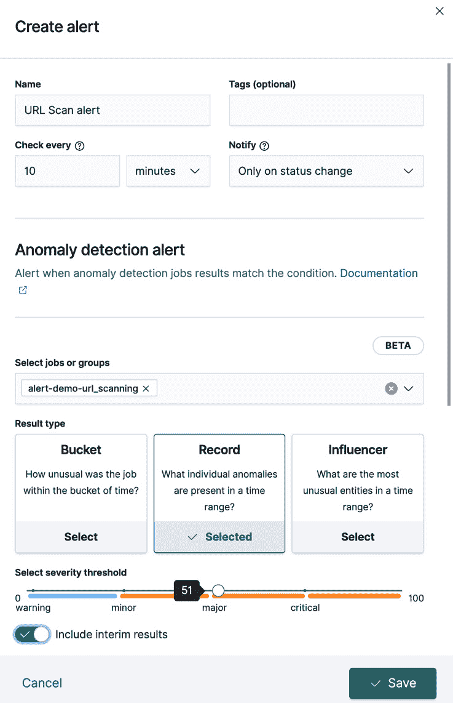

图 6.17 – 在 URL 扫描作业上配置另一个警报

现在我们已经配置了两个警报，让我们继续模拟一个实际实时异常情况来触发我们的警报。

## 模拟一些实时异常行为

在这些示例网络日志的上下文中触发模拟的异常行为有点棘手，但并不太难。这将涉及一些 Elasticsearch API 的使用，通过 Kibana 中的**开发工具控制台**执行几个命令。控制台是您可以发出 API 调用到 Elasticsearch 并查看这些 API 调用输出（响应）的地方。

注意

如果您不熟悉控制台，请参阅[`www.elastic.co/guide/en/kibana/current/console-kibana.html`](https://www.elastic.co/guide/en/kibana/current/console-kibana.html)。

我们将要模拟的是两方面的内容——我们将向异常检测工作正在监控的索引中注入几个假文档，然后等待警报触发。这些文档将显示来自虚构 IP 地址`0.0.0.0`的请求激增，这将导致响应代码为`404`，并且还会请求随机的 URL 路径。

让我们开始吧：

1.  我们需要确定您当前的 UTC 时间。我们必须知道 UTC 时间（而不是您本地时区的时间），因为存储在 Elasticsearch 索引中的文档是以 UTC 存储的。为了确定这一点，您可以使用在线工具（例如搜索“当前 UTC 时间”）。在撰写本文时，当前的 UTC 时间是 2021 年 4 月 8 日下午 4:41。转换成 Elasticsearch 期望的`kibana_sample_data_logs`索引的格式，这将呈现如下：

    ```py
      "timestamp": "2021-04-08T16:41:00.000Z"
    ```

1.  现在，让我们在当前时间（可能加上一点缓冲 – 在这种情况下，向上取整到下一个半小时，即 17:00）将一些新的虚假文档插入到`kibana_sample_data_logs`索引中。相应地替换`timestamp`字段值，并在 Dev Tools 控制台中至少调用以下命令 20 次来插入：

    ```py
       POST kibana_sample_data_logs/_doc
       {
         "timestamp": "2021-04-08T17:00:00.000Z",
         "event.dataset" : "sample_web_logs",
         "clientip": "0.0.0.0",
         "response" : "404",
         "url": ""
       }
    ```

1.  我们可以通过动态修改我们刚刚插入的文档（特别是`url`字段）来模拟所有 URL 都是唯一的，通过使用一个小脚本在`_update_by_query` API 调用中随机化字段值：

    ```py
       POST kibana_sample_data_logs/_update_by_query
       {
         "query": {
           "term": {
             "clientip": {
               "value": "0.0.0.0"
             }
           }
         },
         "script": {
           "lang": "painless",
           "source": "ctx._source.url = '/path/to/'+ UUID.randomUUID().toString();"
         }
       }
    ```

1.  我们可以通过查看 Kibana Discover 中的适当时间来验证我们是否正确地从一个虚假 IP 地址创建了一大批独特、随机的请求：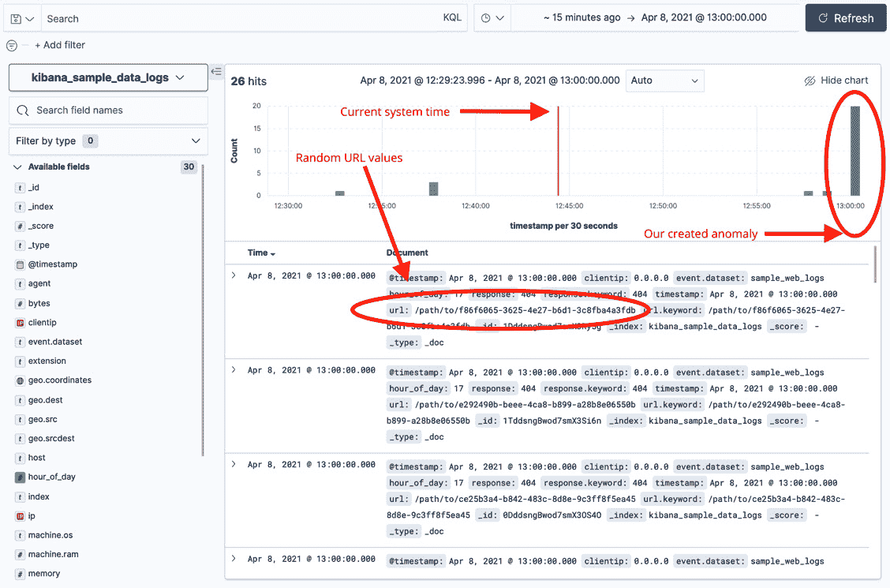

    图 6.18 – 在 Discover 中显示的我们人为制造的异常事件爆发

1.  注意在*图 6.18*中，我们不得不稍微看看未来，以看到我们人为插入的文档（如时间轴上 12:45 附近的红色垂直线是当地时间区的实际当前系统时间）。同时注意，我们插入的文档有一个看起来很不错的随机`url`字段。现在我们已经为异常检测设置了“陷阱”以供寻找，并且我们的警报已经准备好了，我们必须现在坐下来耐心等待警报触发。

## 接收和审查警报

由于我们插入的异常行为现在正在等待我们的异常检测工作和警报来发现，我们可以思考我们应该什么时候期望看到那个警报。我们应该认识到，鉴于我们的工作桶跨度为 1 小时，频率为 10 分钟，查询延迟约为 1-2 分钟（并且我们的警报确实会寻找中间结果 – 以及我们的警报是以 10 分钟的频率运行的，这与异常检测工作不同步），我们应该期望在当地时间下午 1:12 到 1:20 之间看到我们的警报。

准时地，两个工作的警报消息在当地时间下午 1:16 和 1:18 出现在 Slack 上：

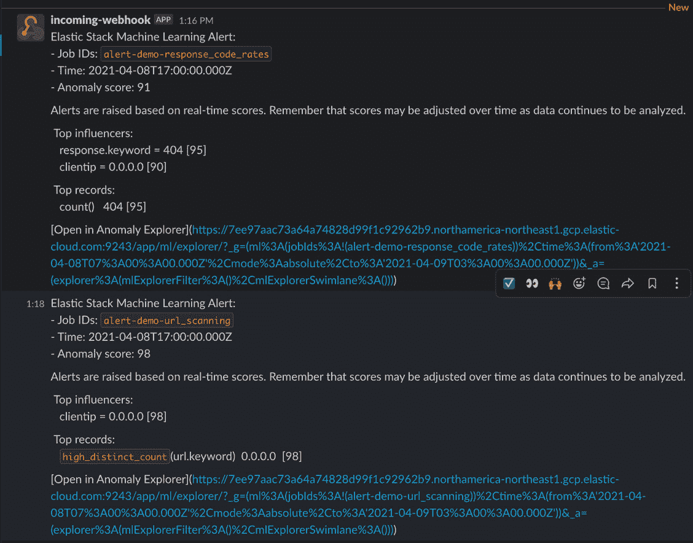

图 6.19 – 在 Slack 客户端收到的警报

在*图 6.19*中，最上面的警报当然是为那个正在计算每个`response.keyword`的事件数量的异常检测工作（因此看到 404 文档的峰值超过了预期），下面的警报是为另一个注意到请求的独特 URL 的高区分计数的其他工作。注意，两个工作都正确地将`clientip = 0.0.0.0`识别为影响异常的因素。警报文本中包含了跟随链接直接查看**异常** **探索器**中信息的功能。在*图 6.20*中，我们可以看到，通过跟随第二个警报中的链接，我们到达了一个可以进一步调查异常的熟悉地方：

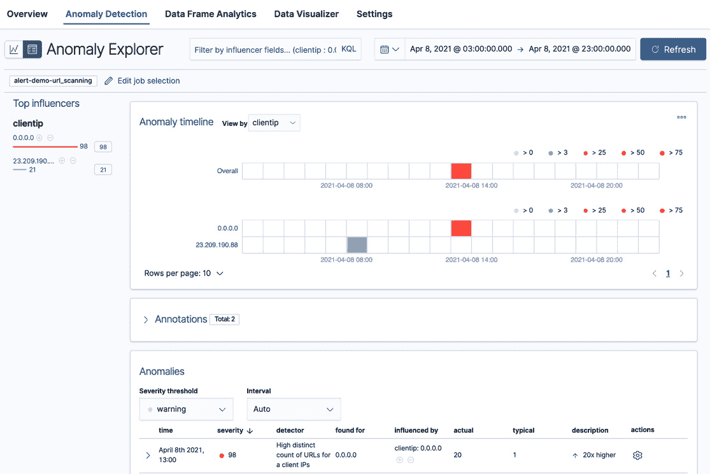

图 6.20 – 来自警报钻取链接的异常探索器

希望通过这个示例，你不仅能看到如何使用 Kibana 警报框架在异常检测作业上使用警报，现在也能欣赏到作业和警报实时操作的复杂性。作业数据源和警报采样间隔的设置确实会影响警报的实时性。例如，我们可以减少数据源的`频率`和警报的**检查间隔**设置，以节省几分钟。

在下一节中，我们不会尝试使用 Watcher 复制实时警报检测，但我们将努力理解监控中的等效设置以完成我们需要的工作，将 Watcher 与异常检测作业接口，并展示一些有趣的示例监控。

# 使用监控创建警报

在版本 7.12 之前，Watcher 被用作 Elastic ML 发现异常的警报机制。**Watcher**是一个非常灵活的 Elasticsearch 原生插件，可以处理许多自动化任务，警报当然也是其中之一。在版本 7.11 及更早版本中，用户可以从头创建自己的**监控**（Watcher 中的自动化任务实例）以警报异常检测作业结果，或者选择使用 Elastic ML UI 为他们创建的默认监控模板。我们首先将查看提供的默认监控，然后讨论一些关于自定义监控的想法。

## 理解遗留默认机器学习监控的结构

现在异常检测作业的警报处理由新的 Kibana 警报框架处理，因此遗留的监控默认模板（以及一些其他示例）被保存在此 GitHub 仓库中：[`github.com/elastic/examples/tree/master/Alerting/Sample%20Watches/ml_examples`](https://github.com/elastic/examples/tree/master/Alerting/Sample%20Watches/ml_examples)。

在分析默认机器学习监控（`default_ml_watch.json`）及其伴随版本（具有电子邮件操作`default_ml_watch_email.json`），我们看到有四个主要部分：

+   **触发器**：定义监控的调度

+   **输入**：指定要评估的输入数据

+   执行`操作`部分

+   **操作**：列出当监控条件满足时希望执行的操作

    注意

    有关 Watcher 所有选项的完整说明，请参阅 Elastic 文档：[`www.elastic.co/guide/en/elasticsearch/reference/current/how-watcher-works.html`](https://www.elastic.co/guide/en/elasticsearch/reference/current/how-watcher-works.html)。

让我们深入讨论每个部分。

### 触发器部分

在默认的机器学习监控中，`触发器`部分定义如下：

```py
    "trigger": {
      "schedule": {
        "interval": "82s"
      }
    },
```

这里，我们可以看到实时触发 watch 的间隔是每 82 秒。这通常应该是一个介于 60 到 120 秒之间的随机值，这样如果节点重启，所有的 watch 都不会同步，它们将会有更均匀的执行时间，以减少对集群的潜在负载。同样重要的是，这个间隔值应该小于或等于工作的 bucket 跨度。正如本章前面所解释的，如果这个值大于 bucket 跨度，可能会导致最近写入的异常记录被 watch 错过。当间隔小于（甚至远小于）工作的 bucket 跨度时，你也可以利用当有中间结果时提供的先进通知，即使没有看到 bucket 跨度内的所有数据，也可以确定异常。

### 输入部分

`input`部分从`search`部分开始，其中定义了以下`query`针对`.ml-anomalies-*`索引模式：

```py
            "query": {
              "bool": {
                "filter": [
                  {
                    "term": {
                      "job_id": "<job_id>"
                    }
                  },
                  {
                    "range": {
                      "timestamp": {
                        "gte": "now-30m"
                      }
                    }
                  },
                  {
                    "terms": {
                      "result_type": [
                        "bucket",
                        "record",
                        "influencer"
                      ]
                    }
                  }
                ]
              }
            },
```

在这里，我们要求 Watcher 查询过去 30 分钟内一个工作（你将用感兴趣的异常检测工作的实际`job_id`替换`<job_id>`）的`bucket`、`record`和`influencer`结果文档。正如我们在本章前面的内容中了解到的，这个回溯窗口应该是 ML 工作`bucket_span`值的两倍（这个模板必须假设工作的 bucket 跨度是 15 分钟）。虽然要求了所有结果类型，但稍后我们会看到，只有 bucket 级别的结果用于评估是否创建警报。

接下来是一系列三个聚合。当它们折叠时，看起来如下：

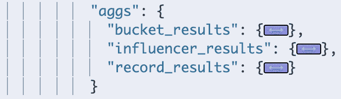

图 6.21 – watch 输入中的查询聚合

`bucket_results`聚合首先筛选出异常分数大于或等于 75 的 bucket：

```py
             "aggs": {
               "bucket_results": {
                 "filter": {
                   "range": {
                     "anomaly_score": {
                       "gte": 75
                      }
                  }
               },
```

然后，一个子聚合要求按`anomaly_score`排序的前 1 个 bucket：

```py
                "aggs": {
                  "top_bucket_hits": {
                    "top_hits": {
                      "sort": [
                        {
                          "anomaly_score": {
                            "order": "desc"
                          }
                        }
                      ],
                      "_source": {
                        "includes": [
                          "job_id",
                          "result_type",
                          "timestamp",
                          "anomaly_score",
                          "is_interim"
                        ]
                      },
                      "size": 1,

```

然后，仍然在`top_bucket_hits`子聚合中，有一系列定义的`script_fields`：

```py
                      "script_fields": {
                        "start": {
                          "script": {
                            "lang": "painless",
                            "source": "LocalDateTime.ofEpochSecond((doc[\"timestamp\"].value.getMillis()-((doc[\"bucket_span\"].value * 1000)\n * params.padding)) / 1000, 0, ZoneOffset.UTC).toString()+\":00.000Z\"",
                            "params": {
                              "padding": 10
                            }
                          }
                        },
                        "end": {
                          "script": {
                            "lang": "painless",
                            "source": "LocalDateTime.ofEpochSecond((doc[\"timestamp\"].value.getMillis()+((doc[\"bucket_span\"].value * 1000)\n * params.padding)) / 1000, 0, ZoneOffset.UTC).toString()+\":00.000Z\"",
                            "params": {
                              "padding": 10
                            }
                          }
                        },
                        "timestamp_epoch": {
                          "script": {
                            "lang": "painless",
                            "source": """doc["timestamp"].value.getMillis()/1000"""
                          }
                        },
                        "timestamp_iso8601": {
                          "script": {
                            "lang": "painless",
                            "source": """doc["timestamp"].value"""
                          }
                        },
                        "score": {
                          "script": {
                            "lang": "painless",
                            "source": """Math.round(doc["anomaly_score"].value)"""
                          }
                        }
                      }
```

这些新定义的变量将被 watch 用于提供更多功能和上下文。其中一些变量仅仅是重新格式化值（`score`只是`anomaly_score`的一个四舍五入版本），而`start`和`end`将后来通过定义一个等于异常 bucket 时间+/- 10 个 bucket 跨度的开始和结束时间来发挥功能作用。这后来被 UI 用于在异常 bucket 之前和之后显示适当的时间范围，以便用户可以更清楚地看到事物。

`influencer_results`和`record_results`聚合要求前三个影响者分数和记录分数，但只有`record_results`聚合的输出用于 watch 的后续部分（并且仅在`default_ml_watch_email.json`的`action`部分中，其中包含一些默认电子邮件文本）。

### 条件部分

`condition`部分是评估`input`以确定是否执行`action`部分的地方。在这种情况下，`condition`部分如下：

```py
    "condition": {
      "compare": {
        "ctx.payload.aggregations.bucket_results.doc_count": {
          "gt": 0
        }
      }
    },
```

我们使用这个来检查`bucket_results`聚合是否返回了任何文档（其中`doc_count`大于 0）。换句话说，如果`bucket_results`聚合确实返回了非零结果，那么这表明确实存在`anomaly_score`大于 75 的文档。如果是这样，那么将调用`action`部分。

### `action`部分

我们默认监视的`action`部分在我们的案例中有两个部分：一个用于将信息记录到文件的`log`动作和一个用于发送电子邮件的`send_email`动作。为了简洁，这里不会重复监视的文本（它有很多文本）。`log`动作将消息打印到输出文件，默认情况下是 Elasticsearch 日志文件。请注意，消息的语法使用的是名为**Mustache**的模板语言（因其大量使用花括号而得名）。简单来说，Mustache 的双花括号中的变量将被它们的实际值替换。因此，对于我们在本章前面创建的一个示例作业，写入文件的日志文本可能如下所示：

```py
Alert for job [alert-demo-response_code_rates] at [2021-04-08T17:00:00.000Z] score [91] 
```

这个警报应该看起来很熟悉，就像我们在本章前面的 Slack 消息中看到的那样——当然，因为它是从相同的信息中派生出来的。动作的电子邮件版本可能如下所示：

```py
Elastic Stack Machine Learning Alert
    Job: alert-demo-response_code_rates
    Time: 2021-04-08T17:00:00.000Z
    Anomaly score: 91
    Click here to open in Anomaly Explorer.
    Top records:
    count() [91]
```

很明显，警报 HTML 格式的格式并不是围绕为用户提供信息摘要，而是通过在电子邮件中点击链接来诱使用户进一步调查。

此外，值得注意的是，前三条记录在电子邮件响应的文本中报告。在我们的例子中，只有一个记录（一个得分为 91 的`count`检测器）。这部分信息来自我们在监视的`input`部分之前描述的`record_results`聚合。

这个默认监视是一个很好的、可用的警报，它提供了关于数据集随时间异常性的总结信息，但了解使用它的含义也很重要：

+   触发警报的主要条件是桶异常分数超过某个值。因此，在桶内个别异常记录的分数没有将整体桶分数提升到所声明的阈值的情况下，不会对它们发出警报。

+   默认情况下，输出中只报告桶中前三条记录的最高分数，并且仅在电子邮件版本中。

+   这些例子中唯一的动作是记录和电子邮件。添加其他动作（Slack 消息、webhook 等）需要手动编辑监视。

了解这些信息后，在某个时候可能需要创建一个功能更全面、更复杂的手表，以完全自定义手表的行为和输出。在下一节中，我们将讨论一些从头开始创建手表的更多示例。

## 定制手表可以提供一些独特的功能

对于那些感到自信并想深入了解 Watcher 的一些高级功能的人来说，让我们看看 GitHub 仓库中其他一些样本的一些亮点。这些包括同时查询多个作业的结果的示例、程序化组合异常分数，以及动态收集与时间相关联的其他异常的潜在根本原因证据。

### 连接输入和脚本条件

一个有趣的定制手表示例是`multiple_jobs_watch.json`，它展示了进行连接输入（对多个作业的结果进行多次查询）的能力，但同时也使用脚本执行更动态的条件：

```py
  "condition" : {
    "script" : {
// return true only if the combined weighted scores are greater than 75
      "source" : "return ((ctx.payload.job1.aggregations.max_anomaly_score.value * 0.5) + (ctx.payload.job2.aggregations.max_anomaly_score.value * 0.2) + (ctx.payload.job3.aggregations.max_anomaly_score.value * 0.1)) > 75"
    }
  },
```

这基本上意味着只有当三个不同作业的加权异常分数总和大于 75 的值时，警报才会被触发。换句话说，并不是每个作业都被视为同等重要，并且权重考虑了这一点。

### 在连接输入之间传递信息

连接输入的另一个独特之处在于，从一条输入链中获得的信息可以被传递到另一条。如`chained_watch.json`所示，第二条和第三条输入链使用从第一次查询中学习的`timestamp`值作为`range`过滤器的一部分：

```py
{ "range": { "timestamp": {"gte": "{{ctx.payload.job1.hits.hits.0._source.timestamp}}||-{{ctx.metadata.lookback_window}}", "lte": "{{ctx.payload.job1.hits.hits.0._source.timestamp}}"}}},
```

这实际上意味着该手表正在收集作为证据的异常，这些异常是从第一个作业中一个可能的重要异常之前的时间窗口中提取的。这种警报与我们在*第七章**，AIOps 和根本原因分析*中将要讨论的情况非常吻合，其中通过在 KPI 异常周围的时间窗口中寻找相关异常来解决一个真实的应用程序问题。因此，这个手表的样本输出可能看起来像这样：

```py
[CRITICAL] Anomaly Alert for job it_ops_kpi: score=85.4309 at 2021-02-08 15:15:00 UTC
Possibly influenced by these other anomalous metrics (within the prior 10 minutes):
job:it_ops_network: (anomalies with at least a record score of 10):
field=In_Octets: score=11.217614808972602, value=13610.62255859375 (typical=855553.8944717721) at 2021-02-08 15:15:00 UTC
field=Out_Octets: score=17.00518, value=1.9079535783333334E8 (typical=1116062.402864764) at 2021-02-08 15:15:00 UTC
field=Out_Discards: score=72.99199, value=137.04444376627606 (typical=0.012289061361553099) at 2021-02-08 15:15:00 UTC
job:it_ops_sql: (anomalies with at least a record score of 5):
hostname=dbserver.acme.com field=SQLServer_Buffer_Manager_Page_life_expectancy: score=6.023424, value=846.0000000000005 (typical=12.609336298838242) at 2021-02-08 15:10:00 UTC
hostname=dbserver.acme.com field=SQLServer_Buffer_Manager_Buffer_cache_hit_ratio: score=8.337633, value=96.93249340057375 (typical=98.93088463835487) at 2021-02-08 15:10:00 UTC
hostname=dbserver.acme.com field=SQLServer_General_Statistics_User_Connections: score=27.97728, value=168.15000000000006 (typical=196.1486370757187) at 2021-02-08 15:10:00 UTC
```

在这里，管理来自每个三个有效载荷的结果的输出格式化的是一个强大的**transform**脚本，该脚本利用类似 Java 的**Painless**脚本语言。

注意

如需了解更多关于 Painless 脚本语言的信息，请参阅 Elastic 文档，网址为[`www.elastic.co/guide/en/elasticsearch/reference/current/modules-scripting-painless.html`](https://www.elastic.co/guide/en/elasticsearch/reference/current/modules-scripting-painless.html)。

如果你不会被 Watcher 代码密集的格式吓倒，你可以将其用作一个非常强大的工具来实施一些非常有趣和有用的警报方案。

# 摘要

异常检测作业本身当然很有用，但与近乎实时的警报结合使用时，用户可以真正利用自动化分析的力量——同时也可以对只收到有意义的警报感到自信。

在对如何通过实时警报有效捕捉异常检测工作结果进行实际研究之后，我们通过一个全面的示例展示了如何使用新的 Kibana 警报框架轻松定义一些直观的警报，并在一个现实警报场景中测试了它们。然后，我们见证了如果 Kibana 警报无法满足复杂的警报需求，专家用户如何利用 Watcher 的全部功能来实现高级警报技术。

在下一章中，我们将看到异常检测工作如何不仅能够帮助警报重要的关键性能指标，而且还将展示 Elastic ML 在特定应用场景中对大量数据的自动分析是如何实现追踪应用问题并确定其根本原因的“AI”手段。
