# 第七章：AIOps 和根本原因分析

到目前为止，我们已经广泛解释了分别检测指标和日志中异常的价值。这当然非常有价值。然而，在某些情况下，关于特定指标或日志文件出现问题的知识可能并不能完全说明正在发生的事情。例如，它可能只是指向问题的症状而不是原因。为了更好地理解一个新兴问题的全貌，通常需要从系统或情况的多个方面进行整体分析。这涉及到智能地分析多种相关数据集。

在本章中，我们将涵盖以下主题：

+   揭秘“AIOps”术语

+   理解 KPI 的重要性及其局限性

+   超越 KPI

+   为更好的分析组织数据

+   利用上下文信息

+   将所有内容整合进行根本原因分析（RCA）

# 技术要求

本章中展示的信息和示例适用于 Elastic Stack 的 v7.11 版本，并使用 GitHub 仓库中的示例数据集，该仓库位于[`github.com/PacktPublishing/Machine-Learning-with-Elastic-Stack-Second-Edition`](https://github.com/PacktPublishing/Machine-Learning-with-Elastic-Stack-Second-Edition)。

# 揭秘“AIOps”术语

我们在*第一章*，*IT 机器学习*中了解到，许多公司在被要求“用更少的资源做更多的事情”（更少的人，更少的成本等）的同时，正陷入不断增长的 IT 数据洪流中。其中一些数据被收集和/或存储在专用工具中，但一些可能被收集在通用数据平台中，如 Elastic Stack。但问题仍然存在：有多少比例的数据被关注？通过这种方式，我们指的是被人类积极检查或通过某种类型的自动化手段（基于规则、阈值等）监视的数据收集比例。即使是非常宽泛的估计，这个比例也可能只有个位数。因此，90%或更多的收集数据未被关注，我们错过了什么？正确的答案可能就是我们实际上并不了解。

在我们谴责 IT 组织收集大量数据却不去关注它们的罪过之前，我们需要了解与此类操作相关的挑战的规模。一个典型的面向用户的应用程序可能执行以下操作：

+   涵盖数百个物理服务器

+   拥有数十（如果不是数百）个微服务，每个微服务可能有数十或数百个操作指标或日志条目来描述其操作

这种组合的数学组合可以轻松达到六位数或七位数的独特测量点。此外，在 IT 组织的管理之下，可能有数十个甚至数百个这样的应用。因此，这些系统每天收集的数据量很容易以太字节来衡量。

因此，所期望的解决方案很自然地可能涉及自动化和人工智能的结合，以减轻对人类分析师的负担。某个聪明的市场营销人员想到了创造“AIops”这个术语，它封装了对问题的预期解决方案——通过一定程度的智能自动化来增强人类无法（或没有时间或能力手动完成）的事情。现在，AIops 解决方案实际上如何实现这一目标，通常留给有洞察力的用户去解释。

因此，让我们通过不关注术语本身（让我们把那留给市场营销人员）来消除这个术语的神秘感，而是明确我们希望这种智能技术为我们的情况做些什么：

+   自动检查数据并基于自动学习的一组约束、规则和行为，评估其相关性、重要性和显著程度。

+   过滤掉无关行为的噪音，以免分散人类分析师对真正重要的事情的注意力。

+   获得有关可能正在酝酿但尚未导致停机的问题的某些主动早期预警。

+   自动收集围绕问题的相关/相关证据，以协助进行**根本原因分析**（**RCA**）。

+   揭示运营中的低效率，以最大化基础设施性能。

+   基于以往修复措施及其有效性，建议一个行动或下一步的修复步骤。

虽然这个列表远非详尽无遗，但我们已经看到了我们在这里想要表达的核心——那就是智能自动化和分析可以带来巨大的回报，并允许 IT 部门推动效率，从而最大化业务成果。

除了前面列表中第六点提到的建议修复措施（至少在目前这个阶段），Elastic **机器学习**（**ML**）可以非常重要的是实现本列表上所有其他目标的一部分。我们已经看到 Elastic ML 如何自动发现异常行为、预测趋势、主动警报等等。但我们也必须认识到 Elastic ML 是一个通用的 ML 平台——它并非专门为 IT 运营/可观察性或安全分析而构建。因此，仍然需要确定 Elastic ML 在运营环境中的使用方向，这一点将在本章中讨论。

还需要注意的是，仍有大量 IT 运维团队目前没有使用智能自动化和分析。他们经常声称他们希望采用基于 AI 的方法来改善当前状况，但他们还没有准备好采取行动。因此，让我们挑战这种观念，即从 AI 中获益的唯一方式是在第一天就做所有可能的事情。相反，让我们在 IT 运维的背景下构建一些 Elastic ML 的实际应用，以及它如何能够满足前面列出的大多数目标。

我们首先从**关键** **绩效** **指标**（**KPI**）的概念开始，并解释为什么它是开始使用 Elastic ML 的合理选择。

# 理解 KPI 的重要性和局限性

由于规模问题和使收集的数据具有行动力的愿望，自然地，在主动检查中首先解决的指标是那些最能指示性能或操作的指标。IT 组织选择的用于测量、跟踪和标记的 KPI 可以跨越各种指标，包括以下内容：

+   **客户体验**：这些指标衡量客户体验，例如应用程序响应时间或错误率。

+   **可用性**：如正常运行时间或**平均** **修复** **时间**（**MTTR**）等指标通常需要跟踪。

+   **业务**：在这里，我们可能有直接衡量业务绩效的指标，例如每分钟的订单数或活跃用户数。

因此，这类指标通常在大多数高级操作仪表板上或从技术人员到高管的各种员工的工作报告中，以最显眼的位置展示。在谷歌图片搜索中输入“KPI 仪表板”将返回无数图表、仪表、旋钮、地图和其他视觉吸引物的示例。

虽然这种信息展示有很大的价值，只需一眼就能消费，但手动检查仍然存在基本挑战：

+   **解释**：除非人类已经本能地理解了这种差异，否则在理解正常操作和异常操作之间的差异可能会有困难。

+   **规模挑战**：尽管 KPI 已经是将所有指标浓缩成一组重要指标的过程，但可能仍有比在仪表板显示的屏幕空间内可行更多的 KPI 需要展示。最终结果可能是拥挤的视觉展示或需要滚动/分页的冗长仪表板。

+   **缺乏主动性**：许多像这样的仪表板没有将它们的指标与警报联系起来，因此如果主动知道一个表现不佳的 KPI 很重要，就需要持续的监督。

+   重要的是，KPIs 是识别和跟踪 IT 系统健康和行为有意义指标过程中的一个极其重要的步骤。然而，很明显，仅仅通过视觉范式识别和跟踪一组 KPIs，将会在成功的 IT 运维计划策略中留下一些重大的缺陷。

显然，KPIs 是 Elastic ML 的异常检测可以跟踪的度量标准的好候选者。例如，假设我们有一些看起来如下所示的数据（来自 GitHub 仓库中的`it_ops_kpi`样本数据集）：

```py
      {
        ''_index'' : ''it_ops_kpi'',
        ''_type'' : ''_doc'',
        ''_id'' : ''UqUsMngBFOh8A28xK-E3'',
        ''_score'' : 1.0,
        ''_source'' : {
          ''@timestamp'' : ''2021-01-29T05:36:09.000Z'',
          ''events_per_min'' : 28,
          ''kpi_indicator'' : ''online_purchases''
        }
      },
```

在这个例子中，关键绩效指标（称为`events_per_min`的字段）代表某些在线交易处理系统每分钟购买的汇总总数。我们可以通过在`events_per_min`字段上使用`sum`函数以及 15 分钟的桶跨度，轻松地随时间跟踪这个 KPI。检测到在线销售额（降至`921`）的意外下降，并将其标记为异常：

![Figure 7.1 – 使用典型异常检测作业分析的关键绩效指标

![img/B17040_07_1.jpg]

图 7.1 – 使用典型异常检测作业分析的关键绩效指标

在这个例子中，KPI 只是一个单一的、总体的指标。如果数据中存在另一个可以对其进行分割的类别字段（例如，按产品 ID、产品类别、地理区域等销售的销售额），那么机器学习可以轻松地沿着该字段分割分析，以并行方式扩展分析（如我们在*第三章*，*异常检测*）中看到的那样）。但让我们不要忽视我们在这里所取得的成果：对某人可能关心的关键指标的主动分析。单位时间内的在线销售额直接与收入相关，因此是一个明显的 KPI。

然而，尽管了解我们的 KPI 出现异常情况的重要性，但我们仍然没有关于*为什么*它发生的原因。是否支持该面向客户的应用的某个后端系统存在操作问题？是否在最新版本中存在用户界面编码错误，使得用户完成交易更困难？是否依赖于第三方支付处理提供商存在问题？仅通过审查 KPI 无法回答这些问题。

要获得这种洞察力，我们需要扩大我们的分析范围，包括其他相关和相关的信息集。

# 超越关键绩效指标（KPIs）

通常，选择 KPI 的过程应该是相对简单的，因为很可能很明显哪些指标是最好的指标（如果在线销售额下降，那么应用程序可能没有正常工作）。但如果我们想更全面地了解可能对运营问题有贡献的因素，我们必须将我们的分析扩展到支持应用程序的底层系统和技术的指标之外。

幸运的是，有大量的方法可以收集各种数据并将其集中到 Elastic Stack 中。例如，**Elastic Agent**是一个单一的、统一的代理，您可以将其部署到主机或容器中，以收集数据并将其发送到 Elastic Stack。在幕后，Elastic Agent 运行所需的 Beats shippers 或 Elastic Endpoint。从版本 7.11 开始，Elastic Agent 在 Kibana 的**Fleet**用户界面中进行管理，并可用于添加和管理流行服务和平台的集成：  

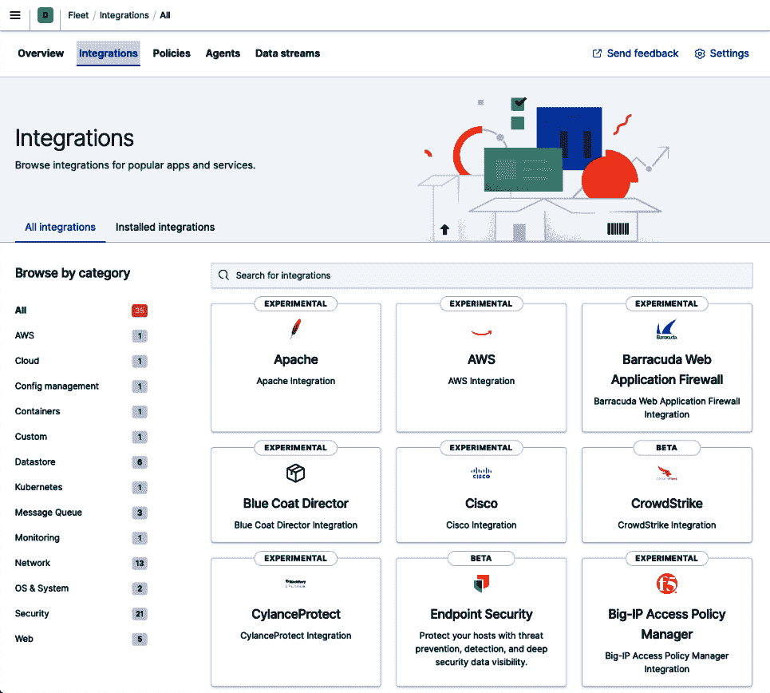

图 7.2 – Kibana 中 Fleet 用户界面的集成部分

使用这些不同的集成，用户可以轻松收集数据并将其集中到 Elastic Stack 中。虽然本章的目的不是介绍 Fleet 和 Elastic Agent，但重要的是，无论您使用什么工具来收集底层应用程序和系统数据，有一点很可能是真的：最终会有大量的数据。记住，我们的最终目标是主动和全面地关注更大比例的整体数据集。为了做到这一点，我们必须首先组织这些数据，以便我们可以使用 Elastic ML 有效地分析它。

# 组织数据以进行更好的分析

通过 Elastic Agent 摄取数据的一个非常好的特点是默认情况下，收集的数据使用**Elastic Common Schema**（**ECS**）进行标准化。ECS 是一个开源规范，它定义了存储在 Elastic Stack 中的数据的一个通用分类法和命名约定。因此，数据变得更容易管理、分析、可视化和跨不同数据类型（包括性能指标和日志文件）进行关联。

即使您没有使用 Elastic Agent 或其他遗留的 Elastic 摄取工具（如 Beats 和 Logstash），而是依赖其他第三方数据收集或摄取管道，仍然建议您将数据符合 ECS，因为当用户期望使用这些数据进行查询、仪表板和当然，机器学习作业时，这将带来巨大的回报。

注意

在网站的参考部分可以找到有关 ECS 的更多信息，请参阅[`www.elastic.co/guide/en/ecs/current/ecs-reference.html`](https://www.elastic.co/guide/en/ecs/current/ecs-reference.html)。

在 ECS 中的许多重要字段中，`host.name`字段定义了数据是从哪个宿主机收集的。默认情况下，Elastic Stack 中的大多数数据收集策略都涉及将数据放入以数据类型为中心的索引中，因此可能包含来自许多不同宿主机的交错文档。也许我们环境中的一些宿主机支持一个应用程序（即在线购物），而其他宿主机支持不同的应用程序（如发票处理）。如果所有宿主机都将数据报告到单个索引中，如果我们对针对一个或两个应用程序的数据报告和分析感兴趣，显然仅基于索引进行分析是不合适的——我们需要我们的分析以应用程序为中心。

为了实现这一点，我们有几种选择：

+   修改异常检测作业的基本查询，以便仅过滤与感兴趣的应用程序相关的宿主机的数据

+   在摄取数据时修改数据以丰富它，向每个文档中插入额外的上下文信息，这些信息将随后被用于过滤异常检测作业发出的查询

这两种方法都需要对异常检测作业对源索引中的原始数据进行的数据流查询进行定制。第一种方法可能会导致查询相对复杂，第二种方法则需要使用自定义摄取管道进行数据丰富化的中间步骤。让我们简要讨论一下每种方法。

## 用于异常检测数据流的自定义查询

在异常检测 UI 中创建新作业时，第一步是选择索引模式或 Kibana 保存的搜索。如果选择前者，则将调用一个`{''match_all'':{}}` Elasticsearch 查询（返回索引中的每条记录）。如果通过 API 或高级作业向导创建作业，则用户可以指定几乎任何有效的 Elasticsearch DSL 来过滤数据。对于非专家用户来说，自由组合 Elasticsearch DSL 可能会有些容易出错。因此，更直观的方法是从 Kibana 通过保存的搜索来处理这个问题。

例如，假设我们有一个日志文件索引，我们想要监控和分析的应用程序相关的适当宿主机由两个服务器组成，`esxserver1.acme.com`和`esxserver2.acme.com`。在 Kibana 的**发现**页面上，我们可以使用用户界面顶部的搜索框构建一个使用**KQL**的过滤查询：

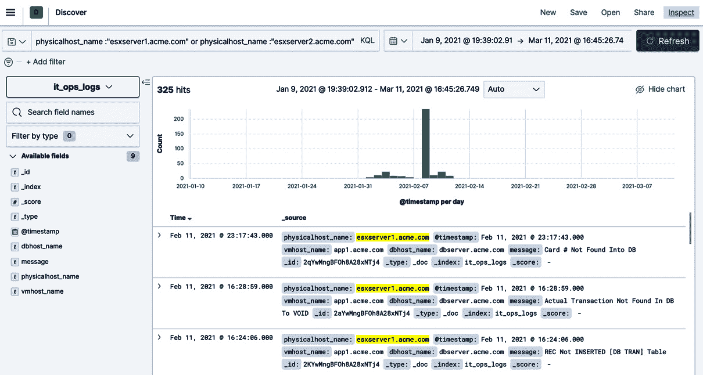

图 7.3 – 使用 KQL 构建过滤查询

此 KQL 查询的文本如下：

```py
physicalhost_name:''esxserver1.acme.com'' or physicalhost_name:''esxserver2.acme.com''
```

如果你对 Kibana 调用的实际 Elasticsearch DSL 以获取此过滤查询感到好奇，可以点击右上角的**检查**按钮并选择**请求**选项卡以查看 Elasticsearch DSL：

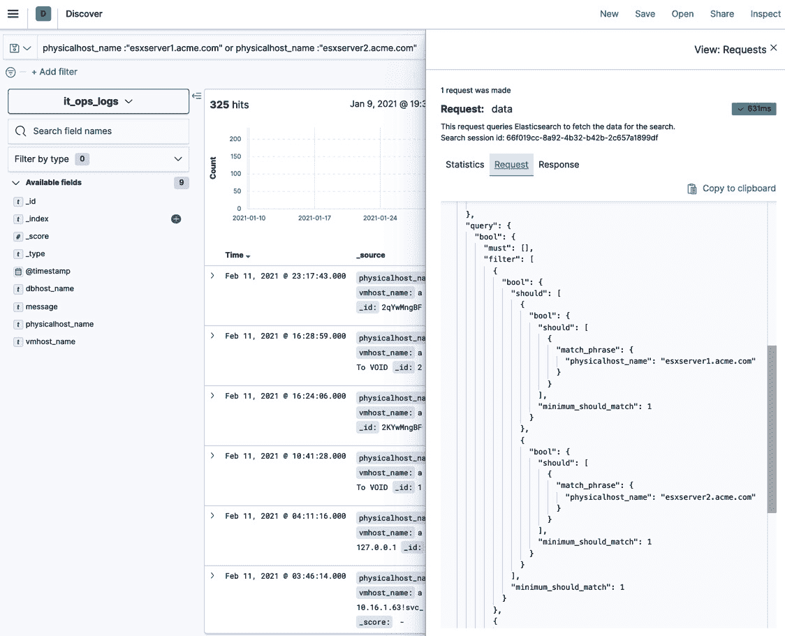

图 7.4 – 检查为 KQL 过滤器运行的 Elasticsearch DSL

可能值得注意，尽管在这个特定示例中 KQL 查询被转换成 Elasticsearch DSL 的方式（例如使用`match_phrase`），但这并不是实现预期结果唯一的方式。使用`terms`的查询过滤器是另一种方式，但评估这两种方式的优劣超出了本书的范围。

不论后台运行的 Elasticsearch DSL 是什么，关键是我们有一个查询，它过滤原始数据，仅识别我们希望使用 Elastic ML 进行分析的应用程序感兴趣的服务器。为了保持这个过滤搜索，需要在右上角点击**保存**按钮并命名搜索：


图 7.5 – 在 Elastic ML 中保存搜索以供以后使用

之后，您可以在配置新的异常检测作业时选择此保存的搜索：

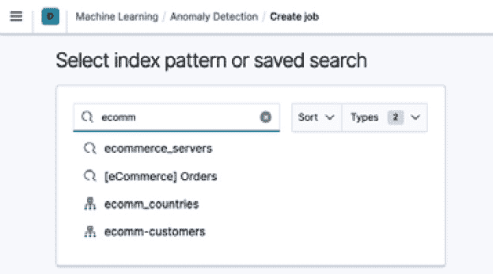

图 7.6 – 在异常检测作业中使用保存的搜索

因此，我们的 ML 作业现在将仅针对此特定应用程序感兴趣的主机运行。因此，我们已经能够有效地限制和分割数据分析，仅限于我们定义的为该应用程序做出贡献的主机。

## 数据摄取时的数据丰富

另一个选项是将关于哪些主机属于哪些应用的决策进一步上移到数据摄取的时间。如果 Logstash 是摄取管道的一部分，您可以使用过滤器插件根据资产列表（文件、数据库等）的查找来向数据添加额外的字段。请参阅 Logstash 文档[`www.elastic.co/guide/en/logstash/current/lookup-enrichment.html`](https://www.elastic.co/guide/en/logstash/current/lookup-enrichment.html)，其中展示了如何使用额外字段动态丰富索引文档以提供上下文。如果您没有使用 Logstash（仅使用 Beats/Elastic Agent 和摄取节点），可能更简单的方法是使用 enrich 处理器。请参阅[`www.elastic.co/guide/en/elasticsearch/reference/current/ingest-enriching-data.html`](https://www.elastic.co/guide/en/elasticsearch/reference/current/ingest-enriching-data.html)文档。

例如，您可以让这种丰富添加一个`application_name`字段，并动态填充该字段的值，例如以下内容（这里截断的 JSON）：

```py
''host'': ''wasinv2.acme.com'',
      ''application_name'': ''invoice_processing'',
```

或者您还可以有如下内容：

```py
      ''host'': ''www3.acme.com'',
      ''application_name'': ''online_purchases'',
```

一旦设置了该字段的值并将其插入到索引文档中，然后您就可以使用`application_name`字段，结合之前描述的过滤查询异常检测作业的能力，将数据分析限制在感兴趣的相关应用程序上。添加数据丰富步骤可能看起来需要更多的前期努力，但从长远来看，它应该会带来回报，因为当资产名称更改或演变时，这将更容易维护，因为第一种方法需要在机器学习作业的搜索中硬编码资产名称。

现在我们已经组织了我们的数据，也许甚至丰富了它，那么现在让我们看看我们如何可以利用这些上下文信息来使我们的异常检测作业更有效。

# 利用上下文信息

在我们的数据组织/丰富后，我们可以利用上下文信息的两种主要方式是通过分析**拆分**和统计**影响因素**。

## 分析拆分

我们已经看到，异常检测作业可以根据任何分类字段进行拆分。因此，我们可以为该字段的每个实例单独建模行为。这可能会非常有价值，尤其是在每个实例需要其自己的单独模型的情况下。

以我们拥有世界不同地区的数据为例：

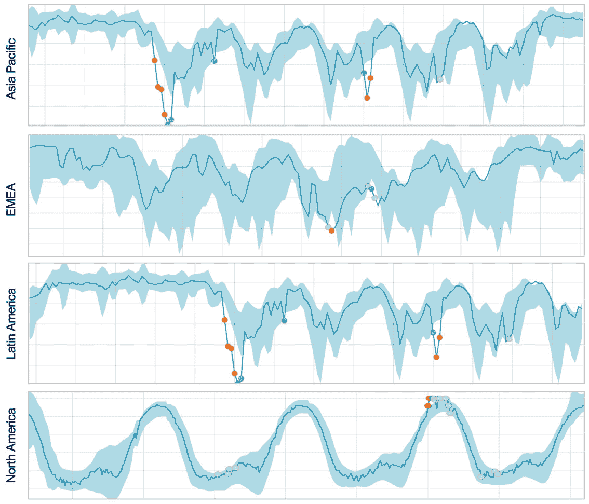


图 7.7 – 根据区域不同的数据行为

无论这些数据是什么（销售 KPI、利用率指标等），显然它们具有非常独特的模式，这些模式是每个区域独有的。在这种情况下，将任何分析拆分到每个区域进行异常检测以利用这种独特性是有意义的。我们将能够检测到特定于每个区域的行为异常。

让我们也想象一下，在每一个区域内，一组服务器支持应用程序和事务处理，但它们是负载均衡的，并且对性能/操作的贡献是相等的。这样，每个服务器对区域的贡献就没有什么独特之处。因此，按服务器进行分析可能没有意义。

我们自然得出结论，按区域拆分比按服务器拆分更有效。但如果区域内的某个服务器在向被检测到的异常贡献方面存在问题呢？我们难道不想立即获得这些信息，而不是手动进一步诊断吗？这是通过影响因素可以做到的。

## 统计影响因素

我们在*第五章*“解释结果”中介绍了影响因素的概念。作为提醒，影响因素是一个字段，它描述了一个实体，你想要知道它是否“影响”（是异常的原因）或至少对异常有重大贡献。记住，任何被选为候选影响因素的字段不需要是检测逻辑的一部分，尽管选择用作拆分的字段作为影响因素是自然的。同样重要的是，在创建异常检测作业时选择影响因素，因为以后无法将其添加到配置中。

还需要理解的是，在异常检测作业发现异常之后，才会进行寻找潜在影响因素的过程。换句话说，它不会影响检测过程中所做的任何概率计算。一旦确定了异常，机器学习将系统地遍历每个候选影响因素字段的每个实例，并从该时间桶中的数据中移除该实例的贡献。如果移除后，剩余的数据不再异常，那么通过反事实推理，该实例的贡献必须是具有影响力的，并且会相应地进行评分（结果中的`influencer_score`值）。

然而，在下一节中，我们将看到如何利用影响者在查看单个异常检测作业的结果时，以及可能的相关作业的结果。现在，让我们继续讨论如何将作业分组并一起查看，以协助根本原因分析。

# 将所有内容整合进行根本原因分析

现在，我们已经到了可以讨论如何将所有事情整合在一起的程度。在我们希望提高 IT 运营效率并更全面地查看应用程序健康状态的需求下，我们现在需要将之前章节中准备的内容进行操作化，并相应地配置我们的异常检测作业。为此，让我们通过一个真实场景来探讨，在这个场景中，Elastic ML 帮助我们找到了运营问题的根本原因。

## 故障背景

这个场景大致基于一个真实的应用程序故障，尽管数据已经被简化并清洗过，以掩盖原始客户的信息。问题出在一个处理礼品卡交易的零售应用程序上。偶尔，该应用程序会停止工作，交易无法处理。这种情况只有在各个门店向总部投诉时才会被发现。问题的根本原因未知，客户无法轻易确定。由于他们从未找到根本原因，而且只需重新启动应用程序服务器即可解决问题，因此问题会随机复发，困扰了他们数月。

收集并包含在分析中的以下数据有助于理解问题的起源。这些数据包括以下内容（并在 GitHub 仓库中提供）：

+   交易量的总结（1 分钟计数）（主要 KPI）

+   来自交易处理引擎的应用程序日志（基于半结构化文本的消息）

+   来自支持交易处理引擎的数据库的 SQL Server 性能指标

+   来自交易处理引擎运行的网络的网络利用率性能指标

因此，针对数据配置了四个机器学习（ML）任务。它们如下所示：

+   每分钟处理交易数量的`sum`

+   使用`mlcategory`检测器按类型计数日志消息的数量，但使用基于动态机器学习的分类来区分不同的消息类型

+   指数中每个 SQL Server 指标的`mean`分析

+   指数中每个网络性能指标的`mean`分析

当应用程序出现问题时，这四个作业在数据上进行了配置和运行。发现了异常，尤其是在跟踪正在处理的交易数量的 KPI 中。实际上，这正是我们在本章开头看到的 KPI，其中订单处理的意外下降是问题发生的首要指标：

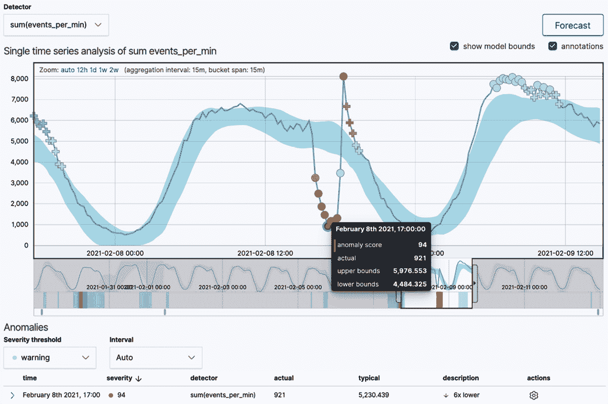

图 7.8 – 处理的交易数量关键绩效指标（KPI）

然而，直到这个 KPI 的异常与查看底层技术和基础设施数据的其他三个 ML 任务的异常相关联，才理解了根本原因。让我们看看视觉关联和共享影响因素的力量是如何帮助发现根本原因的。

## 相关性和共享影响因素

除了处理交易 KPI 中的异常（其中出现意外的下降）之外，其他三个异常检测作业（针对网络指标、应用程序日志和 SQL 数据库指标）被叠加到**异常探索器**的相同时间框架中。以下截图显示了这些结果：

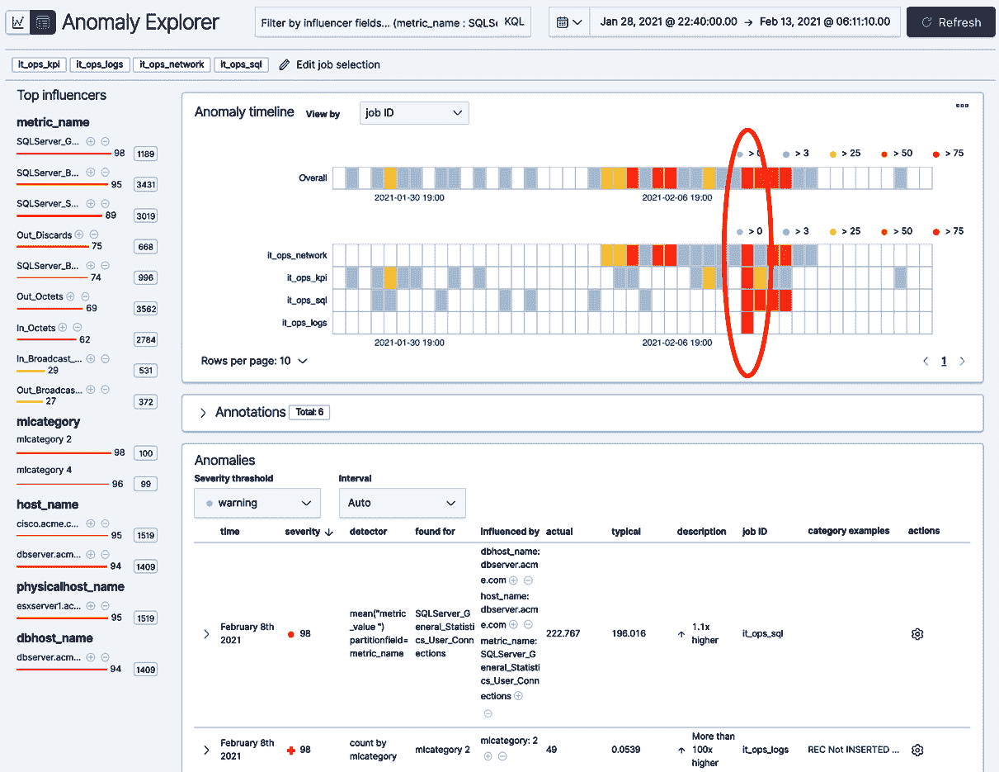

图 7.9 – 异常探索器显示多个作业的结果

特别注意，KPI 出现问题的那天（2021 年 2 月 8 日，如图 7.8 所示），图 7.9 中的其他三个作业表现出相关的异常，如图中圈出的区域所示。通过点击`it_ops_sql`作业的红色瓷砖进行更仔细的检查，可以看到有几个 SQL Server 指标同时出现混乱：

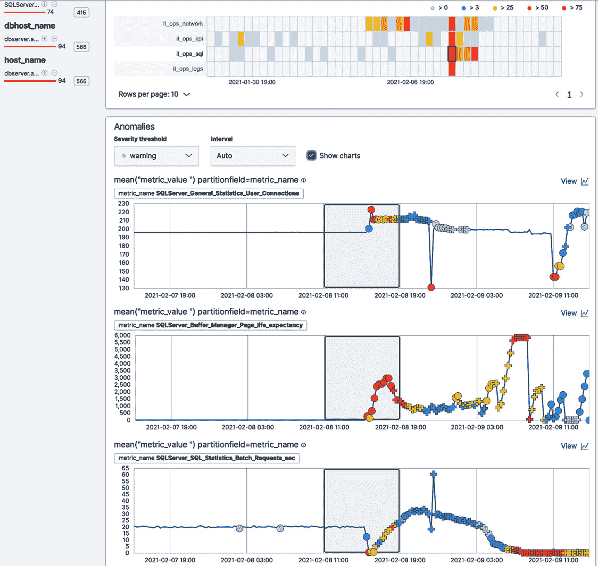

图 7.10 – 异常探索器显示 SQL Server 的异常

备注

图表中的阴影区域突出了与泳道中选定瓷砖宽度相关的时间窗口。这个时间窗口可能比分析的桶跨度要大（正如这里的情况），因此阴影区域可能包含该时间段内的许多单个异常。

如果我们查看应用程序日志异常检测作业中的异常，会发现大量错误都指向数据库（进一步证实了 SQL 服务器不稳定）：

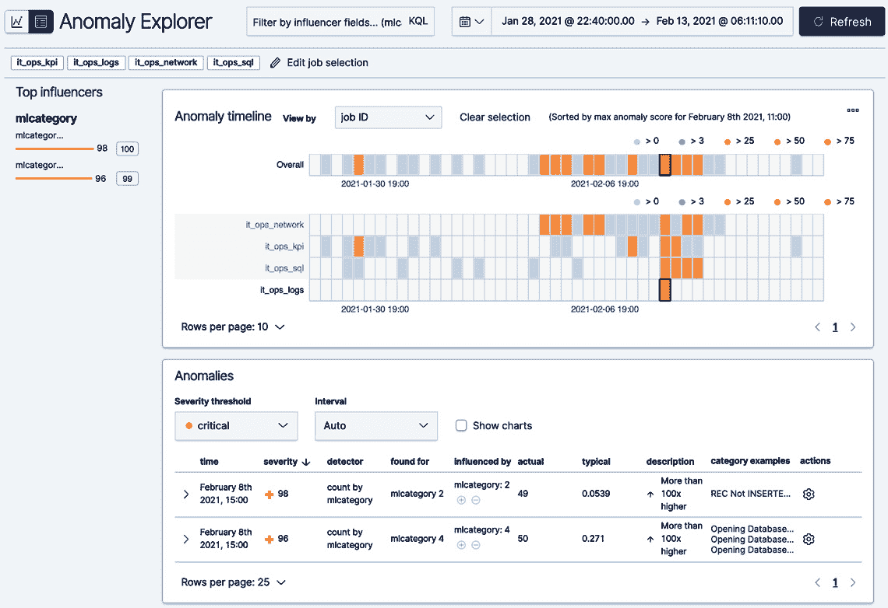

图 7.11 – 异常探索器显示应用程序日志的异常

然而，网络上也发生了有趣的事情：

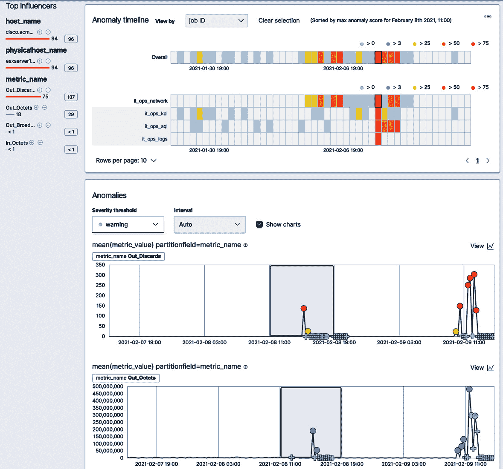

图 7.12 – 异常探索器显示网络数据的异常

具体来说，网络流量（通过**Out_Octets**指标显示）出现了大幅上升，并且网络接口处丢弃的数据包数量也急剧增加（通过**Out_Discards**指标显示）。

到这个时候，很明显怀疑这个网络峰值可能与数据库问题有关。虽然相关性不总是因果关系，但这足以吸引运维团队回顾一些历史数据，以了解之前的故障情况。在其他每次故障中，都存在这种大的网络峰值和丢包模式。

网络峰值的最根本原因是 VMware 将虚拟机移动到新的 ESX 服务器。有人错误配置了网络交换机，VMware 将这股巨大的流量发送到应用程序 VLAN 而不是管理 VLAN。当然，当这种情况发生时（随机发生），事务处理应用程序会暂时失去与数据库的连接并尝试重新连接。然而，在这个重新连接代码中存在一个关键缺陷，即它不会尝试连接到属于 SQL 服务器的远程 IP 地址。相反，它尝试连接到本地主机（IP 地址`127.0.01`），当然，那里没有这样的数据库。这个错误的线索在 Elastic ML 在**示例**部分显示的一个示例日志行中可以看到（以下截图中的圆圈所示）：

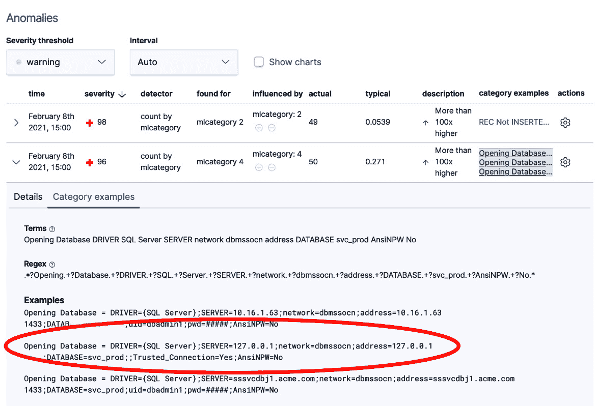

图 7.13 – 异常探索器显示重新连接问题的根本原因

一旦问题发生，只有当应用程序服务器完全重启、重新读取启动配置文件以及重新学习 SQL 服务器的 IP 地址时，才能连接到 SQL 服务器。这就是为什么完整的重启总是能解决问题。

一个需要注意的关键点是用户界面中的影响因素如何帮助缩小异常责任人的范围：

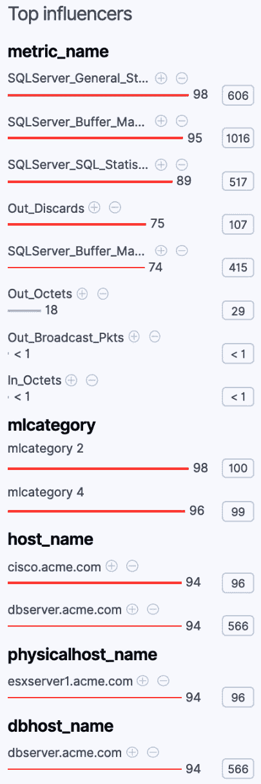

图 7.14 – 异常探索器显示顶级影响因素

在仪表板上选择的时间范围内得分最高的影响因素列在左侧的**顶级影响因素**部分。对于每个影响因素，显示最大影响因素得分（在任何桶中），以及仪表板时间范围内的总影响因素得分（跨所有桶求和）。如果同时显示多个作业，那么在作业中共同的那些影响因素具有更高的总和，从而推动它们的排名更高。

这是一个非常重要的观点，因为现在很容易在多个作业中看到违规实体之间的共性。如果 `esxserver1.acme.com` 是在查看多个作业时作为影响因素出现的唯一物理主机，那么我们立即知道应该关注哪台机器；我们知道这不是一个普遍的问题。

最后，客户通过纠正网络配置错误和解决数据库重连代码中的错误，成功地缓解了系统。他们能够迅速缩小根本原因，因为 Elastic ML 允许他们缩小调查范围，从而节省时间并防止未来发生。

# 摘要

Elastic ML 确实可以增加 IT 组织**关注**的数据量，从而从他们的数据中获得更多洞察和主动价值。能够组织、关联并全面查看跨数据类型的相关异常对于问题隔离和根本原因识别至关重要。它减少了应用程序的停机时间，并限制了问题再次发生的可能性。

在下一章中，我们将看到 Elastic Stack（APM、安全和日志）中的其他应用程序如何利用 Elastic ML 提供即插即用的体验，该体验针对特定用例进行了定制。
