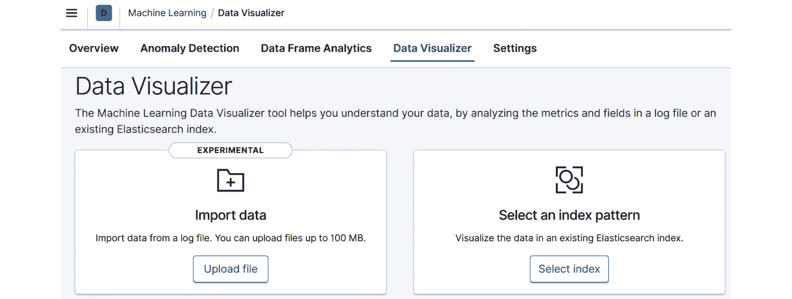
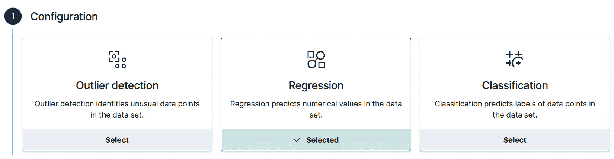
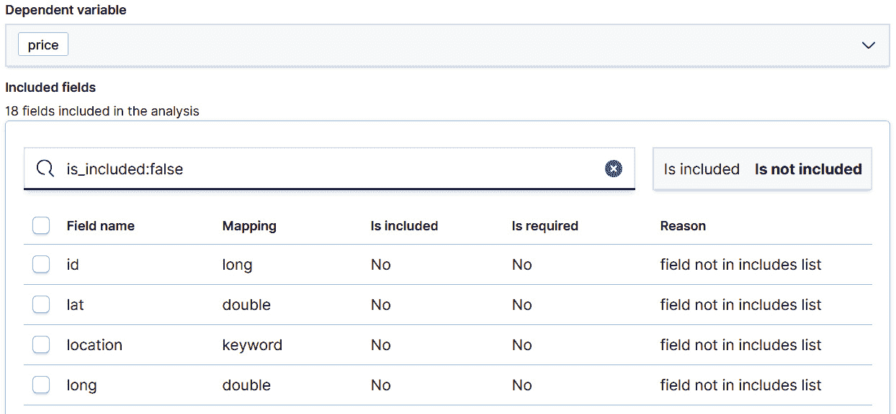
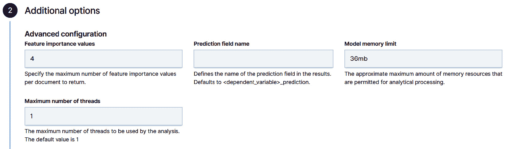
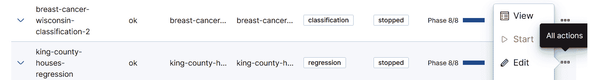
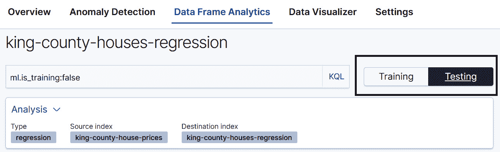
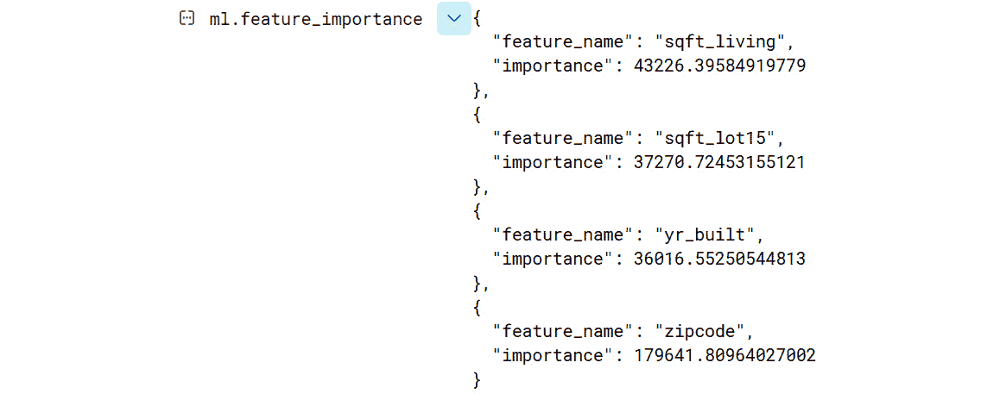
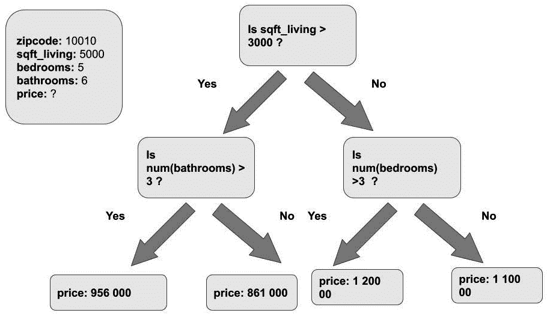
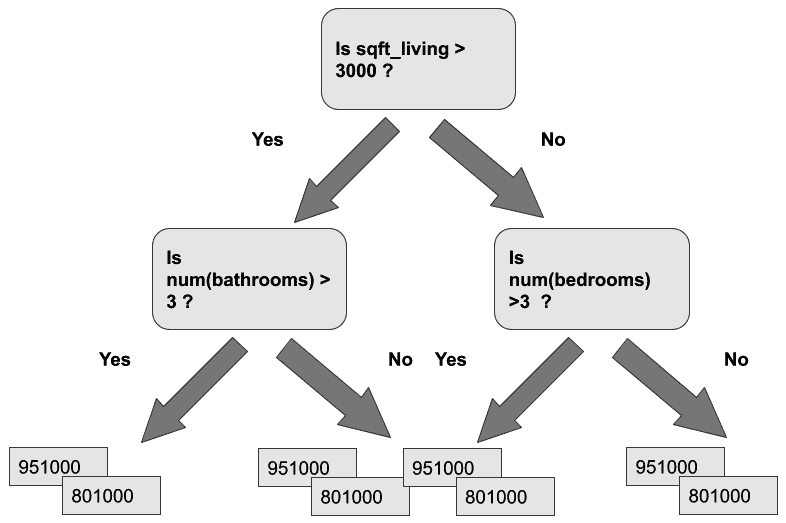

# 第十二章: 回归分析

在上一章中，我们研究了分类——Elastic Stack 中可用的两种监督学习技术之一。然而，并非所有监督学习的实际应用都适合分类所需的格式。例如，如果我们想预测我们邻里的公寓销售价格？或者我们在线商店中客户将花费的金额？请注意，我们这里感兴趣的不是离散类别，而是一个可以在一定范围内取各种连续值的值。

这正是回归分析解决的问题。我们不是预测给定数据点属于哪个类别，而是预测一个连续值。尽管最终目标与分类中的目标略有不同，但用于回归的底层算法与我们在上一章中检查的分类算法相同。因此，我们已经从*第十一章**，分类分析*中建立的基础中了解了回归的工作原理。

由于回归分析的结果是连续值而不是分类中的离散类别标签，因此我们评估回归模型性能的方式与上一章中检查分类的方式略有不同。我们不是使用混淆矩阵和从正确标记和错误标记的示例数量计算的各种指标，而是计算汇总指标，这些指标捕捉了预测数据集中连续值与数据集中实际值之间的差距。我们将在本章后面更详细地探讨这一过程以及所使用的措施。

本章将涵盖以下主题：

+   使用回归分析预测地理位置的房价

+   理解决策树如何应用于创建回归模型

# 技术要求

本章中的材料需要运行 7.10.1 或更高版本的 Elasticsearch 集群。一些示例可能包括截图或关于仅在 Elasticsearch 后续版本中可用的详细信息的指导。在这种情况下，文本将明确指出需要运行示例的后续版本。

# 使用回归分析预测房价

在上一章中，我们探讨了 Elastic Stack 中的两种监督学习方法中的第一种——分类。分类分析的目标是使用标记的数据集来训练一个模型，该模型可以预测先前未见过的数据点的类别标签。例如，我们可以在细胞样本的历史测量数据上训练一个模型，并附带有关细胞是否恶性的信息，然后使用它来预测先前未见过的细胞的恶性。在分类中，我们感兴趣预测的类别或**因变量**始终是一个**离散量**。另一方面，在回归中，我们感兴趣的是预测一个连续变量。

在我们更深入地探讨回归的理论基础之前，让我们直接深入实践，看看如何在 Elasticsearch 中训练一个回归模型。我们将使用的数据集可在 Kaggle 上找到（[`www.kaggle.com/harlfoxem/housesalesprediction`](https://www.kaggle.com/harlfoxem/housesalesprediction)），描述了 2014 年至 2015 年间在美国华盛顿州某个地区出售的房价。原始数据集已稍作修改，以便更容易地导入 Elasticsearch，并在本书的 GitHub 存储库中提供（[https://github.com/PacktPublishing/Machine-Learning-with-Elastic-Stack-Second-Edition/blob/main/Chapter%2012%20-%20Regression%20Analysis/kc_house_data_modified.csv]）。我们将按照以下步骤开始：

1.  使用您首选的方法将数据集导入 Elasticsearch。如果您愿意，可以使用**机器学习**应用中的**数据可视化器**提供的**上传文件**功能，如图*图 12.1*所示：

    图 12.1 – 机器学习应用的数据可视化器中的上传文件功能

1.  一旦我们吸收了这些数据，让我们花一点时间在**机器学习**应用中的**数据可视化器**中检查它。在这个视图中，我们可以一眼看出数据中存在哪些字段以及每个字段的值分布情况。例如，对于我们的房价数据集，我们可以在*图 12.2*中看到价格值的直方图可视化，这个数据集中大多数房价介于 20 万至 90 万美元之间，只有少数房子的售价超过 90 万美元：

    图 12.2 – 数据可视化器中显示的价格字段的值分布

    在**数据可视化器**中查看数据值和分布可以迅速提醒我们潜在的问题，例如数据集中某个字段中的无效或缺失值。

    接下来，让我们导航到**数据帧分析**向导。在 Kibana 的左侧滑动菜单中，点击**机器学习**以导航到**机器学习**应用的主页。在此页面上，在**数据帧分析**作业部分，如果您尚未创建数据帧分析作业，请点击**创建作业**按钮。如果您已经有了，首先点击**管理作业**按钮。这将带您进入**数据帧分析**页面，在那里您将找到现有数据帧分析作业的列表（例如，如果您在上一章的演练中创建了任何作业）以及**创建作业**按钮。

    这将带您进入我们已经在*第十章*“异常检测”以及*第十一章*“分类分析”中见过的数据帧分析向导。

1.  一旦您已选择您的源索引模式（这应该与您在*步骤 1*中导入或上传数据时选择的索引模式名称相匹配），请从数据帧分析向导的作业类型选择器中选择**回归**，如图 12.3 所示：

    图 12.3 – 在数据帧分析作业向导选择器中选择“回归”作为作业类型

1.  接下来，让我们配置`价格`字段。

    在选择因变量之后，让我们继续选择将要包含或排除在分析中的字段。虽然数据集中的许多字段提供了对预测因变量（`价格`）有用的信息，但*有一些字段我们从一开始就知道它们与价格不相关，因此应该被移除*。这些字段中的第一个是数据点的 ID（`id`）。它只是一个表示数据点在原始数据文件中位置的行号，因此不期望它包含有用的信息。实际上，包括它可能会带来更多的坏处而不是好处。例如，如果原始数据文件是以这样的方式组织的，即所有低价房屋都位于文件的开头，具有低的`id`编号，而所有高价房屋都位于文件末尾，那么模型可能会认为`id`数据点在确定房屋价格时很重要，尽管我们知道这仅仅是数据集的一个特征。这反过来又会损害模型在未来的、尚未看到的观测点上的性能。如果我们假设数据点的`id`值在增长，任何添加到数据集的新数据点都会自动具有比训练数据中任何数据点更高的`id`编号，因此会导致模型认为任何新的数据点价格更高。

    此外，我们还将排除关于房屋位置纬度和经度的信息，因为这些变量不能被机器学习算法解释为地理位置，因此将被简单地解释为数字。最终的配置应如图*12.4*所示：

    

    

    图 12.4 – 不包含在分析中的字段

1.  在配置了因变量以及包含和排除的字段后，我们可以继续进行其他配置项。虽然我们将在这个部分保留大部分值设置为默认值，但我们将**特征重要性值**的数量从*0*更改为*4*。如果设置为*0*，则不会输出任何特征重要性值。当设置为*4*时，每个数据点将输出四个最重要的特征值。如在第*11 章*“分类分析”中简要讨论的，特征重要性值将分别针对每个文档输出，有助于确定模型为何以特定方式对特定文档进行分类。我们将在本章稍后回到这一点：

    图 12.5 – 特征重要性值配置

    我们将其他设置保留为默认值，并通过滚动到向导底部并点击**创建并启动**按钮来开始运行作业。

1.  在完成向导中的步骤并创建并启动作业后，返回到**数据帧分析**页面。这将显示您创建的所有数据帧分析作业的概述，包括我们在前面的步骤中创建的回归作业。一旦作业完成，点击右侧菜单，然后点击**查看**，如图*12.6:*所示：

    图 12.6 – 选择视图查看数据帧分析作业的结果

    这将带我们进入**探索**页面，该页面允许我们探索新训练的回归模型的各项指标。在这个页面上需要特别注意的第一件事是**训练**/**测试**数据集切换，如图*12.7*所示：

    

    

    图 12.7 – 数据帧分析结果查看器中的训练/测试切换

    在查看**探索**页面上的指标时，要注意这个切换，因为模型的评估指标根据所选的指标而意味着不同的事情。在这种情况下，我们感兴趣的是当模型试图对之前未见过的数据点进行预测时，其表现如何。最接近这一点的数据集是测试数据集——换句话说，即未用于训练过程的数据集。

1.  让我们向下滚动并查看测试数据集的**模型评估**指标，如图*图 12.8*所示：![图 12.8 – 泛化误差

    ![img/B17040_12_8.jpg]

    图 12.8 – 泛化误差

    我们将在本章后面更详细地探讨这些指标的含义，但到目前为止，你可以将它们视为模型对房屋价格预测与实际房屋价格接近程度的综合度量。

1.  最后，许多用户可能感兴趣的是，我们数据集中哪些字段在确定模型的最终预测中最为重要。我们可以通过查看**探索**页面上的**总特征重要性**部分来了解这一点，如图*图 12.9*所示：![图 12.9 – 总特征重要性

    ![img/B17040_12_9.jpg]

图 12.9 – 总特征重要性

从图中可以看出，华盛顿州金郡的房屋销售价格最重要的因素是`zip code`，即房屋的位置。在不太重要的因素中包括房屋翻新年份`yt_renovated`和楼层数量（`floors`）。

值得注意的是，图中显示的特征是整个数据集中最重要的特征。然而，确定数据集中单个数据点的销售价格的特征可能会有很大不同。在这次讲解的早期，在创建`4`中的工作期间。这意味着在模型训练完成后，四个最重要的特征重要性值将被写入结果索引。让我们看一下结果索引中的样本文档，`king-county-houses-regression`。该文档如图*图 12.10*所示：

![图 12.10 – 结果索引中样本文档的特征重要性值

![img/B17040_12_10.jpg]

图 12.10 – 结果索引中样本文档的特征重要性值

如我们在*图 12.10*中可以看到，对于这所特定的房子，最重要的四个特征值是`grade`（评级）、`sqft_living`（以平方英尺计的房屋居住面积）、`yr_built`（房屋建造年份）和`zipcode`（房屋位置的数值表示）。需要注意的是，这里所有的特征重要性值都是负数，这意味着它们有助于降低房屋的价格。

让我们看看另一份文档（如图 *图 12.11* 所示）中的前四个特征重要性值在结果索引中的情况，并将它们与之前的特征重要性值进行比较，以了解可能存在多少变化：

图 12.11 – 确定这所房子价格最重要的四个特征

如我们所见，*图 12.11* 中的房屋与 *图 12.10* 中的房屋有一些共同的特征，但也有些独特的特征。此外，这个房屋的特征重要性值对其价格有积极的影响。

现在你已经简要地看到了如何训练一个回归模型并评估其结果，一个自然的问题就是接下来该做什么？如果你使用这个模型进行实际应用，例如预测金县或其他地理位置尚未售出的房屋的潜在房价，你可以使用推理来检查和部署这个模型。这将在 *第十三章**，推理* 中更详细地介绍。在下一节中，我们将简要回顾我们在 *第十一章**，分类分析* 中开始的决策树讨论，并看看我们当时提出的想法如何应用于回归问题。

# 使用决策树进行回归

正如我们在前面的章节中讨论的，回归是一种监督学习技术。正如在 *第十一章**，分类分析* 中讨论的，监督学习的目标是接受一个标记的数据集（例如，具有房屋特征及其销售价格 – 因变量）的数据集，并将这些数据中的知识提炼成一个称为训练模型的人工制品。然后，这个训练模型可以用来预测模型之前未见过的房屋的销售价格。当我们试图预测的因变量是一个连续变量，而不是分类领域的离散变量时，我们就处于回归的状态。

回归 – 从现实世界的观察或数据中提炼信息的过程 – 是机器学习的一个领域，它包含的技术远比在 Elasticsearch 的机器学习功能中使用的决策树技术更广泛。然而，在这里我们将限制自己只讨论如何使用决策树（Elastic Stack 内部发生过程的简化版本）进行回归的概念性讨论，并将对学习更多关于回归的读者推荐到相关文献。例如，书籍 *机器学习数学*（https://mml-book.github.io/）对回归有很好的介绍。

在*第十一章**，分类分析*中，我们开始讨论决策树在分类问题中的应用，通过介绍如果你想要尝试推断房屋的销售价格，可能会构建的流程图的概念。一个可能构建的虚构流程图的例子在*图 12.12*中展示：

图 12.12 – A sample flowchart that illustrates the decisions that you might make to try to predict the sales price of a house

在*图 12.12*所示的虚构流程图中，我们有一个由左上角方框表示的样本房屋。这个房屋有 5,000 平方英尺的居住空间，5 个卧室和 5 个浴室。我们希望根据这些属性预测房屋的最终销售价格，并打算使用流程图来帮助我们。我们在实践中这样做的方式是，从流程图的顶部（或决策树的根）开始，逐步向下工作，直到终端节点（不连接任何下游节点的节点）。我们的样本房屋有 5,000 平方英尺的居住区，所以我们对于第一个节点回答**是**，对于第二个子节点再次回答**是**。这导致了一个终端或叶节点，其中包含我们房屋的预测价格：956,000 美元。

一个自然的问题是要问，我们如何创建像*图 12.12*那样的流程图？创建此流程图（或决策树）需要两个要素：标记的数据集，其中包含每栋房屋的特征及其销售价格，以及训练算法，该算法将使用此数据集，并构建一个填充的流程图或决策树，然后可以用来对先前未见过的房屋进行价格预测（这是通过推理完成的，这在*第十三章**，推理*中详细说明）。

基于标记数据集训练决策树的过程涉及创建像*图 12.12*中展示的节点。这些节点将数据集分成越来越小的子集，直到我们达到每个子集满足某些标准的情况。在分类的情况下，当子集达到一定的纯度时，逐步分割训练数据集的过程就会停止。这可以通过使用几个不同的指标来衡量，这些指标捕捉了节点中属于某一类的数据点的比例。最纯的节点是只包含属于某一类的数据点的节点。

由于回归处理连续值，我们不能使用纯度作为确定何时递归分割数据集的停止标准的度量。相反，我们有一个称为损失函数的另一个度量。回归的一个示例损失函数是**均方误差**。这个度量捕捉了预测值与每个节点中每个点的实际误差之间的距离。

最后，如果我们多次递归分割数据集，我们将得到如图 12.13 所示的简化决策树：

图 12.13 – 一个简化的训练决策树。叶节点包含多个数据点

如我们在图 12.13 中看到的，在训练过程的最后，终端节点叶包含每个节点多个数据点。

# 摘要

回归是 Elastic Stack 中两种监督学习方法中的第二种。回归的目标是将一个训练好的数据集（包含一些特征和我们要预测的因变量的数据集）提炼成一个训练好的模型。在回归中，因变量是一个连续值，这使得它与处理离散值的分类方法不同。在本章中，我们使用了 Elastic Stack 的机器学习功能，利用回归根据房屋的位置和卧室数量等属性预测房屋的销售价格。虽然有许多回归技术可用，但 Elastic Stack 使用梯度提升决策树来训练模型。

在下一章中，我们将探讨如何将监督学习模型与推理处理器和摄取管道结合使用，以创建强大的、由机器学习驱动的数据分析管道。

# 进一步阅读

关于如何计算特征重要性值的更多信息，请参阅此处博客文章 *使用 Elastic 机器学习进行数据框分析的特征重要性*：https://www.elastic.co/blog/feature-importance-for-data-frame-analytics-with-elastic-machine-learning。

如果你正在寻找回归的更数学化的介绍，请参阅此处可用的书籍 *机器学习数学* [`mml-book.github.io/`](https://mml-book.github.io/)。
