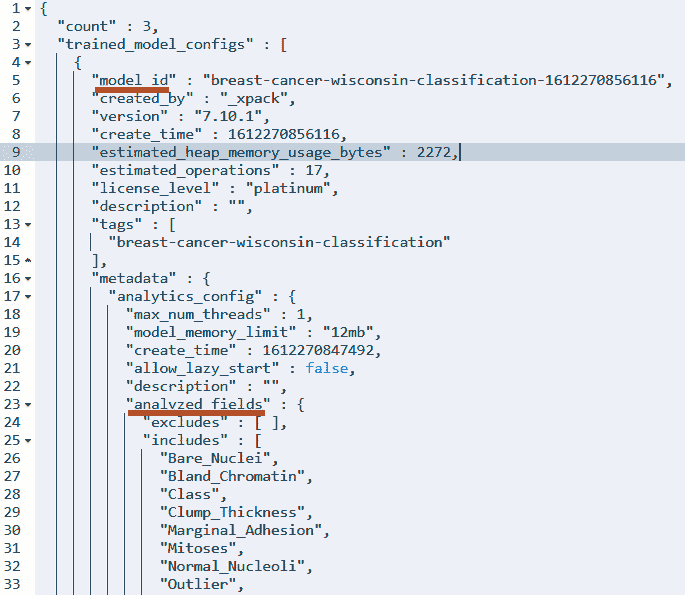
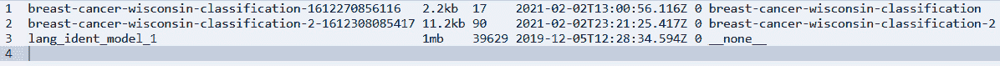
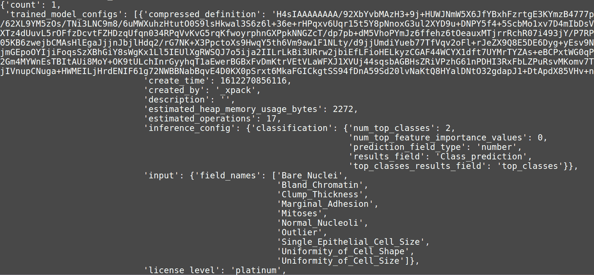
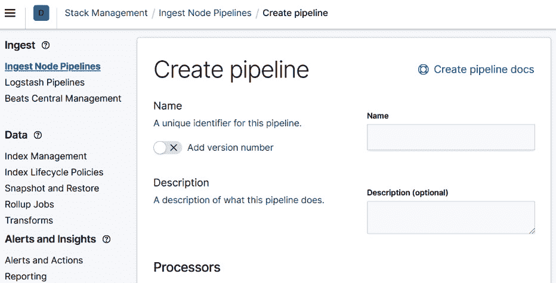
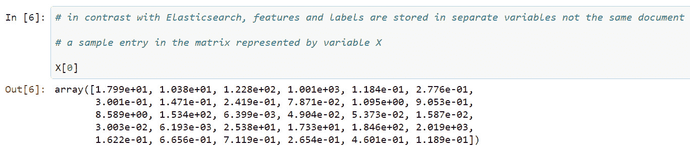
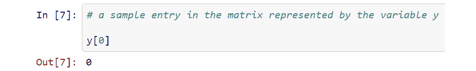
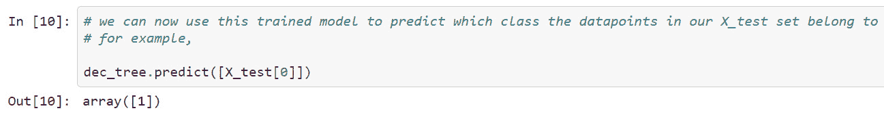
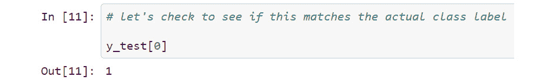

# 第十三章：推理

在本章中，我们将深入探讨在 Elastic Stack 中使用训练好的监督模型所能做的所有令人着迷的事情。首先，我们将看到如何使用训练模型 API 来查看我们集群中可用的模型信息，查看单个模型的详细信息，以及导出模型以便它们可以被移植到其他 Elasticsearch 集群。我们还将简要地看看如何使用 eland 将外部模型，例如由第三方机器学习库训练的模型，导入到 Elasticsearch 中。

在本章的第二部分，我们将深入探讨如何在各种环境中使用训练好的监督模型进行推理，以丰富数据。为此，我们将学习推理处理器和摄取管道，以及这些如何与连续转换、重新索引以及在使用各种 beats 或其他将数据摄取到 Elasticsearch 时的时间进行组合。

在本章中，我们将涵盖以下主题：

+   使用训练模型 API 和 Python 检查、导入和导出训练好的机器学习模型

+   理解推理处理器和摄取管道以及如何配置和使用它们

+   使用 eland 将外部模型导入 Elasticsearch

# 技术要求

本章中的材料需要 Elasticsearch 集群版本 7.10 或更高版本，以及安装 Python 3.7 或更高版本，并已安装`eland`、`elasticsearch-py`和`scikit-learn`库。有关如何配置 Python 安装以与本章一起使用的详细说明，请参阅书中 GitHub 仓库中的`Chapter 13 - Inference and Advanced Transforms`文件夹下的 README 部分：[`github.com/PacktPublishing/Machine-Learning-with-Elastic-Stack-Second-Edition/tree/main/Chapter%2013%20-%20Inference`](https://github.com/PacktPublishing/Machine-Learning-with-Elastic-Stack-Second-Edition/tree/main/Chapter%2013%20-%20Inference)。

# 使用训练模型 API 检查、导出和导入您的训练模型

您已经准备好了您的数据集，训练了您的分类或回归模型，检查了其性能，并确定您希望使用它来丰富您的生产数据集。在您深入到摄取管道、推理处理器以及您可以为使用训练模型配置的其他众多组件之前，熟悉**训练模型 API**（[`www.elastic.co/guide/en/elasticsearch/reference/7.10/get-trained-models.html`](https://www.elastic.co/guide/en/elasticsearch/reference/7.10/get-trained-models.html)），一组 REST API 端点，您可以使用它来获取有关模型的信息，甚至将它们导出到其他集群。让我们来浏览一下这个 API，看看它能告诉我们关于我们模型的信息。

## 训练模型 API 的概览

在本节中，我们将通过 Kibana Dev Console 实际查看关于我们的训练有监督模型的一些信息：

1.  让我们从 Kibana Dev Console 开始。简而言之，对于那些还不熟悉这个工具的人来说，Kibana Dev Console 可以通过点击左侧滑动菜单并向下滚动到 `model_id` 来访问。这个字段包含分配给集群中每个模型的唯一标识符，并在稍后用于在推理处理器和摄取管道中使用模型时引用该模型：

    Trained Models API 还提供了一项信息，即 `analyzed_fields`，这是一个包含包含或排除字段列表的字典。最好进行双重检查，以确保只包含用于训练的预期字段：

    

    图 13.1 – Inference API 响应片段，展示了集群中训练模型的数量以及其中一个模型的信息

1.  我们的演示集群仅包含三个训练好的模型，因此 API 返回的信息量并不大，但如果你正在处理包含数十个或数百个模型的集群，使用 API 调用查看单个模型的详细信息可能会有所帮助。注意，如果你正在跟随教程并想在你的 Kibana 实例中运行后续的 API 调用，你必须查找并使用位于你集群中的模型的 `model_id`：

    ```py
    GET _ml/trained_models/breast-cancer-wisconsin-classification-1612270856116
    ```

    或者，使用带有通配符的 API 调用：

    ```py
    GET _ml/trained_models/breast-cancer-wisconsin-classification-*
    ```

    可以通过 `_cat` API 获取一个更简洁的摘要。我们可以使用以下 API 调用来查看可用的模型简要信息：

    ```py
    GET _cat/ml/trained_models
    ```

    我们从集群收到的响应显示在 *图 13.2* 中。你会注意到，在乳腺癌数据集上训练了两个模型，还有一个标识为 `lang_ident_model_1` 的第三个模型。这是一个默认随 Elasticsearch 一起提供的语言识别模型，可以用来识别给定字符串可能属于哪种语言。我们将在本章后面部分探讨这个语言识别模型的工作原理以及如何使用它：



图 13.2 – _cat API 的响应

现在，我们已经简要地了解了如何检查和提取集群中可用的训练模型的信息，让我们更深入地研究 Trained Models API 的最后一个强大功能——从 Elasticsearch 集群中导出模型。由于这个程序比上一个程序涉及更多的部分，我们专门用下一节来介绍它。

## 使用 Trained Models API 和 Python 导出和导入训练好的模型

你为什么可能想要导出在 Elasticsearch 中训练好的模型呢？你可能想要导出你的模型以便将其存储在外部、与同事分享，或者稍后导入到另一个 Elasticsearch 集群中。由于训练机器学习模型可能需要大量资源，你可能想要为训练配置一个临时的 Elasticsearch 集群，在这个集群上训练和评估模型，然后将模型导出并重新导入到另一个较小的集群中，以便执行推理——这是一个资源消耗较少的过程。

要使用 Python 导出模型并遵循步骤，你需要安装 Python 3.7 或更高版本，以及 `elasticsearch-py` 库版本 7.10.1。有关如何配置 Python 环境和安装所需依赖项的详细说明和进一步资源，请参阅本书 GitHub 仓库中的此 README 文件（[`github.com/PacktPublishing/Machine-Learning-with-Elastic-Stack-Second-Edition/tree/main/Chapter%2013%20-%20Inference`](https://github.com/PacktPublishing/Machine-Learning-with-Elastic-Stack-Second-Edition/tree/main/Chapter%2013%20-%20Inference)）。从 Elasticsearch 集群中导出模型所需的所有步骤和逻辑都将在本书 GitHub 仓库中的 `export_model.py` Python 脚本中提供，[`github.com/PacktPublishing/Machine-Learning-with-Elastic-Stack-Second-Edition/tree/main/Chapter%2013%20-%20Inference/model_import_export`](https://github.com/PacktPublishing/Machine-Learning-with-Elastic-Stack-Second-Edition/tree/main/Chapter%2013%20-%20Inference/model_import_export)。在本节中，我们将查看脚本中的每个步骤，以了解导出模型所需的组件。希望这种处理能为你提供使用 `elasticsearch-py` 客户端在 Python 中构建自己的机器学习工作流的构建块：

1.  几乎所有与 Elasticsearch 集群交互的 Python 脚本的构建块是构建 Elasticsearch 客户端对象。首先必须从库中导入客户端对象的类，如下所示：

    ```py
    from elasticsearch import Elasticsearch
    ```

    一旦类被导入，我们就可以创建该对象的实例并将其分配给 `es_client` 变量：

    ```py
    es_client = Elasticsearch(es_url, http_auth=(ES_USERNAME, ES_PASSWORD))
    ```

    注意，我们将包含 Elasticsearch 实例 URL 的变量传递给对象的构造函数。这可以是类似于 `localhost:9200` 的内容，如果你在你的本地机器上运行 Elasticsearch 实例，或者对于基于云的部署，是一个更长的 URL。此外，我们传递了两个变量，`ES_USERNAME` 和 `ES_PASSWORD`，它们包含我们 Elasticsearch 实例的用户名和密码。如果你在本地运行一个未受保护的 Elasticsearch 集群以进行开发目的，则这不是必需的，但请注意，在生产环境中运行未加密的 Elasticsearch 集群是极其危险的。

1.  要与机器学习 API 交互，这些 API 我们需要从集群中导出模型，我们需要导入 `MlClient` 类：

    ```py
    from elasticsearch.client import MlClient
    ```

    然后，创建它的一个实例：

    ```py
    ml_client = MlClient(es_client)
    ```

    一旦创建了这两个客户端，我们就可以继续导出我们的模型。为此，我们将使用 `get_trained_models` 方法。该方法的文档在此处，[`elasticsearch-py.readthedocs.io/en/v7.13.0/api.html#x-pack`](https://elasticsearch-py.readthedocs.io/en/v7.13.0/api.html#x-pack)，在处理此库时，最好将此参考信息随时备好，以防需要双重检查参数和配置选项的含义。需要传递给该方法的三个重要参数是：`model_id`，它指定了你希望导出的模型的名称，`decompress_definition` 标志，应设置为 `False`，以及 `include_model_definition` 标志，应设置为 `True`：

    ```py
    model_id = breast-cancer-wisconsin-classification-1612270856116 
    compressed_model = ml.client.get_trained_models(model_id, decompress_definition=False, include_model_definition=True, for_export=True)
    Figure 13.3. Note that the actual response returned is much longer and is not shown to save space:
    ```

    

    图 13.3 – 捕获模型压缩定义以及元数据的 Python 字典片段

1.  一旦我们将此模型定义存储在我们的 Python 脚本中的 `compressed_model` 变量中，我们就可以将字典转换为 JSON 格式的字符串，并将其写入文件，该文件可以存储在版本控制中或导入到另一个 Elasticsearch 集群中。

    要将字典转换为 JSON 格式，我们必须导入内置的 Python `json` 库：

    ```py
    import json 
    ```

    然后，我们可以将导出的模型写入存储在 `filename` 变量中的文件路径：

    ```py
    with open(filename, 'w') as handle:
        handle.write(json.dumps(compressed_model))
    ```

所有前面的步骤都总结在 `export_model.py` 脚本中，该脚本可在本书的 GitHub 仓库中找到：[`github.com/PacktPublishing/Machine-Learning-with-Elastic-Stack-Second-Edition/tree/main/Chapter%2013%20-%20Inference/model_import_export`](https://github.com/PacktPublishing/Machine-Learning-with-Elastic-Stack-Second-Edition/tree/main/Chapter%2013%20-%20Inference/model_import_export)。

现在我们已经看到了如何从 Elasticsearch 集群中导出训练好的模型，让我们看看如何从文件中导入模型。与之前一样，我们将逻辑分解成步骤，但完整的有效脚本将存储在本书的 GitHub 仓库中：[`github.com/PacktPublishing/Machine-Learning-with-Elastic-Stack-Second-Edition/tree/main/Chapter%2013%20-%20Inference`](https://github.com/PacktPublishing/Machine-Learning-with-Elastic-Stack-Second-Edition/tree/main/Chapter%2013%20-%20Inference)：

1.  这个流程中的许多步骤与我们在之前详细介绍的导出脚本类似。特别是，创建`Elasticsearch`和`MlClient`对象，以及解析命令行参数，都遵循与前面脚本相似的步骤，因此我们不会详细解释它们。因此，第一步是读取模型文件，并使用内置`json`库的`loads`函数将字符串内容转换为 Python 字典：

    ```py
    With open(filename, 'r') as handle:
        model_definition = json.loads(handle.read())
    ```

1.  一旦我们将压缩的`model_definition`和所需的元数据加载到我们的 Python 字典中，我们就可以使用`put_trained_model`方法将其上传到我们的集群。

1.  最后，导航到你的集群的 Kibana 实例，并使用训练模型 API 来双重检查模型是否确实已导入到你的集群中。

现在我们已经学会了如何查看模型的详细信息，以及如何导出和导入模型，我们可以继续学习构建没有模型的更复杂的机器学习基础设施。一旦你有一个训练好的模型，模型的可能性几乎是无限的——你可以将模型与转换结合使用，在摄取时使用它来丰富你的数据，等等。这个基础设施的构建块是推理处理器和摄取管道。我们将在下一章详细探讨这两个构建块，以便你为构建自己的机器学习基础设施做好准备。

# 理解推理处理器和摄取管道

你已经有一个训练好的机器学习模型，接下来该做什么呢？记得从*第十一章*，*分类分析*，和*第十二章*，*回归*，机器学习模型令人兴奋的一点是，它们可以从标记的训练数据集中学习，然后以某种方式编码知识，以便它们可以用于对先前未见过的数据点进行预测。对先前未见过的数据点进行标记或预测的过程就是我们所说的**推理**。

这在 Elastic Stack 中是如何实际发生的？

你可能构建出许多不同的架构来利用 Elastic Stack 中的推理功能，但所有这些架构的基本构建块都是推理处理器和摄取管道。这是我们本章探索的主要主题。

**摄取管道**是一个特殊组件，它允许你在数据写入 Elasticsearch 索引之前以各种方式操纵和转换你的数据。摄取管道通常由各种处理器组成，这些处理器是子单元或可配置的任务，每个处理器对正在摄取的数据执行单一类型的操纵或转换。摄取管道可以由多个处理器组成，这些处理器按顺序对每个正在摄取的数据文档执行。

例如，典型的摄取管道架构可能涉及一个脚本处理器，它能够对通过管道摄取的每个文档执行 Painelss 脚本，然后是推理处理器，再然后是另一个脚本处理器。对于许多机器学习应用，例如我们将在本章稍后探讨的应用，这是执行特征工程或将特征转换为机器学习模型可消费的适当格式的完美位置，或者在文档被摄取到 Elasticsearch 之前删除不必要的字段。

有多种内置处理器可以组合和定制，以创建复杂的数据转换管道。例如，**GeoIP** 处理器可以添加关于 IP 地址的地理位置信息，脚本处理器允许用户编写自定义的简便代码，以对现有文档字段进行计算和操作，而 **CSV** 处理器可以解析并从 CSV 值中提取数据以创建字段。完整的处理器列表可在 Elasticsearch 文档中找到：[`www.elastic.co/guide/en/elasticsearch/reference/master/processors.html`](https://www.elastic.co/guide/en/elasticsearch/reference/master/processors.html)。我们鼓励您查看一下，看看您可以使用它们构建哪些可能的数据架构。

对于我们的目的，在探索机器学习方面，最重要的处理器是推理处理器。当文档通过此处理器时，它们会根据处理器配置中引用的机器学习模型的预测进行标注。让我们通过一个实际示例来看看如何配置我们自己的推理处理器，并在摄取管道中使用它。

在这个例子中，我们将使用我们在 *第九章*，“介绍数据帧分析”中首次考察的虚构社交媒体数据集。这次，我们将使用语言识别模型来识别这些虚构微博网站帖子中的文本是用哪种语言编写的。让我们开始吧！

1.  如果您在本章开头讨论的 Trained Models API 上进行过尝试，您可能会注意到，即使您在特定的 Elasticsearch 集群中没有训练任何模型，您仍然会在集群中看到一个模型，`lang_ident_model_1`。由 Trained Models API 返回的与此模型相关的元数据在 *图 13.4* 中显示：![图 13.4 – 语言识别模型 lang_ident_model_1

    ![img/B17040_13_4.jpg]

    图 13.4 – 语言识别模型 lang_ident_model_1

    该模型默认随 Elasticsearch 集群一起提供，可以在推理处理器和摄取管道中使用，就像您在 Elasticsearch 集群上训练的任何其他模型一样！

1.  接下来，让我们看看如何创建一个包含引用此语言识别模型的推理处理器的摄取管道配置。回想一下，处理器是摄取管道内的子单元，它处理每个进入管道的文档，并在将其写入 Elasticsearch 索引之前。尽管你永远不能将推理处理器作为一个独立的单元在 Elasticsearch 中使用——它必须始终是管道的一部分——让我们首先单独检查处理器的配置，然后看看它是如何适应摄取管道的。

    以下代码片段显示了为我们的计划语言识别文本管道配置的推理处理器：

    ```py
    {
      "inference": {
        "model_id": " lang_ident_model_1",
        "target_field": "text_language_prediction",
        "field_map": {
          "post": "text"
        },
        "inference_config": { "classification": {} }
      }
    }
    ```

    让我们花点时间回顾一下最重要的配置参数及其含义。有关推理处理器的所有可用配置选项的完整 API 参考，请参阅以下 Elasticsearch 文档：[`www.elastic.co/guide/en/elasticsearch/reference/master/inference-processor.html`](https://www.elastic.co/guide/en/elasticsearch/reference/master/inference-processor.html)。

    任何推理处理器的关键部分是用于在我们文本文档上做出预测的训练机器学习模型。推理处理器通过`model_id`配置字段来了解它应该使用哪个模型来分类传入的文档。在我们的案例中，`model_id`（可以在通过使用训练模型 API 查看的模型元数据中找到）是`lang_ident_model_1`。

    ```py
          "input" : {
            "field_names" : [
              "text"
            ]
          }
    ```

    在模型元数据下列出的`field_names`字段名指定了在模型中使用的特征字段名为文本，这意味着我们希望在推理文档中使用的特征需要有一个包含我们希望应用语言识别的文本的字段。

    由于模型的训练与推理过程解耦，完全有可能在训练过程中为特征选择的字段名在我们希望通过推理处理器传递的数据中不可用。在这种情况下，如果无法或不想更改我们数据的字段名，我们可以在推理处理器的`field_map`配置块中使用它来将数据中我们将用于推理的字段名映射到我们的监督模型期望的字段名。以下是我们配置的映射，将包含我们虚构的微博社交媒体数据集中的文本的`post`字段名与模型期望的`text`字段名之间进行映射：

    ```py
        "field_map": {
          "post": "text"
        },
    ```

    最后，我们来到了配置的最后部分——`inference_config`块。这个块的配置选项决定了我们是使用分类还是回归。由于在语言识别的情况下，我们进行的是多类分类，因此我们将选择分类，并将所有其他配置选项保留为它们的默认设置。在本节稍后，我们将更详细地查看`inference_config`中可用的字段以及调整它们如何确定结果的最终格式。

1.  现在我们已经检查了配置推理处理器所涉及的各个部分，让我们继续配置摄取管道。这将是顶级容器，或者说组件，它将容纳我们的推理处理器，以及可能的其他处理器。

    包含我们配置的推理处理器的摄取管道的配置如下：

    ```py
    PUT _ingest/pipeline/language-identification-pipeline
    {
      "description": "Pipeline for classifying language in social media posts",
      "processors": [
    {
      "inference": {
        "model_id": " lang_ident_model_1",
        "target_field": "text_language_prediction",
        "field_map": {
          "post": "text"
        },
        "inference_config": { "classification": {} }
      }
    }
      ]
    }
    ```

1.  配置的大部分内容是由我们之前详细研究的推理处理器的规格组成。在摄取管道的配置中，唯一值得注意的附加功能是管道的名称，它是 REST API 端点的一部分，以及配置体中的`processors`数组。在这种情况下，我们选择将管道命名为`language-identification-pipeline`。`processors`数组包含我们处理器的配置规格。在这种情况下，我们只有一个处理器。

    您可以将以下配置复制并粘贴到 Kibana Dev Console 中，或者，作为替代，使用 Kibana 中的**堆栈管理**面板中可用的摄取管道向导，如图*13.5*所示：

    

    图 13.5 – 创建管道向导

1.  一旦我们配置了我们的管道——无论是通过 Dev Console 还是向导，我们就准备好开始使用它来识别我们虚构的社会媒体微博平台帖子中的语言。

    虽然通常我们会使用摄取管道与转换或`packetbeat`之类的 beat 一起使用，但在这个案例中，我们将使用 Kibana Dev Console 将文档摄取到索引中，因为它更容易在那里说明我们想要教授的概念。在本章稍后，我们将查看更高级和更现实的示例。

    让我们通过管道索引我们的第一个文档。实现这一点的 REST API 命令如下：

    ```py
    POST social-media-feed-inference/_doc?pipeline=language-identification-pipeline
    {
      "username": "Sanna",
        "statistics": {
          "likes": 320,
          "shares": 8000
        },
        "timestamp": "2021-01-20T23:19:06",
        "post" : "Terveisiä Suomesta! Täällä olen talvilomalla!"
    }
    ```

    我们正在向索引文档发送`POST`请求，并将我们在前面的步骤中创建的管道名称作为可选的`pipeline`参数的参数传递。在这种情况下，用户"Sanna"已经写了一条更新（如芬兰语帖子字段所示）。让我们检查`social-media-feed-inference`索引，看看摄取的文档看起来像什么。

    如果您还没有这样做，请为 `social-media-feed-inference` 索引创建一个索引模式，并导航到 Kibana 中的发现应用。现在，`social-media-feed-inference` 索引中只包含我们之前使用 REST API 调用索引的一个文档。文档如图 13.6 所示：

    ![Figure 13.6 – 在 social-media-feed-inference 索引中的摄取文档

    ![img/B17040_13_6.jpg]

    图 13.6 – 在 social-media-feed-inference 索引中的摄取文档

    如我们从图 13.6 中的文档中可以看到，推理处理器在文档的原始字段旁边添加了四个新字段。所有这些字段都以 `text_language_prediction_model` 为前缀，这是我们推理处理器配置中设置的。如我们所见，这些字段记录了用于预测的模型的 `model_id`、`predicted_value`（在这种情况下将包含模型预测帖子所在语言的标识符）、`prediction_probability` 以及 `prediction_score`。这些在 *第十一章* *分类分析* 中已有介绍。

    如我们所见，在这种情况下，模型已经正确地确定原始帖子是用芬兰语编写的。

1.  在上一个示例中，我们创建了推理处理器和摄取管道配置，然后直接通过管道将文档索引到我们的索引中。如果我们希望在索引之前先查看我们管道的一些干运行，我们可以使用 `_simulate` 端点：

    ```py
    POST _ingest/pipeline/language-identification-pipeline/_simulate
    {
      "docs": [
        {"_source": {
      "username": "Sanna",
        "statistics": {
          "likes": 320,
          "shares": 8000
        },
        "timestamp": "2021-01-20T23:19:06",
        "post" : "Terveisiä Suomesta! Täällä olen talvilomalla!"
    }
    }
      ]
    }
    ```

    API 对此调用的响应包含模型预测的结果，如下面的代码片段所示：

    ```py
    {
          "doc" : {
            "_index" : "_index",
            "_type" : "_doc",
            "_id" : "_id",
            "_source" : {
              "post" : "Terveisiä Suomesta! Täällä olen talvilomalla!",
              "text_language_prediction" : {
                "prediction_score" : 0.9999995958245499,
                "model_id" : "lang_ident_model_1",
                "prediction_probability" : 0.9999995958245499,
                "predicted_value" : "fi"
              },
              "username" : "Sanna",
              "statistics" : {
                "shares" : 8000,
                "likes" : 320
              },
              "timestamp" : "2021-01-20T23:19:06"
            },
            "_ingest" : {
              "timestamp" : "2021-03-29T01:35:07.492629377Z"
            }
          }
        }
      ]
    }
    ```

1.  最后，在开始摄取之前，也可以使用摄取管道 UI 测试文档，以确保一切按预期工作。不幸的是，在 UI 中，这只能在创建新的摄取管道时进行，而不能在现有的管道中进行，因此，为了演示的目的，您可以使用向导开始创建我们之前创建的 `language-identification-pipeline` 的克隆。

    然后，在向导中 **处理器** 选择器的右侧，如图 13.7 所示，找到 **测试管道** 文本，并点击 **添加文档** 链接：

![Figure 13.7 – 创建摄取管道向导

![img/B17040_13_7.jpg]

图 13.7 – 创建摄取管道向导

这将在向导的右侧触发一个菜单，允许您从索引中添加文档或手动在提供的文本框中指定它。在这种情况下，我们将手动将我们的芬兰语测试文档添加到文本框中，如图 13.8 所示：

![Figure 13.8 – 摄取管道中的样本文档

![img/B17040_13_8.jpg]

图 13.8 – 摄取管道中的样本文档

一旦您配置了您的文档，点击**运行管道**按钮，您应该会看到文档通过推理管道后的预览。

## 处理导入管道中的缺失或损坏的数据

许多，或许甚至大多数，现实世界的应用将不会有整洁的数据集。相反，数据可能会缺失、标签错误，甚至可能被损坏。在这种情况下，花点时间看看推理处理器会发生什么，这样你就可以在自己的管道中识别并减轻这些问题：

1.  让我们继续使用我们之前作为示例使用的虚构微博平台，并假设由于配置错误，我们将包含我们希望检测其语言的文本字符串的`post`字段重命名为`post_text`，如下所示：

    ```py
    POST social-media-feed-inference/_doc?pipeline=language-identification-pipeline
    {
      "username": "Sanna",
        "statistics": {
          "likes": 320,
          "shares": 8000
        },
        "timestamp": "2021-01-20T23:19:06",
        "post_text" : "Terveisiä Suomesta! Täällä olen talvilomalla!"
    }
    ```

    一旦我们将这段文本通过`language-identification-pipeline`发送出去，会发生什么？让我们执行之前显示的 REST API 调用，然后查看在**发现**标签页中导入的文档，就像我们在上一节中所做的那样。

1.  正如我们从*图 13.9*中看到的文档所示，模型无法正确预测`post_text`字段中文本的语言：


图 13.9 – 导入文档中的警告消息

现实世界的用例和数据集通常很混乱，包含缺失和损坏的数据，所以请注意这个消息，以便捕捉并纠正推理设置中的潜在错误！

解决此消息出现的原因的第一步是将您通过导入管道尝试导入的文档中的字段与模型元数据中存储的`analyzed_fields`进行比较。请参考本章中关于如何查看模型元数据的提示，即*使用 Trained Models API 检查、导出和导入您的训练模型*部分。

## 使用推理处理器配置选项来深入了解您的预测

在前面的章节中，我们以这种方式配置了我们的推理处理器，使得该处理器处理的文档只包含四个字段：文档的预测类别标签、预测的概率、预测的分数和模型 ID。然而，当您可以看到模型做出了错误的预测，或者您希望了解模型分配给其他潜在类别的概率时，会发生什么？这有助于调试。

我们如何配置推理处理器以提供更多信息？让我们看看：

1.  让我们从上一节中看到的推理处理器配置开始，并仔细看看我们留下的空的`inference_config`配置块。在这种情况下，因为我们想看到不同概率的更详细分解，我们想在配置块中添加一个`num_top_classes`字段。此配置参数控制要写入概率的类数量。例如，如果我们将其设置为 3，每个文档将包含它最有可能属于的前三个类的概率：

    ```py
    PUT _ingest/pipeline/language-identification-pipeline-v2
    {
      "description": "Pipeline for classifying language in social media posts",
      "processors": [
    {
      "inference": {
        "model_id": " lang_ident_model_1",
        "target_field": "text_language_prediction",
        "field_map": {
          "post": "text"
        },
        "inference_config": { "classification": {"num_top_classes": 3} }
      }
    }
      ]
    }
    ```

1.  接下来，让我们使用以下 REST API 调用通过这个新管道`language-identification-pipeline-v2`摄取一个文档：

    ```py
    POST social-media-feed-inference/_doc?pipeline=language-identification-pipeline-v2
    {
      "username": "Sanna",
        "statistics": {
          "likes": 320,
          "shares": 8000
        },
        "timestamp": "2021-01-20T23:19:06",
        "post" : "Terveisiä Suomesta! Täällä olen talvilomalla!"
    }
    ```

    我们将看到，作为结果，推理处理器将详细列出可能的语言（或如果我们使用分类术语，则为类别）到哪个后缀属于，如图*图 13.10*所示。可能的候选包括芬兰语，由关键字**fi**表示，瑞典语，由关键字**sv**表示，以及爱沙尼亚语，由关键字**eo**表示：

![图 13.10 – 给定文档可能属于的类别的详细分解以及相关的概率]

![img/B17040_13_10.jpg]

图 13.10 – 给定文档可能属于的类别的详细分解以及相关的概率

我们现在将转向使用 eland 导入模型。

# 使用 eland 将外部模型导入 Elasticsearch

假设你已经使用其他框架之一训练了一个模型。是否可以使用我们在上一节中讨论的构建块来部署自己的外部训练模型？答案是肯定的，但有一些限制。在本节中，我们将探讨如何使用**eland**库，以及另一个机器学习库**scikit-learn**，用于创建和训练外部机器学习模型并将它们导入 Elasticsearch 进行推理。

## 了解 eland 支持的外部模型

不幸的是，Elastic Stack 中的推理功能目前尚不支持从任何库导入外部训练的机器学习模型（尽管将来可能会有所改变！）相反，eland 文档（[`eland.readthedocs.io/en/7.10.1b1/reference/api/eland.ml.MLModel.import_model.html#eland.ml.MLModel.import_model`](https://eland.readthedocs.io/en/7.10.1b1/reference/api/eland.ml.MLModel.import_model.html#eland.ml.MLModel.import_model)）包含了一组生成支持模型的第三方库。目前，支持模型类型的列表如下：

+   `sklearn.tree.DecisionTreeClassifier`

+   `sklearn.tree.DecisionTreeRegressor`

+   `sklearn.ensemble.RandomForestRegressor`

+   `sklearn.ensemble.RandomForestClassifier`

+   `lightgbm.LGBMRegressor`

+   `lightgbm.LGBMClassifier`

+   `xgboost.XGBClassifier`

+   `xgboost.XGBRegressor`

    注意

    请注意，使用前面库生成的模型有一些额外的限制，这些限制与所选目标函数的类型或必须对特征执行的编码类型有关，因此请务必检查 eland 文档以获取支持的第三方模型的最最新信息。

## 使用 eland 将 scikit-learn DecisionTreeClassifier 训练并导入 Elasticsearch

现在我们已经了解了重要的预备知识，让我们立即开始，看看我们如何使用 scikit-learn 库训练外部机器学习模型。本指南中使用的所有代码示例都将可在本书 GitHub 仓库中的 Jupyter 笔记本中找到：[`github.com/PacktPublishing/Machine-Learning-with-Elastic-Stack-Second-Edition/tree/main/Chapter%2013%20-%20Inference%20and%20Advanced%20Transforms/external_models`](https://github.com/PacktPublishing/Machine-Learning-with-Elastic-Stack-Second-Edition/tree/main/Chapter%2013%20-%20Inference%20and%20Advanced%20Transforms/external_models)：

1.  我们项目将外部模型导入 Elasticsearch 的第一步是检索一些训练数据并使用它来训练决策树模型。scikit-learn 库拥有一个用于学习和快速原型设计的内置数据集集合。为了继续我们在*第十一章*，*分类分析*和本章中开发的数据主题，我们将使用内置的威斯康星乳腺癌数据集（这是我们一直在使用的数据集的变体）。

    在我们开始之前，让我们确保将所有必需的函数和库导入到我们的 Python 脚本（或 Jupyter 笔记本）中：

    ```py
    # import a variation of the breast cancer dataset we have been using in earlier chapters
    from sklearn.datasets import load_breast_cancer
    # import the function that trains a DecisionTreeClassifier
    from sklearn.tree import DecisionTreeClassifier
    # import a helper function to generate the test/train split
    from sklearn.model_selection import train_test_split 
    ```

1.  现在我们已经完成了导入，让我们通过调用`load_breast_cancer`函数来加载数据集。

    ```py
    # let's load the dataset and store the datapoints in the variable X and the class labels in the variable y
    X, y = load_breast_cancer(return_X_y=True)
    ```

    注意，此函数返回两个值，我们将它们存储在变量`X`和`y`中。Elasticsearch 组织其训练数据的方式与 scikit-learn 中的约定不同。在 Elasticsearch 中，我们的训练数据存储在一个单独的 Elasticsearch 索引中。索引中的每个文档代表一个数据点，它是表示特征的字段和表示因变量的字段的组合（有关因变量的更多信息以及为什么它们在监督学习中很重要，请参阅*第十一章*，*分类分析*和*第十二章*，*回归*）。

    与 Elasticsearch 的方法相比，scikit-learn 使用包含所有特征值的向量来表示每个数据点。这些向量构成了存储在变量`X`中的矩阵。我们可以使用 Python 的切片语法来查看一个样本数据点的外观。一个示例在*图 13.11*中显示：

    

    图 13.11 – 数据点表示为字段值的向量

    因变量存储在单独的变量`y`中。与之前的例子类似，我们可以使用 Python 的切片语法来查看特征值（或**特征向量**）所描述的数据点属于哪个类别。这如图*13.12*所示：

    

    图 13.12 – 第一个数据点的类别标签是 0

1.  现在我们已经导入了数据集并验证了它看起来是可接受的，我们可以继续下一步，即训练我们的决策树模型。虽然 Elasticsearch 会自动将我们的训练数据分成训练集和测试集，但在 scikit-learn 中，我们必须手动执行这一步骤。尽管在这种情况下这不是严格必要的，因为我们并不特别感兴趣于系统地衡量我们模型的性能，但我们仍将此作为示例提供给有兴趣的读者，他们需要在自己的项目中执行此操作：

    ```py
    # while Elasticsearch performs the train/test split for us during the training process # in scikit-learn, we have to perform this step manually using the train_test_split function
    X_train, X_test, y_train, y_test = train_test_split(X,y, random_state=12345)
    ```

    如前述代码片段所示，我们将包含每个数据点特征向量的变量和包含因变量值或类别标签的变量传递给 scikit-learn 函数`train_test_split`，该函数返回属于训练集的特征向量（`X_train`）和因变量（`y_train`）以及测试集的特征向量（`X_test`）和因变量（`y_test`）。

1.  现在我们已经生成了训练集和测试集，我们可以继续训练决策树分类器。第一步是创建`DecisionTreeClassifier`类的实例，并用训练数据集中的特征向量和类别标签来拟合它：

    ```py
    # now, let's create the decision tree classifier
    dec_tree = DecisionTreeClassifier(random_state=12345).fit(X_train, y_train)
    ```

    训练好的模型通过`dec_tree`变量引用。这是我们将在本教程稍后使用 eland 序列化和上传到 Elasticsearch 的变量。首先，让我们通过要求它对测试数据集中的数据点进行分类来快速检查我们的模型（记住，这些是在训练阶段模型之前没有见过的数据点），如图*13.13*所示：

    

    图 13.13 – 训练好的决策树模型的预测

    模型预测我们测试数据集的第一个数据点属于类别 1。我们可以通过检查`y_test`变量中的第一个元素来双重验证这个数据点的实际标签，如图*13.14*所示：

    

    图 13.14 – 测试集中第一个数据点的因变量值

    在这种情况下，模型的预测与数据集的实际标签相匹配。

1.  最后，让我们准备使用 eland 将此模型上传到我们的 Elasticsearch 集群。首先，我们必须导入所需的`MLModel`类，如下面的代码示例所示：

    ```py
    # import the required eland class
    from eland.ml import MLModel
    ```

    一旦我们在脚本或 Jupyter 笔记本中有了这个类，我们就可以进行下一步，即从原始 scikit-learn 数据集中检索特征名称。完成此操作所需的步骤如下所示：

    ```py
    data = load_breast_cancer() 
    feature_names = data.feature_names
    ```

    感兴趣的读者可以打印出`feature_names`变量（或查看此说明的配套 Jupyter 笔记本）以查看包含哪些类型的特征。为了节省空间，我们将省略特征名称列表。

1.  最后，我们将在`MLModel`类上调用`import_model`方法，如下面的代码片段所示：

    ```py
    es_model = MLModel.import_model(
        es_client,
        model_id=model_id,
        model=dec_tree,
        feature_names=list(feature_names),
        es_if_exists='replace'
    )
    ```

    如您所见，这是一个需要相当多参数的方法。第一个参数`es_client`是 Elasticsearch 客户端对象的实例，它指定了如何连接到我们的 Elasticsearch 集群。这在本章的*使用推理 API 和 Python 导出和导入训练模型*部分有更详细的讨论。

    第二个参数是`model_id`，这是一个标识符，一旦模型被上传到 Elasticsearch 集群，它将被用来识别该模型。在这种情况下，我们已经设置了`model_id`变量，如下面的代码片段所示：

    ```py
    model_id = "external-model_breast-cancer-decision-tree"
    ```

    当然，然而，您可以将此标识符设置为您的选择之一。最后，我们传递包含对训练模型引用的变量名，`dec_tree`，从原始数据集中检索到的`feature_names`列表，并将`es_if_exists`标志设置为`'replace'`，这意味着如果我们多次运行代码片段，具有相同`model_id`的现有模型将被覆盖。在某些情况下，这可能不是期望的行为，但在这个案例中，因为我们正在原型设计，这是一个有用的标志来设置。

1.  一旦运行了前面章节中讨论的命令，我们可以使用训练模型 API 来确定此模型是否已成功导入到我们的集群中。为此，我们将运行以下命令：

    ```py
    GET _ml/trained_models/external-model_breast-cancer-decision-tree
    ```

    如我们所见，基于返回的 API 响应，我们的模型确实已成功导入到集群中，现在可以在摄取管道中使用。

    提醒

    图中使用的所有代码示例都可在本书 GitHub 存储库中链接的 Jupyter 笔记本中找到：[`github.com/PacktPublishing/Machine-Learning-with-Elastic-Stack-Second-Edition/blob/main/Chapter%2013%20-%20Inference%20and%20Advanced%20Transforms/external_models/importing-external-models-into-es-using-eland.ipynb`](https://github.com/PacktPublishing/Machine-Learning-with-Elastic-Stack-Second-Edition/blob/main/Chapter%2013%20-%20Inference%20and%20Advanced%20Transforms/external_models/importing-external-models-into-es-using-eland.ipynb)。

# 摘要

在本章中，我们探讨了在 Elasticsearch 和外部库（如 scikit-learn）中训练的监督模型的各种可用选项。我们学习了 Trained Models API，它在管理并检查 Elasticsearch 集群中的训练好的监督学习模型时非常有用，以及如何借助推理处理器和摄取管道，利用这些模型对先前未见过的示例进行预测。在本章附录中，我们将提供一些技巧和窍门，使与 Elastic Machine Learning 堆栈协同工作变得更加容易。
