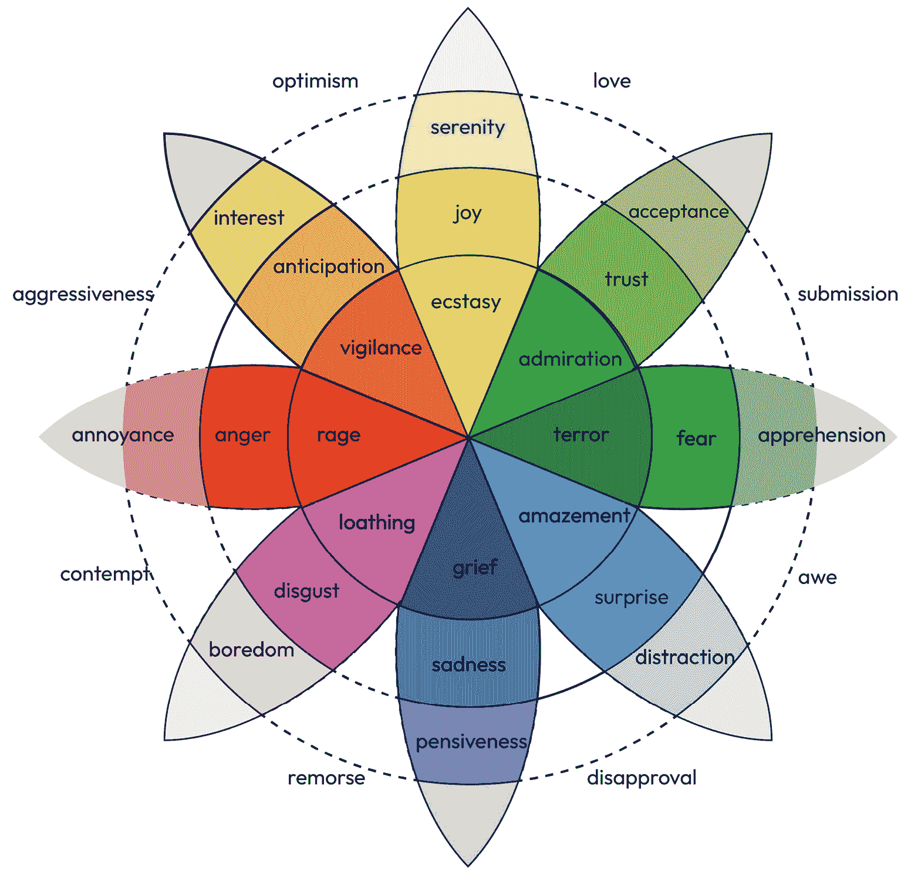
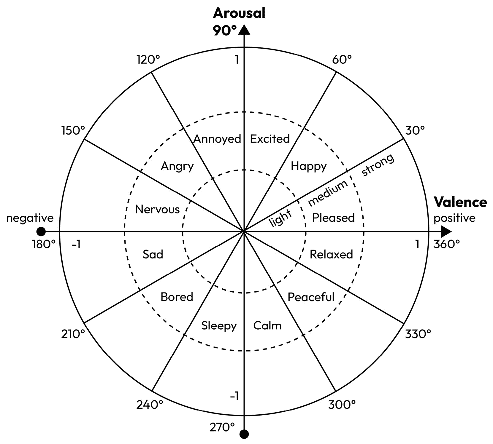
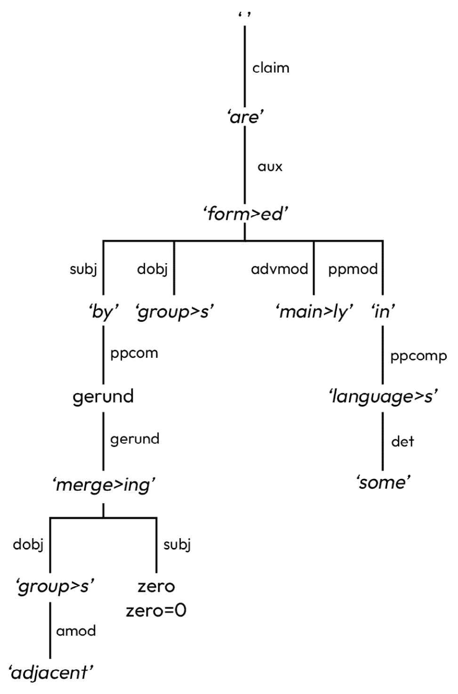
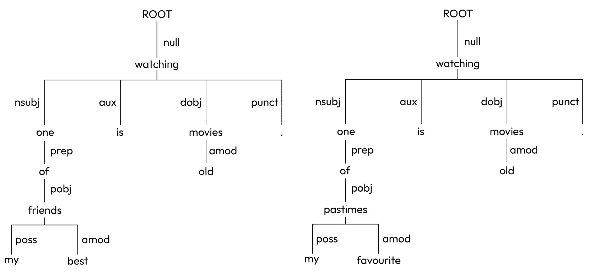
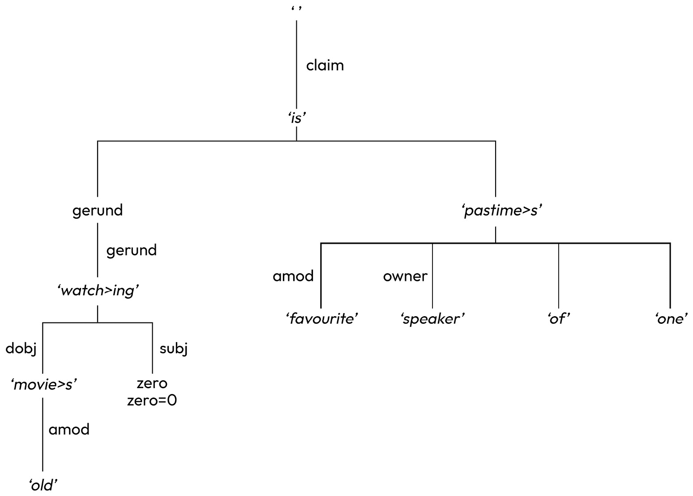
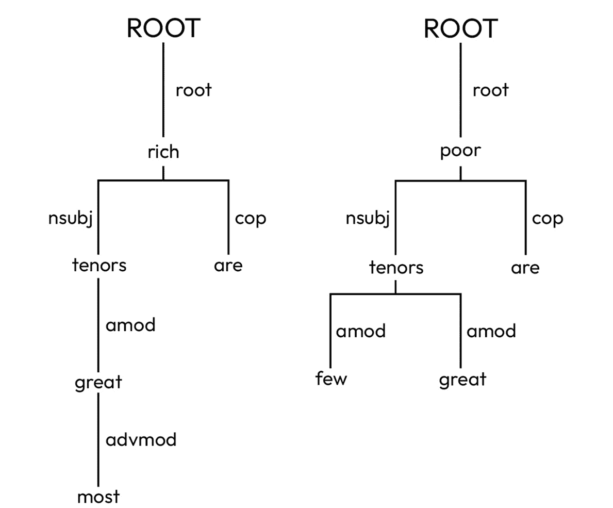
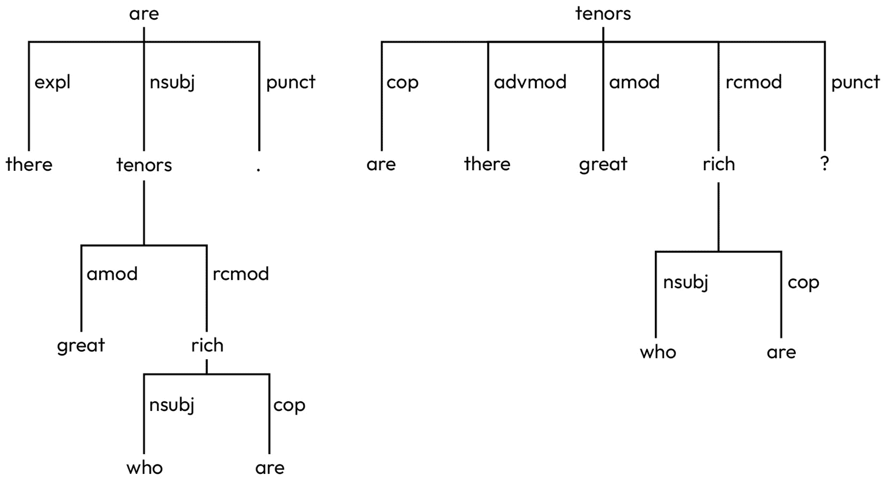
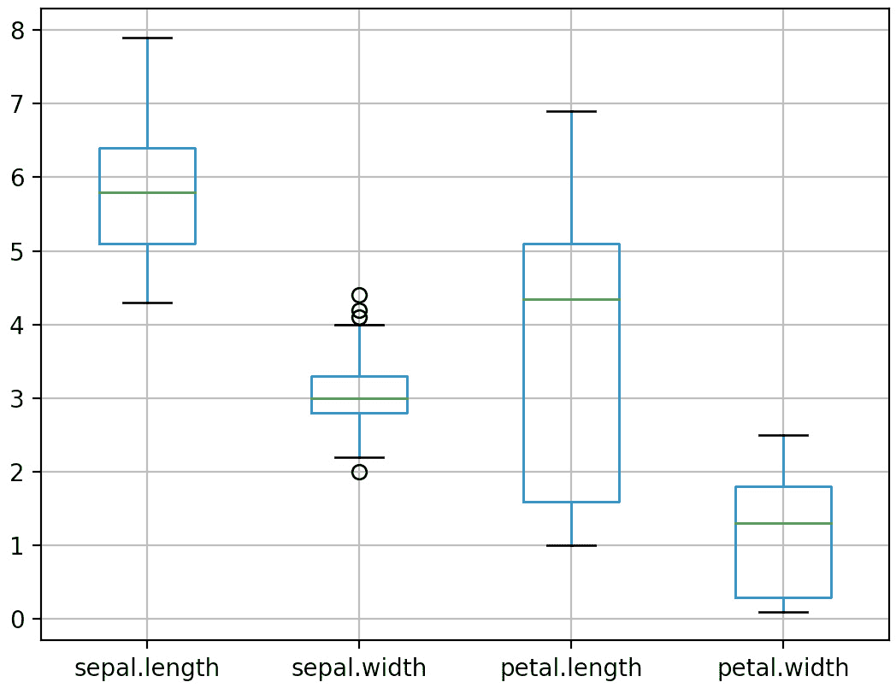
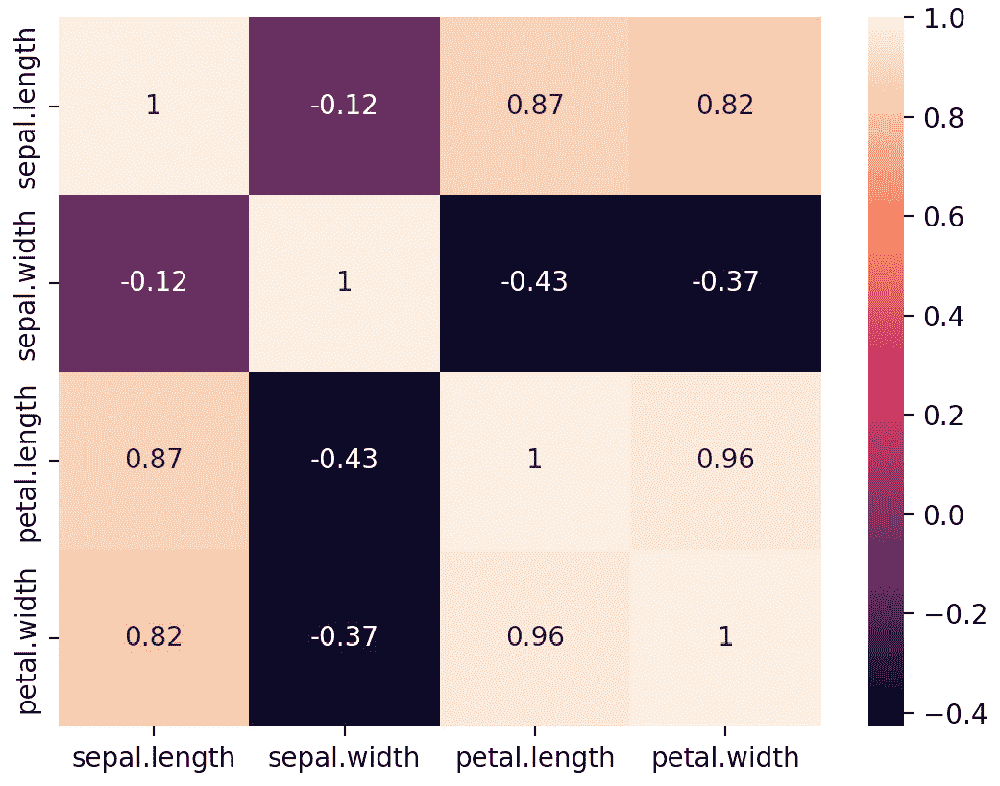

# 第一章：基础

**情绪**在我们的日常生活中起着关键作用。有些人将它们定义为人类对事件或情况的反应，有些人简单地描述它们为一种情感类别，而有些人说它们描述生理状态，并且是无意识地产生的。心理学家将情绪描述为“*一种复杂的情感状态，导致身体和心理变化，从而影响思维和行为。*”因此，尽管我们感受到情绪，但它们很难描述。

我们的大脑在创造和处理情绪时起着至关重要的作用。历史上，人们认为每种情绪都位于大脑的特定部分。然而，研究表明，没有单一的大脑区域负责处理情绪——当处理情绪时，多个大脑区域会被激活。此外，大脑的不同部分可以产生相同的情绪，不同的部分也可以有助于产生情绪。

事实上，*情绪*和*情感*可能是由于生物、认知和社会方面的综合影响而产生的体验。无论情况如何，情绪都很重要，因为它们帮助我们决定采取什么行动，如何谈判复杂的情况，以及在基本层面上如何生存。不同的情绪统治着我们的日常生活；例如，我们根据我们是快乐、愤怒还是悲伤来做出决定，我们根据它们促进的情绪选择我们的日常娱乐和例行公事。因此，情绪很重要，理解它们可能会让我们的生活变得更简单。

在本章中，你将了解情感分析和情感分析之间的主要概念和区别，并了解为什么情感分析在现代世界中很重要。通过结合对**自然语言处理**（**NLP**）和机器学习的基本介绍，我们将为成功使用这些技术进行情感分析奠定基础。

在本章中，我们将涵盖以下主题：

+   情绪

+   情感

+   为什么情感分析很重要？

+   自然语言处理简介

+   机器学习简介

# 情绪

这本书是关于编写能够检测文本中表达的情绪的程序，尤其是非正式文本。情绪在我们的日常生活中起着至关重要的作用。它们影响我们的感受、我们的思考和我们的行为。因此，可以合理地认为它们会影响我们的决策。如果情况是这样的话，那么能够从书面文本（例如社交媒体帖子）中检测情绪是有用的，因为它将对许多实际日常应用产生巨大影响，这些应用领域包括营销、工业、健康和安全。

然而，虽然很清楚我们都会体验到情绪，并且它们在我们的计划和行动中起着重要作用，但它们究竟是什么却并不那么清楚。鉴于我们即将开始详细研究如何编写程序来检测它们，也许首先调查一下情绪是什么的概念，并看看试图将它们固定下来的各种理论是值得的。这是一个从古代到现代一直吸引着哲学家和心理学家的主题，而且至今仍未有定论。我们将简要地看看一些最突出的理论和方法。这个概述不会引导我们得出一个明确的观点，但在我们开始尝试在书面文本中识别它们之前，我们至少应该意识到人们在固定它们时仍然存在的问题。

达尔文认为，情绪使人类和动物能够生存和繁衍。他论证说，情绪是进化的，具有适应性，所有人类，甚至其他动物，都通过类似的行为表达情绪。他相信情绪有一个可以跨越文化和物种追溯的进化历史。今天，心理学家们一致认为，恐惧、惊讶、厌恶、快乐和悲伤等情绪可以被视为普遍存在的，无论文化如何。

詹姆斯-兰格理论提出，情绪的产生是由我们的生理反应所负责的。例如，如果有人从灌木丛后突然跳出来吓你，你的心率会增加，正是这种增加导致了个体感到恐惧。面部反馈理论在此基础上进一步提出，身体活动是影响情绪的原因，例如，如果你微笑，你可能会自动感到比不微笑时更快乐。然而，坎农-巴德理论反驳了詹姆斯-兰格理论，反而提出人们同时体验到情绪和生理反应。沙赫特-辛格理论是一种情绪的认知理论，它认为情绪的产生是由我们的思想所负责的，同样，认知评估理论也提出，思考必须先于体验情绪。例如，大脑可能将某种情况理解为威胁，因此产生了恐惧感。

为了尝试更深入地理解情绪，让我们来看看情绪的三个主要理论：

+   **生理学**：心理学家认为，情绪是在生理反应被刺激触发时形成的，因此，当个体经历生理变化时，这也被体验为情绪。

+   **神经学**：生物学家声称，由身体腺体产生的激素（例如，雌激素、孕酮和睾酮）会影响大脑的化学和电路，这些影响导致了情绪反应。

+   **认知**：认知科学家认为，思想和其他心理活动在形成情绪中起着至关重要的作用。

很可能，这三个理论在某种程度上都是有效的。也有人提出，与其将这些理论视为相互排斥的，不如认为它们更可能是互补的，并且每个理论都解释和说明了我们认为是情感的不同方面。

尽管情感已经研究了几十年，但很可能我们仍然没有完全理解情感。

人类可以体验到大量的情感，但只有少数被认为是基本的。然而，在情感分析研究中考虑的情感数量并不总是仅限于这些基本情感。此外，区分情感并不简单，因此边界很少被明确界定。

我们现在将考虑所谓的*基本情感*。这些情感被描述为对事件或情况的反应，或者当某事发生时立即强烈的第一反应。在识别这些基本情感方面已经进行了大量研究，但仍然没有达成普遍共识，杰出的研究人员如 Ekman、Plutchik 和 Parrot 提出了不同的模型。一些情感，如愤怒、恐惧、快乐和惊讶，是普遍认可的。然而，对于其他情感，关于构成基本情感的情感和这些情感的数量存在分歧。尽管再次没有关于哪个模型最适合涵盖基本情感的共识，但 Ekman 和 Plutchik 提出的模型最常被使用。有两种流行的方法：**类别**和**维度**。

## 类别

Ekman 是类别理论的倡导者，该理论认为情感源于不同的神经网络系统。这种方法还表明，存在有限数量的基本、独特的情感，如愤怒、焦虑、快乐和悲伤。Ekman 提出，基本情感必须具有在所有文化中都能识别的独特面部表情。例如，嘴唇角向下弯曲表示悲伤——这种面部表情被普遍认为是描绘悲伤的。同样，露出牙齿微笑，嘴角向上，被普遍认为是快乐。

令人惊讶的是，从出生就失明的人表达悲伤和快乐时使用相同的面部表情。他们从未见过这些表情，因此这些表情不可能被学习。更有可能的是，这些是人性的一部分。利用对独特、普遍面部表情的理解，Ekman 提出了六种基本情感（Ekman，1993）：

+   愤怒

+   厌恶

+   恐惧

+   快乐

+   悲伤

+   惊讶

艾克曼认为这些*基本*情绪在生物学上是原始的，并且已经进化以增加动物的繁殖适应性，而且所有其他情绪都是这八种基本情绪的组合。后来，艾克曼扩大了这个列表，包括他认为的基本情绪，如尴尬、兴奋、轻蔑、羞愧、自豪、满意和娱乐。

在情绪领域最具影响力的另一项工作是普鲁奇克的情绪心理进化理论。普鲁奇克提出了八种基本情绪（普鲁奇克，2001 年）：

+   愤怒

+   期待

+   厌恶

+   恐惧

+   快乐

+   悲伤

+   惊讶

+   信任

从这个理论出发，普鲁奇克发展了一个情绪轮（见图*1**.1*）。这个轮子是为了帮助理解情绪的细微差别以及情绪如何对比而开发的。它有八个区域代表八种情绪。情绪随着它们从轮子的外围向中心移动而增强。例如，烦恼增加到愤怒，然后进一步增加到彻底的愤怒。圆圈的每个区域都有一个直接相对的相反情绪，位于轮子的直接对面。例如，悲伤的对立面是快乐，愤怒的对立面是恐惧。它还显示了不同情绪如何结合。



图 1.1 – 普鲁奇克情绪轮

虽然艾克曼和普鲁奇克的理论是最常见的，但还有其他作品，但对于基本情绪是什么并没有达成共识。然而，在情绪分析研究领域，艾克曼和普鲁奇克的模型是最常用的分类方案。

## 维度

维度方法认为，为了理解情绪体验，情绪的基本维度（情绪的*好坏*）和唤醒（情绪的*强度*）是至关重要的。这种方法表明，一个共同的、相互关联的神经生理系统负责所有情感状态。每个情绪都可以用这两个指标来定义，因此平面可以被视为一个连续的两维空间，其维度为情绪的好坏和唤醒，空间中的每个点都对应一个单独的情绪状态。



图 1.2 – 拉塞尔的环状模型

最常见的维度模型是拉塞尔的环状模型（拉塞尔，1980 年：见图*1**.2*）。该模型认为，情绪由两个核心维度组成：情绪的好坏和唤醒。*图 1**.2*显示，情绪的好坏范围从-1（不愉快）到 1（愉快），唤醒也范围从-1（平静）到 1（兴奋）。然后每个情绪都是这两个维度的线性组合。例如，愤怒是一种不愉快的情绪状态（负面的情绪好坏）具有高强度（正面的唤醒）。其他基本情绪可以在*图 1**.2*中看到，它们在二维空间中的大致位置。

一些情感具有相似的唤醒和效价（例如，悲伤和愤怒）。因此，还提出了第三个维度（控制），可以用来区分这些情感。控制范围从*无控制*到*完全控制*。因此，使用这三个维度，整个人类情感的整个范围都可以表示为三维空间中的一组点。

维度模型在情感分辨率上较差；也就是说，区分模糊情感更困难。分类模型更容易理解，但有些情感并不属于基本情感集合。

大多数情感分析研究都采用分类视角；似乎缺乏使用维度方法的研究。

# 情感

还有一个与之密切相关的术语，称为**情感**。情感和情绪这两个术语似乎是以一种临时的方式使用的，不同的作者几乎可以互换使用。鉴于我们在确定情感是什么以及确切有多少情感方面遇到的困难，再加上另一个定义不明确的术语并不完全有帮助。为了尝试澄清情况，请注意，当人们从事情感挖掘时，他们通常使用一个简单、有限的分类系统，包括*积极*、*消极*和*中性*案例。这是一个更简单的方案，更容易处理和确认，并且产生的结果也更容易理解。在某种程度上，情感分析可能被视为对情感分析的*升级*；一个更复杂的解决方案，它分析的内容远不止简单的积极和消极标记，而是试图确定特定的情感（愤怒、快乐、悲伤）。这可能更有用，但也需要更多的努力、时间和成本。因此，情感和情绪不是同一个概念。情感是一种复杂的心理状态，而情绪是通过情感的存在而产生的心理态度。

对于我们来说，情感仅指表达出的正面、负面或中性的观点。在这里有一些重叠，因为例如快乐和爱都可以被视为积极的情感。可能这些术语只是具有不同的粒度——就像狂喜、快乐和满足提供了对单一通用情感类别（我们可能称之为快乐）的精细分类一样，快乐和爱是对积极感受这一普遍概念的精细分类。或者，情感可能是维度模型中的一个轴的名称——例如，在拉塞尔的分析中的效价轴。鉴于情感理论的多样性，似乎最好的做法是避免为几乎相同的事物使用另一个术语。在这本书中，我们将坚持使用“情感”这个术语；我们将采取完全实用主义的方法，接受来自现有理论（如普拉奇克或拉塞尔的理论）的一些标签，作为表示情感的标志，而不太关心它们究竟代表什么。我们都可以同意，“*我恨那些做那种事的人，我希望他们都死了*”表达了仇恨和愤怒，而且整体上是负面的，即使我们不确定仇恨和愤怒是什么，或者从负面到正面的尺度实际上衡量的是什么。

现在我们对情感有了更多的了解，知道了它是如何被分类和理解的，因此理解情感分析为何是一个重要的话题是至关重要的。

# 情感分析为何重要

来自社交媒体和博客等在线来源的每日数据量令人震惊。2019 年，《福布斯》估计这一数字约为 2.5 千兆字节的数据，尽管现在这个数字可能更高。

更有可能的是现在这个数字甚至更高。因此，许多研究都集中在利用这些数据进行分析，以及获得迄今为止未知的新见解（例如，使用 Twitter（现称为“X”）数据预测流感趋势和疾病爆发）。

同样，人们也越来越倾向于在网上表达自己的观点——其中许多观点，无论是明确还是隐晦，都充满了强烈的情感（例如，*我爱夏天*）。如今，像 Facebook、LinkedIn 和 Twitter 这样的社交网络平台已经成为我们所有活动的中心。Twitter 是最受欢迎的社交网络平台之一，每月有超过 3 亿用户活跃使用 Twitter。来自各行各业的人们都在使用 Twitter；名人、电影明星、政治家、体育明星以及普通人。用户发布简短的消息，称为**推文**，每天数百万的人分享他们对自身、新闻、体育、电影和其他主题的看法。因此，这使得像 Twitter 这样的平台成为了公众舆论挖掘和情感分析的数据宝库。

正如我们所看到的，情感在人类智能、决策、社会互动、感知、记忆、学习、创造力以及更多方面发挥着重要作用。

情感分析是通过文本（例如，社交媒体帖子）识别表达出的情绪的过程。这是一个复杂的工作，因为用户生成的内容，如推文，通常被理解为如下：

+   用自然语言书写

+   通常是非结构化、非正式和拼错的

+   可以包含俚语和虚构的单词

+   可以包含表情符号和表情符号，它们的用法并不总是与其原始创建的原因相对应（例如，使用披萨表情符号来表达爱）

此外，完全有可能在不使用任何明显的情感标记的情况下表达情感。

情感分析中尚未解决的重大问题之一是检测诸如期待、悲观和讽刺等情绪。考虑以下推文：

*我们* *又输了*。太棒了。

我们人类在深入挖掘隐含的真实意义方面相当有知识，会理解用户是在讽刺。我们知道一支球队再次输球不是好事。因此，通过利用这种理解，我们可以轻松地识别隐含的意义。

问题在于，仅仅考虑具有情感色彩的每个单词而孤立地看待它们，并不能做好这项工作。相反，必须应用进一步的规则来理解单词的上下文。这些规则将帮助分析者区分可能包含相似单词但意义完全不同的句子。然而，即使有了这些规则，分析者仍然会犯错误。

社交媒体现在被视为一项宝贵的资源，因此组织对社交媒体监控的兴趣日益增加，以分析来自社交媒体的大量、自由形式的简短、用户生成文本。

媒体网站。利用这些网站可以让组织深入了解客户对其产品和服务意见、担忧和需求。

由于其实时性，政府也对使用社交媒体来识别威胁、监控和分析对当前事件的公众反应感兴趣。

情感分析有许多有趣的应用：

+   可口可乐的`#ShareACoke`，奥迪的`#WantAnR8`，以及维珍媒体的`#BeTheFastest`。

+   **股市**：学者们试图利用推特来预测金融市场趋势。2013 年，美联社的推特账号发布了一条（虚假的）推文，称白宫发生了爆炸，奥巴马受伤。该帖子很快就被辟谣了，但股市仍然暴跌，导致数百亿美元易手。

+   **社会科学研究**：数百万的人通过发推文与世界互动，提供了关于他们的感受、行为、日常习惯、情绪和行为的有价值见解。如此大量的公共沟通可以用来预测各种类型的事件。例如，对社交媒体的大规模数据分析表明，不仅脱欧支持者有一个更有力、更具情感的信息，他们在社交媒体的使用上也非常有效。他们通常在几乎所有社交媒体平台上都压倒了对手，拥有更多声音和活跃的支持者。这导致了更多脱欧支持者的激活，并使他们能够主导社交媒体平台——从而影响了许多未决定投票的选民。

理解情感对于组织来说也很重要，以便深入了解公众对其产品和服务的态度。然而，自动化这一过程也很重要，以便能够实时做出决策并采取行动。例如，分析技术可以自动分析和处理关于特定产品的数千条评论，并提取出显示消费者是否对产品或服务满意的见解。这可能包括情感或情绪，尽管由于它更细致，情感可能更有用。

研究表明，不满意的用户发布的推文比其他类型的推文更频繁地被分享，传播得更快、更广。因此，组织必须提供超越传统电话线末端的客服。因此，许多组织今天也提供基于社交媒体的客户支持，试图阻止负面评论并留下好印象。如今，消费者选择如此之多，客户转向竞争对手变得如此容易，因此，组织保留并增加其客户群至关重要。因此，组织对负面帖子的反应越快，他们获得的机会就越好。

保留客户的重要性。此外，没有比口碑更好的广告了——比如由满意的客户产生的口碑。情感分析是快速分析数百条推文、找出客户不满意的推文，并利用这些信息来推动其他试图在客户变得过于不高兴并决定将业务转移到其他地方之前解决问题的流程的一种方法。情感分析不仅需要数据——它还会生成大量数据。这些数据可以进一步分析，例如，确定用户愿望清单上的顶级项目，或者确定用户的主要抱怨。这些信息可以用来推动产品或服务的下一迭代或版本。

尽管情感分析和情绪分析并非相互排斥，并且可以结合使用，但普遍观点认为，情感分析不足以对像情感这样复杂、多层次、细微的事物进行分类。简单地将整个情感范围视为只有积极、消极或中性，存在很大的风险，可能会错过更深层次的洞察和理解。

情绪分析也提供了更深入的洞察。理解为什么有人忽略或喜欢某个帖子，需要的不仅仅是情感分数。此外，获得*可操作的*洞察也需要不仅仅是情感分数。

情绪分析是自然语言处理的一个子领域，因此，更好地理解这一点是有意义的。

# 自然语言处理（NLP）简介

情感挖掘是关于寻找自然语言文本中表达的情感——通常是相当简短的文本，如推文和在线评论，但也包括更长的内容，如报纸文章。还有许多其他方法可以让计算机对自然语言文本和口语进行有用的处理：你可以编写可以进行对话的程序（与人们或彼此对话），你可以编写从文章和故事中提取事实和事件的程序，你可以编写从一种语言翻译到另一种语言的程序，等等。这些应用都共享一些基本的概念和技术，但它们各自更侧重于某些主题，而较少关注其他主题。在*第四章*“预处理——词干提取、词性标注和解析”中，我们将探讨情感挖掘中最重要的事情，但在这里我们将简要概述自然语言处理的主要原则。正如所提到的，这里概述的所有阶段并非每个应用都需要，但考虑后续的具体子任务时，了解一切如何相互关联仍然是有用的。

我们将从几个基本观察开始：

+   自然语言是*线性的*。语言的基本形式是口语，它必然是线性的。你发出一个声音，然后发出另一个，再然后是另一个。你在发出每个声音的方式上可能会有一些变化——声音可能更响或更轻，音调可能更高或更低，速度可能更快或更慢——这些变化可能被用来在基本信息上叠加额外的信息，但本质上，口语是由一系列可识别的单位组成的序列，即声音；而书面语言只是口语的表示方式，它也必须由一系列可识别的单位组成。

+   自然语言是分层的。较小的单位被组合成较大的单位，这些较大的单位又被组合成更大的单位，如此类推。以句子“较小的单位被组合成较大的单位”为例。在英语的书面形式中，例如，最小的单位是字符；这些字符被组合成语素（有意义的词部分），正如较小的单位被组合成较大的单位一样，这些较大的单位又被组合成单词（较小的单位被组合成较大的单位），这些单词又被组合成基础级别的短语（[较小的单位] [被组合] [成] [较大的单位]），这些短语又被组合成更高级别的短语（[[较小的单位] [[被组合] [[成] [较大的单位]]]]）。

这两个特性适用于所有自然语言。所有自然语言在书写之前都是被说出来的（一些广泛使用的语言没有普遍接受的书写形式！），因此它们在本质上都是线性的。但它们都表达复杂的分层关系，因此要理解它们，你必须能够找到较小的单位组合成较大的单位的方式。

底层单位是什么样的，以及它们是如何组合的，因语言而异。一种语言的声音是通过移动你的发音器官（舌头、牙齿、嘴唇、声带以及各种其他东西）并试图从肺部排出空气来产生的。通过紧闭然后张开嘴唇并紧张声带得到的音（如在英语单词 *bat* 中的 /b/）与通过放松声带并做同样的事情得到的音（如在 *pat* 中的 /p/）是不同的。不同的语言使用不同的组合——阿拉伯语不使用 /p/，而英语不使用通过关闭声带包含室的出口得到的音（一个**喉塞音**）：在特定语言中使用的组合被称为该语言的**音素**。不使用特定组合的语言使用者发现很难区分使用该组合的单词和非常相似的组合的单词，而且当他们学习使用该组合的语言时，很难产生那个组合。

更糟糕的是，口语和书面语中底层单位之间的关系在不同的语言中可能会有所不同。一种语言的音素可以用该语言的书面形式以多种多样的方式来表示。书面形式可能会使用**图形符号**，这些是构成形状的笔画和标记的组合方式（因此，AAAAAA 都是由两条几乎垂直的、或多或少直的线条组成，顶部相连，中间大约一半的位置有一个横杠），就像音素是构成声音的组合方式一样；一个音素可能由一个图形符号表示（来自 *pat* 的短元音 /a/ 在英语中由字符 *a* 表示）或者由多个图形符号的组合表示（来自 *should* 的声音 /sh/ 由一对图形符号 *s* 和 *h* 表示）；一个声音在书面形式中可能没有表示（阿拉伯文本省略了短元音和一些音素之间的其他区别）；或者书面形式和发音之间可能根本没有任何联系（书面汉语、日语的汉字符号）。鉴于我们将主要关注文本，我们至少可以部分地忽略书面语和口语之间关系的多样性，但我们仍然需要意识到，不同的语言以完全不同的方式组合书面形式的基本元素来构成单词。

因此，语言的底层单位要么是可以识别的声音，要么是可以识别的标记。这些被组合成带有意义的组群——**词素**。一个词素可以承载相当多的意义；例如，“cat”（由词素“c”、“a”和“t”组成）表示一种长着尖耳朵和难以捉摸的生活态度的小型哺乳动物，而“s”只是表示你考虑的这类物品不止一个，所以“cats”表示一群有几个长着尖耳朵和世界观的哺乳动物。第一种类型的词素有时被称为**词素**，一个词素可以与一个或多个其他词素结合来表达一个概念（因此，法语词素“noir”（黑色）可以与“e”（阴性）和“s”（复数）结合形成“noires”——几个黑色的女性事物）。向词素添加信息的词素，如涉及的事物数量或事件发生的时间，被称为**屈折词素**，而那些根本改变其意义的词素（例如，一个问题的**不完整**解决方案不是完整的）被称为**派生词素**，因为它们从原始词素中派生出一个新概念。再次强调，大多数语言都使用屈折词素和派生词素来丰富基本的词素集，但具体如何操作因语言而异。我们将在*第五章*，“情感词库和向量空间模型”中详细回顾这一点，因为当我们试图将情感分配给文本时，找到核心词素可能是重要的。

一个词素加上一个合适的词素集通常被称为**词**。词通常被分组成更大的树状结构，它们分组的方式承载了文本传达的大部分信息。例如，在句子“John believes that Mary expects Peter to marry Susan”中，“Peter to marry Susan”是一个描述特定事件的组群，“Mary expects [Peter to marry Susan]”是一个描述玛丽对此事件态度的组群，而“John believes [that Mary expected [Peter to marry Susan]]”是一个描述约翰对玛丽期望看法的组群。

再次强调，不同的语言以不同的方式执行这种分组，针对特定情况分析分组的方法有很多。这不是对所有曾经提出的分析词语分组方式的语法理论（**解析器**）或所有曾经提出的将这些理论应用于特定情况的算法的综述之处，但有一些一般的观察值得提出。

## 短语结构语法与依存语法

在某些语言中，组群主要是通过合并相邻的组群形成的。例如，如果我们这样分组，上一句话就可以进行分析：

*在某些语言中组主要由合并* *相邻组*

*在某些语言中*np *组是主要由合并[**相邻组**]np

*[在某些语言中]*pp *组主要由[通过[合并[**相邻组]]]]*vp

*[在某些语言中]*pp *组主要由[通过[合并[**相邻组]]]]*pp

*[在某些语言中]*pp *组主要由[通过[合并[**相邻组]]]]*vp

*[在某些语言中]*pp *组是[主要[通过[合并[**相邻组]]]]]*vp

*[在某些语言中]*pp *组[是[主要[通过[合并[**相邻组]]]]]*vp

*[在某些语言中]*pp *[组[是[主要[通过[合并[**相邻组]]]]]]]*s

*[[在某些语言中][组[是[主要[通过[合并[**相邻组]]]]]]]*s

这种方法对于词序基本固定的语言来说往往效果很好——没有语言有完全固定的词序（例如，前面的句子可以改写为“在某些语言中，组主要由相邻组合并形成”，意义变化很小），但有些语言的自由度比其他语言更大。对于像英语这样的语言，从相邻短语的角度分析词语之间的关系，例如使用**短语结构语法**，效果相当好。

对于允许词语和短语相对自由移动的语言，记录词语之间的成对关系可能更方便。以下树形图使用**依存语法**——即，为每个词语（除了句号，我们将其视为树的根）分配一个父词来描述相同的句子：



图 1.3 – 使用基于规则的依存句法分析“在某些语言中，组主要由相邻组合并形成”

语法结构短语和依存语法有许多变体。粗略地说，依存语法为处理词语可以非常自由移动的语言提供了一种更简单的处理方法，而短语结构语法则使得处理诸如前例中“合并”的主语等“不可见”项目变得更容易。这两种语法之间的区别，在任何情况下，都不如前图所显示的那么清晰：一个依存树可以很容易地转换成一个短语结构树，通过将每个子树视为一个短语，而如果你能指定短语中的哪个项目是它的**中心词**——例如，在前面的短语结构树中，标记为**nn**的组中心词是名词，标记为**np**的组中心词是**nn**的中心词。

## 基于规则的解析器与数据驱动解析器

除了有一个描述文本结构的理论外，你还需要一个程序将这个理论应用到特定的文本上——一个**解析器**。开发解析器有两种方法：

+   **基于规则**：你可以尝试制定一套规则来描述特定语言的工作方式（一种**语法**），然后实现一个程序，尝试将这些规则应用到你想分析的文本上。制定这样的规则是困难的且耗时，而试图应用这些规则的程序往往运行缓慢，如果目标文本不遵循这些规则，则可能会失败。

+   **数据驱动**：你可以以某种方式产生大量文本的分析集（一个**树库**），然后实现一个程序，从这些分析中提取模式。制作树库是困难的且耗时——你需要数十万个例子，并且所有的树都必须一致性地标注，这意味着如果由人来完成，那么他们必须得到涵盖他们将会看到的每一个例子的统一指南（这在实际上是一种语法）（如果没有人来完成，那么你必须已经有一个自动化的方法来做这件事，即解析器！）。

这两种方法都有优点和缺点：在考虑是否使用依存语法或短语结构语法，以及考虑是否遵循基于规则的方法或数据驱动的方法时，有几个标准需要考虑。由于**没有**现有系统优化所有这些，你应该考虑哪些对你的应用最重要，然后决定走哪条路：

+   **速度**：首先需要考虑的是解析器的运行速度。一些解析器在遇到长句时可能会变得非常慢。基于规则的标准的**图表解析**算法的复杂度最坏情况下是 O(N³)，其中*N*是句子的长度，这意味着对于长句，算法可能需要非常长的时间。有些其他算法的复杂度比这要好得多（例如，MALT（Nivre 等，2006）和 MST（McDonald 等，2005）解析器，它们的复杂度与句子的长度成线性关系），而有些则更差。如果两个解析器在其他所有标准上都是一样的，那么更快的那个将被优先考虑，但也会有一些情况，其中一个（或多个）其他标准更为重要。

+   **鲁棒性**：一些解析器，尤其是基于规则的解析器，可能无法对某些句子产生任何分析。如果输入是不合语法的，这将会发生，但如果规则不是对语言的完整描述，也会发生。无法产生完全合语法输入句子分析的解析器比能够分析目标语言中每个合语法句子的解析器更不有用。对于任何输入句子都进行某些操作的分析器是否比拒绝一些不合语法句子的分析器更有用，这一点并不明确。在某些应用中，检测不合语法性是任务的关键部分（例如，在语言学习程序中），但在任何情况下，将分析分配给不合语法句子既不能是正确的，也不能是错误的，因此任何利用这种分析的程序都不能确定它在做正确的事情。

+   **准确性**：将正确分析分配给每个输入文本的解析器通常比没有这样做更有用。当然，这提出了一个问题，即如何决定正确的分析是什么。对于数据驱动解析器，不可能说出树库中未出现的句子的正确分析。对于基于规则的解析器，任何返回的分析都将符合规则，因此是正确的。所以，如果一个分析看起来很奇怪，你必须找出规则是如何导致它的，并相应地修改它们。

在准确性和鲁棒性之间存在权衡。在复杂情况下无法返回任何分析的解析器，其错误分析的数量将少于试图以某种方式解释每个输入文本的解析器：简单地拒绝一些句子的解析器将具有较低的召回率，但可能具有更高的精确率，这可能是好事。拥有一个系统说“抱歉，我没有完全理解你刚才说的话”可能比基于错误解释继续执行的系统要好。 

+   **敏感性和一致性**：有些句子表面上看起来相似，但具有不同的深层结构。考虑以下例子：

    1.  a) 我想去看女王 b) 我去看了女王

1(a) 是对“你想要什么？”的回答，而 2(b) 是对“你为什么去？”的回答。如果分配给这两个句子的结构没有反映“去看女王”的不同角色，那么将无法做出这种区分：


图 1.4 – 来自斯坦福依存句法分析器的 1(a) 和 1(b) 的树形图（Dozat 等人，2017）

1.  a) 我最好的朋友之一正在看老电影 b) 我最喜欢的消遣之一是看老电影



图 1.5 – 来自斯坦福依存句法分析器的 2(a) 和 2(b) 的树形图

**斯坦福依存句法分析器**（**SDP**）的树形图都表明主语（*One of my best friends*，*One of my favorite pastimes*）正在执行看老电影的动作——它正坐在最舒适的扶手椅上，窗帘拉上，电视打开。第一个例子是有意义的，但第二个例子则不然：消遣不会看老电影。我们需要的是一个等式分析，表明*One of my favorite pastimes*和*watching old movies*是同一件事，就像*Figure 1**.6*中所示：



Figure 1.6 – “我最喜欢的消遣之一是看老电影”的等式分析

发现 2(b)需要这种分析，即我最喜欢的消遣是*be*的等式用法中的谓语，而不是看老电影事件的执行者，需要比通常在树库中体现的更多关于这些词的细节。

也可能发生看似表面不同的句子具有非常相似的基本结构：

1.  a) 很少有伟大的男高音是贫穷的 b) 大多数伟大的男高音是富有的

这次，SDP 为两个句子分配了相当不同的结构：



Figure 1.7 – SDP 中的 3(a)和 3(b)的树形图

对 3(a)的分析将*most*视为*great*的修饰语，而 3(b)的分析将*few*视为*tenors*的修饰语。*Most*确实可以用来修饰形容词，例如*He is the most annoying person I know*，但在 3(a)中，它更像是一个限定词的作用，就像 3(b)中的*few*一样。

1.  a) 有一些富有的男高音 b) 有富有的男高音吗？

很明显，4(a)和 4(b)应该有几乎相同的分析——4(b)只是将 4(a)转换成一个问题。同样，这也可能给基于树库的解析器带来问题：



Figure 1.8 – MALTParser 中的 4(a)和 4(b)的树形图

对于 4(a)的*Figure 1**.8*分析，将*are*视为树的主体，与*there*、*great tenors who are rich*以及作为女儿的成分，而 4(b)将*tenors*作为其主体，以及*are*、*there*、*great*、*who are rich*和*?*作为女儿成分。在这些分析的基础上，很难看出 4(a)是 4(b)的答案！

基于树库的解析器经常无法处理这里给出的例子提出的问题。问题在于，它们训练所用的树库往往不包含关于其中出现的词的详细信息——*went*是不及物动词，*want*需要一个句子补语，朋友是人类，因此可以在看电影时观看老电影，而消遣是事件，因此可以与观看某物的活动等同起来，或者*most*可以用在多种方式中。

并不能说所有基于树库的解析器都存在这些问题，但其中一些非常广泛使用的解析器（如 SDP、与 NLTK 一起分发的 MALT 版本、EasyCCG 解析器（Lewis & Steedman, 2014）、spaCy（Kitaev & Klein, 2018））确实存在。其中一些问题相当普遍（如无法区分 1(a)和 1(b)），而有些问题则是因为树库或解析算法的特定属性而产生的。大多数用于 MALT 和 SPACY 等解析器的预训练模型都是在著名的华尔街日报语料库上训练的，由于这个树库无法区分 1(a)和 1(b)这样的句子，因此在其上训练的解析器也无法做到这一点。之前列出的所有解析器都将 3(a)和 3(b)分配给不同的结构，这可能既可能是树库的特性，也可能是训练算法的某些属性。值得评估任何此类解析器的输出，以检查它是否确实为像 1(a)和 1(b)这样的明显情况提供了不同的分析，并且是否为像 4(a)和 4(b)这样的明显情况提供了并行分析。

因此，在选择解析器时，你必须权衡一系列因素。你是否关心它有时会犯错误？你是否希望它为具有不同底层表示的文本分配不同的树（这并不完全等同于准确性，因为可能发生的情况是解析器产生的结果并不错误，只是没有包含你需要的所有信息，就像 1(a)和 1(b)那样）？你是否希望它总是为文本生成树，即使对于不符合正常语言任何规则的文本（它应该为*#anxious don’t know why ................. #worry* 😶 *slowly going #mad hahahahahahahahaha*)生成解析吗？解析某些句子需要 10 秒或 20 秒是否重要？无论你做什么，*不要相信任何人关于解析器的说法*：自己尝试，在你打算使用它的数据上尝试，并检查其输出是否符合你的需求。

## 语义学（对意义的研究）

正如我们所见，寻找单词、将它们分配到类别中，并找出它们之间的关系是非常困难的。除非你有一个打算使用它的应用，否则做这项工作是没有意义的。关键在于，单词的选择以及它们之间的关系是语言能够传达信息、具有意义的原因。这就是为什么语言很重要的原因；因为它能够传达信息。几乎所有的自然语言处理应用程序都关注输入文本所携带的信息，因此几乎所有这样的程序都必须识别出存在的单词以及它们的排列方式。

研究语言如何编码信息的研究被称为语义学。正如刚才提到的，信息是通过现存的词语（**词汇语义学**）以及它们的排列方式（**组合语义学**）来编码的。它们都很关键：如果你不知道 *loves* 和 *hates* 的意思，你就无法理解 *John loves Mary* 和 *John hates Mary* 之间的区别，而且如果你不知道动词的主语或宾语如何编码 *John* 和 *Mary* 所指的事物与 *loves* 所指的事件之间的关系，你就无法理解 *John loves Mary* 和 *Mary loves John* 之间的区别。

语义学理论的关键测试是进行自然语言文本集合之间的推理的能力。如果你不能在 1–7 中进行推理（其中 P1, …, Pn |- Q 表示 Q 可以从前提 P1, …, Pn 中推断出来），那么你不能说理解英语：

1.  约翰讨厌玛丽 |- 约翰不喜欢玛丽

1.  (a) 约翰和玛丽离婚了 |- 约翰和玛丽现在没有结婚

1.  (b) 约翰和玛丽离婚了 |- 约翰和玛丽曾经是已婚的

1.  我看到一个鼻子大的人 |- 我看到一个男人

1.  每个女人都不信任约翰，玛丽是一个女人 |- 玛丽不信任约翰

1.  我看到了三个以上的鸽子 |- 我看到了至少四只鸟

1.  我怀疑她没有看到任何人 |- 我不相信她看到一个胖男人

这些是非常简单的推理。如果有人说结论并不从前提中得出，你不得不说是他们没有正确理解英语。它们涉及不同种类的知识——词语之间简单的蕴涵关系（*hates* 蕴涵 *dislikes* (1)）；词语之间更复杂的关系（离婚意味着取消现有的婚姻（2），所以如果约翰和玛丽离婚了，那么他们现在没有结婚，但曾经是）；*一个鼻子大的人* 是一个既是男人又有一个大鼻子的人的事实，以及 *A 和* *B* 蕴涵 *A* (3)；对量词如何工作的理解（(4) 和 (5)）；所有这些的组合（6）——但这些都是任何理解英语的人都会同意的推理。

一些信息可以从语料库中相当直接地提取出来。例如，有很多工作是在计算一对词语之间的相似性，尽管将其扩展到涵盖词语之间的蕴涵关系已经证明更加困难。其中一些使用数据驱动方法很难找到——例如，*more than* 和 *at least* 之间的关系在语料库中很难找到，而 *divorce* 这个词背后的复杂概念也难以从语料库中无监督地提取。

此外，其中一些可以通过使用各种类型的树匹配算法来应用，从简单的算法，仅计算一个树是否是另一个树的子树，到更复杂的算法，这些算法关注极性（*怀疑*会切换匹配算法的方向——*我知道她爱他* |*- 我知道她喜欢他，我怀疑她喜欢他* |- *我怀疑她爱他*）以及量词之间的关系（*这个* |- *一些，多于 N* |- *至少 N-1*）（Alabbas & Ramsay，2013）（MacCartney & Manning，2014）。其中一些需要更复杂的策略，特别是具有多个前提的例子（4），但除了最简单的（例如，仅仅将句子视为一个词袋）之外，都需要准确，或者至少是一致的树。

你需要多少这样的设备取决于你的最终应用。幸运的是，对于情感挖掘，我们可以使用相当浅显的方法来有效地完成，但不应忘记，理解文本远不止于知道单词之间的词汇关系，如相似性或包含关系。

在结束这一章之前，我们将花一些时间学习机器学习，研究各种机器学习模型，然后通过一个使用 Python 的示例项目来实践。

# 机器学习简介

在讨论机器学习之前，正确理解人工智能这个术语是有意义的。广义上讲，人工智能是计算机科学的一个分支，其理念是机器可以被制造得像我们人类一样思考和行动，而不需要明确的编程指令。

人们普遍存在一个误解，认为人工智能是一个*新事物*。这个术语普遍被认为是在 1956 年由数学助理教授约翰·麦卡锡在达特茅斯夏季人工智能研究项目上提出的。我们现在正处于人工智能的繁荣时期——但并非一直如此；人工智能有着一段有些波折的历史。在 1956 年的会议之后，资金大量涌入，研究人员开发了能够下棋和解决数学问题的系统，取得了快速进展。当时乐观情绪高涨，但由于之前关于人工智能的承诺未能实现，因此资金枯竭；这种周期在 1980 年代又重复了一次。我们现在经历的繁荣是由于三个关键技术的及时进步和出现：

+   **大数据**：赋予我们进行人工智能所需的数据量

+   **高速高容量存储设备**：赋予我们存储数据的能力

+   **GPU**：赋予我们处理数据的能力

现在，人工智能无处不在。以下是一些人工智能的例子：

+   聊天机器人（例如，客户服务聊天机器人）

+   亚马逊 Alexa、苹果的 Siri 以及其他智能助手

+   自动驾驶汽车

+   防垃圾邮件过滤器

+   推荐引擎

根据专家的说法，有四种类型的 AI：

+   **反应性**：这是最简单的一种类型，涉及编程机器始终以相同可预测的方式响应。它们无法学习。

+   **有限记忆**：这是目前使用最广泛的 AI 类型。它将预编程的信息与历史数据相结合以执行任务。

+   **心智理论**：这是我们可能在将来看到的技术。这里的想法是，具有心智理论 AI 的机器将能够理解情绪，并在与人类互动时相应地改变自己的行为。

+   **自我意识**：这是最先进的 AI 类型。具有自我意识、能够感知自身情绪以及周围人情绪的机器将具有与人类相似的水平智能，并能够做出假设、推断和推理。这无疑是未来的一个方向，因为这项技术的技术尚未存在。

机器学习是利用 AI 的一种方式。编写软件程序以适应所有情况、事件和可能性既耗时又费力，在某些情况下甚至不可能。考虑识别人物图片的任务。我们人类可以轻松处理这个任务，但对于计算机来说并非如此。更难的是编程计算机来完成这个任务。机器学习通过让机器通过经验学习来自我编程来解决这个难题。

没有一个被所有人认可的机器学习的定义。一些尝试包括以下内容：

+   计算机科学的一个分支，专注于使用数据和算法来模仿人类学习的方式

+   机器模仿人类智能行为的能力

+   允许机器在没有明确编程的情况下从数据中学习的 AI 子集

机器学习需要数据——有时需要大量的数据。

数据不足是 AI 的一个重大弱点。没有合理数量的数据，机器无法执行并生成合理的成果。实际上，在某些方面，这就像我们人类的行为一样——我们观察、学习，然后将这些知识应用于新的、未知的情况。

如果我们仔细思考，每个人都会有数据。从小规模的个体商人到最大的组织，每个人都会有销售数据、购买数据、客户数据等等。这些数据在不同组织中的格式可能不同，但它们都是可以用于机器学习的有用数据。这些数据可以被收集和处理，并可用于构建机器学习模型。通常，这些数据被分为以下几组：

+   **训练集**：这是数据集中最大的部分（通常是 80%），是用于训练机器学习模型的那些数据。

+   **开发集**：这个数据集（10%）用于调整和尝试新的参数，以找到最适合模型的最佳参数。

+   **测试集**：用于测试（验证）模型（10%）。模型已经看到了训练数据，因此不能用于测试模型，因此需要这个数据集。这个数据集还允许您确定模型是否运行良好或需要更多训练。

同时拥有开发和测试数据集是一种良好的做法。构建模型的过程涉及找到最佳参数集，以获得最佳结果。这些参数是通过使用开发集来确定的。如果没有开发集，我们就只能使用相同的数据集进行训练、测试和评估。这是不理想的，但如果不小心处理，也可能带来更多问题。例如，数据集应该构建得使得原始数据集的类别比例在测试集和训练集中得到保留。此外，作为一个一般性的观点，训练数据应该检查以下内容：

+   与问题相关

+   它足够大，以至于涵盖了模型的全部用例

+   它是无偏的，并且不包含对任何特定类别的失衡

现代工具包，如`sklearn`（Pedregosa 等，2011 年）提供了现成的函数，可以轻松地为您分割数据集：

```py
res = train_test_split(data, labels,    train_size=0.8,
    test_size=0.2,
    random_state=42,
    stratify=labels)
```

然而，有时数据科学家可能没有足够的数据可用，无法保证以多种方式分割数据——例如，没有与问题相关的数据，或者收集数据的过程过于困难、昂贵或耗时。这种情况被称为**数据稀缺**，它可能导致模型性能不佳。在这种情况下，各种解决方案可能有助于缓解问题：

+   **增强**：例如，取一个图像并执行处理（例如，旋转、缩放和修改颜色），使得新的实例略有不同

+   **合成数据**：使用计算机程序人工生成的数据

为了评估数据稀缺的模型，使用了一种称为 k 折交叉验证的技术。这在*第二章*中有更详细的讨论，简而言之，数据集被分成 k 个组；然后，依次将每个组作为测试数据集，其余组作为训练数据集，对模型进行拟合和评估。对每个组重复此操作，因此原始数据集的每个成员在测试数据集中恰好使用一次，在训练数据集中使用 k-1 次。最后，通过使用个别评估的结果来计算模型准确率。

这提出了一个有趣的问题，即需要多少数据。没有硬性规定，但一般来说，越多越好。然而，无论数据量如何，通常还有其他需要解决的问题：

+   缺失值

+   不一致性

+   重复值

+   模糊性

+   不准确

机器学习很重要。它有许多现实世界的应用，可以使企业和个人通过自动化业务流程等方式节省时间、金钱和精力。考虑一个客户服务中心，那里的员工需要接听电话、回答查询并帮助客户。在这种情况下，机器学习可以用来处理一些更简单、重复的任务，从而减轻员工负担，更快、更有效地完成任务。

在过去几年中，机器学习极大地改变了传统做事的方式。然而，在许多方面，它仍然远远落后于人类的表现水平。通常，最佳解决方案是混合人类在环解决方案，其中需要人类对结果进行最终验证。

有几种类型的机器学习：

+   监督学习

+   无监督学习

+   半监督学习

+   强化学习

监督学习模型必须使用**标记**数据进行训练。因此，模型的输入和输出都是指定的。例如，可以使用人工标记的苹果和其他水果的图像来训练机器学习模型，标记为*苹果*和*非苹果*。这将使机器学会最佳识别苹果图片的方法。监督机器学习是目前最常用的机器学习类型。在某种程度上，这与我们人类的功能相匹配；我们通过观察和学习经验，然后在新情况下应用这些知识来解决问题。从技术上讲，监督学习问题主要有两种类型：

+   **分类**：涉及预测标签（例如，*苹果*）

+   **回归**：涉及预测数值（例如，房价）的问题

这两种类型的问题可以有任意数量和类型的输入。这些问题被称为**监督**，因为输出是由一个教师提供的，该教师向系统展示如何操作。

**无监督学习**是一种机器学习类型，与监督学习相反，它涉及在**未标记**数据上训练算法。无监督算法检查数据集，寻找有意义模式或趋势，这些模式或趋势在其他情况下可能不明显——也就是说，目标是算法自己找到数据中的结构。例如，无监督机器学习算法可以检查销售数据，并确定被购买的不同类型的产品。然而，这个问题是，尽管这些模型可以执行比它们的监督版本更复杂的任务，但它们也更具不可预测性。采用此方法的用例如下：

+   **降维**：通过识别捕获大多数数据但又不丢失关键信息的（*主要*）成分来减少模型输入数量的过程。

+   **关联规则**：通过发现不同输入项共现的概率来寻找输入数据集中不同输入之间的关联。例如，当人们购买冰淇淋时，他们通常也会购买太阳镜。

+   **聚类**：根据相似性或差异在数据集中找到隐藏的模式，并将数据分组到簇或组中。当簇的确切细节未知时，可以使用无监督学习来执行聚类。

半监督学习出人意料地是监督学习和无监督学习的结合。使用少量标记数据和大量未标记数据。这具有无监督学习和监督学习的优点，但同时也避免了需要大量标记数据的挑战。因此，可以训练模型对数据进行标记，而无需大量标记的训练数据。

强化学习是关于学习最佳行为以实现最大奖励。这种行为是通过与环境交互并观察其响应来学习的。换句话说，最大化奖励的动作序列必须通过试错过程独立发现。这样，模型可以学习在未见过的环境中导致成功的行为。

简而言之，以下是机器学习项目中通常遵循的典型步骤：

1.  **数据收集**：数据可以来自数据库、Excel 或文本文件——本质上可以来自任何地方。

1.  **数据准备**：所使用数据的品质至关重要。因此，必须花费时间解决诸如数据缺失和重复等问题。对数据进行初步的**探索性数据分析**（EDA），通过可视化技术来发现模式、识别异常并测试关于数据的理论。

1.  **模型训练**：选择合适的算法和模型来表示数据。数据被分为用于开发模型的训练数据和用于测试模型的测试数据。

1.  **评估**：为了测试准确性，使用测试数据。

1.  **提高性能**：在这里，可以选择不同的模型，或使用其他输入。

让我们从技术要求开始。

## 技术要求

本书描述了一系列机器学习算法的实验——一些是标准算法，一些是为本书特别开发的。这些算法以及各种示例程序，作为 Python 程序在[`github.com/PacktPublishing/Machine-Learning-for-Emotion-Analysis/tree/main`](https://github.com/PacktPublishing/Machine-Learning-for-Emotion-Analysis/tree/main)上提供，分为与特定算法讨论的章节相对应的目录。

我们之所以选择在 Python 中实现这些程序，其中一个原因是基于 Python 有大量的有用材料可以构建。特别是，有高质量、高效的几个标准机器学习算法的实现，使用这些算法可以帮助我们确信，如果一个算法在某些数据集上表现不如预期，那是因为该算法并不非常适合那个数据集，而不是因为我们没有很好地实现它。仓库中的一些程序使用了非常特定的库，但我们将在这本书中多次使用几个包。这些包在此列出。如果你打算使用仓库中的代码——我们希望你会这样做，因为查看实际程序是如何工作的是学习最好的方法之一——你需要安装这些库。大多数库都可以非常容易地安装，要么通过使用内置的包安装器`pip`，要么通过遵循相关网站上的说明：

+   `pandas`结构作为输入。你可以在命令提示符中键入以下命令来安装它：

    ```py
    pip install pandas
    ```

+   或者，你可以访问[`pandas.pydata.org/docs/getting_started/install.xhtml`](https://pandas.pydata.org/docs/getting_started/install.xhtml)以获取其他选项。

+   **NumPy**：这个库主要用于其支持*N*维数组。它提供了线性代数和矩阵的功能，也被其他库使用。Python 提供了几个集合类，可以用来表示数组，特别是作为列表，但它们在计算上非常慢——NumPy 提供了对象，其速度比 Python 列表快 50 倍。要安装它，请在命令提示符中运行以下命令：

    ```py
    pip install numpy
    ```

或者，你可以参考文档以获取更多选项：[`numpy.org/install/`](https://numpy.org/install/)。

+   **SciPy**：这个库在 NumPy 之上提供了一系列科学函数，包括表示稀疏数组（大多数元素为 0 的数组）的方法，如果大多数元素为 0，则可以比标准 NumPy 数组快数千倍地进行操作。你可以使用以下命令安装它：

    ```py
    pip install scipy
    ```

你也可以参考 SciPy 文档以获取更多详细信息：[`scipy.org/install/`](https://scipy.org/install/)。

+   **scikit-learn（Pedregosa 等人，2011）**：这个库用于构建机器学习模型，因为它提供了构建监督和未监督机器学习模型、分析和降维的功能。本书的大部分内容是关于调查各种标准机器学习算法在特定数据集上的表现如何，因此拥有最广泛使用的算法的可靠高质量实现是有用的，这样我们就不会被由于我们实现它们的方式引起的问题所分散注意力。

scikit-learn 也被称为`sklearn`——当你想要将其导入程序时，你应该将其称为 sklearn。你可以按照以下方式安装它：

```py
pip install scikit-learn
```

有关更多信息，请参阅文档：[`scikit-learn.org/stable/install.xhtml`](https://scikit-learn.org/stable/install.xhtml)。

`sklearn`实现的各个算法通常使数据的内部表示可供其他程序使用。当你试图理解某个算法在给定数据集上的行为时，这尤其有价值，这是我们将在进行实验时广泛使用的东西。

+   `pip`：

    ```py
    pip install tensorflow
    ```

有关更多信息，请参阅 TensorFlow 文档：[`www.tensorflow.org/install`](https://www.tensorflow.org/install)。

如果你的机器中没有内置 GPU 或其他硬件加速器，你将无法从其并行使用中受益，并且训练复杂模型可能会非常慢。我们将在第九章“探索*Transformers*”中考虑如何使用远程设施，如 Google Colab，以获得更好的性能。现在，只需知道，在没有任何硬件加速器的情况下在标准计算机上运行`tensorflow`可能不会在合理的时间内产生任何效果。

+   **Keras**：这也可以用于构建神经网络。它建立在 TensorFlow 之上。它创建计算图来表示机器学习算法，因此与其他库相比较慢。Keras 是 TensorFlow 的一部分，因此无需安装除 TensorFlow 本身之外的其他任何东西。

+   `matplotlib`：

    ```py
    pip install matplotlib
    ```

有关更多信息，请参阅文档：[`matplotlib.org/stable/users/installing/index.xhtml`](https://matplotlib.org/stable/users/installing/index.xhtml)。

如果你还没有安装 NumPy，Matplotlib 可能会为你安装它，但更合理的是单独安装它们（首先是 NumPy）。

+   **Seaborn**：这是建立在 Matplotlib 之上的，是另一个用于创建可视化的库。它有助于制作吸引人的图表，并帮助用户探索和理解数据。Seaborn 使用户能够轻松地在不同的可视化之间切换。你可以通过运行以下命令轻松安装 Seaborn：

    ```py
    pip install seaborn
    ```

有关更多安装选项，请参阅[`seaborn.pydata.org/installing.xhtml`](https://seaborn.pydata.org/installing.xhtml)。

我们将在整本书中使用这些库，因此我们建议你现在就安装它们，在我们讨论程序和示例之前。你只需安装一次，这样它们就会在你需要时可用。我们将随着讨论的进行指定任何其他依赖于示例的库，但从此刻起，我们将假设你至少有这些库。

## 一个示例项目

最佳的学习方式是通过实践！在本节中，我们将发现如何在 Python 中完成一个小型机器学习项目。完成并理解这个项目将使你熟悉机器学习概念和技术。

通常，开发任何 Python 程序的第一步是使用`import`语句导入将要需要的模块：

```py
import sklearnimport pandas as pd
```

注意

对于这个练习，还需要其他一些导入；这些可以在 GitHub 仓库中找到。

下一步是加载构建模型所需的数据。像大多数教程一样，我们将使用著名的 Iris 数据集。Iris 数据集包含关于萼片和花瓣长度和宽度的数据。我们将使用`pandas`来加载数据集。数据集可以从互联网上下载，并从您的本地文件系统中读取，如下所示：

```py
df = pd.read_csv("c:\iris.csv")
```

或者，`pandas`可以直接从 URL 读取它：

```py
df = pd.read_csv("https://gist.githubusercontent.com/netj/8836201/raw/6f9306ad21398ea43cba4f7d537619d0e07d5ae3/iris.csv")
```

`read_csv`命令返回一个 DataFrame。它可能是最常用的`pandas`对象，它只是一个具有行和列的二维数据结构，就像电子表格一样。

由于我们将使用`sklearn`，因此看到`sklearn`也使得访问数据集变得容易是有趣的：

```py
from sklearn import datasetsiris = datasets.load_iris()
df = iris.data
```

我们现在可以通过使用`describe`函数来检查数据集是否已成功加载：

```py
df.describe()
```

`describe`函数返回 DataFrame 的描述性摘要，报告如平均值、计数和标准差等值：

```py
sepal.length sepal.width petal.length petal.widthcount 150.000000 150.000000 150.000000 150.000000
mean 5.843333 3.057333 3.758000 1.199333
std 0.828066 0.435866 1.765298 0.762238
min 4.300000 2.000000 1.000000 0.100000
25% 5.100000 2.800000 1.600000 0.300000
50% 5.800000 3.000000 4.350000 1.300000
75% 6.400000 3.300000 5.100000 1.800000
max 7.900000 4.400000 6.900000 2.500000
```

这个函数对于检查数据是否已正确加载很有用，同时也可以提供对数据一些有趣属性的初步了解。

一些其他有用的命令告诉我们更多关于 DataFrame 的信息：

+   这显示了 DataFrame 中的前五个元素：

    ```py
    df.head(5)
    ```

+   这显示了 DataFrame 中的最后五个元素：

    ```py
    df.tail(5)
    ```

+   这描述了 DataFrame 的列：

    ```py
    df.columns
    ```

+   这描述了 DataFrame 中的行数和列数：

    ```py
    df.shape
    ```

通常，使用这些函数检查数据集是否已成功且正确地加载到 DataFrame 中，并且一切看起来都应该是明智的。

确保数据集是平衡的也很重要——也就是说，每个类别的数量相对相等。

大多数机器学习算法都是基于每个类别的实例数量相等的假设开发的。因此，不平衡的数据集对机器学习模型来说是一个大问题，因为这会导致模型预测性能不佳。

在 Iris 示例中，这意味着我们必须检查我们是否有每种类型的花朵数量相等。这可以通过运行以下命令来验证：

```py
df['variety'].value_counts()
```

这会打印以下输出：

```py
Setosa 50Versicolor 50
Virginica 50
Name: variety, dtype: int64
```

我们可以看到每种品种都有 50 个示例。下一步是创建一些可视化。尽管我们使用了`describe`函数来了解数据集的统计特性，但与表格相比，在视觉形式中观察这些特性要容易得多。

箱线图（见*图 1**.9*）基于样本最小值、下四分位数、中位数、上四分位数和样本最大值来绘制数据的分布。这有助于我们分析数据，以确定任何异常值和数据变异，从而更好地理解每个属性：

```py
import matplotlib.pyplot as pltattributes = df[['sepal.length', 'sepal.width',
    'petal.length', 'petal.width']]
attributes.boxplot()
plt.show()
```

这会输出以下图表：



图 1.9 – 箱线图

热力图有助于理解属性之间的关系。对于数据科学家来说，热量图是探索和可视化数据的重要工具。它们以二维格式表示数据，并允许将数据以彩色图形的形式进行视觉总结。虽然我们可以使用 `matplotlib` 创建热量图，但在 `seaborn` 中要容易得多，并且需要显著更少的代码——这正是我们所喜欢的！

```py
import seaborn as snssns.heatmap(iris.corr(), annot=True)
plt.show()
```

这将输出以下热量图：



图 1.10 – 热力图

热力图中的正方形代表变量之间的相关性（一个衡量两个变量之间相关程度的指标）。相关性值范围从 -1 到 +1：

+   值越接近 1，它们之间的正相关程度就越高——也就是说，一个增加，另一个也会增加

+   相反，值越接近 -1，它们之间的负相关程度就越高——也就是说，一个变量减少，另一个会增加

+   接近 0 的值表示变量之间没有线性趋势

在 *图 1.10* 中，对角线上的所有值都是 1。这是因为，在这些正方形中，两个变量是相同的，因此相关性是对自身的。对于其余部分，刻度显示颜色越浅（越接近刻度的顶部），相关性就越高。例如，花瓣长度和花瓣宽度高度相关，而花瓣长度和萼片宽度则不相关。最后，还可以看到图表在对角线两侧是对称的。这是因为相同的变量集在相同的正方形中配对。

我们现在可以使用数据并估计模型在之前未见过的数据上的准确度来构建一个模型。让我们首先使用 Python 将数据和标签分开：

```py
data = df.iloc[:, 0:4]labels = df.iloc[:, 4]
```

在我们能够训练机器学习模型之前，有必要将数据和标签分成测试数据和训练数据。如前所述，我们可以使用 `sklearn` 中的 `train_test_split` 函数：

```py
from sklearn.model_selection import train_test_splitX_train,X_test,y_train,y_test = train_test_split(data,
    labels, test_size=0.2)
```

大写字母 `X` 和小写字母 `y` 是对数学符号的一种致敬，在数学中，通常习惯将矩阵变量名用大写字母书写，而将向量变量名用小写字母表示。这并没有特殊的 Python 函数，如果需要的话，可以忽略这些约定。目前请注意，`X` 指的是数据，而 `y` 指的是相关的标签。因此，`X_train` 可以理解为指包含训练数据的对象。

在我们开始对机器学习模型进行工作之前，我们必须对数据进行 *归一化*。归一化是一种缩放技术，它将数值列更新为使用共同的比例。这有助于提高模型的表现、可靠性和准确性。最常用的两种归一化技术是最小-最大缩放和标准化缩放：

+   **最小-最大缩放**: 这种方法使用最小值和最大值进行缩放，并将值重新缩放，以便它们最终落在 0 到 1 或 -1 到 1 的范围内。当特征具有不同的尺度时，它最有用。通常在特征分布未知时使用，例如在 k-NN 或神经网络模型中。

+   **标准化缩放**: 这种方法使用平均值和标准差来重新缩放值，以便它们具有 0 的平均值和 1 的方差。结果缩放值不受特定范围的限制。通常在特征分布为正态分布时使用。

遇到完美遵循某种特定分布的数据集是不常见的。通常，每个数据集都需要进行标准化。对于 Iris 数据集，我们将使用 sklearn 的 `StandardScaler` 通过使数据的平均值变为 0 和标准差变为 1 来缩放数据：

```py
from sklearn.preprocessing import StandardScalerfrom sklearn.model_selection import cross_val_score
scaler = StandardScaler()
scaler.fit(X_train)
X_train = scaler.transform(X_train)
X_test = scaler.transform(X_test)
```

现在数据已经准备好，`sklearn`使我们能够轻松测试和比较各种机器学习模型。已经为每个模型提供了简要说明，但不用担心——我们将在后面的章节中更详细地解释这些模型。

## 逻辑回归

**逻辑回归**是机器学习中最受欢迎的技术之一。它使用一组独立变量来预测分类的因变量，并使用一个*sigmoid*函数。sigmoid 是一个数学函数，其值在 0 到 1 之间，并且两个值都有渐近线。这使得它在具有 0 和 1 作为潜在输出值的二分类中非常有用：

```py
from sklearn.linear_model import LogisticRegressionlr = LogisticRegression()
lr.fit(X_train, y_train)
score = lr.score(X_train, y_train)
print(f"Training data accuracy {score}")
score = lr.score(X_test, y_test)
print(f"Testing data accuracy {score}")
Training data accuracy 0.9666666666666667
Testing data accuracy 0.9666666666666667
```

注意

此外，还有一种称为线性回归的技术，但正如其名称所暗示的，它用于回归问题，而当前的 Iris 问题是一个分类问题。

## 支持向量机（SVMs）

**支持向量机**（**SVM**）是最佳的“开箱即用”分类技术之一。SVM 构建一个超平面，然后可用于分类。它通过计算两个观测值之间的距离，然后确定一个最大化不同类别最近成员之间距离的超平面。以下示例中使用的线性**支持向量分类器**（**SVC**）方法应用线性核函数进行分类：

```py
from sklearn.svm import SVCsvm = SVC(random_state=0, gamma='auto', C=1.0)
svm.fit(X_train, y_train)
score = svm.score(X_train, y_train)
print(f"Training data accuracy {score}")
score = svm.score(X_test, y_test)
print(f"Testing data accuracy {score}")
data accuracy 0.9666666666666667
Testing data accuracy 0.9666666666666667
```

以下参数被使用：

+   `random_state`: 这控制用于洗牌数据的随机数生成。在这个例子中，尚未设置值，因此使用随机初始化的状态。这意味着结果将在不同的运行之间变化。

+   `gamma`: 这控制单个数据点对决策边界的影响程度。低值表示“远”，高值表示“近”。在这个例子中，gamma 设置为“auto”，因此它可以根据数据集的特征自动定义其值。

+   `C`: 这控制最大化类别间距离和正确分类数据之间的权衡。

## K 近邻（k-NN）

**k-NN** 是另一种广泛使用的分类技术。k-NN 根据特征空间中最接近的训练示例对对象进行分类。它是一个简单的算法，它存储所有可用的案例，并通过其 *k* 个邻居的多数投票对新案例进行分类。被分配给类别的案例是其 k-NN 中最常见的，按距离函数衡量：

```py
from sklearn.neighbors import KNeighborsClassifierknn = KNeighborsClassifier(n_neighbors = 5)
knn.fit(X_train,y_train)
score = knn.score(X_train, y_train)
print(f"Training data accuracy {score}")
score = knn.score(X_test, y_test)
print(f"Testing data accuracy {score}")
Training data accuracy 0.9583333333333334
Testing data accuracy 0.9333333333333333
```

## 决策树

**决策树**试图创建一个树形模型，通过学习从数据特征中推断出的简单决策规则来预测变量的值。决策树通过从根节点到叶节点的树形排序对示例进行分类，叶节点为我们提供的示例提供分类：

```py
from sklearn import treedt = tree.DecisionTreeClassifier()
dt.fit(X_train, y_train)
score = dt.score(X_train, y_train)
print(f"Training data accuracy {score}")
score = dt.score(X_test, y_test)
print(f"Testing data accuracy {score}")
Training data accuracy 1.0
Testing data accuracy 0.9333333333333333
```

## 随机森林

**随机森林**通过使用不同的样本构建决策树，然后取多数投票作为答案。换句话说，随机森林构建多个决策树，然后将它们合并以获得更准确的预测。由于其简单性，它也是最常用的算法之一：

```py
from sklearn.ensemble import RandomForestClassifierrf = RandomForestClassifier()
rf.fit(X_train, y_train)
score = rf.score(X_train, y_train)
print(f"Training data accuracy {score}")
score = rf.score(X_test, y_test)
print(f"Testing data accuracy {score}")
Training data accuracy 1.0
Testing data accuracy 0.9666666666666667
```

## 神经网络

**神经网络**（也称为深度学习）是受人类大脑工作方式启发的算法，旨在识别数值模式。神经网络由输入和输出 *层* 以及（可选）隐藏层组成。这些层包含将输入转换为对输出层有用的单元（*神经元*），这些神经元相互连接并协同工作。我们将在本书的后面更详细地探讨这些内容。

## 进行预测

一旦我们选择了并拟合了一个机器学习模型，它就可以很容易地用于对新、未见数据进行预测——也就是说，使用最终模型和一个或多个数据实例，然后预测每个数据实例的类别。模型是必需的，因为新数据的类别结果未知。可以使用 scikit-learn 的 `predict()` 函数预测未见数据的类别。

首先，必须将未见数据转换为 pandas DataFrame，并包含列名：

```py
df_predict = pd.DataFrame([[5.9, 3.0, 5.1, 1.8]],    columns = ['sepal.length', 'sepal.width',
    'petal.length', 'petal.width'])
```

然后，可以将此 DataFrame 传递给 scikit-learn 的 `predict()` 函数以预测类别值：

```py
print (dt.predict(df_predict))['Virginica']
```

## 一个文本分类问题的示例

由于这是一本关于情感分类的书，而情感通常以书面形式表达，因此查看如何解决文本分类问题是有意义的。

我们都收到过垃圾邮件。这些通常是发送给大量电子邮件地址的邮件，通常用于营销或钓鱼目的。通常，这些邮件是由机器人发送的。它们对收件人没有兴趣，也没有被他们请求。因此，邮件服务器通常会自动检测并删除这些消息，通过寻找可识别的短语和模式，有时将它们放入标记为 *垃圾* 或 *垃圾邮件* 的特殊文件夹中。

在这个例子中，我们将构建一个垃圾邮件检测器，并使用 scikit-learn 的机器学习能力来训练垃圾邮件检测器，以检测和分类文本为垃圾邮件和非垃圾邮件。网上有许多标记好的数据集可用（例如，来自 Kaggle）；我们选择使用来自[`www.kaggle.com/datasets/uciml/sms-spam-collection-dataset?resource=download`](https://www.kaggle.com/datasets/uciml/sms-spam-collection-dataset?resource=download)的数据集。

该数据集包含用于垃圾邮件研究的短信。它包含 5,574 条标记为垃圾邮件或非垃圾邮件（ham）的英文短信。文件每行一条消息，每行有两列；标签和消息文本。

我们已经看到了一些基本的`pandas`命令，所以让我们加载文件并将其分割成训练集和测试集，就像我们之前做的那样：

```py
import pandas as pdfrom sklearn.feature_extraction.text import CountVectorizer
from sklearn.model_selection import train_test_split
from sklearn.neighbors import KNeighborsClassifier
spam = pd.read_csv("spam.csv", encoding_errors="ignore")
labels = spam["v1"]
data = spam["v2"]
X_train,X_test,y_train,y_test = train_test_split(data,
    labels, test_size = 0.2)
```

注意

文件可能存在编码错误；目前，我们将忽略这一点，因为它与当前任务无关。

在`sklearn`中有一个叫做`CountVectorizer`的便捷函数。这可以用来将文本转换为一个词-标记计数的向量。它还能在生成向量表示之前对文本数据进行预处理，因此是一个非常有用的函数。`CountVectorizer`将原始文本转换为数值向量表示，这使得在机器学习任务中使用文本作为输入变得容易：

```py
count_vectorizer = CountVectorizer()X_train_features = count_vectorizer.fit_transform(X_train)
```

实际上，它随机为每个单词分配一个数字，然后计算每个单词的出现次数。例如，考虑以下句子：

*The quick brown fox jumps over the* *lazy dog.*

这将按以下方式转换：

| **单词** | **the** | **quick** | **brown** | **fox** | **jumps** | **over** | **lazy** | **dog** |
| --- | --- | --- | --- | --- | --- | --- | --- | --- |
| **索引** | 0 | 1 | 2 | 3 | 4 | 5 | 6 | 7 |
| **计数** | 2 | 1 | 1 | 1 | 1 | 1 | 1 | 1 |

注意这里有八个独特的单词，因此有八个列。每一列代表词汇表中的一个独特单词。每一行计数代表数据集中的项目或行。单元格中的值是单词计数。有了关于在垃圾邮件中出现的常见单词的类型和计数的知识，模型将能够将文本分类为垃圾邮件或非垃圾邮件。

我们将使用之前介绍过的简单 k-NN 模型：

```py
knn = KNeighborsClassifier(n_neighbors = 5)
```

`fit()`函数，如我们之前所见，使用训练数据的向量化计数和训练标签来训练模型。它将其预测与`y_train`中的真实答案进行比较，然后调整其超参数，直到达到最佳可能的准确性。注意这里，由于这是一个分类任务，标签也必须传递给`fit()`函数。之前的 Iris 示例是一个回归任务；没有标签，所以我们没有将它们传递到`fit()`函数中：

```py
knn.fit(X_train_features, y_train)
```

我们现在有一个模型，可以在测试数据上使用来测试准确性：

```py
X_test_features = count_vectorizer.transform(X_test)score = knn.score(X_test_features, y_test)
print(f"Training data accuracy {score}")
Training data accuracy 0.9255605381165919
```

注意这次我们使用`transform()`而不是`fit_transform()`。这种区别虽然微妙但很重要。`fit_transform()`函数先执行`fit()`，然后执行`transform()`——也就是说，它计算初始参数，使用这些计算出的值来修改训练数据，并生成一个词频矩阵。这在模型训练时是必需的。另一方面，`transform()`方法仅生成并返回词频矩阵。然后`score()`函数对测试数据词频矩阵与测试数据标签中的实际标签`y_test`进行评分，即使使用简单的模型，我们也能以高精度对垃圾邮件进行分类并获得合理的结果。

# 摘要

在本章中，我们首先考察了情感和情绪及其起源。情感不同于情绪；情感更为细致，且难以量化和工作。因此，我们学习了三种主要情感理论，心理学家、神经学家和认知科学家对情感形成各有不同的看法。我们探讨了 Ekman 和 Plutchik 的方法，以及分类和维度模型是如何构建的。

我们还考察了为什么情感分析因其细微之处和自然语言内容的处理难度而重要且困难。我们探讨了 NLP 的基本问题，并将回到第四章中与 NLP 最相关的方面，即*预处理——词干提取、标记和解析*。最后，我们介绍了机器学习，并完成了一些示例项目。

在下一章中，我们将探讨如何找到合适的数据，使其适合目的所需的步骤，以及如何构建适合情感分析的数据集。

# 参考文献

要了解更多关于本章涵盖的主题，请参阅以下资源：

+   Alabbas, M., & Ramsay, A. M. (2013). *使用扩展树编辑距离和子树进行阿拉伯语的自然语言推理*. 人工智能研究杂志，48, 1–22.

+   Dozat, T., Qi, P., & Manning, C. D. (2017). *斯坦福图神经网络依存句法分析在 CoNLL 2017 共享任务中的应用*. CoNLL 2017 共享任务：从原始文本到通用依存关系的多语言解析会议论文集, 20–30\. [`doi.org/10.18653/v1/K17-3002`](https://doi.org/10.18653/v1/K17-3002).

+   Ekman, P. (1993). *面部表情与情绪*. *美国心理学家*, *48(4)*, 384.

+   Kitaev, N., & Klein, D. (2018). *使用自注意力编码器的依存句法分析*. 第 56 届计算语言学协会年会论文集（第 1 卷：长篇论文），2,676–2,686\. [`doi.org/10.18653/v1/P18-1249`](https://doi.org/10.18653/v1/P18-1249).

+   Lewis, M., & Steedman, M. (2014). *A* CCG Parsing with a Supertag-factored Model*. Proceedings of the 2014 Conference on Empirical Methods in Natural Language Processing (EMNLP), 990–1,000\. [`doi.org/10.3115/v1/D14-1107`](https://doi.org/10.3115/v1/D14-1107).

+   MacCartney, B., & Manning, C. D. (2014). *Natural logic and natural language inference*. In Computing Meaning (pp. 129–147). Springer.

+   McDonald, R., Pereira, F., Ribarov, K., & Hajič, J. (2005). *Non-Projective Dependency Parsing using Spanning Tree Algorithms*. Proceedings of Human Language Technology Conference and Conference on Empirical Methods in Natural Language Processing, 523–530\. [`aclanthology.org/H05-1066`](https://aclanthology.org/H05-1066).

+   Nivre, J., Hall, J., & Nilsson, J. (2006). MaltParser: *A data-driven parser-generator for dependency parsing*. Proceedings of the International Conference on Language Resources and Evaluation (LREC), 6, 2,216–2,219.

+   Pedregosa, F., Varoquaux, G., Gramfort, A., Michel, V., Thirion, B., Grisel, O., Blondel, M., Prettenhofer, P., Weiss, R., Dubourg, V., Vanderplas, J., Passos, A., Cournapeau, D., Brucher, M., Perrot, M., & Duchesnay, E. (2011). *Scikit-learn: Machine Learning in Python*. Journal of Machine Learning Research, 12, 2,825–2,830.

+   Plutchik, R. (2001). *The Nature of Emotions: Human emotions have deep evolutionary roots, a fact that may explain their complexity and provide tools for clinical practice*. *American Scientist*, 89(4), 344–350.

+   Russell, J. A. (1980). *A circumplex model of affect*. Journal of Personality and Social Psychology, 39(6), 1,161–1,178\. [`doi.org/10.1037/h0077714`](https://doi.org/10.1037/h0077714).

# 第二部分：构建和使用数据集

数据收集的过程（例如，推文和新闻文章）在本部分中描述，随后是创建语料库所需的前处理步骤。

本部分包含以下章节：

+   *第二章*, *构建和使用数据集*

+   *第三章*, *数据标注*

+   *第四章*, *预处理 – 词干提取、词性标注和句法分析*
