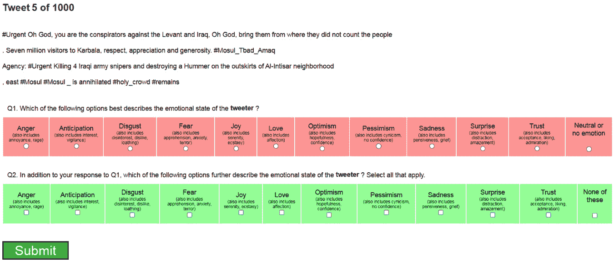
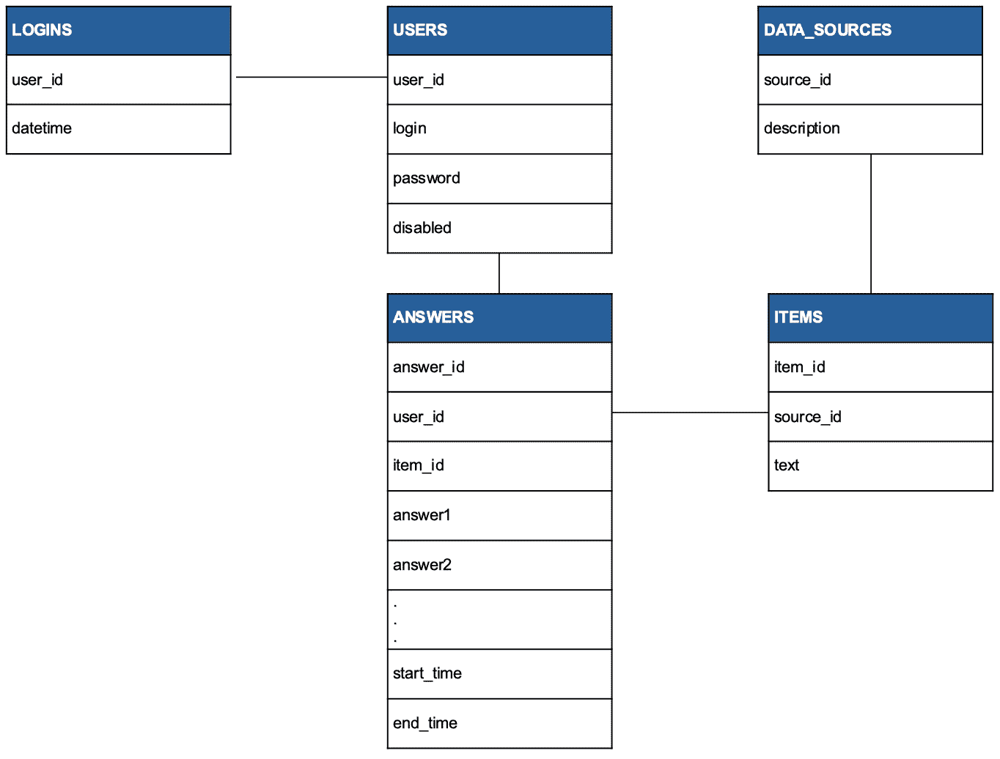
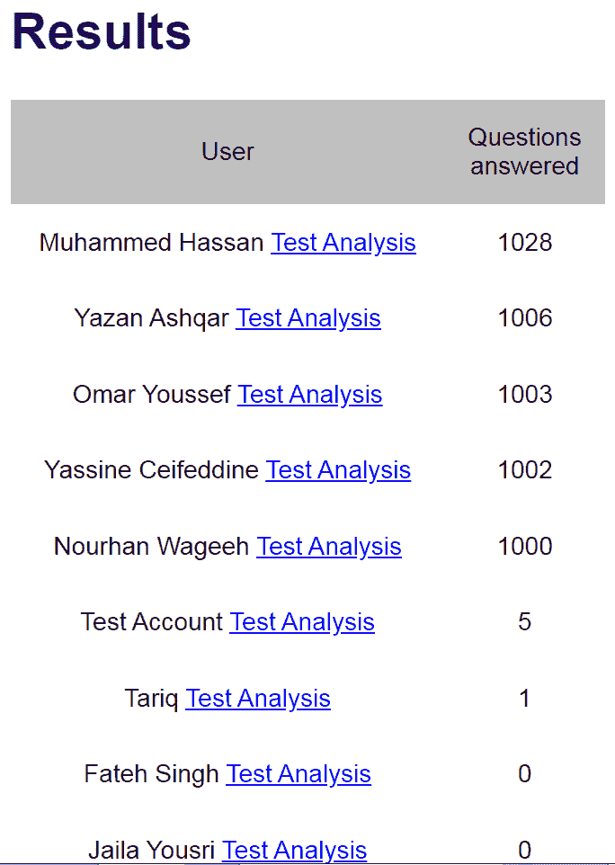
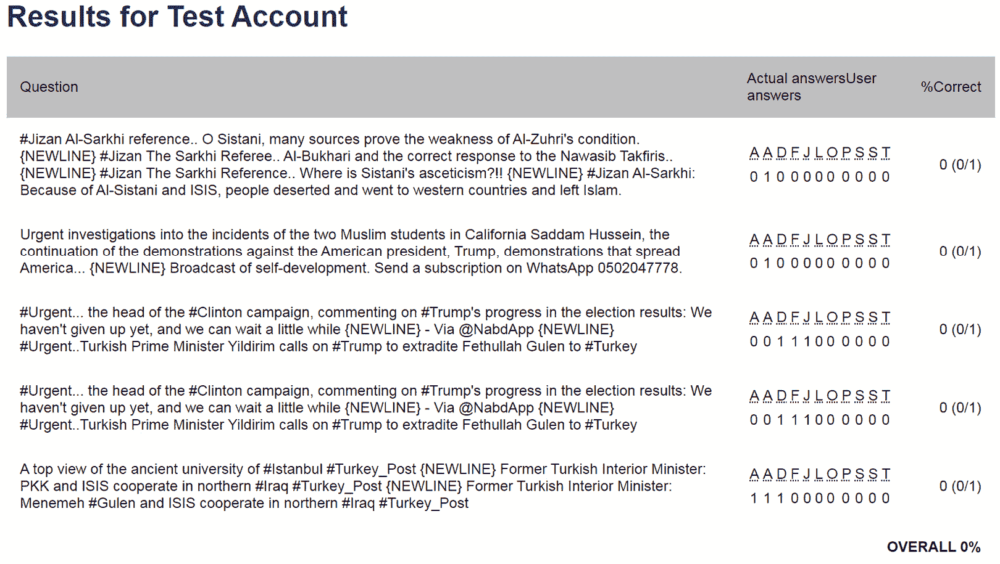

# 第三章：数据标注

**人工智能**（**AI**）模型的好坏取决于它们所训练的数据。因此，高质量的数据至关重要。

人工智能算法通常从基本、简化的形式开始。在监督学习中，准确标注（也称为注释）数据是训练算法、改进其预测并确保其学习内容正确的一个至关重要的步骤。许多研究、报告和调查表明，数据科学家将 50-80%的时间用于数据准备和预处理（见*图 3.1*）——而数据标注通常是这一部分的重要组成部分。


图 3.1 – 分配给机器学习任务的时间分布

在本章中，你将了解为什么确保数据正确标注非常重要；如何实现这一点；如何评估是否已经实现；特别是，如何识别那些没有达到要求标准的标注者。

在本章中，我们将涵盖以下主题：

+   为什么标注必须高质量

+   标注过程

+   最佳实践

+   如何标注数据

+   确定最适合您的标注选项

+   金色推文

+   能力任务

+   标注

+   决定是否购买或构建注释解决方案

+   示例场景的结果

+   标注者间一致性

+   克里彭多夫的α系数

+   标注后的回顾

在我们深入探讨如何进行标注之前，让我们思考为什么必须投入最大努力确保标签质量高。

# 为什么标注必须高质量

数据标注的过程是准备数据集的过程，以便算法能够学会识别数据中重复出现的模式。其理念是，一旦算法看到了足够的数据以某种方式进行标注，它应该能够识别出它之前未见过的数据中的这种模式（称为未标注数据）。

记住，数据标注促进了驱动人工智能的算法构建准确模型。随着越来越多的企业对人工智能产生兴趣，以帮助获得洞察力和做出预测，数据标注成为价值数十亿的大市场也就不足为奇了。没有数据标注，构建人工智能模型是不可能的，这一点并不夸张。

现在，**可解释人工智能**（**XAI**）比以往任何时候都更重要。利益相关者想知道为什么模型做出了这样的决策。反过来，这也帮助建立对模型的信心。这其中的部分原因是数据标注阶段，因此确保这一过程受到与其他过程相同的严格检查和平衡至关重要；即使是微小的错误也可能对上游产生重大影响，这对模型准确性可能是有问题的。

重要的是要理解数据标注不是一个一次性过程。相反，它是一个持续的过程，包括构建和改进。

# 标注过程

数据标记的过程通常从让人类利用他们的领域专业知识或知识、智力、感觉和感知来对未标记的数据做出决定开始。

通常，标记数据包括未标记的数据以及与数据中发现的某些特征相对应的标签、标记或名称。在**自然语言处理**（**NLP**）中，标注者（也称为标记者）会在心理上识别文本的重要方面，并使用这些方面来创建标签。例如，为了确定文本的情感，标注者可能会结合寻找情感关键指标的方法（例如，*快乐*、*惊讶*）以及对上下文的理解以及对词语本身情感基调的探索。

其他类型的数据标记包括图像和音频。当标记包含图像的数据集时，每张图像可能被标记为水果（例如，`苹果`、`香蕉`、`梨`），或者标记过程可能简单到只需让标注者标记包含苹果的图像为`true`，否则为`false`。当需要标注者考虑音频（例如，语音或其他声音）时，标注过程可能相当复杂，因为标签可能需要附加到输入的片段上或以其他方式时间标记，这可能需要复杂的标注工具。

虽然任何经过适当培训的人都可以执行数据标记，但也有一些专家在数据标记的艺术方面非常精通，确保标记标准化、稳健和准确。

在标记数据时，考虑以下因素是个好主意：

+   目标是高质量的数据标签。这可能涉及解决诸如培训不足或设备不足的人员、不充分的方法和流程，或提供不明确的指示等问题。

+   对于大多数需要从头开始训练模型的 AI 问题，需要大量的训练数据。此外，这可能不是一次性的过程。因此，在组合流程、培训和其它要求时考虑到可扩展性是至关重要的。这样就可以以最小的努力、以简化的方式，并造成最小的干扰来增加标记能力。

+   成本也可能是一个因素，因为标记可能最终成为一个昂贵的过程，而且这种情况可能并不总是显而易见。例如，支付高薪员工使用费时、乏味且重复的过程预处理或清理数据显然不是资源的有效利用。在这种情况下，雇佣数据标记专家可能是有益的。

+   **质量保证（QA）**也必须考虑。标注的质量和准确性与标注时的准确性和细心程度成正比。可以使用各种算法和技术来获得标注准确性的度量。例如，当使用多个标注者时，Fleiss 的 kappa 是一种统计度量，可以用来确定标注者之间的一致性水平。

通常，数据标注过程包括以下步骤：

1.  **收集**：数据被收集（例如，推文、图像、文件等），尽管没有完美的数量需求，但通常这是一个大量数据，因为它可以更好地覆盖数据的分布并给出更好的结果。请注意，对于微调模型，较小的数据量可能就足够了。

1.  **标记**：这涉及到人类识别数据中的对象或方面，通常使用数据标注工具。

1.  **质量保证（QA）**：如果数据不准确且不能按预期通知模型，那么费力地标注数据就毫无意义。因此，必须实施 QA 流程来评估标注数据的准确性。如果没有这些，模型可能无法充分表现。

在我们完成本节之前，关于数据不足时应该做什么，说一句话。这里有一些方法可以帮助：

+   **增强**：这涉及到根据现有数据创建新的数据。例如，对于图像，可以使用水平或垂直平移/翻转、随机旋转和随机缩放等技术来生成具有不同分辨率的*新*图像，这些图像可能被裁剪、旋转或缩放。作为额外的优势，这也使模型接触到这类图像，有助于它变得更加鲁棒。

+   **合成**：这涉及到使用**SMOTE**（合成少数类过采样技术）或**生成对抗网络（GANs**）等技术创建新的实例，通常在模型无法学习到少数类的决策边界时使用。SMOTE 通过选择在特征空间中彼此靠近的示例，在这些示例之间画线，然后在沿线的点上创建新的样本来实现。GANs 是深度学习模型，通过使用两个神经网络相互竞争的方法来生成数据，这些神经网络是：生成器，用于生成合成数据，以及判别器，它试图区分真实数据和合成数据。这两种技术都具有风险，因为它们依赖于可能不真实的数据假设，因此只有在数据非常少的情况下才应使用它们。此外，GAN 数据集中存在的任何偏差也会在模型生成数据时被继承。

+   **正则化**：这涉及到惩罚那些被认为不那么重要的数据点，从而给更重要的数据点赋予更多的权重。

重要的是要注意，即使有这些方法，始终使用精心整理的数据，覆盖所有情况并且分布良好，这也是更可取的。

接下来，让我们看看一些最佳实践，这些实践可以使过程运行得更顺畅，错误更少。

## 最佳实践

数据标注是一项繁琐但必要的流程。你最不希望做的事情是因为某些误解而不得不重复这个过程。这就是为什么遵循良好的实践可以提高流程的有效性和准确性。以下是一些你可以做的事情，以确保你的数据被高效且正确地标注：

+   **使用正确的软件**：你完全可以使用电子表格，但为什么不让自己更轻松一些呢？有许多商业产品可供选择，可以加快处理过程。如果你有合适的编程技能，考虑自己定制解决方案也是值得的。它不需要是商业级——只要足够好，能完成工作即可。以下是一些你应该考虑的事项（我们将在本章后面深入讨论）：

    +   为注释员提供登录信息，这样他们可以在以后登录并继续他们离开的地方。标注是一项繁琐、单调的任务。登录允许用户注销，休息一下，然后（例如，第二天）回来时精神焕发。

    +   注释员通常会被支付费用来完成这项任务。在任务中穿插**金标准**数据点是一个好主意，以检查注释员是否只是随机选择一个选项。如果一个注释员提供的标签与金标准点不匹配，那么很可能他们没有对任务给予适当的关注。在这种情况下，可能值得更详细地查看他们标注的大样本，并在必要时消除他们的贡献。

    +   如果你的注释员是志愿者，他们可能在任务结束前就感到厌倦。在一个包含 200 个项目（例如）的数据集中，你不想看到 5 个注释员（例如）都标注了 1-100 的数据项，而没有人能够完成 101-200 的数据项。为了减轻这种可能性，你应该开发你的解决方案，让注释员在不同的数据集部分工作。这也帮助学习过程，因为模型不会从看到相同示例多次中学习到任何东西。

+   **衡量模型性能**：研究表明，超过某个点，向模型投入更多数据带来的好处很少。标注是一项耗时且昂贵的活动，因此知道何时停止，或者至少考虑如何从模型中提取更多改进，是有意义的。

+   **组织**：有时，你可能甚至希望有多个注释员在同一数据上工作。从逻辑上讲，注释员越多，你完成工作就越快。然而，你应该组织任务，使得数据集的不同部分被标注，但也应该有一些重叠，以便可以衡量注释员之间的协议。 

+   **提供清晰的指示**：以清晰、一致的方式制作文档或网页或其他书面材料，以便将您的指示传达给标注员，这将有助于提高标注的准确性。

+   **测量一致性**：理想情况下，为了确保高质量的标注，标注员之间应该有一个合理的共识水平。这可以通过使用一种标注员间可靠性指标来确定。

遵循这些做法将确保流程顺畅、无错误，并提供高质量的标注数据。

当多个标注员在标签上持续不一致时，数据点很可能不适合用于训练，应该从数据集中删除。此外，如果要求是高质量的标签，并非所有收集到的数据点都需要标注。例如，一个嘈杂或模糊的图像可能导致不同的标注员以不同的方式看待图像。

现在我们已经看到了一些最佳实践，我们准备思考如何实际进行标注。

# 标注数据

有许多方法可以标注数据，每种方法都有其优缺点：

+   **内部（内部）标注**：这是指组织内部专家用于标注数据的情况。这些人通常是领域专家，因此非常熟悉流程和要求。因此，这有助于提高质量控制和质量标注。此外，由于数据无需离开建筑物，因此相关的安全风险较少。然而，内部标注并不总是可能的（例如，公司规模较小或需要标注的数据量很大）。此外，领域专家是昂贵的人，要求他们花费大量时间在繁琐的标注任务上可能不是资源利用的最佳方式！

+   **外部（外包）标注**：正如其名所示，这是指将工作外包给专门从事数据标注的公司。这些公司在数据标注方面是专家，因此流程更加顺畅、快速，而且通常成本也较低。然而，这里的风险是，尽管他们可能在数据标注方面是专家，但他们可能不是特定领域的专家，这增加了错误的风险。此外，还存在增加的安全风险，因为数据将需要提供给它们。

+   **众包**：这是向一组在线来源的人求助以帮助任何任务的过程。通常，这些人都是自由职业者，可以是付费的也可以是不付费的。世界上许多最大的公司（例如，麦当劳）都曾使用众包来完成研究、标志设计等任务。对于无法实施内部标注且找不到合适的外部标注合作伙伴的组织来说，这是一个不错的选择。众包最流行的方法之一是使用亚马逊的**Mechanical Turk**（**MTurk**）。**MTurk**是一个众包市场，它使个人和企业更容易连接，从而允许企业将任务外包给一个虚拟工作团队，然后由该团队执行这些任务。这个工作团队可以与内部团队协作，甚至可以独立工作。这是一种非常高效完成任务的方法，但确实存在质量无法保证、存在相关数据安全风险以及更大的相关管理开销等问题。

显然，如果可行，内部标注是首选选项。问题是，一些公司根本无法承担这项任务。因此，可以考虑其他任何选项，但每个选项都有其优缺点——例如，众包需要比其他方法更多的质量控制。综合考虑，可能明智的做法是众包（并忍受所需的额外管理）或雇佣外部标注服务，无论如何，这比你想象的要便宜得多。

下几节将考虑并描述我们如何手动标记一个数据集，包括寻找标注者、构建用户界面以及包括检查和平衡措施，以确保标注适合目的并且尽可能准确。

## 黄金推文

在要标记的数据集中穿插一些特殊的推文是一个明智的想法。这些推文应该是不同类型推文的混合。这些被称为**黄金推文**的推文在标注之前（由作者标注）就已经被标注，并穿插在数据集中。它们很重要，因为它们可以用作避免恶意或不合格标注的机制。例如，如果一个标注者的黄金推文结果低于某个阈值（例如，70%），可以假设他们要么没有理解任务，要么对利用此类任务所需的深入思考缺乏动力，因此他们的标注可能应该被丢弃。本质上，这是一个避免恶意标注的机制。此外，为了确保结果有效，应使用如 Fleiss 的 kappa 系数或 Krippendorff 的 alpha 系数（我们将在本章后面解释这些）等指标来确保没有评分者之间的一致性问题。

让我们接下来看看另一种方法，我们可以用它来判断一个人是否达到执行我们的标注任务所需的标准。

## 竞争力任务

当选择内部、外部或众包方法时，实施一些初步的胜任力任务或测试来评估标注者的适用性总是一个好主意。例如，如果你要求标注者标注阿拉伯语推文，他们不仅必须理解阿拉伯语，还必须熟悉语言的细微差别以及 X（以前称为 Twitter）上使用的语言的复杂性。

此外，标注练习应该对标注者来说是可管理的，并且标注者的注意力水平应保持较高，因此数据集应该构建成（例如）具有挑战性和简单任务的混合。

我们现在将描述一个稳健的标注场景。在这个例子中，目标是标注推文；然而，这些想法和方法可以适应任何类型的数据（例如，图像）。考虑以下场景。任务是标注 1,000 条阿拉伯语推文，因此在一个众包网站上发布了一个请求，要求母语为阿拉伯语的人检查 1,000 条推文并将它们按情绪分类。

注意

尽管任务本身是标注阿拉伯语推文，为了便于阅读，本节中展示的截图已被翻译成英文。

该任务本身可以使用 Excel，一种现成的软件解决方案，甚至可以开发内部定制的解决方案。向标注者提供 100 美元的报酬，但明确指出，只有在标注完成后才会支付这笔报酬。要求每位标注者执行相同的任务：即标注 1,000 条具有相同数量的情绪的推文。

多分类还是多标签？

术语*多分类*分类和*多标签*分类描述了两个不同的问题。

当实例只能用三个或更多类别中的一个进行标注时，这被称为多分类。例如，当将水果图像分类到 `[苹果、香蕉、橙子]` 中时，每张图像可以属于一个，且仅属于一个类别。

然而，当每个实例可以预测多个标签时，这被称为多标签分类。例如，当用 `[教育、政治、宗教、体育]` 之一标注文本时，文本可能涉及所有这些或这些都没有。

本章中提出的场景解决了多标签分类的问题。

每次向标注者展示一条推文，并提出两个问题。第一个是一个单选题：

*Q1. 以下哪个选项最能描述推文作者的* *情绪状态？*

+   愤怒（包括烦恼、狂怒）

+   期待（包括兴趣、警惕）

+   厌恶（包括不感兴趣、不喜欢、厌恶）

+   恐惧（包括担忧、焦虑、恐怖）

+   快乐（包括平静、狂喜）

+   爱情（包括喜爱）

+   乐观（包括希望、信心）

+   悲观（包括愤世嫉俗、没有信心）

+   悲伤（包括沉思、悲伤）

+   惊讶（包括分心、惊奇）

+   信任（包括接受、喜欢、钦佩）

+   中立或无情绪

第二个问题是复选框问题，可以选中多个答案：

*Q2. 除了对 Q1 的回答外，以下哪个选项进一步描述了推文作者的* *情绪状态*？

这个问题包含了与 Q1 相同的选项，但*中立或无情绪*被替换为*以上皆非*。

在这种情况下，收到大量回复并不罕见。你该如何决定选择谁来完成这项任务？一个好的方法是询问有意向的申请人完成一个简短的、在线的情绪分类练习，该练习包含少量代表性的推特，这些推特最好来自与任务推特相同的数据库。为了公平和一致地进行测试，申请人应提供清晰的说明，正如*图 3.2*所示。


图 3.2 – 推特标注者的说明（来源：使用自校正和加权条件概率的多阈值分类推特，Ahmad 和 Ramsay，2020）

向标注者提供示例也是合理的，正如*图 3.3*所示。


图 3.3 – 为标注者提供的示例标注（来源：使用自校正和加权条件概率的多阈值分类推特，Ahmad 和 Ramsay，2020）

在这种情况下，申请人需要检查每条推文，并选择一个主要情绪以及尽可能多的次要情绪（我们很快会解释为什么使用这种设置）。重要的是要理解，标注员并不具备与您相同的领域知识；因此，说明需要清晰、简洁、明确且易于理解。说明应清楚地描述您希望标注员执行的操作，并包含足够的示例。例如，在情绪标注任务中，包括情绪的不同变体（例如，对于愤怒：烦恼和愤怒）是一个好主意。通常，对说明进行迭代审查以确保在发布前发现任何问题也是一个好主意。尽管说明可以以任何格式（Word、PDF 等）发布，但 HTML 是一个不错的选择，因为它允许在不重新分发说明副本的情况下进行更改。然而，使用版本编号和源代码管理（例如 Git）也是一个好主意。实际上，将说明版本与构建版本链接起来可能也是合理的。

由于标注推文通常是一项主观任务，容易受到标注员的理解、经验、背景和文本解释的影响，没有单一的真实点。确实，如果要求标注员在未来重新标注推文，他们可能会给出不同的答案。以下是一条没有明确、确定答案的推文示例：

*这是一家服务质量良好的航空公司，但收费较高。这家航空公司的优点在于他们* *总是可用*。

在这种情况下，说明需要提供明确的指导，说明如何理解项目以及如何对其进行标记。

标注员的工作并不容易。标注员必须反思、理解，然后选择最终将成为机器学习模型输入的标签或标签。表面上，这似乎不是一个困难的任务，不需要特定的培训或知识，并且可以越来越多地作为一个独立资源在家工作。然而，必须反复做同样的事情，同时保持准确性和一致性，这并不简单。然而，没有魔法棒可以挥舞，标注员的专长与解决方案的其他任何部分一样重要。标注员应具备的一些技能包括以下内容：

+   **专注力**：标注员应该具备长时间专注于屏幕内容的能力，不会分心，也不会出错。

+   **关注细节**：反复标注错误可能会导致模型偏差或表现不佳，这可能会产生其他后果。

+   **单独工作**：注释可能涉及长时间的单独工作，这对一些人来说是可行的，但对另一些人来说则不然。

+   **理解语言**：诸如讽刺和幽默之类的东西可能难以检测，因此这需要适当的语言理解和高级认知过程。

总结来说，注释者必须达到一致的水平承诺、专注和细心，才能做好这项工作。然而，也必须理解，无论程序和指示多么完善，完全消除人为错误是不可能的。还应注意的是，这项任务本质上是主观的，两位注释者有时可能会对同一推文分配不同的标签，而两者都没有错误。



图 3.4 – 推文注释页面

推文和情感答案都来自我们希望标记的完整数据集。由于这些推文是专门为测试目的精心挑选的，因此答案清晰、定义明确且已知。因此，选择所需的任何数量的注释者以及得分最高者相对简单。

在选择了继续前进的注释者之后，现在就到了标记适当数据集的任务。

# 注释任务

用于能力任务的相同注释平台也可以重新用于注释任务。然而，在能力任务中，推文是按顺序呈现的，而在注释任务中，则使用了一些巧妙的逻辑。不过，不深入细节的话，使用像 Access 或 MySQL 这样的数据库是个好主意。这允许将问题分区，跟踪答案，并分析结果。这也使得能够确定数据集中有多少被标记，哪些推文被标记，以及，更重要的是，这些答案的分布（我们很快会解释为什么这很重要）。

模式描述了数据将如何组织、连接，并包括表、关系和其他元素。*图 3.5* 展示了一个简单的示例数据库模式。



图 3.5 – 数据库模式图

`USERS` 表包含每个将要进行标注的人的记录。请注意，`disabled` 列可以用来阻止对系统的访问——例如，如果一个用户未能通过能力测试。还要注意 `LOGINS` 表。这个表简单地记录了每次用户成功登录系统的时间和日期。这可以用来获取有用的信息，例如用户进行标注的时间以及完成标注所需的会话数量。反过来，这可能有助于确定为什么（例如）他们没有做好工作。例如，如果 `LOGINS` 表显示他们在人们通常感到疲倦的深夜登录，这可能是标注分数低的一个原因（当然，这完全是推测性的，因为在当今的现代世界中，许多人更喜欢在下午或晚上工作）。

`DATA_SOURCES` 表可以用来按功能分组推文（例如，`Competency`、`Live` 和 `Test`）。然后 `ITEMS` 表包含需要用外键链接到它们所属数据源的标注项。最后，`ANSWERS` 表是自解释的，将每个项与一个用户和提供的答案相链接。

注意

为了标注 11 种情绪，我们简单地创建了 11 列——每种情绪一列。然而，对于一个真正通用、可定制的解决方案，标签应存储在单独的表中，并使用另一个表将它们链接到项。此外，期望的答案数量和类型（单选、多选等）也应可配置。

虽然涉及支付，但受访者可以自由地标注他们想要的任何数量的推文。然而，理想的情况是，即使每个参与者只完成了一部分任务，整个标注数据集也应分布在整个数据集上。换句话说，如果每个标注者只标注了 200 条推文，总数应覆盖整个数据集（参见 *图 3.6*）。


图 3.6 – 分布式推文标注

我们可以通过使用一些巧妙的编程来确保这一点。数据库中的每条推文都有一个唯一的 ID（`item_id`）。当提交答案时，这个 ID 也会存储在 `ANSWERS` 表中，以及用户的 ID。这样，我们可以跟踪哪些问题已经被回答以及由谁回答。回想一下，每个问题必须由每个标注者回答。然后，简单地编写一些 SQL，如下所示，以找到回答最少的那个问题（即在 `ANSWERS` 表中行数最少的问题）：

```py
select count(answers.item_id) as 'count', items.item_idfrom items
left outer join
answers
on items.item_id = answers.item_id
group by (items.item_id)
order by count(answers.item_id) asc , items.item_id asc limit 1
```

这是在网页加载和系统决定显示哪个问题时进行的。尽管在某些情况下这可能是有用的，但这种机制并不能保证每个注释者都能看到每条推文；然而，它确实确保了当每个注释者到达数据集的末尾时，数据集中的每个条目都将被注释。显然，这并不是所需的，因为它在获取注释者一致性度量方面并不有用。对这个技术的更有用的修改是寻找用户需要注释的下一条推文。这样，用户就可以在下一次登录时从上次离开的地方继续工作：

```py
select min(items.item_id) as 'item_id'from items
where items.item_id NOT IN
(
  select answers.item_id
  from answers
  where answers.user_id = [USERS_ID]
)
```

在网页上添加了验证机制，以防止*懒惰*的注释，因此只有在为*Q1*选择了一个答案并且至少为*Q2*选择了一个答案之后，才能移动到下一条推文。结合*中性*和*无*选项，理论上这可以防止用户在不考虑推文的情况下简单地点击**提交**按钮（即，即使用户认为没有任何情绪适用，他们仍然需要登记这一事实）。这些选项迫使用户主动表明推文中没有情绪，其想法是，如果他们被迫选择一个选项以继续到下一条推文，那么他们最好选择一些相关的内容，而不是随机选择。用户还被给予了四周的时间来完成这项任务，因此没有要求他们匆忙完成任务。为了方便起见，系统允许他们停止并稍后再回来继续他们离开的地方。

使用与能力任务相同的界面来注释 1,000 条推文。一次显示一条推文，如*图 3**.4*所示。遵循 Mohammad 和 Kiritchenko 的指南，要求注释者回答两个问题。第一个是一个单选题，要求用户从情绪中选择一个最能描述推文作者情绪状态的选项。第二个是一个复选框问题，可以选中多个答案。

之前，我们描述了申请者被要求检查每条推文并选择一个基本情绪以及尽可能多的次级情绪的过程。这是 Mohammad 和 Kiritchenko 描述的技术，他们认为他们想要包括所有在答案中适用的情绪，而不仅仅是基本情绪。他们认为自然语言标注的一个批评是，只有高度一致性的实例被保留，低度一致性的实例被丢弃。高度一致性的实例通常倾向于是情绪类别的简单例子，因此更容易建模。然而，在现实世界中，有更多复杂和复杂的语言例子和用法来引发情绪。如果模型主要在高度一致性的实例上训练，那么在它必须处理训练期间未见过的实例时，其性能就会次优。

根据来自*Q1*和*Q2*的合并结果，通过多数投票确定了一个基本情绪。如果有平局，所有平局的情绪都被视为基本情绪。*Q1*和*Q2*的汇总响应被用来获取一条推文的完整标签集。

对这些汇总响应应用了两个标准：

+   如果至少一半的标注者表示某种情绪适用，那么就选择该标签。

+   如果至少一半的标注者没有表明情绪，并且超过一半的响应表明推文是中性的，那么该推文被标记为中性。

一种典型的趋势是，得分最高的次级情绪通常是基本情绪，如愤怒和恐惧。这些通常与得分最高的基本情绪相吻合。一般来说，得分最高的基本情绪也是得分最高的次级情绪，而得分最低的基本情绪也是得分最低的次级情绪。然而，在信任等情绪上可能存在异常，它可能是一个高排名的基本情绪，但一个低排名的次级情绪，这表明在其他情绪存在的情况下，这种情绪的实用性是有限的。

显然，这种方法有一些明显的局限性。参与者是自我选择的，关于完成练习的条件（例如，参与者是否在有利于清晰思考的严格条件下完成调查）没有提供任何信息。也有可能是一些标注者可能没有完全理解指示，但拒绝说出来。因此，即使在能力测试之后，仍然可能存在无效的标注。以这种方式标注推特显然是一项单调、耗时的工作。然而，标注者得到了报酬，因此他们应该有很高的动力以高标准进行标注。此外，这种数据集的一个关键优势是，推文不是通过使用带有情感的关键词来收集的；因此，数据集应该更能代表在 X（以前称为 Twitter）上看到的推文类型。

## 购买还是构建？

对于本节，你需要以下先决条件：

+   软件开发工具，如 VS Code

+   数据库工具，如 MySQL Workbench 或 SQL Server

+   访问网络浏览器的权限

+   版本控制系统，如 Git 或 GitHub

当然，关于你是否应该开发自己的界面，还是购买现成的产品，存在一定的争议。当然，作为程序员，我们的初始倾向总是选择前者！然而，考虑到公司规模、工作优先级和成本等因素，这并不总是可能的。显然，在某些情况下，使用现成的工具更为可取。以下是一些例子：

| **工具** | **数据类型** |
| --- | --- |
| 亚马逊 SageMaker Ground Truth | 文本、图像和视频 |
| 标签工作室 | 文本、图像、视频、音频等 |
| Sloth | 图像和视频 |
| Dataturk | 文本、图像和视频 |
| 超级标注 | 图像 |
| 音频标注器 | 音频 |

构建一个标注界面不是一个简单的任务；它需要许多不同的功能，但只要稍加规划，它就可以是一个顺畅的过程。以下是一些应该考虑的功能：

+   查看项目相关元数据（例如，对于图像，尺寸或拍摄日期和时间），以及项目本身

+   移动友好型界面，因为并非所有人都会从桌面或笔记本电脑访问

+   管理员登录以访问统计数据并查看当前进度

+   标准报告，以及创建自定义报告的能力

+   能够轻松添加新的标注项目集

+   能够最终确定项目集，以便不再允许进行标注

+   添加金推特的能力

+   导入标注项目的功能

+   导出结果以便共享的功能

通常，需要标注的数据将在不同的平台上收集，并且也会在另一个平台上通过机器学习算法进行处理。因此，数据需要以适当的格式从标注平台导入和导出。理想情况下，这些过程应该是自动化流程的一部分，这样就不会产生人工瓶颈。重要的是要注意，这些非标注过程将保持不变，无论使用内部还是外部解决方案。如果使用外部解决方案，还可能出现精心设计的接口在管道中突然停止工作，并需要修改，如果外部供应商更改其解决方案与外部世界交互的方式。此外，尽管许多外部解决方案功能丰富，但仍可能存在一些细分市场中的功能不可用，尽管可以提出请求，但无法保证何时（如果有的话）会实施。作为开发内部解决方案的最终好处，如果必要的工程师和时间可用，还可以更快地修复、测试和部署错误。

可能仍然不清楚是选择众多标注工具之一，还是从头开始构建解决方案。因此，我们将通过一个总结表格来结束这次讨论，以帮助您决定采取哪种路线：

| **情况** | **决策** |
| --- | --- |
| 如果这是一个一次性任务，并且极不可能再次重复 | 购买 |
| 如果您需要快速响应 | 购买 |
| 如果成本不是问题 | 购买 |
| 如果您有严格的安全要求，例如数据不应离开场地 | 构建/购买 |
| 如果您知道这是一个会经常重复的过程，尤其是如果成本累积是一个关注点 | 构建/购买 |
| 如果您有一个细分需求，可能对他人有用，因此您的平台可以以 SaaS 模式出售，例如 | 构建 |
| 如果您的需求是细分或定制，并且不太可能被商业解决方案所满足 | 构建 |

## 结果

*图 3.7* 展示了整体结果屏幕。这可以用来了解标注的当前状态以及每个标注者完成了多少，还可以用来访问详细分析屏幕。这些细节对我们来说已经足够了，但这个屏幕可以通过以下有用的信息进一步改进：

+   标注者登录次数

+   平均响应时间

+   标注者上次登录时间

显然，分析此类信息可以带来更深入的见解，这最终可能导致更好的标注，从而提高模型的性能。



图 3.7 – 标注状态屏幕

*图 3.8* 展示了单个标注者的结果摘要屏幕。



图 3.8 – 标注结果

每条推文都会列出对该推文的标注选择以及标注者正确回答的数量。这允许管理员详细检查每条推文和标注者提供的答案。当使用此屏幕显示能力结果（其中已知实际答案）时，**实际答案/用户答案**列显示实际答案和响应，以便快速比较，而最后的**%正确**列显示标注者正确回答的数量。

收集标注结果后，了解答案是否可靠是个好主意。我们将在下一节中探讨这个问题。

# 标注者间可靠性

标注者间可靠性是广泛使用的术语，用来描述“*独立编码者评估消息或物品的特征并得出相同结论的程度*”（Tinsley 和 D. J. Weiss）。这是一个重要的指标，因为它决定了数据是否可以被认为是有效的，并且是数据可信度的指示。没有这种可靠性，任何内容分析都是无用的。从实际的角度来看，建立高水平的可靠性也有利于将工作分配给多个标注者。测量可靠性实际上是在测量可重复性，即“*“不同接受相同培训和文本指导的编码者对同一内容赋予相同值的可能性”*”（Joyce）。

有许多方法可以测量可靠性——其中两种最常见的是 Fleiss’ kappa 和 Krippendorff’s alpha：

+   `1`和随机一致性相当于`0`。虽然已经给出了指导方针，但没有普遍同意的显著性度量标准；如*表 3.1*中所述的常用量表可以查看。Fleiss’ kappa 只能用于二元（是/否）或名义尺度（性别、国籍等）评分。

| **Kappa** | **一致性强度** |
| --- | --- |
| <0 | 低于随机一致性 |
| 0.01–0.20 | 微弱一致性 |
| 0.21– 0.40 | 合理的一致性 |
| 0.41–0.60 | 中等一致性 |
| 0.61–0.80 | 实质一致性 |
| 0.81–0.99 | 几乎完美的一致性 |

表 3.1 – Fleiss’ kappa 的解释

计算 Fleiss’ kappa 的公式如下：


在这里，P0 是评分者之间的相对观察一致性，Pe 是随机一致性的假设概率。

+   **Krippendorff 的 alpha 系数**：Fleiss 的 kappa 的问题在于它要求每个项目（例如，一条推文）的总答案数必须相等。当用多个情绪标注推文时，这显然是不可能的，因为每条推文选择的情绪数量可能不同。在这些情况下，使用 Krippendorff 的 alpha 系数，因为它可以应对各种样本大小、类别和注释者数量。它还能够处理数据缺失的情况——例如，当注释者留空答案时。与基于一致性的其他度量相比，Krippendorff 的 alpha 系数是一个基于观察到的和期望的*分歧*的比率，这也是它被认为更可靠的原因之一。据报道，在实践中，Krippendorff 的 alpha 系数和 Fleiss 的 kappa 的结果相似（Gwet）。这并不令人惊讶，因为在恰好分配一个标签的情况下，它们计算的是同一件事，但只有 Krippendorff 的 alpha 系数在数据点可以有零个、一个或多个标签时才能工作。

Krippendorff 的 alpha 系数的解释也比 Fleiss 的 kappa 更直接。alpha 值是一个介于`0`到`1`之间的数字，其中`0`表示完全分歧，`1`表示完全一致。Krippendorff 建议，理想情况下，该值应大于或等于`0.8`，但当值大于或等于`0.667`（Klaus）时，仍可以得出试探性的结论。然而，这将是最低可接受值。需要注意的是，虽然 Krippendorff 的 alpha 系数可以衡量注释过程的总体可靠性，但它并不能告知哪些注释者或哪些实例存在问题，如果 alpha 系数较低。为此，可能需要进行进一步的分析——例如，比较每一对注释者的注释，或者查看发生分歧的实例。

计算 Krippendorff 的 alpha 系数的公式如下：


在这里，D0 是观察到的分歧，De 是随机期望的分歧。

理论部分就到这里。让我们通过一个例子来使用 Krippendorff 的 alpha 系数进行计算。

## 计算 Krippendorff 的 alpha 系数

回想一下，Fleiss 的 kappa 不支持多标签输入，因此 Krippendorff 的 alpha 系数用于多标签分类。在本节中，我们将设置一个虚构的例子，这个例子主要基于 Krippendorff 的论文，以便进行简单的 Krippendorff 的 alpha 系数计算。

考虑以下场景，两个注释员 A1 和 A2 被要求为同一组两个数据点提供 10 (N) 个二进制（是/否）标签。然后，*可靠性数据矩阵*显示了每个注释员在两个数据点上的综合响应，其中行是注释员，列是他们的标签：

|  | 1 | 2 | 3 | 4 | 5 | 6 | 7 | 8 | 9 | 10 |
| --- | --- | --- | --- | --- | --- | --- | --- | --- | --- | --- |
| **A1** | 0 | 1 | 0 | 0 | 0 | 0 | 0 | 0 | 1 | 0 |
| **A2** | 1 | 1 | 1 | 0 | 0 | 1 | 0 | 0 | 0 | 0 |

使用这个矩阵，创建一个考虑可靠性数据矩阵中所有值的 *巧合矩阵*。

注意

这些矩阵与在 AI 和 ML 中发现的典型巧合矩阵略有不同，因为它们用于记录和分析两个或更多分类变量之间的关系，并显示同时出现的项目。ML 中使用的典型巧合矩阵展示了一个表格，显示了预测的不同结果和分类问题的结果。

因此，使用以下模板创建一个 2X2 的巧合矩阵，以使用可靠性数据矩阵：

|  | 0 | 1 |  |
| --- | --- | --- | --- |
| 0 | 000 | 001 | n0 |
| 1 | 010 | 011 | n1 |
|  | n0 | n1 | 2 x N |

在巧合矩阵中，数值被输入两次——例如，一次作为 (`0,1`)，一次作为 (`1,0`)。因此，在示例中，`1` 被作为 `0-1` 值对和 `1-0` 值对输入：

|  | 0 | 1 |  |
| --- | --- | --- | --- |
| 0 | 10 | 4 | 14 |
| 1 | 4 | 2 | 6 |
|  | 14 | 5 | 20 |

这些值如下推导：

+   `0-0` 对。然而，每个对都被表示两次，因此为 `10`。

+   `0-1` 对。

+   `1-0` 对与四个 `0-1` 对相同。

+   `1-1` 对，因此为 `2`。

现在，使用公式并代入值来计算 alpha 是一件简单的事情。


幸运的是，我们不需要自己编写代码，因为 NLTK 度量包有计算标注者间协议值的函数。`nltk.metrics.agreement`模块需要其输入以列表的形式，其中每个三元组包含一个用于识别标注者的标签（例如，`A1`和`A2`），一个用于指示标签的项目（例如，`1`、`2`、`3`等）以及标注者的标签（例如，`0`、`1`）。

上述简单示例的相应 Python 代码如下：

```py
import nltkdata = [
    ['A1', 1, 0],
    ['A1', 2, 1],
    ['A1', 3, 0],
    ['A1', 4, 0],
    ['A1', 5, 0],
    ['A1', 6, 0],
    ['A1', 7, 0],
    ['A1', 8, 0],
    ['A1', 9, 1],
    ['A1', 10, 0],
    ['A2', 1, 1],
    ['A2', 2, 1],
    ['A2', 3, 1],
    ['A2', 4, 0],
    ['A2', 5, 0],
    ['A2', 6, 1],
    ['A2', 7, 0],
    ['A2', 8, 0],
    ['A2', 9, 0],
    ['A2', 10, 0]
    ]
task = nltk.metrics.agreement.AnnotationTask(data=data)
print (task.alpha())
```

这会产生与工作示例相同的结果：

```py
0.0952380952381
```

# 总结

在任务完成后跟进你的标注者，以确定他们对整个任务的看法以及他们是否遇到了任何特别的困难或情绪问题，这是一个好主意。例如，推文可能包含几种不同的情绪，因此可能很难确定占主导地位的情绪。也可能有情况是，虽然看到了情感词，但标注者并不觉得这使他们强烈倾向于任何特定的情绪。尽早了解这些类型的情况是明智的，因为收集数据程序的变化可能会改变收集内容的性质。通常，标注者将推文简短和非正式视为无法确定推文确切情绪的主要原因。因此，当推文过于冗长时，标注者提到很难限制自己选择一个合理的情绪集合，这在以下例子中表现得尤为明显：

*谁负责这次篡改？!!! 在诺拉大学 !! 与阁下* *教育部长* *会面*

# 摘要

毫无疑问，数据标注是一个挑战，但有了合适的工具和技术，这些问题可以最小化，流程可以简化，从而得到一个适合目的的、标签良好的数据集。

在本章中，我们首先理解了为什么标注必须高质量，以及即使是微小错误也会带来的后果。数据标注过程通常从让人类利用他们的领域专业知识、智慧、感觉和感知来对未标注的数据做出决策开始。我们探讨了这一过程和关键考虑因素，并讨论了数据不足时的选择。数据标注是一个繁琐但必要的流程，并且容易受到标注者的错误影响。因此，通过识别并遵循良好的实践来提高其有效性和准确性是很重要的。然后，我们讨论了标注数据的各种方法和它们的优缺点。一种常见的技术是众包，因此我们介绍了如黄金推文和竞争力任务等技术，以提高遵循此技术时的结果。我们还提出了一种标注场景，讨论了可能使用的标签以及标注者需要的技能，并展示了数据标注任务的一个简单架构和 UI。最后，我们提出了构建或购买标注工具的标准，探讨了评分者可靠性背后的理论，并展示了相应的 Python 代码。

在下一章中，我们将探讨基于竞争的研究和评估策略，了解为何不一定需要创建自己的数据集，并探讨现有数据集如何被转换以使其对情感分析任务有用。

# 参考文献

要了解更多关于本章涵盖的主题的信息，请参阅以下资源：

+   T.N. Ahmad 和 A. Ramsay. *使用自校正和加权条件概率对推文进行分类*. 2020 年。

+   S. M. Mohammad 和 S. Kiritchenko. *理解情感：用于研究情感类别之间交互作用的推文数据集*. 在第 11 届语言资源与评估会议论文集中，宫崎，日本，2018 年。

+   H. E. Tinsley 和 D. J. Weiss. *评分者可靠性及一致性. 在《应用多元统计分析与数学建模手册》中，第 95-124 页\. Elsevier，2000 年。

+   M. Joyce. *选择最适合您数字活动内容分析的编码者可靠性统计量*. 收录于 *数字活动研究项目：调查评论论坛言论作为主流话语镜子的全球影响*，第 243 卷，2013 年。

+   Gwet, Kilem. (2015). *关于 Krippendorff 的* *Alpha 系数*。

+   K. Klaus. *内容分析：对其* *方法论*的介绍，1980 年。

+   K. Krippendorff. *计算 Krippendorff 的* *alpha 可靠性*. 2011 年。
