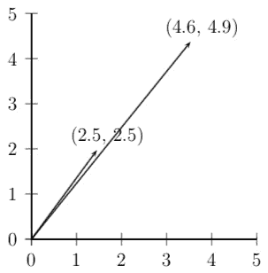
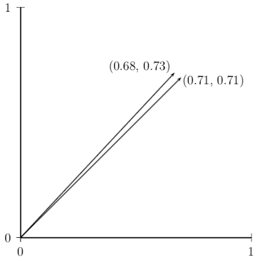

# 第五章：情感词典和向量空间模型

我们现在已经拥有了构建在文本中寻找情感的系统的工具——将原始文本转换为特征集的自然语言处理（NLP）算法和从特征集中提取模式的机器学习算法。在接下来的几章中，我们将开发一系列情感挖掘算法，从非常简单的算法开始，逐步发展到使用各种高级技术的复杂算法。

在此过程中，我们将使用一系列数据集和多种度量来测试每个算法，并比较各种预处理步骤的有效性。因此，本章将首先考虑我们在开发各种算法时将使用的数据集和度量。一旦我们有了数据集和度量，我们将考虑仅基于情感词典的非常简单的分类器，并探讨计算单个单词表达情感强度的方法。这将为我们提供一个基准，以便在后续章节中查看更复杂算法的性能。

在本章中，我们将涵盖以下主题：

+   数据集和度量

+   情感词典

+   从语料库中提取情感词典

+   向量空间模型

# 数据集和度量

在接下来的几章中，我们将探讨几种情感挖掘算法。在我们这样做之前，我们需要考虑这些算法的确切设计目标。情感挖掘算法有几个略有不同的任务，我们需要明确了解给定算法旨在完成哪些任务：

+   你可能只想知道你正在查看的文本是积极的还是消极的，或者你可能需要一个更细致的分类。

+   你可能认为每个文本恰好表达一种情感，或者最多表达一种情感，或者一个文本可以表达几种（或没有）情感。

+   你可能想知道一个文本表达情感的程度有多强。例如，*我对那有点恼火*和*那让我非常愤怒*都表达了愤怒，但第二个显然表达得更加强烈。

我们将专注于旨在为每条推文分配多个（或无）标签的算法，这些标签来自一些候选情感集合，从仅正面和负面到来自 Plutchik 轮的更大集合。我们将称之为**多标签**数据集。这需要与**多类**数据集区分开来，在多类数据集中有多个标签可用，但每条推文只分配一个确切的情感。多标签数据集比简单的多类数据集要复杂得多，随着标签集合的增大（例如，区分愤怒和厌恶可能很困难，但它们都是负面的），任务也变得更加困难；如果我们没有关于表达多少情感的前见之明，这也会变得更加困难。由于大多数学习算法都依赖于将文本获得的某些分数与阈值进行比较，因此我们通常可以使用这个分数来评估文本表达情感的程度，而不仅仅是它是否表达情感。我们将主要关注决定文本是否表达情感，而不是它表达情感的强度。

我们将使用*第二章*中列出的数据集的一部分，即*构建和使用数据集*，来训练和测试我们将开发的各个模型：

+   **计算方法在主观性、情感与社会媒体分析**（**WASSA**）数据集，其中包含 3.9K 条英文推文，每条推文都被标记为愤怒、恐惧、喜悦或悲伤之一。

+   Semeval 2018 任务 E_c 数据集，其中包含一定数量的英文、阿拉伯语和西班牙语推文，其中相当高比例的推文包含表情符号，每条推文都被标记为来自 11 种标准情感集合中的 0 个或多个情感。此数据集包含 7.7K 条英文推文、2.9K 条阿拉伯语推文和 4.2K 条西班牙语推文。我们将称之为 SEM-11 集合。

+   Semeval 2016 任务 El-reg 和 El-oc 数据集，其中 El-reg 数据集的推文被标记为四个情感集合中每个情感的 0 到 1 分的评分，而 El-oc 数据集的推文则按所表达的情感进行排名。这些数据集的组合，我们将称之为 SEM4 集合，包含 7.6K 条英文推文、2.8K 条阿拉伯语和 2.6K 条西班牙语。

+   CARER 数据集很大（略超过 400K 条推文），并为六种情感（愤怒、恐惧、喜悦、爱情、悲伤和惊讶）提供标签。每条推文被分配一个确切的情感。

+   IMDb 数据集包含 5K 条正面和负面电影评论，并提供了对各种算法鲁棒性的有趣测试，因为它仅分为两个类别（正面和负面），这使得学习对文档进行分类的任务变得更容易。评论包含从 100 到 1,000 个单词，这比推文长得多，并提出了不同的一系列问题。

+   一组科威特推文，这些推文要么由所有三位注释者一致分配标签（KWT.U），要么至少有两位注释者分配标签（KWT.M）进行标注。这个集合特别有趣，因为在大量情况下，注释者一致认为推文没有表达任何情绪，而在某些情况下，推文表达了多种情绪，这对将每个观察结果分配单个标签的分类器构成了重大挑战。

这些数据集提供了足够的多样性，有助于我们验证针对寻找情绪的任务的给定方法在不同条件下是否稳健：

+   WASSA、SEM4 和 SEM11 数据集包含表情符号，这使得情感挖掘的任务稍微容易一些，因为使用表情符号的主要（唯一？）目的是表达情绪，尽管它们有时以略微令人惊讶的方式使用。

+   SEM4 和 SEM11 数据集是多语言的，提供的数据包括英语、阿拉伯语和西班牙语。这有助于尝试那些旨在语言无关的方法，因为收集三种语言的方法是相同的。

+   SEM11 集合包含具有不同数量情绪的推文，包括没有情绪的推文，这可能会使分配情绪的任务变得更加困难。

+   CARER 数据集非常大，尽管它不包含任何表情符号或标签：这使得我们可以研究性能如何随着训练数据大小的变化而变化。

+   IMDb 集合只有两个标签，但文本非常长。

+   KWT 集合包含具有零个、一个或多个情绪的推文，但这一次，很大比例的推文没有情绪。

由于这些数据集以不同的格式提供，我们需要，像往常一样，一个共同的格式来表示它们。我们将使用两个基本类：

+   推文是一个具有标记序列、词频表以及可能的黄金标准标签集的对象，以及一些记账属性：

    ```py
    class TWEET:
    ```

    ```py
        def __init__(self, id=False, src=False,
    ```

    ```py
                     text=False, tf=False,
    ```

    ```py
                     scores=False, tokens=False,
    ```

    ```py
                     args=False):
    ```

    ```py
            self.id = id
    ```

    ```py
            self.src = src
    ```

    ```py
            self.text = text
    ```

    ```py
            self.GS = scores
    ```

    ```py
            self.tokens = tokens
    ```

    ```py
            self.tf = ormalize(tf)
    ```

    ```py
            self.ARGS = args
    ```

    ```py
        def __repr__(self):
    ```

    ```py
            return self.text
    ```

+   数据集是一个包含一组推文、情绪名称列表、推文的黄金标准标签以及一些记账属性集合。其中最有用的是为数据集中的每个单词分配一个唯一索引的索引。我们将在后面的章节中经常使用它，所以值得看看我们在这里是如何做的。基本思想是我们逐个读取数据集中的单词。如果我们刚刚读取的单词已经在索引中，那么就没有什么要做的。如果它不在，那么我们将其分配给当前索引的长度：这确保了每个单词都被分配了一个唯一的标识符；一旦我们添加了当前单词，索引的长度将增加一个，因此下一个新单词将获得一个新的索引：

    ```py
        def makeIndex(self):
    ```

    ```py
            index = {}
    ```

    ```py
            for tweet in self.tweets:
    ```

    ```py
                for token in tweet.tokens:
    ```

    ```py
                    if not token in index
    ```

    ```py
                        index[token] = len(index)
    ```

    ```py
            return index
    ```

这将生成一个索引，如下所示，其中每个单词都有一个唯一的标识符：

```py
makeIndex, we can construct a DATASET class as follows:

```

class DATASET:    def __init__(self, emotions, tweets, idf, ARGS, N=sys.maxsize):

self.emotions = sorted(emotions)

self.tweets = tweets

self.GS = [tweet.GS for tweet in self.tweets][:N]

self.idf = idf

self.words = [w[0] for w in reversed(sortTable(idf))]

self.makeIndex()

self.ARGS = ARGS

```py

We will need to convert the format of a given dataset into these representations, but once that has been done, we will use them throughout this and the following chapters. We will do this in stages.
First, we will convert the dataset so that it looks like the SEM11 dataset – that is, a tab-separated file with a header that specifies that the first and second fields as the ID and the tweet itself, with the remaining columns as the various emotions, followed by a line per tweet with 0s and 1s in the appropriate columns (the following example has the tweet and the columns for emotions truncated, so it will fit on the page).
This format is a variant of the standard **one-hot** representation used in neural networks, where a choice from several discrete labels is represented by a vector where each position in the vector represents a possible option. Suppose, for instance, that the possible labels were **{angry, sad, happy, love}**. In this case, we could represent **angry** with the vector <1, 0, 0, 0>, **sad** with <0, 1, 0, 0>, **happy** with <0, 0, 1, 0>, and **love** with <0, 0, 0, 1>.
The advantage of the SEM11 version of this format is that it makes it easy to allow tweets to have an arbitrary number of labels, thus allowing us to treat multi-label datasets and single-label datasets uniformly:

```

ID     Tweet                    anger  disgust  fear21441  Worry is a down payment    0      1        0

1535   it makes you #happy.       0      0        0

```py

Exactly how we convert a given dataset into this format depends on how the dataset is supplied. The following code shows how we do it for the CARER dataset – the others are similar, but because their original format is slightly different, the code for converting it into the SEM11 format will be slightly different
The CARER dataset comes as two files: a file called `dataset_infos.json` containing information about the dataset and another called `data.jsonl` containing the actual data. We convert this into SEM11 format by finding the names of the labels in  `dataset_infos.json` and then converting the entries in `data.jsonl` so that they have a 1 in the appropriate column and a 0 in the others.
`data.jsonl` looks as follows:

```

{"text":"i feel awful about it","label":0}{"text":"i really do feel proud of myself","label":1}

...

```py

We want to convert this into the following:

  **ID**
 |
  **text**
 |
  **sadness**
 |
  **joy**
 |
  **love**
 |
  **anger**
 |
  **fear**
 |
  **surprise**
 |

  0
 |
  i feel awful about it
 |
  1
 |
  0
 |
  0
 |
  0
 |
  0
 |
  0
 |

  1
 |
  i really do feel proud of myself
 |
  0
 |
  1
 |
  0
 |
  0
 |
  0
 |
  0
 |

We do this by using the set of labels provided in `dataset_infos.json` as the header line, and then writing each entry in `data.jsonl` with a 1 in the column specified by its label (for example, in the first (sadness) column for tweet 1 and the second (joy) column for tweet 2):

```

def convert(self):    # 从 dataset_infos.json 中提取标签

with open(os.path.join(self.DOWNLOAD,

"dataset_infos.json")) as jsfile:

infos = json.load(jsfile)

self.labels = infos["default"]["features"]\

["label"]["names"]

# 从 data.jsonl 逐行读取数据

with open(os.path.join(self.PATH, "data.jsonl"))\

as input:

d = [json.loads(line) for line in input]

# 初始化输出，包含标题行

csv = "ID\ttext\t%s\n"%("\t".join(self.labels))

# 遍历数据，将每一行作为 ID 写入

# 文本本身以及适当的 0 和 1 的集合

for i, x in enumerate(d):

cols = ["1" if x['label'] == i else "0"\

for i in range(len(self.labels))]

csv += "%s\t%s\t%s\n"%(i, x['text'],"\t".join(cols))

# 将整个内容保存为 CARER/EN 目录下的 wholething.csv

with open(os.path.join(self.PATH, "wholething.csv"), "w") as out:

out.write(csv)

```py

Once we have the data in SEM11 format, we can read it as a dataset. We read the data line by line, using the first line as a header where the first two items are `ID` and `tweet` and the remainder are the emotions, and then use `makeTweet` to convert subsequent lines into `tweets`. We then remove duplicates and shuffle the data, construct document frequency and inverse document frequency tables, and wrap the whole thing up as a `dataset`:

```

def makeDATASET(src, N=sys.maxsize, args=None):    dataset = [line.strip() for line in open(src)][:N]

emotions = None

tweets = []

for tweet in dataset:

if emotions is None:

emotions = tweet.split()[2:]

else:

tweets.append(makeTweet(tweet, args=args))

pruned = prune(tweets)

random.seed(0); random.shuffle(pruned)

df = counter()

index = {}

for i, tweet in enumerate(tweets):

for w in tweet.tokens:

df.add(w)

"""

移除 idf 计数中的单例

"""

idf = {}

for w in list(df.keys()):

idf[w] = 1.0/float(df[w]+1)

return DATASET(emotions, tweets, df, idf, args=args)

```py

`makeTweet` does quite a lot of work. It splits the line that was read from the file (which is, at this point, still just a tab-separated string) into its component parts and converts the 0s and 1s into a NumPy array; does tokenization and stemming as required (for example, for Arabic, the default is to convert the text into a form using Latin characters, tokenize it by just splitting it at white space, and then use the stemmer described in *wwww, Preprocessing – Stemming, Tagging, and Parsing* to find roots and affixes, with similar steps for other languages); and then finally make a term frequency table for the tweet and wrap everything up in `tweet`. All of these functions have an argument called `args` that contains a set of parameters that are supplied at the top level and that control what happens – for example, what language we are using, which tokenizer and stemmer we want to use, and so on:

```

def makeTweet(tweet, args):    tweet = tweet.strip().split("\t")

scores = numpy.array([int(score) for score in tweet[2:]])

tweet, text tweet[0], tweet[1]

if args["language"] == "AR":

tokens = a2bw.convert(text, a2bw.a2bwtable).split()

if args["stemmer"] == "standard":

tokens = stemmer.stemAll(tokens, stemmer.TWEETGROUPS)

elif args["language"] == "ES":

elif args["language"] == "EN":

tf = counter()

for w in tokens:

tf.add(word)

return TWEET(id=tweet,tf=tf,scores=scores,tokens=tokens,args=args)

```py

We must also define an abstract class for classifiers:

```

class BASECLASSIFIER():    def applyToTweets(self, dataset):

return [self.applyToTweet(tweet) for tweet in dataset.tweets]

```py

As we continue, we will define several concrete types of classifiers. These all need a method so that they can be applied to sets of tweets, though how they are applied to individual tweets will vary. Therefore, we will provide this abstract class, which says that to apply any classifier to a set of tweets, you just apply its `applyToTweet` method to each tweet in the dataset. `BASECLASSIFIER` lets us capture this in an abstract class: we will never actually make a `BASECLASSIFIER`, and indeed it does not have a constructor, but all our concrete classifiers will be subclasses of `BASECLASSIFIER` and hence will have this method.
The abstract class has no constructor and just one method, which simply says that to apply a classifier to a dataset, you must use its `applyToTweet` method on each tweet in the dataset, but it will prove useful as we continue. Different concrete subclasses of this class will each define a version of `applyToTweet`, but it is useful to have a generic method for applying a classifier to an entire dataset.
We will use the Jaccard score, macro-F1, and micro-F1 as performance measures. As noted in *Chapter 2*, *Building and Using a Dataset*, micro-F1 tends to be very forgiving in situations where there is one class that predominates and the learning algorithm performs well on this class but less so on the smaller classes. This is a useful measure if you want to know how well the algorithm performs overall, but if you wish to make sure that it performs well on all the classes, then macro-F1 is more reliable (and is typically lower). Again, from *Chapter 2*, *Building and Using a Dataset* Jaccard and micro-F1 are monotonically linked – if the micro-F1 for one experiment is higher than the micro-F1 for another, then the Jaccard measure will also be higher. So, these two measures will always provide the same ranking for sets of classifiers, but since some papers report one and some the other, it makes sense to include both when comparing a new classifier with others in the literature.
Sentiment lexicons
Now that we have all the machinery for reading and managing datasets, it is time to start trying to develop classifiers. The first one we will look at is based on the simple observation that individual words carry emotional weight. It may be, as we will see later, that exactly how they contribute to the overall content of the message depends on their relationships with other words in the text, but simply looking at the presence of emotionally laden words (and emojis and suchlike) will give you a pretty good idea:
*I feel like she is a really sweet person as well* (from the CARER dataset)
*I feel like she is a really horrible person as well* (one word changed)
*I feel gracious as he hands me across a rough patch* (from the CARER dataset)
*I feel irritated as he hands me across a rough patch* (one word changed)
So, the simplest imaginable emotion-mining algorithm would simply involve labeling words with sentiments and seeing which sentiment scored the most highly for each text. Nothing could be simpler to implement, so long as you have a lexicon that has been labeled with emotions.
How could you get such a lexicon? You could make one by hand (or find one that someone else has made by hand), or you could try to extract one from a labeled corpus.
Both these approaches involve a large amount of work. You either have to go through a long list of words and assign a set of emotion labels to each, possibly with a score (for example, *sweet* and *love* both express joy, but *love* probably expresses it more strongly than *sweet*, and quantifying just how much more strongly it does so would be very difficult); or you have to go through a long list of tweets and assign a set of emotion labels to them, again possibly with a score. Both of these require a considerable amount of work, which you can either do yourself or get someone else to do (for example, by crowdsourcing it via a platform such as Amazon’s Mechanical Turk). If someone else has already done it and made the results available, then so much the better. We will start by considering a well-known resource, namely the NRC Word-Emotion Association Lexicon (also known as **EMOLEX**) (Mohammad & Turney, 2013). This consists of a list of English forms, each labeled with zero or more labels from a set of eight emotions (**anger**, **anticipation**, **disgust**, **fear**, **joy**, **sadness**, **surprise**, and **trust**) plus two polarities (**negative** and **positive**):

   |  **anger**
 |
  **anticipation**
 |
  **disgust**
 |
  **fear**
 |
  **joy**
 |
  **negative**
 |
  **positive**
 |
  **sadness**
 |
  **surprise**
 |
  **trust**
 |

  aback
 |
  0
 |
  0
 |
  0
 |
  0
 |
  0
 |
  0
 |
  0
 |
  0
 |
  0
 |
  0
 |

  abacus
 |
  0
 |
  0
 |
  0
 |
  0
 |
  0
 |
  0
 |
  0
 |
  0
 |
  0
 |
  1
 |

  abandon
 |
  0
 |
  0
 |
  0
 |
  1
 |
  0
 |
  1
 |
  0
 |
  1
 |
  0
 |
  0
 |

  abandoned
 |
  1
 |
  0
 |
  0
 |
  1
 |
  0
 |
  1
 |
  0
 |
  1
 |
  0
 |
  0
 |

  abandonment
 |
  1
 |
  0
 |
  0
 |
  1
 |
  0
 |
  1
 |
  0
 |
  1
 |
  1
 |
  0
 |

  abate
 |
  0
 |
  0
 |
  0
 |
  0
 |
  0
 |
  0
 |
  0
 |
  0
 |
  0
 |
  0
 |

  abatement
 |
  0
 |
  0
 |
  0
 |
  0
 |
  0
 |
  0
 |
  0
 |
  0
 |
  0
 |
  0
 |

  abba
 |
  0
 |
  0
 |
  0
 |
  0
 |
  0
 |
  0
 |
  1
 |
  0
 |
  0
 |
  0
 |

  abbot
 |
  0
 |
  0
 |
  0
 |
  0
 |
  0
 |
  0
 |
  0
 |
  0
 |
  0
 |
  1
 |

  ...
 |
  ...
 |
  ...
 |
  ...
 |
  ...
 |
  ...
 |
  ...
 |
  ...
 |
  ...
 |
  ...
 |
  ...
 |

Figure 5.1 – EMOLEX labels
To use this with a given dataset, we have to match the emotions in the lexicon with the labels in the dataset – we cannot use the lexicon for any emotions that it does not contain, and emotions that are in the lexicon but not in some dataset cannot be used for extracting emotions from that dataset.
We will start by reading the lexicon and converting it into a Python dictionary. This is very straightforward – read the lexicon line by line, where the first item on a line is a word and the remainder are the scores for the 11 emotions. The only complications are that the dataset we want to use it with may have a different set of emotions from the eleven in the lexicon; and that we might want to use a stemmer to get the root form of a word – for example, to treat *abandon* and *abandoned* as a single item. This may make little difference for English, but it can be important when using the non-English equivalents that are provided for several languages.
EMOLEX comes in various forms. We are using the one where the first column is an English word, the next 11 are the values for each emotion, and the last is a translation of the given English word into some other language. The default is the one where the other language is Arabic, but we have done some experiments with a Spanish corpus, for which we need a Spanish stemmer. The way to extend this to other languages should be obvious.
`ARGS` is a set of parameters for applying the algorithm in different settings – for example, for specifying which language we are using. The two major issues here are as follows:

*   EMOLEX contains inflected forms of words, but our classifiers typically require the root forms
*   The emotions in EMOLEX are not necessarily the same as the ones used in the datasets

To deal with the first of these, we have to use a stemmer – that is, one of the ones from *Chapter 4*, *Preprocessing – Stemming, Tagging, and Parsing*. For the second, we have to find the emotions that are shared between EMOLEX and the dataset and restrict our attention to those:

```

EMOLEX="CORPORA/NRC-Emotion-Lexicon/Arabic-NRC-EMOLEX.txt"def readNRC(ifile=EMOLEX, targets=None, ARGS=False):

lines = list(open(ifile))

# 情感是 EMOLEX 文件中的情感列表

# 目标是数据集中情感列表

# 要应用分类器的分类器。

emotions = lines[0].strip().split("\t")[1:-1]

emotionIndex = [True if e in targets else False for e in emotions]

targetIndex = [True if e in emotions else False for e in targets]

lex = {}

# 添加条目，逐行写入

for line in lines[1:]:

line = line.split("\t")

# 如果是为英语进行操作

if ARGS.Language == "EN":

form = line[0]

if ARGS.Stemmer.startswith("justRoot"):

form = justroot(form)

elif ARGS.Stemmer.startswith("morphyroot"):

form = morphyroot(form)

...

else:

raise Exception("未知语言: %s"%(ARGS.Language))

# 我们刚刚读取的行是一个字符串，所以值

# 对于情绪是"0"和"1"。我们希望它们作为

# 整数，我们只想要那些出现的

# 在 emotionIndex 中，即存在于

# 在词典和目标数据集中

lex[form] \

= [int(x) for (x, y) in zip(line[1:-1], emotionIndex) if y]

return lex, emotionIndex, targetIndex

```py

The following table shows what happens when we use this lexicon with our English datasets (SEM4, SEM11, WASSA, CARER), simply tokenizing the text by splitting it at white space:

   |  **Precision**
 |
  **Recall**
 |
  **Micro-F1**
 |
  **Macro-F1**
 |
  **Jaccard**
 |

  SEM4-EN
 |
  **0.418**
 |
  **0.683**
 |
  **0.519**
 |
  **0.489**
 |
  **0.350**
 |

  SEM11-EN
 |
  **0.368**
 |
  **0.401**
 |
  **0.383**
 |
  **0.333**
 |
  **0.237**
 |

  WASSA-EN
 |
  **0.435**
 |
  **0.738**
 |
  **0.547**
 |
  **0.524**
 |
  **0.376**
 |

  CARER-EN
 |
  **0.229**
 |
  **0.524**
 |
  **0.318**
 |
  **0.287**
 |
  **0.189**
 |

Figure 5.2 – EMOLEX-based classifiers, no stemming
These scores provide a baseline for comparing the more sophisticated models to be developed later. It is worth observing that the scores for SEM4 are better than those for SEM11 – this is unsurprising given that SEM4 only has four fairly basic emotions (**anger**, **fear**, **joy**, and **sadness**), whereas SEM11 adds several more challenging ones (**surprise**, **trust**, and **anticipation**).
Some of the classifiers that we will look at later can take a long time to train, and it may be that losing a bit of accuracy is worth it if training the more accurate classifiers takes an infeasible amount of time. What matters is whether the classifier is any good at the task we want it to carry out. A classifier that takes a second to train but gets almost everything wrong is no use. Nonetheless, if two algorithms have very similar results but one is much faster to train than the other, it may make sense to choose the faster one. It is hard to imagine anything much faster than the EMOLEX-based one – less than a thousandth of a second to process a single tweet, so that’s a tenth of a second to train on our largest (411K) training set.
The basic EMOLEX-based classifier, then, is very fast but produces fairly poor results. Are there things we can do to improve its scores?
The first extension involves using the tokenizer and stemmer described in *Chapter 4**, Preprocessing – Stemming, Tagging, and Parsing*. This has a fairly substantial effect in that it improves the scores, as shown here (we will mark the highest score that we have seen to date in bold; since all the scores in the table that use stemming are better than the ones without, they are all marked in bold here):

   |  **Precision**
 |
  **Recall**
 |
  **Micro-F1**
 |
  **Macro-F1**
 |
  **Jaccard**
 |

  SEM4-EN
 |
  **0.461**
 |
  **0.622**
 |
  **0.530**
 |
  **0.538**
 |
  **0.360**
 |

  SEM11-EN
 |
  **0.411**
 |
  **0.430**
 |
  **0.420**
 |
  **0.363**
 |
  **0.266**
 |

  WASSA-EN
 |
  **0.465**
 |
  **0.666**
 |
  **0.547**
 |
  **0.545**
 |
  **0.377**
 |

  CARER-EN
 |
  **0.378**
 |
  **0.510**
 |
  **0.434**
 |
  **0.378**
 |
  **0.278**
 |

Figure 5.3 – EMOLEX-based classifiers with stemming
EMOLEX also provides a route into other languages by including a target language equivalent for each English word:

   |  **anger**
 |
  **…**
 |
  **negative**
 |
  **positive**
 |
  **sadness**
 |
  **surprise**
 |
  **trust**
 |
  **Spanish**
 |

  Aback
 |
  0
 |
  …
 |
  0
 |
  0
 |
  0
 |
  0
 |
  0
 |
  detrás
 |

  Abacus
 |
  0
 |
  …
 |
  0
 |
  0
 |
  0
 |
  0
 |
  1
 |
  ábaco
 |

  Abandon
 |
  0
 |
  …
 |
  0
 |
  0
 |
  1
 |
  0
 |
  0
 |
  abandonar
 |

  Abandoned
 |
  1
 |
  …
 |
  1
 |
  0
 |
  1
 |
  0
 |
  0
 |
  abandonado
 |

  …
 |
  …
 |
  …
 |
  …
 |
  …
 |
  …
 |
  …
 |
  …
 |
  …
 |

Figure 5.4 – EMOLEX entries with Spanish translations
In some cases, this can be leveraged to provide a classifier for the target language: the missing section from the previous definition of readNRC is given here – the key changes are that we use the last item in the line as the form and that we use the appropriate stemmer for the given language:

```

elif ARGS.Language == "AR":            form = line[-1].strip()

form = a2bw.convert(form, a2bw.a2bwtable)

if ARGS.Stemmer == "SEM":

form = stemArabic(form)

elif ARGS.Language == "ES":

form = line[-1].strip()

if ARGS.Stemmer.startswith("stemSpanish"):

form = stemSpanish(form)

```py

By trying this on the SEM4 and SEM11 Spanish and Arabic datasets, we obtain the following results:

   |  **Precision**
 |
  **Recall**
 |
  **Micro-F1**
 |
  **Macro-F1**
 |
  **Jaccard**
 |

  SEM4-ES
 |
  **0.356**
 |
  **0.100**
 |
  **0.156**
 |
  **0.144**
 |
  **0.085**
 |

  SEM11-ES
 |
  **0.272**
 |
  **0.070**
 |
  **0.111**
 |
  **0.096**
 |
  **0.059**
 |

  SEM4-AR
 |
  **0.409**
 |
  **0.362**
 |
  **0.384**
 |
  **0.372**
 |
  **0.238**
 |

  SEM11-AR
 |
  **0.267**
 |
  **0.259**
 |
  **0.263**
 |
  **0.232**
 |
  **0.151**
 |

Figure 5.5 – EMOLEX-based classifiers for Spanish and Arabic, no stemming
The recall for the Spanish sets is very poor, but apart from that, the scores are surprisingly good considering that we just have the English dataset with one translation of each English word, where the translation is in the canonical form (that is, Spanish verbs are in the infinitive, Arabic nouns are singular, and where a noun has both masculine and feminine forms, then the masculine is used). If we simply use the Spanish and Arabic stemmers from *Chapter 4* *, Preprocessing – Stemming, Tagging, and Parsing* (which do not, remember, make use of any lexicon), we get the following:

   |  **Precision**
 |
  **Recall**
 |
  **Micro-F1**
 |
  **Macro-F1**
 |
  **Jaccard**
 |

  SEM4-ES
 |
  **0.406**
 |
  **0.164**
 |
  **0.234**
 |
  **0.224**
 |
  **0.132**
 |

  SEM11-ES
 |
  **0.255**
 |
  **0.105**
 |
  **0.149**
 |
  **0.121**
 |
  **0.080**
 |

  SEM4-AR
 |
  **0.452**
 |
  **0.536**
 |
  **0.490**
 |
  **0.469**
 |
  **0.325**
 |

  SEM11-AR
 |
  **0.284**
 |
  **0.348**
 |
  **0.313**
 |
  **0.276**
 |
  **0.185**
 |

Figure 5.6 – EMOLEX-based classifiers for Spanish and Arabic, stemmed
Using the stemmed forms improves the recall in every case, and generally improves the precision. The key here is that by using stemmed forms, things that look different but have the same underlying form get matched – for example, if the lexicon contains قدرة (*qdrp*, using the Buckwalter transliteration scheme (Buckwalter, T, 2007)) and some tweet contains القدرات (*AlqdrAt*, the plural form of the same word with a definite article added) – then whatever emotions قدرة is associated with will be found for القدرات. This will improve the recall since more words in the lexicon will be retrieved. It is more surprising that it generally improves the precision: to see why this happens, consider a case where the unstemmed form retrieves one word that is linked with **anger** and **surprise** but the stemmed form retrieves that word plus one that is just linked with **anger**. In the first case, the tweet will be labeled overall as **anger+surprise**, while in the second, it will be linked with just **anger**.
Using a better stemmer will improve the performance of the non-English versions of this approach, but the performance of the English version provides an upper limit – after all, there will be cases where the English word expresses some emotion that the translation doesn’t, and in those cases, any inferences based on the translation will be wrong. Suppose, for instance, that the English word *sick* was marked as being positive (which it often is in informal texts, though EMOLEX doesn’t recognize this); it is very unlikely that the French word *malade*, which is given as a translation, has the same informal interpretation. However, using EMOLEX, as described previously, would lead to the same emotions being ascribed to a French text that contains *malade* as those ascribed to an English one containing *sick*.
The EMOLEX lexicon for English is fairly large (14K words) and has been constructed following fairly strict guidelines, so it gives a reasonable indication of what can be achieved using a manually constructed lexicon. Can we do any better by extracting a lexicon from a training corpus?
Extracting a sentiment lexicon from a corpus
Extracting a lexicon from a corpus marked up for emotions is easy (once you have a corpus that has been marked up for emotions, which can be an extremely time-consuming and laborious thing to get). Just look at each tweet in the corpus: if it is annotated as contributing to some emotion, increment the number of times it has voted for that emotion, and at the end find out which emotion it has voted for most often. The corpus is used to make an instance of a class called `SIMPLELEXCLASSIFIER`, which is a realization of the `BASECLASSIFIER` class introduced previously. The key methods of this class are `calculateScores`, which iterates the training data (embodied as `DATASET`) to create the lexicon, and `applyToTweet`:

```

def calculateScores(self):        for word, cols in self.dataset.index.items():

# 设置一个零列表，以对应于

# 数据集中的情绪

self.scoredict[word] = [0]*len(self.emotions)

# 计算该单词的非零情绪数量

s = sum(len(col) for col in cols.values())

if s > 0:

for col in cols:

# 使用 s 重新平衡分数

# 该单词的情绪，以便它们相加

# 转换为 1

self.scoredict[word][self.colindex[col]]

= len(cols[col])/s

```py

This gives a range of scores for each word for each emotion – *sorry*, for instance, scores **anger**:0.62, **fear**:0.10, **joy**:0.00, **sadness**:0.29 – that is, it expresses mainly anger (most tweets containing it have been labeled as **anger**) but also sadness and, to a slight extent, fear.
Given this range of scores for individual words, we can expect complete tweets to contain a mixture of scores. So, we need to choose a threshold at which we say a tweet expresses an emotion. Thus, the definition of `applyToTweet` is as follows:

```

def applyToTweet(self, tweet):        scores = [0]*len(self.emotions)

for token in tweet.tokens:

if token and token in self.scoredict:

for i, x in enumerate(

self.scoredict[token]):

scores[i] += x

m = max(scores)

return [1 if x >= m*self.threshold else 0 for x in scores]

```py

The choice of threshold is crucial. As we increase the threshold, the precision will go up (by definition, as the threshold goes up, fewer tweets will meet it; however, the ones that do meet or exceed it are more likely to be correct, so the proportion that is correctly assigned an emotion will increase) and the recall will go down (because fewer tweets will meet it and some of the ones that do not will be ones that should have been included). The following tables show what happens with different thresholds for our datasets (we have added the aclIMDB and KWT.M-AR sets at this point – neither of these worked at all with the EMOLEX-based classifier). The following table shows the scores we get for the various datasets using a threshold of 1 and no stemming. Note the extremely high score we obtain for aclIMDB: this is due largely to the fact that this dataset only contains two emotions, so if we simply made random guesses, we would expect to obtain a score of 0.5, whereas since the SEM11 datasets have 11 emotions, random guessing would have an expected score of 0.09:

   |  **Precision**
 |
  **Recall**
 |
  **Micro-F1**
 |
  **Macro-F1**
 |
  **Jaccard**
 |

  SEM4-EN
 |
  0.664
 |
  0.664
 |
  0.664
 |
  0.664
 |
  0.497
 |

  SEM11-EN
 |
  0.614
 |
  0.258
 |
  0.363
 |
  0.365
 |
  0.222
 |

  WASSA-EN
 |
  0.601
 |
  0.601
 |
  0.601
 |
  0.601
 |
  0.430
 |

  CARER-EN
 |
  0.503
 |
  0.503
 |
  0.503
 |
  0.503
 |
  0.336
 |

  aclImdb-EN
 |
  0.839
 |
  0.839
 |
  0.839
 |
  0.839
 |
  0.722
 |

  SEM4-AR
 |
  0.672
 |
  0.672
 |
  0.672
 |
  0.672
 |
  0.506
 |

  SEM11-AR
 |
  0.647
 |
  0.283
 |
  0.394
 |
  0.413
 |
  0.245
 |

  KWT.M-AR
 |
  0.768
 |
  0.757
 |
  0.762
 |
  0.768
 |
  0.616
 |

  SEM4-ES
 |
  0.541
 |
  0.664
 |
  0.596
 |
  0.542
 |
  0.425
 |

  SEM11-ES
 |
  0.486
 |
  0.293
 |
  0.365
 |
  0.367
 |
  0.224
 |

Figure 5.7 – Simple lexicon-based classifier, threshold=1, no stemming
This contrasts with the results we get when we lower the threshold to 0.5, as shown in *Figure 5**.8*.

   |  **Precision**
 |
  **Recall**
 |
  **Micro-F1**
 |
  **Macro-F1**
 |
  **Jaccard**
 |

  SEM4-EN
 |
  0.281
 |
  0.997
 |
  0.438
 |
  0.465
 |
  0.281
 |

  **SEM11-EN**
 |
  **0.365**
 |
  **0.767**
 |
  **0.494**
 |
  **0.487**
 |
  **0.328**
 |

  WASSA-EN
 |
  0.287
 |
  0.989
 |
  0.444
 |
  0.471
 |
  0.286
 |

  CARER-EN
 |
  0.365
 |
  0.803
 |
  0.502
 |
  0.508
 |
  0.335
 |

  aclImdb-EN
 |
  0.500
 |
  1.000
 |
  0.667
 |
  0.667
 |
  0.500
 |

  SEM4-AR
 |
  0.454
 |
  0.858
 |
  0.594
 |
  0.654
 |
  0.422
 |

  **SEM11-AR**
 |
  **0.430**
 |
  **0.728**
 |
  **0.541**
 |
  **0.546**
 |
  **0.371**
 |

  **KWT.M-AR**
 |
  **0.795**
 |
  **0.785**
 |
  **0.790**
 |
  **0.795**
 |
  **0.652**
 |

  SEM4-ES
 |
  0.311
 |
  0.879
 |
  0.460
 |
  0.516
 |
  0.299
 |

  **SEM11-ES**
 |
  **0.315**
 |
  **0.625**
 |
  **0.419**
 |
  **0.421**
 |
  **0.265**
 |

Figure 5.8 – Simple lexicon-based classifier, threshold=0.5, no stemming
As expected, the precision decreases and the recall increases as we lower the threshold. The size of this effect varies from dataset to dataset, with different thresholds producing different Jaccard and macro-F1 scores – the Jaccard score for SEM4-EN at threshold 1 is better than the score for this dataset at threshold 0.5, whereas, for SEM-11-EN, the Jaccard score is better at 0.5 than at 1\. Note that the scores for the SEM-11 and KWT.M cases are all better at the lower threshold: this happens because these cases all allow multiple emotions to be assigned to a single tweet. Lowering the threshold lets the classifier find more emotions, which is helpful if large numbers of tweets have multiple emotions. We will return to this issue in *Chapter* *10*, *Multiclassifiers*.
We can attempt to find the best threshold automatically: find the lowest and highest scores that any tweet has and then try a range of thresholds between these two values. We apply this algorithm to a small section of the training data – we cannot apply it to the test data, but experimentation shows that we do not need the full training set to arrive at good values for the threshold:

```

def bestThreshold(self, test=None, show=False):        if test is None:

test = self.test.tweets

# 将此分类器应用于我们感兴趣的推文

# interested in: setting probs=True forces it to

# 返回实际计算出的值

# 使用分类器而不是 0/1 版本获得的

# 通过使用阈值

train = self.train.tweets[:len(test)]

l = self.applyToTweets(train, threshold=0,

probs=True)

# 最佳阈值必须位于

# 任何推文的最高和最低分数

start = threshold = min(min(tweet.predicted) for tweet in train)

end = max(max(tweet.predicted) for tweet in train)

best = []

# 使用小步长从开始到结束

# 增加阈值的值

while threshold <= end:

l = self.applyToTweets(train,

threshold=threshold)

# 获取 metrics 返回宏 F1，真阳性，

# 假阳性，假阴性

(macroF, tp, fp, fn)

= metrics.getmetrics([tweet.GS for tweet in test], l)

# Jaccard

j = tp/(tp+fp+fn)

best = max(best, [j, threshold])

threshold += (end-start)/20

return round(best[1], 5)

```py

Using this to find the optimal threshold, we find that in every case, automatically extracting the lexicon produces a better score than the original scores with EMOLEX:

   |  **Precision**
 |
  **Recall**
 |
  **Micro-F1**
 |
  **Macro-F1**
 |
  **Jaccard**
 |

  SEM4-EN
 |
  **0.617**
 |
  **0.732**
 |
  **0.670**
 |
  **0.683**
 |
  **0.503**
 |

  SEM11-EN
 |
  **0.475**
 |
  **0.564**
 |
  **0.515**
 |
  **0.515**
 |
  **0.347**
 |

  WASSA-EN
 |
  **0.571**
 |
  **0.669**
 |
  **0.616**
 |
  **0.623**
 |
  **0.445**
 |

  CARER-EN
 |
  **0.487**
 |
  **0.554**
 |
  **0.518**
 |
  **0.522**
 |
  **0.350**
 |

  aclImdb-EN
 |
  **0.839**
 |
  **0.839**
 |
  **0.839**
 |
  **0.839**
 |
  **0.722**
 |

  SEM4-AR
 |
  **0.672**
 |
  **0.672**
 |
  **0.672**
 |
  **0.672**
 |
  **0.506**
 |

  SEM11-AR
 |
  **0.485**
 |
  **0.632**
 |
  **0.549**
 |
  **0.549**
 |
  **0.378**
 |

  KWT.M-AR
 |
  **0.816**
 |
  **0.812**
 |
  **0.814**
 |
  **0.817**
 |
  **0.687**
 |

  SEM4-ES
 |
  **0.541**
 |
  **0.664**
 |
  **0.596**
 |
  **0.542**
 |
  **0.425**
 |

  SEM11-ES
 |
  **0.372**
 |
  **0.493**
 |
  **0.424**
 |
  **0.429**
 |
  **0.269**
 |

Figure 5.9 – Standard datasets, optimal thresholds, no stemming
Unsurprisingly, the scores here are as good as or better than the scores obtained with 1.0 or 0.5 as thresholds since we have tried a range of thresholds and chosen the best – if the best is indeed 1.0 or 0.5, then the score will be as in those tables, but if not, it must be better (or we would not have chosen it!).
Using the optimal thresholds with stemming produces worse results in several cases. In the English cases, the performance is, at best, fractionally better than when we do not do stemming, though it does help with some of the non-English cases:

   |  **Precision**
 |
  **Recall**
 |
  **Micro-F1**
 |
  **Macro-F1**
 |
  **Jaccard**
 |

  SEM4-EN
 |
  0.610
 |
  0.729
 |
  0.664
 |
  0.677
 |
  0.497
 |

  **SEM11-EN**
 |
  **0.478**
 |
  **0.562**
 |
  **0.516**
 |
  **0.518**
 |
  **0.348**
 |

  WASSA-EN
 |
  0.566
 |
  0.658
 |
  0.609
 |
  0.615
 |
  0.437
 |

  **CARER-EN**
 |
  **0.477**
 |
  **0.569**
 |
  **0.519**
 |
  **0.522**
 |
  **0.350**
 |

  aclImdb-EN
 |
  0.684
 |
  0.964
 |
  0.800
 |
  0.827
 |
  0.667
 |

  **SEM4-AR**
 |
  **0.651**
 |
  **0.701**
 |
  **0.675**
 |
  **0.683**
 |
  **0.509**
 |

  **SEM11-AR**
 |
  **0.497**
 |
  **0.635**
 |
  **0.557**
 |
  **0.554**
 |
  **0.386**
 |

  KWT.M-AR
 |
  0.802
 |
  0.793
 |
  0.797
 |
  0.801
 |
  0.663
 |

  SEM4-ES
 |
  0.516
 |
  0.692
 |
  0.591
 |
  0.531
 |
  0.420
 |

  **SEM11-ES**
 |
  **0.376**
 |
  **0.493**
 |
  **0.427**
 |
  **0.431**
 |
  **0.271**
 |

Figure 5.10 – Standard datasets, optimal thresholds, stemmed
It is less surprising that we get the greatest improvement from the EMOLEX-based classifiers with the large dataset: EMOLEX contains 24.9K words,  the lexicons extracted from the SEM4-EN, SEM11-EN, and WASSA datasets contain 10.8K, 17.5K, and 10.9K words, respectively, and the lexicon extracted from CARER contains 53.4K words. In other words, the increase in the size of the extracted lexicon is much greater for the large dataset, which is why the improvement over the hand-coded one is also greater.
The various lexicons all link emotionally loaded words with the emotions they express. Using the CARER dataset, we can see that we get sensible associations for some common words that would be used to express emotions:

   |  **anger**
 |
  **fear**
 |
  **joy**
 |
  **love**
 |
  **sadness**
 |
  **surprise**
 |

  adores
 |
  0.11
 |
  0.00
 |
  0.44
 |
  0.33
 |
  0.11
 |
  0.00
 |

  happy
 |
  0.08
 |
  0.05
 |
  0.62
 |
  0.05
 |
  0.17
 |
  0.03
 |

  hate
 |
  0.22
 |
  0.13
 |
  0.16
 |
  0.06
 |
  0.42
 |
  0.02
 |

  joy
 |
  0.07
 |
  0.05
 |
  0.53
 |
  0.12
 |
  0.21
 |
  0.04
 |

  love
 |
  0.09
 |
  0.07
 |
  0.42
 |
  0.19
 |
  0.21
 |
  0.03
 |

  sad
 |
  0.14
 |
  0.08
 |
  0.11
 |
  0.03
 |
  0.61
 |
  0.03
 |

  scared
 |
  0.04
 |
  0.71
 |
  0.07
 |
  0.01
 |
  0.14
 |
  0.02
 |

  sorrow
 |
  0.15
 |
  0.04
 |
  0.24
 |
  0.13
 |
  0.41
 |
  0.04
 |

  terrified
 |
  0.01
 |
  0.90
 |
  0.03
 |
  0.01
 |
  0.04
 |
  0.01
 |

Figure 5.11 – Emotions associated with significant words, the CARER dataset
If we look at other words that would not be expected to have any emotional significance, however, we will find something surprising:

   |  **anger**
 |
  **fear**
 |
  **joy**
 |
  **love**
 |
  **sadness**
 |
  **surprise**
 |

  a
 |
  0.13
 |
  0.12
 |
  0.35
 |
  0.10
 |
  0.27
 |
  0.04
 |

  and
 |
  0.13
 |
  0.11
 |
  0.35
 |
  0.09
 |
  0.28
 |
  0.04
 |

  the
 |
  0.13
 |
  0.11
 |
  0.37
 |
  0.10
 |
  0.26
 |
  0.04
 |

Figure 5.12 – Emotions associated with common words, the CARER dataset
The word *a* occurs in almost every text in this dataset – every text that expresses anger, every text that expresses fear, and so on. So, it contains scores that reflect the distribution of emotions in the dataset: *a*, *and*, and *the* all get scores of around 0.13 for anger, which simply reflects the fact that about 13% of the tweets express this emotion; they each get scores of about 0.11 for fear because about 11% of the tweets express fear, and so on.
There are three obvious things we can do to try to solve this problem:

*   We can manually produce a list of stop words. This tends to be a poor way to proceed since it relies very heavily on intuitions, which are often unreliable when people are thinking about words in isolation.
*   We can try to weed out words that do not contribute to the distinctive meaning of the text we are looking at.
*   We can adjust the degree to which a word votes more strongly for one emotion than for others.

Let’s discuss the last two in detail.
*Weeding out words that do not contribute much to the distinctive meaning of a text*: If a word occurs extremely frequently across a corpus, then it cannot be used as a good indicator of whether one text in the corpus is similar to another. This notion is widely used when computing similarity between texts, so it is worth looking at whether it can help us with the problem of common words voting for emotions.
The most commonly used measure for assessing the contribution that a word makes to the distinctiveness of a text is **term frequency/inverse document frequency** (**TF-IDF**) (Sparck Jones, 1972). Term frequency is the number of times the word in question occurs in a given document, whereas document frequency is the number of documents that it occurs in. So, if a word occurs frequently in a document, then it may be important for that document, but if it occurs in every single document, then it probably is not. It is customary to take the log of the document frequency to smooth out the effect of very common words, and it is essential to add 1 to the document frequency to make sure that we are not trying to take the log of 0:
![<math  display="block"><mrow><mrow><mi>T</mi><mi>F</mi><mo>−</mo><mi>I</mi><mi>D</mi><mi>F</mi><mfenced open="(" close=")"><mrow><mi>w</mi><mi>o</mi><mi>r</mi><mi>d</mi><mo>,</mo><mi>d</mi><mi>o</mi><mi>c</mi><mi>u</mi><mi>m</mi><mi>e</mi><mi>n</mi><mi>t</mi><mo>,</mo><mi>c</mi><mi>o</mi><mi>r</mi><mi>p</mi><mi>u</mi><mi>s</mi></mrow></mfenced><mo>=</mo><mfrac><mfenced open="|" close="|"><mrow><mi>o</mi><mi>c</mi><mi>c</mi><mi>u</mi><mi>r</mi><mi>r</mi><mi>e</mi><mi>n</mi><mi>c</mi><mi>e</mi><mi>s</mi><mi>o</mi><mi>f</mi><mi>w</mi><mi>o</mi><mi>r</mi><mi>d</mi><mi>i</mi><mi>n</mi><mi>d</mi><mi>o</mi><mi>c</mi><mi>u</mi><mi>m</mi><mi>e</mi><mi>n</mi><mi>t</mi></mrow></mfenced><mrow><mi>l</mi><mi>o</mi><mi>g</mi><mo>(</mo><mfenced open="|" close="|"><mrow><mi>d</mi><mi>o</mi><mi>c</mi><mi>u</mi><mi>m</mi><mi>e</mi><mi>n</mi><mi>t</mi><mi>s</mi><mi>c</mi><mi>o</mi><mi>n</mi><mi>t</mi><mi>a</mi><mi>i</mi><mi>n</mi><mi>i</mi><mi>n</mi><mi>g</mi><mi>w</mi><mi>o</mi><mi>r</mi><mi>d</mi><mi>s</mi></mrow></mfenced><mo>)</mo></mrow></mfrac></mrow></mrow></math>](img/14.png)
Using this measure to weight the contributions of individual words produces the following:

   |  **Precision**
 |
  **Recall**
 |
  **Micro-F1**
 |
  **Macro-F1**
 |
  **Jaccard**
 |

  SEM4-EN
 |
  0.546
 |
  0.546
 |
  0.546
 |
  0.546
 |
  0.375
 |

  SEM11-EN
 |
  0.554
 |
  0.232
 |
  0.327
 |
  0.328
 |
  0.195
 |

  WASSA-EN
 |
  0.492
 |
  0.492
 |
  0.492
 |
  0.492
 |
  0.326
 |

  CARER-EN
 |
  0.518
 |
  0.518
 |
  0.518
 |
  0.518
 |
  0.350
 |

  aclImdb-EN
 |
  0.815
 |
  0.815
 |
  0.815
 |
  0.815
 |
  0.687
 |

  SEM4-AR
 |
  0.638
 |
  0.638
 |
  0.638
 |
  0.638
 |
  0.468
 |

  SEM11-AR
 |
  0.592
 |
  0.261
 |
  0.362
 |
  0.378
 |
  0.221
 |

  KWT.M-AR
 |
  0.804
 |
  0.789
 |
  0.797
 |
  0.802
 |
  0.662
 |

  SEM4-ES
 |
  0.503
 |
  0.661
 |
  0.571
 |
  0.510
 |
  0.400
 |

  SEM11-ES
 |
  0.439
 |
  0.279
 |
  0.341
 |
  0.348
 |
  0.206
 |

Figure 5.13 – Using TF-IDF to adjust the weights
These scores are not an improvement on the originals: using TF-IDF does not help with our task, at least not in isolation. We will find that it can be useful when used in combination with other measures, but by itself, it is not useful.
*Adjusting the degree to which a word votes more strongly for one emotion than for others*: Revisiting the tables of weights for individual words, we can see that the weights for *a* are very evenly distributed, whereas the scores for *terrified* scores highly for **fear** and very low for anything else:

   |  **anger**
 |
  **fear**
 |
  **joy**
 |
  **love**
 |
  **sadness**
 |
  **surprise**
 |

  a
 |
  0.13
 |
  0.12
 |
  0.35
 |
  0.10
 |
  0.27
 |
  0.04
 |

  terrified
 |
  0.01
 |
  0.90
 |
  0.03
 |
  0.01
 |
  0.04
 |
  0.01
 |

Figure 5.14 – Emotions associated with “a” and “terrified,” the CARER dataset
If we subtract the average for a score from the individual scores, we end up with a much more sensible set of scores: a conditional probability classifier, `CPCLASSIFIER`, is a subclass of `SIMPLELEXCLASSIFIER`, which simply has the definition of `calculateScores` changed to the following:

```

def calculateScores(self):        for word, cols in self.dataset.index.items():

best = False

bestscore = -1

self.scoredict[word] = [0]*len(self.emotions)

for col in cols:

self.scoredict[word][self.colindex[col]]

= len(cols[col])

s = sum(self.scoredict[word])

for i, x in enumerate(self.scoredict[word]):

if s > 0:

x = x/s-1/len(self.emotions))

self.scoredict[word][i] = max(0, x)

```py

In other words, the only change is that we subtract the average score for emotions for a given word from the original, so long as the result of doing that is greater than 0\. This changes the values for a common word and an emotionally laden word, as shown here:

   |  **anger**
 |
  **fear**
 |
  **joy**
 |
  **love**
 |
  **sadness**
 |
  **surprise**
 |

  a
 |
  0.00
 |
  0.00
 |
  0.18
 |
  0.00
 |
  0.10
 |
  0.00
 |

  terrified
 |
  0.00
 |
  0.73
 |
  0.00
 |
  0.00
 |
  0.00
 |
  0.00
 |

Figure 5.15 – Emotions associated with “a” and “terrified,” the CARER dataset, bias emphasized
Here, the scores for *a* have been greatly flattened out, while *terrified* only votes for **fear**:

   |  **Precision**
 |
  **Recall**
 |
  **Micro-F1**
 |
  **Macro-F1**
 |
  **Jaccard**
 |

  **SEM4-EN**
 |
  **0.714**
 |
  **0.779**
 |
  **0.745**
 |
  **0.752**
 |
  **0.593**
 |

  **SEM11-EN**
 |
  **0.471**
 |
  **0.582**
 |
  **0.521**
 |
  **0.518**
 |
  **0.352**
 |

  **WASSA-EN**
 |
  **0.604**
 |
  **0.769**
 |
  **0.677**
 |
  **0.692**
 |
  **0.512**
 |

  CARER-EN
 |
  0.539
 |
  0.640
 |
  0.585
 |
  0.589
 |
  0.414
 |

  aclImdb-EN
 |
  0.798
 |
  0.883
 |
  0.838
 |
  0.847
 |
  0.721
 |

  SEM4-AR
 |
  0.592
 |
  0.747
 |
  0.661
 |
  0.684
 |
  0.493
 |

  SEM11-AR
 |
  0.476
 |
  0.624
 |
  0.540
 |
  0.540
 |
  0.370
 |

  KWT.M-AR
 |
  0.814
 |
  0.811
 |
  0.813
 |
  0.816
 |
  0.684
 |

  SEM4-ES
 |
  0.194
 |
  0.948
 |
  0.321
 |
  0.310
 |
  0.191
 |

  SEM11-ES
 |
  0.400
 |
  0.471
 |
  0.433
 |
  0.435
 |
  0.276
 |

Figure 5.16 – Increased bias lexicon-based classifier, optimal thresholds, no stemming
Changing the weights in this way without stemming improves or has very little effect on the scores for nearly all the English cases:

   |  **Precision**
 |
  **Recall**
 |
  **Micro-F1**
 |
  **Macro-F1**
 |
  **Jaccard**
 |

  **SEM4-EN**
 |
  **0.718**
 |
  **0.772**
 |
  **0.744**
 |
  **0.750**
 |
  **0.593**
 |

  **SEM11-EN**
 |
  **0.479**
 |
  **0.573**
 |
  **0.522**
 |
  **0.520**
 |
  **0.353**
 |

  WASSA-EN
 |
  0.641
 |
  0.703
 |
  0.671
 |
  0.675
 |
  0.505
 |

  CARER-EN
 |
  0.512
 |
  0.633
 |
  0.566
 |
  0.570
 |
  0.395
 |

  **aclImdb-EN**
 |
  **0.799**
 |
  **0.882**
 |
  **0.839**
 |
  **0.848**
 |
  **0.722**
 |

  **SEM4-AR**
 |
  **0.651**
 |
  **0.709**
 |
  **0.679**
 |
  **0.686**
 |
  **0.513**
 |

  SEM11-AR
 |
  0.501
 |
  0.616
 |
  0.553
 |
  0.552
 |
  0.382
 |

  KWT.M-AR
 |
  0.801
 |
  0.797
 |
  0.799
 |
  0.803
 |
  0.666
 |

  SEM4-ES
 |
  0.189
 |
  0.733
 |
  0.301
 |
  0.284
 |
  0.177
 |

  **SEM11-ES**
 |
  **0.397**
 |
  **0.481**
 |
  **0.435**
 |
  **0.439**
 |
  **0.278**
 |

Figure 5.17 – Increased bias lexicon-based classifier, optimal thresholds, stemmed
As ever, stemming sometimes helps with non-English examples and sometimes it doesn’t.
So far in this chapter, we have looked at several ways of extracting a lexicon from a corpus that has been marked up with emotion labels and used this to assign emotions to unseen texts. The main lessons to be learned from these experiments are as follows:

*   Lexicon-based classifiers can provide reasonable performance for very little computational cost, though the effort involved in making lexicons, either directly or by extracting them from annotated texts, is considerable.
*   Refinements such as stemming and varying the weights associated with individual words can sometimes be useful, but what works for one corpus may not work for another. For this reason, it is sensible to divide your training data into training and development sets so that you can try out different combinations to see what works with your data, on the assumption that the data you are using for training is indeed similar to the data that you will be applying it on for real. For this reason, competition data is often split into training and development sets when it is distributed.
*   Having a large amount of data can be useful but after a certain point, the improvements in performance tail off. It makes sense to plot data size against accuracy for subsets of your full dataset since this allows you to fit a curve of the relationship between the two. Given such a curve, it is possible to estimate what the accuracy would be if you were able to obtain more data, and hence to decide whether it is worth trying to do so. Such an estimate will only be an approximation, but if, for instance, it is clear that the curve has already flattened out, then it is unlikely that getting more data will make a difference.

One of the problems with this kind of approach is that the training data may not contain every emotion-bearing word. In the next section, we will try to extend lexicons of the kind we extracted previously by looking for “similar” words to fill in the gap.
Similarity measures and vector-space models
One of the problems that any lexicon-based classifier faces is that the lexicon may not contain all the words in the test set. For the English datasets we have been looking at, EMOLEX and the lexicon extracted from the training data contain the following percentages of the words in the development sets:

   |  **% of words in the** **extracted dictionary**
 |
  **% of words** **in EMOLEX**
 |

  SEM4-EN
 |
  0.46
 |
  0.20
 |

  SEM11-EN
 |
  0.47
 |
  0.19
 |

  WASSA-EN
 |
  0.55
 |
  0.21
 |

  CARER
 |
  0.95
 |
  0.44
 |

Figure 5.18 – Words in the test sets that are in one of the lexicons
Many of the words that are missing from EMOLEX will be function words (*a*, *the*, *in*, *and*, and so on) and words that carry no emotion, but it seems likely that adding more words to the lexicon will be helpful. If we knew that *adore* was very similar to *love*, but *adore* was not in the lexicon, then it would be very helpful if we could use the emotional weight of *love* when a text contained *adore*. The number of words that are missing from the extracted lexicons is more worrying. As the training data increases, the number of missing words goes down – 54% of the words in the test sets for SEM4-EN are missing in the training data, whereas only 5% are missing from CARER, but virtually none of the missing words in these cases are function words, so many are likely to be emotion-bearing.
There are numerous ways of estimating whether two words are similar. Nearly all are based on the notion that two words are similar if they occur in similar contexts, usually using sentences or local windows as contexts, and they nearly all make use of vector-space models. In this section, we will explore these two ideas before looking at how they may be used to supplement the lexicons being used for emotion detection.
Vector spaces
It is often useful to represent things as vectors in some high-dimensional space. An obvious example is the representation of a sentence as a point in a space where each word of the language is a dimension. Recall that `makeIndex` lets us make an index linking each word to a unique identifier; for example:

```

{..., 'days': 6, 'sober': 7, 'do': 8, "n't": 9, 'wanna': 10,  …}

```py

 We can then use `sentence2vector` to convert a string of words into a vector. We make a vector full of zeros that is large enough to accommodate every word in the index. Then, we can scan the sentence and add 1 to the appropriate position in the vector for each word that we see:

```

def sentence2vector(sentence, index):    vector = numpy.zeros(len(index))

for word in sentence:

vector[index[word]] += 1

return vector

```py

Given the preceding index, this would produce the following for the sentence *I don’t want to* *be sober*:

```

>>> list(sentence2vector("I do n't want to be sober".split(), index))[0., 0., 1., 0., 0., 0., 0., 1., 1., 1., ...]

```py

Such vectors tend to be very sparse. The index we used for constructing this vector contained 18,263 words and the sentence contained 7 distinct words, so 18,256 entries in the vector are 0\. This means that a lot of space is wasted, but also that calculations involving such vectors can be very slow. Python provides tools for handling such vectors: **sparse arrays**. The key to the way Python does this is that instead of keeping an array that contains a place for every value, you keep three arrays: the first contains the non-zero values, and the second and third contain the row and column where a value is to be found. For our example, we would have the following (we only need the column values because our array is just a vector):

```

>>> # v 是我们刚刚创建的向量；将其转换为稀疏矩阵>>> s = sparse.csr_matrix(v)

>>> # 它包含七个 1

>>> list(s.data)

[1.0, 1.0, 1.0, 1.0, 1.0, 1.0, 1.0]

>>> # 这些位置在 2, 7, 8, ...

>>> list(s.indices)

[2, 7, 8, 9, 119, 227, 321]

```py

In other words, we have the value 1 at positions 2 (which was the index entry for *I*), 7 (*sober*), 8 (*do*), and so on.
Calculating similarity
The commonest use of vector representations is for calculating the similarity between two objects. We will illustrate this, and explore it a bit further, by considering it as a way of comparing sentences, but given the number of things that can be represented as vectors, the technique has a very wide range of applications.
Consider two vectors in a simple 2D space. There are two ways of assessing how similar they are: you can see how far apart their endpoints are, or you can calculate the angle between them. In the following diagram, it is clear that the angle between the two vectors <(0,0), (2.5, 2.5)> and <(0, 0), (4.6, 4.9)> is very small, but the distance between their endpoints is quite large. It is common practice when using vector-space representations to carry out normalization, by dividing the value in each dimension by the length of the vector:


Figure 5.19 – Vectors to (2.5, 2.5) and (4.6, 4.9)
If we normalize these two vectors, we get *Figure 5**.20*, where the angle between the vectors and the distance between their endpoints are both very small:


Figure 5.20 – Normalized versions of (2.5, 2.5) and (4.6, 4.9)
Most applications use the (*N*-dimensional) cosine of the angle between the vectors, but it is worth noting that for `sklearn.metrics.pairwise` library provides `cosine_similarity` for this task.
If we apply `sentence2vector` to the sentences *John ate some pasta*, *John ate the pasta*, *John ate some potatoes*, and *Mary drank some beer*, we get the following:

```

S0: 约翰吃了意大利面[63, 2306, 3304, 7616]

S1: 约翰吃了一些意大利面

[229, 2306, 3304, 7616]

S2: 约翰吃了土豆

[229, 2306, 3304, 7616]

S3: 玛丽喝了一些啤酒

[229, 5040, 5176, 10372]

```py

This means *John ate some pasta* is represented by a vector that has 1 as the value in the 63rd, 2,306th, 3,304th, and 7,616th dimensions and zero everywhere else, and similarly for the other sentences. If we compute the cosine similarity of each pair, we get the following:

```

S0      S1      S2      S3S0    1.00    0.75    0.75    0.25

S1    0.75    1.00    0.50    0.00

S2    0.75    0.50    1.00    0.25

S3    0.25    0.00    0.25    1.00

```py

In other words, every sentence is identical to itself, `S0`, `S1`, and `S2` are quite similar to one another, and `S3` is fairly different from the others. This all seems fairly sensible, save that `S0`, `S1`, and `S2` all have **identical** similarity scores. That doesn’t seem quite as reasonable – surely *John ate some pasta* and *John ate the pasta* are more similar than *John ate some pasta* and *John ate* *some potatoes*.
The key here is that some words seem to be more important than others *when you are trying to calculate how similar two sentences are*. This is not to say that words such as *some* and *the* are not important when you are trying to work out what a sentence means, but if, for instance, you want to see whether two sentences are about the same general topic, then maybe these closed class items are less significant.
You could try to deal with this by providing a list of **stop words**, which should be ignored when you are turning a sentence into a vector. However, there are two problems with this approach:

*   It is very hard to work out which words should be ignored and which ones shouldn’t
*   It’s a very blunt instrument – some words seem to make very little difference when you are comparing sentences, some make a bit of difference but not much, and some are highly significant

What we want is a number that we can use to weight different words for their significance.
We will use TF-IDF to assign weights to words. There are several minor variations on how to calculate TF-IDF, with some working better with long documents and some with shorter ones (for example, when a document is just a single sentence), but the following is a reasonably standard version. We start by calculating an **inverse document frequency** table. We walk through the set of documents, getting the set of words in each document, and then increment a counter for each word in the set. This gives us a count of the number of documents each word appears in. We then make the inverse table by getting the reciprocal of the log of each entry – we need the reciprocal because we are going to want to divide by these values. We may as well do that now so that we can replace division with multiplication later on. It is standard practice to use the log at this point, though there is no very strong theoretical reason for doing so and there are cases (particularly with very short documents) where the raw value works better:

```

def getDF(documents, uselog=numpy.log):    # 在 df 中添加一些内容，要么设置计数器，要么增加计数

df = counter()

for document in enumerate(documents):

# 对于文档中的每个唯一单词，增加 df

for w in set(document.split()):

df.add(w)

idf = {}

for w in df:

idf[w] = 1.0/float(uselog(df[w])+1)

return df, idf

```py

This produces a pair of tables, `df` and `idf`, as follows when applied to the tweets in SEM4-EN, where *a* and *the* appear in large numbers of documents and *man*, *cat*, and *loves* appear in a fairly small set, so `df` for *a* and *the* is high and their `idf` (which is the measure of how important they are in this document) is low:

```

DF    IDFa      1521  0.001

the    1842  0.001

cat    5     0.167

loves  11    0.083

man    85    0.012

```py

We can use this to change `sentence2vector` so that it increments the scores by the IDF value for each word, rather than always incrementing by 1 (this is the same as multiplying the sum of a series of increments by the IDF value):

```

def sentence2vector(sentence, index, idf={}):    vector = numpy.zeros(len(index))

for word in sentence:

inc = idf[word] if word in idf else 1

vector[index[word]] += inc

return vector

```py

*John ate the pasta* is now represented by a vector with values that represent how common the words in question are, and hence how much importance they should be given when comparing vectors:

```

>>> list(S1.data)[0.008, 0.3333333333333333, 0.1, 0.5]

>>> list(S1.indices)

[229, 2306, 3304, 7616]

```py

Using this weighted version of the various vectors, our similarity table for the four sentences becomes as follows:

   |  **S0**
 |
  **S1**
 |
  **S2**
 |
  **S3**
 |

  S0
 |
  1.0000
 |
  0.9999
 |
  0.5976
 |
  0.0000
 |

  S1
 |
  0.9999
 |
  1.0000
 |
  0.5976
 |
  0.0003
 |

  S2
 |
  0.5976
 |
  0.5976
 |
  1.0000
 |
  0.0000
 |

  S3
 |
  0.0000
 |
  0.0003
 |
  0.0000
 |
  1.0000
 |

Figure 5.21 – Similarity table
`S0` and `S1` are now very similar (so similar that we have had to print them to four decimal places for any difference to show up) because the weights for *some* and *the* are very low; `S1 and S2` are fairly similar to one another, and `S3` is different. By treating *the* and *some* as being less significant than *pasta* and *potatoes* for comparing similarity, we get a better measure of similarity.
We can use cosine similarity and TF-IDF weights to compare any items that can be represented as sequences of words. We will use this to calculate how similar two words are. We can represent a word using a **cooccurrence table** – that is, the set of words that occur in the same context, where a context could be an article, a sentence, a tweet, or a window around the word’s position in a text – it could also be defined by requiring the two words to be syntactically related (for example, *eat* and *cake* could be seen as occurring in the same context in *he ate some very rich cake* because *cake* is the object of *ate*, even though they are some way apart in the text). We can either simply count the cooccurrences or we can weigh them using an IDF table if we have one.
Let’s assume that `getPairs` returns a cooccurrence table of words that have occurred in the same context:

```

king  {'king': 144, 'new': 88, 'queen': 84, 'royal': 69, 'made': 68,...}queen  {'mother': 123, 'speech': 86, 'king': 84, 'royal': 62, ...}

```py

There are various ways of obtaining such a table. For the next few examples, we will use the fact that the BNC is already tagged to collect open class words (nouns, verbs, adjectives, and adverbs) that occur inside a window of three words on either side of the target word – for example, from the sentence, *It*-PN *is*-VB *often*-AV *said*-VV *that*-CJ *you*-PN *can*-VM *discover*-VV *a*-AT *great*-AJ *deal*-NN, we would get `{'often': {'said': 1}, 'said': {'often': 1}, 'discover': {'great': 1, 'deal': 1}, 'great': {'discover': 1, 'deal': 1}, 'deal': {'discover': 1, 'great': 1}}` because *often* and *said* are within a window of three positions of each other and so are *discover*, *great*, and *deal*. We save this table in `pairs0`.
We then make a document frequency table and reduce this so that it only contains the top *N* words (we do this by sorting it, getting the *N* highest-scoring cases, and then reconstructing it as a table), and we use the reduced table to get a cooccurrence table (`pairs1`) that only contains the top *N* words. If we only consider the top 10,000 words, we will get comparisons between most words that we are likely to be interested in and we will reduce the amount of computation to be carried out when constructing the similarity table. We weight the scores in this table by the document frequency for the words that it contains (we use a version of TF-IDF in which we do not take logs since this seems to work better in this case), storing this in `pairs2`. Finally, we convert `pairs2` into a sparse matrix and use `cosine_similarity` to calculate the similarity scores for every word in the matrix:

```

class TF-IDFMODE():    def __init__(self, uselog=log, corpus=corpora.BNC, N=10000):

self.pairs0 = getPairs(corpus)

self.df = sortTable(getDF(self.pairs0))[:N]

self.df = {x[0]:x[1] for x in self.df}

self.pairs1 = {}

for word in self.pairs0:

if word in self.df:

self.pairs1[word] = {}

for other in self.pairs0[word]:

if other in self.df:

self.pairs1[word][other]\

= self.pairs0[word][other]

self.pairs2 = applyIDF(self.pairs1, df=self.df, uselog=uselog)

self.dimensions, self.invdimensions, self.matrices\

= pairs2matrix(self.pairs2)

self.similarities = cosine_similarity(

self.matrices)

```py

Applying this to the entire BNC (approximately 100 million words), we get an initial DF table and set of cooccurring pairs with just over 393K entries each, which means that if we do not reduce them to the commonest 10K words, the cooccurrence table would potentially have 393,000**2 entries – that is, about 15G entries. Reducing this so that only the top 10K words are included reduces the potential size of the cooccurrence table to 100M entries, but this table is fairly sparse, with the sparse representation containing just under 500K entries.
Typical entries in the cooccurrence table look as follows (just showing the highest scoring co-occurring entries for each word). These all look reasonable enough – they are all words that you can imagine cooccurring with the given targets:

```

cat:  mouse:0.03, litter:0.02, ginger:0.02, stray:0.02, pet:0.02dog:  stray:0.05, bark:0.03, pet:0.03, shepherd:0.03, vet:0.02

eat:  sandwiches:0.03, foods:0.03, bite:0.03, meat:0.02, cake:0.02

drink: sipped:0.08, alcoholic:0.03, pints:0.03, merry:0.02, relaxing:0.02

```py

Calculating the pairwise similarities between rows in this table is remarkably quick, taking about 1.3 seconds on a standard MacBook with a 2.8 GHz processor. To make use of the similarity table, we have to map words to their indices to get into the matrix and then map indices back to words to interpret the results, but apart from that, finding the “most similar” words to a given target is very simple:

```

def nearest(self, word, N=6):        similarwords = self.similarities[self.dimensions[word]]

matches = list(reversed(sorted([x, i]\

for i, x in enumerate(similarwords)))[1:N]

return [(self.invdimensions[i], s) for [s, i] in matches]

```py

Looking at a set of common words, we can see that the most similar ones have quite a lot in common with the targets, so it seems plausible that calculating word similarity based on whether two words occur in the same contexts may be useful for a range of tasks:

```

最佳匹配结果为 cat:dog:0.39,cats:0.25,keyboard:0.23,bin:0.23,embryo:0.22

最佳匹配结果为 dog:

dogs:0.42,cat:0.39,cats:0.35,hairs:0.26,bullet:0.24

最佳匹配结果为 eat:

ate:0.35,eaten:0.35,cakes:0.28,eating:0.28,buffet:0.27

Best matches for drink:

brandy:0.41,beer:0.41,coffee:0.38,lager:0.38,drinks:0.36

```py

Some of these are just the inflected forms of the originals, which shouldn’t be too surprising – *eat*,  *ate*, *eaten*, and *eating* are all very similar words! The ones that are not just inflected forms of the targets contain some plausible-looking pairs (*cat* and *dog* are returned as being very similar and the matches for *drink* are all things you can drink), along with some oddities. We will return to the question of whether this is useful for our task shortly.
Latent semantic analysis
Using TF-IDF weights makes it possible to discount items that occur in large numbers of contexts, and which therefore are unlikely to be useful when distinguishing between contexts. An alternative strategy is to try to find combinations of weights that produce **fixed points** – that is, those that can be used to recreate the original data. If you remove the least significant parts of such combinations, you can approximate the essence of the original data and use that to calculate similarities.
We will learn how to use neural networks for this purpose later. For now, we will consider an approach known as **latent semantic analysis** (**LSA**) (Deerwester et al., 1990), which uses matrix algebra to produce lower-dimensional approximations of the original data. The key here is that given any MxN matrix, A, you can find an MxM matrix, U, a vector, S, of length M where the elements of U are given in decreasing order, and an NxM matrix, V, such that A = (U * S) dot V. U, S,  and V provide a fixed point of the original data. If S’ is obtained from S by setting some of the lower values of S to 0, then (U * S’) dot V becomes an approximation of A, where S’ is of a lower dimension than S.
As an example, we will start with a 6x8 array of random integers:

```

61.0    26.0    54.0    90.0    9.0    19.034.0    53.0    73.0    21.0    17.0    67.0

59.0    75.0    33.0    96.0    59.0    24.0

72.0    90.0    79.0    88.0    48.0    45.0

77.0    24.0    88.0    65.0    33.0    94.0

44.0    0.00    55.0    61.0    71.0    92.0

```py

U, S, and V are as follows:

```

-0.4    0.1    0.3    0.3    0.3   -0.8-0.4   -0.5   -0.5    0.6    0.1    0.2

-0.3    0.3    0.5    0.2    0.4    0.6

-0.5    0.7   -0.5   -0.2   -0.1    0.0

-0.4   -0.5    0.1   -0.7    0.2    0.0

-0.4   -0.1    0.3    0.1   -0.8    0.0

356.95    103.09    90.57    61.44    53.85    14.53

-0.4   -0.4   -0.3   -0.4   -0.3   -0.3   -0.3   -0.4

-0.4   -0.1    0.7   -0.4   -0.0    0.2   -0.2    0.4

0.2   -0.5    0.0   -0.1    0.0   -0.5    0.4    0.5

0.1   -0.2   -0.0    0.3   -0.8    0.3   -0.1    0.3

0.7   -0.4    0.1   -0.3    0.2    0.2   -0.5   -0.1

-0.3   -0.5   -0.4    0.1    0.4    0.6    0.2    0.1

```py

If we set the last element of S to 0 and calculate (U * S) dot V, we get the following:

```

76.8    42.8    51.1    46.5    35.2    45.4    40.1    78.972.8    76.4     2.0    78.6    10.9    65.3    16.4    19.8

59.7    13.3    52.3    22.7    27.5    25.6    36.2    79.2

26.2    98.3    93.2    36.9    60.7    84.6    19.9    69.9

92.2    74.3    14.2    57.9    85.8    22.6    52.9    35.9

44.1    64.1    29.1    69.0    31.9    17.9    76.0    78.0

```py

This is a reasonable approximation to the original.
LSA works by applying this notion to cooccurrence matrices of the kind we have been looking at. Given the size of such matrices, it can be difficult to calculate S in full. So, we must restrict the number of entries that we want on S, rather than calculating the full set and then zeroing some out.
By restricting the length of S to 1,000, we get the following nearest neighbors for *cat*, *dog*, *drink*, and *eat*:

```

Best matches for cat:cats:0.66,hairs:0.62,dog:0.61,dogs:0.60,hair:0.54

Best matches for dog:

dogs:0.72,cats:0.68,cat:0.61,pet:0.54,bull:0.46

Best matches for eat:

meat:0.77,sweets:0.75,ate:0.75,chicken:0.73,delicious:0.72

Best matches for drink:

pint:0.84,sherry:0.83,brandy:0.83,beer:0.81,drank:0.79

```py

The changes from the original set are not dramatic – the inflected forms of *eat* have been demoted with various things that you can eat appearing high in the list, but apart from that, the changes are not all that significant.
However, calculating the SVD of a cooccurrence matrix, particularly if we allow less common words to appear as columns, becomes infeasible as the matrix gets larger, and hence alternative solutions are required if we want to handle gigabytes of training data, rather than the 100 million words of the BNC. The `gensim` ([`radimrehurek.com/gensim/intro.xhtml`](https://radimrehurek.com/gensim/intro.xhtml)) version of `word2vec`).
Returning to our task, the problem we were considering was that the training data may not contain all the words that appear in the test data. If a word in the test data should contribute to the emotional tag assigned to a sentence but is missing from the training data, then we cannot calculate its contribution to the emotion of that sentence. We can try to use these notions of similarity to fill in the gaps in our lexicons: if we have a word in the target text that does not appear in the emotion lexicon, we could substitute it with the nearest word according to our similarity metric that does. If the similarity lexicon returns words that have similar emotional associations, then that should improve the recall, and possibly the precision, of our emotion mining algorithms.
We can extend the method for calculating the scores for a given tweet like so. The key is that if some word is not in the sentiment lexicon, we use `chooseother` to select the nearest word according to the similarity metric:

```

def chooseother(self, token):        # If the classifier has a model, use that to find

# the 5 most similar words to the target and go

# through these looking for one that is in the

# sentiment lexicon

if self.model:

try:

for other in self.model.nearest(token, topn=5):

other = other[0]

if other in self.scoredict:

return other

except:

pass

return False

def applyToTweet(self, tweet):

scores = [0]*len(self.emotions)

for token in tweet.tokens:

if not token in self.scoredict:

token = self.chooseother(token)

if token in self.scoredict:

for i, x in enumerate(self.scoredict[token]):

scores[i] += x

m = max(scores)

return [1 if x >= m*self.threshold else 0 for x in scores]

```py

The following results show what happens when we combine a `word2vec` model derived from the entire BNC with the classification algorithm that we get by extracting a lexicon from the training data without stemming. The first table is just the one we had earlier for the English datasets (the `word2vec` model trained on the BNC will only work with the English datasets) with optimal thresholds, repeated here for ease of comparison:

   |  **Precision**
 |
  **Recall**
 |
  **Micro-F1**
 |
  **Macro-F1**
 |
  **Jaccard**
 |

  SEM4-EN
 |
  **0.718**
 |
  **0.772**
 |
  **0.744**
 |
  **0.750**
 |
  **0.593**
 |

  SEM11-EN
 |
  **0.474**
 |
  **0.579**
 |
  **0.521**
 |
  **0.520**
 |
  **0.353**
 |

  WASSA-EN
 |
  **0.641**
 |
  **0.703**
 |
  **0.671**
 |
  **0.675**
 |
  **0.505**
 |

  CARER-EN
 |
  **0.512**
 |
  **0.633**
 |
  **0.566**
 |
  **0.570**
 |
  **0.395**
 |

Figure 5.22 – Lexicon-based classifier, basic English datasets, optimal thresholds, no stemming, no model
When we try to use a `word2vec` model trained on the entire BNC, we get the following:

   |  **Precision**
 |
  **Recall**
 |
  **Micro-F1**
 |
  **Macro-F1**
 |
  **Jaccard**
 |

  SEM4-EN
 |
  0.699
 |
  0.753
 |
  0.725
 |
  0.731
 |
  0.569
 |

  SEM11-EN
 |
  0.471
 |
  0.574
 |
  0.518
 |
  0.515
 |
  0.349
 |

  WASSA-EN
 |
  0.618
 |
  0.682
 |
  0.648
 |
  0.654
 |
  0.480
 |

  CARER-EN
 |
  0.510
 |
  0.631
 |
  0.564
 |
  0.568
 |
  0.393
 |

Figure 5.23 – Lexicon-based classifier, basic English datasets, optimal thresholds, no stemming, word2vec as the model
In every case, using the `word2vec` model makes things worse. Why? We can look at the words that are substituted for missing words and the emotions that they carry:

```

…cat chosen for kitten: anger:0.05, fear:0.10, joy:0.00, sadness:0.00

fall chosen for plummet: anger:0.00, fear:0.04, joy:0.04, sadness:0.02

restrain chosen for evict: anger:0.72, fear:0.00, joy:0.00, sadness:0.00

arrogance chosen for cynicism: anger:0.72, fear:0.00, joy:0.00, sadness:0.00

overweight chosen for obese: anger:0.00, fear:0.72, joy:0.00, sadness:0.00, neutral:0.00

greedy chosen for downtrodden: anger:0.72, fear:0.00, joy:0.00, sadness:0.00

sacred chosen for ancient: anger:0.00, fear:0.72, joy:0.00, sadness:0.00

...

```py

Most of the substitutions seem reasonable – *cat* is like *kitten*, *fall* is like *plummet*, and *overweight* is like *obese*. The trouble is that while the emotion associated with the substitution is often appropriate for the substitution, it cannot be relied on to be appropriate for the target. It is conceivable that cats are linked to **fear**, but kittens are surely more likely to be linked to **joy**, and while sacred objects might invoke **fear**, ancient ones surely don’t.
The problem is that two words that are classified as being similar by one of these algorithms may not have similar emotional associations. The words that co-occur with a verb tend to be the kinds of things that can be involved when the action denoted by that verb is performed, the words that cooccur with a noun tend to be the kinds of actions it can be involved in, and the words that cooccur with an adjective tend to be the kinds of things that can have the property denoted by that adjective. If we look at the performance of our 100M-word `word2vec` model on a collection of emotionally laden words, the results are somewhat surprising:

```

love ['hate', 'kindness', 'joy', 'passion', 'dread']hate ['adore', 'loathe', 'despise', 'hated', 'dislike']

崇拜 ['憎恨', '仇恨', '轻视', '厌恶', '敢说']

快乐 ['高兴', '和善', '愉快', '幸运', '不快乐']

悲伤 ['滑稽', '悲惨', '痛苦', '压抑', '奇怪']

愤怒 ['震惊', '生气', '烦恼', '震惊', '恐惧']

幸福 ['悲伤', '快乐', '满足', '享受', '尊严']

```py

Figure 5.24 – Most similar words to common emotionally-laden words, 100M-word word2vec model
In five out of the seven cases, the most similar word carries exactly the opposite emotions from the target. The problem is that the kinds of things that you can love or hate are very similar, and the kinds of things that are sad or funny are very similar. Because the training corpus contains no information about emotions, its notion of similarity pays no attention to emotions.
This is not just an artifact of the way that `word2vec` calculates similarity or of the training set we used. We get very similar results with other algorithms and other training corpora. The following table shows the most similar words for a set of common words and for a set of emotionally-laden words with four algorithms – a simple TF-IDF model trained on the 110 million words in the BNC using a window of three words before and after the target as the “document” in which it appears; the same model after latent semantic analysis using 100 elements of the diagonal; `word2vec` trained on the same corpus; and a version of GloVe trained on a corpus of 6 billion words:

   |  **man**
 |
  **woman**
 |
  **king**
 |
  **queen**
 |
  **eat**
 |
  **drink**
 |

  GLOVEMODEL
 |
  woman
 |
  girl
 |
  prince
 |
  princess
 |
  consume
 |
  beer
 |

  W2VMODEL
 |
  woman
 |
  girl
 |
  duke
 |
  bride
 |
  cook
 |
  coffee
 |

  TF-IDFMODEL
 |
  woman
 |
  wise
 |
  emperor
 |
  grandmother
 |
  hungry
 |
  pour
 |

  LSAMODEL
 |
  priest
 |
  wise
 |
  bishop
 |
  bride
 |
  forget
 |
  bath
 |

Figure 5.25 – Nearest neighbors for common words, various models
The words that are returned as the nearest neighbors of the targets by the various algorithms are all reasonable enough (you do have to weed out cases where the nearest neighbor is an inflected form of the target: GLoVe is particularly prone to this, with *eats* and *ate*, for instance, being the words that are found to be most similar to *eat*). For nouns, the words that are returned are things that can do, or have done to them, the same kinds of things; for verbs, they are largely actions that can be performed on the same kinds of things (GLoVe and `word2vec` both return things that you can drink for *drink*).
If similar words tend to involve, or are involved in, the same kinds of actions, what happens when we look at emotionally laden words?

   |  **love**
 |
  **like**
 |
  **hate**
 |
  **detest**
 |
  **joy**
 |
  **sorrow**
 |

  GLOVEMODEL
 |
  me
 |
  even
 |
  hatred
 |
  despise
 |
  sadness
 |
  sadness
 |

  W2VMODEL
 |
  envy
 |
  crush
 |
  despise
 |
  daresay
 |
  sorrow
 |
  sadness
 |

  TF-IDFMODEL
 |
  hate
 |
  think
 |
  love
 |
  --
 |
  pleasure
 |
  --
 |

  LSAMODEL
 |
  passion
 |
  want
 |
  imagine
 |
  --
 |
  pleasure
 |
  --
 |

Figure 5.26 – Nearest neighbors for emotionally laden words
A number of the nearest neighbors simply carry no emotional weight – *me*, *even*, *think*, and *daresay*. In such cases, the strategy of looking for the nearest word that does carry such a weight would move on to the next case, but since this will produce different results with different lexicons, the effect is unpredictable until we choose a lexicon. In the remaining cases, we see the same phenomenon as before – some of the nearest neighbors carry the same emotions as the target (`word2vec`), `word2vec`), *hate* (TF-IDF), `word2vec`)). GLoVe trained on 6 billion words gives two words that carry the correct emotions, two that carry exactly the wrong ones, and two that carry none; `word2vec` trained on 100 million words gives two that carry the right emotions, two that carry the wrong ones and two that carry none; and TF-IDF and LSA do much the same. Using word similarity models that are trained on corpora that are not marked up for emotions can give very misleading information about emotions, and should only be used with extreme care.
Summary
What does all this add up to? You can make an emotion mining algorithm by making a lexicon with words marked up for emotions. Doing so by extracting the information from a corpus where texts, rather than words, have been marked will probably do better on target texts of the same kind than by using a lexicon where individual words have been marked. They are both time-consuming, labor-intensive activities, but you are going to have to do something like this because any machine learning algorithm is going to require training data. There are numerous minor variants that you can try – stemming, changing the bias, varying the threshold, or using a similarity metric for filling in gaps. They all produce improvements *under some circumstances*, depending on the nature of the corpus and the task, so it is worth trying combinations of techniques, but they do not produce large improvements. Lexicon-based algorithms form a good starting point, and they have the great advantage of being very easy to implement. To get substantially better performance, we will investigate more sophisticated machine learning algorithms in the following chapters.
References
To learn more about the topics that were covered in this chapter, take a look at the following resources:

*   Buckwalter, T. (2007). *Issues in Arabic morphological analysis*. Arabic Computational Morphology, 23–42.
*   Deerwester, S. C., Dumais, S. T., Landauer, T. K., Furnas, G. W., & Harshman, R. A. (1990). *Indexing by Latent Semantic Analysis*. Journal of the American Society of Information Science, 41(6), 391–407.
*   Mikolov, T., Chen, K., Carrado, G., & Dean, J. (2013). *Efficient Estimation of Word Representations in Vector Space (1st* *ed.)*. [`arxiv.org/pdf/1301.3781.pdf`](http://arxiv.org/pdf/1301.3781.pdf).
*   Mohammad, S. M., & Turney, P. D. (2013). *Crowdsourcing a Word-Emotion Association Lexicon*. Computational Intelligence, 29 (3), 436–465.
*   Pennington, J., Socher, R., & Manning, C. (2014). *GLoVe: Global Vectors for Word Representation*. Proceedings of the 2014 Conference on Empirical Methods in Natural Language Processing (EMNLP), 1,532–1,543\. [`doi.org/10.3115/v1/D14-1162`](https://doi.org/10.3115/v1/D14-1162).
*   Sparck Jones, K. (1972). *A statistical interpretation of term specificity and its application in retrieval*. Journal of Documentation, 28(1), 11–21.

```
