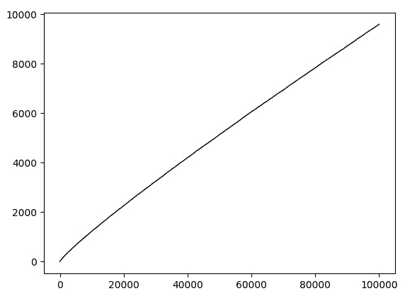
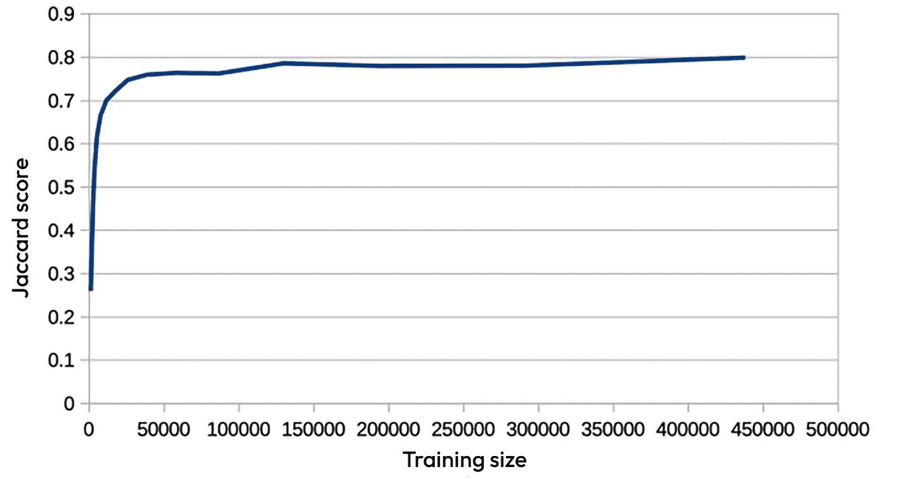

# 第六章：朴素贝叶斯

在*第五章*《情感词典和向量空间模型》中，我们研究了使用简单的基于词典的分类器，既使用了手工编写的情感词典，也从标注文本语料库中提取词典。这项调查的结果表明，这样的模型可以产生合理的分数，通过一系列调整（使用词干提取器或改变权重计算方式，例如使用 TF-IDF 分数）在某些情况下可以改善性能，但在其他情况下则不行。现在，我们将转向一系列机器学习算法，看看它们是否能带来更好的结果。

对于我们将要探讨的大多数算法，我们将使用 Python 的 scikit-learn（`sklearn`）实现。所有这些算法都有广泛的实现。`sklearn`版本有两个显著优势：它们可以免费获得，并且具有相当一致的接口来处理训练和测试数据，并且可以轻松安装在标准计算机上运行。它们也有一个显著的缺点，即其中一些比专为在配备快速 GPU 或其他高度并行处理器的计算机上运行的版本要慢。幸运的是，大多数算法在标准机器上运行速度相当快，即使是运行速度最慢的，在我们的最大数据集上也能在大约半小时内训练出一个模型。因此，对于我们在这里探讨的任务，即比较各种算法在相同数据集上的性能，优势超过了在非常大的数据集上，其中一些算法将花费不可行的时间的事实。

在本章中，我们将探讨朴素贝叶斯算法。我们将研究在*第五章*《情感词典和向量空间模型》中使用的各种预处理步骤的影响，但不会探讨这个包提供的所有调整和参数设置。`sklearn`的各种包提供了一系列选项，这些选项可以影响给定算法的准确度或速度，但通常我们不会尝试所有选项——很容易被参数调整所吸引，希望获得几个百分点的提升，但对于我们的目标，即探讨情感挖掘的方法，考虑数据变化对性能的影响更有用。一旦你选择了算法，那么研究参数变化的影响可能是有价值的，但本书的目的是查看算法对带有情感标签的推文的处理效果，而不是研究算法本身的细节。

我们将本章的起点放在如何准备我们的数据集以匹配`sklearn`表示上。然后，我们将简要介绍朴素贝叶斯机器学习方法，然后

将`sklearn.naive_bayes.MultinomialNB`中的朴素贝叶斯实现应用于我们的数据集，并考虑为什么算法会表现出这样的行为，以及我们可以做些什么来提高它在我们的数据上的性能。在本章结束时，你将清楚地理解朴素贝叶斯背后的理论，以及将其作为为推文分配情感的方式的有效性。

在本章中，我们将涵盖以下主题：

+   为`sklearn`准备数据

+   朴素贝叶斯作为机器学习算法

+   惊叹号地应用贝叶斯定理作为分类器

+   多标签和多类别数据集

# 为`sklearn`准备数据

`sklearn`包期望训练数据由一组数据点组成，其中每个数据点是一个实值向量，以及一组表示每个数据点所属类别的数值标签。我们的数据由推文集合组成，其中每个推文由一组单词和其他值表示，例如`[0, 0, 1, 1, 0, 0]`，其中集合中的每个元素对应一个单一维度。因此，如果某个训练集中的情感集合是`['anger', 'fear', 'joy', 'love', 'sadness', 'surprise']`，那么`[0, 0, 1, 1, 0, 0]`集合将表示给定的推文被标记为表达喜悦和爱情。我们将使用 CARER 数据集来说明如何将我们的数据集转换为尽可能符合`sklearn`包要求的格式。

初始时，我们将数据集表示为在*第五章*中定义的 DATASET，*情感* *词典和* *向量空间模型*。要将数据集转换为适合`sklearn`的形式，我们必须将标签分配给推文的独热编码转换为单个数值标签，并将代表推文的标记转换为稀疏矩阵。前者是直接的：我们只需枚举值列表，直到遇到非零情况，此时该情况的索引就是所需值。如果有多个非零列，这种编码将只记录找到的第一个——这将扭曲数据，但如果我们使用具有多个标签的数据的独热编码，这是不可避免的。唯一复杂的情况是，如果推文可能没有分配标签，因为在这种情况下，我们将到达列表的末尾而没有返回值。如果`allowZeros`设置为`True`，那么我们将返回实际可能情况范围之外的列——也就是说，我们将编码值的缺失作为一个新的显式值：

```py
def onehot2value(l, allowZeros=False):    for i, x in enumerate(l):
        if x == 1:
            return i
    if allowZeros:
        return len(l)
    else:
        raise Exception("No non-zero value found")
```

我们可以使用它来帮助构建训练集的稀疏矩阵表示，如在第五章的*向量空间*部分所述，*第五章*，*情感词典和向量空间模型*。要创建稀疏矩阵，你必须收集所有数据非零情况下的行、列和数据并行列表。因此，我们必须逐个检查推文（推文编号=行编号），然后检查推文中的标记；我们必须在索引中查找标记（标记索引=列编号），确定我们想要为该标记使用的值（要么是 1，要么是其`idf`），然后将这些添加到`rows`、`columns`和`data`中。一旦我们有了这三个列表，我们就可以直接调用稀疏矩阵的构造函数。稀疏矩阵有几种形式：`csc_matrix`创建一个当每行只包含少量条目时适合的表示。我们必须排除出现次数不超过`wthreshold`次的单词，因为包含非常罕见的单词会使矩阵变得不那么稀疏，从而减慢速度，而不会提高算法的性能：

```py
from scipy import sparsedef tweets2sparse(train, wthreshold=1):
    rows = []
    data = []
    columns = []
    for i, tweet in enumerate(train.tweets):
        t = sum(train.idf[token] for token in tweet.tokens)
        for token in tweet.tokens:
            if train.df[token] > wthreshold:
                rows.append(i)
                columns.append(train.index[token])
                if useDF:
                    s = train.idf[token]/t
                else:
                    s = 1
                data.append(s)
    return sparse.csc_matrix((data, (rows, columns)),
                             (len(train.tweets[:N]),
                              len(train.index)))
```

一旦我们将分配给推文的标签表示转换为独热格式，并且我们可以将一组带有黄金标准标签的推文转换为稀疏矩阵，我们就拥有了构建分类器所需的一切。我们如何使用这些结构将完全取决于分类器的类型和数据点到单类标识符的独热值。我们所有的`sklearn`分类器都将是一个名为`SKLEARNCLASSIFIER`的通用类的子类：`SKLEARNCLASSIFIER`的定义不包括构造函数。我们只会创建这个类的子类的实例，所以在某种程度上它就像一个抽象类——它提供了一些将被多个子类共享的方法，例如用于创建朴素贝叶斯分类器、支持向量机分类器或深度神经网络分类器。

分类器，但我们永远不会实际创建一个`SKLEARNCLASSIFIER`类。在`SKLEARNCLASSIFIER`中，我们首先需要的是读取训练数据并将其转换为稀疏矩阵的功能。`readTrainingData`通过使用*第五章*，*情感词典和向量空间模型*中的`makeDATASET`来实现这一点，然后将训练数据转换为稀疏矩阵，并将与训练数据相关的标签转换为独热格式：

```py
class SKLEARNCLASSIFIER(classifiers.BASECLASSIFIER):    def readTrainingData(self, train, N=sys.maxsize,
                         useDF=False):
        if isinstance(train, str):
            train = tweets.makeDATASET(train)
        self.train = train
        self.matrix = tweets.tweets2sparse(self.train, N=N,
                                           useDF=useDF)
        # Convert the one-hot representation of the Gold
        # Standard for each tweet to a class identifier
        emotions = self.train.emotions
        self.values = [tweets.onehot2value(tweet.GS,
                                           emotions)
                       for tweet in train.tweets[:N]]
```

我们需要一个函数来将分类器应用于推文。这个默认值被定义为`SKLEARNCLASSIFIER`的方法，它封装了底层`sklearn`类的`predict`方法，并返回结果，具体格式取决于需要什么：

```py
    def applyToTweet(self, tweet, resultAsOneHot):        p = self.clsf.predict(tweets.tweet2sparse(tweet,
                                                  self))[0]
        if resultAsOneHot:
            k = [0 for i in self.train.emotions]+[0]
            k[p] = 1
            return k
        else:
            return p
```

我们所有使用`sklearn`的分类器都将是这个通用类型的子类。它们都将使用`readTrainingData`——即，将一组推文转换为稀疏矩阵的机制——并且它们都将需要`applyToTweet`的某个版本。`SKLEARNCLASSIFIER`提供了这些的默认版本，尽管一些分类器可能会覆盖它们。我们将使用`SKLEARNCLASSIFIER`作为基类开发的第一个分类器将涉及使用贝叶斯定理来分配事件的概率。首先，我们将研究贝叶斯定理背后的理论及其在分类中的应用，然后再转向如何实现这些细节的具体方法。

# 高级贝叶斯作为机器学习算法

Naïve Bayes 算法背后的关键思想是，你可以通过使用**条件概率**并将单个观察结果与结果联系起来，来估计给定一组观察结果的一些结果的似然性。定义什么是条件概率出人意料地困难，因为概率本身的概念非常模糊。概率通常被定义为与比例类似的东西，但当你观察独特或无界的集合时，这种观点就变得难以维持，这通常是你想要使用它们的时候。

假设，例如，我正在试图计算法国赢得 2022 年 FIFA 世界杯的可能性（本文是在决赛前两天写的，法国和阿根廷之间的决赛即将进行）。在某种意义上，询问这个概率是合理的——如果博彩公司提供 3 赔 1 的赔率，他们赢得的概率是 0.75，那么我应该在这个结果上下注。但是，这个概率*不能*定义为*#(法国赢得 2022 年世界杯的次数)/#(法国参加 2022 年世界杯决赛的次数)*。现在，这两个数字都是 0，所以概率看起来是 0/0，这是未定义的。等你读到这篇文章的时候，第一个数字将是 0 或 1，第二个数字将是 1，所以法国赢得世界杯的概率将是 0 或 1。博彩公司和赌徒会估计这个可能性，但他们不能通过实际计算尚未进行的比赛结果以法国为胜的比例来做到这一点。

因此，我们不能通过观察事件发生给定结果的比例来定义未来一次性事件的概率，因为我们还没有观察到结果，同样地，我们也不能以这种方式合理地定义过去一次性事件的概率，因为一旦事件发生，它必然是 0 或 1。

但我们也不能将一个结果的可能性，例如一系列看似相似事件的似然性定义为比例。我一生中每天早上都看到它变亮的事实——即，25,488 次中有 25,488 次——并不意味着明天早上它会变亮的可能性是 1。明天早上可能会有所不同。太阳可能变成了黑洞并停止了辐射。可能发生了一次巨大的火山爆发，天空可能被完全遮蔽。*明天可能不会和今天一样*。

此外，我们也不能用有限子集成员满足该属性的频率来定义一个无界集成员满足该属性的似然性。考虑一个随机选择的整数是质数的可能性。如果我们绘制前几个整数中质数出现的次数，我们得到的图类似于以下：



图 6.1 – 前 N 个整数中的质数数量

看起来，前 10,000 个整数中的质数数量呈线性增长，大约有 10%的数字是质数。如果我们查看前 10 亿个整数，那么大约有 6%是质数。真正的概率是什么？不能将其定义为质数数量与整数数量的比率，因为这两个都是无限的，∞/∞是未定义的。看起来，当我们查看更多案例时，比例会下降，所以它可能趋于 0，但它不是 0。结果发现，定义或估计涉及无界集的概率非常困难。

我们可以*估计*前两种事件的可能性。我们可以查看所有我们认为与当前法国和阿根廷队相似的球队之间的足球比赛，并使用类似当前法国队的球队击败类似当前阿根廷队的球队次数。我可以回顾我生命中的所有日子，并说如果明天在所有相关方面都像所有其他日子一样，那么我对它明天早上会变轻的可能性估计是 1。但这些只是估计，并且它们取决于下一个事件在所有相关方面都与前一个事件相同。

这一直是自 19 世纪以来概率论和统计学中的一个棘手问题。由于这个原因，托马斯·贝叶斯（Thomas Bayes）等人将概率定义为，本质上，某人可能合理地分配给某个结果的几率（Bayes, T, 1958）。计算以往的经验可能是一个重要部分，这样的人可能会在提出他们的合理分配时使用这些信息，但由于无法知道下一个事件在所有相关方面都会与过去的事件相似，因此不能将其用作定义。

因此，我们无法说出给定结果的概率是什么。然而，我们可以定义如果我们有这样一个概率，它应该如何表现。如果你的合理估计不遵守这些约束，那么你应该修改它！

概率分布应该是什么样的？假设我们有一个有限集，*{O1, ... On}*，的可能结果，任何概率分布都应该满足以下约束：

+   对于所有结果*Oi*，*p(Oi) >= 0*

+   *p(O1) + ... +p(On) = 1*

+   *p(Oi or Oj) = p(Oi)+p(Oj)* 对于*i ≠ j*

前两个约束共同意味着对于所有*Oi*，*p(Oi) <= 1*，第二个和第三个意味着*p(not(Oi)) = 1-p(Oi)*（因为*not(Oi)*是*O1*或*O2*或...或*Oi-1*或*Oi+1*或..或*On*）。

这些约束对*Oi*和*Oj*同时发生的可能性没有任何说明。考虑到初始条件，这是不可能的，因为*O1*，... *On*被指定为不同的可能结果。关于多个结果，我们最多只能说，如果我们有两个*完全不同且不相连*的事件集，每个集都有可能的结果，*O1*，... *On*和*Q1*，... *Qm*，那么*Oi*和*Qj*发生的概率必须是*p(Oi) X p(Qj)*。就像我们无法确定我们关心的事件是否在所有相关方面都像集合中的其他事件一样，我们也无法确定两组事件是否真的不相连，因此，这又是一个关于概率度量应该如何表现而不是定义的约束。

考虑到所有这些，我们可以定义在已知某个事件*B*已经发生（或者实际上我们知道*B*将会发生）的情况下，某个事件*A*的条件概率：

+   *p(A | B) = p(A &* *B)/p(B)*

已知我们了解*B*，*A*的可能性有多大？嗯，这就是它们一起发生的可能性除以*B*本身的可能性（所以，如果它们一起发生 5%的时间，而*B*本身发生 95%的时间，那么看到*B*不会让我们更有可能期望*A*，因为*A*只在*B*发生的 19 次中出现 1 次；然而，如果它们一起发生 5%的时间，但*B*本身只发生 6%，那么看到*B*将是一个强有力的线索，表明*A*将会发生，因为*A*在*B*发生的 6 次中有 5 次发生）。

这个定义直接导致**贝叶斯定理**：

+   *p(A | B) = p(A & B)/p(B)* 定义

+   *p(B | A) = p(B & A)/p(A)* 定义

+   *p(A & B)= p(B &A)* 对*A*和*B*的约束

+   *p(B & A) = p(B | A)×p(A)* 重新排列(*2*)

+   *p(A | B) = p(B | A)×p(A)/p(B)* 将(*4*)代入(*1*)

如果我们有一个事件集，*B1*, ... *Bn*，那么我们可以使用贝叶斯定理来说明*p(A | B1 & ... Bn) = p(B1 & ...Bn | A)×p(A)/p(B1 & ...& Bn)*。如果*B**i* *是完全不相连的*，我们可以说*p(A | B1 & ... Bn) = p(B1 | A) ×p(Bn |* *A)×p(A)/(p(B1) ×p(Bn))*。

这可以非常方便。假设 *A* 是“这条推文被标记为愤怒”，而 *B1*、...、*Bn* 是“这条推文包含单词 *furious*”、“这条推文包含单词 *cross*”、“...”、“这条推文包含单词 *irritated*”。我们可能从未见过包含这三个单词的推文，因此我们无法通过计数来估计 *A* 的似然。然而，我们将看到包含这些单词的推文，我们可以计算被标记为 **angry** 的推文中包含 *furious*（或 *cross* 或 *irritated*）的数量，以及总共被标记为 **angry** 的数量，忽略它们包含的单词，以及包含 **furious**（或 *cross* 或 *irritated*）的数量，忽略它们的标签。因此，我们可以对这些做出合理的估计，然后我们可以使用贝叶斯定理来估计 *p(A | B1 & ..* *Bn)*。

这种应用贝叶斯定理的方法假设事件 *B1*、...、*Bn* 完全不相关。这很少是真实的：包含单词 *cross* 的推文更有可能也包含 *irritated*，而不是不包含。因此，虽然我们可以确实地以这种方式 *天真地* 错误地使用贝叶斯定理来获得给定一组观察结果的一些结果的可用估计，但我们永远不应该忽视这些估计本质上是不可靠的这一事实。在下一节中，我们将探讨如何实现这种天真地应用贝叶斯定理作为分类器的方法，并研究它在我们的各种数据集上的表现如何。这种方法成功的关键在于，尽管某些结果的似然估计并不可靠，但不同结果的排名通常是有意义的——如果某些推文是 **angry** 或 **sad** 的概率估计分别是 0.6 和 0.3，那么它确实更有可能是 **angry** 而不是 **sad**，即使实际的数字不能被信赖。

## Naively applying Bayes’ theorem as a classifier

`sklearn.naive_bayes.MultinomialNB` 为我们计算这些总和（这些总和并不困难，但有一个快速计算它们的包是非常方便的）。鉴于这一点，`NBCLASSIFIER` 类的定义非常简单：

```py
class NBCLASSIFIER(sklearnclassifier.SKLEARNCLASSIFIER):    def __init__(self, train, N=sys.maxsize, args={}):
        # Convert the training data to sklearn format
        self.readTrainingData(train, N=N, args=args)
        # Make a naive bayes classifier
        self.clsf = naive_bayes.MultinomialNB()
        # Train it on the dataset
        self.clsf.fit(self.matrix, self.values)
```

这就是制作朴素贝叶斯分类器所需的所有内容：使用 `sklearn.naive_bayes.MultinomialNB` 创建 `SKLEARNCLASSIFIER`。

这效果如何？我们将尝试在我们的数据集上使用这种方法，对于非英语数据集使用词干提取，但英语数据集则不使用（从现在开始我们将这样做，因为这似乎是 *第五章* 中提到的正确选择，*情感词典和向量空间模型*）：

|  | **Precision** | **Recall** | **Micro F1** | **Macro F1** | **Jaccard** |
| --- | --- | --- | --- | --- | --- |
| SEM4-EN | 0.873 | 0.873 | 0.873 | 0.873 | 0.775 |
| SEM11-EN | 0.625 | 0.262 | 0.369 | 0.373 | 0.227 |
| WASSA-EN | 0.830 | 0.830 | 0.830 | 0.830 | 0.709 |
| CARER-EN | 0.874 | 0.874 | 0.874 | 0.874 | 0.776 |
| IMDB-EN | 0.849 | 0.849 | 0.849 | 0.849 | 0.738 |
| SEM4-AR | 0.694 | 0.694 | 0.694 | 0.694 | 0.531 |
| SEM11-AR | 0.628 | 0.274 | 0.381 | 0.393 | 0.236 |
| KWT.M-AR | 0.667 | 0.655 | 0.661 | 0.664 | 0.494 |
| SEM4-ES | 0.525 | 0.535 | 0.530 | 0.462 | 0.360 |
| SEM11-ES | 0.508 | 0.296 | 0.374 | 0.380 | 0.230 |

图 6.2 – 朴素贝叶斯，每条推文一个情绪

首先要注意的是，构建和应用朴素贝叶斯分类器都非常快——每秒可以分类 10K 条推文，甚至在包含 40K 条推文的训练集上训练也只需不到 10 秒。但是，正如之前所说，重要的是分类器是否擅长我们希望它执行的任务。前表显示，对于大多数英语数据集，分数优于第五章中*情感词典和向量空间模型*的分数，特别是 CARER 数据集的改进尤为明显，而 SEM11-EN 的分数在第五章*情感词典和向量空间模型*中明显较低。

回顾 CARER 与其他数据集的主要区别：CARER 比其他数据集大得多，并且与 SEM11 相反，每条推文都与一个标签精确关联。为了查看问题是否与训练集的大小有关，我们将绘制该数据集的准确率与不断增加的训练大小之间的关系：



图 6.3 – Jaccard 分数与训练大小对比，朴素贝叶斯，使用 CARER 数据集

Jaccard 分数从相当低的基数稳步上升，尽管当我们达到大约 40K 条训练推文时它开始趋于平坦，但很明显朴素贝叶斯确实需要相当多的数据。这可能是它对其他数据集效果较差的部分原因：它们简单地没有足够的数据。

值得详细研究一下这个算法的内部工作原理。就像基于词典的分类器一样，朴素贝叶斯构建了一个词典，其中每个词都与各种情绪相关联的分数：

|  | **愤怒** | **恐惧** | **喜悦** | **爱情** | **悲伤** | **惊讶** |
| --- | --- | --- | --- | --- | --- | --- |
| a | 0.0187 | 0.0194 | 0.0203 | 0.0201 | 0.0190 | 0.0172 |
| and | 0.0291 | 0.0284 | 0.0311 | 0.0286 | 0.0308 | 0.0247 |
| the | 0.0241 | 0.0238 | 0.0284 | 0.0275 | 0.0245 | 0.0230 |
| angry | 0.0020 | 0.0003 | 0.0001 | 0.0001 | 0.0003 | 0.0001 |
| happy | 0.0005 | 0.0003 | 0.0014 | 0.0004 | 0.0005 | 0.0004 |
| hate | 0.0007 | 0.0005 | 0.0002 | 0.0003 | 0.0007 | 0.0002 |
| irritated | 0.0013 | 0.0000 | 0.0000 | 0.0000 | 0.0000 | 0.0000 |
| joy | 0.0001 | 0.0001 | 0.0002 | 0.0002 | 0.0001 | 0.0001 |
| love | 0.0009 | 0.0009 | 0.0019 | 0.0030 | 0.0011 | 0.0011 |
| sad | 0.0005 | 0.0003 | 0.0002 | 0.0002 | 0.0010 | 0.0003 |
| scared | 0.0001 | 0.0019 | 0.0001 | 0.0001 | 0.0002 | 0.0001 |
| terrified | 0.0000 | 0.0014 | 0.0000 | 0.0000 | 0.0000 | 0.0000 |

图 6.4 – 单个单词、朴素贝叶斯与 CARER 数据集的得分

与基于词典的模型一样，*a*、*and*和*the*的得分相当高，反映了这些词在大多数推文中出现的事实，因此它们在表达各种情感的推文中出现的条件概率也相当高。当我们通过它们的总体频率来划分它们所做出的贡献时，这些词将被大量抵消。其他所有词的得分都非常小，但总体上，它们与预期的情感相匹配 – *angry*和*irritated*与**愤怒**联系最为紧密，*joy*（几乎）与**快乐**联系最为紧密，依此类推。与不同情感关联程度的差异远不如简单的基于词典的算法明显，因此改进的性能必须归因于贝叶斯定理结合得分的方式的改进。很明显，这些词不是独立分布的：在 CARER 数据集中包含*angry*和*irritated*以及两者都包含的推文比例分别为 0.008、0.003 和 0.0001。如果我们把这些作为相应概率的估计，我们会发现 p(*angry* + *irritated*)/p(*angry*) X p(*irritated*) = 3.6，如果这些词是独立分布的，那么这个值应该是 1。这并不令人惊讶 – 你在单个推文中使用表达相同情感的词比使用表达不同情感或彼此无关的词的可能性要大得多。尽管如此，贝叶斯定理足够稳健，即使在应用它的条件不完全适用的情况下，只要我们有足够的数据，它也能给出有用的结果。

## 多标签数据集

SEM11 与其他数据集的关键区别在于 SEM11 集中的推文可以被分配任意数量的情感 – 它们是多标签数据集，如*第五章*中定义的，*情感词典和向量空间模型*。实际的分布如下：

|  | **0** | **1** | **2** | **3** | **4** | **5** | **6** | **7** | **8** | **9** | **10** |
| --- | --- | --- | --- | --- | --- | --- | --- | --- | --- | --- | --- |
| SEM11-EN | 205 | 997 | 2827 | 2151 | 662 | 100 | 11 | 0 | 0 | 0 | 0 | 0 |
| SEM11-AR | 17 | 544 | 1005 | 769 | 210 | 33 | 3 | 0 | 0 | 0 | 0 | 0 |
| SEM11-ES | 179 | 1499 | 1605 | 479 | 52 | 1 | 1 | 0 | 0 | 0 | 0 | 0 |

图 6.5 – 每个 SEM11 数据集中带有 0，1，2，...情感标签的推文数量

在每种情况下，大多数推文都有两个或更多的标签。这使得任何为每条推文分配一个标签的算法很难获得高分——对于每个没有标签的推文，必须有假阳性，对于每个有 K 个标签的推文，必须有 K-1 个假阴性（因为，最多只有一个，K，被选中，因此 K-1 没有被选中）。假设我们有*N*条推文，其中*Z*没有标签，*O*恰好有一个标签，而*M*有多个标签。所以，即使我们假设我们的分类器在推文至少有一个标签时总是正确地得到一个标签，所能获得的最佳 Jaccard 分数是*(O+M)/(O+2*M+Z)*——将有*O+M*个真阳性（所有应该分配一个标签的情况，加上根据假设应该有多个标签的情况），至少*Z*个假阳性（每个应该没有标签的推文一个），至少*M*个假阴性。

因此，对于 SEM11-EN 数据集，通过算法为每条推文分配一个标签所能获得的最佳 Jaccard 分数是 0.41（如果分配给任何具有一个或多个标签的推文的标签都是正确的，那么我们将有 6,748 个真阳性，205 个假阳性，和 9,570 个假阴性）。如果这是算法可能达到的最大 Jaccard 分数，那么我们之前获得的约 0.2 的分数并不算太差。

但它们并不如我们在*第五章*“情感词典和向量空间模型”中为这些数据集获得的分数好。我们需要 somehow 让朴素贝叶斯返回多个标签。

这实际上相当简单。我们可以使用贝叶斯定理来估计每个可能结果的概率。`sklearn.naive_bayes.MultinomialNB`通常选择概率最高的结果，但它有一个方法，`predict_log_proba`，它返回每个可能结果的概率的对数（由于使用对数可以替换乘法为加法，这通常很方便，因为加法运算比乘法运算快得多）。我们可以使用这个来选择，例如，每个概率超过某个阈值的输出，或者选择最好的两个而不是仅仅最好的一个。我们将依次查看这两个选项。对于第一个，我们将使用与`NBCLASSIFIER`相同的构造函数，我们只需将`applyToTweet`更改为使用`predict_log_proba`而不是`predict`：

```py
class NBCLASSIFIER1(NBCLASSIFIER):    def applyToTweet(self, tweet, resultAsOneHot=True):
        tweet = tweets.tweet2sparse(tweet, self)
        # use predict_log_proba
        p = self.clsf.predict_log_proba(tweet)[0]
        # compare to previously defined threshold
        threshold = numpy.log(self.threshold)
        return [1 if i > threshold else 0 for i in p]
```

下表只是为了方便比较而复制了之前用于处理朴素贝叶斯多标签情况的表格：

|  | **精确度** | **召回率** | **微观 F1** | **宏观 F1** | **Jaccard** |
| --- | --- | --- | --- | --- | --- |
| SEM11-EN | 0.625 | 0.262 | 0.369 | 0.373 | 0.227 |
| SEM11-AR | 0.628 | 0.274 | 0.381 | 0.393 | 0.236 |
| KWT.M-AR | 0.667 | 0.655 | 0.661 | 0.664 | 0.494 |
| SEM11-ES | 0.508 | 0.296 | 0.374 | 0.380 | 0.230 |

图 6.6 – 朴素贝叶斯，每条推文一个情感，多类情况

以下表格显示了当我们允许分类器为推文分配多个情感时会发生什么：

|  | **精确率** | **召回率** | **微观 F1** | **宏观 F1** | **Jaccard** |
| --- | --- | --- | --- | --- | --- |
| SEM11-EN | 0.515 | 0.356 | 0.421 | 0.424 | 0.267 |
| SEM11-AR | 0.494 | 0.381 | 0.430 | 0.444 | 0.274 |
| KWT.M-AR | 0.645 | 0.704 | 0.673 | 0.677 | 0.507 |
| SEM11-ES | 0.419 | 0.394 | 0.406 | 0.415 | 0.255 |

图 6.7 – 朴素贝叶斯，具有最佳阈值的多个结果，SEM11 数据集

在每种情况下，我们显著提高了召回率（因为我们现在允许每条推文选择多个标签），但代价是精确率下降。Jaccard 分数略有上升，但并未达到比第*第五章*中获得的分数更好的程度，即*情感词典和向量空间模型*。

我们也可以简单地要求每条推文有两个标签。同样，这将提高召回率，因为我们为所有应该有两个标签的情况都提供了两个标签，为所有应该有三个标签的情况提供了两个，为所有应该有四个标签的情况提供了两个——也就是说，我们可能会减少错误标签的数量

负面标签的数量也会不可避免地增加，因为我们会在本应没有或只有一个标签的地方有两个标签。这是一个极其简单的算法，因为它没有注意到何时应该允许两个标签——我们只是假设在每种情况下这都是正确的做法：

```py
class NBCLASSIFIER2(NBCLASSIFIER):    def applyToTweet(self, tweet, resultAsOneHot=True):
        tweet = tweets.tweet2sparse(tweet, self)
        p = self.clsf.predict_log_proba(tweet)[0]
        # pick the second highest score in p
        threshold = list(reversed(sorted(list(p))))[2]
        return [1 if i > threshold else 0 for i in p]
```

这进一步略微提高了 SEM11 案例的精确率，但仍然不足以超过第*第五章*中*情感词典和向量空间模型*的结果，对 KWT.M-AR 来说更是灾难性的，其中有一些案例有多个分配，而大多数案例则完全没有分配——迫使分类器在应该没有标签的情况下选择两个标签将对精确率产生重大影响！

|  | **精确率** | **召回率** | **微观 F1** | **宏观 F1** | **Jaccard** |
| --- | --- | --- | --- | --- | --- |
| SEM11-EN | 0.477 | 0.404 | 0.437 | 0.429 | 0.280 |
| SEM11-AR | 0.474 | 0.413 | 0.441 | 0.440 | 0.283 |
| KWT.M-AR | 0.461 | 0.906 | 0.611 | 0.612 | 0.440 |
| SEM11-ES | 0.370 | 0.431 | 0.398 | 0.395 | 0.249 |

图 6.8 – 朴素贝叶斯，最佳两个结果，多标签数据集

因此，我们有两种非常简单的方法将朴素贝叶斯转换为具有多个（或零个）结果的分类器。在两种情况下，与标准版本相比的改进都是微小的但很有用。在两种情况下，都需要我们了解一些关于训练集的信息——第一种需要我们选择一个阈值来比较单个分数，第二种需要我们知道每条推文的输出数量分布。这意味着在这两种情况下，我们都要使用训练数据做两件事——像标准情况一样找到条件概率，然后选择最佳可能的阈值或查看输出数量的分布；为此，我们必须将训练数据分成两部分，一个用于找到基本概率的训练部分，然后是一个**开发**部分用于找到额外信息。这在需要调整基本模型的情况下很常见。没有规则说我们必须像必须保持训练集和测试集分离一样保持训练集和开发集分离，但实践中，这样做通常会产生比使用训练集作为开发集更好的结果。

然而，多标签数据集的分数仍然比在*第五章*“情感词典和向量空间模型”中的分数要差。我们可以尝试这两种策略的组合，例如，只要两者都满足某些条件，就可以要求最好的两个结果。

阈值，但无论如何调整都不会将朴素贝叶斯转变为多标签问题的良好分类器。我们将在*第十章*“多分类器”中回到这个问题。

我们还需要尝试找出为什么朴素贝叶斯在 SEM4、CARER 和 IMDB 数据集上相对于基于词典的方法有相当大的改进，但在 WASSA 上表现较差。我们已经看到，随着训练数据的增加，朴素贝叶斯在 CARER 上的性能显著提高。这三个数据集的大小分别是 SEM4-EN 6812，WASSA-EN 3564，和 CARER-EN 411809。如果我们将这三个案例的训练数据限制为与 WASSA 相同，会发生什么？以下表格是原始表格的相关部分的副本，每个案例都使用完整数据集：

|  | **精确率** | **召回率** | **微观 F1** | **宏观 F1** | **Jaccard** |
| --- | --- | --- | --- | --- | --- |
| SEM4-EN | 0.873 | 0.873 | 0.873 | 0.873 | 0.775 |
| WASSA-EN | 0.830 | 0.830 | 0.830 | 0.830 | 0.709 |
| CARER-EN | 0.874 | 0.874 | 0.874 | 0.874 | 0.776 |
| IMDB-EN | 0.849 | 0.849 | 0.849 | 0.849 | 0.738 |

图 6.9 – 基于朴素贝叶斯，英文单类数据集 – 完整训练集

当我们将可用的数据量减少到与 WASSA 相同，结果如预期的那样变得更差：

|  | **精确率** | **召回率** | **微观 F1** | **宏观 F1** | **Jaccard** |
| --- | --- | --- | --- | --- | --- |
| SEM4-EN | 0.837 | 0.837 | 0.837 | 0.837 | 0.719 |
| WASSA-EN | 0.830 | 0.830 | 0.830 | 0.830 | 0.709 |
| CARER-EN | 0.732 | 0.732 | 0.732 | 0.732 | 0.577 |
| IMDB-EN | 0.825 | 0.825 | 0.825 | 0.825 | 0.703 |

图 6.10 – 朴素贝叶斯，英语单类别数据集 – 限制训练集

我们对 SEM4-EN、CARER-EN 和 IMDB-EN 数据集的改进相对于第五章中*“情感词典和向量空间模型”*的结果现在不那么明显，尤其是对于 CARER-EN：当我们限制数据集大小时，信息丢失是显著的。

是否还有其他可能解释这些差异的因素？拥有更多的类别会使问题更加困难。例如，如果你有 10 个类别，那么随机选择正确的概率将是 10%

在 5 个类别的情况下，随机选择正确率仅为 20%。然而，SEM4-EN 和 WASSA-EN 具有相同的标签集，即**愤怒**、**恐惧**、**快乐**和**悲伤**，而 CARER-EN 除了这四个标签外还有**爱**和**惊讶**，所以如果这是关键因素，我们预计 SEM4-EN 和 WASSA 的版本会产生相似的结果，而 CARER 会略差一些，但这并不是我们观察到的结果。此外，可能存在一个类别分布非常不均的集合，这可能会产生影响。然而，SEM4-EN 和 WASSA-EN 之间各种情绪的分布相当相似：

SEM4-EN: 愤怒：834，恐惧：466，快乐：821，悲伤：1443

WASSA-EN: 愤怒：857，恐惧：1098，快乐：823，悲伤：786

SEM4-EN 有更多表达悲伤的推文，而 WASSA-EN 有更多表达恐惧的推文，但差异并不足以导致你期望分类器的性能有差异。这两个数据集的词汇量几乎相同（75723 与 75795），平均每条推文的标记数也几乎相同（均为 21.2）。有时，似乎一个分类器非常适合一个任务，而另一个分类器更适合另一个任务。

# 摘要

在本章中，我们看到了朴素贝叶斯可以作为寻找推文中情感的分类器工作得非常好。它在大训练集上尤其有效（由于它只是计算单词及其出现在其中的推文所关联的情感的出现次数，因此训练时间非常短）。它可以相当直接地适应与可能具有任何数量标签（包括零）的单条推文一起工作的数据集，但在具有此属性的测试集上，它被第五章中*“情感词典和向量空间模型”*的基于词典的方法所超越。*图 6.11*显示了迄今为止各种数据集的最佳分类器：

|  | **LEX** | **CP** | **NB (single)** | **NB (multi)** |
| --- | --- | --- | --- | --- |
| SEM4-EN | 0.503 | 0.593 | 0.775 | *******0.778*** |
| SEM11-EN | 0.347 | *******0.353*** | 0.227 | 0.267 |
| WASSA-EN | 0.445 | 0.505 | *******0.709*** | 0.707 |
| CARER-EN | 0.350 | 0.395 | *******0.776*** | 0.774 |
| IMDB-EN | 0.722 | 0.722 | 0.738 | *******0.740*** |
| SEM4-AR | 0.506 | 0.513 | 0.531 | *******0.532*** |
| SEM11-AR | 0.378 | *******0.382*** | 0.236 | 0.274 |
| KWT.M-AR | *******0.687*** | 0.666 | 0.494 | 0.507 |
| SEM4-ES | *******0.425*** | 0.177 | 0.360 | 0.331 |
| SEM11-ES | 0.269 | *******0.278*** | 0.230 | 0.255 |

图 6.11 – 目前最佳分类器

一般来说，朴素贝叶斯是针对每个推文只有一个标签的数据集的最佳分类器，在这些数据集中，朴素贝叶斯假设每个推文只有一个标签的版本与允许多个标签的版本之间的边际差异不大。对于多标签数据集，允许多个标签的版本总是优于不允许的版本，但在所有这些情况下，来自 *wwwwwwwwwww, Sentiment Lexicons and Vector Space Models* 的基于词典的分类器表现最佳。到目前为止，本章最大的教训是，在尝试解决分类问题时，你应该尝试各种方法，并选择效果最好的方法。在接下来的章节中，我们将看到当我们查看更复杂的机器学习算法时会发生什么。

# 参考文献

要了解更多关于本章所涉及的主题的信息，请查看以下资源：

+   Bayes, T. (1958). *An essay towards solving a problem in the doctrine of chances*. Biometrika, 45(3–4), 296–315\. [`doi.org/10.1093/biomet/45.3-4.296`](https://doi.org/10.1093/biomet/45.3-4.296).
