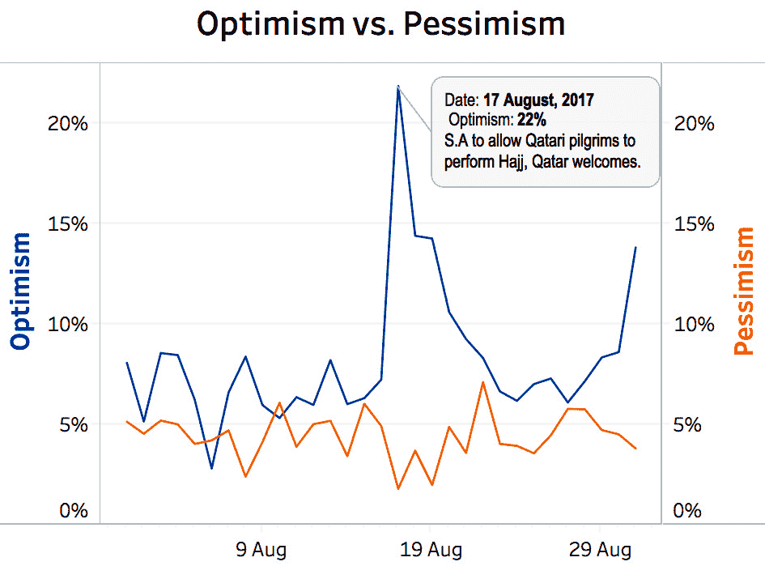
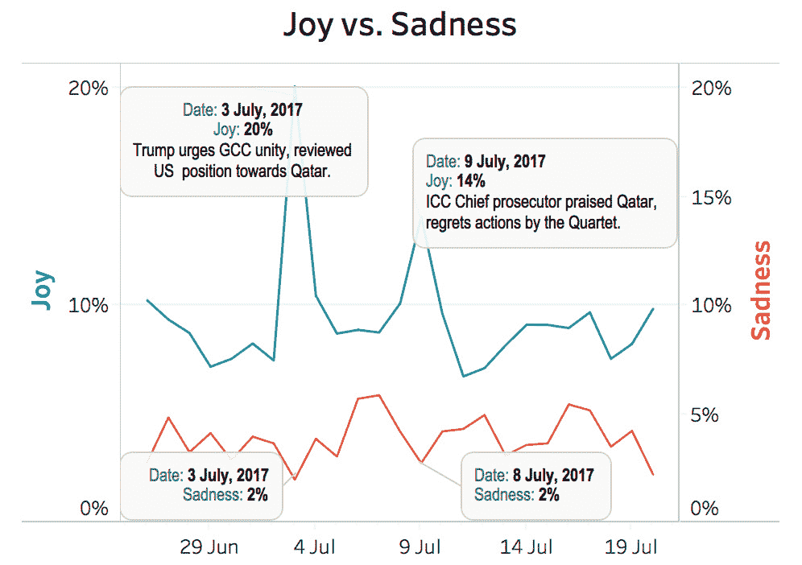
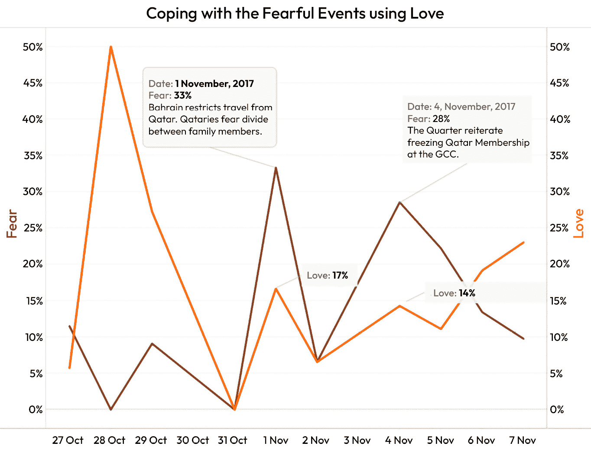
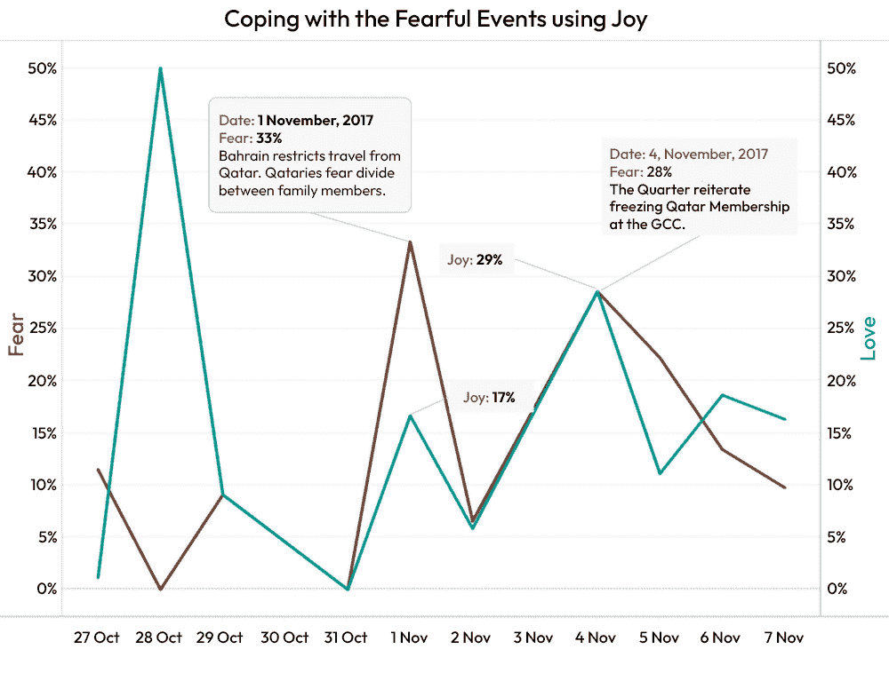
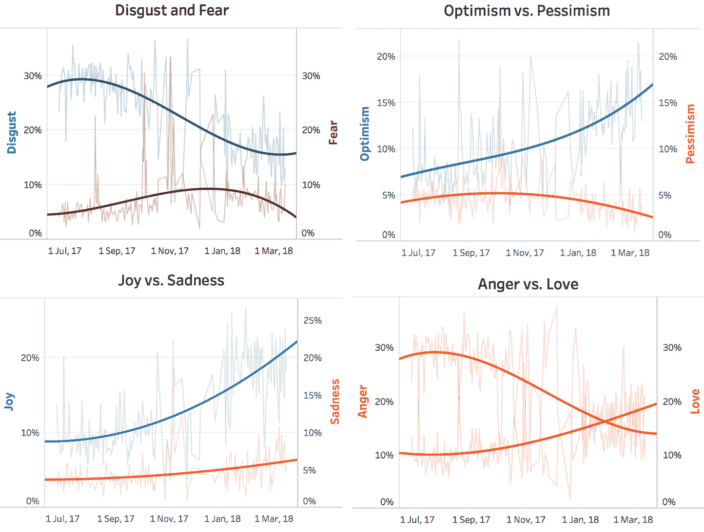
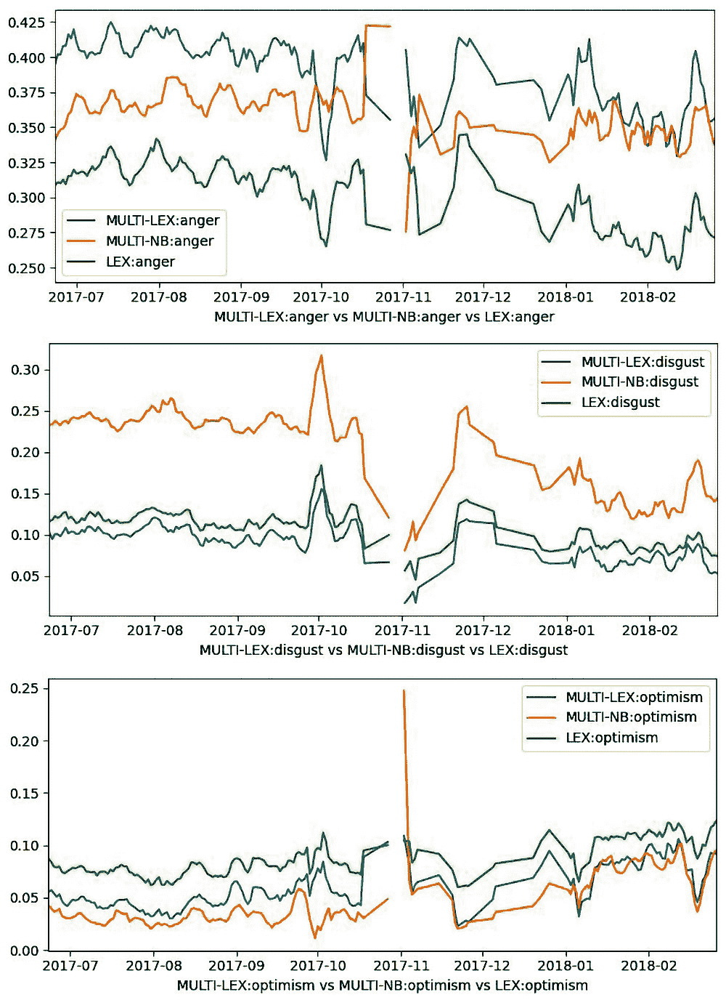
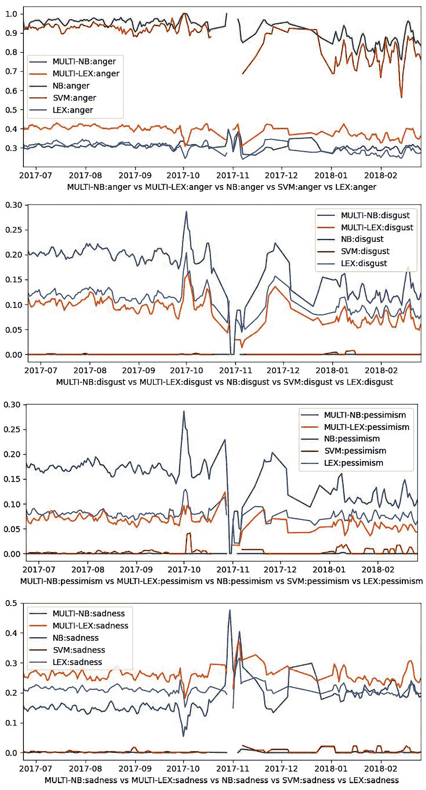

# 第十一章：案例研究 – 卡塔尔封锁

在本章中，我们将探讨当我们将我们的一个分类器应用于未经仔细整理的实时数据时会发生什么，我们没有黄金标准，而且这些数据也不是我们训练分类器的数据。这是一个真实的生活场景。你已经训练了一个分类器；现在，你想要使用它。我们之前看到的分类器在这种情况下表现如何？在本章中，我们将比较分类器在收集了长期数据的事件发生时的输出，以查看情绪模式的变化是否可以与故事的发展联系起来，以及是否可以检测到公众态度的长期变化以及关键事件的即时反应。这项分析将分为三个部分：

+   我们将研究特定事件如何导致推文中表达的情绪模式的短期变化

+   我们将研究是否可以通过追踪情绪随时间变化的方式，来检测公众态度的长期变化

+   我们将查看几个分类器在一段时间内的比例分数，以确定比例是否是一个好的指标 – 如果所有分类器的比例分数显示出相同的趋势，那么在寻找推文中表达的情绪的峰值和长期趋势时，使用这个作为指标可能是安全的。

到本章结束时，你将能够欣赏到情感分析工具在多大程度上可以告诉你关于公众态度的有趣信息，即使它们所训练的数据与它们应用的数据并不紧密相关。

在前几章中，我们看到了使用机器学习技术训练工具，可以将情绪分配给推文的可能性。这些算法在每条推文分配一个情绪的数据上表现良好，在类似数据上的性能变化相对较小，但在零个或多个标签可以分配给推文的数据集上则更困难。在前一章中，我们建议比例可能为评估

即使有大量带有零个或多个标签的推文，分类器是否提供了一个可靠的总体视图。使用多个分类器，其中以 LEX 或朴素贝叶斯作为基础分类器，并以**中性**作为一个显式标签，对于关键数据集给出了可接受的 F1 分数和相当高的比例分数。

然而，这项分析是在精心策划的数据集上进行的，其中所有推文都被严格标记，训练集和测试集是从同一个整体集合中分割出来的 10 个单独的 90:10 折中抽取的。标签是由多个注释者分配的，如果一个推文的注释者都同意或者大多数同意，那么就会给这个推文分配一个标签。折被精心构建，以便在分割成训练集和测试集之前，推文被随机打乱，对于给定的折，训练集和测试集之间没有重叠，每个推文在测试集中恰好出现一次。因此，对于相关数据，结果可能是最可靠的。

然而，它们并没有告诉我们，当将这些分类器应用于除了给定的训练集和测试集以外的数据时，它们的可靠性如何。使用其他标准收集的数据很可能具有不同的特征。情绪的整体分布很可能会变化——毕竟，这项技术的明显应用是分析对某些事件的态度如何随时间变化，这可能会影响，例如，朴素贝叶斯使用的先验概率，从而可能影响各种标签的分配。例如，假设训练集中有 10%的推文被标记为**愤怒**，但在某个具体的一天，关于某个问题的愤怒情绪上升，当天的 50%的推文都是愤怒的。考虑包含单词 *T1, …, Tn* 的某些推文。朴素贝叶斯公式的说法是 *p(anger | T1 & … & Tn) = p(T1 | anger)×... × p(Tn | anger) × p(anger)/p(T1)×... × p(Tn)*。这里的 *p(anger)* 将来自原始数据，其中只有 10%的推文表达愤怒；但在问题所涉及的那天，有 50%的推文表达愤怒，所以这个公式的一部分将导致对该情绪的相当低估。如果 *T1, … Tn* 是与**愤怒**相关的单词，*p(T1), …, P(Tn)* 也可能是对这一天它们频率的低估，这在一定程度上可以补偿 *p(anger)* 中的错误，但认为它们可以完全补偿它是不合理的。

其他算法可能也会遇到类似的问题，尽管很难确切地看到这将在其他案例中如何展开。然而，很明显，从一个集合中提取的测试数据上的性能不能假设可以转移到从另一个集合收集的数据上。

也不可能注释所有新的数据来检查分类器的准确性。构建分类器的全部目的就是，我们希望从我们没有资源手动标记的新数据中收集信息——如果我们能够负担得起手动标记，那么我们几乎肯定会比任何分类器得到更好的结果，因为给推文分配标签是一项本质上主观的任务。

# 案例研究

为了研究文本中表达的情感与现实世界事件之间的联系，我们需要收集一段时间内的大量推文，以及该期间发生的主要事件的照片，这些事件可能会合理地影响公众舆论。我们在这里有两个目标：

+   为了查看推文中表达的情感是否可以与可能影响公众舆论的事件相匹配

+   为了查看在精心策划的数据集上表现良好的分类算法（其中测试集是从与训练集相同的推文集合中抽取的）是否在全新的数据上继续给出良好的结果

因此，我们对历史数据进行了纵向测试，以查看日常任务模式的变化如何与真实世界事件相匹配。这为整体策略的有效性提供了测试。如果一个分类器检测到某些情感对应的标签显示出可以用现实世界事件解释的变化，那么使用它来完成这种任务是合理的，无论它在原始训练和测试数据上的表现如何。一个在测试数据上表现良好但无法在事件展开过程中收集到的数据中找到变化的分类器，比那些在测试中表现不佳但能检测到与真实世界事件相对应的变化的分类器要少用。

对于我们的测试集，我们收集了大约 160,000 条来自 2017 年 6 月至 2018 年 3 月期间卡塔尔的阿拉伯语推文。这是一个卡塔尔受到邻国封锁的时期，卡塔尔政府和其邻国做出的决定导致了公众舆论的迅速变化。我们对这些数据应用了带有阿拉伯语分词器和词干提取器的 LEX 版本，以及标准的 11 种情感（**悲伤**、**愤怒**、**恐惧**、**厌恶**、**悲观**、**爱**、**快乐**、**期待**、**信任**、**惊讶**和**乐观**）集，并观察了这些决策对这些分布变化的影响。结果显示，在封锁的前 9 个月里，卡塔尔居民经历了情感过山车，推文中表达的意见迅速跟随公共事件。这为使用在特定数据集上训练的分类器作为从可能语言上与训练数据不同的数据中提取信息工具的做法提供了一些验证（分类器的训练数据是通用海湾阿拉伯语，这与卡塔尔方言并不完全相同，即使是现代标准阿拉伯语也是如此），并且在这些数据中情感分布可能与训练数据中的分布大不相同。

## 短期变化

首先需要寻找的是各种情绪高峰与现实世界中事件之间的相关性。即使实际的标签分布准确率不到 100%，如果能够证明与基准分数的差异与真实世界事件相对应，那么这个工具就可以用来追踪公众舆论。能够判断出今天人们的愤怒或恐惧程度比昨天更高，可能和知道今天 56.7%的推文是愤怒的，而通常这个比例是 43.6%一样有用——毕竟，社交媒体上的信息并不一定是公众舆论的整体准确反映。Twitter 和类似的平台往往是回音室，倾向于高估普通人群的情感强度。如果关于某个话题的推文中愤怒的比例是 56.7%，那么可能只有大约 5%的普通人群对此感到轻微的不满。但如果今天关于这个话题的愤怒推文是昨天的两倍，那么普通人群今天对此的愤怒程度可能也是昨天的两倍。

由于这个原因，我们寻找了积极和消极情绪的高峰，并将它们映射到那天卡塔尔最相关的新闻上。为了确定最相关的新闻，我们查看了谷歌新闻（news.google.com），并使用谷歌的新闻排序功能，根据新闻的相关性来确定当天的最重要封锁事件。我们还查看了半岛电视台关于封锁事件的专用页面（[`www.aljazeera.com/news/2018/8/2/qatar-gulf-crisis-all-the-latest-updates`](https://www.aljazeera.com/news/2018/8/2/qatar-gulf-crisis-all-the-latest-updates)），以确定当天的主要事件。我们的结果显示，我们算法从收集到的推文中识别出的情绪高峰与重大的封锁相关事件相对应，同时证实了在 SemEval 实验中通过控制测试获得的结果至少对于某些分类器来说在现实世界场景中是有效转移的，并允许我们探究人们对这些事件的反应方式。

*图 11*.1 显示了 2017 年 8 月 17 日乐观情绪的激增和悲观情绪的小幅下降。新闻视角中的主要事件是沙特阿拉伯授予卡塔尔朝觐者进行朝觐的许可，这表明两国之间的紧张关系有所缓和。因此，我们的数据显示乐观情绪（从 7%显示乐观情绪的推文到 22%）激增，悲观情绪（从 5%下降到 2%）下降。请注意，虽然从 7%到 22%的变化看起来比从 5%到 2%的变化更大，但它们都是大约三倍的变化，考虑到这两个是直接对立的，这是合理的。这种激增是非常短暂的，两种情绪在几天后都回到了基线水平。乐观情绪的下降速度比最初的激增慢，这可能反映了最初推文被转发和评论的事实，因此它们所表达的情绪即使在实际事件的重要性已经消失之后仍然存在（**回声室**效应）：

图 11.1 – 由于沙特阿拉伯允许朝觐者进行朝觐导致的情绪变化

另一个关于情绪剧烈变化的例子（7 月 3 日）与美国政府对卡塔尔立场的改变有关。更具体地说，特朗普总统回顾了他之前关于卡塔尔支持恐怖主义的立场，并表示卡塔尔是反恐的伙伴，并鼓励 GCC 团结。和谐地，与**喜悦**相关的情绪从 7%激增到 20%，而**悲伤**从 4%下降到 2%（见*图 11*.2）。7 月 9 日也发生了类似的剧烈变化，当时国际刑事法院检察官赞扬卡塔尔并后悔四国集团的行为。同时，快乐的推文增加到 14%，悲伤的推文下降到 2%。同样，这些激增是短暂的，上升的斜率略大于下降的斜率，向上和向下的百分比变化相似（喜悦上升两到三倍，悲伤下降两倍）：

图 11.2 – 由于特朗普对职位的审查和 ICC 首席检察官的评论导致的情绪变化

在这些情况下，一种情绪（**乐观**，**喜悦**）的激增与相反情绪（**悲观**，**悲伤**）成比例的下降相匹配。这并不总是发生。如果我们看看有大量恐惧激增的两天，我们会发现其中一种积极情绪也有激增：

+   **2017 年 11 月 1 日**：这一天被观察到是卡塔尔居民最恐惧的一天，有 33%的推文表现出恐惧情绪（见*图 11.3*）。这是巴林对卡塔尔国民和居民实施入境签证的时候，这导致了许多在两国都有家庭成员的家庭分裂。

+   **2017 年 11 月 4 日**：这一天被观察到是卡塔尔居民第三最恐惧的一天，有 28%的推文表现出恐惧情绪（见*图 11.3*和*11.4*）。这是沙特阿拉伯、巴林、阿联酋和埃及的外交部长在阿布扎比会面并重申冻结卡塔尔在海湾合作委员会的成员资格的时候。

*图 11.3* 显示，卡塔尔居民在 11 月 1 日和 4 日同时表达了**爱**情和**恐惧**。很难确定如何解释这一点，特别是考虑到 10 月 28 日**爱**情的巨大峰值，这与**恐惧**的下降相对应。有几种可能的解释：这可能是在这个时间附近发生了某些其他重大事件，独立地导致了表达**爱**情的推文数量的增加；这可能是由回声室效应造成的，尽管这似乎不太可能，因为 10 月 28 日的初始峰值在 10 月 31 日之前就消失了；或者这可能是因为表达**恐惧**的推文数量的增加直接导致了表达**爱**情的推文数量的增加（实际上可能是同时表达两者），因为人们在压力时期联系他们的亲人。无论潜在的原因是什么，这个图表明，冲突的情绪可以以令人惊讶的方式相互作用：

图 11.3 – 恐惧与爱并存

除了在此期间推文中表达**爱**情的峰值之外，卡塔尔居民在表达最多**恐惧**的同时也表达了**喜悦**：

图 11.4 – 恐惧与喜悦并存

*图 11.4* 中**喜悦**的峰值与上一图中的**爱**情峰值相匹配，再次包括与**恐惧**峰值并存的**喜悦**峰值。**爱**情持续增加到 11 月 7 日，此时**喜悦**开始下降，这可能是回声室效应的再次体现。很明显的是，现实世界中的重大事件会迅速导致推文中表达的情绪的峰值，尽管受到影响的情绪可能更加令人惊讶，并且可能以令人惊讶的组合出现。准确解释正在发生的事情可能需要详细分析（就像像 F1 度量标准和比例性这样的粗略度量可能需要通过混淆矩阵等更细粒度的工具进行详细分析一样），但推文中情绪分布的变化确实表明了公众态度的变化。

## 长期变化

因此，重大事件会在社交媒体上表达的情绪中产生峰值。这几乎不足为奇，但值得确认的是，即使相当简单的分类算法也能检测到这些峰值，有时它们会以意想不到的组合出现。那么长期趋势又如何呢？

解释这些趋势比较困难，因为它们并不对应于现实世界中容易识别的变化。以下图表显示了封锁九个月期间的一般趋势。对这些趋势的解释是一个挑战——它们是否追踪了政治形势的进展，或者它们是否反映了人们对没有发生很大变化的情况的一种普遍的疲惫接受？

这些图表显示了八种情绪的匹配对（**期待**、**信任**和**惊讶**往往得分低，并且不太会因特定事件或长期变化而改变，所以我们省略了它们）。给出的匹配对似乎是合理的——厌恶和恐惧似乎可能形成一对匹配对；喜悦与悲伤、乐观与悲观、愤怒与爱似乎可能表现为对立面——尽管如我们所见，对立面可能会同时出现峰值，而且可能不同地配对会给出不同的整体图景：

图 11.5 – 长期适应？

这些图表中的趋势线被过度平滑了——正如之前讨论的那样，数据中包含非常大的峰值，拟合趋势线可能会掩盖这些峰值，也可能掩盖其他更微妙的变化。尽管如此，尝试从中学习任何一般性的教训是值得的。

看起来，积极的情绪确实呈现出一种普遍的上升趋势——乐观、喜悦和爱在整个时期内都相当稳定地增加——而消极情绪则呈现出下降趋势，愤怒和悲观都稳步下降，厌恶和恐惧都有所减少。究竟如何解释这一点尚不清楚。这可能意味着在数据集覆盖的时期内，整体情况正在改善，而这些趋势仅仅是人们对政治形势变化的合理反应。或者，这也可能反映了这样一个事实，即人们会适应他们发现自己所处的任何情况，因此在一个压力和焦虑的时期，他们对情况的态度变得更加放松，积极的情绪就变得更加普遍。

在这个图表中最令人惊讶的是，喜悦和悲伤都在周期的末尾显示出增加的趋势。很难理解为什么会这样——这不能轻易地用对不变情况的适应性增长来解释，但与此同时，也很难看到什么情况的变化会导致喜悦和悲伤的增加。观察长期趋势可能会揭示一些东西，但同时也可能令人困惑！

# 比例性重访

前面的曲线是通过在关于卡塔尔封锁的日期标记推文上运行 multi-LEX 分类器获得的。在前一章中，我们探讨了比例可能提供了一个有用的度量，可以衡量一个分配了大量错误阳性或错误阴性的分类器，尽管它在单个推文上的准确性有缺陷，但仍然可以提供一个准确的整体图景。我们可以通过绘制一系列不同分类器在单个情绪上的输出来接近这个问题：如果它们总体上相似，那么我们至少可以希望它们显示峰值和谷值的地方是相当可靠的。

请记住，当使用 10 折交叉验证在 SEM11-AR 数据集上训练和测试各种分类器时，F1 分数和比例分数如下：

|  | **DNN** | **LEX** | **MULTI-DNN** | **MULTI-LEX** | **MULTI-NB** | **MULTI-SVM** | **NB** | **SVM** |
| --- | --- | --- | --- | --- | --- | --- | --- | --- |
| SEM11-AR | 0.360 (0.742) | 0.549 (0.940) | 0.415 (0.971) | 0.520 (0.869) | 0.543 (0.996) | 0.321 (0.878) | 0.413 (0.770) | 0.379 (0.817) |

图 11.6 – 在 SEM11-AR 上各种分类器的 F1 分数和比例

在下面的图中，我们绘制了 LEX、MULTI-LEX 和 MULTI-NB（这些是 F1 分数最高的分类器）在各种情绪上获得的比例分数，即在每个日期被标记为给定情绪的推文的比例。2017 年 10 月底的一些数据缺失，并且在此期间图表波动较大，但总的来说，这三个分类器的图表之间存在紧密的对应关系：

图 11.7 – 比例分数之间的相关性

这些分类器的其他图表也类似，形状非常接近，尽管有时一个比另一个低。如果一个分类器将比其他分类器更多的推文分配给特定的情绪，那么它将不得不将较低的比例分配给其他标签 – MULTI-NB 将比其他两个分类器更多地将推文分配给厌恶和悲观，因此它必须将较少的推文分配给其他标签。这也解释了为什么所有三个分类器在 2017 年 10 月初都出现了快乐和悲伤的谷值 – 在这一点上，它们都有厌恶和悲观的大峰值，根本没有空间留给悲伤或快乐。

为了这些分类器能够如此紧密地依次排列，它们必须跟踪类似的东西。它们是在跟踪每天表达每种情绪的推文比例，还是只是在跟踪相同的词？它们都是基于词汇的，LEX 和 MULTI-LEX 以几乎相同的方式收集它们的词汇表，所以它们似乎是在跟踪词。但我们可以将主要波峰与特定封锁相关事件相关联的事实表明，它们关注的词与情绪相对应——也就是说，它们在跟踪情绪。通过查看这些分类器中最强烈地与**愤怒**和**喜悦**相关的词，它们看起来确实像是表达这些情绪的词（翻译是从谷歌翻译逐字取的，所以可能有点奇怪）。

**愤怒**

MULTI-LEX

الغضب (anger) الكهرب (electrification) المسلمين (Muslims) 😠 (😠) حسبنا (we counted) ونعم (and yes) استياء (discontent) خيانة (betrayal) الوكيل (agent)

LEX

الغضب (anger) الكهرب (electrification) 😠 (😠) 😑 (😑) ونعم (and yes) وترهيب (intimidation) حقير (despicable) جاب (gap) نرفزة (willies)

MULTI-NB

😠 (😠) غضب (anger) 😡 (😡) قبحهم (ugliness) نرفزة (willies) الوكيل (agent) ونعم (and yes) حانق (grouchy) الدول (countries) غضبي (my anger)

**喜悦**

MULTI-LEX

💃 (💃) اعلان (advertisement) 🙈 (🙈) 💪 (💪) 💝 (💝) 💘 (💘) 🎈(🎈) يعكرها (disturb) وسعاده (happiness)مبسوط (happy)

LEX

💝 (💝) #بهجة_أمل (#joy_of_hope) 💃 (💃) الفرحه (joy) #ريح_المدام (#the_wind_of_madam) #السعادة (#happiness) مبسوط (happy)💪 (💪)

MULTI-NB

عام (general) #بهجة_أمل (#joy_of_hope) #السعادة (#happiness) 🎈(🎈) اعلان (advertisement) سعيد (happy) يعكرها (disturb) 😍 (😍) 💝 (💝)

这里有几个需要注意的点：

+   表情符号在情绪标记列表中相当靠前。这其实并不应该令人惊讶，因为这正是表情符号的作用，但至少值得注意的是，它们确实出现在所有分类器的情感前 10 个词中。

+   许多词被三个分类器共享，尽管它们并不总是排名相同。然而，有些词具有情绪表达功能，但只被其中一个分类器发现（استياء (discontent), حانق (grouchy)），所以它们不仅仅是找到相同的集合。

+   有些词不具有情绪表达功能—— المسلمين (Muslims)似乎不太可能是一个表达愤怒的术语，但如果有很多关于穆斯林待遇的愤怒推文，那么这个词就会与愤怒相关联。

因此，我们除了重新标注所有数据外，还有几种独立的方法来检查分类器是否在执行它们应该做的事情：

+   如果几个分类器分配相同的波峰和波谷，它们很可能在文本中识别出相同的模式

+   如果这些波峰和波谷能与外部事件对齐，那么这些模式可能确实对应着情绪

+   如果与某种情感强烈相关的词汇和表情符号包括预期会表达该情感的词汇，那么输出结果很可能与给定的情感相符

并非所有分类器都表现得如此出色。如果我们把支持向量机（SVM）和简单的朴素贝叶斯分类器加入其中，我们会得到以下结果：

图 11.8 – 朴素贝叶斯和 SVM 与其他分类器不相关

发生在这里的情况是，朴素贝叶斯和 SVM 的训练都受每个推文分配的第一个标签所主导。因此，如果一个推文被分配愤怒和厌恶，它就被简单地视为愤怒的一个实例，因为这些分类器在训练期间无法分配多个标签，即使测试/应用数据中可以分配阈值以允许多个标签。因此，我们得到了非常高的愤怒分数，以及其他负面情感的非常低的分数。对于这些分类器，在大约正确的位置有一些峰值和谷值，但它们被这样一个事实所淹没，即它们都将愤怒分配给 90%或更多的所有推文，并将所有其他负面情感分配给不到 5%。

其他一些分类器（如 DNN、SVM）简单地将所有内容归为中性，这在每个图表中都表现为一条平坦的线。尽管它们在测试数据上的得分相当不错（这些数据是从与训练数据相同来源抽取的，尽管当然在每一折中两者是分开的），但这种情况仍然存在。这表明这些分类器更容易受到特定于数据获取和呈现方式的训练数据属性的影响，而不仅仅是词汇的总体分布。从某种意义上说，使它们在原始实验中表现良好的因素——即它们对除了原始词频之外的事物敏感——正是使它们在应用于新数据时不太稳健的原因。

从这个案例研究中可以得出两个主要教训：

+   观察纵向数据可以非常揭示性。通过绘制分配给不同标签的推文的占比，并将这些图表与外部事件和彼此进行比较，我们可以获得有关它们作为从完全新的来源抽取的推文中情感指标可靠性的信息。如果我们只查看单个来源，这并不容易获得。在仅使用单个来源进行测试时，尽管我们非常小心地进行 10 折交叉验证，并正确分离训练集和测试集，但我们获得了对新的数据转移不佳的分类器的非常高的分数。

+   当更复杂的分类器应用于新数据时，它们获得的高分急剧下降。这些分类器似乎是对原始数据中不重复在新材料中的特征做出反应。依赖于特定单词与特定情感概率的简单统计的简单分类器更稳健，因为它们只对这一点敏感，并且这一点通常会被带到新的文本类型中。

让我们总结一下到目前为止我们已经涵盖的内容。

# 摘要

在前面的章节中，我们查看了一系列分类器在不同数据集上的性能，这些数据集具有不同的情感数量、不同的大小、不同的文本类型，最重要的是，一些数据集为每条推文分配了恰好一个标签，而另一些数据集允许每条推文有零个或多个标签。在*第十章**，多分类器*的结论是“不同的任务需要

“不同的分类器。”现在我们已经在与它们训练的数据不匹配的数据上尝试了我们的分类器，DNN 和 SVM 分类器在之前的一些数据集上表现良好，但在案例研究数据上表现极差。

这两个分类器似乎将这个数据集中几乎所有推文都分配为**中性**。这很可能是由于这些分类器敏感的线索在数据中缺失，或者至少是罕见的，因此它们没有分配任何标签。看起来这些分类器对特定的线索赋予了非常强的权重，如果这些线索没有出现在从不同来源收集或遵循不同指南的数据中，那么分类器就无法利用那些**确实存在**的信息。

当然，评估没有黄金标准的数据的性能是困难的。每次你想在新数据集上尝试你的分类器时，构建一个新的黄金标准都是不切实际的——例如，在这个案例研究中使用的数据包含 160K 条推文，标注所有这些将是一项极其耗时的工作。鉴于我们没有这个数据的黄金标准，我们如何能确定 DNN 和 SVM 在决定其中几乎没有推文表达任何情感时是正确的？

我们对此进行了两项检查：

+   其他分类器彼此非常接近地跟踪，这表明它们确实在跟踪某些东西——它们在相同点显示峰值和谷值的情况绝非巧合。

+   主要峰值和谷值与与封锁相关的现实世界事件之间的相关性进一步表明，他们追踪的是公众舆论。再次强调，最大的**恐惧**峰值出现在巴林入境签证禁令和卡塔尔海湾合作委员会成员资格被冻结的会议之后，而最大的**喜悦**峰值出现在允许朝圣者进行朝觐的事件之后，这绝非巧合。

因此，再次提醒，你应该警惕假设某个在某个数据集上表现良好的分类器在另一个数据集上也能同样表现良好。始终，始终，始终尝试不同的分类器，使用不同的设置，并就哪种最适合你在你的数据上的任务做出自己的决定。

然而，不同分类器得分的关联也暗示了另一种策略：将它们结合起来。有几种集成学习策略可以用于结合分类器的结果——例如，如果集成中的大多数分类器建议分配该标签，则分配该标签；如果该标签的个别得分的总和超过某个阈值，则分配该标签；甚至可以通过训练一个新的分类器来实现，其输入是集成成员的预测。正如有广泛的选择范围可供选择分类器一样，也有广泛的方法可以结合分类器的结果。因此，再次提醒，你应该尝试不同的集成策略，不要轻信人们对他们偏爱的策略的说法。

*始终，始终，始终，尝试不同的分类器，使用不同的设置，并就哪种最适合你在* *你的数据* *上的任务做出自己的决定。*
