# 第七章：SageMaker 部署解决方案

在训练我们的**机器学习**（**ML**）模型后，我们可以继续将其部署到 Web API。然后，其他应用程序（例如，移动应用程序）可以通过调用该 API 来执行“预测”或推理。例如，我们在*第一章*，*AWS 上的机器学习工程导论*中训练的 ML 模型可以被部署到 Web API，并用于根据一组输入预测客户取消预订的可能性或不会取消预订的可能性。将 ML 模型部署到 Web API 使得 ML 模型能够被不同的应用程序和系统访问。

几年前，机器学习从业者必须花费时间构建一个自定义的后端 API，从头开始托管和部署模型。如果你有这样的要求，你可能使用 Python 框架，如**Flask**、**Pyramid**或**Django**来部署 ML 模型。构建一个自定义 API 作为推理端点可能需要大约一周的时间，因为大部分应用程序逻辑需要从头开始编码。如果我们需要为 API 设置**A/B 测试**、**自动扩展**或**模型监控**，那么我们可能需要在设置基本 API 的初始时间基础上再额外花费几周时间。机器学习工程师和软件开发人员通常低估了构建和维护 ML 推理端点所需的工作量。需求随着时间的推移而演变，随着需求和解决方案的累积，自定义应用程序代码变得越来越难以管理。在这个时候，你可能会问，“有没有更好的更快的方法来做这件事？”好消息是，如果我们使用**SageMaker**来部署我们的模型，我们可以在“不到一天”的时间内完成所有这些工作！我们不必从头开始构建一切，SageMaker 已经自动化了大部分工作，我们只需要指定正确的配置参数。如果需要，SageMaker 允许我们自定义某些组件，我们可以轻松地将一些默认的自动化解决方案替换为我们自己的自定义实现。

在使用 SageMaker 时存在的一个误解是，机器学习模型需要首先在 SageMaker 中训练，然后才能部署到**SageMaker 托管服务**。重要的是要注意，“这并不正确”，因为该服务是设计和构建来支持不同场景的，其中包括直接部署预训练模型。这意味着，如果我们有一个在 SageMaker 之外训练的预训练模型，那么我们可以继续部署它，而无需再次经过训练步骤。在本章中，你将发现使用**SageMaker Python SDK**进行模型部署是多么简单。只需几行代码，我们就会向你展示如何将我们的预训练模型部署到各种推理端点类型——**实时**、**无服务器**和**异步推理端点**。我们还会在本章后面讨论何时使用这些推理端点类型最为合适。同时，我们还将讨论在 SageMaker 中进行模型部署时的不同策略和最佳实践。

话虽如此，我们将涵盖以下主题：

+   在 SageMaker 中开始模型部署

+   准备预训练模型工件

+   准备 SageMaker 脚本模式的前提条件

+   将预训练模型部署到实时推理端点

+   将预训练模型部署到无服务器推理端点

+   将预训练模型部署到异步推理端点

+   清理

+   部署策略和最佳实践

我们将以对其他替代方案和选项的简要讨论来结束。完成本章的动手实践后，你将更有信心在 SageMaker 中部署不同类型的机器学习模型。一旦你达到使用 SageMaker Python SDK 的熟悉和精通程度，你应该能够在几小时内，甚至几分钟内设置一个机器学习推理端点！

# 技术要求

在我们开始之前，以下准备工作是重要的：

+   一个网络浏览器（最好是 Chrome 或 Firefox）

+   获取书中第一章使用的 AWS 账户和**SageMaker Studio 域**的访问权限

每章使用的 Jupyter 笔记本、源代码和其他文件都可在以下存储库中找到：[`github.com/PacktPublishing/Machine-Learning-Engineering-on-AWS`](https://github.com/PacktPublishing/Machine-Learning-Engineering-on-AWS)。

重要提示

建议在运行本书中的示例时使用具有有限权限的 IAM 用户，而不是根账户。我们将在*第九章*“安全、治理和合规策略”中详细讨论这一点，以及其他安全最佳实践。如果你刚开始使用 AWS，你可以同时使用根账户。

# 在 SageMaker 中开始模型部署

在*第六章*，“SageMaker 训练和调试解决方案”，我们使用**SageMaker Python SDK**训练并部署了一个图像分类模型。在那一章的动手解决方案中，我们使用了内置算法。当使用内置算法时，我们只需要准备训练数据集，并指定一些配置参数，就可以开始了！请注意，如果我们想使用我们喜欢的机器学习框架（如 TensorFlow 和 PyTorch）来训练自定义模型，那么我们可以准备我们的自定义脚本，并使用**脚本模式**在 SageMaker 中运行它们。这给了我们更多的灵活性，因为我们可以通过一个自定义脚本调整 SageMaker 与我们的模型接口的方式，该脚本允许我们在训练模型时使用不同的库和框架。如果我们希望训练脚本运行的环境具有最高级别的灵活性，那么我们可以选择使用我们自己的自定义容器镜像。SageMaker 有一套预构建的容器镜像，用于在训练模型时使用。然而，我们可能会决定在需要时构建并使用我们自己的。

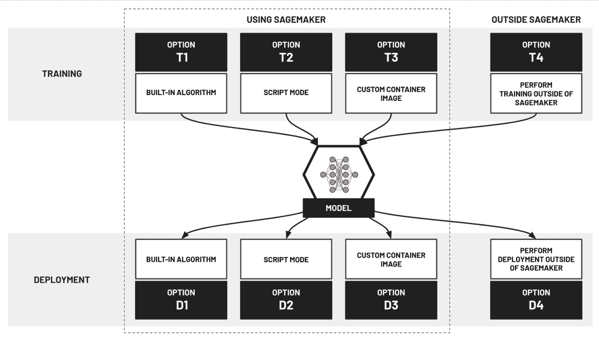

图 7.1 – 训练和部署模型的不同选项

如[*图 7.1*]所示，在 SageMaker 中训练机器学习模型时提供的选项，在部署模型使用 SageMaker 托管服务时也是可用的。在这里，我们给每种方法或选项贴上一个任意的标签（例如，**T1**或**T2**），以帮助我们更详细地讨论这些选项。在 SageMaker 中执行模型部署时，我们可以选择使用内置算法的容器来部署模型（**D1**）。我们还有选择使用**脚本模式**部署我们的深度学习模型（**D2**）。使用此选项时，我们需要准备将在预构建的**深度学习容器**内运行的定制脚本。我们还有选择为我们的机器学习模型部署的环境提供并使用我们自己的定制容器镜像（**D3**）。

重要提示

选择使用哪种选项组合通常取决于进行机器学习实验和部署时所需的定制级别（以定制脚本和容器镜像的形式）。在开始使用 SageMaker 时，建议使用 SageMaker 内置算法，以便更好地了解训练模型时的情况（**T1**）以及部署模型时的情况（**D1**）。如果我们需要在 AWS SageMaker 托管基础设施上使用 TensorFlow、PyTorch 或 MXNet 等框架，我们需要准备一套用于训练（**T2**）和部署（**D2**）的自定义脚本。最后，当我们需要更高的灵活性时，我们可以准备自定义容器镜像，并在训练模型（**T3**）和部署模型（**D3**）时使用这些镜像。

重要的是要注意，我们可以在训练和部署模型时组合并使用不同的选项。例如，我们可以使用脚本模式（**T2**）训练 ML 模型，并在模型部署期间使用自定义容器镜像（**D3**）。另一个例子是在 SageMaker 之外（**T4**）训练模型，并在模型部署期间使用内置算法的预构建推理容器镜像（**D1**）。

现在，让我们谈谈如何使用 SageMaker 主机服务进行模型部署：

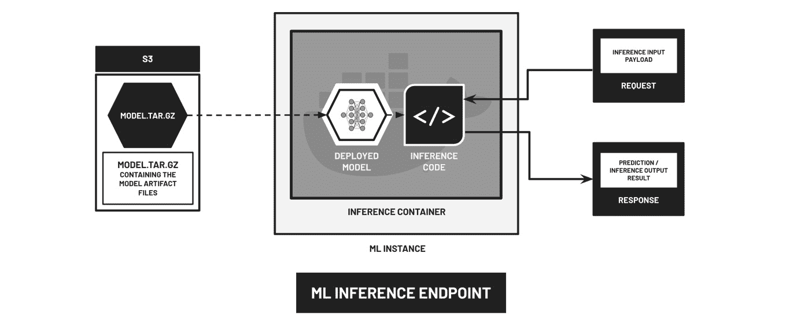

图 7.2 – 使用 SageMaker 主机服务部署模型

在*图 7.2*中，我们有一个使用 SageMaker 主机服务进行模型部署的高级示意图。假设在训练步骤之后，包含 ML 模型工件和输出文件的 `model.tar.gz` 文件已上传到 S3 桶中，则从 S3 桶中下载 `model.tar.gz` 文件到作为 ML 推理端点专用服务器的 ML 计算实例中。在这个 ML 计算实例内部，存储在 `model.tar.gz` 文件中的模型工件被加载到一个包含推理代码的运行容器中，该容器可以加载模型并用于处理传入的请求。如前所述，推理代码和用于推理的容器镜像可以是 AWS（内置或预构建）提供的，也可以是使用 SageMaker 的 ML 工程师提供的（自定义）。

让我们展示一些代码示例，以帮助我们解释这些概念。我们的第一个示例涉及使用内置的**主成分分析**（**PCA**）算法进行模型训练和部署——这是一个可用于降维和数据压缩等用例的算法：

```py
from sagemaker import PCA
# [1] TRAINING
estimator = PCA(
    role=role,
    instance_count=1,
    instance_type='ml.c4.xlarge',
    num_components=2,
    sagemaker_session=session
)
estimator.fit(...)
# [2] DEPLOYMENT
predictor = estimator.deploy(
    initial_instance_count=1,
    instance_type='ml.t2.medium'
)
```

在这里，SageMaker 在训练和部署 PCA 模型时使用预构建的容器镜像。这个容器镜像是由 AWS 团队准备的，这样我们就不必担心在使用内置算法时自己实现它。请注意，只要我们有与内置算法的预构建容器兼容的预训练模型，我们也可以在 SageMaker 中跳过训练步骤并直接进行部署步骤。

现在，让我们快速看一下如何在 SageMaker 中部署模型时使用自定义脚本的示例：

```py
from sagemaker.pytorch.model import PyTorchModel
# [1] HERE, WE DON'T SHOW THE TRAINING STEP
model_data = estimator.model_data
# [2] DEPLOYMENT
model = PyTorchModel(
    model_data=model_data, 
    role=role, 
    source_dir="scripts",
    entry_point='inference.py', 
    framework_version='1.6.0',
    py_version="py3"
)
predictor = model.deploy(
    instance_type='ml.m5.xlarge', 
    initial_instance_count=1
)
```

在这个示例中，SageMaker 使用预构建的深度学习容器镜像来部署 PyTorch 模型。如*第三章*所述，“深度学习容器”，相关的包和依赖项已经安装在这些容器镜像内部。在部署步骤中，容器运行在 `PyTorchModel` 对象初始化期间提供的自定义 `inference.py` 脚本中指定的自定义代码。然后，自定义代码将加载模型并在处理发送到 SageMaker 推理端点的请求时使用它。

注意

在提供的示例中，我们初始化了一个`PyTorchModel`对象，并使用`deploy()`方法将模型部署到实时推理端点。在推理端点内部，将运行使用 PyTorch 推理容器镜像的容器，该容器将加载模型并用于推理。请注意，我们还有其他库和框架（如`TensorFlowModel`、`SKLearnModel`和`MXNetModel`）的相应`Model`类。一旦调用`deploy()`方法，就会在推理端点内部使用适当的推理容器（带有相关已安装的包和依赖项）。

如果我们想要指定并使用自己的自定义容器镜像，我们可以使用以下代码块：

```py
from sagemaker.model import Model
# [1] HERE, WE DON'T SHOW THE TRAINING STEP
model_data = estimator.model_data
# [2] DEPLOYMENT
image_uri = "<INSERT ECR URI OF CUSTOM CONTAINER IMAGE>"
model = Model(
    image_uri=image_uri, 
    model_data=model_data,
    role=role,
    sagemaker_session=session
)
predictor = model.deploy(
    initial_instance_count=1, 
    instance_type='ml.m5.xlarge'
)
```

在此示例中，SageMaker 使用存储在`image_uri`变量指定的位置的**自定义容器镜像**。这里，假设我们已经准备并测试了自定义容器镜像，并在执行模型部署步骤之前将此容器镜像推送到**Amazon Elastic Container Registry**仓库。

注意

在准备自定义脚本和自定义容器镜像时需要一些尝试和错误（类似于我们在*第三章*，*深度学习容器*中准备和测试自定义容器镜像的方式）。如果您正在使用 Notebook 实例，您可以使用 SageMaker 的**本地模式**，这为我们提供了一个在将自定义脚本和自定义容器镜像运行在托管机器学习实例之前在本地环境中测试它们的方法。

本节中展示的代码示例假设我们将我们的机器学习模型部署在实时推理端点。然而，在 SageMaker 中部署机器学习模型时，我们有不同的选项可供选择：

+   第一个选项涉及在我们的**实时推理端点**部署和托管我们的模型。

+   第二个选项涉及在使用 SageMaker Python SDK 部署我们的模型到**无服务器推理端点**时稍微调整配置。

+   第三个选项是将我们的模型托管在**异步推理端点**。

我们将在本章的实践部分介绍这些选项，并讨论每个选项的相关用例和场景。

注意

需要注意的是，也可以在不设置推理端点的情况下执行推理。这涉及到使用**批量转换**，其中模型被加载并用于一次性处理多个输入有效载荷值并执行预测。要查看批量转换的工作示例，请随意查看以下链接：[`bit.ly/3A9wrVy`](https://bit.ly/3A9wrVy)。

现在我们已经对 SageMaker 模型部署的工作原理有了更好的了解，让我们继续本章的动手实践部分。在下一节中，我们将准备包含我们将用于本章模型部署解决方案的 ML 模型工件 `model.tar.gz` 文件。

# 准备预训练模型工件

在 *第六章* 的 *SageMaker 训练和调试解决方案* 中，我们创建了一个名为 `CH06` 的新文件夹，并在创建的文件夹中使用 `Data Science` 映像创建了一个新的笔记本。在本节中，我们将创建一个新文件夹（命名为 `CH07`），并在创建的文件夹内创建一个新的笔记本。由于我们将下载预训练的 `transformers` 库的模型工件，我们将使用 `PyTorch 1.10 Python 3.8 CPU Optimized` 映像作为笔记本中使用的映像。一旦笔记本准备就绪，我们将使用 Hugging Face 的 `transformers` 库下载一个可用于情感分析的预训练模型。最后，我们将模型工件压缩成 `model.tar.gz` 文件，并将其上传到 S3 桶。

注意

在继续之前，请确保您已经完成了 *第一章* 的 *SageMaker 和 SageMaker Studio 入门* 部分的动手解决方案。需要注意的是，本章的动手部分不是对 *第六章* 的 *SageMaker 训练和调试解决方案* 中所完成内容的延续。只要我们设置了 SageMaker Studio，我们就应该可以继续了。

在接下来的步骤中，我们将准备包含模型工件的 `model.tar.gz` 文件，并将其上传到 S3 桶：

1.  在 AWS 管理控制台的搜索栏中导航到 `sagemaker studio`，然后从 **功能** 下的结果列表中选择 **SageMaker Studio**。在侧边栏中，我们点击 **SageMaker Domain** 下的 **Studio**，然后从 **启动应用** 下拉菜单（在 **用户** 面板中）选择 **Studio**。等待一分钟左右，以加载 SageMaker Studio 界面。

重要注意

本章假设我们在使用服务管理和创建不同类型的资源时使用的是 `us-west-2` 区域。您可以使用不同的区域，但请确保在需要将某些资源转移到所选区域的情况下进行任何必要的调整。

1.  在 `CH07` 的空白区域右键单击。最后，通过在侧边栏中双击文件夹名称来导航到 `CH07` 目录。

1.  通过点击 `PyTorch 1.10 Python 3.8 CPU Optimized` 创建一个新的笔记本

1.  `Python 3`

1.  `无脚本`

1.  点击 **选择** 按钮。

注意

等待内核启动。在为运行 Jupyter 笔记本单元格分配 ML 实例时，此步骤可能需要大约 3 到 5 分钟。

1.  将笔记本从 `Untitled.ipynb` 重命名为 `01 - 准备 model.tar.gz 文件.ipynb`。

1.  现在笔记本已经准备好了，我们可以继续生成预训练模型工件并将这些存储在 `model.tar.gz` 文件中。在 Jupyter Notebook 的第一个单元中，让我们运行以下代码，这将安装 Hugging Face 的 `transformers` 库：

    ```py
    !pip3 install transformers==4.4.2
    ```

1.  使用 `pip` 安装 `ipywidgets`：

    ```py
    !pip3 install ipywidgets --quiet
    ```

1.  接下来，让我们运行以下代码块来重启内核：

    ```py
    import IPython
    ```

    ```py
    kernel = IPython.Application.instance().kernel
    ```

    ```py
    kernel.do_shutdown(True)
    ```

这应该产生一个类似于 `{'status': 'ok', 'restart': True}` 的输出值，并相应地重启内核，以确保我们不会在使用我们刚刚安装的包时遇到问题。

1.  让我们使用 `transformers` 库下载一个预训练模型。我们将下载一个可以用于情感分析和分类陈述是否为 *POSITIVE* 或 *NEGATIVE* 的模型。运行以下代码块将预训练的 `distilbert` 模型工件下载到当前目录：

    ```py
    from transformers import AutoModelForSequenceClassification as AMSC
    ```

    ```py
    pretrained = "distilbert-base-uncased-finetuned-sst-2-english"
    ```

    ```py
    model = AMSC.from_pretrained(pretrained)
    ```

    ```py
    model.save_pretrained(save_directory=".")
    ```

这应该在 `.ipynb` 笔记本文件相同的目录中生成两个文件：

+   `config.json`

+   `pytorch_model.bin`

注意

*如何实现这一功能？* 例如，如果我们有一个“`I love reading the book MLE on AWS!`”这样的陈述，训练好的模型应该将其分类为 *POSITIVE* 陈述。如果我们有一个“`This is the worst spaghetti I've had`”这样的陈述，训练好的模型随后应该将其分类为 *NEGATIVE* 陈述。

1.  使用以下代码块准备包含之前步骤中生成的模型工件文件的 `model.tar.gz`（压缩存档）文件：

    ```py
    import tarfile
    ```

    ```py
    tar = tarfile.open("model.tar.gz", "w:gz")
    ```

    ```py
    tar.add("pytorch_model.bin")
    ```

    ```py
    tar.add("config.json")
    ```

    ```py
    tar.close()
    ```

1.  使用 `rm` 命令通过删除之前步骤中生成的模型工件来清理模型文件：

    ```py
    %%bash
    ```

    ```py
    rm pytorch_model.bin
    ```

    ```py
    rm config.json
    ```

1.  指定 S3 桶名称和前缀。在运行以下代码块之前，请确保将 `<INSERT S3 BUCKET NAME HERE>` 的值替换为一个唯一的 S3 桶名称：

    ```py
    s3_bucket = "<INSERT S3 BUCKET NAME HERE>"
    ```

    ```py
    prefix = "chapter07"
    ```

确保指定一个尚不存在的 S3 桶的桶名称。如果你想要重用之前章节中创建的其中一个桶，可以这样做，但请确保使用与 SageMaker Studio 设置和配置相同的区域的 S3 桶。

1.  使用 `aws s3 mb` 命令创建一个新的 S3 桶：

    ```py
    !aws s3 mb s3://{s3_bucket}
    ```

如果你计划重用之前章节中创建的现有 S3 桶，则可以跳过此步骤。

1.  准备我们将上传模型文件的 S3 路径：

    ```py
    model_data = "s3://{}/{}/model/model.tar.gz".format(
    ```

    ```py
        s3_bucket, prefix
    ```

    ```py
    )
    ```

注意，在此阶段，指定 S3 路径中尚不存在 `model.tar.gz` 文件。在这里，我们只是在准备 `model.tar.gz` 文件将要上传的 S3 位置（字符串）。

1.  现在，让我们使用 `aws s3 cp` 命令来复制并上传 `model.tar.gz` 文件到 S3 桶：

    ```py
    !aws s3 cp model.tar.gz {model_data}
    ```

1.  使用 `%store` 魔法来存储 `model_data`、`s3_bucket` 和 `prefix` 的变量值：

    ```py
    %store model_data
    ```

    ```py
    %store s3_bucket
    ```

    ```py
    %store prefix
    ```

这应该允许我们在本章的后续部分中使用这些变量值，类似于我们在 *图 7.3* 中所做的那样：

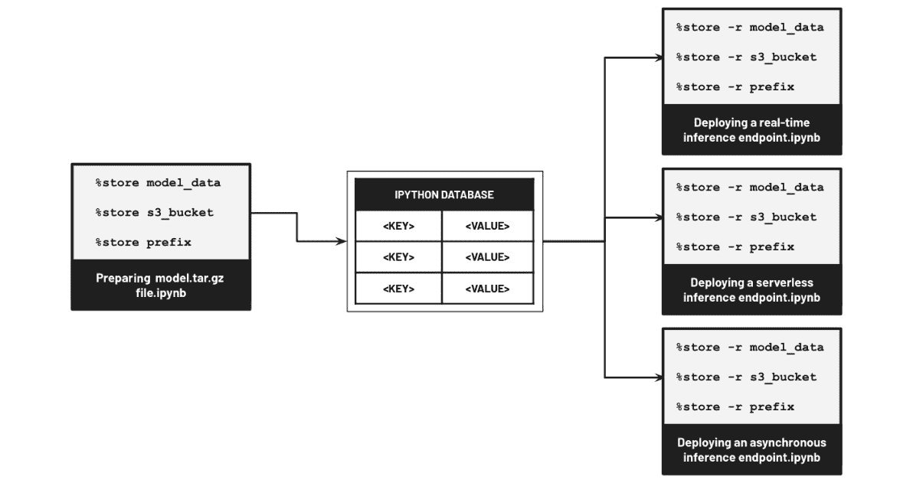

图 7.3 – %store 魔法

确保不要重新启动内核，否则我们将丢失使用`%store`魔法保存的变量值。

# 准备 SageMaker 脚本模式的前提条件

在本章中，我们将准备一个自定义脚本，用于使用预训练模型进行预测。在我们可以使用**SageMaker Python SDK**将预训练模型部署到推理端点之前，我们需要确保所有脚本模式的前提条件都已准备好。


图 7.4 – 所需的文件和文件夹结构

在*图 7.4*中，我们可以看到我们需要准备三个前提条件：

+   `inference.py`

+   `requirements.txt`

+   `setup.py`

我们将这些前提条件存储在`scripts`目录中。我们将在本章后续页面中详细讨论这些前提条件。现在，让我们开始准备`inference.py`脚本文件！

## 准备 inference.py 文件

在本节中，我们将准备一个自定义 Python 脚本，该脚本将由 SageMaker 在处理推理请求时使用。在这里，我们可以影响输入请求的反序列化方式、如何加载自定义模型、如何执行预测步骤以及如何将输出预测序列化并作为响应返回。为了完成所有这些，我们需要在我们的脚本文件中覆盖以下推理处理函数：`model_fn()`、`input_fn()`、`predict_fn()`和`output_fn()`。我们将在稍后讨论这些函数的工作原理。

在接下来的步骤中，我们将准备我们的自定义 Python 脚本并覆盖推理处理函数的默认实现：

1.  右键单击**文件浏览器**侧边栏中的空白区域以打开一个类似于*图 7.5*所示的上下文菜单：

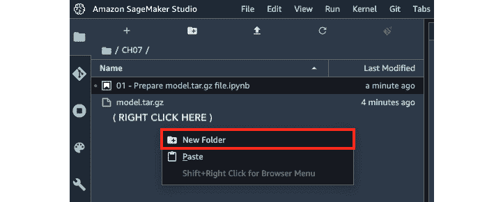

图 7.5 – 在 CH07 目录内创建新文件夹

从上下文菜单中的选项列表中选择**新建文件夹**，如图 7.5 所示。请注意，我们也可以按下位于**+**按钮旁边的信封按钮（带加号）来创建一个新的文件夹。

1.  将新文件夹命名为`scripts`。

1.  接下来，双击`scripts`文件夹以导航到该目录。

1.  通过点击**文件**菜单并从**新建**子菜单下的选项列表中选择**文本文件**来创建一个新的文本文件。

1.  右键单击`inference.py`。

1.  点击`inference.py`脚本：

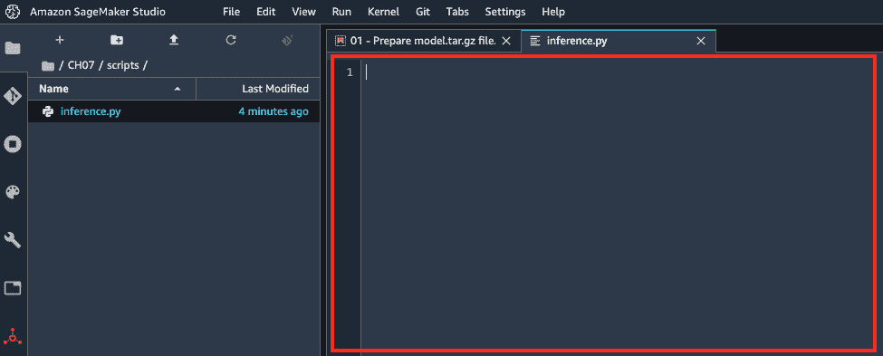

图 7.6 – 在编辑器窗格中准备向 inference.py 文件添加代码

我们将把接下来的代码块添加到`inference.py`文件中。确保每个代码块后面都有一个额外的空白行。

1.  在`inference.py`文件中：

    ```py
    import json
    ```

    ```py
    from transformers import AutoModelForSequenceClassification as AMSC
    ```

    ```py
    from transformers import Trainer
    ```

    ```py
    from transformers import TrainingArguments
    ```

    ```py
    from torch.nn import functional as F
    ```

    ```py
    from transformers import AutoTokenizer
    ```

    ```py
    from time import sleep
    ```

1.  指定分词器：

    ```py
    TOKENIZER = "distilbert-base-uncased-finetuned-sst-2-english"
    ```

在这里，我们指定了在后续步骤中用于执行预测的模型的适当分词器。

注意

什么是分词器？例如，对于 `"I am hungry"`，分词器会将其分割成 `"I"`、`"am"` 和 `"hungry"` 这三个标记。请注意，这是一个简化的例子，分词器的工作远不止这些可以在几句话中解释清楚的内容。更多详情，请随时查看以下链接：[`huggingface.co/docs/transformers/main_classes/tokenizer`](https://huggingface.co/docs/transformers/main_classes/tokenizer)。

1.  定义 `model_fn()` 函数：

    ```py
    def model_fn(model_dir):
    ```

    ```py
        model = AMSC.from_pretrained(model_dir)
    ```

    ```py
        return model
    ```

在这里，我们定义了一个模型函数，它返回一个用于执行预测和处理推理请求的模型对象。由于我们计划加载和使用预训练模型，我们使用了 `transformers` 库中的 `AutoModelForSequenceClassification` 的 `from_pretrained()` 方法来加载指定模型目录中的模型工件。`from_pretrained()` 方法随后返回一个模型对象，该对象可以在预测步骤中使用。

1.  现在，让我们定义 `humanize_prediction()` 函数：

    ```py
    def humanize_prediction(output):
    ```

    ```py
        class_a, class_b = F.softmax(
    ```

    ```py
            output[0][0], 
    ```

    ```py
            dim = 0
    ```

    ```py
        ).tolist()
    ```

    ```py
        prediction = "-"
    ```

    ```py
        if class_a > class_b:
    ```

    ```py
            prediction = "NEGATIVE"
    ```

    ```py
        else:
    ```

    ```py
            prediction = "POSITIVE"
    ```

    ```py
        return prediction
    ```

`humanize_prediction()` 函数简单地接受模型在预测步骤中处理输入有效载荷后产生的原始输出。它将返回一个 `"POSITIVE"` 或 `"NEGATIVE"` 预测给调用函数。我们将在下一步定义这个 *调用函数*。

1.  接下来，让我们使用以下代码块定义 `predict_fn()`：

    ```py
    def predict_fn(input_data, model):
    ```

    ```py
        # sleep(30)
    ```

    ```py
        sentence = input_data['text']
    ```

    ```py
        tokenizer = AutoTokenizer.from_pretrained(
    ```

    ```py
            TOKENIZER
    ```

    ```py
        )
    ```

    ```py
        batch = tokenizer(
    ```

    ```py
            [sentence],
    ```

    ```py
            padding=True,
    ```

    ```py
            truncation=True,
    ```

    ```py
            max_length=512,
    ```

    ```py
            return_tensors="pt"
    ```

    ```py
        )
    ```

    ```py
        output = model(**batch)
    ```

    ```py
        prediction = humanize_prediction(output)
    ```

    ```py
        return prediction
    ```

`predict_fn()` 函数接受反序列化的输入请求数据和加载的模型作为输入。然后，它使用这两个参数值来生成一个预测。如何？由于加载的模型作为第二个参数可用，我们只需使用它来执行预测。这个预测步骤的输入有效载荷将是反序列化的请求数据，它是 `predict_fn()` 函数的第一个参数。在输出返回之前，我们使用 `humanize_prediction()` 函数将原始输出转换为 `"POSITIVE"` 或 `"NEGATIVE"`。

备注

为什么我们有一个包含 `sleep(30)` 的注释行？在 *将预训练模型部署到异步推理端点部分* 的后面，我们将使用人工的 30 秒延迟来模拟一个相对较长的处理时间。现在，我们将保持这一行被注释，稍后在该部分中我们将取消注释。

1.  同时，我们还需要定义 `input_fn()` 函数，该函数用于将序列化的输入请求数据转换为它的反序列化形式。这种反序列化形式将在稍后的预测阶段使用：

    ```py
    def input_fn(serialized_input_data, 
    ```

    ```py
                 content_type='application/json'):
    ```

    ```py
        if content_type == 'application/json':
    ```

    ```py
            input_data = json.loads(serialized_input_data)
    ```

    ```py
            return input_data
    ```

    ```py
        else:
    ```

    ```py
            raise Exception('Unsupported Content Type')
    ```

在 `input_fn()` 函数中，我们还确保指定的内容类型在我们定义的支持内容类型列表中，对于不支持的内容类型，我们通过抛出 `Exception` 来处理。

1.  最后，让我们定义 `output_fn()`：

    ```py
    def output_fn(prediction_output, 
    ```

    ```py
                  accept='application/json'):
    ```

    ```py
        if accept == 'application/json':
    ```

    ```py
            return json.dumps(prediction_output), accept
    ```

    ```py
        raise Exception('Unsupported Content Type')
    ```

`output_fn()` 的目的是将预测结果序列化为指定的内容类型。在这里，我们还确保指定的内容类型在我们定义的支持内容类型列表中，对于不支持的内容类型，我们通过抛出 `Exception` 来处理。

备注

我们可以将 *序列化* 和 *反序列化* 视为数据转换步骤，将数据从一种形式转换为另一种形式。例如，输入请求数据可能作为有效的 JSON *字符串* 传递给推理端点。这个输入请求数据通过 `input_fn()` 函数，该函数将其转换为 *JSON* 或 *字典*。然后，这个反序列化的值作为有效载荷传递给 `predict_fn()` 函数。之后，`predict_fn()` 函数返回一个预测结果。然后，使用 `output_fn()` 函数将这个结果转换为指定的内容类型。

1.  通过按 *CTRL* + *S* 保存更改。

注意

如果你使用的是 Mac，请使用 *CMD* + *S*。或者，你可以在 **文件** 菜单下的选项列表中点击 **保存 Python 文件**。

在这一点上，你可能想知道所有这些是如何结合在一起的。为了帮助我们理解推理处理函数如何与数据和彼此交互，让我们快速查看 *图 7.7* 中所示的图表：

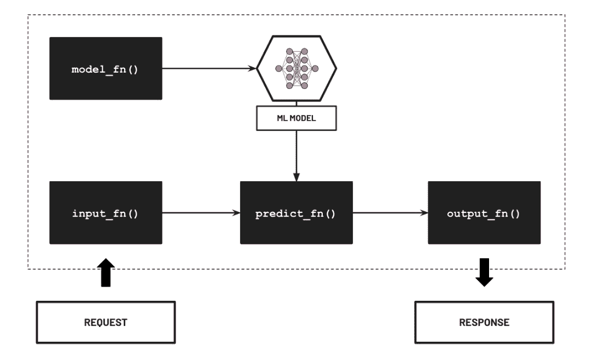

图 7.7 – 推理处理函数

在 *图 7.7* 中，我们可以看到 `model_fn()` 函数用于加载 ML 模型对象。这个模型对象将在收到请求后由 `predict_fn()` 函数用于执行预测。当收到请求时，`input_fn()` 函数处理序列化的请求数据并将其转换为反序列化形式。然后，这个反序列化的请求数据传递给 `predict_fn()` 函数，该函数使用加载的 ML 模型，以请求数据作为有效载荷执行预测。然后，`predict_fn()` 函数返回输出预测，该预测由 `output_fn()` 函数序列化。

注意

关于这个主题的更多信息，请随时查看以下链接：[`sagemaker.readthedocs.io/en/stable/frameworks/pytorch/using_pytorch.xhtml`](https://sagemaker.readthedocs.io/en/stable/frameworks/pytorch/using_pytorch.xhtml#serve-a-pytorch-model)。

现在我们已经准备好了推理脚本，接下来让我们在下一节中准备 `requirements.txt` 文件！

## 准备 requirements.txt 文件

由于 `transformers` 包不包括在 SageMaker PyTorch Docker 容器中，我们需要通过 `requirements.txt` 文件来包含它，该文件由 SageMaker 在运行时用于安装额外的包。如果你第一次处理 `requirements.txt` 文件，它只是一个包含要使用 `pip install` 命令安装的包列表的文本文件。如果你的 `requirements.txt` 文件包含单行（例如，`transformers==4.4.2`），那么在安装步骤中这将会映射到 `pip install transformers==4.4.2`。如果 `requirements.txt` 文件包含多行，那么列出的每个包都将使用 `pip install` 命令安装。

注意

我们可以选择使用`==`（等于）将列出的包和依赖项固定到特定版本。或者，我们也可以使用`<`（小于）、`>`（大于）和其他变体来管理要安装的包的版本号的上下限。

在接下来的步骤中，我们将在`scripts`目录内创建和准备`requirements.txt` 文件：

1.  通过点击**文件**菜单并从**新建**子菜单下的选项列表中选择**文本文件**来创建一个新的文本文件：

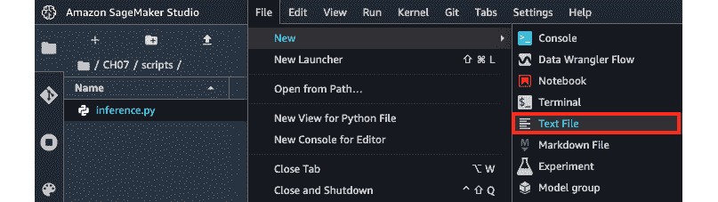

图 7.8 – 在 scripts 目录内创建一个新的文本文件

在*图 7.8*中，我们可以看到我们处于`scripts`目录中（`scripts`目录）。

1.  重命名文件`requirements.txt`

1.  在`requirements.txt` 文件中添加以下内容：

    ```py
    transformers==4.4.2
    ```

1.  确保通过按*CTRL* + *S*保存更改。

注意

如果你使用的是 Mac，请使用*CMD* + *S*。或者，你只需在**文件**菜单下的选项列表中点击**保存 Python 文件**。

难道不是很容易吗？现在让我们继续进行最后一个先决条件——`setup.py` 文件。

## 准备`setup.py`文件

除了`requirements.txt` 文件外，我们还将准备一个包含一些附加信息和元数据的`setup.py` 文件。

注意

我们不会深入探讨`requirements.txt`和`setup.py`文件使用之间的差异。如有更多信息需要，请查看以下链接：[`docs.python.org/3/distutils/setupscript.xhtml`](https://docs.python.org/3/distutils/setupscript.xhtml)。

在接下来的步骤中，我们将在`scripts`目录内创建和准备`setup.py` 文件：

1.  使用与上一节相同的步骤，创建一个新的文本文件并将其重命名为`setup.py`。确保该文件与`inference.py`和`requirements.txt`文件位于同一目录（`scripts`）中。

1.  更新`setup.py`文件的内容，以包含以下代码块：

    ```py
    from setuptools import setup, find_packages
    ```

    ```py
    setup(name='distillbert',
    ```

    ```py
          version='1.0',
    ```

    ```py
          description='distillbert',
    ```

    ```py
          packages=find_packages(
    ```

    ```py
              exclude=('tests', 'docs')
    ```

    ```py
         ))
    ```

设置脚本简单地使用`setup()`函数来描述模块分布。在这里，当调用`setup()`函数时，我们指定了`name`、`version`和`description`等元数据。

1.  最后，确保通过按*CTRL* + *S*保存更改。

注意

如果你使用的是 Mac，请使用*CMD* + *S*。或者，你只需在**文件**菜单下的选项列表中点击**保存 Python 文件**。

到目前为止，我们已经准备好了运行本章后续所有部分所需的所有先决条件。有了这个，让我们在下一节中将我们的预训练模型部署到实时推理端点！

# 将预训练模型部署到实时推理端点

在本节中，我们将使用 SageMaker Python SDK 将预训练模型部署到实时推理端点。从其名称本身，我们可以看出实时推理端点可以处理输入有效载荷并在实时进行预测。如果你之前构建过 API 端点（例如，可以处理 GET 和 POST 请求），那么我们可以将推理端点视为一个接受输入请求并作为响应的一部分返回预测的 API 端点。预测是如何进行的？推理端点只需将模型加载到内存中并使用它来处理输入有效载荷。这将产生一个作为响应返回的输出。例如，如果我们有一个预训练的情感分析 ML 模型部署在实时推理端点，那么它将根据请求中提供的输入字符串有效载荷返回 `"POSITIVE"` 或 `"NEGATIVE"` 的响应。

注意

假设我们的推理端点通过 POST 请求接收语句 `"我喜欢阅读 AWS 上的 MLE 书籍！"`。然后，推理端点将处理请求输入数据并使用 ML 模型进行推理。ML 模型推理步骤的结果（例如，表示 `"POSITIVE"` 结果的数值）将作为响应的一部分返回。

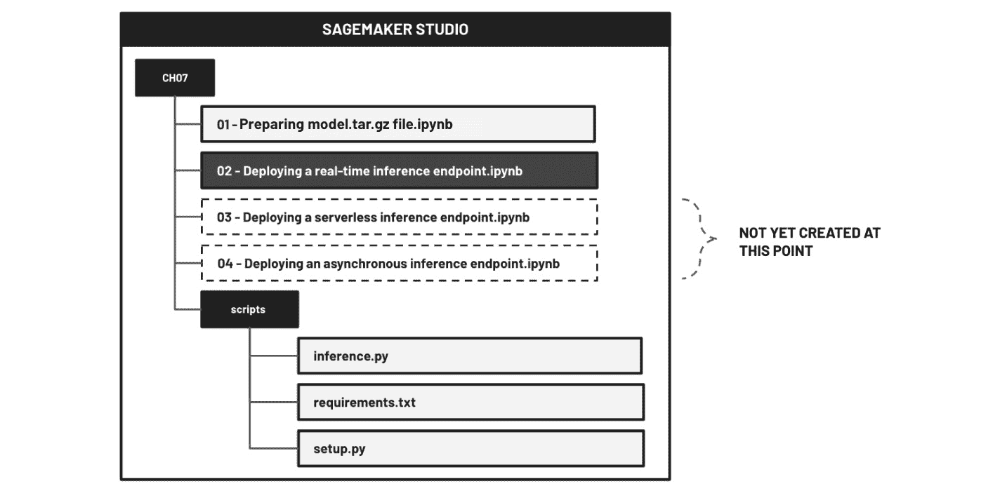

图 7.9 – 所需的文件和文件夹结构

要使这一切正常工作，我们只需在使用 SageMaker Python SDK 准备实时推理端点之前确保所有先决文件就绪，包括推理脚本文件（例如，`inference.py`）和 `requirements.txt` 文件。在继续本节的手动解决方案之前，请务必检查并审查 *图 7.9* 中的文件夹结构。

在接下来的步骤中，我们将使用 SageMaker Python SDK 将我们的预训练模型部署到实时推理端点：

1.  在 `CH07` 目录中创建一个新的笔记本，使用 `Data Science` 映像。将笔记本重命名为 `02 - 部署实时推理端点.ipynb`。

注意

新的笔记本应该紧挨着 `01 - 准备模型.tar.gz 文件.ipynb`，类似于 *图 7.9* 中所示。

1.  让我们在新笔记本的第一个单元中运行以下代码块：

    ```py
    %store -r model_data
    ```

    ```py
    %store -r s3_bucket
    ```

    ```py
    %store -r prefix
    ```

在这里，我们使用 `%store` 魔法加载 `model_data`、`s3_bucket` 和 `prefix` 的变量值。

1.  接下来，让我们为 SageMaker 准备 IAM 执行角色：

    ```py
    from sagemaker import get_execution_role 
    ```

    ```py
    role = get_execution_role()
    ```

1.  初始化 `PyTorchModel` 对象：

    ```py
    from sagemaker.pytorch.model import PyTorchModel
    ```

    ```py
    model = PyTorchModel(
    ```

    ```py
        model_data=model_data, 
    ```

    ```py
        role=role, 
    ```

    ```py
        source_dir="scripts",
    ```

    ```py
        entry_point='inference.py', 
    ```

    ```py
        framework_version='1.6.0',
    ```

    ```py
        py_version="py3"
    ```

    ```py
    )
    ```

让我们查看 *图 7.10* 以帮助我们可视化之前代码块中发生的情况：

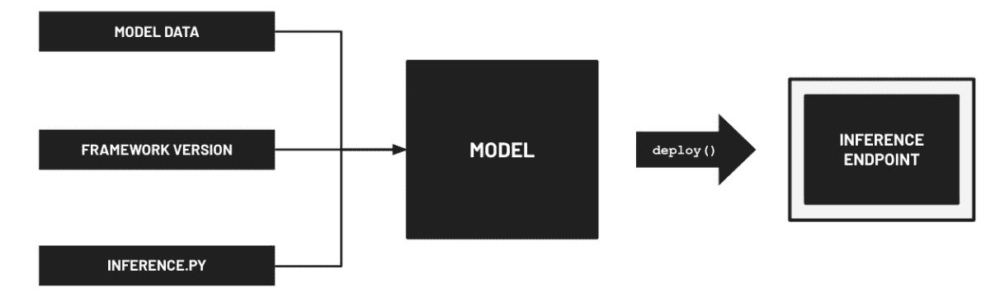

图 7.10 – 部署实时推理端点

在*图 7.10*中，我们可以看到在初始化步骤中通过传递几个配置参数初始化了一个`Model`对象：（1）模型数据，（2）框架版本，以及（3）`inference.py`脚本文件的路径。我们还可以设置其他参数，但为了简化，我们将关注这三个。为了让 SageMaker 知道如何使用预训练模型进行推理，`inference.py`脚本文件应包含自定义逻辑，该逻辑加载 ML 模型并使用它进行预测。

注意

重要的是要注意，我们不仅限于将推理脚本文件命名为`inference.py`。只要我们指定正确的`entry_point`值，我们就可以使用不同的命名约定。

如果我们在部署机器学习模型时使用 SageMaker 的脚本模式，那么这就是这种情况。请注意，还有其他选项可用，例如使用自定义容器镜像，在这种情况下，我们将传递一个我们事先准备好的容器镜像，而不是传递脚本。当使用 SageMaker 的**内置算法**训练机器学习模型时，我们可以直接部署这些模型，无需任何自定义脚本或容器镜像，因为 SageMaker 已经提供了所有部署所需的前提条件。

1.  使用`deploy()`方法将模型部署到实时推理端点：

    ```py
    %%time
    ```

    ```py
    from sagemaker.serializers import JSONSerializer
    ```

    ```py
    from sagemaker.deserializers import JSONDeserializer
    ```

    ```py
    predictor = model.deploy(
    ```

    ```py
        instance_type='ml.m5.xlarge', 
    ```

    ```py
        initial_instance_count=1,
    ```

    ```py
        serializer=JSONSerializer(),
    ```

    ```py
        deserializer=JSONDeserializer()
    ```

    ```py
    )
    ```

此步骤应花费大约 3 到 8 分钟才能完成。

注意

当使用 SageMaker Python SDK 的`deploy()`方法部署机器学习模型时，我们被赋予了指定实例类型的权限。为模型选择正确的实例类型很重要，在成本和性能之间找到最佳平衡并不是一个简单的过程。有众多实例类型和大小可供选择，机器学习工程师在 SageMaker 托管服务中部署模型时可能会遇到次优配置。好消息是，SageMaker 有一个名为**SageMaker 推理推荐器**的功能，可以帮助您决定使用哪种实例类型。更多信息，您可以查看以下链接：[`docs.aws.amazon.com/sagemaker/latest/dg/inference-recommender.xhtml`](https://docs.aws.amazon.com/sagemaker/latest/dg/inference-recommender.xhtml)。

1.  现在我们的实时推理端点正在运行，让我们使用`predict()`方法进行一次样本预测：

    ```py
    payload = {
    ```

    ```py
        "text": "I love reading the book MLE on AWS!"
    ```

    ```py
    }
    ```

    ```py
    predictor.predict(payload)
    ```

这应该会产生一个输出值`'POSITIVE'`。

1.  让我们也测试一个负面场景：

    ```py
    payload = {
    ```

    ```py
        "text": "This is the worst spaghetti I've had"
    ```

    ```py
    }
    ```

    ```py
    predictor.predict(payload)
    ```

这应该会产生一个输出值`'NEGATIVE'`。在下一步删除端点之前，您可以自由测试不同的值。

1.  最后，让我们使用`delete_endpoint()`方法删除推理端点：

    ```py
    predictor.delete_endpoint()
    ```

这将帮助我们避免任何未使用的推理端点的意外费用。

难道不是很容易吗？使用 SageMaker Python SDK 将预训练模型部署到实时推理端点（在指定实例类型的 ML 实例内部）非常简单！大量的工程工作已经为我们自动化了，我们只需要调用`Model`对象的`deploy()`方法。

# 将预训练模型部署到无服务器推理端点

在本书的前几章中，我们使用了几种无服务器服务，这些服务允许我们管理和降低成本。如果您想知道在 SageMaker 中部署 ML 模型时是否有无服务器选项，那么对这个问题的答案将是美妙的肯定。当您处理间歇性和不可预测的流量时，使用无服务器推理端点托管您的 ML 模型可以是一个更经济的选择。假设我们可以容忍**冷启动**（在一段时间的不活跃后，请求处理时间更长）并且我们每天只期望有少量请求，那么我们可以使用无服务器推理端点而不是实时选项。实时推理端点最好用于我们可以最大化推理端点的情况。如果您预计您的端点大部分时间都会被使用，那么实时选项可能就足够了。

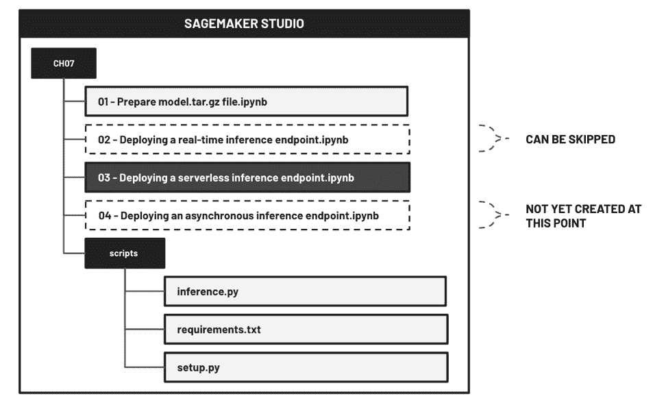

图 7.11 – 所需的文件和文件夹结构

使用 SageMaker Python SDK 将预训练 ML 模型部署到无服务器推理端点的方式与部署到实时推理端点的方式相似。唯一的主要区别如下：

+   `ServerlessInferenceConfig`对象的初始化

+   在调用`Model`对象的`deploy()`方法时传递此对象作为参数

在接下来的步骤中，我们将使用 SageMaker Python SDK 将我们的预训练模型部署到无服务器推理端点：

1.  在`CH07`目录下创建一个新的笔记本，使用`Data Science`镜像。将笔记本重命名为`03 - 部署无服务器推理端点.ipynb`。

注意

新笔记本应位于`01 - 准备 model.tar.gz 文件.ipynb`旁边，类似于*图 7.11*中所示。

1.  在新笔记本的第一个单元中，让我们运行以下代码块来加载`model_data`、`s3_bucket`和`prefix`变量的值：

    ```py
    %store -r model_data
    ```

    ```py
    %store -r s3_bucket
    ```

    ```py
    %store -r prefix
    ```

如果在运行此代码块时出现错误，请确保您已完成了本章“*准备预训练模型工件*”部分中指定的步骤。

1.  准备 SageMaker 使用的 IAM 执行角色：

    ```py
    from sagemaker import get_execution_role 
    ```

    ```py
    role = get_execution_role()
    ```

1.  初始化和配置`ServerlessInferenceConfig`对象：

    ```py
    from sagemaker.serverless import ServerlessInferenceConfig
    ```

    ```py
    serverless_config = ServerlessInferenceConfig(
    ```

    ```py
      memory_size_in_mb=4096,
    ```

    ```py
      max_concurrency=5,
    ```

    ```py
    )
    ```

1.  初始化`PyTorchModel`对象并使用`deploy()`方法将模型部署到无服务器推理端点：

    ```py
    from sagemaker.pytorch.model import PyTorchModel
    ```

    ```py
    from sagemaker.serializers import JSONSerializer
    ```

    ```py
    from sagemaker.deserializers import JSONDeserializer
    ```

    ```py
    model = PyTorchModel(
    ```

    ```py
        model_data=model_data, 
    ```

    ```py
        role=role, 
    ```

    ```py
        source_dir="scripts",
    ```

    ```py
        entry_point='inference.py', 
    ```

    ```py
        framework_version='1.6.0',
    ```

    ```py
        py_version="py3"
    ```

    ```py
    )
    ```

    ```py
    predictor = model.deploy(
    ```

    ```py
        instance_type='ml.m5.xlarge', 
    ```

    ```py
        initial_instance_count=1,
    ```

    ```py
        serializer=JSONSerializer(),
    ```

    ```py
        deserializer=JSONDeserializer(),
    ```

    ```py
        serverless_inference_config=serverless_config
    ```

    ```py
    )
    ```

注意

模型部署应大约需要 3 到 8 分钟才能完成。

1.  现在我们实时推理端点正在运行，让我们使用`predict()`方法进行一次样本预测：

    ```py
    payload = {
    ```

    ```py
        "text": "I love reading the book MLE on AWS!"
    ```

    ```py
    }
    ```

    ```py
    predictor.predict(payload)
    ```

这应该会产生一个输出值为`'POSITIVE'`。

1.  让我们也测试一个负面场景：

    ```py
    payload = {
    ```

    ```py
        "text": "This is the worst spaghetti I've had"
    ```

    ```py
    }
    ```

    ```py
    predictor.predict(payload)
    ```

这应该会产生一个输出值`'NEGATIVE'`。在下一步删除端点之前，你可以自由地测试不同的值。

1.  最后，让我们使用`delete_endpoint()`方法删除推理端点：

    ```py
    predictor.delete_endpoint()
    ```

这将帮助我们避免因未使用的推理端点而产生的任何意外费用。

如你所见，一切几乎相同，只是`ServerlessInferenceConfig`对象的初始化和使用不同。当使用无服务器端点时，SageMaker 为我们管理计算资源，并自动执行以下操作：

+   根据我们在初始化`ServerlessInferenceConfig`时指定的`memory_size_in_mb`参数值自动分配计算资源

+   使用配置的最大并发值来管理同时可以发生的并发调用数量

+   如果没有请求，自动将资源缩减到零

一旦你看到更多如何使用 SageMaker Python SDK 的示例，你将开始意识到这个 SDK 的设计和实现是多么出色。

# 将预训练模型部署到异步推理端点

除了实时和无服务器推理端点之外，SageMaker 在部署模型时还提供第三个选项——**异步推理端点**。为什么叫异步呢？一方面，我们不需要立即得到结果，请求会被排队，结果会异步提供。这对于涉及以下一个或多个方面的 ML 需求来说适用：

+   大输入负载（高达 1 GB）

+   长预测处理持续时间（高达 15 分钟）

异步推理端点的一个很好的用例是用于检测大型视频文件中的对象（可能需要超过 60 秒才能完成）的 ML 模型。在这种情况下，推理可能需要几分钟而不是几秒钟。

*我们如何使用异步推理端点？* 要调用异步推理端点，我们执行以下操作：

1.  请求负载被上传到 Amazon S3 存储桶。

1.  当调用`AsyncPredictor`对象的`predict_async()`方法（该对象映射或表示 ML 推理端点）时，使用 S3 路径或位置（请求负载存储的地方）作为参数值。

1.  当调用端点时，异步推理端点会将请求排队以进行处理（一旦端点可以处理）。

1.  处理请求后，输出推理结果将被存储并上传到输出 S3 位置。

1.  如果设置了，将发送一个 SNS 通知（例如，成功或错误通知）。

在本节中，我们将部署我们的 NLP 模型到异步推理端点。为了模拟延迟，我们将在推理脚本中调用`sleep()`函数，使得预测步骤比平时更长。一旦我们可以使这个相对简单的设置工作，处理更复杂的要求，如视频文件的对象检测，将会容易得多。

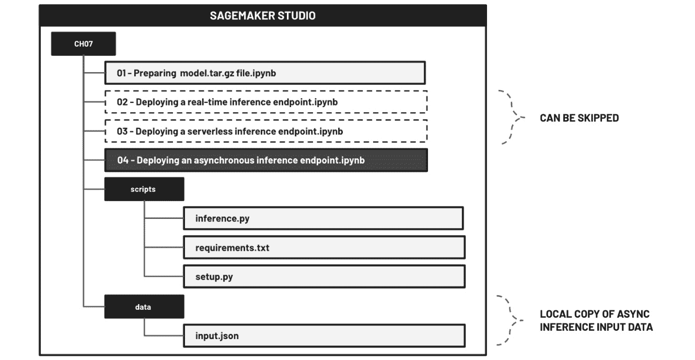

图 7.12 – 文件和文件夹结构

为了使此设置生效，我们需要准备一个包含类似*图 7.12*中所示输入负载的文件（例如，*data*或`input.json`）。一旦准备好的输入文件，我们将将其上传到 Amazon S3 存储桶，然后继续部署我们的预训练 ML 模型到异步推理端点。

考虑到这一点，让我们继续创建输入 JSON 文件！

## 创建输入 JSON 文件

在下一组步骤中，我们将创建一个包含用于在下一节中调用异步推理端点的输入 JSON 值的示例文件：

1.  在**文件浏览器**侧边栏面板的空白区域右键单击以打开类似于*图 7.13*所示的上下文菜单：

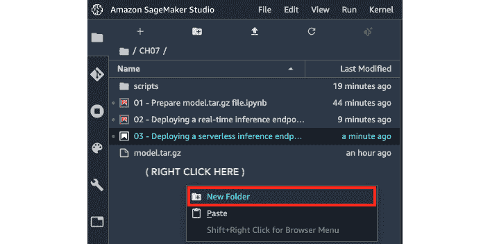

图 7.13 – 创建新文件夹

确保在执行此步骤之前，您位于**文件浏览器**中的`CH07`目录。

1.  重命名文件夹`data`。

1.  双击**文件浏览器**侧边栏面板中的`data`文件夹以导航到该目录。

1.  通过点击**文件**菜单，并在**新建**子菜单下的选项列表中选择**文本文件**来创建一个新的文本文件：

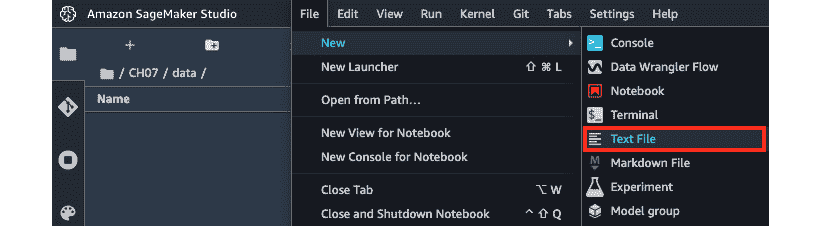

图 7.14 – 创建新文本文件

确保在创建新文本文件时，您位于`data`目录，类似于*图 7.14*。

1.  如*图 7.15*所示重命名文件`input.json`：

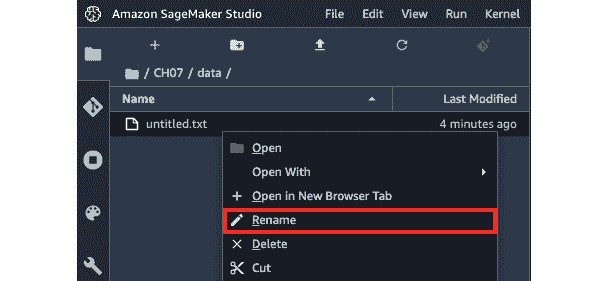

图 7.15 – 重命名文本文件

要重命名`untitled.txt`文件，在`input.json`)文件上右键单击以替换默认的名称值。

1.  在具有以下 JSON 值的`input.json`文件中：

    ```py
    {"text": "I love reading the book MLE on AWS!"}
    ```

1.  确保通过按*CTRL* + *S*保存您的更改。

注意

如果您使用的是 Mac，请使用*CMD* + *S*。或者，您也可以直接在**文件**菜单下的选项列表中点击**保存 Python 文件**。

再次强调，只有在计划将我们的 ML 模型部署到异步推理端点时，才需要输入文件。准备好了，我们现在可以继续下一步。

## 在推理脚本中添加人工延迟

在使用 SageMaker Python SDK 将我们的预训练模型部署到异步推理端点之前，我们将在预测步骤中添加一个人工延迟。这将帮助我们模拟需要一些时间才能完成的推理或预测请求。

注意

当调试异步推理端点时，您可能首先选择测试一个只需几秒钟就能进行预测的机器学习模型。这将帮助您立即知道是否有问题，因为输出预期将在几秒钟内上传到 S3 输出路径（而不是几分钟）。话虽如此，如果您在设置工作遇到问题，您可能想要暂时移除人工延迟。

在接下来的步骤中，我们将更新`inference.py`脚本来在执行预测时添加 30 秒延迟：

1.  在上一节中继续，让我们导航到**文件浏览器**中的`CH07`目录：

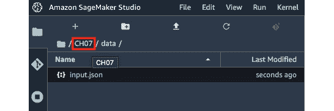

图 7.16 – 导航到 CH07 目录

在这里，我们点击*图 7.16*中突出显示的`CH07`链接。

1.  双击如图 7.17 所示的`scripts`文件夹，以导航到该目录：

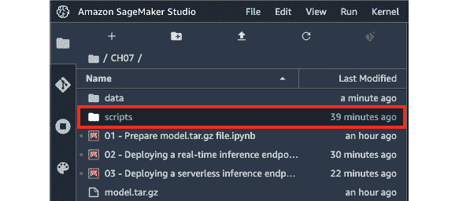

图 7.17 – 导航到 scripts 目录

在进行下一步之前，请确保您已完成了*准备 SageMaker 脚本模式先决条件*部分中的动手步骤。`scripts`目录应包含三个文件：

+   `inference.py`

+   `requirements.txt`

+   `setup.py`

1.  双击并打开如图 7.18 所示的`inference.py`文件。找到`predict_fn()`函数，取消注释包含`sleep(30)`的代码行：

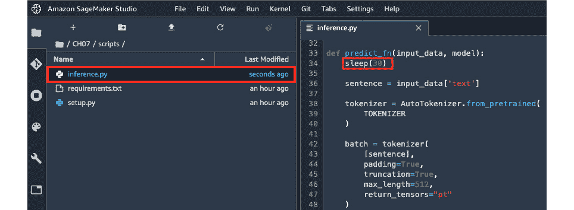

图 7.18 – 更新 inference.py 文件

要取消注释代码行，只需移除`sleep(30)`之前的 hash 和空格（`#`），类似于*图 7.18*中所示。

1.  确保通过按*CTRL* + *S*保存更改。

注意

如果您使用的是 Mac，请使用*CMD* + *S*。或者，您也可以在**文件**菜单下的选项列表中点击**保存 Python 文件**。

现在我们已经完成了添加 30 秒的人工延迟，让我们继续使用 SageMaker Python SDK 来部署我们的异步推理端点。

## 部署和测试异步推理端点

使用 SageMaker Python SDK 将预训练的机器学习模型部署到异步推理端点的方式与部署实时和无服务器推理端点的方式相似。唯一的主要区别将是（1）`AsyncInferenceConfig`对象的初始化，以及（2）在调用`Model`对象的`deploy()`方法时传递此对象作为参数。

在接下来的步骤中，我们将使用 SageMaker Python SDK 将我们的预训练模型部署到异步推理端点：

1.  在*添加推理脚本中的人工延迟*部分中继续，让我们导航到`Data Science`镜像中的`CH07`目录。重命名笔记本为`04 - 部署异步推理端点.ipynb`。

注意

新笔记本应位于`01 - 准备 model.tar.gz 文件.ipynb`旁边。

1.  在新笔记本的第一个单元中，让我们运行以下代码块来加载`model_data`、`s3_bucket`和`prefix`变量的值：

    ```py
    %store -r model_data
    ```

    ```py
    %store -r s3_bucket
    ```

    ```py
    %store -r prefix
    ```

如果在运行此代码块时遇到错误，请确保您已完成了本章*准备预训练模型工件*部分中指定的步骤。

1.  准备我们将上传推理输入文件的路径：

    ```py
    input_data = "s3://{}/{}/data/input.json".format(
    ```

    ```py
        s3_bucket,
    ```

    ```py
        prefix
    ```

    ```py
    )
    ```

1.  使用`aws s3 cp`命令将`input.json`文件上传到 S3 存储桶：

    ```py
    !aws s3 cp data/input.json {input_data}
    ```

1.  为 SageMaker 准备 IAM 执行角色：

    ```py
    from sagemaker import get_execution_role 
    ```

    ```py
    role = get_execution_role()
    ```

1.  初始化`AsyncInferenceConfig`对象：

    ```py
    from sagemaker.async_inference import AsyncInferenceConfig
    ```

    ```py
    output_path = f"s3://{s3_bucket}/{prefix}/output"
    ```

    ```py
    async_config = AsyncInferenceConfig(
    ```

    ```py
        output_path=output_path
    ```

    ```py
    )
    ```

在初始化`AsyncInferenceConfig`对象时，我们指定结果将保存的`output_path`参数值。

1.  接下来，让我们初始化`PyTorchModel`对象：

    ```py
    from sagemaker.pytorch.model import PyTorchModel
    ```

    ```py
    model = PyTorchModel(
    ```

    ```py
        model_data=model_data, 
    ```

    ```py
        role=role, 
    ```

    ```py
        source_dir="scripts",
    ```

    ```py
        entry_point='inference.py', 
    ```

    ```py
        framework_version='1.6.0',
    ```

    ```py
        py_version="py3"
    ```

    ```py
    )
    ```

在这里，我们指定参数的配置值，例如`model_data`、`role`、`source_dir`、`entry_point`、`framework_version`和`py_version`。

1.  使用`deploy()`方法将模型部署到异步推理端点：

    ```py
    %%time
    ```

    ```py
    from sagemaker.serializers import JSONSerializer
    ```

    ```py
    from sagemaker.deserializers import JSONDeserializer
    ```

    ```py
    predictor = model.deploy(
    ```

    ```py
        instance_type='ml.m5.xlarge', 
    ```

    ```py
        initial_instance_count=1,
    ```

    ```py
        serializer=JSONSerializer(),
    ```

    ```py
        deserializer=JSONDeserializer(),
    ```

    ```py
        async_inference_config=async_config
    ```

    ```py
    )
    ```

在这里，我们将之前步骤中初始化的`AsyncInferenceConfig`对象作为参数值指定给`async_inference_config`。

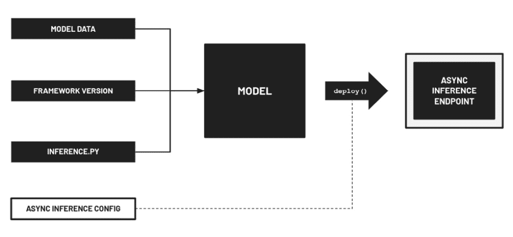

图 7.19 – 部署异步推理端点

在*图 7.19*中，我们可以看到`deploy()`方法接受 SageMaker 的参数值来配置异步推理端点而不是实时推理端点。

注意

模型部署应大约需要 3 到 8 分钟才能完成。

1.  一旦推理端点准备就绪，让我们使用`predict_async()`方法进行预测：

    ```py
    response = predictor.predict_async(
    ```

    ```py
        input_path=input_data
    ```

    ```py
    )
    ```

这应该使用存储在 S3 中的`input.json`文件中的数据调用异步推理端点。


图 7.20 – `predict_async()`方法的工作原理

在*图 7.20*中，我们可以看到异步推理端点的输入有效负载来自 S3 存储桶。然后，端点处理完请求后，输出将保存到 S3。如果您的输入有效负载很小（例如，小于*1 MB*），这可能没有太多意义。然而，如果输入有效负载涉及较大的文件，如视频文件，那么将它们上传到 S3 并利用异步推理端点进行预测将更有意义。

1.  使用`sleep()`函数在调用`response`对象的`get_result()`函数之前等待 40 秒：

    ```py
    from time import sleep
    ```

    ```py
    sleep(40)
    ```

    ```py
    response.get_result()
    ```

这应该产生一个输出值`'POSITIVE'`。

注意

为什么要等待 40 秒？因为我们已经在预测步骤中添加了 30 秒的人工延迟，所以我们必须至少等待 30 秒，直到输出文件在指定的 S3 位置可用。

1.  将 S3 路径字符串值存储在`output_path`变量中：

    ```py
    output_path = response.output_path
    ```

1.  使用`aws s3 cp`命令将输出文件的副本下载到 Studio 笔记本实例：

    ```py
    !aws s3 cp {output_path} sample.out
    ```

1.  现在我们已经下载了输出文件，让我们使用 `cat` 命令来检查其内容：

    ```py
    !cat sample.out
    ```

这应该会给我们一个输出值 `'POSITIVE'`，类似于我们在之前步骤中使用 `get_result()` 方法所得到的结果。

1.  让我们通过使用 `rm` 命令删除输出文件的副本来进行快速清理：

    ```py
    !rm sample.out
    ```

1.  最后，让我们使用 `delete_endpoint()` 方法删除推理端点：

    ```py
    predictor.delete_endpoint()
    ```

这将帮助我们避免因未使用的推理端点而产生的任何意外费用。

重要提示：在生产环境中，最好将架构更新为更事件驱动，并在初始化 `AsyncInferenceConfig` 对象时，必须更新 `notification_config` 参数值为适当的值。更多信息，请查阅以下链接：[`sagemaker.readthedocs.io/en/stable/overview.xhtml#sagemaker-asynchronous-inference`](https://sagemaker.readthedocs.io/en/stable/overview.xhtml#sagemaker-asynchronous-inference)。

注意

什么是 SNS？SNS 是一个完全托管的消息服务，允许架构以事件驱动。来自源（*发布者*）的消息可以扩散并发送到各种接收者（*订阅者*）。如果我们配置 SageMaker 异步推理端点将通知消息推送到 SNS，那么在预测步骤完成后，最好也注册并设置一个等待成功（或错误）通知消息的订阅者。这个订阅者随后将在结果可用时执行预定义的操作。

# 清理

现在我们已经完成了本章动手实践的解决方案，是时候清理并关闭我们将不再使用的任何资源了。在接下来的步骤中，我们将定位并关闭 SageMaker Studio 中任何剩余的运行实例：

1.  点击侧边栏中突出显示的 **运行实例和内核** 图标，如图 7.21 所示：

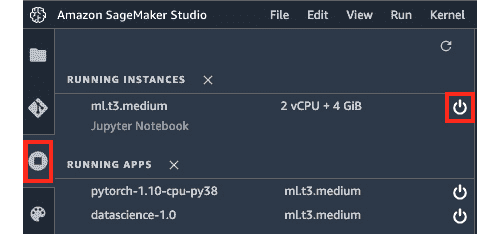

图 7.21 – 关闭运行实例

点击 **运行实例和内核** 图标应该会打开并显示 SageMaker Studio 中的运行实例、应用和终端。

1.  通过点击每个实例的 **关闭** 按钮，关闭 **RUNNING INSTANCES** 下的所有运行实例，如图 7.21 所示。点击 **关闭** 按钮将打开一个弹出窗口，验证实例关闭操作。点击 **关闭所有** 按钮继续。

1.  确保检查并删除 **SageMaker 资源** 下的所有运行推理端点（如果有）：

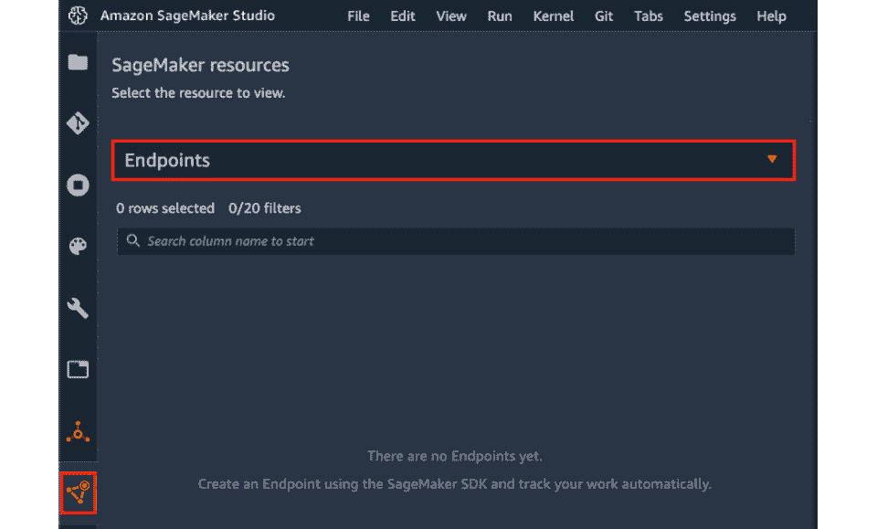

图 7.22 – 检查运行推理端点列表

要检查是否存在正在运行的推理端点，请点击如图 7.22 所示的高亮**SageMaker 资源**图标，然后从下拉菜单中选择**端点**。

重要的是要注意，这个清理操作需要在使用 SageMaker Studio 之后执行。即使在非活动期间，SageMaker 也不会自动关闭这些资源。

注意

如果你正在寻找其他方法来降低在 SageMaker 中运行 ML 工作负载的成本，你可以查看如何利用其他功能和能力，例如**SageMaker Savings Plans**（通过承诺 1 年或 3 年的持续使用来降低成本），**SageMaker Neo**（帮助优化 ML 模型以部署，加快推理速度并降低成本），以及**SageMaker Inference Recommender**（通过自动负载测试帮助你选择推理端点的最佳实例类型）。本书中不会进一步详细讨论这些内容，因此请随意查看以下链接以获取更多关于这些主题的信息：[`docs.aws.amazon.com/sagemaker/latest/dg/inference-cost-optimization.xhtml`](https://docs.aws.amazon.com/sagemaker/latest/dg/inference-cost-optimization.xhtml)。

# 部署策略和最佳实践

在本节中，我们将讨论使用 SageMaker 托管服务时的相关部署策略和最佳实践。让我们先谈谈我们可以调用现有 SageMaker 推理端点的方式。到目前为止，我们使用的解决方案涉及使用 SageMaker Python SDK 调用现有端点：

```py
from sagemaker.predictor import Predictor
from sagemaker.serializers import JSONSerializer
from sagemaker.deserializers import JSONDeserializer
endpoint_name = "<INSERT NAME OF EXISTING ENDPOINT>"
predictor = Predictor(endpoint_name=endpoint_name)
predictor.serializer = JSONSerializer() 
predictor.deserializer = JSONDeserializer()
payload = {
^  "text": "I love reading the book MLE on AWS!"
}
predictor.predict(payload)
```

在这里，我们在初始化步骤中初始化一个`Predictor`对象，并将其指向现有的推理端点。然后我们使用这个`Predictor`对象的`predict()`方法来调用推理端点。

注意，我们也可以使用**boto3**库调用相同的端点，类似于以下代码块中所示：

```py
import boto3 
import json
endpoint_name = "<INSERT NAME OF EXISTING ENDPOINT>"
runtime = boto3.Session().client('sagemaker-runtime')
payload = {
    "text": "I love reading the book MLE on AWS!"
}
response = sagemaker_client.invoke_endpoint(
    EndpointName=endpoint_name, 
    ContentType='application/json', 
    Body=json.dumps(payload)
)
json.loads(response['Body'].read().decode('utf-8'))
```

在这里，我们在使用现有的 ML 推理端点进行预测和推理时使用`invoke_endpoint()`方法。正如你所见，即使没有安装 SageMaker Python SDK，我们也应该能够通过`POST`请求使用`InvokeEndpoint` API 调用现有的 ML 推理端点。

注意

如果你的后端应用程序代码使用的是除 Python 以外的语言（例如 Ruby、Java 或 JavaScript），那么你只需要寻找该语言的现有 SDK 以及相应的函数或方法即可。有关更多信息，你可以查看以下链接，其中包含不同的工具以及每种语言可用的 SDK：[`aws.amazon.com/tools/`](https://aws.amazon.com/tools/)。

如果你想准备一个 HTTP API，该 API 可以调用并接口现有的 SageMaker 推理端点，那么有几种可能的解决方案。以下是一个快速列表：

+   *选项 1*: *Amazon API Gateway HTTP API + AWS Lambda 函数 + boto3 + SageMaker ML 推理端点* – 使用 `boto3` 库调用 SageMaker ML 推理端点。

+   *选项 2*: *AWS Lambda 函数 + boto3 + SageMaker ML 推理端点（Lambda 函数 URL）* – 直接从 Lambda 函数 URL（用于触发 Lambda 函数的专用端点）调用 AWS Lambda 函数。然后，AWS Lambda 函数使用 `boto3` 库调用 SageMaker ML 推理端点。

+   *选项 3*: *Amazon API Gateway HTTP API + SageMaker ML 推理端点（API Gateway 映射模板）* – Amazon API Gateway HTTP API 接收 HTTP 请求并直接使用 **API Gateway 映射模板**（不使用 Lambda 函数）调用 SageMaker ML 推理端点。

+   *选项 4*: *在 EC2 实例内使用 Web 框架（例如 Flask 或 Django）的基于容器的自定义 Web 应用程序 + boto3 + SageMaker ML 推理端点* – Web 应用程序（在 `boto3` 库的容器内运行，以调用 SageMaker ML 推理端点）。

+   *选项 5*: *在 Elastic Container Service（ECS）内使用 Web 框架（例如 Flask 或 Django）的基于容器的自定义 Web 应用程序 + boto3 + SageMaker ML 推理端点* – Web 应用程序（在容器内运行，使用 `boto3` 库调用 SageMaker ML 推理端点）。

+   *选项 6*: *使用 Elastic Kubernetes 服务（EKS）的基于容器的自定义 Web 应用程序（例如，Flask 或 Django）+ boto3 + SageMaker ML 推理端点* – Web 应用程序（在 `boto3` 库的容器内运行，以调用 SageMaker ML 推理端点）。

+   *选项 7*: *AWS AppSync（GraphQL API）+ AWS Lambda 函数 + boto3 + SageMaker ML 推理端点* – 使用 `boto3` 库调用 SageMaker ML 推理端点。

注意，这并不是一个详尽的列表，肯定还有其他方式来设置一个调用现有 SageMaker 推理端点的 HTTP API。当然，也有场景是我们希望直接从另一个 AWS 服务资源调用现有的推理端点。这意味着我们不再需要准备一个作为两个服务之间中间人的单独 HTTP API。

重要的是要注意，我们还可以直接从 **Amazon Aurora**、**Amazon Athena**、**Amazon Quicksight** 或 **Amazon Redshift** 调用 SageMaker 推理端点。在 *第四章* “AWS 上的无服务器数据管理”中，我们使用了 Redshift 和 Athena 来查询我们的数据。除了这些服务已经提供的数据库查询外，我们还可以使用类似于以下代码块中的语法直接执行 ML 推理（Athena 的一个示例查询）：

```py
USING EXTERNAL FUNCTION function_name(value INT)
RETURNS DOUBLE
SAGEMAKER '<INSERT EXISTING ENDPOINT NAME>'
SELECT label, value, function_name(value) AS alias
FROM athena_db.athena_table
```

在这里，我们定义并使用一个自定义函数，当使用 Amazon Athena 时，它会调用现有的 SageMaker 推理端点进行预测。有关更多信息，请随时查看以下资源和链接：

+   **Amazon Athena** + **Amazon SageMaker**: [`docs.aws.amazon.com/athena/latest/ug/querying-mlmodel.xhtml`](https://docs.aws.amazon.com/athena/latest/ug/querying-mlmodel.xhtml).

+   **Amazon Redshift** + **Amazon SageMaker**: [`docs.aws.amazon.com/redshift/latest/dg/machine_learning.xhtml`](https://docs.aws.amazon.com/redshift/latest/dg/machine_learning.xhtml).

+   **Amazon Aurora** + **Amazon SageMaker**: [`docs.aws.amazon.com/AmazonRDS/latest/AuroraUserGuide/aurora-ml.xhtml`](https://docs.aws.amazon.com/AmazonRDS/latest/AuroraUserGuide/aurora-ml.xhtml).

+   **Amazon QuickSight** + **Amazon SageMaker**: [`docs.aws.amazon.com/quicksight/latest/user/sagemaker-integration.xhtml`](https://docs.aws.amazon.com/quicksight/latest/user/sagemaker-integration.xhtml).

如果我们想在 SageMaker 托管服务之外部署模型，我们也可以做到。例如，我们可以使用 SageMaker 训练我们的模型，然后从包含在训练过程中生成的模型工件文件的 S3 存储桶中下载`model.tar.gz`文件。生成的模型工件文件可以在 SageMaker 之外部署，类似于我们在*第二章*，*深度学习 AMIs*和*第三章*，*深度学习容器*中部署和调用模型的方式。此时，你可能会问自己：为什么要在 SageMaker 托管服务中部署 ML 模型？以下是一个快速列表，列出了如果你在 SageMaker 托管服务中部署 ML 模型可以轻松执行和设置的事情：

+   设置用于托管机器学习模型的基础设施资源（ML 实例）的自动扩展（**autoscaling**）。自动扩展会在流量或工作负载增加时自动添加新的 ML 实例，并在流量或工作负载减少时减少已配置的 ML 实例数量。

+   使用 SageMaker 的**多模型端点**（**MME**）和**多容器端点**（**MCE**）支持，在单个推理端点中部署多个 ML 模型。也可以在单个端点后面设置一个**串行推理管道**，该管道涉及一系列容器（例如，预处理、预测和后处理），用于处理 ML 推理请求。

+   通过将流量分配到单个推理端点下的多个变体来设置 ML 模型的**A/B 测试**。

+   使用 SageMaker Python SDK 仅用几行代码设置自动化的模型监控和监控（1）数据质量，（2）模型质量，（3）偏差漂移和（4）特征归因漂移。我们将在*第八章*，*模型监控和管理解决方案*中更深入地探讨模型监控。

+   在部署模型时使用**弹性推理**，以向 SageMaker 推理端点添加推理加速，提高吞吐量并降低延迟。

+   在更新已部署模型时，执行蓝绿部署时使用多种流量切换模式。如果我们想一次性将所有流量从旧配置切换到新配置，我们可以使用**一次性**流量切换模式。如果我们想分两步将流量从旧配置切换到新配置，我们可以使用**金丝雀**流量切换模式。这涉及在第一次切换中仅切换部分流量，在第二次切换中切换剩余的流量。最后，我们可以使用**线性**流量切换模式，以预定的步骤数迭代地将流量从旧配置切换到新配置。

+   配置**CloudWatch**警报以及 SageMaker 自动回滚配置，以自动化部署回滚过程。

如果我们使用 SageMaker 进行模型部署，所有这些相对容易设置。在使用这些功能和特性时，我们只需要关注配置步骤，因为大部分工作已经被 SageMaker 自动化了。

到目前为止，我们一直在讨论在云中部署机器学习模型的不同选项和解决方案。在本节结束之前，让我们快速讨论一下在边缘设备（如移动设备和智能摄像头）上部署机器学习模型的情况。这种方法的几个优点包括实时预测延迟降低、隐私保护以及与网络连接相关的成本降低。当然，由于涉及的计算和内存等资源限制，在边缘设备上运行和管理机器学习模型会面临一些挑战。这些挑战可以通过**SageMaker Edge Manager**来解决，这是一个在边缘设备上优化、运行、监控和更新机器学习模型时利用其他服务、功能和特性的能力（例如**SageMaker Neo**、**IoT Greengrass**和**SageMaker Model Monitor**）。我们不会深入探讨细节，因此请自由查阅 https://docs.aws.amazon.com/sagemaker/latest/dg/edge.xhtml 以获取更多关于此主题的信息。

# 摘要

在本章中，我们讨论并专注于使用 SageMaker 的几种部署选项和解决方案。我们将预训练模型部署到三种不同类型的推理端点 - （1）实时推理端点，（2）无服务器推理端点，以及（3）异步推理端点。我们还讨论了每种方法的差异，以及每种选项在部署机器学习模型时最佳的使用时机。在本章的末尾，我们讨论了一些部署策略，以及使用 SageMaker 进行模型部署的最佳实践。

在下一章中，我们将更深入地探讨**SageMaker 模型注册表**和**SageMaker 模型监控器**，这些是 SageMaker 的功能，可以帮助我们管理和监控我们的生产模型。

# 进一步阅读

关于本章涵盖的主题的更多信息，请随时查看以下资源：

+   *Hugging Face DistilBERT 模型* ([`huggingface.co/docs/transformers/model_doc/distilbert`](https://huggingface.co/docs/transformers/model_doc/distilbert))

+   *SageMaker – 部署推理模型* (https://docs.aws.amazon.com/sagemaker/latest/dg/deploy-model.xhtml)

+   *SageMaker – 推荐推理* ([`docs.aws.amazon.com/sagemaker/latest/dg/inference-recommender.xhtml`](https://docs.aws.amazon.com/sagemaker/latest/dg/inference-recommender.xhtml))

+   *SageMaker – 部署安全网* ([`docs.aws.amazon.com/sagemaker/latest/dg/deployment-guardrails.xhtml`](https://docs.aws.amazon.com/sagemaker/latest/dg/deployment-guardrails.xhtml))

# 第四部分：保护、监控和管理机器学习系统和环境

在本节中，读者将学习如何正确地保护、监控和管理生产机器学习系统和部署的模型。

本节包括以下章节：

+   *第八章*，*模型监控和管理解决方案*

+   *第九章*，*安全、治理和合规策略*
