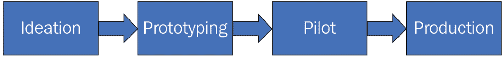
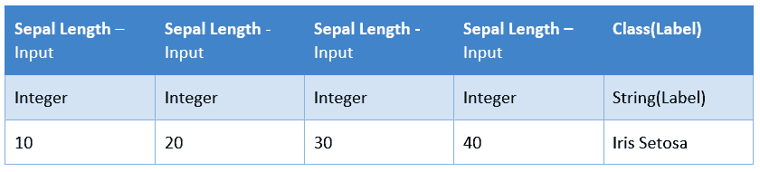
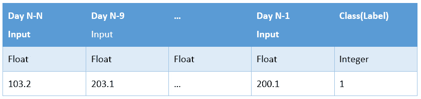
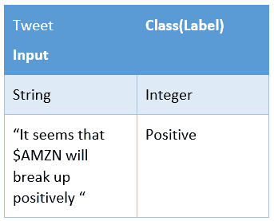

# 第二章：您的机器学习项目

本书的方法是通过迭代一个实际商业项目——即股票市场预测——并利用这个用例，通过不同的章节探索 MLflow 的不同功能。我们将使用结构化方法来构建机器学习问题和项目。本书剩余部分将创建并使用一个示例管道来迭代和演进项目。

使用结构化框架描述机器学习问题有助于从业者更有效地推理机器学习管道的不同需求。我们将展示一个使用在构建阶段收集到的需求的实际管道。

具体来说，在本章中，我们将涵盖以下内容：

+   探索机器学习过程

+   构建机器学习问题

+   介绍股票市场预测问题

+   开发您的机器学习基线管道

# 技术要求

对于本章，您需要以下先决条件：

+   在您的机器上安装了最新版本的 Docker。如果您还没有安装，请按照[`docs.docker.com/get-docker/`](https://docs.docker.com/get-docker/)上的说明进行操作。

+   访问 Bash 终端（Linux 或 Windows）。

+   访问浏览器。

+   已安装 Python 3.5 以上版本。

+   如*第一章*，“介绍 MLflow”中所述，在本地安装 MLflow。

# 探索机器学习过程

在本章中，我们将首先描述我们将贯穿整本书解决的问题。我们的目标是关注股票交易背景下的机器学习。

机器学习可以被定义为训练一个软件实体的过程——在本例中，是一个模型，用于在问题中做出相关预测。预测被用于驱动业务决策，例如，应该购买或出售哪只股票，或者图片中是否包含猫。

对于一个成功的项目来说，拥有标准的机器学习项目方法是至关重要的。机器学习生命周期的典型迭代在*图 2.1*中展示：



图 2.1 – 获取数据的摘录及预测列

让我们详细检查每个阶段：

+   **构思**：这一阶段涉及识别一个使用机器学习的机会并制定问题。

+   **原型设计**：这涉及到验证现有数据集的可行性和适用性，以实现计划中的想法。

+   **试点**：这涉及到评估和迭代机器学习算法，以便决定是否进入下一阶段。

+   **生产部署**：在成功试点后，我们应该能够在生产中运行机器学习项目，并允许它开始接收生产流量。

在*图 2.1*中定义的这些高级阶段肯定不是静态的，通常是迭代的，各阶段之间有动态移动以精炼和改进。

应该注意的是，机器学习并不是解决所有问题的方案。在决定使用机器学习之前，需要对当前的问题或项目进行深入评估，以决定是否应用机器学习。

有一些简单场景，机器学习解决方案是一个很好的候选者，例如以下情况：

+   当简单的规则和启发式方法不足以解决当前的问题时。

+   使用当前最先进的方法解决问题非常昂贵。

+   当解决问题的规则和代码非常复杂且难以维护时。

机器学习的出现给各个领域带来了变化；其中之一是**金融**领域。在计算机出现之前，金融是基于小办公室中的交易纸张，交易数量较少。有了计算机，情况发生了变化；现在每天有数百万笔交易。数百万人相互交易，无需亲自见面或进行任何其他形式的物理接触。

在金融和股票交易领域，机器学习可以在以下环境中使用：

+   **数据挖掘**：使用高级预测分析来识别数据集中的模式。高级数据分析师通常将机器学习模型作为其分析过程的一部分，并用于驱动业务决策。

+   **对冲交易**：一种使用两对市场方向相反的股票的技术。基本上，这是通过在每只股票与其正常行为不同步时卖出或买入来实现的，因为市场在一段时间后会趋于收敛。

+   **股票预测**：基于当前时间序列对特定股票在未来的某个时间点将被交易的简单预测。

+   **异常检测**：在市场中检测异常情况，发现对防止自动交易系统在市场异常的日子里运行非常重要。

+   **情感分析**：众所周知，股市主要是由公司和企业参与者的情绪驱动的。这种技术使用社交媒体或其它媒介上的消息，利用自然语言处理技术来衡量情绪（例如，正面、负面或中性）。

接下来，我们将探讨为机器学习构建问题框架。

# 构建机器学习问题框架

本节中定义的机器学习问题框架是一种技术和方法，旨在帮助明确和具体化机器学习问题，以便可以实施工程解决方案。如果没有一个稳固的方法来处理机器学习问题，提取这项工作的真正价值可能会变得非常困难。

我们将借鉴亚马逊和谷歌等公司的方法，这些公司已经成功应用了机器学习问题框架的技术。

机器学习开发过程高度基于科学方法。我们经过不同的阶段，包括陈述目标、数据收集、假设检验和结论。预期我们将循环通过工作流程的不同阶段，直到确定一个好的模型或明显无法开发模型。

以下小节描述了本书其余部分将使用的框架，以激发机器学习问题解决框架。

## 问题陈述

在尝试其他任何事情之前，理解我们正在解决的问题非常重要。为当前问题定义问题陈述是定义问题的明确方式。以下是一些合理的机器学习问题陈述示例：

+   预测特定股票的股票市场明天是否会上涨。

+   预测图片中是否有猫。

在这个流程的部分，我们指定我们旨在解决的特定类型的学习问题。以下是一些常见的问题类型：

+   **分类**：这类问题要求你预测模型的输出标签或类别，例如，分类电子邮件文本是否为垃圾邮件。它可以是二分类或多分类。一个多分类变体的好例子是根据手写数字进行分类。

+   **回归**：这指的是你需要，例如，从训练数据集中预测一个数值。好的例子包括根据大气特征预测温度和预测给定股票的美元价值。

+   **聚类**：当你没有标签来训练模型时，它包括发现数据的自然分组。它使用距离度量将相似数据点分组到同一组中。聚类可以用来识别欺诈交易，因为它们不会属于现有的分组。

+   **生成模型**：这是一种新型的机器学习，它根据现有数据生成新的数据，并且与输入数据在统计上相似。它在现代语言模型中广泛使用，例如 OpenAI 的 GPT-3。

+   **强化学习**：这是一种机器学习类型，其中代理/模型与环境交互以学习最优行为以最大化奖励。一个著名的应用是谷歌 DeepMind 的 AlphaGo 代理，它能够在围棋棋盘游戏中击败最佳人类玩家。一个非常重要的应用是使用盈利作为奖励来训练自动交易股票代理。

    重要提示

    机器学习问题有多种分类法；本节中的列表绝对不是详尽的。此列表与书中的示例相关。

## 成功与失败的定义

从业务中获得成功定义对于将您的问题置于正确的视角非常重要。例如，对于股市案例，以下可以概述为一个期望的结果：“使用本项目的模型，我们希望将我们目前 50%的日常交易盈利的*盈利能力*提高至 56%。”

因此，如果我们只有 30%的交易是成功的，那么这个模型显然是失败的。它通常将依赖于业务标准。

将业务指标作为成功定义，而不是像准确性、精确度或召回率这样的技术指标，有助于使解决方案与组织的具体目标保持一致。

## 模型输出

在机器学习问题框架的背景下，模型输出取决于您要解决的问题类型。例如，回归模型输出将是一个特定的数字（例如，作为股票预测的 10.5）和分类将返回一个标签（例如，检测到猫时返回`true`）以及一个概率阈值。

您的模型输出应该肯定与您的结果定义相关。

## 输出用途

说明您的预测将如何被使用有助于揭示模型开发的理由，帮助开发者了解问题和拥有感，例如，决定您是否将预测直接用于用户界面或用于喂养上游系统。

## 启发式方法

使用机器学习解决的问题可以通过规则和启发式方法来近似。将启发式方法作为机器学习管道的起点通常是一个推荐的项目启动方法。

例如，对于股票交易预测问题的一个有效启发式方法是使用最后一天的预测作为第一个基线生产启发式。模型开发者的目标就是通过更好的模型来超越基线。

## 数据层定义

在您的模型背景下精确定义输入和输出有助于澄清并指导您的机器学习问题开发。

### 数据源

本节关于问题框架的内容包括在问题框架过程中识别原始数据源并对其进行记录。原始数据源的例子包括公共或专有数据集及其定义和数据字典。

在这个阶段，识别数据是否已标记以及标记数据所需付出的努力是很重要的。

### 模型输入/输出

模型开发涉及定义模型中要使用的精确输入。考虑到所有可用的数据源，指定模型输入或特征集对于执行您的管道变得至关重要。与您的输入一起，应定义期望的目标。

模型输入/输出最好以表格形式呈现，如*图 2.2*所示，以便于推理和模型实现。为了清晰起见，增加了一行示例数据：



图 2.2 – 模型输入/输出的文档示例

接下来，我们将探讨在本书中我们将要工作的股票交易场景中，使用机器学习问题界定技术。

# 介绍股票市场预测问题

本书剩余章节将涵盖假设公司**PsyStock LLC**的情景，该公司为业余交易者提供平台，提供 API 和 UI 以解决股票预测背景下的不同预测问题。

作为机器学习实践者和开发者，我们应该能够构建一个平台，使数据科学家团队能够快速开发、测试并将机器学习项目投入生产。

我们将首先应用和界定问题，以便我们可以在问题的定义基础上构建我们的平台。需要注意的是，随着我们对问题的了解更多，问题界定将不断发展：初始界定将为我们提供解决问题空间的指导。

以下是我们将在本书的其余部分作为机器学习开发在 MLflow 中参考的核心项目。

## 股票走势预测器

这是公司 PsyStock LLC 将为客户提供的第一个 API 项目。如果给定的股票代码在股市中上涨，则该 API 将返回`true`，如果不上涨，则返回`false`。

## 问题陈述

问题陈述是通过机器学习分类器预测市场在单日是否会上涨。

## 成功与失败定义

在这种情况下，成功定义为系统中预测市场方向正确的天数占一个月天数的百分比。成功基本上是指系统在市场方向上准确率超过 60% – 基本上，是优于随机基线的期望值。

## 模型输出

模型输出为`1`表示股票代码价值增加，为`0`表示未增加。

## 输出用途

模型的输出将用于向 Rest API 提供基于分类准确度定义阈值的`true`或`false`值。

此问题的预期延迟低于 1,000 毫秒。

## 启发式方法

解决此问题的最简单启发式方法是使用随机预测器对每个输入进行预测，市场上涨或下跌的概率相等。

## 数据层定义

让我们定义我们数据层的每个部分。

### 数据源

由 Yahoo Finance 公共 API 提供的历史股票市场数据集。

### 模型输入/输出

让我们看看输入和输出，接下来：

+   **输入**：过去 10 天给定股票代码的每日收盘价。

+   `1`表示下一期增加，`0`表示不增加。

下表显示了模型的输入/输出数据：




图 2.3 – 记录模型输入/输出的示例

# 市场影响者的情绪分析

情绪机器学习管道将*预测社交媒体上股票代码的情绪是正面还是负面*，并将其作为 API 提供给我们在本书中开发的机器学习平台的用户。

## 问题陈述

为了预测 PsyStock LLC 选定的相关市场影响者在 Twitter 上对给定股票代码在当天是否具有正面情绪。

## 成功与失败的定义

在这种情况下，成功定义起来有点困难，因为情绪是正面的这一事实不能精确地追踪到市场指标。对于这个特定的预测问题，成功的定义应该是用户重复使用 API 次数的代理。

## 模型输出

模型输出基本上是一个数字，匹配股票代码的推文的极性——正面、负面或中性情绪。

## 输出用途

该系统的输出将用于一个 Rest API，该 API 将在请求时提供，包括给定股票代码的正面、中性和负面极性的数量。

## 启发式方法

作为此问题的基线，一个非常简单的启发式方法是计算单词`up`和`down`出现的次数。对于股票代码，哪个单词更频繁，就使用哪个单词的值作为极性。如果两个单词之间的频率百分比小于 10%，我们将假设该股票代码的情绪是中性的。

## 数据层定义

对于这个问题，最 readily available 的原始数据是社交媒体。Twitter 提供了一个易于消费和搜索的 API，我们可以通过股票代码和影响者用户名进行搜索。

### 数据来源

源数据将通过 Twitter API 获取，以搜索给定可更新市场影响者列表的股票代码。

### 模型输入/输出

将为模型提供服务的系统将接收一条推文并返回分类的情绪（正面、负面或中性）：



图 2.4 – 记录模型输入/输出的示例

在本节中，我们仅定义了我们将从头到尾在整个书中解决的问题。我们将根据需要改进问题框架的定义，并在必要时对其进行更新。

在下一节中，我们将探讨在问题框架中定义启发式方法，以创建我们将要改进的第一个基础管道。

# 开发您的机器学习基线管道

对于我们的机器学习平台，我们将从一个非常简单、基于启发式方法的管道开始，以确保您的端到端系统的基础设施运行正确，并为机器学习模型提供一个可以迭代的 环境。

重要提示

确保在本地机器上正确安装技术要求对于跟随教程至关重要。本节假设您已按照*技术要求*部分安装了 MLflow 和 Docker。

到本节结束时，您将能够创建我们的基线流程。基线流程的价值在于能够快速迭代模型开发。因此，基本上，一个端到端的基础设施将提供给开发团队，其中包含用于训练和模型服务的占位符。由于所有这些都实现在了 MLflow 中，因此可以轻松实现不同类型团队在机器学习项目中的专业化和专注。工程团队将专注于改进流程，而数据科学导向的团队将有一种快速测试和评估其模型的方法：

1.  在 MLflow 中实现启发式模型。

    在以下代码块中，我们创建了`RandomPredictor`类，这是一个从`mlflow.pyfunc.PythonModel`类派生的定制预测器。主要的`predict`方法返回 0 到 1 之间的随机数：

    ```py
    import mlflow
    class RandomPredictor(mlflow.pyfunc.PythonModel):
      def __init__(self):
        pass
      def predict(self, context, model_input):
        return model_input.apply(lambda column: random.randint(0,1))
    ```

    我们使用 MLflow 中创建自定义模型的特定功能；有关自定义模型的更多详细信息，请参阅[`mlflow.org/docs/latest/python_api/mlflow.pyfunc.html#pyfunc-create-custom`](https://mlflow.org/docs/latest/python_api/mlflow.pyfunc.html#pyfunc-create-custom)。

1.  在 MLflow 中保存模型。

    以下代码块以`random_model`的名称保存模型，以便以后检索。它在本地文件系统中的 MLflow 注册表中注册：

    ```py
    model_path = "random_model"
    baseline_model = RandomPredictor()
    mlflow.pyfunc.save_model(path=model_path, python_model=random_model)
    ```

    在这个阶段，我们基本上实例化了模型，并按照本地环境配置将其存储在模型注册表中。

1.  运行您的`mlflow`作业：

    ```py
    mlflow run . 
    ```

1.  启动服务 API：

    ```py
    mlflow models serve -m ./mlruns/0/b9ee36e80a934cef9cac3a0513db515c/artifacts/random_model/
    ```

1.  测试您模型的 API。

    您可以访问一个非常简单的 Flask 服务器，可以运行您的模型。您可以通过在服务器上运行`curl`命令来测试执行：

    ```py
    curl http://127.0.0.1:5000/invocations -H 'Content-Type: application/json' -d '{"data":[[1,1,1,1,0,1,1,1,0,1,1,1,0,0]]}' [1]%
    ```

在这个阶段，我们有一个基线虚拟模型，模型开发团队的目标现在是要改进这个模型。这个相同的流程将在下一章中用于构建一个数据科学开发环境，该平台在本书中构建的初始算法。

# 摘要

在本章中，我们介绍了机器学习问题框架方法，并探讨了采用此框架的一些动机。

我们介绍了股票市场预测机器学习平台以及我们使用 ML 问题框架方法定义的初始预测问题集。

在本章中，我们简要介绍了将在本书其余部分使用的股票市场预测基本流程的用例。

在下一章中，我们将专注于使用本章中定义的问题创建一个数据科学开发环境，使用 MLflow。

# 进一步阅读

为了进一步扩展您的知识，您可以查阅以下链接中的文档：

+   关于谷歌机器学习问题框架的参考信息：[`developers.google.com/machine-learning/problem-framing`](https://developers.google.com/machine-learning/problem-framing)

+   关于亚马逊机器学习框架的参考信息：[`docs.aws.amazon.com/wellarchitected/latest/machine-learning-lens/ml-problem-framing.html`](https://docs.aws.amazon.com/wellarchitected/latest/machine-learning-lens/ml-problem-framing.html)
