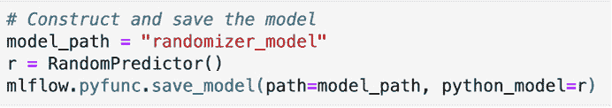

# 第三章：您的数据科学工作台

在本章中，您将了解在创建本地环境的情况下 MLflow 的应用，以便您可以使用 MLflow 提供的不同功能在本地开发机器学习项目。本章专注于机器学习工程，机器学习工程师最重要的角色之一是建立一个环境，让模型开发者和从业者可以高效工作。我们还将演示如何使用工作台完成特定任务的动手示例。

特别地，在本章中，我们将探讨以下主题：

+   理解数据科学工作台的价值

+   创建您自己的数据科学工作台

+   使用工作台进行股票预测

# 技术要求

对于本章，您需要以下先决条件：

+   在您的机器上安装的 Docker 最新版本。如果您尚未安装，请按照 [`docs.docker.com/get-docker/`](https://docs.docker.com/get-docker/) 上的说明进行操作。

    已安装 Docker Compose 的最新版本。如果您尚未安装，请按照 https://docs.docker.com/compose/install/ 上的说明进行操作。

+   命令行中访问 Git，并按照本 **统一资源定位符** （**URL**）[`git-scm.com/book/en/v2/Getting-Started-Installing-Git`](https://git-scm.com/book/en/v2/Getting-Started-Installing-Git) 中的说明进行安装。

+   访问 `bash` 终端（Linux 或 Windows）。

+   访问浏览器。

+   已安装 Python 3.5+。

+   如在 *第一章* 中所述，本地安装 MLflow。

# 理解数据科学工作台的价值

数据科学工作台是一个环境，用于标准化组织的机器学习工具和实践，允许快速上线和开发模型和分析。机器学习工程的一个关键功能是支持数据科学从业者使用能够赋予他们力量并加速他们日常活动的工具。

在数据科学团队中，快速测试多种方法和技术的能力至关重要。每天都有新的库和开源工具被创建。一个项目可能需要超过十个库来测试一种新的模型。这些众多的库，如果未能正确整理，可能会在模型中引起错误或不兼容。

数据是数据科学工作流程的核心。拥有干净的数据集用于开发和评估模型至关重要。随着大量大型数据集的出现，需要专门的大数据工具来处理数据。数据可以以多种格式和速度进行分析或实验，并且可以以多种格式和介质提供。它可以通过文件、云或 **REpresentational State Transfer** （**REST**） **应用程序编程接口** （**API**）提供。

数据科学主要是一种协作工艺；它是团队成员之间共享模型和流程的工作流程的一部分。不可避免地，从这个活动中出现的一个痛点是模型开发作业在从业者之间的跨可重复性。数据科学家 A 分享了一个假设库版本 2.6 的模型训练脚本，但数据科学家 B 使用的是版本 2.8 的环境。在某些情况下，追踪和修复这个问题可能需要数小时。如果这个问题出现在生产环境中，它可能会对公司造成极大的成本。

在迭代——例如——模型时，每次运行都包含多个可以调整以改进模型的参数。如果我们不以结构化的方式存储实验的详细信息，那么维护哪个参数产生了特定的性能指标（例如准确性）的可追溯性可能会成为问题。如果在模型开发阶段只保留最新设置，那么回到产生更好模型的特定批次设置可能是不可能的。

迭代速度的需求在将原型代码翻译到可靠执行的生产环境时，可能会引起许多挫败感。例如，如果你在一个可以轻松访问**图形处理单元**（**GPUs**）进行推理的 Windows 机器上开发新的交易模型，你的工程团队成员可能会决定重用现有的无 GPU 访问的 Linux 基础设施。这导致你的生产算法最终需要 5 小时才能完成，而在本地运行只需 30 秒，影响了项目的最终结果。

很明显，如果不对环境和工具相关的问题进行前期处理，数据科学部门会面临系统性的技术痛点。总结来说，我们可以列出本节中描述的以下主要点：

+   可重复性摩擦

+   处理大型和多样化数据集的复杂性

+   实验设置管理不善

+   本地和生产环境之间的漂移

数据科学工作台通过创建一个结构化环境来解决本节中描述的痛点，在这个环境中，机器学习从业者可以授权可靠地开发和部署他们的模型，减少摩擦。无摩擦的环境将允许高度昂贵的模型开发时间专注于开发和迭代模型，而不是解决工具和数据技术问题。

在深入研究为机器学习团队构建数据科学工作台的动机之后，我们接下来将根据已知的痛点开始设计数据科学工作台。

# 创建自己的数据科学工作台

为了解决前述章节中描述的数据科学模型开发中的常见摩擦，我们需要为数据科学家和从业者提供一个标准化的环境，让他们可以在其中开发和管理工作。数据科学工作台应允许您快速启动项目，并且一套起始工具和框架的可用性允许数据科学家快速启动项目。

数据科学家和机器学习从业者处于工作台的中心：他们应该有一个可靠的平台，允许他们开发并为其组织增加价值，同时他们的模型触手可及。

以下图表展示了数据科学工作台的核心功能：

![Figure 3.1 – 数据科学工作台的核心功能

![img/B16783_03_001.jpg]

图 3.1 – 数据科学工作台的核心功能

为了思考我们数据科学工作台的设计，并基于*图 3.1*中的图表，我们需要在我们的数据科学工作台中具备以下核心功能：

+   **依赖管理**：在本地环境中集成依赖管理有助于处理可重复性问题，并防止不同环境之间的库冲突。这通常是通过使用环境管理器，如 Docker，或者在您的编程语言中提供环境管理框架来实现的。MLflow 通过支持基于 Docker 或 Conda 的环境来提供这一功能。

+   **数据管理**：如果您必须处理大量数据集，则在本地环境中管理数据可能会变得复杂且令人畏惧。在您的本地项目中有一个标准化的数据处理定义，允许他人自由协作并理解可用的结构。

+   **模型管理**：将不同的模型组织并妥善存储提供了一个易于工作的结构，能够同时处理许多想法并持久化那些有潜力的想法。MLflow 通过模型格式抽象和**模型注册**组件来支持这一点，以管理模型。

+   **部署**：在本地环境中与模型将提供服务的生产环境保持一致需要深思熟虑。生产环境需要准备好接收模型开发者的模型，以尽可能少的摩擦。这种平稳的部署工作流程只有在本地环境正确设计的情况下才可能实现。

+   **实验管理**：调整参数是机器学习从业者最常见的事情。能够跟上不同版本和特定参数可能会迅速变得繁琐，对模型开发者来说。

    重要提示

    在本节中，我们将从头开始使用 MLflow 实现数据科学工作台的基础，主要支持本地开发。云提供商如**亚马逊网络服务**（**AWS**）Sagemaker、**谷歌 AI**和**Azure 机器学习**（**Azure ML**）提供了一些非常具有意见和功能丰富的选项。

机器学习工程团队在所服务的团队使用的用例和技术方面有自由度。

以下步骤展示了使用数据科学工作台进行开发的良好工作流程：

+   模型开发者通过安装程序或克隆仓库来安装公司工作台包。

+   模型开发者运行一个命令以启动项目。

+   模型开发者根据配置或提示选择一组选项。

+   基本框架生成时，会为以下项目创建特定文件夹：

    a) `Data`：这将包含当前项目的所有数据资产

    b) `Notebooks`：用于存放所有迭代开发笔记本，包括生成模型所需的所有步骤

    c) `Model`：包含二进制模型或模型引用的文件夹，可能以二进制格式

    d) `Source Code`：用于存储代码的结构化组件和可重用库

    e) `Output`：用于存放项目特定输出的文件夹——例如，可视化、报告或预测

+   使用标准化的包、依赖管理和工具组织创建项目文件夹。

+   模型开发者可以自由迭代并使用组织级别的支持工具创建模型。

建立数据科学工作台为组织中的机器学习加速和民主化提供了一个工具，这是由于标准化和高效采用机器学习最佳实践的结果。

我们将在本章中开始我们的工作台实现，使用业界广泛使用的合理组件。

## 构建我们的工作台

我们将在开发环境架构中拥有以下组件：

+   **Docker/Docker Compose**：将使用 Docker 来处理架构中每个主要组件的依赖关系，Docker Compose 将用作不同软件组件容器之间的协调器。工作台架构的每个组件都在 Docker 中，其优势是元素库之间不会相互冲突。

+   **JupyterLab**：在机器学习环境中开发数据科学代码和进行数据分析的事实上环境。

+   **MLflow**：MLflow 是工作台的核心，提供实验跟踪、模型管理、注册和部署接口的功能。

+   **PostgreSQL 数据库**：PostgreSQL 数据库作为 MLflow 后端元数据的存储层，是当前架构的一部分。其他关系型数据库也可以用作 MLflow 后端元数据，但我们将使用 PostgreSQL。

我们的数据科学工作台设计可以在以下图表中看到：


图 3.2 – 我们的数据科学工作台设计

*图 3.2* 展示了我们将支持的数据科学工作台组件布局。

一旦环境启动并运行，实践者的常规工作流程是在 Jupyter 中开发他们的代码，并使用 MLflow 支持运行他们的实验。环境将自动路由到正确配置到正确后端的 MLflow 安装，如图 3.2 所示。

重要提示

根据本章定义，我们的数据科学工作台是一个完整的地方环境。随着本书的进展，我们将介绍基于云的环境，并将我们的工作台与共享资源链接。

以下 GitHub 文件夹中提供了一个项目布局的示例：

https://github.com/PacktPublishing/Machine-Learning-Engineering-with-MLflow/tree/master/Chapter03/gradflow

您可以在此处看到工作台文件布局的一般表示：

```py
├── Makefile
├── README.md
├── data
├── docker
├── docker-compose.yml
├── docs
├── notebooks
├── requirements.txt
├── setup.py
├── src
├── tests
└── tox.ini
```

此文件夹结构的主要元素在此概述：

+   `Makefile`：这允许您控制工作台。通过发出命令，您可以要求工作台设置一个新的环境笔记本以以不同格式启动 MLflow。

+   `README.md`：一个包含项目示例描述及其如何运行的文件。

+   `data`文件夹：一个文件夹，用于存储开发期间使用的数据集，并在本地运行时挂载数据库的数据目录。

+   `docker`：一个包含我们环境所包含的不同子系统 Docker 镜像的文件夹。

+   `docker-compose.yml`：一个包含我们工作台环境中的不同服务编排的文件——即：Jupyter 笔记本、MLflow 和用于支持 MLflow 的 PostgreSQL。

+   `docs`：包含我们希望持久化的相关项目文档。

+   `notebooks`：一个包含笔记本信息的文件夹。

+   `requirements.txt`：一个要求文件，用于向项目添加库。

+   `src`：一个包含项目源代码的文件夹，将在项目的后续阶段进行更新。

+   `tests`：一个包含项目代码端到端测试的文件夹。

+   `tox.ini`：一个模板文件，用于控制单元测试的执行。

现在，我们将继续使用我们自己的开发环境来解决股票预测问题，基于我们刚刚构建的框架。

# 使用工作台进行股票预测

在本节中，我们将逐步使用工作台来设置新项目。按照步骤说明启动您的环境并使用工作台进行股票预测项目。

重要提示

在“技术要求”部分列出的所有软件包/库都必须正确安装在您的本地机器上，这对于您跟随教程至关重要。

## 启动你的环境

我们将接着探索您自己的开发环境，基于本节中所示的开发环境。请执行以下步骤：

1.  复制位于 https://github.com/PacktPublishing/Machine-Learning-Engineering-with-MLflow/tree/master/Chapter03/gradflow 的项目内容。

1.  通过运行以下命令启动您的本地环境：

    ```py
    make
    ```

1.  检查创建的环境，如下所示：

    ```py
    $ docker ps 
    ```

    以下截图展示了三个 Docker 镜像：第一个用于 Jupyter，第二个用于 MLflow，第三个用于 PostgreSQL 数据库。状态应显示为 `Up x minutes`：


图 3.3 – 运行 Docker 镜像

您工作台通常使用的端口如下所示：Jupyter 在端口 `8888` 上运行，MLflow 在端口 `5000` 上运行，PostgreSQL 在端口 `5432` 上运行。

如果任何容器失败，您可能需要检查端口是否被不同的服务使用。如果是这种情况，您将需要关闭所有其他服务。

检查您的 Jupyter Notebooks 环境 [`localhost:8888`](http://localhost:8888)，如下面的截图所示：


图 3.4 – 运行 Jupyter 环境

您应该有一个可用的环境，允许您在指定的文件夹中创建新的 `notebooks` 文件。

在 http://localhost:5000 上检查您的 MLflow 环境，如下面的截图所示：


图 3.5 – 运行 MLflow 环境

*图 3.5* 展示了您将在 MLflow 中使用的实验跟踪环境。

通过运行 `/notebooks/mlflow_sample.ipynb` 中的 `notebook` 文件在 MLflow 中运行一个示例实验，如下面的截图所示：


图 3.6 – mlflow_sample 代码摘录

*图 3.6* 中的代码导入 MLflow 并手动创建一个实验，在第二行使用 `mlflow.set_experiment('mlflow_experiment')`。

`with mlflow.start_run()` 行负责在 MLflow 中启动和拆除实验。

在接下来的三行中，我们使用 `mlflow.log_param` 函数记录几个字符串类型的测试参数。要记录数值，我们将使用 `mlflow.log_metric` 函数。

最后，我们还将使用 `mlflow.log_artifact("mlflow_example.ipynb")` 函数记录执行函数的整个文件，以确保模型及其源代码的可追溯性。

检查示例运行情况，以确认环境是否正常工作。您应该回到位于 http://localhost:5000 的 MLflow **用户界面**（**UI**）并检查是否创建了新的实验，如下面的截图所示：


图 3.7 – MLflow 测试实验

*图 3.7* 显示了我们特定实验中使用的附加参数以及 **指标** 列中可见的特定指标 `i`。

接下来，您应该点击创建的实验以访问我们迄今为止执行的运行的详细信息。以下是一个截图示例：


图 3.8 – MLflow 实验细节

除了指标细节之外，您还可以访问特定时间点的 `mlflow_example` 笔记本文件。

在此阶段，您已经拥有一个按预期运行和工作的环境。接下来，我们将使用我们自己的算法来更新它；我们将使用我们在 *第二章*，*您的机器学习项目* 中创建的算法。

## 使用您自己的算法进行更新

让我们更新我们在 *第二章*，*ML 问题框架* 中创建的笔记本文件，并将其添加到您本地工作台上的笔记本文件夹中。代码摘录如下：

```py
import mlflow
class RandomPredictor(mlflow.pyfunc.PythonModel):
  def __init__(self):
    pass
  def predict(self, context, model_input):
    return model_input.apply(lambda column: random.randint(0,1))
```

在 `notebooks/stockpred_randomizer.ipynb` 文件中的 `notebook` 文件夹下，您可以跟随我们最近创建的数据科学工作台中前面代码摘录的集成。我们将按以下步骤进行：

1.  我们将首先导入所有需要的依赖项并运行笔记本的第一个单元，如下所示：

    图 3.9 – MLflow 实验细节

1.  让我们声明并执行 *图 3.9* 中概述的类，该类在笔记本的第二单元中表示，如下所示：

    图 3.10 – 包含 RandomPredictor 类声明的笔记本单元

1.  我们现在可以在 MLflow 基础设施中保存我们的模型，以便我们可以测试模型的加载。`model_path` 包含模型将保存的文件夹名称。您需要在 `r` 变量中实例化模型，并使用 `mlflow.pyfunc.save_model` 将模型本地保存，如下面的代码片段所示：

    图 3.11 – 展示保存模型的笔记本

    您可以在笔记本环境左侧的窗格中看到，在您的文件旁边创建了一个新文件夹来存储您的模型。此文件夹将存储 Conda 环境以及您的模型的可 pickled/binarized Python 函数，如下面的截图所示：

    

    图 3.12 – 展示保存模型文件夹的笔记本

1.  接下来，我们可以加载并使用模型来检查保存的模型是否可用，如下所示：


图 3.13 – 展示保存模型文件夹的笔记本

*图 3.14* 展示了创建一个随机输入 `loaded_model` 来预测输入向量的过程。我们将以 `stockpred_experiment_days_up` 为名运行实验，将每个模型在市场上涨的天数作为指标进行记录，如下所示：


图 3.14 – 展示加载模型使用的笔记本单元格

要检查实验的最后运行，你可以查看 http://localhost:5000 并确认新实验已被创建，如下面的屏幕截图所示：


图 3.15 – 我们 stockpred 实验的 MLflow 初始用户界面

你现在可以比较我们算法的多次运行，并查看**天数上升**指标的变化，如下面的屏幕截图所示。你可以相应地选择深入了解你想要更多详细信息的运行：


图 3.16 – 保存的工件日志细节

在*图 3.16*中，你可以清楚地看到我们运行的日志细节——即，工件模型和**天数上升**指标。

为了正确地拆除环境，你必须在同一文件夹中运行以下命令：

```py
make down
```

# 摘要

在本章中，我们介绍了数据科学工作台的概念，并探讨了采用此工具作为加速我们的机器学习工程实践的一些动机。

我们根据需求设计了一个数据科学工作台，使用 MLflow 和基于相邻技术的技术。我们详细说明了使用 MLflow 设置你的开发环境的步骤，并说明了如何使用现有代码。在后面的章节中，我们探讨了工作台，并添加了我们上一章开发的股票交易算法。

在下一章中，我们将专注于使用 MLflow 进行实验，以改进我们的模型，使用本章开发的工作台。

# 进一步阅读

为了进一步扩展你的知识，你可以查阅以下链接中的文档：

+   Cookiecutter 文档页面：[`cookiecutter.readthedocs.io/en/1.7.2/`](https://cookiecutter.readthedocs.io/en/1.7.2/)

+   关于 cookie cutters 的参考信息：[`drivendata.github.io/cookiecutter-data-science/`](https://drivendata.github.io/cookiecutter-data-science/)

+   数据科学工作台背后的动机：[`dzone.com/articles/what-is-a-data-science-workbench-and-why-do-data-s#`](https://dzone.com/articles/what-is-a-data-science-workbench-and-why-do-data-s#)
