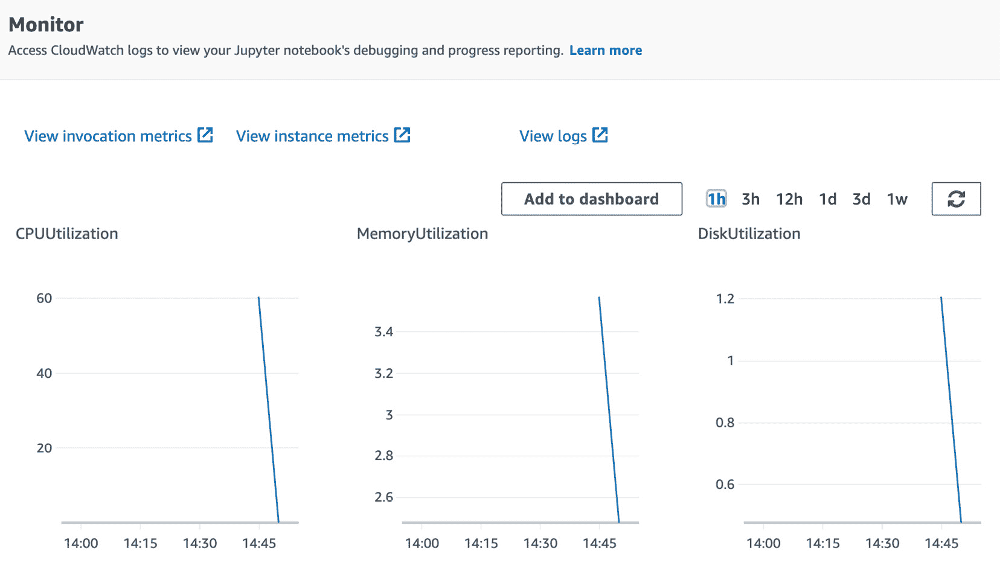

# 第九章：使用 MLflow 进行部署和推理

在本章中，您将了解我们机器学习（ML）系统的端到端部署基础设施，包括使用 MLflow 的推理组件。然后我们将转向在云原生 ML 系统（AWS SageMaker）和混合环境中部署我们的模型。接触这些不同环境的主要目标是让您具备在不同项目环境（云原生和本地）约束下部署 ML 模型的能力。

本章的核心是将 PsyStock 模型部署以预测基于您在本书中迄今为止所做的前 14 天市场行为的比特币（BTC/USD）价格。我们将借助工作流在多个环境中部署此模型。

具体来说，我们将在本章中查看以下部分：

+   启动本地模型注册库

+   设置批量推理作业

+   创建推理的 API 流程

+   在 Kubernetes 中部署模型进行批量评分

+   使用 AWS SageMaker 进行云部署

# 技术要求

对于本章，您需要以下先决条件：

+   在您的机器上安装了最新版本的 Docker。如果您尚未安装，请按照[`docs.docker.com/get-docker/`](https://docs.docker.com/get-docker/)上的说明进行操作。

+   安装了最新版本的`docker-compose`。请按照[`docs.docker.com/compose/install/`](https://docs.docker.com/compose/install/)上的说明进行操作。

+   在命令行中访问 Git，其安装方法可参考[`git-scm.com/book/en/v2/Getting-Started-Installing-Git`](https://git-scm.com/book/en/v2/Getting-Started-Installing-Git)。

+   访问 Bash 终端（Linux 或 Windows）。

+   访问浏览器。

+   安装了 Python 3.5+。

+   按照*第三章**，您的数据科学工作台*中所述，在本地安装了最新版本的 ML 平台。

+   一个配置好的 AWS 账户，用于运行 MLflow 模型。

# 启动本地模型注册库

在执行本章的以下部分之前，您需要设置一个集中的模型注册库和跟踪服务器。我们不需要整个数据科学工作台，因此可以直接使用内置在以下章节中将要部署的模型中的较轻量级的工作台变体。您应该在代码的根目录中，该目录可在[`github.com/PacktPublishing/Machine-Learning-Engineering-with-MLflow/tree/master/Chapter09`](https://github.com/PacktPublishing/Machine-Learning-Engineering-with-MLflow/tree/master/Chapter09)找到。

接下来，切换到`gradflow`目录，并启动环境的一个轻量级版本以服务于您的模型，操作如下：

```py
$ cd gradflow
$ export MLFLOW_TRACKING_URI=http://localhost:5000 
$ make gradflow-light
```

在使用 MLflow 从 ML 注册表中检索模型并设置我们的 API 部署基础设施之后，我们将继续处理需要评分的批量输入数据的情况。我们将使用 MLflow 为当前的预测问题准备一个批量推理作业。

# 设置批量推理作业

本节所需的代码位于 `pystock-inference-api` 文件夹中。MLflow 基础设施由代码附带的 Docker 镜像提供，如图下所示：

![Figure 9.1 – 批量评分部署布局

![img/image0015.jpg]

图 9.1 – 批量评分部署布局

如果你直接访问到这些工件，你可以执行以下操作。代码位于 `pystock-inference-batch` 目录下。为了设置一个批量推理作业，我们将遵循以下步骤：

1.  导入你的批量作业的依赖项；在相关的依赖项中，我们包括 `pandas`、`mlflow` 和 `xgboost`：

    ```py
    import pandas as pd
    import mlflow
    import xgboost as xgb
    import mlflow.xgboost
    import mlflow.pyfunc
    ```

1.  我们接下来将通过调用 `mlflow.start_run` 来加载 `start_run` 并从 `input.csv` 评分输入文件加载数据：

    ```py
    if __name__ == "__main__":
        with mlflow.start_run(run_name="batch_scoring") as run:
            data=pd.read_csv("data/input.csv",header=None)
    ```

1.  接下来，我们通过指定 `model_uri` 值从注册表中加载模型，基于模型的详细信息：

    ```py
            model_name = "training-model-psystock"
            stage = 'Production'
            model = mlflow.pyfunc.load_model(
                    model_uri=f"models:/{model_name}/{stage}"
            )
    ```

1.  我们现在可以通过运行 `model.predict` 来预测我们刚刚读取的数据集：

    ```py
            y_probas=model.predict(data)
    ```

1.  保存批量预测。这基本上涉及到将 `y_preds` 变量中的市场上涨的概率目标映射到 0 到 1 的值：

    ```py
        y_preds = [1 if  y_proba > 0.5 else 0 for y_proba in y_probas]

        data[len(data.columns)] =y_preds

        result = data
        result.to_csv("data/output.csv")
    ```

1.  我们现在需要将作业打包成一个 Docker 镜像，这样我们就可以轻松地在生产环境中运行它：

    ```py
    FROM continuumio/miniconda3
    WORKDIR /batch-scoring/
    RUN pip install mlflow==1.16.0
    RUN pip install pandas==1.2.4
    COPY batch_scoring.py   /batch-scoring/
    COPY MLproject          /batch-scoring/
    ENV MLFLOW_TRACKING_URI=http://localhost:5000
    ENTRYPOINT ["mlflow run . --no-conda"]
    ```

1.  构建你的 Docker 镜像并对其进行标记，以便你可以引用它：

    ```py
    docker build . -t pystock-inference-batch
    ```

1.  通过执行以下命令来运行你的 Docker 镜像：

    ```py
    docker run -i pystock-inference-batch
    ```

在这种情况下，一个 Docker 镜像为你提供了一个机制，可以在支持 Docker 镜像的任何云或本地计算环境中运行你的批量评分作业。

我们现在将展示如何为 MLflow 生成一个 Docker 化的 API 推理环境。

# 创建用于推理的 API 进程

本节所需的代码位于 `pystock-inference-api` 文件夹中。MLflow 基础设施由代码附带的 Docker 镜像提供，如图下所示：

![Figure 9.2 – API 作业的结构

![img/image0026.jpg]

图 9.2 – API 作业的结构

通过依赖 MLflow 内置的 REST API 环境，设置一个 API 系统相当简单。我们将依赖本地文件系统上的工件存储来测试 API。

通过以下命令集，其核心是使用 CLI 中的 `models serve` 命令，我们可以提供我们的模型服务：

```py
cd /gradflow/
export MLFLOW_TRACKING_URI=http://localhost:5000
mlflow models serve -m "models:/training-model-psystock/Production" -p 6000
```

我们接下来将前面的命令打包到一个 Docker 镜像中，以便在任何环境中进行部署。实现这一目标的步骤如下：

1.  生成一个 Docker 镜像，指定工作目录和需要启动的命令作为 `entry point`：

    ```py
    FROM continuumio/miniconda3
    WORKDIR /batch-scoring/
    RUN pip install mlflow==1.16.0
    ENV MLFLOW_TRACKING_URI=http://localhost:5000
    ENTRYPOINT ["mlflow models serve -m "models:/training-model-psystock/Production" -p 6000"]
    ```

1.  构建你的 Docker 镜像：

    ```py
    docker build . -t pystock-inference-api
    ```

1.  运行你的 Docker 镜像：

    ```py
    docker run -i pystock-inference-api -p 6000:6000
    ```

在这个阶段，你已经将 API 基础设施 Docker 化，并且可以在你方便的计算环境中部署它。

在深入研究了 MLflow 与 AWS 平台上的云原生部署的交互之后，我们现在将关注一个不依赖于任何提供商的部署。

# 在 Kubernetes 中部署你的模型进行批量评分

我们将使用 Kubernetes 来部署我们的批量评分作业。我们需要进行一些修改，使其符合 Docker 格式，以便通过 Kubernetes 进行生产中的 MLflow 部署。本节的前提条件是你有权访问 Kubernetes 集群或可以设置一个本地集群。有关指南，请参阅 [`kind.sigs.k8s.io/docs/user/quick-start/`](https://kind.sigs.k8s.io/docs/user/quick-start/) 或 [`minikube.sigs.k8s.io/docs/start/`](https://minikube.sigs.k8s.io/docs/start/)。

你现在需要执行以下步骤，从 Kubernetes 中的注册表中部署你的模型：

1.  前提条件：部署和配置 `kubectl` ([`kubernetes.io/docs/reference/kubectl/overview/`](https://kubernetes.io/docs/reference/kubectl/overview/)) 并将其链接到你的 Kubernetes 集群。

1.  创建 Kubernetes 后端配置文件：

    ```py
    {
      "kube-context": "docker-for-desktop",
      "repository-uri": "username/mlflow-kubernetes-example",
      "kube-job-template-path": "/Users/username/path/to/kubernetes_job_template.yaml"
    }
    ```

1.  加载输入文件并运行模型：

    ```py
    mlflow run . --backend kubernetes --backend-config kubernetes_config.json
    ```

在查看在 Kubernetes 中部署模型之后，我们现在将专注于在云原生 ML 平台上部署我们的模型。

# 使用 AWS SageMaker 进行云部署

在过去几年中，像 AWS SageMaker 这样的服务作为运行 ML 工作负载的引擎已经逐渐占据了一席之地。MLflow 提供了集成和易于使用的命令，可以将你的模型部署到 SageMaker 基础设施中。由于需要构建大型 Docker 镜像并将其推送到 Docker 仓库，本节的执行将需要几分钟（5 到 10 分钟，具体取决于你的连接速度）。

以下是你需要遵循的一些关键前提条件列表：

+   本地配置的 AWS CLI 使用默认配置文件（更多详情，请参阅 [`docs.aws.amazon.com/cli/latest/userguide/cli-chap-configure.html`](https://docs.aws.amazon.com/cli/latest/userguide/cli-chap-configure.html))。

+   AWS 账户中用于 SageMaker 及其依赖项的访问权限。

+   AWS 账户中用于推送至 Amazon **弹性容器注册**（**ECR**）服务的访问权限。

+   你的 MLflow 服务器需要按照第一部分“启动本地模型注册”中所述运行。

要将你的本地注册表中的模型部署到 AWS SageMaker，请执行以下步骤：

1.  构建 `mlflow-pyfunc` 镜像。这是与 SageMaker 兼容的基本镜像。

1.  构建并推送一个带有 `mlflow pyfunc` 消息的容器：

    ```py
    mlflow sagemaker build-and-push-container
    ```

    此命令将构建 MLflow 默认镜像并将其部署到 Amazon ECR 容器。

    为了确认此命令成功执行，你可以在控制台上检查你的 ECR 实例：

    

    图 9.3 – SageMaker 部署的镜像

1.  在本地运行你的模型以测试 SageMaker Docker 镜像并导出跟踪 URI：

    ```py
    7777.The output should look like the following excerpt and you should be able to test your model locally:

    ```

    安装收集的包：mlflow

    尝试卸载：mlflow

    已找到现有安装：mlflow 1.16.0

    卸载 mlflow-1.16.0：

    成功卸载 mlflow-1.16.0

    成功安装 mlflow-1.15.0

    pip 20.2.4 来自 /miniconda/lib/python3.8/site-packages/pip（python 3.8）

    Python 3.8.5

    1.15.0

    [2021-05-08 14:01:43 +0000] [354] [INFO] Starting gunicorn 20.1.0

    [2021-05-08 14:01:43 +0000] [354] [INFO] Listening at: http://127.0.0.1:8000 (354)

    ```py

    This will basically confirm that the image is working as expected and you should be able to run your API in SageMaker.
    ```

1.  通过 AWS `cli`双重检查你的镜像：

    ```py
    aws ecr describe-images --repository-name mlflow-pyfunc 
    ```

    你应该在图像列表中看到你的已部署镜像，并且肯定可以运行。

1.  你需要在 AWS 中配置一个角色，该角色允许 SageMaker 代表你创建资源（你可以在 https://docs.databricks.com/administration-guide/cloud-configurations/aws/sagemaker.html#step-1-create-an-aws-iam-role-and-attach-sagemaker-permission-policy 找到更多详细信息）。

1.  接下来，你需要使用以下命令将你的区域和角色导出到`$REGION`和`$ROLE`环境变量中，指定你环境的实际值：

    ```py
    export $REGION=your-aws-region
    export $ROLE=your sagemaker-enabled-role
    ```

1.  要将你的模型部署到 SageMaker，请运行以下命令：

    ```py
    mlflow sagemaker deploy -a pystock-api -m models:/training-model-psystock/Production –region-name $REGION -- $ROLE
    ```

    此命令将从你的本地注册表中加载你的模型到 SageMaker 作为内部表示，并使用生成的 Docker 镜像在 AWS SageMaker 基础设施引擎中提供模型。设置所有基础设施将需要几分钟。成功后，你应该会看到以下消息：

    ```py
    2021/05/08 21:09:12 INFO mlflow.sagemaker: The deployment operation completed successfully with message: "The SageMaker endpoint was created successfully."
    ```

1.  验证你的 SageMaker 端点：

    ```py
    aws sagemaker list-endpoints
    ```

    你可以查看以下内容，以了解输出消息类型的示例：

    ```py
    {
        "Endpoints": [
            {
                "EndpointName": "pystock-api",
                "EndpointArn": "arn:aws:sagemaker:eu-west-1:123456789:endpoint/pystock-api",
                "CreationTime": "2021-05-08T21:01:13.130000+02:00",
                "LastModifiedTime": "2021-05-08T21:09:08.947000+02:00",
                "EndpointStatus": "InService"
            }
        ]
    }
    ```

1.  接下来，我们需要使用一个简单的脚本来消费我们的 API，该脚本基本上列出功能，使用 Amazon Boto3 客户端调用 SageMaker 端点，并打印出基于特征向量的市场价格的概率：

    ```py
    import pandas
    import boto3
    features = pd.DataFrame([[1,0,1,1,0,1,0,1,0,1,0,1,0,1]])
    payload = features.to_json(orient="split")
    result  = runtime.invoke_endpoint(
                EndpointName='pystock-api', Body=payload, 
                ContentType='application/json')
    preds = result['Body'].read().decode("ascii")
    print(preds)
    ```

    运行此之前的脚本后，你应该会看到以下输出：

    ```py
    '[0.04279635474085808]
    ```

1.  探索 SageMaker 端点接口。在其监控组件中，你可以查看与你的部署环境和模型相关的不同指标，如图*图 9.4*所示：

    图 9.4 – SageMaker 推理实例指标

1.  现在，你可以轻松地拆除已部署的模型，当需要部署模型或逐步淘汰时。所有相关资源都将被拆除：

    ```py
    mlflow sagemaker delete -a pystock-api --region-name $REGION
    ```

    删除后，你应该会看到类似于以下摘录中的消息：

    ```py
    2021/05/08 23:49:46 INFO mlflow.sagemaker: The deletion operation completed successfully with message: "The SageMaker endpoint was deleted successfully."
    2021/05/08 23:49:46 INFO mlflow.sagemaker: Cleaning up unused resources...
    2021/05/08 23:49:47 INFO mlflow.sagemaker: Deleted associated endpoint configuration with arn: arn:aws:sagemaker:eu-west-1:123456789:endpoint-config/pystock-api-config-v-hznm3ttxwx-g8uavbzia
    2021/05/08 23:49:48 INFO mlflow.sagemaker: Deleted associated model with arn: arn:aws:sagemaker:eu-west-1:123456789:model/pystock-api-model-4nly3634reqomejx1owtdg
    ```

通过本节，我们完成了在不同环境中使用 MLflow 在生产环境中部署 ML 模型的相关功能描述，包括从本地机器到 Docker 和`docker-compose`、公共云，以及使用 AWS SageMaker 的非常灵活的方法。

# 摘要

在本章中，我们专注于 ML 模型的部署，其背后的概念，以及 MLflow 在多个环境中部署时提供的不同功能。

我们解释了如何准备 Docker 镜像以便部署。我们还阐明了如何与 Kubernetes 和 AWS SageMaker 交互以部署模型。

在本书的下一章和接下来的几节中，我们将专注于使用工具来帮助我们扩展 MLflow 工作负载，以提高我们模型基础设施的性能。

# 进一步阅读

为了进一步扩展您的知识，您可以查阅以下链接中的文档：

+   [`www.mlflow.org/docs/latest/python_api/mlflow.sagemaker.html`](https://www.mlflow.org/docs/latest/python_api/mlflow.sagemaker.html)

+   [`aws.amazon.com/blogs/machine-learning/managing-your-machine-learning-lifecycle-with-mlflow-and-amazon-sagemaker/`](https://aws.amazon.com/blogs/machine-learning/managing-your-machine-learning-lifecycle-with-mlflow-and-amazon-sagemaker/)
