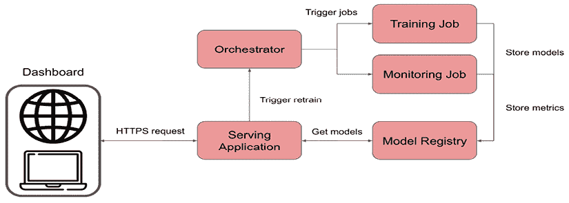
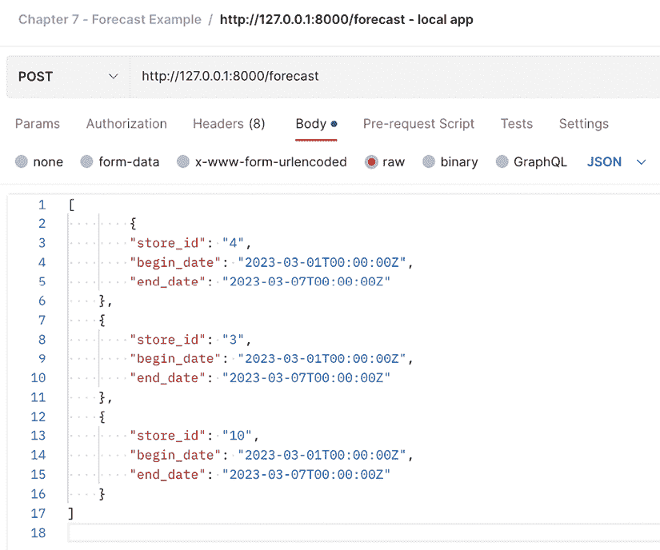
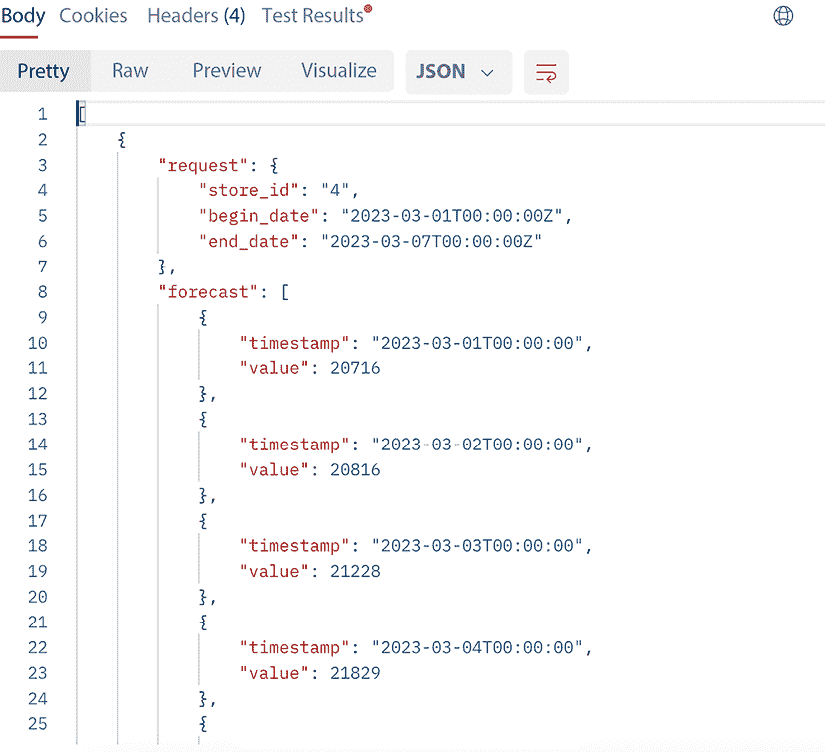

# 第八章：构建示例 ML 微服务

本章将主要介绍如何将我们在书中学到的知识结合到一个现实示例中。这将是基于在 *第一章*，*机器学习工程简介* 中介绍的场景之一，其中我们被要求为商店商品销售构建预测服务。我们将详细讨论该场景，并概述为了使解决方案成为现实必须做出的关键决策，然后展示我们如何通过本书中学到的过程、工具和技术从机器学习工程的角度解决问题的关键部分。到本章结束时，您应该对如何构建自己的 ML 微服务以解决各种商业问题有一个清晰的了解。

在本章中，我们将涵盖以下主题：

+   理解预测问题

+   设计我们的预测服务

+   选择工具

+   扩规模训练

+   使用 FastAPI 提供模型服务

+   容器化并部署到 Kubernetes

每个主题都将为我们提供一个机会，让我们回顾作为在复杂机器学习交付中工作的工程师所必须做出的不同决策。这将为我们提供在现实世界中执行此类操作时的便捷参考！

那么，让我们开始构建一个预测微服务吧！

# 技术要求

如果您在您的机器上安装并运行以下内容，本章中的代码示例将更容易理解：

+   Postman 或其他 API 开发工具

+   本地 Kubernetes 集群管理器，如 minikube 或 kind

+   Kubernetes CLI 工具，`kubectl`

书籍 GitHub 仓库中 `Chapter08` 文件夹包含几个不同的技术示例的 `conda` 环境配置 `.yml` 文件，因为有几个不同的子组件。这些是：

+   `mlewp-chapter08-train`: 这指定了运行训练脚本的运行环境。

+   `mlewp-chapter08-serve`: 这指定了本地 FastAPI 网络服务的环境规范。

+   `mlewp-chapter08-register`: 这提供了运行 MLflow 跟踪服务器的环境规范。

在每种情况下，像往常一样创建 Conda 环境：

```py
conda env create –f <ENVIRONMENT_NAME>.yml 
```

本章中的 Kubernetes 示例还需要对集群和我们将部署的服务进行一些配置；这些配置在 `Chapter08/forecast` 文件夹下的不同 `.yml` 文件中给出。如果您使用 kind，可以通过运行以下简单配置来创建一个集群：

```py
kind create cluster 
```

或者，您可以使用存储库中提供的其中一个配置 `.yaml` 文件：

```py
kind create cluster --config cluster-config-ch08.yaml 
```

Minikube 不提供像 kind 那样读取集群配置 `.yaml` 选项，因此，你应该简单地运行：

```py
minikube start 
```

部署您的本地集群。

# 理解预测问题

在第一章“ML 工程简介”中，我们考虑了一个 ML 团队，该团队被分配提供零售业务中单个商店层面的商品预测。虚构的业务用户有以下要求：

+   预测结果应通过基于 Web 的仪表板进行展示和访问。

+   用户在必要时应能够请求更新预测。

+   预测应在单个商店层面进行。

+   用户在任何一次会话中都会对其自己的区域/商店感兴趣，而不会关注全球趋势。

+   在任何一次会话中请求更新预测的数量将很少。

鉴于这些要求，我们可以与业务团队合作创建以下用户故事，我们可以将这些故事放入像 Jira 这样的工具中，如第二章“机器学习开发过程”中所述。满足这些要求的一些用户故事示例如下：

+   **用户故事 1**：作为一名本地物流规划师，我希望在早上 09:00 登录仪表板，并能够看到未来几天商店层面的商品需求预测，以便我能够提前了解运输需求。

+   **用户故事 2**：作为一名本地物流规划师，我希望能够在看到预测信息过时的情况下请求更新。我希望新的预测结果能在 5 分钟内返回，以便我能够有效地做出运输需求决策。

+   **用户故事 3**：作为一名本地物流规划师，我希望能够筛选特定商店的预测信息，以便我能够了解哪些商店在推动需求，并在决策中使用这些信息。

这些用户故事对于整个解决方案的开发非常重要。由于我们专注于问题的 ML 工程方面，我们现在可以深入探讨这些对构建解决方案意味着什么。

例如，希望“能够看到商店层面的商品需求预测”的愿望可以很好地转化为解决方案 ML 部分的几个技术要求。这告诉我们目标变量将是特定一天所需商品的数量。这告诉我们我们的 ML 模型或模型需要能够在商店层面工作，因此我们可能需要为每个商店有一个模型，或者将商店的概念作为某种特征来考虑。

同样，用户希望“能够在看到预测信息过时时请求更新我的预测……我希望新的预测能在五分钟内检索到”的要求对训练的延迟提出了明确的要求。我们不能构建需要几天时间才能重新训练的东西，这可能意味着在整个数据上构建一个模型可能不是最佳解决方案。

最后，请求*I want to be able to filter for forecasts for specific stores*再次支持了这样的观点，即无论我们构建什么，都必须在数据中利用某种类型的存储标识符，但不必一定作为算法的特征。因此，我们可能需要开始考虑应用逻辑，该逻辑将接受对特定店铺的预测请求，该店铺通过此存储 ID 识别，然后仅通过某种类型的查找或检索使用此 ID 进行筛选来检索该店铺的 ML 模型和预测。

通过这个过程，我们可以看到仅仅几行需求是如何使我们开始具体化我们在实践中如何解决问题的。这些想法和其他想法可以通过我们团队在项目中进行一些头脑风暴，并像*表 8.1*那样的表格进行整合：

| **用户故事** | **细节** | **技术需求** |
| --- | --- | --- |
| 1 | 作为本地物流规划师，我希望在早上 09:00 登录仪表板，并能够看到未来几天在店铺层面的项目需求预测，以便我能够提前了解运输需求。 |

+   目标变量 = 项目需求。

+   预测范围 – 1-7 天。

+   用于仪表板或其他可视化解决方案的 API 访问。

|

| 2 | 作为本地物流规划师，我希望能够在看到预测过时的情况下请求更新我的预测。我希望新的预测在 5 分钟内返回，以便我能够有效地做出关于运输需求的决策。 |
| --- | --- |

+   轻量级重新训练。

+   每个店铺的模型。

|

| 3 | 作为本地物流规划师，我希望能够筛选特定店铺的预测，以便我能够了解哪些店铺在推动需求，并在决策中使用这一点。 |
| --- | --- |

+   每个店铺的模型。

|

表 8.1：将用户故事转换为技术需求。

现在，我们将通过开始为解决方案的 ML 部分设计一个设计来加深我们对问题的理解。

# 设计我们的预测服务

在*理解预测问题*部分的要求是我们需要达到的目标定义，但它们并不是达到目标的方法。借鉴我们从*第五章*，*部署模式和工具*中关于设计和架构的理解，我们可以开始构建我们的设计。

首先，我们应该确认我们应该工作在哪种设计上。由于我们需要动态请求，遵循在第五章*部署模式和工具*中讨论的微服务架构是有意义的。这将使我们能够构建一个专注于从我们的模型存储中检索正确模型并执行请求推理的服务。因此，预测服务应该在仪表板和模型存储之间提供接口。

此外，由于用户可能希望在任何一次会话中与几个不同的存储组合一起工作，并且可能在这些预测之间来回切换，我们应该提供一个高效执行此操作的机制。

从场景中也可以清楚地看出，我们可以非常容易地有大量的预测请求，但模型更新的请求较少。这意味着将训练和预测分开是有意义的，我们可以遵循第三章中概述的“从模型到模型工厂”的 train-persist 过程。这意味着预测不会每次都依赖于完整的训练运行，并且检索用于预测的模型相对较快。

从要求中我们还了解到，在这种情况下，我们的训练系统不一定需要由漂移监控触发，而是由用户发出的动态请求触发。这增加了一点点复杂性，因为它意味着我们的解决方案不应该对每个请求都进行重新训练，而应该能够确定重新训练对于给定的请求是否有价值，或者模型是否已经是最新的。例如，如果有四个用户登录并查看相同的区域/商店/商品组合，并且所有用户都请求重新训练，那么很明显我们不需要四次重新训练我们的模型！相反，应该发生的情况是，训练系统记录一个请求，执行重新训练，然后安全地忽略其他请求。

如我们在这本书中多次讨论的那样，有几种方式可以提供机器学习模型。一种非常强大且灵活的方式是将模型或模型提供逻辑封装到一个独立的服务中，该服务仅限于执行机器学习推理所需的任务。这是我们将在本章中考虑的提供模式，它是经典的“微服务”架构，其中不同的功能部分被分解成它们自己的独立和分离的服务。这为软件系统增加了弹性和可扩展性，因此这是一个很好的模式，需要变得熟悉。这也特别适合机器学习系统的开发，因为这些系统必须由训练、推理和监控服务组成，如第三章中概述的“从模型到模型工厂”。本章将介绍如何使用微服务架构提供机器学习模型，使用几种不同的方法，各有优缺点。然后你将能够根据这些示例调整和构建你自己的未来项目。

我们可以将这些设计点整合到一个高级设计图中，例如，在*图 8.1*中：



图 8.1：预测微服务的高级设计。

下一节将专注于在开发前进行一些工具选择时，将这些高级设计考虑因素细化到更低的细节水平。

# 工具选择

现在我们已经有一个高级设计在心中，并且我们已经写下了一些明确的技术要求，我们可以开始选择我们将用于实现解决方案的工具集。

在这个方面最重要的考虑因素之一将是我们将使用什么框架来建模我们的数据并构建我们的预测功能。鉴于问题是一个需要快速重新训练和预测的时间序列建模问题，我们可以在继续之前考虑一些可能适合的选择的优缺点。

这个练习的结果显示在表 8.2 中：

| **工具/框架** | **优点** | **缺点** |
| --- | --- | --- |
| Scikit-learn |

+   几乎所有数据科学家都已经理解。

+   语法非常易于使用。

+   社区支持非常丰富。

+   良好的特征工程和管道支持。

|

+   没有原生的时间序列建模能力（但流行的`sktime`包确实有这些）。

+   将需要更多的特征工程来将模型应用于时间序列数据。

|

| Prophet |
| --- |

+   专注于预测。

+   具有内置的超参数优化功能。

+   开箱即提供大量功能。

+   在广泛的问题上通常给出准确的结果。

+   开箱即提供置信区间。

|

+   不像 scikit-learn 那样常用（但仍然相对流行）。

+   基础方法相当复杂——可能会导致数据科学家使用黑盒。

+   本身不具有可扩展性。

|

| Spark ML |
| --- |

+   本地可扩展到大量数据。

+   良好的特征工程和管道支持。

|

+   没有原生的时间序列建模能力。

+   算法选项相对有限。

+   调试可能更困难。

|

表 8.2：考虑的一些不同机器学习工具包解决此预测问题的优缺点。

根据表 8.2 中的信息，看起来**Prophet**库是一个不错的选择，并在预测能力、所需的时间序列能力和团队中的开发人员和科学家的经验之间提供了一个良好的平衡。

数据科学家可以使用这些信息构建一个概念验证，代码类似于*第一章*，*机器学习工程简介*中的*示例 2：预测 API*部分，该部分将 Prophet 应用于标准零售数据集。

这涵盖了我们将用于建模的机器学习包，但其他组件怎么办？我们需要构建一个允许前端应用程序请求后端执行操作的东西，因此考虑某种类型的 Web 应用程序框架是个好主意。我们还需要考虑当后端应用程序受到大量请求时会发生什么，因此有意识地构建它以考虑可扩展性是有意义的。另一个考虑因素是我们在这个用例中不仅要训练一个模型，而是要训练多个模型，每个零售店一个，因此我们应该尽可能并行化训练。最后一块拼图将是使用模型管理工具和需要编排层来按计划或动态触发训练和监控作业。

将所有这些内容综合起来，我们可以在使用 Prophet 库的基础上做出一些关于底层工具的设计决策。以下是一个总结列表：

1.  **Prophet**：我们在**第一章**，**机器学习工程简介**中遇到了 Prophet 预测库。在这里，我们将深入了解该库及其工作原理，然后再开发一个训练流程来创建我们在第一章中为该零售用例看到的预测模型类型。

1.  **Kubernetes**：如**第六章**，**扩展**中讨论的，这是一个在计算集群中编排多个容器的平台，允许你构建高度可扩展的机器学习模型服务解决方案。我们将使用它来托管主要应用程序。

1.  **Ray Train**：我们在**第六章**，**扩展**中已经遇到了 Ray。在这里，我们将使用 Ray Train 并行训练许多不同的 Prophet 预测模型，并允许这些作业在向处理传入请求的主要网络服务发出请求时触发。

1.  **MLflow**：我们在**第三章**，**从模型到模型工厂**中遇到了 MLflow，它将作为我们的模型注册库。

1.  **FastAPI**：对于 Python，典型的后端网络框架通常是 Django、Flask 和 FastAPI。我们将使用 FastAPI 创建主要后端路由应用程序，该应用程序将提供预测并与其他解决方案组件交互。FastAPI 是一个设计用于简单使用和构建高性能网络应用的 Web 框架，目前被一些知名组织使用，包括 Uber、Microsoft 和 Netflix（根据 FastAPI 主页信息）。

最近关于使用 FastAPI 时可能出现的内存泄漏问题有一些讨论，尤其是对于长时间运行的服务。这意味着确保运行 FastAPI 端点的机器有足够的 RAM 非常重要。在许多情况下，这似乎不是一个关键问题，但在 FastAPI 社区中是一个活跃的讨论话题。更多关于这个话题的信息，请参阅[`github.com/tiangolo/fastapi/discussions/9082`](https://github.com/tiangolo/fastapi/discussions/9082)。其他框架，如**Litestar**[`litestar.dev/`](https://litestar.dev/)，似乎没有相同的问题，所以你可以自由地尝试不同的网络框架来构建以下示例和你的项目中的服务层。FastAPI 仍然是一个非常有用的框架，具有许多优点，所以我们将在本章中继续使用它；只是要记住这个要点。

在本章中，我们将关注与大规模服务模型相关的系统组件，因为计划训练和重新训练方面将在**第九章**，**构建提取、转换、机器学习用例**中介绍。我们关注的组件可以被认为是我们的“服务层”，尽管我会向你展示如何使用 Ray 并行训练多个预测模型。

现在我们已经做出了一些工具选择，让我们开始构建我们的机器学习微服务吧！

# 规模化训练

当我们在第六章“扩展”中介绍 Ray 时，我们提到了一些用例，其中数据或处理时间需求如此之大，以至于使用一个非常可扩展的并行计算框架是有意义的。没有明确指出的是，有时这些需求来自我们实际上想要训练**许多模型**的事实，而不仅仅是大量数据上的一个模型或更快地训练一个模型。这正是我们将在这里做的事情。

我们在第一章“机器学习工程简介”中描述的零售预测示例使用了一个包含多个不同零售店的数据集。与其创建一个可能包含店铺编号或标识符作为特征的模型，也许更好的策略是为每个单独的店铺训练一个预测模型。这可能会提供更好的准确性，因为店铺级别的数据特征可能具有一些预测能力，不会被查看所有店铺组合的模型所平均。因此，我们将采取这种方法，这也是我们可以使用 Ray 的并行性同时训练多个预测模型的地方。

要使用**Ray**来完成这个任务，我们需要将我们在第一章中提到的训练代码稍作修改。首先，我们可以将用于预处理数据和训练预测模型的函数组合在一起。这样做意味着我们正在创建一个可以分发给运行在每个存储对应的数据分片上的串行进程。原始的预处理和训练模型函数如下：

```py
import ray
import ray.data
import pandas as pd
from prophet import Prophet

def prep_store_data(
    df: pd.DataFrame, 
    store_id: int = 4, 
    store_open: int = 1
) -> pd.DataFrame:
    df_store = df[
        (df['Store'] == store_id) &\
        (df['Open'] == store_open)
    ].reset_index(drop=True)
    df_store['Date'] = pd.to_datetime(df_store['Date'])
    df_store.rename(columns= {'Date': 'ds', 'Sales': 'y'}, inplace=True)
    return df_store.sort_values('ds', ascending=True)

def train_predict(
    df: pd.DataFrame,
    train_fraction: float,
    seasonality: dict
) -> tuple[pd.DataFrame, pd.DataFrame, pd.DataFrame, int]:
    # grab split data
    train_index = int(train_fraction*df.shape[0])
    df_train = df.copy().iloc[0:train_index]
    df_test = df.copy().iloc[train_index:]
#create Prophet model
    model=Prophet(
        yearly_seasonality=seasonality['yearly'],
        weekly_seasonality=seasonality['weekly'],
        daily_seasonality=seasonality['daily'],
        interval_width = 0.95
    )
# train and predict
    model.fit(df_train)
    predicted = model.predict(df_test)
    return predicted, df_train, df_test, train_index 
```

现在我们可以将这些合并成一个单独的函数，该函数将接受一个`pandas` DataFrame，预处理这些数据，训练一个 Prophet 预测模型，然后返回测试集、训练数据集、测试数据集和训练集大小的预测，这里用`train_index`值标记。由于我们希望分发此函数的应用，我们需要使用我们在第六章“扩展”中介绍的`@ray.remote`装饰器。我们将`num_returns=4`参数传递给装饰器，让 Ray 知道这个函数将以元组的形式返回四个值。

```py
@ray.remote(num_returns=4)
def prep_train_predict(
    df: pd.DataFrame,
    store_id: int,
    store_open: int=1,
    train_fraction: float=0.8,
    seasonality: dict={'yearly': True, 'weekly': True, 'daily': False}
) -> tuple[pd.DataFrame, pd.DataFrame, pd.DataFrame, int]:
    df = prep_store_data(df, store_id=store_id, store_open=store_open)
    return train_predict(df, train_fraction, seasonality) 
```

现在我们有了远程函数，我们只需要应用它。首先，我们假设数据集已经以与*第一章*，*机器学习工程介绍*中相同的方式读入到一个`pandas` DataFrame 中。这里的假设是数据集足够小，可以放入内存，并且不需要计算密集型的转换。这有一个优点，就是允许我们使用`pandas`相对智能的数据摄入逻辑，例如，可以对标题行进行各种格式化，以及在我们现在熟悉的`pandas`语法中使用之前，应用任何我们想要的过滤或转换逻辑。如果数据集更大或转换更密集，我们就可以使用 Ray API 中的`ray.data.read_csv()`方法来读取数据作为 Ray Dataset。这会将数据读入到 Arrow 数据格式中，它有自己的数据操作语法。

现在，我们已经准备好应用我们的分布式训练和测试。首先，我们可以从数据集中检索所有存储标识符，因为我们将为每一个训练一个模型。

```py
store_ids = df['Store'].unique() 
```

在我们做任何事情之前，我们将使用我们在*第六章*，*扩展规模*中遇到的`ray.init()`命令初始化 Ray 集群。这避免了在我们第一次调用远程函数时执行初始化，这意味着如果我们进行基准测试，我们可以获得实际处理的准确时间。为了提高性能，我们还可以使用`ray.put()`将 pandas DataFrame 存储在 Ray 对象存储中。这阻止了每次运行任务时都复制此数据集。将对象放入存储返回一个 id，然后你可以像原始对象一样将其用作函数参数。

```py
ray.init(num_cpus=4)
df_id = ray.put(df) 
```

现在，我们需要将我们的 Ray 任务提交到集群。每次你这样做时，都会返回一个 Ray 对象引用，这将允许我们在使用`ray.get`收集结果时检索该进程的数据。我在这里使用的语法可能看起来有点复杂，但我们可以一点一点地分解它。核心 Python 函数`map`只是将列表操作应用于`zip`语法的输出结果的所有元素。`zip(*iterable)`模式允许我们将列表推导式中的所有元素解包，这样我们就可以有一个包含预测对象引用、训练数据对象引用、测试数据对象引用以及最终的训练索引对象引用的列表。注意使用`df_id`来引用对象存储中的存储数据框。

```py
pred_obj_refs, train_obj_refs, test_obj_refs, train_index_obj_refs = map(
    list,
    zip(*([prep_train_predict.remote(df_id, store_id) for store_id in store_ids])),
) 
```

然后，我们需要获取这些任务的实际结果，这可以通过使用前面讨论的`ray.get()`来实现。

```py
ray_results = {
    'predictions': ray.get(pred_obj_refs),
    'train_data': ray.get(train_obj_refs),
    'test_data': ray.get(test_obj_refs),
    'train_indices': ray.get(train_index_obj_refs)
} 
```

然后，你可以使用`ray_results['predictions'][<index>]`等来访问每个模型的这些值。

在 Github 仓库中，文件 `Chapter08/train/train_forecasters_ray.py` 运行此语法并示例循环，逐个以串行方式训练 Prophet 模型以进行比较。使用 `time` 库进行测量，并在我的 Macbook 上运行实验，Ray 集群利用了四个 CPU，我仅用不到 40 秒就能用 Ray 训练 1,115 个 Prophet 模型，而使用串行代码则需要大约 3 分 50 秒。这几乎提高了六倍的速度，而且几乎没有进行多少优化！

我们没有涵盖将模型和元数据保存到 MLFlow 的内容，你可以使用我们在 *第三章* 中深入讨论的语法来完成。为了避免大量的通信开销，最好是将元数据临时存储为训练过程的结果，就像我们在存储预测的字典中做的那样，然后在最后将所有内容写入 MLFlow。这意味着你不会因为与 MLFlow 服务器的通信而减慢 Ray 进程。注意，我们还可以通过使用讨论过的 Ray Dataset API 并更改转换逻辑以使用 Arrow 语法来进一步优化这种并行处理。最后一个选择也可以是使用 **Modin**，之前被称为 Pandas on Ray，它允许你在利用 Ray 并行性的同时使用 `pandas` 语法。

现在我们开始构建我们解决方案的提供层，这样我们就可以使用这些预测模型为其他系统和用户生成结果。

# 使用 FastAPI 提供模型

在 Python 中，以微服务形式提供 ML 模型的最简单且可能最灵活的方法是将提供逻辑包装在一个轻量级 Web 应用程序中。Flask 多年来一直是 Python 用户中流行的选择，但现在 FastAPI Web 框架有许多优势，这意味着它应该被认真考虑作为更好的替代方案。

使 FastAPI 成为轻量级微服务优秀选择的某些特性包括：

+   **数据验证**：FastAPI 使用并基于 **Pydantic** 库，该库允许你在运行时强制执行类型提示。这允许你实现非常容易创建的数据验证步骤，使你的系统更加健壮，并有助于避免边缘情况的行为。

+   **内置的异步工作流程**：FastAPI 通过 `async` 和 `await` 关键字提供开箱即用的异步任务管理，因此你可以在许多情况下相对无缝地构建所需的逻辑，而无需求助于额外的库。

+   **开放规范**：FastAPI 基于几个开源标准，包括 **OpenAPI REST API 标准** 和 **JSON Schema** 声明性语言，这有助于创建自动数据模型文档。这些规范有助于保持 FastAPI 的工作方式透明，并且非常易于使用。

+   **自动文档生成**: 上一点提到了数据模型，但 FastAPI 还使用 SwaggerUI 自动生成整个服务的文档。

+   **性能**: 快速是它的名字！FastAPI 使用了 **异步服务器网关接口** (**ASGI**) 标准，而其他框架如 Flask 则使用 **Web 服务器网关接口** (**WSGI**)。ASGI 可以在单位时间内处理更多的请求，并且效率更高，因为它可以在等待前一个任务完成之前执行任务。WSGI 接口按顺序执行指定的任务，因此处理请求需要更长的时间。

因此，上述内容是为什么使用 FastAPI 来提供本例中的预测模型可能是一个好主意的原因，但我们该如何着手去做呢？这正是我们现在要讨论的。

任何微服务都必须以某种指定的格式接收数据；这被称为“请求”。然后它将返回数据，称为“响应”。微服务的任务是摄取请求，执行请求定义或提供输入的一系列任务，创建适当的输出，然后将该输出转换为指定的请求格式。这看起来可能很基础，但回顾这一点很重要，它为我们设计系统提供了起点。很明显，在设计时，我们必须考虑以下要点：

1.  **请求和响应模式**: 由于我们将构建一个 REST API，因此自然地，我们将指定请求和响应的数据模型，作为具有相关模式的 JSON 对象。在执行此操作时，关键是使模式尽可能简单，并且它们包含客户端（请求服务）和服务器（微服务）执行适当操作所需的所有必要信息。由于我们正在构建一个预测服务，请求对象必须提供足够的信息，以便系统提供适当的预测，上游调用服务的解决方案可以将其展示给用户或执行进一步的逻辑。响应将必须包含实际的预测数据点或指向预测位置的指针。

1.  **计算**: 在本例中，创建响应对象（在这种情况下，是一个预测），需要计算，正如在 *第一章*，*机器学习工程导论* 中所讨论的。

    设计机器学习微服务时的一个关键考虑因素是计算资源的大小以及执行它所需的适当工具。例如，如果你正在运行一个需要大型 GPU 才能进行推理的计算机视觉模型，你不能在只运行 CPU 的小型服务器上这样做，该服务器运行的是网络应用程序的后端。同样，如果推理步骤需要摄取一个 TB 的数据，这可能需要我们使用像 Spark 或 Ray 这样的并行化框架，在专用集群上运行，根据定义，它将不得不在不同的机器上运行，而不是运行服务网络应用程序的机器。如果计算需求足够小，并且从另一个位置获取数据不是太激烈，那么你可能在同一台机器上运行推理，该机器托管着网络应用程序。

1.  **模型管理**：这是一个机器学习服务，所以当然涉及模型！这意味着，正如我们在*第三章*中详细讨论的，*从模型到模型工厂*，我们需要实施一个健壮的过程来管理适当的模型版本。这个示例的要求还意味着我们必须能够以相对动态的方式利用许多不同的模型。这需要我们仔细考虑，并使用像 MLflow 这样的模型管理工具，我们也在*第三章*中提到过。我们还必须考虑我们的模型更新和回滚策略；例如，我们将使用蓝/绿部署还是金丝雀部署，正如我们在*第五章*，*部署模式和工具*中讨论的那样。

1.  **性能监控**：对于任何机器学习系统，正如我们在整本书中详细讨论的那样，监控模型的性能将至关重要，采取适当的行动来更新或回滚这些模型也同样重要。如果任何推理的真实数据不能立即返回给服务，那么这需要它自己的过程来收集真实数据和推理，然后再对它们进行所需的计算。

这些是我们构建解决方案时必须考虑的一些重要点。在本章中，我们将重点关注第 1 点和第 3 点，因为*第九章*将涵盖如何在批量设置中构建训练和监控系统。既然我们已经知道了一些我们想要纳入解决方案的因素，那么让我们开始动手构建吧！

## 响应和请求模式

如果客户端请求特定商店的预测，正如我们在需求中假设的那样，这意味着请求应该指定一些内容。首先，它应该指定商店，使用某种类型的商店标识符，该标识符将在机器学习微服务的数据模型和客户端应用程序之间保持通用。

其次，预测的时间范围应以适当的格式提供，以便应用程序可以轻松解释并提供服务。系统还应具备逻辑来创建适当的预测时间窗口，如果请求中没有提供，这是完全合理的假设，如果客户端请求“为商店 X 提供预测”，那么我们可以假设一些默认行为，提供从现在到未来的某个时间段的预测将可能对客户端应用程序有用。

满足这一点的最简单的请求 JSON 架构可能如下所示：

```py
{
    "storeId": "4",
    "beginDate": "2023-03-01T00:00:00Z",
    "endDate": "2023-03-07T00:00:00Z"
} 
```

由于这是一个 JSON 对象，所有字段都是字符串类型，但它们填充了在我们 Python 应用程序中易于解释的值。Pydantic 库还将帮助我们执行数据验证，这一点我们稍后将会讨论。请注意，我们还应该允许客户端应用程序请求多个预测，因此我们应该允许这个 JSON 扩展以允许请求对象的列表：

```py
[
  {
        "storeId": "2",
        "beginDate": "2023-03-01T00:00:00Z",
        "endDate": "2023-03-07T00:00:00Z"
    },
    {
        "storeId": "4",
        "beginDate": "2023-03-01T00:00:00Z",
        "endDate": "2023-03-07T00:00:00Z"
    }
] 
```

如前所述，我们希望构建我们的应用程序逻辑，以便即使客户端只指定了`store_id`，系统仍然可以工作，然后我们推断适当的预测时间范围是从现在到未来的某个时间。

这意味着我们的应用程序应该在以下内容作为 API 调用的 JSON 主体提交时工作：

```py
[
    {
        "storeId": "4",
    }
] 
```

为了强制执行这些请求约束，我们可以使用 Pydantic 功能，通过从 Pydantic 的`BaseModel`继承并创建一个数据类来定义我们刚刚做出的类型要求：

```py
from pydantic import BaseModel

class ForecastRequest(BaseModel):
    store_id: str
    begin_date: str | None = None
    end_date: str | None = None 
```

如您所见，我们在这里强制执行了`store_id`是一个字符串，但我们允许预测的开始和结束日期可以给出为`None`。如果没有指定日期，我们可以根据我们的业务知识做出合理的假设，即一个有用的预测时间窗口将从请求的日期时间开始，到现在的七天。这可能是在应用程序配置中更改或提供的东西，我们在这里不会处理这个特定的方面，以便专注于更令人兴奋的内容，所以这留给读者作为有趣的练习！

在我们的案例中，预测模型将基于 Prophet 库，如前所述，这需要一个包含预测运行所需日期时间的索引。为了根据请求生成这个索引，我们可以编写一个简单的辅助函数：

```py
import pandas as pd

def create_forecast_index(begin_date: str = None, end_date: str = None):
    # Convert forecast begin date
    if begin_date == None:
        begin_date = datetime.datetime.now().replace(tzinfo=None)
    else:
        begin_date = datetime.datetime.strptime(begin_date,
                     '%Y-%m-%dT%H:%M:%SZ').replace(tzinfo=None)

    # Convert forecast end date
    if end_date == None:
        end_date = begin_date + datetime.timedelta(days=7)
    else:
        end_date = datetime.datetime.strptime(end_date, 
                   '%Y-%m-%dT%H:%M:%SZ').replace(tzinfo=None)
    return pd.date_range(start = begin_date, end = end_date, freq = 'D') 
```

这种逻辑允许我们在从模型存储层检索到输入后创建预测模型，在我们的例子中，是 MLflow。

响应对象必须以某种数据格式返回预测，并且始终必须返回足够的信息，以便客户端应用程序能够方便地将返回的对象与触发其创建的响应关联起来。满足这一点的简单模式可能如下所示：

```py
[
    {
        "request": {
            "store_id": "4",
            "begin_date": "2023-03-01T00:00:00Z",
            "end_date": "2023-03-07T00:00:00Z"
        },
        "forecast": [
            {
                "timestamp": "2023-03-01T00:00:00",
                "value": 20716
            },
            {
                "timestamp": "2023-03-02T00:00:00",
                "value": 20816
            },
            {
                "timestamp": "2023-03-03T00:00:00",
                "value": 21228
            },
            {
                "timestamp": "2023-03-04T00:00:00",
                "value": 21829
            },
            {
                "timestamp": "2023-03-05T00:00:00",
                "value": 21686
            },
            {
                "timestamp": "2023-03-06T00:00:00",
                "value": 22696
            },
            {
                "timestamp": "2023-03-07T00:00:00",
                "value": 21138
            }
        ]
    }
] 
```

我们将允许以与请求 JSON 模式相同的方式将其扩展为列表。我们将在本章的其余部分使用这些模式。现在，让我们看看我们将如何管理应用程序中的模型。

## 在您的微服务中管理模型

在第三章*从模型到模型工厂*中，我们详细讨论了您如何使用 MLflow 作为模型工件和元数据存储层在您的 ML 系统中。我们在这里也将这样做，所以假设您已经有一个运行的 MLflow Tracking 服务器，然后我们只需要定义与它交互的逻辑。如果您需要复习，请随时回顾第三章。

我们需要编写一些逻辑来完成以下操作：

1.  检查在 MLflow 服务器中有可用于生产的模型。

1.  检索满足我们设定的任何标准的模型版本，例如，模型不是在超过一定天数前训练的，并且它在所选范围内有验证指标。

1.  如果在预测会话期间需要，可以缓存模型以供使用和重复使用。

1.  如果响应对象需要，对多个模型执行上述所有操作。

对于第 1 点，我们必须在 MLflow 模型注册表中标记模型为已准备好生产，然后我们可以使用在第三章*从模型到模型工厂*中遇到的`MlflowClient()`和`mlflow pyfunc`功能：

```py
import mlflow 
import mlflow.pyfunc
from mlflow.client import MlflowClient
import os

tracking_uri = os.getenv(["MLFLOW_TRACKING_URI"])
mlflow.set_tracking_uri(tracking_uri)
client = MlflowClient(tracking_uri=tracking_uri)

def get_production_model(store_id:int):
    model_name = f"prophet-retail-forecaster-store-{store_id}"
    model =mlflow.pyfunc.load_model(
                         model_uri=f"models:/{model_name}/production"
                       )
    return model 
```

对于第 2 点，我们可以通过使用下面将要描述的 MLflow 功能来检索给定模型的指标。首先，使用模型的名称，您检索模型的元数据：

```py
model_name = f"prophet-retail-forecaster-store-{store_id}"
latest_versions_metadata = client.get_latest_versions(
    name=model_name
) 
```

这将返回一个如下所示的数据集：

```py
[<ModelVersion: creation_timestamp=1681378913710, current_stage='Production', description='', last_updated_timestamp=1681378913722, name='prophet-retail-forecaster-store-3', run_id='538c1cbded614598a1cb53eebe3de9f2', run_link='', source='/Users/apmcm/
dev/Machine-Learning-Engineering-with-Python-Second-Edition/Chapter07/register/artifacts/0/538c1cbded614598a1cb53eebe3de9f2/artifacts/model', status='READY', status_message='', tags={}, user_id='', version='3'>] 
```

然后，您可以使用这些数据通过此对象检索版本，然后检索模型版本元数据：

```py
latest_model_version_metadata = client.get_model_version(
    name=model_name,
    version=latest_versions_metadata.version
) 
```

这包含看起来像这样的元数据：

```py
<ModelVersion: creation_timestamp=1681377954142, current_stage='Production', description='', last_updated_timestamp=1681377954159, name='prophet-retail-forecaster-store-3', run_id='41f163b0a6af4b63852d9218bf07adb3', run_link='', source='/Users/apmcm/dev/Machine-Learning-Engineering-with-Python-Second-Edition/Chapter07/register/artifacts/0/41f163b0a6af4b63852d9218bf07adb3/artifacts/model', status='READY', status_message='', tags={}, user_id='', version='1'> 
```

该模型版本的指标信息与`run_id`相关联，因此我们需要获取它：

```py
latest_model_run_id = latest_model_version_metadata.run_id 
```

`run_id`的值可能如下所示：

```py
'41f163b0a6af4b63852d9218bf07adb3' 
```

然后，您可以使用这些信息来获取特定运行的模型指标，并在其上执行任何您想要的逻辑。要检索指标值，您可以使用以下语法：

```py
client.get_metric_history(run_id=latest_model_run_id, key='rmse') 
```

例如，您可以使用在第二章*持续模型性能测试*部分中应用的逻辑，并简单地要求均方根误差低于某个指定的值，然后才允许它在预测服务中使用。

我们还可能希望允许服务在模型年龄超出容忍度时触发重新训练；这可以作为任何已实施的训练系统之上的另一层模型管理。

如果我们的训练过程由运行在 AWS MWAA 上的 Airflow DAG 编排，正如我们在第五章*部署模式和工具*中讨论的那样，那么以下代码可以用来调用训练管道：

```py
import boto3
import http.client
import base64
import ast
# mwaa_env_name = 'YOUR_ENVIRONMENT_NAME'
# dag_name = 'YOUR_DAG_NAME'

def trigger_dag(mwaa_env_name: str, dag_name: str) -> str:
    client = boto3.client('mwaa')

    # get web token
    mwaa_cli_token = client.create_cli_token(
        Name=mwaa_env_name
    )

    conn = http.client.HTTPSConnection(
       mwaa_cli_token['WebServerHostname']
    )
    mwaa_cli_command = 'dags trigger'
    payload = mwaa_cli_command + " " + dag_name
    headers = {
      'Authorization': 'Bearer ' + mwaa_cli_token['CliToken'],
      'Content-Type': 'text/plain'
    }
    conn.request("POST", "/aws_mwaa/cli", payload, headers)
    res = conn.getresponse()
    data = res.read()
    dict_str = data.decode("UTF-8")
    mydata = ast.literal_eval(dict_str)
    return base64.b64decode(mydata['stdout']).decode('ascii') 
```

下几节将概述如何将这些组件组合在一起，以便 FastAPI 服务可以在讨论如何容器化和部署应用程序之前，围绕这些逻辑的几个部分进行包装。

## 将所有这些整合在一起

我们已经成功定义了我们的请求和响应模式，并且我们已经编写了从我们的模型存储库中提取适当模型的相关逻辑；现在剩下的只是将这些整合在一起，并使用模型进行实际推理。这里有几个步骤，我们将现在分解。FastAPI 后端的主要文件名为 `app.py`，其中包含几个不同的应用程序路由。对于本章的其余部分，我将在每个相关代码片段之前展示必要的导入，但实际的文件遵循 PEP8 规范，即导入位于文件顶部。

首先，我们定义我们的日志记录器，并设置一些全局变量作为检索到的模型和服务处理程序的轻量级内存缓存：

```py
# Logging
import logging

log_format = "%(asctime)s - %(name)s - %(levelname)s - %(message)s" 
logging.basicConfig(format = log_format, level = logging.INFO)
handlers = {}
models = {}
MODEL_BASE_NAME = f"prophet-retail-forecaster-store-" 
```

使用全局变量在应用程序路由之间传递对象只是一种好主意，如果你知道这个应用程序将以独立方式运行，并且不会因为同时接收来自多个客户端的请求而创建竞争条件。当这种情况发生时，多个进程会尝试覆盖变量。你可以将这个例子改编一下，用缓存如 **Redis** 或 **Memcache** 来替换全局变量的使用，作为练习！

我们接下来需要实例化一个 `FastAPI` 应用程序对象，并且可以通过使用启动生命周期事件方法来定义我们希望在启动时运行的任何逻辑：

```py
from fastapi import FastAPI
from registry.mlflow.handler import MLFlowHandler

app = FastAPI()
@app.on_event("startup")
async def startup():
    await get_service_handlers()
    logging.info("Updated global service handlers")
async def get_service_handlers():
    mlflow_handler = MLFlowHandler()
    global handlers
    handlers['mlflow'] = mlflow_handler
    logging.info("Retreving mlflow handler {}".format(mlflow_handler))
    return handlers 
```

如前所述，FastAPI 非常适合支持异步工作流程，允许在等待其他任务完成时使用计算资源。服务处理程序的实例化可能是一个较慢的过程，因此在这里采用这可能是有用的。当调用使用 `async` 关键字的函数时，我们需要使用 `await` 关键字，这意味着在调用 `async` 函数的函数中，其余部分可以暂停，直到返回结果并释放用于其他任务的任务资源。在这里，我们只有一个处理程序需要实例化，它将处理与 MLflow 跟踪服务器的连接。

`registry.mlflow.handler` 模块是我编写的一个包含 `MLFlowHandler` 类的模块，其中包含我们将在整个应用程序中使用的各种方法。以下是该模块的内容：

```py
import mlflow
from mlflow.client import MlflowClient
from mlflow.pyfunc import PyFuncModel
import os 

class MLFlowHandler:
    def __init__(self) -> None:
        tracking_uri = os.getenv('MLFLOW_TRACKING_URI')
        self.client = MlflowClient(tracking_uri=tracking_uri)
        mlflow.set_tracking_uri(tracking_uri)

    def check_mlflow_health(self) -> None:
        try:
            experiments = self.client.search_experiments()
            return 'Service returning experiments'
        except:
            return 'Error calling MLFlow'

    def get_production_model(self, store_id: str) -> PyFuncModel:
        model_name = f"prophet-retail-forecaster-store-{store_id}"
        model = mlflow.pyfunc.load_model(
                             model_uri=f"models:/{model_name}/production"
                             )
        return model 
```

如您所见，此处理程序具有检查 MLflow 跟踪服务器是否正常运行并获取生产模型的方法。您还可以添加用于查询 MLflow API 以收集我们之前提到的度量数据的方法。

现在回到主要的 `app.py` 文件，我编写了一个小的健康检查端点来获取服务的状态：

```py
@app.get("/health/", status_code=200)
async def healthcheck():
    global handlers
    logging.info("Got handlers in healthcheck.")
    return {
        "serviceStatus": "OK",
        "modelTrackingHealth": handlers['mlflow'].check_mlflow_health()
        } 
```

接下来是一个获取特定零售店 ID 的生产模型的方法。此函数检查模型是否已存在于 `global` 变量中（作为简单的缓存），如果不存在，则添加它。您可以将此方法扩展到包括关于模型年龄或您想要使用的任何其他指标的逻辑，以决定是否将模型拉入应用程序：

```py
async def get_model(store_id: str):
    global handlers
    global models
    model_name = MODEL_BASE_NAME + f"{store_id}"
    if model_name not in models:
        models[model_name] = handlers['mlflow'].\
                                   get_production_model(store_id=store_id)
    return models[model_name] 
```

最后，我们有预测端点，客户端可以使用我们之前定义的请求对象向此应用程序发起请求，并基于我们从 MLflow 获取的 Prophet 模型获得预测。就像本书的其他部分一样，为了简洁，我省略了较长的注释：

```py
@app.post("/forecast/", status_code=200)
async def return_forecast(forecast_request: List[ForecastRequest]):
    forecasts = []
    for item in forecast_request:
        model = await get_model(item.store_id)
        forecast_input = create_forecast_index(
            begin_date=item.begin_date, 
            end_date=item.end_date
            )
        forecast_result = {}
        forecast_result['request'] = item.dict()
        model_prediction = model.predict(forecast_input)[['ds', 'yhat']]\
            .rename(columns={'ds': 'timestamp', 'yhat': 'value'})
        model_prediction['value'] = model_prediction['value'].astype(int)
        forecast_result['forecast'] = model_prediction.to_dict('records')
        forecasts.append(forecast_result)
    return forecasts 
```

然后，您可以在本地运行应用程序：

```py
uvicorn app:app –-host 127.0.0.1 --port 8000 
```

如果您想在不运行应用程序的情况下开发应用程序，可以添加 `–reload` 标志。如果您使用 Postman（或 `curl` 或您选择的任何其他工具）并使用我们之前描述的请求体查询此端点，如 *图 8.2* 所示，您将得到类似 *图 8.3* 中所示的输出。



图 8.2：Postman 应用中对 ML 微服务的请求。



图 8.3：使用 Postman 查询时 ML 微服务的响应。

就这样，我们得到了一个相对简单的机器学习微服务，当查询端点时，它将返回零售店的 Prophet 模型预测！现在，我们将继续讨论如何将此应用程序容器化并部署到 Kubernetes 集群以实现可扩展的服务。

# 容器化和部署到 Kubernetes

当我们在 *第五章* 中介绍 Docker 时，*部署模式和工具*，我们展示了如何使用它来封装您的代码，然后在许多不同的平台上一致地运行它。

在这里，我们将再次执行此操作，但带着这样的想法：我们不仅想在不同的基础设施上以单例模式运行应用程序，实际上我们希望允许许多不同的微服务副本同时运行，并且通过负载均衡器有效地路由请求。这意味着我们可以将可行的方法扩展到几乎任意大的规模。

我们将通过执行以下步骤来完成这项工作：

1.  使用 Docker 容器化应用程序。

1.  将此 Docker 容器推送到 Docker Hub，作为我们的容器存储位置（您可以使用 AWS Elastic Container Registry 或其他云服务提供商的类似解决方案来完成此步骤）。

1.  创建一个 Kubernetes 集群。我们将使用 minikube 在本地执行此操作，但您也可以在云服务提供商上使用其管理的 Kubernetes 服务来完成此操作。在 AWS 上，这是 **弹性 Kubernetes 服务**（**EKS**）。

1.  在可以扩展的集群上定义一个服务和负载均衡器。在这里，我们将介绍在 Kubernetes 集群上通过程序定义服务和部署特性的概念。

1.  部署服务并测试其是否按预期工作。

让我们现在进入下一节，详细说明这些步骤。

## 容器化应用程序

如本书前面所述，如果我们想使用 Docker，我们需要在 Dockerfile 中提供如何构建容器以及安装任何必要的依赖项的说明。对于这个应用程序，我们可以使用基于可用的 FastAPI 容器镜像之一的一个，假设我们有一个名为 `requirements.txt` 的文件，其中包含我们所有的 Python 包依赖项：

```py
FROM tiangolo/uvicorn-gunicorn-fastapi:latest
COPY ./requirements.txt requirements.txt
RUN pip install --no-cache-dir --upgrade -r requirements.txt
COPY ./app /app
CMD ["uvicorn", "main:app", "--host", "0.0.0.0", "--port", "8080"] 
```

然后，我们可以使用以下命令构建这个 Docker 容器，其中我已将容器命名为 `custom-forecast-service`：

```py
docker build -t custom-forecast-service:latest . 
```

一旦成功构建，我们需要将其推送到 Docker Hub。您可以在终端中登录 Docker Hub，然后通过运行以下命令将内容推送到您的账户：

```py
docker login
docker push <DOCKER_USERNAME>/custom-forecast-service:latest 
```

这意味着其他构建过程或解决方案可以下载并运行您的容器。

注意，在您将内容推送到 Docker Hub 之前，您可以通过执行以下类似命令来测试容器化应用程序是否可以运行，其中我包含了一个平台标志，以便在我的 MacBook Pro 上本地运行容器：

```py
docker run -d --platform linux/amd64 -p 8000:8080 electricweegie/custom-forecast-service 
```

现在我们已经构建并分享了容器，我们可以通过部署到 Kubernetes 来扩展它。

## 使用 Kubernetes 扩展

与 Kubernetes 一起工作可能对即使是经验最丰富的开发者来说也是一个陡峭的学习曲线，所以我们在这里只会触及表面，并为您提供足够的资源，让您开始自己的学习之旅。本节将指导您完成将您的 ML 微服务部署到本地运行的 Kubernetes 集群的步骤，因为部署到远程托管集群（进行一些小的修改）需要采取相同的步骤。在生产环境中无缝运行 Kubernetes 集群需要考虑网络、集群资源配置和管理、安全策略等多个方面。详细研究所有这些主题需要一本完整的书。实际上，Aly Saleh 和 Murat Karsioglu 的《Kubernetes in Production Best Practices》是一本很好的资源，可以帮助您了解许多这些细节。在本章中，我们将专注于理解您开始使用 Kubernetes 开发 ML 微服务所需的最重要步骤。

首先，让我们为 Kubernetes 开发做好准备。在这里，我将使用 minikube，因为它有一些方便的实用工具，可以设置可以通过 REST API 调用服务。在这本书的先前部分，我使用了 kind（在 Docker 中运行的 Kubernetes），您也可以在这里使用它；只需准备好做一些额外的工作并使用文档。

要在你的机器上设置 minikube，请遵循官方文档中针对您平台的安装指南，链接为 [`minikube.sigs.k8s.io/docs/start/`](https://minikube.sigs.k8s.io/docs/start/)。

一旦安装了 minikube，您可以使用默认配置启动您的第一个集群，命令如下：

```py
minikube start 
```

一旦集群启动并运行，您可以在终端中使用以下命令将 `fast-api` 服务部署到集群：

```py
kubectl apply –f direct-kube-deploy.yaml 
```

其中 `direct-kube-deploy.yaml` 是一个包含以下代码的清单：

```py
apiVersion: apps/v1
kind: Deployment
metadata:
  name: fast-api-deployment
spec:
  replicas: 2
  selector:
    matchLabels:
      app: fast-api
  template:
    metadata:
      labels:
        app: fast-api
    spec:
      containers:
      - name: fast-api
        image: electricweegie/custom-forecast-service:latest
        resources:
          limits:
            memory: "128Mi"
            cpu: "500m"
        ports:
          - containerPort: 8000 
```

本清单定义了一个 Kubernetes Deployment，该 Deployment 创建并管理包含一个名为 `fast-api` 的容器的 Pod 模板的两个副本。这个容器运行的是我们之前创建并发布的 Docker 镜像，即 `electricweegie/custom-forecast-service:latest`。它还定义了运行在 Pod 内部容器上的资源限制，并确保容器监听端口 `8000`。

现在我们已经创建了一个包含应用程序的 Deployment，我们需要将此解决方案暴露给传入流量，最好是使用负载均衡器，以便高效地将传入流量路由到应用程序的不同副本。要在 minikube 中完成此操作，你必须执行以下步骤：

1.  默认情况下，minikube 集群上运行的服务不提供网络或主机机访问，因此我们必须使用 `tunnel` 命令创建一个路由来公开集群 IP 地址：

    ```py
    minkube tunnel 
    ```

1.  打开一个新的终端窗口。这允许隧道持续运行，然后你需要创建一个类型为 `LoadBalancer` 的 Kubernetes 服务，该服务将访问我们已设置的 `deployment`：

    ```py
    kubectl expose deployment fast-api-deployment --type=LoadBalancer --port=8080 
    ```

1.  你可以通过运行以下命令来获取访问服务的公网 IP：

    ```py
    kubectl get svc 
    ```

    这应该会给出类似以下输出的结果：

    ```py
    NAME                       TYPE                CLUSTER-IP     EXTERNAL-IP  PORT(S)               AGE
    fast-api-deployment  LoadBalancer   10.96.184.178   10.96.184.178   8080:30791/TCP   59s 
    ```

然后，你将能够使用负载均衡器服务的 `EXTERNAL-IP` 来访问 API，因此你可以导航到 Postman 或你的其他 API 开发工具，并使用 `http://<EXTERNAL-IP>:8080` 作为你成功构建并部署到 Kubernetes 的 FastAPI 服务的根 URL！

## 部署策略

如第五章*部署模式和工具*中所述，你可以使用几种不同的策略来部署和更新你的 ML 服务。这包括两个组件：一个是模型的部署策略，另一个是托管应用程序或为模型提供服务的管道的部署策略。这两个策略可以同时执行。

在这里，我们将讨论如何将我们刚刚部署到 Kubernetes 的应用程序更新，并使用金丝雀和蓝绿部署策略。一旦你学会了如何对基础应用程序进行此操作，可以通过在金丝雀或蓝绿部署中指定一个具有适当标签的模型版本，来添加对模型的类似更新策略。例如，我们可以使用 MLflow 中模型注册表的“staging”阶段来提供我们的“蓝”模型，然后在过渡到“绿色”时，确保我们已经使用本章和第三章*从模型到模型工厂*中概述的语法，将此模型移动到模型注册表的“生产”阶段。

由于金丝雀部署是在生产环境的一个较小子集中部署应用程序的新版本，我们可以创建一个新的部署清单，强制只创建和运行一个金丝雀应用的副本（在较大的集群中可能更多）。在这种情况下，这只需要你编辑之前的副本数量为“1。”

为了确保金丝雀部署可以访问相同的负载均衡器，我们必须利用 Kubernetes 中的资源标签概念。然后我们可以部署一个选择具有所需标签的资源负载均衡器。以下是一个部署此类负载均衡器的示例清单：

```py
apiVersion: v1
kind: Service
metadata:
  name: fast-api-service
spec:
  selector:
    app: fast-api
  ports:
    - protocol: TCP
      port: 8000
      targetPort: 8000
  type: LoadBalancer 
```

或者使用与上面相同的 minkube 语法：

```py
kubectl expose deployment fast-api-deployment --name=fast-api-service --type=LoadBalancer --port=8000 --target-port=8000 --selector=app=fast-api 
```

在部署此负载均衡器和金丝雀部署之后，你可以然后实现集群或模型上的日志监控，以确定金丝雀是否成功并且应该获得更多流量。在这种情况下，你只需更新部署清单以包含更多副本。

蓝绿部署将以非常相似的方式工作；在每种情况下，你只需编辑 Deployment 清单，将应用程序标记为蓝色或绿色。然而，蓝绿部署与金丝雀部署的核心区别在于流量的切换更为突然，在这里我们可以使用以下命令，该命令使用`kubectl` CLI 来修补服务选择器的定义，将生产流量切换到绿色部署：

```py
kubectl patch service fast-api-service -p '{"spec":{"selector":{"app":"fast-api-green"}}}' 
```

这就是你在 Kubernetes 中执行金丝雀和蓝/绿部署的方式，以及如何使用它来尝试不同的预测服务版本；试试看吧！

# 摘要

在本章中，我们通过一个示例展示了如何将本书前七章中的工具和技术结合起来，以解决一个实际业务问题。我们详细讨论了为什么对动态触发的预测算法的需求可以迅速导致需要多个小型服务无缝交互的设计。特别是，我们创建了一个包含处理事件、训练模型、存储模型和执行预测的组件的设计。然后，我们通过考虑诸如任务适用性以及可能的开发者熟悉度等因素，介绍了如何在现实场景中选择我们的工具集来构建这个设计。最后，我们仔细定义了构建解决方案所需的关键代码，以重复和稳健地解决问题。

在下一章，也就是最后一章，我们将构建一个批处理机器学习过程的示例。我们将命名这个模式为**提取**、**转换**、**机器学习**，并探讨任何旨在构建此类解决方案的项目应涵盖的关键点。

# 加入我们的社区 Discord

加入我们的社区 Discord 空间，与作者和其他读者进行讨论：

[`packt.link/mle`](https://packt.link/mle)


