# 第五章：利用情感分析增强客户洞察

在当今的数字时代，理解客户情感对于塑造营销策略、完善品牌信息和提升客户体验至关重要。情感分析，作为自然语言处理（NLP）的一个子集，赋予营销人员处理大量非结构化文本数据的能力，如客户反馈、社交媒体对话和产品评论，以衡量公众情绪。这种分析方法不仅有助于监控品牌声誉，还能根据客户偏好定制营销信息，从而增强整体客户洞察。

本章探讨了营销领域的情感分析世界。利用 Python 的力量，你将学习如何将情感分类为正面、负面或中性，并识别客户反馈中嵌入的细微差别。我们还将使用基于 Kaggle 的“Twitter 航空情感”数据集的实战示例，为你提供执行情感分析、解读结果并将这些见解应用于制定更有效的营销策略的技能。

总体而言，本章将为你全面介绍营销中情感分析的基础知识，然后指导你通过数据准备、分析和结果可视化的实际方面。到本章结束时，你将精通：

+   理解情感分析在营销中的关键作用

+   预处理文本数据以准备分析

+   应用 Python 库使用传统自然语言处理和生成式 AI 元素执行情感分析

+   解释和可视化结果以得出可操作的营销见解

# 营销中情感分析简介

在营销这个快节奏的世界里，关注客户情感不仅有益，而且是必需的。情感分析，即检测文本数据中的正面、负面或中性语调的过程，是这个努力的前沿，为营销人员提供了一个观察和理解客户互动情感基调的视角。这种方法使用自然语言处理（NLP）、机器学习和计算语言学来系统地识别、提取、量化和研究文本中的模式。这些模式可以从某些关键词和短语的呈现到句子的结构和术语使用的上下文。

## 情感分析的重要性

情感分析在营销中的重要性不容小觑。它就像指南针，引导品牌穿越浩瀚且常常波涛汹涌的公众舆论大海。通过分析客户反馈、社交媒体对话和产品评论，情感分析帮助营销人员理解人们说了什么，以及他们的感受。

**关于营销中情感分析的进一步阅读**

关于营销中自动化文本分析方法的概述，请参阅文章“*团结各部落：利用文本进行营销洞察*”([`journals.sagepub.com/doi/full/10.1177/0022242919873106`](https://journals.sagepub.com/doi/full/10.1177/0022242919873106))。

更具体地说，情感分析在营销中的应用开辟了一系列机会：

+   **品牌监控**：情感分析能够实时监控品牌在各个数字平台上的感知。通过跟踪情感变化，营销人员可以预测并减轻潜在的公关危机。例如，在 2017 年 4 月 9 日，由于超售，一名乘客被从航班上强制带离的事件中，情感分析本可以帮助联合航空检测到社交媒体上病毒式传播的负面情绪的迅速升级，并更积极地做出反应。

+   **活动分析**：了解营销活动引起的情感反应，允许灵活调整策略。情感分析可以揭示活动是否与目标受众产生积极共鸣，或者是否偏离了目标。例如，百事公司在 2017 年推出的以肯达尔·詹纳为特色的广告，因其被认为轻视社会正义运动而受到抨击。早期的情感分析本可以识别出负面反馈，并允许及时调整活动策略。

+   **产品反馈**：详细的情感洞察有助于精确指出产品或服务中令客户满意或不满意的特定方面。这种反馈循环对于持续改进和创新至关重要。以苹果公司发布 iPhone 6 为例，对客户反馈的情感分析突出了“弯曲门”问题，促使苹果公司迅速解决问题。

+   **市场研究**：情感分析为更广泛的市场格局提供了一个窗口，通过揭示趋势、竞争对手地位和市场空白，提供竞争优势。例如，Netflix 利用情感分析来了解观众偏好和趋势，这有助于内容创作和推荐算法。

通过利用情感分析获得的洞察，营销人员不仅可以监控品牌声誉，还可以调整他们的沟通方式，使其更深入地与受众产生共鸣，从而实现更有效和有影响力的营销策略。

## 人工智能和情感分析方面的进步

**大型语言模型**（LLMs）和**生成式人工智能**（GenAI）的出现已经改变了情感分析，为理解文本数据提供了前所未有的深度和准确性。LLMs 在包含各种语言模式的庞大数据集上训练，使它们能够理解和生成类似人类的文本。例如，LLMs 可以以以前无法实现的方式理解上下文和细微差别，最先进的模型可以区分讽刺和真正的不满，或者识别包含改进建议的投诉中的潜在积极因素。

这些进步对于情感分析尤其相关，因为在满意和不满意的客户之间，差异往往微妙且依赖于上下文。然而，需要注意的是，尽管 LLMs 提供了这些优势，但它们也带来了一定的局限性。它们可能计算成本高昂，需要大量的处理能力，这可能不是所有用户都能负担得起，或者可能需要付出代价。此外，LLMs 并非完美无缺，它们有时可能会基于训练数据产生有偏见或不准确的结果。

尽管对 GenAI 模型及其局限性的更深入讨论将在本书的*第四部分*中展开，但本章将涉及 GenAI 在情感分析方面的针对性应用。

# 实际示例：Twitter Airline Sentiment 数据集

我们对情感分析的研究将基于`Twitter Airline Sentiment`数据集。这个针对不同航空公司的推文集合为理解如何将情感分析应用于现实世界的营销挑战提供了一个丰富的数据集。

在这里，情感通过人工标注被分类为正面、负面或中性，反映了从满意到挫败的多种客户情绪。

**源代码和数据**：[`github.com/PacktPublishing/Machine-Learning-and-Generative-AI-for-Marketing/blob/main/ch.5/SentimentAnalysis.ipynb`](https://github.com/PacktPublishing/Machine-Learning-and-Generative-AI-for-Marketing/blob/main/ch.5/SentimentAnalysis.ipynb)

**数据来源**：[`www.kaggle.com/datasets/crowdflower/twitter-airline-sentiment`](https://www.kaggle.com/datasets/crowdflower/twitter-airline-sentiment)

便利的是，这个数据集不仅包含推文及其情感分类，在某些情况下还包含对负面情感推文的解释。这些将为我们提供有用的基准，以评估我们在本章中开发的方法。

在深入数据之前，以下是几个样本推文，突出了情感分类、存在的主题以及推文内容的性质。正如您所看到的，数据集的前几行包含由现实世界数据输入错误产生的术语，这些问题将在数据预处理阶段解决。

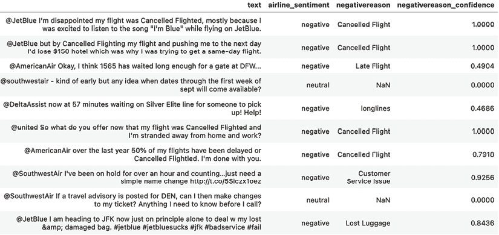

图 5.1：Twitter 航空公司情绪数据集的样本推文

在接下来的章节中，我们将处理数据准备、模型构建、分析和可视化阶段，同时采用传统的 NLP 技术和使用 LLMs 的更现代方法。最初，我们将应用 NLP 工具进行数据清理和结构化，为传统的情绪分析打下基础。

认识到类别不平衡的挑战，我们将展示如何使用 GenAI 作为工具，根据需要通过添加额外的示例来增强我们的数据集。然后，我们将使用我们构建的模型来得出可操作的见解，这些见解可以帮助指导营销活动。

# 准备数据以进行情绪分析

在进行情绪分析之前，有效地准备数据至关重要。数据准备是一个涉及清理、结构和增强数据以改善分析结果的过程。这些步骤的目标是确保数据以可以直接用于分析的形式存在，并消除任何不准确或不规则性。

让我们从加载`Twitter Airline Sentiment`数据集开始：

```py
import pandas as pd
df = pd.read_csv('Tweets.csv')
df.head(5) 
```

使用`df.columns`，我们可以看到许多列，例如包含推文本身的`text`列，以及几个有价值的元数据和情绪相关字段。以下是对列的总结，以及它们含义的简要描述：

| **列** | **描述** |
| --- | --- |
| `tweet_id` | 推文的 ID |
| `airline_sentiment` | 推文的类别标签（正面、中性或负面） |
| `airline_sentiment_confidence` | 情绪分类的置信水平 |
| `negative_reason` | 负面情绪的原因 |
| `airline` | 航空公司的官方名称 |
| `airline_sentiment_gold` | 航空公司情绪分类的黄金标准 |
| `name` | 用户的名称 |
| `negativereason_gold` | 负面原因背后的黄金标准 |
| `retweet_count` | 表示转发次数的数值 |
| `text` | 用户输入的推文文本 |
| `tweet_coord` | Twitter 用户的纬度和经度 |
| `tweet_created` | 推文的创建日期 |
| `tweet_location` | 发送推文的位置 |
| `user_timezone` | 用户的时区 |

表 5.2：Twitter 航空公司情绪数据集的列及其描述

## 传统的 NLP 数据准备技术

在传统的 NLP 技术中，仔细的文本准备——包括清理、分词、停用词去除和词形还原——对于构建输入文本以进行有效分析非常重要。我们将在本节中详细讨论这些过程。

相比之下，现代技术如词嵌入（例如 Word2Vec 和 GloVe）和上下文嵌入（例如 BERT 和 GPT-4）提供了更高级的表示和处理文本数据的方法。这些现代技术将在本书的*第 IV 部分*中更详细地解释。与依赖于手动特征提取的传统方法不同，现代技术会自动从其他文本的预训练中学习单词和上下文的密集表示。

为了说明，我们将选取五个推文文本的样本，并使用它们作为示例来观察传统数据准备步骤的影响。我们还将通过`pd.set_option`设置列宽来显示 DataFrame 的全列宽，从而显示完整的推文文本：

```py
pd.set_option("max_colwidth", None)
examples_idx = df.sample(5).index # [1106, 4860, 6977, 8884, 9108]
df_sample = df.loc[examples_idx] 
```

### 清洗文本数据

文本清洗通过去除噪声并使文本格式统一，从而提高了数据分析的质量。其主要优势包括提高模型准确性和加快计算速度。然而，谨慎地处理清洗过程是必要的，以避免删除上下文中重要的信息。对于 Twitter 数据集来说，由于社交媒体文本的非正式和多样性，清洗特别有用。推文通常包含 URL、提及、表情符号和标签，这些有时会分散对主要情感分析的关注。

我们的方法针对这些具体内容，以保留核心信息的同时消除无关元素：

```py
!python -m space download en_core_web_sm
import re
import spacy
nlp = spacy.load("en_core_web_sm")
def clean_text(text):
    text = re.sub(r'@\w+|#\w+|https?://\S+', '', text)
    text = re.sub(r'[^\w\s]', '', text)
    return text.lower()
df_sample['cleaned_text'] = df_sample['text'].apply(clean_text)
df_sample[["text", "cleaned_text"]] 
```

这产生了以下输出：

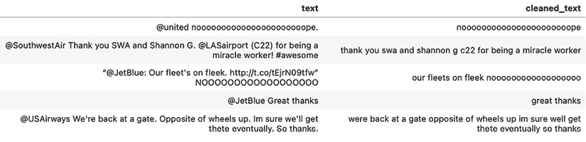

图 5.2：清洗前后推文文本的示例

注意，从文本中移除（`@`）提及对上下文的影响很小，因为我们的数据集已经通过`airline`列捕获了推文的主题。

**额外的文本预处理包**

在本节中没有使用的其他有用的 Python NLP 和文本预处理工具包括：

+   **NLTK** ([`www.nltk.org/`](https://www.nltk.org/))

+   **TextBlob** ([`textblob.readthedocs.io`](https://textblob.readthedocs.io))

+   **Gensim** ([`radimrehurek.com/gensim/`](https://radimrehurek.com/gensim/))

### 分词和停用词移除

分词将文本划分为更小的单元，如单词或短语，这使得算法更容易理解语言结构。停用词是常用词，如“是”、“和”、“the”，它们通常被移除，因为它们添加的语义价值很小，允许模型关注更有意义的内容。

在此实现中，我们使用 spaCy 的模型来应用分词和停用词移除，并展示每个步骤的结果：

```py
def tokenize_and_remove_stopwords(row):
    doc = nlp(row['cleaned_text'])
    all_tokens = [token.text for token in doc]
    tokens_without_stop = [token.text for token in doc if not token.is_stop]
    processed_text = ' '.join(tokens_without_stop)
    row['all_text_tokens'] = all_tokens
    row['without_stop_words_tokens'] = tokens_without_stop
    row['processed_text'] = processed_text
    return row
df_sample = df_sample.apply(tokenize_and_remove_stopwords, axis=1)
df_sample[['cleaned_text', 'all_text_tokens', 'without_stop_words_tokens', 'processed_text']] 
```

这给我们以下输出：

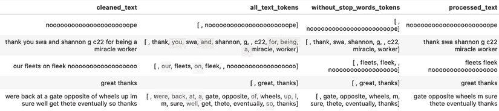

图 5.3：分词和停用词移除后的推文文本示例

### 词形还原

词形还原将单词还原为其词典形式，确保结果是一个有效的单词。这个过程旨在将单词的不同形式合并为单个项目进行分析，从而提高下游任务的效率和准确性。

观察以下代码的最后一行，我们看到最终词元还原后的文本将`wheels`标准化为单数形式`wheel`，并将`thanks`转换为基本动词形式`thank`：

```py
def lemmatize_text(text):
    doc = nlp(text)
    lemmatized = [token.lemma_ for token in doc]
    return ' '.join(lemmatized)
df_sample['final_text'] = df_sample['processed_text'].apply(lemmatize_text)
df_sample[['processed_text', 'final_text']] 
```

这给我们以下输出：

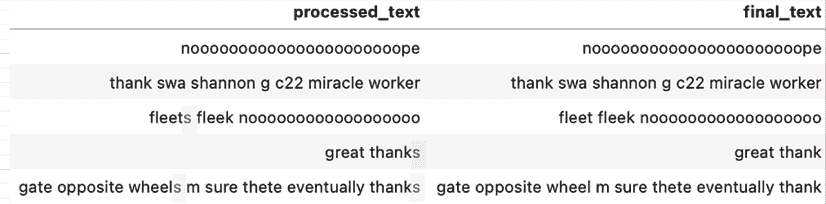

图 5.4：词元还原后的推文文本示例

## 类别不平衡

现在，我们将通过在我们数据集上的探索性数据分析来介绍理解类别平衡的重要性。类别平衡直接影响模型从数据中有效学习的能力。未解决的类别不平衡可能会掩盖洞察力，导致模型在实际应用中表现不佳。

在接下来的章节中，我们不仅将量化类别不平衡，还将讨论解决它的简单和更高级的策略。

### 评估类别平衡

确定整体情感分布至关重要，因为它有助于我们了解数据集中表达的一般情绪和观点。这种理解对于理解由于类别不平衡可能存在的任何偏差也是必不可少的。

以下代码按航空公司和情感分组推文，计算每个组的大小，并生成条形图来可视化结果：

```py
import matplotlib.pyplot as plt
from datetime import datetime
sentiment_by_airline = df.groupby(['airline', 'airline_sentiment']).size().unstack().fillna(0)
plt.figure(figsize=(14, 6))
sentiment_by_airline.plot(kind='bar', stacked=True, color=['red', 'yellow', 'green'])
plt.title('Sentiment Distribution by Airline')
plt.xlabel('Airline')
plt.ylabel('Number of Tweets')
plt.xticks(rotation=45)
plt.legend(title='Sentiment')
plt.tight_layout()
plt.show() 
```

此代码生成了以下图表，展示了该数据集中捕获的航空公司推文的情感主要是负面的：

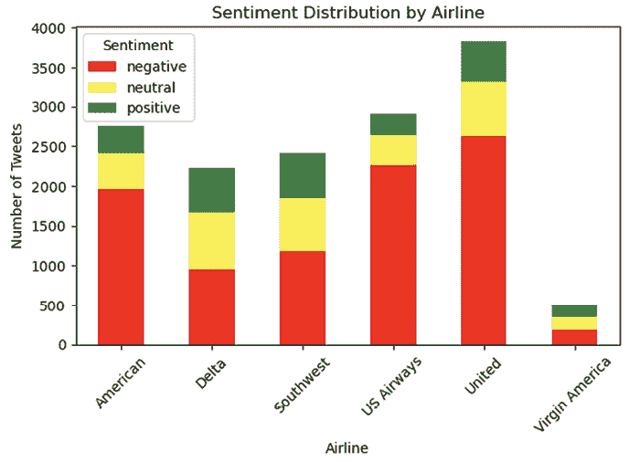


如果我们查看数据集中的类别平衡，我们可以看到有 9,178 个负面示例，3,099 个中性示例，以及 2,363 个正面推文。这可以通过以下方式展示：

```py
df['airline_sentiment'].value_counts() 
```

在现实世界的数据集中，经常遇到具有类别不平衡的数据集，因此，我们将保留本章中的数据特征，以便我们能够理解类别不平衡对建模结果可能产生的影响。

### 解决类别不平衡

以下是一些可以用来解决类别不平衡的传统策略：

+   **欠采样**通过减少多数类的样本大小以匹配少数类来平衡数据集。这有助于平衡数据集，但可能会导致丢失有价值的多数类示例。

+   **过采样**通过复制现有示例来增加少数类的样本大小以匹配多数类。这改善了平衡，但可能导致模型在重复数据示例上过拟合。

+   **合成少数过采样技术**（**SMOTE**）与过采样类似，不同之处在于它生成合成示例而不是简单地复制现有的示例。它是通过基于特征空间中相似的示例生成新实例来实现的。

作为一项练习，你可以对多数类（负面情感）进行欠采样，以实现更平衡的数据集。这可以通过以下代码实现，我们首先将我们的训练数据分为负面、中立和正面类别，然后对负面类别进行下采样以匹配少数（正面）类别的示例数量，从而得到一个更平衡的起始数据集：

```py
from sklearn.utils import resample
negative = df[df.airline_sentiment == 'negative']
neutral = df[df.airline_sentiment == 'neutral']
positive = df[df.airline_sentiment == 'positive']
negative_downsampled = resample(negative, n_samples=len(positive))
df_downsampled = pd.concat([negative_downsampled, neutral, positive]) 
```

**进行欠采样实验**

作为一项练习，运行文本中给出的下采样代码，并在本章剩余部分将`df_downsampled`替换为`df`，以查看你的结果如何随着更平衡的数据集而变化。

### 数据增强的 GenAI

在本节中，我们将展示一种通过使用 GenAI 的种子文本生成新示例来增强代表性不足的正面类别的策略。这种更新颖的方法补充了传统技术以解决类别不平衡问题，但新示例具有更大的潜在多样性。然而，使用 AI 生成数据可能会引入风险，例如过度拟合到生成的模式或反映生成模型本身的潜在偏差。确保种子文本的多样性可以帮助减轻这些问题。

我们将利用 Hugging Face 的 Transformers 库中的`distilgpt2`模型来增强我们的数据集。这个模型是 GPT-2 的简化版本，旨在提高资源效率，因此使得这个例子对具有不同计算资源的用户都易于访问：

```py
from transformers import pipeline
generator = pipeline('text-generation', model='distilgpt2')
def augment_text(text, augment_times=2):
    augmented_texts = []
    for _ in range(augment_times):
        generated = generator(text, max_length=60, num_return_sequences=1)
        new_text = generated[0]['generated_text'].strip()
        augmented_texts.append(new_text)
    return augmented_texts
seed_text = "Fantastic airline service on this flight. My favorite part of the flight was"
augmented_examples = augment_text(seed_text)
def remove_extra_spaces(text):
    words = text.split()
    return ' '.join(words)
for example in augmented_examples:
    print("------\n", remove_extra_spaces(example)) 
```

记住，GenAI 的概率性质意味着输出可能随着每次执行而变化。通过使用精心选择的种子文本“``这次航班的航空公司服务太棒了。我最喜欢的飞行部分是”我们能够生成关于航空公司服务的各种正面情感。当在上述`text-generation`管道中使用此种子文本时，我们生成如下输出：

+   **这次航班的航空公司服务太棒了。我最喜欢的飞行部分是** *享受所有乘务员和跑道的壮观景色*。

+   **这次航班的航空公司服务太棒了。我最喜欢的飞行部分是** *这是我第一次乘坐它，而且非常值得*。

默认情况下，大多数 LLM 将产生反映你期望在日常生活中听到的语言的输出。例如，尝试移除种子语句的结尾部分“`我最喜欢的飞行部分是`"并看看 LLM 产生具有正面情感的示例有多困难。

**GenAI 模型选择和提示敏感性的重要性**

探索 Hugging Face 提供的更复杂的模型，如`gpt-neo`、`gpt-j`和`EleutherAI/gpt-neo-2.7B`，将产生更细腻和逼真的增强效果。

提示的选择在引导生成模型输出中也起着至关重要的作用。种子文本的微妙变化可能导致结果发生巨大变化，这强调了提示设计在 GenAI 应用中的重要性。这个主题在本书的第九章中进行了详细探讨。

虽然这个增强步骤增强了我们数据集中积极情感推文的代表性，但要实现真正的类别平衡需要更广泛的数据增强以及各种种子文本，以确保模型不会过度拟合推文的开始部分。我们可以通过更改上述 `augment_text()` 函数中的 `augment_times` 参数来增加生成的增强示例的数量：

```py
augmented_data = pd.DataFrame({
    'text': augmented_examples,
    'airline_sentiment': ['positive'] * len(augmented_examples)
})
df_augmented = pd.concat([df, augmented_data], ignore_index=True) 
```

通过仔细使用 GenAI 进行数据增强，我们现在有了 `df_augmented` 数据框，其中包含了可以添加到现有数据集以减轻类别不平衡并增强数据集中积极情感表达的额外数据。然而，为了说明原始数据集中类别不平衡对我们结果的影响，我们将不将这些示例添加到我们的数据集中。

# 执行情感分析

情感分析的力量在于其揭示文本数据背后情感的能力，为顾客情感提供了无价的见解。虽然 Twitter Airline Sentiment 数据集的焦点是将情感分类为积极、消极和中性类别，但情感分析也可以超出这些基本类别。根据应用的不同，情感可以分析以检测更细微的情感状态或态度，如快乐、愤怒、惊讶或失望。

## 构建自己的 ML 模型

训练 sentiment analysis 模型的基本方面，尤其是在使用传统 NLP 技术时，是预标注数据的需求。这些标签通常来源于人工标注，这个过程涉及个人评估文本的情感并根据其进行分类。这个 Twitter 数据集中的情感分数是在志愿者的帮助下收集的，其中一些负面推文也根据它们所强调的具体问题进行了分解，例如航班延误或服务质量差，从而提供了对客户不满的更细致的视角。

使用 `scikit-learn`，我们将构建利用此预标注数据集的 sentiment analysis 模型。这些模型将利用前一小节中展示的文本预处理方法从文本中提取 TF-IDF 特征，这些特征反过来又作为机器学习推理的输入，可以预测未见过的推文的情感。

### 特征工程

在训练模型之前，我们需要将文本数据转换为数值特征。一种常见的方法是使用**TF-IDF**（**词频-逆文档频率**）技术。TF-IDF 是一种用于评估一个词在集合或语料库中对于文档重要性的统计度量。我们将利用之前执行的文本预处理步骤，并将`tfidf`向量器直接应用于处理后的文本，将特征限制在顶级 1,000 个术语（`max_features=1000`）。这一步很重要，因为降低维度有助于简化模型，使其训练更快，并减少过拟合的风险。通过关注最相关的词语，我们确保模型捕捉到数据中最显著的模式，同时忽略不那么重要的细节：

```py
from sklearn.feature_extraction.text import TfidfVectorizer
df['cleaned_text'] = df['text'].apply(clean_text)
df = df.apply(tokenize_and_remove_stopwords, axis=1)
df['processed_text'] = df['cleaned_text'].apply(tokenize_and_remove_stopwords)
df['final_text'] = df['processed_text'].apply(lemmatize_text)
tfidf_vectorizer = TfidfVectorizer(max_features=1000)
X = tfidf_vectorizer.fit_transform(df['final_text'])
y = df['airline_sentiment'] 
```

**探索 TF-IDF 的特征工程**

在 TF-IDF 特征工程期间，你可以探索的另一个参数是`ngram_range`。

N-gram 允许你超越单个单词，将连续单词的成对（bigram）或三元组（trigram）视为单个特征。这可以捕捉到更多的上下文和词语之间的关系——例如，虽然“not”和“good”单独可能并不很有信息量，但 bigram“not good”却传达了明确的情感。

### 模型训练

我们的特性准备就绪后，我们可以继续使用 scikit-learn 训练一个简单的模型。逻辑回归是一种简单而强大的算法，适用于包含在这些简短推文中的数据的维度。它为具有两种可能结果的分类问题建模概率，但它可以扩展以处理多个类别，这在我们的案例中适用：

```py
from sklearn.model_selection import train_test_split
from sklearn.linear_model import LogisticRegression
X_train, X_test, y_train, y_test = train_test_split(X, y, test_size=0.3, random_state=42)
model = LogisticRegression(max_iter=1000)
model.fit(X_train, y_train) 
```

我们的逻辑回归模型训练完成后，现在我们可以解释模型的系数，以了解特定词语如何影响情感分类。对于每个情感类别，系数代表这些术语对文本被分类为该特定情感类别的可能性的影响，而其幅度代表每个术语在模型决策过程中的重要性。

为了实现这一点，我们遍历每个类别标签，提取并显示系数绝对值排序的最具影响力的特征：

```py
feature_names = tfidf_vectorizer.get_feature_names_out()
class_labels = model.classes_
for index, class_label in enumerate(class_labels):
    coefficients = model.coef_[index]
    coefficients_df = pd.DataFrame({
        'Feature': feature_names,
        'Coefficient': coefficients
    })
    coefficients_df['Absolute_Coefficient'] = coefficients_df['Coefficient'].abs()
    coefficients_df = coefficients_df.sort_values(by='Absolute_Coefficient', ascending=False)
    print(f"Class: {class_label}")
    print(coefficients_df[['Feature', 'Coefficient']].head(10)) 
```

这产生了以下输出：

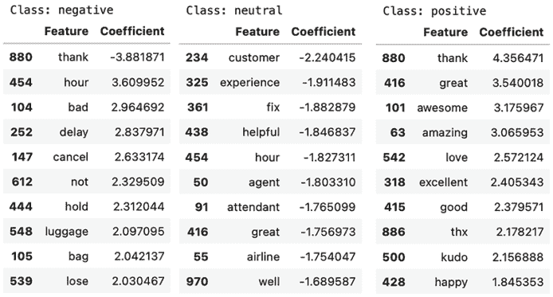

图 5.6：逻辑回归模型按情感类别排序的最具影响力的特征

我们可以从上述系数中看到以下词语对三个情感类别的影响：

+   **负面情感**：单词`thank`（-3.88）降低了推文被分类为负面的可能性，而像`hour`（3.61）、`bad`（2.96）、`delay`（2.84）和`cancel`（2.63）这样的词语则增加了这种可能性，并且是投诉的特征。

+   **中性情感**：例如，`customer`（`-2.24`）、`experience`（`-1.91`）和`fix`（`-1.88`）等词语会降低中性分类的可能性，表明这些术语更常用于非中性语境中。

+   **正面情感**：例如，`thank`（`4.36`）、`great`（`3.54`）、`awesome`（`3.18`）和`amazing`（`3.07`）等词语会显著增加推文被分类为正面的可能性。

### 模型评估

训练模型后的关键一步是评估我们的模型性能。如果没有适当的评估，我们可能会部署一个在实际场景中表现不佳的模型，这可能导致基于其预测的错误结论。

### 分类报告

scikit-learn 的分类报告为我们提供了每个类别的精确度、召回率和 F1 分数。这些指标至关重要，因为它们不仅告诉我们整体准确度，还告诉我们模型在每个情感类别上的表现：

```py
from sklearn.metrics import accuracy_score, classification_report
y_pred = model.predict(X_test)
print(classification_report(y_test, y_pred)) 
```

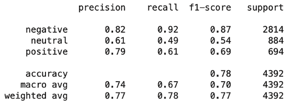

宏平均和加权平均分数让我们了解模型在所有类别上的性能。宏平均对待所有类别同等，而加权平均则考虑了类别不平衡。这些分数之间的差异突出了类别不平衡对模型性能的影响。

让我们更仔细地看看每个类别的结果：

+   负面情感，作为多数类，具有高精确度（`0.82`）和高召回率（`0.92`），表明模型在识别负面推文方面特别出色。这是由于我们的类别不平衡的预期副作用，因为模型有更多这个类别的例子来学习，导致预测这个类别正确的可能性更高。

+   中性情感，比负面情感少，但比正面情感多，显示出显著较低的精确度（`0.61`）和召回率（`0.49`）。精确度相当好，这意味着当模型预测一条推文为中性时，正确率略超过一半。

+   正面情感，最少代表的类别，具有相对较高的精确度（`0.79`），但比负面类别的召回率（`0.61`）低。这里的精确度较高表明，大多数被预测为正面的推文确实是正面的，但模型未能捕捉到许多正面情感（召回率低）。

#### 混淆矩阵

混淆矩阵是进一步了解模型性能的一个很好的下一步。它显示了一个矩阵，其中实际类别在一轴上，预测类别在另一轴上。通过分析混淆矩阵，我们可以看到哪些类别被相互混淆。例如，如果许多中性推文被错误地分类为负面，这可能会表明模型倾向于预测负面，并且中性推文的特征不够独特。我们可以使用以下方法计算和可视化混淆矩阵：

```py
from sklearn.metrics import confusion_matrix
import seaborn as sns
cm = confusion_matrix(y_test, y_pred, labels=['negative', 'neutral', 'positive'])
sns.heatmap(cm, annot=True, fmt='d', cmap='Blues', xticklabels=['negative', 'neutral', 'positive'], yticklabels=['negative', 'neutral', 'positive'])
plt.ylabel('Actual')
plt.xlabel('Predicted')
plt.title('Confusion Matrix')
plt.show() 
```

我们可以接着看到以下混淆矩阵：

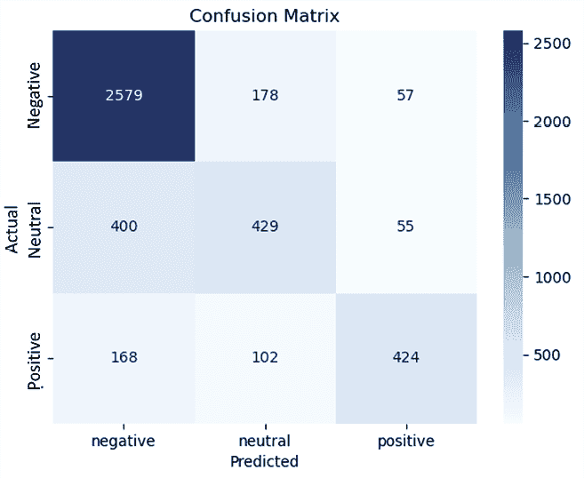

图 5.8：逻辑回归模型的推文情感类别混淆矩阵

让我们将其分解以更好地理解：

+   与我们从分类报告中观察到的结果一致，模型在正确识别负面推文方面表现出色，这在混淆矩阵的第一行中有所体现。

+   当涉及到中性情感时，第二行表明模型倾向于将中性推文与负面推文混淆。

+   最后，第三行对应于积极情感。虽然模型正确识别积极推文的时间超过一半，但仍有一大部分被误认为是负面或中性情感。

#### 理解误分类

在用各种指标评估我们的模型后，我们可以调查模型失败时的示例，从而了解其局限性和改进的机会。

让我们看看模型预测与`airline_sentiment_gold`数据标签提供的可信分类发生冲突的实例：

```py
gold_df = df[df['airline_sentiment_gold'].notnull()]
X_gold = tfidf_vectorizer.transform(gold_df['final_text'])
y_gold = gold_df['airline_sentiment_gold']
y_gold_pred = model.predict(X_gold)
gold_df['predicted_sentiment'] = y_gold_pred
misclassified = gold_df[gold_df['airline_sentiment_gold'] != gold_df['predicted_sentiment']]
misclassified[['airline_sentiment_gold', 'predicted_sentiment', 'text', 'final_text', 'negativereason_gold']] 
```

我们得到以下输出：

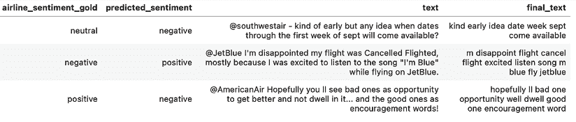

图 5.9：数据集标签与逻辑回归模型预测不一致的示例推文

对误分类示例的分析表明，我们的模型的`predicted_sentiment`在准确捕捉完整推文语境方面存在不足。例如，一个表达对取消航班失望的推文的第二个误分类示例，以幽默的语气包装，突显了检测讽刺的内在挑战，并强调了模型训练涵盖更广泛情感表达的重要性。然后，对于最后一个例子，我们有一个令人鼓舞的推文，承认从负面经历中看到改进的机会，但预测为负面。这说明了 TF-IDF 特征在模型中解释细微积极情感时的困难，尤其是在与负面词汇交织在一起时。这些误分类可以从更先进的 NLP 模型中受益，这些模型能够更好地辨别语境和细微差别，这是我们将在下一节关于预训练 LLMs 的讨论中探讨的主题。

**提高传统情感模型性能**

+   **解决训练数据差距**：确保您的数据集包括广泛的情感表达，如讽刺、幽默和条件积极。模型准确解释情感的能力直接与其从中学到的例子多样性相关。可以使用分层抽样等采样技术来确保所有情感类型在训练集中得到充分代表。

+   **理解特征表示的限制**：传统的特征表示方法，如 TF-IDF，可能无法完全捕捉复杂的情感细微差别，尤其是在整体情感不是其各部分之和的情况下。

+   **增强模型中的上下文特征**：通过结合上下文线索如 n-gram 或词性标注来丰富特征集。这些添加有助于通过考虑词序和语法结构来捕捉情感细微差别。

+   **探索更稳健的机器学习算法**：除了像逻辑回归和朴素贝叶斯这样的简单方法之外，集成方法如随机森林和提升算法（XGBoost）能更好地捕捉复杂模式。此外，对逻辑回归进行超参数调整（例如，调整正则化强度）可以显著提高性能。深度学习方法如 CNN 和 RNN 通常提供最佳性能，前提是有足够的训练示例。

在探索了各种增强传统情感模型的技术，包括解决数据差距、特征表示和适当的算法之后，我们现在将注意力转向情感分析领域的一项更现代的进步，即使用预训练的 LLM。

## 使用预训练的 LLM

在应用预训练的 LLM 进行情感分析之前，理解嵌入的概念非常重要，这些嵌入是这些高级模型的基础。本质上，嵌入是数据的密集向量表示，可以是任何东西，从单词和整个文档到图像和关系数据。这些向量被设计用来在多维空间中捕捉数据的关键特征。

自然语言处理嵌入的早期例子包括 Word2Vec 和 GloVe，它们生成**静态嵌入**。在 Word2Vec 中，嵌入受到局部上下文的影响，通过跳字模型和**连续词袋模型**（CBOW）等技术，但一旦训练完成，相同的词无论在更广泛的上下文中都有相同的向量表示。然而，像 BERT 和 GPT 这样的最先进 LLM 引入了真正的**上下文嵌入**，其中词的表示根据其上下文使用动态变化。有效的 NLP 嵌入的关键属性是它在向量空间中保留了原始数据的语义关系，这意味着相似的向量（单词、短语或文档）比不相似的数据更接近。

将 LLM 应用于情感分析标志着自然语言处理领域的一项重大进步，简化了理解复杂文本数据的过程。这些模型通过在多样化的数据集上进行广泛的预训练，在捕捉人类语言的细微差别方面表现出色，从而绕过了复杂的文本预处理、超参数调整——甚至预标注数据的需要。对于市场营销专业人士来说，这意味着更有效地衡量不同平台上的客户情绪。

### 实施预训练模型

为了展示预训练 LLM 的有效性，我们将使用 Transformers 库中 `distilbert-base-uncased-finetuned-sst-2-english` 模型的 `sentiment-analysis` 管道。DistilBERT 是 BERT 的一个更小、更快的版本，保留了 95% 的上下文嵌入性能。这个特定的变体在**斯坦福情感树库**（**SST-2**）数据集上进行了微调，这是一个情感分析的标准基准，包含带有人类标注的`正面`或`负面`情感的电影评论。

由于其二元分类性质，`中性`情感被排除在我们的测试集之外，以使模型在`正面`和`负面`之间的可用预测保持一致。在这个例子中，我们还将`time`和`tqdm`模块纳入我们的代码中，以跟踪执行时间。在模型加载后，使用`sentiment-analysis`管道对所有测试文本进行推理可能需要几分钟才能完成：

```py
from tqdm.auto import tqdm
import time
filtered_df = df[df['airline_sentiment'] != 'neutral']
X = filtered_df['text']
y = filtered_df['airline_sentiment']
X_train_texts, X_test_texts, y_train, y_test = train_test_split(X, y, test_size=0.3, random_state=42)
sentiment_pipeline = pipeline("sentiment-analysis", model="distilbert-base-uncased-finetuned-sst-2-english")
start_time = time.time()
results = []
for text in tqdm(X_test_texts, desc="Analyzing sentiments"):
    result = sentiment_pipeline(text)
    results.append(result[0]['label'].lower())
end_time = time.time()
total_time = end_time - start_time
print(f"Total time for analyzing {len(X_test_texts)} tweets: {total_time:.2f} seconds") 
```

使用 DistilBERT 的 `sentiment-analysis` 管道简化了情感分析过程，因为它将几个复杂的步骤封装成一个高效的过程。如果没有这个，标记化、文本嵌入、推理和后处理都需要单独处理。

### 评估模型性能

可以使用以下代码从 LLM 推理中获取分类报告：

```py
print(classification_report(y_test, results)) 
```

这产生了以下结果：

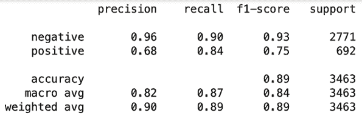

图 5.10：评估 LLM 性能的分类报告指标

接下来，让我们生成混淆矩阵：

```py
cm = confusion_matrix(y_test, results, labels=['negative', 'positive'])
sns.heatmap(cm, annot=True, fmt='d', cmap='Blues', xticklabels=['negative', 'positive'], yticklabels=['negative', 'positive'])
plt.ylabel('Actual')
plt.xlabel('Predicted')
plt.title('Confusion Matrix')
plt.show() 
```

这给出了以下输出：

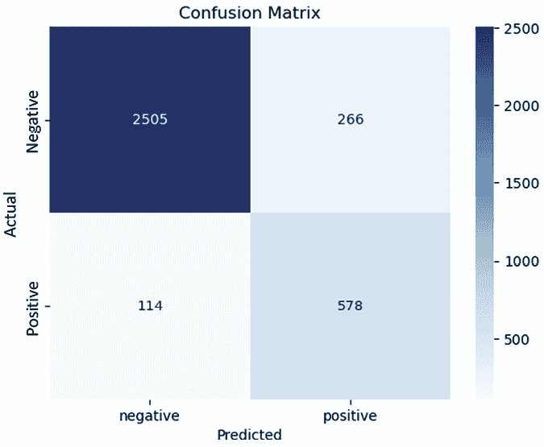

图 5.11：LLM 对推文情感类别的混淆矩阵

当比较使用 TF-IDF 特征的前一个逻辑回归模型和我们的预训练 LLM 的性能时，出现了一些观察结果。虽然逻辑回归模型为情感分析提供了一个强大的基线，但在处理自然语言的细微差别方面存在局限性。虽然类别不平衡可能在模型性能问题中起到了一定作用，但重要的是要注意，LLM 理解语言细微差别的能力，源于其广泛的预训练和微调，可能在其优越性能中发挥了更大的作用。此外，逻辑回归模型仅使用了 TF-IDF 的单词，这未能捕捉到上下文，并导致了错误的描述。因此，它在分类主导的负面情感类别中的正面（和中性）情感分类上尤其困难。

LLM（考虑到我们排除了中性类别以保持与微调过程性质的一致性）表现出更稳健的性能。

这通过其在区分积极和消极情感方面的提高准确性得到展示。需要注意的是，逻辑回归模型从不平衡数据开始，以说明其对结果的影响，而 LLM 没有在 Twitter 数据上进行任何特定任务的训练，而是在 SST-2 电影评论上进行了训练。关键要点是 LLM 的知识被有效地推广，从电影评论到 Twitter 数据，突显了其强大的语言理解能力。对于消极情感的精确度为`0.96`，召回率为`0.90`，该模型强调了利用预训练神经网络进行情感分析的可能性。在积极情感检测方面的改进，精确度达到`0.68`，召回率为`0.84`，进一步强调了模型的预测能力。

使用像 LLM（大型语言模型）这样的高级机器学习模型的一个缺点是它们缺乏可解释性。理解这些黑盒模型中确切是什么创造了负面情绪可能具有挑战性。可以使用如**LIME（局部可解释模型无关解释）**等技术来提高可解释性。有关模型透明度和阐明 LLM 决策的技术更详细讨论，请参阅*第十三章*。

虽然 LLM 的表现值得注意，但将 LLM 微调到我们航空公司推文数据集中存在的特定情感标签将进一步提高其性能。微调使模型更紧密地适应任务的独特上下文，使模型能够利用并理解分类任务的细微差别。

除了微调之外，迁移学习和少样本学习是进一步细化模型在情感分类上高精度分类能力的强大方法。迁移学习涉及将预训练模型在相关任务上调整以在目标任务上表现良好，即使只有最少量的额外训练数据。相反，少样本学习训练模型仅使用少量目标任务的示例来做出准确预测。

**改进 LLM：迁移和少样本学习**

在本书的*第四部分*中，我们将更深入地探讨这些尖端方法。我们将探讨如何将微调、迁移学习和少样本学习应用于预训练模型，将它们转化为针对特定领域任务（如情感分类）的高度专业化的工具。

当我们到达本书的第四部分时，我们将更深入地探讨适应预训练模型以用于特定领域任务的尖端方法。

# 将情感转化为可操作的见解

到目前为止，在本章中，我们已经探讨了理解和应用情感分析到您的数据中所需的工具和策略，从使用传统 NLP 方法的数据准备和预测的基础技术到 GenAI 的高级功能。在本章的最后一部分，我们将讨论如何分析这些见解以生成可操作的战略，这些战略可以指导品牌在营销活动的各个阶段取得成功。

## 创建您的数据集

在将此分析应用于您的用例之前，我们需要一种收集数据的方法，该方法能够捕捉与您的品牌相关的潜在客户情绪。虽然本章以 Twitter 航空数据集为例，但我们探讨的技术适用于任何行业或数据源。本节将介绍您可以采取的一般步骤，以创建用于分析的专有数据集，无论这些数据来自 Twitter 还是其他主要数据平台。

**人工智能赋能营销中的伦理和治理**

在人工智能赋能的营销中的伦理和治理是第十三章的主题，在收集数据时遵守尊重消费者隐私和数据保护法律的伦理准则和治理框架至关重要。营销中的伦理实践包括为数据收集获得同意，确保数据匿名化以保护个人身份，以及提供明确的退出机制。公司应建立强大的数据治理政策，定义数据处理程序和遵守如欧盟的**通用数据保护条例**（**GDPR**）或**加利福尼亚消费者隐私法案**（**CCPA**）等法律标准。

### 收集 Twitter 数据

要开始，请确保您拥有 Twitter 开发者账户并可以访问 Twitter（现在更名为 X）API。您可以遵循以下步骤：

1.  您首先需要创建一个项目并获取您的 API 密钥和令牌，然后，使用您的 Twitter 开发者账户的凭证（[`developer.twitter.com/en/portal/petition/essential/basic-info`](https://developer.twitter.com/en/portal/petition/essential/basic-info)），验证您的会话以访问 Twitter API。以下是一般步骤：

    ```py
    !pip install tweepy
    import tweepy
    # Replace these with your API keys and tokens
    consumer_key = 'YOUR_CONSUMER_KEY'
    consumer_secret = 'YOUR_CONSUMER_SECRET'
    access_token = 'YOUR_ACCESS_TOKEN'
    access_token_secret = 'YOUR_ACCESS_TOKEN_SECRET'
    auth = tweepy.OAuthHandler(consumer_key, consumer_secret)
    auth.set_access_token(access_token, access_token_secret)
    api = tweepy.API(auth) 
    ```

1.  现在我们已经可以访问 Twitter API，您可以使用与您的品牌相关的 Twitter 账号或相关标签，并结合`search_tweets`方法来查找相关推文。以下示例收集了提及`"@YourBrandHandle"`的最新 100 条推文：

    ```py
    query = "@YourBrandHandle -filter:retweets"
    tweets = api.search_tweets(q=query, lang="en", count=100) 
    ```

由于最近的变化，Twitter（X）API 可能访问受限，某些端点可能需要提高访问级别。如果您遇到`403` `Forbidden`错误，您可能需要升级访问级别或使用 API 文档中提供的替代端点。更多详情可以在 Twitter 开发者门户（[`developer.twitter.com/en/portal/petition/essential/basic-info`](https://developer.twitter.com/en/portal/petition/essential/basic-info)）找到。

1.  收集推文后，我们可以提取相关信息，例如推文 ID、文本、创建时间和位置。然后我们可以将这些数据结构化为`pandas` DataFrame，以便更容易分析：

    ```py
    data = [{
        'tweet_id': tweet.id,
        'text': tweet.text,
        'tweet_created': tweet.created_at,
        'tweet_location': tweet.user.location,
        } for tweet in tweets]
    your_brand_df = pd.DataFrame(data) 
    ```

API 响应文档中还有许多其他值得考虑的元数据字段，包括转发计数（`tweet.retweet_count`）、标签（`tweet.entities['hashtags']`）和提及（`tweet.entities['user_mentions']`）。如以下章节所述，这些字段可以为理解您的品牌情感叙事提供有价值的见解，包括显著话题、推文参与度和病毒性。

### 从其他平台收集数据

分析品牌情感不仅限于 Twitter，还包括 Facebook、Instagram、Google 评论等多种社交媒体平台。每个平台都面临着独特的挑战和机会，以收集和分析数据。收集数据的方法根据每个平台的 API 功能和数据可用性而有所不同。对于 Google 评论等平台，API 可能允许您直接访问评论和评分。在 Facebook 和 Instagram 等平台上，您可能需要依赖帖子、评论和标签来衡量情感。

**访问开发者 API**

要从不同的社交媒体平台收集数据，您需要访问它们各自的开发者 API。以下是一些有用的链接，以帮助您开始：

+   **Facebook**：[`developers.facebook.com/docs/graph-api`](https://developers.facebook.com/docs/graph-api)

+   **Instagram**：[`developers.facebook.com/docs/instagram-api`](https://developers.facebook.com/docs/instagram-api)

+   **Reddit**：[`www.reddit.com/dev/api/`](https://www.reddit.com/dev/api/)

+   **YouTube**：[`developers.google.com/youtube/v3`](https://developers.google.com/youtube/v3)

+   **TikTok**：[`developers.tiktok.com/products/research-api/`](https://developers.tiktok.com/products/research-api/)

一旦获取数据，一个主要挑战就是准确识别与您的品牌相关的提及和讨论。这正是**命名实体识别**（NER）和实体映射技术发挥作用的地方。NER 可以帮助识别文本中的专有名词，如品牌名称或产品，而实体映射可以将这些提及与数据集中的您的品牌联系起来。

### 在一个虚构零售商的数据集上执行命名实体识别（NER）

例如，让我们考虑一系列来自虚构在线零售商 Optimal Hiking Gear（销售户外装备）的客户评论。为了提取品牌提及，我们可以使用 spaCy 语言模型内建的 NER 功能，并查找其`ORG`标签以识别相关提及：

```py
nlp = spacy.load("en_core_web_sm")
reviews = [
    "I recently purchased a sleeping bag from Optimal Hiking Gear and it exceeded my expectations.",
    "The tent I bought from Optimal Hiking was damaged on arrival. Very disappointed.",
    "The Optimal Hiking company makes a backpack that's the best. I've been using mine for years without any issues."
]
for review in reviews:
    doc = nlp(review)
    for ent in doc.ents:
        print(f"Entity: {ent.text}, Label: {ent.label_}") 
```

这会产生以下结果：

```py
Entity: Optimal Hiking Gear, Label: ORG
Entity: Optimal Hiking, Label: ORG
Entity: Optimal Hiking, Label: ORG
Entity: years, Label: DATE 
```

**通过定制训练增强 NER**

为了使 NER 模型更贴近您的需求，考虑使用您的数据进行训练。这包括提供一些文本示例，其中包含您品牌或行业特有的手动标注实体。通过这样做，模型可以更准确地识别和分类这些自定义实体。spaCy 等工具提供了训练您的 NER 模型的功能。

## 理解主题和主题

本节深入探讨了各种工具，以从您的数据集中提取见解，概述关键主题和主题。这些见解对于理解数据中客户情绪的更广泛背景至关重要。作为一个起点，我们可以参考该数据集标注者标记的负面情感的不同原因的数量：

```py
df.negativereason.value_counts() 
```

这给我们以下输出：

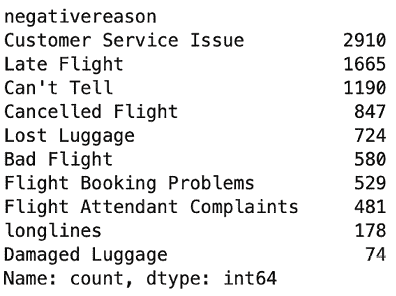

图 5.12：Twitter 数据集中不同负面情感推文原因的计数

### 使用词云

**词云**，其中每个词在图中的大小对应其出现的频率，是可视化文本数据的有价值起点工具。为了丰富我们的词云并确保可视化不仅反映最频繁的术语，还反映最能指示独特情感和主题的术语，我们将结合 TF-IDF 分析来生成我们的图。通过将 `ngram_range=(1, 2)` 参数引入我们的 `tfidf_vectorizer`，我们创建了单语和双语。利用 `WordCloud` 库，我们可以通过以下方式创建词云：

```py
from wordcloud import WordCloud
tfidf_vectorizer = TfidfVectorizer(max_features=1000, ngram_range=(1, 2))
tfidf_matrix = tfidf_vectorizer.fit_transform(df['final_text'])
tfidf_scores = dict(zip(tfidf_vectorizer.get_feature_names_out(), tfidf_matrix.sum(axis=0).tolist()[0]))
wordcloud_tfidf = WordCloud(width=800, height=400, background_color='white').generate_from_frequencies(tfidf_scores)
plt.figure(figsize=(10, 5))
plt.imshow(wordcloud_tfidf, interpolation='bilinear')
plt.axis('off')
plt.show() 
```

我们接下来会看到类似以下这样的词云：

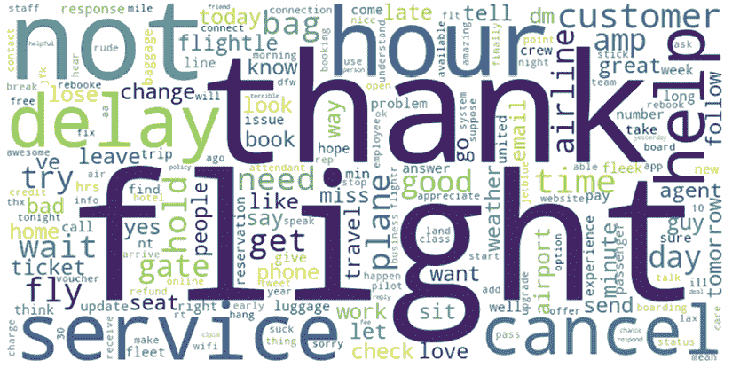

图 5.13：显示 TF-IDF 分析中不同术语出现频率的词云

到目前为止的分析通过诸如 `delay`、`cancel` 和 `help` 等常见词汇揭示了关键主题。通过包含双语，我们还可以捕捉到诸如 `customer service` 和 `cancel flight` 这样的关键术语。在 Twitter 数据的背景下，标签提供了直接了解核心主题和情感的方法。为了深入了解，我们将继续从推文中提取标签，创建一个词云来以不同的方式可视化这些关键短语。这种方法旨在为我们数据集中的主题提供不同的视角：

```py
import nltk
def extract_hashtags(text):
    return re.findall(r"#(\w+)", text)
hashtags = sum(df['text'].apply(extract_hashtags).tolist(), [])
hashtag_freq_dist = nltk.FreqDist(hashtags)
wordcloud_hashtags = WordCloud(width=800, height=400, background_color='white').generate_from_frequencies(hashtag_freq_dist)
plt.figure(figsize=(10, 5))
plt.imshow(wordcloud_hashtags, interpolation='bilinear')
plt.axis('off')
plt.show() 
```

我们接下来看到以下内容：

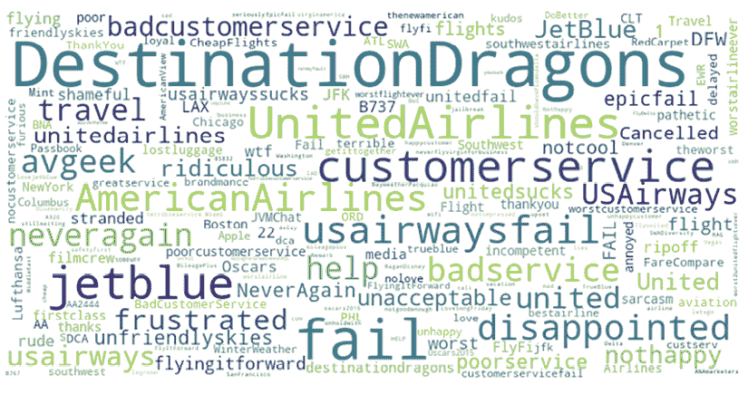

图 5.14：显示 Twitter 标签出现频率的词云

排除直接提及航空公司的情况，词云通过诸如 `#Fail`、`#Disappointed` 和 `#BadCustomerService` 这样的标签清晰地突出了普遍的负面情绪。与这些相反，`#DestinationDragons` 也显著出现，这标志着西南航空公司的广为人知的旅游活动，展示了我们数据集中捕获的客户反馈的双重性。

### 使用 LDA 发现潜在主题

**潜在狄利克雷分配**（**LDA**）是一种超越简单频率指标的高级技术，如词云中所示，它通过无监督机器学习识别文本语料库中的潜在主题。与仅突出最频繁单词的词云不同，LDA 通过将文档视为主题的混合体来辨别隐藏的主题结构，其中每个主题由一组特定的单词定义。这个过程涉及贝叶斯推理，使用狄利克雷分布来估计文档中主题的存在及其比例。例如，在酒店评论集合中，LDA 可能会识别与位置、停车、浴室清洁和入住体验相关的主题。LDA 的复杂性在于其能够捕捉语料库中单词的上下文和共现，从而在不进行预先标记的情况下提供对文本主题内容的更细致的理解。

我们可以通过以下方式实施这种方法：

```py
from sklearn.decomposition import LatentDirichletAllocation
from sklearn.feature_extraction.text import CountVectorizer
count_vect = CountVectorizer(max_df=0.95, min_df=2, stop_words='english')
doc_term_matrix = count_vect.fit_transform(df['final_text'])
LDA = LatentDirichletAllocation(n_components=5, random_state=42)
LDA.fit(doc_term_matrix)
for i, topic in enumerate(LDA.components_):
    print(f"Top words for topic #{i}:")
    print([count_vect.get_feature_names_out()[index] for index in topic.argsort()[-10:]])
    print("\n") 
```

这给我们以下输出：

```py
Top words for topic #0:
['fly', 'follow', 'send', 'dm', 'flight', 'hour', 'sit', 'gate', 'seat', 'plane']
Top words for topic #1:
['tomorrow', 'change', 'amp', 'time', 'late', 'delay', 'fly', 'flightle', 'cancel', 'flight']
Top words for topic #2:
['response', 'bad', 'good', 'time', 'flight', 'bag', 'great', 'customer', 'service', 'thank']
Top words for topic #3:
['wait', 'need', 'help', 'problem', 'delay', 'luggage', 'hour', 'miss', 'bag', 'flight']
Top words for topic #4:
['service', 'number', 'customer', 'minute', 'email', 'hour', 'help', 'try', 'phone', 'hold'] 
```

分析 LDA 生成的聚类使我们能够确定推文中的重要主题，例如在主题`#1`和`#2`中分别表示的航班延误和客户服务问题。通过改变`n_components`参数，我们可以改变算法对存在主题数量的假设，随着参数值的增加，导致更细粒度的主题。

重要的是要认识到，LDA 识别出的所有主题并不都会直接与关键情感表达相一致，其中一些可能只是简单地反映了数据集中普遍存在的、非特定的语言，正如在主题`#0`中看到的那样。

为了提取有意义的见解，通常需要额外的审查来辨别哪些主题对于分析最为相关。这个过程可以通过人工审查或通过为语言模型设计一个精心设计的提示来促进，帮助根据可能的主题总结单词分组。

## 时间趋势：追踪品牌叙事

在社交媒体的动态领域，推文的病毒性往往充当衡量对品牌感知最具影响力的情感的温度计。这对于负面情感尤其如此，因为它们对品牌形象的风险很大。通过审查围绕航空公司（如 JetBlue）的 Twitter 活动，我们可以揭示可能显著影响品牌声誉的推文。

本文介绍了一种基于社交媒体的品牌声誉追踪器，该追踪器实时监控品牌事件，并将它们与品牌声誉的具体驱动因素相连接：[`ora.ox.ac.uk/objects/uuid:00e9fcb7-9bf1-486a-b4dd-3c1d086af24e/files/rz316q188f`](https://ora.ox.ac.uk/objects/uuid:00e9fcb7-9bf1-486a-b4dd-3c1d086af24e/files/rz316q188f)。

这项分析涉及筛选提及`@JetBlue`账号的推文。下面的代码将随着时间的推移对这些推文的情感进行分类，其中每个数据点的气泡大小对应于那天总的转发量，提供了一个参与度的视觉尺度：

```py
df['tweet_created'] = pd.to_datetime(df['tweet_created']).dt.tz_convert(None)
df['date'] = df['tweet_created'].dt.date
airline_handle = "@JetBlue"
airline_tweets = df[df.text.str.contains(airline_handle)]
grouped = airline_tweets.groupby(['airline_sentiment', 'date']).agg({'tweet_id':'count', 'retweet_count':'sum'}).reset_index()
positive_tweets = grouped[grouped['airline_sentiment'] == 'positive']
neutral_tweets = grouped[grouped['airline_sentiment'] == 'neutral']
negative_tweets = grouped[grouped['airline_sentiment'] == 'negative']
plt.figure(figsize=(14, 7))
scale_factor = 3
for tweets, sentiment, color, linestyle in zip(
    [positive_tweets, neutral_tweets, negative_tweets],
    ['Positive', 'Neutral', 'Negative'],
    ['green', 'orange', 'red'],
    ['-', '--', '-.']
):
    scaled_retweet_count = tweets['retweet_count'] * scale_factor
    plt.plot(tweets['date'], tweets['tweet_id'], linestyle=linestyle, label=sentiment, color=color)
    plt.scatter(tweets['date'], tweets['tweet_id'], scaled_retweet_count, color=color)
plt.title(f'Daily Sentiment Trend for {airline_handle} with Bubble Size Indicating Retweets')
plt.xlabel('Date')
plt.ylabel('Number of Tweets')
plt.legend()
plt.xticks(rotation=45)
plt.tight_layout()
plt.show() 
```

这产生了以下图表：

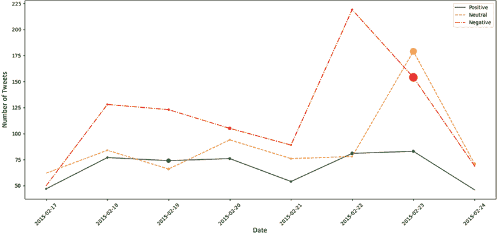

图 5.15：JetBlue 推文随时间变化的情感，其中每个数据点的气泡大小对应于那天总的转发量

在 2 月 22 日和 23 日观察到显著的负面情感推文高峰，后者转发量的异常激增表明广泛的参与。那些关注 JetBlue 品牌声誉的人可能会发现深入研究这些推文的细节很有价值。

我们可以根据转发量最高的推文，以及在此日期范围内以及前一天，对这些推文进行汇总和排名，以下代码可以实现：

```py
dates_of_interest = [pd.to_datetime('2015-02-22').date(), pd.to_datetime('2015-02-23').date(), pd.to_datetime('2015-02-24').date()]
filtered_df = airline_tweets[(airline_tweets['date'].isin(dates_of_interest)) & (airline_tweets['airline_sentiment'] == 'negative')]
top_tweets_per_date = filtered_df.groupby('date').apply(lambda x: x.nlargest(3, 'retweet_count'))
top_tweets_per_date[['text', 'retweet_count', 'negativereason']] 
```

这给我们以下结果：

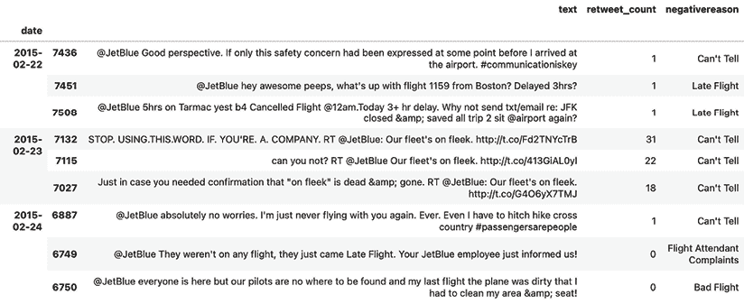

图 5.16：2015 年 2 月 22 日至 24 日 JetBlue 负面情感推文高峰的分析

结果的第一天和最后一天揭示了典型的抱怨，如晚点航班和糟糕的服务，这在航空业很常见。然而，2 月 23 日的反弹突显了 JetBlue 一项营销活动的争议，该活动被短语“我们的机队很酷”所概括。正如本章引言中讨论的，实时监控品牌认知将使他们能够及早跟踪这种营销情感的变化，使他们能够预测并可能减轻随之而来的公关问题。

这种负面宣传的潜在长期影响需要进一步的监控和分析——使用第二章中讨论的 KPI 等指标——以评估对品牌声誉的影响。尽管如此，这项分析说明了随着时间的推移监控社交媒体趋势的重要性，以便提前解决可能损害品牌认知的问题。

## 使用地理空间分析映射情感

地理空间分析提供了一个强大的视角，通过这个视角可以观察客户情感，使公司能够识别出关注点——从客户服务问题到设计不佳的市场营销活动——甚至在这些问题对现场工作人员变得明显之前。为了说明如何生成这样的见解，让我们利用`folium`包创建一个热图，该热图基于推文坐标精确指出负面情感的来源：

```py
!pip install folium
import folium
from folium.plugins import HeatMap
filtered_df = df[(df['text'].str.contains('@JetBlue') & (df['airline_sentiment'] == 'negative'))]
filtered_df = filtered_df.dropna(subset=['tweet_coord'])
valid_coords = []
for coord in filtered_df['tweet_coord']:
    try:
        lat, long = eval(coord)
        valid_coords.append((lat, long))
    except (TypeError, SyntaxError, NameError):
        continue
if valid_coords:
    map_center = [sum(x)/len(valid_coords) for x in zip(*valid_coords)]
else:
    map_center = [0, 0]
tweet_map = folium.Map(location=map_center, zoom_start=4)
HeatMap(valid_coords).add_to(tweet_map)
tweet_map 
```

这段代码产生了以下地图：

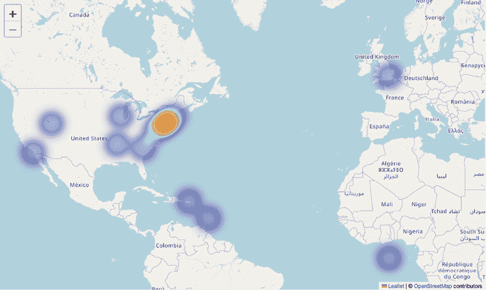

图 5.17：基于推文坐标的热图，精确指出负面 JetBlue 情感的来源

生成的热图揭示了 JetBlue 主要运营区域中负面情感的集中——这一相关性是预期的，因为更多的航班自然会导致更多负面经历的报告。然而，通过观察这些模式的时间演变，我们可以看到这种方法可以作为实时工具来发现异常的情感模式。

例如，来自新位置的负面推文的突然涌入可能表明服务问题，并预示着可能出现的公关挑战。相反，识别出拥有大量正面推文的高频区域可能凸显出公司内的优势。将地理空间分析与之前介绍的主题建模方法相结合，也可以解锁更多见解，不仅揭示讨论的内容，还揭示这些对话发生的地方，提供宝贵的可操作营销情报。

# 摘要

本章强调了情感分析在现代营销策略中的重要性。它介绍了情感分析作为一项关键工具，用于解释大量非结构化文本数据，例如社交媒体对话，以精炼营销策略、品牌信息或客户体验。通过利用 Twitter 航空公司数据集，我们涵盖了将情感分类为正面或负面的端到端流程，使用了传统的 NLP 和更先进的涉及预训练 LLMs 的 GenAI 方法。然后，我们介绍了一系列工具，用于可视化这些结果，以得出可操作的营销见解。本章应该使你具备有效利用情感分析所需的基本技能，适用于从品牌声誉监控到将营销信息与客户偏好对齐的各种应用。

展望下一章，我们将从理解客户情感进步到利用预测分析积极塑造客户参与度，重点关注通过 A/B 测试对营销策略的实证验证。我们将讨论识别预测客户参与度的特征、训练机器学习模型、模型评估以及 A/B 测试的实施。本章旨在通过提供特征选择、构建预测模型、优化模型性能、进行 A/B 测试以及将见解融入有效营销策略的技能来提升你的知识。这一步将使你不仅能够预测客户行为，而且能够通过实证验证和精炼营销策略以提高其有效性。

# 加入我们书籍的 Discord 空间

加入我们的 Discord 社区，与志同道合的人交流，并与其他 5000 多名成员一起学习：

[`packt.link/genai`](https://packt.link/genai)


