# 第七章：个性化产品推荐

随着技术的进步和收集的数据量的增加，个性化无处不在。从流媒体服务，如 Netflix 和 Hulu，到你在手机上看到的营销信息和广告，现在展示给你的大部分内容都是个性化的。在营销中，个性化的或目标营销活动已被证明比通用的或大众营销活动在推动客户参与和转化方面效果显著。

在本章中，我们将讨论如何构建个性化的推荐模型，以便我们能更好地针对客户推荐他们最感兴趣的产品。我们将探讨如何在 Python 中执行**市场篮子分析**，这有助于营销人员更好地理解哪些商品经常一起购买，如何构建两种方法的**协同过滤**算法以实现个性化产品推荐，以及为推荐针对个别客户的个性化产品所采取的其他方法。

在本章中，我们将涵盖以下主题：

+   基于市场篮子的产品分析

+   基于用户和基于项目的协同过滤

+   其他常用的推荐方法

# 基于市场篮子的产品分析

**市场篮子分析**的经典例子是研究人员发现，购买尿布的客户也倾向于购买啤酒。尽管啤酒和尿布看起来像是太远的商品而无法搭配，但这一发现表明，我们可以从数据中找到不同产品之间隐藏的关联。市场篮子分析的目标是找到这些产品之间的隐藏关系，并有效地为或向客户安排或推荐产品。市场篮子分析有助于回答以下问题：

+   应该向购买产品 X 的客户推荐哪些产品？

+   在商店中，哪些产品应该放在一起，以便客户可以轻松找到他们想要购买的产品？

为了回答这些问题，需要找到市场篮子分析的关联规则。简单来说，关联规则通过基于规则的机器学习方法展示一个项集在交易中出现的信心或显著性。一个关联规则有两个部分：先行词，即规则的条件，和结果词，即规则的结果。考虑以下陈述：

> “购买尿布的客户很可能也会购买啤酒。”

在这个陈述中，尿布是先行词，啤酒是结果词。使用五个指标来评估这些关联规则的强度：

+   **支持**：支持表示一个项集在数据集中出现的频率。计算项集(*X*, *Y*)的支持的方程式是：

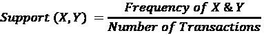

例如，如果数据中的 10 笔交易中有 3 笔是尿布交易，那么尿布的支持度为 3/10 或 0.3。如果数据中的 10 笔交易中有 2 笔是尿布和啤酒的交易，那么尿布和啤酒的支持度为 2/10 或 0.2。

+   **置信度**：置信度是在前导事件 X 发生的情况下，项集(*X*, *Y*)发生的条件概率。计算给定前导事件 X 的后续事件 Y 的置信度的公式为：

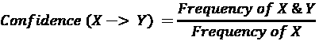

例如，如果数据中的 10 笔交易中有 3 笔是尿布交易，2 笔是尿布和啤酒的交易，那么在尿布购买的情况下购买啤酒的置信度为 2/3 或 0.67。如果后续事件总是与前导事件一起发生，置信度值将为 1。

+   **提升比**：提升比是一个度量项集(X, Y)与前导事件和后续事件独立事件相比同时发生的频率的指标。前导事件 X 和后续事件 Y 的提升比公式为：

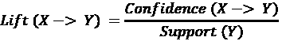

例如，如果尿布和啤酒的置信度为 2/3，啤酒的支持度为 5/10，那么尿布对啤酒的提升比为 2/3 除以 5/10，即 20/15 或 4/3。如果前导事件和后续事件是独立的，提升分数将为 1。

+   **杠杆率**：杠杆率是一个度量前导事件和后续事件同时发生的频率与它们独立时发生的频率之间差异的指标。杠杆率的公式为：

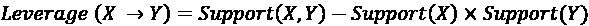

例如，如果尿布和啤酒在总共 10 笔交易中的 4 笔交易中发生，尿布和啤酒的支持度分别为 0.6 和 0.5，那么杠杆率将是 0.4 减去(0.6 * 0.5)，即 0.1。杠杆率的值介于-1 和 1 之间，如果前导事件和后续事件是独立的，杠杆率值将为 0。

+   **信念度**：信念度衡量后续事件对前导事件依赖的程度。信念度的公式为：

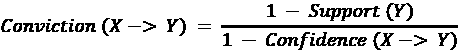

例如，如果尿布和啤酒之间的置信度为`0.67`，啤酒的支持度为`0.2`，意味着在总共 10 笔交易中有 2 笔是啤酒交易，那么信念度大约为`2.42`。如果前导事件和后续事件是独立的，那么信念度将为 1。另一方面，如果前导事件和后续事件的置信度为 1，或者后续事件总是与前导事件一起发生，那么分母变为 0，信念度值变为无穷大。

在这个基础上，让我们深入探讨如何在电子商务数据集中寻找关联规则。我们将使用在线零售数据集和`mlxtend`包来展示如何使用 Python 进行市场篮子分析。

**源代码和数据**: [`github.com/PacktPublishing/Machine-Learning-and-Generative-AI-for-Marketing/tree/main/ch.7`](https://github.com/PacktPublishing/Machine-Learning-and-Generative-AI-for-Marketing/tree/main/ch.7)

**数据来源**: [`github.com/PacktPublishing/Machine-Learning-and-Generative-AI-for-Marketing/blob/main/ch.7/data.csv`](https://github.com/PacktPublishing/Machine-Learning-and-Generative-AI-for-Marketing/blob/main/ch.7/data.csv)

这是原始数据源的链接：[`archive.ics.uci.edu/dataset/352/online+retail`](https://archive.ics.uci.edu/dataset/352/online+retail)

以下是为安装`mlxtend`包的命令：

```py
pip install mlxtend 
```

## Apriori 算法 – 寻找频繁项集

Apriori 算法用于识别和生成我们之前讨论的关联规则。我们将通过一个示例来讨论如何在 Python 中使用 Apriori 算法进行市场篮子分析。首先，我们使用以下代码将数据加载到 DataFrame 中：

```py
import pandas as pd
df = pd.read_csv("./data.csv")
df = df.dropna(subset=['CustomerID']) 
```

一旦运行此代码，我们现在就有所有客户所做的购买。如果你还记得我们之前讨论过的市场篮子分析，两个关键组件是找到项集和找到项集之间的规则。在本节中，我们将专注于找到项集，即商品的组合。

当你运行`df["StockCode"].nunique()`命令时，你会看到在这个数据集中有 3,684 个独特的商品或产品。正如你可以想象的那样，你可以创建的商品组合的数量会随着商品数量的增加而呈指数增长。所有可能商品组合的数量是：

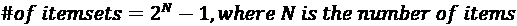

在我们的数据集中有超过 3,000 个商品，检查所有可能的项集是不切实际的，因为有 2³⁶⁸⁴-1 个项集需要检查。这就是 Apriori 算法发挥作用的地方。直观地说，交易频率低或支持度低的商品或项集在结果中可能价值较低。因此，Apriori 算法提取了被认为足够频繁的项集，这些项集由预定义的支持度阈值确定。

要使用 Apriori 算法找到频繁项集，我们需要将 DataFrame 转换成一种矩阵形式，其中每一行代表客户，每一列代表商品或产品。看看以下代码：

```py
customer_item_matrix = df.pivot_table(
    index='CustomerID',
    columns='StockCode',
    values='Quantity',
    aggfunc='sum'
) 
```

在这里，我们使用`pivot_table`函数来创建一个客户到商品的矩阵，每个值将代表每个客户购买的商品的总数量。有了这个客户到商品的矩阵，我们可以使用以下代码运行 Apriori 算法来找到频繁项集：

```py
from mlxtend.frequent_patterns import apriori
frequent_items = apriori(
    customer_item_matrix,
    min_support=0.03,
    use_colnames=True
)
frequent_items["n_items"] = frequent_items["itemsets"].apply(
lambda x: len(x)
) 
```

如此代码所示，我们正在使用 `mlxtend` 包中的 `apriori` 函数。我们使用 `min_support` 参数定义每个项集所需的最低支持为 `0.03`，这意味着我们将忽略那些在交易中发生次数少于 3% 的项集。然后，我们添加一个名为 `n_items` 的列，它简单地计算每个项集中的项目数量。

最终的 DataFrame 看起来如下所示：


图 7.1：频繁项 DataFrame

如果您还记得，项集的可能组合总数是 2³⁶⁸⁴-1。然而，正如您从应用 Apriori 算法的结果中可以看到的，我们现在有 1,956 个项，这是一个可管理的合理数量的项集，我们可以检查其关联规则。

## 关联规则

使用我们构建的频繁项集，我们现在可以生成关联规则，这些规则将告诉我们哪些项集经常一起购买。请看以下代码：

```py
from mlxtend.frequent_patterns import association_rules
rules = association_rules(
    frequent_items,
    metric="confidence",
    min_threshold=0.6,
    support_only=False
) 
```

在这里，我们使用 `mlxtend` 包中的 `association_rules` 函数。有几个关键参数需要考虑：

+   `metric`：此参数定义了用于选择关联规则要使用的指标。在这里，我们使用 `confidence` 来选择具有高 confidence 的关联规则，但如果您对找到具有高 lift 的规则感兴趣，也可以使用 `lift`。

+   `min_threshold`：此参数定义了基于您选择的指标选择关联规则的阈值。在这里，我们只对找到 confidence 超过 60% 阈值的规则感兴趣。

+   `support_only`：如果您只对计算规则的 support 感兴趣，或者由于某些数据缺失而无法计算其他指标，可以将此参数设置为 `True`。在这里，我们将其设置为 `False`，因为我们对找到具有高 confidence 的规则感兴趣。

这些规则的输出应如下所示：

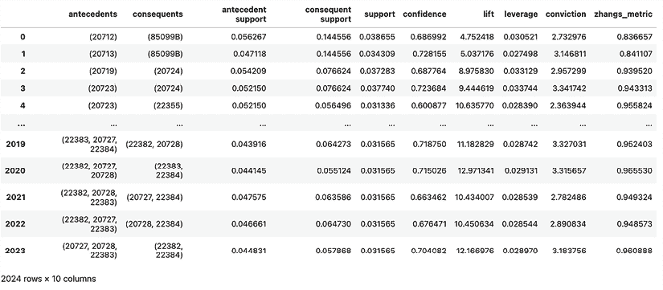

图 7.2：基于 confidence 超过 60% 的关联规则

关联规则输出包含先行项、后续项和关键指标，例如 `support`、`confidence` 和 `lift`。您可以按每个指标排序，并生成关于哪些项集具有紧密关系的见解。例如，您可能希望找到具有最高 lift 的前 20 个项集或具有最高 confidence 的前 10 个项集。您还可以可视化这些关系，以便您可以轻松查看关系及其强度。请看以下代码：

```py
most_lift = rules.sort_values(
    by="lift", ascending=False
).head(20).pivot_table(
    index='antecedents',
    columns='consequents',
    values='lift',
    aggfunc='sum'
)
most_lift.index = [
    " + ".join([
        df.loc[df["StockCode"] == item]["Description"].unique()[0]
        for item in list(x)
    ]) for x in most_lift.index
]
most_lift.columns = [
    " + ".join([
        df.loc[df["StockCode"] == item]["Description"].unique()[0]
        for item in list(x)
    ]) for x in most_lift.columns
] 
```

在这里，我们首先使用 `sort_values` 函数选择具有最高 lift 的前 20 个规则。然后，我们将表格进行转置，使得每一行是先行项，每一列是后续项，单元格的值是 lift。可以使用热图轻松可视化这些规则的强度。以下代码可以用于可视化这 20 个具有最高 lift 的规则：

```py
ax = plt.subplot()
sns.heatmap(
    most_lift,
    annot=True,
    annot_kws={"size": 6},
    # fmt=".1f",
    ax=ax
)
ax.set_title("Top 20 Rules by Lift")
ax.set_xlabel("Consequent")
ax.set_ylabel("Antecedent")
ax.yaxis.set_ticklabels(list(most_lift.index), fontsize=6)
ax.xaxis.set_ticklabels(list(most_lift.columns), fontsize=6)
plt.show() 
```

这将生成如下所示的热图：

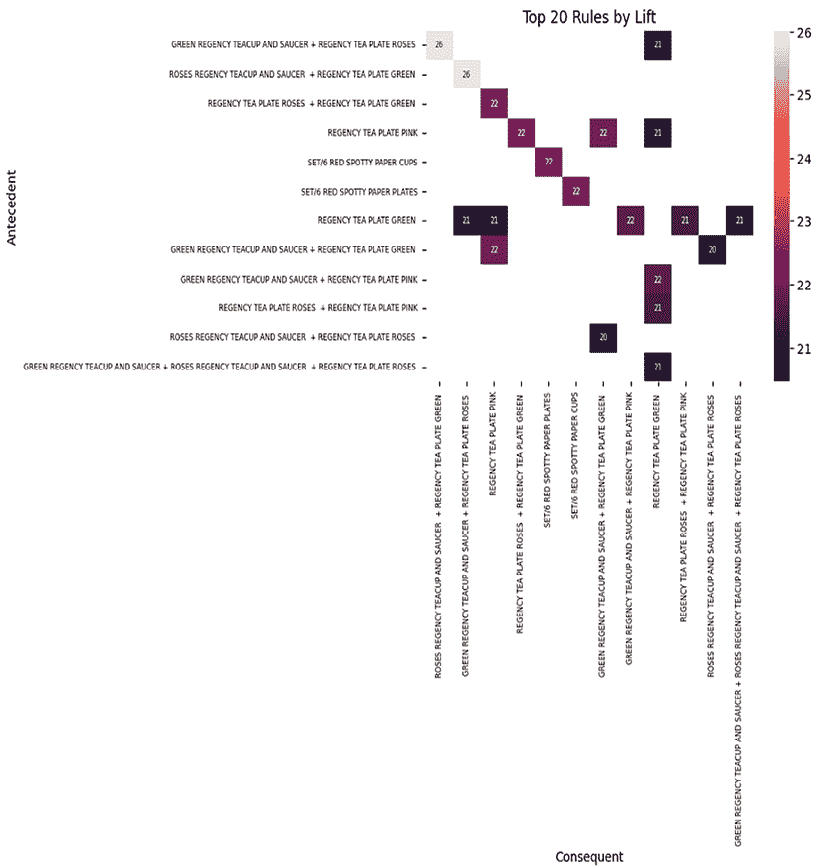

图 7.3：具有最高升力的前 20 个关联规则

在这个图表中，颜色越浅，给定规则的升力就越高。例如，当前提项目集是`GREEN REGENCY TEACUP AND SAUCER`、`REGENCY TEA PLATE ROSES`，而结果项目集是`ROSES REGENCY TEACUP AND SAUCER`、`REGENCY TEA PLATE GREEN`时，升力约为 26，是最高的。另一方面，当前提项目集是`ROSES REGENCY TEACUP AND SAUCER`、`REGENCY TEA PLATE ROES`，而结果项目集是`GREEN REGENCY TEACUP AND SAUCER`、`REGENCY TEA PLATE GREEN`时，升力约为 20，是前 20 条规则中最低的。

从这个例子中可以看出，通过关联规则，我们可以轻松地找出哪些产品是共同购买的，以及它们之间的关系。这可以用于个性化营销，根据这些规则推荐某些产品。如果一个客户购买了项目集 A，那么自然可以推荐项目集 B，因为关联规则表明 A 和 B 经常一起购买，具有显著性。这比在营销信息中盲目推荐随机产品集，希望客户对购买它们表示兴趣，更接近一步推荐个性化的产品集。

最后，如果你还记得，升力与置信度呈线性关系，与支持度呈反向关系，因为升力定义为：

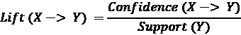

这个关系可以通过我们用`mlxtend`包找到的规则轻松展示。看看下面的代码：

```py
fig = plt.figure()
ax1 = fig.add_subplot(111)
ax2 = ax1.twiny()
rules[["support","lift"]].plot(
    kind="scatter", x="support", y="lift", ax=ax1
)
rules[["confidence","lift"]].plot(
    kind="scatter", x="confidence", y="lift", ax=ax2, color="orange", alpha=0.3
)
ax1.legend(["lift vs. support",], loc="upper right")
ax2.legend(["lift vs. confidence",], loc="upper left")
plt.grid()
plt.show() 
```

在这里，y 轴上有升力值，x 轴上有支持度和置信度值。图表将如下所示：

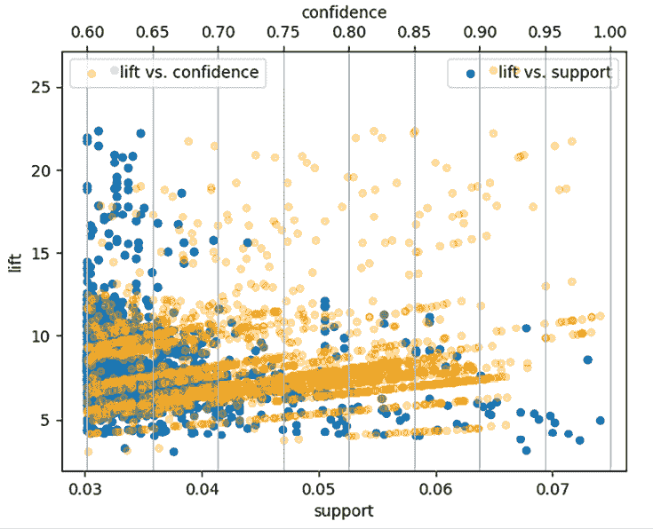

图 7.4：升力与置信度以及升力与支持之间的关系

从这个图表中可以看出，x 轴的顶部显示了置信度值，升力与置信度的散点图显示了一种线性关系，即随着置信度值的增加，升力值也增加。另一方面，x 轴的底部显示了支持度值，升力与支持度的散点图显示了一种反向关系，即随着支持度值的增加，升力值减少。

# 协同过滤

在构建推荐系统中有各种方法，通常有多种方法参与其中。在构建推荐系统中，一些常用的基于 AI/ML 的方法包括：

+   **协作过滤**：这种方法使用之前用户的行为，如他们查看的页面、购买的产品或之前给出的评分。该算法利用这类数据来找到与用户之前表示兴趣的产品或内容相似的产品或内容。例如，如果用户在流媒体平台上观看了几部惊悚电影，可能会向这位用户推荐其他一些惊悚电影。或者，如果一位客户在电子商务平台上购买了连衣裙衬衫和连衣裙鞋，可能会向这位客户推荐连衣裙裤。协作过滤算法通常基于用户或项目之间的相似性构建：

    +   **基于用户的**协作过滤使用数据来根据之前查看的页面或购买的产品找到相似的用户。

    +   **基于项目的**协作过滤使用数据来寻找经常一起购买或查看的项目。

+   **基于内容的过滤**：正如其名所示，这种方法使用产品、内容或用户的特征。协作过滤算法侧重于用户到用户或项目到项目的相似性，而基于内容的过滤算法侧重于特征相似性，例如流派、关键词和元数据。例如，如果你正在推荐观看的电影，这种方法可能会查看电影的描述、流派或演员，并推荐那些符合用户偏好的电影。另一方面，如果你正在推荐时尚商品，那么这种方法可能会查看产品类别、描述和品牌，以向用户推荐某些商品。

+   **预测建模**：如第六章所述，也可以为推荐系统构建预测模型。用户之前查看的内容、他们购买的产品或网页会话历史可以作为识别用户很可能感兴趣查看或购买的项目特征。这些预测模型的概率输出可以用来对项目进行排序，以便在显示其他不太可能的项目之前向用户展示更可能的项目。

+   **混合模型**：通常，推荐系统会结合之前提到的所有方法来构建。将不同的推荐方法混合使用可以帮助提高推荐准确性，这是单一方法推荐系统可能遗漏的。

在本章中，我们将重点关注**协同过滤**算法，因为它作为许多推荐系统常用的骨干算法，并且更具体地，我们将探讨如何使用基于用户的协同过滤和基于商品的协同过滤算法来构建推荐系统。这种技术在推荐系统中经常被使用，因为它以非常直观的方式很好地捕捉了用户和商品之间的交互。许多在业务中推荐至关重要的组织，如 Netflix、Amazon 和 Spotify，都将协同过滤算法作为其推荐系统的一部分。

协同过滤算法的关键是找到相似的用户或商品。可以有多种度量标准来衡量用户或商品之间的相似性，例如欧几里得距离、曼哈顿距离或 Jaccard 距离。然而，余弦相似度是协同过滤中最常用的相似性度量之一，因为它更多地关注距离的定向相似性，而不是距离的大小。

**余弦相似度**简单地说就是两个向量之间角度的余弦值。在这里，向量可以是协同过滤算法中的用户向量或商品向量。由于余弦相似度在高维空间中具有优势，它通常被选为协同过滤算法的距离度量。计算两个向量之间余弦相似度的方程如下：

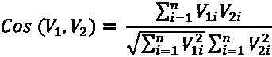

在这个方程中，*V*[1][i]和*V*[2][i]代表每个向量中的每个商品，这些向量可以是用户向量或商品向量。这些余弦相似度值介于-1 和 1 之间。如果两个向量相似，余弦相似度值将接近 1；如果两个向量独立，则余弦相似度值将为 0；如果两个向量是相反向量，则余弦相似度值将接近-1。

要构建协同过滤算法，我们首先需要构建客户-商品矩阵。我们将使用与市场篮子分析相同的代码，如下所示：

```py
customer_item_matrix = df.pivot_table(
    index='CustomerID',
    columns='StockCode',
    values='Quantity',
    aggfunc='sum'
) 
```

如前所述，这个矩阵显示了每个客户（行）为每个商品（列）购买的量。我们不是使用商品购买的原始数量，而是将要使用独热编码，使得如果某个客户购买了某个商品，则值为 1，如果没有购买，则值为 0，如下面的代码所示：

```py
customer_item_matrix = customer_item_matrix.map(
    lambda x: 1 if x > 0 else 0
) 
```

`customer_item_matrix`矩阵应该看起来像下面这样：

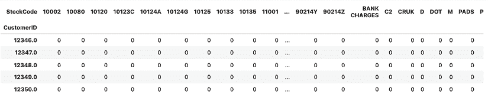

图 7.5：客户-商品矩阵

如预期的那样，每一行代表一个特定用户是否购买了每个商品。这个矩阵将成为我们在以下章节中构建基于用户协同过滤和基于商品协同过滤算法的基础矩阵。

## 基于用户的协同过滤

构建基于用户的协同过滤模型的第一步是构建相似用户矩阵。看看下面的代码：

```py
from sklearn.metrics.pairwise import cosine_similarity
user_user_sim_matrix = pd.DataFrame(
    cosine_similarity(customer_item_matrix)
)
user_user_sim_matrix.columns = customer_item_matrix.index
user_user_sim_matrix['CustomerID'] = customer_item_matrix.index
user_user_sim_matrix = user_user_sim_matrix.set_index('CustomerID') 
```

如果你还记得，余弦相似度度量是协同过滤算法中最常用的相似度指标之一。在这里，我们使用 scikit-learn 包的`cosine_similarity`函数来计算用户之间的余弦相似度。新创建的变量`user_user_sim_matrix`将是一个矩阵，其中每一行和每一列代表一个用户，以及两个用户之间的相似度。

看看下面的示例：

```py
user_user_sim_matrix.loc[
    [12347.0, 12348.0, 12349.0, 12350.0, 12352.0],
    [12347.0, 12348.0, 12349.0, 12350.0, 12352.0]
] 
```

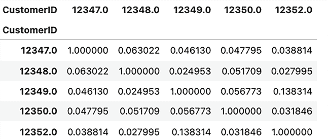

图 7.6：用户之间的相似性样本

这个示例显示了用户之间的余弦相似度指标。正如预期的那样，对角线上的值是 1，因为它们代表用户与其自身的相似度。例如，用户`12349`和`12350`的余弦相似度约为`0.057`，而用户`12349`和`12352`的余弦相似度为`0.138`。这表明用户`12349`与用户`12352`的相似度高于与用户`12350`的相似度。这样，你可以通过用户与目标用户的相似度来识别和排名用户。

让我们选择一个客户来看看我们如何可能构建一个推荐系统。我们将选择用户 ID`14806`作为这个练习的示例：

```py
TARGET_CUSTOMER = 14806.0
print("Similar Customers to TARGET")
user_user_sim_matrix.loc[
TARGET_CUSTOMER
].sort_values(ascending=False).head(10) 
```

在这里，我们通过在`user_user_sim_matrix`矩阵中选择`TARGET_CUSTOMER`并按降序排序值，选择具有最高余弦相似度测量的前 10 个用户。输出应如下所示：

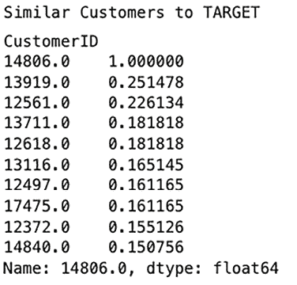

图 7.7：与目标客户相似的客户

在这里，你可以看到客户`13919`与目标客户`14806`最相似，客户`12561`排在第二位，客户`13711`排在第三位。

### 通过最相似客户进行推荐

向目标客户推荐产品的最简单方法就是查看目标客户已经购买的商品，并将它们与最相似客户`13919`进行比较。然后，推荐目标客户尚未购买但最相似客户已经购买的商品。这是基于之前的讨论，即相似的客户可能具有相似的行为或兴趣，并且他们可能购买相似的产品。

要做到这一点，我们可以遵循以下步骤：

1.  我们将首先找出目标客户已经购买的商品，使用以下代码：

    ```py
    items_bought_by_target = set(
        df.loc[
            df["CustomerID"] == TARGET_CUSTOMER
        ]["StockCode"].unique()
    ) 
    ```

这将获取目标客户购买的所有商品，并将它们存储在`items_bought_by_target`变量中。

1.  接下来，我们需要获取与最相似客户`13919`购买的所有商品。看看下面的代码：

    ```py
    items_bought_by_sim = set(
        df.loc[
            df["CustomerID"] == 13919.0
        ]["StockCode"].unique()
    ) 
    ```

这将找出最相似客户`13919`购买的所有商品，并将它们存储在`items_bought_by_sim`变量中。

1.  使用`set`操作，很容易找出最相似客户购买但目标客户未购买的商品，如下所示代码所示：

    ```py
    items_bought_by_sim_but_not_by_target = items_bought_by_sim - items_bought_by_target 
    ```

如您所见，我们只是从`items_bought_by_target`集合中减去另一个集合`items_bought_by_sim`，这将得到所有目标客户尚未购买但最相似客户已购买的商品，并将它们存储在`items_bought_by_sim_but_not_by_target`中。

1.  我们可以使用以下代码获取这些商品的详细信息：

    ```py
    df.loc[
        df["StockCode"].isin(items_bought_by_sim_but_not_by_target)
    ][["StockCode", "Description"]].drop_duplicates() 
    ```

此输出应如下所示：

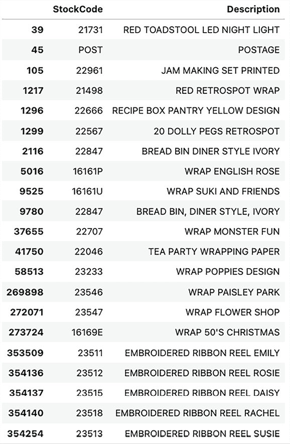

图 7.8：推荐给目标客户的项目

这是购买但尚未被目标客户购买的最相似客户`13919`购买的商品及其描述列表。在推荐产品的最简单方法中，此列表可以显示给目标客户作为推荐商品。

由于这两个客户在过去购买相似商品时表现出相似的兴趣，因此目标客户购买这些商品的可能性比随机选择产品要高。您可以为每个客户应用相同的流程，并根据最相似客户的购买历史构建推荐产品集合。

### 根据相似客户购买的前列产品进行推荐

另一种方法是按照最相似客户购买产品的频率来对产品进行排名。

我们可以从以下代码开始：

```py
top10_similar_users = user_user_sim_matrix.loc[
    TARGET_CUSTOMER
].sort_values(
    ascending=False
).head(11).to_dict()
potential_rec_items = {}
for user, cos_sim in top10_similar_users.items():
    if user == TARGET_CUSTOMER:
        continue

    items_bought_by_sim = list(set(
        df.loc[
            df["CustomerID"] == user
        ]["StockCode"].unique()
    ))
    for each_item in items_bought_by_sim:
        if each_item not in potential_rec_items:
            potential_rec_items[each_item] = 0
        potential_rec_items[each_item] += cos_sim
potential_rec_items = [(key, val) for key, val in potential_rec_items.items()]
potential_rec_items = sorted(
    potential_rec_items, key=lambda x: x[1], reverse=True
) 
```

在这里，我们首先通过余弦相似度得到前 10 个最相似客户。然后，对于每个相似客户，我们遍历那些由相似客户购买但目标客户未购买的商品。我们计算相似客户购买指定产品的次数，按购买频率降序排序，并将结果存储在`potential_rec_items`变量中。结果应如下所示：

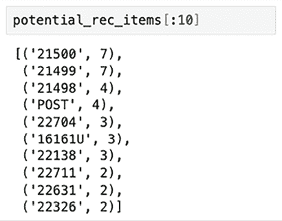

图 7.9：相似客户购买的前列产品

这表明 10 个客户中有 7 个购买了`21500`和`21499`产品，10 个客户中有 4 个购买了`21498`和`POST`产品，等等。我们可以通过以下代码查询从这些产品 ID 获取产品描述：

```py
top_10_items = [x[0] for x in potential_rec_items[:10]]
df.loc[
    df["StockCode"].isin(top_10_items)
][["StockCode", "Description"]].drop_duplicates().set_index(
    "StockCode"
).loc[top_10_items] 
```

此输出应如下所示：

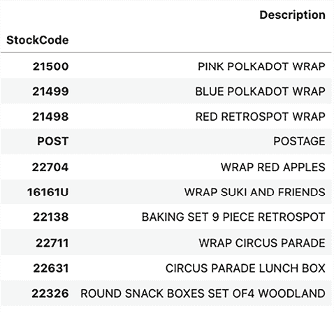

图 7.10：相似客户购买的前列产品

然而，这种方法并没有考虑到每个客户与目标客户之间的相似度或差异度。它只是对每个产品的前 10 个相似客户进行了计数，并基于简单的总和进行推荐。

由于我们为前 10 个相似客户中的每一个都设置了相似度度量，因此在我们推荐产品时，我们也可能想要考虑这一点。我们不仅可以进行简单的计数，还可以进行加权计数。请看以下代码：

```py
potential_rec_items = {}
for user, cos_sim in top10_similar_users.items():
    if user == TARGET_CUSTOMER:
        continue

    items_bought_by_sim = list(set(
        df.loc[
            df["CustomerID"] == user
        ]["StockCode"].unique()
    ))
    for each_item in items_bought_by_sim:
        if each_item not in potential_rec_items:
            potential_rec_items[each_item] = 0
        potential_rec_items[each_item] += cos_sim
potential_rec_items = [(key, val) for key, val in potential_rec_items.items()]
potential_rec_items = sorted(
    potential_rec_items, key=lambda x: x[1], reverse=True
) 
```

如您可能注意到的，与之前的代码不同的是`potential_rec_items[each_item] += cos_sim`。我们不再只是计数，现在我们正在添加一个余弦相似度指标，该指标衡量每个客户与目标客户相似或不同的程度。

当我们根据余弦相似度查询前 10 个物品时，结果如下所示：

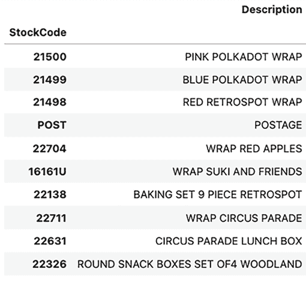

图 7.11：类似客户购买的前列产品（按余弦相似度加权）

在这个例子中，简单计数的结果与加权计数的结果相同。您不仅可以做余弦相似度的加权求和，还可以做加权平均。您还有许多其他方法可以聚合分数并推荐产品，所以富有创意是构建最终推荐输出的关键，这个输出是基于余弦相似度度量的。

如您从这些示例中可以看到，我们可以构建基于过去表现出相似行为的客户的产品集进行推荐。通常情况下，有相似口味的人会购买相似的商品，所以当根据客户群中的相似性推荐产品时，基于用户的协同过滤效果很好。除了基于客户相似性进行推荐外，我们还可以根据单个物品与其他物品的相似性进行推荐。在下一节中，我们将讨论如何基于物品的协同过滤构建推荐系统。

## 基于物品的协同过滤

与基于用户的协同过滤的情况一样，构建基于物品的协同过滤算法的关键起点是构建一个物品-物品相似度矩阵。从我们之前构建的客户-物品矩阵中，我们可以使用以下代码来构建一个物品-物品相似度矩阵：

```py
item_item_sim_matrix = pd.DataFrame(
    cosine_similarity(customer_item_matrix.T)
) 
```

如此代码所示，我们首先转置客户-物品矩阵，`customer_item_matrix`，这将使其成为一个物品-客户矩阵，其中每一行是一个物品，每一列是一个客户，每个值是 0 或 1，表示给定列是否购买了给定物品。然后，我们使用`cosine_similarity`函数计算余弦相似度，并将结果保存为名为`item_item_sim_matrix`的 pandas DataFrame 变量。

结果应该看起来像以下这样：

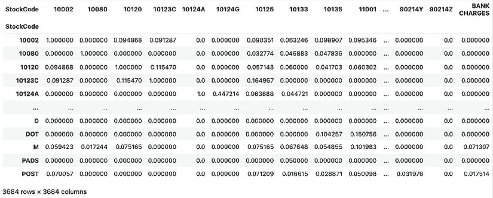

图 7.12：物品-物品相似度矩阵

### 根据最相似物品进行推荐

基于项目相似性生成推荐的最简单方法是为给定项目找到最相似的项目并推荐它们。当一个人查看某个产品时，您想展示相关或相似的项目，可以使用这种方法。例如，当您在亚马逊上搜索产品并点击搜索页面上的某个产品时，亚马逊将在页面底部显示经常一起购买的相关或相似项目。这就是基于项目的协同过滤可以发挥作用的地方，更具体地说，当您想根据一个给定的产品推荐产品时。

使用我们的示例数据集，假设一位客户正在查看一个产品，“中号陶瓷顶盖储物罐”，其产品代码为`23166`。从我们刚刚构建的项目到项目矩阵`item_item_sim_matrix`中，我们可以使用以下代码找到最相似的 10 个项目：

```py
most_similar_items = item_item_sim_matrix.loc[
    "23166"
].sort_values(ascending=False).head(10) 
```

如您在这段代码中所见，我们通过按余弦相似度降序排列项目来选择最相似的 10 个项目。输出结果应如下所示：

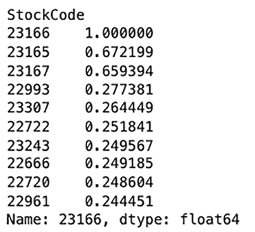

图 7.13：与产品 23166 最相似的 10 个项目

我们也可以根据这些产品代码查询描述，如下所示：

```py
rec_items = [
    x for x in most_similar_items.index if x != "23166"
]
df.loc[
    df['StockCode'].isin(rec_items),
    ['StockCode', 'Description']
].drop_duplicates().set_index('StockCode').loc[rec_items] 
```

如您所见，我们排除了产品`23166`，因为它是要查看的目标项目或客户当前查看的项目，并展示了其余的 10 个最相似的项目。输出结果应如下所示：

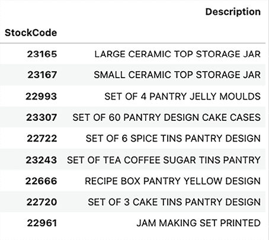

图 7.14：包括自身在内的与产品 23166 最相似的 10 个项目

如您所想象，当客户查看目标产品时，我们可以在页面上展示这 10 个项目，包括它本身。这样，我们展示了最相似或最常一起购买的项目，以便客户有更多选择或更多商品可以购买。

### 根据购买历史推荐

在之前基于单个项目推荐产品的例子基础上，我们还可以为多个项目构建基于项目的协同过滤推荐系统。特别是当您可能正在发送营销邮件或新闻通讯时，您可能希望随邮件或通讯发送产品推荐。在这种情况下，考虑客户的购买历史将很有用，例如他们购买过哪些产品，他们在线查看过哪些产品页面，或者他们放入购物车中的产品。使用这些信息，我们可以利用基于项目的协同过滤算法为每位客户构建个性化的产品推荐，这些推荐对每位客户都是不同的。

以我们的示例数据集为例，假设一位客户购买了三个产品，产品代码分别为`23166`、`22720`和`23243`。在我们的数据集中，这些项目是“3 个蛋糕托盘储物设计套装”、“中号陶瓷顶盖储物罐”和“茶咖啡糖罐储物套装”。您可以使用以下代码为这些项目获取最相似的 10 个项目：

```py
item_item_sim_matrix[[
    "23166", "22720", "23243"
]].mean(axis=1).sort_values(
    ascending=False
).head(10) 
```

如您从以下代码中看到的，我们查询了客户购买的那 3 个物品的物品到物品矩阵，并计算了余弦相似度的平均值。然后，我们将这些平均值按降序排序，以获取给定 3 个物品的最相似的前 10 个物品。输出应如下所示：

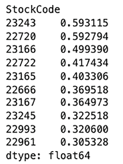

图 7.15：与给定 3 个物品最相似的 10 个物品

排除已经购买的商品，产品`22722`排在第一位，是与给定项目集最相似的物品，其次是`23165`。我们可以查询数据以获取这些最相似的前 10 个物品的产品描述。请看以下代码：

```py
rec_items = [
    x for x in item_item_sim_matrix[[
        "23166", "22720", "23243"
    ]].mean(axis=1).sort_values(ascending=False).head(13).index
    if x not in ["23166", "22720", "23243"]
]
df.loc[
    df['StockCode'].isin(rec_items),
    ['StockCode', 'Description']
].drop_duplicates().set_index('StockCode').loc[rec_items] 
```

在这里，我们从推荐列表中排除了客户已经购买的那 3 个物品，并检索了与这 3 个物品最相似或最常一起购买的顶级 10 个物品。此查询的输出应如下所示：

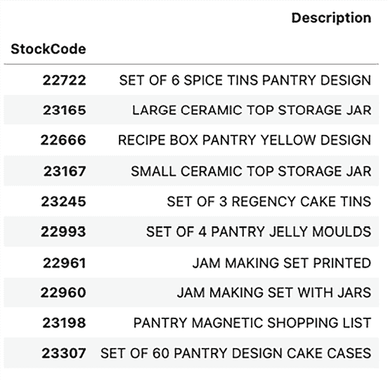

图 7.16：与给定 3 个物品最相似的 10 个物品

如您所想，这些基于物品协同过滤算法结果的产品推荐可以用于任何营销活动。如果您正在构建电子邮件营销活动，您可以使用这个基于物品的协同过滤算法来选择基于先前购买、页面浏览或购物车项目的前相似产品，并将它们作为营销电子邮件的一部分。您还可以在网页上设置弹出窗口，以便当用户下次登录您的在线页面时使用。对这些商品提供折扣或其他促销活动也可以提高转换率。

您可以以多种方式应用基于用户和基于物品的协同过滤来构建推荐系统。随着您在推荐系统中的进展，跟踪您的推荐表现并调整您对它们的使用方式将是明智的。您很可能会想要跟踪您推荐的项目中有多少已经转换。

如在第二章中讨论 KPI 时所述，跟踪推荐项目中的转换和其他 KPI 可以告诉您您的推荐系统的有效性以及哪种方法更有效。

# 其他常用的推荐方法

我们已经深入讨论了市场篮子分析和协同过滤来构建个性化推荐系统。然而，还有许多其他方法可以构建这些推荐系统。如前所述，一些常见的基于 AI/ML 的方法是关联规则和协同过滤算法，这些我们在本章中已经介绍；预测建模方法也经常被使用，如今，所有这些方法的混合是构建更全面的推荐系统的典型方法。

不仅存在 AI/ML 驱动的推荐系统方法，还可以有各种其他方式来推荐产品或内容，甚至无需使用 AI/ML。以下是一些常用的推荐方法：

+   **畅销书或热门观看**：正如其名所示，基于畅销产品或最常观看的内容的推荐仍然被频繁使用。这有助于新用户或客户通过轻松查看他人查看或购买最多的内容来熟悉您的产品或平台。这也可以是构建您的入门级营销内容的好方法。

+   **趋势**：与畅销书类似，趋势商品显示了在特定时刻流行的内容。可能会有一些事件，例如某些地区的灾难、特定时刻的突发新闻或社区周围的假日活动，这些事件会偶尔激发客户的兴趣。对这些事件进行调整是明智的，因为这些特殊事件会触发某些客户行为，并且可以成为极佳的营销机会。

+   **新品上市**：作为营销人员，您很可能不想错过推广新产品的机会。现有客户或新客户通常会被新品吸引，这可以是一个很好的营销机会，以保留现有客户，同时吸引新客户。通过向对类似商品表示过兴趣的客户推荐新品，营销活动可以取得巨大成功。

+   **促销**：您不仅可以根据流行度或相关性推荐产品或内容，还可以推荐正在促销的产品或内容。客户通常会被特别优惠所吸引，您希望尽可能积极地展示和营销特别促销。这些是清理过剩库存、提高品牌知名度、吸引新客户和保留不活跃客户的好方法。

正如您所看到的，您可以在利用 AI/ML 驱动的技术基础上，以多种方式构建推荐系统。鉴于竞争环境和全球范围内几乎所有企业进行的营销活动丰富多样，仅使用一种方法来推荐产品或内容不太可能取得成功。您拥有的推荐系统越全面，您在吸引和保留客户方面就越成功。在设计推荐系统时，明智的做法是考虑本章中提到的所有方法，并在适当的时间和地点应用它们。

# 摘要

在本章中，我们讨论了构建个性化产品推荐系统。首先，我们讨论了如何通过分析哪些项目集经常一起购买来识别产品之间的关系。我们介绍了如何使用 Apriori 算法和关联规则在 Python 中进行市场篮子分析。然后，我们深入探讨了构建推荐系统的一种 AI/ML 驱动方法。我们看到了如何使用基于用户和基于物品的协同过滤算法来识别相似的用户或物品以及经常一起购买的产品。反过来，这些发现可以用来推荐其他客户很可能感兴趣并购买的产品。最后，我们讨论了可用于推荐产品和内容的各种其他方法。我们展示了如何结合非 AI/ML 方法可以导致一个更全面和多样化的推荐系统。

在下一章中，我们将继续讨论个性化的精准营销努力。更具体地说，我们将探讨如何在 Python 中进行客户细分，以及为什么深入了解您客户群中不同的客户细分有助于并影响您营销活动的成功与失败。

# 加入我们书籍的 Discord 空间

加入我们的 Discord 社区，与志同道合的人相聚，并在以下超过 5000 名成员的陪伴下学习：

[`packt.link/genai`](https://packt.link/genai)


