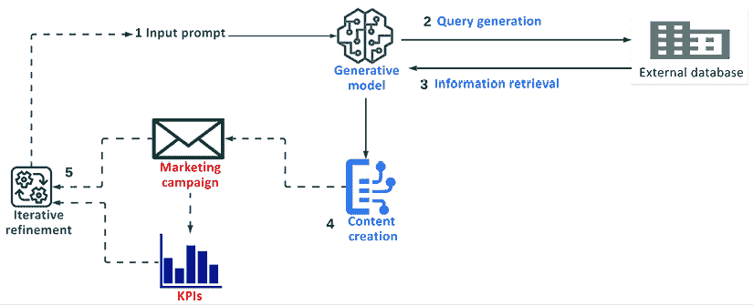
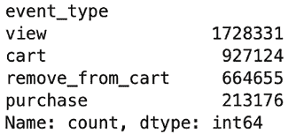
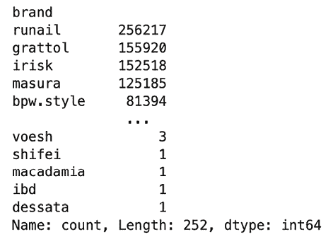
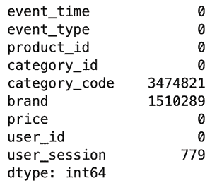
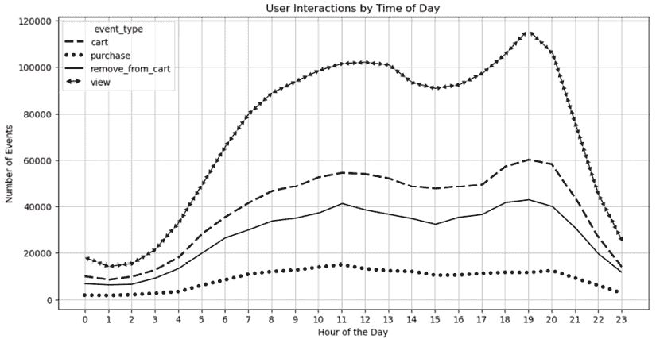
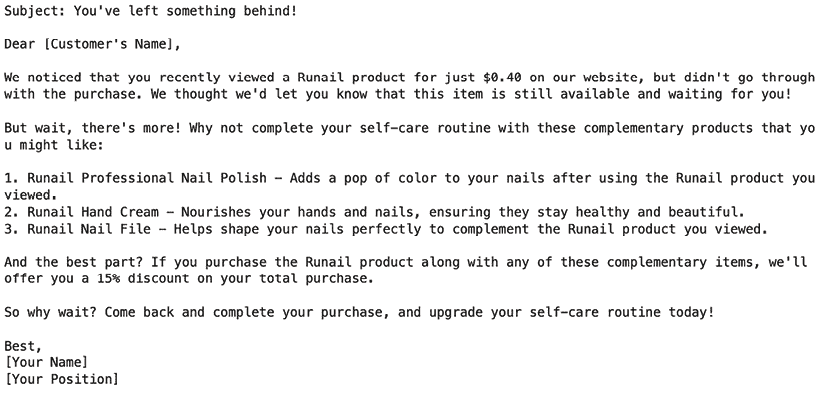
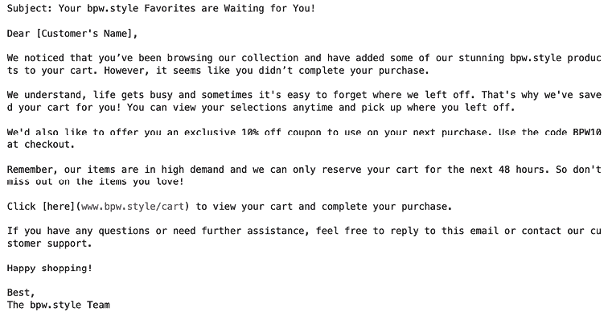

# 第十一章：基于检索增强生成的微目标

本章介绍了**检索增强生成**（**RAG**）的高级功能及其在精准营销中的战略应用，这是在前两章讨论的**零样本学习**（**ZSL**）和**少样本学习**（**FSL**）的基础上建立的。与 ZSL 不同，ZSL 在无先验示例的情况下运行，而 FSL 依赖于最小数据集，RAG 利用实时检索系统来增强生成模型，使其能够访问和纳入最最新和最具体的信息。这种能力使 RAG 能够超越 ZSL 和 FSL 的限制，提供针对个人消费者档案或当前市场状况的个性化内容——这对于营销中的微目标至关重要。

本章将详细阐述 RAG 的操作框架，强调其混合结构，该结构将生成式 AI 与动态信息检索相结合。这种综合不仅确保了生成符合上下文和准确的内容，还引入了一种以前仅通过 ZSL 或 FSL 单独使用无法实现的程度上的个性化。我们将探讨 RAG 的实时数据检索组件如何通过以一个多产品电子商务平台的消费者交互数据为例，迅速调整营销策略以适应消费者行为和偏好，从而发挥关键作用。

到本章结束时，你将具备以下知识：

+   理解 RAG 与传统生成模型的集成及其在处理实时、相关数据方面的优越性，与 ZSL 和 FSL 相比。

+   认识到 RAG 在微目标和个性化内容方面的增强能力，这可以显著提高消费者参与度和转化率。

+   将 RAG 概念应用于开发前沿的营销策略，这些策略不仅数据驱动，而且能够高度适应消费者的细微差别。

# RAG 在精准营销中的介绍

生成模型，尤其是那些在**生成预训练转换器**（**GPT**）等转换器框架上开发的模型，已经彻底改变了机器理解和生成类似人类文本的方式。这些模型在庞大的文本数据语料库上训练，能够学习语言的复杂模式和结构，从而能够预测和生成连贯且符合上下文的文本序列。然而，尽管这些模型非常复杂，纯生成模型通常缺乏将实时、特定信息纳入其训练数据的能力。

这就是 RAG 的“检索”组件发挥作用的地方。RAG 是**生成式人工智能**（**GenAI**）与信息检索系统的融合，形成一个旨在提高生成内容质量和相关性的混合模型。RAG 通过在生成过程中结合动态检索组件，从外部数据集或知识库中检索相关信息来实现这一点。RAG 中的检索系统旨在查询结构化或非结构化数据库，以获取与生成任务上下文相关的信息。这种方法确保生成模型能够访问最新和最相关的数据，以增强其生成内容的准确性和相关性。

## RAG 是如何工作的

除了增强内容的相关性之外，RAG（Retrieval-Augmented Generation）还实现了生成模型和外部数据库之间信息的双向流动。如图 11.1 所示，RAG 的过程可以分解为几个关键步骤，每个步骤都将进一步讨论：



图 11.1：RAG 工作流程的关键组件

让我们进一步探讨这些步骤：

1.  **输入提示**：在这一步中，生成模型被输入用户的输入提示或当前的（微调的）生成上下文。

1.  **查询生成**：最初，生成模型根据第 1 步中提供的输入生成一个查询。这个查询被编写来从知识库中检索最相关的信息。生成模型和外部数据库之间的这种双向信息流动促进了共生关系，丰富了数据利用和模型性能。

1.  **信息检索**：在第 3 步中，查询被检索系统处理，该系统通过数据库搜索以找到匹配项或密切相关信息。这个系统的复杂性可能有所不同，从简单的基于关键词的搜索到更复杂的理解语义意义的神经网络模型。检索到的数据随后将在下一步整合到内容生成过程中。

1.  **内容生成**：在第 4 步中，生成模型利用检索到的数据，将其纳入其持续的文字生成过程中。这一步至关重要，因为它涉及到将新检索到的数据与生成内容混合，以保持连贯性和流畅性。这种内容可能成为上述示例中营销活动等倡议的基础。

1.  **迭代优化**：通常，这个过程是迭代的，生成模型根据已生成内容和需要生成的内容之间的反馈循环调整查询。这体现在第 5 步中，迭代优化循环确保根据如营销 KPI 或客户反馈等反馈持续调整和优化生成过程。

接下来，我们将从数学角度讨论查询生成和检索步骤的工作原理。

## RAG 检索的数学模型

RAG 的数学模型捕捉了文档查询与其检索组件之间的关系（分别对应于 *图 11.1* 中的步骤 2 和 3），为其动态内容生成过程奠定了基础。在其核心，RAG 结合概率框架将文本生成与信息检索相结合，这可以通过量化给定输入和检索到的文档生成文本中涉及的概率的方程来表示。

该过程始于生成模型根据输入提示或持续上下文创建查询 *q*。同时，检索系统处理此查询以从数据库中检索相关文档。检索过程受一个概率模型控制，该模型根据查询 *q* 估计数据库中每个文档的相关性。这种估计包括诸如语义相似性和文档新鲜度等因素，确保检索到的信息与生成任务的上下文紧密一致。从数学上讲，给定查询 *q* 从数据库中选择文档 *r* 的概率可以表示为：


其中 *D* 代表数据库中所有可能的文档集合，而 *score(q,r)* 是一个计算文档 *r* 对查询 *q* 相关性的函数。该评分函数通常通过训练学习，可能涉及复杂的嵌入，这些嵌入可以捕捉查询与文档之间的语义相似性。方程中的分母确保从数据库中选择任何文档的概率之和为 `1`。

现在我们已经了解了模型的工作原理，让我们讨论外部数据在 RAG 系统中的关键重要性。

## 数据在 RAG 中的重要性

外部数据是 RAG 框架的基石，影响着生成内容的质量和信息检索的准确性。在营销领域，精确性和相关性直接关联着消费者参与度和转化率，因此，在 RAG 系统中正确应用和管理数据变得至关重要。检索框架中嵌入的两个基本组件值得深入探讨，并且由于它们对结果的影响深远，应优先考虑：

+   **数据新鲜度**：保持数据更新使模型能够利用当前趋势、事件和行为，从而增强消费者参与度。

+   **数据特定性**：通过整合详细的消费者数据，内容可以精确地针对个人偏好和行为进行定制。这种特定性不仅增加了营销信息的相关性，还可以显著提高转化率。

现在我们来详细探讨这些概念。

### 数据新鲜度

在实际意义上，数据新鲜度意味着系统持续访问和优先考虑可用的最新信息。这在营销中尤为重要，因为信息可能会由于市场条件或消费者偏好的快速变化而迅速过时。例如，在像黑色星期五这样的主要销售活动中，拥有最新数据允许 RAG 系统生成强调当前促销活动、可用库存水平或最后时刻交易的内容，大大提高了营销活动的有效性。与之前讨论的 GenAI 方法（如 ZSL 和 FSL）不同，这些方法主要依赖于预存在的数据集，并且可能不会实时更新其知识库，RAG 系统集成了动态检索机制，主动获取并利用最新的可用数据。

为了确保内容保持相关性，RAG 系统可以调整其检索过程，优先考虑较新的文档。从数学上讲，这种调整可以通过修改相关性评分来包括一个术语，该术语增加较新文档的权重：


其中是一个参数，用于确定文档的新鲜度对其评分的影响。通过优先考虑最新数据，RAG 系统可以更动态地响应最新趋势，确保它们生成的内容与当前消费者的行为和偏好产生共鸣。

### 数据特异性

数据特异性指的是信息与特定查询的相关性和详细程度。在 RAG 系统中，高数据特异性确保检索和生成的内容直接与用户的当前需求或问题对齐，从而增强用户参与度和满意度。虽然其他方法如迁移学习也允许访问详细的数据集，但 RAG 将实时数据检索与生成能力相结合，使其特别适合需要最新信息的应用。

在技术术语中，RAG 系统可以使用高级语义匹配算法来确保检索到的内容不仅与用户的查询关键字匹配，而且在整体意义和上下文中也匹配。这种方法涉及调整评分机制，以优先考虑不仅相关而且与用户查询上下文特定的文档：


例如，考虑一个用户正在搜索“针对敏感皮肤的最好护肤品”。具有高数据特异性的 RAG 系统能够检索和生成不仅提及护肤品，而且专门针对敏感皮肤设计的产品的内容，可能包括用户评论、专家建议和最新的产品创新。这种程度的内容生成可以显著提高个性化营销活动的有效性，提高客户转化率并建立品牌忠诚度。

## 理解检索索引

**检索索引**是任何 RAG 系统的基本组成部分，它是检索功能运作的基础。它确保系统处理的查询与准确和上下文相关的响应相匹配。有效地管理此索引对于系统的性能至关重要，可能涉及几个关键策略。让我们看看一些管理方法。

### 索引策略

有效的索引对于快速准确地检索信息至关重要。一个强大 RAG 系统的核心在于其快速筛选大量数据并找到与用户查询最佳匹配信息的能力。这是通过复杂的索引策略实现的，这些策略以优化搜索过程的方式组织数据，例如：

+   **倒排索引**：这些用于存储从内容关键词到其在数据库中位置的映射。例如，在电子商务环境中，倒排索引可能会将“无线耳机”或“保暖夹克”等术语直接链接到相关的产品列表。这允许系统在查询期间快速收集所有相关文档，提高搜索效率和响应速度。

+   **向量空间模型**：这种方法涉及将文本转换为易于比较和分析的向量形式或嵌入。使用 TF-IDF 或基于神经网络的嵌入算法，如第五章、第九章和第十章中介绍的那样，这些模型有助于理解并比较用户查询与可用文档之间的语义相似性，从而产生更细微和上下文相关的响应。

+   **基于图的索引**：这种方法对于社交媒体分析等应用很有用，在这些应用中，理解复杂的用户关系可以增强内容定位。更普遍地说，当数据点之间的关系与数据本身一样重要时，这种方法非常有价值。

+   **多维索引**：这种技术在需要高效搜索多个属性（如位置和时间）的地理数据应用（如房地产分析）中很有用。这种方法对于涉及范围或需要同时考虑多个维度的查询尤其有价值。

选择适当的索引策略取决于应用程序的数据需求和查询复杂性。倒排索引针对快速关键词查找优化，对于速度至关重要的环境来说非常理想。向量空间模型提供了更丰富的语义分析，更适合需要更深入理解内容的环境。对于处理更复杂的数据关系或多个查询维度，基于图和多维索引提供了有价值的解决方案。

### 数据整理和更新

为了保持其有效性，检索索引必须定期更新和维护。以下是一些需要考虑的概念：

+   **动态更新**：随着新信息的出现或旧信息的过时，索引需要更新以反映这些变化。这确保了 RAG 系统随着时间的推移保持有效和相关性。例如，在营销活动中，促销内容可能需要频繁更新以反映公司最新的优惠，从而使 RAG 系统能够调整其响应。

+   **自动监控**：实施自动系统以持续监控和更新索引可以大大提高 RAG 系统对变化的响应能力。在数字营销中，这可能包括根据新的消费者趋势分析调整策略，以确保营销内容与经济环境保持一致。

正确的数据更新和整理对于保持 RAG 系统的有用性至关重要，尤其是在营销领域，因为这些系统目前不包括高级数据管理功能，通常需要单独的实践来管理数据整理和更新。

## RAG 实施挑战

在 RAG 实施中存在一些值得强调的挑战。如前所述，确保底层外部数据库的质量和相关性至关重要，通常需要单独的数据工程实践来实现这一点。以下是一些 RAG 系统可能面临的其他重大问题：

+   **处理长文档**：RAG 系统需要将检索文档分解成更小的块以避免内存问题和缓慢的响应时间。然而，将较长的文档分解成更小的块可能会导致上下文丢失。为了解决这个问题，可以使用摘要算法和上下文感知分块方法等解决方案。

+   **从多个来源检索相关数据**：由于数据格式的不一致和差异，从各种来源结合数据可能具有挑战性。例如，如果客户数据来自聊天历史和表格购买数据，系统可能会面临将两个来源链接起来并基于不一致信息生成营销信息的问题。多模态 AI 模型（见*第十二章*）和知识图谱等技术可以帮助解决这个问题。

尽管存在这些挑战，Meta AI Research、Google AI 和 Microsoft 等主要组织已经成功实施了 RAG 系统。例如，Google 已将 RAG 集成以增强其搜索结果的相关性，而 Microsoft 则将 RAG 集成到 Azure AI 服务中，以提升虚拟助手的性能。通过提供将现有企业数据整理成与 RAG 应用兼容格式的服务，RAG 也越来越容易为小型组织所采用。

## RAG 在营销中的应用

将实时数据检索与高级内容生成独特结合的 RAG 系统在营销中提供了许多变革性应用。

由于这些系统通过将最相关的数据整合到内容创作过程中，使营销人员能够制作出个性化的、上下文感知的内容，因此 RAG 系统可以在以下关键领域显著提升营销策略：

+   **动态个性化内容创建**：RAG 系统在生成实时适应用户互动、浏览行为或购买历史变化的广告内容方面表现出色。通过访问与个人近期活动相关的数据，RAG 可以定制广告以匹配个人偏好和兴趣。

**示例**：想象一个用户最近在网上探索露营装备。RAG 系统可以利用这些数据动态创建相关物品如徒步靴或旅行指南的广告。这种有针对性的广告不仅增加了广告的相关性和吸引力，而且提高了参与率和潜在转化率。我们将在本章后面的动手练习中讨论其他此类示例。

+   **针对特定细分市场的个性化内容生成**：RAG 使营销人员能够生产出针对特定人口细分市场的精细内容，并丰富这些群体相关的最新数据。这种策略确保内容与其目标受众产生深刻共鸣，从而增强读者参与度和品牌忠诚度。

**示例**：一个 RAG 系统可能会为首次购房的人生成包含最新抵押贷款利率和实时房地产市场趋势的博客文章。这不仅提供了有价值的信息，而且使品牌在购房之旅中成为一个可信的资源。

+   **增强客户参与度**：通过利用实时数据检索和高级内容生成的力量，这些系统能够生产出与个别客户产生深刻共鸣的高度个性化内容。无论是通过个性化的电子邮件、有针对性的社交媒体帖子还是定制新闻通讯，RAG 系统确保所有沟通都是及时的、相关的，并且针对每个客户的独特档案进行定制。

**示例**：对于一个最近庆祝了重要事件（如周年纪念日）的客户，RAG 可以生成反映客户偏好和品牌过往互动的个性化问候或优惠。这可能包括精选内容、特别促销或品牌大使的个性化信息，从而创造一个高度个性化且难忘的客户体验。

+   **面向客户的自动响应生成**：RAG 通过生成针对性强、与上下文相关的响应来增强客户支持。通过从常见问题解答、产品手册或客户数据库中提取信息，RAG 系统提供精确、定制的答案。

**示例**：当客户询问在线购买的退货政策时，RAG 可以生成一个包含针对商品类别或购买日期定制的详细信息的响应。这种 RAG 在客户支持中的应用不仅提高了响应时间，还提升了整体客户满意度。

现在你已经具备了理论知识，让我们继续应用，熟悉构建知识检索系统的过程。

如果你想进一步探索 RAG，以下是一些有价值的资源：

+   *知识密集型 NLP 任务中的检索增强生成* ([`arxiv.org/pdf/2005.11401`](https://arxiv.org/pdf/2005.11401)) 是 Meta AI 研究人员的一篇开创性论文，探讨了检索和生成的集成，以增强语言模型在知识密集型任务中的应用。

+   *检索增强生成中的最佳实践搜索* ([`arxiv.org/abs/2407.01219`](https://arxiv.org/abs/2407.01219)) 是对涵盖关键进展和当前挑战的文献的最新综述/调查。

# 使用 LangChain 构建营销知识检索系统

本节将探讨使用 LangChain（一个旨在促进语言模型与检索系统集成库）为营销目的设置知识检索系统的实际方面。我们将通过一个读者可以跟随的示例来完成这项工作，以构建他们自己的检索系统，以增强他们在营销策略中生成 AI 的能力。

## LangChain 简介

LangChain 通过将检索系统集成到语言模型中，显著增强了语言模型的能力。其灵活的设计允许它支持各种后端数据库和可定制的检索策略，使用模块如 `langchain-retrieval` 和 `langchain-storage`。

**LangChain 精要**

LangChain 促进语言模型与强大检索系统的结合。这种集成捕捉了 RAG 的原则，使应用程序能够生成既像人类又高度相关且由最新数据信息的内容。

更多的文档和资源可以在 LangChain 的官方文档页面上找到：[`python.langchain.com/docs/get_started/introduction/`](https://python.langchain.com/docs/get_started/introduction/)

LangChain 作为 Python 开发者将高级 AI 功能集成到其营销策略中的首选工具脱颖而出。虽然其他工具如 LlamaIndex 专注于数据索引和检索，以便快速访问大量数据集，但 LangChain 提供了一个更通用的平台，用于创建复杂的 NLP 应用程序。使 LangChain 成为 Python 开发者理想选择的一些关键特性如下：

+   **易于集成**：LangChain 通过高级抽象简化了复杂 AI 模型与检索数据库的结合，让您可以更多地关注创建独特的应用逻辑，而不是与后端复杂性搏斗，从而加快开发和部署过程。

+   **模块化**：框架的高模块化支持多种语言模型和检索数据库，以及针对特定交互的定制逻辑。

+   **可扩展性**：LangChain 被设计成能够轻松地从处理小任务扩展到管理大规模应用，例如实时个性化广告和广泛的电子邮件营销活动。这种可扩展性确保了随着营销策略的增长和演变，其技术基础设施可以增长而无需进行全面的重构。

在接下来的章节中，我们将深入探讨 LangChain 的设置、检索模型的设计以及将该系统与生成模型集成，以展示其在现实世界营销场景中的应用。

## 理解外部数据集

我们将用作检索模型外部数据源的数据集来自一个大型多品类电子商务平台，并捕捉了用户在 2019 年 12 月一个月内的交互。它包括与产品交互相关的不同类型的事件，例如查看、添加到购物车、从购物车中移除和购买。

我们将以此为基础，使用 LangChain 构建知识检索系统的设置流程，因为它将为我们在章节最后部分将进行实操的示例奠定基础。在这个部分，我们将使用来自同一数据库的用户交互数据，用于对消费者进行 RAG 微定位。

**源代码和数据**：[`github.com/PacktPublishing/Machine-Learning-and-Generative-AI-for-Marketing/tree/main/ch.11`](https://github.com/PacktPublishing/Machine-Learning-and-Generative-AI-for-Marketing/tree/main/ch.11)

**数据来源**：[`www.kaggle.com/code/annettecatherinepaul/ecommerce-analysis-and-recommendations/input`](https://www.kaggle.com/code/annettecatherinepaul/ecommerce-analysis-and-recommendations/input)

在将此数据集纳入我们的检索模型之前，了解其特征对于确保在检索系统中有效摄取和利用数据至关重要。对数据的初步检查可以定制检索架构和优化索引策略，从而促进优化的查询响应。首先，让我们检查前几条记录，以了解每列包含的数据类型：

```py
import pandas as pd
df = pd.read_csv("2019-Dec.csv")
df.head(3)) 
```

这产生了以下结果：


图 11.2：Kaggle 电子商务用户交互数据集的前三行

数据集包含诸如`event_time`等列，它标记了事件发生的时间，`event_type`表示交互的性质（查看、购买或添加或从购物车中删除），以及其他标识符，如`product_id`、`category_id`、`brand`和`price`。综合来看，这将帮助我们了解用户在电子商务平台上的旅程，包括他们的行为、涉及的产品以及会话期间的定价动态。

为了加深我们的理解，我们可以通过运行`describe`函数来执行基本的统计分析，以突出显示关键数据点的分布和范围：

```py
df.describe() 
```

输出显示数据集包含超过 350 万个事件：


图 11.3：数据集中数值列的关键统计数据

产品价格范围从低至-79.37 美元（可能表示退货或定价错误）到高达 327.80 美元，平均约为 8.87 美元。这种可变性表明消费者行为和购买力的多样性，这对于细分和定位营销活动至关重要。

我们还可以更深入地了解两个未包含在上文总结中的关键列，即`event_type`和`brand`，这些列帮助我们识别消费者偏好和购买模式：

```py
df['event_type'].value_counts() 
```

这给出了以下输出：



图 11.4：数据集中`event_type`值的计数

第一个输出显示，查看是最常见的`event_type`（约 173 万次实例），其次是添加到购物车、从购物车中删除和购买。从购物车交互到实际购买的巨大下降（比购物车添加少 700,000 次购买）是提高转化率的一个关注点。更普遍地说，从查看到购物车交互再到整体购买的计数减少突出了典型的电子商务销售漏斗。

通过在`brand`列上运行我们的第二个命令`value_counts`，我们还可以看到哪些品牌在数据集中出现得最频繁：

```py
df['brand'].value_counts() 
```

以下为输出结果：



图 11.5：数据集中品牌值的计数

理解数据中的空值也很重要。这为我们提供了一种理解数据质量和关键信息的方法，这些信息将需要在为我们的检索索引索引数据时考虑：

```py
df.isnull().sum() 
```

以下结果表明`category_code`（近 350 万个缺失值）和`brand`（超过 150 万个缺失值）数据存在重大差距：



图 11.6：数据集中各列缺失值的计数

这可能会阻碍我们使用此数据集进行详细的产品类别分析和品牌特定的市场营销。`user_session`中的轻微缺失计数（779）表明用户会话的跟踪几乎完整，这对于我们分析用户在整个会话中的行为的目标至关重要。

## 使用 LangChain 设计检索模型

随着我们使用 LangChain 构建我们的知识检索系统，下一步涉及有效地索引我们的电子商务数据集。索引是一个基础过程，它使得高效检索数据成为可能。本节概述了索引系统的设置，以支持查询，这将使我们能够根据他们的购物行为实现基于微目标的定位。为了实现我们的检索系统，我们将利用 Elasticsearch 作为我们的后端系统，因为它具有强大的全文搜索功能，并且适合处理大型数据集。

### 安装并连接到 Elasticsearch

在创建索引之前，我们需要确保 Elasticsearch 已安装并在我们系统上运行。根据您的操作系统遵循以下步骤：

下面是 Windows 用户需要遵循的步骤：

1.  **下载**：访问 Elasticsearch 官方下载页面([`www.elastic.co/downloads/elasticsearch`](https://www.elastic.co/downloads/elasticsearch))，并下载 Windows 的最新版本。

1.  **安装**：将下载的 ZIP 文件提取到您希望的位置，并导航到提取的文件夹。

1.  **启动**：以管理员身份打开命令提示符，更改到 Elasticsearch 安装的目录（例如，`cd C:\path\to\elasticsearch-<version>\bin`），并执行`elasticsearch.bat`以启动 Elasticsearch。将`<version>`替换为从官方下载页面下载的 Elasticsearch 的具体版本。

macOS/Linux 用户可以遵循以下步骤：

1.  **下载**：在终端窗口中使用以下命令，将`<version>`替换为最新版本：

    ```py
    curl -L -O https://artifacts.elastic.co/downloads/elasticsearch/elasticsearch-<version>-darwin-x86_64.tar.gz 
    ```

1.  **安装**：使用以下命令提取文件，并导航到新创建的目录：

    ```py
    tar -xzf elasticsearch-<version>-darwin-x86_64.tar.gz 
    ```

1.  **启动**：打开终端窗口并切换到`bin`目录：

    ```py
    cd elasticsearch-<version>/bin 
    ```

通过运行以下命令启动 Elasticsearch：

```py
./elasticsearch 
```

如果您使用的是 ARM 芯片的 MacBook，您可能需要通过 Homebrew 进行安装。有关此操作以及安装 Elasticsearch 的替代方法的说明，可以在他们的网站上找到：[`www.elastic.co/guide/en/elasticsearch/reference/7.17/install-elasticsearch.html`](https://www.elastic.co/guide/en/elasticsearch/reference/7.17/install-elasticsearch.html)。

在启动 Elasticsearch 后，使用以下`curl`命令在您的终端或命令提示符中验证它是否正在运行：

```py
curl http://localhost:9200 
```

您应该会看到 Elasticsearch 返回的 JSON 响应，表明它正在正确运行，如下所示：

```py
{
  "name" : "Device-name.local",
  "cluster_name" : "elasticsearch",
  "cluster_uuid" : "2QND1H4pxAyi75_21C6rhw",
  "version" : {
    "number" : "7.17.4",
    "build_flavor" : "default",
    "build_type" : "tar",
    "build_hash" : "79878662c54c126ae89206c685d9f1051a9d6411",
    "build_date" : "2022-05-18T18:04:20.964345128Z",
    "build_snapshot" : false,
    "lucene_version" : "8.11.1",
    "minimum_wire_compatibility_version" : "6.8.0",
    "minimum_index_compatibility_version" : "6.0.0-beta1"
  },
  "tagline" : "You Know, for Search"
} 
```

当 Elasticsearch 运行时，您现在可以使用 Elasticsearch 客户端从 Python 连接。以下是设置方法：

```py
!conda install elasticsearch
from elasticsearch import Elasticsearch
es = Elasticsearch(["http://localhost:9200"])
if not es.ping():
    raise ValueError("Connection failed")
else:
    print("Connected to Elasticsearch!") 
```

### 在 Elasticsearch 中索引数据

接下来，我们可以定义数据架构并从数据集中索引数据。鉴于数据集中数据类型的多样性和数据量，配置我们的索引映射以有效地处理现有数据的范围和类型非常重要。我们的索引映射是基于我们对该数据集进行的早期探索性分析，我们发现我们的数据集包含超过 350 万个条目，数据类型从整数和浮点数到类别和文本数据不等。这种多样性需要一种稳健的索引策略，以确保高效的数据检索和查询性能：

```py
mapping = {
    "mappings": {
        "properties": {
            "event_time": {"type": "date"},
            "event_type": {"type": "keyword"},
            "product_id": {"type": "integer"},
            "category_id": {"type": "long"},
            "category_code": {
                "type": "text",
                "fields": {
                    "keyword": {
                        "type": "keyword",
                        "ignore_above": 256
                    }
                }
            },
            "brand": {
                "type": "text",
                "fields": {
                    "keyword": {
                        "type": "keyword",
                        "ignore_above": 256
                    }
                }
            },
            "price": {"type": "float"},
            "user_id": {"type": "long"},
            "user_session": {"type": "keyword"}
        }
    }
} 
```

在定义上述映射类型时所做的决策的一些关键方面如下：

+   **数值和标识字段**：`product_id`、`category_id` 和 `user_id` 都存储为具有显著范围的整数。鉴于它们作为标识符的使用，它们被映射到 Elasticsearch 的整数和长数据类型，这些类型针对数值操作和比较进行了优化。`price` 是一个浮点字段，显示广泛的值范围，从负数（可能表示退款）到超过 300。此字段被映射为浮点数，以准确地表示和查询价格数据。

+   **类别和文本字段**：`event_type` 和 `user_session` 是具有高基数值的类别字段。这些字段被映射为关键词类型，支持过滤和聚合所需的精确匹配。然而，`brand` 和 `category_code` 包含可能用于全文搜索以及精确匹配的文本数据。这些字段使用文本类型和关键词多字段定义，以允许全文搜索和聚合。

+   **日期字段**：`event_time` 表示时间戳，被映射为日期类型。这允许基于时间的查询，这对于分析随时间变化的趋势至关重要。

接下来，我们将使用以下方式创建基于上述映射的索引：

```py
es.indices.create(index='ecommerce_data', body=mapping, ignore=400) 
```

执行后，应产生如下响应：

```py
ObjectApiResponse({'acknowledged': True, 'shards_acknowledged': True, 'index': 'ecommerce_data'}) 
```

通过这些配置，您的 Elasticsearch 环境现在已完全配备用于索引和查询我们的数据集。

### 数据导入到 Elasticsearch

将数据集导入到 Elasticsearch 索引是涉及将我们的 DataFrame 中的数据传输到 Elasticsearch 的步骤。此过程使用高效的批量索引方法，这对于有效地处理大量数据至关重要。

从数据集加载步骤开始，我们包括处理之前识别的不一致和缺失值，并用 `None` 类型替换这些值以避免索引过程中的错误。根据您的设备硬件，索引过程可能需要一些时间，从几分钟到几小时不等，具体取决于数据集的大小。您可以使用 `tqdm` 进度条跟踪此进度。

为了进一步优化索引性能，我们在批量索引方法中包含 `chunk_size` 参数。此参数控制每个批量请求中处理的文档数量，调整其值可能会影响索引速度和内存使用。除了 `chunk_size` 之外，如果您仍然遇到内存问题，我们还建议在索引之前截断数据。要截断数据，您可以使用 `pandas` 函数，例如 `df = df.head(n)`，将 DataFrame 限制为前 `n` 行。让我们看一下代码：

```py
from elasticsearch import helpers
from tqdm import tqdm
def generate_data(df):
    for index, row in tqdm(df.iterrows(), total=len(df), desc="Indexing documents"):
        doc = {
            "_index": "ecommerce_data",
            "_source": {
                "event_time": pd.to_datetime(row['event_time']).isoformat() if pd.notna(row['event_time']) else None,
                "event_type": row['event_type'],
  "product_id": int(row['product_id']) if pd.notna(row['product_id']) else
None,
                "category_id": int(row['category_id']) if pd.notna(row['category_id']) else None,
                "category_code": row['category_code'] if pd.notna(row['category_code']) else None,
                "brand": row['brand'] if pd.notna(row['brand']) else None,
 "price": float(row['price']) if pd.notna(row['price']) else None,
                "user_id": int(row['user_id']) if pd.notna(row['user_id']) else None,
                "user_session": row['user_session'] if pd.notna(row['user_session']) else None
            }
        }
        yield doc
success, _ = helpers.bulk(es, generate_data(df), chunk_size=500)
print(f"Indexed {success} documents successfully.") 
```

在索引过程完成后，您应该看到以下类似的输出：

```py
Indexing documents: 100%|██████████████████████████████████| 3533286/3533286 [19:36<00:00, 3004.23it/s]
Indexed 3533286 documents successfully. 
```

### 使用 GPT 与 LangChain 集成

将 LangChain 与您的 Elasticsearch 后端集成涉及设置环境，以便 LangChain 可以使用 LLM 动态根据从 Elasticsearch 获取的数据生成内容。我们将使用 gpt-3.5-turbo LLM 进行演示，但您应参考最新的 LangChain 文档以获取最新的模型信息 ([`api.python.langchain.com/en/latest/chat_models/langchain_openai.chat_models.base.ChatOpenAI.html`](https://api.python.langchain.com/en/latest/chat_models/langchain_openai.chat_models.base.ChatOpenAI.html))：

1.  第一步涉及初始化 GPT 模型作为 LangChain 模型。如果您还没有完成此步骤，您可能还需要为该模型生成一个 OpenAI API 密钥，这个过程目前包括创建一个 OpenAI 账户。有关此指令的更多详细信息，可以在 OpenAI 网站上找到 ([`platform.openai.com/docs/introduction`](https://platform.openai.com/docs/introduction))：

    ```py
    from langchain_openai import ChatOpenAI
    # Replace 'XXX' with your OpenAI API key
    llm = ChatOpenAI(openai_api_key='XXX', model= "gpt-3.5-turbo") 
    ```

1.  一旦模型设置完成，下一步就是构建查询以从 Elasticsearch 获取相关数据。这些数据作为 GPT 的输入，使其能够根据用户行为生成上下文相关的內容。

例如，以下是您如何定义一个函数来根据任何匹配的查询从 Elasticsearch 获取数据：

```py
def retrieve_data_from_es(query):
    response = es.search(index="ecommerce_data", body={"query": {"match": query}})
    return response['hits']['hits'] 
```

此函数 `retrieve_data_from_es` 接收一个表示 Elasticsearch 查询的字典，并返回与该查询匹配的文档列表。提供的示例检索与特定用户 ID 相关的记录，允许根据用户的先前交互生成个性化内容，例如查看或添加到购物车的产品。例如，要获取与 `user_id` `576802932` 相关的内容，我们可以执行以下操作：

```py
query = {"user_id": "576802932"}
data = retrieve_data_from_es(query) 
```

1.  从 Elasticsearch 获取的 `data` 响应包括用户活动的详细记录，每条记录都带有精确的时间戳、产品标识符、类别细节和会话信息。我们可以通过以下方式查看这些类型交互的示例：

    ```py
    removal_example = next(item for item in data if item['_source']['event_type'] == 'remove_from_cart')
    view_example = next(item for item in data if item['_source']['event_type'] == 'view')
    print("Removal Example:\n", removal_example)
    print("\nView Example:\n", view_example) 
    ```

以下截图显示了输出结果：


图 11.7：从数据集中移除购物车和查看事件类型的示例条目

在这些例子中，一条记录显示用户在午夜左右从购物车中移除商品，这表明重新考虑或偏好改变。第二条记录捕捉到一个查看事件，其中用户正在浏览产品，但尚未做出购买决定。理解这些交互可以帮助设计个性化的重新参与策略，鼓励用户完成购买并提高转化率。

现在我们已经设计、实施并测试了我们的知识检索模型框架，让我们通过一个例子来探索这个模型的应用。

# 基于客户数据实现 RAG 的微定位

在彻底分析数据集并构建了一个稳健的检索系统之后，我们现在从理论框架过渡到实际实施。在本节中，我们将学习如何应用 RAG 来动态解决数字营销中常见的挑战，例如训练模型中的过时信息和捕捉最新的用户交互。尽管传统的**零样本学习**（**ZSL**）和**少样本学习**（**FSL**）模型功能强大，但它们往往在实时响应方面落后，并且依赖于现有数据，限制了它们在这样快节奏的营销场景中的有效性。

为了克服这些限制，我们将利用 RAG 生成不仅是最新的，而且与当前消费者行为高度相关的营销内容。通过将我们的检索系统与 GPT 集成，我们可以直接从我们的数据库中提取最新的用户交互数据。借助 RAG，我们还可以根据个别用户场景生成实时内容，有效地重新吸引那些已经放弃购物车的客户。这种方法使我们能够生成基于最新和最相关用户活动的营销策略，这是静态模型无法实现的。

## 确定营销活动策略

随着我们从之前讨论的理论框架过渡，了解即将展示的例子中的战略基础非常重要，我们将演示如何应用 RAG。在深入现实世界例子之前，我们将通过在数据集上执行更多关键探索性分析来设定我们微定位策略的基础，以确定我们的最佳营销策略及其目标。

### 消息时间

数字营销的效率不仅降低了成本，还提高了营销活动的有效性。我们营销活动的战略组成部分之一将是优化营销信息的时间安排。如第四章所述，理解用户交互的时间序列趋势可以特别有洞察力。由于我们只有一个月的数据，我们不会基于日期进行分析，而是将检查交互如何随一天中的时间变化，以便我们可以使用这些信息来了解用户参与的最佳时间，为下个月提供洞察。我们可以通过以下方式提取做出此决策所需的见解：

```py
import matplotlib.pyplot as plt
df['event_time'] = pd.to_datetime(df['event_time'])
df['time_of_day'] = df['event_time'].dt.hour
time_of_day_data = df.groupby(['time_of_day', 'event_type']).size().unstack()
fig, ax = plt.subplots(figsize=(12, 6))
time_of_day_data.plot(ax=ax, title='User Interactions by Time of Day')
plt.xlabel('Hour of the Day')
plt.ylabel('Number of Events')
plt.xticks(range(0, 24))
plt.grid(True)
plt.show() 
```

这给我们带来了以下图表：



图 11.8：不同时间跨度的用户交互事件类型数量

从绘制的数据中，我们观察到一天中几个明显的用户行为模式，这对我们微目标策略的时间安排具有重要意义：

1.  **高峰观看时间**：最高的用户活动，特别是观看，发生在`17:00`到`20:00`之间。这个高峰期是推送广告和个性化内容的最佳时期，以最大化曝光和参与度。

1.  **高交易活动**：购物车添加和购买行为通常在`17:00`到`20:00`之间也较高。这不仅表明了活跃的浏览行为，还表明了更高的最终购买倾向，使其成为促销活动的理想时间。

1.  **购物车移除洞察**：购物车移除趋势与前面提到的两个趋势紧密相关，并在`18:00`到`20:00`之间达到峰值，这表明用户处于重新考虑阶段。这个时期可以通过提醒或激励措施，如折扣优惠或免费送货，将犹豫转化为销售。

1.  **早晨和晚上的趋势**：虽然从早晨开始活动逐渐增加，但在`21:00`之后急剧下降，这表明晚上的时间可能并不适合进行针对性的营销活动。

考虑到这些模式，可以在`19:00`到`21:00`的时间窗口内实施针对性的策略，以降低购物车放弃率。在此期间，部署个性化的重新参与活动，如发送提醒邮件、提供限时折扣代码或显示带有特别优惠的弹出消息，可以特别有效。

在进行自己的分析时，重要的是要考虑，当分析不同时区的用户交互时，行为模式会有所不同。因此，重要的是要确认用户时区被准确记录并存储在您的数据库中，或者根据用户的地区在事后对时区差异进行考虑。未能做到这一点可能会导致涉及跨区域用户行为的分析，从而导致信息发送时间不当。

### 选择品牌

随着我们继续完善我们的营销策略，确定我们数据集中哪些品牌具有最高的提高转化率潜力至关重要。在之前的分析中，我们探索了品牌出现的频率来衡量它们的普遍性。现在，让我们通过检查前五个品牌来深入了解，了解不同类型的互动如何在这些品牌之间变化：

```py
top_brands = df['brand'].value_counts().nlargest(5).index
brand_event_type_counts = df[df['brand'].isin(top_brands)].groupby(['brand', 'event_type']).size().unstack()
Brand_event_type_counts 
```

这产生了以下输出：


图 11.9：五个最受欢迎的品牌按事件类型用户互动数量

分析品牌互动，`bpw.style`在需要重点改进的候选者中脱颖而出，尤其是在购物车放弃率方面。虽然`bpw.style`在数据集中有显著的存在，但添加到购物车中的商品数量（`21995`）与移除的数量（`18014`）之间存在明显的差异。这种模式表明，从初始兴趣到最终购买决策之间存在重大差距。

为了量化改进的机会，让我们计算`bpw.style`品牌的购物车放弃率：

```py
abandon_rate_bpw = brand_event_type_counts.loc['bpw.style', 'remove_from_cart'] / brand_event_type_counts.loc['bpw.style', 'cart']
print(f"Cart Abandonment Rate for bpw.style: {abandon_rate_bpw:.2f}") 
```

```py
Cart Abandonment Rate for bpw.style: 0.82 
```

解决购物车放弃率的问题可以显著提高`bpw.style`的表现，将潜在销售转化为实际购买。

## 使用 LangChain 进行微定位

之前，我们建立了一个与 GPT 集成的检索系统，根据 Elasticsearch 的数据动态生成内容。现在，我们将利用我们刚刚定义的营销活动目标，通过分析用户行为（按品牌和时间）获得的见解，创建高度个性化的内容，旨在提高客户参与度。我们将从两个针对特定用户的例子开始，然后过渡到第三个专门针对`bpw.style`品牌消费者的例子。

### 案例研究 1：目标产品折扣

由于我们的数据显示用户互动，尤其是购物车添加和移除，大致在`17:00`到`21:00`之间达到峰值，我们将利用这个时间段作为发送营销信息的最佳窗口，捕捉用户最活跃和可能重新考虑购买决策的时刻。这种接触的首选媒介将是电子邮件，它允许发送丰富、个性化的内容，并通过提醒用户他们购物车中的商品或提供限时优惠来有效地重新吸引用户。

为了生成定制营销内容，我们部署了一个函数，该函数根据用户互动为 GPT 构建提示，将这些数据点转化为可操作的营销策略：

```py
def generate_content(data):
    if not data:
        return "No data available to generate content."
    messages = [
        ("system", "You are an assistant that generates marketing strategies based on user activities.")
    ]
    for item in data:
        source = item['_source']
        product_description = f"{source['event_type']} the product {source['brand']} priced at ${source['price']} on {source['event_time']}."
        messages.append(("human", product_description))
    messages.append(("human", "Based on these interactions, suggest a targeted marketing message to improve engagement that focuses on product discounts."))
    try:
        response = llm.invoke(messages)
        return response.content
    except Exception as e:
        return f"Error generating content: {str(e)}" 
```

此函数构建了一系列要输入到 LLM 的消息，每条消息代表一个重要的用户互动，例如添加到购物车或从中移除。这些描述最终归结为一个请求，要求为这些活动生成定制营销策略，提示 LLM 生成定制消息。

回到我们之前对存储在我们检索索引中的“`user_id`": “`576802932`"数据存储的分析，我们可以对此客户进行分析，并获得如下响应：

```py
query = {"user_id": "576802932"}
data = retrieve_data_from_es(query)
generate_content(data) 
```

这产生了以下：

```py
Dear customer, we have noticed that you've recently removed a few items from your cart. We'd like to offer you a special discount on those products to help complete your purchase. This discount of 10% is valid only for the next 24 hours and can be claimed using discount code LOVE10 at checkout. Add them to your cart now and let's get those items home! 
```

我们的营销活动可以根据大约`17:00`的最新客户互动数据来生成此提示，然后稍后发送电子邮件。这不仅提供了一个直接激励以减少放弃，而且还创造了一种紧迫感，使客户更有可能采取行动。

### 案例研究 2：产品促销

在基于第一个案例研究的洞察的基础上，该案例研究专注于通过高峰互动时段的目标性折扣来降低购物车放弃率，第二个案例研究探索了一种补充策略。在这里，我们旨在通过根据用户在类似高峰时段的行为和偏好提供个性化产品推荐来增强产品促销：

此函数旨在利用用户数据，不仅提醒他们注意他们遗弃的购物车，而且根据他们的浏览和购买历史，促销相关或互补产品。通过这样做，我们不仅旨在恢复遗弃的购物车，而且旨在提高平均订单价值：

```py
def generate_upsell_content(data):
    if not data:
        return "No data available to generate content."
    messages = [("system", "You are an assistant that generates upsell opportunities based on user purchase history.")]
    for item in data:
        source = item['_source']
        messages.append(("human", f"Identify complementary products for {source['brand']} priced at ${source['price']} that were viewed but not purchased on {source['event_time']}."))
    messages.append(("human", "Suggest an upselling strategy that could be included in a follow-up marketing email."))
    try:
        response = llm.invoke(messages)
        return response.content
    except Exception as e:
        return f"Error generating content: {str(e)}" 
```

此函数旨在构建一个故事，不仅解决减少购物车放弃的即时需求，而且战略性地建议一些可以增强用户初始选择的产品，从而可能增加交易价值。

我们现在可以将此函数应用于上次相同的消费者，并查看结果，这次提示模型返回一个完整的电子邮件消息：

```py
query = {"user_id": "576802932"}
data = retrieve_data_from_es(query)
output = generate_upsell_content(data) 
```

这产生了以下电子邮件内容：



图 11.10：为用户 576802932 生成的定制促销内容策略，基于从 Elasticsearch 数据库检索到的交互数据

### 案例研究 3：为 bpw.style 提供实时内容定制

在利用 RAG 进行微目标定位的策略基础上，本案例研究特别关注提高`bpw.style`品牌的参与度和降低购物车放弃率。认识到购物车添加和完成之间的差异，正如之前分析的那样，我们针对可能从温和提醒或激励中受益的用户进行目标定位。此查询将特别寻找购物车添加和移除事件：

1.  这里是一个包含 Elasticsearch 查询以获取此类特定品牌互动数据的函数：

    ```py
    def retrieve_bpw_style_data(es_client):
        query = {
            "bool": {
                "must": [
                    {"match": {"brand": "bpw.style"}},
                    {"terms": {"event_type": ["cart", "remove_from_cart"]}}
                ]
            }
        }
        response = es_client.search(index="ecommerce_data", body={"query": query, "size": 100})
        return response['hits']['hits'] 
    ```

1.  在获取了目标数据后，我们现在可以将这些数据整合到我们的`generate_reengagement_content`函数中。修改后的函数将使用我们新的查询函数获取的数据来生成个性化的重新参与策略：

    ```py
    def generate_reengagement_content(es_client):
        data = retrieve_bpw_style_data(es_client)
        if not data:
            return "No data available to generate content."
        messages = [
            ("system", "You are an assistant that creates re-engagement strategies for users who have shown interest in bpw.style products but abandoned their carts.")
        ]
        for item in data:
            source = item['_source']
            interaction_desc = f"User showed interest in {source['brand']} priced at ${source['price']} but abandoned the cart on {source['event_time']}."
            messages.append(("human", interaction_desc))
        messages.append(("human", "Generate a short personalized email to re-engage the user and encourage them to complete their purchase."))

        try:
            response = llm.invoke(messages)
            return response.content
        except Exception as e:
            return f"Error generating content: {str(e)}" 
    ```

1.  我们可以通过以下方式运行我们新的查询和内容生成命令：

    ```py
    marketing_message = generate_reengagement_content(es)
    print(marketing_message) 
    ```

这产生了以下：



图 11.11：为对 bpw.style 产品感兴趣但已放弃购物车的用户创建的个性化重新参与策略

如输出所示，通过专注于表现出高购物车放弃率的特定品牌，我们可以定制针对品牌认知和客户参与度相关独特挑战的营销策略。这种方法允许创建与品牌受众产生共鸣的高度特定内容，有可能将浏览行为转化为完成的交易。虽然这种策略强调品牌特定数据，但它可以无缝集成之前展示的用户特定洞察，包括可用的人口统计信息，以增强营销信息的精确性和相关性。

# 摘要

本章详细探讨了 RAG 及其对精准营销的变革性影响。通过将生成式 AI 与动态检索系统相结合，RAG 通过将实时、特定上下文的数据纳入内容生成，克服了先前模型（如 ZSL 和 FSL）固有的局限性。这使得营销策略在个性化方面达到了前所未有的水平，增强了针对个人消费者偏好和当前市场状况的营销内容的关联性和有效性。

我们通过实际示例和数学模型展示了 RAG 如何有效地结合数据的新鲜性和特异性，从而提升消费者参与度并优化转化率。

讨论还涵盖了支撑 RAG 的技术机制，从查询生成和信息检索到生成内容的迭代优化。这些元素确保内容不仅与受众产生共鸣，而且与最新的趋势和数据洞察保持一致，这在当今快速发展的数字营销环境中是一个至关重要的优势。

面向未来，在下一章中，我们将转向营销中 AI 和 ML 的更广泛领域，巩固本书所学知识，同时探索新兴技术。我们将结合当前方法和 AI 的预测性进步，这将进一步革命化营销。此外，我们还将探讨 AI 如何成为新兴数字平台的核心，这些平台提供了与客户互动和个性化营销努力的新方法。这种前瞻性视角将为您提供在不断演变的 AI 环境中导航所需的见解和技能，为您的数字营销未来做好准备。

# 加入我们书籍的 Discord 空间

加入我们的 Discord 社区，与志同道合的人见面，并在以下地点与超过 5000 名成员一起学习：

[`packt.link/genai`](https://packt.link/genai)


