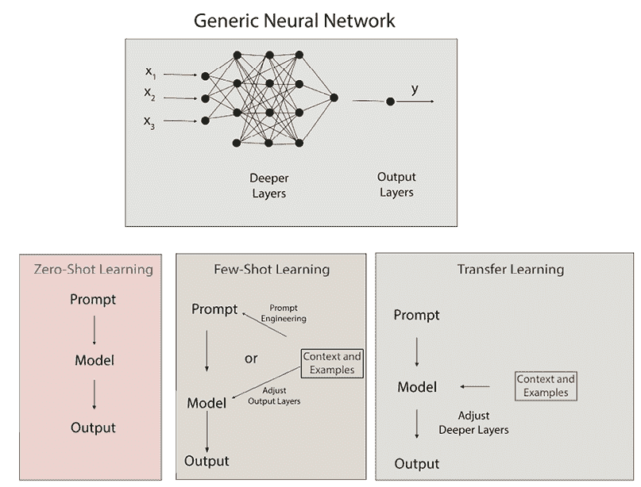
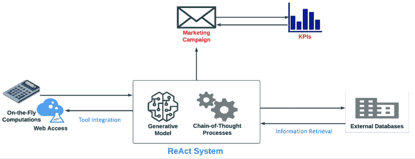
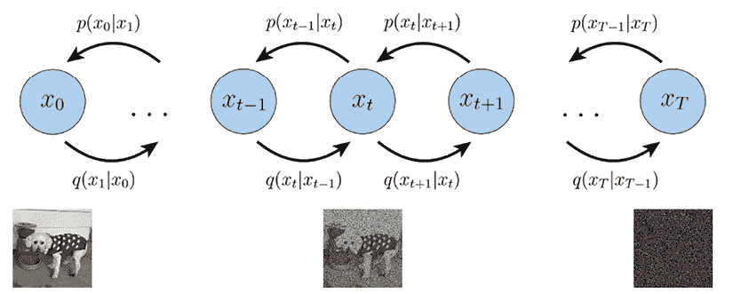
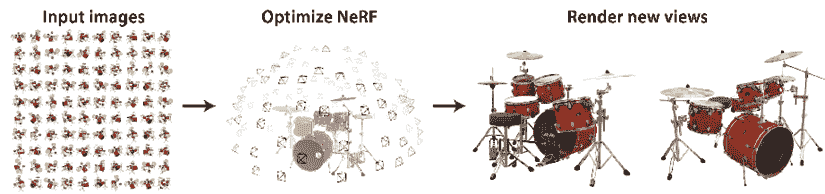
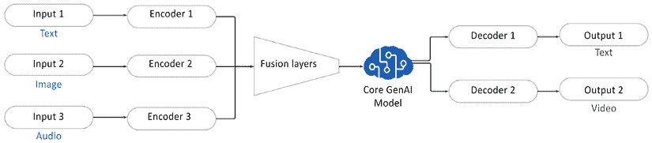
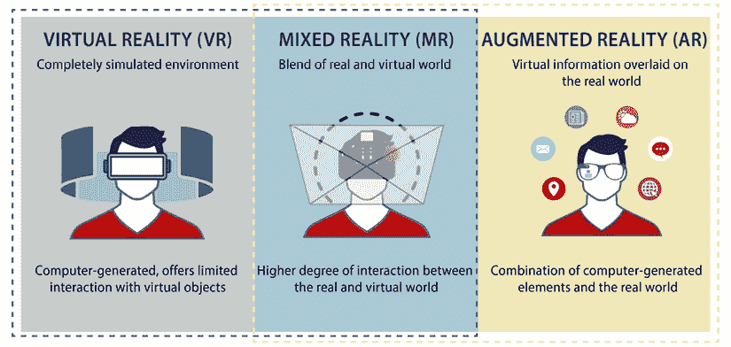

# 第十二章：营销中 AI 和 ML 的未来格局

我们现在正进入探索**机器学习**（**ML**）和**生成式 AI**（**GenAI**）在营销中集成的最后阶段。AI 和 ML 的格局是动态的，并且正在迅速演变，这为更多的激动人心的变化奠定了基础。到目前为止，我们已经探讨了生成式 AI 和数据驱动洞察如何革命性地改变营销策略，从解码营销 KPI 和获得详细的客户洞察，到制作引人入胜的内容、增强品牌存在感和对消费者进行微定位。本章旨在整合我们对关键 AI 和 ML 概念的理解，并预测它们在营销中的未来应用。

尤其是首先，我们将回顾前几章中介绍的生成式 AI 基础，然后探索诸如多模态生成式 AI、高级模型架构以及用于创建针对消费者行为和偏好的个性化内容的综合多种数据类型的技术等新兴技术。虽然*第七章*讨论了使用市场篮子分析、协同过滤和其他传统推荐方法进行个性化推荐，但本章介绍了如何使用多模态生成式 AI 通过多种数据类型（如文本、图像和视频）来实现这一点。我们还探讨了更高级的模型架构，如 ReAct，它结合推理和行动以实时适应用户行为，从而进一步推动用户个性化的边界。最后，我们将探讨 AI 如何与增强现实（AR）和虚拟现实（VR）等新型平台集成，将传统营销策略转变为更沉浸式的消费者体验。

到本章结束时，你将获得：

+   对过去章节中介绍的基本生成式 AI 概念的整合视图

+   对当前塑造营销并预期如何演变的 AI 和 ML 技术的更全面理解

+   对 AI 与新型数字平台集成及其对未来营销实践影响的洞察

# 整合关键 AI 和 ML 概念

在本节中，我们将简要回顾前几章中讨论的核心生成式 AI 概念，为我们探索新兴技术和未来趋势做准备。在每种情况下，你可以参考原始章节以获得对内容和其理论的更深入讨论。

在*第九章*中，我们首先通过讨论概率模型和上下文嵌入来为理解生成式 AI 模型（GenAI）的起源奠定基础。本章需要记住的关键概念包括：

+   **贝叶斯推理和概率模型**：贝叶斯定理通过将先验知识与新的证据相结合，引导模型调整其理解。这个过程对于模型遇到完全新的情境至关重要——它使模型能够在无需大量重新训练的情况下改进其预测。

+   **GenAI 模型**：基础模型如**生成对抗网络**（**GANs**）、**变分自编码器**（**VAEs**）、**长短期记忆**（**LSTM**）网络和**生成预训练转换器**（**GPTs**）推动了文本、图像和序列生成中的创新内容创作。

+   **上下文嵌入和预训练模型**：上下文嵌入允许 AI 根据周围文本动态调整理解，而预训练模型在大型数据集上训练，显著降低了 AI 驱动解决方案的成本和部署时间。这为**零样本学习**（**ZSL**）铺平了道路，其中模型可以执行其初始训练中未涵盖的任务。

在*第十章*中，我们介绍了如何通过**少样本学习**（**FSL**）和迁移学习来调整预训练模型，以在新任务上表现更好。该章节讨论的核心主题包括：

+   **FSL**：FSL 训练机器学习模型通过仅使用少量标记示例来适应新任务。这项技术涉及元学习或“学习如何学习”，使模型能够开发出能够有效推广到新情境的表示。

+   **迁移学习**：迁移学习将先前任务的知识应用于提高新任务的表现，减少了大量训练数据的需求。这种方法在先前任务与当前任务之间有强烈关系时特别有用。

+   **FSL 和迁移学习的成本效益分析**：根据具体需求和约束条件评估何时使用每种方法，考虑因素包括成本、使用频率和捕捉复杂模式的需求。

下图展示了这些技术之间的一些差异：

图 12.1：典型零样本学习（ZSL）、少样本学习（FSL）和迁移学习实现及其机制的关键差异

最后，在*第十一章*中，我们讨论了如何通过**检索增强生成**（**RAG**）实现针对单个消费者的微定位。该章节的讨论包括：

+   **RAG**: RAG 通过整合实时数据检索，增强了传统的生成模型，从而产生个性化且及时的内容。这种混合方法依赖于外部数据库来提供上下文相关的信息。

+   **RAG 在市场营销中的应用**：RAG 用于个性化广告、动态内容创建、按人口统计学的针对性营销以及增强客户参与度。它使营销人员能够通过整合最新和最具体的信息来创建高度个性化的内容。

+   **使用 LangChain 构建知识检索系统**：LangChain 促进了语言模型与强大检索系统的结合。这种集成支持根据最新可用数据生成内容。

现在我们已经回顾了这些关键概念，让我们展望一下一些下一代技术，您可以使用这些技术。

# 营销领域的下一代人工智能技术

本节突出了在人工智能营销领域重新定义可能性的重大进步和新型模型架构。这些技术中的每一个都有助于我们推动边界，创造更多动态、响应和个性化的营销解决方案。这些技术的当前成熟度也将被讨论，在 ReAct 和多模态 GenAI 的情况下，这些技术已经可以在产品中使用，并且可以被早期采用者用于他们的营销策略。

## 从 RAG 到 ReAct

ReAct，即“推理与行动”，代表了 GenAI 系统的一个重大进步，通过整合复杂的推理和外部工具交互。ReAct 建立在 RAG、ZSL、FSL 和提示工程的能力之上，通过结合思维链过程，这些过程涉及 AI 系统将复杂任务分解成一系列较小、可管理的步骤。思维链提示在 GenAI 中至关重要，因为它引导 AI 通过一系列逻辑步骤达到结论，提高其响应的准确性和相关性。这模仿了人类的推理，并促进了交互式工具的使用，使 AI 不仅是一个响应者，而且在现实世界应用中也是一个主动的代理。

### ReAct 的工作原理

ReAct 将人工智能能力与操作行动相结合，体现了一个模型，其中 AI 的输出可以启动现实世界中的任务和交易。在其核心，ReAct 可以通过增强决策框架来理解，其中输出不仅仅是信息性的，而且是可操作的。

ReAct 的真正力量在于其与外部工具无缝交互的能力——不仅包括用于实时数据检索的数据库，还包括用于即时计算的计算器和甚至互联网以收集更广泛的上下文洞察。这种交互使系统能够执行复杂任务，从计算最佳营销支出到根据竞争对手网站的最新更新找到其产品信息。以下图表提供了 ReAct 系统关键组件的概述：

图 12.2：ReAct 系统可以整合各种工具以支持营销活动

### 市场营销应用

ReAct 可以通过实现不仅数据检索，而且在各种外部系统中的直接、实时交互和执行，将营销活动推进到 RAG（Retrieval-Augmented Generation）领域之外。这种高级功能允许营销策略自动化复杂流程，并以数据检索系统如 RAG 无法实现的方式个性化客户互动。这些能力的应用可以包括以下方面：

+   **实时库存管理**：ReAct 可以直接与库存系统交互，根据库存水平调整营销策略。例如，如果一个产品的销售速度比预期快，ReAct 可以增加广告支出并加强促销活动以利用这一趋势，同时通知供应链管理系统调整库存水平。

+   **动态定价调整**：利用 ReAct，公司可以实施动态定价模型，其中价格根据需求、竞争对手定价和库存状况实时调整。这可能涉及 ReAct 监控在线竞争对手的价格，并在如黑色星期五等高流量事件期间自动调整其定价以保持竞争力。

+   **互动式客户服务**：ReAct 不仅可以通过基于常见问题解答和客户数据的生成响应来提升客户服务，还可以通过执行诸如预约、处理退货或直接通过客户服务聊天机器人发放退款等操作。

## 模型架构的进步

随着生成式人工智能（GenAI）领域的持续发展，一些显著的进步已经出现，这些进步将边界推进到了基础模型如 GANs、VAEs、LSTMs 和 transformers 等模型之外。这些发展不仅增强了现有模型的能力，还引入了新的范式，这些范式正在以创造性和影响力的方式塑造人工智能的未来。在这里，我们探讨三种这样的创新：

+   **扩散模型**：这些模型正在革命性地改变生成图像的质量和多样性。对消费者来说逼真的高质量图像是优化营销内容与客户互动的核心。

+   **神经辐射场（NeRFs）**：这些正在改变我们创建和交互 3D 内容的方式，使得 VR 和 AR 应用的市场营销成为可能，这些内容将在本章后面讨论。

+   **胶囊网络**：这些提供了一种理解复杂数据结构和空间层次结构的新方法，这些结构也是 VR 和 AR 应用的核心。

让我们更详细地看看这些内容。

### 扩散模型

生成模型中最显著的近期进展之一是扩散的发展。这些创新模型通过一个复杂的过程运行，逐渐学会逐步逆转数据中噪声的添加，有效地“去噪”它，逐步恢复原始数据。这种方法已被证明在生成高质量、高分辨率图像方面非常有效，在许多场景中往往超过了传统 GANs 的性能。通过采用一系列逐步提高数据质量的转换，扩散模型擅长产生详细且多样化的输出。这种能力使它们特别适用于需要高保真度和多样性的应用，如数字艺术创作和市场营销材料的逼真渲染。

扩散模型所采用的过程可以通过一系列变换来可视化，其中每一步都会逐步去除输入数据中的噪声，使其逐渐接近原始结构。以下图表展示了这一变换序列，展示了模型如何通过几个步骤从噪声状态迭代地细化，最终恢复到清晰、结构化的数据：

图 12.3：扩散模型中的迭代降噪过程（来源：https://arxiv.org/pdf/2208.11970）

在这个图表中，*x*[0]代表真实数据观测，如自然图像，*x*[T]代表纯高斯噪声，而*x*[t]是*x*[0]的中间噪声版本。每个*q*(*x*[t]|*x*[(][t−1][)])被建模为一个高斯分布，其前一个状态输出作为其均值。

扩散模型目前被应用于最先进的文本到图像模型中，如 DALL-E 3、谷歌的 Imagen 和 Midjourney。OpenAI 还有一个名为 Sora 的扩散模型，它可以生成视频，尽管目前这个模型尚未向公众发布。

### 神经辐射场

在 3D 内容生成的领域，尤其是在 VR 和 AR 应用中，NeRFs（神经辐射场）已经出现成为一种突破性的技术。NeRFs 使用一个全连接的神经网络来从一组稀疏的 2D 图像中建模场景的体积密度和颜色。然后，这个模型可以用来从任何视角渲染逼真的 3D 场景，为创建沉浸式虚拟环境提供了一个极其强大的工具。对于市场营销的影响是巨大的，允许品牌创建更真实、更具交互性的 3D 广告或虚拟产品展示。在市场营销之外，NeRFs 还被用于其他应用，包括视频游戏和自动驾驶车辆导航。

从技术角度来看，NeRFs 使用一组输入视图，并使用位置编码技术训练网络，将这些视图转换成连续的 5D 场景表示。在这里，5D 指的是 NeRF 模型用来表示场景的 5D 连续函数，其中 3 个维度由空间位置*x*、*y*、*z*给出，另外两个维度定义了视图方向。因此，这个 5D 空间包含了从任何视角观察位置的位置和方向，这对于从任何视角准确渲染场景至关重要。

渲染过程涉及通过场景投射光线，并使用体积渲染技术计算颜色和透明度，这些技术由学习到的神经网络参数定义。这个过程计算量很大，通常需要优化，如分层采样，以有效地生成图像。以下图是过程的视觉描述：

图 12.4：通过 NeRF 使用从不同视角随机捕获的一组输入视图来渲染新视图（来源：https://arxiv.org/pdf/2003.08934）

### 胶囊网络

胶囊网络是神经网络领域的一个有趣的发展，通过更好地模拟数据中的层次关系，为传统的卷积网络提供了一个有希望的替代方案。这种能力在空间关系至关重要的任务中特别有用，例如在 AR 应用中解析复杂场景或理解网页布局以进行自动化设计任务。到目前为止，关于胶囊网络架构在商业产品和技术中应用的报道有限，尽管有各种开源项目和实现，如 CapsNet-Keras 和 CapsNet-TensorFlow，可用于实验和研究。

胶囊网络围绕称为胶囊的神经元组构建其架构，这些胶囊被设计用来捕获和保持数据中不同类型实体存在的概率和实例化参数。与传统卷积网络不同，由于池化层导致特征之间的空间层次丢失，胶囊通过动态路由保留这些信息——这是一个允许一个层的胶囊根据胶囊之间学习到的“协议”将它们的输出发送到下一层适当父胶囊的过程。这种机制需要实现路由算法，如基于协议的动态路由，这通常涉及复杂的迭代过程，调整胶囊之间的耦合系数。作为一个简化的胶囊网络说明，我们可以将标准神经网络中发现的传统人工神经元与胶囊进行比较：

图 12.5：（a）标准神经网络中发现的人工神经元和（b）胶囊网络中发现的胶囊的描述（来源：https://arxiv.org/pdf/2206.02664）

## 多模态 GenAI

在*第九章*中介绍基于 Transformer 的架构的基础上，多模态 GenAI 系统代表了这些系统的先进演变。这些架构可以通过处理多种数据模态（如文本、图像和视频）来解释和生成内容，并超越了单模态模型，通过整合和交叉引用来自不同来源的数据。这种整合促进了更深入的内容和上下文的理解，使 AI 能够执行复杂的“跨模态”操作。

### 技术基础

多模态模型修改了传统的 Transformer 架构，将不同的数据形式编码到共享的潜在空间中，从而允许跨模态操作。例如，这些系统可以从视频剪辑中生成描述性文本，或从文本描述中合成视频，展示了它们无缝连接不同类型信息的能力。多模态 AI 有效性的核心在于其复杂的神经网络架构，这些架构具有跨模态注意力机制。这些机制对于模型有效地聚焦和整合来自不同模态的特征至关重要。

以下图表简化了这一过程在概念层面的工作方式：

图 12.6：多模态 GenAI 系统的简化架构

在这个例子中，文本、图像和音频数据的不同输入模态被输入到编码器中，由融合层进行处理。融合层使用如跨模态注意力等方法结合这些模态，然后再将它们输入到核心生成模型中。这个核心模型被设计用来处理融合的多模态数据以生成新的输出预测。然后，这些输出被解码成所需的模态格式——在本例中是文本和视频——供最终用户使用。

### 多模态应用

多模态 GenAI 的复杂方法允许营销人员通过整合多样化的数据源，更深入地理解和与消费者互动。随着多模态 AI 处理这一广泛的输入，它能够实现更个性化、相关性和动态适应的营销策略，这些策略能够在多个层面上引起消费者的共鸣。以下是一些具体的应用实例，展示了这项技术创造更有效的营销活动的潜力。在每个应用中，都给出了在实施这些策略时需要考虑的营销关键绩效指标（KPI）。这些指标应被跟踪以评估多模态 GenAI 方法的有效性，并确定其相对于成本的回报率（ROI），通过如 A/B 测试（*第六章*）等技术来实现。

#### 增强消费者参与度

考虑通过综合各种数据形式来增强叙事，使多模态 AI 能够生成丰富的叙事体验。例如，一家旅行社可能会根据客户的先前搜索、在 Instagram 上探索的目的地和类似旅行的正面评论创建个性化的旅行视频。这种有针对性的叙事可以与消费者建立更强的情感联系，导致更高的参与度。在实施这一策略时，值得跟踪的关键绩效指标（KPI）如点击率，以查看用户与多模态 GenAI 内容互动的可能性比与传统内容更高的程度。

#### 实时内容适配

多模态 AI 对于营销中的实时内容适配至关重要，它能够有效地从多个来源分析和综合数据。例如，考虑一个使用多模态 AI 优化其营销策略的服装品牌。这个 AI 系统不仅分析文本数据，如天气预报，还评估社交媒体趋势中的视觉数据和最近时装秀的视频内容。通过评估这种文本、图像和视频的组合，AI 可以检测消费者偏好的微妙变化或天气模式的突然变化。在这种情况下，监控转化率的关键绩效指标（KPI）是查看从 GenAI 生成的可能更相关的内容如何导致比不考虑最新趋势的传统内容更高的销售额的一种方法。

#### 互动式客户支持

零售商可以通过实施多模态 AI，通过能够理解和处理文本和图像输入的聊天机器人提供互动式客户支持。例如，客户可以上传损坏产品的图片，AI 系统可以分析图片，识别问题，并提供适当的解决方案或启动退货流程。这种能力通过提供快速准确的支持，减少对人工干预的需求，从而提高整体客户满意度和品牌忠诚度。在这种情况下，我们可以监控用户与 GenAI 系统互动时的首次响应时间、问题解决和客户保留的关键绩效指标（KPI）。虽然首次响应时间很可能得到改善，但在部署时保持问题解决的质量是一个重要的考虑因素。

# AR 和 VR 作为新兴的数字平台

在数字营销的动态世界中，AR 和 VR 将变得越来越关键。它们提供沉浸式和吸引人的体验，帮助品牌在不断演变的数字市场中脱颖而出。AR 通过智能手机等设备将数字元素叠加到物理世界中，而 VR 通过头戴式设备将用户带入完全数字化的环境，使品牌能够打造独特的客户旅程。

**VR 和 AR 之间的区别**

VR 涉及一种完全沉浸式的体验，它将现实世界屏蔽在外。通过 VR，用户可以体验一个数字环境，在其中他们可以与 3D 世界互动。

AR 通过在现实世界之上叠加数字信息来增强现实。AR 用户可以在与放置在其中的虚拟对象互动的同时看到他们周围的世界。

**混合现实**（**MR**）是一种新兴趋势，它将这些体验融合在一起，使用户能够在同一会话中与物理和虚拟元素互动。

这些进步得益于 AI 的预测和自适应能力，为营销专业人士提供了与受众互动的新维度。随着预测这些技术采用量将显著增加，营销人员应该了解它们重塑客户互动的潜力。

图 12.7：VR、AR 和 MR 的示意图（来源：https://onlinelibrary.wiley.com/doi/10.1002/adfm.202007952）

## ML 在 AR 营销中的作用

AR 不仅仅是将数字内容叠加到现实世界，它是以个性化、相关性和无缝集成到用户环境中的方式来做到这一点。AR 转变为强大的营销工具的转型在很大程度上是由 AI 和 ML 的集成驱动的。让我们讨论一些如何实现这一点的例子。你已经在许多智能手机应用程序中看到了这些例子。

### 个性化 AR 体验

AI 算法是个性化 AR 体验的核心。通过分析用户互动、偏好和以往行为的数据，这些算法可以定制 AR 内容以满足个人需求和兴趣。

例如，当用户将智能手机摄像头对准商店的货架时，AI 可以显示基于其购物历史的 AR 叠加层，显示他们可能感兴趣的产品。这不仅增强了用户体验，还增加了购买的可能性。

面部识别技术的使用可以进一步个性化体验，例如实时应用虚拟化妆，让顾客在购买前就能看到产品在他们脸上的效果。这种程度的定制让购物体验更加吸引人，并可能导致更高的转化率。

### 基于地理位置的 AR 活动

地理定位技术与 AI 的结合使营销人员能够提供高度针对性的 AR 内容，这不仅基于用户的个人资料，还基于他们的物理位置。这在基于位置的营销中尤其有效，因为促销活动可以根据当地事件或商店的邻近性进行定制。

例如，靠近音乐场馆的用户可能会看到相关商品或附近餐厅优惠的 AR 促销。人工智能通过考虑用户的情境，不仅包括位置，还包括时间或天气条件等因素，来增强这些体验，提供更相关、更及时的内容，从而提高参与率。

### 无缝的产品集成

机器学习对于将虚拟产品无缝集成到现实世界环境中至关重要。高级图像识别和空间感知能力允许 AR 系统将虚拟物品真实地放置在用户的周围环境中。

例如，一个由本章前面提到的 NeRF 模型架构驱动的 AR 家具应用程序可以分析房间内可用的空间，并建议既符合物理尺寸又符合美学的家具物品。

## 机器学习在 VR 营销中的作用

VR 提供了沉浸式的品牌故事叙述，将用户带入一个完全品牌化、互动的宇宙，通过完全沉浸用户在品牌化的虚拟环境中，将客户参与度提升到新的水平。借助人工智能和机器学习，这些虚拟世界可以个性化、动态和响应，创造加强品牌与客户之间关系的体验。尽管这些应用目前不如 AR 常见，但以下章节概述了一些这些原则在实际中的应用示例。

### 沉浸式故事叙述和品牌体验

人工智能通过根据用户的兴趣和行为个性化内容，使品牌能够在 VR 中提供引人入胜的故事叙述。用户可以探索适应他们偏好的动态剧情，而不是通用的体验。

例如，在一个汽车品牌的 VR 展厅中，客户可以探索针对他们兴趣定制的不同虚拟环境，如探险或家庭旅行。人工智能分析他们的过去选择和行为，动态地建议相关功能或体验，从而增强参与度，使内容更加难忘。

### 行为数据洞察

在 VR 环境中，每个用户动作都可以被跟踪和分析。人工智能和机器学习算法将这些交互转换为有价值的用户行为数据洞察。

一些例子可以是用户探索某些产品的时间长短、他们遵循的路径，或者他们的目光停留的地方，这些都可以提供关键的数据点。然后，这些洞察力可以用来完善未来的活动、个性化推荐，并实时调整内容。这些行为数据还可以通过帮助品牌了解哪些功能和属性最能引起目标受众的共鸣，来指导产品开发。

### 虚拟店面和活动

人工智能使得创建高度个性化的虚拟店面和活动成为可能，这些店面和活动提供独特的购物体验。这些店面可以设计成复制甚至增强实体购物体验。用户会根据他们之前的购买、浏览历史和人口统计数据获得个性化的推荐。

在虚拟活动中，由人工智能驱动的聊天机器人和虚拟形象也可以提供即时客户服务并回答问题，使互动感觉自然且信息丰富。品牌还可以在这些虚拟空间内举办现场活动，让客户能够直接与品牌大使和影响者互动。

# 摘要

随着我们结束对营销领域机器学习和通用人工智能未来前景的探索，我们反思了那些彻底改变营销策略的进步。在这本书中，我们探讨了人工智能和数据驱动的洞察如何指导营销的各个方面——从解码关键绩效指标和收集深入客户洞察，到制作引人入胜的内容和微目标受众。营销领域的 AI 不仅动态变化，而且迅速发展，为未来的进一步变革奠定了基础。

在下一个发展前沿，我们强调了新兴技术，如多模态通用人工智能和高级模型架构，这些架构可以综合多种数据来创建针对消费者定制的内容。我们还研究了人工智能与新型平台（如 AR 和 VR）的结合，这些平台可以将传统的营销方法转变为更沉浸式的消费者体验。

考虑到这些技术的长期影响，未来值得关注的关键发展是多模态人工智能，它将实现高度个性化的营销。通过整合来自各种来源（文本、图像、视频和音频）的数据，营销人员可以创建与每个消费者个人共鸣的高度定制化内容。我们也在朝着半自主营销系统迈进，这些系统能够在最小的人为干预下监督整个活动。虽然完全自主的系统还遥不可及，但这些系统将有助于人类更有效地处理从策略开发到内容创作、部署和实时优化的所有事务。高级人工智能通过分析多个渠道的大量数据，提供更深入和更准确的消费者洞察，从而为消费者行为预测模型带来更好的预测。人工智能与增强现实（AR）和虚拟现实（VR）的结合将创造更沉浸式的消费者体验，模糊数字和物理交互之间的界限。

展望未来，最后一章将探讨 AI 驱动的营销中的关键主题——伦理和治理。这次讨论将聚焦于在部署 AI 时，如何应对复杂的伦理问题和监管框架。通过解决数据隐私、算法偏见和透明度的必要性等问题，我们将强调保护消费者信任和品牌完整性的伦理实践的重要性。通过这一关注点，您将获得理解稳健治理结构和合规策略要素的见解，确保您的 AI 应用既有效又符合伦理。

# 加入我们书籍的 Discord 空间

加入我们的 Discord 社区，与志同道合的人相聚，并和超过 5000 名成员一起学习，详情如下：

[`packt.link/genai`](https://packt.link/genai)

