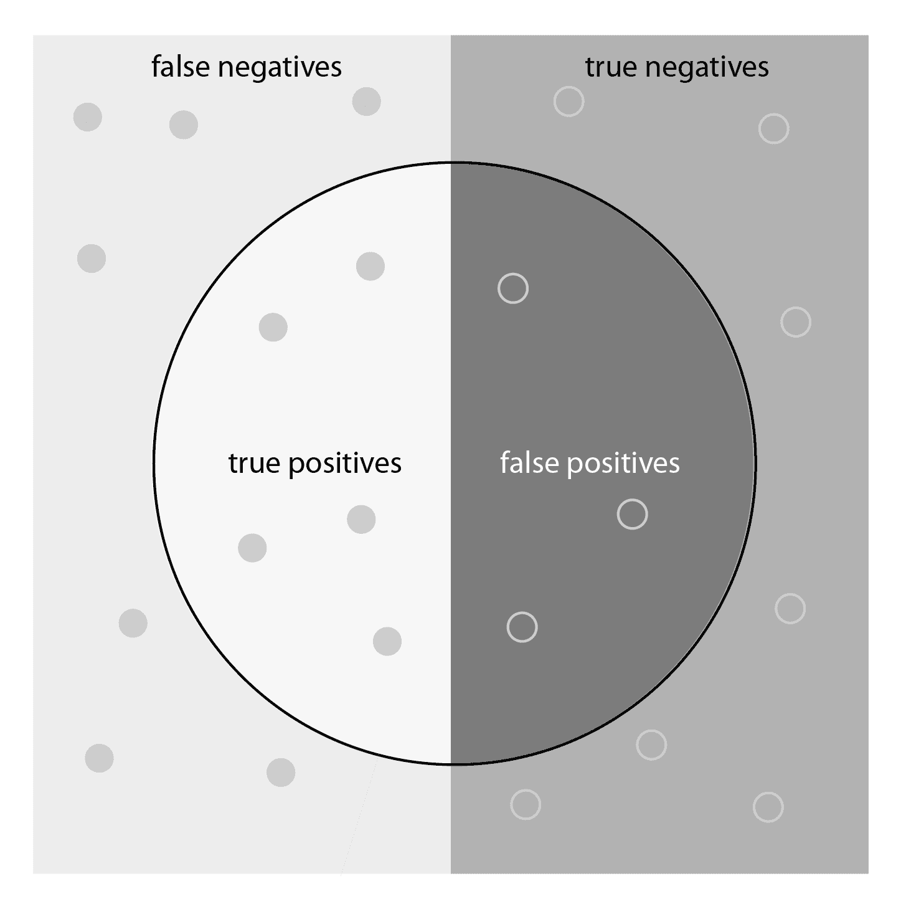
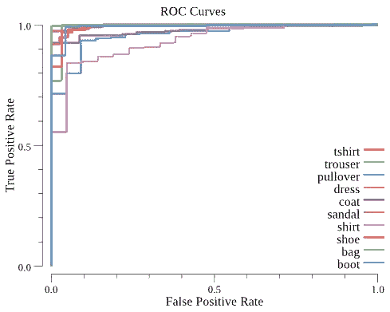
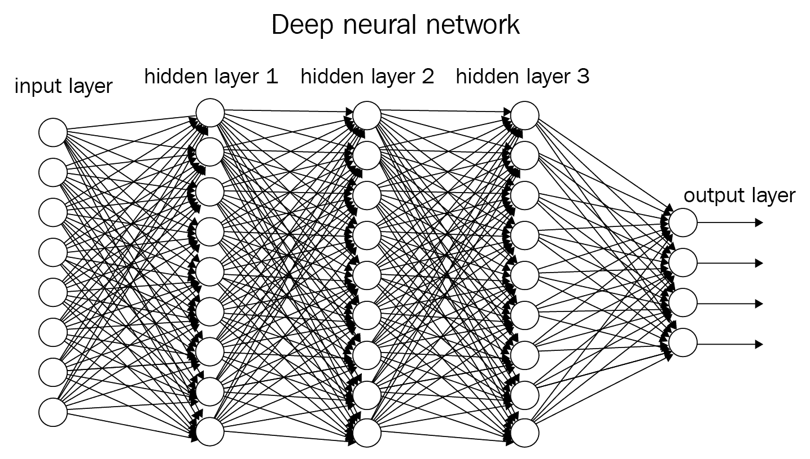

# 第三章：监督学习

正如我们在第一章中学到的，监督学习是机器学习的两个主要分支之一。从某种意义上说，它与人类学习新技能的方式相似：有人向我们展示该怎么做，然后我们通过模仿他们的例子来学习。在监督学习算法的情况下，我们通常需要大量的例子，即大量的数据提供算法的**输入**以及**预期输出**应该是什么。算法将从这些数据中学习，然后能够根据它之前未见过的新输入**预测**输出。

使用监督学习可以解决大量问题。许多电子邮件系统会自动将新消息分类为重要或不重要，每当新消息到达收件箱时就会使用它。更复杂的例子包括图像识别系统，这些系统可以仅从输入像素值中识别图像内容^([1])。这些系统最初是通过学习大量由人类手动标记的图像数据集来学习的，但随后能够自动对全新的图像进行分类。甚至可以使用监督学习来自动驾驶赛车：算法首先学习人类驾驶员如何控制车辆，最终能够复制这种行为^([2])。

到本章结束时，您将能够使用 Go 实现两种类型的监督学习：

+   **分类**，其中算法必须学习将输入分类到两个或多个离散类别中。我们将构建一个简单的图像识别系统来展示这是如何工作的。

+   **回归**，其中算法必须学习预测一个连续变量，例如，在网站上出售的商品的价格。在我们的例子中，我们将根据输入预测房价，例如房屋的位置、大小和年龄。

在本章中，我们将涵盖以下主题：

+   何时使用回归和分类

+   如何使用 Go 机器学习库实现回归和分类

+   如何衡量算法的性能

我们将涵盖构建监督学习系统涉及的两个阶段：

+   **训练**，这是使用标记数据校准算法的学习阶段

+   **推理**或**预测**，即我们使用训练好的算法来实现其预期目的：从输入数据中进行预测

# 分类

在开始任何监督学习问题之前，第一步是加载数据并准备数据。我们将从加载**MNIST Fashion** **数据集**^([3])开始，这是一个包含不同服装的小型、灰度图像集合。我们的任务是构建一个能够识别每张图像内容的系统；也就是说，它是否包含连衣裙、鞋子、外套等？

首先，我们需要通过在代码仓库中运行`download-fashion-mnist.sh`脚本来下载数据集。然后，我们将将其加载到 Go 中：

```py
import (
    "fmt"
     mnist "github.com/petar/GoMNIST"
    "github.com/kniren/gota/dataframe"
    "github.com/kniren/gota/series"
    "math/rand"
    "github.com/cdipaolo/goml/linear"
    "github.com/cdipaolo/goml/base"
    "image"
    "bytes"
    "math"
    "github.com/gonum/stat"
    "github.com/gonum/integrate"
)
set, err := mnist.ReadSet("../datasets/mnist/images.gz", "../datasets/mnist/labels.gz")
```

让我们先看看图像的样本。每个图像都是 28 x 28 像素，每个像素的值在 0 到 255 之间。我们将使用这些像素值作为算法的输入：我们的系统将从图像中接受 784 个输入，并使用它们来根据包含的衣物项目对图像进行分类。在 Jupyter 中，您可以按以下方式查看图像：

```py
set.Images[1]
```

这将显示数据集中 28 x 28 像素的图像之一，如下面的图像所示：


为了使这些数据适合机器学习算法，我们需要将其转换为我们在第二章，“设置开发环境”中学到的 dataframe 格式。首先，我们将从数据集中加载前 1000 张图像：

```py
func MNISTSetToDataframe(st *mnist.Set, maxExamples int) dataframe.DataFrame {
 length := maxExamples
 if length > len(st.Images) {
 length = len(st.Images)
 }
 s := make([]string, length, length)
 l := make([]int, length, length)
 for i := 0; i < length; i++ {
 s[i] = string(st.Images[i])
 l[i] = int(st.Labels[i])
 }
 var df dataframe.DataFrame
 images := series.Strings(s)
 images.Name = "Image"
 labels := series.Ints(l)
 labels.Name = "Label"
 df = dataframe.New(images, labels)
 return df
}

df := MNISTSetToDataframe(set, 1000)
```

我们还需要一个包含每个图像可能标签的字符串数组：

```py
categories := []string{"tshirt", "trouser", "pullover", "dress", "coat", "sandal", "shirt", "shoe", "bag", "boot"}
```

首先保留一小部分数据以测试最终算法非常重要。这使我们能够衡量算法在训练过程中未使用的新数据上的表现。如果您不这样做，您很可能会构建一个在训练期间表现良好但在面对新数据时表现不佳的系统。首先，我们将使用 75%的图像来训练我们的模型，25%的图像来测试它。

在使用监督学习时，将数据分成**训练集**和**测试集**是一个关键步骤。通常，我们会保留 20-30%的数据用于测试，但如果您的数据集非常大，您可能可以使用更少的比例。

使用上一章中的`Split(df dataframe.DataFrame, valFraction float64)`函数来准备这两个数据集：

```py
training, validation := Split(df, 0.75)
```

# 一个简单的模型——逻辑分类器

解决我们问题的最简单算法之一是逻辑分类器。这是数学家所说的**线性模型**，我们可以通过考虑一个简单的例子来理解它，在这个例子中，我们试图将以下两个图表上的点分类为圆圈或正方形。线性模型将尝试通过画一条直线来分隔这两种类型的点。这在左边的图表上效果很好，其中输入（图表轴上的）与输出（圆圈或正方形）之间的关系很简单。然而，它不适用于右边的图表，在右边的图表中，无法使用直线将点分成两个正确的组：


面对一个新的机器学习问题时，建议你从一个线性模型作为**基线**开始，然后将其与其他模型进行比较。尽管线性模型无法捕捉输入数据中的复杂关系，但它们易于理解，通常实现和训练速度也很快。你可能发现线性模型对于你正在解决的问题已经足够好，从而节省了时间，无需实现更复杂的模型。如果不是这样，你可以尝试不同的算法，并使用线性模型来了解它们的效果有多好。

**基线**是一个简单的模型，你可以将其用作比较不同机器学习算法时的参考点。

回到我们的图像数据集，我们将使用逻辑分类器来决定一张图片是否包含裤子。首先，让我们做一些最终的数据准备：将标签简化为“裤子”（`true`）或“非裤子”（`false`）：

```py
func EqualsInt(s series.Series, to int) (*series.Series, error) {
 eq := make([]int, s.Len(), s.Len())
 ints, err := s.Int()
 if err != nil {
 return nil, err
 }
 for i := range ints {
 if ints[i] == to {
 eq[i] = 1
 }
    }
    ret := series.Ints(eq)
    return &ret, nil
}

trainingIsTrouser, err1 := EqualsInt(training.Col("Label"), 1)
validationIsTrouser, err2 := EqualsInt(validation.Col("Label"), 1)
if err1 != nil || err2 != nil {
    fmt.Println("Error", err1, err2)
}
```

我们还将对像素数据进行归一化，使其不再是存储在 0 到 255 之间的整数，而是表示为 0 到 1 之间的浮点数：

许多监督式机器学习算法只有在数据归一化（即缩放，使其在 0 到 1 之间）的情况下才能正常工作。如果你在训练算法时遇到困难，请确保你已经正确归一化了数据。

```py
func NormalizeBytes(bs []byte) []float64 {
    ret := make([]float64, len(bs), len(bs))
    for i := range bs {
        ret[i] = float64(bs[i])/255.
    }
    return ret
}

func ImageSeriesToFloats(df dataframe.DataFrame, col string) [][]float64 {
    s := df.Col(col)
    ret := make([][]float64, s.Len(), s.Len())
    for i := 0; i < s.Len(); i++ {
        b := []byte(s.Elem(i).String())
        ret[i] = NormalizeBytes(b)
    }
    return ret
}

trainingImages := ImageSeriesToFloats(training, "Image")
validationImages := ImageSeriesToFloats(validation, "Image")
```

在正确准备数据之后，现在终于到了创建逻辑分类器并对其进行训练的时候了：

```py
model := linear.NewLogistic(base.BatchGA, 1e-4, 1, 150, trainingImages, trainingIsTrouser.Float())

//Train
err := model.Learn()
if err != nil {
  fmt.Println(err)
}
```

# 衡量性能

现在我们已经训练好了模型，我们需要通过将模型对每张图片的预测与真实情况（图片是否是一双裤子）进行比较来衡量其表现的好坏。一个简单的方法是测量**准确率**。

**准确率**衡量算法能够正确分类输入数据的比例，例如，如果算法的 100 个预测中有 90 个是正确的，那么准确率为 90%。

在我们的 Go 代码示例中，我们可以通过遍历验证数据集并计算正确分类的图片数量来测试模型。这将输出模型准确率为 98.8%：

```py
//Count correct classifications
var correct = 0.
for i := range validationImages {
  prediction, err := model.Predict(validationImages[i])
  if err != nil {
    panic(err)
  }

  if math.Round(prediction[0]) == validationIsTrouser.Elem(i).Float() {
    correct++
  }
}

//accuracy
correct / float64(len(validationImages))
```

# 精确率和召回率

测量准确率可能会非常误导。假设你正在构建一个系统来分类医疗患者是否会测试出罕见疾病，而在数据集中只有 0.1%的例子实际上是阳性的。一个非常差的算法可能会预测没有人会测试出阳性，然而它仍然有 99.9%的准确率，仅仅因为这种疾病很罕见。

一个分类比另一个分类有更多示例的数据集被称为**不平衡**。在衡量算法性能时，需要仔细处理不平衡数据集。

一种更好的衡量性能的方法是从将算法的每个预测放入以下四个类别之一开始：


我们现在可以定义一些新的性能指标：

+   **精确度**衡量的是模型真实预测中正确预测的比例。在下面的图中，这是从模型预测出的真实阳性（圆圈的左侧）除以模型所有阳性预测（圆圈中的所有内容）。

+   **召回率**衡量模型在识别所有正例方面的好坏。换句话说，真实阳性（圆圈的左侧）除以所有实际为正的数据点（圆圈的整个左侧）：



上述图显示了模型在中心圆中预测为真实的数据点。实际上为真的点位于图的左侧一半。

**精确度**和**召回率**是在处理不平衡数据集时更稳健的性能指标。它们的范围在 0 到 1 之间，其中 1 表示完美性能。

下面的代码是计算真实阳性和假阴性的总数：

```py
//Count true positives and false negatives
var truePositives = 0.
var falsePositives = 0.
var falseNegatives = 0.
for i := range validationImages {
  prediction, err := model.Predict(validationImages[i])
  if err != nil {
    panic(err)
  }
  if validationIsTrouser.Elem(i).Float() == 1 {
    if math.Round(prediction[0]) == 0 {
      // Predicted false, but actually true
      falseNegatives++
    } else {
      // Predicted true, correctly
      truePositives++
    }
  } else {
    if math.Round(prediction[0]) == 1 {
      // Predicted true, but actually false
      falsePositives++
    }
  }
}
```

我们现在可以使用以下代码计算精确度和召回率：

```py
//precision
truePositives / (truePositives + falsePositives)
//recall
truePositives / (truePositives + falseNegatives)
```

对于我们的线性模型，我们得到了 100%的精确度，这意味着没有假阳性，召回率为 90.3%。

# ROC 曲线

另一种衡量性能的方法是更详细地观察分类器的工作方式。在我们的模型内部，发生两件事：

+   首先，模型计算一个介于 0 到 1 之间的值，表示给定图像被分类为裤子对的可能性有多大。

+   设置一个阈值，只有得分超过阈值的图像才被分类为裤子。设置不同的阈值可以在牺牲召回率的同时提高精确度，反之亦然。

如果我们查看模型输出在所有不同的阈值从 0 到 1 之间的情况，我们可以更了解它的有用性。我们使用称为**接收者操作特征**（**ROC**）曲线的东西来做这件事，这是一个在不同阈值值下，数据集中真实阳性率与假阳性率的图表。以下三个示例显示了不良、中等和非常好的分类器的 ROC 曲线：


通过测量这些 ROC 曲线下的阴影区域，我们得到一个衡量模型好坏的简单指标，这被称为**曲线下面积**（**AUC**）。对于不良模型，这个值接近**0.5**，但对于非常好的模型，这个值接近**1.0**，表明模型可以同时实现高真实阳性率和低假阳性率。

`gonum`/`stat`包提供了一个用于计算 ROC 曲线的有用函数，一旦我们将模型扩展到处理数据集中的每个不同物品，我们就会使用它。

**接收者操作特征**，或**ROC 曲线**，是不同阈值值下真实阳性率与假阳性率的图表。它使我们能够可视化模型在分类方面的好坏。AUC 提供了一个简单的衡量分类器好坏的指标。

# 多分类模型

到目前为止，我们一直在使用**二元分类**；也就是说，如果图像显示一条裤子，则应输出`true`，否则输出`false`。对于某些问题，例如检测电子邮件是否重要，这可能就足够了。但在本例中，我们真正想要的是一个可以识别我们数据集中所有不同类型衣物的模型，即衬衫、靴子、连衣裙等。

对于某些算法实现，你可能需要首先对输出应用 one-hot 编码，如第二章中所示，*设置开发环境*。然而，在我们的例子中，我们将使用**softmax 回归**在**goml/linear**中，这会自动完成这一步。我们可以通过简单地给它输入（像素值）和整数输出（0，1，2 等，代表 T 恤、裤子、开衫等）来训练模型：

```py
model2 := linear.NewSoftmax(base.BatchGA, 1e-4, 1, 10, 100, trainingImages, training.Col("Label").Float())

//Train
err := model2.Learn()
if err != nil {
  fmt.Println(err)
}
```

当使用此模型进行推理时，它将为每个类别输出一个概率向量；也就是说，它告诉我们输入图像是 T 恤、裤子等的概率。这正是我们进行 ROC 分析所需要的，但如果我们要为每张图像提供一个单一的预测，我们可以使用以下函数来找到具有*最高*概率的类别：

```py
func MaxIndex(f []float64) (i int) {
  var (
    curr float64
    ix int = -1
  )
  for i := range f {
    if f[i] > curr {
      curr = f[i]
      ix = i
    }
  }
  return ix
}
```

接下来，我们可以为每个单独的类别绘制 ROC 曲线和 AUC。以下代码将遍历验证数据集中的每个示例，并使用新模型为每个类别预测概率：

```py
//create objects for ROC generation
//as per https://godoc.org/github.com/gonum/stat#ROC
y := make([][]float64, len(categories), len(categories))
classes := make([][]bool, len(categories), len(categories))
//Validate
for i := 0; i < validation.Col("Image").Len(); i++ {
  prediction, err := model2.Predict(validationImages[i])
  if err != nil {
    panic(err)
  }
  for j := range categories {
    y[j] = append(y[j], prediction[j])
    classes[j] = append(classes[j], validation.Col("Label").Elem(i).Float() != float64(j))
  }
}

//Calculate ROC
tprs := make([][]float64, len(categories), len(categories))
fprs := make([][]float64, len(categories), len(categories))

for i := range categories {
  stat.SortWeightedLabeled(y[i], classes[i], nil)
  tprs[i], fprs[i] = stat.ROC(0, y[i], classes[i], nil)
}

```

我们现在可以计算每个类别的 AUC 值，这表明我们的模型在某些类别上的表现优于其他类别：

```py
for i := range categories {
  fmt.Println(categories[i])
  auc := integrate.Trapezoidal(fprs[i], tprs[i])
  fmt.Println(auc)
}
```

对于裤子，AUC 值为`0.96`，这表明即使是一个简单的线性模型在这种情况下也工作得非常好。然而，衬衫和开衫的得分都接近`0.6`。这从直观上是有道理的：衬衫和开衫看起来非常相似，因此模型正确识别它们要困难得多。我们可以通过为每个类别绘制 ROC 曲线作为单独的线条来更清楚地看到这一点：模型在衬衫和开衫上的表现最差，而在形状非常独特的衣物（如靴子、裤子、凉鞋等）上的表现最好。

以下代码加载 gonums 绘图库，创建 ROC 图，并将其保存为 JPEG 图像：

```py
import (
  "gonum.org/v1/plot"
  "gonum.org/v1/plot/plotter"
  "gonum.org/v1/plot/plotutil"
  "gonum.org/v1/plot/vg"
  "bufio"
)

func plotROCBytes(fprs, tprs [][]float64, labels []string) []byte {
  p, err := plot.New()
  if err != nil {
    panic(err)
  }

  p.Title.Text = "ROC Curves"
  p.X.Label.Text = "False Positive Rate"
  p.Y.Label.Text = "True Positive Rate"

  for i := range labels {
    pts := make(plotter.XYs, len(fprs[i]))
    for j := range fprs[i] {
      pts[j].X = fprs[i][j]
      pts[j].Y = tprs[i][j]
    }
    lines, points, err := plotter.NewLinePoints(pts)
    if err != nil {
      panic(err)
    }
    lines.Color = plotutil.Color(i)
    lines.Width = 2
    points.Shape = nil

    p.Add(lines, points)
    p.Legend.Add(labels[i], lines, points)
  }

  w, err := p.WriterTo(5*vg.Inch, 4*vg.Inch, "jpg")
  if err != nil {
    panic(err)
  }
  if err := p.Save(5*vg.Inch, 4*vg.Inch, "Multi-class ROC.jpg"); err != nil {
    panic(err)
  }
  var b bytes.Buffer
  writer := bufio.NewWriter(&b)
  w.WriteTo(writer)
  return b.Bytes()
}
```

如果我们在 Jupyter 中查看图表，我们可以看到最差的类别紧贴着对角线，再次表明 AUC 接近`0.5`：


# 非线性模型——支持向量机

为了继续前进，我们需要使用不同的机器学习算法：一种能够对像素输入和输出类别之间的更复杂、非线性关系进行建模的算法。虽然一些主流的围棋机器学习库，如 Golearn，支持基本算法，如局部最小二乘法，但没有一个库支持像 Python 的 scikit-learn 或 R 的标准库那样广泛的算法集。因此，通常需要寻找实现绑定到广泛使用的 C 库的替代库，或者包含适用于特定问题的算法的可配置实现。对于这个例子，我们将使用一个称为**支持向量机**（**SVM**）的算法。与线性模型相比，SVM 可能更难使用——它们有更多的参数需要调整——但它们的优势在于能够对数据中的更复杂模式进行建模。

SVM 是一种更高级的机器学习方法，可用于分类和回归。它们允许我们对输入数据应用**核**，这意味着它们可以建模输入/输出之间的非线性关系。

SVM 模型的一个重要特性是它们能够使用**核函数**。简单来说，这意味着算法可以对输入数据进行变换，以便找到非线性模式。在我们的例子中，我们将使用**LIBSVM**库在图像数据上训练 SVM。LIBSVM 是一个开源库，具有多种语言的绑定，这意味着如果你想在 Python 的流行 scikit-learn 库中移植模型，它也非常有用。首先，我们需要做一些数据准备，使我们的输入/输出数据适合输入到 Go 库中：

```py
trainingOutputs := make([]float64, len(trainingImages))
validationOutputs := make([]float64, len(validationImages))

ltCol:= training.Col("Label")
for i := range trainingImages {
    trainingOutputs[i] = ltCol.Elem(i).Float()
}

lvCol:= validation.Col("Label")
for i := range validationImages {
    validationOutputs[i] = lvCol.Elem(i).Float()
}

// FloatstoSVMNode converts a slice of float64 to SVMNode with sequential indices starting at 1
func FloatsToSVMNode(f []float64) []libsvm.SVMNode {
    ret := make([]libsvm.SVMNode, len(f), len(f))
    for i := range f {
        ret[i] = libsvm.SVMNode{
            Index: i+1,
            Value: f[i],
        }
    }
    //End of Vector
    ret = append(ret, libsvm.SVMNode{
        Index: -1,
        Value: 0,
    })
    return ret
}
```

接下来，我们可以设置 SVM 模型，并使用**径向基函数**（**RBF**）**核**对其进行配置。RBF 核在 SVM 中是一个常见的选择，但训练时间比线性模型要长：

```py
var (
  trainingProblem libsvm.SVMProblem
  validationProblem libsvm.SVMProblem
)

trainingProblem.L = len(trainingImages)
validationProblem.L = len(validationImages)
for i := range trainingImages {
  trainingProblem.X = append(trainingProblem.X, FloatsToSVMNode(trainingImages[i]))
}
trainingProblem.Y = trainingOutputs

for i := range validationImages {
  validationProblem.X = append(validationProblem.X, FloatsToSVMNode(validationImages[i]))
}
validationProblem.Y = validationOutputs

// configure SVM
svm := libsvm.NewSvm()
param := libsvm.SVMParameter{
  SvmType: libsvm.CSVC,
  KernelType: libsvm.RBF,
  C: 100,
  Gamma: 0.01,
  Coef0: 0,
  Degree: 3,
  Eps: 0.001,
  Probability: 1,
}
```

最后，我们可以将我们的模型拟合到 750 张图像的训练数据上，然后使用 `svm.SVMPredictProbability` 来预测概率，就像我们之前对线性多类模型所做的那样：

```py
model := svm.SVMTrain(&trainingProblem, &param)
```

正如我们之前所做的那样，我们计算了 AUC 和 ROC 曲线，这表明该模型在各个方面的表现都更好，包括像衬衫和套头衫这样的困难类别：



# 过度拟合和欠拟合

SVM 模型在我们的验证数据集上的表现比线性模型要好得多，但为了了解下一步该做什么，我们需要介绍机器学习中的两个重要概念：**过度拟合**和**欠拟合**。这两个概念都指的是在训练模型时可能发生的问题。

如果一个模型**欠拟合**数据，它对输入数据中的模式解释得太简单，因此在评估训练数据集和验证数据集时表现不佳。这个问题还有另一个术语，即模型有**高偏差**。如果一个模型**过拟合**数据，它太复杂了，不能很好地推广到训练中没有包含的新数据点。这意味着当评估训练数据时，模型表现良好，但当评估验证数据集时表现不佳。这个问题还有另一个术语，即模型有**高方差**。

理解过拟合和欠拟合之间的区别的一个简单方法是看看以下简单的例子：在构建模型时，我们的目标是构建适合数据集的东西。左边的例子欠拟合，因为直线模型无法准确地将圆和正方形分开。右边的模型太复杂了：它正确地分离了所有的圆和正方形，但不太可能在新的数据上工作得很好：


我们的线性模型受到了欠拟合的影响：它太简单，无法模拟所有类别的差异。查看 SVM 的准确率，我们可以看到它在训练数据上得分为 100%，但在验证数据上只有 82%。这是一个明显的迹象表明它过拟合了：与训练数据相比，它在分类新图像方面表现得更差。

处理过拟合的一种方法是用更多的训练数据：即使是一个复杂的模型，如果训练数据集足够大，也不会过拟合。另一种方法是引入正则化：许多机器学习模型都有一个可以调整的参数，以减少过拟合。

# 深度学习

到目前为止，我们已经使用支持向量机（SVM）提高了我们模型的性能，但仍然面临两个问题：

+   我们的 SVM 过度拟合了训练数据。

+   也很难扩展到包含 60,000 张图像的全数据集：尝试用更多的图像训练最后一个示例，你会发现它变得**慢得多**。如果我们将数据点的数量加倍，SVM 算法所需的时间将**超过加倍**。

在本节中，我们将使用**深度神经网络**来解决这个问题。这类模型已经在图像分类任务上实现了最先进的性能，以及许多其他机器学习问题。它们能够模拟复杂的非线性模式，并且在大数据集上扩展良好。

数据科学家通常会使用 Python 来开发和训练神经网络，因为它可以访问如**TensorFlow**和**Keras**这样的深度学习框架，这些框架提供了极好的支持。这些框架使得构建复杂神经网络并在大型数据集上训练它们变得比以往任何时候都更容易。它们通常是构建复杂深度学习模型的最佳选择。在第五章，*使用预训练模型*中，我们将探讨如何从 Python 导出训练好的模型，然后从 Go 中进行推理。在本节中，我们将使用`go-deep`库从头开始构建一个更简单的神经网络，以演示关键概念。

# 神经网络

神经网络的基本构建块是一个**神经元**（也称为**感知器**）。这实际上与我们的简单线性模型相同：它将所有输入结合在一起，即 *x[1],x[2],x[3]...* 等等，根据以下公式生成一个单一的输出，即 *y*：


神经网络的魔力来自于当我们组合这些简单的神经元时会发生什么：

1.  首先，我们创建一个包含许多神经元的**层**，我们将输入数据馈送到这个层中。

1.  在每个神经元的输出处，我们引入一个**激活函数**。

1.  然后，这个**输入层**的输出被馈送到另一个包含神经元和激活的层，称为**隐藏层**。

1.  这种过程会重复多次隐藏层——层的数量越多，网络就被说成是越**深**。

1.  一个最终的**输出层**的神经元将网络的输出结果组合成最终的输出。

1.  使用称为**反向传播**的技术，我们可以通过找到每个神经网络的权重，即 *w[0],w[1],w[2]...*，来训练网络，使整个网络能够适应训练数据。

下面的图显示了这种布局：箭头代表每个神经元的输出，这些输出被馈送到下一层的神经元的输入中：



这个网络中的神经元被称为**全连接**或**密集**层。计算能力和软件的最近进步使得研究人员能够构建和训练比以往任何时候都更复杂的神经网络架构。例如，一个最先进的图像识别系统可能包含数百万个单独的权重，并且需要多天的计算时间来训练所有这些参数以适应大量数据集。它们通常包含不同类型的神经元排列，例如在**卷积层**中，这些层在这些类型的系统中执行更专业的学习。

在实践中成功使用深度学习所需的大部分技能涉及对如何选择和调整网络以获得良好性能的广泛理解。有许多博客和在线资源提供了更多关于这些网络如何工作以及它们应用到的各种问题的细节。

神经网络中的一个**全连接**层是指每个神经元的输入都连接到前一层中所有神经元的输出。

# 一个简单的深度学习模型架构

在构建一个成功的深度学习模型中，大部分的技能在于选择正确的模型架构：层的数量/大小/类型，以及每个神经元的激活函数。在开始之前，值得研究一下是否有人已经使用深度学习解决了与你类似的问题，并发布了一个效果良好的架构。一如既往，最好从简单的东西开始，然后迭代地修改网络以提高其性能。

对于我们的例子，我们将从以下架构开始：

+   输入层

+   包含两个各含 128 个神经元的隐藏层

+   一个包含 10 个神经元的输出层（每个输出类在数据集中都有一个）

+   隐藏层中的每个神经元将使用**线性整流单元**（**ReLU**）作为其输出函数

ReLUs 是神经网络中常用的激活函数。它们是向模型中引入非线性的一种非常简单的方式。其他常见的激活函数包括**对数**函数和**双曲正切**函数。

`go-deep`库让我们能够非常快速地构建这个架构：

```py
import (
 "github.com/patrikeh/go-deep"
 "github.com/patrikeh/go-deep/training"
)

network := deep.NewNeural(&deep.Config{
 // Input size: 784 in our case (number of pixels in each image)
 Inputs: len(trainingImages[0]),
 // Two hidden layers of 128 neurons each, and an output layer 10 neurons (one for each class)
 Layout: []int{128, 128, len(categories)},
 // ReLU activation to introduce some additional non-linearity
 Activation: deep.ActivationReLU,
 // We need a multi-class model
 Mode: deep.ModeMultiClass,
 // Initialise the weights of each neuron using normally distributed random numbers
 Weight: deep.NewNormal(0.5, 0.1),
 Bias: true,
})
```

# 神经网络训练

训练神经网络是另一个需要巧妙调整以获得良好结果的地方。训练算法通过计算模型与一小批训练数据（称为**损失**）的拟合程度，然后对权重进行小幅度调整以改善拟合。这个过程在不同的训练数据批次上反复进行。**学习率**是一个重要的参数，它控制算法调整神经元权重速度的快慢。

在训练神经网络时，算法会反复将所有输入数据输入到网络中，并在过程中调整网络权重。每次完整的数据遍历被称为一个**epoch**。

在训练神经网络时，监控每个 epoch 后网络的**准确率**和**损失**（准确率应该提高，而损失应该降低）。如果准确率没有提高，尝试降低学习率。继续训练网络，直到准确率停止提高：此时，网络被认为是**收敛**了。

以下代码使用`0.006`的学习率对模型进行`500`次迭代训练，并在每个 epoch 后打印出准确率：

```py
// Parameters: learning rate, momentum, alpha decay, nesterov
optimizer := training.NewSGD(0.006, 0.1, 1e-6, true)
trainer := training.NewTrainer(optimizer, 1)

trainer.Train(network, trainingExamples, validationExamples, 500) 
// training, validation, iterations
```

这个神经网络在训练集和验证集上都提供了 80%的准确率，这是一个好迹象，表明模型没有过拟合。看看你是否可以通过调整网络架构和重新训练来提高其性能。在第五章，“使用预训练模型”中，我们将通过在 Python 中构建一个更复杂的神经网络并导出到 Go 来重新审视这个例子。

# 回归

在掌握了*分类*部分中的许多关键机器学习概念之后，在本节中，我们将应用所学知识来解决回归问题。我们将使用包含加利福尼亚不同地区房屋群体信息的数据库^([4])。我们的目标将是使用如纬度/经度位置、中位数房屋大小、年龄等输入数据来预测每个群体的中位数房价。

使用`download-housing.sh`脚本下载数据集，然后将其加载到 Go 中：

```py
import (
    "fmt"
    "github.com/kniren/gota/dataframe"
    "github.com/kniren/gota/series"
    "math/rand"
    "image"
    "bytes"
    "math"
    "github.com/gonum/stat"
    "github.com/gonum/integrate"
    "github.com/sajari/regression"
    "io/ioutil"
)

const path = "../datasets/housing/CaliforniaHousing/cal_housing.data"

columns := []string{"longitude", "latitude", "housingMedianAge", "totalRooms", "totalBedrooms", "population", "households", "medianIncome", "medianHouseValue"}
b, err := ioutil.ReadFile(path)
if err != nil {
    fmt.Println("Error!", err)
}
df := dataframe.ReadCSV(bytes.NewReader(b), dataframe.Names(columns...))
```

我们需要进行一些数据准备，在数据框中创建代表每个区域房屋平均房间数和卧室数的列，以及平均入住率。我们还将将中位数房价重新缩放为$100,000 为单位：

```py
// Divide divides two series and returns a series with the given name. The series must have the same length.
func Divide(s1 series.Series, s2 series.Series, name string) series.Series {
    if s1.Len() != s2.Len() {
        panic("Series must have the same length!")
    }

    ret := make([]interface{}, s1.Len(), s1.Len())
    for i := 0; i < s1.Len(); i ++ {
        ret[i] = s1.Elem(i).Float()/s2.Elem(i).Float()
    }
    s := series.Floats(ret)
    s.Name = name
    return s
}

// MultiplyConst multiplies the series by a constant and returns another series with the same name.
func MultiplyConst(s series.Series, f float64) series.Series {
    ret := make([]interface{}, s.Len(), s.Len())
    for i := 0; i < s.Len(); i ++ {
        ret[i] = s.Elem(i).Float()*f
    }
    ss := series.Floats(ret)
    ss.Name = s.Name
    return ss
}

df = df.Mutate(Divide(df.Col("totalRooms"), df.Col("households"), "averageRooms"))
df = df.Mutate(Divide(df.Col("totalBedrooms"), df.Col("households"), "averageBedrooms"))
df = df.Mutate(Divide(df.Col("population"), df.Col("households"), "averageOccupancy"))
df = df.Mutate(MultiplyConst(df.Col("medianHouseValue"), 0.00001))
df = df.Select([]string{"medianIncome", "housingMedianAge", "averageRooms", "averageBedrooms", "population", "averageOccupancy", "latitude", "longitude", "medianHouseValue" })
```

如我们之前所做的那样，我们需要将此数据分为训练集和验证集：

```py
func Split(df dataframe.DataFrame, valFraction float64) (training dataframe.DataFrame, validation dataframe.DataFrame){
    perm := rand.Perm(df.Nrow())
    cutoff := int(valFraction*float64(len(perm)))
    training = df.Subset(perm[:cutoff])
    validation = df.Subset(perm[cutoff:])
    return training, validation
}

training, validation := Split(df, 0.75)

// DataFrameToXYs converts a dataframe with float64 columns to a slice of independent variable columns as floats
// and the dependent variable (yCol). This can then be used with eg. goml's linear ML algorithms.
// yCol is optional - if it does not exist only the x (independent) variables will be returned.
func DataFrameToXYs(df dataframe.DataFrame, yCol string) ([][]float64, []float64){
    var (
        x [][]float64
        y []float64
        yColIx = -1
    )

    //find dependent variable column index
    for i, col := range df.Names() {
        if col == yCol {
            yColIx = i
            break
        }
    }
    if yColIx == -1 {
        fmt.Println("Warning - no dependent variable")
    }
    x = make([][]float64, df.Nrow(), df.Nrow()) 
    y = make([]float64, df.Nrow())
    for i := 0; i < df.Nrow(); i++ {
        var xx []float64
        for j := 0; j < df.Ncol(); j ++ {
            if j == yColIx {
                y[i] = df.Elem(i, j).Float()
                continue
            }
            xx = append(xx, df.Elem(i,j).Float())
        }
        x[i] = xx 
    }
    return x, y
}

trainingX, trainingY := DataFrameToXYs(training, "medianHouseValue")
validationX, validationY := DataFrameToXYs(validation, "medianHouseValue")
```

# 线性回归

与分类示例类似，我们将首先使用线性模型作为基线。不过，这次我们预测的是一个**连续输出变量**，因此我们需要一个不同的性能指标。回归中常用的指标是**均方误差**（**MSE**），即模型预测值与真实值之间平方差的和。通过使用*平方*误差，我们确保当低估和超估真实值时，值会增加。

对于回归问题，MSE（均方误差）的一个常见替代方法是**平均绝对误差**（**MAE**）。当你的输入数据包含异常值时，这可能很有用。

使用 Golang 回归库，我们可以按以下方式训练模型：

```py
model := new(regression.Regression)

for i := range trainingX {
  model.Train(regression.DataPoint(trainingY[i], trainingX[i]))
}
if err := model.Run(); err != nil {
  fmt.Println(err)
}
```

最后，我们可以从验证集中计算出均方误差为`0.51`。这为我们提供了一个基准性能水平，我们可以将其作为比较其他模型的参考：

```py
//On validation set
errors := make([]float64, len(validationX), len(validationX))
for i := range validationX {
  prediction, err := model.Predict(validationX[i])
  if err != nil {
    panic(fmt.Println("Prediction error", err))
  }
  errors[i] = (prediction - validationY[i]) * (prediction - validationY[i])
}

fmt.Printf("MSE: %5.2f\n", stat.Mean(errors, nil))
```

# 随机森林回归

我们知道房价会根据位置的不同而变化，通常以我们线性模型难以捕捉的复杂方式变化。因此，我们将引入**随机森林回归**作为替代模型。

**随机森林回归**是**集成模型**的一个例子：它通过训练大量简单的**基础模型**，然后使用统计平均来输出最终预测。在随机森林中，基础模型是决策树，通过调整这些树和集成中模型的数量参数，你可以控制过拟合。

使用`RF.go`库，我们可以在房价数据上训练一个随机森林。首先，让我们对训练集和验证集进行一些数据准备：

```py
func FloatsToInterfaces(f []float64) []interface{} {
    iif := make([]interface{}, len(f), len(f))
    for i := range f {
        iif[i] = f[i]
    }
    return iif
}

tx, trainingY := DataFrameToXYs(training, "medianHouseValue")
vx, validationY := DataFrameToXYs(validation, "medianHouseValue")

var (
    trainingX = make([][]interface{}, len(tx), len(tx))
    validationX = make([][]interface{}, len(vx), len(vx))
)

for i := range tx {
    trainingX[i] = FloatsToInterfaces(tx[i])
}
for i := range vx {
    validationX[i] = FloatsToInterfaces(vx[i])
}
```

现在，我们可以拟合一个包含 25 个底层决策树的随机森林：

```py
model := Regression.BuildForest(trainingX, trainingY, 25, len(trainingX), 1)
```

这在验证集上给出了一个大幅改进的 MSE 为`0.29`，但在训练数据上仅显示`0.05`的错误，表明了过拟合的迹象。

# 其他回归模型

你还可以尝试在这个数据集上使用许多其他回归模型。实际上，我们在前一个示例中使用的 SVM 和深度学习模型也可以用于回归问题。看看你是否能通过使用不同的模型来提高随机森林的性能。记住，这些模型中的某些将需要数据归一化，以便正确训练。

# 摘要

在本章中，我们涵盖了大量的内容，并介绍了许多重要的机器学习概念。解决监督学习问题的第一步是收集和预处理数据，确保数据已归一化，并将其分为训练集和验证集。我们涵盖了用于分类和回归的多种不同算法。在每个示例中，都有两个阶段：训练算法，然后进行推理；也就是说，使用训练好的模型对新输入数据进行预测。每次你在数据上尝试新的机器学习技术时，跟踪其与训练集和验证集的性能对比都是非常重要的。这有两个主要目的：它帮助你诊断欠拟合/过拟合，同时也提供了你模型工作效果的指示。

通常，选择一个足够简单但能提供良好性能的模型是最佳选择。简单模型通常运行更快，更容易实现和使用。在每个示例中，我们从一个简单的线性模型开始，然后评估更复杂的技术与这个基线。

在线有许多针对围棋的机器学习模型的不同实现。正如我们在本章中所做的，通常更快的是找到并使用现有的库，而不是从头开始完全实现算法。通常，这些库在数据准备和调整参数方面有略微不同的要求，所以请务必仔细阅读每个案例的文档。

下一章将重用我们在本章中实现的数据加载和准备技术，但将专注于无监督机器学习。

# 进一步阅读

1.  [`yann.lecun.com/exdb/lenet/`](http://yann.lecun.com/exdb/lenet/). 获取日期：2019 年 3 月 24 日。

1.  [`blogs.nvidia.com/blog/2016/05/06/self-driving-cars-3/`](https://blogs.nvidia.com/blog/2016/05/06/self-driving-cars-3/). 获取日期：2019 年 3 月 24 日。

1.  [`github.com/zalandoresearch/fashion-mnist`](https://github.com/zalandoresearch/fashion-mnist). 获取日期：2019 年 3 月 24 日。

1.  [`colah.github.io/`](http://colah.github.io/). 获取日期：2019 年 5 月 15 日。

1.  [`karpathy.github.io/`](https://karpathy.github.io/). 获取日期：2019 年 5 月 15 日。

1.  [`www.dcc.fc.up.pt/~ltorgo/Regression/cal_housing.html`](http://www.dcc.fc.up.pt/~ltorgo/Regression/cal_housing.html). 获取日期：2019 年 3 月 24 日。
