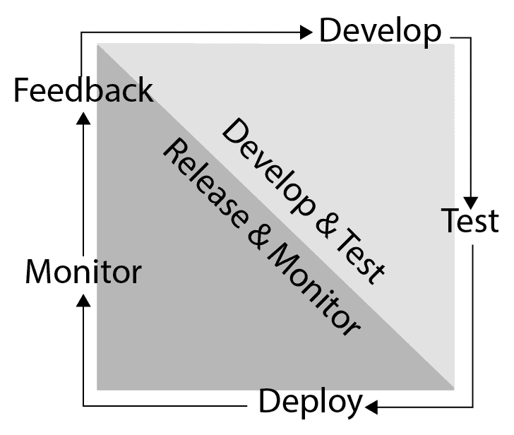
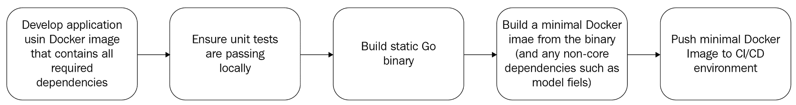
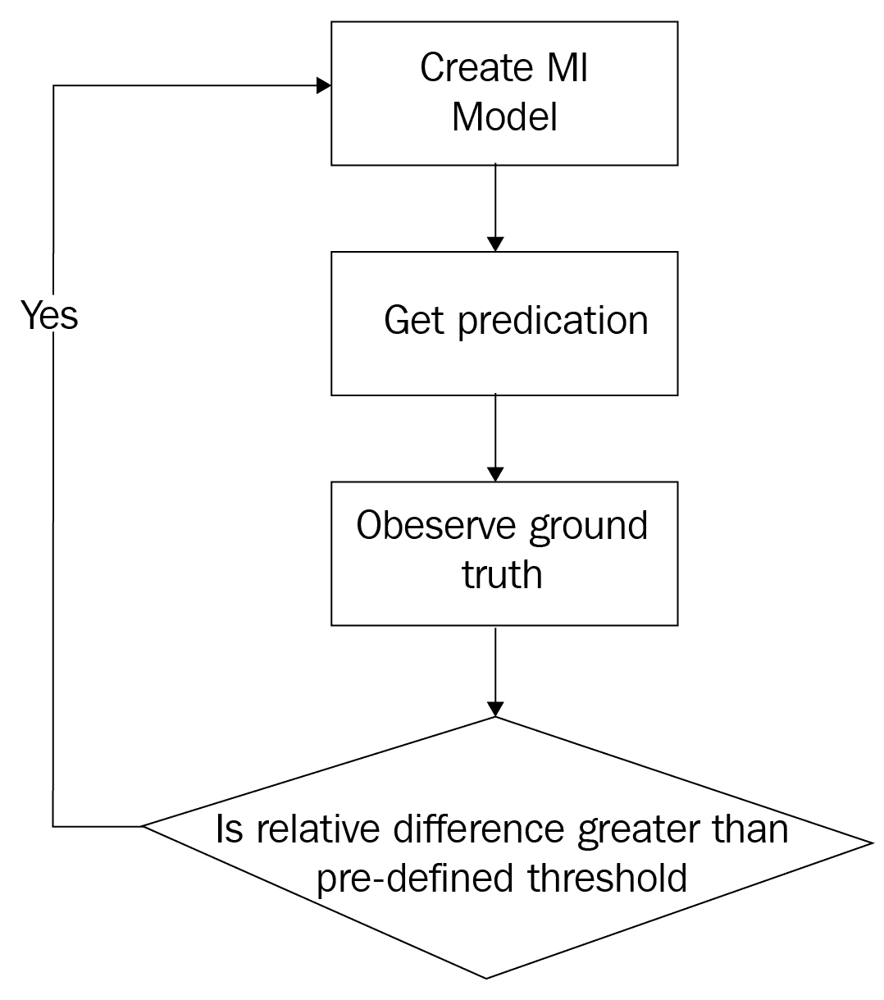

# 第六章：部署机器学习应用

在前面的章节中，我们学习了如何创建一个应用，可以为监督学习(第二章，“设置开发环境”）或无监督学习(第四章，“无监督学习”）的机器学习算法准备数据。我们还学习了如何评估和测试这些算法的输出，增加了额外的复杂性，即我们对算法的内部状态和工作原理的了解不完整，因此必须将其视为黑盒。在第五章“使用预训练模型”中，我们探讨了模型持久性和 Go 应用如何利用其他语言编写的模型。你迄今为止学到的技能构成了成功原型化机器学习应用所需的基本技能。在本章中，我们将探讨如何为商业准备你的原型，重点关注特定于机器学习应用的方面。

在本章中，你将涵盖以下主题：

+   持续交付反馈循环，包括如何测试、部署和监控机器学习应用

+   机器学习应用的部署模型

# 持续交付反馈循环

**持续交付**（**CD**）是在软件开发生命周期中使用短反馈循环的实践，以确保结果应用可以在任何时刻发布^([1]）。虽然存在其他发布管理方法，但我们只考虑这一种，因为创建一个有意义的、短的——因此是自动化的——反馈循环，对于机器学习应用来说，提出了独特的挑战，这些挑战不是由可能不需要这种程度自动化的其他方法所引起的。

CD 反馈循环包括以下过程：



图 1：持续交付反馈循环

# 开发

本书到目前为止所涵盖的反馈循环的开发部分。正如我们在第五章“使用预训练模型”中所论证的，在 Go 中开发机器学习模型既有优点也有缺点，有时将 Go 与其他语言（如 Python）结合使用，以利用如 Keras 等库，可以显著缩短开发周期的一部分。缺点是维护性降低，测试最终解决方案的工作量增加，因为它必然包含 Go-Python 接口（例如）。

# 测试

由于人类容易犯错，测试我们创建的源代码是开发周期中保证准确和可靠产品的关键要素。已经有许多书籍致力于这个主题，似乎软件测试的方法与软件工程师的数量一样多（如互联网搜索软件测试方法可以证实）。表面上看，机器学习应用尤其难以测试，因为它们看起来像一个黑盒，其输出取决于我们提供的训练集：我们提供数据，它们提供答案，但训练-测试集的微小变化或超参数的微小变化可能会为给定的输入向量产生不同的输出。我们如何确定他们提供的答案是否错误，是因为模型的超参数不正确，输入数据损坏，或者模型的算法有缺陷？或者这个特定的响应是隐藏在大量可接受响应中的异常值？

在前面的章节中，我们使用验证集对模型进行了统计测试，以衡量模型对有意义的输入样本的反应，并将这些反应与可用的预期输出值进行比较（监督学习）。可以说，这是测试机器学习模型准确度或精度的唯一方法，因为用数据集的不同样本（或改变的超参数）重新训练它们可能会为相同的输入产生不同的输出，但应该在具有相同准确度/精度指标的大型验证集上产生统计上较差的结果。换句话说，对模型进行小的修改，我们可能会看到它对单个输入向量的反应方式发生大的变化，但它的反应在测试足够大的输入向量样本（如验证集）时不应有太大差异。

这有两个后果。首先，单元测试通常的构建方式，即开发者选择输入值并断言输出结果，在模型发生最轻微的变化时可能会崩溃。因此，最好不要依赖于基于单个响应的断言。相反，最好使用跨更大集合并使用我们在第三章，“监督学习”，和第四章，“无监督学习”中介绍的技术，使用准确度或精度指标进行断言。

其次，可能存在边缘情况，我们希望保证模型的行为，或者我们希望保证某些响应永远不会发生（即使是作为异常行为）。如果我们不能确定一个黑盒模型能够实现这一点，将机器学习算法与传统的逻辑相结合是确保满足约束的唯一方法。例如，考虑谷歌最近禁止在谷歌图片搜索中使用“gorilla”作为搜索词，以防止一些意外出现的种族主义结果。使用 gorilla 图像对图像分类器进行统计测试将是困难的，并且只能覆盖这一个边缘情况；然而，知道什么是不被接受的反应，并添加约束逻辑来防止这种边缘情况是微不足道的，尽管可能有些尴尬。正如这个例子一样，传统的单元测试可以与统计测试相结合，传统的单元测试断言约束的输出，而统计测试直接断言模型输出。因此，机器学习测试的整体策略就出现了：

1.  **为模型定义准确度/精确度目标**：这可能不仅仅是一个单一的准确度分数，因为减少误报或漏报可能更为重要。例如，一个旨在确定抵押贷款申请人是否应该获得贷款的分类器可能需要谨慎行事，容忍更多的漏报而不是误报，这取决于贷款人的风险概况。

1.  **定义边缘情况的行为并将其编码到单元测试中**：这可能需要传统的逻辑来限制机器学习模型的输出，以确保满足这些约束，并使用传统的单元测试来断言机器学习模型的约束输出。

# 部署

一旦开发出机器学习应用，并且你已经测试过它，确保它按预期工作，CD 生命周期中的下一步就是部署软件——也就是说，采取步骤确保用户能够访问它。根据你打算在自己的硬件上运行应用程序还是打算使用**基础设施即服务**（**IaaS**）或**平台即服务**（**PaaS**）云等因素，存在不同的部署模型，我们将在下一节中讨论这些差异。在这里，我们假设你是在自己的服务器上运行应用程序，或者使用由 IaaS 提供商提供的虚拟基础设施。

机器学习应用在部署时可能面临一些独特的挑战，这些挑战在更简单的软件中是不存在的，例如一个连接到数据库的 HTTP 服务器：

+   依赖于需要 LAPACK 或 BLAS 的科学库会导致复杂的安装过程，有许多步骤，出错的可能性也很大。

+   依赖于深度学习库（如 TensorFlow）意味着需要动态链接到 C 库，这再次导致复杂的安装过程，包括许多与操作系统和架构相关的步骤，以及出错的机会。

+   深度学习模型可能需要在专用硬件（例如，配备 GPU 的服务器）上运行，即使是测试阶段。

+   ML 模型应该保存在哪里？是否应该像源代码一样提交它们？如果是这样，我们如何确保我们部署的是正确的版本？

接下来，我们将介绍解决这些挑战的解决方案以及体现这些解决方案的示例应用程序。

# 依赖项

任何尝试从源代码构建 TensorFlow 或 NumPy 的人都会同情那句俗语：“任何可能出错的事情都会出错”。在 Google、Stack Overflow 或它们各自的 GitHub 问题页面上搜索将揭示许多与构建过程相关的隐晦潜在问题^([3][4][5]）。这些并不是孤立发现，因为 ML 应用程序所依赖的科学计算库往往非常复杂，并且依赖于一个复杂且高度复杂的其他库集合。一个学术 ML 研究人员可能需要从源代码构建依赖项以利用某种优化，或者可能因为需要修改它们。相反，ML 应用程序开发者必须尽量避免这个过程，而是使用作为 Python wheels^([6])提供的预构建镜像、为所选包管理器（如 Ubuntu Linux 上的 apt 或 Windows 上的 Chocolatey^([7]）提供的预构建包，或者 Docker 镜像。

我们将关注 Docker 作为开发与打包 Go ML 应用的解决方案，原因有以下几点：

+   在广泛的操作系统之间的可移植性。

+   来自主要云供应商（如 Microsoft Azure^([8])和 Amazon Web Services^([9]）的出色支持。

+   支持使用 Terraform^([10])、Chef^([11])和 Ansible^([12])等工具在流行的配置和基础设施配置中集成 Docker。

+   通过预构建 Docker 镜像提供 ML 库。

+   Go 对 Docker 的特别适用性，因为它总是可以配置为生成静态二进制文件，这使我们能够大大减小生产 Docker 镜像的大小。

如果你已经尽可能减小了 Docker 镜像的大小（可能通过使用`scratch`镜像），但 Go 二进制文件的大小仍然使整体镜像对你来说太大，考虑使用`strip`命令或像`upx`这样的打包器。

在我们迄今为止查看的所有示例中，我们创建了一个包含我们应用程序所有依赖项以及应用程序文件的单一 Docker 镜像，通常使用 Dockerfile 中的`ADD`或`COPY`命令将这些文件添加到容器中。虽然这具有简单性的优势（开发和生产中只有一个 Dockerfile），但也意味着我们需要推送或拉取一个包含所有依赖项的过大 Docker 镜像来开发应用程序。

然而，可能不需要依赖关系来运行它，因为 Go 总是可以被配置为生成在精简的 Docker 镜像上运行的静态二进制文件。这意味着部署时间和测试时间会变慢，因为中间的 Docker 镜像可能不会在 CI 环境中缓存，更不用说一个更小的容器通常在其宿主服务器上使用更少的磁盘和内存。较小的镜像还有通过减少攻击面增加安全性的好处，因为它们将包含远少于攻击者可以利用的依赖项。例如，`scratch`镜像甚至不包含 shell，这使得攻击者即使容器中的应用程序本身被破坏，也很难对其进行破坏。

我们倡导的过程在以下图中展示：



图 2：使用两个独立的 Docker 镜像进行部署（一个用于开发，一个用于测试/生产）

在以下示例中，我们假设您已经有一个开发环境，其中所有依赖项都存在（这可能基于 Docker，或者不是——这并不重要）。您已经开发了自己的机器学习应用程序，它由一个`main`包和一些保存的模型权重`model.data`组成，并希望创建一个生产就绪的容器。为了创建这个容器，我们需要做两件事。

首先，我们需要将 Go 应用程序编译为静态二进制文件。如果您没有使用 CGO 并且链接到某些 C 库（如 TensorFlow C 库），那么使用不带任何附加标志的`go build`就足够了。但是，如果您的应用程序依赖于，比如说，TensorFlow C 库，那么您需要添加一些额外的命令行参数以确保生成的二进制文件是静态的——也就是说，它包含所有依赖的代码。在撰写本文时，有一个关于 Go 1.13 的提案，该提案为`build`命令添加了一个`-static`标志，这将无需进一步工作即可实现这一点。在此之前，Diogok 有一篇出色的博客文章解释了以下命令中的不同标志，以及如何在特定情况下调整它们：

```py
CGO_ENABLED=0 GOOS=linux GOARCH=amd64 go build -a -tags netgo -ldflags '-w -extldflags "-static"' -o mlapp *.go
```

这将生成一个包含所有必需依赖项的单个输出二进制文件`mlapp`。使用所有这些标志的目的是生成包含所有依赖项的静态二进制文件，这样我们只需将它们添加到“vanilla”Docker 镜像中，从而得到 Dockerfile：

```py
FROM scratch
ADD . /usr/share/app
ENTRYPOINT ["/usr/share/app/mlapp"]
```

就这样！没有其他需要添加的内容，与之前我们使用的长 Dockerfile 不同，因为我们需要所有依赖项。在这种情况下，我们已经在 Go 二进制文件内部有了这些依赖项。这是 Go 的另一个优点；与某些其他编程语言不同，Go 使得这种类型的部署成为可能。

您还可以使用 Dockerfile 公开一个端口（例如，如果您打算通过 HTTP 服务器提供应用程序），使用`EXPOSE`命令。要公开监听端口 80 的 HTTP 服务器，使用`EXPOSE 80/tcp`命令。

在前面的例子中，我们假设包含训练模型权重/超参数的模型文件已持久化到磁盘，并保存与我们的二进制文件一起，以便添加到 Docker 容器中；然而，在某些情况下，这可能是不可行或不希望的。

# 模型持久化

大多数时候，你可以遵循上述模式，将模型文件与源代码一起提交，并在部署时将它们与二进制文件一起添加到 Docker 镜像中；然而，有时你可能需要重新考虑这一点：

+   模型文件非常大，因此会导致非常大的 Docker 镜像，并减慢部署速度。

+   你拥有的模型文件数量是动态的，每个模型都与你的应用程序对象相关联——也就是说，你为每个用户训练一个模型。

+   模型的重新训练频率远高于代码可能发生的变化，导致非常频繁的部署。

在这些情况下，你可能希望从不同的来源提供模型，而不是将其提交到源控制。在基本层面上，模型文件只是一系列字节，因此它们可以存储在几乎任何地方：文件服务器、云文件存储或数据库。

例外情况是第二种情况：当你有一个与应用程序对象关联的动态数量的模型文件，例如用户。例如，如果你正在构建一个旨在预测家庭第二天将消耗多少电力的系统，你可能会为所有家庭或每个家庭创建一个模型。在后一种情况下，使用数据库来保存这些模型文件会更好：

+   模型文件可能包含敏感数据，最好在数据库中安全存储和管理。

+   大量的模型文件可以从数据库软件利用的高级压缩技术中受益，例如使用页面级压缩而不是行级压缩。这可以减少它们在磁盘上的总体大小。

+   将与应用程序对象相关的数据都保存在同一个地方可能更容易，以限制执行与模型相关的操作所需的查询次数，例如。

由于这些原因，以及其他原因，我们建议在应用程序需要许多模型，每个模型都与一个应用程序对象（如用户）相关联的情况下，将模型保存到数据库中。

这带来了一点挑战，因为一些 Go ML 库，如 GoML，公开了持久化函数，例如`linear`包模型的`PersistToFile`函数，这些函数将模型持久化到文件；然而，它们并不直接提供对序列化模型的访问，如果我们想将其持久化到其他地方。

我们可以应用两种技术：

+   查看 Godocs 以查看模型结构是否有未导出的字段。如果没有，我们可以简单地使用`encoding/json`来序列化模型。

+   如果有未导出字段，我们可以将模型保存到临时文件中，将临时文件读入内存，然后再删除它。

在 Go 中，一个**未导出字段**是一个具有小写名称的结构体字段，它在其定义的包外部不可访问。这些字段在`encoding/json`的序列化中不存在。

在 GoML 的`LeastSquares`模型的情况下，没有未导出字段，对`PersistToFile`方法的初步检查会显示它正在使用 encoding/JSON 将模型序列化到一个字节数组。因此，我们可以直接使用`serializedModel, err := json.Marshal(leastSquaresModel)`来序列化它。生成的`serializedModel`然后可以被保存在我们希望的地方。

但是，如果我们为了辩论的目的不能这样做，因为模型结构体有未导出字段怎么办？例如，golearn 库的`linear_models`包有一个`Export`方法，它将模型持久化到文件中，但这依赖于对 C 函数的调用，并且模型有未导出字段。在这种情况下，我们别无选择，只能首先将模型持久化到一个临时文件中，然后恢复文件内容：

```py
import (
  "io/ioutil"
  linear "github.com/sjwhitworth/golearn/linear_models"
)

func Marshal(model *linear.Model) ([]byte, error) {
  tmpfile, err := ioutil.TempFile("", "models")
  if err != nil {
    return nil, err
  }
  defer os.Remove(tmpfile.Name())
  if err := linear.Export(model, tmpfile.Name()); err != nil {
    return nil, err
  }
  return ioutil.ReadAll(tmpfile)
}
```

在前面的代码中，我们所做的一切只是提供一个临时的位置来存储模型文件在磁盘上，然后将其移回内存。虽然这不是存储模型的最高效方式，但由于一些 Go ML 库的接口限制，这是必要的，并且已经在 GoLearn 的 GitHub 页面上有一个开放的问题来改进这一点。

现在应用程序已经部署，我们希望有一些确定性，确保它正在正确运行，使用适当的资源量，并且没有潜在的问题可能会阻止它可用。在下一小节中，我们将探讨针对 ML 应用程序的特定监控技术。

# 监控

在他的书《规模架构》中，New Relic 的首席云架构师 Lee Atchison 主张使用风险矩阵，也称为**风险登记册**，来跟踪应用程序可能出错的情况以及如何缓解。虽然这可能看起来对于一个简单的应用程序来说有些过度，但它是在复杂环境中管理风险的优秀工具，尤其是在涉及 ML 模型的情况下。这是因为整个团队可以了解主要风险、它们的可能性和缓解措施，即使他们最初并没有参与创建应用程序的每一个部分。ML 模型有时可以由数据科学家创建，然后通过我们在第五章中概述的多语言集成方法之一，由软件开发团队接管，这使得了解与它们在生产中使用相关的任何风险都变得尤为重要。

虽然这看起来可能是一种相当主观的方法，但请记住，目标仅仅是让开发者思考什么可能导致他们的应用程序不可用。没有义务写下风险登记册或让你的团队使用一个（尽管两者都可能有益），但思考风险的做法总是通过照亮黑暗的角落，那里没有人想过要寻找那个难以捉摸的周五晚上导致整个应用程序在周一早上才恢复的虫子。

与生产应用程序相关的**风险**与测试失败不同，你希望在生产部署之前就捕捉到它。这是你在测试中假设为恒定的某些内容（例如可用内存或训练算法收敛）已经变为临界状态的风险。

与 ML 应用程序相关的风险可能包括但不限于以下内容：

+   模型实例运行内存不足

+   模型文件损坏，导致模型无法运行，尽管应用程序的其他部分可能仍然可用

+   如果在生产中进行模型重新训练，则训练过程不收敛，导致模型无用

+   恶意用户构建输入以试图欺骗模型产生期望的输出

+   恶意用户构建格式错误的输入（模糊测试）以使模型崩溃

+   上游服务，如存储 ML 模型的数据库不可用

+   云数据中心在 GPU 可用性不足时运行模型，这意味着自动扩展功能失败，并且你的深度学习模型的可用性因此降低

这个列表显然不是详尽的，但希望它能给你一个可能出现的各种问题的概念，以便你在自己的应用程序中寻找这些问题。因为很难列出详尽的列表，所以一般性的监控原则适用：

+   在可能的情况下，在应用程序中使用结构化日志并集中管理这些日志

+   如果在生产中进行重新训练，确保为训练过程中的任何错误设置警报，因为这必然会导致模型无用（或回退到过时的一个）

+   捕获可能用于检测任何风险在注册材料中显现的指标的重大变化（例如，内存空间的可用性）

Go 语言部分是为了服务 Web 应用而设计的^([17])，因此有许多第三方包可以帮助你执行这些任务，我们现在将探讨其中的一些。

# 结构化日志

Go 有很多日志库，例如标准库的`log`包^([18][19][20]）。使用结构化日志库（例如记录到 JSON 这样的标准格式）而不是简单使用自由文本的结构化日志的一个显著优势是，一旦创建，处理日志数据就更容易。不仅通过特定字段进行搜索更容易（例如，使用`jq`^([21])处理 JSON 数据），而且结构化日志允许与现有的监控和分析工具进行更丰富的集成，例如 Splunk^([22])或 Datadog^([23]）。

在以下示例中，我们将使用 Logrus 包来记录由训练过程返回的错误信息。请注意，使用这个特定的日志包是个人选择，任何其他结构化日志包也可以工作。

首先，我们配置记录器：

```py
import "github.com/sirupsen/logrus"

logrus.SetFormatter(&logrus.JSONFormatter{})
logrus.SetReportCaller(true) // Add a field that reports the func name
```

可以通过使用`JSONFormatter`结构体的属性^([24])来配置输出格式：

+   `TimestampFormat`：使用兼容时间格式的格式字符串（例如，`Mon Jan 2 15:04:05 -0700 MST 2006`）来设置时间戳的格式。

+   `DisableTimestamp`：从输出中移除时间戳

+   `DataKey`：而不是扁平的 JSON 输出，这个选项将所有日志条目参数放入给定的键中

+   `FieldMap`：使用此选项重命名默认输出属性，例如时间戳

+   `CallerPrettyfier`：当`ReportCaller`被激活（如前一个代码片段所示）时，可以通过调用此函数来自定义输出——例如，从调用者的方法中去除包名

+   `PrettyPrint`：这决定了是否缩进 JSON 输出

这里有一个示例，其中我们将其用于实际操作：

```py
import "github.com/sajari/regression"
model := new(regression.Regression)
 logrus.WithFields(logrus.Fields{ "model": "linear regression", }).Info("Starting training")
for i := range trainingX {
 model.Train(regression.DataPoint(trainingY[i], trainingX[i]))
}
if err := model.Run(); err != nil {

logrus.WithFields(log.Fields{
 "model": "linear regression",
 "error": err.Error(), }).Error("Training error")

}
 logrus.WithFields(logrus.Fields{ "model": "linear regression", }).Info("Finished training")
```

虽然这可能会产生比必要的更多输出，因为增加了两个 info 级别的消息，但我们可以使用`logrus.SetLevel`过滤掉这个级别的输出，如果不需要的话；然而，在生产中重新训练的情况下，训练时间很重要（确保训练过程完成也同样重要），所以记录日志中的过程记录永远不是一个坏主意，即使因此变得更加冗长。

当记录机器学习相关的信息时，有一个包含模型名称的字段（如果它们是由数据科学家创建的，可能对数据科学家有意义）是个好主意。当你在生产中同时运行多个模型时，有时很难判断哪个模型产生了错误！

训练算法所需的时间是我们建议定期计算并发送到专用指标系统的一个指标。我们将在下一小节中讨论捕获指标。

# 捕获指标

在先前的例子中，我们在日志中插入信息级消息以表示训练过程的开始和结束。虽然我们可以查看这两个消息的时间戳字段并将它们进行比较以确定训练过程花费了多长时间（例如，Splunk 可以通过正确的查询做到这一点），但实现相同结果的一种更直接、更简单的方法是显式地监控这个特定的数据点或指标。然后，如果训练过程变得过长，我们可以发出警报，或者有一个图表记录并显示常规模型训练过程所花费的时间。

我们可以使用两种方法：

+   将指标存储在日志条目上的一个附加字段中，字段值为`float64`

+   将指标存储在单独的分析系统中

最终，你采取的方法取决于你当前的分析系统、团队偏好和应用程序的大小。就机器学习应用而言，两种方法都同样有效，因此我们将假设第一种方法，因为它减少了所需的第三方应用程序代码量。

重复使用之前的例子，让我们设置如下：

```py
import "github.com/sajari/regression"
model := new(regression.Regression)
 log.WithFields(log.Fields{ "model": "linear regression", }).Info("Starting training")
start := time.Now()

for i := range trainingX {
 model.Train(regression.DataPoint(trainingY[i], trainingX[i]))
}
if err := model.Run(); err != nil {
log.WithFields(log.Fields{ "model": "linear regression",
 "error": err.Error(), }).Error("Training error")

}
elapsed := time.Since(start)
 log.WithFields(log.Fields{ "model": "linear regression",
 "time_taken": elapsed.Seconds(), }).Info("Finished training")
```

注意，我们没有在计时块中包含任何日志调用。这是因为我们想要测量训练过程所花费的时间，而不是围绕它的任何日志。

如果你的公司使用分析系统，例如 Grafana 或 InfluxDB，你仍然可以使用之前描述的相同方法——只需确保为你的指标创建一个合理的名称，包括机器学习模型的名称。

在最后的子节中，我们将考虑准确性/精确度指标如何帮助在机器学习应用中创建反馈循环。

# 反馈

在任何系统中获取反馈的过程旨在改进系统。在机器学习应用的情况下，反馈可以帮助使应用在注册风险（或之前未缓解的新风险的添加）方面更加稳健，但这并不仅限于机器学习应用；所有生产应用都受益于反馈循环。然而，有一个特殊的反馈循环是特定于机器学习应用的。

机器学习模型是基于它满足某些准确性/精确度标准，使其在从数据中提取意义方面比简单的启发式方法更好或更通用。在第三章*监督学习*和第四章*无监督学习*中，我们概述了一些这些指标，例如房价回归的平均平方误差或二进制分类器在衣服图像上的测试/验证准确性。在我们目前的 CD 周期中，我们假设一旦创建了一个模型，其准确性将不会随着新输入而改变；然而，这很少是一个现实的假设。

考虑我们来自第三章的 MNIST 时尚分类器，*监督学习*，其目的是确定一张图片是否代表一条裤子。目前，这个数据库中不包含任何喇叭裤的图片。如果这些款式再次流行起来，而我们模型开始接收到的所有图片都是喇叭裤，会怎样呢？我们可能会注意到用户抱怨图片没有被正确分类。这样的考虑导致了许多依赖机器学习模型的网站添加了“对我的预测评分”模型，以期确保模型仍然输出相关的预测。

当然，这是一个有效的方法，尽管它依赖于客户告诉你产品何时工作不正常。因为客户更有可能在体验不满意时使用这些反馈功能^([26])，所以从这个练习中获得的数据，尽管仍然有用，但很可能偏向负面，因此不能自动用作代理准确度指标。

在客户提供图片并且你的模型对它们进行分类的情况下，这仍然可能是你的最佳选择，除非你能编写一个用于抓取新裤子图片的爬虫，并将它们持续输入到模型中，并测量其响应。这将是一项劳动密集型的工作，但显然会产生更好的结果，当然，前提是爬虫找到的裤子类型代表了客户提供的裤子图片的类型。在其他情况下，一些自动化的反馈循环可能是可能的，其中你可以直接监控模型的准确性，无论是在测试还是生产中，并据此决定何时重新训练模型。

考虑一个不同的场景，即你被要求根据住户数量和预测温度曲线等数据点预测大量家庭第二天个人的电力消耗。你决定为每个家庭使用一个回归模型，并在模型训练完成后将回归参数存储在数据库中。然后，每天你将运行数据库中的每个模型以生成预测。

在这种情况下，反馈循环非常简单，因为每天您还可以测量家庭的实际电力消耗，并将其与您的模型预测进行比较。然后，一个预定脚本可以比较在一定时期内两者的相对差异，可能使用移动平均来平滑任何异常，如果这种差异大于某个预定义的阈值，那么就可以假设模型的一些输入数据已更改，并且模型需要在新的数据集上重新训练。另一种选择是，如果模型的任何输入参数发生变化，则重新训练该模型，尽管这可能导致大量的不必要重新训练，从而增加额外的成本，因为预测温度曲线可能每天都会变化，因此每个模型可能每天都需要重新训练。

具有持续验证和重新训练的机器学习应用程序的反馈循环如下：



图 3：具有持续验证的机器学习应用程序的反馈循环

并非所有机器学习应用程序都可以应用反馈循环，但只要有一点创意，通常可以找到一种方法来找到既不在训练数据集也不在测试数据集中的输入样本，但这些样本具有更新的相关性。如果您可以自动化从这些样本生成预测并存储其与真实值的差异的过程，那么您仍然可以生成相同的反馈循环。

# 机器学习应用程序的部署模型

在前面的例子中，我们解释了如何使用 Docker 部署机器学习应用程序，以包含其依赖项。我们故意避免讨论将要运行这些容器的任何基础设施或任何可能促进开发或部署的平台即服务产品。在本节中，我们考虑了在假设应用程序将被部署到支持 IAAS 和平台即服务模型的云平台（如 Microsoft Azure 和 Amazon Web Services）的情况下，机器学习应用程序的不同部署模型。

本节专门编写，旨在帮助您在将机器学习应用程序部署到云端时决定使用哪种虚拟基础设施。

对于任何云应用程序，主要有两种部署模型：

+   **基础设施即服务**：这是一种云服务，提供与虚拟化硬件（如虚拟机）的高级交互，而无需客户维护硬件或虚拟化层。

+   **平台即服务**：这是一种云服务，提供软件即服务组件，您可以从这些组件构建应用程序，例如无服务器执行环境（例如，AWS Lambda）。

我们将考虑这两种选项，以及如何最好地利用它们来为机器学习应用服务。我们将根据截至 2018 年第四季度的市场份额比较和对比三个主要供应商：亚马逊网络服务、微软 Azure 和 Google Cloud^([30])。

# 基础设施即服务

在本章的早期部分，我们解释了如何使用 Docker 打包一个机器学习应用。在本小节中，我们将探讨使用 Docker 将机器学习应用部署到 AWS、Azure 或 Google Cloud 的简单方法。

在每种情况下，我们都会首先解释如何将你的本地 Docker 镜像推送到一个**注册表**（即一个将存储镜像并向你的基础设施的其他部分提供镜像的机器）。使用 Docker 注册表存储你的镜像有几种优点：

+   **更快的部署和构建时间**：需要镜像的虚拟基础设施组件可以直接从注册表中拉取，而不是每次都从头开始构建。

+   **在应用中实现自动扩展的简便性**：如果你每次需要扩展服务时都必须等待长时间的 Docker 构建——比如，对于 TensorFlow 来说，可能需要 20 分钟——那么你可能会遇到性能下降或不可用的情况。

+   **安全性**：从单个可信源拉取镜像可以减少攻击面

# 亚马逊网络服务

AWS 虚拟化 IaaS 服务的核心是**弹性计算**（**EC2**）。AWS 还提供**弹性容器注册表**（**ECR**）作为注册表服务来提供镜像。要设置此服务，请按照以下步骤操作：

在你能够将镜像推送到或从 ECR 注册表拉取之前，你需要`ecr:GetAuthorizationToken`权限。

1.  标记你的镜像，假设其 ID 为`f8ab2d331c34`：

```py
docker tag f8ab2d331c34 your_aws_account_id.dkr.ecr.region.amazonaws.com/my-ml-app
```

1.  将镜像推送到 ECR：

```py
docker push your_aws_account_id.dkr.ecr.region.amazonaws.com/my-ml-app
```

现在，这个镜像可以从 EC2 实例中使用。首先，按照第五章，*使用预训练模型*中的说明 SSH 到你的实例，然后运行以下命令来安装 Docker 并从镜像启动一个容器（修改`docker run`命令以添加公开的端口或卷）：

```py
docker pull your_aws_account_id.dkr.ecr.region.amazonaws.com/my-ml-app && \
docker run -d your_aws_account_id.dkr.ecr.region.amazonaws.com/my-ml-app
```

# 微软 Azure

与我们在前一小节中讨论的亚马逊的 ECR 类似，微软 Azure 提供了一个注册表，即 Azure Container Registry。我们可以通过遵循与 AWS ECR 相同的步骤来使用它，但有一个区别，即需要通过 Docker 命令行界面进行登录。一旦完成，你可以遵循前一小节的相同说明，但使用你的注册表和镜像详细信息：

```py
docker login myregistry.azurecr.io
```

微软还允许将 Docker 作为 App Service Apps 的部署方法，这是一个基于微软的**互联网信息服务**（**IIS**）的托管 Web 应用服务。如果你已经按照前面的步骤将 Docker 镜像部署到注册表，你可以使用`az`命令行工具从你的镜像创建一个 Web 应用：

```py
az webapp create --resource-group myResourceGroup --plan myAppServicePlan --name <app name> --deployment-container-image-name myregistry.azurecr.io/my-ml-app
```

# Google Cloud

与亚马逊和微软一样，谷歌也提供了一个名为 Container Registry 的注册表，它可以作为 Docker 注册表使用。使用它的步骤与 Amazon ECR 相同，只是增加了使用 `gcloud` 命令行工具进行初步认证步骤：

```py
gcloud auth configure-docker
```

现在您可以推送镜像：

```py
docker tag quickstart-image gcr.io/[PROJECT-ID]/quickstart-image:tag1
```

在 Google Cloud VM 上运行 Docker 容器的步骤与 EC2 VM 相同，只是增加了认证步骤。

# 平台即服务

随着机器学习组件在应用中的日益流行，云服务提供商纷纷推出平台即服务产品，以简化机器学习应用的部署，以期吸引客户。简要回顾一下截至 2018 年市场份额的三个主要云服务提供商是值得的^([30])。这并不是要推荐一个供应商而不是另一个，而是试图在保持对您可能已经做出的任何关于云供应商的决定的独立性的同时探索解决方案。换句话说，我们将讨论的部署模型将在所有三个云中（以及可能的其他云）工作——并且某些平台提供特定的服务，可能更适合某些应用或减少其开发工作量。

云服务提供商频繁更改其服务，因此在您阅读此内容时，可能会有比这里描述的更新、更好的服务。请查看 *进一步阅读* 部分中提供的 Google Cloud、AWS 和 Azure ML 服务的链接^([27][28][29])。

# 亚马逊网络服务

**亚马逊网络服务**（**AWS**）在机器学习领域提供两种主要的服务类型：

+   **AWS SageMaker**：一个托管环境，用于运行机器学习笔记本和 SDK，以高效地执行各种与机器学习相关的任务，包括数据标注

+   **AWS AI 服务**：一组针对特定任务的预训练模型，例如图像识别

# 亚马逊 SageMaker

亚马逊 SageMaker 使用 Jupyter 作为机器学习模型的开发环境，正如我们在整本书中所做的那样。这些 Jupyter 笔记本运行的环境包含一些 Python 机器学习库。对于 Python 开发者来说，这项服务可以被视为另一个运行机器学习代码的环境，并具有一些通过 AWS 资源加速大规模学习的功能。使用 SageMaker 在自然语言处理任务上进行超参数调整的示例可以在 AWS GitHub^([31]) 上找到，更长的介绍可以在 YouTube^([33]) 上找到。不幸的是，目前还没有办法使用 SageMaker 与 Jupyter 的 Go 内核（如 gophernotes）一起使用，因此它不是在远程环境中交互式开发机器学习应用的纯 Go 解决方案。

对于需要与现有 Sagemaker 解决方案交互的 Go 开发者，有一个 SDK 具有与 Python SDK^([32]) 相当多的相同功能，因此可以使用 gophernotes 在本地创建 Sagemaker 任务。事实上，这个 SDK 非常强大，它允许 Go 开发者访问一个有用的数据预处理服务：Sagemaker 标签作业服务。该服务与 Mechanical Turk 集成，为训练数据提供地面实况标签，这些数据要么完全缺失，要么来自数据集的一部分。与手动设置 Mechanical Turk 作业相比，这节省了大量时间。暴露此功能的功能是`CreateLabelingJob`。

如果您需要使用监督学习算法，但只有未标记的数据集，请考虑使用 Sagemaker 的 Mechanical Turk 接口来便宜地标记您的数据集。或者，您可以通过 Mechanical Turk UI 在[`www.mturk.com/`](https://www.mturk.com/)创建标记任务。

# Amazon AI 服务

如果已经有一个模型公开解决了您的 ML 问题，那么您就没有必要重新发明轮子并训练一个新的模型，尤其是考虑到 AWS 将投入大量资源来确保其模型的准确性和效率。在撰写本文时，以下类型的算法以按使用付费的方式提供：

+   **Amazon Personalize**: 建立在亚马逊在线零售店使用的相同推荐技术之上，这些技术允许您解决诸如显示与客户已购买的商品类似的项目等问题

+   **Amazon Forecast**: 时间序列预测模型

+   **Amazon Rekognition**: 图像和视频分析

+   **Amazon Comprehend**: 自然语言处理任务和文本分析

+   **Amazon Textract**: 大规模文档分析

+   **Amazon Polly**: 文本转语音

+   **Amazon Lex**: 在 UI 环境中构建聊天机器人

+   **Amazon Translate**: 自动翻译到和从多种语言

+   **Amazon Transcribe**: 语音转文本服务

虽然这些服务都不是 Go 特定的，但它们都提供了 Go SDK，您可以使用它来与之交互。这与我们在第五章中看到的示例非常相似，即*使用预训练模型*，其中模型通过 HTTP 公开，我们使用此协议发送数据并接收预测。

通常，这些方法是同步的——也就是说，您将在输出参数中获得结果，并且以后不需要进一步请求。它们还具有相同类型的签名，其中预测方法的名称可能不同，输入/输出的结构也会不同：

```py
func (c *NameOfService) NameOfPredictionMethod(input
     *PredictionMethodInput) (*PredictionMethodOutput, error)
```

以 Rekognition 为例，与其他服务一样，它有一个 Go SDK^([34])。假设我们希望检测图像中的面部。为此，我们使用`DetectFaces`函数；它具有以下签名：

```py
func (c *Rekognition) DetectFaces(input *DetectFacesInput
     (*DetectFacesOutput, error)
```

在这个例子中，输入包含我们希望返回的数组形式的面部特征，以及一张图片，可以是 base-64 编码的字节或 S3 对象。输出将包含一个`FaceDetail`结构体，其中将描述每个面部年龄范围、是否留胡须、其边界框的置信度、检测到的情绪、是否戴眼镜等等。这取决于我们在输入中请求了哪些面部特征，并且必然地，我们请求的特征越多，请求的成本就越高（因为亚马逊需要运行更多的模型来给出答案）。

通常，如果你可以通过组合通过 SDK 公开的预构建模型来构建你的 ML 应用程序，那么你可以节省大量时间，这将使你能够专注于添加特定于你业务的价值；然而，与供应商锁定相关的风险是存在的，并且在撰写本文时，没有其他云平台提供与亚马逊 AI 服务功能对等的选择。

# Microsoft Azure

Azure 针对 ML 应用程序的主要产品如下：

+   **Azure ML Studio**：一个用于构建 ML 管道和训练模型的 UI 环境

+   **Azure 认知服务**：通过 HTTP 公开预训练模型

# Azure ML Studio

Azure ML Studio 是一个基于云的 ML IDE。它允许用户从其他 Azure 服务（如 Blob 存储）导入数据，转换数据，并使用它来训练包含的 ML 算法之一。然后，可以通过 HTTP 公开该模型，或者与其他 Azure 服务（如 Azure 流分析）组合，以用于实时 ML 应用程序^([35])。

虽然在 Azure ML Studio UI 中可以运行自定义 Python 代码，但在撰写本文时，这并不包括 Go；然而，因为可以通过 HTTP 公开模型，你可以通过遵循我们在第五章“使用预训练模型”中讨论的相同模式来集成现有的 Azure ML Studio 模型，其中使用`net/http`客户端来发送请求。仅为了生成身份验证令牌而使用 Azure SDK 是值得的，而不是尝试自己实现，因为该过程可能会出错^([36])。与 AWS 相比，请求和响应的 JSON 结构非常简单，因此生成的代码可以干净且易于维护。

# Azure 认知服务

Azure 认知服务通过 HTTP 公开了几个预训练的 ML 模型：

+   **计算机视觉**：图像识别

+   **语音**：语音识别和转录

+   **LUIS**：文本意图分析

+   **Bing 图像搜索**：检索与文本字符串匹配的图像

+   **Bing 网络搜索**：检索与文本字符串匹配的 URL

+   **文本分析**：情感分析

在撰写本文时，没有 Go SDK 可以与认知服务交互，但可以通过使用 REST API 来调用模型，并且微软在快速入门文章中提供了一个示例^([37])。

# Google Cloud

除了免费的 Google Colaboratory^([29])之外，Google Cloud 目前为机器学习应用程序开发者提供两项主要服务：

+   **AI Platform**：使用 Notebooks、VM 镜像或 Kubernetes 镜像的托管开发环境

+   **AI Hub**：托管即插即用 AI 组件的仓库

+   **AI Building Blocks**：通过 SDK 或 HTTP 暴露的预训练模型

因为 AI Hub 仅针对 Python 开发者，并且其部署模型与 AI 平台相同，所以我们不会进一步讨论它。

# AI 平台

Google 的 AI Hub 是一个基于代码的环境，旨在促进机器学习应用程序开发生命周期的各个方面，从数据摄取到部署，通过 AI Platform Prediction（适用于作为`SavedModel`导出的 TensorFlow 模型，如我们第五章，*使用预训练模型*示例）或 Kubernetes。它与其他 Google Cloud 服务有松散的集成，但其核心仍然是一个托管笔记本环境。

因为没有高级 API 可以在 Go 中创建 TensorFlow 图，类似于 Python 中的 Keras，所以 Go 开发者不太可能发现端到端平台有用。然而，如果您正在与 TensorFlow 模型交互，使用 AI Platform Prediction 来管理模型资源并通过 HTTP^([40])调用它是一个很好的策略，特别是当模型可以在具有 Tensor Processing Unit 的 VM 上运行时，这可以是一个显著降低运行 TensorFlow 工作流程成本的方法^([39])。

# AI Building Blocks

Google 的 AI Building Blocks 是一套预训练模型，通过 HTTP 或 Google Cloud 的 SDK 之一进行暴露：

+   **Sight**：包括视觉，用于图像识别，以及视频，用于内容发现

+   **语言**：包括翻译和自然语言处理功能

+   **对话**：包括语音转文本模型、文本转语音模型和聊天框构建器

+   **结构化数据**：

+   +   **Recommendations AI**：推荐引擎

    +   **AutoML Tables**：生成预测模型的 UI

    +   **Cloud Inference AI**：时间序列推理和相关性工具

Go SDK 非常易于使用，以下示例将展示这一点。该示例使用文本转语音 API 下载由机器模型说出的短语`hello, world`的录音：

```py
package main
import (
     "context"
     "fmt"
     "io/ioutil"
     "log"
    texttospeech "cloud.google.com/go/texttospeech/apiv1"
     texttospeechpb "google.golang.org/genproto/googleapis/cloud/texttospeech/v1"
)
func main() {
     ctx := context.Background()
    c, err := texttospeech.NewClient(ctx)
     if err != nil {
         log.Fatal(err)
     }

    req := texttospeechpb.SynthesizeSpeechRequest{
         Input: &texttospeechpb.SynthesisInput{
     InputSource: &texttospeechpb.SynthesisInput_Text{Text: "Hello, World!"},
     },
     Voice: &texttospeechpb.VoiceSelectionParams{
         LanguageCode: "en-US",
         SsmlGender: texttospeechpb.SsmlVoiceGender_NEUTRAL,
     },
     AudioConfig: &texttospeechpb.AudioConfig{
         AudioEncoding: texttospeechpb.AudioEncoding_WAV,
     },
 }
    resp, err := c.SynthesizeSpeech(ctx, &req)
         if err != nil {
         log.Fatal(err)
     }
     filename := "prediction.wav"
     err = ioutil.WriteFile(filename, resp.AudioContent, 0666)
     if err != nil {
         log.Fatal(err)
     }
}
```

与其他通过 HTTP 类型的服务模型一样，如果您可以通过组合这些预制的模型来构建您的应用程序，那么您可以专注于工作在增值业务逻辑上；然而，始终要考虑供应商锁定带来的不利影响。

# 摘要

在本章中，我们讨论了如何将原型机器学习应用程序推向生产。在这个过程中，我们探讨了软件开发者或 DevOps 工程师通常会考虑的问题，但都是从机器学习应用程序开发者的角度出发。具体来说，我们学习了如何将持续开发生命周期应用于机器学习应用程序，以及云中部署机器学习应用程序的不同方式。

在下一章和最后一章中，我们将退后一步，从项目管理角度审视机器学习开发。

# 进一步阅读

1.  *持续软件工程及其超越：趋势和挑战，布赖恩·菲茨杰拉德*，第 1 届快速持续软件工程国际研讨会。纽约，纽约：计算机协会出版社，第 1-9 页。

1.  *谷歌解决算法性种族歧视的方法*：禁止大猩猩：[`www.theguardian.com/technology/2018/jan/12/google-racism-ban-gorilla-black-people`](https://www.theguardian.com/technology/2018/jan/12/google-racism-ban-gorilla-black-people). 2019 年 5 月 3 日检索。

1.  *从源代码构建 Numpy*：[`robpatro.com/blog/?p=47`](http://robpatro.com/blog/?p=47). 2019 年 5 月 5 日检索。

1.  *Python—使用 OpenBLAS 集成编译 Numpy*：[`stackoverflow.com/questions/11443302/compiling-numpy-with-openblas-integration`](https://stackoverflow.com/questions/11443302/compiling-numpy-with-openblas-integration). 2019 年 5 月 5 日检索。

1.  *TensorFlow 的问题*：[`github.com/tensorflow/tensorflow/issues`](https://github.com/tensorflow/tensorflow/issues). 2019 年 5 月 5 日检索。

1.  *Python Wheels*：[`pythonwheels.com/`](https://pythonwheels.com/). 2019 年 5 月 5 日检索。

1.  *Chocolateay—Windows 的包管理器*：[`chocolatey.org/`](https://chocolatey.org/). 2019 年 5 月 5 日检索。

1.  *在 Azure 上部署 Docker*：[`azure.microsoft.com/en-gb/services/kubernetes-service/docker/`](https://azure.microsoft.com/en-gb/services/kubernetes-service/docker/). 2019 年 5 月 5 日检索。

1.  *什么是 Docker？| AWS*：[`aws.amazon.com/docker/`](https://aws.amazon.com/docker/). 2019 年 5 月 5 日检索。

1.  *Terraform 的 Docker 提供者*：[`www.terraform.io/docs/providers/docker/r/container.html`](https://www.terraform.io/docs/providers/docker/r/container.html). 2019 年 5 月 5 日检索。

1.  *Docker 的 Chef 食谱*：[`github.com/chef-cookbooks/docker`](https://github.com/chef-cookbooks/docker). 2019 年 5 月 5 日检索。

1.  *Docker—管理 Docker 容器*[: https://docs.ansible.com/ansible/2.6/modules/docker_module.html](https://docs.ansible.com/ansible/2.6/modules/docker_module.html). 2019 年 5 月 5 日检索。

1.  cmd/go: build: 添加静态标志：[`github.com/golang/go/issues/26492`](https://github.com/golang/go/issues/26492). 2019 年 5 月 5 日检索。

1.  *关于 Golang 静态二进制文件、交叉编译和插件*：[`medium.com/@diogok/on-golang-static-binaries-cross-compiling-and-plugins-1aed33499671`](https://medium.com/@diogok/on-golang-static-binaries-cross-compiling-and-plugins-1aed33499671). 2019 年 5 月 5 日检索。

1.  *在文件系统外保存模型*：[`github.com/sjwhitworth/golearn/issues/220`](https://github.com/sjwhitworth/golearn/issues/220). 2019 年 5 月 6 日检索。

1.  *《为规模而设计》，李·阿奇森，2016 年，奥莱利出版社。

1.  *Server-side I/O: Node.js vs PHP vs Java vs Go*: [`www.toptal.com/back-end/server-side-io-performance-node-php-java-go`](https://www.toptal.com/back-end/server-side-io-performance-node-php-java-go). 获取日期：2019 年 5 月 6 日。

1.  *Zap*: [`github.com/uber-go/zap`](https://github.com/uber-go/zap). 获取日期：2019 年 5 月 6 日。

1.  *Logrus*: [`github.com/sirupsen/logrus`](https://github.com/sirupsen/logrus). 获取日期：2019 年 5 月 6 日。

1.  *Log*: [`github.com/apex/log`](https://github.com/apex/log). 获取日期：2019 年 5 月 6 日。

1.  *jq*: [`stedolan.github.io/jq/`](https://stedolan.github.io/jq/). 获取日期：2019 年 5 月 6 日。

1.  *Splunk*: [`www.splunk.com/`](https://www.splunk.com/). 获取日期：2019 年 5 月 6 日。

1.  *Datadog*: [`www.datadoghq.com/`](https://www.datadoghq.com/). 获取日期：2019 年 5 月 6 日。

1.  *logrus—GoDoc*: [`godoc.org/github.com/sirupsen/logrus#JSONFormatter`](https://godoc.org/github.com/sirupsen/logrus#JSONFormatter). 获取日期：2019 年 5 月 6 日。

1.  *Grafana*: [`grafana.com/`](https://grafana.com/). 获取日期：2019 年 5 月 6 日。

1.  *Bias of bad customer service interactions*: [`www.marketingcharts.com/digital-28628`](https://www.marketingcharts.com/digital-28628). 获取日期：2019 年 5 月 6 日。

1.  *Machine Learning on AWS*: [`aws.amazon.com/machine-learning/`](https://aws.amazon.com/machine-learning/). 获取日期：2019 年 5 月 6 日。

1.  *Azure Machine Learning Service*: [`azure.microsoft.com/en-gb/services/machine-learning-service/`](https://azure.microsoft.com/en-gb/services/machine-learning-service/). 获取日期：2019 年 5 月 6 日。

1.  *Cloud AI*: [`cloud.google.com/products/ai/`](https://cloud.google.com/products/ai/). 获取日期：2019 年 5 月 6 日。

1.  *Cloud Market Share Q4 2018 and Full Year 2018*: [`www.canalys.com/newsroom/cloud-market-share-q4-2018-and-full-year-2018`](https://www.canalys.com/newsroom/cloud-market-share-q4-2018-and-full-year-2018). 获取日期：2019 年 5 月 11 日。

1.  *Amazon Sagemaker Example*: [`github.com/awslabs/amazon-sagemaker-examples/blob/master/scientific_details_of_algorithms/ntm_topic_modeling/ntm_wikitext.ipynb`](https://github.com/awslabs/amazon-sagemaker-examples/blob/master/scientific_details_of_algorithms/ntm_topic_modeling/ntm_wikitext.ipynb). 获取日期：2019 年 5 月 11 日。

1.  *Sagemaker SDK for Go*: [`docs.aws.amazon.com/sdk-for-go/api/service/sagemaker`](https://docs.aws.amazon.com/sdk-for-go/api/service/sagemaker)/. 获取日期：2019 年 5 月 11 日。

1.  *An overview of Sagemaker*: [`www.youtube.com/watch?v=ym7NEYEx9x4`](https://www.youtube.com/watch?v=ym7NEYEx9x4). 获取日期：2019 年 5 月 11 日。

1.  *Rekognition Go SDK*: [`docs.aws.amazon.com/sdk-for-go/api/service/rekognition/`](https://docs.aws.amazon.com/sdk-for-go/api/service/rekognition/). 获取日期：2019 年 5 月 11 日。

1.  *Azure 流分析与 Azure 机器学习集成*: [`docs.microsoft.com/en-us/azure/stream-analytics/stream-analytics-machine-learning-integration-tutorial`](https://docs.microsoft.com/en-us/azure/stream-analytics/stream-analytics-machine-learning-integration-tutorial). 获取日期：2019 年 5 月 11 日。

1.  *Azure Go SDK*: [`github.com/Azure/azure-sdk-for-go`](https://github.com/Azure/azure-sdk-for-go). 获取日期：2019 年 5 月 11 日。

1.  *消费 Web 服务*: [`docs.microsoft.com/en-us/azure/machine-learning/studio/consume-web-services`](https://docs.microsoft.com/en-us/azure/machine-learning/studio/consume-web-services). 获取日期：2019 年 5 月 11 日。

1.  *快速入门：使用 Go 调用文本分析 API*. [`docs.microsoft.com/en-us/azure/cognitive-services/text-analytics/quickstarts/go`](https://docs.microsoft.com/en-us/azure/cognitive-services/text-analytics/quickstarts/go). 获取日期：2019 年 5 月 11 日。

1.  *深度学习硬件成本比较*: [`medium.com/bigdatarepublic/cost-comparison-of-deep-learning-hardware-google-tpuv2-vs-nvidia-tesla-v100-3c63fe56c20f`](https://medium.com/bigdatarepublic/cost-comparison-of-deep-learning-hardware-google-tpuv2-vs-nvidia-tesla-v100-3c63fe56c20f). 获取日期：2019 年 5 月 11 日。

1.  *预测概述*: [`cloud.google.com/ml-engine/docs/tensorflow/prediction-overview`](https://cloud.google.com/ml-engine/docs/tensorflow/prediction-overview). 获取日期：2019 年 5 月 11 日。

1.  *Google AI Hub*: [`cloud.google.com/ai-hub/`](https://cloud.google.com/ai-hub/). 获取日期：2019 年 5 月 11 日。

1.  *Amazon ECR 管理策略*: [`docs.aws.amazon.com/AmazonECR/latest/userguide/ecr_managed_policies.html`](https://docs.aws.amazon.com/AmazonECR/latest/userguide/ecr_managed_policies.html). 获取日期：2019 年 5 月 11 日。

1.  *App Service - 容器 Web 应用*: [`azure.microsoft.com/en-gb/services/app-service/containers/`](https://azure.microsoft.com/en-gb/services/app-service/containers/). 获取日期：2019 年 5 月 11 日。

1.  *将 Docker 镜像推送到私有注册库*: [`docs.microsoft.com/en-gb/azure/container-registry/container-registry-get-started-docker-cli`](https://docs.microsoft.com/en-gb/azure/container-registry/container-registry-get-started-docker-cli). 获取日期：2019 年 5 月 11 日。

1.  *在 Linux 上创建 Docker/Go 应用*: [`docs.microsoft.com/en-gb/azure/app-service/containers/quickstart-docker-go`](https://docs.microsoft.com/en-gb/azure/app-service/containers/quickstart-docker-go). 获取日期：2019 年 5 月 11 日。

1.  *容器注册库*: [`cloud.google.com/container-registry/`](https://cloud.google.com/container-registry/). 获取日期：2019 年 5 月 11 日。

1.  *Docker 快速入门*: [`cloud.google.com/cloud-build/docs/quickstart-docker`](https://cloud.google.com/cloud-build/docs/quickstart-docker). 获取日期：2019 年 5 月 11 日。

1.  *Mechanical Turk*: [`www.mturk.com/`](https://www.mturk.com/). 获取日期：2019 年 5 月 15 日。

1.  *使用这个奇怪的小技巧缩小你的 Go 可执行文件*：[`blog.filippo.io/shrink-your-go-binaries-with-this-one-weird-trick/`](https://blog.filippo.io/shrink-your-go-binaries-with-this-one-weird-trick/). 2019 年 5 月 16 日检索。
