# 第七章：时间序列与异常检测

我们到目前为止讨论的大多数模型都是基于与某个事物相关的其他属性来预测该事物的某个属性。例如，我们根据花朵的测量值预测了花朵的物种。我们还尝试根据患者的医疗属性来预测患者糖尿病的进展。

时间序列建模的前提与这些类型的属性预测问题不同。简单来说，时间序列建模帮助我们根据过去的属性来预测未来。例如，我们可能想根据该股票价格的历史值来预测未来的股票价格，或者我们可能想根据之前某个时间点我们网站上用户数量的数据来预测在某个时间点会有多少用户访问我们的网站。这有时被称为**预测**。

时间序列建模中使用的数据通常与分类、回归或聚类中使用的数据不同。时间序列模型基于一个或多个**时间序列**，正如人们所期望的那样。这个序列是一系列按顺序排列的属性、属性或其他数字，它们与相应的日期和时间或日期和时间的代理（例如测量索引或天数）配对。对于股票价格，这个序列将包括一系列（日期和时间，股票价格）配对。

这种时间序列数据在工业和学术界无处不在。随着我们探索和发展**物联网**（**IoT**），它也变得越来越重要。健身追踪器、*智能*设备，如冰箱、恒温器、摄像头、无人机以及许多其他新设备，正在产生令人震惊的大量时间序列数据。

当然，你不必仅限于使用这类数据来预测未来。你可以用时间序列数据做很多其他有用的事情，包括稍后在本章中将要介绍的异常检测。异常检测试图检测时间序列中的意外或非同寻常的事件。这些事件可能对应于灾难性的天气事件、基础设施故障、病毒式社交媒体行为等等。

# 在 Go 中表示时间序列数据

存在专门用于存储和处理时间序列数据的系统。其中一些甚至是用 Go 编写的，包括 Prometheus 和 InfluxDB。然而，我们在这本书中已经使用的一些工具也适合处理时间序列。具体来说，`github.com/kniren/gota/dataframe`、`gonum.org/v1/gonum/floats`和`gonum.org/v1/gonum/mat`可以帮助我们在处理时间序列数据时。

以一个包括 1949-1960 年期间国际航空旅客数量时间序列的数据集为例（可在[`raw.github.com/vincentarelbundock/Rdatasets/master/csv/datasets/AirPassengers.csv`](https://raw.github.com/vincentarelbundock/Rdatasets/master/csv/datasets/AirPassengers.csv)下载）：

```py
$ head AirPassengers.csv 
time,AirPassengers
1949.0,112
1949.08333333,118
1949.16666667,132
1949.25,129
1949.33333333,121
1949.41666667,135
1949.5,148
1949.58333333,148
1949.66666667,136
```

在这里，`time`列包含一系列由年份和十进制数表示的时间，而`AirPassengers`列包含在那个`time`时刻的国际航空旅客数量。换句话说，这是一个具有（时间，乘客数量）配对的时序。

这只是表格数据，我们可以用 dataframe 或矩阵完美地表示它。为了简单起见，让我们使用 dataframe，如下面的代码所示：

```py
// Open the CSV file.
passengersFile, err := os.Open("AirPassengers.csv")
if err != nil {
    log.Fatal(err)
}
defer passengersFile.Close()

// Create a dataframe from the CSV file.
passengersDF := dataframe.ReadCSV(passengersFile)

// As a sanity check, display the records to stdout.
// Gota will format the dataframe for pretty printing.
fmt.Println(passengersDF)
```

这将产生以下输出：

```py
$ go build
$ ./myprogram 
[144x2] DataFrame

    time        AirPassengers
 0: 1949.000000 112          
 1: 1949.083333 118          
 2: 1949.166667 132          
 3: 1949.250000 129          
 4: 1949.333333 121          
 5: 1949.416667 135          
 6: 1949.500000 148          
 7: 1949.583333 148          
 8: 1949.666667 136          
 9: 1949.750000 119          
    ...         ...          
    <float>     <int>   
```

我们可以用`gonum.org/v1/gonum/mat`类似地表示这个序列，并在需要时将 dataframe 转换为浮点数切片，用于`gonum.org/v1/gonum/floats`。如果我们想绘制时间序列，例如，我们可以将列转换为浮点数，并用`gonum.org/v1/plot`生成一个图表，如下面的代码所示：

```py
// Open the CSV file.
passengersFile, err := os.Open("AirPassengers.csv")
if err != nil {
    log.Fatal(err)
}
defer passengersFile.Close()

// Create a dataframe from the CSV file.
passengersDF := dataframe.ReadCSV(passengersFile)

// Extract the number of passengers column.
yVals := passengersDF.Col("AirPassengers").Float()

// pts will hold the values for plotting.
pts := make(plotter.XYs, passengersDF.Nrow())

// Fill pts with data.
for i, floatVal := range passengersDF.Col("time").Float() {
    pts[i].X = floatVal
    pts[i].Y = yVals[i]
}

// Create the plot.
p, err := plot.New()
if err != nil {
    log.Fatal(err)
}
p.X.Label.Text = "time"
p.Y.Label.Text = "passengers"
p.Add(plotter.NewGrid())

// Add the line plot points for the time series.
l, err := plotter.NewLine(pts)
if err != nil {
    log.Fatal(err)
}
l.LineStyle.Width = vg.Points(1)
l.LineStyle.Color = color.RGBA{B: 255, A: 255}

// Save the plot to a PNG file.
p.Add(l)
if err := p.Save(10*vg.Inch, 4*vg.Inch, "passengers_ts.png"); err != nil {
    log.Fatal(err)
}
```

编译并运行此程序会产生以下时间序列的图表：

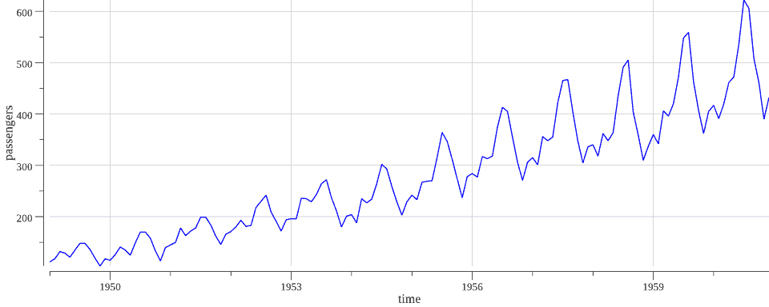

如预期的那样，随着时间的推移，越来越多的人开始通过飞机旅行，国际航空旅客的数量也在增加。我们还可以看到，似乎存在重复出现的波峰或峰值。我们将在稍后更深入地探讨这些特征。

# 理解时间序列术语

到这本书的这一部分，你可能已经注意到每一套机器学习技术都有一套相关的术语，时间序列也不例外。

这里是对本章余下部分将要用到的部分术语的解释：

+   **时间**、**日期时间**或**时间戳**：这个属性是我们时间序列中每一对的时间元素。这可以简单地是一个时间，也可以是日期和时间的组合（有时称为日期时间或时间戳）。它也可能包括时区。

+   **观测值**、**测量值**、**信号**或**随机变量**：这是我们试图作为时间函数预测和/或分析的性质。

+   **季节性**：像航空旅客数据这样的时间序列可能会表现出与季节（周、月、年等）相对应的变化。以这种方式表现的时间序列被称为表现出某种季节性。

+   **趋势**：随着时间的推移逐渐增加或减少的时间序列（与季节性效应分开）被称为表现出趋势。

+   **平稳性**：如果一个时间序列在时间上表现出相同的模式，没有趋势或其他逐渐变化（如方差或协方差的变化），则称其为平稳的。

+   **时间周期**：时间序列中连续观测之间的时间量，或者系列中一个时间戳与之前发生的时间戳之间的差异。

+   **自回归模型**：这是一个试图通过一个或多个延迟或滞后版本的同过程来模拟时间序列过程的模型。例如，股票价格的自回归模型会试图通过股票价格在先前时间间隔的值来模拟股票价格。

+   **移动平均模型**：这是一个试图根据一个不完全可预测的项的当前和过去各种值来模拟时间序列的模型，这个项通常被称为**误差**。例如，这个不完全可预测的项可能是时间序列中的某些白噪声。

# 与时间序列相关的统计

除了与时间序列相关的一些术语之外，还有一些重要的与时间序列相关的统计，我们在进行预测和异常检测时将依赖这些统计。这些统计主要与时间序列中的值如何与其他值相关联有关。

这些统计将帮助我们分析数据，这是任何时间序列建模项目的重要部分，正如我们在其他类型的建模中所做的那样。了解你的时间序列随时间、季节性和趋势的行为，对于确保你应用适当的模型并对你结果进行心理检查至关重要。

# 自相关

**自相关**是衡量一个信号与其延迟版本的相关程度。例如，一个或多个股票价格的先前观测值可能与下一个股票价格的观测值相关（或一起变化）。如果这种情况发生，我们就会说股票价格根据某些滞后或延迟影响了自己。然后我们可以通过在特定滞后中指示为高度相关的滞后版本来模拟未来的股票价格。

为了测量变量 *x[t]* 与其延迟版本（或滞后版本）*x[s]* 的自相关，我们可以利用**自相关函数**（**ACF**），其定义如下：

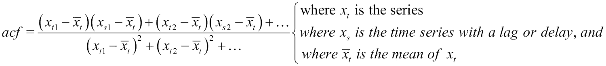

在这里，*s* 可以代表 *x* 的任何滞后版本。因此，我们可以计算 *x* 与滞后一个时间周期的 *x* 版本（*x[t-1]*）之间的自相关，与滞后两个时间周期的 *x* 版本（*x[t-2]*）之间的自相关，依此类推。这样做可以告诉我们哪些延迟版本的 *x* 与 *x* 最相关，从而帮助我们确定哪些延迟版本的 *x* 可能是用于模拟 *x* 未来版本的好候选者。

让我们尝试计算我们的航空公司乘客时间序列与其自身的第一个几个自相关系数。为此，我们首先需要创建一个函数，该函数将计算特定时间段滞后的时间序列中的自相关系数。以下是该函数的一个示例实现：

```py
// acf calculates the autocorrelation for a series
// at the given lag.
func acf(x []float64, lag int) float64 {

    // Shift the series.
    xAdj := x[lag:len(x)]
    xLag := x[0 : len(x)-lag]

    // numerator will hold our accumulated numerator, and
    // denominator will hold our accumulated denominator.
    var numerator float64
    var denominator float64

    // Calculate the mean of our x values, which will be used
    // in each term of the autocorrelation.
    xBar := stat.Mean(x, nil)

    // Calculate the numerator.
    for idx, xVal := range xAdj {
        numerator += ((xVal - xBar) * (xLag[idx] - xBar))
    }

    // Calculate the denominator.
    for _, xVal := range x {
        denominator += math.Pow(xVal-xBar, 2)
    }

    return numerator / denominator
}
```

然后，我们将遍历几个滞后，并利用`acf()`函数计算各种自相关系数。这个过程在以下代码中显示：

```py
// Open the CSV file.
passengersFile, err := os.Open("AirPassengers.csv")
if err != nil {
    log.Fatal(err)
}
defer passengersFile.Close()

// Create a dataframe from the CSV file.
passengersDF := dataframe.ReadCSV(passengersFile)

// Get the time and passengers as a slice of floats.
passengers := passengersDF.Col("AirPassengers").Float()

// Loop over various values of lag in the series.
fmt.Println("Autocorrelation:")
for i := 1; i < 11; i++ {

    // Shift the series.
    adjusted := passengers[i:len(passengers)]
    lag := passengers[0 : len(passengers)-i]

    // Calculate the autocorrelation.
    ac := stat.Correlation(adjusted, lag, nil)
    fmt.Printf("Lag %d period: %0.2f\n", i, ac)
}
```

这会产生以下结果：

```py
$ go build
$ ./myprogram 
Autocorrelation:
Lag 1 period: 0.95
Lag 2 period: 0.88
Lag 3 period: 0.81
Lag 4 period: 0.75
Lag 5 period: 0.71
Lag 6 period: 0.68
Lag 7 period: 0.66
Lag 8 period: 0.66
Lag 9 period: 0.67
Lag 10 period: 0.70
```

如我们所见，序列中更早的滞后处的自相关系数往往较小（尽管，这并不是每个滞后都如此）。然而，这种信息在数值形式上可能有点难以吸收。让我们将这些值作为滞后函数的函数来绘制，以更好地可视化相关性：

```py
// Open the CSV file.
passengersFile, err := os.Open("AirPassengers.csv")
if err != nil {
    log.Fatal(err)
}
defer passengersFile.Close()

// Create a dataframe from the CSV file.
passengersDF := dataframe.ReadCSV(passengersFile)

// Get the time and passengers as a slice of floats.
passengers := passengersDF.Col("AirPassengers").Float()

// Create a new plot, to plot our autocorrelations.
p, err := plot.New()
if err != nil {
    log.Fatal(err)
}

p.Title.Text = "Autocorrelations for AirPassengers"
p.X.Label.Text = "Lag"
p.Y.Label.Text = "ACF"
p.Y.Min = 0
p.Y.Max = 1

w := vg.Points(3)

// Create the points for plotting.
numLags := 20
pts := make(plotter.Values, numLags)

// Loop over various values of lag in the series.
for i := 1; i <= numLags; i++ {

    // Calculate the autocorrelation.
    pts[i-1] = acf(passengers, i)
}

// Add the points to the plot.
bars, err := plotter.NewBarChart(pts, w)
if err != nil {
    log.Fatal(err)
} 
bars.LineStyle.Width = vg.Length(0)
bars.Color = plotutil.Color(1)

// Save the plot to a PNG file.
p.Add(bars)
if err := p.Save(8*vg.Inch, 4*vg.Inch, "acf.png"); err != nil {
    log.Fatal(err)
}
```

这段代码产生了以下 ACF 图的绘制：

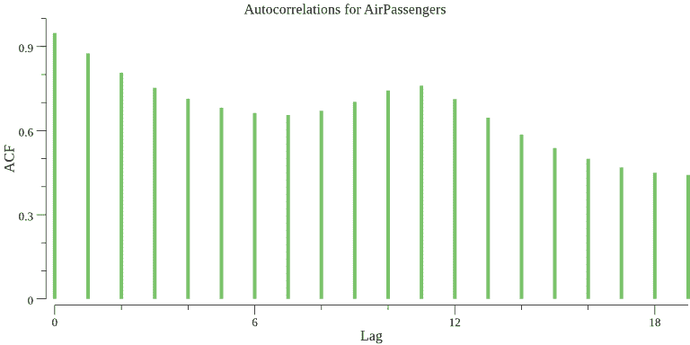

注意到自相关系数总体上是下降的，但它们保持相当大（远高于 0.5），甚至到 20 个时间周期的滞后。这是我们的时间序列不是平稳的一个迹象。实际上，如果我们看我们时间序列的先前图，它显然是向上趋势的。我们将在本章的后面部分处理这种非平稳行为，但就目前而言，我们可以说 ACF 图正在向我们表明，乘客数量的滞后版本与其非延迟版本是相关的。

更一般地说，自相关函数将使我们能够确定我们正在建模的时间序列类型。对于一个可以用自回归模型很好地建模的过程，我们应该看到`acf`函数随着滞后时间的增加而迅速下降，但不是立即下降。对于一个可以用所谓的移动平均模型很好地建模的过程，我们会在第一个滞后处看到一个显著的 ACF 项，但之后 ACF 会在第一个滞后之后消失。

关于如何解释自相关函数（ACF）图的信息，请参阅[`coolstatsblog.com/2013/08/07/how-to-use-the-autocorreation-function-acf/`](https://coolstatsblog.com/2013/08/07/how-to-use-the-autocorreation-function-acf/)。这篇文章提供了一些很好的细节，其中一些我们在这里无法涵盖。

# 部分自相关

如你所料，部分自相关与自相关相关，但也有一些细微的差别。部分意味着这是一种条件性的相关。本质上，部分自相关是在减去中间滞后处的自相关之后，测量序列与其自身在某个滞后处的相关程度。你可以将其视为在移除中间相关之后剩余的自相关。

我们可能想要这样的原因是我们需要比 ACF 更多的信息来确定时间序列模型的阶数，假设它可以由自回归模型来建模。假设我们使用 ACF 确定我们可以通过自回归模型来建模我们的序列，因为 ACF 随着滞后时间的增加而指数衰减。我们如何知道我们应该通过自身滞后一个时间周期的版本来建模这个时间序列，或者是一个滞后一个时间周期和一个滞后两个时间周期的版本，依此类推？

通过减去中间相关性，我们能够快速确定任何剩余的相关性，这些相关性可以用具有更多项的自回归模型来建模。如果偏自相关性在第一个滞后之后消失，我们知道我们可以根据自身的一个滞后版本（滞后一个时间周期）来建模我们的序列。然而，如果偏自相关性在第一个滞后之后没有消失，我们知道我们需要在我们的自回归模型中采用多个时间序列的滞后版本。

如果我们假设通过时间序列中逐次增加的滞后值（*x[t-1]*, *x[t-2]*, 以及等等）线性建模时间序列中的值（*x[t]*），我们的方程将如下所示：

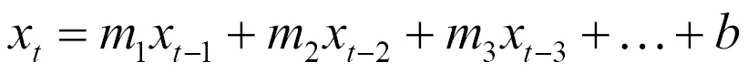

各种系数*m[1]*, *m[2]*，等等，分别是一个时间周期的滞后偏自相关性，两个时间周期的滞后偏自相关性，依此类推。因此，我们为了计算某个滞后期的偏自相关性，只需要估计出给我们相应系数的线性回归公式。执行这种计算的功能被称为**偏自相关函数**（**PACF**）。

使用我们最喜欢的线性回归包`github.com/sajari/regression`，我们可以创建一个 Go 函数来实现 PACF，如下所示：

```py
// pacf calculates the partial autocorrelation for a series
// at the given lag.
func pacf(x []float64, lag int) float64 {

    // Create a regresssion.Regression value needed to train
    // a model using github.com/sajari/regression.
    var r regression.Regression
    r.SetObserved("x")

    // Define the current lag and all of the intermediate lags.
    for i := 0; i < lag; i++ {
        r.SetVar(i, "x"+strconv.Itoa(i))
    }

    // Shift the series.
    xAdj := x[lag:len(x)]

    // Loop over the series creating the data set
    // for the regression.
    for i, xVal := range xAdj {

        // Loop over the intermediate lags to build up
        // our independent variables.
        laggedVariables := make([]float64, lag)
        for idx := 1; idx <= lag; idx++ {

            // Get the lagged series variables.
            laggedVariables[idx-1] = x[lag+i-idx]
        }

        // Add these points to the regression value.
        r.Train(regression.DataPoint(xVal, laggedVariables))
    }

    // Fit the regression.
    r.Run()

    return r.Coeff(lag)
}
```

然后，我们可以使用这个`pacf`函数来计算一些偏自相关值，这些值对应于我们之前计算自相关性的滞后。如下所示：

```py
// Open the CSV file.        
passengersFile, err := os.Open("AirPassengers.csv")
if err != nil {
    log.Fatal(err)
}
defer passengersFile.Close()

// Create a dataframe from the CSV file.
passengersDF := dataframe.ReadCSV(passengersFile)

// Get the time and passengers as a slice of floats.
passengers := passengersDF.Col("AirPassengers").Float()

// Loop over various values of lag in the series.
fmt.Println("Partial Autocorrelation:")
for i := 1; i < 11; i++ {

    // Calculate the partial autocorrelation.
    pac := pacf(passengers, i)
    fmt.Printf("Lag %d period: %0.2f\n", i, pac)
}
```

编译并运行此代码将给出我们航空乘客时间序列中的以下`偏自相关性`值：

```py
$ go build
$ ./myprogram 
Partial Autocorrelation:
Lag 1 period: 0.96
Lag 2 period: -0.33
Lag 3 period: 0.20
Lag 4 period: 0.15
Lag 5 period: 0.26
Lag 6 period: -0.03
Lag 7 period: 0.20
Lag 8 period: 0.16
Lag 9 period: 0.57
Lag 10 period: 0.29
```

如您所见，偏自相关在第二个滞后之后迅速衰减。这表明，在考虑了时间序列与其第一和第二个滞后之间的关系后，时间序列中剩余的关系并不多。偏自相关性不会精确地达到*0.0*，这是由于数据中的一些噪声所预期的。

为了帮助我们更好地可视化 PACF，让我们创建另一个图表。我们可以用与创建 ACF 图表完全相同的方式来做这件事，只是将`pacf()`函数替换为`acf()`函数。结果图表如下：

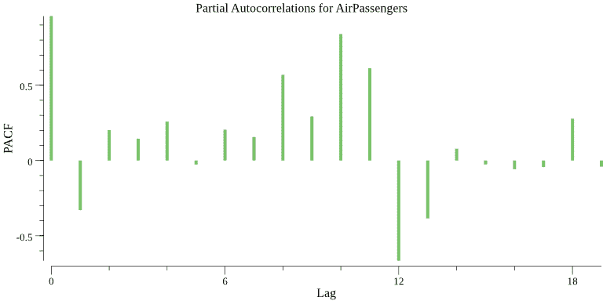

# 预测的自回归模型

我们将要使用的第一个模型类别，用于尝试预测我们的时间序列，被称为**自回归**（**AR**）模型。如前所述，我们试图根据时间序列中的一或多个先前点来建模时间序列中的数据点。因此，我们使用时间序列本身来建模时间序列。这种使用序列本身是区分 AR 方法与第四章中讨论的更一般回归方法的特点。*回归*。

# 自回归模型概述

你经常会看到将 AR 模型称为 AR(1)、AR(2)等等。这些数字对应于你用于时间序列建模的 AR 模型或过程的**阶数**，你可以通过进行自相关和偏自相关分析来确定这个阶数。

AR(1)模型试图根据同一时间序列中一个时间周期延迟的观察值来建模你的序列中的观察值：


AR(2)模型将如下所示：

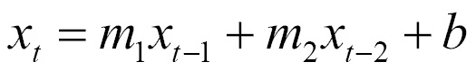

AR(3)模型将添加另一个项，依此类推，所有这些都遵循相同的模式。

这些公式可能会让你想起线性回归，实际上我们在这里将使用与创建线性回归模型时相同的一些方法。然而，时间序列建模的独特方面不应被忽视。了解数据的时间相关元素（季节性、趋势、自相关等）以及它们如何影响 AR 模型是很重要的。

你用于建模时间序列的 AR 模型阶数可以通过查看 PACF 图来确定。在图中，你会看到 PACF 值衰减到并围绕零徘徊。看看需要多少滞后时间 PACF 开始围绕零徘徊，然后使用相应滞后数的 AR 阶数。

注意，一些用于绘制 PACF 和 ACF 的软件包包括表示各种滞后项统计显著性的水平线。这里我没有包括这些，但如果你想要定量确定 AR 模型中的阶数，你可能需要考虑在这里进一步讨论的计算：

[`www.itl.nist.gov/div898/handbook/eda/section3/autocopl.htm`](http://www.itl.nist.gov/div898/handbook/eda/section3/autocopl.htm) 和 [](http://www.itl.nist.gov/div898/handbook/eda/section3/autocopl.htm) [`www.itl.nist.gov/div898/handbook/pmc/section4/pmc4463.htm`](http://www.itl.nist.gov/div898/handbook/pmc/section4/pmc4463.htm).

# 自回归模型假设和陷阱

自回归模型的主要假设如下：

+   **平稳性**：AR 模型假设你的时间序列是平稳的。如果我们计划使用 AR 模型，我们不应该在数据中看到任何趋势。

+   **遍历性**：这个术语听起来很复杂，基本上意味着时间序列的统计属性，如均值和方差，不应随时间变化或漂移。

我们使用 AR 方法建模的任何时间序列都应该满足这些假设。然而，即使有些数据（如我们的航空旅客数据）不满足这些假设，我们也可以使用一些差分技巧来仍然利用 AR 模型。

# 自回归模型示例

我们将尝试使用自回归模型来建模我们的航空旅客数据。现在，我们已经知道我们在打破 AR 模型的一个假设，即我们的数据不是平稳的。然而，我们可以应用一个常见的技巧来使我们的序列平稳，这被称为**差分**。

# 转换为平稳序列

为了使我们的时间序列平稳，我们将创建一个代理时间序列，其中时间周期*t*的观测值是原始时间序列中时间周期*t*的观测值减去前一个观测值。让我们以这种方式差分每个观测值，然后绘制结果以查看是否消除了数据中的趋势。我们还将输出这个差分时间序列到一个新的`*.csv`文件，如下面的代码所示：

```py
// as slices of floats.
passengerVals := passengersDF.Col("AirPassengers").Float()
timeVals := passengersDF.Col("time").Float()

// pts will hold the values for plotting.
pts := make(plotter.XYs, passengersDF.Nrow()-1)

// differenced will hold our differenced values
// that will be output to a new CSV file.
var differenced [][]string
differenced = append(differenced, []string{"time", "differenced_passengers"})

// Fill pts with data.
for i := 1; i < len(passengerVals); i++ {
    pts[i-1].X = timeVals[i]
    pts[i-1].Y = passengerVals[i] - passengerVals[i-1]
    differenced = append(differenced, []string{
        strconv.FormatFloat(timeVals[i], 'f', -1, 64),
        strconv.FormatFloat(passengerVals[i]-passengerVals[i-1], 'f', -1, 64),
    })
}

// Create the plot.
p, err := plot.New()
if err != nil {
    log.Fatal(err)
}
p.X.Label.Text = "time"
p.Y.Label.Text = "differenced passengers"
p.Add(plotter.NewGrid())

// Add the line plot points for the time series.
l, err := plotter.NewLine(pts)
if err != nil {
    log.Fatal(err)
}
l.LineStyle.Width = vg.Points(1)
l.LineStyle.Color = color.RGBA{B: 255, A: 255}

// Save the plot to a PNG file.
p.Add(l)
if err := p.Save(10*vg.Inch, 4*vg.Inch, "diff_passengers_ts.png"); err != nil {
    log.Fatal(err)
}

// Save the differenced data out to a new CSV.
f, err := os.Create("diff_series.csv")
if err != nil {
    log.Fatal(err)
}
defer f.Close()

w := csv.NewWriter(f)
w.WriteAll(differenced)

if err := w.Error(); err != nil {
    log.Fatal(err)
}
```

这导致了以下图表：

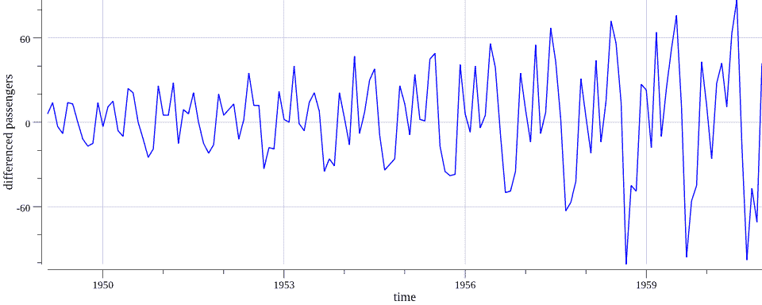

在这里，我们可以看到我们基本上消除了原始时间序列中存在的上升趋势。然而，似乎仍然存在与方差相关的问题。差分时间序列似乎在时间变大时围绕均值有增加的方差，这违反了我们的遍历性假设。

为了处理方差增加的问题，我们可以进一步使用对数或幂变换来转换我们的时间序列，这种变换会惩罚时间序列后期较大的值。让我们添加这个对数变换，重新绘制差分序列的对数，然后将结果数据保存到名为`log_diff_series.csv`的文件中。完成这个任务的代码与之前的代码片段相同，只是我们使用`math.Log()`来转换每个值，所以这里就不详细说明了。以下是对应的图表：

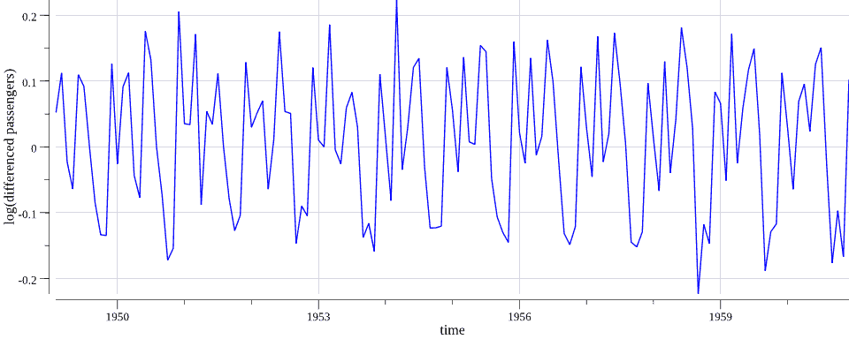

太棒了！现在我们得到了一个看起来是平稳序列，我们可以在 AR 模型中使用它。注意，在这个例子中，我们大部分是定性分析这个序列，但存在一些用于平稳性的定量测试（例如 Dickey-Fuller 测试）。

我们在这里使用差分和对数变换来转换我们的数据。这使我们能够满足 AR 模型的前提假设，但它也使得我们的数据和最终模型变得稍微难以解释。与时间序列本身相比，思考差分时间序列的对数更困难。我们在这里有这个权衡的合理性，但这个权衡应该被注意，希望我们能在可能的情况下避免这种混淆。

# 分析自相关函数并选择 AR 阶数

现在我们有一个符合我们模型假设的平稳序列，让我们重新审视我们的 ACF 和 PACF 图，看看有什么变化。我们可以利用之前用来绘制 ACF 和 PACF 的相同代码，但这次我们将使用我们的转换序列。

下面是生成的 ACF 图：

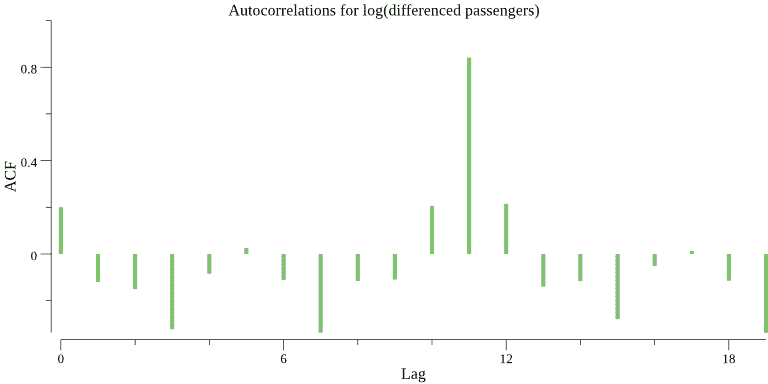

下面是生成的 PACF 图：

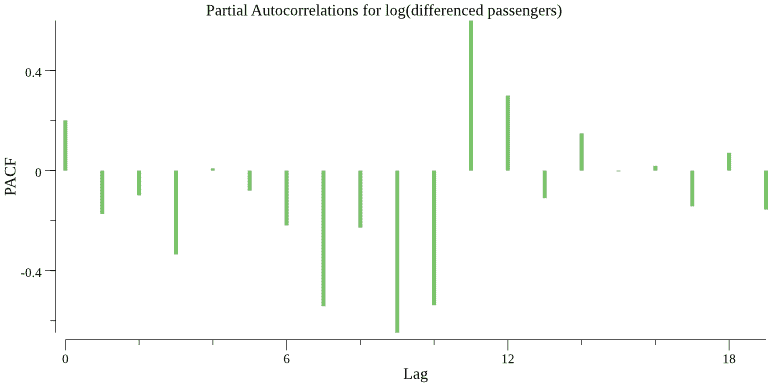

我们首先注意到，随着滞后时间的增加，ACF 图不再从*1.0*缓慢衰减。ACF 图衰减并在*0.0*附近波动。我们将在下一节回到 ACF。

接下来，我们可以看到，PACF 也衰减到*0.0*并在此之后围绕 0.0 波动。为了选择我们 AR 模型的阶数，我们想要检查 PACF 图首次似乎穿过零线的地方。在我们的例子中，这似乎是在第二个滞后期之后，因此，我们可能想要考虑使用 AR(2)模型来模型这个时间序列的自回归。

# 拟合和评估 AR(2)模型

我们已经看到，PACF 为我们 AR 模型中各种阶数的系数。利用这一点，我们可以通过以下代码中显示的`pacf()`函数的略微修改版本，获取我们模型中第一和第二滞后项的系数以及截距（或误差项）：

```py
// autoregressive calculates an AR model for a series
// at a given order.
func autoregressive(x []float64, lag int) ([]float64, float64) {

    // Create a regresssion.Regression value needed to train
    // a model using github.com/sajari/regression.
    var r regression.Regression
    r.SetObserved("x")

    // Define the current lag and all of the intermediate lags.
    for i := 0; i < lag; i++ {
        r.SetVar(i, "x"+strconv.Itoa(i))
    }

    // Shift the series.
    xAdj := x[lag:len(x)]

    // Loop over the series creating the data set
    // for the regression.
    for i, xVal := range xAdj {

        // Loop over the intermediate lags to build up
        // our independent variables.
        laggedVariables := make([]float64, lag)
        for idx := 1; idx <= lag; idx++ {

            // Get the lagged series variables.
            laggedVariables[idx-1] = x[lag+i-idx]
         }

         // Add these points to the regression value.
         r.Train(regression.DataPoint(xVal, laggedVariables))
    }

    // Fit the regression.
    r.Run()

    // coeff hold the coefficients for our lags.
    var coeff []float64
    for i := 1; i <= lag; i++ {
        coeff = append(coeff, r.Coeff(i))
    }

    return coeff, r.Coeff(0)
}
```

然后，我们可以调用我们的对数差分序列以获取我们的训练 AR(2)模型系数：

```py
// Open the CSV file.
passengersFile, err := os.Open("log_diff_series.csv")
if err != nil {
    log.Fatal(err)
}
defer passengersFile.Close()

// Create a dataframe from the CSV file.
passengersDF := dataframe.ReadCSV(passengersFile)

// Get the time and passengers as a slice of floats.
passengers := passengersDF.Col("log_differenced_passengers").Float()

// Calculate the coefficients for lag 1 and 2 and
// our error.
coeffs, intercept := autoregressive(passengers, 2)

// Output the AR(2) model to stdout.
fmt.Printf("\nlog(x(t)) - log(x(t-1)) = %0.6f + lag1*%0.6f + lag2*%0.6f\n\n", intercept, coeffs[0], coeffs[1])
```

编译并运行此训练给出了以下关于差分乘客计数对数的 AR(2)公式：

```py
$ go build
$ ./myprogram 

log(x(t)) - log(x(t-1)) = 0.008159 + lag1*0.234953 + lag2*-0.173682
```

为了评估这个 AR(2)模型，我们可以计算**平均绝对误差**（**MAE**），类似于我们计算线性回归模型的方式。具体来说，我们将计算预测的乘客计数值与观察到的乘客计数值配对，然后计算误差并累计 MAE。

首先，让我们计算我们的转换（对数和差分）预测：

```py
// Open the log differenced dataset file.
transFile, err := os.Open("log_diff_series.csv")
if err != nil {
    log.Fatal(err)
}
defer transFile.Close()

// Create a CSV reader reading from the opened file.
transReader := csv.NewReader(transFile)

// Read in all of the CSV records
transReader.FieldsPerRecord = 2
transData, err := transReader.ReadAll()
if err != nil {
    log.Fatal(err)
}

// Loop over the data predicting the transformed
// observations.
var transPredictions []float64
for i, _ := range transData {

    // Skip the header and the first two observations
    // (because we need two lags to make a prediction).
    if i == 0 || i == 1 || i == 2 {
        continue
    }

    // Parse the first lag.
    lagOne, err := strconv.ParseFloat(transData[i-1][1], 64)
    if err != nil {
        log.Fatal(err)
    }

    // Parse the second lag.
    lagTwo, err := strconv.ParseFloat(transData[i-2][1], 64)
    if err != nil {
        log.Fatal(err)
    }

    // Predict the transformed variable with our trained AR model.
    transPredictions = append(transPredictions, 0.008159+0.234953*lagOne-0.173682*lagTwo)
}
```

现在，为了计算我们的 MAE，我们需要将这些预测转换回正常的乘客计数（这样我们就可以直接与原始时间序列进行比较）。我们的对数和差分数据的反向转换涉及在转换序列中计算累积总和，将它们加回到基础序列值上，然后取指数。这个反向转换，MAE 的累积，以及将点聚合以绘制我们的观察值和预测值的聚合如下：

```py
// Open the original dataset file.
origFile, err := os.Open("AirPassengers.csv")
if err != nil {
    log.Fatal(err)
}
defer origFile.Close()

// Create a CSV reader reading from the opened file.
origReader := csv.NewReader(origFile)

// Read in all of the CSV records
origReader.FieldsPerRecord = 2
origData, err := origReader.ReadAll()
if err != nil {
    log.Fatal(err)
}

// pts* will hold the values for plotting.
ptsObs := make(plotter.XYs, len(transPredictions))
ptsPred := make(plotter.XYs, len(transPredictions))

// Reverse the transformation and calculate the MAE.
var mAE float64
var cumSum float64
for i := 4; i <= len(origData)-1; i++ {

    // Parse the original observation.
    observed, err := strconv.ParseFloat(origData[i][1], 64)
    if err != nil {
        log.Fatal(err)
    }

    // Parse the original date.        
    date, err := strconv.ParseFloat(origData[i][0], 64)
    if err != nil {
        log.Fatal(err)
    }

    // Get the cumulative sum up to the index in
    // the transformed predictions.
    cumSum += transPredictions[i-4]

    // Calculate the reverse transformed prediction.
    predicted := math.Exp(math.Log(observed) + cumSum)

    // Accumulate the MAE.
    mAE += math.Abs(observed-predicted) / float64(len(transPredictions))

    // Fill in the points for plotting.
    ptsObs[i-4].X = date
    ptsPred[i-4].X = date
    ptsObs[i-4].Y = observed
    ptsPred[i-4].Y = predicted
}
```

然后，让我们输出 MAE 以突出显示，并保存观察值和预测值的线图：

```py
// Output the MAE to standard out.
fmt.Printf("\nMAE = %0.2f\n\n", mAE)

// Create the plot.
p, err := plot.New()
if err != nil {
    log.Fatal(err)
}
p.X.Label.Text = "time"
p.Y.Label.Text = "passengers"
p.Add(plotter.NewGrid())

// Add the line plot points for the time series.
lObs, err := plotter.NewLine(ptsObs)
if err != nil {
    log.Fatal(err)
}
lObs.LineStyle.Width = vg.Points(1)

lPred, err := plotter.NewLine(ptsPred)
if err != nil {
    log.Fatal(err)
}
lPred.LineStyle.Width = vg.Points(1)
lPred.LineStyle.Dashes = []vg.Length{vg.Points(5), vg.Points(5)}

// Save the plot to a PNG file.
p.Add(lObs, lPred)
p.Legend.Add("Observed", lObs)
p.Legend.Add("Predicted", lPred)
if err := p.Save(10*vg.Inch, 4*vg.Inch, "passengers_ts.png"); err != nil {
    log.Fatal(err)
}
```

编译此代码并运行得到以下`MAE`：

```py
$ go build
$ ./myprogram 

MAE = 355.20
```

如果您还记得我们最初对这个序列的可视化，乘客计数从略高于零到略高于 600。因此，大约 355 的 MAE 并不是很好。然而，为了更全面地了解我们的预测和观察结果如何对齐，让我们看一下前面代码生成的图表：

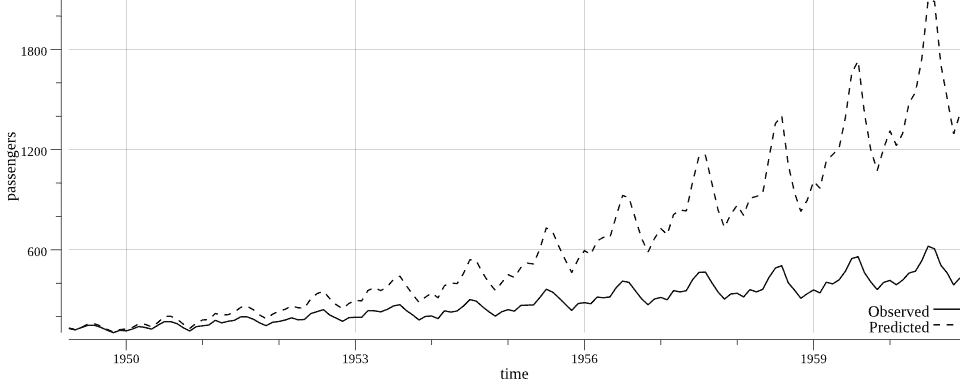

如您所见，我们的模型对航空乘客数量的预测过高，尤其是在时间推移的情况下。模型确实表现出了一些在原始数据中可以看到的结构，并产生了相似的趋势。然而，似乎我们需要一个稍微复杂一些的模型来更真实地表示这个序列。

没有模型是完美的，我们在这里尝试了一个相对简单的时序模型。我们坚持使用简单且可解释的模型是好事，但我们的评估结果可能会激励我们在实际场景中重构我们的模型。重构是好事！这意味着我们学到了一些东西。

# 自回归移动平均和其他时间序列模型

我们之前尝试的模型是一个相对简单的纯自回归模型。然而，我们并不局限于在时序模型中使用自回归或纯自回归。与其他在本书中涵盖的机器学习模型类别一样，存在一系列时序技术，我们无法在这里全部涵盖。然而，我们确实想提到一些值得探索的显著技术，您可以在跟进这些材料时探索它们。

自回归模型通常与称为**移动平均模型**的模型相结合。当这些模型结合在一起时，它们通常被称为**自回归移动平均**（**ARMA**）或**自回归积分移动平均**（**ARIMA**）模型。ARMA/ARIMA 模型的移动平均部分允许你捕捉到时间序列中的白噪声或其他误差项的影响，这实际上可以改善我们为航空乘客建立的 AR(2)模型。

不幸的是，在撰写此内容时，没有现成的 Go 语言包可以执行 ARIMA。如前所述，自回归部分相对简单，但移动平均拟合稍微复杂一些。这是一个很好的地方，可以跳进来做出贡献！

也有一些时间序列模型超出了 ARIMA 模型的范围。例如，**Holt-Winters 方法**试图通过预测方程和三个平滑方程来捕捉时间序列数据中的季节性。在`github.com/datastream/holtwinters`和`github.com/dgryski/go-holtwinters`中已有 Holt-Winters 方法的初步实现。这些可能需要进一步维护和产品化，但它们可以作为起点。

# 异常检测

如本章引言所述，我们可能并不总是对预测时间序列感兴趣。我们可能想检测时间序列中的异常行为。例如，我们可能想知道异常流量爆发何时出现在我们的网络中，或者我们可能希望在应用程序内部有异常数量的用户尝试某些操作时收到警报。这些事件可能与安全相关，也可能只是用来调整我们的基础设施或应用程序设置。

幸运的是，由于 Go 在监控和基础设施方面的历史应用，有各种基于 Go 的选项可以检测时间序列数据中的异常。这些工具已在生产环境中用于在监控基础设施和应用时检测异常行为，尽管这里无法提及所有工具，但我将突出介绍几个。

首先，InfluxDB ([`www.influxdata.com/`](https://www.influxdata.com/)) 和 Prometheus ([`prometheus.io/`](https://prometheus.io/)) 生态系统在异常检测方面提供了多种选择。InfluxDB 和 Prometheus 都提供了基于 Go 的开源时序数据库和相关工具。它们在监控基础设施和应用方面非常有用，在 Go 社区和非 Go 社区都有广泛的应用。例如，如果你对使用 InfluxDB 感兴趣，你可以使用 `github.com/nathanielc/morgoth` 进行异常检测。

此包实现了 **损失计数算法**（**LCA**）。在 Prometheus 方面，你可以利用基于查询的方法，如 [`prometheus.io/blog/2015/06/18/practical-anomaly-detection/`](https://prometheus.io/blog/2015/06/18/practical-anomaly-detection/) 中进一步讨论的那样。

同时，也有许多独立的 Go 包用于异常检测，包括 `github.com/lytics/anomalyzer` 和 `github.com/sec51/goanomaly`。更具体地说，`github.com/lytics/anomalyzer` 实现了多种测试来确定你的序列中的观察值是否异常，包括基于累积分布函数、自举排列、排列秩和、相对幅度等测试。

要使用 `github.com/lytics/anomalyzer` 检测异常，我们需要创建一些配置和一个 `anomalyzer.Anomalyzer` 值。一旦完成这些，检测异常就像在 `anomalyzer.Anomalyzer` 值上调用 `Push()` 方法一样简单，如下面的代码所示：

```py
// Initialize an AnomalyzerConf value with
// configurations such as which anomaly detection
// methods we want to use.
conf := &anomalyzer.AnomalyzerConf{
    Sensitivity: 0.1,
    UpperBound:  5,
    LowerBound:  anomalyzer.NA, // ignore the lower bound
    ActiveSize:  1,
    NSeasons:    4,
    Methods:     []string{"diff", "fence", "highrank", "lowrank", "magnitude"},
}

// Create a time series of periodic observations
// as a slice of floats.  This could come from a
// database or file, as utilized in earlier examples.
ts := []float64{0.1, 0.2, 0.5, 0.12, 0.38, 0.9, 0.74}

// Create a new anomalyzer based on the existing
// time series values and configuration.
anom, err := anomalyzer.NewAnomalyzer(conf, ts)
if err != nil {
    log.Fatal(err)
}

// Supply a new observed value to the Anomalyzer.
// The Anomalyzer will analyze the value in reference
// to pre-existing values in the series and output
// a probability of the value being anomalous.
prob := anom.Push(15.2)
fmt.Printf("Probability of 15.2 being anomalous: %0.2f\n", prob)

prob = anom.Push(0.43)
fmt.Printf("Probability of 0.33 being anomalous: %0.2f\n", prob)
```

编译并运行此异常检测会产生以下结果：

```py
$ go build
$ ./myprogram
Probability of 15.2 being anomalous: 0.98
Probability of 0.33 being anomalous: 0.80
```

# 参考文献

时间序列统计（ACF 和 PACF）：

+   如何使用 ACF：[`coolstatsblog.com/2013/08/07/how-to-use-the-autocorreation-function-acf/`](https://coolstatsblog.com/2013/08/07/how-to-use-the-autocorreation-function-acf/)

+   在 ARIMA 模型中识别 AR 或 MA 项的数量：[`people.duke.edu/~rnau/411arim3.htm`](https://people.duke.edu/~rnau/411arim3.htm)

自回归模型：

+   对 AR 模型更数学化的介绍：[`onlinecourses.science.psu.edu/stat501/node/358`](https://onlinecourses.science.psu.edu/stat501/node/358)

+   `github.com/sajari/regression` 文档：[`godoc.org/github.com/sajari/regression`](https://godoc.org/github.com/sajari/regression)

ARMA/ARIMA 模型：

+   ARIMA 简介：[`people.duke.edu/~rnau/411arim.htm`](https://people.duke.edu/~rnau/411arim.htm)

异常检测：

+   InfluxDB：[`www.influxdata.com/`](https://www.influxdata.com/)

+   Prometheus：[`prometheus.io/`](https://prometheus.io/)

+   `github.com/lytics/anomalyzer` 文档：[`godoc.org/github.com/lytics/anomalyzer`](https://godoc.org/github.com/lytics/anomalyzer)

+   `github.com/sec51/goanomaly` 文档：[`godoc.org/github.com/sec51/goanomaly`](https://godoc.org/github.com/sec51/goanomaly)

# 概述

好吧，这真是及时！我们现在知道了时间序列数据是什么，如何在 Go 中表示它，如何进行一些预测，以及如何在我们的时间序列数据中检测异常。这些技能在你处理随时间变化的数据时将非常有用，无论是与股价相关的数据，还是与你的基础设施相关的监控数据。

在下一章中，我们将通过查看一些高级技术，包括神经网络和深度学习，来提升我们的基于 Go 的机器学习水平。
