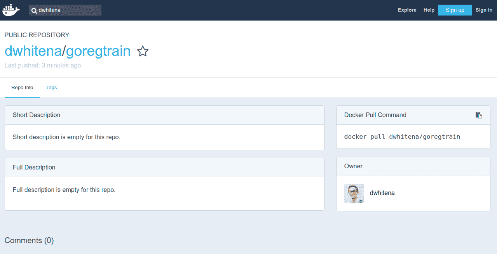
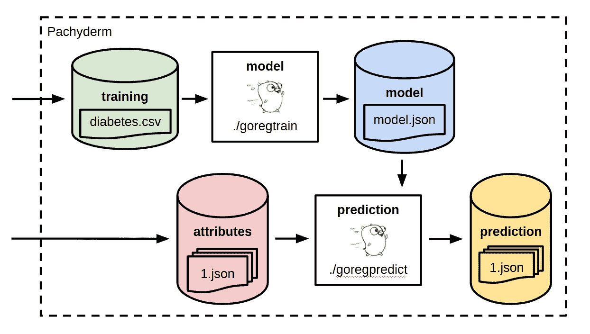

# 第九章：部署和分发分析和模型

我们已经在 Go 中实现了各种模型，包括回归、分类、聚类等。您也已经了解了一些关于开发机器学习模型的过程。我们的模型已经成功地预测了疾病进展、花卉种类和图像中的物体。然而，我们仍然缺少机器学习拼图中的一块重要部分：部署、维护和扩展。

如果我们的模型仅仅停留在我们的笔记本电脑上，它们在公司中就不会产生任何好处或创造价值。我们需要知道如何将我们的机器学习工作流程集成到我们组织内已经部署的系统，并且我们需要知道如何随着时间的推移进行扩展、更新和维护这些工作流程。

由于我们的机器学习工作流程本质上就是多阶段工作流程，这可能会使得部署和维护变得有些挑战。我们需要训练、测试和利用我们的模型，在某些情况下，我们还需要预处理和/或后处理我们的数据。我们可能还需要将某些模型串联起来。我们如何在保持应用程序简单性和完整性的同时部署和连接所有这些阶段呢？例如，我们如何在时间上更新训练数据集的同时，仍然知道哪个训练数据集产生了哪些模型，以及哪些模型产生了哪些结果？我们如何轻松地随着预测需求的上下波动而扩展我们的预测？最后，我们如何将我们的机器学习工作流程集成到我们基础设施中的其他应用程序或基础设施本身（数据库、队列等）？

我们将在本章中解决所有这些问题。事实证明，Go 和用 Go 编写的基础设施工具提供了一个出色的平台来部署和管理机器学习工作流程。我们将从底到顶使用完全基于 Go 的方法，并展示每个组件如何帮助我们进行大规模的数据科学！

# 在远程机器上可靠地运行模型

无论您的公司使用的是本地基础设施还是云基础设施，您都可能在某个时候需要在除笔记本电脑之外的地方运行您的机器学习模型。这些模型可能需要准备好提供欺诈预测，或者它们可能需要实时处理用户上传的图像。您不能让模型停留在您的笔记本电脑上，并成功提供这些信息。

然而，当我们将数据处理和机器学习应用程序从笔记本电脑上移除时，我们应该确保以下几点：

1.  我们不应该为了部署和扩展而使我们的应用程序变得复杂。我们应该保持应用程序的简单性，这将帮助我们维护它们并确保随着时间的推移保持完整性。

1.  我们应该确保我们的应用程序的行为与我们在本地机器上开发它们时的行为一致。

如果我们部署我们的机器学习工作流程，并且它们没有像开发期间那样执行或表现，它们将无法产生预期的价值。我们应该能够理解我们的模型在本地如何表现，并假设它们在生产环境中将以相同的方式表现。随着您在部署过程中向应用程序添加不必要的复杂性，这变得越来越难以实现。

一种保持您的部署简单、便携和可重复的方法是使用 Docker ([`www.docker.com/`](https://www.docker.com/))，我们在这里将利用它来部署我们的机器学习应用程序。

Docker 本身是用 Go 编写的，这使得它成为我们将在机器学习部署堆栈中使用的第一个基于 Go 的基础设施工具。

# Docker 和 Docker 术语的简要介绍

Docker 和整个容器生态系统有其自己的术语集，这可能会令人困惑，尤其是对于那些有虚拟机等经验的人来说。在我们继续之前，让我们如下巩固这些术语：

+   **Docker 镜像**是一组数据层，这些层共同定义了一个文件系统、库、环境变量等，这些将在运行在软件容器中的应用程序中看到。将镜像视为一个包含您的应用程序、其他相关库或包以及应用程序运行所需的环境其他部分的包。Docker 镜像不包括完整的操作系统。

+   **Dockerfile** 是一个文件，您在其中定义 Docker 镜像的各个层。

+   **Docker 引擎**帮助您构建、管理和运行 Docker 镜像。

+   为您的应用程序构建 Docker 镜像的过程通常被称为**Docker 化**您的应用程序。

+   **容器**或**软件容器**是 Docker 镜像的运行实例。本质上，这个运行的容器包括了您的 Docker 镜像的所有层，以及一个读写层，允许您的应用程序运行、输入/输出数据等。

+   **Docker 仓库**是您存放 Docker 镜像的地方。这个仓库可以是本地的，也可以是在远程机器上运行的。它还可以是一个托管仓库服务，如**Docker Hub**、Quay、**亚马逊网络服务**（**AWS**）、**亚马逊 EC2 容器注册库**（**ECR**）等等。

**注意**：Docker 镜像与虚拟机不同。Docker 镜像包括您的应用程序、文件系统以及各种库和包，但它实际上并不包括一个客户操作系统。此外，它在主机机器上运行时不会占用固定数量的内存、磁盘和 CPU。Docker 容器共享 Docker 引擎运行的底层内核的资源。

我们希望本节之后的示例能够巩固所有这些术语，但与其他本书中的主题一样，你可以更深入地了解 Docker 和软件容器。我们将在本章的参考文献中包含一些链接，以提供更多 Docker 资源。

在以下示例中，我们将假设你能够本地构建和运行 Docker 镜像。要安装 Docker，你可以按照[`www.docker.com/community-edition#/download`](https://www.docker.com/community-edition#/download)上的详细说明进行操作。

# 将机器学习应用程序 Docker 化

本章我们将部署和扩展的机器学习工作流程将是我们在第四章中开发的线性回归工作流程，用于预测糖尿病疾病进展。在我们的部署中，我们将考虑工作流程的三个不同部分：

+   训练和导出单一回归模型（使用体重指数建模疾病进展）

+   训练和导出多重回归模型（使用体重指数和血液测量 LTG 建模疾病进展）

+   基于训练模型之一和输入属性对疾病进展进行推断

在本章的后面部分，将会清楚为什么我们可能想要将这些工作流程分成这些部分。现在，让我们专注于将这些工作流程的部分 Docker 化（构建可以运行这些工作流程部分的 Docker 镜像）。

# 将模型训练和导出 Docker 化

我们将使用与第四章中“回归”相同的代码进行模型训练。然而，我们将对代码进行一些调整，使其更加用户友好，并能与其他工作流程部分进行接口。我们不会将这些复杂性视为实际建模代码的复杂性。相反，这些是你可能对任何准备更广泛使用的应用程序所做的事情。

首先，我们将向我们的应用程序添加一些命令行标志，这将允许我们指定训练数据集所在的输入目录，以及我们将导出模型持久化表示的输出目录。你可以如下实现这些命令行参数：

```py
// Declare the input and output directory flags.
inDirPtr := flag.String("inDir", "", "The directory containing the training data")
outDirPtr := flag.String("outDir", "", "The output directory")

// Parse the command line flags.
flag.Parse()
```

然后，我们将创建几个结构类型，这将使我们能够将模型的系数和截距导出到 JSON 文件中。这个导出的 JSON 文件本质上是我们训练模型的持久化版本，因为系数和截距完全参数化了我们的模型。这些结构在这里定义：

```py
// ModelInfo includes the information about the
// model that is output from the training.
type ModelInfo struct {
    Intercept float64 `json:"intercept"`
    Coefficients []CoefficientInfo `json:"coefficients"`
}

// CoefficientInfo include information about a
// particular model coefficient.
type CoefficientInfo struct {
    Name string `json:"name"`
    Coefficient float64 `json:"coefficient"`
}
```

除了这个之外，我们的训练代码与第四章中的回归相同。我们仍然会使用`github.com/sajari/regression`来训练我们的模型。我们只是将模型导出为 JSON 文件。单变量回归模型的训练和导出包含在以下片段中：

```py
// Train/fit the single regression model
// with github.com/sajari/regression
// like in Chapter 5, Regression.

// Fill in the model information.
modelInfo := ModelInfo{
    Intercept: r.Coeff(0),
    Coefficients: []CoefficientInfo{
        CoefficientInfo{
            Name: "bmi",
            Coefficient: r.Coeff(1),
        },
    },
}

// Marshal the model information.
outputData, err := json.MarshalIndent(modelInfo, "", " ")
if err != nil {
    log.Fatal(err)
}

// Save the marshalled output to a file, with
// certain permissions (http://permissions-calculator.org/decode/0644/).
if err := ioutil.WriteFile(filepath.Join(*outDirPtr, "model.json"), outputData, 0644); err != nil {e model to the JSON fil
    log.Fatal(err)
}
```

然后，对于多元回归模型，过程看起来如下：

```py
// Train/fit the multiple regression model
// with github.com/sajari/regression
// like in Chapter 5, Regression.

// Fill in the model information.
modelInfo := ModelInfo{
    Intercept: r.Coeff(0),
    Coefficients: []CoefficientInfo{
        CoefficientInfo{
            Name:        "bmi",
            Coefficient: r.Coeff(1),
        },
        CoefficientInfo{
            Name:        "ltg",
            Coefficient: r.Coeff(2),
        },
    },
}

// Marshal the model information.
outputData, err := json.MarshalIndent(modelInfo, "", "    ")
if err != nil {
    log.Fatal(err)
}

// Save the marshalled output to a file.
if err := ioutil.WriteFile(filepath.Join(*outDirPtr, "model.json"), outputData, 0644); err != nil {
    log.Fatal(err)
}
```

为了将这些训练过程 Docker 化，我们需要为每个单变量回归训练程序和多元回归训练程序创建一个 Dockerfile。然而，实际上我们可以为这些程序使用几乎相同的 Dockerfile。这个 Dockerfile 应该放在我们的程序相同的目录中，看起来如下：

```py
FROM alpine
ADD goregtrain / 
```

看起来很简单，对吧？让我们来探讨这两行代码的目的。记得 Docker 镜像是一系列层，这些层指定了您的应用程序将运行的环境吗？嗯，这个 Dockerfile 通过两个 Dockerfile 命令`FROM`和`ADD`构建了这两个层。

`FROM alpine`指定我们希望我们的 Docker 镜像文件系统、应用程序和库基于 Docker Hub 上可用的官方 Alpine Linux Docker 镜像。我们之所以使用`alpine`作为基础镜像，是因为它是一个非常小的 Docker 镜像（使其非常便携），并且包含了一些 Linux shell 的便利功能。

`ADD goregtrain /`指定我们希望在 Docker 镜像的`/`目录中添加一个`goregtrain`文件。这个`goregtrain`文件实际上是我们将从 Go 代码构建的 Go 二进制文件。因此，Dockerfile 实际上只是在说我们希望在 Alpine Linux 上运行我们的 Go 二进制文件。

除非您使用`cgo`并依赖于大量外部 C 库，否则在构建 Docker 镜像之前，始终先构建 Go 二进制文件，并将此静态链接的 Go 二进制文件复制到 Docker 镜像中。这将加快您的 Docker 构建速度，并使您的 Docker 镜像非常小，这意味着您将能够轻松地将它们移植到任何系统并快速启动。

现在，在我们构建 Docker 镜像之前，我们需要先构建 Go 二进制文件，因为我们将要将其复制到镜像中。为此，我们将使用一个如下所示的`Makefile`：

```py
all: compile docker push clean

compile:
        GOOS=linux GOARCH=amd64 CGO_ENABLED=0 go build -o goregtrain

docker:
        sudo docker build --force-rm=true -t dwhitena/goregtrain:single .

push:
        sudo docker push dwhitena/goregtrain:single

clean:
        rm goregtrain
```

如您所见：

+   `make compile`将为目标架构编译我们的 Go 二进制文件，并将其命名为`goregtrain`。

+   `make docker`将使用 Docker 引擎（通过`docker` CLI）根据我们的 Dockerfile 构建一个镜像，并将我们的镜像`dwhitena/goregtrain:single`进行标记。

+   标签中的`dwhitena`部分指定了我们将存储我们的镜像的 Docker Hub 用户名（在这种情况下，`dwhitena`），`goregtrain`指定了镜像的名称，而`:single`指定了此镜像的标记版本。

+   一旦镜像构建完成，`make push` 命令会将新构建的 Docker 镜像推送到一个注册库。在这种情况下，它将推送到名为 `dwhitena` 的 Docker Hub 用户名下（当然，你也可以推送到任何其他私有或公共注册库）。

+   最后，`make clean` 命令将清理我们的二进制文件。

如前所述，这个 `Dockerfile` 和 `Makefile` 对于单变量和多元回归模型都是相同的。然而，我们将使用不同的 Docker 镜像标签来区分这两个模型。我们将使用 `dwhitena/goregtrain:single` 作为单变量回归模型的标签，使用 `dwhitena/goregtrain:multi` 作为多元回归模型的标签。

在这些示例和本章的其余部分，你可以使用 Docker Hub 上 `dwhitena` 下的公共 Docker 镜像进行本地操作，这样你就不需要修改这里打印的示例。只需注意，你将无法在 Docker Hub 的 `dwhitena` 下构建和推送自己的镜像，因为你不是 `dwhitena`。或者，你可以在示例中的所有地方用你自己的 Docker Hub 用户名替换 `dwhitena`。这将允许你构建、推送并使用你自己的镜像。

要构建、推送并清理用于单变量或多元回归模型的 Docker 镜像，我们只需运行 `make`，如下面的代码所示，该代码本身是用 Go 编写的：

```py
$ make
GOOS=linux GOARCH=amd64 CGO_ENABLED=0 go build -o goregtrain
sudo docker build --force-rm=true -t dwhitena/goregtrain:multi .
[sudo] password for dwhitena: 
Sending build context to Docker daemon 2.449MB
Step 1/2 : FROM alpine
 ---> 7328f6f8b418
Step 2/2 : ADD goregtrain /
 ---> 9c13594ad7de
Removing intermediate container 6e717232c6d1
Successfully built 9c13594ad7de
Successfully tagged dwhitena/goregtrain:multi
sudo docker push dwhitena/goregtrain:multi
The push refers to a repository [docker.io/dwhitena/goregtrain]
375642156c06: Pushed 
5bef08742407: Layer already exists 
multi: digest: sha256:f35277a46ed840922a0d7e94c3c57632fc947f6ab004deed66d3eb80a331e40f size: 738
rm goregtrain
```

你可以在前面的输出中看到，Docker 引擎构建了我们的镜像的两个层，标记了镜像，并将其推送到 Docker Hub。现在我们可以通过以下方式在我们的本地注册库中看到 Docker 镜像：

```py
$ sudo docker images | grep "goregtrain"
dwhitena/goregtrain multi 9c13594ad7de About a minute ago 6.41MB
```

你也可以在这里看到它（[`hub.docker.com/r/dwhitena/goregtrain/`](https://hub.docker.com/r/dwhitena/goregtrain/)）的 Docker Hub 上，如图所示：



我们将很快看到如何运行和利用这个 Docker 镜像，但首先让我们构建另一个 Docker 镜像，该镜像将根据我们 JSON 持久化的模型生成预测。

# 将模型预测 Docker 化

就像我们的模型训练一样，我们将利用命令行参数来指定我们的预测程序使用的输入目录和输出目录。这次我们将有两个输入目录；一个用于持久化的模型，另一个用于包含我们将从中进行预测的属性的目录。因此，我们的程序将执行以下操作：

1.  从模型输入目录中读取模型。

1.  遍历属性输入目录中的文件。

1.  对于属性输入目录中的每个文件（包含没有相应疾病进展预测的属性），使用我们加载的模型来预测疾病进展。

1.  将疾病进展输出到由命令行参数指定的目录中的输出文件。

将这个过程想象成这样。我们已经在历史数据上训练了我们的模型来预测疾病进展，我们希望医生或诊所以某种方式利用这种预测为新患者提供服务。他们发送给我们这些患者的属性（**体质指数**（**BMI**）或体质指数和**长期增长**（**LTG**）），然后我们根据这些输入属性进行预测。

我们将假设输入属性以 JSON 文件的形式进入我们的程序（这也可以被视为来自队列或 JSON API 响应的 JSON 消息），如下所示：

```py
{
  "independent_variables": [
    {
      "name": "bmi",
      "value": 0.0616962065187
    },
    {
      "name": "ltg",
      "value": 0.0199084208763
    }
  ]
}
```

因此，让我们在我们的预测程序中创建以下结构类型，以解码输入属性并序列化输出预测：

```py
// PredictionData includes the data necessary to make
// a prediction and encodes the output prediction.
type PredictionData struct {
    Prediction float64 `json:"predicted_diabetes_progression"`
    IndependentVars []IndependentVar `json:"independent_variables"`
}

// IndependentVar include information about and a
// value for an independent variable.
type IndependentVar struct {
    Name string `json:"name"`
    Value float64 `json:"value"`
}
```

让我们再创建一个函数，允许我们根据从模型输入目录（即我们持久化的模型）读取的`ModelInfo`值进行预测。以下代码展示了这个`prediction`函数：

```py
// Predict makes a prediction based on input JSON.
func Predict(modelInfo *ModelInfo, predictionData *PredictionData) error {

    // Initialize the prediction value
    // to the intercept.
    prediction := modelInfo.Intercept

    // Create a map of independent variable coefficients.
    coeffs := make(map[string]float64)
    varNames := make([]string, len(modelInfo.Coefficients))
    for idx, coeff := range modelInfo.Coefficients {
        coeffs[coeff.Name] = coeff.Coefficient
        varNames[idx] = coeff.Name
    }

    // Create a map of the independent variable values.
    varVals := make(map[string]float64)
    for _, indVar := range predictionData.IndependentVars {
        varVals[indVar.Name] = indVar.Value
    }

    // Loop over the independent variables.
    for _, varName := range varNames {

        // Get the coefficient.
        coeff, ok := coeffs[varName]
        if !ok {
            return fmt.Errorf("Could not find model coefficient %s", varName)
        }

        // Get the variable value.
        val, ok := varVals[varName]
        if !ok {
            return fmt.Errorf("Expected a value for variable %s", varName)
        }

        // Add to the prediction.
        prediction = prediction + coeff*val
    }

    // Add the prediction to the prediction data.
    predictionData.Prediction = prediction

    return nil
}
```

这个预测函数以及类型将允许我们在指定的输入目录中遍历任何属性 JSON 文件，并为每个文件输出疾病预测。这个过程在以下代码中实现：

```py
// Declare the input and output directory flags.
inModelDirPtr := flag.String("inModelDir", "", "The directory containing the model.")        
inVarDirPtr := flag.String("inVarDir", "", "The directory containing the input attributes.")
outDirPtr := flag.String("outDir", "", "The output directory")

// Parse the command line flags.
flag.Parse()

// Load the model file.
f, err := ioutil.ReadFile(filepath.Join(*inModelDirPtr, "model.json"))
if err != nil {
    log.Fatal(err)
}

// Unmarshal the model information.
var modelInfo ModelInfo
if err := json.Unmarshal(f, &modelInfo); err != nil {
    log.Fatal(err)
}

// Walk over files in the input.
if err := filepath.Walk(*inVarDirPtr, func(path string, info os.FileInfo, err error) error {

    // Skip any directories.
    if info.IsDir() {
        return nil
    }

    // Open any files.
    f, err := ioutil.ReadFile(filepath.Join(*inVarDirPtr, info.Name()))
    if err != nil {
        return err
    }

    // Unmarshal the independent variables.
    var predictionData PredictionData
    if err := json.Unmarshal(f, &predictionData); err != nil {
        return err
    }

    // Make the prediction.
    if err := Predict(&modelInfo, &predictionData); err != nil {
        return err
    }

    // Marshal the prediction data.
    outputData, err := json.MarshalIndent(predictionData, "", "    ")
    if err != nil {
        log.Fatal(err)
    }

    // Save the marshalled output to a file.
    if err := ioutil.WriteFile(filepath.Join(*outDirPtr, info.Name()), outputData, 0644); err != nil {
        log.Fatal(err)
    }

    return nil
}); err != nil {
    log.Fatal(err)
}
```

我们将使用与上一节相同的`Dockerfile`和`Makefile`来将此预测程序 Docker 化。唯一的区别是，我们将 Go 二进制文件命名为`goregpredict`，并将 Docker 镜像标记为`dwhitena/goregpredict`。使用`make`构建 Docker 镜像应该会返回与上一节类似的结果：

```py
$ cat Makefile 
all: compile docker push clean

compile:
 GOOS=linux GOARCH=amd64 CGO_ENABLED=0 go build -o goregpredict

docker:
 sudo docker build --force-rm=true -t dwhitena/goregpredict .

push:
 sudo docker push dwhitena/goregpredict

clean:
 rm goregpredict
$ cat Dockerfile 
FROM alpine
ADD goregpredict /
$ make
GOOS=linux GOARCH=amd64 CGO_ENABLED=0 go build -o goregpredict
sudo docker build --force-rm=true -t dwhitena/goregpredict .
[sudo] password for dwhitena: 
Sending build context to Docker daemon 2.38MB
Step 1/2 : FROM alpine
 ---> 7328f6f8b418
Step 2/2 : ADD goregpredict /
 ---> a2d9a63f4926
Removing intermediate container c1610b425835
Successfully built a2d9a63f4926
Successfully tagged dwhitena/goregpredict:latest
sudo docker push dwhitena/goregpredict
The push refers to a repository [docker.io/dwhitena/goregpredict]
77f12cb6c6d4: Pushed 
5bef08742407: Layer already exists 
latest: digest: sha256:9a8a754c434bf2250b2f6102bb72d56fdf723f305aebcbf5bff7e5de707dd384 size: 738
3a05f65b1d1d: Layer already exists 
5bef08742407: Layer already exists 
ult: digest: sha256:153adaa9b4b9a1f2bf02466201163c60230ae85164d9d22261f455979a94aed4 size: 738
rm goregpredict
```

# 本地测试 Docker 镜像

在将我们的 Docker 化建模过程推送到任何服务器之前，在本地测试它们是明智的，以确保我们看到我们预期的行为。然后，一旦我们对这种行为感到满意，我们可以确信这些 Docker 镜像将在任何运行 Docker 的其他主机上以完全相同的方式运行。这种保证使得 Docker 镜像的使用成为我们部署中保持可重复性的重要贡献者。

假设我们的训练数据和一些输入属性文件位于以下目录中：

```py
$ ls
attributes model training
$ ls model
$ ls attributes 
1.json 2.json 3.json
$ ls training 
diabetes.csv
```

我们可以使用`docker run`命令在本地以软件容器的形式运行我们的 Docker 镜像。我们还将利用`-v`标志，它允许我们将本地目录挂载到正在运行的容器中，使我们能够从本地文件系统中读取和写入文件。

首先，让我们按照以下方式在 Docker 容器中运行我们的单个回归模型训练：

```py
$ sudo docker run -v $PWD/training:/tmp/training -v $PWD/model:/tmp/model dwhitena/goregtrain:single /goregtrain -inDir=/tmp/training -outDir=/tmp/model 

Regression Formula:
Predicted = 152.13 + bmi*949.44
```

现在，如果我们查看我们的`model`目录，我们将看到新训练的模型系数和截距在`model.json`中，这是我们的程序在 Docker 镜像中运行时输出的。以下代码展示了这一点：

```py
$ ls model 
model.json
$ cat model/model.json 
{
    "intercept": 152.13348416289818,
    "coefficients": [
        {
            "name": "bmi",
            "coefficient": 949.4352603839862
        }
    ]
}
```

极好！我们使用 Docker 容器训练了我们的模型。现在让我们利用这个模型进行预测。具体来说，让我们使用训练好的模型运行我们的`goregpredict` Docker 镜像，对`attributes`中的三个属性文件进行预测。在下面的代码中，你将看到在运行 Docker 镜像之前，属性文件没有相应的预测，但在运行 Docker 镜像之后，它们就有了：

```py
$ cat attributes/1.json
{
    "independent_variables": [
        {
            "name": "bmi",
            "value": 0.0616962065187
        },
        {
            "name": "ltg",
            "value": 0.0199084208763
        }
    ]
}
$ sudo docker run -v $PWD/attributes:/tmp/attributes -v $PWD/model:/tmp/model dwhitena/goregpredict /goregpredict -inModelDir=/tmp/model -inVarDir=/tmp/attributes -outDir=/tmp/attributes
$ cat attributes/1.json 
{
    "predicted_diabetes_progression": 210.7100380636843,
    "independent_variables": [
        {
            "name": "bmi",
            "value": 0.0616962065187
        },
        {
            "name": "ltg",
            "value": 0.0199084208763
        }
    ]
}
```

# 在远程机器上运行 Docker 镜像

你可能正在想，“这有什么大不了的，你通过构建和运行你的 Go 程序就能得到相同的功能”。这在本地是正确的，但 Docker 的魔力在于我们想要在除了笔记本电脑之外的环境中运行相同的功能时。

我们可以将这些 Docker 镜像在任何运行 Docker 的主机上以完全相同的方式运行，并且它们将产生完全相同的行为。这对于任何 Docker 镜像都是成立的。你不需要安装 Docker 镜像内部可能包含的任何依赖项。你需要的只是 Docker。

猜猜看？我们的 Docker 镜像大小大约是 3 MB！这意味着它们将非常快地下载到任何主机上，并且启动和运行也非常快。你不必担心携带多个多吉字节大小的虚拟机，并手动指定资源。

# 构建可扩展且可重复的机器学习流程

Docker 为公司的基础设施中部署我们的机器学习工作流程做了很多工作。然而，正如这里概述的那样，还有一些缺失的部分。

+   我们如何将工作流程的各个阶段连接起来？在这个简单的例子中，我们有一个训练阶段和一个预测阶段。在其他流程中，你可能还会有数据预处理、数据拆分、数据合并、可视化、评估等等。

+   如何将正确的数据传输到工作流程的各个阶段，尤其是在我们接收新数据或数据发生变化时？每次我们需要进行新的预测时，手动将新属性复制到与我们的预测镜像位于同一文件夹中是不可持续的，并且我们不能每次更新训练集时都登录到服务器。

+   我们将如何跟踪和重现我们的工作流程的各种运行，以进行维护、持续开发或调试？如果我们随着时间的推移进行预测并更新我们的模型和/或训练集，我们需要了解哪些模型产生了哪些结果，以保持可重复性（并在某些情况下满足合规性）。

+   我们如何将我们的处理过程扩展到多台机器上，在某些情况下，扩展到多个共享资源上？我们可能需要在公司的一些共享资源集上运行我们的处理过程。如果我们需要更多的计算能力，或者当其他应用程序在这些资源上被调度时，我们能够扩展我们的处理过程将会很理想。

幸运的是，还有一些开源工具（都是用 Go 编写的）为我们解决了这些问题。不仅如此，它们还允许我们使用已经构建好的 Docker 镜像作为数据处理的主要单元。这些工具是**Kubernetes**（**k8s**）和**Pachyderm**。

您已经在第一章，《收集和组织数据》中接触到了 Pachyderm。在那章中，我们利用 Pachyderm 来阐述数据版本化的概念，正如您可能猜到的，Pachyderm 将帮助我们解决一些关于数据管理、跟踪和可重复性的问题。Pachyderm 还将解决我们需要解决的关于可扩展性和管道的所有剩余问题，因为 Pachyderm 提供了数据管理/版本化能力和数据处理管道能力。

Kubernetes 是一个容器编排引擎，擅长在共享资源集群中调度容器化工作负载（如我们的 Docker 镜像）。它目前非常流行，Pachyderm 在底层使用 Kubernetes 来管理容器化数据处理管道。

# 设置 Pachyderm 和 Kubernetes 集群

在 Kubernetes 上运行的 Pachyderm 几乎可以部署在任何地方，因为 Kubernetes 可以部署在任何地方。您可以在任何流行的云服务提供商、本地或甚至在自己的笔记本电脑上部署 Pachyderm。部署 Pachyderm 集群您需要做的只是以下几步：

1.  拥有一个运行的 Kubernetes 集群。

1.  有权访问您选择的对象存储（例如，S3、**Glasglow Coma Scale**（**GCS**）或 Minio）。这个对象存储将作为 Pachyderm 集群的存储后端，所有版本化和处理后的数据都存储在这里。

1.  使用 Pachyderm CLI `pachctl`在 Kubernetes 集群上部署 Pachyderm。

在[`pachyderm.readthedocs.io/en/latest/deployment/deploy_intro.html`](http://pachyderm.readthedocs.io/en/latest/deployment/deploy_intro.html)可以找到部署 Pachyderm 到任何云服务提供商或本地环境的详细说明。或者，您可以使用`minikube`轻松地实验和开发本地 Pachyderm 集群，具体细节请参阅[`pachyderm.readthedocs.io/en/latest/getting_started/local_installation.html`](http://pachyderm.readthedocs.io/en/latest/getting_started/local_installation.html)。

按照这些说明中的一套，您应该可以达到以下状态：有一个 Kubernetes 集群正在以下状态下运行（可以使用名为`kubectl`的 Kubernetes CLI 工具进行检查）：

```py
$ kubectl get all
NAME READY STATUS RESTARTS AGE
po/etcd-2142892294-38ptw 1/1 Running 0 2m
po/pachd-776177201-04l6w 1/1 Running 0 2m

NAME CLUSTER-IP EXTERNAL-IP PORT(S) AGE
svc/etcd 10.0.0.141 <nodes> 2379:32379/TCP 2m
svc/kubernetes 10.0.0.1 <none> 443/TCP 3m
svc/pachd 10.0.0.178 <nodes> 650:30650/TCP,651:30651/TCP,652:30652/TCP 2m

NAME DESIRED CURRENT UP-TO-DATE AVAILABLE AGE
deploy/etcd 1 1 1 1 2m
deploy/pachd 1 1 1 1 2m

NAME DESIRED CURRENT READY AGE
rs/etcd-2142892294 1 1 1 2m
rs/pachd-776177201 1 1 1 2m
```

在这里，您可以看到 Pachyderm 守护程序（或服务器），`pachd`，作为**pod**在 Kubernetes 集群中运行，pod 只是由一个或多个容器组成的一组。我们的管道阶段也将作为 Kubernetes pod 运行，但您不必过于担心这一点，因为 Pachyderm 会处理细节。

上面的输出中列出的端口和 IP 地址可能因你的部署和不同的配置而异。然而，一个健康的 Pachyderm 集群看起来应该非常相似。

如果你的 Pachyderm 集群正在运行，并且你遵循了 Pachyderm 部署指南之一，那么你也应该已经安装了`pachctl` CLI 工具。当`pachctl`成功连接到 Pachyderm 集群时，你可以运行以下命令作为进一步的合理性检查（版本号可能根据你运行的 Pachyderm 版本而变化）：

```py
$ pachctl version
COMPONENT           VERSION             
pachctl             1.6.0           
pachd               1.6.0
```

如果你遇到部署 Pachyderm 或构建和运行流程的任何问题，Pachyderm 社区有一个优秀的公共 Pachyderm Slack 频道。你可以通过访问[`slack.pachyderm.io/`](http://slack.pachyderm.io/)加入。社区每天都在那里活跃，你提出的任何问题都将受到欢迎。

# 构建 Pachyderm 机器学习流程

正如你所看到的，我们的示例机器学习流程有两个阶段。我们的流程中的模型阶段将训练一个模型并将该模型的持久化版本导出到文件中。我们的流程中的预测阶段将利用训练好的模型对输入属性文件进行预测。总的来说，这个流程在 Pachyderm 中看起来如下：



前一个图中的每个圆柱体代表一个 Pachyderm 版本化数据的数据存储库。你已经在第一章，“收集和组织数据”中接触到了这些数据存储库。每个框代表一个容器化的数据处理阶段。Pachyderm 中数据处理的基本单元是 Docker 镜像。因此，我们可以利用在前几节中创建的 Docker 镜像来利用这个数据流程。

通过将版本化的数据集合（再次，将这些视为一种“数据 Git”），使用容器处理这些数据集合，并将结果保存到其他版本化的数据集合中，Pachyderm 流程有一些相当有趣和有用的含义。

首先，我们可以回到任何时间点，查看我们数据在那个时间点的任何部分的状态。如果我们想要开发我们数据的一个特定状态，这可能会在进一步开发我们的模型时帮助我们。这也可能帮助我们通过跟踪团队随时间变化的数据来协作开发。并不是所有的数据更改都是好的，我们需要在将不良或损坏的数据提交到系统中后能够回滚的能力。

接下来，我们所有管道的结果都与产生这些结果的精确 Docker 镜像和其他数据的精确状态相关联。Pachyderm 团队称这为**溯源**。这是理解哪些处理部分和哪些数据部分贡献了特定结果的能力。例如，使用这个管道，我们能够确定产生特定结果的持久化模型的精确版本，以及产生该模型的精确 Docker 镜像和输入到该精确 Docker 镜像的训练数据的精确状态。因此，我们能够精确地重现任何管道的整个运行过程，调试奇怪模型行为，并将结果归因于相应的输入数据。

最后，因为 Pachyderm 知道你的数据存储库中哪些部分是新的或不同的，我们的数据处理管道可以增量处理数据，并且可以自动触发。假设我们已经将一百万个属性文件提交到`attributes`数据存储库中，然后我们提交了十个更多的属性文件。我们不需要重新处理前一百万个文件来更新我们的结果。Pachyderm 知道我们只需要处理这十个新文件，并将它们发送到`prediction`阶段进行处理。此外，Pachyderm 将（默认情况下）自动触发这个更新，因为它知道需要更新以保持结果与输入同步。

增量处理和自动触发是 Pachyderm 管道的一些默认行为，但它们并不是你可以用 Pachyderm 做的唯一事情。实际上，我们在这里只是触及了 Pachyderm 可能性的表面。你可以进行分布式 map/reduce 风格的操作，分布式图像处理，定期处理数据库表，以及更多更多。因此，这里的技巧应该可以转移到各种领域。

# 创建和填充输入存储库

要在我们部署的 Pachyderm 集群上创建 Pachyderm 管道，我们首先需要为管道创建输入存储库。记住，我们的管道有`training`和`attributes`数据存储库，它们驱动着管道的其余部分。当我们将这些数据放入这些存储库时，Pachyderm 将触发管道的下游部分并计算结果。

在第一章“收集和组织数据”中，我们看到了如何在 Pachyderm 中创建数据存储库，并使用`pachctl`将这些数据提交到这些存储库。但在这里，我们尝试直接从一个 Go 程序中完成这个操作。在这个特定的例子中，这样做并没有任何实际优势，因为我们已经将训练和测试数据存储在文件中，我们可以很容易地通过名称将这些文件提交到 Pachyderm。

然而，想象一个更现实的场景。我们可能希望我们的数据管道与我们公司已经编写的某些其他 Go 服务集成。这些服务之一可能会处理来自医生或诊所的传入患者医疗属性，我们希望将这些属性馈送到我们的数据管道中，以便数据管道可以做出相应的疾病进展预测。

在这种情况下，我们理想情况下希望直接从我们的服务将属性传递到 Pachyderm，而不是手动复制所有这些数据。这就是 Pachyderm Go 客户端，`github.com/pachyderm/pachyderm/src/client`能派上大用场的地方。使用 Pachyderm Go 客户端，我们可以创建我们的输入仓库，如下所示（在连接到 Pachyderm 集群之后）：

```py
// Connect to Pachyderm using the IP of our
// Kubernetes cluster. Here we will use localhost
// to mimic the scenario when you have k8s running
// locally and/or you are forwarding the Pachyderm
// port to your localhost.. By default
// Pachyderm will be exposed on port 30650.
c, err := client.NewFromAddress("0.0.0.0:30650")
if err != nil {
    log.Fatal(err)
}
defer c.Close()

// Create a data repository called "training."
if err := c.CreateRepo("training"); err != nil {
    log.Fatal(err)
}

// Create a data repository called "attributes."
if err := c.CreateRepo("attributes"); err != nil {
    log.Fatal(err)
}

// Now, we will list all the current data repositories
// on the Pachyderm cluster as a sanity check. We
// should now have two data repositories.
repos, err := c.ListRepo(nil)
if err != nil {
    log.Fatal(err)
}

// Check that the number of repos is what we expect.
if len(repos) != 2 {
    log.Fatal("Unexpected number of data repositories")
}

// Check that the name of the repo is what we expect.
if repos[0].Repo.Name != "attributes" || repos[1].Repo.Name != "training" {
    log.Fatal("Unexpected data repository name")
}
```

编译并运行它确实创建了预期的`repos`，如下所示：

```py
$ go build
$ ./myprogram
$ pachctl list-repo
NAME CREATED SIZE 
attributes 3 seconds ago 0B 
training 3 seconds ago 0B 
```

为了简单起见，上面的代码只是创建并检查了一次仓库。如果你再次运行代码，你会得到一个错误，因为仓库已经被创建了。为了改进这一点，你可以检查仓库是否存在，如果不存在则创建它。你也可以通过名称检查仓库是否存在。

现在，让我们将一个属性文件放入`attributes`仓库，并将`diabetes.csv`训练数据集放入`training`仓库。这也可以通过 Pachyderm 客户端直接在 Go 中轻松完成：

```py
// Connect to Pachyderm.
c, err := client.NewFromAddress("0.0.0.0:30650")
if err != nil {
    log.Fatal(err)
}
defer c.Close()

// Start a commit in our "attributes" data repo on the "master" branch.
commit, err := c.StartCommit("attributes", "master")
if err != nil {
    log.Fatal(err)
}

// Open one of the attributes JSON files.
f, err := os.Open("1.json")
if err != nil {
    log.Fatal(err)
}

// Put a file containing the attributes into the data repository.
if _, err := c.PutFile("attributes", commit.ID, "1.json", f); err != nil {
    log.Fatal(err)
}

// Finish the commit.
if err := c.FinishCommit("attributes", commit.ID); err != nil {
    log.Fatal(err)
}

// Start a commit in our "training" data repo on the "master" branch.
commit, err = c.StartCommit("training", "master")
if err != nil {
    log.Fatal(err)
}

// Open up the training data set.
f, err = os.Open("diabetes.csv")
if err != nil {
    log.Fatal(err)
}

// Put a file containing the training data set into the data repository.
if _, err := c.PutFile("training", commit.ID, "diabetes.csv", f); err != nil {
    log.Fatal(err)
}

// Finish the commit.
if err := c.FinishCommit("training", commit.ID); err != nil {
    log.Fatal(err)
}
```

运行此操作确实将数据提交到 Pachyderm 的正确数据仓库中，如下所示：

```py
$ go build
$ ./myprogram 
$ pachctl list-repo
NAME CREATED SIZE 
training 13 minutes ago 73.74KiB 
attributes 13 minutes ago 210B 
$ pachctl list-file training master
NAME TYPE SIZE 
diabetes.csv file 73.74KiB 
$ pachctl list-file attributes master
NAME TYPE SIZE 
1.json file 210B
```

完成我们上面开始提交的提交是很重要的。如果你留下一个孤立的提交悬而未决，你可能会阻塞其他数据提交。因此，你可能考虑推迟提交的完成，以确保安全。

好的！现在我们已经在远程 Pachyderm 集群的适当输入数据仓库中有数据了。接下来，我们实际上可以处理这些数据并生成结果。

# 创建和运行处理阶段

在 Pachyderm 中，通过一个**管道规范**声明性地创建处理阶段。如果你之前使用过 Kubernetes，这种交互应该很熟悉。基本上，我们向 Pachyderm 声明我们想要进行哪些处理，然后 Pachyderm 处理所有细节以确保这些处理按声明执行。

让我们首先使用存储在`train.json`中的 JSON 管道规范来创建我们管道的`model`阶段。这个 JSON 规范如下：

```py
{
  "pipeline": {
    "name": "model"
  },
  "transform": {
    "image": "dwhitena/goregtrain:single",
    "cmd": [ 
      "/goregtrain",
      "-inDir=/pfs/training",
      "-outDir=/pfs/out"
    ] 
  },
  "parallelism_spec": {
    "constant": "1"
  },
  "input": {
    "atom": {
      "repo": "training",
      "glob": "/"
    }
  }
}
```

这可能看起来有些复杂，但实际上这里只发生了几件事情。让我们分析这个规范，了解不同的部分：

1.  首先，我们告诉 Pachyderm 将我们的管道命名为`model`。

1.  接下来，我们告诉 Pachyderm，我们希望这个`model`管道使用我们的`dwhitena/goregtrain:single`来处理数据，并且我们希望在处理数据时在容器中运行我们的`goregtrain`二进制文件。

1.  最后，规范告诉 Pachyderm 我们打算将 `training` 数据存储库作为输入处理。

为了理解规范的一些其他细节，我们首先需要讨论当我们使用规范在我们的 Pachyderm 集群上创建管道时会发生什么。当这种情况发生时，Pachyderm 将使用 Kubernetes 在 Kubernetes 集群上调度一个或多个工作 pod。这些工作 pod 将等待，准备好处理由 Pachyderm 守护进程提供给它们的任何数据。当输入存储库 `training` 中有需要处理的数据时，Pachyderm 守护进程将触发一个作业，这些工作进程将处理数据。Pachyderm 将自动将输入数据挂载到容器的 `/pfs/<input repo name>`（在本例中为 `/pfs/training`）。容器写入 `/pfs/out` 的数据将被自动版本化到具有与管道相同名称的输出数据存储库（在本例中为 `model`）。

规范中的 `parallelism_spec` 部分让我们可以告诉 Pachyderm 它应该启动多少个工作进程来处理输入数据。在这里，我们只启动一个工作进程并串行处理数据。在章节的后面，我们将讨论并行化我们的管道和相关的数据分片，这由规范中 `input` 部分的 `glob` 模式控制。

虽然说得够多了！让我们实际上在我们的 Pachyderm 集群上创建这个 `model` 管道阶段，并开始处理一些数据。管道可以轻松地按以下方式创建：

```py
$ pachctl create-pipeline -f model.json
```

当我们这样做时，我们可以使用 `kubectl` 在 Kubernetes 集群中看到 Pachyderm 创建的工作进程（如下面的代码所示）：

```py
$ kubectl get pods
NAME READY STATUS RESTARTS AGE
etcd-2142892294-38ptw 1/1 Running 0 2h
pachd-776177201-04l6w 1/1 Running 0 2h
pipeline-model-v1-p0lnf 2/2 Running 0 1m
```

我们还将看到 Pachyderm 已经自动触发了一个作业来执行我们的模型训练。记住，这是因为 Pachyderm 知道输入存储库 `training` 中有尚未处理的数据。你可以如下查看触发的作业及其结果：

```py
$ pachctl list-job
ID OUTPUT COMMIT STARTED DURATION RESTART PROGRESS DL UL STATE 
14f052ae-878d-44c9-a1f9-ab0cf6d45227 model/a2c7b7dfb44a40e79318c2de30c7a0c8 3 minutes ago Less than a second 0 1 + 0 / 1 73.74KiB 160B success 
$ pachctl list-repo
NAME CREATED SIZE 
model 3 minutes ago 160B 
training About an hour ago 73.74KiB 
attributes About an hour ago 210B 
$ pachctl list-file model master
NAME TYPE SIZE k8s
model.json file 160B 
$ pachctl get-file model master model.json
{
    "intercept": 152.13348416289818,
    "coefficients": [
        {
            "name": "bmi",
            "coefficient": 949.4352603839862
        }
    ]
}
```

太棒了！我们可以看到我们的模型训练产生了我们预期的结果。然而，Pachyderm 足够聪明，足以触发管道，并且每当我们在训练数据集中修改模型时，它都会更新这个模型。

`prediction` 管道也可以以类似的方式创建。其管道规范 `pipeline.json` 如下所示：

```py
{
  "pipeline": {
    "name": "prediction"
  },
  "transform": {
    "image": "dwhitena/goregpredict",
    "cmd": [ 
      "/goregpredict", 
      "-inModelDir=/pfs/model", 
      "-inVarDir=/pfs/attributes", 
      "-outDir=/pfs/out" 
    ]
  },
  "parallelism_spec": {
    "constant": "1"
  },
  "input": {
    "cross": [
      {
        "atom": {
          "repo": "attributes",
          "glob": "/*"
        }
      },
      {
        "atom": {
          "repo": "model",
          "glob": "/"
        }
      }
    ]
  }
}
```

在这个管道规范中的主要区别是我们有两个输入存储库而不是一个。这两个输入存储库是我们之前创建的 `attributes` 存储库和包含 `model` 管道输出的 `model` 存储库。这些是通过 `cross` 原始操作结合的。`cross` 确保处理我们模型和属性文件的所有相关对。

如果你感兴趣，你可以在 Pachyderm 文档中了解更多关于在 Pachyderm 中组合数据的其他方法；请访问 [`pachyderm.readthedocs.io/en/latest/`](http://pachyderm.readthedocs.io/en/latest/)。

创建此流水线并检查结果（对应于`1.json`）可以按照以下方式完成：

```py
$ pachctl create-pipeline -f prediction.json 
$ pachctl list-job
ID OUTPUT COMMIT STARTED DURATION RESTART PROGRESS DL UL STATE 
03f36398-89db-4de4-ad3d-7346d56883c0 prediction/5ce47c9e788d4893ae00c7ee6b1e8431 About a minute ago Less than a second 0 1 + 0 / 1 370B 266B success 
14f052ae-878d-44c9-a1f9-ab0cf6d45227 model/a2c7b7dfb44a40e79318c2de30c7a0c8 19 minutes ago Less than a second 0 1 + 0 / 1 73.74KiB 160B success 
$ pachctl list-repo
NAME CREATED SIZE 
prediction About a minute ago 266B 
model 19 minutes ago 160B 
training About an hour ago 73.74KiB 
attributes About an hour ago 210B 
$ pachctl list-file prediction master
NAME TYPE SIZE 
1.json file 266B 
$ pachctl get-file prediction master 1.json
{
    "predicted_diabetes_progression": 210.7100380636843,
    "independent_variables": [
        {
            "name": "bmi",
            "value": 0.0616962065187
        },
        {
            "name": "ltg",
            "value": 0.0199084208763
        }
    ]
}
```

您可以看到，为了版本控制`prediction`流水线的输出，创建了一个新的数据仓库`prediction`。以这种方式，Pachyderm 逐渐建立起输入数据仓库、数据处理阶段和输出数据仓库之间的链接，这样它总是知道哪些数据和数据处理组件是链接在一起的。

完整的机器学习流水线现在已部署，我们已经运行了流水线的每个阶段。然而，流水线已经准备好并等待处理更多数据。我们只需将数据放在流水线的顶部，Pachyderm 就会自动触发任何需要发生的下游处理来更新我们的结果。让我们通过将两个更多文件提交到`attributes`仓库来展示这一点，如下所示：

```py
$ ls
2.json 3.json
$ pachctl put-file attributes master -c -r -f .
$ pachctl list-file attributes master
NAME TYPE SIZE 
1.json file 210B 
2.json file 211B 
3.json file 211B
```

这将自动触发另一个预测作业来更新我们的结果。新的作业可以在以下代码中看到：

```py
$ pachctl list-job
ID OUTPUT COMMIT STARTED DURATION RESTART PROGRESS DL UL STATE 
be71b034-9333-4f75-b443-98d7bc5b48ab prediction/bb2fd223df664e70ad14b14491109c0f About a minute ago Less than a second 0 2 + 1 / 3 742B 536B success 
03f36398-89db-4de4-ad3d-7346d56883c0 prediction/5ce47c9e788d4893ae00c7ee6b1e8431 8 minutes ago Less than a second 0 1 + 0 / 1 370B 266B success 
14f052ae-878d-44c9-a1f9-ab0cf6d45227 model/a2c7b7dfb44a40e79318c2de30c7a0c8 26 minutes ago Less than a second 0 1 + 0 / 1 73.74KiB 160B success
```

此外，我们还可以看到，在再次对两个新的输入文件运行预测代码后，`prediction`仓库出现了两个新的结果：

```py
$ pachctl list-file prediction master
NAME TYPE SIZE 
1.json file 266B 
2.json file 268B 
3.json file 268B
```

注意，尽管它显示了最新的结果，但 Pachyderm 在这里并没有重新处理`1.json`。在底层，Pachyderm 知道在`attributes`中已经有一个与`1.json`相对应的结果，因此没有必要重新处理它。

# 更新流水线和检查溯源

随着时间的推移，我们很可能会想要更新我们的机器学习模型。它们处理的数据可能已经改变，或者我们可能已经开发了一个不同的或更好的模型。无论如何，我们很可能会需要更新我们的流水线。

假设我们的流水线处于前一个章节所描述的状态，其中我们已经创建了完整的流水线，训练过程已经运行过一次，并且我们已经将两个提交处理到了`attributes`仓库中。现在，让我们更新模型流水线以训练我们的多元回归

现在，让我们更新模型流水线以训练我们的多元回归模型，而不是单个回归模型。这实际上非常简单。我们只需要将`model.json`流水线规范中的`"image": "dwhitena/goregtrain:single"`更改为`"image": "dwhitena/goregtrain:multi"`，然后按照以下方式更新流水线：

```py
$ pachctl update-pipeline -f model.json --reprocess
```

当我们向 Pachyderm 提供这个新的规范时，Pachyderm 将自动更新工作节点，使它们运行带有多元回归模型的容器。此外，因为我们提供了`--reprocess`标志，Pachyderm 将触发一个或多个新的作业来重新处理任何使用新图像处理过的旧图像的输入提交。我们可以按照以下方式查看这些重新处理作业：

```py
$ pachctl list-job
ID OUTPUT COMMIT STARTED DURATION RESTART PROGRESS DL UL STATE 
03667301-980b-484b-afbe-7ea30da695f5 prediction/ef32a74b04ee4edda7bc2a2b469f3e03 2 minutes ago Less than a second 0 3 + 0 / 3 1.355KiB 803B success 
5587e13c-4854-4f3a-bc4c-ae88c65c007f model/f54ca1a0142542579c1543e41f5e9403 2 minutes ago Less than a second 0 1 + 0 / 1 73.74KiB 252B success 
be71b034-9333-4f75-b443-98d7bc5b48ab prediction/bb2fd223df664e70ad14b14491109c0f 16 minutes ago Less than a second 0 2 + 1 / 3 742B 536B success 
03f36398-89db-4de4-ad3d-7346d56883c0 prediction/5ce47c9e788d4893ae00c7ee6b1e8431 23 minutes ago Less than a second 0 1 + 0 / 1 370B 266B success 
14f052ae-878d-44c9-a1f9-ab0cf6d45227 model/a2c7b7dfb44a40e79318c2de30c7a0c8 41 minutes ago Less than a second 0 1 + 0 / 1 73.74KiB 160B success
```

看着这个输出，我们可以注意到一些有趣且非常有用的东西。当我们的`model`阶段训练了新的多元回归模型并将该模型输出为`model.json`时，Pachyderm 发现我们的`prediction`管道的结果现在与最新模型不同步。因此，Pachyderm 自动触发了另一个作业，使用新的多元回归模型更新我们之前的结果。

这种工作流程在管理已部署的模型以及在模型开发期间都非常有用，因为你不需要手动移动一大堆模型版本和相关数据。所有事情都是自动发生的。然而，从这个更新中自然会产生一个疑问。我们如何知道哪些模型产生了哪些结果？

嗯，这正是 Pachyderm 的数据版本控制与管道结合真正发光的地方。我们可以查看任何预测结果并检查相应的提交，以确定提交的来源。这在此处得到了说明：

```py
$ pachctl inspect-commit prediction ef32a74b04ee4edda7bc2a2b469f3e03
Commit: prediction/ef32a74b04ee4edda7bc2a2b469f3e03
Parent: bb2fd223df664e70ad14b14491109c0f 
Started: 8 minutes ago
Finished: 8 minutes ago 
Size: 803B
Provenance: training/e0f9357455234d8bb68540af1e8dde81 attributes/2e5fef211f14498ab34c0520727296bb model/f54ca1a0142542579c1543e41f5e9403
```

在这个例子中，我们可以看到预测`ef32a74b04ee4edda7bc2a2b469f3e03`是由模型`f54ca1a0142542579c1543e41f5e9403`产生的，该模型可以在此处检索到：

```py
$ pachctl get-file model f54ca1a0142542579c1543e41f5e9403 model.json
{
    "intercept": 152.13348416289583,
    "coefficients": [
        {
            "name": "bmi",
            "coefficient": 675.069774431606
        },
        {
            "name": "ltg",
            "coefficient": 614.9505047824742
        }
    ]
}
```

然而，如果我们查看之前的预测，我们会看到它是由不同的模型产生的：

```py
$ pachctl inspect-commit prediction bb2fd223df664e70ad14b14491109c0f
Commit: prediction/bb2fd223df664e70ad14b14491109c0f
Parent: 5ce47c9e788d4893ae00c7ee6b1e8431 
Started: 25 minutes ago
Finished: 25 minutes ago 
Size: 802B
Provenance: model/a2c7b7dfb44a40e79318c2de30c7a0c8 training/e0f9357455234d8bb68540af1e8dde81 attributes/2e5fef211f14498ab34c0520727296bb 
$ pachctl get-file model a2c7b7dfb44a40e79318c2de30c7a0c8 model.json
{
    "intercept": 152.13348416289818,
    "coefficients": [
        {
            "name": "bmi",
            "coefficient": 949.4352603839862
        }
    ]
}
```

我们可以始终追溯管道中任何数据片段的来源，无论运行了多少个作业以及我们更新管道的次数。这对于创建可持续的机器学习工作流程非常重要，这些工作流程可以随着时间的推移进行维护、改进和更新，而不会遇到大的麻烦。

# 缩放管道阶段

Pachyderm 中的每个管道规范都可以有一个相应的`parallelism_spec`字段。这个字段，连同你的输入中的`glob`模式，允许你并行化你的管道阶段在其输入数据上。每个管道阶段都是独立可扩展的，与其他所有管道阶段无关。

管道规范中的`parallelism_spec`字段允许你控制 Pachyderm 将启动多少个工作进程来处理该管道阶段的数據。例如，以下`parallelism_spec`将告诉 Pachyderm 为管道启动 10 个工作进程：

```py
  "parallelism_spec": {
    "constant": "10"
  },
```

你的输入中的`glob`模式告诉 Pachyderm 如何根据`parallelism_spec`中声明的工怍进程共享你的输入数据。例如，`glob`模式`/*`会告诉 Pachyderm 它可以分割你的输入数据为包含任何文件或目录在仓库根目录的 datums。`glob`模式`/*/*`会告诉 Pachyderm 它可以分割你的数据为包含文件或目录在仓库目录结构深处的 datums。如果你对 glob 模式不熟悉，可以查看以下带有一些示例的描述：[`en.wikipedia.org/wiki/Glob_(programming)`](https://en.wikipedia.org/wiki/Glob_(programming))。

在我们的示例管道中，我们可以想象我们需要扩展管道的 `prediction` 阶段，因为我们看到了大量需要相应预测的属性涌入。如果情况如此，我们可以在 `prediction.json` 管道规范中的 `parallelism_spec` 将其更改为 `"constant": "10"`。一旦我们使用新的规范更新管道，Pachyderm 将启动 10 个新的工作节点用于 `prediction` 管道，如下所示：

```py
$ pachctl update-pipeline -f prediction.json
 $ kubectl get pods
 NAME READY STATUS RESTARTS AGE
 etcd-2142892294-38ptw 1/1 Running 0 3h
 pachd-776177201-04l6w 1/1 Running 0 3h
 pipeline-model-v2-168k5 2/2 Running 0 29m
 pipeline-prediction-v2-0p6zs 0/2 Init:0/1 0 6s
 pipeline-prediction-v2-3fbsc 0/2 Init:0/1 0 6s
 pipeline-prediction-v2-c3m4f 0/2 Init:0/1 0 6s
 pipeline-prediction-v2-d11b9 0/2 Init:0/1 0 6s
 pipeline-prediction-v2-hjdll 0/2 Init:0/1 0 6s
 pipeline-prediction-v2-hnk64 0/2 Init:0/1 0 6s
 pipeline-prediction-v2-q29f1 0/2 Init:0/1 0 6s
 pipeline-prediction-v2-qlhm4 0/2 Init:0/1 0 6s
 pipeline-prediction-v2-qrnf9 0/2 Init:0/1 0 6s
 pipeline-prediction-v2-rdt81 0/2 Init:0/1 0 6s
 $ kubectl get pods
 NAME READY STATUS RESTARTS AGE
 etcd-2142892294-38ptw 1/1 Running 0 3h
 pachd-776177201-04l6w 1/1 Running 0 3h
 pipeline-model-v2-168k5 2/2 Running 0 30m
 pipeline-prediction-v2-0p6zs 2/2 Running 0 26s
 pipeline-prediction-v2-3fbsc 2/2 Running 0 26s
 pipeline-prediction-v2-c3m4f 2/2 Running 0 26s
 pipeline-prediction-v2-d11b9 2/2 Running 0 26s
 pipeline-prediction-v2-hjdll 2/2 Running 0 26s
 pipeline-prediction-v2-hnk64 2/2 Running 0 26s
 pipeline-prediction-v2-q29f1 2/2 Running 0 26s
 pipeline-prediction-v2-qlhm4 2/2 Running 0 26s
 pipeline-prediction-v2-qrnf9 2/2 Running 0 26s
 pipeline-prediction-v2-rdt81 2/2 Running 0 26s
```

现在，任何将属性提交到 `attributes` 仓库的新提交都将由 10 个工作节点并行处理。例如，如果我们向 `attributes` 提交了 100 个更多的属性文件，Pachyderm 将将其中 1/10 的文件发送到每个工作节点以并行处理。所有结果仍然以相同的方式在 `prediction` 仓库中可见。

当然，设置固定数量的工作节点并不是使用 Pachyderm 和 Kubernetes 进行扩展的唯一方法。Pachyderm 还允许您通过为空闲工作节点设置缩减阈值来缩减工作节点。此外，Pachyderm 的工作节点自动扩展可以与 Kubernetes 集群资源的自动扩展相结合，以处理数据突发和批量处理。更进一步，Pachyderm 还允许您指定管道所需的资源，并使用这种资源规范将机器学习工作负载卸载到加速器（例如 GPU）。

# 参考资料

Docker:

+   Docker 简介：[`training.docker.com/introduction-to-docker`](https://training.docker.com/introduction-to-docker)

+   为 Go 应用构建最小化 Docker 镜像：[`blog.codeship.com/building-minimal-docker-containers-for-go-applications/`](https://blog.codeship.com/building-minimal-docker-containers-for-go-applications/)

Pachyderm:

+   公共 Slack 频道：[`slack.pachyderm.io/`](http://slack.pachyderm.io/)

+   入门指南：[`pachyderm.readthedocs.io/en/latest/getting_started/getting_started.html`](http://pachyderm.readthedocs.io/en/latest/getting_started/getting_started.html)

+   Go 客户端文档：[`godoc.org/github.com/pachyderm/pachyderm/src/client`](https://godoc.org/github.com/pachyderm/pachyderm/src/client)

+   使用 Pachyderm 进行机器学习：[`pachyderm.readthedocs.io/en/latest/cookbook/ml.html`](http://pachyderm.readthedocs.io/en/latest/cookbook/ml.html)

+   机器学习示例：[`pachyderm.readthedocs.io/en/latest/examples/readme.html#machine-learning`](http://pachyderm.readthedocs.io/en/latest/examples/readme.html#machine-learning)

+   使用 Pachyderm 进行分布式处理：[`pachyderm.readthedocs.io/en/latest/fundamentals/distributed_computing.html`](http://pachyderm.readthedocs.io/en/latest/fundamentals/distributed_computing.html)

+   常见的 Pachyderm 部署：[`pachyderm.readthedocs.io/en/latest/deployment/deploy_intro.html`](http://pachyderm.readthedocs.io/en/latest/deployment/deploy_intro.html)

+   自动扩展 Pachyderm 集群: [`pachyderm.readthedocs.io/en/latest/managing_pachyderm/autoscaling.html`](http://pachyderm.readthedocs.io/en/latest/managing_pachyderm/autoscaling.html)

# 摘要

从仅仅收集 CSV 数据到完全部署的分布式机器学习管道，我们做到了！现在我们可以用 Go 语言构建机器学习模型，并在机器集群上自信地部署这些模型。这些模式应该允许你构建和部署各种智能应用，我迫不及待地想听听你创造了什么！请保持联系。
