# 第二章：过采样方法

在机器学习中，我们往往没有足够的少数类样本。一个可能的解决方案可能是收集此类更多的样本。例如，在检测患者是否患有癌症的问题中，如果我们没有足够的癌症类样本，我们可以等待一段时间来收集更多样本。然而，这种策略并不总是可行或明智，并且可能耗时。在这种情况下，我们可以通过使用各种技术来增强我们的数据。其中一种技术就是过采样。

在本章中，我们将介绍过采样的概念，讨论何时使用它，以及执行它的各种技术。我们还将通过`imbalanced-learn`库的 API 演示如何利用这些技术，并使用一些经典的机器学习模型比较它们的性能。最后，我们将总结一些实际建议，说明哪些技术在特定现实世界条件下效果最佳。

在本章中，我们将涵盖以下主题：

+   随机过采样

+   SMOTE

+   SMOTE 变体

+   ADASYN

+   各种过采样方法的模型性能比较

+   使用各种过采样技术的指南

+   多类分类中的过采样

# 技术要求

在本章中，我们将使用如`numpy`、`scikit-learn`和`imbalanced-learn`等常用库。本章的代码和笔记本可在 GitHub 上找到，网址为[`github.com/PacktPublishing/Machine-Learning-for-Imbalanced-Data/tree/master/chapter02`](https://github.com/PacktPublishing/Machine-Learning-for-Imbalanced-Data/tree/master/chapter02)。您只需点击本章笔记本顶部的**在 Colab 中打开**图标，或通过[`colab.research.google.com`](https://colab.research.google.com)使用笔记本的 GitHub URL 启动，即可启动 GitHub 笔记本。

# 什么是过采样？

**采样**涉及从更大的观察集中选择观察子集。在本章中，我们最初将关注具有两个类别的二分类问题：正类和负类。少数类的实例数量显著少于多数类。在本章的后面部分，我们将探讨多类分类问题。在本章的结尾，我们将探讨多类分类问题的过采样。

**过采样**是一种数据平衡技术，它为少数类生成更多的样本。然而，这可以很容易地扩展到适用于任何有多个类别且存在不平衡的类别。*图 2.1*显示了在应用过采样技术之前，少数类和多数类的样本是不平衡的（**a**）以及之后平衡的情况（**b**）：

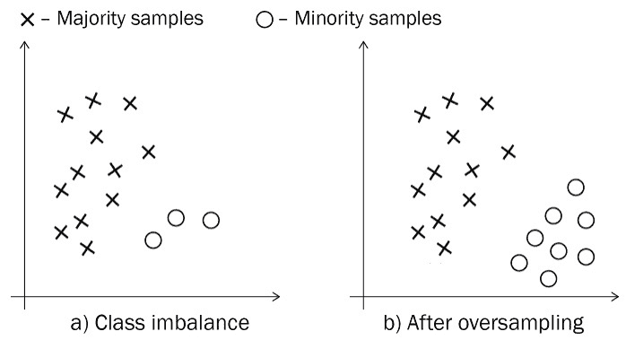

图 2.1 – 过采样后少数类样本数量的增加

你可能会问：“为什么需要过采样？”这是必要的，以便我们给模型足够的少数类样本来从中学习。如果我们提供的少数类实例太少，模型可能会选择忽略这些少数类示例，而只关注多数类示例。这反过来又会导致模型无法很好地学习决策边界。

让我们使用`sklearn`库的`make_classification` API 生成一个 1:99 比例的两类不平衡数据集，该 API 为每个类别创建一个正态分布的点集。这将生成两个类的不平衡数据集：一个是有标签 1 的少数类，另一个是有标签 0 的多数类。在本章中，我们将应用各种过采样技术来平衡这个数据集：

```py
from collections import Counter
from sklearn.datasets import make_classification
X, y = make_classification(n_samples=10000, n_features=2,\
    n_redundant=0, n_classes=2, flip_y=0, n_clusters_per_class=2,\
    class_sep=0.79, weights=[0.99], random_state=81)
```

这段代码生成了 100 个类别 1 的例子和 9,900 个类别 0 的例子，不平衡比率为 1:99。通过绘制数据集，我们可以看到例子是如何分布的：

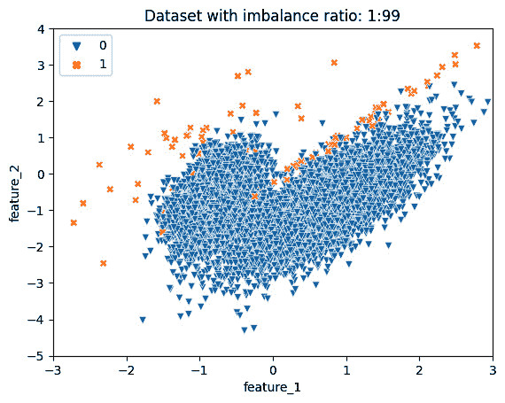

图 2.2 – 不平衡比率为 1:99 的数据集

在本节中，我们了解了过采样的必要性。我们还生成了一个合成的非平衡二分类数据集，以展示各种过采样技术的应用。

# 随机过采样

平衡数据集中不平衡的最简单策略是随机选择少数类的样本并重复或复制它们。这也被称为**随机过采样****带替换**。

为了增加少数类观察的数量，我们可以复制少数类数据观察结果足够多次以平衡两个类。这听起来太简单了吗？是的，但它是有效的。通过增加少数类样本的数量，随机过采样减少了向多数类的偏差。这有助于模型更有效地学习少数类的模式和特征。

我们将使用来自`imbalanced-learn`库的随机过采样。`RandomOverSampler`类的`fit_resample` API 重新采样原始数据集并使其平衡。`sampling_strategy`参数用于指定各种类的新比率。例如，我们可以将`sampling_strategy=1.0`指定为两个类具有相同数量的例子。

有多种方式可以指定`sampling_strategy`，例如浮点值、字符串值或`dict` – 例如，{0: 50, 1: 50}：

```py
from imblearn.over_sampling import RandomOverSampler
ros = RandomOverSampler(sampling_strategy=1.0, random_state=42)
X_res, y_res = ros.fit_resample(X, y)
print('Resampled dataset shape %s' % Counter(y_res))
```

这里是输出：

```py
Resampled dataset shape Counter({0: 9900, 1: 9900})
```

因此，我们从 1:99 的比例变为了 1:1，这正是我们期望的`sampling_strategy=1.0`的结果。

让我们绘制过采样后的数据集：

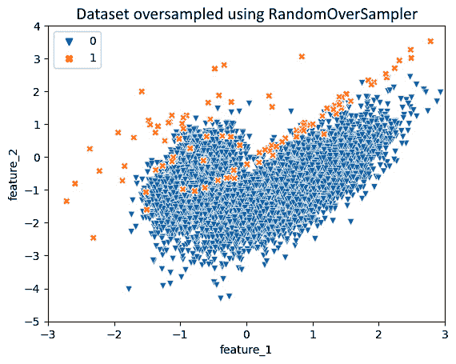

图 2.3 – 使用 RandomOverSampler（RandomOverSampler）过采样后的数据集（标签 1 的示例由于重叠而未改变）

应用随机过采样后，标签为 1 的示例会相互重叠，给人一种没有变化的感觉。反复重复相同的数据点可能导致模型记住特定的数据点，而无法推广到新的、未见过的示例。`RandomOverSampler`中的`shrinkage`参数让我们可以通过一个小量扰动或移动每个点。

`shrinkage`参数的值必须大于或等于 0，可以是`float`或`dict`类型。如果使用`float`数据类型，相同的收缩因子将用于所有类别。如果使用`dict`数据类型，收缩因子将针对每个类别具体指定。

在**图 2**.4 中，我们可以观察到`shrinkage=0.2`的随机过采样的影响：

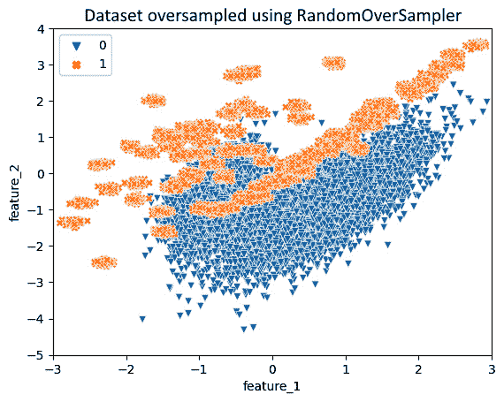

图 2.4 – 应用随机过采样（shrinkage=0.2）的结果

在本章的结尾，我们将比较随机过采样与其他多种过采样技术在多个模型和数据集上的性能。这将为我们提供关于它们在实际应用中的有效性的见解。

🚀 Grab 在生产中使用随机过采样

Grab 是一家东南亚的打车和食品配送服务公司，开发了一个用于存储和检索图像和地图数据的图像收集平台[1]。该平台的一个关键特性是能够自动检测和模糊街景图像中的**个人身份信息**（**PII**），如人脸和车牌。这对于维护用户隐私至关重要。用于此目的的数据集存在显著的不平衡，负样本（没有 PII 的图像）远多于正样本（有 PII 的图像）。手动标注不可行，所以他们转向机器学习来解决此问题。

为了解决数据不平衡，Grab 采用了随机过采样技术来增加正样本的数量，从而提高了他们的机器学习模型的性能。

## 随机过采样的问题

随机过采样往往会导致模型过拟合，因为生成的合成观察值会重复，模型会一次又一次地看到相同的观察值。收缩试图在某种程度上处理这个问题，但可能很难找到一个合适的收缩值，而且收缩并不关心生成的合成样本是否与多数类样本重叠，这可能导致其他问题。

在上一节中，我们学习了应用过采样平衡数据集和减少对多数类偏差的最基本和实用的技术。很多时候，随机过采样本身可能会极大地提高我们模型的表现，以至于我们可能甚至不需要应用更高级的技术。在生产环境中，在准备引入更多复杂性之前，保持事情简单明了也是有利的。正如他们所说，“过早优化是万恶之源”，所以我们从简单的事情开始，只要它能提高我们模型的表现。

在随后的章节中，我们将探讨一些替代技术，例如 SMOTE 和 ADASYN，它们采用不同的过采样方法，并缓解了与随机过采样技术相关的一些问题。

# SMOTE

随机过采样的主要问题是它会重复少数类的观察结果。这通常会导致过拟合。**合成少数过采样技术**（**SMOTE**）[2]通过使用称为**插值**的技术来解决这种重复问题。

插值涉及在已知数据点的范围内创建新的数据点。将插值想象成类似于生物学中的繁殖过程。在繁殖中，两个个体结合在一起产生一个具有两者特征的新个体。同样，在插值中，我们从数据集中选择两个观察结果，并通过选择两个选定点之间线上的随机点来创建一个新的观察结果。

我们通过插值合成示例来过采样少数类。这防止了少数样本的重复，同时生成与已知点相似的新的合成观察结果。*图 2.5*展示了 SMOTE 是如何工作的：

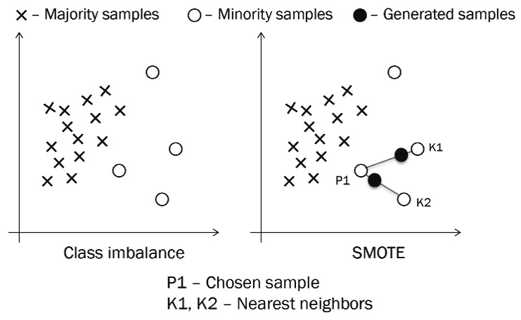

图 2.5 – SMOTE 的工作原理

在这里，我们可以看到以下内容：

+   大多数类和少数类样本被绘制出来（左侧）

+   通过在连接少数样本和两个最近邻多数类样本的线上的随机点生成合成样本（右侧）

SMOTE 最初是为连续输入设计的。为了保持解释的简单性，我们将从连续输入开始，稍后再讨论其他类型的输入。

首先，我们将检查 SMOTE 的功能，并探讨与此技术相关的任何潜在缺点。

## SMOTE 是如何工作的

SMOTE 算法的工作原理如下：

1.  它只考虑少数类的样本。

1.  它在少数样本上训练 KNN。`k`的典型值是 5。

1.  对于每个少数样本，从该点到其 KNN 示例之间画一条线。

1.  对于这样的线段，随机选择线段上的一个点来创建一个新的合成示例。

让我们使用`imbalanced-learn`库的 API 来应用 SMOTE：

```py
from imblearn.over_sampling import SMOTE
sm = SMOTE(random_state=0)
X_res, y_res = sm.fit_resample(X, y)
print('Resampled dataset shape %s' % Counter(y_res))
```

这里是输出：

```py
Resampled dataset shape Counter({0: 9900, 1: 9900})
```

过采样后的数据集看起来像这样：

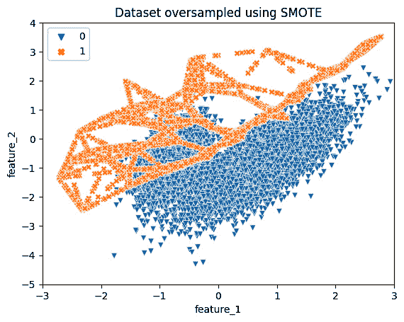

图 2.6 – 使用 SMOTE 进行过采样

🚀 微软生产中的过采样技术

在微软的一个实际应用[3]中，机器学习被用于预测**现场事件**（**LSIs**），以实现事件的早期检测和升级，这对于工程团队来说至关重要。每天都会产生大量的事件，其中大部分最初是低严重性问题。由于资源有限，工程团队调查所有事件是不切实际的，这可能导致在事件对客户产生重大影响之前，缓解关键问题的潜在延迟。

为了解决这个问题，微软采用了机器学习来预测哪些 LSIs 可能会升级为严重问题，目标是进行主动识别和早期解决。挑战在于训练集中的数据不平衡：在约 40,000 个事件中，不到 2%升级为高严重性。微软使用了两种不同的过采样技术——袋分类（在第*第四章*，*集成方法*）和 SMOTE，这些技术在提高模型性能方面最为有效。他们使用了两步流程来平衡类别：首先，使用**SMOTE**进行过采样，然后使用**RandomUnderSampler**（在第*第三章*，*欠采样方法*）进行欠采样。该流程自动选择了两步的最优采样比率，并且当与欠采样结合时，SMOTE 表现更佳。所得到的端到端自动化模型被设计为通用型，使其适用于微软内部或外部的不同团队，前提是可用历史事件进行学习。LSI 洞察工具使用了这个模型，并被各个工程团队采用。

接下来，我们将探讨使用 SMOTE 的局限性。

## SMOTE 的问题

SMOTE 有其陷阱——例如，它可能会向已经嘈杂的数据集中添加噪声。它也可能导致以下类重叠问题：

+   SMOTE 在生成少数类样本时没有考虑多数类的分布，这可能会增加类别之间的重叠。在*图 2*.7 中，我们绘制了应用 SMOTE 前后的二分类不平衡数据集。我们可以看到应用 SMOTE 后两个类别之间有很多重叠：

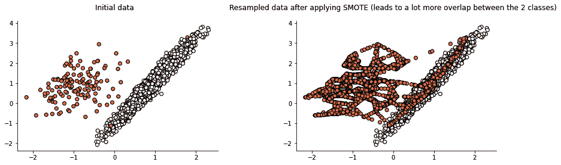

图 2.7 – 应用 SMOTE 前（左）和后（右）的二分类数据集（右图中两个类别的重叠部分）

+   另一种情况可能是你拥有大量数据，运行 SMOTE 可能会增加你管道的运行时间。

问题 1 可以通过使用 SMOTE 变体 Borderline-SMOTE（将在下一节中讨论）来解决。

在本节中，我们学习了 SMOTE，它使用最近邻技术来生成少数类的合成样本。有时，SMOTE 可能比随机过采样表现得更好，因为它利用了与其他少数类样本的邻近性来生成新的样本。

# SMOTE 变体

现在，让我们看看一些 SMOTE 的变体，例如 Borderline-SMOTE、SMOTE-NC 和 SMOTEN。这些变体将 SMOTE 算法应用于特定类型的样本，并且不一定总是适用。

## Borderline-SMOTE

Borderline-SMOTE [4]是 SMOTE 的一种变体，它从靠近分类边界的少数类样本中生成合成样本，该边界将多数类与少数类分开。

### 为什么要考虑分类边界的样本？

理念是靠近分类边界的例子比远离决策边界的例子更容易误分类。在边界附近产生更多的这种少数样本将有助于模型更好地学习少数类。直观上，远离分类边界的点可能不会使模型成为一个更好的分类器。

这里是 Borderline-SMOTE 的逐步算法：

1.  我们在整个数据集上运行 KNN 算法。

1.  然后，我们将少数类点分为三类：

    +   **噪声**点是所有邻居都是多数类的少数类例子。这些点被埋在多数类邻居中。它们可能是异常值，可以安全地被忽略作为“噪声”。

    +   **安全**点比多数类邻居有更多的少数类邻居。这样的观察结果包含的信息不多，可以安全地忽略。

    +   **危险**点比少数类邻居有更多的多数类邻居。这表明这样的观察结果位于或接近两类之间的边界。

1.  然后，我们仅在少数类例子上训练 KNN 模型。

1.  最后，我们将 SMOTE 算法应用于`危险`点。请注意，这些`危险`点的邻居可能被标记为`危险`，也可能不是。

如**图 2.8**所示，Borderline-SMOTE 在生成合成数据时专注于危险类点：

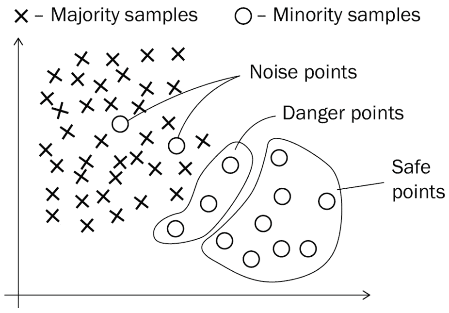

图 2.8 – Borderline-SMOTE 算法仅使用危险点来生成合成样本。危险点比少数类邻居有更多的多数类邻居

**图 2.9**展示了 Borderline-SMOTE 如何专注于靠近分类边界的少数类样本，该边界将多数类和少数类分开：


图 2.9 – Borderline-SMOTE 的说明

这里，我们可以看到以下情况：

a) 多数类和少数类样本的图

b) 使用靠近分类边界的邻居生成的合成样本

让我们看看如何使用`imbalanced-learn`库中的 Borderline-SMOTE 来执行数据过采样：

```py
print("Before: ", sorted(Counter(y).items()))
from imblearn.over_sampling import BorderlineSMOTE
X_resampled, y_resampled = BorderlineSMOTE().fit_resample(X, y)
print("After: ", sorted(Counter(y_resampled).items()))
```

这里是输出：

```py
Before: [(0, 9900), (1, 100)]
After:  [(0, 9900), (1, 9900)]
```

你能猜出只关注两类决策边界上的数据点的问题吗？

由于这种技术如此侧重于边界上非常少数的点，少数类簇内的点根本就没有被采样：

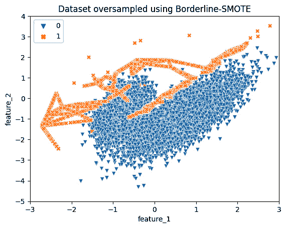

图 2.10 – 利用危险点（多数类邻居多于少数类）的 Borderline-SMOTE 算法生成合成样本

在本节中，我们学习了边界 SMOTE，它通过关注接近多数和少数类别分类边界的样本来生成合成少数类别样本，这反过来又可能有助于提高模型的判别能力。

🚀 亚马逊生产中的过采样技术

在实际应用中，亚马逊使用机器学习优化产品的包装类型，旨在减少浪费同时确保产品安全[5]。在他们的训练数据集中，包含了数百万种产品和包装组合，亚马逊面临显著的类别不平衡，其中只有 1%的示例代表不适合的产品-包装配对（少数类别）。

为了解决这种不平衡，亚马逊使用了各种过采样技术：

- 边界 SMOTE 过采样，导致 PR-AUC 提高了 4%-7%，但训练时间增加了 25%-35%。

- 随机过采样和随机欠采样的混合，其中它们随机过采样少数类，并欠采样多数类。这导致了 PR-AUC 提高了 6%-10%，但训练时间增加了高达 25%。

表现最好的技术是两阶段学习与随机欠采样（在第*第七章*，*数据级深度学习方法)*中讨论），它将 PR-AUC 提高了 18%-24%，而没有增加训练时间。

他们提到，处理数据集不平衡的技术效果既与领域相关，也与数据集特定。这个现实世界的例子强调了过采样技术在解决类别不平衡问题上的有效性。

接下来，我们将学习另一种过采样技术，称为 ADASYN，它通过对边界附近和其他低密度区域的示例进行过采样，而不会完全忽略不在边界上的数据点。

# ADASYN

虽然 SMOTE 不区分少数类别样本的密度分布，**自适应合成采样**（**ADASYN**）[6]则专注于难以分类的少数类别样本，因为它们位于低密度区域。ADASYN 根据分类观察的难度，使用少数类别的加权分布。这样，从更难样本中生成更多的合成数据：

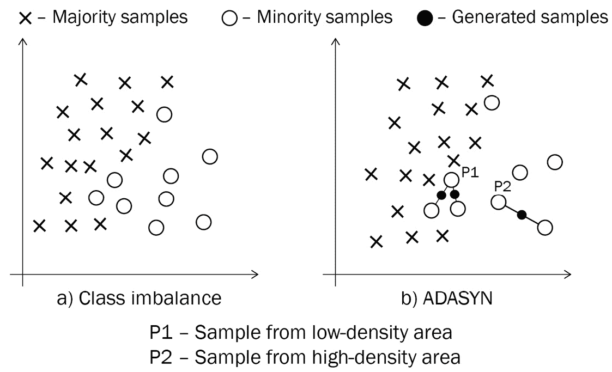

图 2.11 – ADASYN 工作原理的说明

在这里，我们可以看到以下内容：

+   a) 绘制了多数类和少数类样本

+   b) 根据硬度因子（稍后解释）生成合成样本

虽然 SMOTE 使用少数类中的所有样本进行均匀过采样，但在 ADASYN 中，更难分类的观察结果被更频繁地使用。

这两种技术之间的另一个区别是，与 SMOTE 不同，ADASYN 在训练 KNN 时也使用多数类观测值。然后，它根据有多少多数观测值是其邻居来决定样本的硬度。

## ADASYN 的工作原理

ADASYN 遵循一个简单的算法。以下是 ADASYN 的逐步工作原理：

1.  首先，它在整个数据集上训练一个 KNN。

1.  对于少数类的每个观测值，我们找到硬度因子。这个因子告诉我们分类该数据点有多困难。硬度因子，用 r 表示，是多数类邻居数与邻居总数的比率。在这里，r = M / K，其中 M 是多数类邻居的数量，K 是最近邻的总数。

1.  对于每个少数类观测值，我们通过在少数类观测值及其邻居（邻居可以是多数类或少数类）之间画线来生成与硬度因子成比例的合成样本。数据点分类越困难，为其创建的合成样本就越多。

让我们看看如何使用来自`imbalanced-learn`库的 ADASYN API 进行数据的过采样：

```py
from imblearn.over_sampling import ADASYN
X_resampled, y_resampled = ADASYN().fit_resample(X, y)
print(sorted(Counter(y_resampled).items()))
```

这里是输出：

```py
[(0, 9900), (1, 9900)]
```

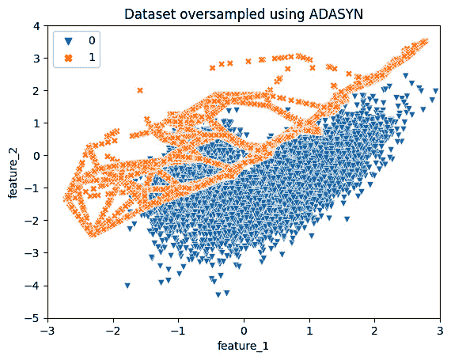

图 2.12 – ADASYN 优先考虑较难分类的样本，并在 KNN 中包含多数类示例以评估样本硬度

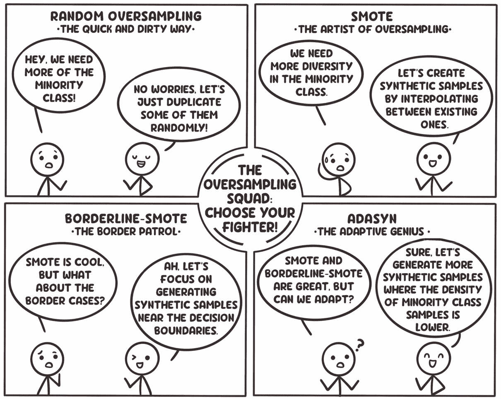

图 2.13 – 总结各种过采样技术的记忆辅助图

在本节中，我们学习了关于 ADASYN 的内容。接下来，让我们看看当我们的数据包含分类特征时，我们该如何处理这些情况。

## 分类特征和 SMOTE 变体（SMOTE-NC 和 SMOTEN）

如果你的数据包含分类特征呢？分类特征可以取有限或固定数量的可能值，这与计算机科学中的枚举（enums）类似。这些可能是无序的分类特征，例如头发颜色、种族等，或者是有序的分类特征，例如低、中、高：

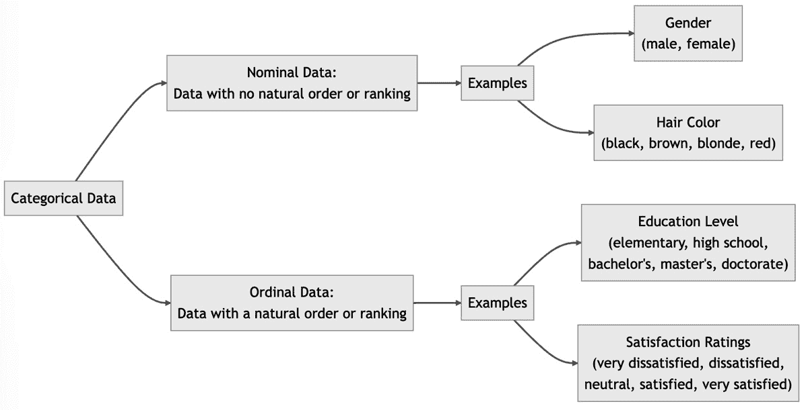

图 2.14 – 带有示例的分类数据和其类型

+   对于有序特征，我们可以通过 sklearn 的`OrdinalEncoder`对其进行编码，它将类别分配给值 0、1、2 等。

+   对于名义特征，我们之前学到的所有 SMOTE 变体都不会起作用。然而，`RandomOverSampler`也可以处理名义特征：

    ```py
    from imblearn.over_sampling import RandomOverSampler
    X_cat_mix = np.array([["abc", 1], ["def", 2],\
        ["ghi", 3]], dtype=object)
    y_cat_mix = np.array([0, 0, 1])
    print('X_cat_mix:', X_cat_mix, '\n y_cat_mix: ', y_cat_mix)
    X_resampled, y_resampled = RandomOverSampler().fit_resample(\
        X_cat_mix, y_cat_mix)
    print('X_resampled:', X_resampled, '\n y_resampled: ',\
        y_resampled)
    ```

    这里是输出：

    ```py
    X_cat_mix: [['abc' 1]
     ['def' 2]
     ['ghi' 3]]
     y_cat_mix:  [0 0 1]
    X_resampled: [['abc' 1]
     ['def' 2]
     ['ghi' 3]
     ['ghi' 3]]
     y_resampled:  [0 0 1 1]
    ```

然而，默认情况下，SMOTE 仅在连续数据上工作，不能直接用于分类数据。*为什么？* 这是因为 SMOTE 通过生成连接少数类两个不同数据点的线上的随机点（也称为插值）来工作。如果我们的数据是分类的，并且有“是”和“否”这样的值，我们首先需要将这些值转换为数字。即使我们这样做，比如“是”映射到 1，“否”映射到 0，SMOTE 的插值可能会产生一个 0.3 的新点，这并不映射到任何真实类别。

此外，由于`RandomOverSampler`中的`shrinkage`参数仅设计用于连续值，因此我们无法在分类数据中使用该参数。

然而，SMOTE 的两个变体可以处理分类特征：

+   使用`imbalanced-learn`对数据进行过采样。数据集的第一项是分类的，第二项是连续的：

    ```py
    from imblearn.over_sampling import SMOTENC
    X_cat_mix = np.array([["small", 1],\
        ["medium", 2],\
        ["large", 3],\
        ["large", 4],\
        ["large", 5]], dtype=object)
    y_cat_mix = np.array([0, 0, 1, 0, 1])
    print('X_cat_mix:', X_cat_mix, '\n y_cat_mix: ', y_cat_mix)
    X_resampled, y_resampled = SMOTENC(
        categorical_features=[0], k_neighbors=1, random_state=1
    ).fit_resample(X_cat_mix, y_cat_mix)
    print('X_resampled:', X_resampled, '\ny_resampled: ', \
        y_resampled)
    ```

    这里是输出：

    ```py
    X_cat_mix: [['small' 1]
               ['medium' 2]
               ['large' 3]
               ['large' 4]
               ['large' 5]]
    y_cat_mix: [0 0 1 0 1]
    X_resampled: [['small' 1.0]
                 ['medium' 2.0]
                 ['large' 3.0]
                 ['large' 4.0]
                 ['large' 5.0]
                 ['large' 3.005630378122263]]
    y_resampled:  [0 0 1 0 1 1]
    ```

+   **用于名义数据的合成少数过采样技术**（**SMOTEN**）用于名义分类数据。SMOTEN 对所有特征执行与 SMOTE-NC 类似的多数投票。它将所有特征视为名义分类，新样本的特征值通过选择最近邻中最频繁的类别来决定。用于计算最近邻的距离度量称为**值距离度量**（**VDM**）。VDM 通过考虑与每个值关联的类别标签分布来计算两个属性值之间的距离。基于这样的想法，如果两个属性值的类别标签分布相似，则这两个属性值更相似。这样，VDM 可以捕捉分类属性及其对应类别标签之间的潜在关系。

    让我们看看使用 SMOTEN 的一些示例代码：

    ```py
    from imblearn.over_sampling import SMOTEN
    X_original = np.array([["abc"], \
                           ["def"], \
                           ["ghi"], \
                           ["ghi"], \
                           ["ghi"]], dtype=object)
    y_original = np.array([0, 0, 1, 1, 1])
    print('X_original:', X_original, '\ny_original: ', y_original)
    X_resampled, y_resampled = \
        SMOTEN(k_neighbors=1).fit_resample(X_original, y_original)
    print('X_resampled:', X_resampled, '\ny_resampled:', \
        y_resampled)
    ```

    这里是输出：

    ```py
    X_original: [['abc']
                 ['def']
                 ['ghi']
                 ['ghi']
                 ['ghi']]
    y_original:  [0 0 1 1 1]
    X_resampled: [['abc']
                  ['def']
                  ['ghi']
                  ['ghi']
                  ['ghi']
                  ['abc']]
    y_resampled:  [0 0 1 1 1 0]
    ```

在*表 2.1*中，我们可以看到 SMOTE、SMOTEN 和 SMOTENC，以及每种技术的一些示例，以展示它们之间的差异：

| **SMOTE 类型** | **支持的特性** | **示例数据** |
| --- | --- | --- |
| SMOTE | 仅数值 | 特征：[2.3, 4.5, 1.2]，标签：0 特征：[3.4, 2.2, 5.1]，标签：1 |
| SMOTEN | 分类（名义或有序） | 特征：[‘green’, ‘square’]，标签：0 特征：[‘red’, ‘circle’]，标签：1 |
| SMOTENC | 数值或分类（名义或有序） | 特征：[2.3, ‘green’, ‘small’, ‘square’]，标签：0 特征：[3.4, ‘red’, ‘large’, ‘circle’]，标签：1 |

表 2.1 – SMOTE 及其一些常见变体与示例数据

总结来说，当我们有分类和连续数据类型的混合时，应使用 SMOTENC，而 SMOTEN 只能用于所有列都是分类的情况。你可能对各种过采样方法在模型性能方面的比较感到好奇。我们将在下一节探讨这个话题。

# 各种过采样方法的模型性能比较

让我们检查一些流行的模型在不同过采样技术下的表现。我们将使用两个数据集进行比较：一个是合成数据集，另一个是真实世界数据集。我们将使用逻辑回归和随机森林模型评估四种过采样技术以及无采样的性能。

你可以在本书的 GitHub 仓库中找到所有相关代码。在*图 2.15*和*图 2.16*中，我们可以看到两个数据集上两种模型的平均精确度得分值：

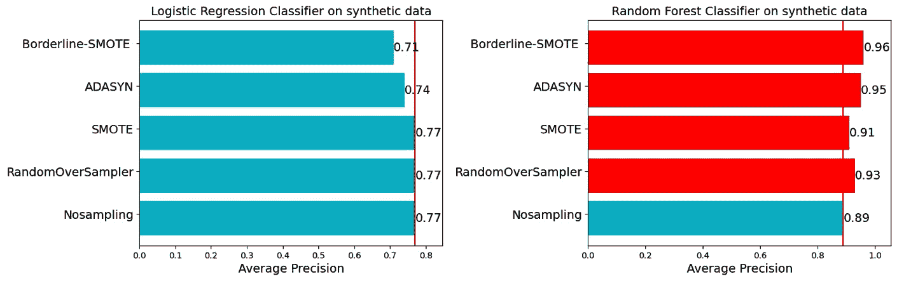

图 2.15 – 在合成数据集上各种过采样技术的性能比较

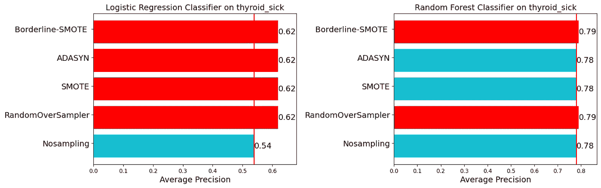

图 2.16 – 在 thyroid_sick 数据集上各种过采样技术的性能比较

根据这些图表，我们可以得出一些有用的结论：

+   **过采样的有效性**：总的来说，使用过采样技术似乎比不使用任何采样（NoSampling）提高了平均精确度得分。

+   **算法敏感性**：过采样技术的有效性取决于所使用的机器学习算法。例如，随机森林似乎比逻辑回归从过采样技术中受益更多，尤其是在合成数据上。

+   `thyroid_sick`数据集但在合成数据中显示了变化。

+   `thyroid_sick`数据

+   对于随机森林，Borderline-SMOTE 在合成数据上具有最高的平均精确度得分。

+   `thyroid_sick`数据.*   **没有明显的胜者**：没有一种过采样技术在所有条件下都优于其他技术。技术的选择可能取决于所使用的特定算法和数据集。

请注意，这里使用的模型没有使用最佳超参数进行调整。

调整随机森林和逻辑回归模型的超参数可以进一步提高模型性能。

通常情况下，没有一种技术总是比其他技术表现得更好。这里有几个变量在起作用，即“模型”和“数据”。大多数时候，唯一知道的方法是尝试这些技术中的一系列，并找到最适合我们模型和数据的那个。你可能会对如何从众多过采样选项中进行选择感到好奇。

# 使用各种过采样技术的指南

现在，让我们回顾一下如何导航我们讨论过的各种过采样技术以及这些技术如何彼此不同的一些指南：

1.  不应用任何采样技术来训练模型。这将是我们具有基线性能的模型。我们应用的任何过采样技术都预期会提高这种性能。

1.  从随机过采样开始，并添加一些收缩。我们可能需要调整一些收缩的值，看看模型性能是否有所改善。

1.  当我们具有分类特征时，我们有几种选择：

    1.  首先将所有分类特征转换为数值特征，使用独热编码、标签编码、特征哈希或其他特征转换技术。

    1.  （仅适用于名义分类特征）直接在数据上使用 SMOTENC 和 SMOTEN。

1.  应用各种过采样技术——随机过采样、SMOTE、Borderline-SMOTE 和 ADASYN——并在适用于您问题的指标上衡量模型的性能，例如平均精度得分、ROC-AUC、精确率、召回率、F1 分数等。

1.  由于过采样改变了训练数据集的分布，而测试集或现实世界并非如此，使用过采样可能会产生潜在的偏差预测。使用过采样后，根据应用重新校准模型的概率得分可能至关重要。模型的重新校准纠正了由于改变类别分布而引入的任何偏差，确保在部署时做出更可靠的决策。同样，调整分类阈值对于准确解释模型至关重要，尤其是在不平衡数据集的情况下。有关重新校准和阈值调整的更多详细信息，请参阅*第十章*《模型校准》和*第五章*《成本敏感学习》。

## 避免过采样的时机

在*第一章*《机器学习中的数据不平衡介绍》中，我们讨论了数据不平衡可能不是问题的场景。在您选择过采样技术之前，应该重新审视这些考虑因素。尽管存在批评，但过采样的适用性应该根据具体情况评估。以下是一些在选择应用过采样技术时需要考虑的额外技术因素：

+   **计算成本**：过采样增加了数据集的大小，导致处理时间和硬件资源方面的计算需求更高。

+   **数据质量**：如果少数类数据有噪声或许多异常值，过采样可能会引入更多噪声，降低模型可靠性。

+   **分类器限制**：在系统约束场景中，例如极低延迟或处理遗留系统时，使用强大的分类器（复杂且更准确的模型）可能不可行。在这种情况下，我们可能只能使用弱分类器。弱分类器更简单、精度较低，但需要较少的计算资源，并且具有更低的运行时延迟。在这种情况下，过采样可能是有益的[7]。对于强大的分类器，过采样可能带来递减的回报，有时优化决策阈值可能是一个更简单、资源消耗更少的替代方案。

在决定是否使用过采样方法来解决不平衡数据集时，考虑以下因素。

*表 2.2* 总结了各种过采样技术的关键思想、优点和缺点。这可以帮助你更好地评估选择哪种过采样方法：

|  | **SMOTE** | **Borderline-SMOTE** | **ADASYN** | **SMOTE-NC** 和 **SMOTEN** |
| --- | --- | --- | --- | --- |
| 核心思想 | 在连接少数类样本最近邻的线上选择随机点。 | 在多数类和少数类之间的边界上选择少数样本。对这样的样本在边界上执行 SMOTE。 | 根据密度分布自动决定要生成的少数类样本数量。在密度分布低的地方生成更多点。 | 它对分类特征进行多数投票。 |
| 优点 | 通常减少假阴性。 | 创建的合成样本不是已知数据的简单复制。 | 它关注不同类别的密度分布。 | 它适用于分类数据。 |
| 缺点 | 可能会发生重叠的类别，并可能向数据中引入更多噪声。这可能不适合高维数据或多类别分类问题。 | 它不关心少数类样本的分布。 | 它关注类别之间重叠的区域。它可能过分关注异常值，导致模型性能不佳。 | 与 SMOTE 相同。 |

表 2.2 – 总结本章讨论的各种过采样技术

在本节中，我们讨论了如何应用本章中学习到的各种过采样技术以及使用它们的优缺点。接下来，我们将探讨如何将各种过采样方法扩展到多类别分类问题。

# 多类别分类中的过采样

在多类别分类问题中，我们有超过两个类别或标签需要预测，因此可能存在多个类别不平衡。这给问题增加了更多复杂性。然而，我们也可以将相同的技巧应用于多类别分类问题。`imbalanced-learn` 库提供了在几乎所有支持的方法中处理多类别分类的选项。我们可以通过使用 `sampling_strategy` 参数选择各种采样策略。对于多类别分类，我们可以在 SMOTE API 中的 `sampling_strategy` 参数传递一些固定的字符串值（称为内置策略）。我们还可以传递一个包含以下内容的字典：

+   以类别标签作为键

+   以该类别的样本数量作为值

在使用参数作为字符串时，以下是一些内置的 `sampling_strategy` 样本策略：

+   `minority` 策略仅重新采样少数类。

+   `not minority` 策略重新采样除了少数类以外的所有类别。在多类别不平衡的情况下，这可能是有帮助的，因为我们有超过两个类别，并且多个类别不平衡，但我们不想触及少数类。

+   `not majority`策略重新采样所有类别，除了多数类别。

+   `all`策略重新采样所有类别。

+   `auto`策略与`not``majority`策略相同。

以下代码展示了使用各种采样策略进行多类分类时 SMOTE 的使用方法。

首先，让我们创建一个包含 100 个样本的数据集，其中三个类别的权重分别为 0.1、0.4 和 0.5：

```py
X, y = make_classification(n_classes=3, class_sep=2, \
    weights=[0.1, 0.4, 0.5], n_clusters_per_class=1, \
    n_samples=100, random_state=10)
print('Original dataset shape %s' % Counter(y))
```

这里是输出：

```py
Original dataset shape Counter({2: 50, 1: 40, 0: 10})
```

如预期，我们的数据集包含三个类别，分别为类别 0、1 和 2，其比例为 10:40:50。

现在，让我们应用带有“*少数*”采样策略的 SMOTE。这将增加最少样本数的类别：

```py
over_sampler = SMOTE(sampling_strategy='minority')
X_res, y_res = over_sampler.fit_resample(X, y)
print('Resampled dataset shape using minority strategy: %s'% \
    Counter(y_res))
```

这里是输出：

```py
Resampled dataset shape using minority strategy: Counter({0: 50, 2: 50, 1: 40})
```

由于类别 0 之前样本数最少，因此“*少数*”采样策略只对类别 0 进行了过采样，使得样本数等于多数类别的样本数。

在下面的代码中，我们使用字典进行过采样。在这里，对于`sampling_strategy`字典中的每个类别标签（0、1 或 2）作为`key`，我们都有每个目标类别的期望样本数作为`value`：

```py
print('Original dataset shape %s' % Counter(y))
over_sampler = SMOTE(sampling_strategy={
                             0 : 40,
                             1 : 40,
                             2 : 50})
X_res, y_res = over_sampler.fit_resample(X, y)
print('Resampled dataset shape using dict strategy: %s\n'% \
    Counter(y_res))
```

这里是输出：

```py
Original dataset shape Counter({2: 50, 1: 40, 0: 10})
Resampled dataset shape using dict strategy:
         Counter({2: 50, 0: 40, 1: 40})
```

小贴士

请注意，当在`sampling_strategy`中使用`dict`时，每个类别的期望样本数应大于或等于原始样本数。否则，`fit_resample`API 将抛出异常。

在本节中，我们看到了如何将过采样策略扩展到处理具有两个以上类别的数据不平衡情况。大多数情况下，“auto”`采样策略`就足够好了，并且会平衡所有类别。

# 摘要

在本章中，我们介绍了处理不平衡数据集的各种过采样技术，并使用 Python 的`imbalanced-learn`库（也称为`imblearn`）进行了应用。我们还通过从头实现一些技术来了解这些技术的内部工作原理。虽然过采样可能会潜在地使模型对数据进行过拟合，但它通常比缺点多，具体取决于数据和模型。

我们将它们应用于一些合成和公开可用的数据集，并对其性能和有效性进行了基准测试。我们看到了不同的过采样技术如何可能导致模型性能在各个尺度上变化，因此尝试几种不同的过采样技术以决定最适合我们数据的方法变得至关重要。

如果你被发现与深度学习模型相关的过采样方法所吸引，我们邀请你查看*第七章*，*数据级深度学习方法*，我们将讨论深度学习领域内的数据级技术。

在下一章中，我们将介绍各种欠采样技术。

# 练习

1.  探索`imbalanced-learn`库中的 SMOTE 的两个变体，即 KMeans-SMOTE 和 SVM-SMOTE，本章未讨论。使用逻辑回归和随机森林模型比较它们与 vanilla SMOTE、Borderline-SMOTE 和 ADASYN 的性能。

1.  对于一个有两个类别的分类问题，假设少数类与多数类的比例是 1:20。我们应该如何平衡这个数据集？我们应该在测试或评估时间应用平衡技术吗？请提供你的答案的理由。

1.  假设我们正在尝试构建一个模型，用于估计一个人是否能获得银行贷款。在我们拥有的 5,000 个观测值中，只有 500 人的贷款获得了批准。为了平衡数据集，我们将批准的人的数据进行复制，然后将其分为训练集、测试集和验证集。使用这种方法是否存在任何问题？

1.  数据归一化有助于处理数据不平衡。这是真的吗？为什么或为什么不？

1.  在这里探索`imbalanced-learn`库中可用的各种过采样 API：[`imbalanced-learn.org/stable/references/over_sampling.html`](https://imbalanced-learn.org/stable/references/over_sampling.html)。请注意每个 API 的各种参数。

# 参考文献

1.  *《Grab 的图像中保护个人数据》*（2021 年），[`engineering.grab.com/protecting-personal-data-in-grabs-imagery`](https://engineering.grab.com/protecting-personal-data-in-grabs-imagery)。

1.  N. V. Chawla，K. W. Bowyer，L. O. Hall，和 W. P. Kegelmeyer，*SMOTE：合成少数类过采样技术*，jair，第 16 卷，第 321-357 页，2002 年 6 月，doi: 10.1613/jair.953。

1.  *《实时网站事件升级预测》*（2023 年），[`medium.com/data-science-at-microsoft/live-site-incident-escalation-forecast-566763a2178`](https://medium.com/data-science-at-microsoft/live-site-incident-escalation-forecast-566763a2178)。

1.  H. Han，W.-Y. Wang，和 B.-H. Mao，*Borderline-SMOTE：不平衡数据集学习中的新过采样方法*，在《智能计算进展》中，D.-S. Huang，X.-P. Zhang，和 G.-B. Huang，编，在《计算机科学讲座笔记》第 3644 卷。柏林，海德堡：Springer Berlin Heidelberg，2005 年，第 878-887 页。doi: 10.1007/11538059_91。

1.  P. Meiyappan 和 M. Bales，*立场文件：使用多模态深度学习减少亚马逊的包装浪费*，（2021 年），文章：[`www.amazon.science/latest-news/deep-learning-machine-learning-computer-vision-applications-reducing-amazon-package-waste`](https://www.amazon.science/latest-news/deep-learning-machine-learning-computer-vision-applications-reducing-amazon-package-waste)，论文：[`www.amazon.science/publications/position-paper-reducing-amazons-packaging-wasteusing-multimodal-deep-learning`](https://www.amazon.science/publications/position-paper-reducing-amazons-packaging-wasteusing-multimodal-deep-learning)。

1.  Haibo He, Yang Bai, E. A. Garcia 和 Shutao Li，*ADASYN：用于不平衡学习的自适应合成采样方法*，载于 2008 年 IEEE 国际神经网络联合会议（IEEE 计算智能世界大会），中国香港：IEEE，2008 年 6 月，第 1322–1328 页。doi: 10.1109/IJCNN.2008.4633969。

1.  Y. Elor 和 H. Averbuch-Elor, *SMOTE 是否必要？*，arXiv，2022 年 5 月 11 日。访问时间：2023 年 2 月 19 日。[在线]。可在[`arxiv.org/abs/2201.08528`](http://arxiv.org/abs/2201.08528)获取。
