# 第三章：欠采样方法

有时候，你拥有如此多的数据，通过过采样添加更多数据只会使事情变得更糟。别担心，我们也有针对这些情况的策略。这被称为欠采样或降采样。在本章中，你将了解欠采样的概念，包括何时使用它以及执行它的各种技术。你还将看到如何通过`imbalanced-learn`库的 API 使用这些技术，并将它们的性能与一些经典的机器学习模型进行比较。

本章将涵盖以下主题：

+   介绍欠采样

+   在多数类中何时避免欠采样

+   均匀地移除示例

+   移除噪声观察的策略

+   移除简单观察的策略

到本章结束时，你将掌握各种用于不平衡数据集的欠采样技术，并能够自信地使用`imbalanced-learn`库来构建更好的机器学习模型。

# 技术要求

本章将使用常见的库，如`matplotlib`、`seaborn`、`pandas`、`numpy`、`scikit-learn`和`imbalanced-learn`。本章的代码和笔记本可以在 GitHub 上找到，网址为[`github.com/PacktPublishing/Machine-Learning-for-Imbalanced-Data/tree/master/chapter03`](https://github.com/PacktPublishing/Machine-Learning-for-Imbalanced-Data/tree/master/chapter03)。要运行笔记本，有两种选择：你可以点击章节笔记本顶部的**在 Colab 中打开**图标，或者你可以直接从[`colab.research.google.com`](https://colab.research.google.com)使用笔记本的 GitHub URL 启动它。

# 介绍欠采样

两个家庭，同样有尊严，

在公平的维罗纳，我们设景之处，

从古老的仇恨到新的叛乱，

在这里，市民的血使市民的手变得不洁。

——莎士比亚《罗密欧与朱丽叶》的开篇诗句

让我们看看一个受莎士比亚戏剧《罗密欧与朱丽叶》启发的场景。想象一个有两个敌对社区（即，蒙塔古家族和凯普莱特家族）的城镇。他们世世代代都是敌人。蒙塔古家族在城镇中属于少数派，而凯普莱特家族是多数派。蒙塔古家族非常富有和强大。凯普莱特家族并不那么富裕。这给城镇带来了复杂的情况。由于这种竞争，城镇里经常发生暴乱。有一天，蒙塔古家族赢得了国王的青睐，并密谋消灭一些凯普莱特家族成员以减少他们的数量。想法是，如果城镇中的凯普莱特家族成员减少，蒙塔古家族将不再是少数派。国王同意了这个计划，因为他希望在执行后实现和平。我们将在这个章节中使用这个故事来说明各种欠采样算法。

有时候，仅仅对少数类别进行过采样是不够的。过采样可能会导致过拟合和更长的训练时间。为了解决这些问题，并从不同的角度处理类别不平衡问题，人们想到了过采样的对立面——即**欠采样**。在文献中，这也常被称为**降采样**或**负降采样**，以表示负类别（即多数类别）正在被欠采样。

欠采样技术减少了多数类别中的样本数量。这种方法与过采样相比有两个明显的优势：

+   **数据规模得到控制**：即使数据不平衡不是问题，处理从太字节到拍字节不等的大量数据集通常需要数据降维以进行实际训练。数据量本身就可以使训练在时间和计算成本上变得不切实际。云服务提供商如亚马逊网络服务、微软 Azure 和谷歌云除了存储费用外，还会对计算单元收费，使得大规模训练变得昂贵。鉴于你很可能只使用可用训练数据的一小部分，因此关于保留哪些数据以及丢弃哪些数据要有战略性地考虑。欠采样不仅是一种平衡类别的手段，而且是一种有效的成本效益策略，可以将训练时间从几天减少到几小时。

+   **过拟合的可能性更小**：通过使用欠采样技术，可以减少多数类别的实例数量，使模型更多地关注少数类别的实例。这反过来又提高了模型在两个类别之间泛化的能力。因此，模型不太可能对多数类别过拟合，并且更好地准备处理新的、未见过的数据，从而降低过拟合的可能性。我们将在本章中讨论各种欠采样方法。

*图 3.1*以图形方式展示了欠采样的基本思想。

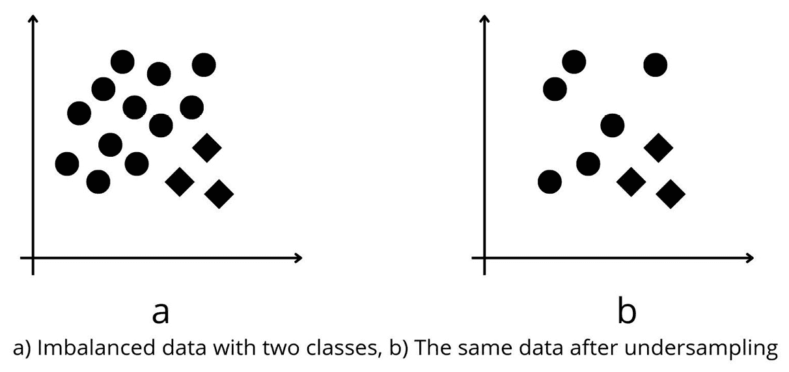

图 3.1 – 欠采样的基本思想展示：(a)具有两个类别的失衡数据，(b)欠采样后的数据

在*图 3.1(a)*中，我们展示了包含来自圆形类别的许多数据点的原始数据。在*图 3.1(b)*中，我们展示了从圆形类别中移除一些数据点后的重采样数据。

# 当何时避免对多数类别进行欠采样

欠采样并非万能良药，并不总是有效。它取决于所考虑的数据集和模型：

+   **所有类别的训练数据都太少**：如果数据集本身已经很小，对多数类别进行欠采样可能会导致信息损失很大。在这种情况下，建议尝试收集更多数据或探索其他技术，例如对少数类别进行过采样以平衡类别分布。

+   **多数类同等重要或比少数类更重要**：在特定场景下，例如在*第一章*“机器学习中的数据不平衡介绍”中提到的垃圾邮件过滤示例，保持识别多数类实例的高准确性至关重要。在这种情况下，对多数类进行下采样可能会降低模型准确分类多数类实例的能力，导致更高的误报率。相反，可以考虑其他方法，如成本敏感学习或调整决策阈值（这两种方法都在*第五章*“成本敏感学习”中讨论过）。

+   **当下采样损害模型性能或导致模型过拟合时**：对多数类进行下采样可能会降低整体模型性能，因为它丢弃了可能有价值的信息。一些下采样方法会丢弃决策边界附近的示例，这也会改变决策边界。此外，通过减少多数类的大小，下采样可能导致欠拟合，即模型变得过于简单，无法捕捉有限训练数据中的潜在趋势，在新未见过的数据上表现不佳。在使用下采样技术时，如果模型记住了减少后的数据集，也存在过拟合的风险。在这种情况下，探索其他技术，如集成方法（*第四章*“集成方法”中讨论过）、结合过采样和下采样的混合方法（在本章末尾讨论），或使用不太容易过拟合的不同算法可能更好。

🚀 Meta、Microsoft 和 Uber 在生产中的下采样技术

在广告点击预测等任务中，主要挑战是处理大规模且不平衡的数据集。例如，Facebook 单日广告可能包含数亿个实例，平均点击率（**CTR**）仅为 0.1%。为了解决这个问题，Meta 在论文《从预测 Facebook 广告点击中汲取的实用经验》[1]中详细介绍了两种专门的技巧。第一种是均匀下采样，它均匀地减少了训练数据量，并表明使用仅 10%的数据只会导致模型性能降低 1%。第二种是负样本下采样，它专门针对负样本（“无点击”）示例，并使用最优的下采样率为 0.025。

类似地，微软和优步在应对这些挑战方面有非常相似的方法。为了估计必应搜索中赞助广告的点击率[2]，微软对非点击案例使用 50%的负样本下采样率，有效地将训练时间减半，同时保持相似的性能指标。优步外卖也采用负样本下采样来减少训练数据，以便训练预测是否向客户发送有关新餐厅推送通知的模型[3]。此外，他们在构建模型最终版本时移除了最不重要的特征。

让我们看看分类下采样方法的一种方式。

## 固定方法与清洗方法

根据从多数类中移除数据点的方式，下采样方法可以分为两类：固定方法和清洗方法。

在**固定方法**中，多数类的示例数量减少到固定的数量。通常，我们会将多数类的样本数量减少到少数类的规模。例如，如果多数类有 1 亿个样本，少数类有 1000 万个样本，应用固定方法后，你将只剩下 1000 万个两个类的样本。这类方法包括随机下采样和基于实例硬度的下采样。

在**清洗方法**中，基于某些预先确定的准则减少多数类的样本数量，与示例的绝对数量无关。一旦满足这个准则，算法就不关心多数类或少数类的规模。

*表 3.1* 以表格形式总结了两种方法之间的关键差异：

|  | **固定** **下采样方法** | **清洗** **下采样方法** |
| --- | --- | --- |
| 关键思想 | 选择特定数量的多数类实例进行移除 | 识别并移除噪声、冗余或误分类的多数类实例，旨在改善类之间的决策边界 |
| 实例之间的关系 | 不考虑实例之间的关系 | 评估实例之间的关系 |
| 性能和实现难度 | 实现更快且更容易 | 有时，可能比固定下采样方法有更好的模型性能和泛化能力 |
| 示例 | 随机下采样 | 基于实例硬度的下采样 | 托梅克链接 | 邻域清洗规则 |

表 3.1 – 固定方法与清洗方法下采样

让我们使用`sklearn`的`make_classification` API 创建一个不平衡的数据集。我们将在本章中应用各种下采样技术来平衡这个数据集：

```py
from collections import Counter
from sklearn.datasets import make_classification
X, y = make_classification(n_samples=10000, n_features=2,
    n_redundant=0, n_classes=2, flip_y=0,
    n_clusters_per_class=2, class_sep=0.79,
    weights=[0.99], random_state=81)
```

*图 3.2* 展示了数据集在二维图上的样子。完整的笔记本代码请参考本章的 GitHub 仓库。

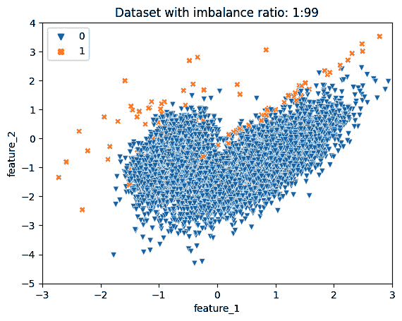

图 3.2 – 绘制不平衡率为 1:99 的数据集

模型校准和阈值调整

在应用欠采样技术后，你可能需要重新校准模型的概率分数。为什么？因为欠采样改变了原始类别的分布，模型的置信度估计存在偏差[4]，可能不再准确反映现实场景中每个类别的真实可能性。未能重新校准可能导致模型部署时做出误导性或次优的决策。因此，重新校准模型的概率分数确保模型不仅能够正确分类实例，而且以与实际类别分布一致的方式估计概率，从而提高其可靠性。对于更深入理解此过程，特别是如何校准模型分数以考虑下采样的影响，请参阅*第十章*，*模型校准*。

在不平衡数据集的背景下，阈值调整技术可以是欠采样方法的临界补充。无论我们最终是否应用任何采样技术，调整阈值以确定正确的类别标签对于正确解释模型性能至关重要。对于更深入理解各种阈值调整技术，你可以参阅*第五章*，*成本敏感学习*。

## 欠采样方法

让我们看看第二种对欠采样算法进行分类的方法。国王可以通过几种方式消除一些凯普莱特家族成员：

+   他可以从整个城镇均匀地消除凯普莱特家族，从而从城镇的所有地区移除一些凯普莱特家族成员

+   或者，国王可以移除住在蒙太古家族房屋附近的凯普莱特家族

+   最后，他可以移除住在远离蒙太古家族房屋的凯普莱特家族成员

这些是在欠采样技术中使用的三种主要方法。我们要么均匀地移除多数样本，要么移除靠近少数样本的多数样本，要么移除远离少数样本的多数样本。我们也可以通过移除一些靠近的和一些远离的样本来结合后两种方法。以下图表给出了这些方法的分类：

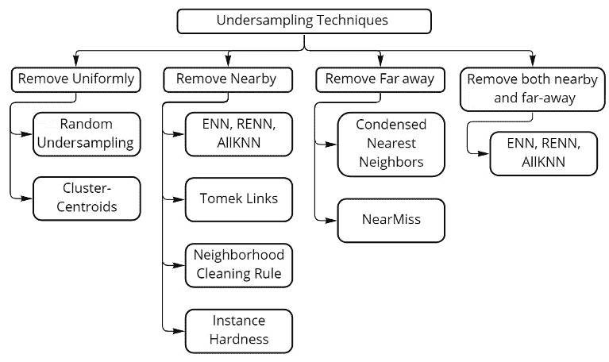

图 3.3 – 欠采样技术分类

以下图表说明了两种标准之间的差异。在*图 3.4(a)*中，我们展示了原始数据集。在*图 3.4(b)*中，我们展示了移除靠近决策边界例子后的相同数据集。注意靠近类别边界的例子是如何被移除的。

大多数类别的例子远离少数类别可能无法有效地帮助模型建立决策边界。因此，这样的远离决策边界的多数类别例子可以被移除。在*图 3.4(c)*中，我们展示了移除远离边界例子后的数据集。远离决策边界的例子可以被认为是易于分类的例子。

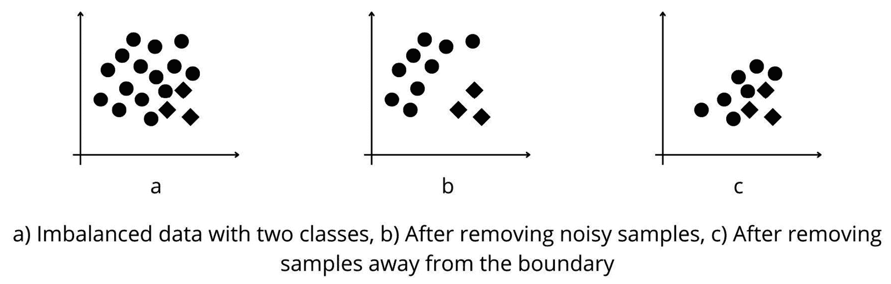

图 3.4 – 两种下采样一般方法的差异

在讨论了各种分类下采样技术的方法之后，我们现在更详细地看看它们。

# 均匀移除示例

从数据中均匀移除多数类示例主要有两种方法。第一种是随机移除示例，另一种则涉及使用聚类技术。让我们详细讨论这两种方法。

## 随机下采样

国王可能首先想到的技术是随机挑选凯普莱特并从城镇中移除他们。这是一个简单的方法。它可能有效，国王可能能够带来城镇的和平。但是，国王可能会通过挑选一些有影响力的凯普莱特造成不可预见的损害。然而，这是一个很好的开始讨论的地方。这种技术可以被认为与随机过采样是近亲。在**随机下采样**（**RUS**）中，正如其名所示，我们随机从多数类中提取观察值，直到类别平衡。这种技术不可避免地导致数据损失，可能会损害数据的潜在结构，因此有时表现不佳。

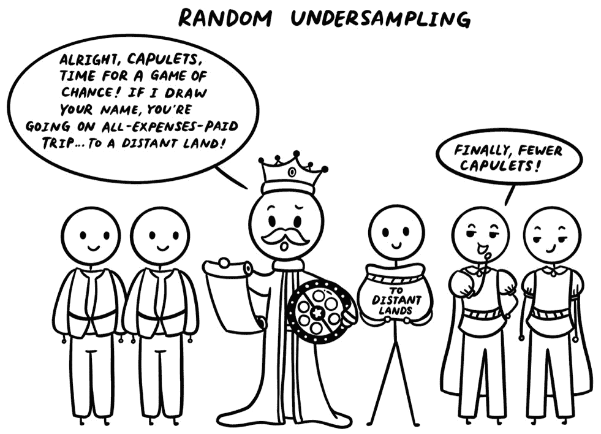

图 3.5 – 解释 RUS 方法主要思想的漫画

下面的代码示例展示了如何使用 RUS：

```py
from imblearn.under_sampling import RandomUnderSampler
rus = RandomUnderSampler(sampling_strategy=1.0, random_state=42)
X_res, y_res = rus.fit_resample(X, y)
```

可以使用`sampling_strategy`值来指定少数类和多数类所需的比率，默认情况下，它们将被设置为数量相等。*图 3*.*6*显示了`RandomUnderSampler`技术的应用，其中右侧的图显示大多数负类样本被丢弃：

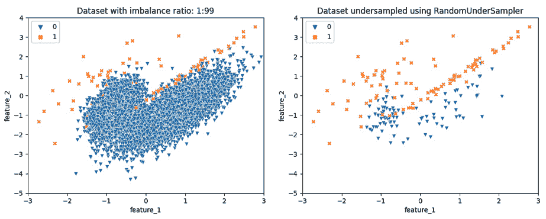

图 3.6 – 使用 RandomUnderSampler 在降采样前后绘制数据集

接下来，我们转向一种更智能的技术，它会在多数类示例之间形成小组。

## ClusterCentroids

国王可能采用的第二种技术来实现均匀下采样，是将凯普莱特人口根据地理位置分成小组。然后，每组保留一个凯普莱特，并从该组中移除其他凯普莱特。这种下采样方法被称为**ClusterCentroids**方法。如果少数类中有*N*个项目，我们就从多数类的点中创建*N*个簇。例如，这可以使用 K-means 算法完成。K-means 是一种聚类算法，它将附近的点分组到不同的簇中，并为每个组分配质心。

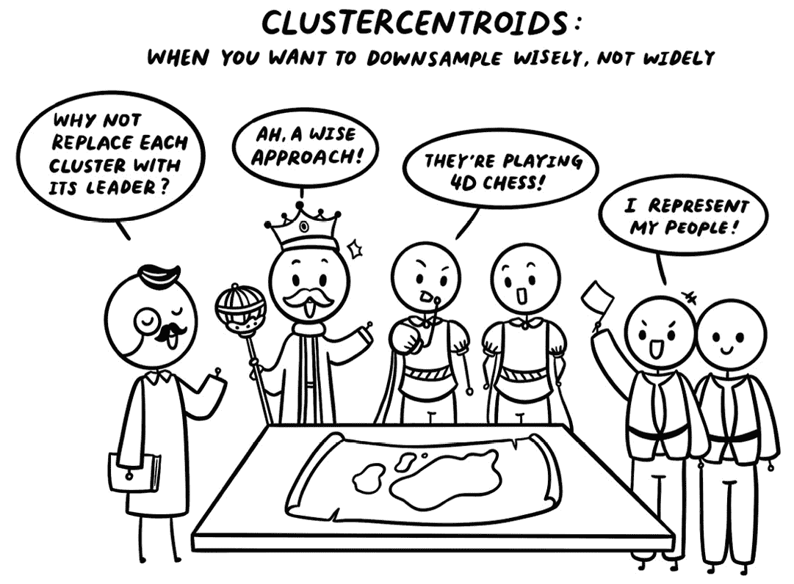

图 3.7 – 描述 ClusterCentroids 方法主要思想的漫画

在 ClusterCentroids 技术中，我们首先将 K-means 算法应用于所有多数类数据。然后，对于每个簇，我们保留质心并移除该簇内的所有其他示例。值得注意的是，质心甚至可能不是原始数据的一部分，这是该方法的一个重要方面。

在*图 3.8*中，我们展示了 ClusterCentroids 的工作原理。在*图 3.8(a)*中，我们从一个不平衡的数据集开始。在*图 3.8(b)*中，我们计算了三个聚类的质心。这些质心在图中以星号表示。最后，我们在*图 3.8(c)*中从数据集中移除了所有大多数类别的样本，除了质心。

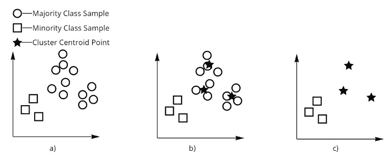

图 3.8 – 展示 ClusterCentroids 方法的工作原理

这里是使用 ClusterCentroids 的代码：

```py
from imblearn.under_sampling import ClusterCentroids
cc = ClusterCentroids(random_state=42)
X_res, y_res = cc.fit_resample(X,y)
print('Resampled dataset shape %s' % Counter(y_res))
```

以下是输出：

```py
Resampled dataset shape Counter({0: 100, 1: 100})
```

*图 3.9*展示了 ClusterCentroids 技术的应用，其中右侧的图表显示大多数负类样本被剔除。

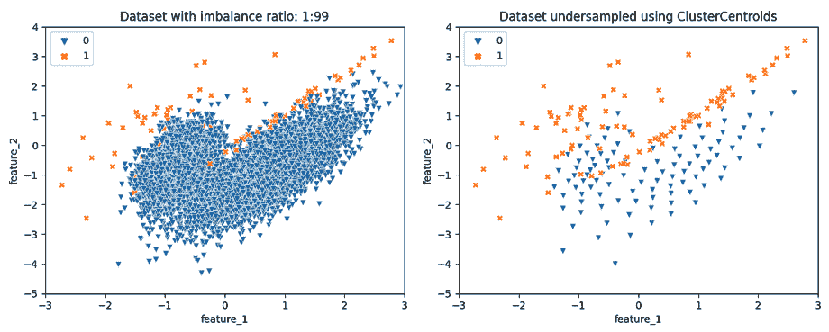

图 3.9 – 使用 ClusterCentroids 在降采样前后绘制数据集

需要注意的一点是，ClusterCentroids 可能计算成本较高，因为它默认使用 K-means 算法，这可能会很慢。我们建议探索 ClusterCentroids 方法中的各种参数，例如 estimator，它指定了要使用的聚类方法。例如，K-means 可以被 MiniBatchKMeans 替换，这是 K-means 聚类算法的一个更快变体。

在下一节中，我们将尝试以更战略性的方式消除大多数类别的示例。

# 移除噪声观测值的策略

国王可能会在剔除任何人之前查看公民的友谊和位置。国王可能会决定剔除那些富有且住在蒙太古家族附近的凯普莱特家族。这可以通过分离争斗的家族来为城市带来和平。让我们看看一些使用我们的数据来实现这一点的策略。

## ENN、RENN 和 AllKNN

国王可以根据邻居来剔除凯普莱特家族。例如，如果一个或多个凯普莱特家族最近三个邻居中的一个是蒙太古家族，国王就可以剔除凯普莱特家族。这种技术称为`imbalanced-learn`库为我们提供了选择我们想要重采样的类别以及样本邻居应该具有的类别排列方式。

我们可以遵循两种不同的标准来排除样本：

+   我们可以选择排除一个或多个邻居不属于自身相同类别的样本

+   我们可以决定排除大多数邻居不属于自身相同类别的样本

在*图 3.10*中，我们展示了 ENN 算法的工作原理。在这里，我们移除了具有一个或多个少数邻居的大多数样本。在*图 3.10(a)*中，我们展示了原始数据集。在*图 3.10(b)*中，我们突出显示了具有一个或多个少数类最近邻的大多数类样本。突出显示的大多数类样本以实心框表示，它们的邻居通过围绕它们创建曲线来表示。

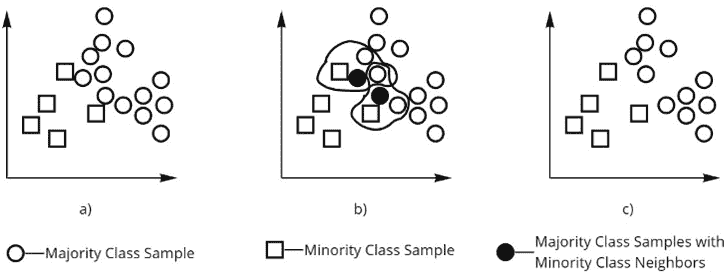

图 3.10 – 展示 ENN 方法的工作原理

这里是使用 ENN 的代码：

```py
from imblearn.under_sampling import EditedNearestNeighbours
enn = EditedNearestNeighbours(
    sampling_strategy='auto', n_neighbors=200, kind_sel='all')
X_res, y_res = enn.fit_resample(X, y)
print('Resampled dataset shape %s' % Counter(y_res))
```

以下是输出：

```py
Resampled dataset shape Counter({0: 7852, 1: 100})
```

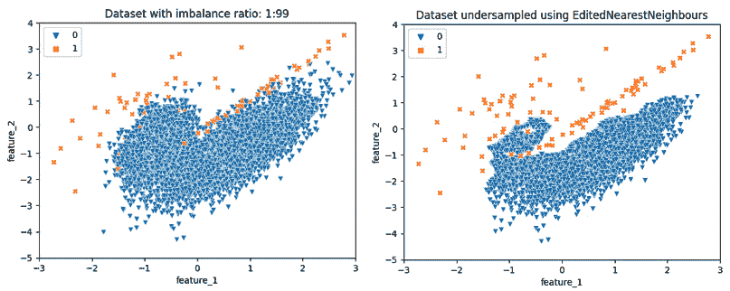

图 3.11 – 使用 ENN 进行下采样前后的数据集绘图

在这里，`n_neighbors`是要考虑的邻域大小，用于计算最近邻。

有两种 ENN 变体我们不会深入探讨，但如果你感兴趣，可以探索它们：`imblearn.under_sampling.RepeatedEditedNearestNeighbours`)和`imblearn.under_sampling.AllKNN`)。在 RENN [6]中，我们重复在 ENN 中遵循的过程，直到没有更多可以删除的示例或达到最大循环计数。此算法也移除噪声数据。由于算法重复多次，它在移除边界示例方面更强（*图 3**.12*）。

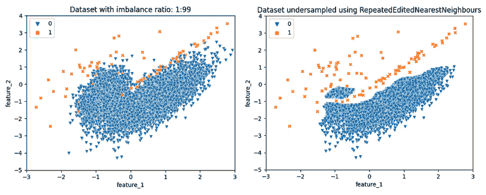

图 3.12 – 使用 RENN 进行下采样前后的数据集绘图

在**AllKNN**方法[6]中，我们重复**ENN**，但邻居的数量从 1 增加到 K。

## Tomek 链接

1976 年，伊万·托梅克提出了**Tomek 链接**的概念[7]。如果两个例子属于两个不同的类别，并且没有第三个点与它们的距离比两个点之间的距离短，则称这两个例子形成 Tomek 链接。Tomek 链接背后的直觉是“*如果两个点来自不同的类别，它们不应该彼此最近。*”这些点是噪声的一部分，我们可以消除多数成员或两个点以减少噪声。这就像国王决定移除那些最好的朋友是蒙太古家族的凯普莱特家族成员。

我们可以这样使用`TomekLinks` API：

```py
from imblearn.under_sampling import TomekLinks
tklinks = TomekLinks(sampling_strategy='auto')
X_res, y_res = tklinks.fit_resample(X, y)
print('Resampled dataset shape %s' % Counter(y_res))
```

下面的输出是：

```py
Resampled dataset shape Counter({0: 9875, 1: 100})
```

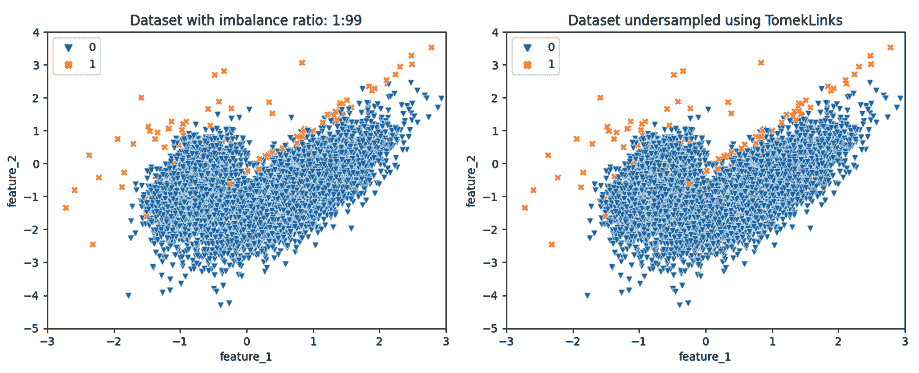

图 3.13 – 使用 TomekLinks 进行下采样前后的数据集绘图

*图 3**.14*展示了 Tomek 链接算法的工作原理。在*图 3**.14(a)*中，我们有原始数据集。在*图 3**.14(b)*中，我们找到并突出显示 Tomek 链接。注意这些链接中的点彼此很近。在*图 3**.14(c)*中，我们展示了移除属于 Tomek 链接的多数类样本（以圆圈表示）后的数据集。注意在部分*(b)*中出现的两个圆圈但在部分*(c)*中缺失。同样，我们在图例的部分*(d)*中展示了移除 Tomek 链接中所有点后的数据集。

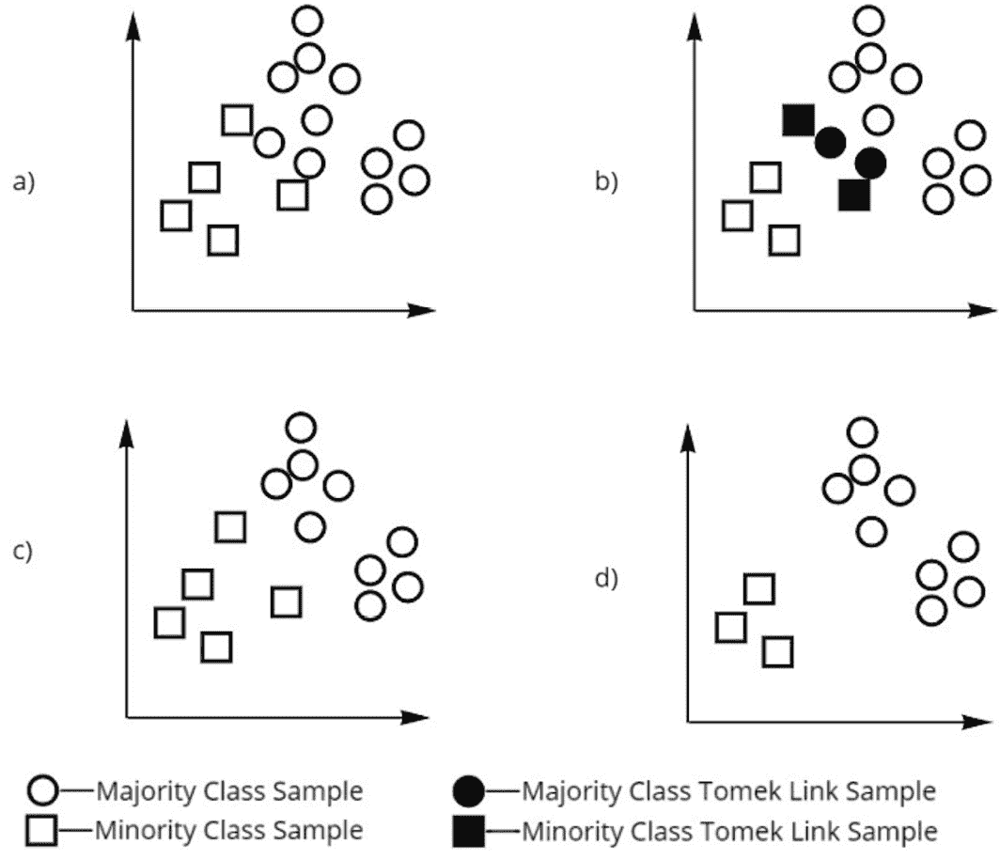

图 3.14 – 展示 TomekLinks 算法的工作原理

由于其要求计算所有示例之间的成对距离，Tomek 链接是一种资源密集型方法。正如在*《几种平衡机器学习训练数据行为的研究》*[8]中所述，在处理大量数据时，在减少的数据集上执行此过程将更具有计算效率。

在下一个方法中，我们将尝试从少数类示例的角度尝试移除多数类示例。我们能否移除属于多数类的少数类示例的最近邻？

## 社区清洁规则

除了移除那些一个或多个最近邻是蒙太古家族的凯普莱特家族成员之外，国王还可能决定查看蒙太古家族成员的最近邻，并移除那些可能成为蒙太古家族成员最近邻的凯普莱特家族成员。在**邻域清洗规则**（**NCR**）[9]中，我们应用一个 ENN 算法，在剩余数据上训练一个 KNN，然后移除所有作为少数样本最近邻的大多数类样本。

下面是使用`NeighourhoodCleaningRule`的代码：

```py
from imblearn.under_sampling import NeighbourhoodCleaningRule
ncr = NeighbourhoodCleaningRule(
    sampling_strategy='auto', n_neighbors=200, threshold_cleaning=0.5)
X_res, y_res = ncr.fit_resample(X, y)
print('Resampled dataset shape %s' % Counter(y_res))
```

下面是输出结果：

```py
Resampled dataset shape Counter({0: 6710, 1: 100})
```

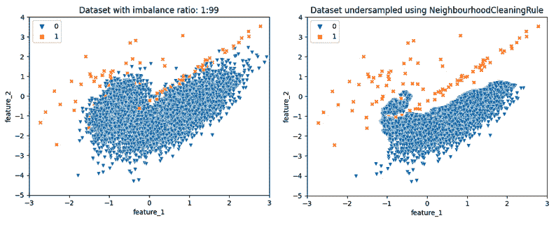

图 3.15 – 使用 NCR 在欠采样前后绘制数据集

## 实例硬度阈值

国王可能会问一位大臣，“*哪些凯普莱特家族成员与蒙太古家族相处得很好？*”大臣根据他们对城镇的了解，会给出一个那些凯普莱特家族成员的名单。然后，国王会移除名单上的凯普莱特家族成员。这种使用另一个模型来识别噪声样本的方法被称为**实例硬度阈值**。在此方法中，我们在数据上训练一个分类模型，例如决策树、随机森林或线性 SVM。

除了预测实例的类别之外，这些分类器还可以返回它们的类别概率。类别概率显示了模型在分类实例时的置信度。使用实例硬度阈值方法[10]，我们移除了那些获得低概率估计的大多数类样本（称为“难以分类的实例”）。这些实例由于类别重叠而被认为是“难以分类的”，而类别重叠是实例硬度的主要原因。

`imbalanced-learn`库提供了一个用于利用`InstanceHardnessThreshold`的 API，其中我们可以指定用于估计示例硬度的估计器。在这种情况下，我们使用`LogisticRegression`作为估计器：

```py
from imblearn.under_sampling import InstanceHardnessThreshold
nm = InstanceHardnessThreshold(
    sampling_strategy='auto', estimator=LogisticRegression())
X_res, y_res = nm.fit_resample(X, y)
print('Resampled dataset shape %s' % Counter(y_res))
```

下面是输出结果：

```py
Resampled dataset shape Counter({0: 100, 1: 100})
```

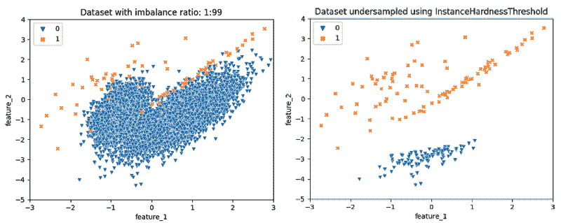

图 3.16 – 使用 InstanceHardnessThreshold 在欠采样前后绘制数据集

由于分类模型需要在多数类和少数类之间绘制决策边界，因此那些离少数类样本太远的大多数类样本可能无法帮助模型决定这个决策边界。考虑到这一点，我们将在下一节中探讨移除此类简单多数类样本的方法。

# 移除简单观察的策略

移除富有的、著名的凯普莱特家族成员的策略的相反做法是移除贫穷的、弱小的凯普莱特家族成员。本节将讨论**移除远离少数样本的多数样本**的技术。我们不是从两个类别的边界移除样本，而是使用它们来训练模型。这样，我们可以训练一个模型以更好地区分类别。然而，一个缺点是这些算法可能会保留噪声数据点，这些数据点随后可能被用来训练模型，从而可能将噪声引入预测系统。

## 压缩最近邻

**压缩最近邻**（**CNNeighbors**）[11] 是一个按照以下方式工作的算法：

1.  我们将所有少数样本添加到一个集合中，并添加一个随机选择的多数样本。让我们称这个集合为 `C`。

1.  我们在集合 `C` 上使用 *k = 1* 训练 KNN 模型。

1.  现在，我们为每个剩余的多数样本重复以下四个步骤：

    1.  我们考虑一个多数样本；让我们称它为 `e`。

    1.  我们尝试使用 KNN 预测 `e` 的类别。

    1.  如果预测的类别与原始类别匹配，我们则移除该样本。直觉上，从 `e` 中学习的东西很少，因为即使是 *1-NN* 分类器也能学会它。

    1.  否则，我们将样本添加到我们的集合 `C` 中，并在 `C` 上再次训练 *1-NN*。

此方法从多数类中移除了易于分类的样本。

使用 `CondensedNearestNeighbour` 的代码如下：

```py
from imblearn.under_sampling import CondensedNearestNeighbour
cnn = CondensedNearestNeighbour(random_state=42)
X_res, y_res = cnn.fit_resample(X, y)
print('Resampled dataset shape %s' % Counter(y_res))
```

下面是输出：

```py
Resampled dataset shape Counter({0: 198, 1: 100})
```

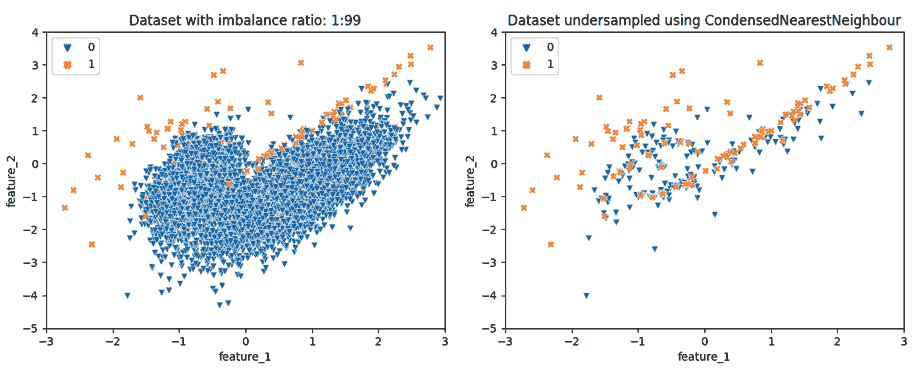

图 3.17 – 使用 CNNeighbors 在欠采样前后绘制数据集

然而，CNNeighbors 方法可能计算成本较高，因为它使用 KNN 算法评估每个多数类示例。这使得 CNNeighbors 方法不适合大数据应用。

## 单侧选择

国王可能会决定移除一些富有的许多贫穷的凯普莱特。这样，只有中产阶级的凯普莱特会留在城镇里。在单侧选择 [12] 中，我们就是这样做的。这种方法是 CNNeighbors 和 Tomek 链接的组合。我们首先使用 CNNeighbors 进行重采样。然后，我们从重采样数据中移除 Tomek 链接。这减少了噪声和易于识别的样本。

下面是 `OneSidedSelection` 的代码。当我们不提供 `n_neighbors` 参数时，默认值 `1` 被采用：

```py
from imblearn.under_sampling import OneSidedSelection
oss = OneSidedSelection(random_state=0, n_seeds_S=10)
X_res, y_res = oss.fit_resample(X, y)
print('Resampled dataset shape %s' % Counter(y_res))
```

下面是输出：

```py
Resampled dataset shape Counter({0: 4276, 1: 100})
```

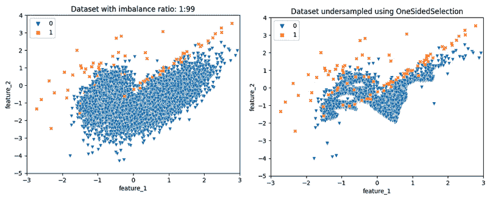

图 3.18 – 使用 OneSidedSelection 在欠采样前后绘制数据集

在这里，`n_seeds_S` 是在方法中使用作为种子的少数类样本数量，它可以显著影响方法的表现。建议调整此参数。

## 结合欠采样和过采样

你可能会想知道我们是否可以将欠采样技术与过采样技术结合起来以产生更好的结果。答案是肯定的。过采样方法增加了少数类样本的数量，但通常也会增加数据中的噪声。一些欠采样技术可以帮助我们去除噪声，例如，ENN、Tomek 链接、NCR 和实例硬度。我们可以将这些方法与 SMOTE 结合起来以产生良好的结果。SMOTE 与 ENN [13] 和 Tomek 链接 [14] 的组合已经得到了充分的研究。此外，`imbalanced-learn` 库支持这两个方法：`SMOTEENN` 和 `SMOTETomek`。

## 模型性能比较

让我们探讨一些流行的模型在使用我们讨论的各种采样不足技术时的表现。我们为此比较使用了两个数据集：一个是合成数据集，另一个是从`imbalanced-learn`库中获取的名为`thyroid_sick`的现实世界数据集。我们将使用逻辑回归和随机森林模型评估 11 种不同的采样不足技术相对于无采样基线的性能。*图 3.19*到*3.22*显示了使用这些各种方法训练的模型的平均精度值。

你可以在本章的 GitHub 仓库中找到该笔记本。

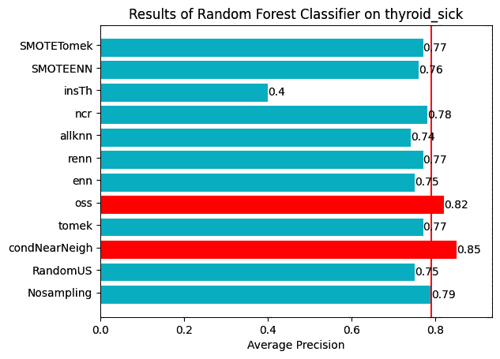

图 3.19 – 使用随机森林在 thyroid_sick 数据集上使用各种方法时的平均精度

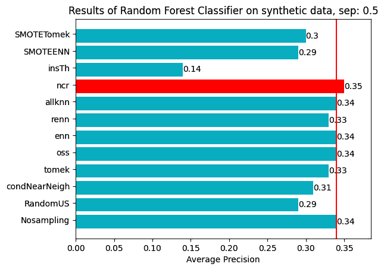

图 3.20 – 使用随机森林在合成数据上使用各种方法时的平均精度

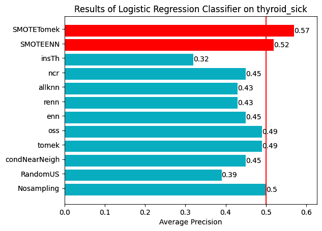

图 3.21 – 使用逻辑回归在 thyroid_sick 数据集上使用各种方法时的平均精度

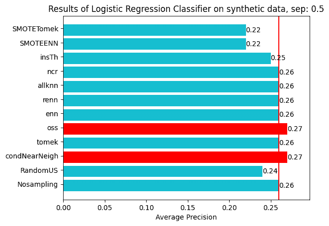

图 3.22 – 使用逻辑回归在合成数据上使用各种方法时的平均精度

这里有一些更多的观察：

+   采样不足技术的有效性可能会因数据集及其特征而显著不同

+   没有任何一种技术在所有数据集上都占主导地位，这强调了进行实证测试以选择最适合你特定问题的最佳方法的需求。

那么，哪种方法最适合你的数据？这个问题没有简单的答案。关键在于对这些方法的内部工作原理有一个直觉，并拥有一个可以帮助你测试不同技术的流程。

然而，某些技术可能会很耗时。在我们的测试中，在一个包含一百万个示例的数据集上，`CondensedNearestNeighbor`、`ClusterCentroids`和`ALLKNN`等方法比其他方法花费的时间更长。如果你处理大量数据，计划将来进行扩展，或者时间紧迫，你可能想要避免这些方法或调整它们的参数。`RandomUnderSampler`和`InstanceHardnessThreshold`等技术更适合快速迭代开发。

这就带我们结束了这一章。

# 摘要

在本章中，我们讨论了采样不足，这是一种通过减少多数类样本数量来解决数据集类别不平衡的方法。我们回顾了采样不足的优点，例如控制数据大小和减少过拟合的机会。采样不足方法可以分为固定方法，即将多数类样本数量减少到固定大小，和清洗方法，即根据预定的标准减少多数类样本。

我们讨论了各种欠采样技术，包括随机欠采样、基于实例硬度的欠采样、ClusterCentroids、ENN、Tomek links、NCR、实例硬度、CNNeighbors、单侧选择，以及欠采样和过采样技术的组合，如`SMOTEENN`和`SMOTETomek`。

我们通过在几个数据集上对逻辑回归和随机森林模型进行各种欠采样技术的性能比较，以及基准测试它们的性能和有效性，得出了结论。

一旦你确定你的数据集是不平衡的，并且可能从应用欠采样技术中受益，就可以尝试本章中讨论的各种方法。使用适当的指标，如 PR-AUC，来评估它们的有效性，以找到最适合提高模型性能的方法。

在下一章中，我们将讨论各种基于集成的方法。

# 练习

1.  探索`imbalanced-learn`库提供的各种欠采样 API，请参阅[`imbalanced-learn.org/stable/references/under_sampling.html`](https://imbalanced-learn.org/stable/references/under_sampling.html)。

1.  探索通过`imblearn.under_sampling.NearMiss` API 提供的`NearMiss`欠采样技术。它属于哪一类方法？将`NearMiss`方法应用于本章中使用的那个数据集。

1.  在 UCI 的`us_crime`数据集上尝试本章中讨论的所有欠采样方法。你可以在`imbalanced-learn`库的`fetch_datasets` API 中找到这个数据集。为`LogisticRegression`和`XGBoost`模型找到具有最高`f1-score`指标的欠采样方法。

1.  你能识别出你自己的欠采样方法吗？（提示：考虑以新的方式结合各种欠采样方法。）

# 参考文献

1.  X. He 等人，"从 Facebook 广告点击预测中获得的实际经验"，载于第八届国际在线广告数据挖掘研讨会论文集，纽约纽约，美国：ACM，2014 年 8 月，第 1–9 页。doi: 10.1145/2648584.2648589。

1.  X. Ling, W. Deng, C. Gu, H. Zhou, C. Li, 和 F. Sun，"在 Bing 搜索广告中的点击预测模型集成"，载于第 26 届国际万维网大会（WWW '17）配套会议论文集，澳大利亚珀斯：ACM 出版社，2017 年，第 689–698 页。doi: 10.1145/3041021.3054192。

1.  *如何使用机器学习和线性规划优化 Uber 推送通知的时间*：[`www.uber.com/blog/how-uber-optimizes-push-notifications-using-ml/`](https://www.uber.com/blog/how-uber-optimizes-push-notifications-using-ml/).

1.  A. D. Pozzolo, O. Caelen, R. A. Johnson, 和 G. Bontempi，"使用欠采样对不平衡分类进行概率校准"，载于 2015 年 IEEE 计算智能系列研讨会，南非开普敦：IEEE，2015 年 12 月，第 159–166 页。doi: 10.1109/SSCI.2015.33。

1.  (介绍 ENN 方法) D. L. Wilson, “*使用编辑数据的最近邻规则渐近性质*，” IEEE Trans. Syst., Man, Cybern., vol. SMC-2, no. 3, pp. 408–421, Jul. 1972, doi: 10.1109/TSMC.1972.4309137.

1.  (介绍 RENN 和 AllKNN 方法) “*编辑最近邻规则的实验*，” IEEE Trans. Syst., Man, Cybern., vol. SMC-6, no. 6, pp. 448–452, Jun. 1976, doi: 10.1109/TSMC.1976.4309523.

1.  I. Tomek, “*CNN 的两种改进*，” IEEE Trans. Syst., Man, Cybern., vol. SMC-6, no. 11, pp. 769–772, Nov. 1976, doi: 10.1109/TSMC.1976.4309452.

1.  G. E. A. P. A. Batista, R. C. Prati, 和 M. C. Monard, “*研究平衡机器学习训练数据几种方法的性能*，” SIGKDD Explor. Newsl., vol. 6, no. 1, pp. 20–29, Jun. 2004, doi: 10.1145/1007730.1007735.

1.  (介绍邻域清洗规则方法) J. Laurikkala, “*通过平衡类分布改进困难小类的识别*，” 在 Artificial Intelligence in Medicine, S. Quaglini, P. Barahona, 和 S. Andreassen, Eds.，in Lecture Notes in Computer Science, vol. 2101\. Berlin, Heidelberg: Springer Berlin Heidelberg, 2001, pp. 63–66\. doi: 10.1007/3-540-48229-6_9.

1.  (介绍实例硬度阈值技术) M. R. Smith, T. Martinez, 和 C. Giraud-Carrier, “*数据复杂性的实例级分析*，” Mach Learn, vol. 95, no. 2, pp. 225–256, May 2014, doi: 10.1007/s10994-013-5422-z.

1.  P. Hart, “*压缩最近邻规则 (corresp.)*，” IEEE transactions on information theory, vol. 14, no. 3, pp. 515–516, 1968, https://citeseerx.ist.psu.edu/document?
repid=rep1&type=pdf&doi=7c3771fd6829630cf450af853 df728ecd8da4ab2.

1.  (介绍单侧选择方法) M. Kubat 和 S. Matwin, “*解决不平衡训练集的诅咒：单侧选择*”。

1.  (应用 SMOTEENN 和 SMOTETomek 方法) Gustavo EAPA Batista, Ronaldo C Prati, 和 Maria Carolina Monard. *研究平衡机器学习训练数据几种方法的性能*。ACM SIGKDD explorations newsletter, 6(1):20–29, 2004.

1.  (应用 SMOTETomek 方法) Gustavo EAPA Batista, Ana LC Bazzan, 和 Maria Carolina Monard. *平衡训练数据以实现关键词自动标注：一个案例研究*。在 WOB, 10–18\. 2003.
