# 第四章：集成方法

想象一下一家大型公司的顶级高管。他们不会独自做出决策。在一天中，他们需要做出许多关键决策。他们是如何做出这些选择的？不是独自一人，而是通过咨询他们的顾问。

假设一位高管咨询了来自不同部门的五位不同顾问，每位顾问根据他们的专业知识、技能和领域知识提出略微不同的解决方案。为了做出最有效的决策，高管结合了五位顾问的见解和意见，创建了一个混合解决方案，其中包含了每个提案的最佳部分。这个场景说明了**集成方法**的概念，其中多个弱分类器被组合起来创建一个更强、更准确的分类器。通过结合不同的方法，集成方法通常可以实现比依赖单个分类器更好的性能。

我们可以通过结合多个弱分类器的结果来创建一个强大的模型。这些弱分类器，如简化的决策树、神经网络或支持向量机，其表现略好于随机猜测。相比之下，通过集成这些弱分类器创建的强大模型，其表现显著优于随机猜测。弱分类器可以接受不同来源的信息。构建模型集成的两种通用方法：bagging 和 boosting。

传统集成方法的问题在于它们使用假设数据平衡的分类器。因此，它们可能不适合处理不平衡的数据集。因此，我们将流行的机器学习集成方法与我们之前章节中研究的不平衡数据处理技术相结合。我们将在本章讨论这些组合。

本章将涵盖以下主题：

+   处理不平衡数据的 Bagging 技术

+   处理不平衡数据的 Boosting 技术

+   集成集成

+   模型性能比较

在*图 4*.1 中，我们将本章将要涵盖的各种集成技术进行了分类：

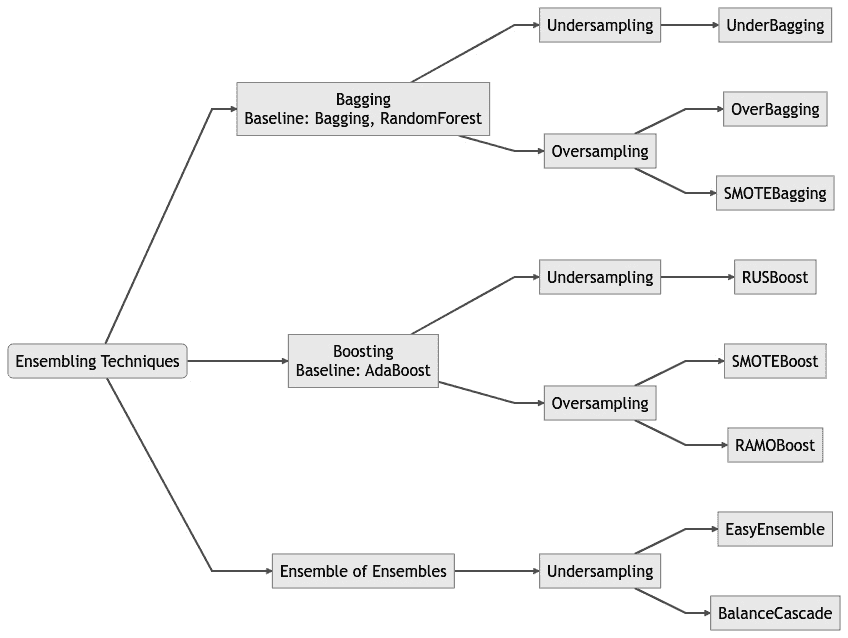

图 4.1 – 集成技术概述

到本章结束时，你将了解如何将诸如 bagging 和 boosting 之类的集成模型应用于数据集中类不平衡的问题。

# 技术要求

本章的 Python 笔记本可在 GitHub 上找到，网址为[`github.com/PacktPublishing/Machine-Learning-for-Imbalanced-Data/tree/master/chapter04`](https://github.com/PacktPublishing/Machine-Learning-for-Imbalanced-Data/tree/master/chapter04)。像往常一样，你可以通过点击本章笔记本顶部的**在 Colab 中打开**图标或通过使用笔记本的 GitHub URL 在[`colab.research.google.com`](https://colab.research.google.com)启动它来打开 GitHub 笔记本。

在本章中，我们将继续使用使用`make_classification` API 生成的合成数据集，就像我们在前几章中所做的那样。在本章的末尾，我们将对我们在本章中学到的方法在几个真实数据集上进行测试。我们的完整数据集包含 90,000 个示例，不平衡比率为 1:99。以下是训练数据集的外观：

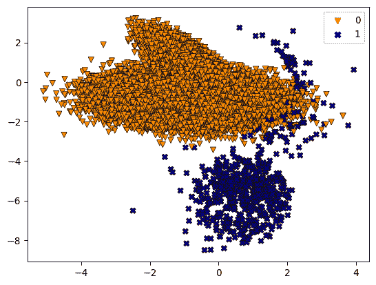

图 4.2 – 不平衡比率为 1:99 的数据集的绘图

我们的失衡数据集已经准备好使用，让我们看看第一种集成方法，称为 Bagging。

# 处理不平衡数据的 Bagging 技术

想象一个商业高管，他拥有数千份关于重要并购的机密文件。分配给这个案例的分析师没有足够的时间来审查所有文件。每个人都可以从集合中随机选择一些文件并开始审查。稍后，他们可以在会议上结合他们的见解来得出结论。

这种场景是机器学习中一个称为 Bagging 的过程的隐喻[1]，它是**自助聚合**的缩写。在 Bagging 中，就像前一个场景中的分析师一样，我们创建原始数据集的几个子集，在每个子集上训练一个弱学习器，然后聚合它们的预测。

为什么使用弱学习器而不是强学习器？这个理由适用于 Bagging 和 Boosting 方法（本章后面将讨论）。有几个原因：

+   **速度**：弱学习器在计算上效率高且成本低。

+   **多样性**：弱学习器更有可能犯不同类型的错误，这在结合它们的预测时是有利的。使用强学习器可能导致它们都犯同一种类型的错误，从而导致集成效果较差。

+   **过拟合**：作为前一点的推论，错误的多样性有助于降低集成中过拟合的风险。

+   **可解释性**：虽然整个集成可能不容易解释，但其个别组件——通常是更简单的模型——更容易理解和解释。

现在，回到 Bagging。算法的第一步称为**自助抽样**。在这个步骤中，我们通过从主数据中随机选择项目来制作几个子集或较小的数据组。数据的选择有可能会选择同一个项目多次（这个过程称为“有放回的随机抽样”），所以这些较小的组可能有一些共同的项目。然后，我们在这些较小的组上训练我们的分类器。

第二步称为**聚合**。在预测时，将测试样本传递给每个分类器。之后，我们取平均或多数预测作为真实答案。

如**图 4**.3 所示，数据集首先通过有放回抽样分成三个子集。然后，在每个子集上分别训练单独的分类器。最后，在预测时将分类器的结果合并：

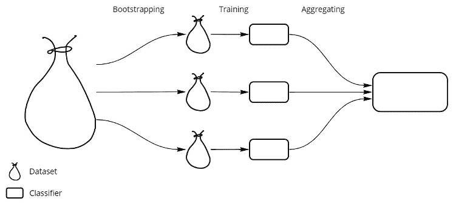

图 4.3 – 展示 bagging 的工作原理

*图 4**.4* 以伪代码格式总结了 bagging 算法：

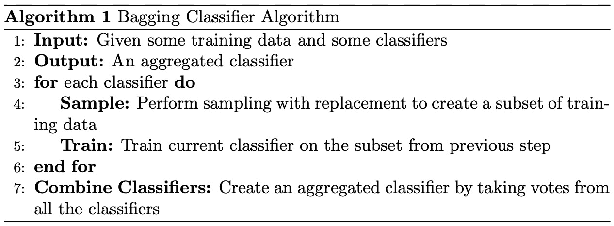

图 4.4 – Bagging 的伪代码

我们将在之前创建的数据集上训练一个来自 `sklearn` 的 bagging 分类器模型。由于可以向 `BaggingClassifier` 提供一个基估计器，我们将使用最大树深为 `6` 的 `DecisionTreeClassifier`：

```py
from sklearn.ensemble import BaggingClassifier
from sklearn.metrics import PrecisionRecallDisplay
clf = BaggingClassifier(\
    estimator=DecisionTreeClassifier(max_depth=6), random_state=0
).fit(X_train, y_train)
```

让我们绘制决策边界：

```py
plot_decision_boundary(X_train, y_train, clf, 'BaggingClassifier')
plt.show()
```

您可以参考 GitHub 上相应笔记本中 `plot_decision_boundary()` 的定义。我们使用 `sklearn.inspection` 模块中的 `DecisionBoundaryDisplay` API 来绘制决策边界。

*图 4**.5* 展示了在训练数据上的学习决策边界：

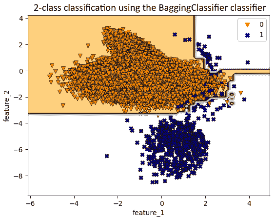

图 4.5 – BaggingClassifier 在训练数据上的决策边界

让我们也注意使用此模型在测试集上的基线指标平均精度：

```py
PrecisionRecallDisplay.from_estimator(
    clf, X_test, y_test, ax = plt.gca(),name = "BaggingClassifier")
```

*图 4**.6* 展示了得到的 PR 曲线：

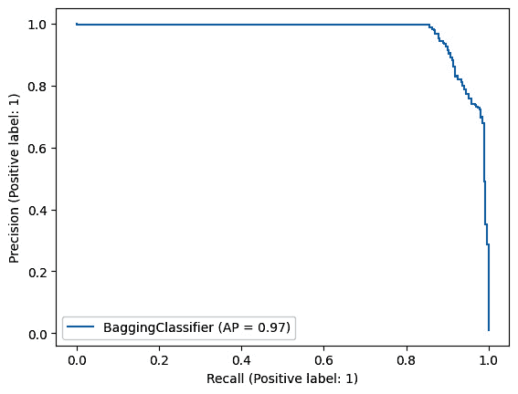

图 4.6 – BaggingClassifier 在测试数据上的精确度-召回率曲线

这里有一些其他指标：

```py
Average Precision Score: 0.969
AUC-ROC Score: 0.999
F2-score: 0.891
Precision: 0.967
Recall: 0.874
```

在本章中，我们还将考虑 **F2 分数**（Fbeta 分数，beta=2.0），它按比例结合精确度和召回率，给予召回率更高的权重，而给予精确度较低的权重。

因此，当在不平衡数据集上使用 `BaggingClassifier` 时，我们可能会遇到什么问题？一个明显的事情可能是，在引导过程中，一些用于训练基分类器的子集可能只有很少的少数类示例，甚至没有。这意味着每个基分类器在少数类上的表现都会很差，而它们的组合表现仍然会很差。

我们可以将下采样技术与 bagging（例如 UnderBagging）或过采样技术与 bagging（例如 OverBagging）结合起来，以获得更好的结果。我们将在下一节讨论这些技术。

## UnderBagging

UnderBagging [2] 技术在引导（或子集选择）时使用随机下采样。我们为每个分类器选择少数类示例的整个集合，并用与少数类示例数量相同的多数类示例进行带替换的引导。聚合步骤与 bagging 相同。我们可以选择任何分类器，例如决策树，进行训练。

UnderBagging 有变体，其中可以对少数类进行带替换的重采样，以获得更多样化的集成。

*图 4**.7* 中的流程图代表了 UnderBagging 算法在三个数据子集中的主要步骤。它包括创建多个数据子集，对每个子集中的多数类进行随机下采样，在每个子集上训练分类器，最后结合分类器的预测：

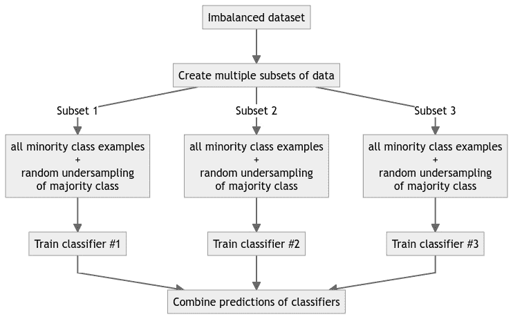

图 4.7 – 展示 UnderBagging 算法的工作原理

`imbalanced-learn` 库为 `BalancedBaggingClassifier` 提供了实现。默认情况下，此分类器使用决策树作为基分类器，并通过 `sampler` 参数使用 `RandomUnderSampler` 作为采样器。*图 4.8* 展示了训练好的 UnderBagging 模型的决策边界：

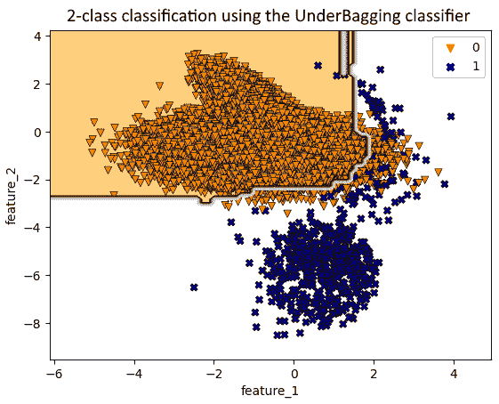

图 4.8 – 在训练数据上 UnderBagging 分类器的决策边界

🚀 微软生产环境中的 Bagging 分类器

在微软的一个实际应用中 [3]，团队在预测 Live Site Incident 升级（如*第二章*，*过采样方法*）时面临重大挑战。数据集高度不平衡，使得标准分类器难以表现良好。为了解决这个问题，微软采用了集成方法，特别是来自 `imbalanced-learn` 库的 `BalancedBaggingClassifier`。他们使用了 UnderBagging，其中每个引导样本都是随机欠采样的，以获得平衡的类别分布。正如我们刚才讨论的，UnderBagging 使用所有少数类样本和多数类样本的随机选择来训练模型。

在他们的评估中，Bagged 分类提供了最佳结果，并且在经过几个月的跟踪后也证明更加一致。他们能够显著提高对事件升级的预测准确性。

## OverBagging

在引导过程中，不是对多数类样本进行随机欠采样，而是对少数类进行过采样（带替换）。这种方法称为 OverBagging [2]。作为一种变体，多数类和少数类的样本都可以进行带替换的重采样，以达到多数类和少数类样本数量相等。

*图 4.9* 中的流程图展示了 OverBagging 算法在三个数据子集上的主要步骤。它包括创建多个数据子集，对每个子集中的少数类进行随机过采样，在每个子集上训练分类器，并最终结合分类器的预测：

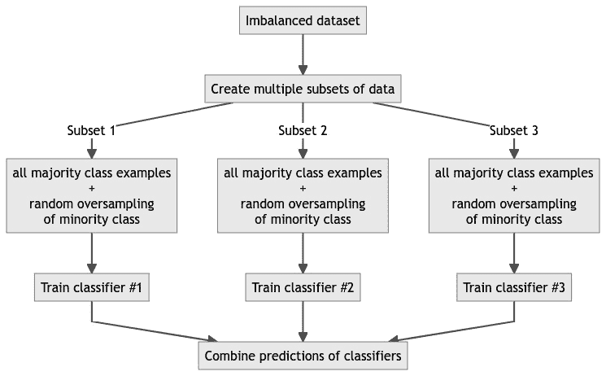

图 4.9 – 展示 OverBagging 算法的工作原理

对于 OverBagging，我们可以在 `sampler` 参数中使用与 `BalancedBaggingClassifier` 相同的 `RandomOverSampler`。

我们将看到以下决策边界：

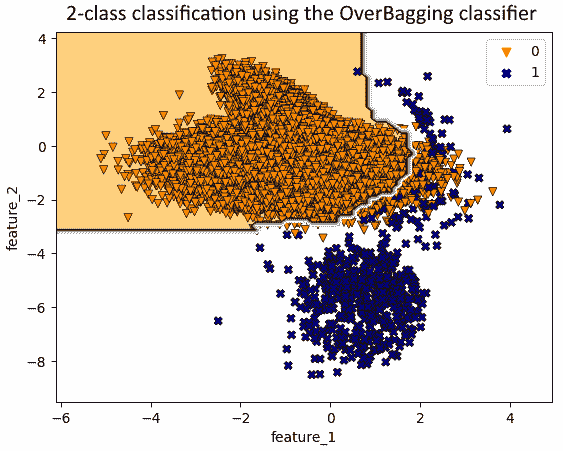

图 4.10 – 在训练数据上 OverBagging 分类器的决策边界

在讨论了各种 Bagging 技术之后，我们将比较这些技术的性能指标。

## SMOTEBagging

我们能否在引导过程中使用 SMOTE 代替对少数类样本的随机过采样？答案是肯定的。多数类将进行带替换的引导，而少数类将使用 SMOTE 进行采样，直到达到平衡比率。

SMOTEBagging [2] 的伪代码与 OverBagging 非常相似，关键区别在于使用 SMOTE 算法而不是随机过采样来增强少数类数据。

与过袋装类似，我们可以使用带有 SMOTE 作为 `sampler` 参数的 `BalancedBagging Classifier` API 实现 `SMOTEBagging`。

决策边界与过袋装没有很大区别：

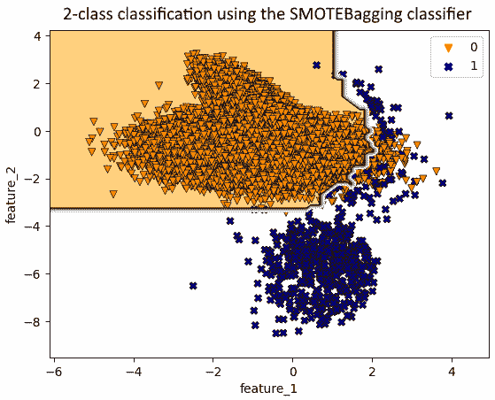

图 4.11 – SMOTEBagging 分类器在训练数据上的决策边界

关于随机森林及其与袋装的关系的说明

随机森林 [4] 是另一个基于袋装概念的模型。`sklearn` 中的 `RandomForestClassifier` 和 `BaggingClassifier` 模型之间的区别在于，`RandomForestClassifier` 在尝试决定决策树中节点分裂的特征时，考虑了特征的一个随机子集，而 `BaggingClassifier` 则采用所有特征。

*表 4.1* 突出了随机森林和袋装分类器之间的差异：

|  | **RandomForestClassifier** | **BaggingClassifier** |
| --- | --- | --- |
| 基本分类器 | 决策树 | 任何分类器。 |
| 自举采样 | 是 | 是。 |
| 选取特征子集 | 是（在每个节点） | 否，默认情况下。我们可以使用 `max_features` 超参数来选取特征子集。 |
| 最适合的数据类型 | 任何表格数据，但在大型特征集上表现最佳 | 任何表格数据，但最好在仔细选择基本分类器时使用。 |
| 处理缺失值和异常值 | 是，固有 | 取决于基本分类器。 |

表 4.1 – RandomForestClassifier 与 BaggingClassifier 对比

`imbalanced-learn` 库提供了 `BalancedRandomForestClassifier` 类来处理不平衡数据集，其中在训练单个决策树之前，每个自举样本都是欠采样的。作为练习，我们鼓励你了解 `BalancedRandomForestClassifier`。看看它如何与我们刚才讨论的其他技术相关。还可以尝试各种采样策略，并探索此类提供的参数。

## 袋装方法的比较性能

让我们使用迄今为止使用的相同数据集比较各种袋装方法的性能。我们将使用决策树作为基线，并在多个性能指标上评估不同的技术。所有技术中每个指标的最高值都以粗体突出显示：

| **技术** | **F2** | **精确度** | **召回率** | **平均精确度** | **AUC-ROC** |
| --- | --- | --- | --- | --- | --- |
| SMOTEBagging | **0.928** | 0.754 | 0.985 | 0.977 | **1.000** |
| 过袋装 | 0.888 | 0.612 | **1.000** | 0.976 | **1.000** |
| 下袋装 | 0.875 | 0.609 | 0.981 | 0.885 | 0.999 |
| 袋装 | 0.891 | 0.967 | 0.874 | 0.969 | **1.000** |
| 平衡随机森林 | 0.756 | 0.387 | 0.993 | 0.909 | 0.999 |
| 随机森林 | 0.889 | **0.975** | 0.870 | **0.979** | **1.000** |
| 决策树 | 0.893 | 0.960 | 0.878 | 0.930 | 0.981 |

表 4.2 – 各种袋装技术的性能比较

以下是我们可以从*表 4.2*中得出的结论：

+   为了最大化 F2 分数，**SMOTEBagging**表现最佳

+   对于高精确度，**袋装法**和**随机森林**表现异常出色

+   对于高召回率，**OverBagging**和**平衡随机森林**是强有力的选择

+   对于所有指标的综合性能，**SMOTEBagging**和**袋装法**被证明是稳固的选项

总之，尽管如袋装法和随机森林这样的集成方法建立了难以超越的稳健基准，但结合如 SMOTEBagging 这样的不平衡学习策略可以带来显著的收益。

这就结束了我们对袋装技术的讨论。如果袋装法是群众的智慧，那么提升法就是大师级的雕塑家，通过每一笔都精炼着先前的艺术。我们将在下一节尝试理解提升法是如何工作的。

# 处理不平衡数据的提升技术

想象两个朋友一起做小组学习来解决他们的数学作业。第一个学生在大多数主题上都很强，但在两个主题上较弱：复数和三角形。因此，第一个学生要求第二个学生在这两个主题上花更多的时间。然后，在解决作业的过程中，他们结合了他们的答案。由于第一个学生大多数主题都很熟悉，他们决定在作业问题的答案中给予他的答案更多的权重。这两个学生所做的是提升法的核心思想。

在袋装法中，我们注意到我们可以并行训练所有分类器。这些分类器是在数据的一个子集上训练的，并且在预测时它们都有平等的发言权。

在提升法中，分类器是一个接一个地训练的。虽然每个分类器都从整个数据中学习，但根据数据集中点的分类难度，这些点被分配了不同的权重。分类器也被分配了权重，这些权重告诉我们它们的预测能力。在预测新数据时，使用分类器的加权总和。

提升法首先在全部数据集上训练第一个分类器，每个数据点分配相同的权重。在第二次迭代中，第一次迭代中被误分类的数据点被赋予更多的权重，并使用这些新权重训练第二个分类器。同时，也会根据分类器的整体性能给分类器本身分配权重。这个过程通过多个迭代和不同的分类器继续进行。*图 4.12*展示了对于双分类数据集的此概念：

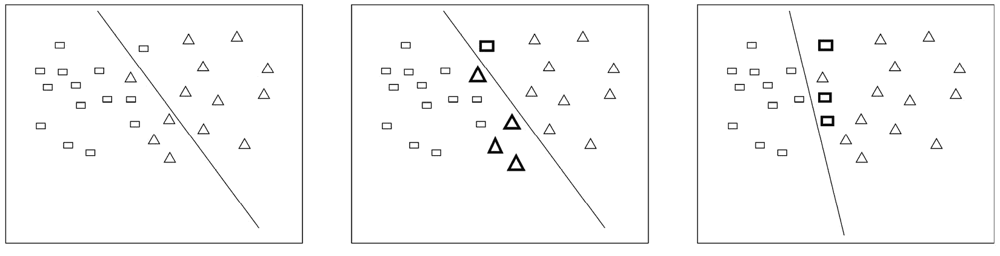

图 4.12 – 提升法思想：（左）第一个分类器的决策边界；（中）第二分类器对误分类数据点的权重提升；（右）第二个分类器的决策边界

我们刚才描述的这种提升方法称为**AdaBoost**。还有一种提升算法的类别称为梯度提升，其主要重点是最小化先前模型的残差（实际值与预测输出值之间的差异），试图纠正先前模型的错误。有几个流行的梯度提升实现，如**XGBoost**、**LightGBM**和**CatBoost**。

在本章中，我们将主要关注 AdaBoost 并将其修改为考虑数据不平衡。然而，将 AdaBoost 与 XGBoost 等替换不应太困难。

## AdaBoost

AdaBoost，即自适应提升，是基于决策树的最早提升方法之一。决策树是易于组合在一起的分类器：

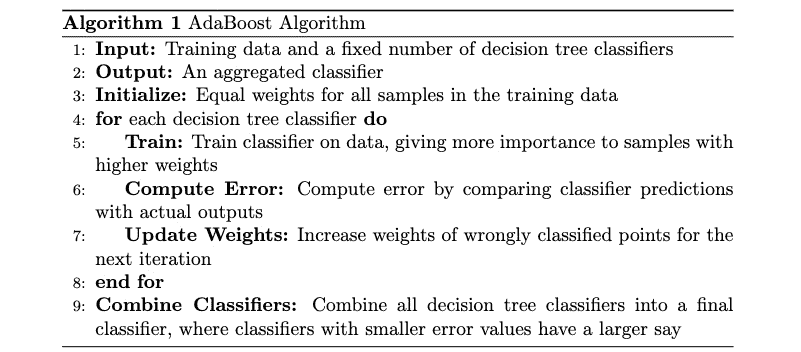

图 4.13 – AdaBoost 伪代码

以下代码显示了如何从`sklearn`库中导入分类器并在数据上训练它：

```py
from sklearn.ensemble import AdaBoostClassifier
clf = AdaBoostClassifier(
    random_state=0, estimator = DecisionTreeClassifier(max_depth=6)
).fit(X_train, y_train)
```

让我们绘制模型在数据上训练后的决策边界：

```py
plot_decision_boundary(X_train, y_train, clf, 'AdaBoostClassifier')
plt.show()
```

*图 4**.14*显示了模型在训练数据上的决策边界：

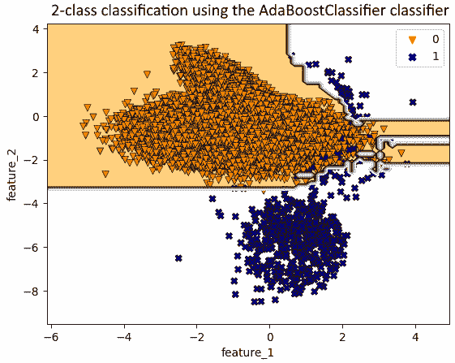

图 4.14 – AdaBoostClassifier 在训练数据上的决策边界

我们可以将过采样和欠采样作为提升算法的组成部分，类似于我们对 bagging 算法所做的那样。我们将在下一节讨论这一点。

## RUSBoost、SMOTEBoost 和 RAMOBoost

如您所猜测，我们可以将 AdaBoost 与重采样技术相结合。以下是主要思路：在每次提升迭代中，在训练分类器之前，对前一次迭代中的错误示例进行数据采样（通过某些欠采样或过采样变体）。以下是通用伪代码：

1.  **输入**：训练数据和一些决策树分类器。

1.  **输出**：一个聚合分类器。

1.  初始化训练数据所有样本的相等权重。

1.  对每个决策树分类器重复此操作：

    1.  使用数据采样方法重新采样数据：

        1.  如果使用的采样方法是**随机欠采样**（**RUS**），则该方法称为**RUSBoost** [5]。

        1.  如果使用的采样方法是 SMOTE，则该方法称为**SMOTEBoost** [6]。

        1.  在**RAMOBoost**（即**Boosting 中的排序少数过采样** [7]）中，少数类的过采样是基于少数类示例的权重进行的。如果一个示例的权重更高（因为模型在前一次迭代中对该示例的表现不佳），则对其进行更多的过采样，反之亦然。

    1.  在重采样数据上训练分类器，根据先前迭代中样本的权重给予更高的重视。

    1.  通过比较其预测与实际输出，计算给定数据上分类器的错误。

    1.  考虑下一次迭代中所有被错误分类的示例。增加这些错误分类示例的权重。

1.  将所有决策树分类器组合成一个最终分类器，其中在训练数据上具有较小错误值的分类器在最终预测中具有更大的发言权。

在这个伪代码中，*步骤 4（I）*是我们相对于 AdaBoost 算法所添加的唯一额外步骤。让我们讨论这些技术的优缺点：

+   在 RUSBoost 中，随着数据的减少，我们倾向于有更快的训练时间。

+   SMOTEBoost 从少数类生成合成样本。因此，它增加了数据的多样性，并可能提高分类器的准确性。然而，它会增加训练时间，并且可能无法扩展到非常大的数据集。

+   RAMOBoost 优先考虑靠近类别边界的样本。这在某些情况下可以提高性能。然而，类似于 SMOTEBoost，这种方法可能会增加训练时间和成本，并可能导致最终模型的过拟合。

`imbalanced-learn`库提供了`RUSBoostClassifier`的实现：

```py
from imblearn.ensemble import RUSBoostClassifier
rusboost_clf = RUSBoostClassifier(random_state=0, \
    estimator=DecisionTreeClassifier\
    (max_depth=6)).fit(X_train, y_train)
```

让我们检查训练模型的决策边界：

```py
plot_decision_boundary(
    X_train, y_train, rusboost_clf, 'RUSBoostClassifier')
plt.show()
```

结果图如下所示：

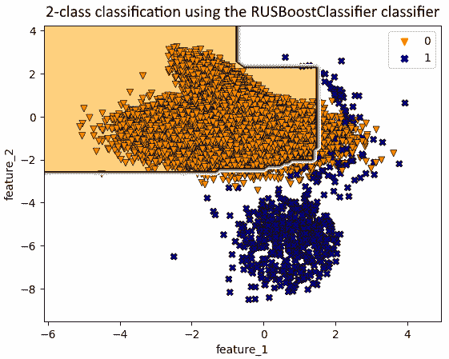

图 4.15 – RUSBoostClassifier 在训练数据上的决策边界

`imbalanced-learn`库尚未实现 RAMOBoost 和 SMOTEBoost（截至版本 0.11.0）。您可以在[`github.com/dialnd/imbalanced-algorithms`](https://github.com/dialnd/imbalanced-algorithms)的开放源代码存储库中查看参考实现。

我们能否为多数类创建多个子集，从每个子集中训练一个集成，并将这些集成中的所有弱分类器组合成一个最终输出？这种方法将在下一节中探讨，我们将利用集成集成技术。

# 集成集成

我们能否结合提升和 bagging？如我们之前所看到的，在 bagging 中，我们创建多个数据子集，然后在那些数据集上训练分类器。我们可以将 AdaBoost 视为在 bagging 过程中使用的分类器。过程很简单：首先，我们创建袋子，然后在每个袋子上训练不同的 AdaBoost 分类器。在这里，AdaBoost 本身就是一种集成。因此，这些模型被称为**集成** **的集成**。

除了拥有集成集成之外，我们还可以在 bagging 时进行下采样（或过采样）。这使我们能够在单个模型中获得下采样（或过采样）的**袋装**、**提升**和**随机下采样**（或过采样）的**好处**。在本节中，我们将讨论一个名为**EasyEnsemble**的算法，它具有与具有相同数量弱分类器的任何其他算法相似的训练时间。由于随机下采样没有显著的开销，这两个算法的训练时间与其他算法相似。

## EasyEnsemble

EasyEnsemble 算法[8]从原始数据集中生成平衡数据集，并在每个平衡数据集上训练不同的 AdaBoost 分类器。随后，它创建一个聚合分类器，该分类器基于 AdaBoost 分类器的多数投票进行预测：

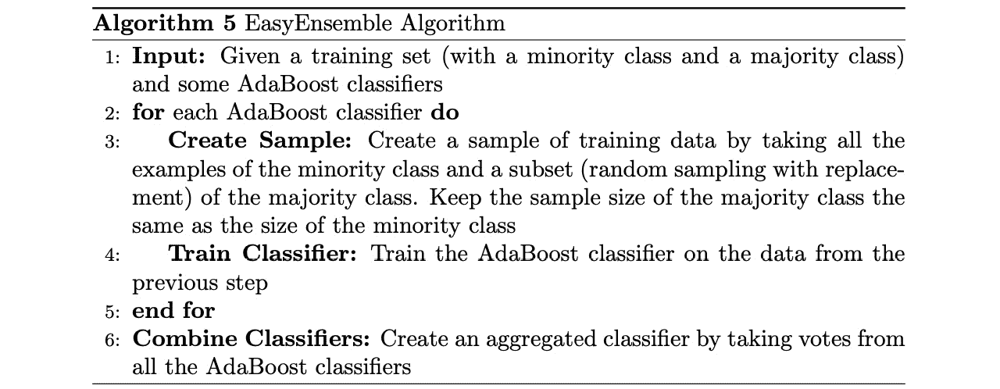

图 4.16 – EasyEnsemble 伪代码

*图 4**.17*总结了使用训练数据三个子集的 EasyEnsemble 算法：

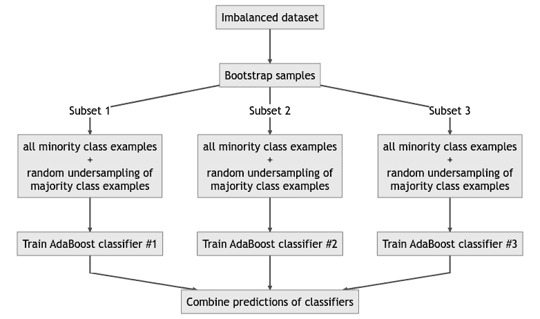

图 4.17 – EasyEnsemble 算法解释

我们不仅可以随机下采样多数类示例，还可以随机上采样少数类示例。

`imbalanced-learn`库提供了使用`EasyEnsembleClassifier`的 API。`EasyEnsembleClassifier` API 提供了一个`base_estimator`参数，可以用来设置任何分类器，默认为`AdaBoostClassifier`：

```py
from imblearn.ensemble import EasyEnsembleClassifier
clf = EasyEnsembleClassifier(n_estimators=70,random_state=42).fit(X,y)
```

让我们绘制决策边界：

```py
plot_decision_boundary(X, y, clf, 'EasyEnsembleClassifier')
plt.show()
```

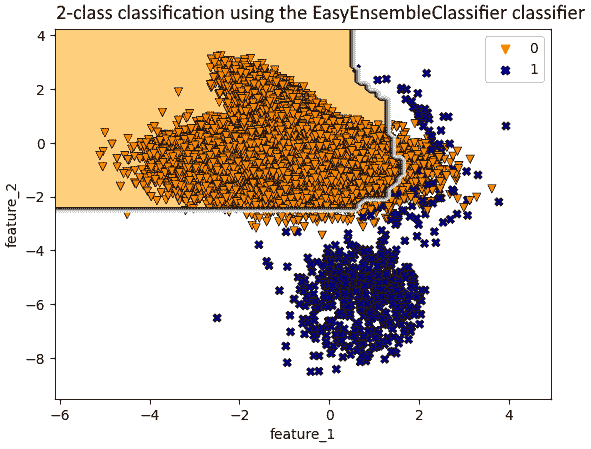

图 4.18 – EasyEnsembleClassifier 在训练数据上的决策边界

默认情况下，EasyEnsemble 使用`AdaBoostClassifier`作为基线估计器。然而，我们也可以使用任何其他估计器，例如`XGBoostClassifier`，或者以其他方式调整它，例如通过传递另一个`sampling_strategy`。

这就结束了我们对 EasyEnsemble 的讨论。接下来，我们将比较我们研究过的各种提升方法。

## 提升方法的比较性能

让我们比较我们讨论过的各种提升方法的性能。我们以决策树作为基线，并使用 RUSBoost、AdaBoost、XGBoost 和 EasyEnsemble，以及两种变体。默认情况下，`EasyEnsembleClassifier`使用`AdaBoostClassifier`作为基线估计器。我们在`EasyEnsembleClassifier`的第二种变体中使用 XGBoost 作为估计器；在第三种变体中，我们使用`not majority`作为我们的`sampling_strategy`，并配合 XGBoost 估计器：

| **技术** | **F2 分数** | **精确度** | **召回率** | **平均精确度** | **AUC-ROC** |
| --- | --- | --- | --- | --- | --- |
| EasyEnsemble（估计器=XGBoost 和`sampling_strategy =` `not_majority`） | 0.885 | 0.933 | 0.874 | **0.978** | **1.000** |
| EasyEnsemble（估计器=XGBoost） | 0.844 | 0.520 | **1.000** | **0.978** | 0.999 |
| EasyEnsemble | 0.844 | 0.519 | **1.000** | 0.940 | 0.999 |
| RUSBoost | 0.836 | 0.517 | 0.989 | 0.948 | **1.000** |
| AdaBoost | **0.907** | 0.938 | 0.900 | **0.978** | **1.000** |
| XGBoost | 0.885 | 0.933 | 0.874 | 0.968 | **1.000** |
| 决策树 | 0.893 | **0.960** | 0.878 | 0.930 | 0.981 |

表 4.3 – 各种提升技术的性能比较

下面是从*表 4.3*中得出的结论：

+   对于最高的 F2 分数，AdaBoost 是最好的选择。

+   对于高精确度，纯决策树击败了所有其他技术。

+   对于完美的召回率，EasyEnsemble（估计器为`XGBoost`）和 EasyEnsemble 表现完美。

+   对于整体平衡性能，AdaBoost 和 EasyEnsemble（估计器为`XGBoost`和`sampling_strategy=not_majority`）是强有力的竞争者。

+   集成技术，如 RUSBoost 和 EasyEnsemble，专门设计用于处理数据不平衡并提高召回率，与基线模型（如决策树或甚至 AdaBoost）相比。

总体而言，结果表明，尽管像 AdaBoost 和 XGBoost 这样的集成方法提供了难以超越的稳健基准，但利用不平衡学习技术确实可以修改结果分类器的决策边界，这有可能有助于提高召回率。然而，这些技术的有效性在很大程度上取决于所考虑的数据集和性能指标。

通过结束我们通过集成集成之旅，我们为我们的机器学习工具箱添加了另一个强大且动态的工具。

# 模型性能比较

我们所讨论的技术有效性高度依赖于它们应用到的数据集。在本节中，我们将进行全面的比较分析，比较我们迄今为止所讨论的各种技术，同时以逻辑回归模型作为基准。有关完整实现的全面审查，请参阅 GitHub 上提供的配套笔记本。

分析涵盖了四个不同的数据集，每个数据集都有其独特的特性和挑战：

+   **Sep: 0.5 的合成数据**：一个类别之间具有适度分离的模拟数据集，作为在简化条件下理解算法性能的基准。

+   **Sep: 0.9 的合成数据**：另一个合成数据集，但具有更高的分离度，使我们能够检查随着类别区分性的提高，算法的表现如何。

+   与医疗保健相关的`imblearn`)，因其实际重要性以及医疗数据集中常见的自然类别不平衡而被选中。

+   `imblearn`也是如此。

我们的主要评估指标是平均精确度，这是一个结合了精确度和召回率的综合度量，从而提供了一个平衡的算法性能视图。

我们想强调，我们正在使用各种集成模型的原始版本进行比较。通过一些额外的努力来调整这些模型的超参数，我们当然可以增强这些实现的性能。我们将这留给你作为练习。

通过在多种数据集上比较这些不同的算法，这项分析旨在以下方面提供一些有价值的见解：

+   传统技术与专门技术的对比

+   算法有效性对数据集特征的依赖性

+   在不同场景下选择一种算法而非另一种算法的实际影响

*图 4.19*比较了使用平均精确度得分，以逻辑回归模型为基准，在两个合成数据集上各种 bagging 和 boosting 技术的性能：

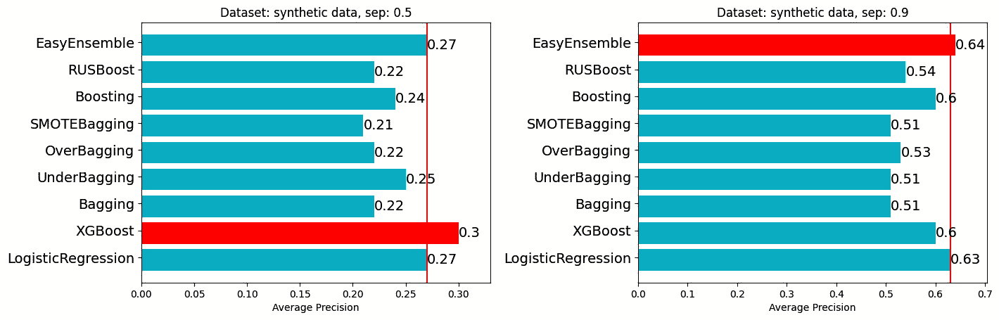

图 4.19 – 合成数据集上的平均精确度得分

*图 4.20*显示了两个真实世界数据集上的相似图：

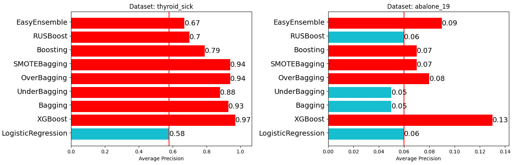

图 4.20 – thyroid_sick 和 abalone_19 数据集上的平均精确度得分

让我们分析每个数据集的结果：

+   **Sep 0.5 的合成数据** (*图 4.19*，左侧)：在平均精确度方面，XGBoost 和逻辑回归表现最佳，分别得分为 0.30 和 0.27。有趣的是，专门为不平衡数据设计的集成方法，如 SMOTEBagging 和 OverBagging，表现与常规方法如 Bagging 相当，甚至更差。这表明在更简单的合成设置中，专门的方法并不总是能保证优势。

+   **Sep 0.9 的合成数据** (*图 4.19*，右侧)：EasyEnsemble 在这个数据集上以平均精确度 0.64 领先，紧随其后的是逻辑回归和 XGBoost。这种更高的分离似乎使 EasyEnsemble 能够利用其对平衡的关注，从而获得更好的性能。其他集成方法如 UnderBagging 和 OverBagging 表现尚可，但未超越领先者。

+   **甲状腺疾病数据集** (*图 4.20*，左侧)：在一个关注甲状腺疾病的真实世界数据集中，XGBoost 的表现远超其他所有方法，平均精确度为 0.97。其他集成方法如 Bagging、OverBagging 和 SMOTEBagging 也得分很高，表明集成方法特别适用于这个数据集。有趣的是，Boosting 和 RUSBoost 没有跟上步伐，这表明并非所有 Boosting 变体都普遍有效。

+   **Abalone 19 数据集** (*图 4.20*，右侧)：对于 Abalone 19 数据集，所有方法的表现相对较差，XGBoost 以平均精确度 0.13 脱颖而出。EasyEnsemble 以 0.09 的得分位居第二，而传统方法如逻辑回归和 Bagging 则落后。这可能表明该数据集对大多数方法来说特别具有挑战性，而专门的不平衡技术只能带来微小的改进。

这里有一些总体见解：

+   常规方法如 XGBoost 和逻辑回归通常提供强大的基线，难以超越。

+   专门的不平衡学习技术的有效性可能因数据集及其固有的复杂性而显著不同。

+   集成方法通常在各种数据集上表现良好，但它们的有效性可能取决于具体情境。

+   性能指标的选择——在本例中为平均精确度——可以显著影响评估，因此考虑多个指标以获得全面理解至关重要。

我们希望这一章已经展示了您如何将采样技术与集成方法相结合以实现更好的结果，尤其是在处理不平衡数据时。

# 摘要

机器学习中的集成方法通过结合多个弱分类器的结果来创建强大的分类器，例如使用袋装和提升方法。然而，这些方法假设数据平衡，可能难以处理不平衡数据集。将集成方法与过采样和欠采样等采样方法相结合，导致 UnderBagging、OverBagging 和 SMOTEBagging 等技术，所有这些都可以帮助解决不平衡数据问题。

EasyEnsemble 等集成集成，结合提升和袋装技术，为不平衡数据集创建强大的分类器。

基于集成的不平衡学习技术可以成为您工具箱中的优秀补充。基于 KNN 的，如 SMOTEBoost 和 RAMOBoost 可能较慢。然而，基于随机欠采样和随机过采样的集成成本较低。此外，发现提升方法在处理不平衡数据时有时比袋装方法更有效。我们可以将随机采样技术与提升方法相结合，以获得更好的整体性能。正如我们之前强调的，这是经验性的，我们必须尝试了解什么最适合我们的数据。

在下一章中，我们将学习如何调整模型以考虑数据的不平衡以及模型由于对少数类样本的错误分类而引起的各种成本。

# 问题

1.  尝试在`abalone_19`数据集上使用`RUSBoostClassifier`，并将性能与其他章节中的技术进行比较。

1.  `imbalanced-learn`库中的`BalancedRandomForestClassifier`和`BalancedBaggingClassifier`类之间的区别是什么？

# 参考文献

1.  L. Breiman, *Bagging predictors*, Mach Learn, vol. 24, no. 2, pp. 123–140, Aug. 1996, doi: 10.1007/BF00058655, [`link.springer.com/content/pdf/10.1007/BF00058655.pdf`](https://link.springer.com/content/pdf/10.1007/BF00058655.pdf).

1.  （介绍了 OverBagging、UnderBagging 和 SMOTEBagging 的论文）S. Wang 和 X. Yao, *Diversity analysis on imbalanced data sets by using ensemble models*, in 2009 IEEE Symposium on Computational Intelligence and Data Mining, Nashville, TN, USA: IEEE, Mar. 2009, pp. 324–331\. doi: 10.1109/CIDM.2009.4938667, [`www.cs.bham.ac.uk/~wangsu/documents/papers/CIDMShuo.pdf`](https://www.cs.bham.ac.uk/~wangsu/documents/papers/CIDMShuo.pdf).

1.  *实时网站事件升级预测* (2023), [`medium.com/data-science-at-microsoft/live-site-incident-escalation-forecast-566763a2178`](https://medium.com/data-science-at-microsoft/live-site-incident-escalation-forecast-566763a2178)

1.  L. Breiman, *Random Forests*, Machine Learning, vol. 45, no. 1, pp. 5–32, 2001, doi: 10.1023/A:1010933404324, [`link.springer.com/content/pdf/10.1023/A:1010933404324.pdf`](https://link.springer.com/content/pdf/10.1023/A:1010933404324.pdf).

1.  （介绍了 RUSBoost 算法的论文）C. Seiffert, T. M. Khoshgoftaar, J. Van Hulse, 和 A. Napolitano, *RUSBoost: 一种缓解类别不平衡的混合方法*，IEEE Trans. Syst., Man, Cybern. A, 第 40 卷，第 1 期，第 185–197 页，2010 年 1 月，doi: 10.1109/TSMCA.2009.2029559，[`www.researchgate.net/profile/Jason-Van-Hulse/publication/224608502_RUSBoost_A_Hybrid_Approach_to_Alleviating_Class_Imbalance/links/0912f50f4bec299a8c000000/RUSBoost-A-Hybrid-Approach-to-Alleviating-Class-Imbalance.pdf`](https://www.researchgate.net/profile/Jason-Van-Hulse/publication/224608502_RUSBoost_A_Hybrid_Approach_to_Alleviating_Class_Imbalance/links/0912f50f4bec299a8c000000/RUSBoost-A-Hybrid-Approach-to-Alleviating-Class-Imbalance.pdf).

1.  （介绍了 SMOTEBoost 算法的论文）N. V. Chawla, A. Lazarevic, L. O. Hall, 和 K. W. Bowyer, *SMOTEBoost: 在提升中改进少数类的预测*，在数据库中的知识发现：PKDD 2003，N. Lavrač, D. Gamberger, L. Todorovski, 和 H. Blockeel 编著，计算机科学讲座笔记，第 2838 卷。柏林，海德堡：Springer Berlin Heidelberg，2003 年，第 107–119 页。doi: 10.1007/978-3-540-39804-2_12，[`www3.nd.edu/~dial/publications/chawla2003smoteboost.pdf`](https://www3.nd.edu/~dial/publications/chawla2003smoteboost.pdf).

1.  （介绍了 RAMOBoost 算法的论文）Sheng Chen, Haibo He, 和 E. A. Garcia, *RAMOBoost: 在提升中的排序少数类过采样*，IEEE Trans. Neural Netw.，第 21 卷，第 10 期，第 1624–1642 页，2010 年 10 月，doi: 10.1109/TNN.2010.2066988，[`ieeexplore.ieee.org/abstract/document/5559472`](https://ieeexplore.ieee.org/abstract/document/5559472).

1.  （介绍了 EasyEnsemble 的论文）Xu-Ying Liu, Jianxin Wu, 和 Zhi-Hua Zhou, *用于类别不平衡学习的探索性欠采样*，IEEE Trans. Syst., Man, Cybern. B，第 39 卷，第 2 期，第 539–550 页，2009 年 4 月，doi: 10.1109/TSMCB.2008.2007853，[`129.211.169.156/publication/tsmcb09.pdf`](http://129.211.169.156/publication/tsmcb09.pdf).
