# 第八章：算法级深度学习技术

数据级深度学习技术存在与经典机器学习技术非常相似的问题。由于深度学习算法与经典机器学习技术有很大不同，因此在本章中，我们将探讨一些算法级技术来解决数据不平衡问题。这些算法级技术不会改变数据，而是适应模型。这种探索可能会揭示新的见解或方法，以更好地处理不平衡数据。

本章将与*第五章*的*成本敏感学习*保持一致，将思想扩展到深度学习模型。我们将探讨算法级深度学习技术来处理数据不平衡问题。通常，这些技术不会修改训练数据，并且通常不需要预处理步骤，从而提供了无需增加训练时间或额外运行时硬件成本的优点。

在本章中，我们将涵盖以下主题：

+   算法级技术的动机

+   加权技术

+   明确损失函数修改

+   讨论其他基于算法的技术

到本章结束时，您将了解如何通过使用 PyTorch API 对模型权重进行调整和修改损失函数来管理不平衡数据。我们还将探索其他算法策略，使您能够在现实世界的应用中做出明智的决策。

# 技术要求

在本章中，我们将主要使用 PyTorch 和`torchvision`的标准函数。我们还将使用 Hugging Face Datasets 库来处理文本数据。

本章的代码和笔记本可在 GitHub 上找到，网址为[`github.com/PacktPublishing/Machine-Learning-for-Imbalanced-Data/tree/master/chapter08`](https://github.com/PacktPublishing/Machine-Learning-for-Imbalanced-Data/tree/master/chapter08)。像往常一样，您可以通过点击本章笔记本顶部的**在 Colab 中打开**图标或通过使用笔记本的 GitHub URL 从[`colab.research.google.com`](https://colab.research.google.com)启动它来打开 GitHub 笔记本。

# 算法级技术的动机

在本章中，我们将专注于在视觉和文本领域都受到欢迎的深度学习技术。我们将主要使用与*第七章*的*数据级深度学习方法*中使用的类似的 MNIST 数据集的长尾不平衡版本。我们还将考虑 CIFAR10-LT，这是 CIFAR10 的长尾版本，在处理长尾数据集的研究者中相当受欢迎。

在本章中，我们将讨论的想法将与我们在*第五章*中学习的相似，即*成本敏感学习*，其中高级思想是在模型的成本函数中增加正类（少数类）的权重并减少负类（多数类）的权重。为了便于调整损失函数，`scikit-learn`和 XGBoost 等框架提供了特定的参数。`scikit-learn`提供了如`class_weight`和`sample_weight`等选项，而 XGBoost 提供了`scale_pos_weight`作为参数。

在深度学习中，这个想法保持不变，PyTorch 在`torch.nn.CrossEntropyLoss`类中提供了一个`weight`参数来实现这个加权思想。

然而，我们将看到一些更相关且可能为深度学习模型带来更好结果的先进技术。

在不平衡的数据集中，多数类别的示例对整体损失的贡献远大于少数类别的示例。这是因为多数类别的示例数量远远超过少数类别的示例。这意味着所使用的损失函数自然地偏向多数类别，并且无法捕捉到少数类别的错误。考虑到这一点，我们能否改变损失函数来考虑这种不平衡数据集的差异？让我们试着找出答案。

二元分类的交叉熵损失定义为以下：

CrossEntropyLoss(p) = {− log(p) if y = 1 (minority class term)    − log(1 − p) otherwise (majority class term)

假设 y = 1 代表少数类别，这是我们试图预测的类别。因此，我们可以通过乘以一个更高的权重值来增加少数类别的权重，从而增加其对整体损失的贡献。

# 加权技术

让我们继续使用上一章中的不平衡 MNIST 数据集，它具有长尾数据分布，如下面的条形图（*图 8.1*）所示：


图 8.1 – 不平衡 MNIST 数据集

这里，*x*轴是类别标签，*y*轴是各种类别的样本计数。在下一节中，我们将看到如何在 PyTorch 中使用权重参数。

我们将使用以下模型代码来完成本章中所有与视觉相关任务。我们定义了一个名为`Net`的 PyTorch 神经网络类，包含两个卷积层、一个 dropout 层和两个全连接层。`forward`方法按顺序应用这些层，包括 ReLU 激活和最大池化来处理输入`x`。最后，它返回输出的`log_softmax`激活：

```py
class Net(torch.nn.Module):
    def __init__(self):
        super(Net, self).__init__()
        self.conv1 = torch.nn.Conv2d(1, 10, kernel_size=5)
        self.conv2 = torch.nn.Conv2d(10, 20, kernel_size=5)
        self.conv2_drop = torch.nn.Dropout2d()
        self.fc1 = torch.nn.Linear(320, 50)
        self.fc2 = torch.nn.Linear(50, 10)
    def forward(self, x):
        x = F.relu(F.max_pool2d(self.conv1(x), 2))
        x = F.relu(F.max_pool2d(self.conv2_drop(self.conv2(x)),2))
        x = x.view(-1, 320)
        x = F.relu(self.fc1(x))
        x = F.dropout(x, training=self.training)
        x = self.fc2(x)
        return F.log_softmax(x, dim=1)
```

由于我们的模型最终层使用`log_softmax`，我们将使用 PyTorch 的负对数似然损失（`torch.nn.functional.nll_loss`或`torch.nn.NLLLoss`）。

## 使用 PyTorch 的权重参数

在`torch.nn.CrossEntropyLoss` API 中，我们有一个`weight`参数：

```py
torch.nn.CrossEntropyLoss(weight=None, …)
```

在这里，`weight`是一个一维张量，为每个类别分配权重。

我们可以使用`scikit-learn`中的`compute_class_weight`函数来获取各种类别的权重：

```py
from sklearn.utils import class_weight
y = imbalanced_train_loader.dataset.targets
class_weights=class_weight.compute_class_weight( \
    'balanced', np.unique(y), y.numpy())
print(class_weights)
```

这将输出以下内容：

```py
array([0.25002533, 0.41181869, 0.68687384, 1.14620743, 1.91330749, 3.19159483, 5.32697842, 8.92108434, 14.809 , 24.68166667])
```

`compute_class_weight` 函数根据以下公式为每个类别计算权重，正如我们在*第五章*中看到的，*成本敏感学习*：

weight_class_a = 1 / (total_num_samples_for_class_a * total_number_of_samples / number_of_classes)

在图 8.2 中，这些权重已经用条形图绘制出来，以帮助我们了解它们如何与每个类别的频率（*y*轴）和类别（*x*轴）相关：

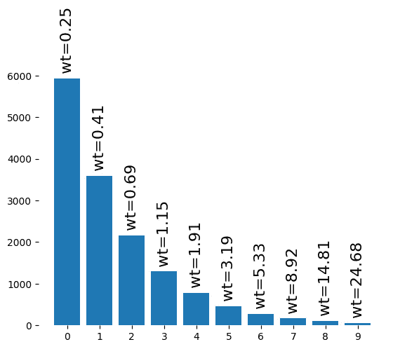

图 8.2 – 每个类别对应的权重条形图

如此图所示，一个类别的样本数量越少，其权重就越高。

提示

这里的关键点是，一个类别的权重与该类别的样本数量成反比，也称为逆类别频率加权。

另一点需要记住的是，类别权重应该始终从训练数据中计算。使用验证数据或测试数据来计算类别权重可能会导致机器学习中的著名的数据泄露或标签泄露问题。正式来说，数据泄露可能发生在训练数据之外的信息被输入到模型中。在这种情况下，如果我们使用测试数据来计算类别权重，那么我们对模型性能的评价将会是有偏的且无效的。

图 8.3 中的漫画展示了一位魔术师管理不同大小的权重，每个权重都标有不同的类别标签，象征着在模型训练过程中为处理类别不平衡而分配给不同类别的不同权重：


图 8.3 – 描述类别加权核心思想的漫画

提示

计算权重的另一种方法是经验性地调整权重。

让我们编写训练循环：

```py
def train(train_loader):
    model.train()
    for batch_idx, (data, target) in enumerate(train_loader):
        data, target = data.to(device), target.to(device)
        optimizer.zero_grad()
        output = model(data)
        loss = torch.nn.functional.nll_loss(output, target weight)
        loss.backward()
        optimizer.step()
```

PyTorch 中的许多其他损失函数，包括`NLLLoss`、`MultiLabelSoftMarginLoss`、`MultiMarginLoss`和`BCELoss`，也接受`weight`作为参数。

*图 8.4*。4 比较了使用类别权重和不使用类别权重时各种类别的准确率：

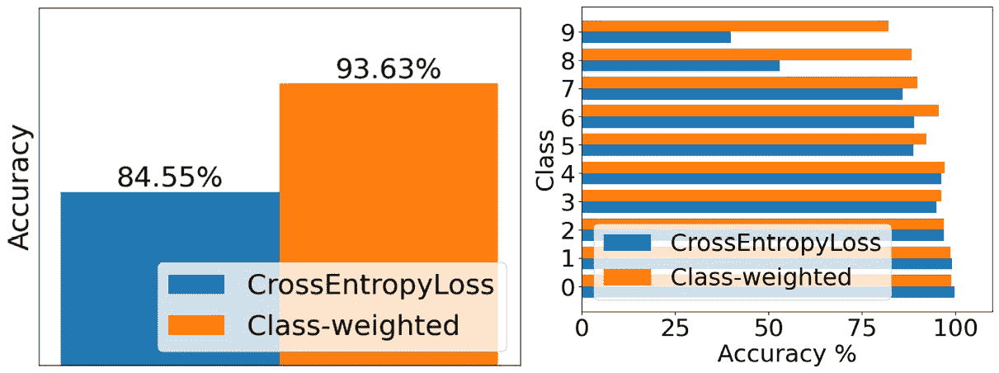

图 8.4 – 使用无类别权重和有类别权重训练的模型性能比较

如我们所见，尽管 0-4 类别的准确率有所下降，但 5-9 类这种最不平衡的类别的准确率有了显著提高。模型的总体准确率也有所上升。

警告

请注意，一些损失函数，如`BCEWithLogitsLoss`，提供了两个加权参数（`BCEWithLogitsLoss`可用于二分类或多标签分类）：

• `weight`参数是每个批次的示例的手动缩放权重参数。这更像是`sklearn`库中的`sample_weight`参数。

• `pos_weight`参数用于指定正类的权重。它与`sklearn`库中的`class_weight`参数类似。

🚀 OpenAI 在生产中实现类重新加权

OpenAI 试图通过图像生成模型 DALL-E 2 [1]来解决训练数据中的偏差问题。DALL-E 2 在来自互联网的大量图像数据集上训练，这些数据集可能包含偏差。例如，数据集中可能包含比女性更多的男性图像，或者比其他种族或民族群体更多的图像。

为了限制不希望有的模型能力（例如生成暴力图像），他们首先从训练数据集中过滤掉了这样的图像。然而，过滤训练数据可能会放大偏差。为什么？在他们的博客[1]中，他们用一个例子解释说，当为提示“一个 CEO”生成图像时，他们的过滤模型比未过滤的模型显示出更强的男性偏差。他们怀疑这种放大可能源于两个来源：数据集对女性性化的偏差以及潜在的分类器偏差，尽管他们努力减轻这些偏差。这可能导致过滤器移除更多女性的图像，从而扭曲训练数据。

为了解决这个问题偏差，OpenAI 通过对 DALL-E 2 训练数据进行重新加权来应用，通过训练一个分类器来预测图像是否来自未过滤的数据集。然后根据分类器的预测计算每个图像的权重。这种方案已被证明可以减少由过滤引起的频率变化，这意味着它在对抗训练数据中的偏差方面是有效的。

接下来，为了展示其广泛的应用性，我们将对文本数据应用类加权技术。

## 处理文本数据

让我们处理一些文本数据。我们将使用 Hugging Face 的`datasets`和`transformers`库。让我们导入`trec`数据集（**文本检索会议**（**TREC**），一个包含训练集 5,500 个标记问题和测试集 500 个问题的问答分类数据集）：

```py
from datasets import load_dataset
dataset = load_dataset("trec")
```

这个数据集是平衡的，因此我们随机从 ABBRA 和 DESC 类中移除示例，使这些类成为最不平衡的。以下是这个数据集中各种类的分布情况，证实了数据的不平衡性：

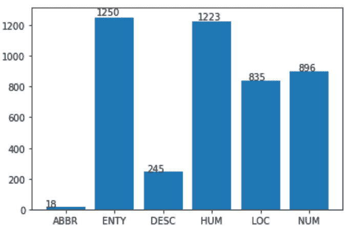

图 8.5 – Hugging Face Datasets 库中 trec 数据集中各种类的频率

让我们为预训练的 DistilBERT 语言模型词汇创建一个最大输入标记长度为 512 的分词器（将文本分割成单词或子词）：

```py
from transformers import AutoTokenizer
model_name = 'distilbert-base-uncased'
tokenizer = AutoTokenizer.from_pretrained(model_name)
tokenizer.model_max_length = 512
```

接下来，我们将通过调用分词器从我们刚刚导入的数据集中创建标记化的训练集和测试集：

```py
def tokenize_function(examples):
    return tokenizer(examples["text"], padding=False, truncation=True)
tokenized_train_dataset = dataset["train"].shuffle(seed=42).\
    map(tokenize_function, batched=True)
tokenized_test_dataset = dataset["test"].shuffle(seed=42).\
    map(tokenize_function, batched=True)
```

接下来，让我们实例化模型：

```py
from transformers import \
    AutoModelForSequenceClassification, TrainingArguments
model = AutoModelForSequenceClassification.from_pretrained(\
    model_name, num_labels=6)
```

现在，让我们定义和调用一个函数来获取训练参数：

```py
def get_training_args(runname):
    training_args = TrainingArguments(
        run_name=runname, output_dir="./results", \
        num_train_epochs=5, evaluation_strategy="epoch",\
        save_strategy="epoch", warmup_ratio=0.1, \
        lr_scheduler_type='cosine', \
        auto_find_batch_size=True, \
        gradient_accumulation_steps=4, fp16=True, \
        log_level="error"
    )
    return training_args
training_args = get_training_args(model_name)
```

以下`custom_compute_metrics()`函数返回一个包含精确率、召回率和 F1 分数的字典：

```py
from transformers import EvalPrediction
from typing import Dict
from sklearn.metrics import precision_score, recall_score, f1_score
def custom_compute_metrics(res: EvalPrediction) -> Dict:
    pred = res.predictions.argmax(axis=1)
    target = res.label_ids
    precision = precision_score(target, pred, average='macro')
    recall = recall_score(target, pred, average='macro')
    f1 = f1_score(target, pred, average='macro')
    return {'precision': precision, 'recall': recall, 'f1': f1}
```

现在，让我们实现包含使用类权重的损失函数的类：

```py
from transformers import Trainer
class CustomTrainerWeighted(Trainer):
    def compute_loss(self, model, inputs, return_outputs):
        labels = inputs.get("labels")
        outputs = model(**inputs)
        logits = outputs.get('logits')
        loss_fct = nn.CrossEntropyLoss( \
            weight=torch.from_numpy(class_weights).cuda(0).float()
        )
        loss = loss_fct(logits.view(-1,self.model.config.num_labels),\
            labels.view(-1))
        return (loss, outputs) if return_outputs else loss
```

我们可以像之前一样使用`sklearn`中的`compute_class_weight`函数初始化权重，然后将其输入到我们的`CustomTrainerWeighted`类中的`CrossEntropyLoss`函数：

```py
modelWeighted = AutoModelForSequenceClassification \
    .from_pretrained(model_name, num_labels=4)
trainerWeighted = CustomTrainerWeighted(\
    model=modelWeighted, \
    args=training_args, \
    train_dataset=tokenized_train_dataset, \
    eval_dataset=tokenized_test_dataset, \
    tokenizer=tokenizer, \
    data_collator=data_collator, \
    compute_metrics=custom_compute_metrics)
trainerWeighted.train()
```

如**图 8**.6 所示，我们可以看到在处理最不平衡的类别时性能有所提升。然而，对于多数类别（权衡！）观察到轻微的下降：

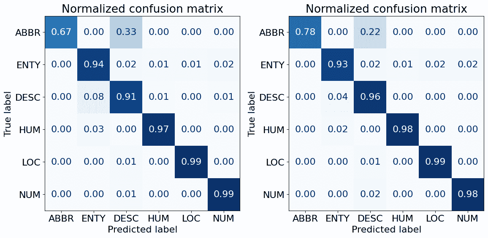

图 8.6 – 使用无类别加权（左）和有类别加权（右）的混淆矩阵

如我们所见，少数类别**ABBR**和**DESC**在类别加权后性能有所提升，但**ENTY**类别的性能有所下降。此外，观察一些非对角线项，我们可以看到**ABBR**和**DESC**类别之间的混淆（*图 8**.6*（左）中的 0.33）以及**DESC**和**ENTY**类别之间的混淆（*图 8**.6*（左）中的 0.08）在使用类别加权时显著下降（分别为 0.22 和 0.04）。

一些特定于 NLP 任务的变体建议将样本的权重设置为对应类别的平方根倒数，而不是使用之前使用的逆类别频率加权技术。

从本质上讲，类别加权通常可以帮助任何类型的深度学习模型，包括文本数据，在处理不平衡数据时。由于数据增强技术在文本上的应用不如图像直接，因此类别加权对于 NLP 问题来说可以是一个有用的技术。

🚀 Wayfair 生产中的类别重加权

Wayfair 使用 BERT 语言模型来提高其产品搜索和推荐系统的准确性[2]。这是一个具有挑战性的问题，因为 Wayfair 销售的产品数量非常大，而客户可能感兴趣的产品数量则相对较小。

数据存在不平衡，因为客户互动过的产品数量（例如，查看、加入购物车或购买）远小于客户未互动过的产品数量。这使得 BERT 难以学习准确预测客户可能感兴趣的产品。

Wayfair 使用类别加权来解决数据不平衡问题。他们给正例（即客户互动过的产品）分配比负例（即客户未互动过的产品）更高的权重。这有助于确保 BERT 能够准确分类正例和负例，即使数据不平衡。

模型已部署到生产环境中。Wayfair 正在使用该模型来提高其产品搜索和推荐系统的准确性，并为顾客提供更好的体验。

在下一节中，我们将讨论一个类加权的小变体，有时它比单纯的加权技术更有帮助。

## 延迟重新加权 – 类权重技术的一个小变体

有一种延迟重新加权技术（由 Cao 等人[3]提到），类似于我们在*第七章*“数据级深度学习方法”中讨论的两阶段采样方法。在这里，我们将重新加权推迟到后面，即在训练的第一阶段，我们在没有任何加权或采样的情况下在完整的不平衡数据集上训练模型。在第二阶段，我们使用已经应用于损失函数的类权重（与类频率成反比）重新训练第一阶段相同的模型，并且可以选择使用较小的学习率。训练的第一阶段为第二阶段使用重新加权损失的训练提供了良好的模型初始化形式。由于我们在训练的第二阶段使用较小的学习率，因此模型的权重不会从第一阶段训练的权重移动得太远：

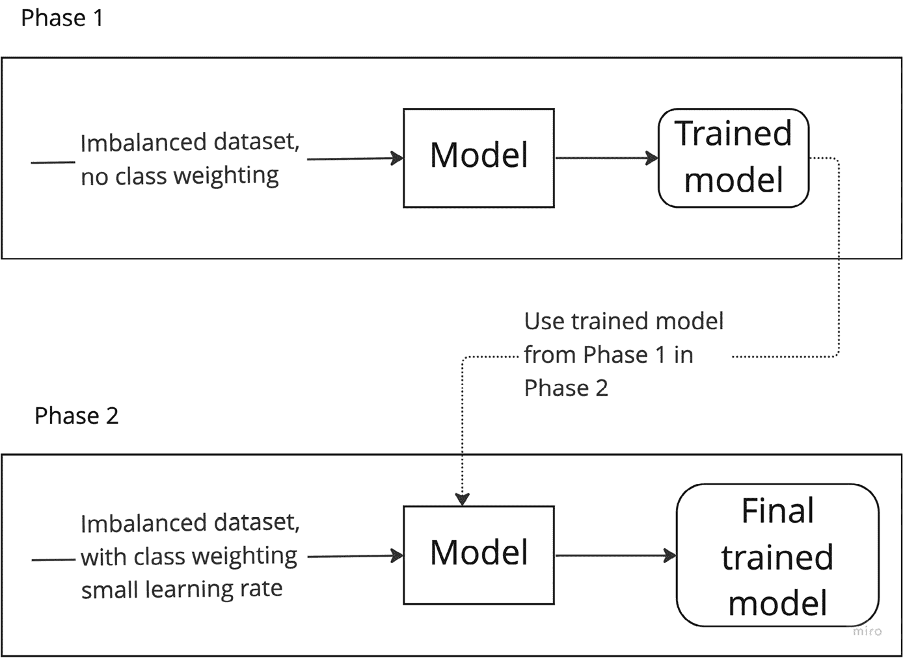

图 8.7 – 延迟重新加权技术

*图 8*.8 中的漫画展示了一位魔术师从一个帽子里变出一只大兔子，然后又变出一只小兔子，这描绘了两个阶段的过程：最初在不平衡数据集上训练，然后在第二阶段应用重新加权以实现更平衡的训练：


图 8.8 – 一幅描绘延迟重新加权核心思想的漫画

请参阅本书 GitHub 仓库中标题为`Deferred_reweighting_DRW.ipynb`的笔记本以获取更多详细信息。在应用延迟重新加权技术的两阶段训练部分之后，我们可以看到与使用交叉熵损失训练相比，我们最不平衡的类的准确率有所提高：

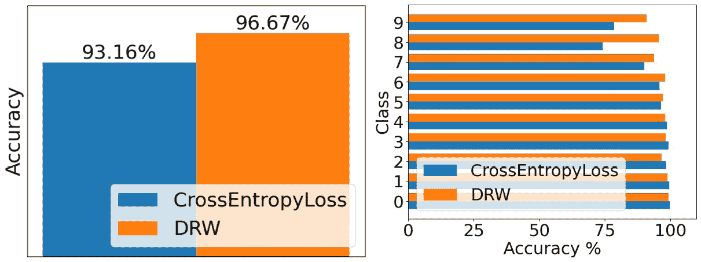

图 8.9 – 延迟重新加权与交叉熵损失的性能比较

接下来，我们将探讨在 PyTorch 标准损失函数无法完成我们想要的所有事情时如何定义自定义损失函数。

# 显式损失函数修改

在 PyTorch 中，我们可以通过从`nn.Module`类派生一个子类并重写`forward()`方法来定义自定义损失函数。损失函数的`forward()`方法接受预测输出和实际输出作为输入，随后返回计算出的损失值。

尽管类权重确实为多数类和少数类示例分配了不同的权重以实现平衡，但这通常是不够的，尤其是在极端类别不平衡的情况下。我们希望的是减少易于分类示例的损失。原因是这样的易于分类示例通常属于多数类，由于数量较多，它们主导了我们的训练损失。这就是焦点损失的主要思想，它允许对示例进行更细致的处理，无论它们属于哪个类别。我们将在本节中探讨这一点。

理解 PyTorch 中的 forward()方法

在 PyTorch 中，你将在神经网络层和损失函数中遇到 `forward()` 方法。这是因为神经网络层和损失函数都是从 `nn.Module` 派生出来的。虽然一开始可能看起来有些混乱，但理解上下文可以帮助阐明其作用：

**🟠** **在神经网络层**：

`forward()` 方法定义了输入数据在通过层时经历的转换。这可能涉及线性变换、激活函数等操作。

**🟢** **在损失函数中**：

`forward()` 方法计算预测输出和实际目标值之间的损失。这个损失作为衡量模型性能好坏的指标。

**🔑****关键要点**：

在 PyTorch 中，神经网络层和损失函数都继承自 `nn.Module`，提供了一个统一的接口。`forward()` 方法对两者都是核心的，作为层中数据转换和损失函数中损失计算的计算引擎。将 `forward()` 视为这两个过程的“引擎”。

## 焦点损失

我们迄今为止研究的技术假定由于代表性较弱，少数类需要更高的权重。然而，一些少数类可能得到了充分的代表，过度加权它们的样本可能会降低整体模型性能。因此，Facebook（现 Meta）的 Tsung-Yi 等人 [4] 引入了**焦点损失**，这是一种基于样本的加权技术，其中每个示例的权重由其难度决定，并通过模型对其造成的损失来衡量。

焦点损失技术源于密集目标检测任务，在这些任务中，某一类别的观察结果比另一类多得多：

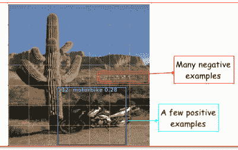

图 8.10 – 目标检测中的类别不平衡 – 多数类作为背景，少数类作为前景

焦点损失降低了易于分类的示例的权重，并专注于难以分类的示例。这意味着它会减少模型的过度自信；这种过度自信通常阻止模型很好地泛化。

焦点损失是交叉熵损失的扩展。它特别适用于多类分类，其中一些类别易于分类，而其他类别则难以分类。

让我们从我们熟知的二元分类的交叉熵损失开始。如果我们让 p 表示 y = 1 的预测概率，那么交叉熵损失可以定义为以下：

CrossEntropyLoss(p) = {− log(p) if y = 1  − log(1 − p) otherwise

这可以重写为 CrossEntropyLoss(p) = − log( p t)，其中 p t，真实类的概率，可以定义为以下：

p t = {p if y = 1  1 − p otherwise

在这里，p 是模型预测 y = 1 的概率。

这个损失函数的问题在于，在数据不平衡的情况下，这个损失函数主要由多数类的损失贡献所主导，而少数类的损失贡献非常小。这可以通过焦点损失来修复。

那么，什么是焦点损失？

FocalLoss( p t) = − α (1 − p t) γ log( p t)

这个公式看起来与交叉熵损失略有不同。有两个额外的项 – α 和 (1 − p t) γ。让我们尝试理解这些项的每个含义：

+   α：这个值可以设置为与正（少数）类样本的数量成反比，并用于使少数类样本比多数类样本更重。它也可以被视为一个可以调整的超参数。

+   (1 − p t) γ：这个项被称为**调制因子**。如果一个样本对模型来说太容易分类，这意味着 p t 非常高，整个调制因子值将接近零（假设 γ > 1），模型不会太关注这个样本。另一方面，如果一个样本很难分类 – 即 p t 低 – 那么调制因子值将很高，模型将更关注这个样本。

### 实现

下面是从头实现焦点损失的方法：

```py
class FocalLoss(torch.nn.Module):
    def __init__(self, gamma: float = 2, alpha =.98) -> None:
        super().__init__()
        self.gamma = gamma
        self.alpha = alpha
    def forward(self, pred: torch.Tensor, target: torch.Tensor):
        # pred is tensor with log probabilities
        nll_loss = torch.nn.NLLLoss(pred, target)
        p_t = torch.exp(-nll_loss)
        loss = (1 – p_t)**self.gamma * self.alpha * nll_loss
        return loss.mean()
```

尽管焦点损失技术在计算机视觉和目标检测领域有根源，但我们也可以在处理表格数据和文本数据时从中受益。一些最近的研究将焦点损失移植到经典的机器学习框架，如 XGBoost [5] 和 LightGBM [6]，以及使用基于 transformer 的模型的文本数据。

*图 8**.11* 中的漫画展示了一位弓箭手瞄准一个远处的目标，却忽略了附近的大目标，象征着焦点损失对具有挑战性的少数类样本的重视：


图 8.11 – 焦点损失的示意图

PyTorch 的`torchvision`库已经为我们实现了这个损失函数：

```py
torchvision.ops.sigmoid_focal_loss(\
    inputs: Tensor, targets: Tensor, alpha: float = 0.25,\
    gamma: float = 2, reduction: str = 'none')
```

对于所使用的模型和数据集，`alpha` 和 `gamma` 值可能难以调整。在 CIFAR10-LT（CIFAR10 数据集的长尾版本）上使用`alpha`值为`0.25`和`gamma`值为`2`，并且`reduction= 'mean'`似乎比常规的交叉熵损失表现更好，如以下图表所示。更多详情，请查看本书 GitHub 仓库中的`CIFAR10_LT_Focal_Loss.ipynb`笔记本：

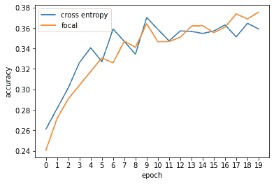

图 8.12 – 随着训练的进行，使用交叉熵损失与焦点损失（alpha=0.25，gamma=2）在 CIFAR10-LT 数据集上的模型准确度

在目标检测的 Pascal VOC 数据集 [7] 中，焦点损失有助于检测图像中的摩托车，而交叉熵损失则无法检测到它 (*图 8**.13*)：

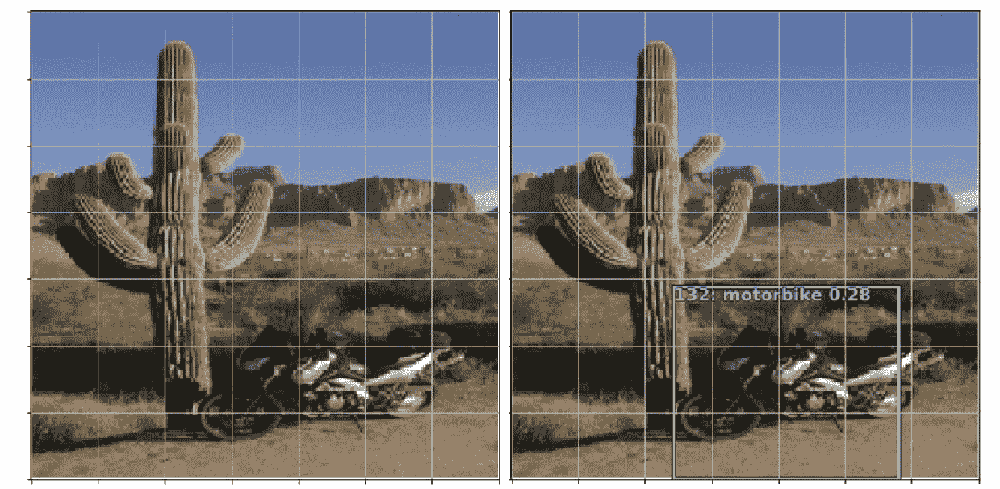

图 8.13 – 在 Pascal VOC 数据集中，交叉熵损失无法检测到摩托车（左），而焦点损失则可以检测到（右）。来源：fastai 库 GitHub 仓库 [8]

尽管焦点损失最初是为密集目标检测而设计的，但由于其能够为在少数类中常见的具有挑战性的示例分配更高的权重，因此在类别不平衡的任务中获得了关注。虽然这种样本在少数类中的比例较高，但由于其规模较大，在多数类中的绝对数量更高。因此，对所有类别的挑战性样本分配高权重仍然可能导致神经网络性能的偏差。这促使我们探索其他可以减少这种偏差的损失函数。

🚀 Meta 生产环境中的焦点损失

在 Meta（之前称为 Facebook）[9]中，需要检测有害内容，如仇恨言论和暴力。机器学习模型在包含有害和非有害内容的庞大文本和图像数据集上进行了训练。然而，由于有害内容的例子比非有害内容的例子少得多，系统在从有害内容示例中学习方面遇到了困难。这导致系统过度拟合非有害示例，在现实世界中检测有害内容的性能不佳。

为了解决这个问题，Meta 使用了焦点损失。正如我们所见，焦点损失是一种降低易于分类的示例权重的技术，以便系统专注于从难以分类的示例中学习。Meta 在其训练流程中实现了焦点损失，并在检测有害内容方面提高了其 AI 系统的性能，最高可达 10%。这是一个重大的改进，表明焦点损失是训练 AI 系统检测罕见或难以分类事件的有前途的技术。新的系统已在 Meta 的生产环境中部署，并有助于显著提高平台的安全性。

## 类别平衡损失

Cui 等人[10]的论文通过在损失函数中添加乘性系数(1 − β)^(1− βn)对交叉熵损失方程进行微小修改——也就是说，我们使用α = (1 − β)^(1− βn)的值，其中β是一个介于 0 和 1 之间的超参数，n 是某一类别的样本数量：

ClassBalancedCrossEntropyLoss(p) = −(1 − β)^(1− βn) log(p_t)

β = 0 表示完全不进行加权，而β → 1 表示通过类频率的倒数进行重新加权。因此，我们可以认为这是一种使特定类别的类别权重在 0 和(1/类别频率)之间可调的方法，这取决于超参数β的值，β是一个可调参数。

这个相同的项可以用作 alpha 值的替代。它可以与焦点损失一起使用：

ClassBalancedFocalLoss(p_t) = −(1 − β)^(1− βn) (1 − p_t)^γ log(p_t)

根据 Cui 等人的研究，建议的 beta 值设置为(N-1)/N，其中 N 是训练示例的总数。

*图 8.14* 中的漫画展示了这种损失的核心思想。它展示了一个使用带有两端标有“beta”重量的杆来保持平衡的走钢丝者，这代表着调整类别权重以解决类别不平衡：

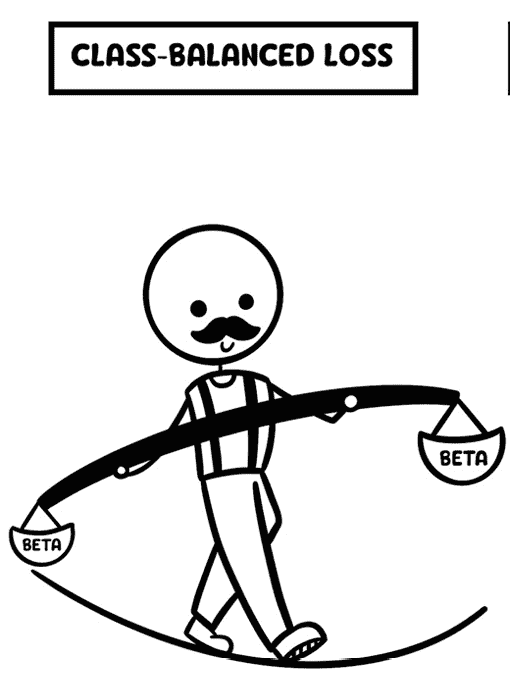

图 8.14 – 类平衡损失的示意图

### 实现

让我们看看实现类平衡损失的代码：

```py
class ClassBalancedCrossEntropyLoss(torch.nn.Module):
    def __init__(self, samples_per_cls, no_of_classes, beta=0.9999):
        super().__init__()
        self.beta = beta
        self.samples_per_cls = samples_per_cls
        self.no_of_classes = no_of_classes
    def forward(self, model_log_probs: torch.Tensor, \
                labels: torch.Tensor):
        effective_num = 1.0-np.power(self.beta,self.samples_per_cls)
        weights = (1.0 - beta)/np.array(effective_num)
        weights = weights/np.sum(weights) * self.no_of_classes
        weights = torch.tensor(weights).float()
        loss = torch.nn.NLLLoss(weights)
        cb_loss = loss(model_log_probs, labels)
        return cb_loss
```

在`forward()`函数中，`effective_num`有效地计算了一个向量（1-βn），其中`n`是一个包含每个类样本数量的向量。因此，`weights`向量是(1 − β) _ (1− βn)。使用这些权重，我们通过使用`NLLLoss`在模型的输出和相应的标签之间计算损失。*表 8.1*显示了当模型使用类平衡交叉熵损失训练 20 个 epoch 时的类准确率。在这里，我们可以看到最不平衡的类别 9、8、7、6 和 5 的准确率有所提高：

| **类别** | **交叉熵损失** | **类平衡损失** |
| --- | --- | --- |
| 0 | 99.9 | 99.0 |
| 1 | 99.6 | 99.0 |
| 2 | 98.1 | 97.3 |
| 3 | 96.8 | 94.7 |
| 4 | 97.7 | 97.5 |
| 5 | 94.2 | 97.4 |
| 6 | 92.8 | 98.3 |
| 7 | 81.2 | 94.3 |
| 8 | 63.6 | 93.8 |
| 9 | 49.1 | 91.4 |

表 8.1 – 使用交叉熵损失（左）和类平衡交叉熵损失（右）的类准确率

*图 8.15* 比较了类平衡损失和交叉熵损失的性能：


图 8.15 – 使用类平衡损失与基线模型相比的总体准确率与类准确率

🚀 苹果公司生产中的类平衡损失

苹果公司的可访问性团队旨在确保所有人都能使用，通过解决许多应用中缺乏适当的可访问性信息。他们通过屏幕识别等特性使这些应用对残疾人可用。研究人员旨在根据移动应用的视觉界面自动生成可访问性元数据[11]，由于 UI 元素的多样性，这个问题存在显著的类别不平衡。从应用截图中识别出 UI 元素，如文本、图标和滑块。文本元素高度表示，有 741,285 个注释，而滑块表示最少，有 1,808 个注释。

数据集由来自 4,068 个 iPhone 应用的 77,637 个屏幕组成，包含各种 UI 元素，导致数据集高度不平衡，尤其是考虑到 UI 元素的层次性质。

为了有效地处理类别不平衡，采用了类平衡损失函数和数据增强。这使得模型能够更多地关注代表性不足的 UI 类别，从而提高了整体性能。该模型被设计成健壮且快速，能够实现设备上的部署。这确保了实时生成可访问性功能，提高了屏幕阅读器用户的用户体验。

现代卷积神经网络分类器倾向于在不平衡数据集中过拟合少数类。如果我们能防止这种情况发生会怎样？**类依赖温度**（**CDT**）损失函数旨在做到这一点。

## 类依赖温度损失

在处理不平衡数据集时，传统的解释认为，模型在少数类上的表现不如多数类，这源于其倾向于最小化平均实例损失。这使模型偏向于预测多数类。为了对抗这一点，已经提出了重采样和重新加权策略。

然而，Ye 等人[12]引入了**类依赖温度**（**CDT**）损失，提出了一个新颖的视角。他们的研究表明，卷积神经网络倾向于过拟合少数类示例，正如少数类与多数类相比，训练集和测试集之间的特征偏差更大所证明的那样。当模型过度学习特征值的训练数据分布时，就会发生特征偏差，随后无法推广到新数据。使用 CDT 损失，模型的训练示例决策值被除以一个“温度”因子，该因子取决于每个类的频率。这种除法使训练更适应特征偏差，并有助于在常见和稀缺类别之间进行有效学习。

*图 8.16* 展示了 CDT 损失如何根据类频率调整类权重，使用杂技演员骑独轮车处理标有不同类名的物品的视觉类比：

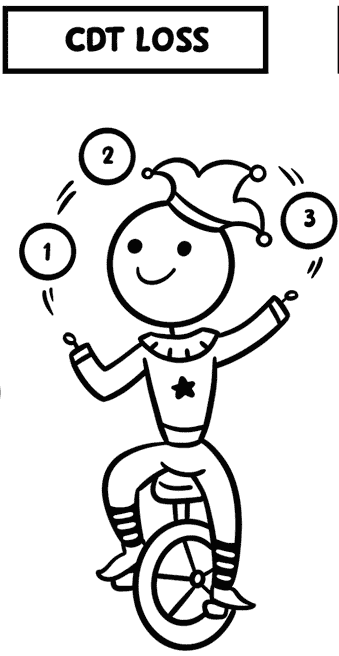

图 8.16 – 独轮车手抛接物品，根据频率调整类权重

以下类实现了这个损失函数：

```py
class CDT(torch.nn.Module):
    def __init__(self, num_class_list, gamma=0.36):
        super(CDT, self).__init__()
        self.gamma = gamma
        self.num_class_list = num_class_list
        self.cdt_weight = torch.FloatTensor(
            [
            (max(self.num_class_list)/i) ** self.gamma\
            for i in self.num_class_list
            ]
        ).to(device)
    def forward(self, inputs, targets):
        inputs = inputs/self.cdt_weight
        loss=torch.nn.functional.nll_loss(inputs,targets)
        return loss
```

这里是对 `CDT` 类的解释：

+   `self.num_class_list` 存储每个类中的示例数量。

+   `self.cdt_weight = torch.FloatTensor([...]).to(device)` 计算每个类的类依赖温度权重。对于每个类，权重计算为 `(max(num_class_list) / num_class_list[i]) **gamma`。

    类中示例的数量越多，其在 `self.cdt_weight` 列表中的值就越小。多数类示例具有较低的值，而少数类示例具有较高的值。

+   `inputs = inputs /self.cdt_weight` 通过类依赖温度权重对模型的输入（作为输入）进行缩放。这增加了少数类示例的负对数概率的绝对值，使它们在损失计算中比多数类示例更重要。这旨在使模型更多地关注少数类示例。

    在 *图 8.17* 中，我们绘制了 CDT 损失和交叉熵损失的整体准确率（左）以及各个类的准确率（右）：

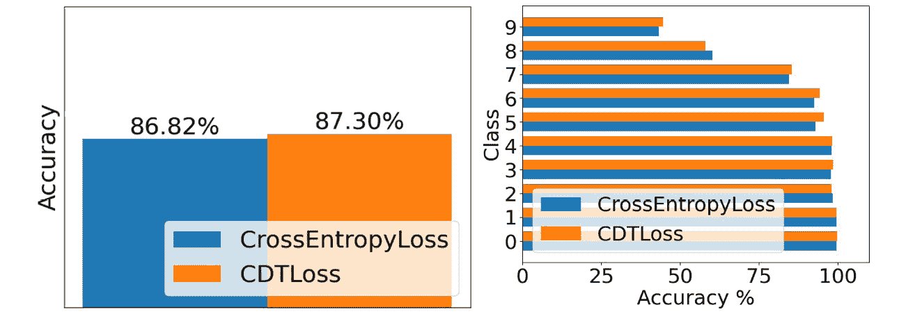

图 8.17 – 交叉熵损失和 CDT 损失的性能比较

如我们所见，一些类别（如 9、7、6、5 和 3）的准确率有所提高，但其他一些类别的性能有所下降。它似乎在我们使用的不平衡 MNIST 数据集上给出了温和的性能，但它可能对其他数据集有潜在的帮助。

如果我们能够在训练过程中根据模型对类别难度的估计动态调整类别的权重会怎样？我们可以通过预测示例类别的准确率来衡量类别难度，然后使用这个难度来计算该类别的权重。

## 类别难度平衡损失

Sinha 等人 [13] 的论文提出，类别 c 在训练时间 t 后的权重应直接与类别的难度成正比。类别的准确率越低，其难度越高。

从数学上讲，这可以表示如下：

w c, t = ( d c, t) τ

在这里，w c, t 是训练时间 t 后类别 c 的权重，d c, t 是类别难度，其定义如下：

d c, t = (1 − Accuracy c, t)

在这里，Accuracy c, t 是训练时间 t 后类别 c 在验证数据集上的准确率，τ 是一个超参数。

这里的问题是，我们希望在训练过程中动态增加模型准确率较低的类别的权重。我们可以每轮或每几轮训练后这样做，并将更新的权重输入到交叉熵损失中。请参阅本书 GitHub 仓库中标题为 `Class_wise_difficulty_balanced_loss.ipynb` 的相应笔记本，以获取完整的训练循环：

```py
class ClassDifficultyBalancedLoss(torch.nn.Module):
    def __init__(self, class_difficulty, tau=1.5):
        super().__init__()
        self.class_difficulty = class_difficulty
        self.weights = self.class_difficulty ** float(tau)
        self.weights = self.weights / (
            self.weights.sum() * len(self.weights))
        self.loss = torch.nn.NLLLoss(
            weight= torch.FloatTensor(self.weights))
    def forward(self, input: torch.Tensor, target: torch.Tensor):
        return self.loss(input, target)
```

*图 8**.18* 使用一个飞人在蹦床上跳跃的漫画来阐述难度平衡损失的概念。每次跳跃都标有准确率分数，突出了低准确率类别如何随着飞人每次跳跃得更高而增加权重：

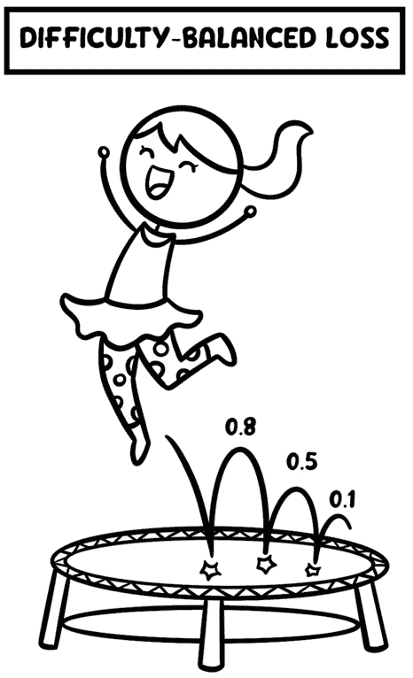

图 8.18 – 难度平衡损失的示意图 – 飞人跳跃显示了低准确率类别的权重增加

*图 8**.19* 展示了与交叉熵损失作为基线相比，类别难度平衡损失的性能：


图 8.19 – 使用类别难度平衡损失和交叉熵损失训练的模型性能比较

在这里，我们可以看到几个类别的性能有所提高，包括最不平衡的类别（9）从 40% 上升到 63.5% 的最大跳跃。

接下来，我们将探讨一些其他基于算法的技术，这些技术仍然可以帮助我们处理不平衡数据集。

# 讨论其他基于算法的技术

在本节中，我们将探讨一些我们之前尚未涉及的算法级技术。有趣的是，这些方法——从减轻过拟合的正则化技术到擅长单样本和少样本学习的 Siamese 网络，再到更深的神经网络架构和阈值调整——还具有有益的副作用：它们有时可以减轻类别不平衡的影响。

## 正则化技术

S. Alshammari 等人[14]的论文发现，如 L2-正则化和 MaxNorm 约束等知名的正则化技术在长尾识别中非常有帮助。该论文建议只在分类（例如 sigmoid 或 softmax）的最后一层进行这些操作。以下是他们的发现：

+   **L2-正则化**（也称为权重衰减）通常可以控制权重，并通过防止模型过拟合来帮助模型更好地泛化。

+   `tf.keras.constraints.MaxNorm`，而 PyTorch 有`torch.clamp`来帮助实现这一点。

## Siamese 网络

在类似的研究中，先前的研究发现**Siamese 网络**对类别不平衡的负面影响非常稳健。Siamese 网络在单样本学习（在训练数据中每个类只有一个示例时对新的数据进行分类）和少样本学习（在训练数据中每个类只有少数示例时对新的数据进行分类）领域非常有用。Siamese 网络使用对比损失函数，该函数接受成对的输入图像，然后计算相似性度量（欧几里得距离、曼哈顿距离或余弦距离）以确定它们有多相似或不相似。这可以用来计算训练数据中每个独特图像类别的嵌入表示。这种技术的最好之处在于，它提供了一种学习每个类别特征表示的方法。Siamese 网络在视觉问题（例如，两个图像是否为同一个人）以及 NLP 问题（例如，在 Stack Overflow、Quora、Google 等平台上，确定两个问题/查询是否相似）等领域的实际应用中找到了广泛的应用。

*图 8**.20* 展示了一个 Siamese 网络，其中两个输入被输入到模型中以获取它们的嵌入表示，然后使用距离度量来比较它们的相似性：

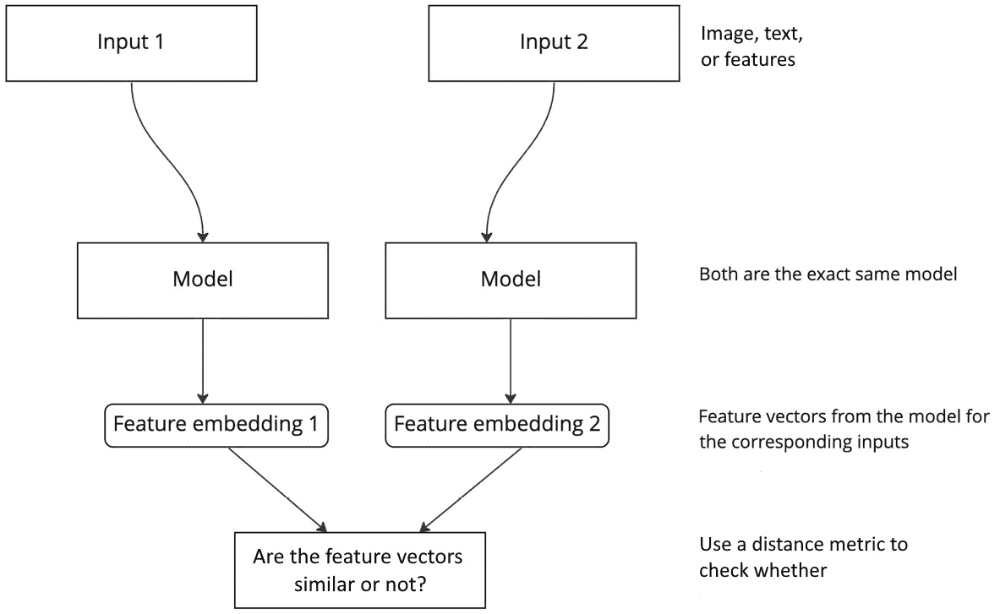

图 8.20 – Siamese 网络模型的高级工作原理

## 深度神经网络

Ding 等人 2017 年的研究[15]发现，对于不平衡数据集来说，深度神经网络（超过 10 层）更有帮助，原因有两个：

+   收敛速度更快

+   更好的整体性能

这归因于深度网络在捕捉数据复杂性方面具有指数级的效率。尽管他们的实验是针对面部动作识别任务，但这可能有助于在其他类型的数据和领域尝试更深的网络。

然而，更长的训练时间、增加的硬件成本和增加的复杂性在工业环境中可能并不总是值得麻烦。

## 阈值调整

正如我们在*第五章*中讨论的，*成本敏感学习*，阈值调整是一种成本敏感的元学习技术。阈值调整同样适用于深度学习模型，并且确保分类的阈值得到适当的调整和微调至关重要，尤其是在训练数据分布发生变化（例如，过采样或欠采样）或者甚至当使用类权重或新的损失函数时。

# 摘要

在本章中，我们探讨了各种损失函数作为解决类别不平衡的补救措施。我们从类别加权技术和延迟重新加权开始，这两个技术都是为了惩罚对少数类样本的错误。随着我们的进展，我们遇到了焦点损失，我们从以类别为中心的加权转向以样本为中心的加权，关注样本的难度。尽管它有其优点，但我们了解到焦点损失在分配所有类别的挑战性样本权重时，仍然可能对多数类有偏见。随后对类别平衡损失、CDT 损失和类别难度平衡损失的讨论提供了，每个都引入了独特的策略来动态调整权重或调节模型在简单样本和挑战性样本之间的关注点，旨在提高不平衡数据集上的性能。

总结来说，算法级技术通常以某种方式修改模型使用的损失函数，以适应数据集中的不平衡。它们通常不会增加训练时间和成本，与数据级技术不同。它们非常适合数据量大的问题或领域，或者收集更多数据困难或昂贵的情况。

即使这些技术提高了少数类的性能，但有时多数类可能会因此受到影响。在下一章中，我们将探讨一些混合技术，这些技术可以结合数据级和算法级技术，以便我们可以兼得两者之长。

# 问题

1.  平均假错误和平均平方假错误：

    王等人[16]提出，在高数据不平衡的情况下，由于大量占主导地位的负样本，常规损失函数无法很好地捕捉少数类别的错误。因此，他们提出了一种新的损失函数，其主要思想是将训练错误分为四种不同的错误：

    +   假阳性错误（FPE）= (1/负样本数量) * (负样本中的错误)

    +   假阴性错误（FNE）= (正样本数量/1) * (正样本错误)

    +   平均错误（MFE）= FPE + FNE

    +   均方误差（MSFE）= FPE² + FNE²

    此处的错误可以使用常用的交叉熵损失或任何其他用于分类的损失来计算。为不平衡的 MNIST 和 CIFAR10-LT 数据集实现 MFE 和 MSFE 损失函数，并查看模型性能是否优于交叉熵损失的基线。

1.  在本章中，在实现 CDT 损失函数时，将不平衡的 MNIST 数据集替换为 CIFAR10-LT（CIFAR-10 的长尾版本）。检查您是否仍然能够超过基线实现改进性能。您可能需要调整 gamma 值或执行原始论文[12]中提到的其他技巧之一，以在基线之上获得改进。

1.  Tversky 损失函数在 Salehi 等人发表的论文[17]中提出。请阅读这篇论文以了解 Tversky 损失函数及其实现细节。最后，在一个不平衡的 MNIST 数据集上实现 Tversky 损失，并比较其与基线模型的表现。

1.  在本章中，我们使用了类权重技术和交叉熵损失与 `trec` 数据集。将交叉熵损失替换为焦点损失，并查看模型性能是否有所提高。

# 参考文献

1.  *DALL·E 2 预训练缓解措施*，2022，[`openai.com/research/dall-e-2-pre-training-mitigations`](https://openai.com/research/dall-e-2-pre-training-mitigations).

1.  *BERT Does Business：在 Wayfair 实施 BERT 模型进行自然语言处理*，2019，[`www.aboutwayfair.com/tech-innovation/bert-does-business-implementing-the-bert-model-for-natural-language-processing-at-wayfair`](https://www.aboutwayfair.com/tech-innovation/bert-does-business-implementing-the-bert-model-for-natural-language-processing-at-wayfair).

1.  K. Cao, C. Wei, A. Gaidon, N. Arechiga, 和 T. Ma，*通过标签分布感知边缘损失学习不平衡数据集*，[在线]。可在[`proceedings.neurips.cc/paper/2019/file/621461af90cadfdaf0e8d4cc25129f91-Paper.pdf`](https://proceedings.neurips.cc/paper/2019/file/621461af90cadfdaf0e8d4cc25129f91-Paper.pdf)获取。

1.  T.-Y. Lin, P. Goyal, R. Girshick, K. He, 和 P. Dollár，*密集目标检测的焦点损失*。arXiv，2018 年 2 月 7 日，[`arxiv.org/abs/1708.02002`](http://arxiv.org/abs/1708.02002)。

1.  Wang 等人，*Imbalance-XGBoost：利用加权损失和焦点损失进行 XGBoost 的二进制标签不平衡分类*，[`arxiv.org/pdf/1908.01672.pdf`](https://arxiv.org/pdf/1908.01672.pdf)。

1.  *LightGBM 的焦点损失实现*，[`maxhalford.github.io/blog/lightgbm-focal-loss`](https://maxhalford.github.io/blog/lightgbm-focal-loss)。

1.  *PASCAL VOC* *项目*，[`host.robots.ox.ac.uk/pascal/VOC/`](http://host.robots.ox.ac.uk/pascal/VOC/).

1.  *fastai 库*，2018 年，[`github.com/fastai/fastai1/blob/master/courses/dl2/pascal-multi.ipynb`](https://github.com/fastai/fastai1/blob/master/courses/dl2/pascal-multi.ipynb)。

1.  *社区标准报告*，2019 年，[`ai.meta.com/blog/community-standards-report/`](https://ai.meta.com/blog/community-standards-report/)。

1.  Y. Cui, M. Jia, T.-Y. Lin, Y. Song, 和 S. Belongie，*基于有效样本数量的类别平衡损失*，第 10 页。

1.  X. Zhang 等人，*屏幕识别：从像素创建移动应用程序的可访问元数据*，载于 2021 年 CHI 会议关于人机交互系统中的因素论文集，日本横滨：ACM，2021 年 5 月，第 1–15 页。doi: 10.1145/3411764.3445186。博客：[`machinelearning.apple.com/research/mobile-applications-accessible`](https://machinelearning.apple.com/research/mobile-applications-accessible)。

1.  H.-J. Ye, H.-Y. Chen, D.-C. Zhan, 和 W.-L. Chao, *在不平衡深度学习中识别和补偿特征偏差*。arXiv，2022 年 7 月 10 日。访问时间：2022 年 12 月 14 日。[在线]。可在[`arxiv.org/abs/2001.01385`](http://arxiv.org/abs/2001.01385)获取。

1.  S. Sinha, H. Ohashi, 和 K. Nakamura，*用于解决类别不平衡的类别难度平衡损失*。arXiv，2020 年 10 月 5 日。访问时间：2022 年 12 月 17 日。[在线]。可在[`arxiv.org/abs/2010.01824`](http://arxiv.org/abs/2010.01824)获取。

1.  S. Alshammari, Y.-X. Wang, D. Ramanan, 和 S. Kong，*通过权重平衡进行长尾识别*，载于 2022 年 IEEE/CVF 计算机视觉和模式识别会议（CVPR），美国路易斯安那州新奥尔良，2022 年 6 月，第 6887–6897 页。Doi: 10.1109/CVPR52688.2022.00677。

1.  W. Ding, D.-Y. Huang, Z. Chen, X. Yu, 和 W. Lin，*使用非常深的网络进行高度不平衡类别分布的人脸动作识别*，载于 2017 年亚太信号与信息处理协会年会和会议（APSIPA ASC），吉隆坡，2017 年 12 月，第 1368–1372 页。doi: 10.1109/APSIPA.2017.8282246。

1.  S. Wang, W. Liu, J. Wu, L. Cao, Q. Meng, 和 P. J. Kennedy，*在不平衡数据集上训练深度神经网络*，载于 2016 年国际神经网络联合会议（IJCNN），加拿大不列颠哥伦比亚省温哥华，2016 年 7 月，第 4368–4374 页。doi: 10.1109/IJCNN.2016.7727770。

1.  S. S. M. Salehi, D. Erdogmus, 和 A. Gholipour，*使用 3D 全卷积深度网络进行图像分割的 Tversky 损失函数*。arXiv，2017 年 6 月 18 日。访问时间：2022 年 12 月 23 日。[在线]。可在[`arxiv.org/abs/1706.05721`](http://arxiv.org/abs/1706.05721)获取。
