# 第三章：软件系统中的数据——文本、图像、代码及其标注

**机器学习**（**ML**）系统是数据需求大的应用，它们喜欢数据在训练和推理前已经准备妥当。尽管这听起来可能很显然，但比选择一个处理数据的算法更重要的是仔细审查数据的属性。然而，数据可以以许多不同的格式出现，并来自不同的来源。我们可以考虑数据以原始格式——例如，文本文档或图像文件。我们还可以考虑数据以特定于当前任务的手动格式——例如，分词文本（其中单词被分成标记）或带有边界框的图像（其中对象被识别并包含在矩形内）。

当考虑最终用户系统时，我们可以用数据做什么以及我们如何处理数据变得至关重要。然而，识别数据中的重要元素并将其转换为对机器学习算法有用的格式取决于我们的任务和使用的算法。因此，在本章中，我们将同时处理数据和算法来处理它。

在本章中，我们将介绍三种数据类型——图像、文本和格式化文本（程序源代码）。我们将探讨每种类型的数据如何在机器学习中使用，它们应该如何标注，以及用于什么目的。

介绍这三种类型的数据为我们提供了探索这些数据源不同标注方式的可能性。因此，在本章中，我们将重点关注以下内容：

+   原始数据和特征——它们之间有什么区别？

+   每种数据都有其用途——标注和任务

+   不同类型的数据可以一起使用的地方——多模态数据模型展望

# 原始数据和特征——它们之间有什么区别？

机器学习（ML）系统对数据的需求很大。它们依赖于数据进行训练和推理。然而，并非所有数据都同等重要。在深度学习（**DL**）时代之前，数据需要经过处理才能用于机器学习。在深度学习之前，算法在可用于训练的数据量方面受到限制。存储和内存限制也有限，因此，机器学习工程师必须为深度学习准备更多的数据。例如，机器学习工程师需要花费更多精力来找到一个既小又具有代表性的数据样本用于训练。深度学习引入后，机器学习模型可以在更大的数据集中找到复杂的模式。因此，机器学习工程师的工作现在集中在寻找足够大且具有代表性的数据集。

经典机器学习系统——即非深度学习系统——需要表格形式的数据来进行推理，因此为这类系统设计正确的特征提取机制非常重要。

另一方面，深度学习系统需要最少的数据处理，并且可以从数据（几乎）原始格式中学习模式。由于深度学习系统需要为不同任务获取一些关于数据的不同信息，因此需要最少的数据处理；它们还可以自行从原始数据中提取信息。例如，它们可以捕捉文本的上下文，而无需手动处理。*图 3.1*展示了基于可以执行的任务的不同类型数据之间的这些差异。在这种情况下，数据以图像的形式存在：

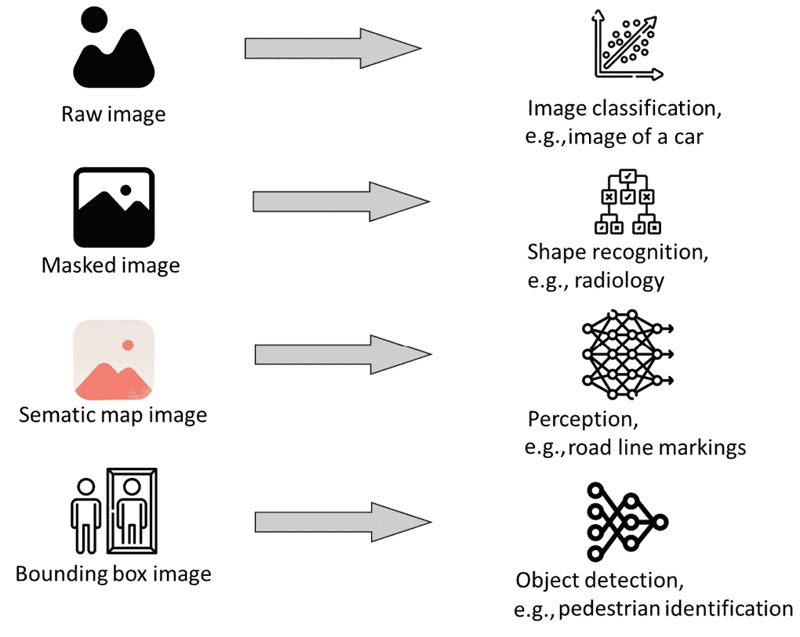

图 3.1 – 学习系统的类型及其对图像所需的数据

原始图像通常用于进一步处理，但它们也可以用于图像分类等任务。图像分类的任务与算法的输入是原始图像，输出是图像类别相关。当我们谈论包含“猫”、“狗”或“汽车”等内容的图像时，我们经常看到这类任务。

这个任务有许多实际应用。一个应用是在保险领域。几家保险公司已经改变了他们的商业模式并将业务数字化。在 2010 年代中期之前，保险公司需要首先到车间进行一次访问以对汽车损坏进行初步评估。今天，这种初步的损坏评估是通过图像分类算法自动完成的。我们用智能手机拍摄损坏的部分并发送给保险公司的软件，在那里使用训练好的机器学习算法进行评估。在罕见且困难的情况下，图像需要由人工操作员仔细检查。这种工作流程节省了金钱和时间，并为处理索赔提供了更好的体验。

另一个应用是医学图像分类，其中放射学图像被自动分类以提供初步诊断，从而减轻医学专家（在这种情况下，是放射科医生）的负担。

遮罩图像通过使用过滤器来强调感兴趣的部分进行处理。最常见的是黑白过滤器或灰度过滤器。它们强调图像中明暗部分之间的差异，以便更容易地识别形状，然后对这些形状进行分类并追踪它们（在视频流的情况下）。这类应用通常用于感知系统——例如，在汽车中。

使用掩码图像的感知系统的一个实际应用是识别水平道路标记，如车道标记。车辆的摄像头拍摄汽车前方的道路图像，然后其软件对图像进行掩码处理，并将其发送到机器学习算法进行检测和分类。**OpenCV**是用于此类任务的一个库。其他实际应用包括人脸识别或**光学字符识别**（**OCR**）。

语义地图图像包括描述图像中可见内容的叠加，覆盖包含特定信息（如天空、汽车、人或建筑物）的部分图像。语义地图可以覆盖包含汽车、汽车所在的路面、周围环境和天空的图像部分。语义地图提供了关于图像的丰富信息，这些信息用于高级视觉感知算法，反过来，这些算法为决策算法提供信息。在自动驾驶汽车系统中，视觉感知尤其重要。

语义地图的一个应用领域是车辆主动安全系统。前摄像头捕捉到的图像通过**卷积神经网络**（**CNNs**）进行处理，添加语义地图，然后用于决策算法。这些决策算法要么向驾驶员提供反馈，要么自主采取行动。我们可以看到，当一辆车对另一辆车行驶过近或在其路径上检测到障碍物时，通常会有反应。

语义地图的其他应用包括医学图像分析，其中机器学习算法为医学专家提供有关图像内容的输入。一个例子是使用**深度****CNNs**（**DCNNs**）进行脑肿瘤分割。

最后，边界框图像包含有关图像中物体边界的信息。对于感兴趣的每个形状，如汽车、行人或肿瘤，都有一个围绕该图像部分的边界框，并标注该形状的类别。这类图像用于检测物体并将该信息提供给其他算法。

我们使用这类图像的一个应用是机器人协调系统中的物体识别。机器人的摄像头捕捉到一个图像，CNN 识别出物体，然后机器人的决策软件追踪该物体以避免碰撞。追踪每个物体用于改变自主机器人的行为，以降低碰撞和损坏的风险，以及优化机器人和其环境操作。

因此，本章的第一条最佳实践。

最佳实践 #14

设计整个软件系统应基于您需要解决的问题，而不仅仅是机器学习模型。

由于我们使用的每种算法都需要对图像进行不同的处理并提供不同类型的信息，因此我们需要了解如何围绕它创建整个系统。在前一章中，我们讨论了管道，它只包括机器学习数据管道，但一个软件系统需要更多。对于关键功能，我们需要设计安全笼和信号来降低机器学习模型错误分类/检测的风险。因此，我们需要了解我们想要做什么——信息是否仅用于做出简单决策（例如，汽车上的损坏保险杠与未损坏的情况）或者分类是否是复杂行为决策的一部分（例如，机器人应该向右转以避开障碍物，还是应该减速以让另一个机器人通过？）。

图像是我们用于机器学习的一种数据类型；另一种是文本。近年来，随着**循环神经网络**（**RNNs**）和转换器的引入，文本的使用变得流行。这些神经网络架构是深度学习网络，能够捕捉到词语的上下文（以及由此扩展的基本语义）。这些模型在标记（因此，词语）之间发现统计联系，因此可以识别出经典机器学习模型无法识别的相似性。机器翻译是这些模型最初的一个流行应用，但现在，应用范围比这更广——例如，在理解编程语言方面。*图 3.2*展示了可以与不同类型的模型一起使用的文本数据类型：

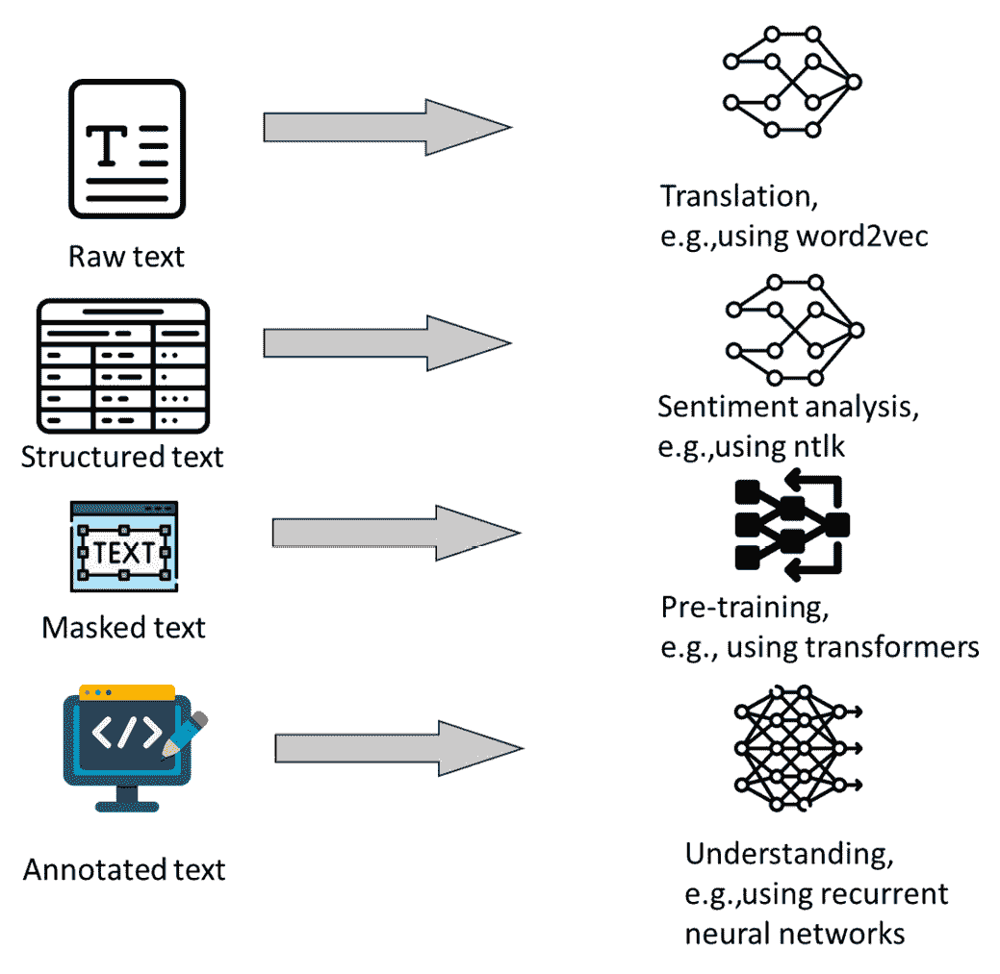

图 3.2 – 学习系统的类型及其对文本数据的需求

原始文本数据目前用于训练`word2vec`模型，该模型将文本标记转换为数字向量——嵌入——这些向量是该标记与词汇表中其他标记的距离。我们在*第二章*中看到了一个例子，其中我们计算了句子中的单词数量。通过使用这项技术，`word2vec`模型捕捉到标记的上下文，也称为它们的相似性。这种相似性可以扩展到整个句子或段落，这取决于模型的大小和深度。

原始文本的另一个应用，尽管是以结构化格式，是在**情感分析**（**SA**）中。我们使用文本数据的表格格式来分析文本的情感是积极、消极还是中性。该任务的扩展是理解文本的意图——它是否是解释、查询还是描述。

掩码文本数据指的是在一系列标记中掩码一个或多个标记，并训练模型来预测该标记。这是一个自监督训练的例子，因为模型是在未标注的数据上训练的，但通过以不同的方式（例如，随机、基于相似性、人工标注）掩码标记，模型可以理解哪些标记可以在特定上下文中使用。模型越大——即 transformer——需要的数据就越多，并且需要更复杂的训练过程。

最后，标注文本指的是当我们用特定的类别标记文本片段，就像图像一样。这种标注的一个例子是情感。然后，模型捕捉数据中的模式，因此可以重复这些模式。这个领域的一个任务示例是情感识别，其中模型被训练来识别文本的语气是积极还是消极。

文本数据的一个特殊情况是编程语言源代码。在过去的几年里，使用 ML 模型进行编程语言任务变得越来越流行，因为它提供了提高软件开发速度和质量的可能。*图 3.3*展示了编程语言数据类型和典型任务：

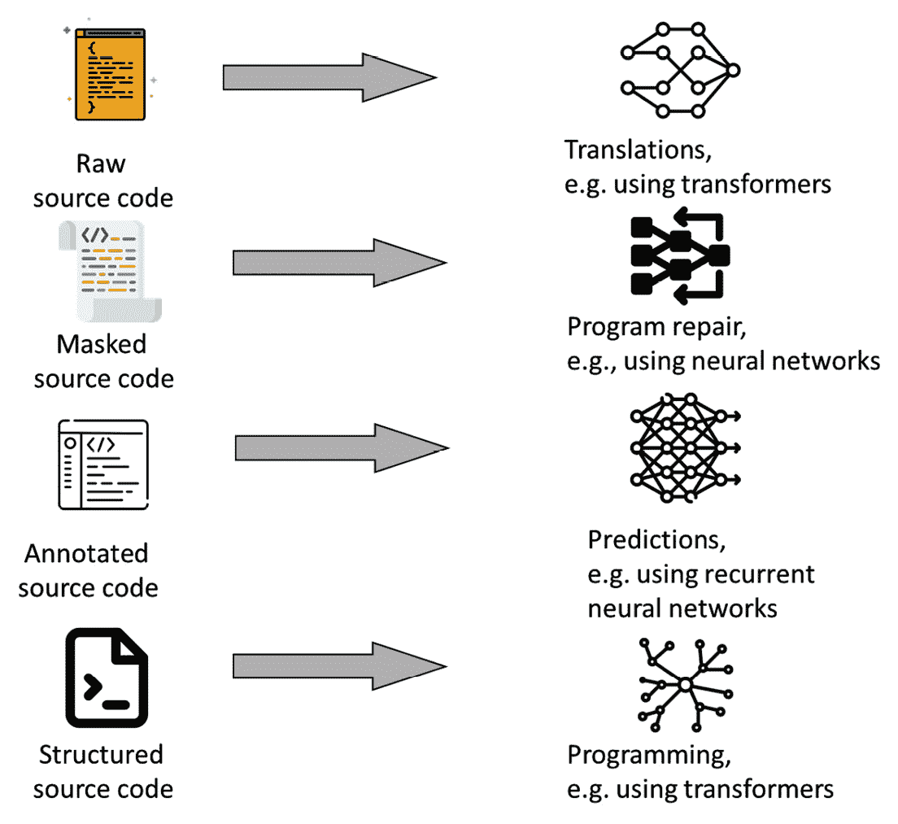

图 3.3 – 编程语言数据类型和典型任务

原始源代码数据用于与编程语言理解相关的任务——例如，使用 TransCoder 模型在不同编程语言之间的翻译。这项任务类似于自然语言之间的翻译，尽管它增加了额外的步骤来使程序编译并通过测试用例。

掩码编程语言代码通常用于训练旨在修复缺陷的模型——模型是在一组纠正缺陷的程序上训练的，然后应用于有缺陷的程序。掩码程序用于训练能够识别问题并提供修复方案的模型。在撰写本书时，这些任务相当实验性，但结果非常令人鼓舞。

标注源代码用于各种任务。这些任务包括缺陷预测、代码审查以及识别设计模式或公司特定的设计规则。与静态代码分析工具等其他技术相比，ML 模型在这些任务上提供了更好的结果——例如，与静态代码分析工具相比。

源代码用于训练用于高级软件工程任务的模型，例如创建程序。GitHub Copilot 就是这样一种工具，它在研究和商业应用中都取得了巨大的成功。

现在，上述三种类型的数据仅展示了 ML 应用的一小部分。对于那些想要利用 ML 模型设计软件系统的人来说，天空才是极限。然而，在设计系统之前，我们需要更详细地了解我们如何与数据打交道。

## 图像

原始图像数据通常存储在包含在其他文件中的注释的文件中。原始图像数据呈现与所讨论系统相关的方面。用于训练主动安全算法的数据示例在*图 3.4*中展示：


图 3.4 – 车辆的前置摄像头图像

在这个例子中，使用带有汽车的图像来训练 CNN 以识别是否安全驾驶（例如，前方道路是否无障碍）。当在图像级别上标注数据时——即没有蒙版和边界框——机器学习模型可以分类整个图像或识别对象。在识别对象时，模型会将边界框信息添加到图像中。

为了训练一个用于包含许多显著大小对象的图像（例如 1920 x 1080 像素的高清分辨率）的 CNN，我们需要大量的数据集和计算资源。这有几个原因。

首先，颜色需要大量数据才能正确识别。尽管我们人类将红色视为几乎均匀，但实际上该颜色的像素强度变化很大，这意味着我们需要创建一个 CNN，使其能够理解不同深度的红色有时对于识别制动车辆很重要。

其次，图像的大尺寸包含了不相关的细节。*图 3.5*展示了 CNN 的设计方式。这是一个 LeNet 风格的 CNN：

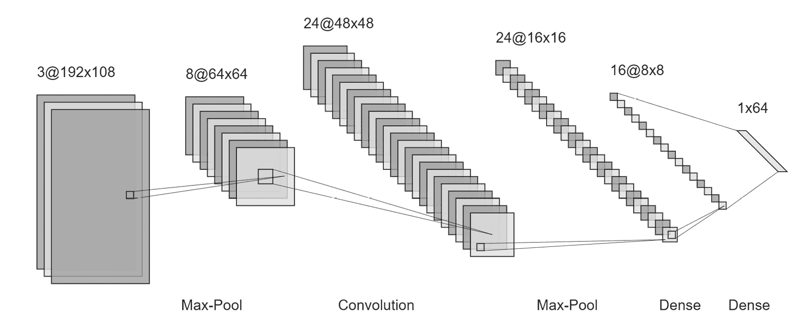

图 3.5 – CNN 的概念设计

*图 3.5*显示 NN 以 192 x 108 像素大小的图像（比高清图像小 10 倍）作为输入。然后它使用`MaxPool`层（例如）来减少元素数量，然后使用卷积来识别形状。最后，它使用两个密集层将图像分类为 64 个不同类别的向量。图像的大小决定了网络的复杂性。图像越大，所需的卷积就越多，第一层也越大。更大的网络需要更多的时间来训练（差异可能以天计）并且需要更多的数据（差异可能以成千上万张图像计，取决于类别的数量和图像的质量）。

因此，对于许多应用，我们使用灰度图像并将它们显著缩小。*图 3.6*显示了之前相同的图像，但以灰度显示，缩小到 192 x 108 像素。图像的大小已经显著减小，因此对第一卷积层的要求也减少了：


图 3.6 – 黑白转换图像（故意展示的低质量有损转换）

然而，图像中的物体仍然非常清晰可见，可以用于进一步分析。因此，这里是下一个最佳实践。

最佳实践#15

缩小图像的大小并尽可能使用较少的颜色，以减少系统的计算复杂度。

在设计系统之前，我们需要了解我们有哪些类型的图像以及我们如何使用它们。然后，我们可以执行这些类型的转换，以便我们设计的系统能够处理其设计的目标任务。然而，需要注意的是，缩小图像也可能导致信息丢失，这可能会影响机器学习模型的准确性。在决定如何预处理图像以用于机器学习任务时，重要的是要仔细权衡计算复杂度和信息丢失之间的权衡。

在机器学习中，缩小图像并将其转换为灰度是一个常见的做法。实际上，存在几个广为人知且广泛使用的基准数据集，它们使用了这种技术。其中一个就是手写数字的`MNIST`数据集。该数据集可以作为最受欢迎的机器学习库（如 TensorFlow 和 Keras）的一部分下载。只需使用以下代码即可获取图像：

```py
# import the Keras library that contains the MNIST dataset
from keras.datasets import mnist
# load the dataset directly from the Keras website
# and use the standard train/test splits
(X_train, Y_train), (X_test, Y_test) = mnist.load_data()
# import a Matplot library to plot the images
from matplotlib import pyplot
# plot first few images
for i in range(9):
# define subplot to be 330 pixels wide
pyplot.subplot(330 + 1 + i)
# plot raw pixel data
   pyplot.imshow(X_train[i],
                   cmap=pyplot.get_cmap('gray'))
# show the figure
pyplot.show()
```

该代码说明了如何下载数据集，该数据集已经分为`测试`和`训练`数据，并带有注释。它还展示了如何可视化数据集，这导致了*图 3*.*7*中看到的图像：

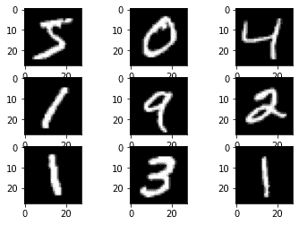

图 3.7 – MNIST 数据集中前几个图像的可视化；有意将图像转换为位图以展示其实际大小

MNIST 数据集中图像的大小是 28 x 28 像素，这对于训练和测试新的机器学习模型来说已经足够完美。尽管该数据集在机器学习中广为人知并被使用，但它相对较小且均匀——只有灰度数字。因此，对于更高级的任务，我们应该寻找更多样化的数据集。

手写数字的图像自然是有用的，但我们通常希望使用更复杂的图像，因此，标准库中包含的图像不仅仅只有 10 个类别（数字的数量）。其中一个这样的数据集是 Fashion-MNIST 数据集。

我们可以使用以下代码下载它：

```py
from keras.datasets import fashion_mnist
(X_train, Y_train), (X_test, Y_test)=fashion_mnist.load_data()
```

该代码可以用于生成*图 3*.*7*中所示的可视化，它产生了*图 3*.*8*中看到的图像集合。图像大小和类别数量相同，但复杂度更大：

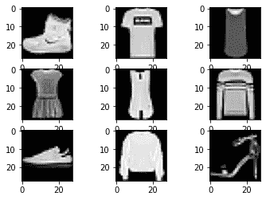

图 3.8 – Fashion-MNIST 数据集；有意将图像转换为位图以展示其实际大小

最后，我们还可以使用包含彩色图像的库，例如 CIFAR-10 数据集。可以使用以下代码访问该数据集：

```py
from keras.datasets import cifar10
# load dataset
(X_train, Y_train), (X_test, Y_test)== cifar10.load_data()
```

该数据集包含 10 个不同类别的图像，大小相似（32 x 32 像素），但带有颜色，如图 *图 3.9* 所示。

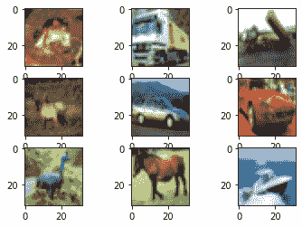

图 3.9 – CIFAR-10 数据集；图像有意进行光栅化以展示其实际大小

这并不是这些基准数据集的终点。一些数据集包含更多类别、更大的图像，或者两者都有。因此，在系统必须执行的任务之前和期间查看这些数据集是很重要的。

在大多数情况下，灰度图像对于分类任务来说已经足够好了。它们能够快速让我们在数据中找到方向，而且它们足够小，以至于分类质量良好。

基准数据集的通常大小约为 50,000–100,000 张图像。这表明，即使是如此小的类别数量和如此小的图像，数量也是相当大的。想象一下标注那 100,000 张图像。对于更复杂的图像，数据集的大小可以显著更大。例如，在汽车软件中使用的 BDD100K 数据集包含超过 100,000 张图像。

因此，这是我的下一个最佳实践。

最佳实践 #16

使用参考数据集（如 MNIST 或 STL）来基准测试系统是否工作。

为了理解整个系统是否工作，这样的基准数据集非常有用。它们为我们提供了一个预配置的训练/测试分割，并且有许多算法可以用来理解我们算法的质量。

我们还应该考虑下一个最佳实践。

最佳实践 #17

在可能的情况下，使用已经为特定任务预训练的模型（例如，用于图像分类或语义分割的神经网络模型）。

正如我们应该努力重复使用图像进行基准测试一样，我们也应该努力重复使用预训练的模型。这节省了之前的设计资源，并减少了花费太多时间寻找神经网络模型的最佳架构或最佳参数集（即使我们使用 `GradientSearch` 算法）的风险。

## 文本

在对文本进行的分析类型中，SA 是其中之一——对文本片段（例如句子）是否为正面或负面的分类。

*图 3.10* 展示了可用于 SA 的数据示例。这些数据是公开可用的，并且是从亚马逊产品评论中创建的。这类分析的数据通常以表格形式结构化，其中包含诸如 `ProductId`（为了简洁，我已截断 `Id` 列）或 `UserId` 这样的实体，以及用于参考的 `Score` 和用于分类的 `Text`。

这种数据结构为我们提供了快速总结文本和可视化的可能性。可视化可以通过多种方式进行——例如，通过绘制得分的直方图。然而，最有趣的视觉化是那些由文本中使用的单词/标记的统计信息提供的：

| Id | ProductId | UserId | Score | 摘要 | 文本 |
| --- | --- | --- | --- | --- | --- |
| 1 | B001KFG0 | UHU8GW | 5 | 良好的狗粮质量 | 我购买了几种 Vitality 罐装狗粮产品，并发现它们的质量都很好。产品看起来更像炖菜而不是加工肉类，而且气味更好。我的拉布拉多很挑食，她比大多数狗更喜欢这个产品。 |
| 2 | B008GRG4 | ZCVE5NK | 1 | 不如广告所述 | 产品到达时标明为巨型盐味花生...实际上花生是小型未加盐的。不确定这是否是一个错误，还是供应商有意将产品标为“巨型”。 |
| 3 | B000OCH0 | WJIXXAIN | 4 | “满意”就足够了 | 这是一种存在了几百年的糖果。它是一种轻盈、蓬松的柑橘果冻，里面有坚果——在这种情况下是榛子。然后切成小块，然后大量裹上糖粉。这是一口小小的天堂。不太嚼劲，非常美味。我强烈推荐这种美味的小吃。如果你熟悉 C.S.路易斯的《狮子、女巫和魔衣橱》的故事——这就是诱惑埃德蒙向女巫出卖他的兄弟姐妹的糖果。 |
| 4 | B000A0QIQ | C6FGVXV | 2 | 咳嗽药水 | 如果你正在寻找 Robitussin 的秘密成分，我相信我已经找到了。我除了订购的根啤酒提取物（很好）外，还做了一些樱桃汽水。味道非常药性。 |
| 5 | B0062ZZ7K | LF8GW1T | 5 | 优秀的太妃糖 | 价格合理的优秀太妃糖。有各种各样的美味太妃糖。送货非常快。如果你是太妃糖爱好者，这是一个划算的交易。 |

图 3.10 – 产品评论数据示例，为 SA 结构化；仅显示前五行

一种可视化数据的方法是使用词云可视化技术。以下是一个用于可视化此类数据的简单脚本的示例：

```py
# Create stopwords list:
stopwords = set(STOPWORDS)
stopwords.update(["br", "href"])
# create text for the wordcloud
textt = " ".join(review for review in dfRaw.Text)
# generation of wordcloud
wordcloud = WordCloud(stopwords=stopwords,
                  max_words=100,
                  background_color="white").generate(textt)
# showing the image
# and saving it to the png file
plt.figure(figsize = [12,9])
plt.imshow(wordcloud, interpolation='bilinear')
plt.axis("off")
plt.show()
```

运行此脚本的输出结果如图**3.11**所示。一个词云显示了单词使用频率的趋势——使用频率较高的单词比使用频率较低的单词大：


图 3.11 – 文本列的词云可视化

因此，我的下一个最佳实践如下。

最佳实践 #18

将你的原始数据可视化，以了解数据中的模式。

数据的可视化对于理解潜在模式非常重要。这一点我无法强调得更多。我既使用 Python 的 Matplotlib 和 Seaborn，也使用 TIBCO Spotfire 等可视化分析工具来绘制图表并理解我的数据。没有这种可视化，以及没有对模式的这种理解，我们必然会得出错误的结论，甚至设计出需要完全重新设计才能移除缺陷的系统。

## 更高级文本处理输出的可视化

文本的可视化帮助我们理解文本包含的内容，但它并不捕捉其含义。在这本书中，我们将使用高级文本处理算法——特征提取器。因此，我们需要了解如何创建这些算法输出的可视化。

与特征提取一起工作的一种方法是用词嵌入——一种将单词或句子转换为数字向量的方法。`word2vec`是能够做到这一点的模型之一，但还有更强大的模型。OpenAI 的 GPT-3 模型是公开可用的最大模型之一。获取段落嵌入相当直接。首先，我们连接到 OpenAI API，然后查询它以获取嵌入。以下是查询 OpenAI API 的代码（加粗）：

```py
# first we combine the title and the content of the review
df['combined'] = "Title: " + df.Summary.str.strip() + "; Content: " + df.Text.str.strip()
# we define a function to get embeddings, to make the code more straightforward
def get_embedding(text, engine="text-similarity-davinci-001"):
   text = text.replace("\n", " ")
   return openai.Embedding.create(input = [text], engine=engine)['data'][0]['embedding']
# and then we get embeddings for the first 5 rows
df['babbage_similarity'] = df.head(5).combined.apply(lambda x: get_embedding(x, engine='text-similarity-babbage-001'))
```

通过运行这段代码，我们获得了`5`个向量（每个行一个）的`2048`个数字，我们称之为嵌入。整个向量太大，无法包含在页面上，但前几个元素看起来像这样：`[-0.005302980076521635, 0.018141526728868484, -0.018141526728868484, 0.004692177753895521, …]`。

这些数字对我们人类来说意义不大，但对语言模型来说却有着意义。意义在于它们之间的距离——相似度高的单词/标记/句子比不相似的单词/标记/句子更接近。为了理解这些相似性，我们使用降低维度的转换——其中之一是**t 分布随机邻域嵌入**（**t-SNE**）。*图 3.12*展示了我们获得的五个嵌入的这种可视化：

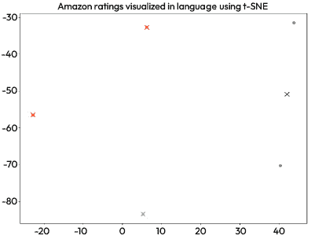

图 3.12 – 五个评论嵌入向量的 t-SNE 可视化

每个点代表一条评论，每个十字代表簇的中心。簇由原始数据集中的`Score`列指定。截图显示，每条评论中的文本都不同（点不重叠），并且簇是分开的——十字在截图的不同部分。

因此，我接下来的最佳实践就是关于这个。

最佳实践#19

当数据被转换为特征以监控是否仍可观察到相同模式时，请可视化您的数据。

就像之前的最佳实践一样，我们需要可视化数据以检查我们在原始数据中观察到的模式是否仍然可观察。这一步很重要，因为我们需要知道机器学习模型确实可以学习这些模式。由于这些模型本质上是统计的，它们总是捕捉到模式，但当模式不存在时，它们捕捉到的可能是无用的东西 – 即使它看起来像是一个模式。

## 结构化文本 – 程序的源代码

程序的源代码是文本数据的一个特殊情况。它具有相同类型的模态 – 文本 – 但它包含程序语法/句法结构形式的附加信息。由于每种编程语言都基于语法，因此程序的结构化都有特定的规则。例如，在 C 语言中，应该有一个名为 `main` 的特定函数，它是程序的入口点。

这些特定的规则使得文本以特定的方式结构化。它们可能使人类理解文本变得更加困难，但这种结构确实非常有帮助。使用这种结构的一个模型是 `code2vec` ([`code2vec.org/`](https://code2vec.org/))。`code2vec` 模型与 word2vec 类似，但它以输入它所分析程序的 **抽象语法树** (**AST**) – 例如，以下程序：

```py
void main()
{
    Console.println("Hello World");
}
```

这可以通过 *图 3**.13* 中的 AST 来表示：

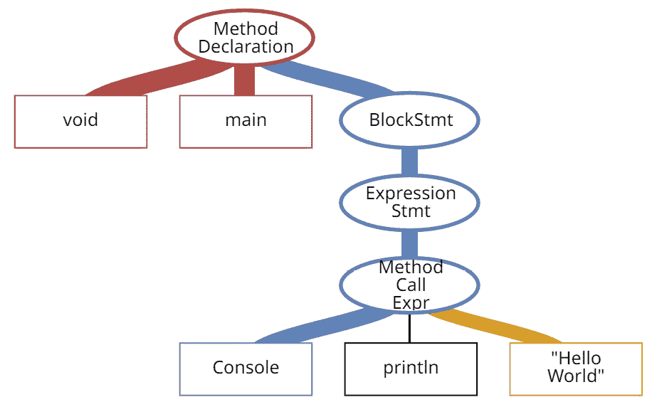

图 3.13 – 简单“Hello World”程序的 AST

示例程序被可视化为一组指令及其上下文以及它们在程序中扮演的角色。例如，`void` 和 `main` 是方法声明的一部分，与块语句（`BlockStmt`）一起，构成了方法的主体。

`code2vec` 是一个使用编程语言信息（在这种情况下，是语法）作为模型输入的模型的例子。模型可以执行的任务包括查找单词之间的相似性（如 word2vec 模型）、查找组合以及识别类比。例如，模型可以识别 `int` 和 `main` 这两个单词的所有组合，并提供以下答案（带有概率）：`realMain`（71%），`isInt`（71%），和 `setIntField`（69%）。通过扩展，这些任务可以用于程序修复，其中模型可以识别错误并修复它们。

然而，使用 AST 或类似信息也有缺点。主要缺点是分析程序必须编译。这意味着我们无法在想要分析不完整程序的环境中使用这些类型的模型 – 例如，在 **持续集成** (**CI**) 或现代代码审查的环境中。当我们只分析代码的一小部分时，模型无法解析它，获取其 AST，并使用它。因此，这是我的下一个最佳实践。

最佳实践 #20

只将必要的信息作为输入提供给机器学习模型。过多的信息可能需要额外的处理，并使训练难以收敛（完成）。

在设计处理流程时，确保提供给模型的信息是必要的，因为每一条信息都对整个软件系统提出新的要求。例如，在抽象语法树（AST）的例子中，当它是必要的，它就是强大的信息，但如果不可用，它可能会成为数据分析流程工作的巨大障碍。

# 每种数据都有其目的 – 标注和任务

原始格式的数据很重要，但只是机器学习软件开发和运营的第一步。最重要的是数据标注，这也是成本最高的部分。为了训练机器学习模型并使用它进行推理，我们需要定义一个任务。定义任务既是概念性的也是操作性的。概念性定义是定义我们希望软件做什么，而操作性定义是我们希望如何实现这一目标。操作性定义归结为对我们在数据中看到的内容以及我们希望机器学习模型识别/复制的定义。

标注是我们指导机器学习算法的机制。我们使用的每一条数据都需要某种标签来表示其内容。在数据的原始格式中，这种标注可以是数据点包含的内容的标签。例如，这样的标签可以是图像包含数字 1（来自 MNIST 数据集）或汽车（来自 CIFAR-10 数据集）。然而，这些简单的标注在专用任务中很重要。对于更高级的任务，标注需要更丰富。

这类标注的一种类型与我们在数据中指定部分数据为有趣的部分相关。在图像的情况下，这是通过在感兴趣的对象周围绘制边界框来完成的。*图 3.14* 展示了这样的图像：


图 3.14 – 带有边界框的图像

图像包含围绕我们希望模型识别的元素的框。在这种情况下，我们希望识别车辆（绿色框）、其他道路使用者（橙色框）和重要的背景对象（灰色框）。这类标注用于使机器学习模型学习形状，并在新对象中识别这些形状。在这个例子中，边界框识别了对于汽车主动安全系统重要的元素，但这不是唯一的用途。

这种边界框的其他应用包括医学图像分析，其任务是识别需要进一步分析的组织。这些也可以是面部识别和物体检测的系统。

虽然这个任务和边界框可以被视为标注原始数据的一个特殊情况，但它略有不同。每个框都可以被视为一个带有标签的独立图像，但挑战在于每个框的大小都不同。因此，使用这种不同形状的图像将需要预处理（例如，重新缩放）。它也仅适用于训练，因为在推理中，我们需要在分类之前识别对象——这正是我们需要神经网络为我们完成的任务。

我使用这类数据的最佳实践将在下面列出。

最佳实践 #21

当任务需要检测和跟踪对象时，在数据中使用边界框。

由于边界框使我们能够识别对象，因此这些数据的自然用途是在跟踪系统中。一个示例应用是使用摄像头监控停车位的系统。它检测停车位并跟踪是否有车辆停在该位置。

对象检测任务的扩展是感知任务，其中我们的机器学习软件需要根据数据的上下文或情况做出决策。

对于图像数据，这种上下文可以通过语义地图来描述。*图 3.15* 展示了这样一个地图：

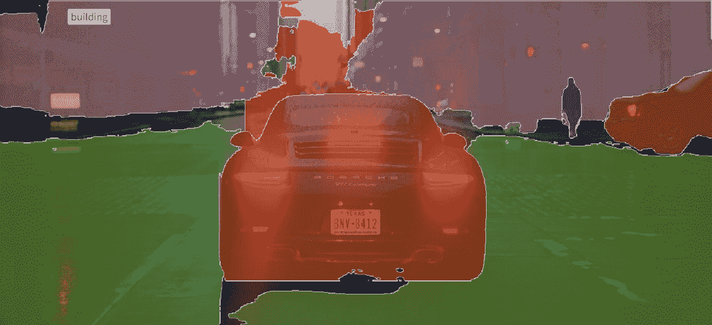

图 3.15 – 带有语义地图的图像；建筑是语义地图的一个标签

截图显示了覆盖特定类型对象的多种颜色叠加。橙色叠加显示车辆，紫色叠加显示易受伤害的道路使用者，在本图中即为行人。最后，粉色表示建筑，红色覆盖背景/天空。

语义地图比边界框提供了更多的灵活性（因为某些对象比其他对象更有趣），并允许机器学习系统获取图像的上下文。通过识别图像中存在哪些类型的元素，机器学习模型可以为我们设计的软件系统的决策算法提供有关图像拍摄位置的信息。

因此，这是我的下一个最佳实践。

最佳实践 #22

当你需要获取图像的上下文或需要特定区域的详细信息时，使用语义地图。

语义地图需要大量计算才能有效使用；因此，我们应该很少使用它们。当我们有与上下文相关的任务时，例如感知算法或图像修改——例如，改变图像中天空的颜色——我们应该使用这些地图。关于信息的准确性，一般来说，语义地图需要大量计算，因此是选择性使用的。一个进行此类语义映射的工具示例是 Segments.ai。

语义地图在需要理解图像的上下文或特定区域的细节时非常有用。例如，在自动驾驶中，语义地图可以用来识别道路上的物体及其相互关系，从而使车辆能够就其移动做出明智的决定。然而，语义地图的具体应用案例可能因应用而异。

# 为意图识别标注文本

我们之前提到的 SA 只是文本数据标注的一种类型。它有助于评估文本是正面还是负面。然而，我们不是用情感标注文本，而是可以用——例如——意图来标注文本，并训练一个机器学习模型从其他文本段落中识别意图。图*3.16*中的表格提供了这样的标注，基于之前的相同评论数据：

| **Id** | **Score** | **Summary** | **Text** | **Intent** |
| --- | --- | --- | --- | --- |
| 1 | 5 | 高质量狗粮 | 我购买了几个 Vitality 罐装狗粮产品，并发现它们的质量都很好。产品看起来更像炖菜而不是加工肉类，而且味道更好。我的拉布拉多很挑食，她比大多数狗更喜欢这个产品。 | 广告 |
| 2 | 1 | 不如广告所说 | 产品到达时标有“巨型盐味花生”……实际上花生是小型无盐的。不确定这是否是一个错误，还是卖家有意将产品标为“巨型”。 | 批评 |
| 3 | 4 | “快乐”一词已尽其意 | 这是一种存在了几百年的糖果。它是一种轻盈、蓬松的柑橘果冻，里面有坚果——在这种情况下是榛子。然后它被切成小块，并大量裹上糖粉。这是一口小小的天堂。不太嚼劲，非常美味。我强烈推荐这种美味的点心。如果你熟悉 C.S.路易斯的《狮子、女巫和魔衣橱》的故事——这就是诱惑爱德蒙背叛他的兄弟姐妹给女巫的点心。 | 描述 |
| 4 | 2 | 咳嗽
 药品 | 如果你正在寻找 Robitussin 的秘诀成分，我相信我已经找到了。我除了订购的根啤酒提取物（味道不错）外，还制作了一些樱桃汽水。味道非常像药。 | 批评 |
| 5 | 5 | 优秀的太妃糖 | 价格合理的优秀太妃糖。有各种各样的美味太妃糖。送货非常快。如果你是太妃糖爱好者，这是一个划算的交易。 | 广告 |

图 3.16 – 用于意图识别的文本数据标注

表格的最后一列显示了文本的注释——意图。现在，我们可以使用意图作为标签来训练一个机器学习模型以识别新文本中的意图。通常，这项任务需要两步方法，如图*3.17*所示：

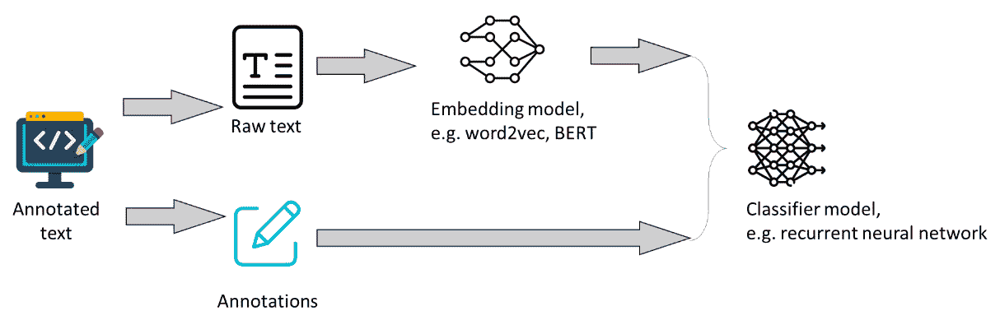

图 3.17 – 基于文本训练模型的两个步骤方法

标注的文本被组织成两部分。第一部分是文本本身（例如，我们示例表中的`Text`列），第二部分是标注（例如，我们示例中的`Intent`列）。文本使用如 word2vec 模型或 transformer 等模型进行处理，将文本编码为向量或矩阵。标注使用如 one-hot 编码等技术编码为向量，以便它们可以作为分类算法的决策类别。分类算法接受编码的标注和向量化的文本。然后，它被训练以找到向量化文本（*X*）与标注（*Y*）的最佳匹配。

这里是我的最佳实践，如何执行这项操作。

最佳实践#23

使用预训练的嵌入模型，如 GPT-3 或现有的 BERT 模型来向量化您的文本。

根据我的经验，如果我们使用预定义的语言模型来向量化文本，那么处理文本通常会更简单。*Hugging Face*网站([www.huggingface.com](http://www.huggingface.com))是这些模型的优秀来源。由于 LLMs 需要大量的资源来训练，现有的模型通常对于大多数任务来说已经足够好了。由于我们将在管道的下一步开发分类器模型，我们可以集中精力使该模型更好，并与我们的任务保持一致。

文本数据的另一种标注类型是关于**词性**（**POS**）的上下文。它可以被视为在图像数据中使用的语义图。每个词都被标注，无论它是名词、动词还是形容词，无论它属于句子的哪个部分。这种标注的一个示例可以通过使用艾伦研究所的 AllenNLP **语义角色标注**（**SRL**）工具（[`demo.allennlp.org/semantic-role-labeling`](https://demo.allennlp.org/semantic-role-labeling)）进行视觉展示。*图 3*.*18*展示了简单句子的此类标注截图，而*图 3*.*19*展示了更复杂句子的标注：

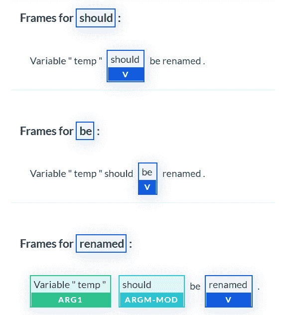

图 3.18 – 使用 AllenNLP 工具集进行 SRL

在这个句子中，每个词的作用都被强调，我们可以看到有三个具有不同关联的动词——最后一个动词是主要的，因为它将句子的其他部分联系起来：

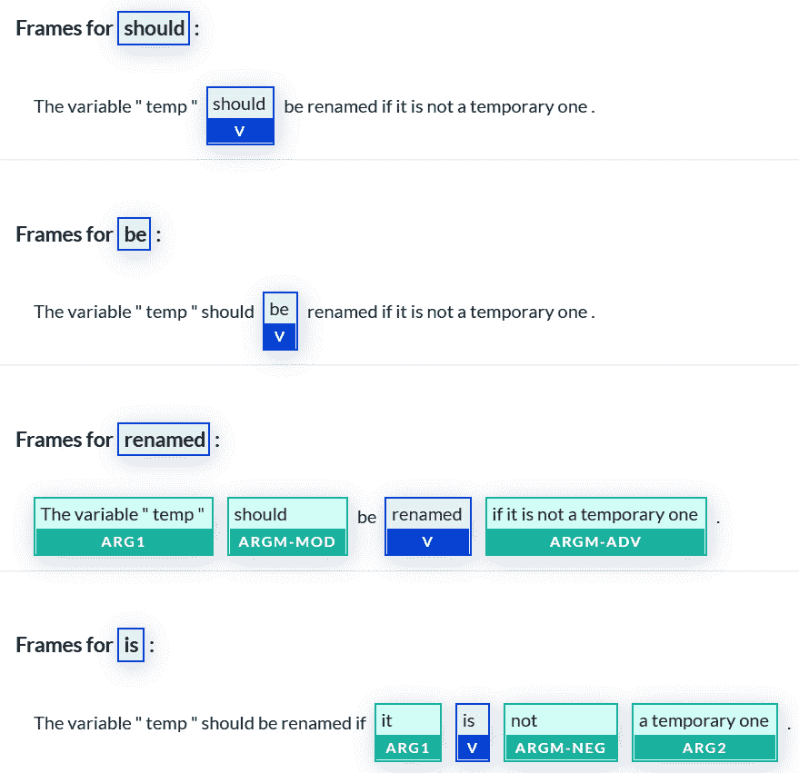

图 3.19 – 更复杂句子的 SRL

复杂句子具有更大的语义角色框架，因为它包含句子的两个不同部分。我们使用这种角色标注来提取文本段落的意义。这在设计基于所谓*基于事实的模型*的软件系统时尤其有用，这些模型会检查信息是否与事实相符。这些模型解析文本数据，找到正确的锚点（例如，问题是什么），并在它们的数据库中找到相关的答案。这些与*非基于事实的模型*相对，这些模型基于哪个词最适合完成句子来创建答案——例如，ChatGPT。

因此，我的最佳实践如下。

最佳实践#24

在设计需要提供基于事实的决策的软件时，使用角色标签。

基于事实的决策通常更难提供，因为模型需要理解句子的上下文，捕捉其意义，并提供相关的答案。然而，这并不总是必需的，甚至可能不是所希望的。非基于事实的模型对于可以由专家稍后修正的建议通常已经足够好。ChatGPT 这样的软件工具就是一个例子，它提供的答案有时是不正确的，需要人工干预。然而，它们是一个非常好的起点。

# 在可以使用不同类型的数据一起使用的地方——对多模态数据模型的展望

本章介绍了三种类型的数据——图像、文本和结构化文本。这三种类型的数据是数值形式的数据的例子，如数字矩阵，或时间序列的形式。然而，无论形式如何，与数据和机器学习系统一起工作是非常相似的。我们需要从源系统中提取数据，然后将其转换为我们可以注释的格式，然后将其用作机器学习模型的输入。

当我们考虑不同类型的数据时，我们可以开始思考是否可以在同一个系统中使用两种类型的数据。有几种方法可以实现这一点。第一种是在不同的管道中使用不同的机器学习系统，但我们连接了这些管道。GitHub Copilot 就是这样一种系统。它使用一个管道来处理自然语言，以找到类似的程序并将它们转换成适合当前正在开发的程序上下文。

另一个例子是生成图像文本描述的系统。它接受一个图像作为输入，识别其中的对象，然后基于这些对象生成文本。文本的生成是通过一个与图像分类完全不同的机器学习模型完成的。

然而，有一些新模型在同一个神经网络中使用两种不同的模态——图像和文本——例如，Gato 模型。通过使用来自两个来源的输入，并在中间使用一个非常窄（就神经元数量而言）的网络，该模型被训练以泛化由两种不同模态描述的概念。这样，该模型被训练以理解，如果不在完全相同的位置，猫的图像和单词“猫”应该被放置在非常接近的同一嵌入空间中。尽管仍然处于实验阶段，但这些类型的网络旨在模仿人类对概念的理解。

在下一章中，我们将更深入地探讨数据理解，通过深入研究特征工程的过程。

# 参考文献

+   *Tao, J. et al., An object detection system based on YOLO in traffic scene. In 2017 6th International Conference on Computer Science and Network Technology (ICCSNT).* *2017\. IEEE.*

+   *Artan, C.T. and T. Kaya, Car Damage Analysis for Insurance Market Using Convolutional Neural Networks. In International Conference on Intelligent and Fuzzy Systems.* *2019\. Springer.*

+   *Nakaura, T. et al., A primer for understanding radiology articles about machine learning and deep learning. Diagnostic and Interventional Imaging, 2020\. 101(12):* *p. 765-770.*

+   *Bradski, G., The OpenCV Library. Dr. Dobb’s Journal: Software Tools for the Professional Programmer, 2000\. 25(11):* *p. 120-123.*

+   *Memon, J. et al., Handwritten optical character recognition (OCR): A comprehensive systematic literature review (SLR). IEEE Access, 2020\. 8:* *p. 142642-142668.*

+   *Mosin, V. et al., Comparing autoencoder-based approaches for anomaly detection in highway driving scenario images. SN Applied Sciences, 2022\. 4(12):* *p. 1-25.*

+   *Zeineldin, R.A. et al., DeepSeg: deep neural network framework for automatic brain tumor segmentation using magnetic resonance FLAIR images. International journal of computer assisted radiology and surgery, 2020\. 15(6):* *p. 909-920.*

+   *Reid, R. et al., Cooperative multi-robot navigation, exploration, mapping and object detection with ROS. In 2013 IEEE Intelligent Vehicles Symposium (IV).* *2013\. IEEE.*

+   *Mikolov, T. et al., Recurrent neural network based language model. In Interspeech.* *2010\. Makuhari.*

+   *Vaswani, A. et al., Attention is all you need. Advances in neural information processing systems,* *2017\. 30.*

+   *Ma, L. and Y. Zhang, Using Word2Vec to process big text data. In 2015 IEEE International Conference on Big Data (Big Data).* *2015\. IEEE.*

+   *Ouyang, X. et al., Sentiment analysis using convolutional neural network. In 2015 IEEE International Conference on Computer and Information Technology; ubiquitous computing and communications; dependable, autonomic and secure computing; pervasive intelligence and computing.* *2015\. IEEE.*

+   *Roziere, B. et al., Unsupervised translation of programming languages. Advances in Neural Information Processing Systems, 2020\. 33:* *p. 20601-20611.*

+   *Yasunaga, M. and P. Liang, Break-it-fix-it: Unsupervised learning for program repair. In International Conference on Machine Learning.* *2021\. PMLR.*

+   *Halali, S. et al., Improving defect localization by classifying the affected asset using machine learning. In International Conference on Software Quality.* *2019\. Springer.*

+   *Ochodek, M. et al., Recognizing lines of code violating company-specific coding guidelines using machine learning. In Accelerating Digital Transformation. 2019, Springer.* *p. 211-251.*

+   *Nguyen, N. and S. Nadi, An empirical evaluation of GitHub copilot’s code suggestions. In Proceedings of the 19th International Conference on Mining Software* *Repositories. 2022.*

+   *Zhang, C.W. et al., Pedestrian detection based on improved LeNet-5 convolutional neural network. Journal of Algorithms & Computational Technology, 2019\. 13:* *p. 1748302619873601.*

+   *LeCun, Y. et al., Gradient-based learning applied to document recognition. Proceedings of the IEEE, 1998\. 86(11):* *p. 2278-2324.*

+   *Xiao, H., K. Rasul, and R. Vollgraf, Fashion-MNIST: a novel image dataset for benchmarking machine learning algorithms. arXiv preprint* *arXiv:1708.07747, 2017.*

+   *Recht, B. et al., Do CIFAR-10 classifiers generalize to CIFAR-10? arXiv preprint* *arXiv:1806.00451, 2018.*

+   *Robert, T., N. Thome, and M. Cord, HybridNet: Classification and reconstruction cooperation for semi-supervised learning. In Proceedings of the European Conference on Computer Vision (**ECCV). 2018.*

+   *Yu, F. et al., Bdd100k: A diverse driving video database with scalable annotation tooling. arXiv preprint arXiv:1805.04687, 2018\. 2(5):* *p. 6.*

+   *McAuley, J.J. and J. Leskovec, From amateurs to connoisseurs: modeling the evolution of user expertise through online reviews. In Proceedings of the 22nd International Conference on World Wide* *Web. 2013.*

+   *Van der Maaten, L. and G. Hinton, Visualizing data using t-SNE. Journal of Machine Learning Research,* *2008\. 9(11).* 

+   *Sengupta, S. et al., Automatic dense visual semantic mapping from street-level imagery. In 2012 IEEE/RSJ International Conference on Intelligent Robots and Systems.* *2012\. IEEE.*

+   *Palmer, M., D. Gildea, and N. Xue, Semantic role labeling. Synthesis Lectures on Human Language Technologies, 2010\. 3(1):* *p. 1-103.*

+   *Reed, S. et al., A generalist agent. arXiv preprint* *arXiv:2205.06175, 2022.*
