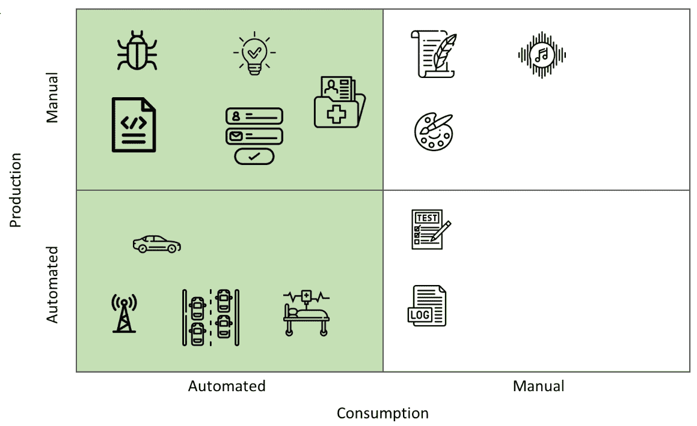
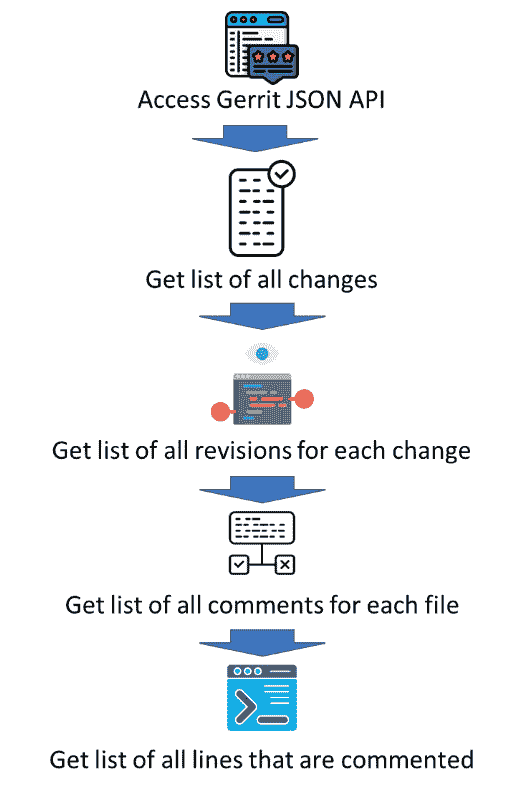
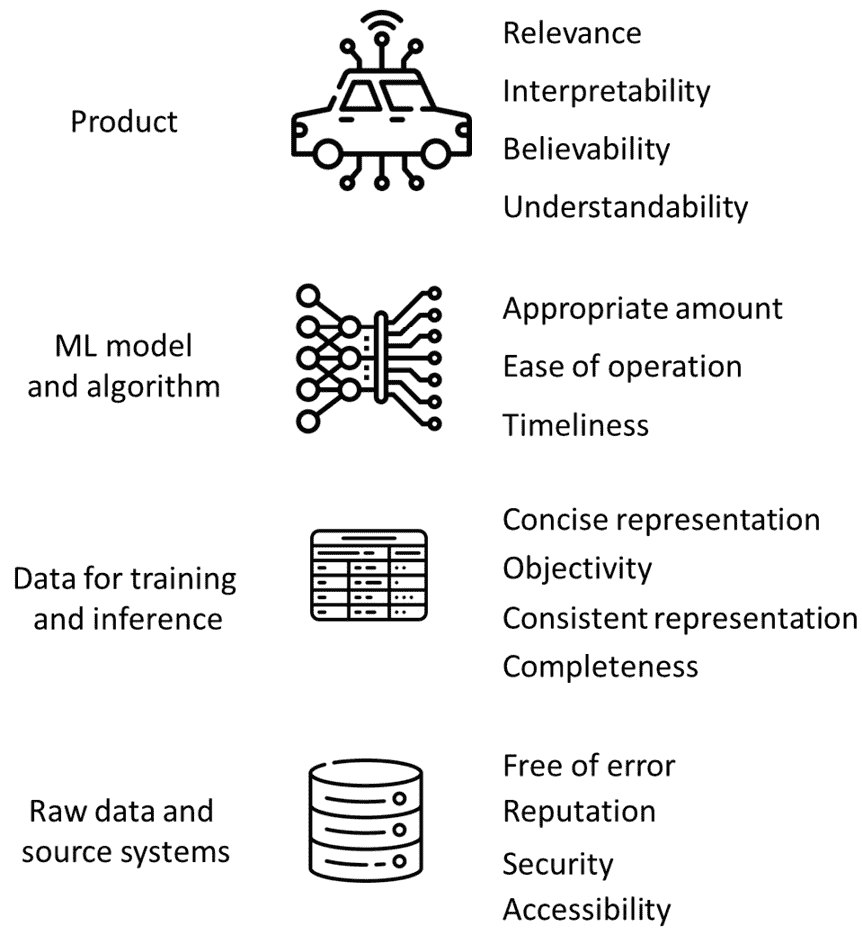
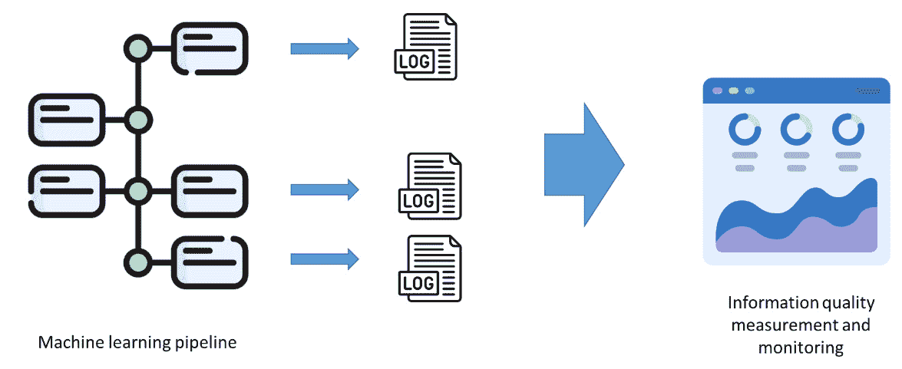
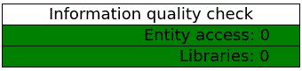

# 第四章：数据采集、数据质量和噪声

机器学习系统的数据可以直接来自人类和软件系统——通常称为*源系统*。数据的来源对其外观、质量以及如何处理它都有影响。

来自人类的数据通常比来自软件系统的数据更嘈杂。我们人类以小的不一致性而闻名，我们也可以不一致地理解事物。例如，两个人报告的同一缺陷可能有非常不同的描述；对于需求、设计和源代码也是如此。

来自软件系统的数据通常更一致，包含的噪声更少，或者数据中的噪声比人类生成数据的噪声更规律。这些数据由源系统生成。因此，控制和监控自动生成数据的品质是不同的——例如，软件系统不会在数据中“撒谎”，因此检查自动生成数据的可信度是没有意义的。

在本章中，我们将涵盖以下主题：

+   数据的不同来源以及我们可以如何利用它们

+   如何评估用于机器学习的数据的品质

+   如何识别、测量和减少数据中的噪声

# 数据来源以及我们可以如何利用它们

机器学习软件在当今所有领域都变得越来越重要。从电信网络、自动驾驶汽车、计算机游戏、智能导航系统、面部识别到网站、新闻制作、电影制作和实验音乐创作，都可以使用机器学习来完成。一些应用在例如使用机器学习进行搜索字符串（BERT 模型）方面非常成功。一些应用则不太成功，例如在招聘过程中使用机器学习。通常，这取决于在这些应用中使用到的程序员、数据科学家或模型。然而，在大多数情况下，机器学习应用的成功往往取决于用于训练和使用的训练数据。它取决于数据的品质以及从中提取的特征。例如，亚马逊的机器学习推荐系统被停用，因为它对女性存在偏见。由于它是基于历史招聘数据训练的，而这些数据主要包含男性候选人，因此系统倾向于在未来的招聘中推荐男性候选人。

用于机器学习系统的数据可以来自各种来源。然而，我们可以将这些来源分为两大类——人工/人类和自动化软件/硬件。这两类具有不同的特征，决定了如何组织这些来源以及如何从这些来源的数据中提取特征。*图 4.1*展示了这些数据类型并提供了每种类型数据的示例。

手动生成数据是指来自人类输入或起源于人类的数据。这类数据通常比软件生成数据信息量更丰富，但变异性也更大。这种变异性可能来自我们人类的自然变异性。例如，在表格中提出的问题，两个人可能会有不同的理解和回答。这类数据通常比系统性错误更容易受到随机错误的影响。

自动生成数据起源于硬件或软件系统，通常由传感器或测量脚本收集来自其他系统、产品、流程或组织的数据。这类数据通常更一致、可重复，但也更容易受到系统性错误的影响：



图 4.1 – 数据来源及其分类。此图中的绿色部分是本书的范围

人类起源的数据示例，常用于机器学习的是关于软件缺陷的数据。人类测试员通常会检查问题并使用表格报告。这个表格包含有关测试阶段、受影响的组件、对客户的影响等内容，但表格的一部分通常是问题描述的自然语言描述，这是由人类测试员对发生情况的一种解释。

另一种由人类生成数据是源代码。作为程序员，我们使用给定语法的编程语言编写软件源代码，并使用编程指南来保持一致的风格，以便我们的工作成果——源代码——可以被软件自动解释或编译。我们编写的代码中存在一些结构，但远非一致。即使是相同的算法，当由两位不同的程序员实现时，也会在变量命名、类型或解决问题的方法上有所不同。一个很好的例子是 Rosetta 代码网站，它提供了不同编程语言中的相同解决方案，有时甚至在同一编程语言中。

使用表格进行的需求规范或数据输入具有相同的属性和特征。

然而，有一种数据来源特别有趣——医疗数据。这是来自患者记录和图表的数据，由医疗专家作为医疗程序的一部分输入。这些数据可以是电子的，但它反映了专家对症状的理解以及他们对医疗测试和诊断的解释。

另一方面，我们还有由软件或硬件以某种方式生成的数据。自动生成的数据更一致，尽管不是没有问题，并且更重复。此类数据的例子是电信网络中生成以从一电信节点传输信息到另一电信节点。与其它类型的数据相比，无线电信号非常稳定，可能会受到外部因素（如降水）或障碍物（如建筑起重机）的干扰。数据是可重复的，所有变异性都源于外部因素。

另一个例子是来自车辆的数据，这些数据记录了它们周围的信息并存储以供进一步处理。这些数据可以包含车辆组件之间的信号以及与其他车辆或基础设施的通信。

医疗数据，例如**脑电图**（**EEG**——即脑电波）或**心电图**（**ECG**——即心率），是从源系统中收集的，我们可以将其视为测量仪器。因此，从技术上讲，这些数据是由计算机系统生成的，但它们来自人类患者。这种来自患者的起源意味着数据具有与其他从人类收集的数据相同的自然变异性。由于每个患者都有所不同，测量系统可以以略微不同的方式连接到每个患者，因此每个患者生成的数据与其他患者略有不同。例如，心电图心跳数据包含基本、一致的信息——每分钟的跳动次数（以及其他参数）。然而，原始数据在心电图信号的幅度（取决于测量电极的位置）或曲线尖峰之间的差异（R 和 T 尖峰）上有所不同。

因此，本章我的第一个最佳实践与我们所使用的软件数据的来源有关。

最佳实践 #25

识别你软件中使用的数据的来源，并据此创建你的数据处理流程。

由于所有类型的数据在清洁、格式化和特征提取方面都需要不同的处理方式，我们应该确保我们知道数据是如何产生的，以及我们可以预期（并处理）哪些问题。因此，首先，我们需要确定我们需要什么类型的数据，它来自哪里，以及它可能携带哪些问题。

# 从软件工程工具中提取数据——Gerrit 和 Jira

为了说明如何进行数据提取，让我们从一款流行的代码审查软件工具——Gerrit 中提取数据。这个工具用于审查和讨论个人程序员在代码集成到产品主代码库之前开发的代码片段。

以下程序代码展示了如何通过 JSON API 访问 Gerrit 的数据库——也就是说，通过 JSON API ——以及如何提取特定项目的所有变更列表。此程序使用 Python `pygerrit2` 包 ([`pypi.org/project/pygerrit2/`](https://pypi.org/project/pygerrit2/))。此模块帮助我们使用 JSON API，因为它提供 Python 函数而不是仅仅 JSON 字符串：

```py
# importing libraries
from pygerrit2 import GerritRestAPI
# A bit of config - repo
gerrit_url = "https://gerrit.onap.org/r"
# since we use a public OSS repository
auth = None
# this line gets sets the parameters for the HTML API
rest = GerritRestAPI(url=gerrit_url, auth = auth)
# the main query where we ask the endpoint to provide us the list and details of all changes
# each change is essentially a review that has been submitted to the repository
changes = rest.get("/changes/?q=status:merged&o=ALL_FILES&o=ALL_REVISIONS&o=DETAILED_LABELS&start=0",
headers={'Content-Type': 'application/json'})
```

此代码片段中的关键行是 `rest.get("/changes/?q=status:merged&o=ALL_FILES&o=ALL_REVISIONS&o=DETAILED_LABELS&start=0", headers={'Content-Type': 'application/json'})`。这一行指定了要检索变更的端点以及参数。它表示我们想要访问所有文件和所有修订，以及所有变更的详细信息。在这些详细信息中，我们可以找到有关所有修订（特定的补丁/提交）的信息，然后我们可以解析这些修订中的每一个。重要的是要知道 JSON API 在每个查询中返回的最大变更数是 500，因此最后一个参数——`start=0`——可以用来访问从 500 开始的变更。此程序的输出是一个非常长的变更列表，以 JSON 格式，因此我不会在本书中详细展示。相反，我鼓励您执行此脚本，并根据自己的节奏浏览此文件。脚本可以在本书的 GitHub 仓库中找到，网址为 [`github.com/miroslawstaron/machine_learning_best_practices`](https://github.com/miroslawstaron/machine_learning_best_practices)，在 *第四章* 下。脚本的名称是 `gerrit_exporter.ipynb`。

现在，仅提取变更列表对于分析来说并不很有用，因为它只提供了自动收集的信息——例如，哪些修订存在，以及谁创建了这些修订。它不包含有关哪些文件和行被注释的信息，或者注释是什么——换句话说，特别有用的信息。因此，我们需要与 Gerrit 进行更多交互，如 *图 4**.2* 所示。

在 *图 4**.2* 中展示的程序流程说明了代码注释数据库（如 Gerrit）中关系的复杂性。因此，访问数据库并导出这些数据的程序对于本书来说有点太长了。它可以在与之前相同的仓库中找到，名称为 `gerrit_exporter_loop.ipynb`：



图 4.2 – 与 Gerrit 交互以提取注释文件、注释行和注释内容

这类数据可以用来训练机器学习模型以审查代码，甚至可以识别哪些代码行需要被审查。

在使用 Gerrit 的时候，我发现以下最佳实践非常有用。

最佳实践 # 26

提取您所需的所有数据并将其存储在本地，以减少使用该工具进行工作的软件工程师的干扰。

虽然可以逐个提取更改，但最好一次性提取整个更改集并保留其本地副本。这样，我们减轻了其他人日常工作中使用的服务器压力。我们必须记住，数据提取是这些源系统的次要任务，而它们的主要任务是支持软件工程师的工作。

另一个为支持软件工程任务的软件系统提供数据的好来源是 JIRA，一个问题和任务管理系统。JIRA 用于记录史诗、用户故事、软件缺陷和任务，并已成为此类活动最受欢迎的工具之一。

因此，我们可以从 JIRA 作为源系统提取大量有关流程的有用信息。然后，我们可以使用这些信息来开发机器学习模型，评估和改进任务和需求（以用户故事的形式），并设计帮助我们识别重叠的用户故事或将它们分组为更连贯的史诗的工具。这种软件可以用来提高这些任务的质量或提供更好的估计。

以下代码片段说明了如何连接到 JIRA 实例，然后如何提取特定项目的所有问题：

```py
# import the atlassian module to be able to connect to JIRA
from atlassian import Jira
jira_instance = Jira(
    #Url of the JIRA server
    url="https://miroslawstaron.atlassian.net/",
    #  user name
    username='email@domain.com',
    # token
    password='your_token',
    cloud=True
)
# get all the tasks/ issues for the project
jql_request = 'project = MLBPB'
issues = jira_instance.jql(jql_request)
```

在这个片段中，为了说明目的，我正在使用自己的 JIRA 数据库和自己的项目（`MLBPB`）。此代码需要导入`atlassian-python-api`模块。此模块提供了一个 API，用于使用 Python 连接到并交互 JIRA 数据库，类似于 Gerrit 的 API。因此，适用于 Gerrit 的最佳实践也适用于 JIRA。

# 从产品数据库中提取数据——GitHub 和 Git

JIRA 和 Gerrit 在一定程度上是主要产品开发工具的补充工具。然而，每个软件开发组织都使用源代码仓库来存储主要资产——公司软件产品的源代码。如今，使用最频繁的工具是 Git 版本控制和它的近亲 GitHub。源代码仓库可以成为机器学习系统非常有用的数据来源——我们可以提取产品的源代码并对其进行分析。

如果我们负责任地使用 GitHub，它对机器学习来说是一个很好的数据来源。请记住，由社区提供的开源源代码不是为了盈利。我们需要遵守许可证，并承认开源社区作者、贡献者和维护者所做的贡献。无论许可证如何，我们总是能够分析我们自己的代码或我们公司的代码。

一旦我们可以访问我们产品或我们想要分析的产品源代码，以下代码片段帮助我们连接到 GitHub 服务器并访问存储库：

```py
# First create a Github instance:
# using an access token
g = Github(token, per_page=100)
# get the repo for this book
repo = g.get_repo("miroslawstaron/machine_learning_best_practices")
# get all commits
commits = repo.get_commits()
```

为了支持对代码的安全访问，GitHub 在连接到它时使用访问令牌而不是密码。我们还可以使用 SSL 和 CLI 接口，但为了简单起见，我们将使用带有令牌的 HTTPS 协议。`g = Github(token, per_page=100)`这一行使用令牌来实例化 PyGitHub 库的主类。令牌是唯一的，需要为每个仓库或每个用户单独生成。

下一行代码通过`repo = g.get_repo("miroslawstaron/machine_learning_best_practices")`建立与仓库的连接，在这个例子中，它连接到与这本书相关的仓库。最后，代码片段中的最后一行获取仓库中的提交数量。一旦获取，我们可以打印它并开始分析，如下面的代码片段所示：

```py
# print the number of commits
print(f'Number of commits in this repo: {commits.totalCount}')
# print the last commit
print(f'The last commit message: {commits[0].commit.message}')
```

以下代码片段的最后一行打印出最新提交的提交信息。值得注意的是，最新提交总是位于提交列表的第一位。一旦我们知道提交，我们也可以访问包含在该提交中的文件列表。以下代码片段展示了这一点：

```py
# print the names of all files in the commit
# 0 means that we are looking at the latest commit
print(commits[0].file)
```

打印提交中文件的列表是好的，但并不十分有用。更有用的事情是访问这些文件并分析它们。以下代码片段展示了如何从最近的两个提交中访问两个文件。首先，我们访问文件，然后下载它们的内容并将它们存储在两个不同的变量中——`linesOne`和`linesTwo`：

```py
# get one of the files from the commit
fileOne = commits[0].files[0]
# get the file from the second commit
fileTwo = commits[1].files[0]
# to get the content of the file, we need to get the sha of the commit
# otherwise we only get the content from the last commit
fl = repo.get_contents(fileOne.filename, ref=commits[0].sha)
fr = repo.get_contents(fileTwo.filename, ref=commits[1].sha)
# read the file content, but decoded into strings
# otherwise we would get the content in bytes
linesOne = fl.decoded_content
linesTwo = fr.decoded_content
```

最后，我们可以分析这两个文件，执行最重要的任务之一——获取两个文件之间的差异。我们可以使用`difflib` Python 库来完成这项任务，如下所示：

```py
# calculate the diff using difflib
# for which we use a library difflib
import difflib
# print diff lines by iterating the list of lines
# returned by the difflib library
for line in difflib.unified_diff(str(linesOne),
                                 str(linesTwo),
                                 fromfile=fileOne.filename,
                                 tofile=fileTwo.filename):
  print(line)
```

上述代码片段允许我们识别文件之间的差异，并以类似于 GitHub 展示差异的方式打印它们。

我接下来的最佳实践与公共仓库的使用有关。

最佳实践 # 27

当从公共仓库访问数据时，请检查许可证并确保你承认创建了分析代码的社区的贡献。

如我之前提到的，开源程序是为了让每个人使用，包括分析和从中学习。然而，这个源代码背后的社区已经投入了无数小时来创建和完善它。因此，我们应该负责任地使用这些仓库。如果我们使用仓库来创建自己的产品，包括机器学习软件产品，我们需要承认社区的贡献，如果我们使用的是 copyleft 许可证下的软件，我们需要将我们的工作回馈给社区。

# 数据质量

在设计和开发机器学习系统时，我们从相对较低的水平考虑数据质量。我们寻找缺失值、异常值或类似情况。它们很重要，因为它们可能在训练机器学习模型时引起问题。尽管如此，从软件工程的角度来看，它们几乎足够了。

在构建可靠的软件系统时，我们需要了解我们使用的不仅仅是数据是否包含（或不包含）缺失值。我们需要知道我们是否可以信任数据（是否可信），数据是否具有代表性，或者是否是最新的。因此，我们需要为我们的数据建立一个质量模型。

在软件工程中，数据有几种质量模型，我经常使用并推荐的模型是 AIMQ 模型——一种评估信息质量的方法。

AIMQ 模型的质量维度如下（摘自 Lee, Y.W.等，*AIMQ：信息质量评估方法*。信息与管理，2002 年，40(2)：p. 133-146）：

+   **可访问性**：信息易于检索，并且可以轻松访问我们的系统

+   **适当数量**：信息对于我们的需求和我们的应用来说是足够的

+   **可信度**：信息是可信的，可以信赖

+   **完整性**：信息包括我们系统所需的所有必要值

+   **简洁表示**：信息以紧凑和适当的方式格式化，适用于我们的应用

+   **一致表示**：信息以一致的方式呈现，包括其随时间的变化表示

+   **易用性**：信息易于操作以满足我们的需求

+   **无错误**：信息对于我们所创建的应用来说是正确的、准确的和可靠的

+   **可解释性**：很容易理解信息的含义

+   **客观性**：信息是客观收集的，并基于事实

+   **相关性**：信息对我们系统是有用的、相关的、适当的，并且适用于我们的系统

+   **声誉**：信息在质量上享有良好声誉，且来源于可靠来源

+   **安全性**：信息受到未经授权的访问保护，并且受到充分的限制

+   **时效性**：信息对于我们的工作来说是足够最新的

+   **可理解性**：信息易于理解和理解

其中一些维度对于所有类型的应用都是通用的。例如，“无错误”维度对所有系统和所有机器学习模型都相关。同时，“相关性”必须在我们所设计和设计的应用和软件的上下文中进行评估。接近原始数据的维度比与应用相关的维度更容易自动评估。对于与应用相关的维度，我们通常需要进行专家评估或进行手动分析或调查。

以可信度为例。为了评估我们的源数据是否可信以及是否可用于此应用，我们需要了解数据来自哪里，谁/什么创造了这些数据，以及基于哪些前提。这不能自动化，因为它需要人类、专家的判断。

因此，我们可以将这些维度组织在不同的抽象层次上 – 原始数据或源系统、用于训练和推理的数据、机器学习模型和算法，以及整个软件产品。显示这些维度中哪些更接近原始数据，哪些更接近算法，哪些更接近产品可能是有用的。*图 4*.3 展示了这种组织：



图 4.3 – 根据逻辑相关性组织的数据质量属性

*图 4*.3 表明我们在检查信息质量方面存在一个抽象层次，这是完全正确的。最低的抽象层次，或者说第一次检查，旨在量化基本的质量维度。这些检查也不必非常复杂。整个质量测量和监控系统可以非常简单，但非常强大。*图 4*.4 展示了这样一个系统的概念设计。该系统由三个部分组成 – 机器学习管道、日志文件和信息质量测量与监控：



图 4.4 – 信息质量测量系统

首先，机器学习管道包含探测器，或测量仪器，用于收集与信息质量相关的问题信息。例如，这些仪器可以收集有关访问数据是否存在问题的信息，这可以表明*可访问性*质量维度存在问题。

以下代码片段展示了如何在实践中实现这一点。它配置了一个基本的日志文件，用于收集机器学习管道的错误信息：

```py
import logging
# create a logging file
# including the format of the log messages
logging.basicConfig(filename='./information_quality_gerrit.log',
                    filemode='w',
                    format='%(asctime)s;%(name)s;%(levelname)s;%(message)s',
                    level=logging.DEBUG)
# specifying the name of the logger,
# which will tell us that the message comes from this program
# and not from any other modules or components imported
logger = logging.getLogger('Gerrit data export pipeline')
# the first log message to indicate the start of the execution
# it is important to add this, since the same log-file can be re-used
# the re-use can be done by other components to provide one single point of logging
logger.info('Configuration started')
```

这段代码创建日志文件，为它们提供整个机器学习管道使用的唯一名称，并指定错误消息的格式。然后，在机器学习管道本身中，日志文件通过消息进行传播。以下代码片段展示了之前展示的数据导出工具是如何被配置为传播这些信息的：

```py
# A bit of config – repo
gerrit_url = "https://gerrit.onap.org/r"
fileName = "./gerrit_reviews.csv"
# since we use a public oss repository, we don't need to authenticate
auth = None
# this line gets sets the parameters for the HTML API
rest = GerritRestAPI(url=gerrit_url, auth = auth)
logger.info('REST API set-up complete')
# a set of parameters for the JSON API to get changes in batches of 500
start = 0                       # which batch we start from – usually 0
logger.info('Connecting to Gerrit server and accessing changes')
try:
    # the main query where we ask the endpoing to provide us the list and details of all changes
    # each change is essentially a review that has been submitted to the repository
    changes = rest.get("/changes/?q=status:merged&o=ALL_FILES&o=ALL_REVISIONS&o=DETAILED_LABELS&start={}".format(start),
                       headers={'Content-Type': 'application/json'})
except Exception as e:
    logger.error('ENTITY ACCESS – Error retrieving changes: {}'.format)
logger.info(…) statement as well as error messages with the logger.error(…) statement.
			The content of this log file can be quite substantial, so we need to filter the messages based on their importance. That’s why we distinguish between errors and information.
			The following is a fragment of such a log file. The first line contains the information message (boldface `INFO`) to show that the machine learning pipeline has been started:

```

2023-01-15 17:11:45,618;Gerrit 数据导出管道;INFO;配置开始

2023-01-15 17:11:45,951;Gerrit 数据导出管道;INFO;配置结束

2023-01-15 17:11:46,052;Gerrit 数据导出管道;INFO;将新鲜数据下载到./gerrit_reviews.csv

2023-01-15 17:11:46,055;pygerrit2;DEBUG;解析 netrc 错误：netrc 文件缺失或未在 netrc 中找到凭据

2023-01-15 17:11:46,057;Gerrit 数据导出管道;INFO;获取从 0 到 500 的更改数据

2023-01-15 17:11:46,060;urllib3.connectionpool;DEBUG;开始新的 HTTPS 连接（1）：gerrit.onap.org:443

```py

			We filter these messages in the last part of our measurement system – the information quality measurement and monitoring system. This last part reads through the log files and collects the error messages, categorizes them, and then visualizes them:

```

try:

logFile = open("./information_quality_gerrit.log", "r")

for logMessage in logFile:

# 再次分割日志信息 - 这与我们的方法有关

# 在测量系统中结构化日志消息

logItem = logMessage.split(';')

logLevel = logItem[2]

logSource = logItem[1]

logTime = logItem[0]

logProblem = logItem[3]

# 这部分是关于提取相关信息

# 如果这确实是一个问题：

if (logLevel == 'ERROR'):

# 如果这是库的问题

if ('LIBRARIES' in logProblem):

iq_problems_configuration_libraries += 1

if ('ENTITY_ACCESS' in logProblem):

iq_problems_entity_access += 1

except Exception as e:

iq_general_error = 1

```py

			The bold-faced lines categorize the error messages found – in other words, they quantify the quality dimensions. This quantification is important as we need to understand how many problems of each kind were found in the machine learning pipeline.
			The next step is to visualize the information quality, and for that, we need a quality analysis model. Then, we can use this quality model to visualize the quality dimensions:

```

def getIndicatorColor(ind_value):

if ind_value > 0:

return 'red'

else:

return 'green'

列 = ('信息质量检查', '值')

行 = ['实体访问检查', '库']

cell_text = [[f'实体访问: {iq_problems_entity_access}'],

[f'库: {iq_problems_configuration_libraries}']]

颜色 = [[getIndicatorColor(iq_problems_entity_access)],

[getIndicatorColor(iq_problems_configuration_libraries)]]

```py

			The visualization can be done in several ways, but in the majority of cases, it is enough to visualize it in a tabular form, which is easy to overview and comprehend. The most important for this visualization is that it communicates whether there are (or not) any information quality problems:

```

fig, ax = plt.subplots()

ax.axis('tight')

ax.axis('off')

the_table = ax.table(cellText=cell_text,

cellColours=colors,

colLabels=columns,

loc='left')

plt.show()

```py

			The result of this code fragment is the visual representation shown in *Figure 4**.5*. This example can be found in this book’s GitHub repository:
			

			Figure 4.5 – Results from the quality checks, visualized in a tabular form
			This rudimentary way of checking the information’s quality illustrates my next best practice.
			Best practice # 28
			Use simple logging to trace any problems in your machine learning pipeline to monitor information quality.
			It’s generally a good practice to design and develop robust software systems. Logging is one of the mechanisms that’s used to detect potential problems. Logging is also a very good software engineering practice for systems that are not interactive, such as machine learning-based ones. Therefore, extracting the information from logs can help us understand the quality of the information that is used in a machine learning-based system.
			Noise
			Data quality in machine learning systems has one additional and crucial attribute – noise. Noise can be defined as data points that contribute negatively to the ability of machine learning systems to identify patterns in the data. These data points can be outliers that make the datasets skew toward one or several classes in classification problems. The outliers can also cause prediction systems to over- or under-predict because they emphasize patterns that do not exist in the data.
			Another type of noise is contradictory entries, where two (or more) identical data points are labeled with different labels. We can illustrate this with the example of product reviews on Amazon, which we saw in *Chapter 3*. Let’s import them into a new Python script with `dfData = pd.read_csv('./book_chapter_4_embedded_1k_reviews.csv')`. In this case, this dataset contains a summary of the reviews and the score. We focus on these two columns and we define noise as different scores for the same summary review. For example, if one person provides a score of 5 for the review with the tag “Awesome!” and another person provides a score of 4 for another review with the tag “Awesome!,” the same data point becomes noisy as it is annotated with two different labels – two different scores.
			So, first, we must check whether there are any duplicate entries:

```

# 现在，让我们检查是否有任何重复条目

# 获取所有数据点的数量

allDataPoints = len(dfData.Summary)

# 获取唯一数据点的数量

uniqueDataPoints = len(dfData.Summary.unique())

# 检查唯一数据点和所有数据点的数量是否相同

if allDataPoints != uniqueDataPoints:

print(f'有 {allDataPoints - uniqueDataPoints} 个重复条目，这可能会产生噪声')

```py

			This code checks whether the number of data points is the same as the number of unique data points; if not, then we risk having noisy entries. We can check whether there are duplicate entries by using the following code:

```

# 然后，我们找到重复数据点的索引

# 首先，我们分组数据点

dfGrouped = dfData.groupby(by=dfData.Summary).count()

# 然后，我们找到那些不唯一的索引

lstDuplicated = dfGrouped[dfGrouped.Time > 1].index.to_list()

```py

			Now, we can remove all duplicate entries using the following command, though a simple solution would be to remove them (`dfClean = dfData[~dfData.Summary.isin(lstDuplicated)]`). A better solution is to check whether they are noisy entries or just duplicates. We can do this using the following code fragment:

```

# 对于这些数据点中的每一个，我们检查这些数据点

# 被分类到不同的标签，并仅移除具有不同标签的标签

for onePoint in lstDuplicated:

# 找到这个数据点的所有实例

dfPoint = dfData[dfData.Summary == onePoint]

# 现在检查这些数据点是否有不同的分数

numLabels = len(dfPoint.Score.unique())

# 如果标签数量超过 1，那么

# 这意味着数据集中有噪声

# 我们应该移除这个点

if numLabels > 1:

dfData.drop(dfData[dfData.Summary == onePoint].index, inplace=True)

# 让我们也打印出我们移除的数据点

print(f'点: {onePoint}, 标签数量: {len(dfPoint.Score.unique())}')

```py

			After running this fragment of code, the dataset does not contain any contradictory entries and therefore no class noise. Although it is possible to adopt a different strategy – for example, instead of removing noisy data points, we could change them to one of the classes – such an approach changes the pattern in the data, and therefore is not fully representative of the data. We simply do not know which of the classes is more correct than the others, especially if there are duplicate data points with two different labels.
			Best practice # 29
			The best strategy to reduce the impact of noise on machine learning classifiers is to remove the noisy data points.
			Although we can correct noisy data points by changing their label or reducing the impact of these attributes on the predictions, the best strategy is to remove these data points. Removing is better as it does not change the patterns in the data. Imagine that we relabel noisy entries – this creates a pattern in the data that does not exist, which causes the algorithms to mispredict future data points.
			Removing noise from the data is the only one way to handle noise. Another method is to increase the number of features so that we can distinguish between data points. We can analyze data and identify whether there is a risk of noise, and then we can check whether  it is possible to add one more feature to the dataset to distinguish between entries labeled differently. However, this is outside the scope of this chapter.
			Summary
			Data for machine learning systems is crucial – without data, there can be no machine learning systems. In most machine learning literature, the process of training models usually starts with the data in tabular form. In software engineering, however, this is an intermediate step. The data is collected from source systems and needs to be processed.
			In this chapter, we learned how to access data from modern software engineering systems such as Gerrit, GitHub, JIRA, and Git. The code included in this chapter illustrates how to collect data that can be used for further steps in the machine learning pipeline – feature extraction. We’ll focus on this in the next chapter.
			Collecting data is not the only preprocessing step that is required to design and develop a reliable software system. Quantifying and monitoring information (and data) quality is equally important. We need to check that the data is fresh (timely) and that there are no problems in preprocessing that data.
			One of the aspects that is specific to machine learning systems is the presence of noise in the data. In this chapter, we learned how to treat class noise in the data and how to reduce the impact of the noise on the final machine learning algorithm.
			In the next chapter, we dive deeper into concepts related to data - clearning it from noise and quantifying its properties.
			References

				*   *Vaswani, A. et al., Attention is all you need. Advances in neural information processing systems,* *2017\. 30.*
				*   *Dastin, J., Amazon scraps secret AI recruiting tool that showed bias against women. In Ethics of Data and Analytics. 2018, Auerbach Publications.* *p. 296-299.*
				*   *Staron, M., D. Durisic, and R. Rana,* *Improving measurement certainty by using calibration to find systematic measurement error—a case of lines-of-code measure. In Software Engineering: Challenges and Solutions. 2017, Springer.* *p. 119-132.*
				*   *Staron, M. and W. Meding, Software Development Measurement Programs. Springer. https://doi. org/10.1007/978-3-319-91836-5, 2018\. 10:* *p. 3281333.*
				*   *Fenton, N. and J. Bieman, Software metrics: a rigorous and practical approach. 2014:* *CRC press.*
				*   *Li, N., M. Shepperd, and Y. Guo, A systematic review of unsupervised learning techniques for software defect prediction. Information and Software Technology, 2020\. 122:* *p. 106287.*
				*   *Staron, M. et al. Robust Machine Learning in Critical Care—Software Engineering and Medical Perspectives. In* *2021 IEEE/ACM 1st Workshop on AI Engineering-Software Engineering for AI (WAIN).* *2021\. IEEE.*
				*   *Zhang, J. et al., CoditT5: Pretraining for Source Code and Natural Language Editing. arXiv preprint* *arXiv:2208.05446, 2022.*
				*   *Staron, M. et al. Using machine learning to identify code fragments for manual review. In 2020 46th Euromicro Conference on Software Engineering and Advanced Applications (SEAA).* *2020\. IEEE.*
				*   *Ochodek, M., S. Kopczyńska, and M. Staron, Deep learning model for end-to-end approximation of COSMIC functional size based on use-case names. Information and Software Technology, 2020\. 123:* *p. 106310.*
				*   *Cichy, C. and S. Rass, An overview of data quality frameworks. IEEE Access, 2019\. 7:* *p. 24634-24648.*
				*   *Lee, Y.W. et al., AIMQ: a methodology for information quality assessment. Information & management, 2002\. 40(2):* *p. 133-146.*
				*   *Staron, M. and W. Meding. Ensuring reliability of information provided by measurement systems. In International Workshop on Software Measurement.* *2009\. Springer.*
				*   *Pandazo, K. et al. Presenting software metrics indicators: a case study. In Proceedings of the 20th international conference on Software Product and Process Measurement (**MENSURA). 2010.*
				*   *Staron, M. et al. Improving Quality of Code Review Datasets–Token-Based Feature Extraction Method. In International Conference on Software Quality.* *2021\. Springer.*

```
