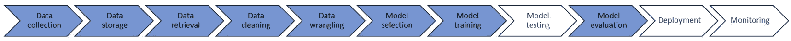
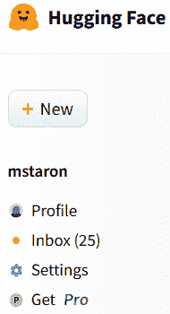
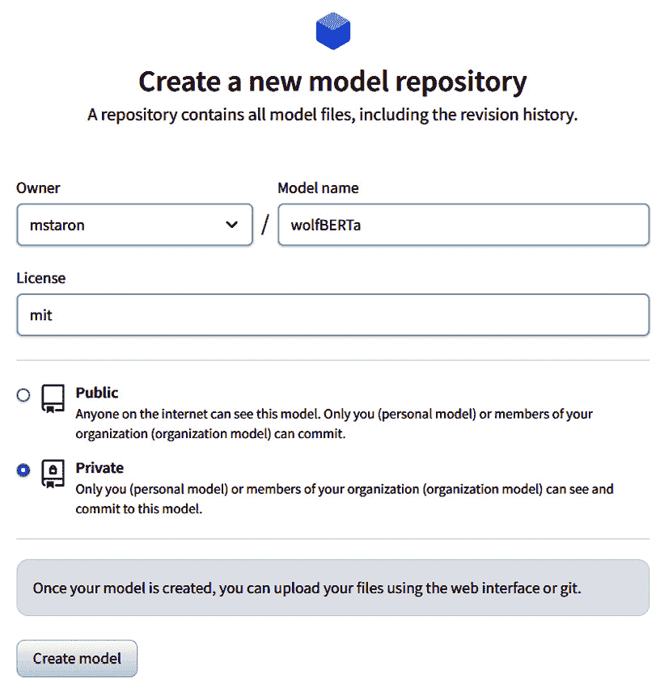
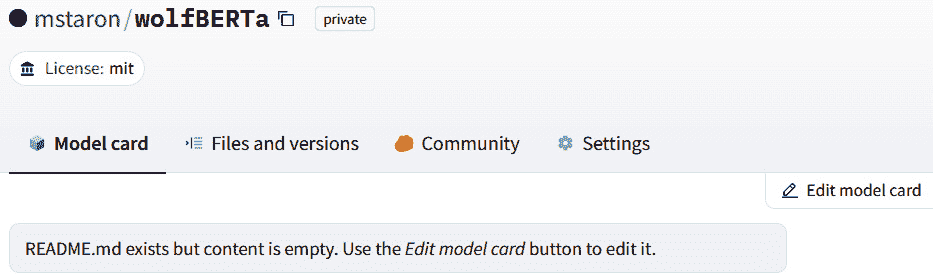
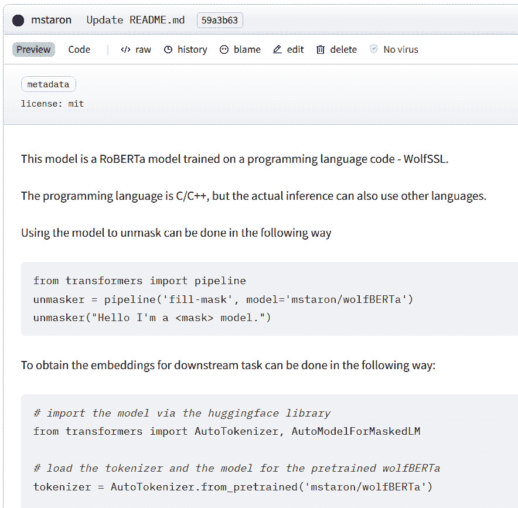
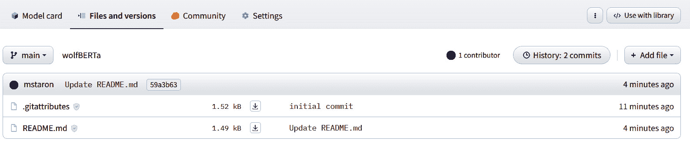
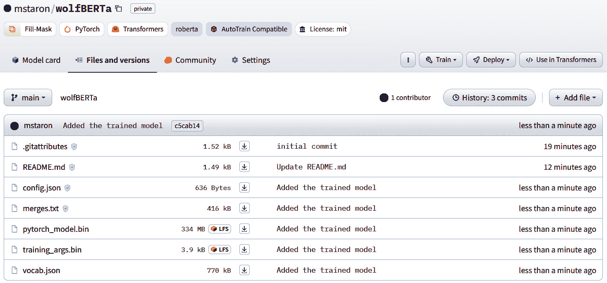
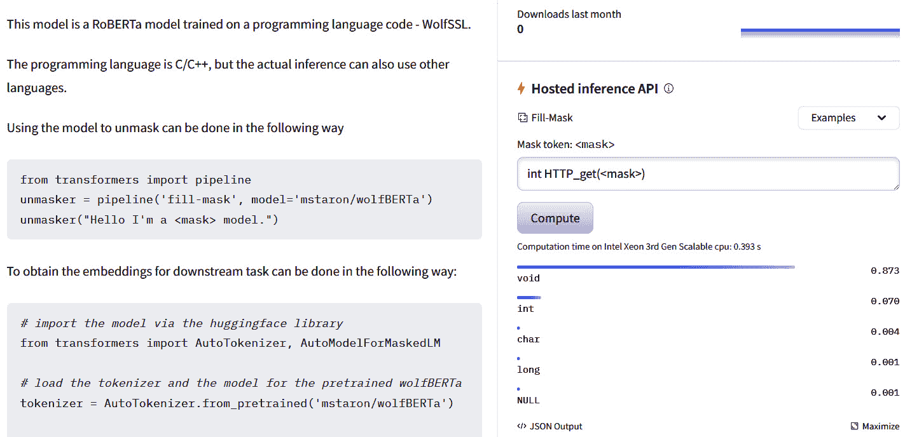

# 第十二章：设计机器学习流水线（MLOps）及其测试

MLOps，即机器学习（ML）运维，是一套旨在简化机器学习模型在生产环境中部署、管理和监控的实践和技术。它借鉴了 DevOps（开发和运维）方法的概念，将其适应机器学习所面临的独特挑战。

MLOps 的主要目标是弥合数据科学团队和运维团队之间的差距，促进协作，并确保机器学习项目能够有效地和可靠地在规模上部署。MLOps 有助于自动化和优化整个机器学习生命周期，从模型开发到部署和维护，从而提高生产中机器学习系统的效率和效果。

在本章中，我们学习如何在实践中设计和操作机器学习系统。本章展示了如何将流水线转化为软件系统，重点关注在 Hugging Face 上测试机器学习流水线和它们的部署。

在本章中，我们将介绍以下主要主题：

+   什么是机器学习流水线

+   机器学习流水线 – 如何在实际系统中使用机器学习

+   基于原始数据的流水线

+   基于特征的流水线

+   机器学习流水线的测试

+   监控运行时的机器学习系统

# 什么是机器学习流水线

毫无疑问，在过去的几年里，机器学习领域取得了显著的进步，颠覆了行业并赋予了创新应用以力量。随着对更复杂和精确的模型的需求增长，开发和有效部署它们的复杂性也在增加。机器学习系统的工业应用需要对这些基于机器学习的系统进行更严格测试和验证。为了应对这些挑战，机器学习流水线的概念应运而生，成为简化整个机器学习开发过程的关键框架，从数据预处理和特征工程到模型训练和部署。本章探讨了 MLOps 在尖端**深度学习**（**DL**）模型如**生成预训练转换器**（**GPT**）和传统经典机器学习模型中的应用。

我们首先探讨机器学习流水线的潜在概念，强调其在组织机器学习工作流程和促进数据科学家与工程师之间协作的重要性。我们综合了前几章中提出的许多知识——数据质量评估、模型推理和监控。

接下来，我们将讨论构建 GPT 模型及其类似模型的流水线的独特特性和考虑因素，利用它们的预训练特性来处理广泛的语言任务。我们探讨了在特定领域数据上微调 GPT 模型的复杂性以及将它们纳入生产系统的挑战。

在探索了 GPT 管道之后，我们将注意力转向经典机器学习模型，检查特征工程过程及其在从原始数据中提取相关信息中的作用。我们深入研究传统机器学习算法的多样化领域，了解何时使用每种方法，以及在不同场景中的权衡。

最后，我们展示了如何测试机器学习管道，并强调模型评估和验证在评估性能和确保生产环境中的鲁棒性方面的重要性。此外，我们探讨了模型监控和维护的策略，以防止概念漂移并保证持续的性能改进。

## 机器学习管道

机器学习（ML）管道是一个系统化和自动化的过程，它组织了机器学习工作流程的各个阶段。它包括准备数据、训练机器学习模型、评估其性能以及将其部署到实际应用中的步骤。机器学习管道的主要目标是简化端到端的机器学习过程，使其更加高效、可重复和可扩展。

机器学习管道通常包括以下基本组件：

+   **数据收集、预处理和整理**：在这个初始阶段，从各种来源收集相关数据，并准备用于模型训练。数据预处理涉及清理、转换和归一化数据，以确保数据适合机器学习算法。

+   **特征工程和选择**：特征工程涉及从原始数据中选择和创建有助于模型学习模式和做出准确预测的相关特征（输入变量）。适当的特征选择对于提高模型性能和减少计算开销至关重要。

+   **模型选择和训练**：在这个阶段，选择一个或多个机器学习算法，并在准备好的数据上训练模型。模型训练涉及学习数据中的潜在模式和关系，以进行预测或分类。

+   **模型评估和验证**：使用准确率、精确率、召回率、F1 分数等指标来评估训练好的模型在未见数据上的性能。通常使用交叉验证技术来确保模型的一般化能力。

+   **超参数调整**：许多机器学习算法都有超参数，这些是可以调整的参数，控制模型的行为。超参数调整涉及找到这些参数的最佳值，以提高模型性能。

+   **模型部署**：一旦模型经过训练和验证，它就会被部署到生产环境中，在那里它可以在新的、未见过的数据上进行预测。模型部署可能涉及将模型集成到现有的应用程序或系统中。

+   **模型监控和维护**：部署后，持续监控模型的性能，以检测任何性能问题或漂移。定期的维护可能包括使用新数据重新训练模型，以确保其保持准确性和时效性。

机器学习管道为管理机器学习项目的复杂性提供了一个结构化框架，使数据科学家和工程师能够更有效地协作，并确保模型可以可靠且高效地开发和部署。它促进了可重复性、可扩展性和实验的简便性，促进了高质量机器学习解决方案的开发。*图 12*.*1*展示了机器学习管道的概念模型，我们在*第二章*中介绍了它。



图 12.1 – 机器学习管道：概念概述

我们在之前的章节中介绍了蓝色阴影元素的要素，在这里，我们主要关注尚未涉及的部分。然而，在我们深入探讨这个管道的技术要素之前，让我们先介绍 MLOps 的概念。

## MLOps 的要素

MLOps 的主要目标是弥合数据科学和运维团队之间的差距，因此 MLOps 自动化并优化了整个机器学习生命周期，从模型开发到部署和维护，从而提高了生产中机器学习系统的效率和效果。

MLOps 中的关键组件和实践包括：

+   **版本控制**：应用**版本控制系统**（VCSs）如 Git 来管理和跟踪机器学习代码、数据集和模型版本的变更。这使协作、可重复性和模型改进的跟踪变得容易。

+   **持续集成和持续部署（CI/CD）**：利用 CI/CD 管道来自动化机器学习模型的测试、集成和部署。这有助于确保代码库的更改能够无缝部署到生产中，同时保持高质量标准。

+   **模型打包**：为机器学习模型创建标准化的、可重复的、可共享的容器或包，使其在不同环境中一致部署变得更容易。

+   **模型监控**：实施监控和日志记录解决方案，以实时跟踪模型的性能和行为。这有助于早期发现问题并确保模型的持续可靠性。

+   **可扩展性和基础设施管理**：设计和管理底层基础设施以支持生产中机器学习模型的需求，确保它们能够处理增加的工作负载并高效扩展。

+   **模型治理和合规性**：实施流程和工具以确保在部署和使用机器学习模型时符合法律和伦理要求、隐私法规和公司政策。

+   **协作与沟通**：促进数据科学家、工程师以及其他参与 ML 部署流程的利益相关者之间的有效沟通和协作。

通过采用 MLOps 原则，组织可以在保持模型在实际应用中的可靠性和有效性的同时，加速 ML 模型的开发和部署。这也有助于降低部署失败的风险，并在数据科学和运营团队中促进协作和持续改进的文化。

# ML 管道 – 如何在实际系统中使用 ML

在本地平台上训练和验证 ML 模型是使用 ML 管道的过程的开始。毕竟，如果我们不得不在客户的每一台计算机上重新训练 ML 模型，那么这将非常有限。

因此，我们通常将 ML 模型部署到模型仓库中。有几个流行的仓库，但使用最大社区的是 HuggingFace 仓库。在那个仓库中，我们可以部署模型和数据集，甚至创建模型可以用于实验的空间，而无需下载它们。让我们将训练好的模型部署到*第十一章*中的那个仓库。为此，我们需要在 huggingface.com 上有一个账户，然后我们就可以开始了。

## 将模型部署到 HuggingFace

首先，我们需要使用主页上的**新建**按钮创建一个新的模型，如图*图 12.2*所示：



图 12.2 – 创建模型的新按钮

然后，我们填写有关我们模型的信息，为其创建空间。*图 12.3*展示了这个过程的一个截图。在表单中，我们填写模型的名称、是否为私有或公共，并为它选择一个许可证。在这个例子中，我们选择了 MIT 许可证，这是一个非常宽松的许可证，允许每个人只要包含 MIT 许可证文本，就可以使用、重新使用和重新分发模型：



图 12.3 – 模型元数据卡片

一旦模型创建完成，我们就可以开始部署模型了。空余空间看起来就像*图 12.4*中的那样：



图 12.4 – 空余模型空间

顶部菜单包含四个选项，但前两个是最重要的 – **模型卡片**和**文件和版本**。模型卡片是对模型的简要描述。它可以包含任何类型的信息，但最常见的信息是模型的使用方法。我们遵循这个惯例，并按照*图 12.5*所示准备模型卡片：



图 12.5 – 我们 wolfBERTa 模型卡片的开头

最佳实践 #60

模型卡片应包含有关模型如何训练、如何使用它、它支持哪些任务以及如何引用模型的信息。

由于 HuggingFace 是一个社区，因此正确记录创建的模型并提供有关模型如何训练以及它们能做什么的信息非常重要。因此，我的最佳实践是将所有这些信息包含在模型卡片中。许多模型还包括有关如何联系作者以及模型在训练之前是否已经预训练的信息。

一旦模型卡片准备就绪，我们就可以转到`Readme.txt`（即模型卡片），并可以添加实际的模型文件（见*图 12.6*）：



图 12.6 – 模型的文件和版本；我们可以在右上角使用“添加文件”按钮添加模型

一旦我们点击`wolfBERTa`子文件夹。该文件夹包含以下文件：

```py
Mode                 LastWriteTime                     Name
------        --------------------        -----------------
d----l        2023-07-01     10:25        checkpoint-340000
d----l        2023-07-01     10:25        checkpoint-350000
-a---l        2023-06-27     21:30        config.json
-a---l        2023-06-27     17:55        merges.txt
-a---l        2023-06-27     21:30        pytorch_model.bin
-a---l        2023-06-27     21:30        training_args.bin
-a---l        2023-06-27     17:55        vocab.json
```

前两个条目是模型检查点；即我们在训练过程中保存的模型版本。这两个文件夹对于部署来说并不重要，因此将被忽略。其余的文件应复制到 HuggingFace 上新建的模型仓库中。

模型上传后，应该看起来像*图 12.7*中展示的那样：



图 12.7 – 上传到 HuggingFace 仓库的模型

在此之后，该模型就准备好供社区使用了。我们还可以为社区创建一个推理 API，以便他们快速测试我们的模型。一旦我们回到**模型卡片**菜单，在**托管推理 API**部分（*图 12.8*的右侧）就会自动提供给我们：



图 12.8 – 为我们的模型自动提供的托管推理 API

当我们输入`int HTTP_get(<mask>)`时，我们要求模型为该函数提供输入参数。结果显示，最可能的标记是`void`，其次是`int`标记。这两个都是相关的，因为它们是参数中使用的类型，但它们可能不会使这个程序编译，因此我们需要开发一个循环，预测程序中的不止一个标记。可能还需要更多的训练。

现在，我们有一个完全部署的模型，可以在其他应用中使用而无需太多麻烦。

## 从 HuggingFace 下载模型

我们已经看到了如何从 HuggingFace 下载模型，但为了完整性，让我们看看如何为`wolfBERTa`模型执行此操作。本质上，我们遵循模型卡片并使用以下 Python 代码片段：

```py
from transformers import pipeline
unmasker = pipeline('fill-mask', model='mstaron/wolfBERTa')
unmasker("Hello I'm a <mask> model.")
```

此代码片段下载模型并使用 `unmasker` 接口通过 `fill-mask` 管道进行推理。该管道允许您输入一个带有 `<mask>` 掩码标记的句子，模型将尝试预测最适合填充掩码位置的单词。此代码片段中的三行代码执行以下操作：

+   `from transformers import pipeline`: 这行代码从 `transformer`s 库中导入管道函数。管道函数简化了使用预训练模型进行各种**自然语言处理**（**NLP**）任务的过程。

+   `unmasker = pipeline('fill-mask', model='mstaron/wolfBERTa')`: 这行代码为任务创建了一个名为 `unmasker` 的新管道。该管道将使用预训练的 `wolfBERTa` 模型。

+   `unmasker("Hello I'm a <mask> model.")`: 这行代码利用 `unmasker` 管道来预测最适合给定句子中掩码位置的单词。`<mask>` 标记表示模型应尝试填充单词的位置。

当执行此行代码时，管道将调用 `wolfBERTa` 模型，并根据提供的句子进行预测。该模型将在 `<mask>` 标记的位置预测最佳单词以完成句子。

可以以非常相似的方式使用其他模型。像 HuggingFace 这样的社区模型中心的主要优势是它提供了一种统一管理模型和管道的绝佳方式，并允许我们在软件产品中快速交换模型。

# 基于原始数据的管道

创建完整的管道可能是一项艰巨的任务，需要为所有模型和所有类型的数据创建定制工具。它允许我们优化模型的使用方式，但需要付出大量努力。管道背后的主要理念是将机器学习的两个领域——模型及其计算能力与任务和领域数据联系起来。幸运的是，对于像 HuggingFace 这样的主要模型中心，它们提供了一个 API，可以自动提供机器学习管道。HuggingFace 中的管道与模型相关，并由基于模型架构、输入和输出的框架提供。

## 与自然语言处理相关的管道

文本分类是一个管道，旨在将文本输入分类到预定义的类别或类别中。它特别适用于**情感分析**（**SA**）、主题分类、垃圾邮件检测、意图识别等任务。该管道通常采用针对不同分类任务在特定数据集上微调的预训练模型。我们在本书的第一部分使用机器学习进行代码审查的情感分析时，已经看到了类似的功能。

下面的代码片段提供了一个示例：

```py
from transformers import pipeline
# Load the text classification pipeline
classifier = pipeline("text-classification")
# Classify a sample text
result = classifier("This movie is amazing and highly recommended!")
print(result)
```

代码片段显示，实际上我们需要实例化管道的代码有两行（粗体显示），正如我们之前所见。

文本生成是另一个允许使用预训练语言模型（如 GPT-3）根据提供的提示或种子文本生成文本的流程。它能够为各种应用生成类似人类的文本，例如聊天机器人、创意写作、**问答**（**QA**）等。

以下代码片段展示了这样的一个示例：

```py
from transformers import pipeline
# Load the text generation pipeline
generator = pipeline("text-generation")
# Generate text based on a prompt
prompt = "In a galaxy far, far away… "
result = generator(prompt, max_length=50, num_return_sequences=3)
for output in result:
    print(output['generated_text'])
```

摘要是设计用于将较长的文本总结为较短、连贯的摘要的流程。它利用了在大型数据集上针对摘要任务进行训练的基于 transformer 的模型。以下代码片段展示了该流程的示例：

```py
from transformers import pipeline
# Load the summarization pipeline
summarizer = pipeline("summarization")
# Summarize a long article
article = """
In a groundbreaking discovery, scientists have found a new species of dinosaur in South America. The dinosaur, named "Titanus maximus," is estimated to have been the largest terrestrial creature to ever walk the Earth. It belonged to the sauropod group of dinosaurs, known for their long necks and tails. The discovery sheds new light on the diversity of dinosaurs that once inhabited our planet.
"""
result = summarizer(article, max_length=100, min_length=30, do_sample=False)
print(result[0]['summary_text'])
```

HuggingFace 的`transformers` API 中还有更多流程，所以我鼓励您查看这些流程。然而，我关于流程的最佳实践是这样的：

最佳实践 #61

尝试不同的模型以找到最佳流程。

由于 API 为类似模型提供了相同的流程，因此更改模型或其版本相当简单。因此，我们可以基于具有类似（但不同）功能（但不是相同）的模型创建产品，并同时训练模型。

## 图像流程

图像处理流程专门设计用于与图像处理相关的任务。HuggingFace hub 包含这些流程中的几个，以下是一些最受欢迎的。

图像分类专门设计用于将图像分类到特定类别。这与可能是最广为人知的任务相同——将图像分类为“猫”、“狗”或“车”。以下代码示例（来自 HuggingFace 教程）展示了图像分类流程的使用：

```py
from transformers import pipeline
# first, create an instance of the image classification pipeline for the selected model
classifier = pipeline(model="microsoft/beit-base-patch16-224-pt22k-ft22k")
# now, use the pipeline to classify an image
classifier("https://huggingface.co/datasets/Narsil/image_dummy/raw/main/parrots.png")
```

前面的代码片段表明，创建图像分类流程与创建文本分析任务的流程一样容易（如果不是更容易）。

当我们想要向图像添加所谓的语义地图时，会使用图像分割流程（见*图 12.9*）：


图 12.9 – 图像的语义地图，与我们第三章中看到的一样*第三章*

下一个示例代码片段（同样来自 HuggingFace 教程）展示了包含此类流程的示例代码：

```py
from transformers import pipeline
segmenter = pipeline(model="facebook/detr-resnet-50-panoptic")
segments = segmenter("https://huggingface.co/datasets/Narsil/image_dummy/raw/main/parrots.png")
segments[0]["label"]
```

前面的代码片段创建了一个图像分割流程，使用它并将结果存储在`segments`列表中。列表的最后一行打印出第一个分割的标签。使用`segments[0]["mask"].size`语句，我们可以接收到图像地图的像素大小。

目标检测流程用于需要识别图像中预定义类别对象的任务。我们已经在*第三章*中看到了这个任务的示例。此类流程的代码看起来与前几个非常相似：

```py
from transformers import pipeline
detector = pipeline(model="facebook/detr-resnet-50")
detector("https://huggingface.co/datasets/Narsil/image_dummy/raw/main/parrots.png")
```

执行此代码将创建一个包含图像中检测到的对象的边界框列表，以及其边界框。我在使用管道处理图像方面的最佳实践与语言任务相同。

# 基于特征的管道

基于特征的管道没有特定的类，因为它们处于更低级别。它们是标准 Python 机器学习实现中的 `model.fit()` 和 `model.predict()` 语句。这些管道要求软件开发者手动准备数据，并手动处理结果；也就是说，通过实现预处理步骤，如使用独热编码将数据转换为表格，以及后处理步骤，如将数据转换为人类可读的输出。

这种管道的一个例子是预测书中前几部分中看到的缺陷；因此，它们不需要重复。

然而，重要的是，所有管道都是将机器学习领域与软件工程领域联系起来的方式。我在开发管道后的第一个活动就是对其进行测试。

# 机器学习管道的测试

机器学习管道的测试在多个层面上进行，从单元测试开始，然后向上发展到集成（组件）测试，最后到系统测试和验收测试。在这些测试中，有两个元素很重要——模型本身和数据（对于模型和预言机）。

虽然我们可以使用 Python 内置的单元测试框架，但我强烈推荐使用 Pytest 框架，因为它简单灵活。我们可以通过以下命令安装此框架：

```py
>> pip install pytest
```

这将下载并安装所需的包。

最佳实践 #62

使用像 Pytest 这样的专业测试框架。

使用专业框架为我们提供了 MLOps 原则所需的兼容性。我们可以共享我们的模型、数据、源代码以及所有其他元素，而无需繁琐地设置和安装框架本身。对于 Python，我推荐使用 Pytest 框架，因为它广为人知，被广泛使用，并且得到一个庞大社区的支持。

这里是一个下载模型并为其测试做准备代码片段：

```py
# import json to be able to read the embedding vector for the test
import json
# import the model via the huggingface library
from transformers import AutoTokenizer, AutoModelForMaskedLM
# load the tokenizer and the model for the pretrained SingBERTa
tokenizer = AutoTokenizer.from_pretrained('mstaron/SingBERTa')
# load the model
model = AutoModelForMaskedLM.from_pretrained("mstaron/SingBERTa")
# import the feature extraction pipeline
from transformers import pipeline
# create the pipeline, which will extract the embedding vectors
# the models are already pre-defined, so we do not need to train anything here
features = pipeline(
    "feature-extraction",
    model=model,
    tokenizer=tokenizer,
    return_tensor = False
)
```

这段代码用于加载和设置预训练的语言模型，特别是 `SingBERTa` 模型，使用 Hugging Face 的 `transformers` 库。它包含以下元素：

1.  从 `transformers` 库导入必要的模块：

    1.  `AutoTokenizer`：这个类用于自动选择适合预训练模型的适当分词器。

    1.  `AutoModelForMaskedLM`：这个类用于自动选择适合 **掩码语言模型**（**MLM**）任务的适当模型。

1.  加载预训练的 `SingBERTa` 模型的分词器和模型：

    1.  `tokenizer = AutoTokenizer.from_pretrained('mstaron/SingBERTa')`：这一行从 Hugging Face 模型库中加载预训练的 `SingBERTa` 模型的分词器。

    1.  `model = AutoModelForMaskedLM.from_pretrained("mstaron/SingBERTa")`：这一行加载预训练的`SingBERTa`模型。

1.  导入特征提取管道：

    1.  `from transformers import pipeline`：这一行从`transformers`库中导入管道类，这使得我们能够轻松地为各种 NLP 任务创建管道。

1.  创建特征提取管道：

    1.  `features = pipeline("feature-extraction", model=model, tokenizer=tokenizer, return_tensor=False)`：这一行创建一个用于特征提取的管道。该管道使用之前加载的预训练模型和分词器从输入文本中提取嵌入向量。`return_tensor=False`参数确保输出将以非张量格式（可能是 NumPy 数组或 Python 列表）返回。

使用这个设置，你现在可以使用`features`管道从文本输入中提取嵌入向量，而无需进行任何额外的训练，使用预训练的`SingBERTa`模型。我们之前已经看到过这个模型的使用，所以在这里，让我们专注于它的测试。以下代码片段是一个测试用例，用于检查模型是否已正确下载并且准备好使用：

```py
def test_features():
    # get the embeddings of the word "Test"
    lstFeatures = features("Test")
    # read the oracle from the json file
    with open('test.json', 'r') as f:
        lstEmbeddings = json.load(f)
    # assert the embeddings and the oracle are the same
    assert lstFeatures[0][0] == lstEmbeddings
```

这个代码片段定义了一个`test_features()`测试函数。该函数的目的是通过将管道从之前代码片段中创建的特征提取管道获得的单词`"Test"`的嵌入与存储在名为`'test.json'`的 JSON 文件中的预期嵌入进行比较来测试特征提取管道的正确性。该文件的内容是我们的预言，它是一个包含大量数字的大向量，我们用它来与实际模型输出进行比较：

+   `lstFeatures = features("Test")`：这一行使用之前定义的`features`管道提取单词`"Test"`的嵌入。`features`管道是使用预训练的`SingBERTa`模型和分词器创建的。该管道将输入`"Test"`通过分词器处理，然后通过模型，并返回嵌入向量作为`lstFeatures`。

+   `with open('test.json', 'r') as f:`：这一行使用上下文管理器（`with`语句）以读取模式打开`'test.json'`文件。

+   `lstEmbeddings = json.load(f)`：这一行读取`'test.json'`文件的内容，并将其内容加载到`lstEmbeddings`变量中。该 JSON 文件应包含表示预期嵌入的单词`"Test"`的嵌入向量的列表。

+   `assert lstFeatures[0][0] == lstEmbeddings`：这一行执行断言以检查从管道获得的嵌入向量（`lstFeatures[0][0]`）是否等于从 JSON 文件中获得的预期嵌入向量（预言）。通过检查两个列表中相同位置的元素是否相同来进行比较。

如果断言为`true`（即管道提取的嵌入向量与 JSON 文件中预期的向量相同），则测试将通过而没有任何输出。然而，如果断言为`false`（即嵌入不匹配），则测试框架（Pytest）将此测试用例标记为失败。

为了执行测试，我们可以在与我们的项目相同的目录中编写以下语句：

```py
>> pytest
```

在我们的情况下，这导致以下输出（为了简洁起见，已省略）：

```py
=================== test session starts ===================
platform win32 -- Python 3.11.4, pytest-7.4.0, pluggy-1.2.0
rootdir: C:\machine_learning_best_practices\chapter_12
plugins: anyio-3.7.0
collected 1 item
chapter_12_download_model_test.py .                 [100%]
====================== 1 passed in 4.17s ==================
```

这个片段显示，框架找到了一个测试用例（`收集了 1 个条目`）并执行了它。它还说明该测试用例在 4.17 秒内通过。

因此，接下来是我的下一个最佳实践。

最佳实践 #63

根据您的训练数据设置测试基础设施。

由于模型本质上是概率性的，因此最好基于训练数据来测试模型。这里，我的意思不是我们在机器学习（ML）的意义上测试性能，比如准确性。我的意思是测试模型是否真正工作。通过使用与训练相同的相同数据，我们可以检查模型对之前使用的数据的推理是否正确。因此，我指的是在软件工程意义上这个词的测试。

现在，类似于之前提出的语言模型，我们可以使用类似的方法来测试一个经典 ML 模型。有时这被称为零表测试。在这个测试中，我们使用只有一个数据点的简单数据来测试模型的预测是否正确。以下是设置此类测试的方法：

```py
# import the libraries pandas and joblib
import pandas as pd
import joblib
# load the model
model = joblib.load('./chapter_12_decision_tree_model.joblib')
# load the data that we used for training
dfDataAnt13 = pd.read_excel('./chapter_12.xlsx',
                            sheet_name='ant_1_3',
                            index_col=0)
```

这段代码片段使用`joblib`库加载一个 ML 模型。在这种情况下，它是我们训练经典 ML 模型时在*第十章*中使用的模型。它是一个决策树模型。

然后，程序读取我们用于训练模型的相同数据集，以确保数据的格式与训练数据集完全相同。在这种情况下，我们可以期望得到与训练数据集相同的结果。对于更复杂的模型，我们可以在模型训练后直接进行一次推理，在保存模型之前创建这样的表。

现在，我们可以在以下代码片段中定义三个测试用例：

```py
# test that the model is not null
# which means that it actually exists
def test_model_not_null():
    assert model is not None
# test that the model predicts class 1 correctly
# here correctly means that it predicts the same way as when it was trained
def test_model_predicts_class_correctly():
    X = dfDataAnt13.drop(['Defect'], axis=1)
    assert model.predict(X)[0] == 1
# test that the model predicts class 0 correctly
# here correctly means that it predicts the same way as when it was trained
def test_model_predicts_class_0_correctly():
    X = dfDataAnt13.drop(['Defect'], axis=1)
    assert model.predict(X)[1] == 0
```

第一个测试函数（`test_model_not_null`）检查`model`变量，该变量预期将包含训练好的 ML 模型，是否不是`null`。如果模型是`null`（即不存在），则`assert`语句将引发异常，表示测试失败。

第二个测试函数（`test_model_predicts_class_correctly`）检查模型是否正确预测了给定数据集的类别 1。它是通过以下方式完成的：

+   通过从`dfDataAnt13` DataFrame 中删除`'Defect'`列来准备`X`输入特征，假设`'Defect'`是目标列（类别标签）。

+   使用训练好的模型（`model.predict(X)`）对`X`输入特征进行预测。

+   断言第一次预测（`model.predict(X)[0]`）应该等于 1（类别 1）。如果模型正确预测类别 1，则测试通过；否则，将引发异常，表示测试失败。

第三个测试用例（`test_model_predicts_class_0_correctly`）检查模型是否正确预测给定数据集的类别 0。它遵循与上一个测试类似的过程：

+   通过从`dfDataAnt13` DataFrame 中删除`'Defect'`列来准备`X`输入特征。

+   使用训练好的模型（`model.predict(X)`）对`X`输入特征进行预测。

+   断言第二次预测（`model.predict(X)[1]`）应该等于 0（类别 0）。如果模型正确预测类别 0，则测试通过；否则，将引发异常，表示测试失败。

这些测试验证了训练模型的完整性和正确性，并确保它在给定的数据集上按预期执行。以下是执行测试的输出：

```py
=============== test session starts =======================
platform win32 -- Python 3.11.4, pytest-7.4.0, pluggy-1.2.0
rootdir: C:\machine_learning_best_practices\chapter_12
plugins: anyio-3.7.0
collected 4 items
chapter_12_classical_ml_test.py                      [ 75%]
chapter_12_download_model_test.py                    [100%]
================ 4 passed in 12.76s =======================
```

Pytest 框架找到了我们所有的测试，并显示其中三个（四个中的三个）位于`chapter_12_classical_ml_test.py`文件中，另一个位于`chapter_12_downloaded_model_test.py`文件中。

因此，我的下一个最佳实践是：

最佳实践#64

将模型视为单元并相应地为它们准备单元测试。

我建议将 ML 模型视为单元（与模块相同）并为其使用单元测试实践。这有助于减少模型概率性质的影响，并为我们提供了检查模型是否正确工作的可能性。它有助于在之后调试整个软件系统。

# 监控 ML 系统运行时

监控生产中的管道是 MLOps 的关键方面，以确保部署的 ML 模型的表现、可靠性和准确性。这包括几个实践。

第一个实践是记录和收集指标。这项活动包括在 ML 代码中添加日志语句，以在模型训练和推理期间捕获相关信息。要监控的关键指标包括模型准确性、数据漂移、延迟和吞吐量。流行的日志和监控框架包括 Prometheus、Grafana 以及**Elasticsearch、Logstash 和** **Kibana**（**ELK**）。

第二个是警报，它基于预定义的关键指标阈值设置警报。这有助于在生产管道中主动识别问题或异常。当警报被触发时，适当的团队成员可以被通知进行调查并迅速解决问题。

数据漂移检测是第三项活动，包括监控输入数据的分布以识别数据漂移。数据漂移指的是数据分布随时间的变化，这可能会影响模型性能。

第四个活动是性能监控，MLOps 团队持续跟踪已部署模型的性能。他们测量推理时间、预测准确度以及其他相关指标，并监控性能下降，这可能由于数据、基础设施或依赖关系的变化而引起。

除了这四个主要活动之外，MLOps 团队还有以下职责：

+   **错误分析**：使用工具分析和记录推理过程中遇到的错误，并理解错误的本质，可以帮助改进模型或识别数据或系统中的问题。

+   **模型版本控制**：跟踪模型版本及其随时间的变化性能，并在最新部署出现问题时（如果需要）回滚到之前的版本。

+   **环境监控**：使用诸如 CPU/内存利用率、网络流量等关键绩效指标监控模型部署的基础设施和环境，寻找性能瓶颈。

+   **安全和合规性**：确保部署的模型遵守安全和合规性标准，并监控访问日志和任何可疑活动。

+   **用户反馈**：收集、分析和将用户反馈融入监控和推理过程中。MLOps 从最终用户那里征求反馈，以从现实世界的角度了解模型的性能。

通过有效地监控管道，MLOps 可以迅速响应任何出现的问题，提供更好的用户体验，并维护 ML 系统的整体健康。然而，监控所有上述方面相当费力，并非所有 MLOps 团队都有资源去做。因此，我在本章的最后一条最佳实践是：

最佳实践#65

识别 ML 部署的关键方面，并相应地监控这些方面。

虽然这听起来很简单，但并不总是容易识别关键方面。我通常从优先监控基础设施和日志记录以及收集指标开始。监控基础设施很重要，因为任何问题都会迅速传播到客户那里，导致失去信誉，甚至业务损失。监控指标和日志记录为 ML 系统的运行提供了深刻的洞察，并防止了许多 ML 系统生产中的问题。

# 摘要

构建 ML 管道是本书专注于 ML 核心技术方面的部分。管道对于确保 ML 模型按照软件工程的最佳实践使用至关重要。

然而，ML 管道仍然不是一个完整的 ML 系统。它们只能提供数据的推理并提供输出。为了使管道有效运行，它们需要连接到系统的其他部分，如用户界面和存储。这就是下一章的内容。

# 参考文献

+   *A. Lima*，*L. Monteiro*，和 *A.P. Furtado*，*MLOps：实践、成熟度模型、角色、工具和挑战的系统文献综述*。*ICEIS (1)，2022:* *p. 308-320*。

+   *John, M.M.*，*Olsson, H.H.*，和 *Bosch, J.*，*迈向 MLOps：一个框架和成熟度模型*。在*2021 年第 47 届欧姆尼微软件工程和高级应用会议（SEAA）*。*2021*。*IEEE*。

+   *Staron, M. et al.*, *从演化的测量系统到自愈系统以提高可用性的工业经验*。*软件：实践与经验*，*2018*。*48(3)*：*p. 719-739*。
