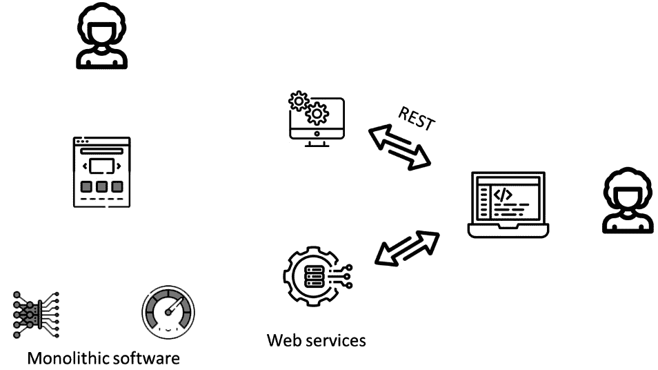
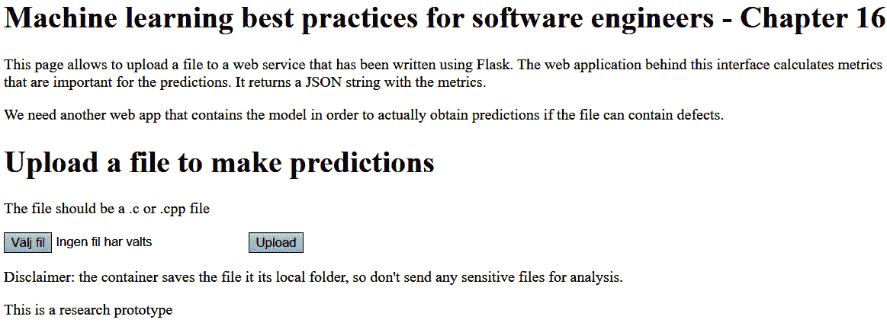
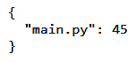
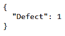

# 第十六章：在生态系统中集成机器学习系统

机器学习系统因其两个原因而获得了大量人气——它们从数据中学习的能力（我们已在整本书中探讨了这一点），以及它们被打包成网络服务的能力。

将这些机器学习系统打包成网络服务，使我们能够以非常灵活的方式将它们集成到工作流程中。我们不必编译或使用动态链接库，而是可以部署通过 HTTP 协议使用 JSON 协议进行通信的机器学习组件。我们已经看到了如何使用该协议，通过使用由 OpenAI 托管的 GPT-3 模型。在本章中，我们将探讨创建一个包含预训练机器学习模型的 Docker 容器、部署它以及将其与其他组件集成的可能性。

在本章中，我们将涵盖以下主要主题：

+   机器学习系统——软件生态系统

+   使用 Flask 在机器学习模型上创建网络服务

+   使用 Docker 部署机器学习模型

+   将网络服务组合成生态系统

# 生态系统

在软件工程的动态领域，工具、方法和范式处于不断演化的状态。推动这一变革的最有影响力的力量之一是机器学习。虽然机器学习本身是计算能力的奇迹，但它的真正天才在于将其集成到更广泛的软件工程生态系统中。本章深入探讨了在生态系统中嵌入机器学习的细微差别。生态系统是一组协同工作的软件，但在编译时并未连接。一个著名的生态系统是 PyTorch 生态系统，其中一系列库在机器学习环境中协同工作。然而，在软件工程中的机器学习生态系统中还有更多内容。

从从每次迭代中学习的自动化测试系统到适应用户行为的推荐引擎，机器学习正在重新定义软件的设计、开发和部署方式。然而，将机器学习集成到软件工程中并非简单的即插即用操作。它要求重新思考传统的工作流程，更深入地理解数据驱动决策，并致力于持续学习和适应。

随着我们深入探讨机器学习在软件工程中的集成，讨论两个关键组成部分变得至关重要：网络服务和 Docker 容器。这些技术虽然并非仅限于机器学习应用，但在软件生态系统中无缝部署和扩展机器学习驱动解决方案中发挥着关键作用。

Web 服务，特别是在微服务架构时代，为构建软件应用程序提供了一种模块化方法。通过将特定功能封装到不同的服务中，它们提供了更大的灵活性和可扩展性。当与机器学习模型结合使用时，Web 服务可以根据从数据中得出的见解提供动态的、实时的响应。例如，一个 Web 服务可能会利用机器学习模型为用户提供个性化的内容推荐或实时检测欺诈活动。

另一方面，Docker 容器已经彻底改变了软件（包括机器学习模型）的打包和部署方式。容器将应用程序及其所有依赖项封装到一个标准化的单元中，确保在不同环境中的一致行为。对于机器学习从业者来说，这意味着设置环境、管理依赖项和确保兼容性的繁琐过程得到了极大的简化。Docker 容器确保在开发者的机器上训练的机器学习模型将在生产服务器或任何其他平台上以相同的效率和精度运行。

此外，当 Web 服务和 Docker 容器结合使用时，它们为基于机器学习的微服务铺平了道路。这种架构允许快速部署可扩展的、隔离的服务，这些服务可以独立更新而不会干扰整个系统。这在机器学习领域尤其有价值，因为模型可能需要根据新数据或改进的算法进行频繁更新。

在本章中，我们将学习如何使用这两种技术来打包模型并创建基于 Docker 容器的生态系统。阅读本章后，我们将对如何通过将机器学习（ML）作为更大系统体系的一部分来扩展我们的开发有一个良好的理解——生态系统。

# 使用 Flask 在机器学习模型上创建 Web 服务

在这本书中，我们主要关注了机器学习模型的训练、评估和部署。然而，我们没有讨论对它们进行灵活结构化的需求。我们使用的是单体软件。单体软件的特点是统一的、单一的代码库结构，其中所有功能，从用户界面到数据处理，都是紧密交织并作为一个统一的单元运行的。这种设计简化了初始开发和部署，因为所有内容都捆绑在一起并一起编译。任何微小的变化都需要重新构建和重新部署整个应用程序。这使得当当代软件的演变速度很快时变得有问题。

另一方面，基于 Web 服务的软件，通常与微服务架构相关联，将应用程序分解为更小、独立的、通过网络通信的服务，通常使用 HTTP 和 REST 等协议。每个服务负责特定的功能并且独立运行。这种模块化方法提供了更大的灵活性。服务可以单独扩展、更新或重新部署，而不会影响整个系统。此外，一个服务的故障并不一定会导致整个应用程序崩溃。*图 16.1*展示了这两种类型软件之间的差异：



图 16.1 – 单体软件与基于 Web 服务的软件

在左侧，所有组件都捆绑在一起成为一个产品。用户通过用户界面与产品交互。只有一个用户可以与软件交互，更多的用户需要更多的软件安装。

在右侧，我们有一个去中心化的架构，其中每个组件都是一个独立的 Web 服务。这些组件的协调是通过一个瘦客户端完成的。如果更多的用户/客户端想要使用相同的服务，他们只需使用 HTTP REST 协议（API）将它们连接起来。

这里是我的第一条最佳实践。

最佳实践#75

在部署机器学习模型到生产环境时使用 Web 服务（RESTful API）。

虽然创建 Web 服务需要额外的努力，但它们是值得使用的。它们提供了很好的关注点分离和异步访问，同时也提供了负载均衡的巨大可能性。我们可以使用不同的服务器来运行相同的 Web 服务，从而平衡负载。

因此，让我们使用 Flask 创建第一个 Web 服务。

## 使用 Flask 创建 Web 服务

Flask 是一个框架，它允许我们通过 HTTP 协议上的 REST 接口提供对内部 API 的便捷访问。首先，我们需要安装它：

```py
pip install flask
pip install flask-restful
```

一旦我们安装了接口，我们就可以编写我们的程序。在这个例子中，我们的第一个 Web 服务计算发送给它的程序代码行数和复杂度。以下代码片段展示了这一点：

```py
from fileinput import filename
from flask import *
from radon.complexity import cc_visit
from radon.cli.harvest import CCHarvester
app = Flask(__name__)
# Dictionary to store the metrics for the file submitted
# Metrics: lines of code and McCabe complexity
metrics = {}
def calculate_metrics(file_path):
    with open(file_path, 'r') as file:
        content = file.read()
    # Count lines of code
    lines = len(content.splitlines())
    # Calculate McCabe complexity
    complexity = cc_visit(content)
    # Store the metrics in the dictionary
    metrics[file_path] = {
        'lines_of_code': lines,
        'mccabe_complexity': complexity
    }
@app.route('/')
def main():
    return render_template("index.html")
@app.route('/success', methods=['POST'])
def success():
    if request.method == 'POST':
        f = request.files['file']
        # Save the file to the server
        file_path = f.filename
        f.save(file_path)
        # Calculate metrics for the file
        calculate_metrics(file_path)
        # Return the metrics for the file
        return metrics[file_path]
@app.route('/metrics', methods=['GET'])
def get_metrics():
    if request.method == 'GET':
        return metrics
if __name__ == '__main__':
    app.run(host='0.0.0.0', debug=True)
```

首先，代码需要一些导入，然后在`app = Flask(__name__)`中初始化应用程序。然后，它创建路由——即程序将通过 REST API 进行通信的地方：

+   `@app.route('/')`：这是一个装饰器，它定义了根 URL（`"/"`）的路由。当用户访问根 URL 时，它渲染`"index.html"`模板。

+   `@app.route('/success', methods=['POST'])`：这个装饰器定义了一个针对`"/success"` URL 的路由，它期望 HTTP POST 请求。此路由用于处理文件上传、计算代码行数和计算麦卡贝复杂度。

+   `@app.route('/metrics', methods=['GET'])`: 这个装饰器定义了`"/metrics"` URL 的路由，它期望 HTTP GET 请求。它用于检索和显示度量。

+   `def main()`: 这个函数与根（`"/"`）路由相关联。当用户访问根 URL 时，它返回一个名为 `"index.html"` 的 HTML 模板。

+   `def success()`: 这个函数与`"/success"`路由相关联，它处理文件上传：

    +   它检查请求方法是否为 POST

    +   它将上传的文件保存到服务器

    +   它计算上传文件的代码行数

    +   它使用 radon 库计算 McCabe 复杂性

    +   它将度量（代码行数和 McCabe 复杂性）存储在度量字典中

    +   它以 JSON 响应返回上传文件的度量

+   `def get_metrics()`: 这个函数与`/metrics`路由相关联：

    +   它检查请求方法是否为 GET。

    +   它返回整个度量字典作为 JSON 响应。这用于调试目的，以查看会话期间上传的所有文件的度量。

+   `if __name__ == '__main__':`: 这个块确保只有当此脚本直接执行时（而不是作为模块导入时）才会运行 Web 应用程序。

+   `app.run(host='0.0.0.0', debug=True)`: 这以调试模式启动 Flask 应用程序，允许你在开发期间看到详细的错误消息。

然后，应用程序被执行 – `app.run(debug=True)` 以启用调试模式启动 Flask 应用程序。这意味着对代码所做的任何更改都将自动重新加载服务器，并且任何错误都将显示在浏览器中。一旦执行，就会出现以下网页（请注意，网页的代码必须位于`templates`子文件夹中，并且应包含以下代码）：

```py
<html>
<head>
    <title>Machine learning best practices for software engineers: Chapter 16 - Upload a file to make predictions</title>
</head>
<body>
    <h1>Machine learning best practices for software engineers - Chapter 16</h1>
    <p>This page allows to upload a file to a web service that has been written using Flask. The web application behind this interface calculates metrics that are important for the predictions. It returns a JSON string with the metrics.  </p>
    <p>We need another web app that contains the model in order to actually obtain predictions if the file can contain defects. </p>
    <h1>Upload a file to make predictions</h1>
    <p>The file should be a .c or .cpp file</p>
    <form action = "/success" method = "post" enctype="multipart/form-data">
        <input type="file" name="file" />
        <input type = "submit" value="Upload">
    </form>
    <p>Disclaimer: the container saves the file it its local folder, so don't send any sensitive files for analysis.</p>
    <p>This is a research prototype</p>
</body>
</html>
```

页面包含一个简单的表单，允许我们上传文件到服务器：



图 16.2 – 我们可以发送文件以计算代码行数的网页。这是将此信息发送到网络服务的一种方式

上传文件后，我们得到结果：



图 16.3 – 计算代码行数的结果

大多数传输都是由 Flask 框架完成的，这使得开发过程非常愉快。然而，仅仅计算代码行数和复杂性并不是一个很好的机器学习模型。因此，我们需要创建另一个包含机器学习模型本身的代码的 Web 服务。

因此，我的下一个最佳实践是关于双接口。

最佳实践#76

使用网站和 API 为 Web 服务。

虽然我们总是可以设计 Web 服务，使其只接受 JSON/REST 调用，但我们应尝试提供不同的接口。之前展示的 Web 界面允许我们测试 Web 服务，甚至向其发送数据，而无需编写单独的程序。

## 创建包含预训练 ML 模型的 Web 服务

ML 模型 Web 服务的代码遵循相同的模板。它使用 Flask 框架来提供 Web 服务的 REST API。以下是显示此 Web 服务的代码片段：

```py
#
# This is a flask web service to make predictions on the data
# that is sent to it. It is meant to be used with the measurement instrument
#
from flask import *
from joblib import load
import pandas as pd
app = Flask(__name__)   # create an app instance
# entry point where we send JSON with two parameters:
# LOC and MCC
# and make prediction using make_prediction method
@app.route('/predict/<loc>/<mcc>')
def predict(loc,mcc):
    return {'Defect': make_prediction(loc, mcc)}
@app.route('/')
def hello():
    return 'Welcome to the predictor! You need to send a GET request with two parameters: LOC (lines of code) and MCC (McCabe complexity))'
# the main method for making the prediction
# using the model that is stored in the joblib file
def make_prediction(loc, mcc):
    # now read the model from the joblib file
    # and predict the defects for the X_test data
    dt = load('dt.joblib')
    # input data to the model
    input = {'LOC': loc,
             'MCC': mcc}
    # convert input data into dataframe
    X_pred = pd.DataFrame(input, index=[0])
    # make prediction
    y_pred = dt.predict(X_pred)
    # return the prediction
    # as an integer
    return int(y_pred[0])
# run the application
if __name__ == '__main__':
    app.run(debug=True)
```

此 Web 服务的主要入口点接受两个参数：`@app.route('/predict/<loc>/<mcc>')`。它使用这两个参数作为实例化模型并使用它进行预测的方法的参数 – `make_prediction(loc, mcc)`。`make_prediction`方法从一个`joblib`文件中读取模型，并使用它来预测模块是否包含缺陷。我使用`joblib`来存储这个模型，因为它基于 NumPy 数组。然而，如果一个模型基于 Python 对象（例如，当它是一个来自 scikit-learn 库的估计器时），那么最好使用 pickle 而不是`joblib`。它返回包含结果的 JSON 字符串。*图 16**.4*说明了我们可以如何使用网页浏览器调用这个 Web 服务 – 而不是地址栏：



图 16.4 – 使用预测端点获取此模块中预测的缺陷数量

地址栏将参数发送给模型，响应是一个 JSON 字符串，表示这个模块很可能包含一个缺陷。嗯，这并不令人惊讶，因为我们说这个模块有 10 行代码，复杂度为 100（不切实际，但可能）。

这两个 Web 服务已经为我们提供了一个例子，说明了 REST API 可以多么强大。现在，让我们学习如何使用 Docker 打包它，这样我们就可以更容易地部署这些 Web 服务。

# 使用 Docker 部署 ML 模型

要创建一个包含我们新创建的 Web 服务（或两个）的 Docker 容器，我们需要在我们的系统上安装 Docker。一旦我们安装了 Docker，我们就可以用它来编译容器。

将 Web 服务打包到 Docker 容器中的关键部分是 Dockerfile。它是一个如何组装容器以及如何启动它的配方。如果你感兴趣，我在*进一步阅读*部分建议了一本关于 Docker 容器的优秀书籍，这样你可以了解更多关于如何创建比这本书中更高级的组件。

在我们的例子中，我们需要两个容器。第一个将是测量仪器的容器。该容器的代码如下：

```py
FROM alpine:latest
RUN apk update
RUN apk add py-pip
RUN apk add --no-cache python3-dev
RUN pip install --upgrade pip
WORKDIR /app
COPY . /app
RUN pip --no-cache-dir install -r requirements.txt
CMD ["python3", "main.py"]
```

这个 Dockerfile 正在设置基于 Alpine Linux 的环境，安装 Python 和必要的开发包，将您的应用程序代码复制到镜像中，然后在容器启动时作为默认命令运行 Python 脚本。这是为 Python 应用程序创建 Docker 镜像的常见模式。让我们更仔细地看看：

1.  `FROM alpine:latest`: 这一行指定了 Docker 镜像的基础镜像。在这种情况下，它使用 Alpine Linux 发行版，这是一个轻量级和极简的发行版，通常用于 Docker 容器。`latest` 指的是 Docker Hub 上可用的 Alpine 镜像的最新版本。

1.  `RUN apk update`: 这个命令更新了 Alpine Linux 包管理器（`apk`）的包索引，以确保它有关于可用包的最新信息。

1.  `RUN apk add py-pip`: 这里，它安装了 `py-pip` 包，这是 Python 包的包管理器。这一步是使用 `pip` 安装 Python 包所必需的。

1.  `RUN apk add --no-cache python3-dev`: 这安装了 `python3-dev` 包，它提供了 Python 的开发文件。这些开发文件在编译或构建具有本地代码扩展的 Python 包时通常需要。

1.  `RUN pip install --upgrade pip`: 这个命令将 `pip` 包管理器升级到最新版本。

1.  `WORKDIR /app`: 这为后续命令设置了 `/app` 作为工作目录。这个目录是应用程序代码将被复制的地方，并且它成为运行命令的默认目录。

1.  `COPY . /app`: 这将当前目录（Dockerfile 所在的位置）的内容复制到 Docker 镜像中的 `/app` 目录。这通常包括应用程序代码，包括 `requirements.txt`。

1.  `RUN pip --no-cache-dir install -r requirements.txt`: 这安装了在 `requirements.txt` 文件中指定的 Python 依赖项。`--no-cache-dir` 标志用于确保在安装过程中不使用缓存，这有助于减小 Docker 镜像的大小。

1.  `CMD ["python3", "main.py"]`: 这指定了从该镜像启动容器时默认要运行的命令。在这种情况下，它使用 `python3` 运行 `main.py` Python 脚本。这是我们基于此 Docker 镜像运行容器时将要执行的命令。

在 *第 8 步* 中，我们需要 `requirements.txt` 文件。在这种情况下，文件不需要太复杂——它需要使用与网络服务脚本相同的导入：

```py
flask
flask-restful
```

现在，我们已经准备好编译 Docker 容器。我们可以通过以下命令从命令行完成：

```py
docker build -t measurementinstrument .
```

一旦编译过程完成，我们可以启动容器：

```py
docker run -t -p 5000:5000 measurementinstrument
```

前面的命令告诉 Docker 环境我们要启动名为 `measurementinstrument` 的容器，并将网络服务的端口（`5000`）映射到本地机器上的相同端口。现在，如果我们导航到该地址，我们可以上传文件，就像在没有 Docker 容器运行网络服务时一样。

最佳实践 #77

为了版本控制和可移植性，将你的网络服务 Docker 化。

使用 Docker 是确保我们的网络服务可移植性的方法之一。一旦我们将网络服务打包到容器中，我们就可以确信它将在任何能够运行 Docker 的系统上表现相同。这使得我们的生活比使用 `requirements.txt` 文件来设置 Python 环境更加容易。

一旦我们有了包含测量仪器的容器，我们可以将第二个网络服务（带有预测模型）打包到另一个网络服务中。下面的 Dockerfile 执行此操作：

```py
FROM ubuntu:latest
RUN apt update && apt install python3 python3-pip -y
WORKDIR /app
COPY . /app
RUN pip --no-cache-dir install -q -r requirements.txt
CMD ["python3", "main.py"]
```

这个 Dockerfile 设置了一个基于 Ubuntu 的环境，安装 Python 3 和 `pip`，将你的应用程序代码复制到镜像中，从 `requirements.txt` 安装 Python 依赖项，然后在容器启动时运行 Python 脚本作为默认命令。请注意，我们在这里使用 Ubuntu 而不是 Alpine Linux。这不是偶然的。Alpine Linux 上没有 scikit-learn 软件包，因此我们需要使用 Ubuntu（该 Python 软件包可用）：

+   `FROM ubuntu:latest`: 这一行指定了 Docker 镜像的基础镜像。在这种情况下，它使用 Ubuntu Linux 分发的最新版本作为基础镜像。`latest` 指的是 Docker Hub 上可用的 Ubuntu 镜像的最新版本。

+   `RUN apt update && apt install python3 python3-pip -y`: 这个命令用于更新 Ubuntu 软件包管理器 (`apt`) 的软件包索引，然后安装 Python 3 和 Python 3 的 `pip`。`-y` 标志用于在安装过程中自动回答“是”以响应任何提示。

+   `WORKDIR /app`: 这个命令设置后续命令的工作目录为 `/app`。这个目录是应用程序代码将被复制的地方，并且它成为运行命令的默认目录。

+   `COPY . /app`: 这个命令将当前目录（Dockerfile 所在的位置）的内容复制到 Docker 镜像中的 `/app` 目录。

+   `RUN pip --no-cache-dir install -q -r requirements.txt`: 这个命令使用 pip 安装 `requirements.txt` 文件中指定的 Python 依赖项。这里使用的标志如下：

    +   `--no-cache-dir`: 这个标志确保在安装过程中不使用缓存，这有助于减少 Docker 镜像的大小。

    +   `-q`: 这个标志以静默模式运行 `pip`，意味着它将产生更少的输出，这可以使 Docker 构建过程不那么冗长。

+   `CMD ["python3", "main.py"]`：这指定了从该镜像启动容器时运行的默认命令。在这种情况下，它使用`python3`运行`main.py` Python 脚本。这是我们基于此 Docker 镜像运行容器时将执行的命令。

在这种情况下，需求代码稍微长一点，尽管不是特别复杂：

```py
scikit-learn
scipy
flask
flask-restful
joblib
pandas
numpy
```

我们使用类似的命令编译 Docker 容器：

```py
docker build -t predictor .
```

我们使用类似的命令执行它：

```py
docker run -t -p 5001:5000 predictor
```

现在，我们应该能够使用相同的浏览器命令来连接。请注意，我们使用不同的端口，这样新的 web 服务就不会与之前的冲突。

# 将 web 服务组合成生态系统

现在，让我们开发将连接这两个 web 服务的软件。为此，我们将创建一个新的文件，该文件将向第一个 web 服务发送一个文件，获取数据，然后将数据发送到第二个 web 服务进行预测：

```py
import requests
# URL of the Flask web service for file upload
upload_url = 'http://localhost:5000/success'  # Replace with the actual URL
# URL of the Flask web service for predictions
prediction_url = 'http://localhost:5001/predict/'  # Replace with the actual URL
def upload_file_and_get_metrics(file_path):
    try:
        # Open and read the file
        with open(file_path, 'rb') as file:
            # Create a dictionary to hold the file data
            files = {'file': (file.name, file)}
            # Send a POST request with the file to the upload URL
            response = requests.post(upload_url, files=files)
            response.raise_for_status()
            # Parse the JSON response
            json_result = response.json()
            # Extract LOC and mccabe_complexity from the JSON result
            loc = json_result.get('lines_of_code')
            mccabe_complexity = json_result.get('mccabe_complexity')[0][-1]
            if loc is not None and mccabe_complexity is not None:
                print(f'LOC: [3], McCabe Complexity: {mccabe_complexity}')
                return loc, mccabe_complexity
            else:
                print('LOC or McCabe Complexity not found in JSON result.')
    except Exception as e:
        print(f'Error: {e}')
def send_metrics_for_prediction(loc, mcc):
    try:
        # Create the URL for making predictions
        predict_url = f'{prediction_url}[3]/[4]'
        # Send a GET request to the prediction web service
        response = requests.get(predict_url)
        response.raise_for_status()
        # Parse the JSON response to get the prediction
        prediction = response.json().get('Defect')
        print(f'Prediction: {prediction}')
    except Exception as e:
        print(f'Error: {e}')
if __name__ == '__main__':
    # Specify the file path you want to upload
    file_path = './main.py'  # Replace with the actual file path
    # Upload the specified file and get LOC and McCabe Complexity
    loc, mcc = upload_file_and_get_metrics(file_path)
    send_metrics_for_prediction(loc, mcc)
```

这段代码演示了如何将文件上传到 Flask web 服务以获取度量，然后将这些度量发送到另一个 Flask web 服务进行预测。它使用`requests`库来处理两个服务之间的 HTTP 请求和 JSON 响应：

+   `import requests`：这一行导入了`requests`库，该库用于向 web 服务发送 HTTP 请求。

+   `upload_url`：这个变量存储了用于文件上传的 Flask web 服务的 URL。

+   `prediction_url`：这个变量存储了用于预测的 Flask web 服务的 URL。

+   `upload_file_and_get_metrics`：

    +   这个函数接受`file_path`作为输入，它应该是你想要上传并获取度量的文件路径

    +   它向`upload_url`发送 POST 请求以上传指定的文件

    +   在上传文件后，它解析从文件上传服务收到的 JSON 响应

    +   它从 JSON 响应中提取`"lines_of_code"`和`"mccabe_complexity"`字段

    +   提取的度量被打印出来，并且函数返回它们

+   `send_metrics_for_prediction`：

    +   这个函数接受`loc`（代码行数）和`mcc`（McCabe 复杂性）值作为输入

    +   它通过将`loc`和`mcc`值附加到`prediction_url`来构造用于预测的 URL

    +   它使用构造的 URL 向预测服务发送 GET 请求

    +   在收到预测后，它解析 JSON 响应以获取`"Defect"`值

    +   预测结果被打印到控制台

+   `if __name__ == '__main__'`：这个块指定了你想要上传并获取度量的文件路径（`file_path`）。它调用`upload_file_and_get_metrics`函数上传文件并获取度量（代码行数和 McCabe 复杂性）。然后，它调用`send_metrics_for_prediction`函数将这些度量发送给预测，并打印预测结果。

这个程序表明我们可以将我们的模型打包成一个 Web 服务（带或不带容器），然后使用它，正如*图 16**.1*所建议的那样。这种设计整个系统的方式使我们能够使软件更具可扩展性和健壮性。根据使用场景，我们可以调整 Web 服务并在多个不同的服务器上部署，以实现可扩展性和负载均衡。

# 摘要

在本章中，我们学习了如何使用 Web 服务和 Docker 部署机器学习模型。尽管我们只部署了两个 Web 服务，但我们可以看出它可以成为一个机器学习生态系统。通过分离预测和测量，我们可以分离计算密集型工作负载（预测）和数据收集部分的管道。由于模型可以部署在任何服务器上，我们可以重用服务器，从而减少这些模型的能源消耗。

有了这些，我们来到了这本书的最后一章技术章节。在下一章，我们将探讨机器学习的新趋势，并展望未来，至少是猜测未来。

# 参考文献

+   *Masse, M., REST API 设计规则手册：设计一致的 RESTful Web 服务接口。2011: “O’Reilly* *Media, Inc.”.*

+   *Raj, P.，J.S. Chelladhurai 和 V. Singh，学习 Docker。2015: Packt* *Publishing Ltd.*

+   *Staron, M.等，重症监护中的鲁棒机器学习——软件工程和医学视角。在 2021 年 IEEE/ACM 首届人工智能工程-人工智能软件工程（WAIN）研讨会。2021. IEEE.*

+   *McCabe, T.J., 复杂度度量。IEEE 软件工程 Transactions，1976(4):* *p. 308-320.*
