# 第三章：基本算法 - 分类、回归和聚类

在上一章中，我们回顾了用于机器学习的关键 Java 库以及它们带来的好处。在本章中，我们将最终动手实践。我们将更深入地了解基本的机器学习任务，如分类、回归和聚类。每个主题将介绍分类、回归和聚类的算法。示例数据集将小、简单且易于理解。

本章将涵盖以下主题：

+   加载数据

+   过滤属性

+   构建分类、回归和聚类模型

+   评估模型

# 在开始之前

在开始之前，从[`www.cs.waikato.ac.nz/ml/weka/downloading.html`](http://www.cs.waikato.ac.nz/ml/weka/downloading.html)下载 Weka 的最新稳定版本（写作时为 Weka 3.8）。

有多个下载选项可用。您希望将 Weka 作为库添加到源代码中，因此请确保跳过自解压可执行文件，并下载以下截图所示的 ZIP 存档。解压存档，并在解压的存档中找到`weka.jar`：

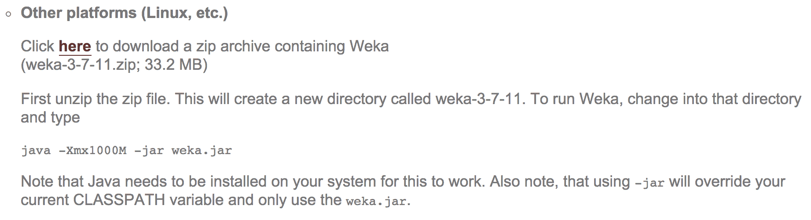

我们将使用 Eclipse IDE 来展示示例；请按照以下步骤操作：

1.  开始一个新的 Java 项目。

1.  右键点击项目属性，选择 Java Build Path，点击库标签，然后选择添加外部 JAR 文件。

1.  导航到解压 Weka 存档，并选择`weka.jar`文件。

就这样；我们已经准备好实现基本的机器学习技术了！

# 分类

我们将从最常用的机器学习技术开始：分类。正如我们在第一章中回顾的那样，主要思想是自动在输入变量和结果之间建立映射。在接下来的几节中，我们将探讨如何加载数据、选择特征、在 Weka 中实现基本分类器以及评估其性能。

# 数据

对于这个任务，我们将查看`ZOO`数据库。该数据库包含 101 个动物数据条目，每个动物用 18 个属性描述，如下表所示：

| animal | aquatic | fins |
| --- | --- | --- |
| hair | predator | legs |
| feathers | toothed | tail |
| eggs | backbone | domestic |
| milk | breathes | cat size |
| airborne | venomous | type |

数据集中的示例条目是一只狮子，具有以下属性：

+   `animal`: 狮子

+   `hair`: true

+   `feathers`: false

+   `eggs`: false

+   `milk`: true

+   `airborne`: false

+   `aquatic`: false

+   `predator`: true

+   `toothed`: true

+   `backbone`: true

+   `breathes`: true

+   `venomous`: false

+   `fins`: false

+   `legs`: 4

+   `tail`: true

+   `domestic`: false

+   `catsize`: true

+   `type`: 哺乳动物

我们的任务将是构建一个模型来预测结果变量`animal`，给定所有其他属性作为输入。

# 加载数据

在我们开始分析之前，我们将加载数据到 Weka 的**属性-关系文件格式**（**ARFF**）并打印加载的实例总数。每个数据样本都包含在一个`DataSource`对象中，而完整的数据集，包括元信息，由`Instances`对象处理。

为了加载数据，我们将使用接受多种文件格式并将其转换为`Instances`的`DataSource`对象：

```py
DataSource source = new DataSource("data/zoo.arff"); 
Instances data = source.getDataSet(); 
System.out.println(data.numInstances() + " instances loaded."); 
System.out.println(data.toString()); 
```

这将提供以下输出，显示加载的实例数量：

```py
101 instances loaded.
```

我们也可以通过调用`data.toString()`方法来打印完整的数据集。

我们的任务是学习一个模型，能够预测未来示例中的`animal`属性，对于这些示例我们知道其他属性，但不知道`animal`标签。因此，我们将从训练集中删除`animal`属性。我们将通过使用`Remove()`过滤器过滤掉动物属性来完成此操作。

首先，我们设置一个参数字符串表，指定必须删除第一个属性。剩余的属性将用作我们的数据集以训练分类器：

```py
Remove remove = new Remove(); 
String[] opts = new String[]{ "-R", "1"}; 
```

最后，我们调用`Filter.useFilter(Instances, Filter)`静态方法来对所选数据集应用过滤器：

```py
remove.setOptions(opts); 
remove.setInputFormat(data); 
data = Filter.useFilter(data, remove); 
System.out.println(data.toString()); 
```

# 特征选择

如在第一章《应用机器学习快速入门》中所述，预处理步骤之一是关注特征选择，也称为**属性选择**。目标是选择一个相关属性的子集，该子集将用于学习模型。为什么特征选择很重要？属性集越小，模型越简单，用户也越容易理解。这通常需要更短的训练时间并减少过拟合。

属性选择可以考虑到类别值，也可以不考虑。在前一种情况下，属性选择算法评估不同的特征子集，并计算一个表示所选属性质量的分数。我们可以使用不同的搜索算法，如穷举搜索和最佳优先搜索，以及不同的质量分数，如信息增益、基尼指数等。

Weka 通过一个`AttributeSelection`对象支持此过程，该对象需要两个额外的参数：一个计算属性信息量的评估器，以及一个根据评估器分配的分数对属性进行排序的排序器。

我们将使用以下步骤进行选择：

1.  在本例中，我们将使用信息增益作为评估者，并根据它们的信息增益分数对特征进行排序：

```py
InfoGainAttributeEval eval = new InfoGainAttributeEval(); 
Ranker search = new Ranker(); 
```

1.  我们将初始化一个`AttributeSelection`对象并设置评估器、排序器和数据：

```py
AttributeSelection attSelect = new AttributeSelection(); 
attSelect.setEvaluator(eval); 
attSelect.setSearch(search); 
attSelect.SelectAttributes(data); 
```

1.  我们将打印属性`indices`的顺序列表，如下所示：

```py
int[] indices = attSelect.selectedAttributes(); 
System.out.println(Utils.arrayToString(indices)); 
```

此过程将提供以下结果作为输出：

```py
12,3,7,2,0,1,8,9,13,4,11,5,15,10,6,14,16 
```

最具信息量的属性是`12`（鳍）、`3`（蛋）、`7`（水生）、`2`（毛发）等等。基于这个列表，我们可以移除额外的、非信息量的特征，以便帮助学习算法实现更准确和更快的模型。

什么会决定保留属性的数量？没有关于确切数字的经验法则；属性的数量取决于数据和问题。属性选择的目的在于选择对模型更有益的属性，因此最好关注属性是否在改进模型。

# 学习算法

我们已经加载了数据并选择了最佳特征，我们现在准备学习一些分类模型。让我们从基本的决策树开始。

在 Weka 中，决策树是通过`J48`类实现的，它是 Quinlan 著名的 C4.5 决策树学习器（Quinlan，1993）的重新实现。

我们将通过以下步骤构建决策树：

1.  我们初始化一个新的`J48`决策树学习器。我们可以通过字符串表传递额外的参数——例如，控制模型复杂性的树剪枝（参考第一章，*应用机器学习快速入门*）。在我们的情况下，我们将构建一个未剪枝的树；因此，我们将传递单个`-U`参数，如下所示：

```py
J48 tree = new J48(); 
String[] options = new String[1]; 
options[0] = "-U"; 

tree.setOptions(options); 
```

1.  我们将调用`buildClassifier(Instances)`方法来初始化学习过程：

```py
tree.buildClassifier(data); 
```

1.  构建好的模型现在存储在`tree`对象中。我们可以通过调用`toString()`方法提供整个`J48`未剪枝树：

```py
System.out.println(tree); 
```

输出将如下所示：

```py
    J48 unpruned tree
    ------------------

    feathers = false
    |   milk = false
    |   |   backbone = false
    |   |   |   airborne = false
    |   |   |   |   predator = false
    |   |   |   |   |   legs <= 2: invertebrate (2.0)
    |   |   |   |   |   legs > 2: insect (2.0)
    |   |   |   |   predator = true: invertebrate (8.0)
    |   |   |   airborne = true: insect (6.0)
    |   |   backbone = true
    |   |   |   fins = false
    |   |   |   |   tail = false: amphibian (3.0)
    |   |   |   |   tail = true: reptile (6.0/1.0)
    |   |   |   fins = true: fish (13.0)
    |   milk = true: mammal (41.0)
    feathers = true: bird (20.0)

    Number of Leaves  : 9

    Size of the tree : 17

```

输出的树总共有`17`个节点，其中`9`个是终端节点（叶子）。

另一种表示树的方法是利用内置的`TreeVisualizer`树查看器，如下所示：

```py
TreeVisualizer tv = new TreeVisualizer(null, tree.graph(), new PlaceNode2()); 
JFrame frame = new javax.swing.JFrame("Tree Visualizer"); 
frame.setSize(800, 500); 
frame.setDefaultCloseOperation(JFrame.EXIT_ON_CLOSE); 
frame.getContentPane().add(tv); 
frame.setVisible(true); 
tv.fitToScreen(); 
```

上述代码将产生以下输出框架：

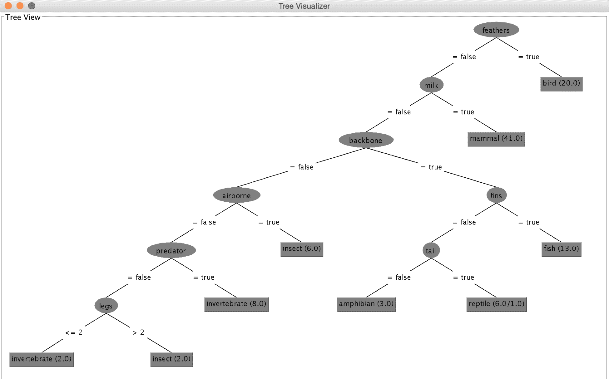

决策过程从顶部节点开始，也称为根节点。节点标签指定将要检查的属性值。在我们的例子中，首先，我们检查`feathers`属性的值。如果羽毛存在，我们跟随右侧分支，这会引导我们到标记为`bird`的叶子，表示有`20`个示例支持这个结果。如果羽毛不存在，我们跟随左侧分支，这会引导我们到`milk`属性。我们再次检查属性的值，并跟随与属性值匹配的分支。我们重复这个过程，直到达到叶子节点。

我们可以通过遵循相同的步骤构建其他分类器：初始化分类器，传递控制模型复杂性的参数，并调用`buildClassifier(Instances)`方法。

在下一节中，你将学习如何使用训练好的模型为标签未知的新示例分配类标签。

# 对新数据进行分类

假设我们记录了一个我们不知道标签的动物的属性；我们可以从学习到的分类模型中预测其标签。我们将使用以下动物来完成这个过程：


首先，我们构建一个描述新样本的特征向量，如下所示：

```py
double[] vals = new double[data.numAttributes()]; 
vals[0] = 1.0; //hair {false, true} 
vals[1] = 0.0;  //feathers {false, true} 
vals[2] = 0.0;  //eggs {false, true} 
vals[3] = 1.0;  //milk {false, true} 
vals[4] = 0.0;  //airborne {false, true} 
vals[5] = 0.0;  //aquatic {false, true} 
vals[6] = 0.0;  //predator {false, true} 
vals[7] = 1.0;  //toothed {false, true} 
vals[8] = 1.0;  //backbone {false, true} 
vals[9] = 1.0;  //breathes {false, true} 
vals[10] = 1.0;  //venomous {false, true} 
vals[11] = 0.0;  //fins {false, true} 
vals[12] = 4.0;  //legs INTEGER [0,9] 
vals[13] = 1.0;  //tail {false, true} 
vals[14] = 1.0;  //domestic {false, true} 
vals[15] = 0.0;  //catsize {false, true} 
DenseInstance myUnicorn = new DenseInstance(1.0, vals);
myUnicorn.setDataset(data); 
```

然后，我们在模型上调用`classify(Instance)`方法，以获取类值。该方法返回标签索引，如下所示：

```py
double result = tree.classifyInstance(myUnicorn); 
System.out.println(data.classAttribute().value((int) result)); 
```

这将输出`mammal`类标签。

# 评估和预测误差指标

我们构建了一个模型，但我们不知道它是否值得信赖。为了估计其性能，我们可以应用在第一章，《应用机器学习快速入门》中解释的交叉验证技术。

Weka 提供了一个`Evaluation`类来实现交叉验证。我们传递模型、数据、折数和初始随机种子，如下所示：

```py
Classifier cl = new J48(); 
Evaluation eval_roc = new Evaluation(data); 
eval_roc.crossValidateModel(cl, data, 10, new Random(1), new Object[] {}); 
System.out.println(eval_roc.toSummaryString()); 
```

评估结果存储在`Evaluation`对象中。

通过调用`toString()`方法，可以调用最常用的一组指标。请注意，输出不会区分回归和分类，因此请确保注意有意义的指标，如下所示：

```py
    Correctly Classified Instances          93               92.0792 %
    Incorrectly Classified Instances         8                7.9208 %
    Kappa statistic                          0.8955
    Mean absolute error                      0.0225
    Root mean squared error                  0.14  
    Relative absolute error                 10.2478 %
    Root relative squared error             42.4398 %
    Coverage of cases (0.95 level)          96.0396 %
    Mean rel. region size (0.95 level)      15.4173 %
    Total Number of Instances              101  

```

在分类中，我们关注的是正确/错误分类的实例数量。

# 混淆矩阵

此外，我们可以通过检查混淆矩阵来检查特定错误分类发生在哪里。混淆矩阵显示了特定类值是如何被预测的：

```py
double[][] confusionMatrix = eval_roc.confusionMatrix(); 
System.out.println(eval_roc.toMatrixString()); 
```

最终得到的混淆矩阵如下：

```py
    === Confusion Matrix ===

      a  b  c  d  e  f  g   <-- classified as
     41  0  0  0  0  0  0 |  a = mammal
      0 20  0  0  0  0  0 |  b = bird
      0  0  3  1  0  1  0 |  c = reptile
      0  0  0 13  0  0  0 |  d = fish
      0  0  1  0  3  0  0 |  e = amphibian
      0  0  0  0  0  5  3 |  f = insect
      0  0  0  0  0  2  8 |  g = invertebrate

```

第一行的列名对应于分类节点分配的标签。然后，每一行额外的对应于一个实际的真实类值。例如，第二行对应于具有`mammal`真实类标签的实例。在列行中，我们读到所有哺乳动物都被正确分类为哺乳动物。在第四行，`reptiles`，我们注意到有三个被正确分类为`reptiles`，而一个被分类为`fish`，另一个被分类为`insect`。混淆矩阵让我们了解我们的分类模型可能犯的错误类型。

# 选择分类算法

朴素贝叶斯是机器学习中最为简单、高效和有效的归纳算法之一。当特征相互独立时，这在现实世界中很少见，但从理论上讲是最佳的，即使有依赖特征，其性能也令人惊讶地具有竞争力（张，2004）。主要缺点是它无法学习特征如何相互作用；例如，尽管你喜欢加柠檬或牛奶的茶，但你讨厌同时加这两种东西的茶。

决策树的主要优点是它是一个易于解释和说明的模型，正如我们在示例中所研究的。它可以处理名义和数值特征，你不必担心数据是否线性可分。

以下是一些其他分类算法的示例：

+   `weka.classifiers.rules.ZeroR`: 这预测多数类，并被认为是一个基线；也就是说，如果你的分类器的性能比平均值预测器差，那么它不值得考虑。

+   `weka.classifiers.trees.RandomTree`: 这构建了一个在每个节点考虑 *K* 个随机选择的属性的树。

+   `weka.classifiers.trees.RandomForest`: 这构建了一组（森林）随机树，并使用多数投票对新实例进行分类。

+   `weka.classifiers.lazy.IBk`: 这是一个能够根据交叉验证选择适当邻居值的 k-最近邻分类器。

+   `weka.classifiers.functions.MultilayerPerceptron`: 这是一个基于神经网络的分类器，它使用反向传播对实例进行分类。网络可以手动构建，或由算法创建，或两者兼而有之。

+   `weka.classifiers.bayes.NaiveBayes`: 这是一个使用估计类（其中数值估计精度值基于训练数据的分析选择）的朴素贝叶斯分类器。

+   `weka.classifiers.meta.AdaBoostM1`: 这是一个通过使用 `AdaBoost M1` 方法来提升名义类分类器的类。只能解决名义类问题。这通常可以显著提高性能，但有时会过拟合。

+   `weka.classifiers.meta.Bagging`: 这是一个用于通过袋装法减少方差分类器的类。这可以执行分类和回归，具体取决于基学习器。

# 使用 Encog 进行分类

在上一节中，你看到了如何使用 Weka 库进行分类。在本节中，我们将快速查看如何通过使用 Encog 库实现相同的功能。Encog 要求我们构建一个模型来进行分类。从 [`github.com/encog/encog-java-core/releases`](https://github.com/encog/encog-java-core/releases) 下载 Encog 库。下载后，将 `.jar` 文件添加到 Eclipse 项目中，如本章开头所述。

对于这个例子，我们将使用 `.csv` 格式的 `iris` 数据集；它可以从 [`archive.ics.uci.edu/ml/datasets/Iris`](https://archive.ics.uci.edu/ml/datasets/Iris) 下载。从下载路径中，将 `iris.data.csv` 文件复制到你的数据目录。此文件包含 150 种不同花朵的数据。它包含关于花朵的四个不同测量值，最后一列是标签。

我们现在将执行分类，按照以下步骤进行：

1.  我们将使用 `VersatileMLDataSet` 方法来加载文件并定义所有四个列。下一步是调用 `analyze` 方法，它将读取整个文件并找到统计参数，如均值、标准差等：

```py
File irisFile = new File("data/iris.data.csv");
VersatileDataSource source = new CSVDataSource(irisFile, false, CSVFormat.DECIMAL_POINT);

VersatileMLDataSet data = new VersatileMLDataSet(source); 
data.defineSourceColumn("sepal-length", 0, ColumnType.continuous); 
data.defineSourceColumn("sepal-width", 1, ColumnType.continuous); 
data.defineSourceColumn("petal-length", 2, ColumnType.continuous); 
data.defineSourceColumn("petal-width", 3, ColumnType.continuous); 

ColumnDefinition outputColumn = data.defineSourceColumn("species", 4, ColumnType.nominal);
data.analyze(); 
```

1.  下一步是定义输出列。然后，是时候对数据进行归一化；但在那之前，我们需要根据以下模型类型来决定数据将如何归一化：

```py
data.defineSingleOutputOthersInput(outputColumn); 

EncogModel model = new EncogModel(data); 
model.selectMethod(data, MLMethodFactory.TYPE_FEEDFORWARD);

model.setReport(new ConsoleStatusReportable()); 
data.normalize(); 
```

1.  下一步是在训练集上拟合模型，留出测试集。我们将保留 30%的数据，如第一个参数`0.3`所指定；下一个参数指定我们想要随机打乱数据。`1001`表示有一个 1001 的种子值，因此我们使用`holdBackValidation`模型：

```py
model.holdBackValidation(0.3, true, 1001);
```

1.  现在，是时候根据测量值和标签来训练模型并分类数据了。交叉验证将训练数据集分成五个不同的组合：

```py
model.selectTrainingType(data); 
MLRegression bestMethod = (MLRegression)model.crossvalidate(5, true); 
```

1.  下一步是显示每个折叠的结果和错误：

```py
System.out.println( "Training error: " + EncogUtility.calculateRegressionError(bestMethod, model.getTrainingDataset())); 
System.out.println( "Validation error: " + EncogUtility.calculateRegressionError(bestMethod, model.getValidationDataset())); 
```

1.  现在，我们将开始使用以下代码块来使用模型预测值：

```py
while(csv.next()) { 
            StringBuilder result = new StringBuilder(); 
            line[0] = csv.get(0); 
            line[1] = csv.get(1); 
            line[2] = csv.get(2); 
            line[3] = csv.get(3); 
            String correct = csv.get(4); 
            helper.normalizeInputVector(line,input.getData(),false); 
            MLData output = bestMethod.compute(input); 
            String irisChosen = helper.denormalizeOutputVectorToString(output)[0]; 

            result.append(Arrays.toString(line)); 
            result.append(" -> predicted: "); 
            result.append(irisChosen); 
            result.append("(correct: "); 
            result.append(correct); 
            result.append(")"); 

            System.out.println(result.toString()); 
        } 
```

这将产生类似于以下输出的结果：

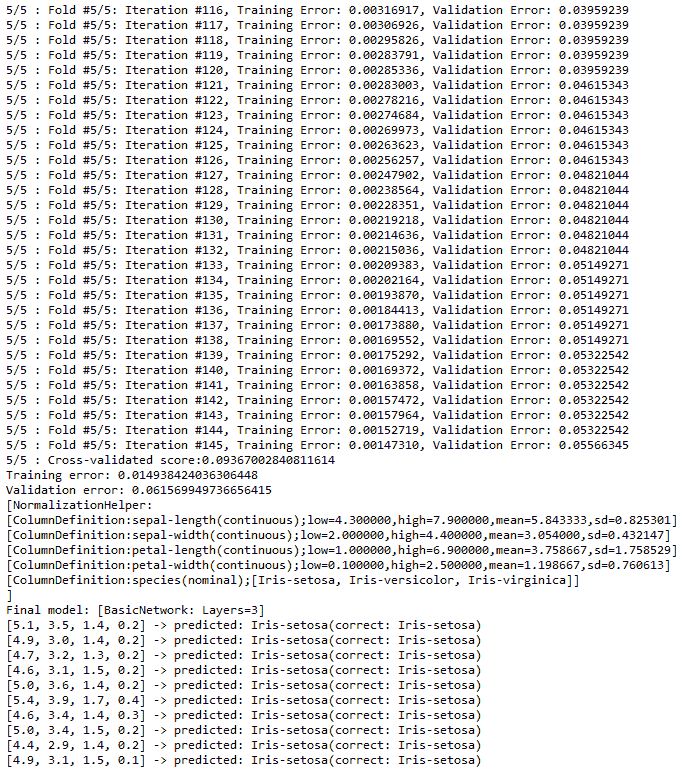

Encog 在`MLMethodFactory`中支持许多其他选项，如 SVM、PNN 等。

# 使用大规模在线分析进行分类

**大规模在线分析**（**MOA**），如第二章 Java Libraries and Platforms for Machine Learning 中所述，是另一个可以用于分类的库。它主要设计用于与流一起工作。如果它与流一起工作，将会有大量的数据；那么，我们如何评估模型呢？在传统的批量学习模式下，我们通常将数据分为训练集和测试集，如果数据有限，则首选交叉验证。在流处理中，数据似乎无限，交叉验证证明是昂贵的。我们可以使用以下两种方法：

+   **保留**：当数据已经分为两个预定义的部分时，这很有用。它给出了当前分类器的估计，如果它与当前数据相似。这种相似性在保留集和当前数据之间很难保证。

+   **交错测试-然后训练，或预 quential**：在这个方法中，模型在用于训练之前先被测试。因此，模型总是对其从未见过的数据进行测试。在这种情况下，不需要保留方案。它使用可用的数据。随着时间的推移，这种方法将提高分类的准确性。

MOA 提供了多种生成数据流的方法。首先，从[`moa.cms.waikato.ac.nz/downloads/`](https://moa.cms.waikato.ac.nz/downloads/)下载 MOA 库。将下载的`.jar`文件添加到 Eclipse 中，就像我们在本章开头为 Weka 所做的那样。我们将使用 MOA 提供的 GUI 工具来了解如何使用 MOA 进行流处理。要启动 GUI，请确保`moa.jar`和`sizeofag.jar`在当前路径中；然后在命令提示符中运行以下命令：

```py
$ java -cp moa.jar -javaagent:sizeofag.jar moa.gui.GUI
```

它将显示以下输出：

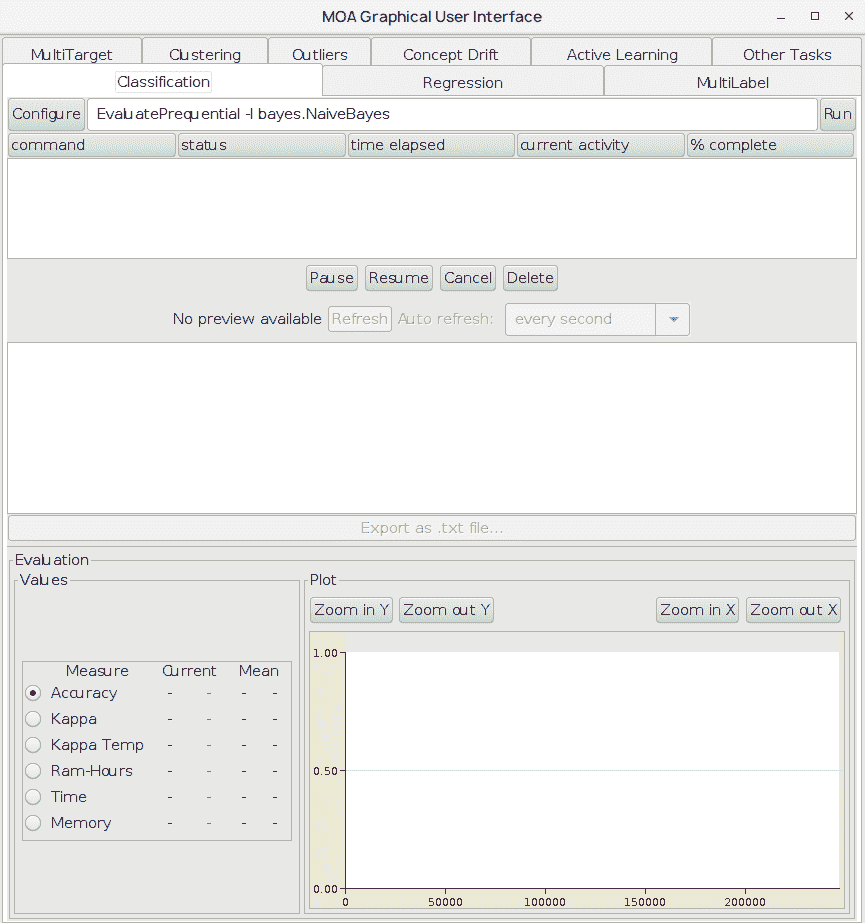

我们可以看到它有分类、回归、聚类、异常值等选项。点击“配置”按钮将显示用于创建分类器的屏幕。它提供了各种学习者和流来工作，如下面的截图所示：

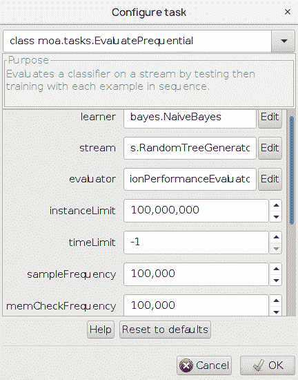

以下是一个使用`RandomTreeGenerator`、`NaiveBayes`和`HoeffdingTree`运行的示例：

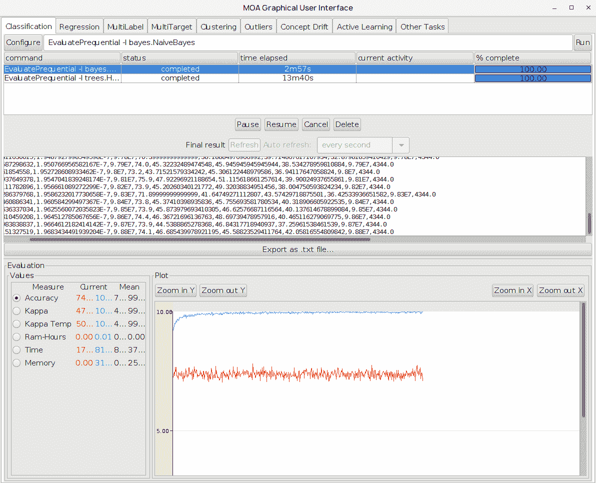

# 评估

评估是模型开发后的下一个重要任务。它让您决定模型在给定数据集上的表现是否良好，并确保它能够处理它从未见过的数据。评估框架主要使用以下功能：

+   **错误估计**：这使用保留或交错测试和训练方法来估计错误。K 折交叉验证也被使用。

+   **性能指标**：使用 Kappa 统计量，它对流分类器更敏感。

+   **统计验证**：在比较评估分类器时，我们必须考虑随机和非随机实验之间的差异。McNemar 测试是流中最受欢迎的测试，用于评估两个分类器之间差异的统计显著性。如果我们只使用一个分类器，参数估计的置信区间表明其可靠性。

+   **过程的成本度量**：由于我们处理的是流数据，可能需要访问第三方或基于云的解决方案来获取和处理数据，因此考虑了每小时使用成本和内存成本用于评估目的。

# 基线分类器

批量学习导致了在不同范式下许多分类器的开发，例如分而治之、懒惰学习器、核方法、图形模型等。现在，如果我们转向相同的流，我们需要了解如何使它们对流中的大数据集进行增量化和快速处理。我们必须从模型复杂性与模型更新速度的角度来思考，这是需要关注的主要权衡。

**多数类算法**是最简单的分类器之一，它被用作基线。它也被用作决策树叶子的默认分类器。另一个是**无变化分类器**，它预测新实例的标签。朴素贝叶斯算法以其计算能力和简单性成本低而闻名。它是一个增量算法，非常适合流。

# 决策树

决策树是一种非常流行的分类技术，使得模型易于解释和可视化。它基于树结构。它根据属性值来划分或分割节点，而树的叶子通常落在多数类分类器上。在流数据中，Hoeffding 树是决策树的一个非常快速的算法；它等待新实例的到来，而不是重用实例。它为大量数据构建树。**概念自适应快速决策树**（**CVFDT**）处理漂移的概念，它通过滑动窗口保持模型与实例的一致性。其他树包括**超快速树森林**（**UFFT**）、Hoeffding 自适应树、穷举二叉树等等。

# 惰性学习

在流处理上下文中，**k 最近邻**（**KNN**）是最方便的批量方法。使用滑动窗口来确定尚未分类的新实例的 KNN。它通常使用最近 1,000 个实例作为滑动窗口。当滑动窗口滑动时，它也处理概念漂移。

# 主动学习

我们都知道分类器在标记数据上表现良好，但流数据并不总是如此。例如，流数据可能未标记。标记数据成本高昂，因为它需要人工干预来标记未标记的数据。我们理解流数据生成大量数据。主动学习算法只为选择性数据执行标记。要标记的数据是从适合池设置的历 史数据中决定的。需要定期重新训练以决定是否需要为传入的实例标记标签。标记数据的一个简单策略是使用随机策略。这也被称为基线策略，它要求为每个传入的实例请求一个标签，概率为标记预算。另一种策略是为当前分类器最不自信的实例请求一个标签。这可能效果不错，但很快，分类器就会耗尽其预算或达到其阈值。

# 回归

我们将通过分析一个能源效率数据集（Tsanas 和 Xifara，2012）来探讨基本的回归算法。我们将根据建筑物的构造特征，如表面、墙体和屋顶面积；高度；玻璃面积；和紧凑性，研究建筑物的供暖和冷却负荷需求。研究人员使用模拟器设计了 12 种不同的房屋配置，同时改变 18 个建筑特征。总共模拟了 768 个不同的建筑物。

我们的首要目标是系统地分析每个建筑特征对目标变量（即供暖或冷却负荷）的影响。第二个目标是比较经典线性回归模型与其他方法的性能，例如 SVM 回归、随机森林和神经网络。为此任务，我们将使用 Weka 库。

# 加载数据

从[`archive.ics.uci.edu/ml/datasets/Energy+efficiency`](https://archive.ics.uci.edu/ml/datasets/Energy+efficiency)下载能源效率数据集。

数据集以 Excel 的 XLSX 格式存储，无法被 Weka 读取。我们可以通过点击文件 | 另存为，在保存对话框中选择`.csv`格式将其转换为**逗号分隔值**（**CSV**），如下所示截图。确认只保存活动工作表（因为其他所有工作表都是空的），并确认继续，以丢失一些格式化功能。现在，文件已准备好由 Weka 加载：


在文本编辑器中打开文件，检查文件是否正确转换。可能会有一些可能导致问题的细微问题。例如，在我的导出中，每一行都以双分号结尾，如下所示：

```py
X1;X2;X3;X4;X5;X6;X7;X8;Y1;Y2;; 
0,98;514,50;294,00;110,25;7,00;2;0,00;0;15,55;21,33;; 
0,98;514,50;294,00;110,25;7,00;3;0,00;0;15,55;21,33;; 
```

要删除重复的分号，可以使用查找和替换功能：查找`;;`并将其替换为`;`。

第二个问题是我的文件在文档末尾有一个长长的空行列表，可以删除，如下所示：

```py
0,62;808,50;367,50;220,50;3,50;5;0,40;5;16,64;16,03;; 
;;;;;;;;;;; 
;;;;;;;;;;; 
```

现在，我们已经准备好加载数据。让我们打开一个新文件，并使用 Weka 的转换器编写一个简单的数据导入函数，用于读取 CSV 格式的文件，如下所示：

```py
import weka.core.Instances; 
import weka.core.converters.CSVLoader; 
import java.io.File; 
import java.io.IOException; 

public class EnergyLoad { 

  public static void main(String[] args) throws IOException { 

    // load CSV 
    CSVLoader loader = new CSVLoader();
    loader.setFieldSeparator(","); 
    loader.setSource(new File("data/ENB2012_data.csv")); 
    Instances data = loader.getDataSet(); 

    System.out.println(data); 
  } 
} 
```

数据已加载！让我们继续。

# 分析属性

在分析属性之前，让我们先尝试理解我们正在处理的内容。总共有八个属性描述建筑特征，还有两个目标变量，即供暖和冷却负荷，如下表所示：

| **属性** | **属性名称** |
| --- | --- |
| `X1` | 相对紧凑度 |
| `X2` | 表面积 |
| `X3` | 墙面积 |
| `X4` | 屋顶面积 |
| `X5` | 总高度 |
| `X6` | 方向 |
| `X7` | 玻璃面积 |
| `X8` | 玻璃面积分布 |
| `Y1` | 供暖负荷 |
| `Y2` | 冷却负荷 |

# 建立和评估回归模型

我们将通过设置类属性在特征位置来学习供暖负荷的模型：

```py
data.setClassIndex(data.numAttributes() - 2); 
```

第二个目标变量，冷却负荷，现在可以删除：

```py
//remove last attribute Y2 
Remove remove = new Remove(); 
remove.setOptions(new String[]{"-R", data.numAttributes()+""}); 
remove.setInputFormat(data);
data = Filter.useFilter(data, remove); 
```

# 线性回归

我们将从一个基本的线性回归模型开始，使用`LinearRegression`类实现。类似于分类示例，我们将初始化一个新的模型实例，传递参数和数据，并调用`buildClassifier(Instances)`方法，如下所示：

```py
import weka.classifiers.functions.LinearRegression; 
... 
data.setClassIndex(data.numAttributes() - 2);
LinearRegression model = new LinearRegression(); 
model.buildClassifier(data); 
System.out.println(model);
```

存储在对象中的学习模型可以通过调用`toString()`方法提供，如下所示：

```py
    Y1 =

        -64.774  * X1 +
         -0.0428 * X2 +
          0.0163 * X3 +
         -0.089  * X4 +
          4.1699 * X5 +
         19.9327 * X7 +
          0.2038 * X8 +
         83.9329

```

线性回归模型构建了一个函数，该函数线性组合输入变量以估计加热负荷。特征前的数字解释了特征对目标变量的影响：符号对应于正/负影响，而幅度对应于其重要性。例如，特征 `X1` 的相对紧凑性与加热负荷呈负相关，而玻璃面积呈正相关。这两个特征也对最终的加热负荷估计有显著影响。模型的性能可以通过交叉验证技术进行评估。

十折交叉验证如下：

```py
Evaluation eval = new Evaluation(data); 
eval.crossValidateModel(model, data, 10, new Random(1), new String[]{}); 
System.out.println(eval.toSummaryString()); 
```

我们可以提供常见的评估指标，包括相关系数、平均绝对误差、相对绝对误差等，作为输出，如下所示：

```py
Correlation coefficient                  0.956  
Mean absolute error                      2.0923 
Root mean squared error                  2.9569 
Relative absolute error                 22.8555 % 
Root relative squared error             29.282  % 
Total Number of Instances              768      
```

# 使用 Encog 进行线性回归

现在，我们将快速查看如何使用 Encog 创建回归模型。我们将使用之前章节中使用的数据集，即“加载数据”。以下步骤展示了如何创建模型：

1.  为了加载数据，我们将使用 `VersatileMLDataSet` 函数，如下所示：

```py
File datafile = new File("data/ENB2012_data.csv");
VersatileDataSource source = new CSVDataSource(datafile, true, CSVFormat.DECIMAL_POINT);
VersatileMLDataSet data = new VersatileMLDataSet(source); 
data.defineSourceColumn("X1", 0, ColumnType.continuous); 
data.defineSourceColumn("X2", 1, ColumnType.continuous); 
data.defineSourceColumn("X3", 2, ColumnType.continuous); 
data.defineSourceColumn("X4", 3, ColumnType.continuous);
data.defineSourceColumn("X5", 4, ColumnType.continuous);
data.defineSourceColumn("X6", 5, ColumnType.continuous);
data.defineSourceColumn("X7", 6, ColumnType.continuous);
data.defineSourceColumn("X8", 7, ColumnType.continuous);
```

1.  由于我们有两个输出，`Y1` 和 `Y2`，它们可以通过使用 `defineMultipleOutputsOthersInput` 函数添加，如下所示：

```py
ColumnDefinition outputColumn1 = data.defineSourceColumn("Y1", 8,    ColumnType.continuous);
ColumnDefinition outputColumn2 = data.defineSourceColumn("Y2", 9,  ColumnType.continuous);
ColumnDefinition outputscol [] = {outputColumn1, outputColumn2};
data.analyze();

data.defineMultipleOutputsOthersInput(outputscol);
```

1.  下一步是使用 `FEEDFORWARD` 实例开发一个简单的回归模型：

```py
EncogModel model = new EncogModel(data); 
model.selectMethod(data, MLMethodFactory.TYPE_FEEDFORWARD);
model.setReport(new ConsoleStatusReportable());

data.normalize();
model.holdBackValidation(0.3, true, 1001);
model.selectTrainingType(data);
MLRegression bestMethod = (MLRegression)model.crossvalidate(5, true);            
NormalizationHelper helper = data.getNormHelper(); 

System.out.println(helper.toString()); 
System.out.println("Final model: " + bestMethod); 
```

现在，我们的回归模型已经准备好了。输出中的最后几行如下截图所示：

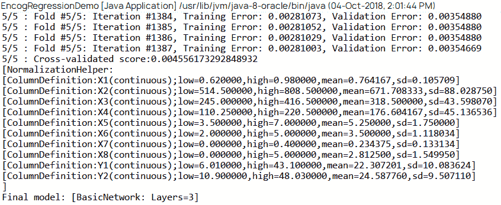

# 使用 MOA 进行回归

使用 MOA 进行回归需要我们使用图形用户界面。您可以从 [`www.cs.waikato.ac.nz/~bernhard/halifax17/census.arff.gz`](http://www.cs.waikato.ac.nz/~bernhard/halifax17/census.arff.gz) 下载数据集。

以下步骤展示了如何执行回归：

1.  使用以下命令启动 MOA 图形用户界面：

```py
$ java -cp moa.jar -javaagent:sizeofag-1.0.4.jar moa.gui.GUI
```

1.  选择“回归”选项卡并点击“配置”，如下截图所示：

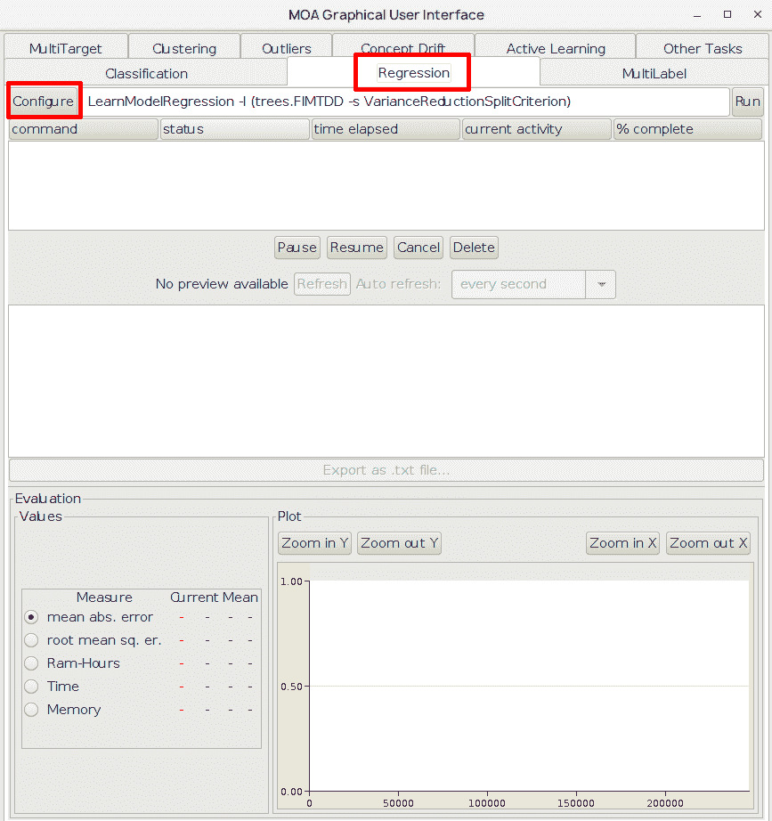

1.  我们将使用下载的 `.arff` 文件进行回归。当我们点击前一步中的“配置”时，将显示“配置任务”窗口，如下截图所示：

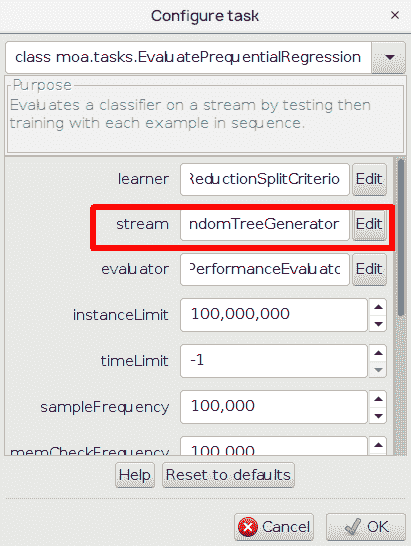

1.  在“流”选项中点击“编辑”并选择 ArffFileStream；选择我们下载的 `.arff` 文件，如下截图所示：

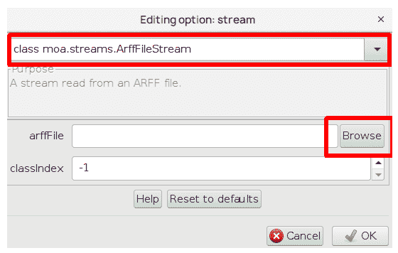

1.  在 classIndex 中指定 `-1`，这将第一个属性设置为目标。在所有弹出窗口中点击“确定”，然后点击“运行”。由于人口普查文件包含大量数据需要处理，这将花费一些时间，如下截图所示：

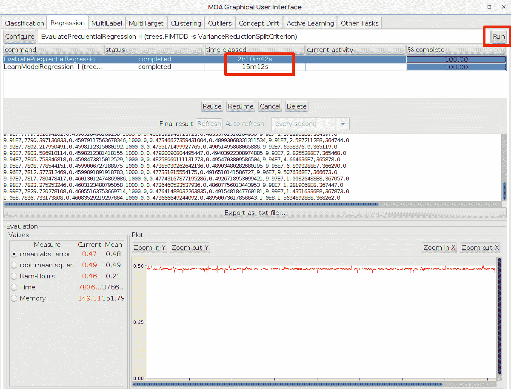

# 回归树

另一种方法是构建一组回归模型，每个模型对应数据的一部分。以下图显示了回归模型和回归树之间的主要区别。回归模型构建一个最适合所有数据的单一模型。另一方面，回归树构建一组回归模型，每个模型模拟数据的一部分，如图右侧所示。与回归模型相比，回归树可以更好地拟合数据，但函数是分段线性图，在建模区域之间有跳跃，如下面的图所示：

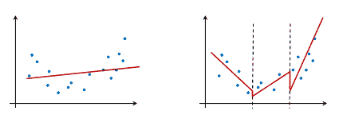

在 Weka 中，回归树是在`M5`类中实现的。模型构建遵循相同的范例：初始化模型，传递参数和数据，然后调用`buildClassifier(Instances)`方法，如下所示：

```py
import weka.classifiers.trees.M5P; 
... 
M5P md5 = new M5P(); 
md5.setOptions(new String[]{""}); 
md5.buildClassifier(data);  
System.out.println(md5); 
```

诱导模型是一个叶子节点中有方程的树，如下所示：

```py
    M5 pruned model tree:
    (using smoothed linear models)

    X1 <= 0.75 : 
    |   X7 <= 0.175 : 
    |   |   X1 <= 0.65 : LM1 (48/12.841%)
    |   |   X1 >  0.65 : LM2 (96/3.201%)
    |   X7 >  0.175 : 
    |   |   X1 <= 0.65 : LM3 (80/3.652%)
    |   |   X1 >  0.65 : LM4 (160/3.502%)
    X1 >  0.75 : 
    |   X1 <= 0.805 : LM5 (128/13.302%)
    |   X1 >  0.805 : 
    |   |   X7 <= 0.175 : 
    |   |   |   X8 <= 1.5 : LM6 (32/20.992%)
    |   |   |   X8 >  1.5 : 
    |   |   |   |   X1 <= 0.94 : LM7 (48/5.693%)
    |   |   |   |   X1 >  0.94 : LM8 (16/1.119%)
    |   |   X7 >  0.175 : 
    |   |   |   X1 <= 0.84 : 
    |   |   |   |   X7 <= 0.325 : LM9 (20/5.451%)
    |   |   |   |   X7 >  0.325 : LM10 (20/5.632%)
    |   |   |   X1 >  0.84 : 
    |   |   |   |   X7 <= 0.325 : LM11 (60/4.548%)
    |   |   |   |   X7 >  0.325 : 
    |   |   |   |   |   X3 <= 306.25 : LM12 (40/4.504%)
    |   |   |   |   |   X3 >  306.25 : LM13 (20/6.934%)

    LM num: 1
    Y1 = 
      72.2602 * X1 
      + 0.0053 * X3 
      + 11.1924 * X7 
      + 0.429 * X8 
      - 36.2224

    ...

    LM num: 13
    Y1 = 
      5.8829 * X1 
      + 0.0761 * X3 
      + 9.5464 * X7 
      - 0.0805 * X8 
      + 2.1492

    Number of Rules : 13

```

该树有`13`个叶子节点，每个对应一个线性方程。前面的输出在以下图中可视化：

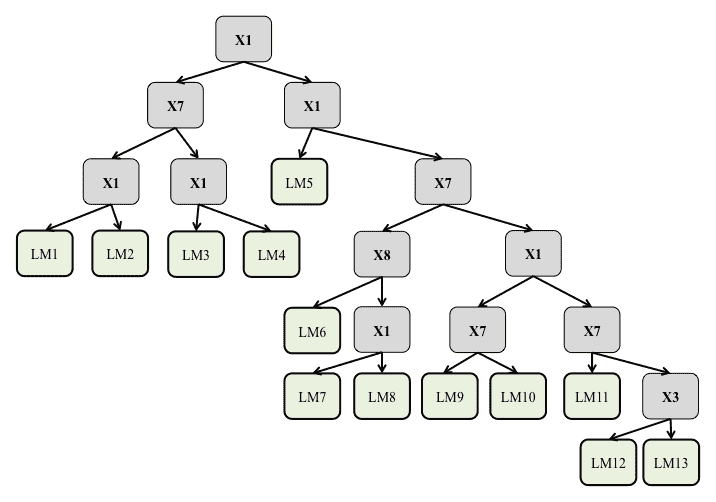

该树可以像分类树一样阅读。最重要的特征位于树的顶部。终端节点，即叶子节点，包含一个线性回归模型，解释了到达该树部分的数据。

评估将提供以下结果作为输出：

```py
    Correlation coefficient                  0.9943
    Mean absolute error                      0.7446
    Root mean squared error                  1.0804
    Relative absolute error                  8.1342 %
    Root relative squared error             10.6995 %
    Total Number of Instances              768     
```

# 避免常见回归问题的技巧

首先，我们必须使用先前的研究和领域知识来确定哪些特征应包含在回归中。检查文献、报告和以前的研究，了解哪些类型的特征有效，以及一些合理的变量来建模你的问题。假设你有一组带有随机数据的特征；高度可能存在几个特征与目标变量相关（即使数据是随机的）。

我们必须保持模型简单，以避免过拟合。奥卡姆剃刀原则指出，你应该选择一个最能解释你的数据且假设最少的模型。在实践中，模型可以简单到只有两个到四个预测特征。

# 聚类

与监督分类器相比，聚类的目标是识别未标记数据集中的内在群体。它可以应用于识别同质群体的代表性示例，找到有用和合适的分组，或找到不寻常的示例，例如异常值。

我们将通过分析一个银行数据集来演示如何实现聚类。该数据集包含 11 个属性，描述了 600 个实例，包括年龄、性别、地区、收入、婚姻状况、子女、汽车拥有状态、储蓄活动、当前活动、抵押状态和 PEP。在我们的分析中，我们将通过应用**期望最大化（EM**）聚类来尝试识别客户的常见群体。

EM 算法的工作原理如下：给定一组聚类，EM 首先为每个实例分配一个属于特定聚类的概率分布。例如，如果我们从三个聚类——即 A、B 和 C——开始，一个实例可能会得到 0.70、0.10 和 0.20 的概率分布，分别属于 A、B 和 C 聚类。在第二步中，EM 重新估计每个类别的概率分布的参数向量。算法重复这两个步骤，直到参数收敛或达到最大迭代次数。

在 EM 中使用的聚类数量可以手动设置或通过交叉验证自动设置。确定数据集中聚类数量的另一种方法包括肘部方法。此方法查看特定数量聚类解释的方差百分比。该方法建议增加聚类数量，直到额外的聚类不会添加太多信息，即它解释的额外方差很少。

# 聚类算法

构建聚类模型的过程与构建分类模型的过程非常相似，即加载数据并构建模型。聚类算法在`weka.clusterers`包中实现，如下所示：

```py
import java.io.BufferedReader; 
import java.io.FileReader; 

import weka.core.Instances; 
import weka.clusterers.EM; 

public class Clustering { 

  public static void main(String args[]) throws Exception{ 

    //load data 
    Instances data = new Instances(new BufferedReader
       (new FileReader("data/bank-data.arff"))); 

    // new instance of clusterer 
    EM model = new EM(); 
    // build the clusterer 
    model.buildClusterer(data); 
    System.out.println(model); 

  } 
} 
```

模型识别了以下六个聚类：

```py
    EM
    ==

    Number of clusters selected by cross validation: 6

                     Cluster
    Attribute              0        1        2        3        4        5
                       (0.1)   (0.13)   (0.26)   (0.25)   (0.12)   (0.14)
    ======================================================================
    age
      0_34            10.0535  51.8472 122.2815  12.6207   3.1023   1.0948
      35_51           38.6282  24.4056  29.6252  89.4447  34.5208   3.3755
      52_max          13.4293    6.693   6.3459  50.8984   37.861  81.7724
      [total]         62.1111  82.9457 158.2526 152.9638  75.4841  86.2428
    sex
      FEMALE          27.1812  32.2338  77.9304  83.5129  40.3199  44.8218
      MALE            33.9299  49.7119  79.3222  68.4509  34.1642   40.421
      [total]         61.1111  81.9457 157.2526 151.9638  74.4841  85.2428
    region
      INNER_CITY      26.1651  46.7431   73.874  60.1973  33.3759  34.6445
      TOWN            24.6991  13.0716  48.4446  53.1731   21.617  17.9946
    ...

```

表格可以按以下方式读取：第一行表示六个聚类，而第一列显示了属性及其范围。例如，属性`age`被分为三个范围：`0-34`、`35-51`和`52-max`。左侧的列表示每个聚类中特定范围中实例的数量；例如，`0-34`年龄组的客户主要在聚类 2 中（122 个实例）。

# 评估

可以通过使用`logLikelihood`度量来估计聚类算法的质量，该度量衡量识别出的聚类的一致性。数据集被分成多个折叠，并且每个折叠都进行聚类。动机是，如果聚类算法将高概率分配给未用于拟合参数的相似数据，那么它可能已经很好地捕捉到了数据结构。Weka 提供了`CluterEvaluation`类来估计它，如下所示：

```py
double logLikelihood = ClusterEvaluation.crossValidateModel(model, data, 10, new Random(1));
System.out.println(logLikelihood);  
```

它提供了以下输出：

```py
-8.773410259774291 
```

# 使用 Encog 进行聚类

Encog 支持 k-means 聚类。让我们考虑一个非常简单的例子，数据如下所示：

```py
DATA = { { 28, 15, 22 }, { 16, 15, 32 }, { 32, 20, 44 }, { 1, 2, 3 }, { 3, 2, 1 } };
```

要从这些数据创建`BasicMLDataSet`，使用一个简单的`for`循环，它将数据添加到数据集中：

```py
BasicMLDataSet set = new BasicMLDataSet();

for (final double[] element : DATA) {
    set.add(new BasicMLData(element));
}
```

使用`KMeansClustering`函数，将数据集聚为两个聚类，如下所示：

```py
KMeansClustering kmeans = new KMeansClustering(2, set);

kmeans.iteration(100);

// Display the cluster
int i = 1;
for (MLCluster cluster : kmeans.getClusters()) {
    System.out.println("*** Cluster " + (i++) + " ***");
    final MLDataSet ds = cluster.createDataSet();
    final MLDataPair pair = BasicMLDataPair.createPair(ds.getInputSize(), ds.getIdealSize());
    for (int j = 0; j < ds.getRecordCount(); j++) {
        ds.getRecord(j, pair);
        System.out.println(Arrays.toString(pair.getInputArray()));
        }
    }
```

这将生成以下输出：

```py
*** Cluster 1 ***
[16.0, 15.0, 32.0]
[1.0, 2.0, 3.0]
[3.0, 2.0, 1.0]
*** Cluster 2 ***
[28.0, 15.0, 22.0]
*** Cluster 3 ***
[32.0, 20.0, 44.0]
```

# 使用 ELKI 进行聚类

ELKI 支持许多聚类算法。以下列出了一些：

+   **亲和传播聚类算法**：这是一种使用亲和传播的聚类分析。

+   **DBSCAN**: 这是一种基于密度的聚类算法，特别适用于有噪声的应用；它根据密度在数据库中找到集合。

+   **EM**: 该算法基于期望最大化算法创建聚类。

+   **AGNES**: **层次聚类（HAC），** 或 **聚集嵌套（AGNES），** 是一种经典的层次聚类算法。

+   **SLINK**: 这是一种单链接算法。

+   **CLINK**: 这用于完全链接。

+   **HDBSCAN**: 这是一种提取聚类层次的方法。

此外，KMeansSort、KMeansCompare、KMedianLloyd、KMediodsEM、KMeansBisecting 等也是 KMean 家族的一些例子。

可以在 [`elki-project.github.io/algorithms/`](https://elki-project.github.io/algorithms/) 找到详细列表的聚类算法，包括 ELKI 支持的所有算法。

我们需要从 [`elki-project.github.io/releases/`](https://elki-project.github.io/releases/) 获取所需的 `.jar` 文件。下载可执行存档，并从 [`elki-project.github.io/datasets/`](https://elki-project.github.io/datasets/) 下载鼠标数据集。

从终端或命令提示符运行以下命令：

```py
$ java -jar elki-bundle-0.7.1.jar 
```

上述命令生成以下输出：

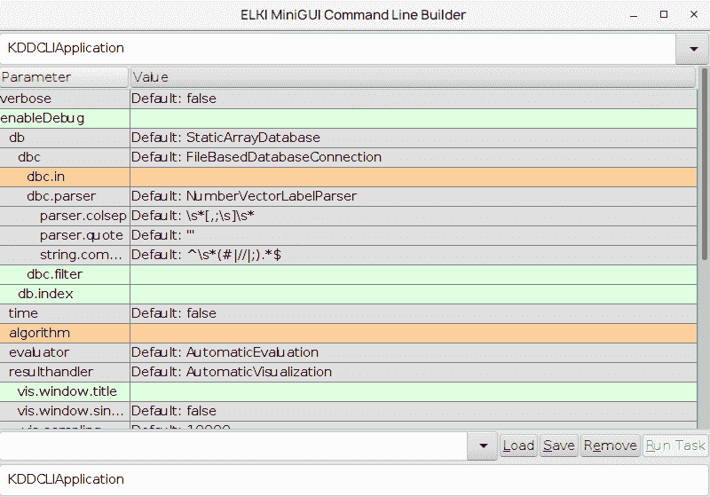

我们可以看到两个选项，以橙色显示：`dbc.in` 和 `algorithm`。我们需要指定值。在 `dbc.in` 中，点击点（`...`）选择我们下载的 `mouse.csv` 文件。在 `algorithm` 中，通过点击加号（`+`）选择 `k-Mean Clustering algorithm`，找到 `kmean.k` 并将其值填为 `3`。点击现在已启用的“运行任务”按钮，它将生成以下输出：

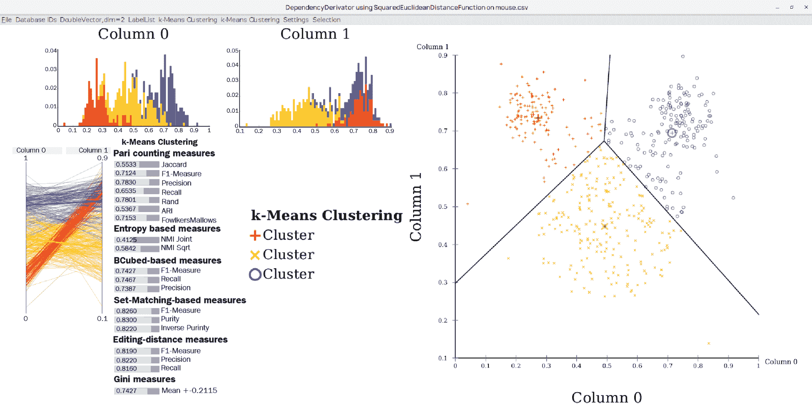

# 摘要

在本章中，你学习了如何使用 Weka 实现基本机器学习任务：分类、回归和聚类。我们简要讨论了属性选择过程，并训练了模型以评估其性能。

下一章将重点介绍如何将这些技术应用于解决现实生活中的问题，例如客户保留。
