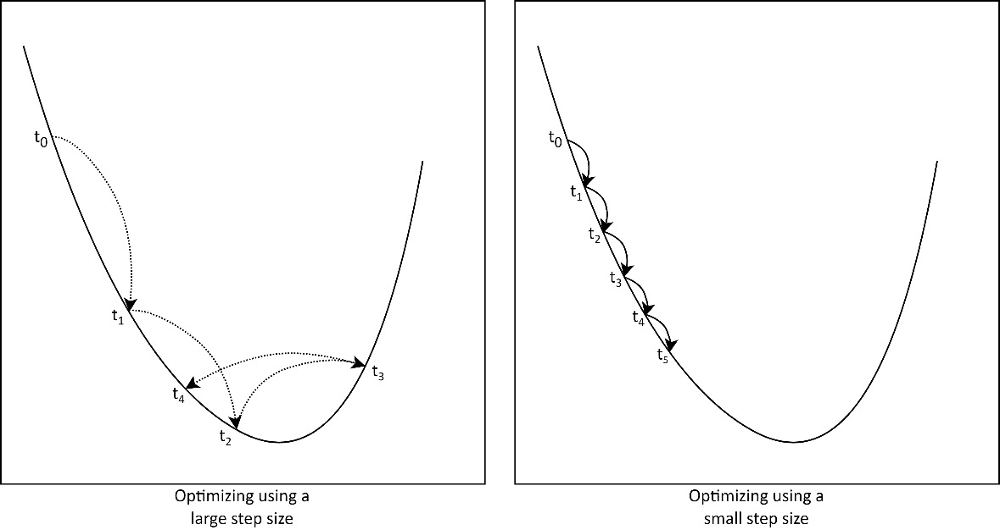
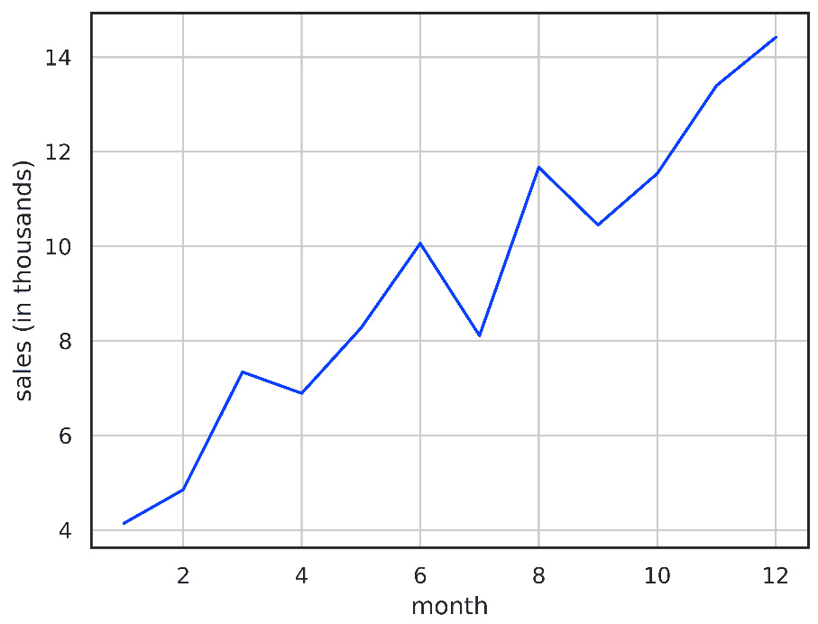
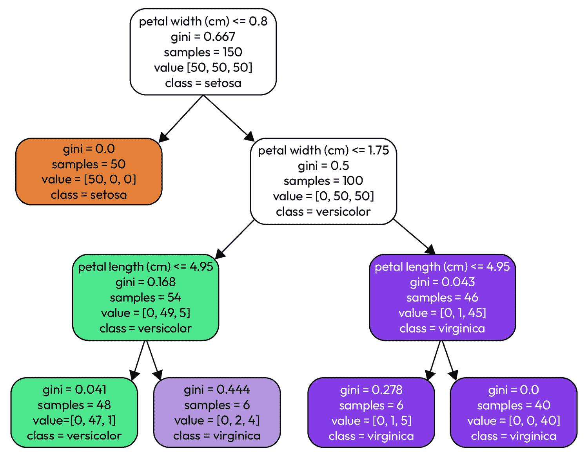

# 第一章：介绍机器学习

我们的旅程从机器学习的介绍和本书中我们将使用的根本概念开始。

我们将从软件工程的角度提供一个机器学习的概述。然后，我们将介绍机器学习和数据科学领域使用的核心概念：模型、数据集、学习范式以及其他细节。这个介绍将包括一个实际例子，清楚地说明了讨论的机器学习术语。

我们还将介绍决策树，这是一个至关重要的机器学习算法，是我们理解 LightGBM 的第一步。

完成本章后，您将在机器学习和机器学习技术的实际应用方面打下坚实的基础。

本章将涵盖以下主要主题：

+   什么是机器学习？

+   介绍模型、数据集和监督学习

+   决策树学习

# 技术要求

本章包括简单的机器学习算法示例，并介绍了使用 scikit-learn。您必须安装一个带有 scikit-learn、NumPy、pandas 和 Jupyter Notebook 的 Python 环境。本章的代码可在[`github.com/PacktPublishing/Practical-Machine-Learning-with-LightGBM-and-Python/tree/main/chapter-1`](https://github.com/PacktPublishing/Practical-Machine-Learning-with-LightGBM-and-Python/tree/main/chapter-1)找到。

# 什么是机器学习？

机器学习是更广泛的人工智能领域的一部分，涉及允许计算机“学习”特定任务而无需明确编程的方法和技术。

机器学习只是另一种从数据中自动编写程序的方式。抽象地说，一个程序是一系列将*输入*转换为特定*输出*的*指令*。程序员的任务是理解计算机程序的所有相关输入，并开发一套指令以产生正确的输出。

然而，如果输入超出了程序员的认知范围怎么办呢？

例如，让我们考虑创建一个程序来预测大型零售店的总体销售额。程序的输入将是可能影响销售的各种因素。我们可以想象的因素包括历史销售数据、即将到来的公共假日、库存可用性、商店可能进行的任何特别优惠，甚至包括天气预报或与其他商店的邻近程度等因素。

在我们的商店例子中，传统的方法是将输入分解成可管理的、可理解的（由程序员理解）部分，也许可以咨询一位商店销售预测方面的专家，然后制定手工定制的规则和指令来尝试预测未来的销售。

虽然这种方法当然可行，但它也很脆弱（从程序可能需要经历关于输入因素的广泛变化的角度来看）并且完全基于程序员（或领域专家）对问题的理解。面对可能成千上万的因素和数十亿个示例，这个问题变得难以承受。

机器学习为我们提供了这种方法的替代方案。不是创建规则和指令，我们反复向计算机展示我们需要完成的任务的示例，然后让它自己找出如何自动解决这些问题。

然而，我们之前有一组指令，现在我们有一个**训练好的模型**而不是编程的模型。

这里的一个关键认识，尤其是如果你来自软件背景，是我们的机器学习程序仍然像一个常规程序一样运行：它接受输入，有处理它的方法，并产生输出。像所有其他软件程序一样，机器学习软件必须经过正确性测试，集成到其他系统中，部署、监控和优化。所有这些共同构成了*机器学习工程*这一领域。我们将在后面的章节中涵盖所有这些方面以及更多内容。

## 机器学习范式

广义而言，机器学习有三个主要范式：监督学习、无监督学习和强化学习。

在**监督学习**中，模型在标记数据上训练：数据集中的每个实例都有其关联的正确输出，或标签，对于输入示例。模型预计会学习预测未见输入示例的标签。

在**无监督学习**中，数据集中的示例是无标签的；在这种情况下，模型预计会在数据中发现模式和关系。无监督方法的例子包括聚类算法、异常检测和降维算法。

最后，**强化学习**涉及一个模型，通常称为代理，与特定环境交互，并通过接收特定行为的惩罚或奖励来学习。目标是让代理执行最大化其奖励的行为。强化学习在机器人学、控制系统或训练计算机玩游戏方面得到了广泛应用。

LightGBM 和本书后面讨论的大多数其他算法是监督学习技术的例子，也是本书的重点。

以下章节将深入探讨本书中我们将使用的机器学习术语以及机器学习过程的细节。

# 介绍模型、数据集和监督学习

在上一节中，我们介绍了一个模型作为替代一组指令的构建，这组指令通常构成一个程序以执行特定任务。本节更详细地介绍了模型和其他核心机器学习概念。

## 模型

更正式地说，模型是对执行特定任务的特定过程的数学或算法表示。机器学习模型通过使用**训练算法**在**数据集**上训练来学习特定任务。

注意

训练的另一个术语是**拟合**。从历史上看，拟合起源于统计学领域。当模型被训练时，我们说模型“拟合数据”。在这本书中，我们将这两个术语交替使用。

存在许多不同类型的模型，它们都使用不同的数学、统计或算法技术来模拟训练数据。机器学习算法的例子包括线性回归、逻辑回归、决策树、支持向量机和神经网络。

在模型类型和该模型的训练实例之间做出了区分：大多数机器学习模型都可以训练以执行各种任务。例如，决策树（一种模型类型）可以训练来预测销售、识别心脏病和预测足球比赛结果。然而，每个这些任务都需要一个不同的*实例*的决策树，该决策树是在不同的数据集上训练的。

一个特定模型做什么取决于模型的**参数**。参数有时也被称为**权重**，在技术上，它们是模型参数的特定类型。

**训练算法**是用于找到特定任务最合适的模型参数的算法。

我们使用**目标函数**来确定拟合质量，即模型的表现如何。这是一个数学函数，它衡量给定输入的预测输出和实际输出之间的差异。目标函数量化了模型的表现。根据我们正在解决的问题，我们可能寻求最小化或最大化目标函数。目标通常在训练过程中作为我们试图最小化的错误来衡量。

我们可以将模型训练过程总结如下：训练算法使用数据集的数据来优化模型参数以完成特定任务，这是通过目标函数来衡量的。

## 超参数

当一个模型由参数组成时，训练算法有其自己的参数，称为**超参数**。超参数是一个可控的值，它会影响训练过程或算法。例如，考虑找到一个抛物线函数的最小值：我们可以先猜测一个值，然后朝着最小化函数输出的方向迈出小步。步长必须选择得当：如果我们的步子太小，找到最小值将需要过长的时间。如果步长太大，我们可能会超过最小值并错过它，然后继续在最小值周围振荡（来回跳跃）：



图 1.1 – 使用过大的步长（左侧）和过小的步长（右侧）的影响

在这个例子中，步长将是我们的最小化算法的超参数。步长的影响在*图 1**.1*中得到了说明。

## 数据集

如前所述，机器学习模型是使用数据集进行训练的。数据是机器学习过程的核心，数据准备通常是占用最多时间的流程部分。

在本书的整个过程中，我们将与 *表格型* 数据集一起工作。表格型数据集在现实世界中非常常见，由行和列组成。行通常被称为样本、示例或观察，而列通常被称为特征、变量或属性。

重要的是，列中的数据类型没有限制。特征可以是字符串、数字、布尔值、地理空间坐标，或编码格式，如音频、图像或视频。

数据集也 rarely 完美定义。数据可能不完整、有噪声、不正确、不一致，并包含各种格式。

因此，*数据准备和清洗*是机器学习过程中的关键部分。

数据准备涉及处理数据使其适合机器学习，通常包括以下步骤：

1.  **收集和验证**：一些数据集最初可能太小或表示问题不佳（数据不是从其抽取样本的实际数据总体有代表性）。在这些情况下，从业者必须收集更多数据，并进行验证以确保数据代表问题。

1.  **检查系统错误和偏差**：检查并纠正收集和验证过程中可能导致的任何系统错误，这些错误可能导致数据集偏差至关重要。在我们的销售示例中，系统收集错误可能仅从城市商店收集数据，而排除农村商店。仅使用城市商店数据训练的模型在预测商店销售时将存在偏差，并且当模型用于预测农村商店的销售时，我们可能会期望性能不佳。

1.  **数据清洗**：任何格式或值范围的不一致性都必须得到解决。任何缺失值也需要以不引入偏差的方式进行处理。

1.  **特征工程**：某些特征可能需要转换以确保机器学习模型能够从中学习，例如将一个单词句子进行数值编码。此外，可能需要从现有特征中准备新的特征，以帮助模型检测模式。

1.  **归一化和标准化**：特征的相关范围必须进行归一化和标准化。归一化和标准化确保没有任何一个特征对整体预测有不成比例的影响。

1.  **平衡数据集**：在数据集不平衡的情况下——也就是说，它包含一个类或预测的示例比另一个多得多——数据集需要被平衡。平衡通常是通过过度采样少数示例来实现的，以平衡数据集。

在*第六章**，使用 LightGBM 解决现实世界数据科学问题*中，我们将通过整个数据准备过程来展示前面的步骤是如何在实际中应用的。

注意

一个值得记住的谚语是“垃圾进，垃圾出”。模型从它所给出的任何数据中学习，包括数据中包含的任何缺陷或偏差。当我们用垃圾数据训练模型时，结果就是一个垃圾模型。

关于数据集，还有一个需要理解的概念是训练、验证和测试数据集。我们在数据准备步骤完成后将数据集分为这三个子集：

+   **训练集**是最重要的子集，通常由 60%到 80%的数据组成。这些数据用于训练模型。

+   **验证集**与训练数据分开，并在整个训练过程中用于评估模型。拥有独立的验证数据确保模型是在它之前未见过的数据上评估的，也称为其泛化能力。超参数调整，在*第五章**，Optuna 进行 LightGBM 参数优化*中详细介绍的流程，也使用验证集。

+   最后，**测试集**是一个可选的保留集，类似于验证集。它用于过程的最后，以评估模型在训练或调整过程中未参与的数据上的性能。

验证集的另一个用途是监控模型是否过度拟合数据。让我们更详细地讨论一下过度拟合。

## 过度拟合与泛化

要理解过度拟合，我们首先必须定义我们所说的模型**泛化**是什么意思。如前所述，泛化是模型准确预测它之前未见过的数据的能力。与训练准确率相比，泛化准确率作为模型性能估计更为重要，因为这表明我们的模型在生产中的表现。泛化有两种形式，**插值**和**外推**：

+   插值指的是模型预测两个已知数据点之间值的能力——换句话说，就是在训练数据范围内进行泛化。例如，假设我们用 1 月到 7 月的月度数据来训练我们的模型。在插值时，我们会要求模型对 4 月某一天进行预测，这是一个在我们训练范围内的日期。

+   外推，正如你可能推断的那样，是模型预测训练数据定义范围之外值的能力。外推的一个典型例子是预测——即预测未来。在我们的上一个例子中，如果我们要求模型在十二月进行预测，我们期望它从训练数据中外推。

在两种泛化类型中，外推更具挑战性，可能需要特定类型的模型来实现。然而，在两种情况下，模型都可能过度拟合数据，失去准确插值或外推的能力。

**过拟合**是一种现象，其中模型对训练数据拟合得太紧密，失去了泛化到未见数据的能力。模型不是学习数据中的潜在模式，而是记住了训练数据。更技术地说，模型拟合了训练数据中包含的**噪声**。这个术语“噪声”来源于数据包含**信号**和**噪声**的概念。信号指的是我们试图预测的数据中捕获的潜在模式或信息。相比之下，噪声指的是数据点的随机或不相关的变化，这些变化掩盖了信号。

例如，考虑一个数据集，我们试图预测特定位置的降雨量。数据中的信号将是降雨的一般趋势：冬季或夏季降雨增加，或相反的其他位置。噪声将是我们在数据集中每个月和每个位置的降雨量测量的微小变化。

下面的图表说明了过拟合的现象：


图 1.2 – 展示过拟合的图表。模型过度拟合并完美预测了训练数据，但失去了泛化到实际信号的能力

前面的图表显示了信号和噪声之间的差异：每个数据点都是从实际信号中采样的。数据遵循信号的总体模式，有轻微的、随机的变化。我们可以看到模型是如何过度拟合数据的：模型完美地拟合了训练数据，但以泛化为代价。我们还可以看到，如果我们使用模型通过预测 4 的值来进行插值，我们得到的结果比实际信号（6.72 比 6.2）高得多。此外，还显示了模型外推失败的情况：对 12 的预测远低于信号的预测（7.98 比 8.6）。

在现实中，所有现实世界的数据集都包含噪声。作为数据科学家，我们的目标是准备数据，尽可能多地去除噪声，使信号更容易检测。数据清洗、归一化、特征选择、特征工程和正则化是去除数据中噪声的技术。

由于所有真实世界的数据都包含噪声，过拟合是无法完全消除的。以下条件可能导致过拟合：

+   **过于复杂的模型**：对于我们所拥有的数据量来说过于复杂的模型，会利用额外的复杂性来记住数据中的噪声，从而导致过拟合。

+   **数据不足**：如果我们没有足够的训练数据用于模型，这类似于一个过于复杂的模型，它会过度拟合数据。

+   **特征过多**：具有过多特征的集合很可能包含无关的（噪声）特征，这会降低模型的泛化能力。

+   **过度训练**：对模型进行过长时间的训练，使其能够记住数据集中的噪声。

由于验证集是模型尚未见过的训练数据的一部分，我们使用验证集来监控过拟合。我们可以通过观察训练和泛化误差随时间的变化来识别过拟合的点。在过拟合的点，验证误差增加。相比之下，训练误差持续改善：模型正在拟合训练数据中的噪声，并失去了泛化的能力。

防止过拟合的技术通常旨在解决我们之前讨论的导致过拟合的条件。以下是一些避免过拟合的策略：

+   **提前停止**：当我们看到验证误差开始增加时，我们可以停止训练。

+   **简化模型**：具有较少参数的简单模型将无法学习训练数据中的噪声，从而更好地泛化。

+   **获取更多数据**：收集更多数据或增强数据是防止过拟合的有效方法，因为它给模型提供了更好的机会来学习数据中的信号，而不是在较小数据集中的噪声。

+   **特征选择和降维**：由于某些特征可能对要解决的问题不相关，我们可以丢弃我们认为冗余的特征，或者使用主成分分析等技术来降低维度（特征）。

+   **添加正则化**：较小的参数值通常会导致更好的泛化，这取决于模型（神经网络就是一个例子）。正则化向目标函数添加一个惩罚项，以阻止参数值过大。通过将参数值驱动到更小（或零）的值，它们对预测的贡献更小，从而有效地简化了模型。

+   **集成方法**：结合多个**较弱**模型的预测可以导致更好的泛化，同时提高性能。

重要的是要注意，*过拟合以及防止过拟合的技术是针对我们模型的特定问题*。我们的目标始终应该是最小化过拟合，以确保对未见数据的泛化。一些策略，如正则化，可能对某些模型不起作用，而其他策略可能更有效。还有一些针对特定模型的定制策略，我们将在讨论决策树中的过拟合时看到一个例子。

## 监督学习

店铺销售额的例子是**监督学习**的一个实例——我们有一个由特征组成的数据库，并且正在训练模型来预测一个目标。

监督学习问题可以分为两大类问题：**分类问题**和**回归问题**。

### 分类与回归

在**分类问题**中，模型需要预测的标签是分类的或定义了一个类别。一些类别的例子包括`垃圾邮件`或`非垃圾邮件`、`猫`或`狗`、以及`糖尿病患者`或`非糖尿病患者`。这些都是二元分类的例子：只有两个类别。

多类分类也是可能的；例如，电子邮件可以被分类为`重要`、`促销`、`杂乱`或`垃圾邮件`；云朵的图片可以被分类为`卷云`、`积云`、`层云`或`雨层云`。

在**回归问题**中，目标是预测一个连续的、数值的值。例子包括预测收入、销售额、温度、房价和人群数量。

机器学习艺术中很大一部分是正确地将问题定义为分类或回归问题（或者可能是无监督或强化学习）。后面的章节将涵盖这两种类型问题的多个端到端案例研究。

## 模型性能指标

让我们简要讨论一下我们如何衡量我们模型的表现。模型性能指的是机器学习模型根据给定的输入做出准确预测或生成有意义输出的能力。一个评估指标量化了模型对新、未见数据的泛化程度。高模型性能表明模型有效地学习了数据中的潜在模式，并且可以在它未见过的数据上做出准确的预测。当与监督学习问题（无论是分类还是回归问题）一起工作时，我们可以根据已知的目标来衡量模型的表现。

重要的是，我们衡量模型在分类任务和回归任务上的表现方式不同。scikit-learn 有许多内置的指标函数，可以用于分类或回归问题（[scikit-learn.org/stable/modules/model_evaluation.xhtml](https://scikit-learn.org/stable/modules/model_evaluation.xhtml)）。让我们回顾这些中最常见的。

可以用模型做出的正面和负面预测来定义分类指标。以下定义可以用来计算分类指标：

+   **真正正例** (**TP**): 一个正例被正确地分类为正例

+   **真正负例** (**TN**): 一个负例被正确地分类为负例

+   **假阳性** (**FP**): 一个负例被错误地分类为正例

+   **假阴性** (**FN**): 一个正例被错误地分类为负例

根据这些定义，最常见的 *分类* 指标如下：

+   **准确率**: 准确率是最直接的分类指标。准确率是正确预测的数量除以总预测数量。然而，准确率容易受到数据不平衡的影响。例如，假设我们有一个包含 8 个垃圾邮件示例和 2 个非垃圾邮件示例的电子邮件数据集，并且我们的模型只预测垃圾邮件。在这种情况下，模型的准确率为 80%，尽管它从未正确分类非垃圾邮件。从数学上讲，我们可以如下定义准确率：

    准确率 =  TP + TN ______________  TP + FP + TN + FN

+   **精确率**: 精确率是获取对分类性能更深入理解的一种方式。精确率是真正正例预测（正确预测）与所有正例预测（真正正例和假阳性）的比例。换句话说，精确率指标表明模型在预测正例时的精确度。在我们的垃圾邮件示例中，仅预测垃圾邮件的模型精确度不高（因为它将所有非垃圾邮件分类为垃圾邮件），并且具有较低的精确率。以下公式可以用来计算精确率：

    精确率 =  TP _ TP + FP

+   **召回率**: 召回率是精确率的对立面。召回率衡量模型有效地找到（或召回）所有真正正例的能力。召回率是真正正例预测与所有正例（真正正例和假阴性）的比例。在我们的垃圾邮件示例中，仅预测垃圾邮件的模型具有完美的召回率（它可以找到所有垃圾邮件）。我们可以这样计算召回率：

    召回率 =  TP _ TP + FN

+   **F1 分数**: 最后，我们有 F1 分数。F1 分数是精确率和召回率的调和平均数。F1 分数平衡了精确率和召回率，给出了一个总结分类器性能的单个值。以下公式可以用来计算 F1 分数：

    F 1 =  2 × 精确率 × 召回率 _______________  精确率 + 召回率  =  2 × TP _____________  2 × TP + FP + FN

上述分类指标是最常见的，但还有很多。尽管 F1 分数在分类问题中常用（因为它总结了精确率和召回率），但选择最佳指标取决于你解决的问题。通常，可能需要特定的指标，但有时必须根据经验和你对数据的理解来选择。我们将在本书的后面部分查看不同指标的一些示例。

以下是一些常见的 *回归* 指标：

+   **均方误差**（**MSE**）：MSE 是预测值和实际值之间平方差异的平均值。MSE 因其一个关键数学特性而常用：MSE 是 *可微的*，因此适用于与基于梯度的学习方法一起使用。然而，由于差异被平方，MSE 对大误差的惩罚比对小误差更重，这可能或可能不适合要解决的问题。

+   **平均绝对误差**（**MAE**）：与平方差异不同，MAE 是预测值和实际值之间绝对差异的平均值。通过避免误差的平方，MAE 对误差的大小更稳健，对异常值比均方误差（MSE）更不敏感。然而，MAE 不可微，因此不能与基于梯度的学习方法一起使用。

与分类指标一样，选择最合适的回归指标取决于你试图解决的问题。

指标与目标

我们将训练模型定义为找到最合适的参数以最小化一个 *目标函数*。需要注意的是，特定问题的目标函数和指标可能不同。一个很好的例子是决策树，在构建树时使用不纯度（熵）作为目标函数。然而，我们仍然计算之前解释的指标来确定树在数据上的性能。

在我们对基本指标有了理解之后，我们可以结束对机器学习概念的介绍。现在，让我们通过一个例子来回顾我们讨论过的术语和概念。

## 一个建模例子

考虑以下按月销售的以下数据（单位：千）：

| Jan | Feb | Mar | Apr | May | Jun |
| --- | --- | --- | --- | --- | --- |
| 4,140 | 4,850 | 7,340 | 6,890 | 8,270 | 10,060 |
| Jul | Aug | Sept | Oct | Nov | Dec |
| 8,110 | 11,670 | 10,450 | 11,540 | 13,400 | 14,420 |

表 1.1 – 按月样本销售数据，单位：千

这个问题很简单：只有一个特征，即月份，目标是销售数量。因此，这是一个监督回归问题的例子。

注意

你可能已经注意到这是一个时间序列问题的例子：时间是主要变量。时间序列也可以使用更高级的时间序列特定算法（如方差分析）进行预测，但在这个部分我们将使用一个简单的算法进行说明。

我们可以将我们的数据绘制成每月销售的图表，以更好地理解它：



图 1.3 – 显示按月商店销售的图表

在这里，我们使用直线模型，也称为简单线性回归，来模拟我们的销售数据。直线的定义如下公式：

y = mx + c

在这里，m 是直线的斜率，c 是 Y 轴截距。在机器学习中，直线是模型，而 m 和 c 是模型参数。

为了找到最佳参数，我们必须衡量我们的模型对于特定参数集的数据拟合程度如何 – 也就是说，我们输出的错误。我们将使用 MAE 作为我们的指标：

MAE =  ∑ i=1 n  | ˆ y  − y| _ n

在这里，ˆy 是预测输出，y 是实际输出，n 是预测次数。我们通过为每个输入进行预测，然后根据公式计算 MAE 来计算 MAE。

### 拟合模型

现在，让我们将我们的线性模型拟合到我们的数据上。我们的拟合线的过程是迭代的，我们从这个过程开始，通过猜测 m 和 c 的值，然后从那里迭代。例如，让我们考虑 m = 0.1，c = 4：


图 1.4 – 显示 m = 0.1 和 c = 4 的线性模型预测的图表

使用这些参数，我们达到了`4,610`的错误率。

我们的猜测值太低了，但这没关系；我们现在可以更新参数，尝试改进错误率。实际上，更新模型参数是通过使用梯度下降等训练算法算法化完成的。我们将在*第二章**，集成学习 – Bagging* *和 Boosting*中讨论梯度下降。

在这个例子中，我们将使用我们对直线的理解以及直觉来手动更新每个迭代的参数。我们的线太浅，截距太低；因此，我们必须增加这两个值。我们可以通过选择*步长*来控制我们每次迭代所做的更新。我们必须通过添加步长来更新 m 和 c 值。对于步长为 0.1 的结果，请参阅*表 1.2*。

| 猜测# | m | c | MAE |
| --- | --- | --- | --- |
| 1 | 0.1 | 4 | 4.61 |
| 2 | 0.2 | 4.1 | 3.89 |
| 3 | 0.3 | 4.2 | 3.17 |
| 4 | 0.3 | 4.3 | 2.5 |
| 5 | 0.4 | 4.4 | 1.83 |

表 1.2 – 逐步猜测直线的斜率（m）和 y 截距（c）以拟合我们的数据。拟合质量是通过 MAE 来衡量的

在我们的例子中，*步长*是我们训练过程中的一个*超参数*。

我们最终得到的错误率为*1.83*，这意味着平均来说，我们的预测错误不超过*2,000*。

现在，让我们看看如何使用 scikit-learn 解决这个问题。

### 使用 scikit-learn 进行线性回归

我们可以不手动建模，而是使用 scikit-learn 构建线性回归模型。由于这是我们第一个例子，我们将逐行解释代码，说明正在发生什么。

首先，我们必须导入我们将要使用的 Python 工具：

```py
import numpy as np
import pandas as pd
from matplotlib import pyplot as plt
import seaborn as sns
from sklearn.linear_model import LinearRegression
from sklearn.metrics import mean_absolute_error
```

有三组导入：我们首先导入`numpy`和`pandas`。导入 NumPy 和 pandas 是开始所有数据科学笔记本的常用方法。此外，请注意短名称`np`和`pd`，这是在处理`numpy`和`pandas`时的标准约定。

接下来，我们导入一些标准的绘图库，我们将使用这些库来绘制一些图表：来自`matplotlib`的`pyplot`和`seaborn`。Matplotlib 是一个广泛使用的绘图库，我们通过 pyplot Python 接口访问它。**Seaborn**是建立在 Matplotlib 之上的另一个可视化工具，它使得绘制专业外观的图表变得更加容易。

最后，我们到达了 scikit-learn 导入的部分。在 Python 代码中，scikit-learn 库被称为`sklearn`。从其`linear_model`包中，我们导入`LinearRegression`。scikit-learn 实现了许多预定义的度量，在这里，我们将使用`mean_absolute_error`。

现在，我们准备设置我们的数据：

```py
months = np.array([ 1,  2,  3,  4,  5,  6,  7,  8,  9, 10, 11, 12])
sales = np.array([4.14,  4.85,  7.34,  6.89,  8.27, 10.06,  8.11, 11.67, 10.45, 11.54, 13.4 , 14.42])
df = pd.DataFrame({"month": months, "sales": sales})
```

在这里，我们定义了一个新的`numpy`数组，用于月份和相应的销售，为了使它们更容易处理，我们将这两个数组收集到一个新的`pandas` DataFrame 中。

数据就绪后，我们到达了代码的有趣部分：使用 scikit-learn 进行建模。代码很简单：

```py
model = LinearRegression()
model = model.fit(df[["month"]], df[["sales"]])
```

首先，我们通过构造`LinearRegression`的实例来创建我们的模型。然后，我们使用`model.fit`和从我们的 DataFrame 中传递的月份和销售数据来拟合我们的模型。这两行代码就足以拟合一个模型，正如我们将在后面的章节中看到的，即使是复杂的模型也使用相同的配方来实例化和训练模型。

我们现在可以通过为我们的数据创建预测并将预测和实际目标传递给度量函数来计算我们的*MAE*：

```py
predicted_sales = model.predict(df[["month"]])
mean_absolute_error(predicted_sales, df[["sales"]])
```

我们得到一个*0.74*的错误，这比我们的猜测略低。我们还可以检查模型系数和截距（*m*和*c*，来自之前的内容）：

```py
print(f"Gradient: ${model.coef_}")
print(f"Intercept: ${model.intercept_}")
```

scikit-learn 已经使用系数为*0.85*和截距为*3.68*的模型进行了拟合。我们的猜测在正确的范围内，但可能需要一些时间才能得到最优值。

这就结束了我们对 scikit-learn、建模和机器学习基础介绍的介绍。在我们的玩具示例中，我们没有将数据分成单独的数据集，优化模型超参数，也没有应用任何确保模型不过拟合的技术。在下一节中，我们将查看分类和回归示例，我们将应用这些和其他最佳实践。

# 决策树学习

本节介绍了决策树学习，这是理解 LightGBM 所必需的机器学习算法。我们将通过使用 scikit-learn 构建决策树的示例来进行分析。本节还将提供一些构建决策树的数学定义；理解这些定义不是必需的，但它将帮助我们理解我们对决策树超参数的讨论。

决策树是基于树的学习者，通过连续对数据进行提问以确定结果。沿着树路径向下，使用一个或多个特征对输入做出决策。路径在叶节点终止，它代表预测的类别或值。决策树可用于分类或回归。

下图是 Iris 数据集上拟合的决策树示意图：



图 1.5 – 使用 Iris 数据集建模的决策树

Iris 数据集是一个分类数据集，其中使用 Iris 花的萼片和花瓣尺寸来预测 Iris 花的类型。每个非叶节点使用一个或多个特征来缩小数据集中的样本：根节点开始于所有 150 个样本，然后根据花瓣宽度进行分割，<= 0.8。我们继续沿着树向下，每个节点进一步分割样本，直到我们达到包含预测类（versicolor、virginica 或 setosa）的叶节点。

与其他模型相比，决策树有许多优点：

+   **特征可以是数值或分类的**：可以使用数值特征（通过分割范围）或分类特征来分割样本，而无需我们对其进行编码。

+   **减少数据准备需求**：决策分割对数据范围或大小不敏感。许多其他模型（例如，神经网络）需要将数据进行归一化到单位范围内。

+   **可解释性**：如前所述，解释树做出的预测是直接的。在需要向决策者解释预测的情况下，可解释性非常有价值。

这些只是使用基于树的模型的一些优点。然而，我们还需要意识到与决策树相关的一些缺点：

+   **过拟合**：决策树非常容易过拟合。在拟合决策树时设置正确的超参数是至关重要的。决策树中的过拟合将在后面详细讨论。

+   **较差的外推能力**：由于决策树的预测不是连续的，并且实际上由训练数据所限制，因此决策树在外推能力方面较差。

+   **不平衡数据**：当在不平衡数据上拟合树模型时，高频类别会主导预测。需要准备数据以消除不平衡。

关于决策树的优缺点有更详细的讨论，请参阅[`scikit-learn.org/stable/modules/tree.xhtml`](https://scikit-learn.org/stable/modules/tree.xhtml)。

## 熵和信息增益

首先，在查看构建（或拟合）决策树的算法之前，我们需要对熵和信息增益有一个基本的理解。

熵可以被视为衡量系统无序或随机性的方法。熵衡量特定输入或事件的结果可能有多令人惊讶。考虑一副洗好的牌：从牌堆顶部抽取可能会给我们任何一张牌（每次都是令人惊讶的结果）；因此，我们可以说洗好的牌堆具有**高熵**。从有序牌堆的顶部抽取牌不会令人惊讶；我们知道下一张牌是什么。因此，有序牌堆的熵较低。另一种解释熵的方法是数据集的纯度：低熵数据集（整齐有序）比高熵数据集的纯度低。

信息增益，反过来，是修改或观察底层数据时所获得的信息量。信息增益涉及在观察之前减少熵。在我们的牌堆示例中，我们可能将洗好的牌堆分成四个较小的牌堆，按花色（黑桃、红心、方块和梅花）。如果我们从小牌堆中抽取，结果就不会那么令人惊讶：我们知道下一张牌来自同一花色。通过按花色分割牌堆，我们已经减少了小牌堆的熵。在特征（花色）上分割牌堆与决策树中的分割非常相似；每次分割都试图最大化信息增益——也就是说，它们在分割后最小化熵。

在决策树中，有两种常见的测量信息增益或纯度损失的方法：

+   吉尼指数

+   对数损失或熵

详细解释可在[`scikit-learn.org/stable/modules/tree.xhtml#classification-criteria`](https://scikit-learn.org/stable/modules/tree.xhtml#classification-criteria)找到。

## 使用 C4.5 构建决策树

C4.5 是从数据集构建决策树的算法[1]。该算法是递归的，并从以下基本案例开始：

1.  如果子数据集中的所有样本都属于同一类，则在树中创建一个选择该类的叶节点。

1.  如果使用任何特征分割无法获得信息（数据集不能再进一步分割），则创建一个叶节点，预测子数据集中包含的最频繁的类别。

1.  如果子数据集中达到最小样本阈值，则创建一个叶节点，预测子数据集中包含的最频繁的类别。

然后，我们可以应用该算法：

1.  检查任何三种基本情况，如果任何一种适用于数据集，则停止分割。

1.  对于数据集的每个特征或属性，计算在该特征上分割数据集所获得的信息量。

1.  通过在具有最高信息增益的特征上分割数据集来创建决策节点。

1.  根据决策节点将数据集分割成两个子数据集，并递归地对每个子数据集应用算法。

一旦树构建完成，就会应用剪枝。在剪枝过程中，信息增益相对较低的决策节点会被移除。移除节点可以避免过度拟合训练数据并提高树的泛化能力。

### 分类和回归树

你可能已经注意到，在前面的解释中，我们只使用了类别来使用决策节点分割数据集；这并非偶然，因为经典的 C4.5 算法仅支持分类树。**分类和回归树**（**CART**）扩展了 C4.5 以支持数值目标变量——即回归问题 [2]。使用 CART，决策节点也可以分割连续的数值输入变量以支持回归，通常使用阈值（例如，x <= 0.3）。当达到叶节点时，剩余数值范围的均值或中位数通常被用作预测值。

在构建分类树时，仅使用不纯度来确定分割。然而，对于回归树，不纯度会与其他标准结合来计算最佳分割：

+   均方误差（MSE）或平均绝对误差（MAE）

+   半泊松偏差

每个细节的数学解释都可以在 [`scikit-learn.org/stable/modules/tree.xhtml#regression-criteria`](https://scikit-learn.org/stable/modules/tree.xhtml#regression-criteria) 找到。

scikit-learn 使用 CART 的优化版本来构建决策树。

## 决策树中的过度拟合

决策树最显著的缺点之一是它们容易过度拟合。如果没有适当的超参数选择，C4.5 和其他训练算法会创建过于复杂和深的树，几乎完全符合训练数据。管理过度拟合是构建决策树的关键部分。以下是一些避免过度拟合的策略：

+   **剪枝**：如前所述，我们可以移除贡献信息增益不多的分支；这减少了树的复杂性并提高了泛化能力。

+   **最大深度**：限制树的深度也可以避免过度复杂的树并避免过度拟合。

+   **最大叶节点数**：与限制深度类似，限制叶节点数可以避免过度具体的分支并提高泛化能力。

+   **每个叶节点的最小样本数**：设置每个叶节点可能包含的样本数的最小限制（当子数据集达到最小大小时停止分割）也可以避免过度具体的叶节点。

+   **集成方法**：集成学习是一种结合多个模型以改善单个模型预测的技术。多个模型的预测平均值也可以减少过度拟合。

这些策略可以通过设置适当的超参数来应用。现在我们了解了如何构建决策树以及避免过度拟合的策略，让我们看看如何在 scikit-learn 中构建决策树。

## 使用 scikit-learn 构建决策树

是时候检验我们如何通过使用 scikit-learn 训练分类和回归树来应用决策树了。

对于这些示例，我们将使用 scikit-learn 中包含的玩具数据集。与真实世界数据相比，这些数据集较小，但易于处理，使我们能够专注于决策树。

### 乳腺癌分类

我们将使用乳腺癌数据集（https://scikit-learn.org/stable/datasets/toy_dataset.xhtml#breast-cancer-dataset）作为我们的分类示例。这个数据集由从细针穿刺乳腺肿块图像计算得出的特征组成，任务是预测肿块是恶性还是良性。

使用 scikit-learn，我们可以用五行代码解决这个分类问题：

```py
dataset = datasets.load_breast_cancer()
X_train, X_test, y_train, y_test = train_test_split(dataset.data, dataset.target, random_state=157)
model = DecisionTreeClassifier(random_state=157, max_depth=3, min_samples_split=2)
model = model.fit(X_train, y_train)
f1_score(y_test, model.predict(X_test))
```

首先，我们使用`load_breast_cancer`函数加载数据集。然后，我们使用`train_test_split`将数据集分为训练集和测试集；默认情况下，25%的数据用于测试集。像之前一样，我们实例化`DecisionTreeClassifier`模型，并使用`model.fit`在训练集上训练它。在实例化模型时传递的两个超参数值得注意：`max_depth`和`min_samples_split`。这两个参数都控制过拟合，将在下一节中更详细地讨论。我们还指定了训练-测试分割和模型的`random_state`。通过固定随机状态，我们确保结果可重复（否则，scikit-learn 将为每次执行创建一个新的随机状态）。

最后，我们使用`f1_score`来衡量性能。我们的模型实现了 0.94 的 F1 分数和 93.7%的准确率。F1 分数是 1.0 的分数，因此我们可以得出结论，该模型表现非常好。如果我们分解我们的预测，模型在测试集的 143 个样本中只错了一个预测：7 个假阳性和 2 个假阴性。

### 预测糖尿病进展

为了说明使用决策树解决回归问题，我们将使用糖尿病数据集（[`scikit-learn.org/stable/datasets/toy_dataset.xhtml#diabetes-dataset`](https://scikit-learn.org/stable/datasets/toy_dataset.xhtml#diabetes-dataset)）。这个数据集有 10 个特征（年龄、性别、体重指数等），模型的任务是预测一年后疾病进展的定量指标。

我们可以使用以下代码构建和评估回归模型：

```py
dataset = datasets.load_diabetes()
X_train, X_test, y_train, y_test = train_test_split(dataset.data, dataset.target, random_state=157)
model = DecisionTreeRegressor(random_state=157, max_depth=3, min_samples_split=2)
model = model.fit(X_train, y_train)
mean_absolute_error(y_test, model.predict(X_test))
```

我们的模型实现了 45.28 的 MAE。代码几乎与我们的分类示例相同：我们使用`DecisionTreeRegressor`作为模型，而不是分类器，并计算`mean_absolute_error`而不是 F1 分数。scikit-learn 中用于解决不同类型模型的各种问题的 API 的一致性是设计上的，它展示了机器学习工作中的一条基本真理：尽管数据、模型和度量会变化，*构建机器学习模型的整体过程仍然保持不变*。在接下来的章节中，我们将扩展这一通用方法，并在构建机器学习管道时利用过程的这种一致性。

## 决策树超参数

我们在先前的分类和回归示例中使用了一些决策树超参数来控制过拟合。本节将探讨 scikit-learn 提供的最关键的决策树超参数：

+   `max_depth`: 树允许达到的最大深度。更深的树允许更多的分割，从而导致更复杂的树和过拟合。

+   `min_samples_split`: 分割节点所需的最小样本数。仅包含少量样本的节点会导致数据过拟合，而增加最小样本数可以提高泛化能力。

+   `min_samples_leaf`: 允许在叶子节点中的最小样本数。类似于分割中的最小样本数，增加该值会导致更简单的树，减少过拟合。

+   `max_leaf_nodes`: 允许的最大叶子节点数。叶子节点越少，树的大小和复杂性就越小，这可能会提高泛化能力。

+   `max_features`: 确定分割时考虑的最大特征数。丢弃一些特征可以减少数据中的噪声，从而提高过拟合。特征是随机选择的。

+   `criterion`: 确定分割时使用的杂质度量，可以是`gini`或`entropy/log_loss`。

正如你可能已经注意到的，大多数决策树超参数都涉及通过控制树的复杂性来控制过拟合。这些参数提供了多种方法来实现这一点，找到最佳参数及其值的组合并非易事。找到最佳超参数被称为**超参数调整**，本书后面将详细讨论。

完整的超参数列表可以在以下位置找到：

+   [`scikit-learn.org/stable/modules/generated/sklearn.tree.DecisionTreeClassifier.xhtml#sklearn-tree-decisiontreeclassifier`](https://scikit-learn.org/stable/modules/generated/sklearn.tree.DecisionTreeClassifier.xhtml#sklearn.tree.DecisionTreeClassifier)

+   [`scikit-learn.org/stable/modules/generated/sklearn.tree.DecisionTreeRegressor.xhtml#sklearn.tree.DecisionTreeRegressor`](https://scikit-learn.org/stable/modules/generated/sklearn.tree.DecisionTreeRegressor.xhtml#sklearn.tree.DecisionTreeRegressor)

现在，让我们总结本章的关键要点。

# 摘要

在本章中，我们介绍了机器学习作为一种通过学习从数据集中执行任务来创建软件的方法，而不是依靠手动编程指令。我们通过 scikit-learn 的示例，重点介绍了机器学习的核心概念，并展示了它们的应用。

我们还介绍了决策树作为机器学习算法，并讨论了它们的优缺点，以及如何通过超参数控制过拟合。我们通过在 scikit-learn 中使用决策树解决分类和回归问题的示例来结束本章。

本章为我们提供了机器学习的基础理解，使我们能够更深入地了解数据科学过程和 LightGBM 库。

下一章将专注于决策树中的集成学习，这是一种将多个决策树的预测结果结合起来以提高整体性能的技术。特别是梯度提升将详细介绍。

# 参考文献

| *[**1]* | *J. R. Quinlan, 《C4.5：机器学习程序》，Elsevier 出版社，2014 年。* |
| --- | --- |
| *[**2]* | *R. J. Lewis, 《分类与回归树分析（CART）简介》，发表于旧金山学术急诊医学年会，加利福尼亚，2000 年。* |
