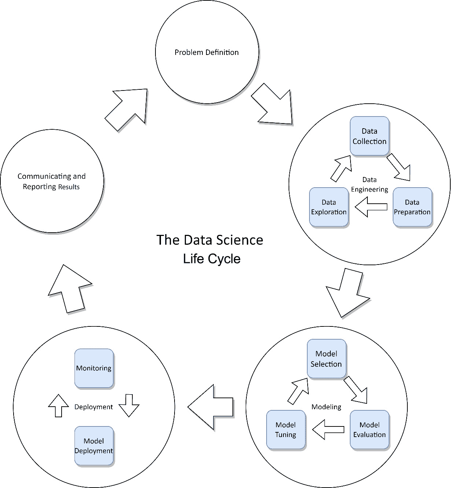
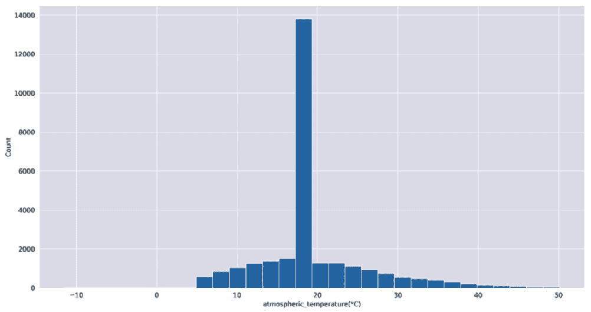
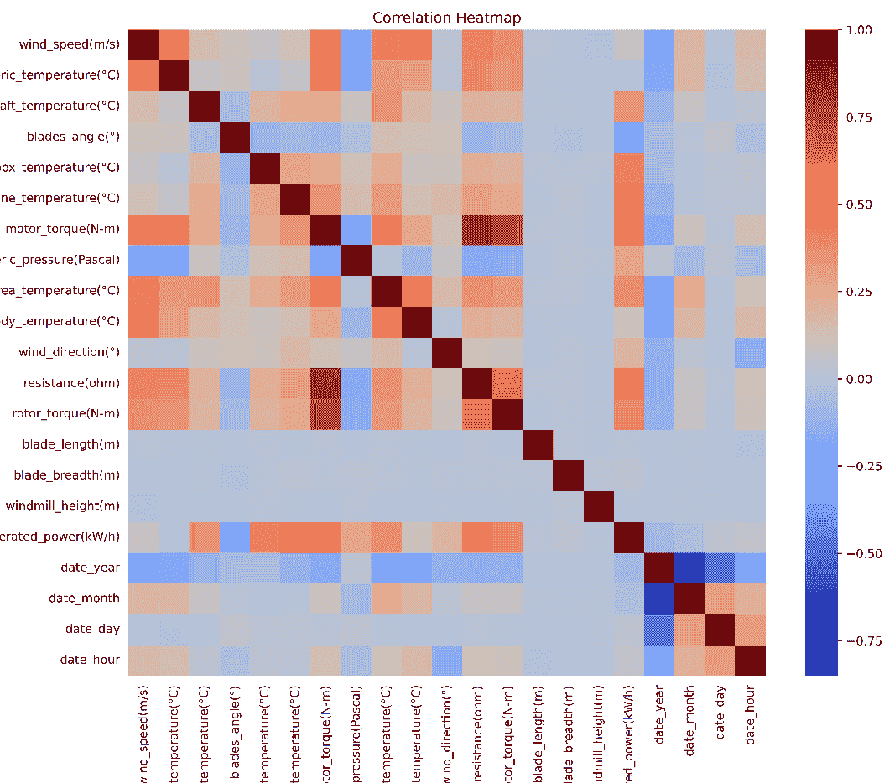
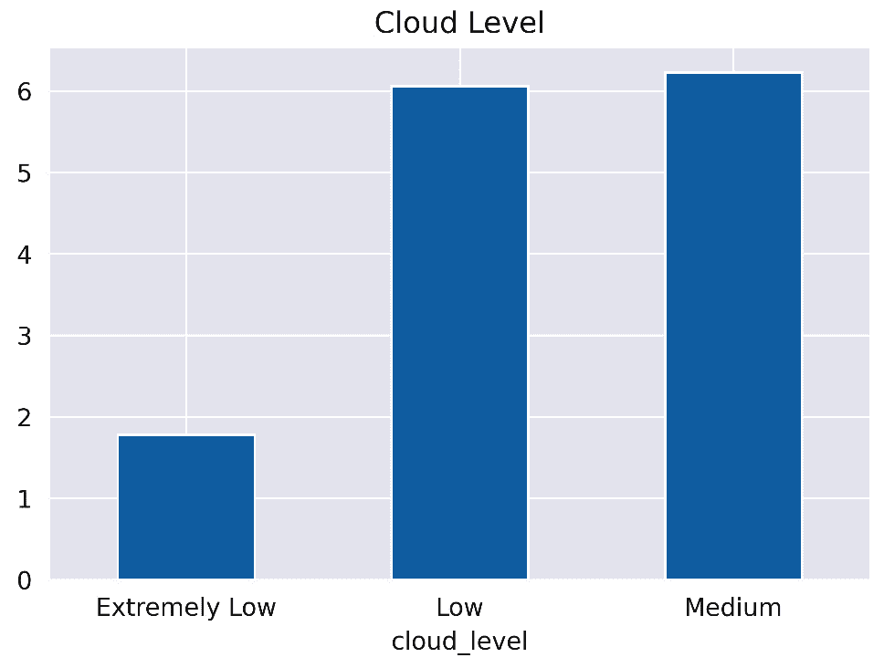
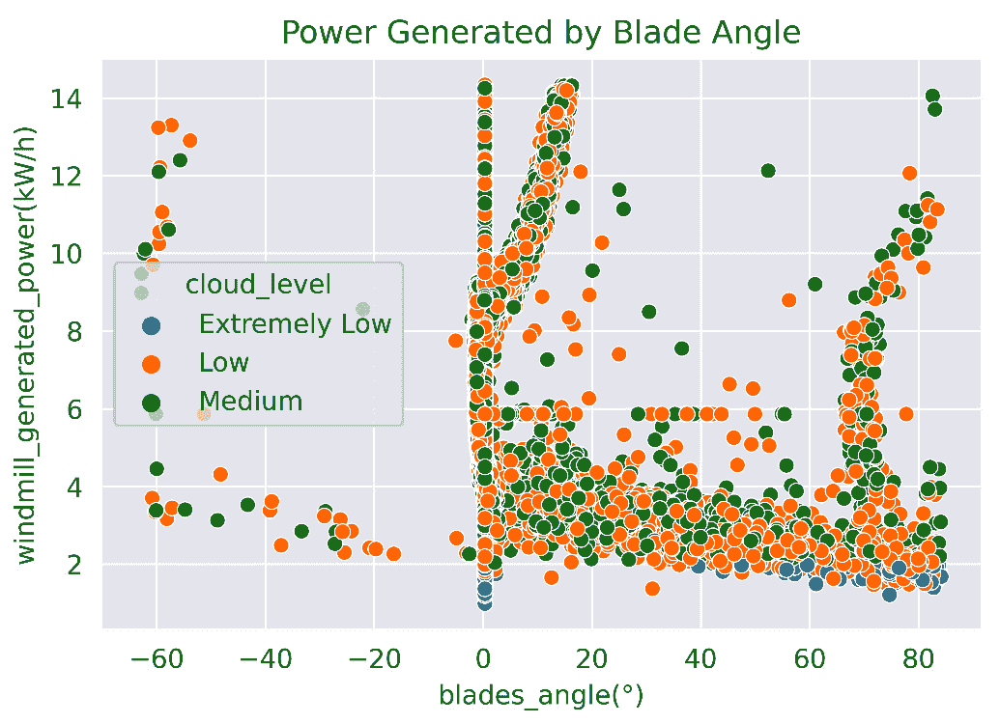
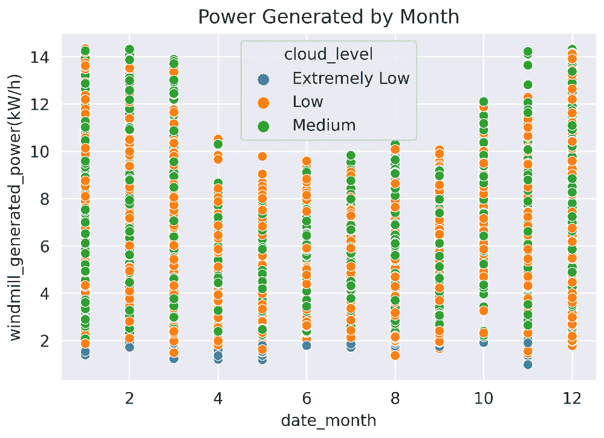
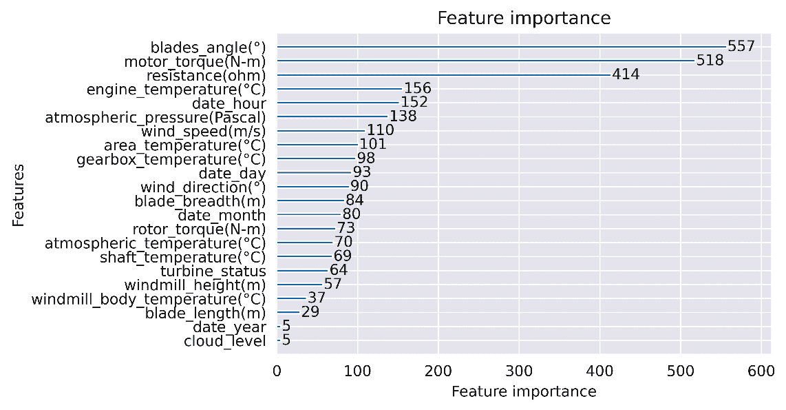
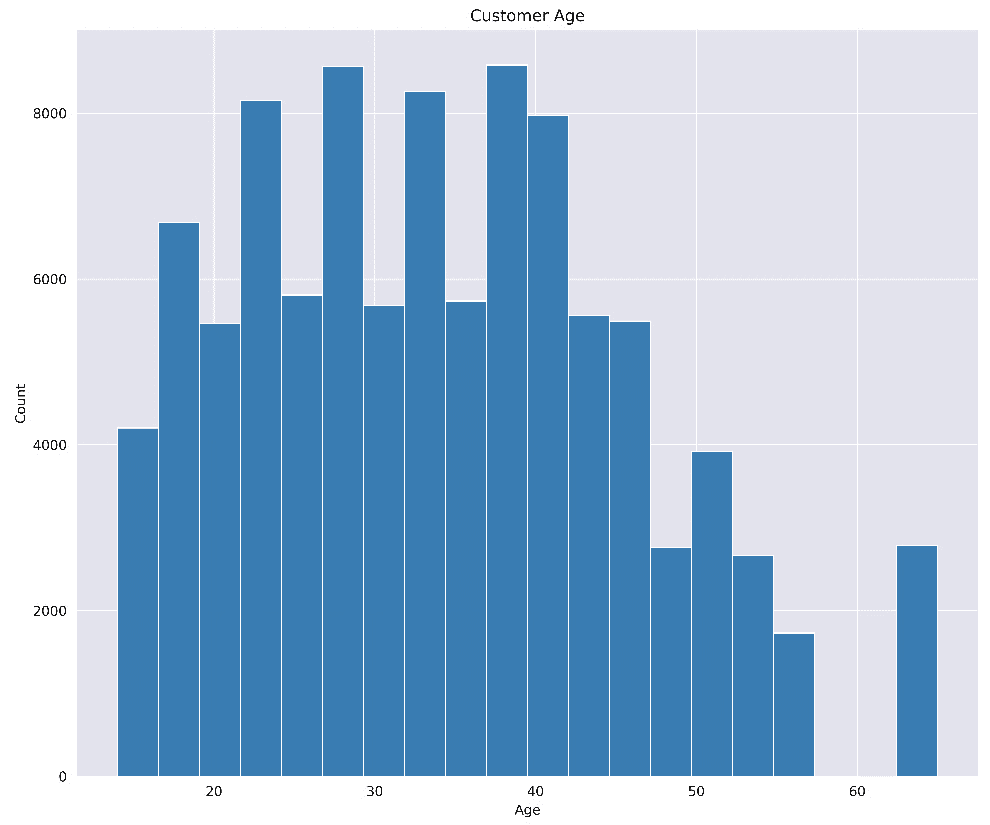
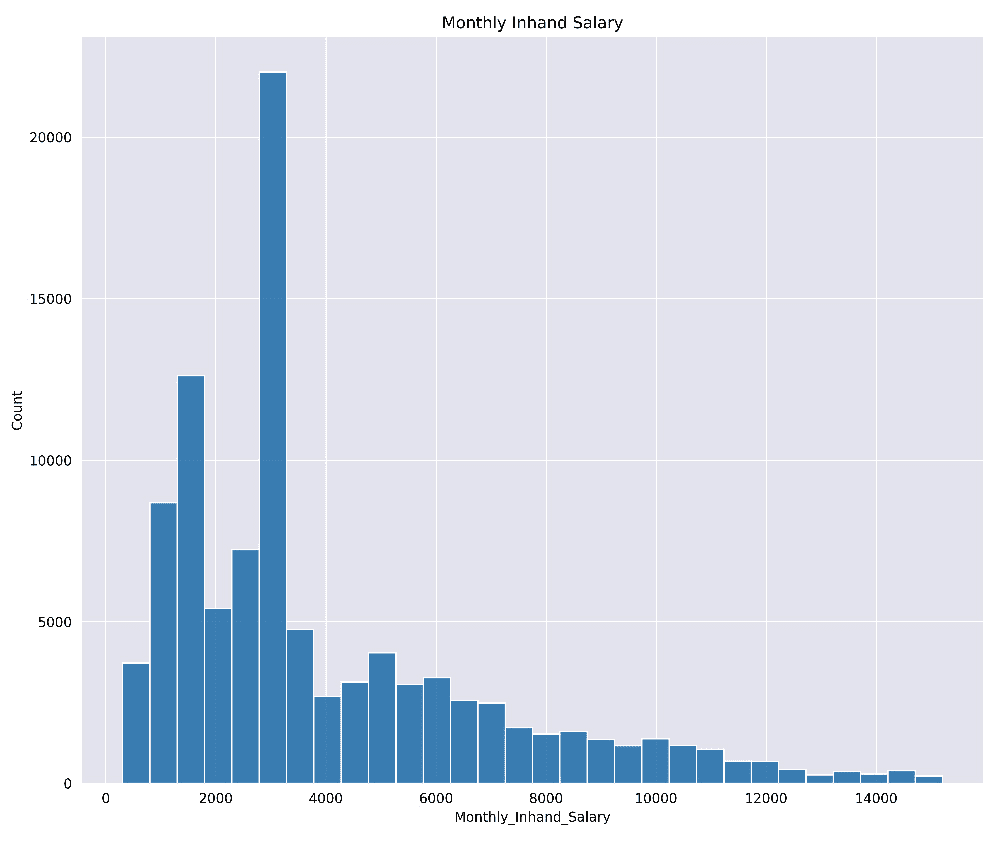
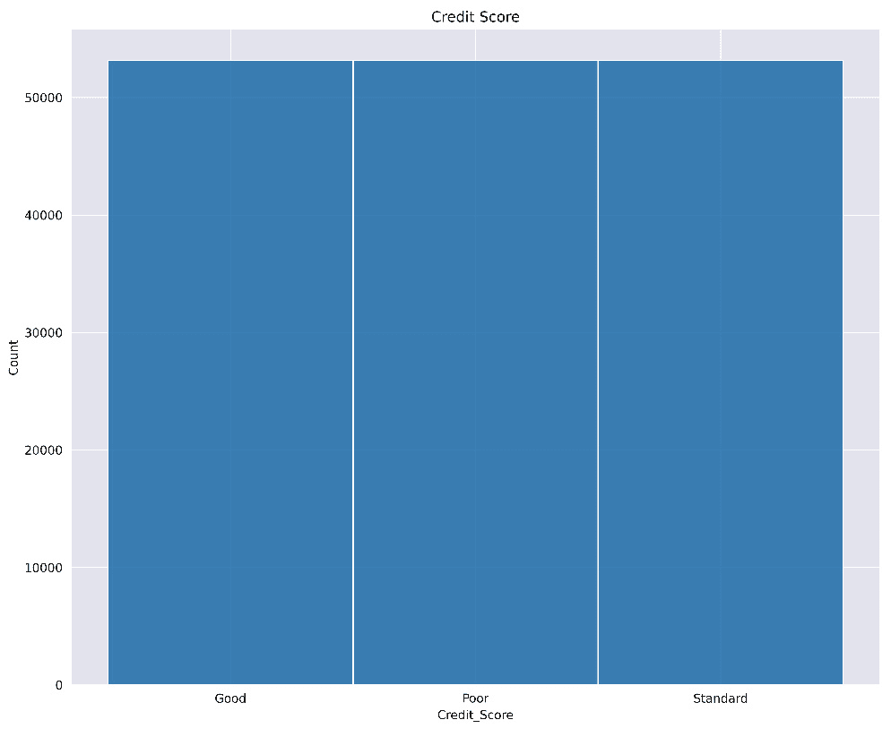

# 第六章：使用 LightGBM 解决现实世界的数据科学问题

在前面的章节中，我们逐渐构建了一套工具集，使我们能够解决机器学习问题。我们看到了检查数据、解决数据问题和创建模型的例子。本章正式定义并应用数据科学流程到两个案例研究中。

本章详细概述了数据科学生命周期及其包含的所有步骤。在回归和分类问题背景下，讨论了问题定义、数据探索、数据清洗、建模和报告的概念。我们还探讨了使用所学技术准备数据以及构建优化后的 LightGBM 模型。最后，我们深入探讨了如何利用训练好的模型作为机器学习**操作**（**MLOps**）的介绍。

本章的主要内容包括：

+   数据科学生命周期

+   使用 LightGBM 预测风力涡轮机发电量

+   使用 LightGBM 对个人信用评分进行分类

# 技术要求

本章包含示例和代码片段，展示了如何使用 Optuna 对 LightGBM 进行参数优化研究。关于设置本章所需环境的完整示例和说明可在[`github.com/PacktPublishing/Practical-Machine-Learning-with-LightGBM-and-Python/tree/main/chapter-6`](https://github.com/PacktPublishing/Practical-Machine-Learning-with-LightGBM-and-Python/tree/main/chapter-6)找到。

# 数据科学生命周期

数据科学已成为一门关键学科，使组织能够从其数据中提取有价值的见解并推动更好的决策。数据科学的核心是数据科学生命周期，这是一个系统、迭代的流程，指导数据驱动的解决问题的各种行业和领域。此生命周期概述了一系列数据科学家遵循的步骤，以确保他们解决正确的问题，并提供可操作见解，以产生实际影响。

数据科学生命周期的第一阶段涉及定义问题，这包括理解业务背景、阐述目标和制定假设。这一关键阶段通过确立明确的方向和范围，为整个项目奠定了基础。生命周期中的后续阶段侧重于数据收集、准备和探索，共同涉及收集相关数据、清洗和预处理它，以及进行探索性数据分析以揭示模式和趋势。

数据分析完成后，数据科学生命周期进入模型选择、训练、评估和调整阶段。这些阶段通过选择最合适的算法、在预处理数据上训练它们并优化其性能，对于开发准确和可靠的预测或描述性模型至关重要。目标是构建一个健壮的模型，能够很好地泛化到未见数据，并有效地解决当前问题。

最后，数据科学生命周期强调将最终模型部署到生产环境中的重要性，监控其性能，并维护它以确保其持续的相关性和准确性。同样重要的是将结果和见解传达给利益相关者，这对于推动明智的决策和实现数据科学全部潜力至关重要。通过遵循数据科学生命周期，组织可以系统地从数据中提取价值，并解锁增长和创新的新机会。

在之前的示例中，我们遵循了一个松散的步骤食谱来处理数据和创建模型。在下一节中，我们将正式定义并讨论数据科学生命周期的步骤。

## 定义数据科学生命周期

以下是在数据科学生命周期中广泛应用的几个关键步骤。这些步骤也在*图 6.1*中展示，该图说明了生命周期的循环性质。



图 6.1 – 描述数据科学生命周期的图

这些是关键步骤：

1.  **定义问题**：明确阐述业务问题、目标和目标。这一阶段涉及理解利益相关者的需求、制定假设和确定项目的范围。定义问题还为数据收集设定了舞台，并可能决定我们将如何利用我们的模型。

1.  **数据收集**：从各种来源收集所需数据，例如数据库、API、网络抓取或第三方数据提供商。确保数据具有代表性、准确性和与问题的相关性。记录数据的来源和移动方式对于建立**数据血缘**很重要。此外，构建一个**数据字典**来记录数据的格式、结构、内容和意义。重要的是，验证数据收集或抽样过程中可能存在的任何潜在偏差。

1.  **数据准备**：清洁和预处理数据，使其适合分析。这一阶段包括诸如**数据清洗**（例如，处理缺失值和删除重复项）、**数据转换**（例如，归一化和编码分类变量）和**特征工程**（例如，创建新变量或聚合现有变量）等任务。将数据移动和合并到可以进行分析和建模的地方可能也是必要的。

1.  **数据探索**：通过进行**探索性数据分析**（EDA）来深入了解数据。这一步骤包括可视化数据分布，识别趋势和模式，检测异常值和异常，以及检查特征之间的关系和相关性。

1.  **模型选择**：根据问题类型（例如，回归、分类或聚类）和数据特征选择最合适的数据建模技术。选择多个模型算法来验证数据集上的性能是很重要的。

1.  **模型训练**：使用准备好的数据训练选定的模型。这一步骤包括将数据分为训练集和验证集，设置模型参数（超参数），并将模型拟合到数据中。

1.  **模型评估**：使用适当的评估指标（例如，准确率、精确率、召回率、F1 分数、**ROC 曲线下面积**（AUC-ROC）或**均方根误差**（RMSE））评估训练模型的性能，并将它们进行比较以选择性能最佳的模型。进行交叉验证或使用保留测试集以确保无偏评估。

1.  **模型调优**：通过优化超参数、特征选择或结合领域知识来微调选定的模型。这一步骤旨在提高模型性能和泛化到未见数据的能力。对于特定问题调整模型也可能是合适的；例如，在识别面部时，更高的精确度比高召回率更合适。

1.  **模型部署**：如果模型要成为更广泛软件系统的一部分，将其最终模型部署到生产环境中，以便用于做出预测或提供决策信息。部署可能涉及将模型集成到现有系统中，创建 API，或设置监控和维护程序。

1.  **模型监控和维护**：持续监控模型的性能，并在必要时更新它，以确保其保持准确性和相关性。应使用检测模型和数据漂移等技术来确保模型性能。模型维护可能涉及使用新数据重新训练模型，更新特征，或细化问题定义。

1.  **沟通结果**：与利益相关者分享见解和结果，包括基于分析的任何建议或行动。沟通结果可能涉及创建可视化、仪表板或报告，以有效地传达发现。

我们现在考察两个案例研究，以了解数据科学生命周期如何实际应用于现实世界的数据。我们研究了一个回归问题，即预测风力涡轮机发电量，以及一个分类问题，即对个人信用评分进行分类。

# 使用 LightGBM 预测风力涡轮机发电量

我们的第一个案例研究是一个旨在预测风力涡轮机发电功率的问题。该问题的数据集可以从[`www.kaggle.com/datasets/mukund23/hackerearth-machine-learning-challenge`](https://www.kaggle.com/datasets/mukund23/hackerearth-machine-learning-challenge)获取。

我们使用前一部分中定义的步骤来处理这个问题，同时详细说明每个步骤中涉及的内容以及代码片段。完整的最终解决方案可在 https://github.com/PacktPublishing/Practical-Machine-Learning-with-LightGBM-and-Python/tree/main/chapter-6/wind-turbine-power-output.ipynb 处找到。

## 问题定义

数据集包含在特定日期和时间测量的风力涡轮机发电功率（kW/h）测量值。每个测量值旁边都有风力涡轮机的参数，包括风车的物理测量（包括风车高度、叶片宽度和长度）、涡轮机的运行测量（包括电阻（欧姆）、电机扭矩、发电机温度和转子扭矩）以及大气条件（包括风速、温度和压力）。

给定参数集，我们必须构建一个回归模型来预测生成的功率（kW/h）。因此，我们采用回归建模。模型的质量通过**均方误差**（MSE）和决定系数（R²）来衡量。我们还必须确定哪些因素对发电影响最大。

## 数据收集

数据集包含在 2018 年 10 月至 2019 年 9 月 11 个月内收集的 22,800 个样本。数据以 CSV 文件形式提供，并作为公共领域数据发布。没有收集额外的数据。

## 数据准备

我们现在可以查看准备数据以进行清洗和探索。通过从我们的 pandas DataFrame 获取信息，我们可以看到数据集包含 18 个数值特征、2 个分类特征和日期特征：

```py
train_df.info()
#   Column                          Non-Null Count  Dtype
---  ------                          --------------  -----
 0   tracking_id                     28200 non-null  object
 1   datetime                        28200 non-null  object
 2   wind_speed(m/s)                 27927 non-null  float64
 3   atmospheric_temperature(°C)     24750 non-null  float64
 4   shaft_temperature(°C)           28198 non-null  float64
...
 20  windmill_height(m)              27657 non-null  float64
 21  windmill_generated_power(kW/h)  27993 non-null  float64
```

我们可以立即看到数据集中存在缺失值，一些特征少于 28,200 个值。我们可以通过计算统计描述来更好地了解数据分布：

```py
train_df.describe().T.style.bar(subset=['mean'])
```

这将打印出以下内容：

| **特征** | **计数** | **平均值** | **标准差** | **最小值** | **最大值** |
| --- | --- | --- | --- | --- | --- |
| 风速(m/s) | 27927 | 69.04 | 76.28 | -496.21 | 601.46 |
| 大气温度(°C) | 24750 | 0.38 | 44.28 | -99.00 | 80.22 |
| 轴温度(°C) | 28198 | 40.09 | 27.20 | -99.00 | 169.82 |
| 叶片角度(°) | 27984 | -9.65 | 47.92 | -146.26 | 165.93 |
| 传动箱温度(°C) | 28199 | 41.03 | 43.66 | -244.97 | 999.00 |
| 发动机温度(°C) | 28188 | 42.61 | 6.12 | 3.17 | 50.00 |
| 电机扭矩(N-m) | 28176 | 1710 | 827 | 500 | 3000.00 |
| 发电机温度(°C) | 28188 | 65.03 | 19.82 | 33.89 | 100.00 |
| 大气压力(Pascal) | 25493 | 53185 | 187504 | -1188624 | 1272552 |
| 面积温度(°C) | 28200 | 32.74 | 7.70 | -30.00 | 55.00 |
| 风机本体温度(°C) | 25837 | 20.80 | 54.36 | -999.00 | 323.00 |
| 风向(°) | 23097 | 306.89 | 134.06 | 0.00 | 569.97 |
| 阻抗(欧姆) | 28199 | 1575.6 | 483.33 | -1005.22 | 4693.48 |
| 转子扭矩(N-m) | 27628 | 25.85 | 32.42 | -136.73 | 236.88 |
| 叶片长度(m) | 23107 | 2.25 | 11.28 | -99.00 | 18.21 |
| 叶片宽度(m) | 28200 | 0.40 | 0.06 | 0.20 | 0.50 |
| 风机高度(m) | 27657 | 25.89 | 7.77 | -30.30 | 78.35 |
| 风机发电功率 (kW/h) | 27993 | 6.13 | 2.70 | 0.96 | 20.18 |

表 6.1 – 风机数据集中数值特征的统计描述

观察表 6.1 中特征的统计描述，我们可以看到以下不规则性：

+   **许多特征存在异常值**：通常，标准差大于平均值可能表明存在异常值。例如，风速、大气温度和大气压力。同样，远离平均值的最大值或最小值可能表明数据中存在异常值。我们可以通过使用直方图可视化数据分布来进一步验证这一点。

+   **物理不可能性**：数据显示某些测量数据中存在不可能性：长度（以米为单位）小于 0（例如，叶片长度）和温度超出自然范围（体温为-999）。

+   `-99.0`和`-999.0`在几个特征中重复。这些值在特征之间自然发生的可能性很小。我们可以推断这些值表明样本中存在缺失或错误的测量。

我们可以可视化特征的分布，以调查异常值。例如，对于大气温度，我们有以下：

```py
sns.histplot(train_df["atmospheric_temperature(°C)"], bins=30)
```



图 6.2 – 以摄氏度显示的大气温度直方图

*图 6.2* 展示了数据中发现的问题中的两个：精确值为`-99.0`的测量值的高频率，表明存在错误。一些异常值也远离平均值。

最后，我们可以使用以下方法检查重复数据：

```py
train_df[train_df.duplicated()]
```

没有返回行，表示数据集中没有重复项。

### 数据清洗

我们在数据集中识别出多个问题，这些问题需要作为数据清洗步骤的一部分来解决：

+   **异常值**：许多特征具有使该特征值分布扭曲的异常值。

+   **测量误差**：一些特征具有超出物理不可能性范围（长度小于 0 或温度在不可能范围内）的值。

+   `-99.0`和`-999.0`被视为缺失值。

我们首先解决异常值和测量误差，因为这会影响我们处理缺失值的方式。

#### 处理异常值

处理数据集中的异常值有两个方面：准确识别异常值和选择适当的替换值。识别异常值的方法如下：

+   **可视化**: 如前所述，可以使用直方图或其他可视化数据分布的图表（如箱线图或散点图）。

+   **领域知识**: 就像我们识别测量误差一样，可以利用领域知识来决定值是否异常

+   **统计分析**: 使用统计方法确定值是否异常的两种流行方法是**四分位数间距（IQR**）和标准差。

四分位数间距（IQR）是第 25 百分位数和第 75 百分位数之间的差值。距离第 25 或第 75 百分位数超过 1.5 倍 IQR 的值被认为是异常值。

或者，我们可以利用标准差：我们计算数据集的均值和标准差。任何超过均值两倍或三倍的数据值都是异常值。将界限设置为标准差的二倍或三倍取决于基础数据。使用两倍标准差可能导致许多误报，但如果大量数据集中在均值附近，则这是合适的。使用三倍标准差更为保守，并且仅将非常远离均值的值标记为异常值。

当检测到异常值时，我们必须对它们采取行动。通常，我们的选择如下：

+   **移除**: 如果异常值是由于数据输入、测量或收集中的错误造成的，那么从数据集中移除它可能是合理的。但是，应该谨慎行事，因为移除过多的数据点可能导致信息丢失和结果偏差。在我们的数据集中移除包含异常值的实例将导致近 70%的数据丢失，这不是一个选择。

+   **插补**: 与缺失值类似，用更具有代表性的值替换异常值，例如变量的均值、中位数或众数，或者使用更复杂的插补方法，如**k 近邻**或**基于回归的插补**。

+   **截断或限制**: 设置一个阈值（可以是上限或下限），并将异常值在该阈值处截断或限制。这种方法保留了数据的原始结构，同时减少了极端值的影响。

对于风力涡轮机数据集，我们使用设置为标准差三倍的范围来检测异常值，并将值映射到`np.nan`，因此我们可以在以后替换它们：

```py
column_data = frame[feature]
column_data = column_data[~np.isnan(column_data)]
mean, std = np.mean(column_data), np.std(column_data)
lower_bound = mean - std * 3
upper_bound = mean + std * 3
frame.loc[((frame[feature] < lower_bound) | (frame[feature] > upper_bound))] = np.nan
```

#### 处理测量误差

被检测为测量误差类型的值也可以被认为是异常值，尽管不是在统计意义上的异常值。然而，我们可以用稍微不同的方式处理这些值，而不是用统计意义上的异常值处理。

我们应用我们的领域知识以及一些关于天气的研究，来确定这些特征的适当范围。然后我们将错误值限制在这些范围内：

```py
frame.loc[frame["wind_speed(m/s)"] < 0, "wind_speed(m/s)"] = 0
frame.loc[frame["wind_speed(m/s)"] > 113, "wind_speed(m/s)"] = 113
frame.loc[frame["blade_length(m)"] < 0, "blade_length(m)"] = 0
frame.loc[frame["windmill_height(m)"] < 0, "windmill_height(m)"] = 0
frame.loc[frame["resistance(ohm)"] < 0, "resistance(ohm)"] = 0
```

在这里，我们将任何负长度、高度和电阻值设置为`0`。我们还把风速限制在`113` m/s，这是记录中的最大阵风速度。

最后，我们可以处理数据集中的缺失值。

#### 处理缺失值

我们在前面章节中讨论了处理缺失值的方法。在此总结一下，我们可以采取的一些潜在方法如下：

+   移除含有缺失值的实例

+   使用描述性统计（均值、中位数或众数）来填补缺失值

+   使用其他机器学习算法，通常是聚类等无监督技术来计算更稳健的统计量

移除缺失值将丢弃我们数据集的很大一部分。在这里，我们决定使用描述性统计来替换缺失值，以尽可能保留数据。

首先，我们将`-99.0`和`-999.0`值标记为缺失：

```py
df.loc[frame[f] == -99.0, f] = np.nan
df.loc[frame[f] == 99.0, f] = np.nan
df.loc[frame[f] == -999.0, f] = np.nan
df.loc[frame[f] == 999.0, f] = np.nan
```

然后我们用均值替换缺失的数值，用众数替换分类值：

```py
if f in numerical_columns:
    frame[f].fillna(frame[f].mean(), inplace=True)
else:
    frame[f].fillna(frame[f].mode()[0], inplace=True)
```

通常，在使用均值时我们必须小心，因为均值会受到异常值的影响。然而，由于我们已经将异常值标记为`np.nan`，它们在计算均值时被排除。当在测试集中替换缺失值时，还有一个额外的注意事项：由于测试集应被视为未见过的数据，我们必须使用训练数据集的均值来替换测试集中的缺失值。

这就完成了我们数据集所需的数据清洗。我们应该通过重新检查缺失值和重新计算描述性统计和数据直方图来验证我们的工作。

数据集清洗完毕后，我们可以进行下一步数据准备：特征工程。

### 特征工程

**特征工程**指的是创建新特征或修改现有特征以提升机器学习模型性能的过程。本质上，特征工程是利用领域知识和数据理解来创建使机器学习算法更有效工作的特征。它既是艺术也是科学，需要创造力、直觉和对问题的深刻理解。

特征工程过程通常从探索数据以了解其特征、分布和变量之间的关系开始。这一探索阶段可以揭示创建特征的可能机会，例如交互项、聚合特征或时间特征；例如，如果你正在处理包含客户交易数据的集合，你可能设计出捕捉交易频率、平均交易价值或自上次交易以来时间的特征。

在特征工程中，也有一些标准技术被广泛使用。这些包括对分类变量进行编码、对数值变量进行归一化、创建多项式特征和对连续变量进行分箱。例如，分类变量通常被编码为数值格式（如独热编码或顺序编码）以用于数学模型。同样，数值变量通常被归一化（如最小-最大缩放或标准化）以确保它们处于可比较的尺度上，并防止某些变量仅仅因为其尺度而支配其他变量。

然而，特征工程不是一个一刀切的过程。模型适用的特征可能严重依赖于具体问题、使用的算法和数据性质。因此，特征工程通常需要迭代实验和评估。尽管存在挑战，有效的特征工程可以显著提高模型性能。

注意

正如你可能已经注意到的，特征工程需要理解和探索数据，这取决于工程特征的可用性。这突出了数据科学生命周期中的循环过程：我们在数据准备和探索之间迭代。

例如，我们数据中适合进一步工程的特征是`datetime`字段。对于未来的预测，测量所采取的具体日期和时间对模型来说并不具有信息性。

然而，如果我们提取年份、月份、月份中的日期和一天中的小时作为新特征，那么模型可以捕捉到电力生成与不同时间周期之间的潜在关系。`日期`分解允许提出如下问题：年份、季节、特定月份等是否会影响电力生成？或者一天中的时间，早上、中午或晚上是否有任何影响？

我们可以将日期分解为以下新特征：

```py
frame["date_year"] = train_df["datetime"].dt.year
frame["date_month"] = train_df["datetime"].dt.month
frame["date_day"] = train_df["datetime"].dt.day
frame["date_hour"] = train_df["datetime"].dt.hour
frame = frame.drop(columns=["tracking_id", "datetime"], axis=1)
```

如果在建模之后，我们发现这些特征缺乏信息，我们可以进一步使用`时间`字段来协助建模。未来要探索的方向包括基于特定时期的聚合或通过排序测量来创建时间序列，以研究电力生成随时间的变化趋势。

我们现在继续进行案例研究的 EDA 部分，以可视化和更好地理解我们的数据。

## EDA

我们已经对数据集进行了一些探索性数据分析（EDA），以找到缺失值和异常值。对数据集进行 EDA 没有固定的方法；需要一些经验和创造力来指导这个过程。

除了获取对数据的洞察和理解之外，主要目标是尝试在数据中识别模式和关系。在这里，我们从一个相关性热图开始，以探索特征之间的直接相关性：



图 6.3 – 风力涡轮机数据集的相关性热图

*图 6.3*中的相关性热图显示了风速和大气温度、发动机温度、发电机温度和电机扭矩等发动机指标之间的一些显著相关性，以及我们日期特征与大气条件之间的较弱相关性。

值得注意的是，电机扭矩和发电机温度之间存在非常强的相关性。直观上，这是有道理的：如果电机产生更多的扭矩，它会产生更多的热量。由于扭矩是因果关系特征，我们可以考虑在建模时忽略发电机温度。

我们还可以看到发电量和发动机指标之间的相关性，包括电阻和风向。我们可以预期这些特征将对模型的性能产生重大影响。

我们还可以探索分类特征与发电量之间的相关性。涡轮机状态似乎对发电量影响很小（单独来看）。然而，云层级别有显著影响。将云层级别与发电量绘制成图，我们得到以下结果：

```py
train_df.groupby("cloud_level")["windmill_generated_power(kW/h)"].mean().plot.bar()
```



图 6.4 – 不同云层下的平均发电量

如*图 6.4*所示，极低云层与发电量减少有很强的相关性。在进一步探索数据时，控制云层级别有助于确保云层级别不会主导任何出现的模式。

另一个有助于观察各种特征影响的可视化方法是散点图。绘制每个值使得通过视觉识别数据中的模式和聚类来识别特征变得简单。

接下来，我们提供了一些散点图的例子，这些图揭示了数据中的模式。

为了研究叶片角度可能对发电量产生的影响，我们可以创建以下散点图：

```py
sns.scatterplot(x='blades_angle(°)', y='windmill_generated_power(kW/h)', hue='cloud_level', data=train_df)
```

在散点图中，我们还添加了云层级别的色调区分，这样我们可以直观地验证任何影响不是仅来自云层级别：



图 6.5 – 发电量（y 轴）与叶片角度（x 轴）的散点图

叶片角度散点图显示在*图 6.5*中。散点图表明，特定的叶片角度范围与发电量的增加相关：[0, 10]度和[65, 75]度（在另一方向上也是相反的）。基于树的算法也能模拟这种相关性。

另一个说明我们特征工程强大功能的例子是月份与发电量的散点图。我们再次通过不同色调控制云层级别：

```py
sns.scatterplot(x='date_month',y='windmill_generated_power(kW/h)',hue='cloud_level',data=train_df)
```



图 6.6 – 发电量（y 轴）按月份（x 轴）的散点图

*图 6**.6*显示，4 月至 9 月与发电量的显著下降相关。我们可以得出结论，这些月份风力涡轮机的位置不太 windy，其他来源将不得不补充电力生产的不足。通过分解我们的日期特征，我们使我们的学习算法能够利用这种相关性。

EDA 没有明确的目标。对于大型、复杂的数据集，分析可以深入到数据中，迭代地探索更深入的方面和细微差别，几乎无限期地进行。然而，有两个有助于确定数据是否已充分探索的合理性检查如下：

+   我们是否充分理解了每个特征的含义及其对模型输出的潜在影响？

+   数据是否已准备好进行建模？据我们所知，特征是否具有信息性，数据是否干净且无偏见，以及格式是否适合在它上进行训练？

现在我们继续对数据进行建模，利用前几章的技术构建一个优化良好的模型。

## 建模

建模的第一步是模型选择。最好的做法是首先使用简单的算法对数据进行建模，以验证我们的数据准备并建立基线。如果建模失败，使用简单算法更容易调试可能出错的地方或隔离可能引起问题的数据实例。

### 模型选择

对于我们的风力涡轮机数据，我们使用线性回归模型来建立基线并验证数据建模的适用性。

我们还训练了一个随机森林回归模型，作为与我们的 LightGBM 模型进行比较的基准。如果预算允许，使用不同的学习算法训练多个模型也是一个好的实践，因为特定问题可能更适合特定的算法。

最后，我们训练了一个 LightGBM 回归器作为我们的主要模型。

### 模型训练和评估

从 EDA 中，我们看到生成器温度是多余的（由于与电机扭矩的相关性）。因此，我们从训练数据中排除了它：

```py
X = train_df.drop(columns=["windmill_generated_power(kW/h)", axis=1)
y = train_df["windmill_generated_power(kW/h)"]
```

与 LightGBM 不同，线性回归和 scikit-learn 的随机森林回归器都不能自动处理分类特征。

因此，我们使用 pandas 的`get_dummies`来对特征进行编码以进行训练。`get_dummies`操作执行一个称为`0`或`1`列的过程，因为有唯一值。相应的值用`1`（独热编码）标记每个模式，其他值用`0`标记。例如，考虑云层特征：有三个类别（中等、低和极低）。我们的数据集中中等云层的行将被编码为`100`（三个单独的列）。同样，低云层被编码为`010`，以此类推。

执行独热编码允许算法，如线性回归，仅支持数值列，以增加额外列的内存使用成本为代价来对数据进行建模。

如问题定义所述，我们将使用两个指标来评估模型：确定系数和 MSE。两者都是使用五折交叉验证计算的。

我们现在可以继续训练我们的线性、随机森林和 LightGBM 回归器：

```py
X_dummies = pd.get_dummies(X)
linear = LinearRegression()
scores = cross_val_score(linear, X_dummies, y)
scores = cross_val_score(linear, X_dummies, y, scoring="neg_mean_squared_error")
forest = RandomForestRegressor()
X_dummies = pd.get_dummies(X)
scores = cross_val_score(forest, X_dummies, y)
scores = cross_val_score(forest, X_dummies, y, scoring="neg_mean_squared_error")
lgbm = lgb.LGBMRegressor(force_row_wise=True, verbose = -1)
scores = cross_val_score(lgbm, X, y)
scores = cross_val_score(lgbm, X_dummies, y, scoring="neg_mean_squared_error")
```

下表总结了每个模型的性能：

| 算法 | R² | MSE |
| --- | --- | --- |
| 线性回归 | 0.558 | 2.261 |
| 随机森林 | 0.956 | 0.222 |
| LightGBM | 0.956 | 0.222 |

表 6.2 – Wind Turbine 数据集上五折交叉验证的性能指标

LightGBM 和随机森林回归器在四舍五入的 R² 和 MSE 分数上表现出几乎相同的表现。这两种算法都显著优于线性回归。

我们的模式表现非常好，绝对误差约为 471 W/h。然而，如果我们绘制训练模型的特征重要性，问题就很容易被发现。

*图 6**.7* 展示了每个特征对我们 LightGBM 模型的相对重要性。



图 6.7 – 每个特征相对于我们的 LightGBM 模型的相对特征重要性

如我们从特征的重要性中可以看到，有三个特征突出：`blades_angle`、`motor_torque` 和 `resistance`。然而，对于其中两个特征，`motor_torque` 和 `resistance`，我们可以问：这些特征是导致生成的功率提高，还是它们是功率增加的结果？这些特征是**目标泄露**的例子，如以下所述。

#### 目标泄露

目标泄露，通常称为“泄露”，是设计和训练机器学习模型时常见的陷阱。它发生在模型在训练过程中无意中获得了对目标变量（或目标变量的某些代理）的访问。因此，模型在训练过程中的表现可能看起来很令人印象深刻，但在新的、未见过的数据上表现不佳，因为它在训练过程中实际上“作弊”了。

泄露可能发生的一些常见例子如下：

+   **基于时间的泄露**：假设你正在尝试预测明天的股价。如果你在训练集中包含明天的数据（可能是无意中），这将导致泄露。同样，仅在事后可用的数据（如所有股票的汇总数据）也是基于时间的泄露的另一个例子。

+   **预处理错误**：这些发生在你使用包括训练集和测试集的统计数据执行特定操作，如缩放或归一化时。

+   **错误的数据分割**：对于时间序列数据，使用简单的随机分割可能会导致训练集中出现未来的数据。

+   **受污染的验证集**：有时，在创建验证集或测试集时，一些数据可能重叠或与训练数据非常接近，导致乐观且不具有代表性的验证分数。

在我们的例子中，`motor_torque`和`resistance`是时间相关的泄漏的例子：这两个指标只能在发电后才能测量，这正是我们试图预测的。这也说明了进行基线训练测试的重要性，因为像这些问题可能不容易在事先发现。

我们通过从我们的数据集中删除特征来修复这个错误。然后我们可以继续模型调优以进一步提高模型性能。

### 模型调优

我们使用 Optuna 来执行我们的参数优化研究。我们将利用 Optuna 的**树结构帕累托估计器**（**TPE**）采样算法和 Hyperband 剪枝以提高效率。我们定义我们的目标函数所需的参数、剪枝回调，并测量均方误差：

```py
def objective(trial):
    boosting_type = trial.suggest_categorical("boosting_type", ["dart", "gbdt"])
    lambda_l1 = trial.suggest_float(
        'lambda_l1', 1e-8, 10.0, log=True),
...
    pruning_callback = optuna.integration.LightGBMPruningCallback(trial, "mean_squared_error")
    model = lgb.LGBMRegressor(
...
        callbacks=[pruning_callback],
        verbose=-1)
    scores = cross_val_score(model, X, y, scoring="neg_mean_squared_error")
    return scores.mean()
```

我们随后使用 TPE 采样器、Hyperband 剪枝和 200 个试验的优化预算创建我们的 Optuna 研究：

```py
sampler = optuna.samplers.TPESampler()
pruner = optuna.pruners.HyperbandPruner(
    min_resource=20, max_resource=400, reduction_factor=3)
study = optuna.create_study(
    direction='maximize', sampler=sampler,
    pruner=pruner
)
study.optimize(objective, n_trials=200, gc_after_trial=True, n_jobs=-1)
```

通过 Optuna 找到的优化参数，我们进一步提高了 LightGBM 模型在运行中的性能，将其 R²提高到`0.93`，均方误差为`0.21`。由于 Optuna 研究的随机性质，您的结果可能会有所不同。

在训练出一个优化的模型后，我们可以继续数据科学流程的下一阶段：部署和报告。

## 模型部署

我们现在可以使用我们的训练模型对未见数据做出预测。接下来的章节将重点介绍作为 MLOps 过程一部分的各种部署和监控模型的方法。

然而，使用我们的模型最简单的方法是保存模型并编写一个简单的脚本，该脚本加载模型并做出预测。

我们可以使用标准的 Python 序列化或 LightGBM API 来保存我们的模型。在这里，我们展示了使用标准的 Python 工具：

```py
joblib.dump(model, "wind_turbine_model.pkl")
```

加载模型并做出预测的简单脚本如下：

```py
def make_predictions(data):
    model = joblib.load("wind_turbine_model.pkl")
    return model.predict(data)
if __name__ == '__main__':
    make_predictions(prepare_data(pd.read_csv("wind-turbine/test.csv")))
```

重要的是，我们必须为任何我们想要预测的数据重复数据准备，以添加工程化特征并删除未使用的列。

## 沟通结果

数据科学流程的最后一步是沟通结果。数据科学家通常会编制一份包含显著发现和可视化的报告，向利益相关者展示结果。

报告看起来会与这个案例研究的撰写类似。我们可能会展示我们找到的特征之间的相关性，例如，月份与发电量的相关性。我们还会突出数据中的问题，如异常值和缺失值，以改善未来的数据收集工作。

我们将进一步突出对模型重要的特征，以便风力涡轮机可以优化以最大化发电量。

专注于报告的质量。使用精心设计和详细的可视化以及其他支持材料，而不是仅仅依赖文本。信息图表或交互式图表可能比详细的撰写更有帮助。检查您的写作错误，并在发送之前确保报告经过校对。

报告的内容应解决问题陈述中定义的问题。任何被测试过的假设都必须在报告中回答。但是，报告也强烈依赖于并应针对您的受众进行调整。例如，如果您的受众是商业高管，请包括他们能理解的内容，并回答他们可能有的问题，这些问题将围绕您发现的业务影响为中心。

现在我们来看一个分类问题的案例研究。我们表明，尽管每个数据集都是独特的，并且具有特定的挑战，但整体的数据科学流程仍然是相同的。

# 使用 LightGBM 对个人信用评分进行分类

我们的第二个案例研究是一个针对个人信用评分分类的问题。数据集可在[`www.kaggle.com/datasets/parisrohan/credit-score-classification?datasetId=2289007`](https://www.kaggle.com/datasets/parisrohan/credit-score-classification?datasetId=2289007)找到。

与前一个问题相比，数据集显著更大，并且存在独特的数据格式问题。为了简洁，我们不会像以前的问题那样详细地介绍解决方案（因为大部分工作都是相同的），但端到端解决方案可在[`github.com/PacktPublishing/Practical-Machine-Learning-with-LightGBM-and-Python/tree/main/chapter-6/credit-score-classification.ipynb`](https://github.com/PacktPublishing/Practical-Machine-Learning-with-LightGBM-and-Python/tree/main/chapter-6/credit-score-classification.ipynb)找到。

## 问题定义

数据集包含 10 万行和 27 列，代表个人的人口和财务信息，包括信用评分评级。数据包括有关个人收入、贷款数量、支付行为和投资的信息。信用评分可能被评为良好、标准或较差。

我们的任务是分析数据并构建一个模型，该模型能够准确地对未见过的个人的信用评分进行分类。预测质量使用分类准确率和 F1 分数来衡量。

## 数据收集

数据来自一家美国金融机构的客户数据库。14 至 65 岁的个人构成了数据集的一部分。没有记录表明采样特定人口统计特征（低收入群体、年龄或种族群体）存在偏差，但这必须得到验证。没有收集额外的数据。

## 数据准备

如前所述，我们首先从简单的数据探索任务开始，以确定数据的清洁度。我们首先检查数据结构和类型：

```py
train_df.info()
#   Column                    Non-Null Count   Dtype
---  ------                    --------------   -----
 0   ID                        100000 non-null  object
 1   Customer_ID               100000 non-null  object
 2   Month                     100000 non-null  object
 3   Name                      90015 non-null   object
 4   Age                       100000 non-null  object
 5   SSN                       100000 non-null  object
 ...
 25  Payment_Behaviour         100000 non-null  object
 26  Monthly_Balance           98800 non-null   object
 27  Credit_Score              100000 non-null  object
```

我们注意到某些特征存在缺失值。此外，我们期望许多特征是数值型（如年收入、贷款数量等），但它们被解释为对象而不是整数或浮点数。这些特征必须被强制转换为数值特征。

我们还检查了特征的描述性统计和重复行。发现有两个特征有异常值，年龄和银行账户数量，需要清理。

值得注意的是，`Type_of_Loan`字段包含一个以逗号分隔的列表，包括连词，列出每个个体的贷款类型。例如，“`student_loan, mortgage_loan, and personal_loan`”。建模算法无法将贷款类型作为字符串的一部分提取出来。我们必须构建新的字段来启用有效的建模。

### 数据清理

我们现在可以继续清理数据。总的来说，以下问题需要解决：

+   在适当的地方将对象列强制转换为数值列

+   处理年龄、银行账户数量和月度余额列中的异常值

+   为贷款类型构建新特征

+   处理缺失值和重复行

#### 将列强制转换为数值列

数据集的主要问题之一是应表示数值的列中发现的混合类型，但由于错误值，pandas 将其解释为对象。例如，`Annual_Income`列包含`100000.0_`之类的值，然后被解释为字符串。

为了清理并将特征转换为数字，我们首先使用正则表达式删除字符符号：

```py
frame[col] = frame[col].astype(str).str.replace(r'[^\d\.]', '', regex=True)
```

这使我们能够使用 pandas 将列强制转换为数值特征，将任何错误（空值）转换为`np.nan`值：

```py
frame[col] = pd.to_numeric(frame[col], errors="coerce")
```

`Credit_History_Age`特征需要我们更多的工作。年龄使用自然语言指定，例如“12 年 3 个月”。在这里，我们使用 Python 字符串处理将年和月转换为浮点数：

```py
def clean_credit_age(age):
    if age == 'nan':
        return np.nan
    if not "Years" in age:
        return age
    years, months = age.split(" Years and ")
    months = months.replace(" Months", "")
    return int(years) + int(months) / 12
```

#### 分割分隔符分隔的字符串

如前所述，`Type_of_Loan`特征是个人拥有的贷款类型的逗号分隔列表。尽管我们可以以多种方式处理这个问题，但最有帮助的技术是解析字段并构建一个布尔数组列，指示个人拥有哪些贷款。

有八种独特的贷款类型，以及如果贷款类型未指定，有一个特定类别。这些是`Auto Loan`、`Credit-Builder Loan`、`Debt Consolidation Loan`、`Home Equity Loan`、`Mortgage Loan`、`Payday Loan`、`Personal Loan`和`Student Loan`。

我们的编码策略将按以下方式处理特征。我们创建九个新的列（每个贷款类型和一个未指定的），如果个体有那种贷款类型，则将该列设置为 true。例如，这里我们有三个连接的贷款描述：

```py
"Home Equity Loan, and Payday Loan"
"Payday Loan, Personal Loan"
"Student Loan, Auto Loan, and Debt Consolidation Loan"
```

*表 6.3*显示了这些示例的编码结果，其中如果个体有那种类型的贷款，则设置 true 标志。

| Auto | Credit-Builder | Debt Cons. | Home Equity | Mortgage | Payday | Personal | Student | Unspecified |
| --- | --- | --- | --- | --- | --- | --- | --- | --- |
| F | F | F | T | F | T | F | F | F |
| F | F | F | F | F | T | T | F | F |
| T | F | T | F | F | F | F | T | F |

表 6.3 – 贷款类型列编码客户贷款类型

我们可以利用 pandas 的字符串工具来完成前面的编码，如下例所示：

```py
frame["auto_loan"] = frame["Type_of_Loan"].str.lower().str.contains("auto loan").astype(bool)
```

#### 异常值和缺失值

我们遵循之前相同的一般策略：使用描述性统计来填补缺失值，并在可能的情况下，将异常值设置为使用领域知识定义的边界。

删除重复行。

在异常值方面，年龄、银行账户数量和月余额特征具有异常值（我们通过均值、标准差和分布图进行确认）。我们将这些特征的异常值设置为上限：

```py
frame.loc[frame["Age"] > 65, "Age"] = 65
frame.loc[frame["Num_Bank_Accounts"] > 1000, "Num_Bank_Accounts"] = 1000
frame.loc[frame["Monthly_Balance"] > 1e6, "Monthly_Balance"] = np.nan
```

在数据清洗后，我们可以验证所有特征都有正确的类型，并且缺失值已得到处理：

```py
train_df.info()
train_df.isnull().sum()
train_df[train_df.duplicated()]
```

我们可以使用清洗后的数据集进行更彻底的探索性分析。

## EDA

接下来，我们强调在 EDA 过程中发现的一些模式。

如问题描述所述，我们需要验证数据中是否存在任何潜在的偏差。

我们首先可视化客户的年龄：

```py
sns.histplot(train_df["Age"], bins=20)
```



图 6.8 – 按年龄统计客户数量的直方图

*图 6.8*显示所有年龄段都有数据，数据主要围绕中年人呈正态分布。

我们还检查月收入。低收入群体数据缺失可能表明少数族裔被排除在外：

```py
sns.histplot(train_df["Monthly_Inhand_Salary"], bins=30)
```



图 6.9 – 按月到手工资统计客户数量的直方图

如*图 6.9*所示，月收入遵循预期的分布，低收入群体有很好的代表性。

我们再次可视化数值特征的关联热图，以突出和直接关联：


图 6.10 – 信用评分数据集的关联热图

两个显著的关联值得关注：月余额和月工资，以及逾期债务和还款延迟。进一步可视化这些关联表明，客户的月余额随着工资的增加而增加，并且不良的信用评分与较低的余额和工资相关。

逾期债务和信用评分之间存在类似的关联：债务的增加与不良的信用评分相关，反之亦然。分析确认我们的模型应该能够捕捉到这两个关联。

最后，并且非常重要，我们还要检查数据集的类别分布：

```py
sns.histplot(train_df["Credit_Score"], bins=30)
```


图 6.11 – 信用评分数据集类别分布的直方图

我们的数据集类别分布如图*6.11*所示。如图所示，存在显著的类别不平衡。在建模之前，我们必须解决这种不平衡问题。

## 建模

如前所述，我们首先进行模型选择。

### 模型选择

由于数据集的大小和复杂性，线性模型不太可能表现良好。因此，我们使用常规决策树作为基线模型，并包括随机森林进行比较。

### 模型训练和评估

我们几乎准备好训练我们的模型了，但一个问题仍然存在：我们必须解决类别不平衡问题。

#### 处理类别不平衡

类别不平衡可能会使任何训练好的模型偏向多数类或多个类别。尽管基于树的算法在处理类别不平衡方面比大多数其他学习算法更擅长，但在建模之前解决类别不平衡问题仍然是最佳实践。

通常，以下策略可以用来处理类别不平衡问题：

+   **重采样技术**：

    +   **上采样**：这涉及到增加少数类中的样本数量以匹配多数类。一种常见的技术是**合成少数类过采样技术**（**SMOTE**），其中基于现有样本创建新的样本。

    +   **下采样**：这涉及到减少多数类中的样本数量以匹配少数类。这种方法的潜在风险是丢失可能有价值的数据。

+   `class_weight`（用于多类）和`scale_pos_weight`（用于二分类）参数。这些参数的应用示例在*第四章*，*比较 LightGBM、XGBoost 和深度学习*中给出。

+   **数据增强**：这涉及到通过向现有实例添加小的扰动来在数据集中创建新的实例。这种方法在图像分类任务中很常见。

+   **使用适当的评估指标**：在类别不平衡的情况下，准确率往往具有误导性。相反，如精确率、召回率、F1 分数、**ROC 曲线下的面积**（**AUC-ROC**）和混淆矩阵等指标可以提供对模型性能的更全面了解。

在我们的案例研究中，我们已经采用了对类别不平衡具有鲁棒性的评估指标。对于这个问题，我们使用 SMOTE，一种过采样技术，来平衡我们的类别，同时保留我们的数据。

#### SMOTE

SMOTE 是为了克服简单上采样少数类的某些不足而开发的，这可能导致由于实例的精确复制而过度拟合*[1]*。SMOTE 不是简单地复制少数样本，而是创建与少数类中现有样本相似但不完全相同的合成或“假”样本。

SMOTE 算法按以下步骤进行。通过选择接近少数类样本的样本之间的点来合成新的样本点，称为合成样本。具体来说，对于每个少数类样本，SMOTE 计算其 k 个最近邻，选择这些邻居中的一个，然后将样本与其所选邻居的特征向量之间的差异乘以 0 到 1 之间的随机数，并将这个值加到原始样本上，以创建一个新的、合成的样本。

通过创建合成示例，SMOTE 提供了一种更稳健的解决方案来解决不平衡问题，鼓励模型绘制更具泛化能力的决策边界。然而，需要注意的是，尽管 SMOTE 可以提高不平衡数据集上模型的性能，但它并不总是最佳选择。例如，如果少数样本在特征空间中不够接近，它可能会引入噪声，导致类别重叠。与所有采样技术一样，使用交叉验证或单独的验证集仔细评估 SMOTE 对模型性能的影响是至关重要的。

SMOTE 过采样在 `imblearn` Python 库中实现。我们可以如下拟合和重采样我们的数据：

```py
X = train_df.drop(columns=["Credit_Score"], axis=1)
X_dummies = pd.get_dummies(X)
y = train_df["Credit_Score"]
smote = SMOTE(sampling_strategy='auto')
return smote.fit_resample(X_dummies, y)
```

*图 6**.12* 展示了使用 SMOTE 重采样后的数据集类别分布。如图所示，类别现在完全平衡。



图 6.12 – 使用 SMOTE 重采样后的信用评分数据集类别分布直方图；类别现在平衡

#### 训练和评估

我们现在可以继续进行建模。下表展示了我们的决策树分类器、随机森林和 LightGBM 模型使用默认参数的运行结果。

| 算法 | 准确率 | F1 分数 |
| --- | --- | --- |
| 决策树 | 59.87% | 0.57 |
| 随机森林 | 69.35% | 0.67 |
| LightGBM | 70.00% | 0.68 |

表 6.4 – 在信用评分数据集上五折交叉验证的性能指标

如 *表 6.4* 所示，LightGBM 模型的性能最佳，略优于随机森林模型的准确率。两种算法的性能都优于决策树基线。LightGBM 模型的训练速度也最快，比随机森林模型快七倍以上。

我们现在继续进行 LightGBM 模型的参数优化。

### 模型调优

与之前的案例研究类似，我们使用 Optuna 进行参数优化。我们再次使用 TPE 采样器，优化预算为 50 次试验。

## 模型部署和结果

我们的模式现在已准备就绪，可以部署到我们选择的平台上。可能的部署选项包括围绕我们的模型构建一个 Web API，使用**PostgresML**等工具进行部署，或者使用如**AWS SageMaker**这样的云平台。这些以及其他选项将在接下来的章节中详细讨论。

我们还可以将模型作为数据科学报告的一部分使用。参见上一节，了解撰写良好报告的详细信息。请记住沟通数据科学结果最重要的方面，如下所示：

+   总是以无偏见和公平的方式报告结果

+   考虑你的受众，并关注报告中提供他们最大价值的细节

# 摘要

本章介绍了两个案例研究，说明了如何使用 LightGBM 应用数据科学流程。详细讨论了数据科学生命周期和典型的组成部分步骤。

以风力涡轮机发电为例，介绍了一个在生命周期中处理数据问题的案例研究。详细讨论了特征工程以及如何处理异常值。进行了一次示例性探索性数据分析，并提供了用于可视化的样本。同时展示了模型训练和调优，以及导出和使用模型作为程序的基本脚本。

还介绍了一个涉及多类信用评分分类的第二个案例研究。再次遵循数据科学流程，特别关注数据清洗和数据集中类别不平衡问题。

下一章讨论了 AutoML 框架 FLAML，并介绍了机器学习管道的概念。

# 参考文献

| *[**1**] | *N. V. Chawla, K. W. Bowyer, L. O. Hall, and W. P. Kegelmeyer, “SMOTE: Synthetic Minority Over-sampling Technique,” Journal of Artificial Intelligence Research, vol. 16, p. 321–357, 六月 2002.* |
| --- | --- |
