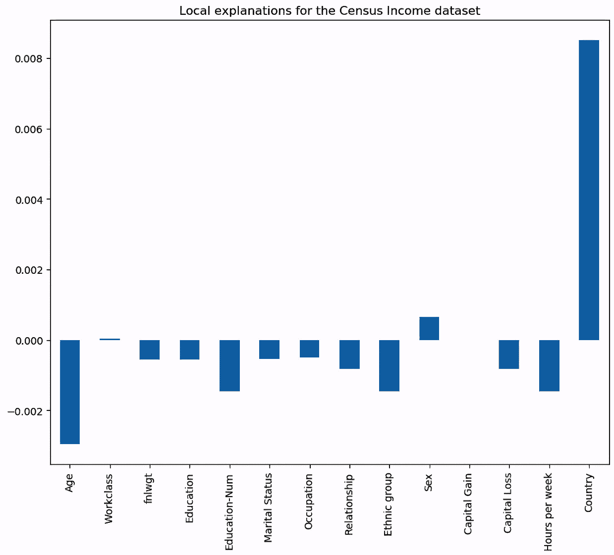
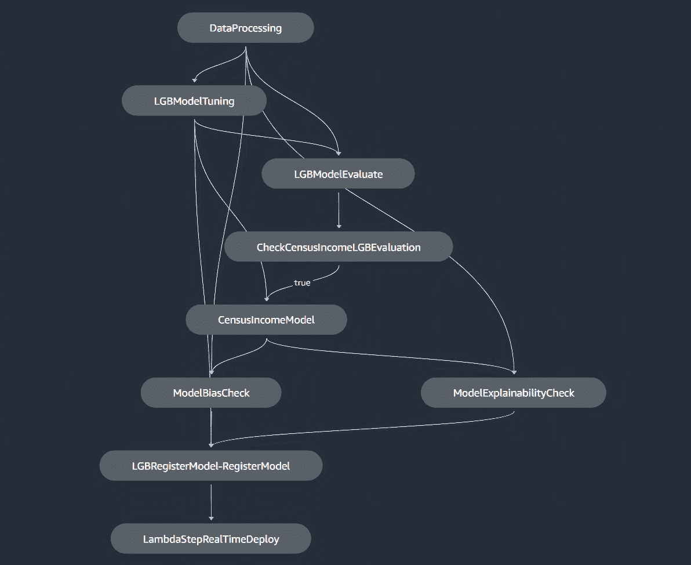
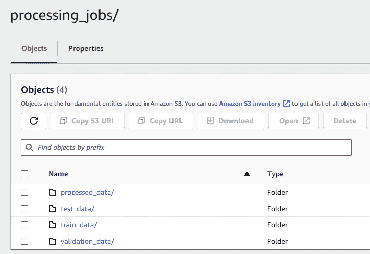
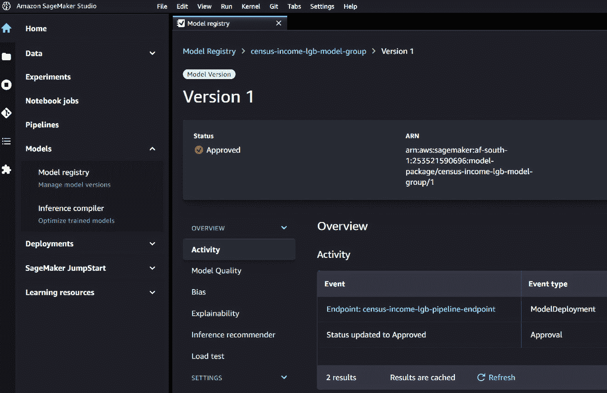
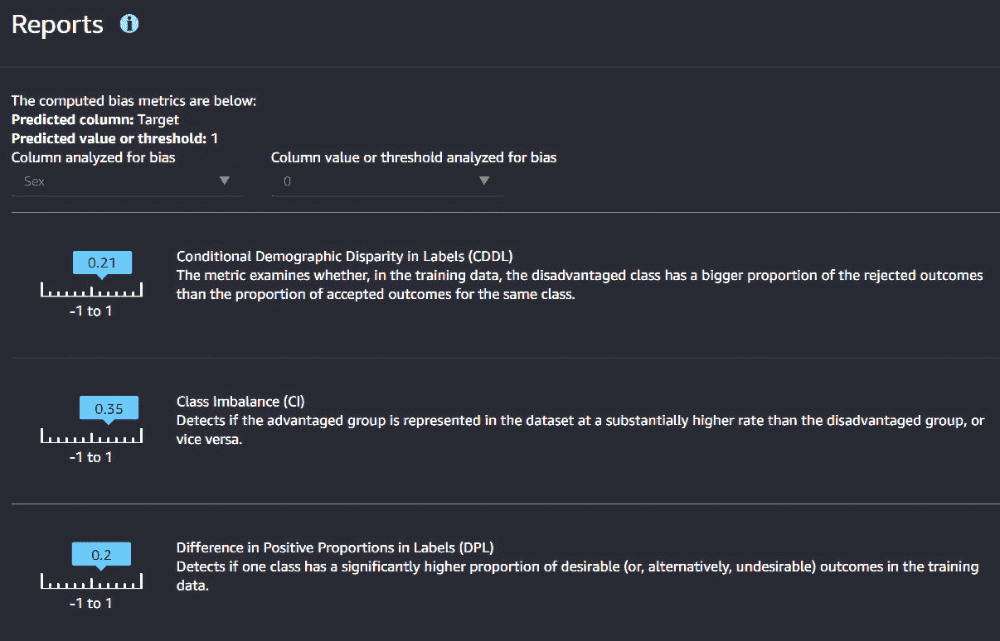
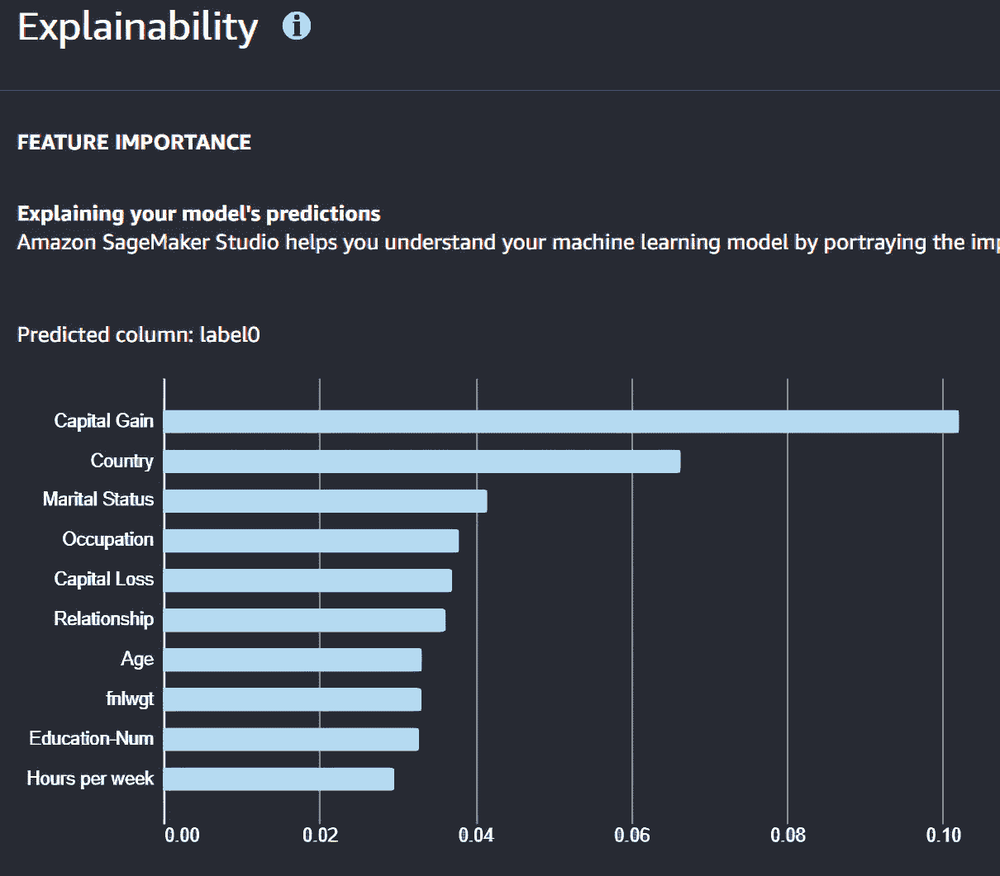

# 第九章：使用 AWS SageMaker 进行 LightGBM MLOps

在*第八章*“使用 LightGBM 的机器学习管道和 MLOps”中，我们使用 scikit-learn 构建了一个端到端的 ML 管道。我们还探讨了将管道封装在 REST API 中，并将我们的 API 部署到云端。

本章将探讨使用**Amazon SageMaker**开发和部署管道。SageMaker 是 Amazon Web Services（**AWS**）提供的一套完整的用于开发、托管、监控和维护 ML 解决方案的生产服务。

我们将通过查看高级主题，如检测训练模型中的偏差和自动化部署到完全可扩展的无服务器 Web 端点，来扩展我们的 ML 管道功能。

本章将涵盖以下主要内容：

+   AWS 和 SageMaker 简介

+   模型可解释性和偏差

+   使用 SageMaker 构建端到端管道

# 技术要求

本章深入探讨了使用 Amazon SageMaker 构建 ML 模型和管道。您需要访问一个 Amazon 账户，并且您还必须配置一种支付方式。请注意，运行本章的示例代码将在 AWS 上产生费用。本章的完整笔记本和脚本可在[`github.com/PacktPublishing/Practical-Machine-Learning-with-LightGBM-and-Python/tree/main/chapter-9`](https://github.com/PacktPublishing/Practical-Machine-Learning-with-LightGBM-and-Python/tree/main/chapter-9)找到。

# AWS 和 SageMaker 简介

本节提供了 AWS 的高级概述，并深入探讨了 SageMaker，AWS 的 ML 服务。

## AWS

AWS 是全球云计算市场的主要参与者之一。AWS 提供许多基于云的产品和服务，包括数据库、**机器学习**（**ML**）、分析、网络、存储、开发工具和企业应用程序。AWS 背后的理念是为企业提供一种经济实惠且可扩展的解决方案，以满足其计算需求，无论其规模或行业如何。

AWS 的一个关键优势是弹性，这意味着服务器和服务可以快速随意地停止和启动，从零台机器扩展到数千台。服务的弹性与其主要定价模式“按使用付费”相辅相成，这意味着客户只需为使用的服务和资源付费，无需任何预付成本或长期合同。这种弹性和定价允许企业根据需要按需和细粒度地扩展计算需求，然后只为他们使用的付费。这种方法已经改变了企业扩展 IT 资源和应用程序的方式，使他们能够快速响应不断变化的企业需求，而无需承担与硬件和软件采购和维护相关的传统高昂成本。

另一个优势是 AWS 的全球覆盖范围。AWS 服务在全球许多地区都可用。区域在地理上是分开的，每个区域进一步划分为可用区。区域-区域设置允许用户创建全球分布和冗余的基础设施，以最大化弹性和为灾难恢复进行设计。区域数据中心还允许用户在靠近最终用户的地方创建服务器和服务，以最小化延迟。

### 核心服务

核心 AWS 服务提供计算、网络和存储能力。AWS 的计算服务包括 **Amazon Elastic Compute Cloud**（**EC2**），为用户提供可配置的虚拟机，以及 **AWS Lambda**，一个无服务器计算平台，允许您在不需要配置和管理服务器的情况下运行代码。在机器学习中，EC2 实例和 Lambda 函数通常用于通过 API 端点训练、验证或提供服务模型。EC2 服务器的弹性特性允许机器学习工程师将训练服务器扩展到数万个，这可以显著加快训练或参数调整任务。

AWS 的存储和数据库服务，如 **Amazon Simple Storage Service**（**S3**）和 **Amazon RDS**（**关系数据库服务**），提供可靠、可扩展和安全的存储解决方案。这些服务管理存储基础设施，并提供高级功能，如备份、补丁管理和垂直和水平扩展。S3 是广泛用于数据工程和机器学习的服务。S3 提供低成本、高度冗余的安全存储，可扩展到超过艾字节。

AWS 还提供数据仓库解决方案，即 **Amazon Redshift**。大型企业经常使用 Redshift 作为仓库或数据湖的基础，这意味着它通常是机器学习解决方案的数据源。

AWS 还提供网络服务，以帮助企业在复杂的网络和隔离需求方面取得成功。**AWS Direct Connect** 允许客户从客户的站点设置一个专用网络连接到 AWS 云。路由和域名服务器可以使用 Amazon Route 53，一个灵活且可扩展的 **域名系统**（**DNS**）服务进行管理。

然而，在众多网络服务中，首要的是 **Amazon Virtual Private Cloud**（**VPC**）。VPC 为客户提供配置完全隔离的虚拟网络的能力。客户可以精细配置子网、路由表、地址范围、网关和安全组。VPC 允许用户隔离他们的环境和云资源，并控制进出流量，以增加安全性和隐私性。

### 安全性

任何基础设施方程中的关键部分是安全性。在安全性方面，AWS 提供一个高度安全、可扩展和灵活的云计算环境。AWS 的安全服务，包括 **AWS Identity and Access Management**（**IAM**）和 **Amazon Security Hub**，通过实施强大的安全措施帮助客户保护他们的数据和应用程序。

AWS 还符合多个国际和行业特定的合规标准，例如 GDPR、HIPAA 和 ISO 27001。此外，在数据治理方面，AWS 使遵守数据驻留和隐私要求变得容易。由于 AWS 的区域结构，数据可以保留在特定国家，同时工程师可以访问 AWS 的完整服务套件。

### 机器学习

AWS 还提供专注于 ML 和 **人工智能**（**AI**）的服务。其中许多是针对特定 ML 任务的完全托管服务。**AWS Comprehend** 提供了许多 **自然语言处理**（**NLP**）服务，例如文档处理、命名实体识别和情感分析。**Amazon Lookout** 是用于设备、指标或图像异常检测的服务。此外，**Amazon Rekognition** 提供了用于机器视觉用例的服务，例如图像分类和面部识别。

对我们来说特别感兴趣的是 **Amazon SageMaker**，这是一个完整的 ML 平台，使我们能够在亚马逊云中创建、训练和部署 ML 模型。下一节将详细讨论 SageMaker。

## SageMaker

**Amazon SageMaker** 是一个端到端的 ML 平台，允许数据科学家与数据一起工作，并开发、训练、部署和监控 ML 模型。SageMaker 完全托管，因此无需配置或管理服务器。

亚马逊 SageMaker 的主要吸引力在于其作为一个平台的全面性。它涵盖了机器学习（ML）过程的各个方面，包括数据标注、模型构建、训练、调优、部署、管理和监控。通过处理这些方面，SageMaker 允许开发者和数据科学家专注于核心的 ML 任务，而不是管理基础设施。

正如我们之前讨论的，ML 生命周期始于数据收集，这通常需要手动数据标注。为此，SageMaker 提供了一个名为 **SageMaker Ground Truth** 的服务。该服务使高效标注 ML 数据集变得容易。通过使用自动标注工作流程，它可以显著减少与数据标注通常相关的耗时和成本，并且还提供了一支用于手动数据标注任务的工作队伍。此外，SageMaker 还提供了 **Data Wrangler** 服务，该服务有助于数据准备和 **探索性数据分析**（**EDA**）。Data Wrangler 提供了从 S3、Redshift 和其他平台查询数据的功能，然后从单一可视化界面中净化、可视化和理解数据。

SageMaker 为模型训练阶段提供了一个完全管理的服务，可以通过**Training Jobs**处理大规模、分布式模型训练。该服务旨在灵活和适应性强，使用户能够根据需要优化他们的机器学习模型。用户只需指定其数据的位置，通常是 S3 和机器学习算法，SageMaker 就会负责其余的训练过程。模型训练服务充分利用了底层 AWS 基础设施的弹性：可以快速创建多个服务器来执行训练任务，训练完成后丢弃以节省成本。

这种范式也扩展到了超参数调整。为了简化超参数优化，SageMaker 提供了一个自动模型调优功能。提供了许多调优算法，例如 Optuna 或 FLAML，并且可以在多个服务器上运行调优。

SageMaker 还通过**SageMaker Autopilot**支持更全面的 AutoML 体验。Autopilot 是一种服务，它能够实现自动模型创建。用户只需提供原始数据并设置目标；然后，Autopilot 会自动探索不同的解决方案以找到最佳模型。Autopilot 提供了对整个过程的完全可见性，以便数据科学家可以了解模型是如何创建的，并做出任何必要的调整。

一旦模型经过训练和优化，就必须部署。SageMaker 通过提供一键部署过程简化了这一过程。用户可以快速将模型部署到生产环境中，并具有自动扩展功能，无需担心底层基础设施。这种部署自动扩展功能允许用户设置基于指标的策略，以增加或减少后端服务器。例如，如果一段时间内的调用次数超过特定阈值，则可以扩展部署。SageMaker 确保模型的高可用性，并允许进行 A/B 测试以比较不同版本并决定最佳版本。SageMaker 还支持多模型端点，允许用户在单个端点上部署多个模型。

Amazon SageMaker 还提供了监控模型性能和分析部署后模型的功能。**SageMaker Model Monitor**持续监控已部署模型的品质（对于实时端点）或批量监控（对于异步作业）。可以定义警报，当指标阈值超过时通知用户。Model Monitor 可以根据如准确度等指标监控数据漂移和模型漂移。

最后，SageMaker 既是 AWS 中的一个平台，也是一个软件 SDK。SDK 提供了 Python 和 R 两种语言版本。SageMaker SDK 提供了一系列内置算法和框架，包括对机器学习社区中最受欢迎的算法的支持，如 XGBoost、TensorFlow、PyTorch 和 MXNet。它还支持一个市场，用户可以从 AWS 和其他 SageMaker 用户共享的大量算法和模型包中选择。

SageMaker 中的一个值得关注的部分，简化了模型开发中最重要的一环（偏差和公平性），就是 **SageMaker Clarify**。

## SageMaker Clarify

Amazon SageMaker Clarify 是一个提供更多机器学习模型透明度的工具。SageMaker Clarify 的目标是帮助理解机器学习模型如何进行预测，从而实现模型可解释性和公平性。

SageMaker Clarify 的一个主要特性是其提供模型可解释性的能力。它帮助开发者理解输入数据与模型预测之间的关系。该服务生成特征归因，显示数据集中每个特征如何影响预测，这在许多领域都至关重要，尤其是在需要理解模型预测背后的推理时。除了提供对单个预测的洞察外，SageMaker Clarify 还提供全局解释能力。它衡量输入特征对模型预测的整体重要性，在整个数据集上汇总。特征影响分析允许开发者和数据科学家理解模型的总体行为，帮助他们从全局层面解释不同特征如何驱动模型预测。

此外，Clarify 可以帮助识别训练模型中的潜在偏差。该服务包括预训练和后训练偏差指标，帮助我们了解模型是否不公平地偏向某些群体。检查所有新模型是否存在偏差是最佳实践，但在金融或医疗保健等受监管行业中，偏差预测可能具有严重后果，因此这一点至关重要。

Clarify 通过使用一种称为 **SHapley Additive **exPlanations**（SHAP）的先进技术来提供模型可解释性。

### SHAP

SHAP 是一种基于博弈论的解释任何机器学习模型输出的方法 [1]。SHAP 的目标是提供对单个特征对模型整体预测影响的了解。

实质上，SHAP 值通过将该特定特征值与该特征的基线值进行对比来评估其影响，突出其对预测的贡献。SHAP 值是每个实例中每个特征对预测的公平贡献分配。SHAP 值植根于合作博弈论，代表了对以下问题的解决方案：

“*考虑到一个特征在预测结果中的差异，这部分差异中有多少可以归因于* *每个特征？*”

这些值是使用博弈论中的 Shapley 值概念计算的。Shapley 值通过对比模型预测与该特征存在和不存在的情况来确定特征的重要性。然而，由于模型遇到特征序列可能会影响其预测，Shapley 值考虑了所有可能的顺序。然后，它为特征分配一个重要性值，使得该特征在所有可能的联盟中的平均边际贡献等于这个值。

使用 SHAP 进行模型解释有几个优点。首先，它提供了解释的一致性。如果一个特征的影响发生变化，该特征的归因重要性也会成比例地变化。

其次，SHAP 保证局部准确性，这意味着所有特征的 SHAP 值之和将等于预测与数据集平均预测之间的差异。

使用 SHAP 摘要图可视化 SHAP 值是一个很好的方法。这些图提供了一个俯瞰特征重要性和驱动因素的全景。它们在图上绘制了每个特征的所有 SHAP 值，以便于可视化。图上的每个点代表一个特征和一个实例的 SHAP 值。Y 轴上的位置由特征决定，X 轴上的位置由 SHAP 值决定：



图 9.1 – 人口普查收入数据集的本地解释示例。条形表示 SHAP 值或每个特征在预测此特定实例时的相对重要性

在 SageMaker Clarify 的上下文中，当你运行一个澄清作业时，该服务会为你的数据集中的每个实例生成一组 SHAP 值。SageMaker Clarify 还可以通过在整个数据集上聚合 SHAP 值来提供全局特征重要性度量。

SHAP 值可以帮助你理解复杂的模型行为，突出潜在问题，并随着时间的推移改进你的模型。例如，通过检查 SHAP 值，你可能会发现某个特定特征对你的模型预测的影响比预期的更大，这会促使你探索为什么会发生这种情况。

在本节中，我们探讨了 AWS 以及更具体地，AWS 机器学习服务家族中的 SageMaker 提供了什么。SageMaker 中可用的功能，如模型可解释性、偏差检测和监控，是我们尚未在我们的机器学习管道中实现的部分。在下一节中，我们将探讨使用 SageMaker 构建一个完整的端到端 LightGBM 机器学习管道，包括这些关键步骤。

# 使用 Amazon SageMaker 构建 LightGBM 机器学习管道

我们将用于构建 SageMaker 管道案例研究的案例数据集来自 *第四章*，*比较 LightGBM、XGBoost 和深度学习* 的人口普查收入数据集。此数据集也作为 SageMaker 示例数据集提供，因此如果您是初学者，在 SageMaker 上使用它很容易。

我们将要构建的管道将包括以下步骤：

1.  数据预处理。

1.  模型训练和调优。

1.  模型评估。

1.  使用 Clarify 进行偏差和可解释性检查。

1.  在 SageMaker 中的模型注册。

1.  使用 AWS Lambda 进行模型部署。

这里有一个显示完整管道的图表：



图 9.2 – 用于人口普查收入分类的 SageMaker ML 管道

我们的方法是使用在 SageMaker Studio 中运行的 Jupyter Notebook 创建整个管道。接下来的部分将解释并展示每个管道步骤的代码，从设置 SageMaker 会话开始。

## 设置 SageMaker 会话

以下步骤假设您已经创建了一个 AWS 账户并设置了一个 SageMaker 域以开始。如果没有，可以参考以下文档来完成这些操作：

+   先决条件：[`docs.aws.amazon.com/sagemaker/latest/dg/gs-set-up.xhtml`](https://docs.aws.amazon.com/sagemaker/latest/dg/gs-set-up.xhtml)

+   加入 SageMaker 域：[`docs.aws.amazon.com/sagemaker/latest/dg/gs-studio-onboard.xhtml`](https://docs.aws.amazon.com/sagemaker/latest/dg/gs-studio-onboard.xhtml)

我们必须通过 `boto3` 初始化 SageMaker 会话并创建 S3、SageMaker 和 SageMaker Runtime 客户端以开始：

```py
sess = sagemaker.Session()
region = sess.boto_region_name
s3_client = boto3.client("s3", region_name=region)
sm_client = boto3.client("sagemaker", region_name=region)
sm_runtime_client = boto3.client("sagemaker-runtime")
```

我们将使用 Amazon S3 来存储我们的训练数据、源代码以及由管道创建的所有数据和工件，例如序列化的模型。我们的数据和工件被分为一个读取桶和一个单独的写入桶。这是一个标准的最佳实践，因为它将数据存储的关注点分开。

SageMaker 会话有一个默认的 S3 桶的概念。如果没有提供默认桶名称，则会生成一个，并为您创建一个桶。在这里，我们获取对桶的引用。这是我们输出或写入桶。读取桶是我们之前创建的一个桶，用于存储我们的训练数据：

```py
write_bucket = sess.default_bucket()
write_prefix = "census-income-pipeline"
read_bucket = "sagemaker-data"
read_prefix = "census-income"
```

管道中每个步骤的源代码、配置和输出都被捕获在我们 S3 写入桶中的文件夹内。为每个 S3 URI 创建变量很有用，这样可以避免在重复引用数据时出错，如下所示：

```py
input_data_key = f"s3://{read_bucket}/{read_prefix}"
census_income_data_uri = f"{input_data_key}/census-income.csv"
output_data_uri = f"s3://{write_bucket}/{write_prefix}/"
scripts_uri = f"s3://{write_bucket}/{write_prefix}/scripts"
```

SageMaker 需要我们指定在运行训练、处理、Clarify 和预测作业时想要使用的计算实例类型。在我们的示例中，我们使用 `m5.large` 实例。大多数 EC2 实例类型都可以与 SageMaker 一起使用。然而，还有一些支持 GPU 和深度学习框架的特殊实例类型也是可用的：

```py
train_model_id, train_model_version, train_scope = "lightgbm-classification-model", "*", "training"
process_instance_type = "ml.m5.large"
train_instance_count = 1
train_instance_type = "ml.m5.large"
predictor_instance_count = 1
predictor_instance_type = "ml.m5.large"
clarify_instance_count = 1
clarify_instance_type = "ml.m5.large"
```

SageMaker 使用标准的 EC2 实例进行训练，但在实例上运行特定的 Docker 镜像以提供 ML 功能。Amazon SageMaker 为各种 ML 框架和堆栈提供了许多预构建的 Docker 镜像。

SageMaker SDK 还提供了一个函数，用于在使用的 AWS 区域内搜索与我们所需的实例类型兼容的镜像。我们可以使用 `retrieve` 搜索镜像：

```py
train_image_uri = retrieve(
    region="us-east-1",
    framework=None,
    model_id=train_model_id,
    model_version=train_model_version,
    image_scope=train_scope,
    instance_type=train_instance_type
)
```

我们将框架参数指定为 `None`，因为我们自己管理 LightGBM 的安装。

为了参数化我们的管道，我们必须从 `sagemaker.workflow.parameters` 包中定义 SageMaker 工作流参数。各种参数类型都有包装器可用：

```py
train_instance_type_param = ParameterString(
    name="TrainingInstanceType",
    default_value=train_instance_type)
train_instance_count_param = ParameterInteger(
    name="TrainingInstanceCount",
    default_value=train_instance_count)
deploy_instance_type_param = ParameterString(
    name="DeployInstanceType",
    default_value=predictor_instance_type)
deploy_instance_count_param = ParameterInteger(
    name="DeployInstanceCount",
    default_value=predictor_instance_count)
```

在设置了管道参数、S3 数据路径和其他配置变量后，我们可以继续创建管道的预处理步骤。

## 预处理步骤

设置我们的预处理步骤有两个部分：创建一个执行预处理的 Python 脚本，并创建一个添加到管道中的处理器。

我们将要使用的脚本是一个带有主函数的常规 Python 脚本。我们将使用 scikit-learn 进行预处理。预处理脚本在此处并未完全重现，但在我们的源代码仓库中可用。值得注意的是，当管道执行步骤时，数据将从 S3 检索并添加到预处理实例的本地暂存目录中。从这里，我们可以使用标准的 pandas 工具读取数据：

```py
local_dir = "/opt/ml/processing"
input_data_path = os.path.join("/opt/ml/processing/census-income", "census-income.csv")
logger.info("Reading claims data from {}".format(input_data_path))
df = pd.read_csv(input_data_path)
```

类似地，在处理完成后，我们可以将结果写入本地目录，SageMaker 会从该目录检索数据并将其上传到 S3：

```py
train_output_path = os.path.join(f"{local_dir}/train", "train.csv")
X_train.to_csv(train_output_path, index=False)
```

预处理脚本定义后，我们需要将其上传到 S3，以便管道能够使用它：

```py
s3_client.upload_file(
    Filename="src/preprocessing.py", Bucket=write_bucket, Key=f"{write_prefix}/scripts/preprocessing.py"
)
```

我们可以如下定义预处理步骤。首先，我们必须创建一个 `SKLearnProcessor` 实例：

```py
sklearn_processor = SKLearnProcessor(
    framework_version="0.23-1",
    role=sagemaker_role,
    instance_count=1,
    instance_type=process_instance_type,
    base_job_name=f"{base_job_name_prefix}-processing",
)
```

`SKLearnProcessor` 处理需要 scikit-learn 的作业的处理任务。我们指定了 scikit-learn 框架版本以及我们之前定义的实例类型和数量。

然后将处理器添加到 `ProcessingStep` 以在管道中使用：

```py
process_step = ProcessingStep(
    name="DataProcessing",
    processor=sklearn_processor,
    inputs=[...],
    outputs=[...],
    job_arguments=[
        "--train-ratio", "0.8",
        "--validation-ratio", "0.1",
        "--test-ratio", "0.1"
    ],
    code=f"s3://{write_bucket}/{write_prefix}/scripts/preprocessing.py"
)
```

`inputs` 和 `outputs` 使用 `ProcessingInput` 和 `ProcessingOutput` 包装器定义，如下所示：

```py
inputs = [ ProcessingInput(source=bank_marketing_data_uri, destination="/opt/ml/processing/bank-marketing") ]
outputs = [ ProcessingOutput(destination=f"{processing_output_uri}/train_data", output_name="train_data",
                         source="/opt/ml/processing/train"), ... ]
```

`ProcessingStep` 接收我们的 scikit-learn 处理器以及数据的输入和输出。`ProcessingInput` 实例定义了 S3 源和本地目录目标，以方便复制数据（这些是我们在预处理脚本中使用的相同本地目录）。同样，`ProcessingOutput` 实例接收本地目录源和 S3 目标。我们还设置了作业参数，这些参数作为 CLI 参数传递给预处理脚本。

预处理步骤设置完成后，我们可以继续进行训练。

## 模型训练和调整

我们以与预处理脚本相同的方式定义训练脚本：一个带有主函数的 Python 脚本，使用我们的标准 Python 工具（如 scikit-learn）训练一个 LightGBM 模型。然而，我们还需要安装 LightGBM 库本身。

安装库的另一种方法是将其构建到 Docker 镜像中，并将其用作 SageMaker 中的训练镜像。这是在 SageMaker 中管理环境的标准方式。然而，它需要大量的工作，并且需要在长期内维护镜像。或者，如果我们只需要安装少量依赖项，我们可以直接从我们的训练脚本中安装，如下所示。

我们必须定义一个辅助函数来安装包，然后使用它来安装 LightGBM：

```py
def install(package):
    subprocess.check_call([sys.executable, "-q", "-m", "pip", "install", package])
install("lightgbm")
import lightgbm as lgb
```

这也有一个优点，即每次我们运行训练时都会安装最新版本（或指定版本）。

在安装了包之后，训练脚本的其余部分将在预处理步骤准备的数据上训练标准的 `LGBMClassifier`。我们可以从脚本的参数中设置或训练数据和参数：

```py
train_df = pd.read_csv(f"{args.train_data_dir}/train.csv")
val_df = pd.read_csv(f"{args.validation_data_dir}/validation.csv")
params = {
    "n_estimators": args.n_estimators,
    "learning_rate": args.learning_rate,
    "num_leaves": args.num_leaves,
    "max_bin": args.max_bin,
}
```

然后，我们必须进行标准的 scikit-learn 交叉验证评分，将模型拟合到数据，并输出训练和验证分数：

```py
X, y = prepare_data(train_df)
model = lgb.LGBMClassifier(**params)
scores = cross_val_score(model, X, y, scoring="f1_macro")
train_f1 = scores.mean()
model = model.fit(X, y)
X_test, y_test = prepare_data(val_df)
test_f1 = f1_score(y_test, model.predict(X_test))
print(f"[0]#011train-f1:{train_f1:.2f}")
print(f"[0]#011validation-f1:{test_f1:.2f}")
```

如此所示，脚本接受 CLI 参数来设置超参数。这在优化阶段设置参数时被超参数调整步骤使用。我们可以使用 Python 的 `ArgumentParser` 来实现这个目的：

```py
parser = argparse.ArgumentParser()
parser.add_argument("--boosting_type", type=str, default="gbdt")
parser.add_argument("--objective", type=str, default="binary")
parser.add_argument("--n_estimators", type=int, default=200)
parser.add_argument("--learning_rate", type=float, default=0.001)
parser.add_argument("--num_leaves", type=int, default=30)
parser.add_argument("--max_bin", type=int, default=300)
```

我们还可以看到，我们记录了训练和验证的 F1 分数，这使得 SageMaker 和 CloudWatch 能够从日志中提取数据用于报告和评估目的。

最后，我们需要将训练结果写入一个 JSON 文档中。这些结果随后可以在后续的管道处理中使用，并在 SageMaker 界面中作为作业的输出显示。该 JSON 文档存储在磁盘上，与序列化的模型文件一起：

```py
metrics_data = {"hyperparameters": params,
                "binary_classification_metrics":
{"validation:f1": {"value": test_f1},"train:f1": {"value":
train_f1}}
}
metrics_location = args.output_data_dir + "/metrics.json"
model_location = args.model_dir + "/lightgbm-model"
with open(metrics_location, "w") as f:
    json.dump(metrics_data, f)
with open(model_location, "wb") as f:
    joblib.dump(model, f)
```

与预处理步骤一样，结果被写入到本地目录中，SageMaker 会从中提取并将它们复制到 S3。

脚本定义后，我们可以在管道中创建调整步骤，该步骤训练模型并调整超参数。

我们必须定义一个类似 `SKLearnProcessor` 的 SageMaker `Estimator`，它封装了训练的配置，包括对脚本（在 S3 上）的引用：

```py
static_hyperparams = {
    "boosting_type": "gbdt",
    "objective": "binary",
}
lgb_estimator = Estimator(
    source_dir="src",
    entry_point="lightgbm_train.py",
    output_path=estimator_output_uri,
    code_location=estimator_output_uri,
    hyperparameters=static_hyperparams,
    role=sagemaker_role,
    image_uri=train_image_uri,
    instance_count=train_instance_count,
    instance_type=train_instance_type,
    framework_version="1.3-1",
)
```

然后，我们可以定义我们的 SageMaker `HyperparameterTuner`，它执行实际的超参数调整。类似于 Optuna 或 FLAML，我们必须使用 SageMaker 包装器指定超参数的有效范围：

```py
hyperparameter_ranges = {
    "n_estimators": IntegerParameter(10, 400),
    "learning_rate": ContinuousParameter(0.0001, 0.5, scaling_type="Logarithmic"),
    "num_leaves": IntegerParameter(2, 200),
    "max_bin": IntegerParameter(50, 500)
}
```

`HyperparameterTuner` 可以设置如下：

```py
tuner_config_dict = {
    "estimator": lgb_estimator,
    "max_jobs": 20,
    "max_parallel_jobs": 2,
    "objective_metric_name": "validation-f1",
    "metric_definitions": [{"Name": "validation-f1", "Regex": "validation-f1:([0-9\\.]+)"}],
    "hyperparameter_ranges": hyperparameter_ranges,
    "base_tuning_job_name": tuning_job_name_prefix,
    "strategy": "Random"
}
tuner = HyperparameterTuner(**tuner_config_dict)
```

SageMaker 支持许多超参数调优策略，包括 Hyperband 调优。更多信息可以在超参数调优的文档中找到：[`docs.aws.amazon.com/sagemaker/latest/dg/automatic-model-tuning-how-it-works.xhtml`](https://docs.aws.amazon.com/sagemaker/latest/dg/automatic-model-tuning-how-it-works.xhtml)。在这里，我们使用了随机搜索，最大作业大小为 20。在这里，AWS 的弹性基础设施可以发挥显著作用。如果我们增加训练实例数量，SageMaker 会自动将训练作业分配到所有机器上。配置额外的机器有一些开销并增加成本，但如果运行数千次试验，它也可以显著减少调优时间。

调优器的指标定义定义了正则表达式，用于从日志中提取结果指标，正如我们在之前的训练脚本中所示。参数优化框架相对于这里定义的指标进行优化，最小化或最大化指标。

定义了超参数调优器后，我们可以创建一个 `TuningStep` 以包含到管道中：

```py
tuning_step = TuningStep(
    name="LGBModelTuning",
    tuner=tuner,
    inputs={
        "train": TrainingInput(...),
        "validation": TrainingInput(...),
    }
)
```

我们迄今为止定义的管道步骤准备数据并生成一个序列化到 S3 的训练模型。管道的下一步是创建一个 SageMaker `Model`，它封装了模型并用于评估、偏差和推理步骤。可以按照以下方式完成：

```py
model = sagemaker.model.Model(
    image_uri=train_image_uri,
    model_data=tuning_step.get_top_model_s3_uri(
        top_k=0, s3_bucket=write_bucket, prefix=model_prefix
    ),
    sagemaker_session=sess,
    role=sagemaker_role
)
inputs = sagemaker.inputs.CreateModelInput(instance_type=deploy_instance_type_param)
create_model_step = CreateModelStep(name="CensusIncomeModel", model=model, inputs=inputs)
```

`Model` 实例封装了部署和运行模型所需的所有必要配置。我们可以看到 `model_data` 是从调优步骤中产生的表现最好的模型中获取的。

我们迄今为止定义的管道步骤将生成处理后的数据和训练一个调优模型。处理数据在 S3 中的布局如图 *9.3* 所示：



图 9.3 – 处理作业结果的 S3 目录布局

如果我们需要进行部署步骤，我们可以继续进行。然而，我们将遵循最佳实践，并在管道中添加质量门，以检查模型的表现和偏差，并对其功能产生见解。

## 评估、偏差和可解释性

到目前为止，我们已经看到了向 SageMaker 管道添加步骤的一般模式：使用 SageMaker 的配置类设置配置，然后创建相关的管道步骤。

### 偏差配置

要将偏差检查添加到我们的管道中，我们必须创建以下配置：

```py
bias_config = clarify.BiasConfig(
    label_values_or_threshold=[1], facet_name="Sex", facet_values_or_threshold=[0], group_name="Age"
)
model_predictions_config = sagemaker.clarify.ModelPredictedLabelConfig(probability_threshold=0.5)
model_bias_check_config = ModelBiasCheckConfig(
    data_config=model_bias_data_config,
    data_bias_config=bias_config,
    model_config=model_config,
    model_predicted_label_config=model_predictions_config,
    methods=["DPPL"]
)
```

`BiasConfig` 描述了我们要检查哪些方面（特征）。我们选择了 `Sex` 和 `Age`，这两个方面在处理人口统计数据时始终是必须检查的。

`ModeLBiasCheckConfig` 包装了数据配置、模型配置和偏差确认步骤。它还设置了用于偏差检查的方法。在这里，我们使用**预测标签中正比例的差异**（DPPL）。

DPPL 是一个衡量模型是否对数据的不同方面预测结果不同的指标。DPPL 是通过计算“a”方面和“d”方面的正面预测比例之间的差异来计算的。它通过将训练后的模型预测与数据集中最初存在的偏差进行比较，帮助评估模型预测是否存在偏差。例如，如果一个预测家庭贷款资格的模型对 70% 的男性申请人（方面“a”）预测了积极的结果，而对 60% 的女性申请人（方面“d”）预测了积极的结果，那么 10% 的差异可能表明对方面“d”存在偏见。

DPPL 公式表示如下：

DPPL = q a ′ − q d ′

在这里，q a ′ 是预测的方面“a”获得积极结果的概率，q d ′ 是类似的比例，对于二进制和多类别方面标签，标准化后的 DPPL 值介于 [-1, 1] 之间，而连续标签在 (-∞, +∞) 区间内变化。正 DPPL 值表明方面“a”相对于“d”的正面预测比例更高，表明存在正偏差。相反，负 DPPL 指示方面“d”的正面预测比例更高，表明存在负偏差。接近零的 DPPL 指示两个方面的正面预测比例相对相等，零值表示人口统计学上的完美平等。

您可以使用 `ClarifyCheckStep` 将偏差检查添加到管道中：

```py
model_bias_check_step = ClarifyCheckStep(
    name="ModelBiasCheck",
    clarify_check_config=model_bias_check_config,
    check_job_config=check_job_config,
    skip_check=skip_check_model_bias_param,
    register_new_baseline=register_new_baseline_model_bias_param,
    supplied_baseline_constraints=supplied_baseline_constraints_model_bias_param
)
```

### 可解释性配置

可解释性的配置非常相似。我们不是创建 `BiasConfig`，而是必须创建 `SHAPConfig`：

```py
shap_config = sagemaker.clarify.SHAPConfig(
    seed=829,
    num_samples=100,
    agg_method="mean_abs",
    save_local_shap_values=True
)
```

与 `SHAPConfig` 一起，我们必须创建 `ModelExplainabilityCheckConfig` 来计算 SHAP 值并创建可解释性报告：

```py
model_explainability_config = ModelExplainabilityCheckConfig(
    data_config=model_explainability_data_config,
    model_config=model_config,
    explainability_config=shap_config
)
```

然后使用 `ClarifyCheckStep` 将所有内容组合在一起：

```py
model_explainability_step = ClarifyCheckStep(
    name="ModelExplainabilityCheck",
    clarify_check_config=model_explainability_config,
    check_job_config=check_job_config,
    skip_check=skip_check_model_explainability_param,
    register_new_baseline=register_new_baseline_model_explainability_param,
    supplied_baseline_constraints=supplied_baseline_constraints_model_explainability_param
)
```

### 评估

最后，我们还需要使用测试数据评估我们的模型。评估脚本与训练脚本非常相似，只是它从 S3 中提取调整后的模型进行评分。该脚本由一个主函数和两个步骤组成。首先，我们必须引导训练模型并进行评分（在我们的情况下，计算 F1 分数）：

```py
...
    test_f1 = f1_score(y_test, model.predict(X_test))
    # Calculate model evaluation score
    logger.debug("Calculating F1 score.")
    metric_dict = {
        "classification_metrics": {"f1": {"value": test_f1}}
    }
```

然后，我们必须将结果输出到 JSON 文件中：

```py
    # Save model evaluation metrics
    output_dir = "/opt/ml/processing/evaluation"
    pathlib.Path(output_dir).mkdir(parents=True, exist_ok=True)
    logger.info("Writing evaluation report with F1: %f", test_f1)
    evaluation_path = f"{output_dir}/evaluation.json"
    with open(evaluation_path, "w") as f:
        f.write(json.dumps(metric_dict))
```

评估 JSON 用于报告以及依赖于评估指标的后续步骤。

## 部署和监控 LightGBM 模型

我们现在可以添加我们管道的最终步骤以支持部署。管道的部署部分由三个步骤组成：

1.  在 SageMaker 中注册模型。

1.  条件检查以验证模型评估是否超过最小阈值。

1.  使用 AWS Lambda 函数部署模型端点。

### 模型注册

要部署我们的模型，我们首先需要在 SageMaker 的 **模型注册表** 中注册我们的模型。

SageMaker 的模型注册表是一个中央存储库，您可以在其中管理和部署您的模型。

模型注册表提供了以下核心功能：

+   **模型版本控制**：每次训练并注册模型时，模型注册表中都会为其分配一个版本。这有助于您跟踪模型的各个迭代版本，这在需要比较模型性能、回滚到先前版本或在机器学习项目中保持可重复性时非常有用。

+   **审批工作流程**：模型注册表支持审批工作流程，模型可以被标记为“待手动审批”、“已批准”或“已拒绝”。这允许团队有效地管理其模型的生命周期，并确保只有经过批准的模型被部署。

+   **模型目录**：模型注册表充当一个目录，其中集中存储和访问所有模型。注册表中的每个模型都与元数据相关联，例如使用的训练数据、超参数和性能指标。

在注册我们的模型时，我们附加了从评估步骤计算出的指标。这些指标也用于模型漂移检测。

可能存在两种类型的漂移：**数据漂移**和**模型漂移**。

数据漂移指的是与我们的模型训练数据相比，输入数据的统计分布发生变化。例如，如果训练数据中男性和女性的比例为 60%到 40%，但用于预测的数据偏向于 80%男性与 20%女性，那么可能发生了漂移。

模型漂移是一种现象，即模型试图预测的目标变量的统计属性随着时间的推移以不可预见的方式发生变化，导致模型性能下降。

数据和模型漂移可能由于环境变化、社会行为、产品使用或其他在模型训练期间未考虑到的因素而发生。

SageMaker 支持漂移的持续监控。SageMaker 计算输入数据和我们所做预测的统计分布。两者都与训练数据中的分布进行比较。如果检测到漂移，SageMaker 可以向 AWS CloudWatch 生成警报。

我们可以按如下方式配置我们的指标：

```py
model_metrics = ModelMetrics(
    bias_post_training=MetricsSource(
        s3_uri=model_bias_check_step.properties.CalculatedBaselineConstraints,
        content_type="application/json"
    ),
    explainability=MetricsSource(
        s3_uri=model_explainability_step.properties.CalculatedBaselineConstraints,
        content_type="application/json"
    ),
)
```

然后，对于漂移指标，我们必须设置`DriftCheckBaselines`：

```py
drift_check_baselines = DriftCheckBaselines(
    bias_post_training_constraints=MetricsSource(   s3_uri=model_bias_check_step.properties.BaselineUsedForDriftCheckConstraints, content_type="application/json",
    ),
    explainability_constraints=MetricsSource(        s3_uri=model_explainability_step.properties.BaselineUsedForDriftCheckConstraints, content_type="application/json",
    ),
    explainability_config_file=FileSource(        s3_uri=model_explainability_config.monitoring_analysis_config_uri, content_type="application/json",
    ))
```

然后，我们必须创建一个包含以下代码的模型注册步骤：

```py
register_step = RegisterModel(
    name="LGBRegisterModel",
    estimator=lgb_estimator,
    model_data=tuning_step.get_top_model_s3_uri(
        top_k=0, s3_bucket=write_bucket, prefix=model_prefix
    ),
    content_types=["text/csv"],
    response_types=["text/csv"],
    inference_instances=[predictor_instance_type],
    transform_instances=[predictor_instance_type],
    model_package_group_name=model_package_group_name,
    approval_status=model_approval_status_param,
    model_metrics=model_metrics,
    drift_check_baselines=drift_check_baselines
)
```

### 模型验证

条件检查使用评估步骤中的评估数据来确定模型是否适合部署：

```py
cond_gte = ConditionGreaterThanOrEqualTo(
    left=JsonGet(
        step_name=evaluation_step.name,
        property_file=evaluation_report,
        json_path="classification_metrics.f1.value",
    ),
    right=0.9,
)
condition_step = ConditionStep(
    name="CheckCensusIncomeLGBEvaluation",
    conditions=[cond_gte],
    if_steps=[create_model_step, register_step, lambda_deploy_step],
    else_steps=[]
)
```

在这里，我们创建了`ConditionStep`并比较了 F1 分数与`0.9`的阈值。如果模型的 F1 分数高于阈值，则可以继续部署。

### 使用 AWS Lambda 进行部署

部署脚本是一个标准的 AWS Lambda Python 脚本，它定义了一个`lambda_handler`函数，该函数获取 SageMaker 的客户端连接并继续创建模型端点：

```py
def lambda_handler(event, context):
    sm_client = boto3.client("sagemaker")
...
    create_endpoint_config_response = sm_client.create_endpoint_config(
        EndpointConfigName=endpoint_config_name,
        ProductionVariants=[{
            "VariantName": "Alltraffic",
            "ModelName": model_name,
            "InitialInstanceCount": instance_count,
            "InstanceType": instance_type,
            "InitialVariantWeight": 1}])
    create_endpoint_response = sm_client.create_endpoint(
        EndpointName=endpoint_name,
        EndpointConfigName=endpoint_config_name)
```

值得注意的是，Lambda 函数不处理模型的请求。它仅在 SageMaker 中创建模型端点。

在 SageMaker 中，**端点** 是一个获取模型预测的 Web 服务。一旦模型训练完成，训练作业完成后，你需要部署模型以进行实时或批量预测。在 SageMaker 术语中，部署意味着设置端点 – 一个托管、生产就绪的模型。

SageMaker 中的端点是一个可扩展且安全的 RESTful API，你可以用它向模型发送实时推理请求。你的应用程序可以通过 REST API 或 AWS SDK 直接访问端点进行预测。它可以按需扩展和缩减实例，提供灵活性和成本效益。

SageMaker 还支持多模型端点，可以在单个端点上部署多个模型。如果许多模型使用频率不高或不是资源密集型，这个功能可以显著节省成本。

定义了 Lambda 脚本后，可以使用 `LambdaStep` 将其纳入管道：

```py
lambda_deploy_step = LambdaStep(
    name="LambdaStepRealTimeDeploy",
    lambda_func=func,
    inputs={
        "model_name": pipeline_model_name,
        "endpoint_config_name": endpoint_config_name,
        "endpoint_name": endpoint_name,
        "model_package_arn": register_step.steps[0].properties.ModelPackageArn,
        "role": sagemaker_role,
        "instance_type": deploy_instance_type_param,
        "instance_count": deploy_instance_count_param
    }
)
```

注意

模型端点一旦部署就会产生费用，直到其部署期间。一旦你运行了管道，就会创建一个端点。如果你只是实验或测试你的管道，你应该在完成后删除端点。

### 创建和运行管道

我们的所有管道步骤现在都已就绪，这意味着我们可以创建管道本身。`Pipeline` 构造函数接受我们已定义的名称和参数：

```py
pipeline = Pipeline(
    name=pipeline_name,
    parameters=[process_instance_type_param,
                train_instance_type_param,
                train_instance_count_param,
                deploy_instance_type_param,
                deploy_instance_count_param,
                clarify_instance_type_param,
                skip_check_model_bias_param,
                register_new_baseline_model_bias_param,                supplied_baseline_constraints_model_bias_param,
                skip_check_model_explainability_param,                register_new_baseline_model_explainability_param,                supplied_baseline_constraints_model_explainability_param,
                model_approval_status_param],
```

我们还必须将我们定义的所有步骤作为列表参数传递，并最终更新管道：

```py
    steps=[
        process_step,
        train_step,
        evaluation_step,
        condition_step
    ],
    sagemaker_session=sess)
pipeline.upsert(role_arn=sagemaker_role)
```

执行管道是通过调用 `start` 方法完成的：

```py
start_response = pipeline.start(parameters=dict(
        SkipModelBiasCheck=True,
        RegisterNewModelBiasBaseline=True,
        SkipModelExplainabilityCheck=True,
        RegisterNewModelExplainabilityBaseline=True))
```

注意我们在这里定义的条件。在第一次运行管道时，我们必须在注册新的偏差和可解释性基线的同时跳过模型偏差和可解释性检查。

这两个检查都需要一个现有的基线来运行（否则，没有数据可以检查）。一旦建立了基线，我们就可以在后续运行中禁用跳过检查。

更多关于模型生命周期和创建基线的信息可以在 [`docs.aws.amazon.com/sagemaker/latest/dg/pipelines-quality-clarify-baseline-lifecycle.xhtml`](https://docs.aws.amazon.com/sagemaker/latest/dg/pipelines-quality-clarify-baseline-lifecycle.xhtml) 找到。

## 结果

当管道执行时，你可以查看执行图以查看每个步骤的状态：


图 9.4 – LightGBM 人口普查收入管道成功执行

一旦管道完成，我们还可以在模型注册表中看到已注册的模型本身：



图 9.5 – SageMaker 模型注册表显示已批准的人口普查收入模型和相关端点

当选择模型时，可以查看偏差和可解释性报告。*图 9.6* 显示了由管道创建的模型的偏差报告。我们可以看到在 DPPL 中存在轻微的不平衡，但小于训练数据中的类别不平衡。报告表明没有强有力的证据表明存在偏差：



图 9.6 – 展示 DPPL 中轻微不平衡但小于训练数据类别不平衡的 Census Income 模型偏差报告

如 *图 9.7* 所示的可解释性报告显示了每个特征在 SHAP 值方面的重要性。在这里，我们可以看到 **资本收益** 和 **国家** 特征在预测的重要性方面占主导地位：



图 9.7 – 展示资本收益和 Country 特征主导重要性的 Census Income 模型的可解释性报告

偏差和可解释性报告也可以下载为 PDF 格式，可以轻松地与商业或非技术利益相关者共享。

### 使用端点进行预测

当然，如果我们不能使用部署的模型进行任何预测，那么我们的部署模型就没什么用了。我们可以通过 REST 调用或 Python SDK 使用部署的模型进行预测。以下是一个使用 Python SDK 的示例：

```py
predictor = sagemaker.predictor.Predictor(endpoint_name,                                           sagemaker_session=sess, serializer=CSVSerializer(),                  deserializer=CSVDeserializer())
payload = test_df.drop(["Target"], axis=1).iloc[:5]
result = predictor.predict(payload.values)
```

我们使用端点名称和会话获取 SageMaker `Predictor`，然后我们可以调用 `predict` 方法，传递一个 NumPy 数组（在本例中是从测试 DataFrame 获取的）。

由此，我们使用 SageMaker 创建了一个完整、端到端、生产就绪的管道。我们的管道包括数据预处理、自动模型调优、偏差验证、漂移检测以及完全可扩展的部署。

# 摘要

本章介绍了 AWS 和 Amazon SageMaker 作为构建和部署机器学习解决方案的平台。给出了 SageMaker 服务的概述，包括 Clarify 服务，该服务提供高级功能，如模型偏差检查和可解释性。

我们随后使用 SageMaker 服务构建了一个完整的机器学习（ML）管道。该管道包括机器学习生命周期的所有步骤，包括数据准备、模型训练、调优、模型评估、偏差检查、可解释性报告、针对测试数据的验证以及部署到云原生、可扩展的基础设施。

提供了具体的示例来构建管道中的每个步骤，强调全面自动化，旨在实现简单的重新训练和持续监控数据及模型过程。

下一章将探讨另一个名为 **PostgresML** 的 MLOps 平台。PostgresML 在服务器景观的基石——Postgres 数据库之上提供机器学习功能。

# 参考文献

| *[**1]* | *S. M. Lundberg 和 S.-I. Lee, 在《神经网络信息处理系统 30 卷进展》中，关于解释模型预测的统一方法, I. Guyon, U. V. Luxburg, S. Bengio, H. Wallach, R. Fergus, S. Vishwanathan 和 R. Garnett 编著，Curran Associates, Inc., 2017,* *第 4765–4774 页.* |
| --- | --- |
| *[**2]* | *R. P. Moro 和 P. Cortez, 银行* *营销, 2012.* |
