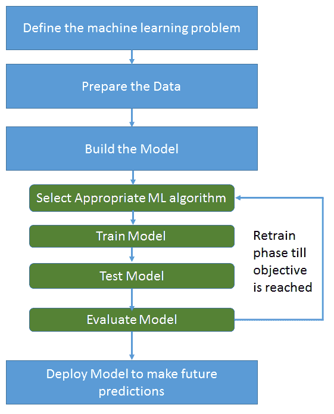
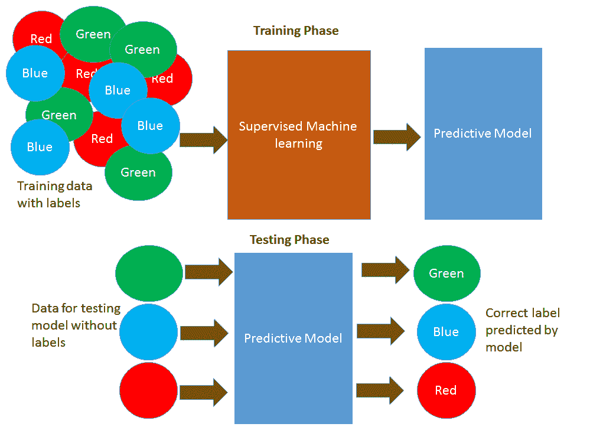
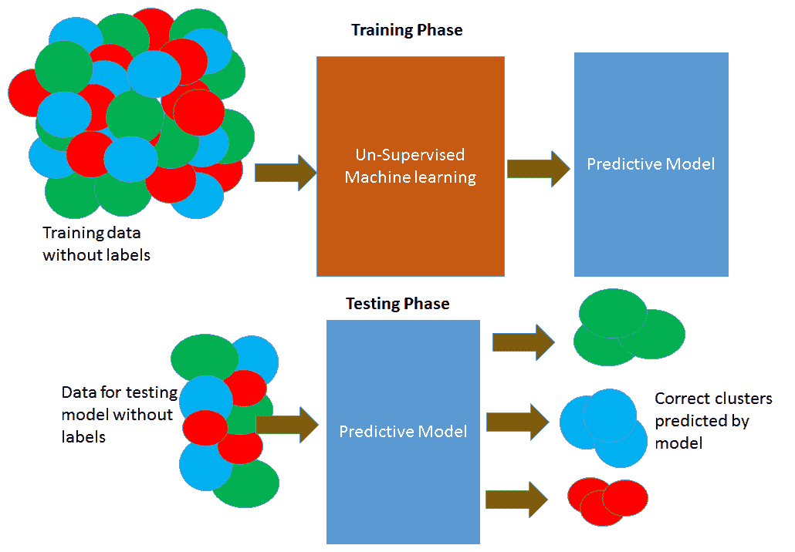
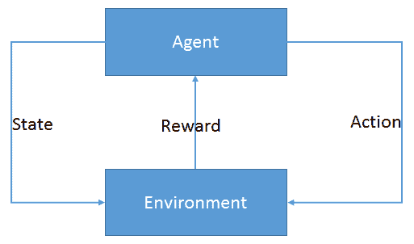
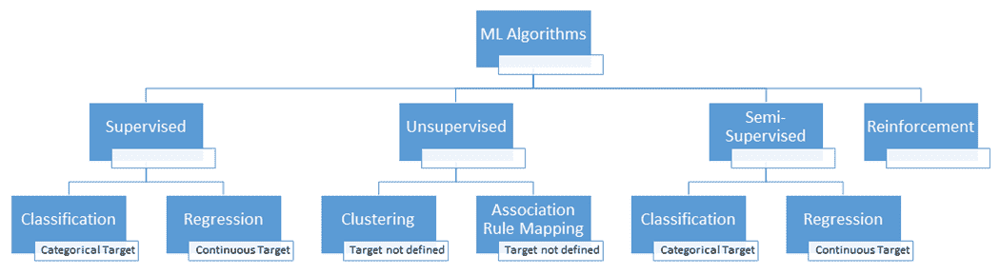
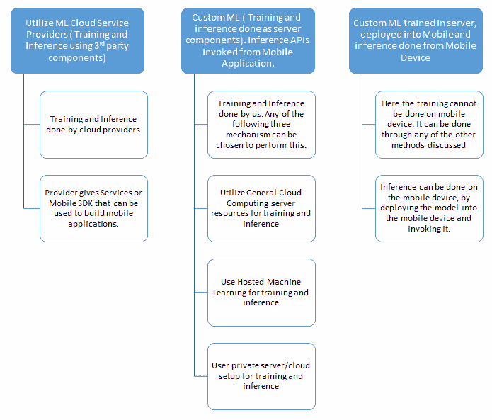
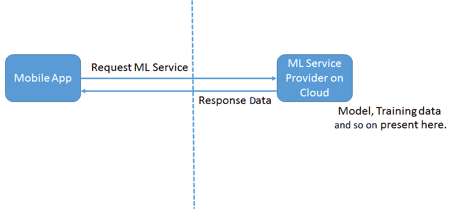
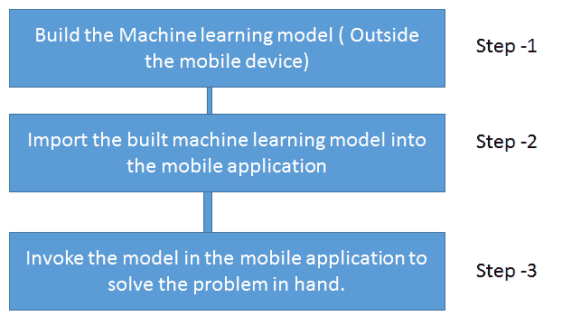

# 第一章：移动机器学习入门

我们生活在一个移动应用的世界里。它们已经成为我们日常生活中的一个重要组成部分，以至于我们很少关注它们背后的数字。（这包括它们创造的收益、业务的实际市场规模以及推动移动应用增长的定量数据。）让我们来看看这些数字：

+   《福布斯》预测，到 2020 年，移动应用收入预计将达到 1890 亿美元。

+   我们还看到，全球智能手机的安装基础正在呈指数级增长。因此，安装在这些设备上的应用收入也在以难以想象的速度增长。

移动设备和服务现在已成为人们娱乐、商业生活和沟通的中心，智能手机已经取代了个人电脑，成为最重要的智能连接设备。移动创新、新的商业模式和移动技术正在改变人类生活的方方面面。

现在，让我们谈谈机器学习。为什么机器学习最近如此火爆？机器学习并不是一个新课题。它早在 10-20 年前就存在了，那么为什么现在会成为焦点，为什么每个人都谈论它？原因很简单：数据爆炸。社交网络和移动设备使得用户数据的生成达到了前所未有的规模。十年前，你不会像现在这样将图片上传到云端，因为那时的手机普及率无法与今天相比。4G 连接使得现在甚至可以实现按需**视频数据流**（**VDO**），这意味着现在全球范围内流动的数据比以往任何时候都要多。下一个时代预计将是**物联网**（**IOT**）的时代，届时将有更多基于数据传感器的数据。

所有这些数据只有在我们可以将其用于适当用途、从中提取出对我们有价值的信息、并揭示出新的数据模式，从而提供新的商业机会时才有价值。因此，为了实现这一点，机器学习是解锁每天积累的这些堆积如山的数据中存储价值的正确工具。

因此，很明显，现在是成为一名移动应用开发者以及机器学习数据科学家的大好时机。但如果我们能将机器学习的力量带到移动设备上，并开发出真正酷炫的、利用机器学习力量的移动应用，那会多么酷啊？这正是我们通过这本书所尝试做的事情：为移动应用开发者提供机器学习基础知识的见解，向他们介绍各种机器学习算法和移动机器学习 SDK/工具，并指导他们使用这些 SDK/工具开发移动机器学习应用。

移动空间中的机器学习是一个关键的创新领域，移动开发者必须正确理解，因为它正在改变用户可视化和利用移动应用的方式。那么，机器学习如何改变移动应用并将它们转化为任何用户的梦想应用？让我给你举一些例子，让你从宏观的角度了解机器学习可以为移动应用做什么：

+   Facebook 和 YouTube 移动应用使用机器学习——*推荐*或*你可能认识的人*不过是机器学习的实际应用。

+   苹果和谷歌读取每个用户行为的行为或措辞，并推荐适合您打字风格的下一个单词。他们已经在 iOS 和 Android 设备上实施了这一功能。

+   Oval Money 分析用户的先前交易，并为他们提供不同的方式来避免额外支出。

+   Google Maps 正在使用机器学习使你的生活更轻松。

+   Django 使用机器学习来解决问题，寻找完美的表情符号。它是一个可以集成到不同通讯工具中的浮动助手。

机器学习可以应用于属于任何领域的移动应用——医疗保健、金融、游戏、通信或任何阳光下的东西。因此，让我们了解机器学习究竟是什么。

在本章中，我们将涵盖以下主题：

+   什么是机器学习？

+   在什么情况下适合采用使用机器学习实现的解决方案？

+   机器学习的分类

+   机器学习中的关键算法

+   实施机器学习需要遵循的过程

+   一些值得了解的机器学习关键概念

+   实施机器学习面临的挑战

+   为什么在移动应用中使用机器学习？

+   在移动应用中实现机器学习的方法

# 机器学习的定义

机器学习专注于编写可以从以往经验中学习的软件。机器学习的一个标准定义，由卡内基梅隆大学（**CMU**）的教授 Tom Mitchell 给出，如下所示：

如果一个计算机程序在执行某些任务 T 和性能指标 P 方面从经验 E 中学习，那么它的性能随着经验 E 的提高而提高。

例如，一个学习下棋的计算机程序可能会通过与自己下棋获得的经验来提高其性能，即提高在涉及下棋的任务类别中获胜的能力。一般来说，为了有一个明确的学习问题，我们必须确定任务类别、要改进的性能指标和经验来源。考虑一下，一个学习下棋的问题包括以下内容：任务、性能指标和训练经验，其中：

+   **任务 T**是下棋

+   **性能指标 P**是战胜对手的百分比

+   **训练经验 E** 是程序与自己进行实战棋局练习

用简单的话来说，如果一个计算机程序能够借助以往的经验改进其完成任务的方式，那么这种方式你就可以知道计算机已经学会了。这种情况与一个程序能够执行特定任务的情况非常不同，因为它的程序员已经定义了所有参数，并提供了执行所需的数据。一个普通的程序可以执行下棋的任务，因为程序员已经编写了带有内置胜利策略的代码来玩棋。然而，机器学习程序没有内置的策略；实际上，它只有一套游戏合法移动的规则，以及什么是胜利场景。在这种情况下，程序需要通过反复玩游戏来学习，直到它能够获胜。

# 在什么情况下适合采用机器学习系统？

机器学习是否适用于所有场景？我们究竟在什么情况下应该让机器学习而不是直接用指令编程机器来执行任务？

机器学习系统不是基于知识的系统。在基于知识的系统中，我们可以直接使用知识来编码所有可能的规则，以推断出解决方案。当我们遇到这种指令编码不是直接可行的情况时，我们会选择机器学习。在以下场景中，机器学习程序将更加适用：

+   **难以编程的非常复杂任务**：人类执行的一些常规任务，如说话、驾驶、看和识别事物、品尝，以及通过观察来对事物进行分类，对我们来说似乎很简单。但是，我们不知道我们的大脑是如何连接或编程的，或者需要定义哪些规则才能无缝地执行所有这些任务，为此我们可以创建一个程序来复制这些动作。通过机器学习可以执行其中的一些任务，虽然不能达到人类那样，但机器学习在这里有很大的潜力。

+   **处理大量数据的非常复杂任务**：有些任务包括分析大量数据，寻找隐藏的模式，或者在数据中提出新的相关性，这些任务对于人类来说是不可能的。机器学习对于那些我们不知道如何通过人类步骤到达解决方案的任务，以及由于各种解决方案的可能性而非常复杂的任务，是有帮助的。

+   **适应环境和数据的变化**：硬编码了一组指令的程序无法适应环境的变化，并且无法扩展到新的环境。这两者都可以通过机器学习程序实现。

机器学习是一门艺术，专门从事机器学习的数据科学家需要具备数学、统计学、数据分析、工程、创意艺术、簿记、神经科学、认知科学、经济学等方面的技能。他需要是万事通，并且是机器学习的专家。

# 机器学习过程

机器学习过程是一个迭代过程。不能一蹴而就。对于机器学习解决方案，最重要的活动如下：

1.  定义机器学习问题（它必须是定义良好的）。

1.  收集、准备和增强所需的数据。

1.  使用这些数据来构建模型。这一步骤是循环进行的，包括以下子步骤。有时，它还可能导致重新访问*步骤 2*（数据）甚至需要重新定义问题陈述：

    +   选择合适的模型/机器学习算法

    +   在训练数据上训练机器学习算法并构建模型

    +   测试模型

    +   评估结果

    +   继续此阶段，直到评估结果令人满意并最终确定模型

1.  使用最终确定的模型来对未来问题陈述进行预测。

整个过程中涉及四个主要步骤，这是一个迭代和重复的过程，直到达到目标。接下来，我们将详细讨论每个步骤。以下图表将给出整个过程的快速概述，以便更容易进入细节：

# 定义机器学习问题

如汤姆·米切尔所定义，问题必须是一个定义良好的机器学习问题。在这个阶段需要解决的三个重要问题包括以下内容：

+   我们是否有正确的问题？

+   我们是否有正确的数据？

+   我们是否有正确的成功标准？

问题应该是这样的，即作为解决问题的结果将获得的成果对业务有价值。应该有足够的历史数据可用于学习/训练目的。目标应该是可衡量的，并且我们应该知道在任何时间点已经实现了多少目标。

例如，如果我们打算从一组在线交易中识别欺诈交易，那么确定此类欺诈交易对于业务肯定是有价值的。我们需要有足够的一组在线交易。我们还应该有足够的一组属于各种欺诈类别的交易。我们还应该有一个机制来确定预测为欺诈或非欺诈交易的预测结果是否可以验证和验证预测的准确性。

为了让用户了解实施机器学习所需的数据量，我们可以说，至少有 100 个项目的数据集对于初学者来说应该足够好，而 1000 个则更理想。我们拥有的数据越多，可能覆盖所有现实场景的问题域，对学习算法来说就越好。

# 准备数据

数据准备活动对于学习解决方案的成功至关重要。数据是机器学习所需的关键实体，必须正确准备以确保获得适当的结果和目标。

数据工程师通常将他们大约 80-90%的时间花在数据准备阶段，以获取正确的数据，因为这是基础且对于机器学习程序实施成功最关键的任务。

为了准备数据，需要执行以下操作：

1.  **识别所有数据来源**：我们需要识别所有可以解决当前问题的数据来源，并从多个来源——文件、数据库、电子邮件、移动设备、互联网等——收集数据。

1.  **探索数据**：这一步骤涉及理解数据的性质，如下所述：

    +   整合来自不同系统的数据并对其进行探索。

    +   理解数据的特征和性质。

    +   检查数据实体之间的相关性。

    +   识别异常值。异常值有助于识别数据中的任何问题。

    +   应用各种统计原理，如计算中位数、平均值、众数、范围和标准差，以得出数据偏斜。这将有助于理解数据的性质和分布。

    +   如果数据有偏斜或我们看到的范围值超出了预期边界，我们知道数据存在问题，我们需要重新审视数据来源。

    +   通过图表可视化数据也将有助于理解数据的分布和质量。

1.  **预处理数据**：这一步骤的目标是创建可以用于下一步的数据格式：

    +   **数据清洗**：

        +   处理缺失值。一种常用的处理缺失值的方法是将缺失值替换为平均值或中位数。定义一个替换缺失值的策略是很重要的。

        +   处理重复值、无效数据、不一致数据、异常值等问题。

    +   **特征选择**：选择最适合当前问题的数据特征。移除冗余或不相关的特征以简化过程。

    +   **特征转换**：这一阶段将数据从一种格式映射到另一种格式，这将有助于进行机器学习的下一步。这包括数据归一化和降维。这涉及到将各种特征组合成一个特征或创建新的特征。例如，假设我们有日期和时间作为属性。

        将它们转换为星期、月份和年份会更具有意义，这将提供更有意义的洞察：

        +   创建一个变量与另一个变量的笛卡尔积。例如，如果我们有两个变量，例如人口密度（数学、物理和商业）和性别（女孩和男孩），这两个变量的笛卡尔积可能包含有用的信息，从而形成如（`maths_girls`、`physics_girls`、`commerce_girls`、`maths_boys`、`physics_boys`和`commerce_boys`）这样的特征。

        +   将数值变量分箱到类别中。例如，臀围/肩宽的大小值可以分箱到如小、中、大和超大等类别。

        +   领域特定特征，例如，将数学、物理和化学科目组合成一个数学组，将物理、化学和生物学组合成一个生物学组。

1.  **将数据分为训练集和测试集**：一旦数据被转换，我们就需要选择所需的测试集和训练集。在训练数据集上训练后，算法将针对测试数据集进行评估。这种将数据分为训练集和测试集的方法可能非常直接，比如对数据进行随机分割（66%用于训练，34%用于测试），或者可能涉及更复杂的采样方法。

66%/34%的分割只是一个指南。如果您有 100 万条数据，90%/10%的分割应该足够。对于 1 亿条数据，甚至可以降低到 99%/1%。

训练好的模型在训练期间不会接触到测试数据集，对该数据集所做的任何预测都是为了表明模型的整体性能。因此，我们需要确保数据集的选择能够代表我们正在解决的问题。

# 构建模型

模型构建阶段由许多子步骤组成，如前所述，包括选择合适的机器学习算法、训练模型、测试模型、评估模型以确定是否达到目标，如果没有，则通过选择不同的数据集或选择全新的算法重新训练，直到达到目标。

# 选择合适的机器学习算法

构建模型的第一步是选择可能解决问题的正确机器学习算法。

此步骤涉及选择合适的机器学习算法并构建模型，然后使用训练集对其进行训练。算法将从训练数据中学习将变量映射到目标的模式，并输出一个捕捉这些关系的模型。然后，可以使用机器学习模型对新数据（您不知道其目标答案的数据）进行预测。

# 训练机器学习模型

目标是选择最合适的算法来构建机器学习模型，对其进行训练，然后分析得到的结果。我们首先选择合适的机器学习技术来分析数据。下一章，即第二章，*iOS 上的随机森林*，将讨论不同的机器学习算法，并详细介绍它们适合解决的问题类型。

训练过程和分析结果也取决于所选择的训练算法。

训练阶段通常使用转换数据中存在的所有数据属性，这包括预测属性和目标属性。所有数据特征都在训练阶段被使用。

# 模型测试

一旦在训练数据中训练了机器学习算法，下一步就是在测试数据中运行模型。

数据集的所有属性或特征被分为预测属性和目标属性。数据集的预测属性/特征作为输入馈送到机器学习模型中，模型使用这些属性来预测目标属性。测试集仅使用预测属性。现在，算法使用预测属性并在目标属性上输出预测。一旦提供了输出，就会将其与实际数据进行比较，以了解算法输出的质量。

结果应该得到适当的展示，以便进行进一步分析。在结果中展示什么以及如何展示是至关重要的。它们也可能揭示新的业务问题。

# 模型评估

应该有一个过程来测试机器学习算法，以确定我们是否选择了正确的算法，并验证算法提供的输出是否符合问题陈述。

这是机器学习过程的最后一步，我们检查与定义的成功标准阈值相比的准确性，如果准确性大于或等于阈值，那么我们就完成了。如果不是，我们需要重新开始，使用不同的机器学习算法、不同的参数设置、更多数据和改变的数据转换。整个机器学习过程中的所有步骤都可以重复，或者可以重复其中的一部分。这些步骤会一直重复，直到我们达到“完成”的定义，并对结果感到满意。

机器学习过程是一个非常迭代的。一个步骤的发现可能需要重复前一个步骤，并使用新的信息。例如，在数据转换步骤中，我们可能会发现一些数据质量问题，这可能会要求我们回到不同的来源获取更多数据。

每一步也可能需要多次迭代。这尤其有趣，因为数据准备步骤可能需要多次迭代，模型选择也可能需要多次迭代。在整个执行机器学习的活动序列中，任何活动都可以重复多次。例如，在继续测试模型之前，尝试不同的机器学习算法来训练模型是很常见的。因此，重要的是要认识到这是一个高度迭代的过程，而不是线性的。

**测试集创建**：我们必须明确定义测试数据集。测试数据集的目标如下：

+   快速且一致地测试所选算法以解决问题

+   测试各种算法以确定它们是否能够解决问题

+   确定哪种算法值得用于解决问题

+   确定用于评估的数据是否存在问题，因为如果所有算法都一致地无法产生正确的结果，那么数据本身可能需要重新审视。

**性能度量**：性能度量是评估创建的模型的一种方式。需要使用不同的性能指标来评估不同的机器学习模型。这些是标准性能度量，我们可以从中选择来测试我们的模型。可能不需要为我们的模型定制性能度量。

以下是一些需要了解的重要术语，以便理解算法的性能度量：

+   **过拟合**：当我们在训练数据上看到模型表现良好，但在评估数据上表现不佳时，我们称机器学习模型对训练数据过拟合。这是因为模型在记忆它所看到的数据，并且无法推广到未见过的例子。

+   **欠拟合**：当模型在训练数据上表现不佳时，我们称机器学习模型对训练数据欠拟合。这是因为模型无法捕捉输入例子（通常称为**X**）和目标值（通常称为**Y**）之间的关系。

+   **交叉验证**：交叉验证是一种通过将原始样本划分为训练集来训练模型，以及测试集来评估它的技术。在 k 折交叉验证中，原始样本被随机划分为*k*个大小相等的子样本。

+   **混淆矩阵**：在机器学习领域，特别是统计分类问题中，混淆矩阵，也称为**错误矩阵**，是一种特定的表格布局，它允许可视化算法的性能。

+   **偏差**：偏差是模型以一致方式做出预测的倾向。

+   **方差**：方差是模型预测与参数和标签之间真实关系差异的倾向。

+   **准确率**：正确结果除以总结果。

+   **错误率**：错误结果除以总结果。

+   **精确率**：机器学习算法返回的正确结果数量除以所有返回的结果数量。

+   **召回率**：机器学习算法返回的正确结果数量除以应该返回的结果数量。

# 预测/现场部署

一旦模型准备就绪，就可以部署到现场使用。可以使用在现场构建和部署的模型对即将到来的数据集进行预测。

# 学习类型

对于如何定义机器学习算法的类型，有一些不同的定义方式。最常见的算法分类是根据算法的学习者类型进行的，分类如下：

+   监督学习

+   无监督学习

+   半监督学习

+   强化学习

# 监督学习

监督学习是一种学习类型，其中模型被提供足够的信息和知识，并受到密切监督以学习，这样，基于它所完成的学习，它可以预测新数据集的输出结果。

在这种情况下，模型在监督模式下进行训练，类似于教师的监督，其中我们向模型提供足够的训练数据，包含输入/预测因子，对其进行训练并展示正确的答案或输出。因此，基于此，它学习并最终能够预测未来可能出现的未见数据。

这里的一个经典例子是标准的鸢尾花数据集。鸢尾花数据集包括三种鸢尾花，对于每种鸢尾花，给出了其花瓣长度、花瓣宽度、萼片长度和萼片宽度。对于这四个参数的特定模式，提供了标签，说明这样的集合应该属于哪个物种。有了这种学习，模型将能够预测标签——在这种情况下，是鸢尾花物种，基于特征集——在这种情况下，是四个参数。

监督学习算法试图建模目标预测输出和输入特征之间的关系和依赖性，以便我们可以根据从先前数据集中学习到的这些关系来预测新数据的输出值。

下面的图表将向您展示什么是监督学习。带有标签的数据作为输入，通过监督学习算法构建模型，这是训练阶段。然后，模型被用来预测没有标签的任何输入数据的类别标签。这是测试阶段：

在监督学习算法中，预测的输出可能是一个离散/分类值，或者根据考虑的情景和数据集的类型，它可能是一个连续值。如果预测的输出是一个离散/分类值，那么这类算法属于分类算法，如果预测的输出是一个连续值，那么这类算法属于回归算法。

如果有一组电子邮件，你想从它们中学习并能够判断哪些电子邮件属于垃圾邮件类别，哪些电子邮件属于非垃圾邮件类别，那么用于此目的的算法将是一个属于分类类型的监督学习算法。在这里，你需要向模型提供一组电子邮件，并向模型提供足够的关于属性的知识，基于这些知识它将把电子邮件归类到垃圾邮件或非垃圾邮件类别。因此，预测的输出将是一个分类值，即垃圾邮件或非垃圾邮件。

让我们考虑这样一个用例，基于一组给定的参数，我们需要预测在特定区域的房价。这不能是一个分类值。它将是一个范围或连续值，并且会定期发生变化。在这个问题中，模型还需要提供足够的知识，基于这些知识它将预测定价值。这类算法属于监督学习回归算法类别。

有各种算法属于机器学习家族的监督类别：

+   K-最近邻算法

+   朴素贝叶斯

+   决策树

+   线性回归

+   逻辑回归

+   支持向量机

+   随机森林

# 无监督学习

在这种学习模式中，没有对模型进行任何监督以使其学习。模型通过自身根据提供的数据学习，并为我们提供它所学习的模式。它不预测任何离散的分类值或连续值，而是通过查看输入的数据提供它所理解的模式。输入的训练数据是无标签的，并且不提供足够的信息供模型学习。

在这里，没有任何监督；实际上，模型在学会数据后可能会教会我们新事物。这些算法在特征集太大且人类用户不知道在数据中寻找什么时非常有用。

这类算法主要用于**模式检测**和**描述性建模**。描述性建模从数据中总结相关信息并呈现已经发生的事件的摘要，而预测建模总结数据并呈现可能发生的事件的摘要。

无监督学习算法可以用于这两类预测。它们使用输入数据来提出不同的模式、数据点的摘要以及人类肉眼无法看到的信息。它们提出对最终用户有帮助的有意义派生数据或数据模式。

下面的图表将向您展示什么是无监督学习。无标签的数据作为输入，通过无监督学习算法构建模型。这是**训练阶段**。然后，模型被用来预测任何无标签输入数据的适当模式。这是**测试阶段**：

在这个算法家族中，它也基于模型接收到的输入数据和模型采用的方法来推断数据集中的模式，出现了两种常见的算法类别。这些是聚类和关联规则映射算法。

聚类是分析输入数据集并将具有相似性的数据项分组到同一聚类的模型。它产生不同的聚类，每个聚类将包含比属于其他聚类的数据项更相似的数据项。可以用来创建这些聚类的机制有很多种。

客户细分是聚类的一个例子。我们有一个庞大的客户数据集，并捕捉所有客户特征。模型可以提出对人类眼睛来说可能非常明显的有趣的客户聚类模式。这样的聚类对于有针对性的活动和营销非常有帮助。

另一方面，关联规则学习是一个用于发现大型数据集中变量之间关系的模型。一个经典的例子是市场篮子分析。在这里，模型试图找到市场篮子中不同项目之间强烈的关系。它预测项目之间的关系，并确定用户在购买另一个项目时购买特定项目的可能性或不可能性。例如，它可能会预测购买面包的用户也会购买牛奶，或者购买酒的用户也会购买尿布，等等。

属于这一类别的算法包括以下内容：

+   聚类算法：

    +   基于质心的算法

    +   基于连接性的算法

    +   基于密度的算法

    +   概率论

    +   维度约简

    +   神经网络/深度学习

+   关联规则学习算法

# 半监督学习

在前两种类型中，数据集中的所有观测值可能都没有标签，或者标签存在于所有观测值中。半监督学习介于这两者之间。在许多实际情况下，标记的成本相当高，因为它需要熟练的人类专家来完成。因此，如果大多数观测值没有标签，但少数有标签，那么半监督算法是模型构建的最佳候选者。

语音分析是半监督学习模型的一个例子。对音频文件进行标注成本很高，并且需要非常高水平的人力。应用半监督学习模型确实可以帮助提高传统的语音分析模型。

在这类算法中，基于预测的输出，可能是分类的或连续的，算法家族可以是回归或分类。

# 强化学习

强化学习是基于与环境交互的面向目标的 学习。强化学习算法（称为**智能体**）以迭代的方式从环境中持续学习。在这个过程中，智能体从其与环境的经验中学习，直到探索所有可能的状态并能够达到目标状态。

让我们以一个孩子学习骑自行车的例子。孩子试图通过骑行来学习，他可能会摔倒，他会理解如何保持平衡，如何继续流动而不摔倒，如何坐在正确的位置以便重量不会移到一边，研究表面，并根据表面、斜坡、山丘等制定行动计划。因此，他将学习所有可能的场景和状态，这些是学习骑自行车所必需的。一次摔倒可以被视为负反馈，而沿着步伐骑行的能力可能对孩子来说是一个正面的奖励。这是经典的强化学习。这与模型在特定环境中确定理想行为以最大化其性能的方式相同。需要简单的奖励反馈来让智能体学习其行为；这被称为**强化信号**：

现在，我们将通过一个图表来总结我们所看到的类型学习算法，这样它将便于您作为参考点来决定针对给定问题选择算法：

# 机器学习中的挑战

我们在机器学习中面临的一些挑战如下：

+   缺乏一个明确定义的机器学习问题。如果问题没有根据所需的准则明确定义，那么机器学习问题很可能会失败。

+   特征工程。这涉及到与数据及其特征相关的每一项活动，这些特征对于机器学习问题的成功至关重要。

+   训练集和测试集之间没有清晰性。通常模型在训练阶段表现良好，但由于训练集中缺少所有可能的数据，在实地应用中表现糟糕。为了使模型在实地成功，这一点应该得到妥善处理。

+   算法的正确选择。有大量的算法可供选择，但哪一个最适合我们的问题？这应该在迭代中正确选择，并使用适当的参数。

# 为什么要在移动设备上使用机器学习？

需要机器学习从大量数据中提取有意义的和可操作的信息。分析大量数据并得出推论需要大量的计算。这种处理非常适合云环境。然而，如果我们能在移动设备上进行机器学习，以下将是优势：

+   机器学习可以在离线状态下进行，因为不需要将移动设备上的所有数据发送到网络并等待服务器返回结果。

+   避免了由于将移动数据传输到服务器而产生的网络带宽成本。

+   通过本地处理数据可以避免延迟。移动机器学习具有很高的响应性，因为我们不必等待连接和从服务器返回的响应。服务器响应可能需要 1-2 秒，但移动机器学习可以立即完成。

+   隐私——这是移动机器学习的另一个优势。无需将用户数据发送到移动设备之外，从而实现更好的隐私。

机器学习始于计算机，但新兴趋势表明，在移动设备上实现机器学习的移动应用开发是下一个大趋势。现代移动设备显示出足够的生产能力水平，足以执行适当的任务，与传统计算机一样。此外，还有一些来自全球企业的信号证实了这一假设：

+   谷歌推出了 TensorFlow for Mobile。开发者社区对此也表现出极大的兴趣。

+   苹果推出了 Siri SDK 和 Core ML，现在所有开发者都可以将此功能集成到他们的应用中。

+   联想正在研发他们的新智能手机，该手机在没有互联网连接的情况下也能运行，并执行室内地理定位和增强现实。

+   大多数移动芯片制造商正在进行显著的研究，无论是苹果、高通、三星，甚至是谷歌本身，都在致力于为移动设备加速机器学习的专用硬件。

+   在硬件层有许多创新正在发生，以实现硬件加速，这将使移动设备上的机器学习变得容易。

+   许多针对移动设备优化的模型，如 MobileNets、Squeeze Net 等，都已经开源。

+   物联网设备和智能硬件设备的可用性正在增加，这将有助于创新。

+   人们对于离线场景的兴趣越来越多。

+   越来越多的关注集中在用户数据隐私上，用户希望他们的个人信息不要离开他们的移动设备。

移动设备上机器学习的经典例子如下：

+   语音识别

+   计算机视觉和图像分类

+   手势识别

+   从一种语言翻译成另一种语言

+   在设备上检测文本的交互式检测

+   自动驾驶汽车、无人机导航和机器人技术

+   患者监控系统与医疗设备交互的移动应用程序

# 在移动应用程序中实现机器学习的方法

现在，我们清楚地理解了机器学习是什么以及在学习问题中需要执行的关键任务。对于任何机器学习问题，需要执行的四项主要活动如下：

1.  定义机器学习问题

1.  收集所需的数据

1.  使用那些数据来构建/训练一个模型

1.  使用模型进行预测

训练模型是整个过程中最困难的部分。一旦我们训练了模型并且模型准备好了，使用它对新数据集进行推理或预测就非常容易了。

对于前面提到的四个步骤，我们显然需要明确我们打算在哪里使用它们——在设备上还是在云端。

我们需要决定的主要事项如下：

+   首先，我们是打算训练和创建一个自定义模型，还是使用预构建的模型？

+   如果我们想要训练自己的模型，我们是将其在桌面机器上训练还是在云端训练？在移动设备上训练模型是否有可能性？

+   一旦模型可用，我们是将其部署到本地设备上进行推理，还是将其部署到云端并从那里进行推理？

以下是在移动应用程序中实现机器学习的广泛可能性。我们将在接下来的章节中详细介绍：

# 利用机器学习服务提供商进行机器学习模型

有许多服务提供商提供机器学习服务。我们只需利用它们即可。

提供机器学习服务的此类提供商的例子如下。这个列表每天都在增加：

+   Clarifai

+   谷歌云视觉

+   微软 Azure 认知服务

+   IBM Watson

+   亚马逊网络服务

如果我们采用这种模型，训练已经完成，模型已经构建，模型特性已作为网络服务公开。因此，我们只需从移动应用程序中调用模型服务，使用所需的数据集，从云提供商那里获取结果，然后根据我们的要求在移动应用程序中显示结果：

一些提供商提供了 SDK，使得集成工作变得非常简单。

我们可能需要向云服务提供商支付费用以利用他们的机器学习网络服务。根据不同的模型，可能存在各种收费方式，例如调用的次数、模型的类型等等。

因此，这是一个非常简单的方式来使用机器学习服务，实际上无需对模型做任何事情。在此基础上，机器学习服务提供商通过不断的重新训练来保持模型更新，包括在需要时添加新的数据集等。因此，模型的维护和改进在常规基础上自动得到处理。

因此，这种模型对于在移动领域是专家但对机器学习一无所知但想构建 ML 功能应用的人来说很容易。

因此，这种基于云的机器学习服务的明显好处如下：

+   它易于使用。

+   不需要机器学习的知识，训练的困难部分由服务提供商完成。

+   重新训练、模型更新、支持和维护由提供商完成。

+   仅按使用付费。无需维护模型、训练数据等额外费用。

这种方法的缺点如下：

+   预测将在云端进行。因此，需要进行预测或推理的数据集必须发送到云端。数据集必须保持在最优大小。

+   由于数据通过网络传输，应用程序中可能会出现一些性能问题，因为现在整个系统都依赖于网络。

+   移动应用程序不会在离线模式下工作，而是作为完全在线应用程序运行。

+   主要来说，按请求付费。因此，如果应用程序的用户数量呈指数级增长，机器学习服务的成本也会增加。

+   训练和重新训练由云服务提供商控制。因此，他们可能已经为常见的数据集进行了训练。如果我们的移动应用程序将要使用一些非常独特的东西，那么预测可能不会工作。

要开始使用 ML（机器学习）功能的应用程序，从成本和技术可行性来看，模型都是合适的。对于机器学习新手来说绝对完美。

# 训练机器学习模型的方法

训练我们自己的机器学习模型有各种方法。在探讨如何训练我们的模型之前，为什么我们要选择自己训练模型呢？

主要情况下，如果我们的数据在某些方面是特殊的或独特的，并且非常具体于我们的需求，当现有的解决方案不能用来解决我们的问题时，我们可能会决定训练自己的模型。

为了训练自己的模型，需要一个良好的数据集。一个好的数据集是那些在质量和数量上都很好且规模较大的数据集。

根据我们的需求和数据量，我们可以以多种方式/地点训练我们的模型。

+   **在桌面（云端训练）**：

    +   通用云计算

    +   托管机器学习

    +   私有云/简单服务器机器

+   **在设备上**：这不太可行。我们只能在移动设备上部署训练好的模型，并从移动设备上调用它。到目前为止，从移动设备上进行训练过程本身是不可行的。

# 在桌面（云中训练）

如果我们决定在桌面上进行训练过程，我们必须根据我们的需求在云中或在我们谦逊的本地服务器上进行。

如果我们决定使用云服务，我们又有以下两种选择：

+   通用云计算

+   托管机器学习

通用云计算类似于利用云服务提供商来完成我们的工作。我们想要进行机器学习训练。因此，为了执行这项工作，无论需要什么，比如硬件、存储等，都必须从他们那里获得。我们可以使用这些资源做任何需要的事情。我们需要在这里放置我们的训练数据集，运行训练逻辑/算法，构建模型等。

一旦训练完成并且模型创建成功，模型就可以在任何地方使用。对于云服务提供商，我们只需支付使用硬件和存储的费用。

**亚马逊网络服务**（**AWS**）和 Azure 是一些云计算供应商。

使用这种方法的好处如下：

+   硬件/存储可以在需要时采购和使用。当训练数据量增加时，无需担心存储增加等问题。需要时可以通过支付费用来增加。

+   一旦训练完成并且模型创建成功，我们可以释放计算资源。计算资源产生的费用仅限于训练期间，因此如果我们能够快速完成训练，我们可以节省很多。

+   我们可以自由下载训练好的模型并在任何地方使用它。

当我们采取这种方法时，需要注意以下事项：

+   我们需要负责整个训练工作和模型创建。我们只将使用执行这项工作所需的计算资源。

+   因此，我们需要了解如何训练和构建模型。

现在，像亚马逊、微软和谷歌这样的公司现在在他们的现有云服务之上提供机器学习服务。在托管机器学习模型中，我们既不需要担心计算资源，也不需要担心机器学习模型。我们需要上传我们的问题集数据，从可用的模型列表中选择我们想要为我们的数据训练的模型，这就足够了。机器学习服务将负责训练模型，并将训练好的模型提供给我们使用。

当我们不太擅长编写自己的自定义模型并进行训练，但又不想完全依赖机器学习提供商使用他们的服务，而想在两者之间做点什么时，这种方法非常有效。我们可以选择模型，上传我们独特的数据集，然后根据我们的需求进行训练。

在这种类型的方案中，提供商通常会使我们绑定到他们的平台上。我们可能无法下载模型并在其他地方部署以供使用。我们可能需要绑定到他们，并从我们的应用程序中利用他们的平台来使用训练好的模型。

另一点需要注意的是，如果我们决定在以后的时间点转移到另一个提供商，训练好的模型不能导出到其他提供商。我们可能需要在新的提供商平台上再次进行训练过程。

在这种方法中，我们可能需要为计算资源——硬件/存储——付费，而且在训练后，为了使用训练好的模型，我们可能需要按使用情况进行持续付费，即按需付费；每次我们使用时，都需要为我们使用的部分付费。

使用这种方法的好处如下：

+   我们不需要担心为训练数据所需的计算资源/存储。

+   我们不需要担心理解机器学习模型的细节来构建和训练定制模型。

+   只需上传数据，选择用于训练的模型，然后就可以了。获取用于使用的训练好的模型。

+   我们不需要担心将模型部署到任何地方供移动应用程序使用。

在采用这种方法时，我们需要注意以下几点：

+   主要的是，在训练过程结束后，我们可能会被绑定到他们的平台上，以便使用训练后获得的模型。然而，也有一些例外，比如谷歌的云平台。

+   我们可能只能从提供商提供的模型中进行选择。我们只能从可用的列表中进行选择。

+   从一个平台训练好的模型不能移动到另一个平台。因此，如果我们决定以后更换平台，我们可能需要在他们的平台上重新训练。

+   我们可能需要为计算资源付费，并且还需要为模型的持续使用付费。

使用我们自己的私有云/简单服务器与在通用云上进行训练相似，只是我们需要管理计算资源/存储。在这种方法中，我们唯一错过的就是通用云解决方案提供商提供的灵活性，包括增加/减少计算和存储资源，维护和管理这些计算资源的开销等等。

这种方法给我们带来的主要优势是关于我们获得的数据的安全性。如果我们认为我们的数据非常独特并且需要完全保密，这是一个很好的选择。在这里，所有的事情都是使用我们自己的资源在内部完成的。

使用这种方法的好处如下：

+   绝对一切都在我们的控制之下，包括计算资源、训练数据、模型等等。

+   它更加安全。

在采用这种方法时，我们需要注意的如下：

+   所有一切都需要我们管理。

+   我们应该对机器学习概念、数据、模型和训练过程有清晰的认识。

+   计算资源/硬件的持续可用性需要我们管理。

+   如果我们的数据集将要变得非常大，这可能不是非常有效，因为我们可能需要根据数据集大小的增加来扩展计算资源和存储。

# 在设备上

在设备上的训练过程还没有流行起来。对于非常小的数据集可能是可行的。由于训练数据所需的计算资源以及存储数据所需的存储空间更多，通常移动不是执行训练过程的首选平台。

如果我们将移动作为训练过程的平台，重新训练阶段也会变得复杂。

# 执行推理——做出预测的方法

一旦创建了模型，我们需要使用该模型对新数据集进行推理或做出预测。类似于我们执行训练过程的各种方式，我们也可以有多种方法来执行推理过程：

+   在服务器上：

    +   通用云计算

    +   托管机器学习

    +   私有云/简单服务器机器

+   在设备上

在服务器上的推理需要网络请求，并且应用程序必须在线才能使用这种方法。但是，在设备上的推理意味着应用程序可以是一个完全离线的应用程序。因此，显然，对于在线应用程序的所有开销，在速度/性能等方面，对于离线应用程序来说更好。

然而，对于推理，如果需要更多的计算资源——即，需要处理能力/内存——则推理不能在设备上完成。

# 在服务器上执行推理

在这种方法中，一旦模型训练完成，我们就将模型托管在服务器上，以便从应用程序中利用它。

模型可以托管在云机器上或本地服务器上，或者可以是托管机器学习提供商的模型。服务器将发布端点 URL，需要访问它以利用它进行所需的预测。所需的数据集应作为输入传递给服务。

在服务器上执行推理使移动应用程序变得简单。模型可以定期改进，而无需重新部署移动客户端应用程序。可以轻松地将新功能添加到模型中。不需要升级移动应用程序以进行任何模型更改。

使用这种方法的好处如下：

+   移动应用程序变得相对简单。

+   模型可以在任何时候更新，而无需重新部署客户端应用程序。

+   在不编写特定于操作系统的复杂推理逻辑的情况下，很容易支持多个操作系统平台。所有操作都在后端完成。

当我们采用这种方法时，需要注意以下事项：

+   应用程序只能在线模式下工作。应用程序必须连接到后端组件以执行推理逻辑。

+   需要维护服务器硬件和软件，并确保其正常运行。它需要为用户进行扩展。为了可扩展性，需要额外的成本来管理多个服务器并确保它们始终正常运行。

+   用户需要将数据传输到后端进行推理。如果数据量很大，他们可能会遇到性能问题，以及需要为传输数据付费的用户。

# 设备上的推理

在这种方法中，机器学习模型被加载到客户端移动应用程序中。为了进行预测，移动应用程序在设备上本地运行所有推理计算，在自己的 CPU 或 GPU 上。它不需要与服务器进行任何与机器学习相关的通信。

速度是直接在设备上进行推理的主要原因。我们不需要通过服务器发送请求并等待回复。事情几乎瞬间发生。

由于模型与移动应用程序捆绑在一起，因此在一个地方升级模型并重用并不容易。必须进行移动应用程序升级。必须向所有活跃用户提供升级推送。所有这些都是一个很大的开销，并将消耗大量的努力和时间。

即使是微小的变化，使用非常少的额外参数重新训练模型也将涉及一个复杂的应用程序升级过程，将升级推送到活跃用户，并维护所需的基础设施。

使用这种方法的好处如下：

+   用户可以在离线模式下使用移动应用程序。网络的可用性不是操作移动应用程序所必需的。

+   由于模型与应用程序源代码一起存在，预测和推理可以非常快速地进行。

+   预测所需的数据不需要通过网络发送，因此用户不需要涉及带宽成本。

+   运行和维护服务器基础设施没有开销，并且可以管理多个服务器以实现用户可扩展性。

在采用这种方法时，我们需要注意以下事项：

+   由于模型与应用程序一起包含，因此很难更改模型。虽然可以进行更改，但要让所有客户端应用程序都进行更改是一个成本高昂的过程，需要消耗努力和时间。

+   如果模型文件很大，可能会显著增加应用程序的大小。

+   预测逻辑应该为应用程序支持的每个操作系统平台编写，例如 iOS 或 Android。

+   所有模型都必须正确加密或混淆，以确保不会被其他开发者破解。

在这本书中，我们将探讨如何利用可用的 SDK 和工具在移动设备本身上执行与机器学习相关的任务。

# 流行的移动机器学习工具和 SDK

以下是本书将要探讨的关键机器学习 SDK：

+   谷歌的 TensorFlow Lite

+   苹果的 Core ML

+   来自 Facebook 的 Caffe2Go

+   Google 的 ML Kit

+   Fritz.ai

我们将详细介绍 SDK 的细节，以及使用这些 SDK 构建的示例移动机器学习应用程序，利用不同类型的机器学习算法。

# 实现设备上机器学习所需的技能

为了在移动设备上实现机器学习，不需要对机器学习算法、整个过程以及如何构建机器学习模型有深入的了解。对于一个知道如何使用 iOS 或 Android SDK 创建移动应用的移动应用开发者来说，就像他们利用后端 API 调用后端业务逻辑一样，他们需要了解从他们的移动应用中调用机器学习模型进行预测的机制。他们需要了解将机器学习模型导入移动资源文件夹并调用模型的各种功能以进行预测的机制。

总结来说，以下图表显示了移动开发者实现设备上机器学习的步骤：

在移动设备上实现机器学习可以被视为类似于后端 API 集成。你单独构建 API，然后在需要的地方进行集成。同样，你在外部设备上单独构建模型，然后将其导入移动应用并在需要的地方进行集成。

# 摘要

在本章中，我们介绍了机器学习，包括机器学习的类型、它们的应用场景以及它们可以应用的实用场景。我们还看到了一个定义良好的机器学习问题是什么，以及何时需要寻求机器学习解决方案。然后我们看到了机器学习过程以及构建机器学习模型涉及的步骤，从定义问题到将模型部署到现场。我们还看到了在机器学习命名空间中使用的某些重要术语，这些术语值得了解。

我们看到了实现机器学习所面临的挑战，特别是我们看到了在移动设备上实现机器学习的必要性以及围绕这一挑战的问题。我们看到了实现移动应用中机器学习的不同设计方法。我们还看到了使用每种设计方法的好处，并注意到了我们在决定使用每种解决方案方法实现移动设备上的机器学习时需要分析和记住的重要考虑因素。最后，我们简要介绍了我们将在后续章节中详细介绍的几个重要的移动机器学习 SDK。这些包括 TensorFlow lite、Core ML、Fritz、ML Kit，最后是云端的 Google Vision。

在下一章中，我们将学习更多关于监督学习和无监督学习以及如何在移动设备上实现它们。
