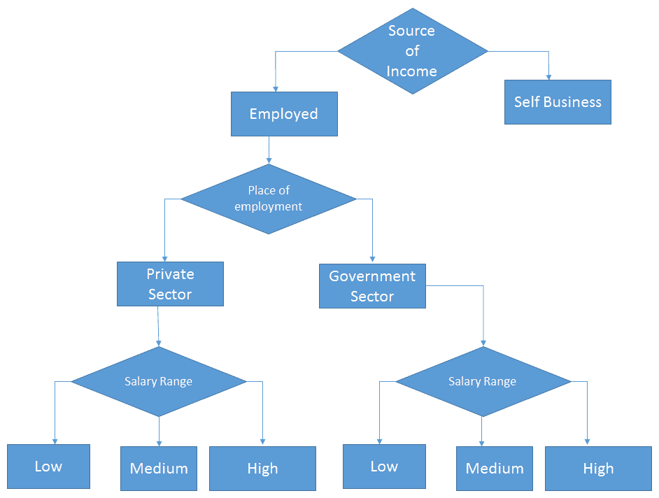
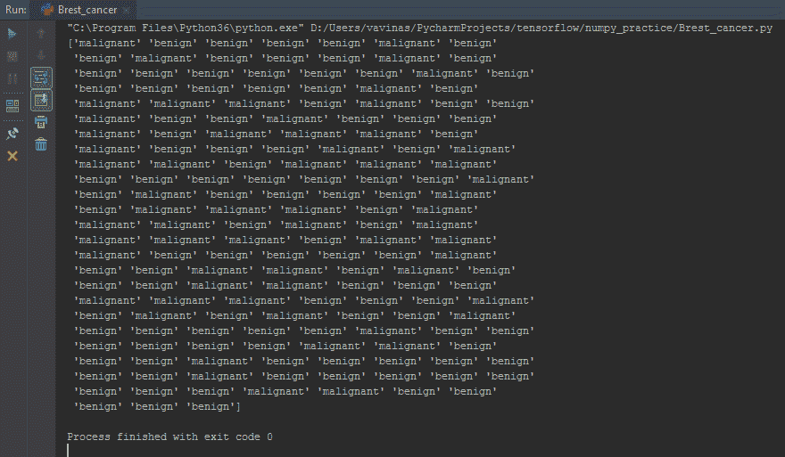
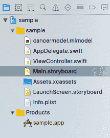
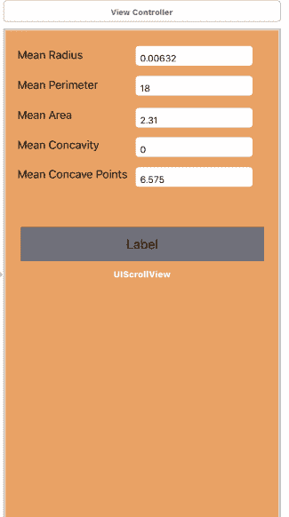
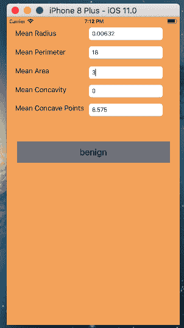

# 第三章：iOS 上的随机森林

本章将为您概述随机森林算法。我们首先将探讨决策树算法，一旦我们掌握了它，我们将尝试理解随机森林算法。然后，我们将使用 Core ML 创建一个利用随机森林算法的机器学习程序，根据给定的一组乳腺癌患者数据预测患者被诊断为乳腺癌的可能性。

正如我们在第一章，“移动机器学习简介”中已经看到的，任何机器学习程序都有四个阶段：定义机器学习问题、准备数据、构建/重建/测试模型以及部署使用。在本章中，我们将尝试将这些与随机森林联系起来，并解决背后的机器学习问题。

**问题定义**：提供了某些患者的乳腺癌数据，我们想要预测新数据项被诊断为乳腺癌的可能性。

我们将涵盖以下主题：

+   理解决策树及其如何应用于解决机器学习问题

+   通过示例数据集和 Excel 理解决策树

+   理解随机森林

+   在 Core ML 中使用随机森林解决问题：

    +   技术要求

    +   使用 scikit-learn 和 pandas 库创建模型文件

    +   测试模型

    +   将 scikit-learn 模型导入 Core ML 项目

    +   编写 iOS 移动应用程序并在其中使用 scikit-learn 模型进行乳腺癌预测

# 算法简介

在本节中，我们将探讨决策树算法。我们将通过一个示例来理解该算法。一旦我们对算法有了清晰的认识，我们将通过示例尝试理解随机森林算法。

# 决策树

要理解随机森林模型，我们首先必须了解决策树，这是随机森林的基本构建块。我们每天都在使用决策树，即使你不认识这个名字。一旦我们开始通过示例进行讲解，你将能够与决策树的概念联系起来。

想象一下，您去银行申请贷款。银行会在批准贷款之前对您的一系列资格标准进行审查。对于每个人，他们提供的贷款金额将根据他们满足的不同资格标准而有所不同。

他们可能会通过一系列决策点来做出最终决定，以确定是否批准贷款以及可以提供的金额，例如以下内容：

+   **收入来源**：受雇还是自雇？

+   **如果受雇，工作地点**：私营部门还是政府部门？

+   **如果私营部门，薪资范围**：低、中或高？

+   **如果政府部门，薪资范围**：低、中或高？

可能会有更多问题，例如你在那家公司工作了多少年，或者你是否有任何未偿还的贷款。这个过程在最基本的形式上是一个决策树：



如前图所示，决策树是非参数有效机器学习建模技术，广泛用于分类问题。为了找到解决方案，决策树根据预测数据对结果进行顺序、分层决策。

对于任何给定的数据项，会问一系列问题，这些问题会导致一个类别标签或值。该模型对传入的数据项提出一系列预定义的问题，并根据这些答案分支到那个系列，并继续进行，直到到达最终的数据值或类别标签。该模型基于观察到的数据构建，没有对错误分布或数据本身的分布做出任何假设。

在决策树模型中，如果目标变量使用一组离散值，这被称为**分类树**。在这些树中，每个节点或叶子代表类别标签，而分支代表导致类别标签的特征。

目标变量取连续值（通常是数字）的决策树称为**回归树**。

这些决策树可以用**有向无环图**（**DAGs**）很好地表示。在这些图中，节点代表决策点，边是节点之间的连接。在前面的贷款场景中，$30,000-$70,000 的薪资范围将是一条边，而中等将是节点。

# 决策树算法的优点

决策树的目标是为给定的问题找到最佳选择。最终的叶子节点应该是手头问题的最佳选择。算法行为贪婪，试图在每个决策中都做出最佳选择。

整个问题被划分为多个子问题，每个子问题又分支出其他子问题。这些子集是基于一个称为**纯度**的参数。当一个节点的所有决策都将导致属于同一类别的数据时，该节点被认为是 100%纯的。如果有可能将其子集分割成类别，则将是 100%不纯的。算法的目标是使树中的每个节点达到 100%的纯度。

节点的纯度使用 Gini 不纯度来衡量，Gini 不纯度是一个标准指标，有助于分割决策树的节点。

在决策树中还会使用另一个指标，即信息增益，它将用于决定在树的每个步骤中应该使用数据集的哪个特征进行分割。信息增益是在数据集根据属性分割后的熵（随机性）的减少。构建决策树就是寻找能够返回最高信息增益的属性，即最同质的分支，这意味着所有属于同一子集或类的数据。

# 决策树的缺点

模型仅在所有数据点都可以适合单个类别时停止。因此，它可能不适合复杂问题，并且偏差的可能性很高。

这些问题可以通过定义树的最大深度或指定在树中进一步分割节点所需的最小数据点数量来解决。

# 决策树的优势

以下列出了优势：

+   简单易懂且易于可视化

+   非常容易构建，可以处理定性和定量数据

+   容易验证

+   从计算角度来看，这并不昂贵

总结决策树模型，我们可以得出结论，它基本上是一个通向预测的问题流程图。

# 随机森林

现在，让我们从单个决策树转向随机森林。如果你想要猜测下一位总统是谁，你会如何进行预测？让我们看看预测这个问题我们会问的不同类型的问题：

+   有多少候选人？他们是谁？

+   现任总统是谁？

+   他们表现如何？

+   他们属于哪个政党？

+   是否有任何针对该党的当前运动？

+   在多少个州政治党派有获胜的概率

+   他们是否是现任总统？

+   主要的投票问题有哪些？

我们脑海中会涌现出许多类似的问题，并且我们会为它们分配不同的权重/重要性。

每个人对先前问题的预测可能不同。需要考虑的因素太多，每个人的猜测可能不同。每个人带着不同的背景和知识水平来到这些问题面前，可能会对问题有不同的解读。

因此，答案的方差可能很高。如果我们分别取不同个体给出的所有预测并平均它们，就变成了随机森林。

随机森林将多个决策树组合成一个单一模型。单个决策树（或人类）做出的预测可能并不准确，但结合在一起，预测的平均值将更接近真实值。

以下图表将帮助我们理解使用随机森林算法进行投票预测：


以下图表给出了前一个图表的流程图视图：


让我们看看为什么随机森林比决策树更好：

+   随机森林是由许多决策树组合而成的，因此，最终预测会有更多观点的可能性更大。

+   如果只考虑单个决策树进行预测，则考虑的预测信息较少。但是，在随机森林中，当涉及许多树时，信息更多且更多样化。

+   随机森林可能不会像决策树那样有偏差，因为它不依赖于单一来源。

为什么叫随机森林？嗯，尽管人们可能依赖于不同的来源来做出预测，但森林中的每个决策树在形成问题时都会考虑特征的一个随机子集，并且只能访问训练数据点的随机集合。这增加了森林的多样性，导致更稳健的整体预测，因此得名随机森林。

# 在 Core ML 中使用随机森林解决问题

在本节中，我们将通过一个具体的示例数据集的详细示例来了解随机森林。我们将使用相同的数据集来处理 iOS Core ML 示例。

# 数据集

我们将使用乳腺癌数据集来处理随机森林问题。特征是从乳腺肿块细针吸取（**FNA**）的数字化图像中计算的。它们描述了图像中存在的细胞核的特征。数据集可以在[`archive.ics.uci.edu/ml/datasets/Breast+Cancer+Wisconsin+(Diagnostic)`](https://archive.ics.uci.edu/ml/datasets/Breast+Cancer+Wisconsin+(Diagnostic))找到。

# 命名数据集

我们将使用乳腺癌数据集。以下列表包含了数据集中使用的各种约定：

+   身份编号

+   诊断（*M* = 恶性，*B* = 良性）

+   每个细胞核计算 10 个实值特征：

    +   半径（从中心到轮廓上点的距离的平均值）

    +   纹理（灰度值的标准差）

    +   周长

    +   面积

    +   平滑度（半径长度的局部变化）

    +   紧凑度（*周长²/面积 - 1.0*）

    +   凸度（轮廓凹部分的严重程度）

    +   凸点（轮廓凹部分的数量）

    +   对称性

    +   分形维度（海岸线近似-1）

我们将通过 Excel 使用随机森林，应用乳腺癌数据集，以详细了解随机森林。在分析目的上，我们只考虑来自乳腺癌数据集的 569 个样本数据中的数据元素。

# 技术要求

需要在开发者机器上安装以下软件：

+   Python

+   macOS 环境下的 Xcode

本章的练习程序可以在 GitHub 仓库（[`github.com/PacktPublishing/Machine-Learning-for-Mobile`](https://github.com/PacktPublishing/Machine-Learning-for-Mobile)）的`Chapter03`文件夹中找到。让我们先输入安装 Python 包的命令：

```py
pip install pandas
pip install -U scikit-learn
pip install -U pandas
```

然后，发出安装`coremltools`的命令：

```py
pip install -U coremltools
```

# 使用 scikit-learn 创建模型文件

本节将解释我们将如何使用 scikit-learn 创建随机森林模型文件并将其转换为与 Core ML 兼容的`.mlmodel`文件。我们将使用乳腺癌数据集来创建模型。以下是一个 Python 程序，它使用 scikit-learn 和乳腺癌数据集创建一个简单的随机森林模型。然后，Core ML 工具将其转换为 Core ML 兼容的模型文件。让我们详细地审查这个程序。

首先，我们需要导入所需的包：

```py
# importing required packages
 import numpy as np
```

NumPy 是 Python 科学计算的基础包。它包含一个强大的 N 维数组对象。这个`numpy`数组将在这个程序中用于存储数据集，该数据集有 14 个维度：

```py
import pandas as pd
 from pandas.core import series
```

在这里，我们使用 pandas（[`pandas.pydata.org/pandas-docs/stable/10min.html`](https://pandas.pydata.org/pandas-docs/stable/10min.html)），这是一个开源的 BSD 许可库，为 Python 编程语言提供高性能、易于使用的数据结构和数据分析工具。使用 pandas，我们可以创建一个数据框。您可以假设 pandas 数据框是一个 Excel 表，其中每个表都有标题和数据。

现在，让我们继续了解为解决当前机器学习问题编写的程序：

```py
from sklearn.ensemble import RandomForestClassifier

from sklearn.metrics import accuracy_score
import sklearn.datasets as dsimport sklearn.datasets as ds
```

上一行导入了`sklearn`包。现在，我们将导入`sklearn`包中的内置数据集：

```py
dataset = ds.load_breast_cancer()
```

上一行从`sklearn`数据集包中加载了乳腺癌数据集：

```py
 cancerdata = pd.DataFrame(dataset.data)
```

这将创建一个从数据集中现有数据生成的数据框。假设数据集是一个 Excel 表，其中包含行和列，列有标题：

```py
 cancerdata.columns = dataset.feature_names
```

以下代码将添加列标题到数据集的列中：

```py
for i in range(0,len(dataset.feature_names)):
if ['mean concave points', 'mean area', 'mean radius', 'mean perimeter', 'mean concavity'].\
__contains__(dataset.feature_names[i]):
continue
else:
cancerdata = cancerdata.drop(dataset.feature_names[i], axis=1)
```

上一行将删除除以下列之外的所有列：

+   平均凹点

+   平均面积

+   平均半径

+   平均周长

+   平均凹度

为了减少数据集中特征列的数量，我正在删除一些对模型影响较小的列：

```py
cancerdata.to_csv("myfile.csv")
```

这行代码将数据保存到 CSV 文件中；您可以在 Excel 中打开它，查看数据集包含的内容：

```py
 cancer_types = dataset.target_names
```

在 Excel 数据集中，当您检查它时，您将知道诊断将包括 0 或 1 的值，其中 0 是恶性，1 是良性。为了将这些数值转换为真实名称，我们编写以下代码：

```py
cancer_names = []
//getting all the corresponding cancer types with name [string] format.
for i in range(len(dataset.target)):
cancer_names.append(cancer_types[dataset.target[i]])
x_train, x_test, y_train, y_test = sklearn.model_selection.train_test_split(cancerdata,cancer_names,test_size=0.3, random_state=5)
```

这行代码将数据集分成两个——一个用于训练，一个用于测试，并将其保存到为该目的定义的相应变量中：

```py
 classifier = RandomForestClassifier()
```

下面的代码将创建一个分类器：

```py
classifier.fit(x_train, y_train)
```

这段代码将提供训练数据并训练模型：

```py
//testing the model with test data
print(classifier.predict(x_test))
```

上一行将打印测试数据的预测癌症类型到控制台，如下所示：



# 将 scikit 模型转换为 Core ML 模型

让我通过一个例子来解释：假设你是法国人，只会说法语和英语。想象一下你去印度度假。然后你去了酒店餐厅，服务员给你提供了一份用当地语言写的菜单。现在，你会怎么做？让我猜猜，你会问服务员，或者另一个顾客/你的导游，解释这些项目给你听，或者你简单地扫描 Google 翻译中的图片。

我的观点是，你需要一个翻译器。就是这样。同样，为了让 scikit 模型被 iOS 移动应用程序理解，需要一个将其转换为 Core ML 格式的转换器。

以下代码完成了所有的工作。它将 scikit-learn 格式转换为 Core ML 格式：

```py
//converting the fitted model to a Core ML Model file

model = coremltools.converters.sklearn.convert(classifier, input_features=list(cancerdata.columns.values), output_feature_names='typeofcancer')

model.save("cancermodel.mlmodel")
```

为了使这个工作正常，你必须使用你的`pip`安装`coremltools`。然后，在顶部写下以下代码来导入它：

```py
import coremltools
```

一旦运行这个程序，你将在你的磁盘上得到一个名为`cancermodel.mlmodel`的模型文件，你将在 iOS 项目中用它来进行推理。

# 使用 Core ML 模型创建 iOS 移动应用程序

在本节中，我们将创建一个 iOS 项目来使用 Core ML，为此你需要 Xcode（版本必须是 9+）。

让我们从打开 Xcode 并创建一个带有故事板的空 swift 应用程序开始。在主故事板设计中，屏幕将如下所示。然后，将生成的模型文件添加到你的项目中。这应该给你以下结构：



现在，在你的主故事板文件中创建 UI，如下所示：



为每个文本字段创建出口。并为每个文本字段添加事件监听器。现在，你的视图控制器将如下所示：

```py
import UIKit
import Core ML 
class ViewController: UIViewController {
    let model = cancermodel()
    @IBOutlet weak var meanradius: UITextField!
    @IBOutlet weak var cancertype: UILabel!
    @IBOutlet weak var meanperimeter: UITextField!
    @IBOutlet weak var meanarea: UITextField!
    @IBOutlet weak var meanconcavity: UITextField!
    @IBOutlet weak var meanconcavepoints: UITextField!
    override func didReceiveMemoryWarning() {
        super.didReceiveMemoryWarning()
        // Dispose of any resources that can be recreated.
    }
    override func viewDidLoad() {
        super.viewDidLoad();
        updated(meanconcavepoints);
        //This line is to fire the initial update of the cancer type.
    }
    /*
This method will send the input data to your generated model class and display the returned result to the label.
*/

    @IBAction func updated(_ sender: Any) {
        guard let modeloutput = try? model.prediction(mean_radius: 
        Double(meanradius.text!)!, mean_perimeter: 
        Double(meanperimeter.text!)!, mean_area: Double(meanarea.text!)!, 
        mean_concavity: Double(meanconcavity.text!)!, mean_concave_points: 
        Double(meanconcavepoints.text!)!) else {
            fatalError("unexpected runtime error")
        }
        cancertype.text = modeloutput.typeofcancer;
    }
}
```

你可以在本书的 GitHub 仓库中找到相同的代码。

如果你在构建过程中遇到任何问题，比如签名或证书，请谷歌搜索或给我们写信。

一旦你在 Xcode 中设置了项目，你就可以在模拟器中运行它。结果将如下所示：



# 摘要

在本章中，我们学习了决策树和随机森林，以及它们之间的区别。我们还通过一个样本数据集和 Excel 探索了一个决策树，并使用随机森林算法来建立预测。我们使用 Core ML 编写 iOS 程序，然后我们应用 scikit-learn 创建模型，并使用 Core ML 工具将 scikit 模型转换为 Core ML 模型。

在下一章中，我们将学习更多关于 TensorFlow 及其在 Android 中的应用。

# 进一步阅读

通过访问他们的官方网站，我们可以进一步了解 Core ML 及其提供的服务：[`developer.apple.com/documentation/coreml`](https://developer.apple.com/documentation/coreml)。
