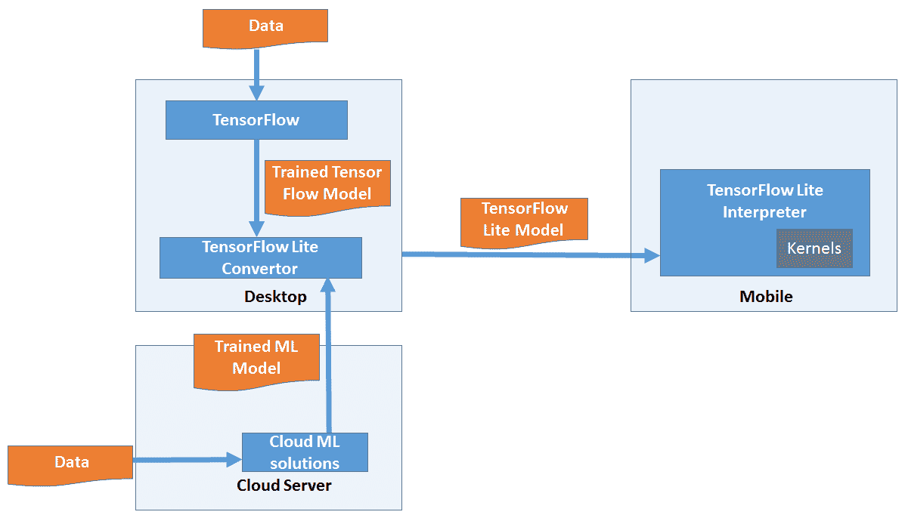
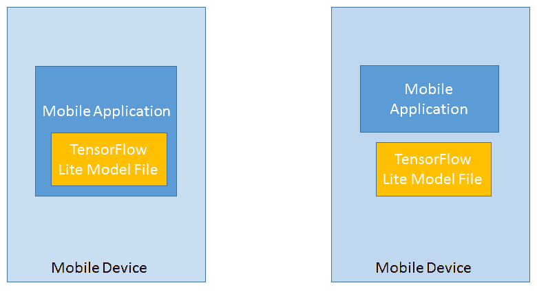
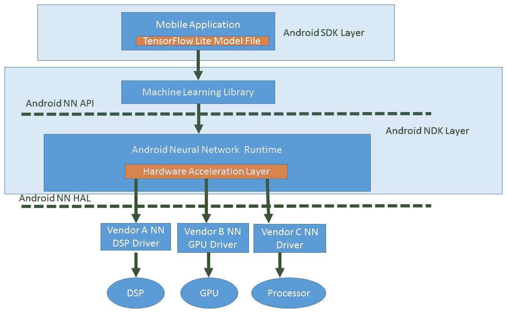
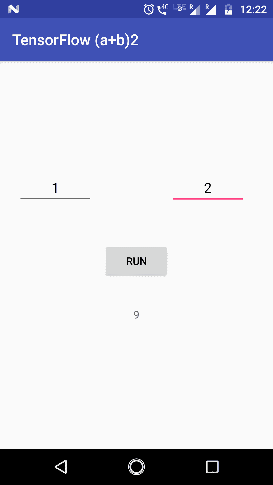

# 第四章：Android 中的 TensorFlow Mobile

在上一章中，我们专注于监督学习和无监督学习，并学习了不同类型的机器学习算法。在本章中，我们将介绍 TensorFlow for mobile，并通过使用 TensorFlow for mobile 的示例程序进行实现。在第九章 神经网络的移动应用中，我们将使用它来实现一个分类算法。但在我们能够使用它实现机器学习算法之前，我们需要了解 TensorFlow for mobile 的工作原理，并能够编写使用它的示例。本章的目标是介绍 TensorFlow、TensorFlow Lite、TensorFlow for mobile 及其工作方式，并尝试使用 TensorFlow for mobile 在 Android 上的实际操作示例。

在本章中，我们将涵盖以下主题：

+   TensorFlow、TensorFlow Lite 和 TensorFlow for mobile 简介

+   TensorFlow for Mobile 的组件

+   移动机器学习应用程序的架构

+   使用 TensorFlow 在 Android 中构建示例程序

到本章结束时，你将了解如何使用 TensorFlow for mobile 在 Android 中构建应用程序。我们将通过使用它来实现第九章 神经网络的移动应用中的分类算法。

# TensorFlow 简介

TensorFlow 是由 Google 开发的一种用于实现机器学习的工具，于 2015 年开源。它是一种可以安装在桌面上的产品，可以用来创建机器学习模型。一旦模型在桌面上构建并训练完毕，开发者可以将这些模型转移到移动设备上，并通过将其集成到 iOS 和 Android 移动应用程序中来预测移动应用程序中的结果。目前有两种 TensorFlow 版本可用于在移动和嵌入式设备上实现机器学习解决方案：

+   **移动设备**：TensorFlow for Mobile

+   **移动和嵌入式设备**：TensorFlow Lite

下表将帮助您了解 TensorFlow for mobile 和 TensorFlow Lite 之间的关键区别：

| **TensorFlow for Mobile** | **TensorFlow Lite** |
| --- | --- |
| 设计用于与大型设备协同工作。 | 设计用于与非常小的设备协同工作。 |
| 二进制文件针对移动设备进行了优化。 | 二进制文件针对移动和嵌入式设备进行了非常小的优化，具有最小依赖性和增强的性能。 |
| 支持在 Android、iOS 和 Raspberry Pi 上的 CPU、GPU 和 TPU 部署。 | 支持硬件加速。可在 iOS、Android 和 Raspberry Pi 上部署。 |
| 建议现在在移动设备上进行生产部署。 | 目前仍处于测试版，正在改进中。 |
| 支持更广泛的操作符和机器学习模型。 | 支持的操作符有限，并非所有机器学习模型都受支持。 |

# TensorFlow Lite 组件

在本节中，我们将详细介绍 TensorFlow Lite：整体架构、关键组件及其功能。

以下图表提供了关键组件及其如何相互作用以将机器学习带到移动设备的高级概述：



在设备上实现机器学习时需要遵循以下关键步骤：

1.  使用 TensorFlow 或任何其他机器学习框架在桌面创建训练好的 TensorFlow/ML 模型。该训练模型也可以使用任何云 ML 引擎创建。

1.  使用 TensorFlow Lite 转换器将训练好的机器学习模型转换为 TensorFlow Lite 模型文件。

1.  使用这些文件编写一个移动应用程序，并将其转换为部署和执行在移动设备上的包。这些轻量级文件可以直接在内核或硬件加速器中解释和执行，如果设备中可用的话。

以下是 TensorFlow Lite 的关键组件：

+   模型文件格式

+   解释器

+   Ops/内核

+   硬件加速接口

# 模型文件格式

以下是该模型文件格式的亮点：

+   它轻量级且具有非常少的软件依赖。

+   它支持量化。

    +   此格式基于 FlatBuffer，因此提高了执行速度。FlatBuffer 是谷歌的一个开源项目，最初是为视频游戏设计的。

+   FlatBuffer 是一个跨平台序列化库，类似于协议缓冲区。

+   此格式更节省内存，因为它在数据访问之前不需要解析/解包步骤来执行二级表示。没有序列化步骤，因此它使用更少的代码。

# 解释器

以下是对解释器的亮点：

+   它是一个针对移动优化的解释器。

+   它有助于保持移动应用轻量化和快速。

+   它使用静态图排序和自定义（较少动态）内存分配器，以确保最小化负载、初始化和执行延迟。

+   解释器具有静态内存计划和静态执行计划。

# Ops/内核

一组核心算子，包括量化和浮点数，其中许多已经针对移动平台进行了调整。这些可以用来创建和运行自定义模型。开发者也可以编写自己的自定义算子并在模型中使用它们。

# 硬件加速接口

TensorFlow Lite 具有对硬件加速器的接口；在 Android 中，它是通过 Android Neural Network API，而在 iOS 中，则是通过 CoreML。

以下是在 TensorFlow Lite 中预测试的模型，保证开箱即用：

+   **Inception V3**：一种流行的模型，用于检测图像中存在的占主导地位的对象。

+   **MobileNets**：可用于分类、检测和分割的计算机视觉模型。MobileNet 模型比 Inception V3 模型更小，但精度较低。

+   **设备端智能回复**：一个设备端模型，通过建议上下文相关的消息，为传入的文本消息提供一键回复。

# 移动机器学习应用程序的架构

现在我们已经了解了 TensorFlow Lite 的组件，我们将探讨移动应用程序是如何与 TensorFlow 组件协同工作以提供移动机器学习解决方案的。

移动应用程序应利用 TensorFlow Lite 模型文件对未来的数据进行推理。TensorFlow Lite 模型文件可以与移动应用程序一起打包并部署，或者与移动应用程序部署包保持分离。以下图表描述了两种可能的部署场景：



每种部署方式都有其优缺点。在第一种情况下，如果两者耦合在一起，模型文件将拥有更高的安全性，可以保持安全并得到保护。这是一个更为直接的方法。然而，由于模型文件的大小，应用包的大小也会增加。在第二种情况下，如果两者保持分离，可以单独更新模型文件，而无需进行应用升级。因此，可以避免与应用升级、部署到应用商店等相关活动，以实现模型升级。由于这种分离，应用包的大小也可以最小化。然而，由于模型文件是独立的，应该更加小心地处理，以免使其容易受到安全威胁。

在对使用 TensorFlow Lite 模型文件的移动应用程序有一个概述之后，让我们看看整个图景。移动应用程序与 TensorFlow Lite 模型文件一起打包。这种交互是通过 TensorFlow Lite Interpreter 实现的，它是 Android NDK 层的一部分。通过移动应用程序暴露给 SDK 层的接口调用 C 函数，以使用与移动应用程序一起部署的已训练 TensorFlow Lite 模型进行预测或推理。以下图表提供了一个清晰的视图，展示了 Android 生态系统中将参与典型机器学习程序的 SDK 和 NDK 层。执行也可以通过 android NN 层在 GPU 或任何专用处理器上触发：



# 理解模型概念

在使用 TensorFlow 编写第一个程序之前，我们将简要地回顾一下那些有助于我们理解 TensorFlow Lite 模型工作原理的概念。我们不会深入细节，但仅仅一个概念性的高层次概述就能更好地理解。

MobileNet 和 Inception V3 是基于 **卷积神经网络**（**CNNs**）的内置模型。

在最基本层面上，卷积神经网络（CNN）可以被视为一种使用许多相同神经元副本的神经网络。这使得网络可以拥有大量神经元并表达计算上庞大的模型，同时保持需要学习的实际参数数量——描述神经元行为的值——相对较低。

这个概念可以通过类比拼图和通常解决拼图的方式来理解。以下是需要解决的拼图：


如果我们必须从提供的碎片中组装这个拼图，请考虑您将如何开始解决它。您可能会将所有不同颜色的碎片放在一起。然后在同一颜色中，您会检查模式并将它们组装起来。这就是卷积网络在图像分类和识别中训练的方式。因此，只有一小部分，每个神经元都记得。但是父神经元理解其范围内的事物需要如何组装才能得到整体图景。

在 Inception V3 和 MobileNet 模型中，两者都基于 CNN 概念。模型已经相当训练有素且稳定。我们使用我们的图像集使用我们的图像重新训练模型即可。所以，在概念和理论已经足够之后，我们将继续编写我们的第一个使用 TensorFlow Lite for Android 的示例程序。

我们将在第九章（3e97f92b-a2d9-4618-9a3b-91552fa3fc3d.xhtml）的*“移动设备上的神经网络”*中使用 TensorFlow 移动进行分类应用。

# 使用 TensorFlow 模型编写移动应用程序

**我们将做什么？**

在本节中，我们将构建一个小的`(a+b)2`模型，将其部署到 Android 移动应用程序中，并在 Android 移动设备上运行它。

**您需要了解什么？**

要继续本节内容，您需要一个可工作的 Python 安装、TensorFlow 依赖项和 Android Studio，以及一些 Python 和 Java Android 的知识。您可以在[这里](https://www.tensorflow.org/install/)找到如何安装 TensorFlow 的说明。

如果您需要 Windows 的详细安装程序，请参阅本书第十一章（d7ddae2d-9276-461e-9526-73448159e26b.xhtml）中提供的带有截图的“移动应用程序上机器学习的未来”。

我们已经看到了 TensorFlow 的细节。简单来说，TensorFlow 不过是将用 Python 编写的 TensorFlow 程序保存到一个小的文件中，这个文件可以被我们将要安装到 Android 应用程序中的 C++本地库读取并执行，从移动端进行推理。为此，JNI（Java 本地接口）作为 Java 和 C++之间的桥梁工作。

要了解更多关于 TensorFlow Lite 背后的想法，请查看[`www.tensorflow.org/mobile/tflite/`](https://www.tensorflow.org/mobile/tflite/)。

# 编写我们的第一个程序

为了编写 TensorFlow 移动应用程序，我们需要遵循几个步骤：

1.  创建 TF（TensorFlow）模型

1.  保存模型

1.  冻结图

1.  优化模型

1.  编写 Android 应用程序并执行它

我们现在将详细讲解每个步骤。

# 创建和保存 TF 模型

首先，我们首先创建一个简单的模型并将其计算图保存为一个序列化的`GraphDef`文件。在训练模型后，我们将其变量的值保存到一个检查点文件中。我们必须将这些两个文件转换为一个优化的独立文件，这是我们需要在 Android 应用程序中使用的所有内容。

对于这个教程，我们创建一个非常简单的 TensorFlow 图，它实现了一个小用例，将计算*(a+b)²=c*。在这里，我们将输入保存为*a*和*b*，输出保存为*c*。

为了实现这个示例程序，我们将使用 Python。因此，作为先决条件，你需要在你的机器上安装 Python，并使用`pip`在你的机器上安装 TensorFlow 库。

请参阅本书的软件安装/附录部分，了解如何安装 Python 的说明。`pip`是 Python 的包管理器，它随 Python 一起提供。

一旦你安装了 Python 并正确设置了路径，你就可以从命令提示符中运行`pip`命令。要安装 TensorFlow，请运行以下命令：

```py
pip install tensorflow
```

这个示例可能看起来太简单，可能不包含与机器学习相关的内容，但这个示例应该是一个很好的起点，以了解 TensorFlow 的概念及其工作原理：

```py
import tensorflow as tf 
a = tf.placeholder(tf.int32, name='a') # input 
b = tf.placeholder(tf.int32, name='b') # input 
times = tf.Variable(name="times", dtype=tf.int32, initial_value=2) 
c = tf.pow(tf.add(a, b), times, name="c") 
saver = tf.train.Saver()

init_op = tf.global_variables_initializer() with tf.Session() as sess: sess.run(init_op) tf.train.write_graph(sess.graph_def, '.', 'tfdroid.pbtxt')

sess.run(tf.assign(name="times", value=2, ref=times)) # save the graph 
# save a checkpoint file, which will store the above assignment saver.save(sess, './tfdroid.ckpt')
```

在前面的程序中，我们创建了两个名为*a*和*b*的占位符，它们可以存储整数值。现在，你可以想象占位符就像决策树中的节点。在下一行，我们创建了一个名为 times 的变量。我们创建这个变量是为了存储我们需要乘以输入的次数。在这种情况下，我们给出两个，因为目标是做*(a+b)*^(*2*)*.*

在下一行，我们在*a*和*b*节点上应用加法操作。对于这个和，我们应用幂操作并将结果保存到一个名为 c 的新节点中。要运行代码，首先将其保存为具有`.py`扩展名的文件。然后使用`python`命令执行程序，如下所示：

```py
python (filename)
```

运行上一段代码将生成两个文件。首先，它将 TF 计算图保存为一个名为`tfdroid.pbtxt`的`GraphDef`文本文件。接下来，它将执行一个简单的赋值操作（这通常是通过实际学习来完成的）并将模型变量的检查点保存到`tfdroid.ckpt`中。

# 冻结图

现在我们有了这些文件，我们需要通过将检查点文件中的变量转换为包含变量值的`Const Ops`并将它们与 GraphDef 结合到一个独立文件中来冻结图。使用这个文件使得在移动应用程序中加载模型变得更加容易。TensorFlow 在`tensorflow.python.tools`中提供了`freeze_graph`来完成这个目的：

```py
import sys import tensorflow as tf from tensorflow.python.tools 
import freeze_graph from tensorflow.python.tools 
import optimize_for_inference_lib MODEL_NAME = 'tfdroid'
# Freeze the graph

input_graph_path = MODEL_NAME+'.pbtxt' checkpoint_path = './'+MODEL_NAME+'.ckpt' input_saver_def_path = "" input_binary = False output_node_names = "c" restore_op_name = "save/restore_all" filename_tensor_name = "save/Const:0" output_frozen_graph_name = 'frozen_'+MODEL_NAME+'.pb' output_optimized_graph_name = 'optimized_'+MODEL_NAME+'.pb' clear_devices = True freeze_graph.freeze_graph(input_graph_path, input_saver_def_path, input_binary, checkpoint_path, output_node_names, restore_op_name, filename_tensor_name, output_frozen_graph_name, clear_devices, "")
```

# 优化模型文件

一旦我们有了冻结的图，我们可以进一步优化文件以用于推理目的，通过移除仅在训练期间需要的图的部分。根据文档，这包括：

+   移除仅用于训练的操作，例如检查点保存

+   移除图中从未到达的部分

+   移除调试操作，例如`CheckNumerics`

+   将批归一化操作融合到预计算的权重中

+   将常见操作融合到统一版本中

TensorFlow 在`tensorflow.python.tools`中提供了`optimize_for_inference_lib`用于此目的：

```py
# Optimize for inference 
input_graph_def = tf.GraphDef() with tf.gfile.Open(output_frozen_graph_name, "r") as f: data = f.read() input_graph_def.ParseFromString(data) 
output_graph_def = optimize_for_inference_lib.optimize_for_inference( input_graph_def, ["a", "b"], 
# an array of the input node(s) ["c"], 
# an array of output nodes tf.int32.as_datatype_enum)

# Save the optimized graph f = tf.gfile.FastGFile(output_optimized_graph_name, "w") f.write(output_graph_def.SerializeToString()) tf.train.write_graph(output_graph_def, './', output_optimized_graph_name)
```

注意前述代码中的输入和输出节点。我们的图只有一个输入节点，命名为 I，一个输出节点，命名为 O。这些名称对应于你定义张量时使用的名称。如果你使用的是不同的图，你应该根据你的图调整这些名称。

现在我们有一个名为`optimized_tfdroid.pb`的二进制文件，这意味着我们已准备好构建我们的 Android 应用。如果你在创建`optimized_tfdroid.pb`时遇到了异常，你可以使用`tfdroid.somewhat`，这是模型的非优化版本——它相当大。

# 创建 Android 应用

我们需要获取 Android 的 TensorFlow 库，创建一个 Android 应用，配置它以使用这些库，然后在应用内部调用 TensorFlow 模型。

虽然你可以从头开始编译 TensorFlow 库，但使用预构建库更容易。

现在使用 Android Studio 创建一个带有空活动的 Android 项目。

一旦项目创建完成，将 TF 库添加到项目的`libs`文件夹中。你可以从 GitHub 仓库获取这些库：[`github.com/PacktPublishing/Machine-Learning-for-Mobile/tree/master/tensorflow%20simple/TensorflowSample/app/libs`](https://github.com/PacktPublishing/Machine-Learning-for-Mobile/tree/master/tensorflow%20simple/TensorflowSample/app/libs)。

现在项目中的`libs/`文件夹应该看起来像这样：

```py
libs
|____arm64-v8a
| |____libtensorflow_inference.so
|____armeabi-v7a
| |____libtensorflow_inference.so
|____libandroid_tensorflow_inference_java.jar
|____x86
| |____libtensorflow_inference.so
|____x86_64
| |____libtensorflow_inference.so
```

你需要通过在`app/build.gradle`中的 Android 块内放置以下行来让构建系统知道这些库的位置：

```py
sourceSets { main { jniLibs.srcDirs = ['libs'] } }
```

# 复制 TF 模型

为应用创建一个 Android Asset 文件夹，并将我们刚刚创建的`optimized_tfdroid.pb`或`tfdroid.pb`文件放入其中（`app/src/main/assets/`）。

# 创建活动

点击项目并创建一个名为`MainActivity`的空活动。在该活动的布局中，粘贴以下 XML：

```py
<?xml version="1.0" encoding="utf-8"?>
<RelativeLayout 

android:id="@+id/activity_main"
android:layout_width="match_parent"
android:layout_height="match_parent"
android:paddingBottom="@dimen/activity_vertical_margin"
android:paddingLeft="@dimen/activity_horizontal_margin"
android:paddingRight="@dimen/activity_horizontal_margin"
android:paddingTop="@dimen/activity_vertical_margin"
tools:context="com.example.vavinash.tensorflowsample.MainActivity">

<EditText
android:id="@+id/editNum1"
android:layout_width="100dp"
android:layout_height="wrap_content"
android:layout_alignParentTop="true"
android:layout_marginEnd="13dp"
android:layout_marginTop="129dp"
android:layout_toStartOf="@+id/button"
android:ems="10"
android:hint="a"
android:inputType="textPersonName"
android:textAlignment="center" />

<EditText
android:id="@+id/editNum2"
android:layout_width="100dp"
android:layout_height="wrap_content"
android:layout_alignBaseline="@+id/editNum1"
android:layout_alignBottom="@+id/editNum1"
android:layout_toEndOf="@+id/button"
android:ems="10"
android:hint="b"
android:inputType="textPersonName"
android:textAlignment="center" />

<Button
android:text="Run"
android:layout_width="wrap_content"
android:layout_height="wrap_content"
android:id="@+id/button"
android:layout_below="@+id/editNum2"
android:layout_centerHorizontal="true"
android:layout_marginTop="50dp" />

<TextView
android:layout_width="wrap_content"
android:layout_height="wrap_content"
android:text="Output"
android:id="@+id/txtViewResult"
android:layout_marginTop="85dp"
android:textAlignment="center"
android:layout_alignTop="@+id/button"
android:layout_centerHorizontal="true" />
</RelativeLayout>
```

在`mainactivity.java`文件中，粘贴以下代码：

```py
package com.example.vavinash.tensorflowsample;
import android.support.v7.app.AppCompatActivity;
import android.os.Bundle;
import android.widget.EditText;
import android.widget.TextView;
import android.widget.Button;
import android.view.View;
import org.tensorflow.contrib.android.TensorFlowInferenceInterface;public class MainActivity extends AppCompatActivity {
    //change with the file name of your own model generated in python tensorflow.
    private static final String MODEL_FILE = "file:///android_asset/tfdroid.pb";

    //here we are using this interface to perform the inference with our generated model. It internally     uses c++ libraries and JNI.
    private TensorFlowInferenceInterface inferenceInterface;
    static {
        System.loadLibrary("tensorflow_inference");
    }
    @Override
    protected void onCreate(Bundle savedInstanceState) {
        super.onCreate(savedInstanceState);
        setContentView(R.layout.activity_main);
        inferenceInterface = new TensorFlowInferenceInterface();
        //instantiatind and setting our model file as input.
        inferenceInterface.initializeTensorFlow(getAssets(), MODEL_FILE);
        final Button button = (Button) findViewById(R.id.button);
        button.setOnClickListener(new View.OnClickListener() {
            public void onClick(View v) {
                final EditText editNum1 = (EditText) findViewById(R.id.editNum1);
                final EditText editNum2 = (EditText) findViewById(R.id.editNum2);
                float num1 = Float.parseFloat(editNum1.getText().toString());
                float num2 = Float.parseFloat(editNum2.getText().toString());
                int[] i = {1};
                int[] a = {((int) num1)};
                int[] b = {((int) num2)};
                //Setting input for variable a and b in our model.
                inferenceInterface.fillNodeInt("a",i,a);
                inferenceInterface.fillNodeInt("b",i,b);
                //performing the inference and getting the output in variable c
                inferenceInterface.runInference(new String[] {"c"});
                //reading received output
                int[] c = {0};
                inferenceInterface.readNodeInt("c", c);
                //projecting to user.
                final TextView textViewR = (TextView) findViewById(R.id.txtViewResult);
                textViewR.setText(Integer.toString(c[0]));
            }
        });
    }
}
```

在前述程序中，我们使用以下代码片段加载 TensorFlow 的二进制文件：

```py
System.loadLibrary("tensorflow_inference");
```

在创建 Bundle 的方法中，我们有主要的逻辑。在这里，我们通过提供 TensorFlow 模型的`.pb`文件来创建 TensorFlow 推理对象，这个文件已经被生成，我们已经在创建和保存模型的章节中看到了它。

然后，我们为运行按钮注册了一个点击事件。在这个过程中，我们将值输入到 TensorFlow 中的 a 和 b 节点，并运行推理，然后我们从 C 节点获取值并展示给用户。

现在运行应用程序，查看`(a+b)2 = c`表达式的结果：



在左侧，它显示了应用程序的启动屏幕。在提供的文本框中，我们需要输入`a`和`b`的值。一旦您点击运行按钮，您将在输出区域看到结果。

您可以从 GitHub 仓库获取前面的应用程序代码：[`github.com/PacktPublishing/Machine-Learning-for-Mobile/tree/master/tensorflow%20simple`](https://github.com/PacktPublishing/Machine-Learning-for-Mobile/tree/master/tensorflow%20simple).

# 摘要

在本章中，我们介绍了谷歌的移动机器学习工具，并探讨了工具包的各种版本——TensorFlow for Mobile 和 TensorFlow Lite。我们还探讨了 TensorFlow-ML 启用移动应用程序的架构。然后我们讨论了 TensorFlow Lite 的架构和细节及其组件，甚至演示了一个使用 TensorFlow for Mobile 的简单用例，用于 android 移动应用程序。

在下一章中，我们将使用这里讨论的 TensorFlow for Mobile 来实现一个分类算法。
