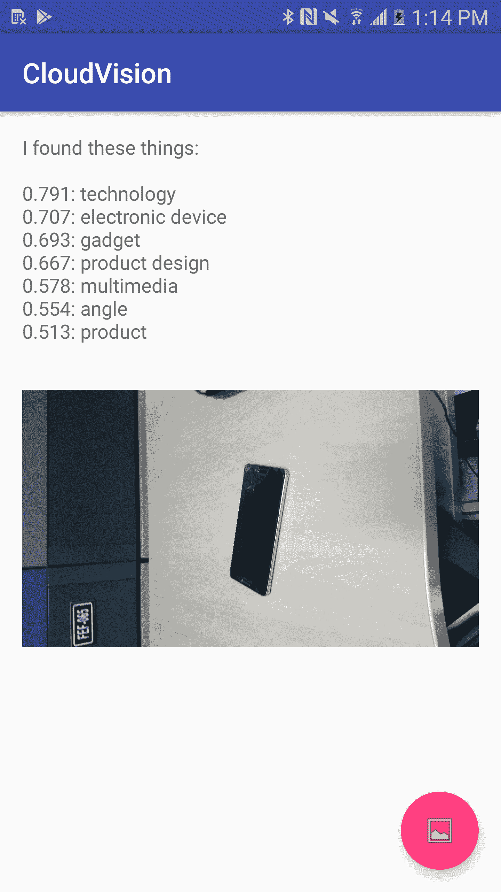

# 第十章：使用 Google Vision 的移动应用程序

正如我们在第一章，“移动机器学习简介”中看到的，我们知道移动应用程序中的机器学习可以是在设备上实现，也可以使用机器学习云提供商服务实现。有各种机器学习云提供商：

+   Clarifai

+   Google Cloud Vision

+   Microsoft Azure 认知服务

+   IBM Watson

+   Amazon Machine Learning

在本章中，我们将深入探讨 Google Cloud Vision，以了解以下内容：

+   Google Cloud Vision 的功能

+   如何在 Android 移动应用程序中使用 Google Cloud Vision 标签检测技术来确定相机拍摄的照片是什么。也就是说，我们基本上将图像输入到 Google Cloud Vision 中，看看它如何标记图像。Google Vision 将预测它从移动应用程序接收到的图像，并为图像提供标签。

# Google Cloud Vision 的功能

Google Cloud Vision API 包含各种复杂且强大的机器学习模型，有助于执行图像分析。它使用易于使用的 REST API 将图像分类到各种类别。Google Cloud Vision 提供的重要功能包括以下内容：

+   **标签检测**：这使我们能够将图像分类到数千个类别。图像可以被分类到各种常见的类别标签，例如*动物*和*水果*。

+   **图像属性检测**：这使我们能够从图像中检测单个对象。它还可以检测诸如显著颜色等属性。

+   **人脸检测**：这使我们能够从图像中检测人脸。如果图像中有多个面孔，每个面孔都可以单独检测。它还可以检测与面孔相关的一些显著属性，例如戴头盔。

+   **Logo 检测**：这使我们能够从图像中检测印刷文字。训练了显著的品牌标志，可以检测到。

+   **地标检测**：它被训练来检测显著的地标——自然和人工的，因此这些地标是通过 Google Vision 进行检测的。

+   **光学字符识别**：即使图像不是英文的，它也能帮助检测图像中的文本。这支持广泛的多种语言。

+   **显式内容检测**：这有助于识别内容的类型或内容情感，例如*暴力*或*幽默*。它使我们能够通过利用可以构建的元数据信息来执行图像的情感分析。

+   **搜索网页**：这将在网络上搜索类似图像。

所有这些由 Google Cloud Vision 提供的功能都可以通过调用 Google 提供的简单 RESTful API 来使用。然而，对于它们的使用，每个功能都有一定的费用。也可以使用功能组合。定价详情可以在 Google Cloud Vision 网站上找到：[`cloud.google.com/vision/`](https://cloud.google.com/vision/)。

# 使用 Google Cloud Vision 的示例移动应用程序

在本节中，我们将尝试使用 Google Cloud Vision 的 Android 移动应用程序示例。我们将从手机的相机捕获图像，将图像上传到 Google Cloud Vision，并查看它预测的图像是什么。这将使用 Google Cloud Vision 的标签检测功能，该功能确定上传图像的标签。

# 标签检测是如何工作的？

视觉 API 可以检测和提取图像中实体信息，涵盖广泛的类别。标签可以识别对象、位置、活动、动物种类、产品等。标签仅以英语返回。

需要确定标签的图像和我们要使用的 Google Vision 功能需要发送到请求 API。功能可以是*Google Cloud Vision 功能*部分中列出的任何功能，例如标签检测或标志检测。如果需要与图像一起发送任何额外的图像上下文，它可以作为附加参数发送。请求 API JSON 格式在此提供：

```py
{
  "image": {
    object(Image)// Image which needs to be processed.
  },
  "features": [
    {
      object(Feature) //Google Vision Feature that needs to be invoked.
    }
  ],
  "imageContext": {
    object(ImageContext) //additional image context if required.
  },
}
```

图像对象可以是 base64 编码的字符串，也可以是需要分析的图像的 URL。该 URL 可以是 Google Cloud Storage 图像位置，或公开可访问的图像 URL。

请求的响应将是一个基于请求的功能的注释列表。在我们的案例中，它将是标签注释：

```py
{
 "labelAnnotations": [
 {
 object(EntityAnnotation)
 }
 ],
 "error": {
 object(Status)
 },
}
```

返回的`EntityAnnotation`对象将包含图像的标签、预测分数和其他有用信息。所有与输入图像对象匹配的标签都作为包含预测分数的数组列表返回，基于此，我们可以在应用程序中执行所需的推理。

现在我们已经了解了标签检测的基本工作原理，让我们开始创建 Android 应用程序。

# 前提条件

为了开始探索 Google Vision 并编写使用 Google 视觉公开的服务编写的程序，以下是需要设置的内容，以便我们可以亲自动手：

+   一个 Google Cloud Platform 账户

+   Google Cloud Console 上的一个项目

+   Android Studio 的最新版本

+   运行 Android 5.0 或更高版本的移动电话

# 准备工作

本节提供了在使用我们的移动应用程序开始使用 Google Cloud Vision API 之前我们需要做的关键活动的详细信息：

1.  Google Cloud Vision API 应在 Google Cloud 控制台中启用，并创建一个将在移动应用程序代码中使用的 API 密钥。请执行以下步骤以获取 Cloud Vision API 密钥：

    1.  打开[cloud.google.com/vision](http://Google%20Cloud%20Vision)。

    1.  前往控制台。如果您没有试用账户，它将要求您创建一个并完成过程。

    1.  启用计费以获得 300 美元的免费信用额度。一旦我们有了账户，我们就可以进入控制台并完成创建密钥的过程。

    1.  从控制台创建一个项目。

    1.  打开该项目。前往 API 服务 | 搜索云视觉 API 库。

    1.  点击它并启用它。

    1.  前往 API 服务 | 凭据。

    1.  前往凭据 | API 密钥。

    1.  创建 API 密钥。

    1.  复制 API 密钥；这将在移动应用程序代码中使用。

1.  在移动客户端应用程序中添加使用 Google Cloud Vision API 所需的依赖项。需要 Google API 客户端，因此需要将其添加到客户端项目中。这些需要在 Gradle 构建文件中指定。以下是一个包含关键依赖项的示例 Gradle 文件：

```py
dependencies {
 compile fileTree(include: ['*.jar'], dir: 'libs')
 testCompile 'junit:junit:4.12'
 compile 'com.android.support:appcompat-v7:27.0.2'
 compile 'com.android.support:design:27.0.2'
 compile 'com.google.api-client:google-api-client-android:1.23.0' exclude module: 'httpclient'
 compile 'com.google.http-client:google-http-client-gson:1.23.0' exclude module: 'httpclient'
 compile 'com.google.apis:google-api-services-vision:v1-rev369-1.23.0'
}
```

# 理解应用程序

在本节中，我们将查看源代码的关键流程，以了解从 Android 移动应用程序的角度如何使用 Google Vision API。

Vision 类代表 Google API 客户端的 Cloud Vision。第一步是初始化 Vision 类。我们通过 Builder 来完成，我们指定要使用的传输机制和 JSON 工厂：

```py
Vision.Builder builder = new Vision.Builder(httpTransport, jsonFactory, null); 
```

下一步是将 API 密钥分配给 Vision Builder，以便它可以开始与云 API 交互。我们创建的密钥如下所示：

```py
VisionRequestInitializer requestInitializer = new VisionRequestInitializer(CLOUD_VISION_API_KEY)
builder.setVisionRequestInitializer(requestInitializer);
```

最后一步是通过 Vision 实例来调用云 API：

```py
Vision vision = builder.build();

```

现在我们将捕获一张图片并将其发送到云 API 以检测其标签。通过相机捕获图片的代码是常规的 Android 代码。以下代码提供了如何将图像转换为用于标签检测的 Vision 请求的详细信息：

```py
BatchAnnotateImagesRequest batchAnnotateImagesRequest = new BatchAnnotateImagesRequest();

batchAnnotateImagesRequest.setRequests(new ArrayList<AnnotateImageRequest>() {{ AnnotateImageRequest annotateImageRequest = new AnnotateImageRequest();
 // Add the image
 Image base64EncodedImage = new Image();
 // Convert the bitmap to a JPEG
 // Just in case it's a format that Android understands but Cloud Vision
 ByteArrayOutputStream byteArrayOutputStream = new ByteArrayOutputStream(); bitmap.compress(Bitmap.CompressFormat.JPEG, 90, byteArrayOutputStream);
byte[] imageBytes = byteArrayOutputStream.toByteArray();
// Base64 encode the JPEG
base64EncodedImage.encodeContent(imageBytes); annotateImageRequest.setImage(base64EncodedImage);
// add the features we want
annotateImageRequest.setFeatures(new ArrayList<Feature>() {{
Feature labelDetection = new Feature(); labelDetection.setType("LABEL_DETECTION"); labelDetection.setMaxResults(MAX_LABEL_RESULTS);
add(labelDetection);
}});
// Add the list of one thing to the request
add(annotateImageRequest);
}});
Vision.Images.Annotate annotateRequest =  vision.images().annotate(batchAnnotateImagesRequest);
```

Google Cloud Vision 将被作为一个**异步任务**来调用。从 API 收到的响应将被分析，以提供用户可读格式的数据。以下代码提供了从 Google Vision 收到的响应的详细信息：

```py
 //Formatting the response as a string
 private static String convertResponseToString(BatchAnnotateImagesResponse response) {
 StringBuilder message = new StringBuilder("I found these things:\n\n"); List<EntityAnnotation> labels = response.getResponses().get(0).getLabelAnnotations();
 if (labels != null) {
 for (EntityAnnotation label : labels) {
 message.append(String.format(Locale.US, "%.3f: %s", label.getScore(), label.getDescription()));
 message.append("\n");
 }
 } else {
 message.append("nothing");
 }
 return message.toString();
 }

```

用户可以查看返回的图像标签。

# 输出

当一部手机被捕获并发送到视觉 API 时，此部分将显示 Android 应用程序屏幕。可能的标签列在输出屏幕上：



# 摘要

在本章中，我们探讨了 Google Cloud Vision 的工作原理，以及如何轻松地从移动应用程序中调用它。我们看到了如何轻松地进行复杂的机器学习预测，而无需选择和训练模型。在下一章中，我们将探索移动应用程序领域中机器学习的未来。
