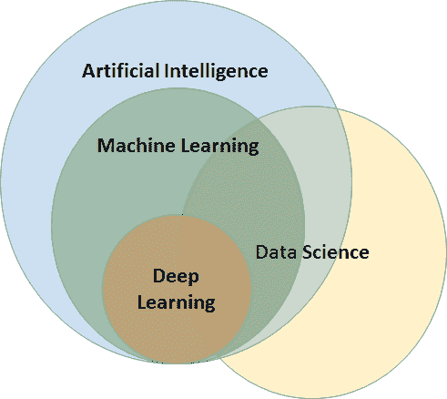

# 第十二章：问答

在本附录中，我们将探讨章节中未涵盖的概念和要点，但这些都是全面理解和欣赏移动机器学习所必需的。我们将关注可能出现在你心中的问题，并尝试回答与此领域相关的问题。

# 常见问题解答

我们将把常见问题解答组织成三个基本部分：

+   第一部分将探讨更通用的、与数据科学、机器学习等相关的问题。

+   第二部分将探讨与不同移动机器学习框架相关的具体问题。

+   第三部分和最后一部分将探讨与移动机器学习项目实施相关的具体问题。

# 数据科学

在本节中，我们将回答一些与数据科学及其应用相关的问题。

# 什么是数据科学？

数据科学是从数据中提取相关见解的过程。它是数学、机器学习、计算机编程、统计建模、数据工程和可视化、模式识别和学习、不确定性建模、数据仓库和云计算等多个领域的综合。追求这些领域所需的技能包括工程、数学、科学、统计学、编程、创造力和数据维护与维护。

# 数据科学在哪里使用？

数据科学用于**人工智能**（**AI**）和机器学习。它解决复杂的数据问题，揭示在应用之前未知的信息。它揭示了数据之间极端相关且对业务非常有用的未知相关性。

# 什么是大数据？

大数据通常包括超出常用软件工具捕获、管理和处理能力的数据集。

大数据的特点是 Gartner 在 2001 年提出的三个 V，即：

+   **容量**：数据量巨大且在增加

+   **速度**：数据积累的速度快且在增加

+   **多样性**：被捕获的特征/特性的数量大且在增长

Gartner 在 2012 年的定义是：*大数据是高容量、高速度、高多样性信息资产，需要新的处理形式来实现增强决策、洞察发现和流程优化*。

大数据可以包括大数据系统、大数据分析和大数据集。

# 什么是数据挖掘？

数据挖掘是检查大型现有数据集并从中提取有用见解的过程。

# 数据科学与大数据之间的关系

数据科学不一定涉及大数据，但数据规模的增长使得大数据成为数据科学的一个重要方面。

# 什么是人工神经网络？

**人工神经网络**（**ANNs**）是受构成动物大脑的生物神经网络启发的计算系统。这些系统不是通过特定的任务规则编程的，而是通过考虑例子来执行任务，例如图像识别。为了识别一朵玫瑰，它通过学习来学习玫瑰的特征，以定义一个样本为玫瑰，而不是通过编程。

# 什么是 AI？

AI 指的是通过机器模拟人类大脑功能。这是通过创建一个能够展示人类智能的 ANN 来实现的。AI 机器执行的主要人类功能包括逻辑推理、学习和自我纠正。这是一个非常复杂的领域，要使本质上不智能的机器思考和行动像人类一样，需要大量的计算能力和数据输入。

AI 分为两个部分：

+   **通用 AI**：使机器在广泛领域变得智能，在思维和推理上类似于人类。这至今尚未实现，并且已经启动了许多正在进行的研究活动。

+   **窄 AI**：使机器在特定领域变得智能，如数字识别和国际象棋。这在今天是可能的。

# 数据科学、AI 和机器学习是如何相互关联的？

了解数据科学、AI 和机器学习之间确切关系的信息是非常有趣且重要的：

+   **AI**：这个领域试图通过人工方式模拟人类智能。正如人类能够看到、观察他们周围的数据并做出决策一样，同样的尝试正在通过机器进行。这是一个非常广泛的领域。这项技术仍在不断发展。为了通过 AI 完成人类非常容易完成的小任务，需要大量的数据。

+   **机器学习**：AI 的一个子集。专注于特定问题领域。这项技术有针对现实生活用例的实现。它是 AI 和数据科学之间的连接桥梁。

+   **数据科学**：这是一个数据研究领域，旨在从中提取信息。这可以使用机器学习来分析数据、大数据等：



# 机器学习框架

在本节中，我们将探讨本书中已经讨论过的几个机器学习框架，以及我们没有讨论过的框架，并对它们提供一些简要的指导。

# Caffe2

+   来自 Facebook 的 Caffe2 是本书未讨论的关键移动机器学习框架之一。更多详情可以从[`caffe2.ai/`](https://caffe2.ai/)获取。

+   Caffe2 是一个深度学习框架，它提供了一个简单直接的方式来实验深度学习，并利用社区对新型模型和算法的贡献。

+   原始的 Caffe 框架对于大规模产品用例非常有用，尤其是在其无与伦比的性能和经过良好测试的 C++代码库方面。

+   Caffe2 在许多方面是对原始 Caffe 框架的改进。

+   要理解和开始使用框架编写代码示例，它有一个陡峭的学习曲线。

# scikit-learn

+   Scikit-learn 是众所周知的最著名的机器学习包之一，提供了大量常见机器学习算法的高效实现版本。

+   它不是一个移动机器学习包。然而，使用 scikit-learn 创建的模型可以通过转换工具转换为 Core ML 和 TensorFlow Lite 模型，并直接用于移动应用程序。

+   它在机器学习算法中具有类似和统一的 API 实现，并且提供了非常全面的辅助文档。

+   学习 scikit-learn 以及使用它实现和扩展模型非常容易。

+   Scikit-learn 最初由 David Cournapeau 在 2007 年的谷歌夏日代码项目中开发。后来，Matthieu Brucher 加入了项目，并将其作为他论文工作的一部分开始使用。2010 年，INRIA 参与其中，并于 2010 年 1 月底发布了第一个公开版本（v 0.1 beta）。现在，项目拥有超过 30 位活跃的贡献者，并得到了 INRIA、谷歌、Tinyclues 和 Python 软件基金会的赞助。

+   Scikit-learn 通过 Python 中的统一接口提供了一系列监督学习和无监督学习算法。

+   它遵循宽松的简化版 BSD 许可协议，并在许多 Linux 发行版中分发，鼓励学术和商业使用。

+   该库建立在 SciPy 之上，您必须先安装 SciPy 才能使用 scikit-learn。

# TensorFlow

+   TensorFlow 是一个用于快速数值计算的开源库。它由谷歌创建并维护，并遵循 Apache 2.0 开源许可协议发布。API 使用 Python 编程语言编写，尽管也有访问底层 C++ API 的途径。

+   有一个针对移动设备的独立版本，我们已经在书中详细讨论过，并在我们的实际动手练习中使用过。

+   在 TensorFlow 中创建的模型可以用于转换为 TensorFlow 移动和 TensorFlow Lite 模型，并在移动应用程序中使用。

+   TensorFlow 旨在用于研究和开发以及生产系统。它可以在单 CPU 系统、GPU 上运行，以及移动设备和数百台机器的大型分布式系统中。

+   从数学上讲，张量是一个 n 维向量。它可以用来表示 n 维数据集。"Flow"指的是一个图；该图不能是循环的，图中的每个节点代表一个操作，如加法、减法等。每个操作的结果都会形成一个新的张量。

+   TensorFlow 能够并行评估每个节点，因此消除了在串行模式下等待节点评估的空闲浪费时间。

+   TensorFlow 允许用户利用并行计算设备来加速操作。

# Core ML

+   苹果在 WWDC'17 上发布了 Core ML，今年更新到了 Core ML 2。提醒一下，Core ML 允许开发者将机器学习模型集成到 iOS 和 MacOS 应用中。这是该领域的第一次重大尝试，最初开发者们因为几个原因而非常喜欢它。

+   Core ML 支持多种机器学习模型，包括神经网络、树集成、支持向量机和广义线性模型。Core ML 需要 Core ML 模型格式（具有`.mlmodel`文件扩展名的模型）。

+   苹果还提供了转换器，可以将其他几个库中创建的模型转换为 Core ML 格式。由于我们在本书中使用了这些转换器，我们发现这些转换器极其简单易用，并且与大多数著名的现有机器学习库兼容。

+   苹果还提供了一些流行的开源模型，这些模型已经以 Core ML 模型格式存在，可以直接下载并用于构建我们的应用。

+   Core ML 针对设备性能进行了优化，这最小化了内存占用和功耗。严格在设备上运行也确保了用户数据的安全，即使在没有网络连接的情况下，应用也能运行。

+   Core ML 最大的优势是它极其简单易用。只需几行代码就可以帮助你集成一个完整的机器学习模型。自从 Core ML 发布以来，就有大量使用它的创新项目涌现。然而，Core ML 能做的事情也有局限性。

+   Core ML 只能帮助你将预训练的 ML 模型集成到你的应用中。这意味着你只能进行预测；无法进行模型训练。

+   到目前为止，Core ML 已被证明对开发者来说极其有用。今年在 WWDC 上宣布的 Core ML 2，应该通过称为**量化**和**批量预测**的技术将推理时间提高 30%。

# 移动机器学习项目实施

在本节中，我们将探讨任何机器学习项目实施者在开始项目之前都会考虑的基本问题。

# 在开始项目之前，需要考虑哪些高级重要事项？

在开始项目之前，需要解决以下高级事项：

+   根据我们看到的 ML 定义，对问题进行明确定义，为任务 T、性能度量 P 和经验 E 提供清晰的输入。

+   拥有所需数量的数据可用

+   设计移动端或基于云的移动机器学习框架的决策

+   正确选择适合我们需求的机器学习框架

# 实施移动机器学习项目所需的角色和技能是什么？

可以为移动机器学习项目计划以下技能和角色：

+   **领域专家/专家**：对问题、数据、数据中的特征、业务背景等进行输入

+   **机器学习数据科学家**：分析数据，进行特征工程和数据预处理，并构建机器学习模型

+   **移动应用程序开发者**：利用移动机器学习模型来构建移动应用程序

+   **测试员**：测试模型以及移动应用程序

在这里，每个角色都可以通过这本书被其他人学习，并且可以由单个人或多个人执行，以确保移动机器学习项目的成功实施。

# 测试移动机器学习项目时应该关注什么？

项目中要测试的关键是移动机器学习模型。因此，独立于移动应用程序，模型需要彻底测试。

我们已经看到了在测试机器学习模型时应该关注什么。在测试模型时需要考虑训练数据、测试数据和交叉验证。需要测量所选模型的性能指标。对于每次运行，都需要进行清晰的记录，以便我们清楚地知道对于输入数据特征集的 delta 变化，输出会有什么样的 delta 变化。所有在第一章，《移动机器学习导论》中解释的概念，如准确性、精确度、召回率、错误等，都应该被测试机器学习模型的工程师清楚地理解。此外，对于每种类型的算法，错误和性能度量指标各不相同，在测试模型时应该充分考虑。测试机器学习模型本身就是一个值得写一本书的主题，而这本书中详细讨论的内容超出了范围。

# 领域专家将如何帮助机器学习项目？

领域专家/专家在任何一个机器学习项目的成功中扮演关键角色，他的具体价值将在以下领域体现：

+   定义问题陈述并帮助正确理解解决方案的期望

+   数据准备：

    +   在特征工程中，哪些是好的候选者被选中并保留为预测属性？

    +   如何结合多个目标/属性以帮助解决问题陈述

    +   如何采样以选择测试集和训练集

    +   帮助进行数据清洗

+   进度监控和结果解释：

    +   定义所需的预测准确度

    +   根据取得的进展，确定是否需要更多数据/附加数据

    +   在中间设置一个检查点，并确定取得的进展是否与定义的问题陈述一致，追求的解决方案是否一致，是否可以继续在同一方向上推进，或者是否有必要采取不同的路径/重新校准方法。

+   对进度进行持续更新和反馈

# 机器学习项目中常见的陷阱有哪些？

以下是在任何机器学习项目中常见的一些陷阱：

+   不切实际的目标，不明确的问题定义，没有适当的目标

+   数据问题：

    +   建立预测模式的数据不足

    +   预测属性选择不当

    +   数据准备问题

    +   数据归一化问题——未能跨数据集归一化数据

    +   解决问题时数据使用的偏差

+   机器学习方法选择不当：

    +   选择的机器学习方法不适合定义的问题陈述

    +   不尝试替代算法

+   过早放弃。这种情况很常见。如果工程师看不到初始结果，无法进行各种依赖因素的排列组合，并且无法对结果进行系统记录，他们往往会失去兴趣。如果持续/有系统地记录并尝试各种可能性，机器学习问题可以轻松解决。

# 安装

在本节中，我们将介绍设置本书中创建程序所需的不同工具和 SDK 安装程序。

# Python

在本书中，我们使用 Python 创建了机器学习模型。因此，您必须知道如何在您的系统中安装 Python，以便通过实际示例进行学习。

访问[`www.python.org/downloads/`](https://www.python.org/downloads/)。

它将显示最新的下载版本；下载安装程序并安装。

在 Windows 上安装时，它会询问是否要将 Python 添加到路径环境变量中。勾选复选框以自动为您完成。否则，您需要手动将其添加到路径变量中。

要检查您的机器上是否已安装 Python，请转到命令提示符或终端，并输入`python`。它应该显示 Python 提示符。否则，如果您已经将其安装到驱动器中，则需要设置路径变量。

# Python 依赖项

Python 默认会附带`pip`包管理器。您可以使用`pip`进行安装。语法如下：

```py
pip install package name
```

关于可用包的更多信息，您可以访问[`pypi.org/project/pip/`](https://pypi.org/project/pip/)。在本书中，我们已在各自的章节中给出了所有依赖项安装命令。

# Xcode

首先，在 Apple 上创建一个开发者账户并登录到您的账户[`developer.apple.com/`](https://developer.apple.com/)。点击下载并向下滚动/搜索最新版本的 Xcode，版本号高于 9.4，然后点击下载。它将下载 XZIP 文件。将其提取出来，并通过将其拖动到应用程序文件夹中在您的 Mac 机器上安装。

# 参考文献

以下是一些您可以参考的参考文献，以了解更多关于在移动设备上进行机器学习的知识：

+   **机器学习精通**：[`machinelearningmastery.com/`](https://machinelearningmastery.com/)

+   **Analytics Vidhya**：[ https://www.analyticsvidhya.com/](https://www.analyticsvidhya.com/)

+   **弗里茨**：[`fritz.ai/`](https://fritz.ai/)

+   **ML Kit**: [`developers.google.com/ml-kit/`](https://developers.google.com/ml-kit/)

+   **TensorFlow Lite**: [`www.tensorflow.org/lite/`](https://www.tensorflow.org/lite/)

+   **Core ML**: [`developer.apple.com/documentation/coreml?changes=_8`](https://developer.apple.com/documentation/coreml?changes=_8)

+   **Caffe2**: [`caffe2.ai/`](https://caffe2.ai/)
