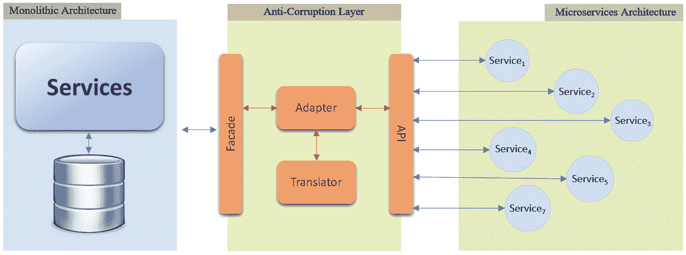
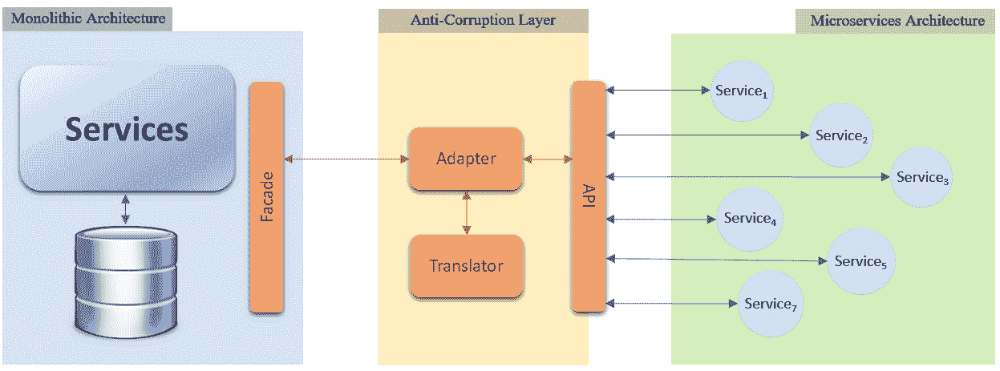
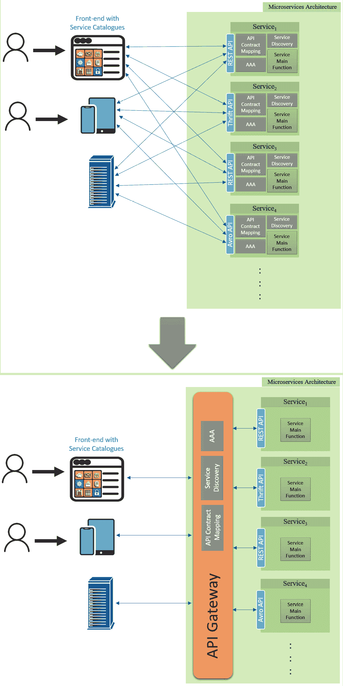
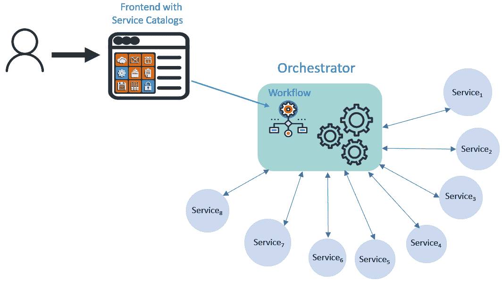
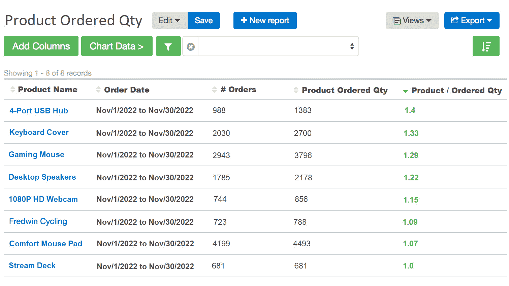
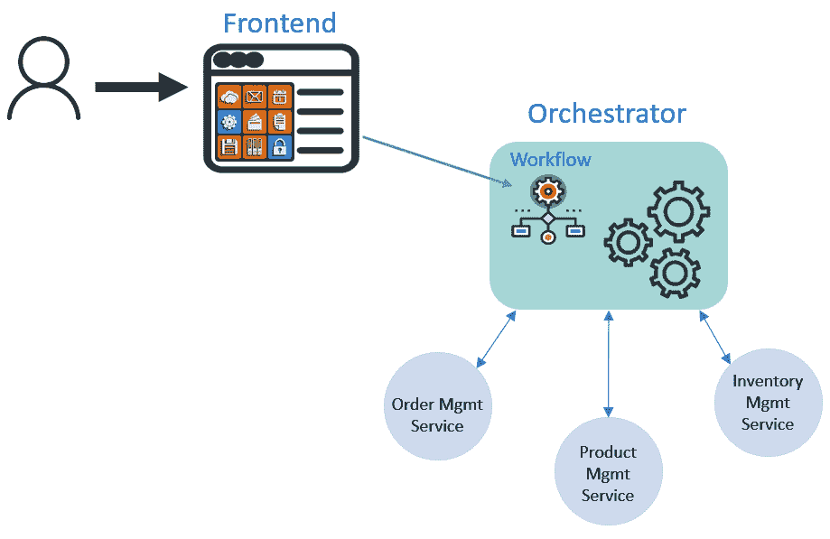
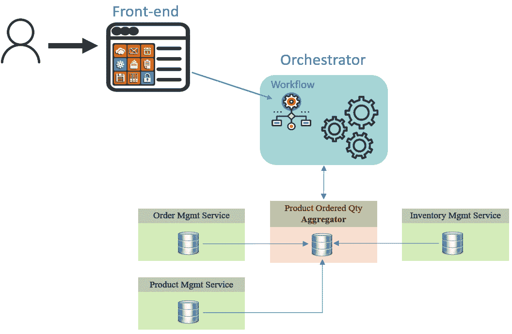
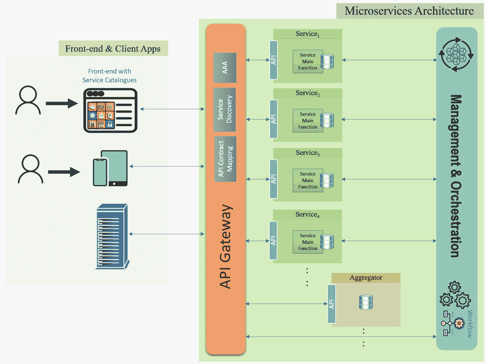
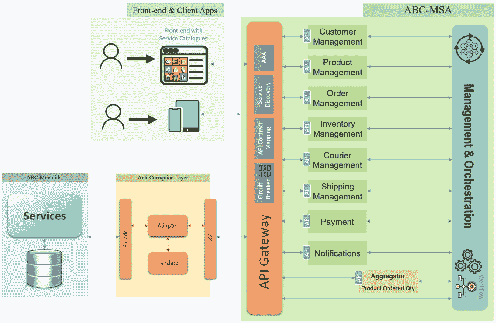

# 第三章：解决常见 MSA 企业系统挑战

在上一章中，我们学习了如何分解单体并将其重构为 MSA 企业系统。我们以一个简化的系统为例，然后重构系统以展示此过程。通过这样做，我们解决了运行单体系统的一些挑战。然而，向 MSA 的迁移引入了完全不同的一组需要解决的问题。

在本章中，我们将讨论 MSA 引入的主要挑战，如何解决它们，以及我们需要应用的具体方法来维护 MSA 系统的可靠性、耐用性和平稳运行。

在本章中，我们将涵盖以下主题：

+   使用反腐败层（ACL）进行 MSA 系统隔离

+   API 网关

+   服务目录和编排器

+   微服务聚合器

+   微服务断路器

+   网关与编排器与聚合器

+   ABC-MSA 增强

# 使用 ACL 进行 MSA 隔离

在棕色地带采用 MSA 时，您从单体系统迁移到 MSA 可以是**大爆炸迁移**或**滴答迁移**。

在大爆炸迁移中，您保持旧的单体系统按原样运行，同时构建整个 MSA 系统。一旦 MSA 系统完成、测试和部署，您就可以在组织维护窗口期间完全切换到新的 MSA 系统，然后退役旧的单体系统。虽然这种迁移在某些场景中可用，但在大型企业系统中通常不推荐使用。

在公司非高峰时段或公司标准迁移窗口期间切换用户从旧系统到新系统。由于高停机时间、潜在的回滚和将真实流量应用于新系统时可能出现意外结果的风险，用户突然切换可能是一个复杂且繁琐的过程，所有这些都可能在迁移窗口期间施加大量时间限制。

在我们的案例中，一种常见且更安全的迁移方法是滴答迁移，其中您逐步从旧的单体系统转移到新的 MSA 系统。一种常见的方法是逐步从单体中提取功能、服务和/或模块，并将它们作为您新 MSA 的一部分移动到独立的微服务中。逐渐地，我们逐步淘汰现有单体系统的功能，并逐步构建 MSA 系统。

要成功执行滴答迁移，您需要所谓的**反腐败层**（**ACL**），它将充当一个中间层、缓冲区和旧混乱单体与您新清洁的 MSA 之间的网关。ACL 层将帮助暂时集成和粘合新提取的服务，以便能够与旧服务、数据库和模块通信，而不会破坏您的新 MSA 系统。您可以在以下图中看到 ACL 架构：

图 3.1：反腐败层（ACL）

ACL 的生命周期与单体系统的生命周期一样长。一旦迁移完成，单体系统退役，ACL 就不再需要。因此，建议您将 ACL 编写为独立服务或作为单体的一部分。

ACL 有三个主要组件：

+   API 组件，允许 ACL 使用与 MSA 系统相同的语言与 MSA 系统通信。

+   **ACL 外观层**，这是允许 ACL 使用单体的语言（们）与单体通信的接口。

外观层可以放置的位置有两种选择；一种如*图 3.1*所示，外观层被放置为新独立的 ACL 微服务的一部分。另一种选择是将外观层作为单体内部的一个组件，如*图 3.2*所示：

图 3.2：外观层的两种实现选项

选择将取决于架构师和开发者是否希望在内聚体内部添加更多粘合代码，或者完全将开发工作与内聚体隔离。

+   **ACL 适配器**，作为 ACL 的一部分，位于 ACL 的北向 API 和外观层之间。适配器的主要功能是使用**ACL 翻译器**接口在单体和 MSA 之间进行转换，如*图 3.1*所示。

只有在采用渐进式迁移时才需要 ACL。在大爆炸式迁移的情况下，不需要实现 ACL。由于在两种迁移方式之间都有资源消耗，以及优势、风险和权衡，MSA 项目的利益相关者需要决定哪种方式更适合项目和组织。

无论是否实施 ACL，MSA 系统仍然需要一个组件作为 MSA 系统和外部客户端之间的接口。在 MSA 和外部 API 调用之间使用 API 网关被认为是良好的 MSA 设计实践。下一节将讨论 API 网关在 MSA 系统中的作用，以及采用 API 网关在 MSA 设计中的权衡。

# 使用 API 网关

正如我们在*第一章*中解释的，微服务可以直接相互通信，无需集中式管理。随着 MSA 系统变得更加成熟，微服务的数量逐渐增加，微服务之间的直接通信可能会成为很大的开销——特别是需要 API 消费者和 API 提供者之间多次往返调用的通信。

根据微服务的自治原则，每个微服务都可以使用其技术栈，并且可能与同一 MSA 系统中的其他微服务使用不同的 API 合约进行通信。例如，一个微服务可能只理解具有 JSON 数据结构的 RESTful API，而其他微服务可能只与 Thrift 或 Avro 进行通信。

此外，活动实例化微服务的位置（IP 和监听端口）在 MSA 系统中动态变化。因此，系统需要有一种机制来识别 API 消费者可以指向的位置。

也有这样的情况，你需要将你的 MSA 系统与旧系统（如大型机、AS400 等）集成。

所有上述情况都需要在 MSA 系统中的每个微服务中嵌入代码。这段代码将帮助微服务理解旧的和非 REST 通信模式，发现系统中其他微服务的网络位置，并了解每个微服务的一般需求。现在，这样一套微服务将有多大的独立性和可移植性？

解决上述挑战的更好方法是使用 API 网关，其中所有系统服务都通过该网关相互通信。API 网关接收来自系统 API 消费者的 API 调用，然后将接收到的数据映射到 API 提供者可以理解和处理的格式和协议：

图 3.3：从服务直接通信迁移到 API 网关通信

使用 API 网关，我们显著减少了服务之间的直接 1 对 1 通信。此外，我们减轻了系统微服务进行多次翻译、映射代码和**认证-授权-计费**（**AAA**）任务的压力。相反，我们将发现微服务位置的责任从客户端转移到 API 网关，这反过来又进一步减少了代码开销，使微服务尽可能轻便和独立。

重要提示

MSA 系统的可用性与 API 网关的可用性相当。因此，API 网关需要作为一个高性能和高可用性的关键任务服务来开发和部署管理。

API 网关可以作为 MSA 系统的一部分独立服务部署。网关的主要功能如下：

+   最小化微服务之间的 API 调用，这使得 MSA 系统间的通信更加高效。

+   最小化 API 依赖和破坏性变更。在没有 API 网关的 MSA 系统中，如果由于任何原因，其中一个 API 提供者更改了其 API，很可能会发生破坏性变更。这意味着我们需要在每个与 API 提供者通信的微服务中创建一个变更。通过使用 API 网关，API 提供者的变更将仅限于 API 网关，以匹配提供者和消费者之间的 API 合约。

+   在 API 合约之间进行翻译和映射，从而减轻了微服务在核心功能中嵌入翻译代码的负担。

+   运行服务发现机制，并减轻客户端运行该功能的负担。

+   作为 MSA 系统外部客户端调用的入口点。

+   在高可用性微服务的不同实例之间负载均衡 API 调用，并在高流量情况下减轻微服务的负担。

+   通过限制在**分布式拒绝服务**（**DDoS**）和类似攻击期间 API 调用的突然增加，提供更好的安全性。

+   验证和授权用户访问 MSA 系统中的不同组件。

+   提供全面的分析，以深入了解系统指标和日志，这有助于进一步改进系统设计和性能。

尽管 API 网关具有所有这些优点和功能，但在你的 MSA 系统中使用 API 网关仍然存在一些缺点：

+   最明显的是复杂性。系统中协议和 API 合约数据结构越多，网关就越复杂。

+   MSA 的操作高度依赖于 API 网关的性能和可用性，这可能会创建一个不受欢迎的系统性能瓶颈。

+   在微服务内部通信路径中引入额外的中介组件，如 API 网关，会增加服务响应时间。对于健谈的服务，增加的响应时间可能会变得相当可观。

即使 API 网关提供了所有这些功能，我们仍然需要一种方法来将每个用户请求映射到 MSA 系统需要运行以完成该请求的特定任务。在下一节中，我们将讨论 MSA 系统任务如何映射到特定的用户服务，以及这些任务如何在 MSA 中编排。

# 服务目录和编排器

编排是 MSA 系统中最常用的通信模式之一。我们在*第一章*中简要讨论了这一概念。在本节中，我们将深入了解编排的更多细节。

确定不同微服务之间最合适的通信模式取决于许多因素。在确定编排或编排是否是最适合系统的通信模式时，您必须考虑系统中微服务的数量、不同微服务之间的交互水平、业务逻辑本身、动态业务需求如何变化以及系统更新如何动态变化。

编排器作为中央管理者，控制系统微服务之间的所有通信。它们通常通过包含所有服务目录的仪表板界面与用户交互。**服务目录**是 MSA 系统向用户提供的一组服务。目录中的每个服务都链接到一组工作流程。**工作流程**是编排器将在系统微服务之间触发和协调的动作，以提供用户从目录中选择的服务：

图 3.4：MSA 中的编排器

编排器的功能可以扩展到管理工作流程之外。编排器还可以管理微服务的整个生命周期；这包括提供和部署微服务、配置微服务以及根据需要执行升级、更新、监控、性能审计和关闭。

重要提示

编排器是 MSA 系统的主要大脑，确保编排器作为高绩效和关键任务组件部署和管理是至关重要的。

在 MSA 中运行编排器的一些好处包括以下内容：

+   您拥有一个集中式管理平台，作为您所有工作流程的唯一真相来源。因此，您可以在复杂的 MSA 中构建复杂的工作流程，而无需担心您有多少微服务以及它们如何扩展。

+   就像在 API 网关中一样，您可以连接您的遗留系统或旧单体系统的一部分，并完全隔离微服务，使其无需与其他系统组件耦合。这可以节省大量将代码构建到独立微服务中的努力，并在扩展 MSA 方面提供巨大帮助。

+   微服务对编排器可见，因此可以完全由编排器管理、审计和监控。这可以产生非常有帮助和有洞察力的分析，可以进一步增强 MSA 系统的可支持和操作能力。

+   编排器的可见性有助于解决任何操作问题并快速识别问题。

+   协调器可以自动检测并自行解决一些操作问题。例如，协调器可以检测资源饥饿并重新路由请求到备份微服务。当检测到问题时，协调器可以自动垂直或水平扩展特定的微服务。协调器还可以尝试自动重启服务，如果服务没有响应。

协调器解决了许多 MSA 操作问题，包括一些数据同步挑战。然而，在扩展系统时，数据同步和数据一致性成为协调器必须自行解决的大挑战。微服务聚合器帮助解决 MSA 系统扩展时的数据同步问题。在下一节中，我们将讨论聚合器模式是什么，它用于什么，以及它是如何工作的。

# 微服务聚合器

在*第二章*中，我们不得不在多个微服务之间复制一些模式，并通过协调器使用 saga 模式来保持数据一致性和保持微服务的自治性。这种解决方案在 MSA 系统中微服务数量有限的情况下可能是可行的。在大量微服务的系统中，将模式复制到不同的微服务以保持单个微服务数据库的同步并不适用，并且可能会严重影响系统的整体性能。

考虑一个拥有 100 个微服务的 MSA 系统，并将模式复制到大约 20 个微服务中，以保持微服务的自治性。每当任何模式数据的任何部分被更新时，协调器都必须同步这 20 个模式。

此外，即使我们拥有所有 100 个完全自治的微服务，如果用户的某个操作需要从那 20 个微服务中获取信息，会怎样呢？协调器将不得不向 20 个不同的微服务发出至少 20 个不同的 API 调用，以获取用户所需的信息。更不用说其中的一些 20 个微服务可能需要交换多个 API 调用，以便将结果发送回用户。

为了更清晰地理解，让我们回顾一下我们在*第二章*中构建的 ABC-MSA 系统。我们拥有`订单`、`产品`和`库存`微服务。`产品`微服务用于管理产品信息，`库存`微服务用于管理产品库存，而`订单`微服务用于下单和管理订单。

假设我们处于这样一个情况：销售分析师正在生成一个报告，以检查一个产品按订单平均购买数量以及订单下单时的产品库存水平，如下面的图所示：

图 3.5：一个示例产品订单报告

调度器必须至少发送三个 API 调用，每个调用分别针对`order`、`product`和`inventory`微服务，如下所示：

图 3.6：跨越多个微服务的用户操作

为了最小化依赖和响应时间，在这种情况下更好的方法是使用`order`、`product`和`inventory`微服务，并使用合并的信息更新其数据库。

API 网关或消费者只需向聚合器发送一个 API 调用，即可获取所需的所有信息。API 调用的次数最小化，整体响应时间大大减少，尤其是在所需信息分布在大量微服务中的情况下：

图 3.7：聚合器通信模式

聚合器通信模式减少了用户在各种操作请求中可能触发的 API 调用次数，进一步增强了数据同步的设计和性能，以及整体系统性能，尤其是在高延迟网络中。

现在，我们已经了解了 API 网关、调度器和聚合器的角色。在下一节中，我们将讨论这三个组件如何在 MSA 中相互交互。

# 网关与调度器与聚合器

从我们迄今为止所描述的内容来看，API 网关、调度器和聚合器之间存在一些重叠的功能。在本节中，我们将回答一些关于这三个组件如何在单个 MSA 系统中交互的基本问题：

+   这三个 MSA 组件是如何协同工作的？

+   API 网关能否执行聚合器和调度器的功能？

+   在我们的 MSA 中部署所有这些通信模式的最佳实践是什么？

首先，从理论上讲，您可以让客户端直接与 MSA 微服务交互，而不需要 API 网关。然而，这并不是一个好的做法。在没有网关的 MSA 系统中，您需要在系统中每个微服务中实现大部分网关功能。

为了使微服务尽可能轻量化和自主，强烈建议在 MSA 系统中拥有一个 API 网关。API 网关将处理来自不同类型客户端的所有入站和出站 API 流量。客户端可以是网络仪表板、移动应用、平板电脑、第三方集成系统等。

是否添加聚合器将高度取决于您的业务逻辑和系统设计。只有当您有客户端用例，请求需要在后端跨越多个微服务时，您才需要聚合器。

聚合器可以作为网关本身的一部分实现；然而，最佳实践是在需要时才添加聚合器，并使其成为一个独立的独立微服务。

MSA 系统可以拥有多个聚合器，每个聚合器都有特定的业务逻辑，并从不同的微服务集合中收集特定的数据集。

同样，编排模式也可以在 API 网关中实现；然而，你需要让 API 网关专注于执行其创建时的主要功能，并将编排任务留给编排器。编排器也最好作为独立的独立微服务部署：

图 3.8：MSA 高级架构

前面的图显示了所有这些组件在 MSA 系统中协同工作的高级架构。客户端始终与 API 网关交互，API 网关将请求路由到 MSA 系统中的适当服务。

客户端 API 调用根据 API 的配置路由到适当的微服务。如果客户端请求是通过与单个微服务通信来满足的，那么网关将直接将该请求发送到微服务。跨越多个微服务并分配给系统中的特定聚合器的 API 调用将被转发到该特定聚合器。最后，对于调用特定工作流程的 API 请求，API 网关将将其转发到编排器。

在本节中，我们学习了 API 网关、编排器和聚合器如何在同一 MSA 系统中共存。在下一节中，我们将尝试将所有这些三种通信模式的概念应用到我们之前开发的 ABC-MSA 系统中。

# 微服务断路器

在 MSA 系统中，另一个挑战是工作流程执行的稳定性和保证。我们在*第一章*中讨论的 Sagas 模式用于确保特定工作流程内的所有事务要么全部成功执行，要么全部失败。但这是否足以确保微服务的可靠执行？

让我们考虑一个场景，即被调用的微服务对 API 调用的响应太慢。请求成功执行，但微服务的响应超时。微服务消费者随后可能会假设执行失败，并相应地重复操作，这可能会非常麻烦。

如下图中所示，当支付微服务发生响应超时时，支付微服务将处理支付，但微服务消费者会假设支付尚未处理，并可能自动（或根据用户请求）重试该过程。这种行为会导致支付被多次处理，从而对同一订单产生多次收费，或者导致订单被多次提交：

图 3.9：响应时间过慢的支付微服务

在 MSA 中，当微服务被实例化时，它们会从有限的资源和线程开始，以避免某个特定的微服务占用所有系统资源。

考虑到系统资源，考虑另一个场景，如图*图 3.10*所示，其中库存微服务是服务工作流的一部分，而支付微服务由于某种原因既不处理也不响应 API 调用。在这种情况下，订单和支付微服务都将继续等待库存的确认，然后才开始释放它们的资源。

当库存微服务超时请求，并且在系统负载较重或订单量较高的情况下，请求开始堆积到订单和支付微服务。最终，订单和支付微服务开始耗尽资源，无法响应请求：

图 3.10：库存微服务已关闭

MSA 中的类似场景可能导致多米诺效应，导致多个微服务发生级联故障，进而导致整个系统故障。

微服务电路断路器用于防止系统级联故障的发生。电路断路器使用真实流量指标监控微服务性能。它分析响应时间和成功响应率等参数，并实时确定微服务的健康状况。如果微服务变得不健康，电路断路器立即开始向微服务消费者返回错误。

电路断路器并不能防止被监控的微服务失败；相反，它防止了级联故障的发生：

图 3.11：具有内联电路断路器的库存微服务

当电路断路器假定微服务不健康时，它仍然需要监控和评估微服务的运行性能。电路断路器切换到**半开状态**，此时它只允许一小部分请求通过到被监控的微服务。一旦电路断路器检测到健康的微服务响应，电路断路器将状态切换回**关闭状态**，此时 API 流量正常流向微服务。

在 MSA 系统中，并非每个微服务都需要电路断路器。我们只需要在可能引起级联故障的微服务上部署电路断路器。架构师需要研究和确定哪些微服务需要电路断路器保护。

断路器可以作为独立的微服务部署，也可以是 API 网关的一部分。断路器是作为独立微服务实现还是作为 API 网关的一部分，高度依赖于系统的业务和运营需求，以及架构本身采用的模式。

断路器模式、协调器、聚合器、ACL 和 API 网关都是可以应用于 MSA 系统以实现更好可靠性、弹性和整体性能的架构增强。在下一节中，我们将学习如何将本章讨论的每个模式应用于我们的 ABC-MSA 系统。

# ABC-MSA 增强

在*第二章*中，我们将我们的 ABC-Monolith 重构为一个简单的 ABC-MSA。我们在*第二章*中设计的 ABC-MSA 缺少我们在本章考虑的许多增强功能。现在是时候将我们在本章学到的知识应用到 ABC-MSA 系统中，以增强其设计和操作了。

首先，在 ABC-MSA 的*第二章*中，协调器同时执行 API 网关功能和协调功能。到目前为止，我们已经了解到在一个服务中结合网关和协调功能并不是最佳选择。因此，我们将向我们的 ABC-MSA 系统添加一个专门的 API 网关，用于入口和出口 API 调用，以及我们在本章前面讨论的其他 API 网关功能，如身份验证、授权、审计、监控等。

API 网关将作为一个独立的独立微服务运行，服务于直接客户端请求，包括系统仪表板和用户前端。协调器也将作为一个独立的独立微服务运行，服务于 MSA 的工作流程。

聚合器（s）将取决于使用多个 ABC-MSA 微服务来满足用户请求的用例。

使用聚合器的简单用例可以是用户检查订单的运输状态。状态应包括订单信息、订单中包含的产品以及该订单的运输状态。

为了向用户展示所有这些信息，我们需要从三个不同的微服务中提取信息：订单管理、产品管理和运输管理。我们将部署一个聚合器作为独立的微服务，从所有这些微服务中提取数据，并使其可供用户 API 消费：

图 3.12：增强的 ABC-MSA 架构

在前面的图中，我们将管理和协调层作为 ABC-MSA 系统的一部分添加。这一层将管理协调工作流程和微服务的生命周期，包括安装、配置、实例化、更新、升级和关闭。

我们还需要在从 ABC-Monolith 到 ABC-MSA 的过渡期间激活 ACL。ACL 将作为两个系统之间的缓冲区，以保持架构及其操作的整洁性。一旦所有 ABC-Monolith 功能都已重新部署到 ABC-MSA 中，旧的 ABC-Monolith 和 ACL 都可以退役。

# 摘要

在本章中，我们讨论了可以引入以维持系统稳定性和提高其性能的 MSA 的不同组件。

我们讨论了如何使用 ACL 在 MSA 从旧的单体系统过渡期间保护我们的新 MSA。然后，我们介绍了 API 网关、聚合器和编排器的角色和功能。我们还讨论了在采用 MSA 中的各种通信模式时可能遇到的一些缺点。

最后，我们对 ABC-MSA 进行了重新设计，以展示这些不同的组件如何在典型的 MSA 中协同工作。

*第一章* 到 *第三章* 介绍了 MSA 的基础知识。在下一章中，我们将通过实际案例开始讨论 MSA 企业系统中使用的核心机器学习和深度学习算法，并介绍一些构建机器学习和深度学习算法的编程和工具示例。

# 第二部分：机器学习算法和应用概述

在本部分中，我们将把重点转向机器学习。我们将了解机器学习算法的不同概念，以及如何设计和构建机器学习系统，维护模型，并将机器学习应用于智能企业 MSA。

我们将首先学习如何识别不同机器学习模型及其用例之间的差异。一旦我们掌握了基础知识，我们将开始学习如何设计机器学习系统管道。一旦我们建立了机器学习系统管道，我们将学习数据偏移是什么，它们如何影响我们的系统，以及我们如何识别和解决它们。最后，在掌握了所有基础知识之后，我们将开始探索构建我们自己的智能企业 MSA 的不同用例。

到 *第二部分* 的结尾，我们将对机器学习和不同的算法有一个基本的了解，学习如何构建和维护机器学习系统，以及最终，我们可以在我们的智能企业 MSA 中使用的不同用例。

本部分包括以下章节：

+   *第四章*，*关键机器学习算法和概念*

+   *第五章*，*机器学习系统设计*

+   *第六章*，*稳定机器学习系统*

+   *第七章*，*机器学习和深度学习在 MSA 企业系统中的应用*
