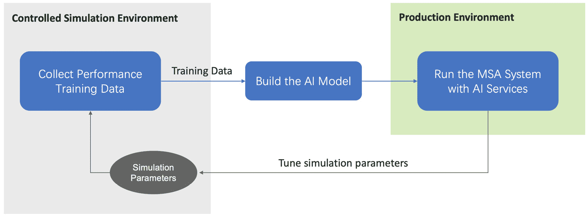
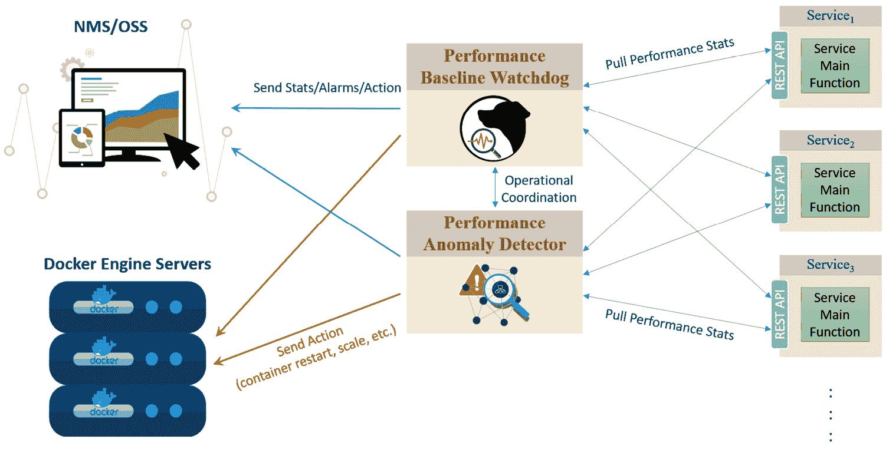
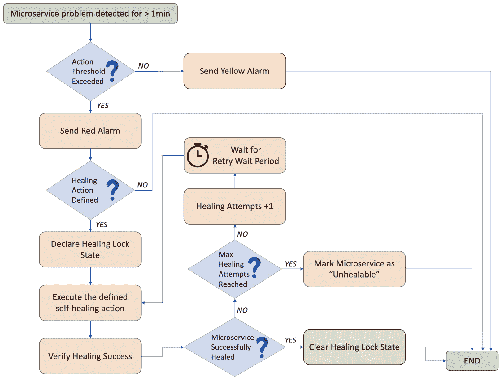
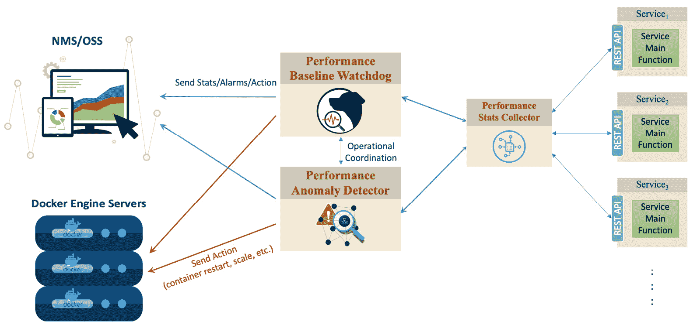

# 第十章：构建智能 MSA 企业系统

在前面的章节中，我们逐步构建 ABC-MSA 来展示 MSA 系统的一些功能、技术和流量模式。

在本章中，我们将结合 MSA 概念和 AI 概念来构建 ABC-Intelligent-MSA 系统，这是 ABC-MSA 的增强版本。ABC-MSA 的智能版本将使用各种 AI 算法来增强原始 ABC-MSA 系统的性能和一般操作。

ABC-Intelligent-MSA 将能够检查不同的流量模式，并检测潜在的问题，然后**自我纠正**或自我调整，以尝试在问题实际发生之前防止其发生。

ABC-Intelligent-MSA 将能够**自我学习**流量行为、API 调用和响应模式，并在检测到任何原因的流量异常或问题模式时尝试**自我修复**。

本章涵盖了以下主题：

+   机器学习的优势

+   构建你的第一个 AI 微服务

+   智能 MSA 系统在实际中的应用

+   分析 AI 服务操作

# 机器学习的优势

在我们的 MSA 中，有许多领域可以利用 AI 来增强系统的可靠性和可操作性。我们将重点关注两个主要的潜在增强领域。一个是增强系统对微服务故障或性能下降的响应。第二个增强领域是添加一个主动断路器角色。

如我们在*第三章*中讨论的，断路器模式用于防止系统在其中一个系统微服务未能及时响应 API 消费者请求时发生级联故障。如果一个微服务失败或表现不佳，我们的 AI 将尝试采取主动行动来解决问题，而不是等待手动修复问题以使系统恢复正常运行。

在*第七章*中，我们详细讨论了在 MSA 中使用**机器学习**（**ML**）和深度学习（**DL**）的优势。本章将专注于构建两个 AI 微服务来增强我们的 MSA 系统。

第一个 AI 微服务被称为**性能基线看门狗**（**PBW**）服务。PBW 是一个机器学习微服务，它为 MSA 系统在特定系统负载下每个微服务的预期性能创建基线。如果测量的微服务的运行性能低于性能基线，并且低于可配置值*x*，系统应向**运营支持系统**（**OSS**）或**网络管理系统**（**NMS**）发送警告消息；如果性能下降*y*（这也是可配置的），系统应采取预定义的行动来尝试自我纠正和自我修复 MSA 系统。

本章我们将构建的第二个 AI 微服务是**性能异常检测器**（**PAD**）服务。PAD 是一个 ML 微服务，它对整个 MSA 系统有一个全面的视角。PAD 学习 MSA 的性能模式，并试图检测任何异常行为。它识别“问题模式”，试图在问题发生之前自动检测到问题，并相应地采取主动措施来修复系统的故障区域。

# 构建你的第一个 AI 微服务

在我们开始构建我们的两个 AI 微服务之前，我们需要首先考虑我们的训练和测试数据——我们将如何收集训练数据，相应地构建模型，测试模型并衡量其可靠性，以及在需要时增强算法的可靠性。

重要提示

我们在 MSA 系统中构建的 AI 服务只是为了证明概念，以展示在 MSA 系统中实施 AI 的价值。相反，企业应考虑一个与他们的独特需求、业务流程以及部署的 MSA 系统相匹配的 AI 服务或模型。

我们还需要模拟使用案例本身。模拟系统微服务的故障或性能下降，模拟级联故障，我们还应该能够模拟一些系统的异常模式，以查看算法如何检测和响应模式异常。

要完成所有这些，让我们首先了解 PBW 和 PAD 微服务如何与整体系统操作相匹配，以及它们通常如何与不同的系统组件交互。

## AI 增强的解剖结构

PBW 和 PAD 的主要作用是增强我们 MSA 系统的稳定性和可靠性。因此，对于这两个服务来说，持续监控单个微服务和整体系统性能，并在检测到性能问题时采取必要的行动是至关重要的。

训练数据首先在一个受控环境中收集，用于特定的训练期间，其中模拟了正常、稳定的系统操作和平均用户负载。这可以通过我们构建的一些模拟工具实现，这些工具将在本节稍后讨论。

这个训练期间创建了一个理想的第一基线，这将成为 AI 服务在实际生产时间使用时的主要参考。收集到的训练数据将被用于构建算法。为了获得更好、更准确的结果，可以在收集到更多关于实时生产流量的信息后，定期调整训练数据和算法。

模拟负载和系统操作通过多个模拟参数进行调整。这些参数会定期调整，以模拟实际可接受的运行性能。随着 AI 算法的成熟，算法调整最终会停止（或变得非常微小）。将 AI 服务纳入 ABC-MSA 系统的周期在*图 10.1*中展示：



图 10.1：ABC-Intelligent-MSA 中的 AI 微服务实现

关于模拟工具和参数的更多信息将在下一节中提供。

一旦 AI 服务运行，它们将通过周期性 API 调用从系统中的每个微服务收集性能统计数据，然后比较这些性能统计数据与预期的性能或行为。

如果单个微服务或整体系统性能偏离 AI 期望看到的结果，系统将触发操作，要么警告系统管理员，要么尽可能进行自我修复。*图 10.2*显示了 PBW 和 PAD 服务的高级架构：



图 10.2：ABC-Intelligent-MSA 中的 PBW 和 PAD 服务

PBW 的算法根据收集的性能统计数据计算预期的性能指标。收集的性能统计数据包括 API 调用响应时间统计、单个微服务的失败或失败率、API 响应代码以及施加在微服务本身的负载。

根据微服务偏离计算性能指标的程度，将触发预定义的操作。根据 PBW 的配置，偏差越大，主动触发尝试自我修复的可能性就越大。然而，在轻微偏差的情况下，不应触发任何修复操作；系统警告通知系统管理员就足够了。

下表显示了在 ABC-Intelligent-MSA 系统操作过程中可能遇到的一些系统问题，以及 PBW 服务将采取哪些操作来尝试解决问题。

表格中显示的列表仅是潜在问题的样本，当然，随着更多用例的考虑，它也可以增长：

| **微服务问题** | **触发操作** |
| --- | --- |
| 响应缓慢 | 垂直/水平扩展微服务或重启微服务 |
| 间歇性超时 | 垂直/水平扩展或重启 |
| API 调用 HTTP 响应错误 | 检查 Apache、Flask、JVM、Docker 卷、SQL 服务等。如有需要，重启服务重启微服务的容器 |
| 服务无响应（关闭） | 重启微服务的容器 |

表 10.1 – ABC-Intelligent-MSA 操作中可能遇到的问题和 PBW 的自我修复操作

恢复机制可以通过使用多个 AI 服务应用于 MSA 系统，而不仅仅是使用我们在 ABC-Intelligent-MSA 中实施的 PBW 和 PAD。这只是一个例子。

## 自我修复过程

在*表 10.1*中列出的所有 PBW 的修复操作不应孤立于 PAD 的操作，而应与 PAD 的修复操作仔细协调。一个微服务中的单个问题可能会（尽管不一定）同时触发 PBW 和 PAD 服务的操作，从而可能造成操作冲突。

在自我修复过程中，为了避免在触发自我修复操作时系统 AI 服务之间发生冲突，每当确定一个操作并在触发之前，AI 服务首先向其他 AI 服务发送 API 调用（无论是直接还是通过 API 网关），在受影响的微服务中声明**自我修复锁定状态**。因此，MSA 系统中的所有其他 AI 服务将推迟任何与该受影响微服务相关的计划中的操作。

在自我修复锁定状态下，唯一允许在受影响的微服务上工作的 AI 服务是**修复 AI 服务**，正是这个 AI 服务将其锁定。

一旦修复者修复了问题并检测到受影响的微服务中的正常操作，修复者随后向 MSA 系统中的其他 AI 服务发送另一个 API 调用，声明锁定状态结束。

如果修复者无法自我修复并放弃解决问题，它将向 NMS/OSS 发送警报，并将该微服务标记为**无法修复**，持续特定可配置的时间，称为**无法修复的等待期**（默认为 15 分钟）。

无法修复的等待期允许其他 AI 服务尝试修复该微服务，并给修复者一个喘息的机会，以调整其在 MSA 系统中的所有其他微服务上的操作。

为了防止修复者通过无限期的修复尝试消耗系统资源，修复者将尝试修复受影响的微服务特定数量的修复尝试，通过**最大修复尝试次数**值（默认为四次）进行配置，然后完全放弃尝试。如果最大修复尝试次数耗尽，则需要手动系统干预来修复受影响的微服务。

如果需要，系统管理员仍然可以配置无限期的修复尝试，但这可能会消耗系统资源，并且根据 MSA 系统或特定微服务遇到的问题的性质，可能不会有效。

如果另一个 AI 服务可以修复受影响的微服务或微服务被手动修复，在无法修复的等待期结束后，原始修复者将自动清除微服务的无法修复标志。

如果另一方面，没有其他 AI 服务可以修复问题，并且没有手动干预来修复微服务，那么当无法修复的等待期结束后，原始的治愈者——以及任何可能尝试修复微服务的其他治愈者——将再次尝试修复微服务，前提是有问题的微服务不在自愈锁定状态。

以下视觉图表总结了自愈过程，可能有助于更好地解释整个过程。



图 10.3：MSA 中的自愈过程

理解用于解释自愈过程的主要术语也很重要。以下表格展示了我们自愈过程主要组件术语的总结：

| **术语** | **描述** |
| --- | --- |
| 治愈者 | 一种尝试修复有问题的微服务的 AI 服务。 |
| 治愈动作 | 治愈者采取的行动，以尝试修复正在进行的系统操作问题。 |
| 自愈锁定状态 | 当治愈者尝试修复微服务时的微服务状态。在此状态下，只有一位治愈者（启动锁定状态的治愈者）被允许对有问题的微服务进行操作。微服务自愈锁定状态是整个 MSA 系统可见的状态，而不是特定于治愈者的状态。 |
| 重试等待期 | 治愈者在治愈动作失败后必须等待的时间，然后它才会重试。默认情况下，重试等待期为 2 分钟。 |
| 无法修复的状态 | 治愈者在其尝试修复有问题的微服务失败后，将该微服务标记为无法修复的状态。微服务的无法修复状态是特定于治愈者的状态，并且只有放弃修复该有问题的微服务的治愈者可见。其他治愈者仍然可以尝试修复有问题的微服务。 |
| 无法修复的等待期 | 治愈者必须等待的时间，然后它才会开始尝试修复有问题的微服务。默认情况下，无法修复的等待期为 15 分钟。 |
| 最大治愈尝试次数 | 治愈者在完全放弃有问题的微服务并停止尝试修复它之前，在每个无法修复的等待期后将会尝试的最大次数。默认情况下，PBW 尝试 4 次治愈尝试。 |

表 10.2：ABC-Intelligent-MSA 的操作问题与 PBW 的自纠正动作

到目前为止，我们已经解释了在 MSA 系统中部署 AI 服务的价值，并展示了几个实际应用示例来证明 AI 在 MSA 中的价值。

为了在 MSA 中构建、运行和调整 AI 服务，我们需要构建某些工具来收集和记录系统状态、操作动态和操作统计。在下一节中，我们将深入了解这些工具是什么以及如何使用它们。

## 构建必要的工具

创建项目工具的目的是首先能够构建 AI 模型，然后模拟整个 ABC-Intelligent-MSA 系统，然后收集统计数据并分析系统的操作。

虽然可能有一些在线工具可以帮助我们实现我们的目的，但我们将构建针对我们特定用例定制的简单工具。

我们创建了多个工具来帮助我们收集训练和测试数据，模拟系统和微服务负载，以及衡量微服务的性能。所有工具都可在我们的 GitHub 仓库中的 `tools` 目录中找到。

工具还帮助我们清理一些生成的日志和数据，以便进行分析和潜在的将来改进。

以下是我们 ABC-Intelligent-MSA 设置中需要的主要工具。

### API 流量模拟器

API 流量生成器/模拟器 `simulate_api_rqsts.py` 帮助模拟系统的一个或多个微服务的 API 请求负载。

`simulate_api_rqsts` 在多个目标微服务之间创建多线程 API 请求。然后并行将 API HTTP 请求发送到每个微服务。

API 负载是通过每分钟的请求数来衡量的，API 请求可以是均匀的或随机的。

均匀速率的请求被安排得使得每个 API 调用之间的时间总是相同的，因此如果我们配置了 600 API 请求/分钟的均匀速率负载，`simulate_api_rqsts` 将每 T = 100 毫秒发送 1 个 API 调用。

在随机速率的情况下，每个 API 调用都是在从上一个调用发送的时间开始的随机时间段 TR 后发送的，但 TR 不能大于或小于 T 的 95%。因此，如果我们配置了 600 API 请求/分钟的随机速率负载，在这种情况下，TR 将等于一个大于 5 毫秒且小于 195 毫秒的值。

`simulate_api_rqsts` 将每：

*(1-95%)T <= T*R *<= (1+95%)T*（即对于 600 请求/分钟：*5 毫秒 <= TR <=* *195 毫秒*）

然而，所有 TR 的总和仍然大约等于配置的请求/分钟。在我们的例子中，负载是 600 API 请求/分钟。

当你手动分析特定微服务如何响应 API 负载时，均匀速率的请求更好，而随机速率的请求则更好地代表了实时生产 API 请求负载。

### 微服务性能监控器

微服务性能监控器 `ms_perfmon.py` 是另一个多线程工具，最初用于在理想条件下的模拟期间收集和构建 AI 训练数据。

`ms_perfmon` 向系统中的每个微服务发送并行 API 调用，然后记录 API 调用超链接、发送的日期和时间、接收微服务的响应时间和 HTTP 响应代码。以下是一个以逗号分隔的格式收集数据的示例日志条目：

```py
http://payment_ms:8080,2022-12-28 15:48:57.271370, 0.010991334915161133,200
```

每个微服务的统计数据都收集在其 `ms_perfmon` 工作路径下的 `perfmon_stats` 目录中。

在实时操作中，PBW 和 PAD 都执行与`ms_perfmon`类似的工作。它们收集自己的统计数据，并将目标微服务的实时性能与基线和预期正常行为进行比较。

我们是否应该通过包括更多用于不同目的和用例的 AI 服务来扩展 MSA 系统的 AI 能力，这可能会要求每个 AI 服务进行自己的性能统计收集？

根据收集频率和数据收集类型，随着收集器的数量增加，可扩展性可能成为一个问题。在这种情况下，`ms_perfmon`函数可以扩展成为 MSA 系统中所有 AI 或非 AI 服务的主要 AI 收集器。这种设置可以帮助减轻系统的微服务负担，并允许 MSA 系统更好地扩展。



图 10.4：ABC-Intelligent-MSA 中的单次收集性能统计数据设置

*图 10.4*显示了`ms_perfmon`如何代表 MSA 系统中的所有其他服务处理统计数据收集，然后作为代理并对请求特定 AI（或非 AI）服务所需任何统计数据的 API 调用做出响应。

### 响应延迟模拟器

为了模拟延迟响应或故障微服务，并且仅限于模拟和测试目的，我们在关键微服务中添加了一个功能，以模拟延迟的 API 调用响应。

当在微服务中启用延迟响应功能时，有两个可配置的值——最小延迟和最大延迟。当微服务接收到 API 调用时，它将自动分配一个介于配置的最小延迟和最大延迟之间的随机延迟值，然后等待这段时间后再对消费者的 API 调用做出响应。

此功能对于模拟级联系统故障非常有帮助。正如本章后面将要展示的，响应延迟功能还可以帮助展示使用 AI 服务增强 MSA 系统操作的价值，与之前解释的短路流量模式相比。

当最大延迟配置的值大于零时，响应延迟功能被启用。当最大延迟的值高于零时，会将一个延迟值分配给微服务 API 的调用响应，如下面的代码片段所示：

```py
#Simulate a delay if received an API to do so
if delay_max_sec > 0:
  delay_seconds = round(delay_min_sec + random.random()*(delay_max_sec-delay_min_sec), 3)
  #print("Adding a delay %s ..." %delay_seconds)
  time.sleep(delay_seconds)
```

可以使用 API 调用配置最大和最小延迟值。以下是一个使用`curl`发送 API 调用以配置最大和最小延迟响应（以毫秒为单位）的示例：

```py
curl http://inventory_ms:8080/api/simulatedelay?min=1500&max=3500
```

再次强调，此功能仅用于演示和测试目的。模拟延迟的更安全方式是使用受保护的配置文件或本地参数。

### API 响应错误模拟器

与响应延迟模拟器类似，此功能仅用于演示目的。API 错误模拟器功能使用一个可配置的值——每小时的平均 HTTP 错误。当在微服务中启用此功能时，微服务将随机选择一个适用的服务器 500 错误，并以匹配配置错误率的随机速度响应 API 请求。

可以使用 API 调用配置错误率。以下是一个使用`curl`发送 API 调用以配置每小时`5`个 HTTP 错误的 API 错误响应率的示例：

```py
curl http://inventory_ms:8080/api/response_err?rate=5
```

现在，我们知道了可用于我们进行训练、测试和模拟 MSA 系统生产的测试和模拟工具。

在下一节中，我们将讨论我们的 ABC-Intelligent-MSA 操作——如何初始化系统，如何构建和使用训练和测试数据，以及如何模拟系统的生产流量。

# 智能 MSA 系统正在运行中

在本章的前几节中，我们讨论了不同的系统组件之间是如何相互作用的，以及我们使用哪些工具来构建 AI 算法、测试系统和监控不同组件的操作。

在本节中，我们将对 ABC-Intelligent-MSA 进行测试。我们将运行所有系统微服务和工具，看看不同的系统组件实际上是如何相互作用的，我们会看到什么结果，以及我们如何调整系统以保持端到端操作的流畅。

ABC-Intelligent-MSA 将首先在一个理想的模拟环境中运行（没有错误模拟和延迟），以收集构建 AI 模型所需的训练数据。一旦收集到足够的数据，我们将训练模型并准备系统以应对实际生产流量。

因此，系统初始化步骤如下：

1.  在理想操作情况下，不启动 AI 服务来收集必要的训练数据，并创建一个操作基线。

1.  如有必要，对收集到的数据进行清理并移除异常值。

1.  使用收集到的训练数据训练 AI 算法。

1.  重新初始化系统，包括所有 AI 服务。

1.  开始生产操作。在我们的例子中，我们将通过注入错误、数据延迟响应、服务故障等来模拟实际生产操作。

## 初始化 ABC-Intelligent-MSA 系统

我们首先使用系统的 Docker compose 文件`abc_ msa.yaml`和`docker-compose`命令初始化我们的 MSA 系统，如下所示，

```py
$ docker-compose -f abc_msa.yaml up &
```

如前所述，在*第九章*中，前面的`docker-compose`命令比使用多个`docker run`命令要方便得多。`docker-compose`将从`abc _msa.yaml`文件中读取系统的运行参数和配置，并据此初始化所有系统组件。

在我们的示例中，这将启动分析和监控工具，以及系统中的所有常规微服务。由于我们仍在收集训练数据，因此目前尚不需要初始化任何 AI 服务。

如*图 10**.2*和*图 10**.4*所示，当我们启动 AI 服务（PBW 和 PAD）时，它们需要能够远程控制（启动、停止和重启）系统的 Docker 容器。PBW 和 PAD 被设计为通过 API 调用控制 Docker 容器。因此，我们需要首先启用 Docker 引擎以响应 API 调用，并使 PBW 和 PAD 能够成功与 Docker 引擎通信。

启用 Docker 的 API 远程管理所需的步骤如下：

1.  在您的 Ubuntu 系统上，使用`vi`、`vim`或任何其他类似工具编辑`/lib/systemd/system/docker.service`文件。

1.  查找`ExecStart`条目，并对其进行必要的修改，使其如下所示：

    ```py
    ExecStart=/usr/bin/dockerd -H=fd:// -H=tcp://0.0.0.0:2375
    ```

1.  这将使 Docker 引擎能够监听 API 调用。确保在修改后保存文件。

1.  使用以下命令重新加载 Docker 引擎：

    ```py
    systemctl daemon-reload
    ```

1.  为了确保 Docker 引擎正常工作并响应 API 调用，请使用以下命令：

    ```py
    curl http://localhost:8080/version
    ```

现在，系统正在运行并收集训练数据。系统运行的时间越长，收集到的训练数据就越多，您的 AI 模型就会越准确。在我们的示例中，我们将让系统运行大约 48 小时。

在下一小节中，我们将介绍如何运行工具、构建训练数据、收集一些系统性能日志、模拟实时系统操作，以及分析收集到的性能数据。

## 构建和使用训练数据

`ms_perfmon`工具将在`<ms_perfmon 的工作路径>/perfmon_stats`目录为每个微服务创建一个单独的统计文件。保持工具运行并监控系统性能统计信息在最小负载条件下是非常重要的。

我们建议至少收集 48 小时的训练数据。理想情况下，数据应在适用的情况下收集季节性负载。例如，在某些环境中，系统负载可能在周末比工作日高，在购物季节等。这些情况应在训练数据中考虑，以便能够构建更准确的 AI 模型。

性能数据每 10 秒拉取一次，因此，在 48 小时的活跃监控下，`ms_perfmon`为每个微服务生成 17,280 条记录。

无论系统的训练期有多长，只要收集到足够的性能数据，就应该运行`training_data_cleanup.py`工具来检测任何异常值并在将其用于我们的 AI 服务之前清理性能数据。

`training_data_cleanup` 工具会清理 `<ms_perfmon's working path>/perfmon_stats` 目录下所有的性能数据文件，并自动创建一个包含所有清理数据的 `scrubbed_stats` 目录，每个微服务对应一个目录。这些清理后的文件是我们稍后用于训练 AI 服务的文件。

我们现在准备好编写用于训练 PBW 的 Python 代码：

1.  我们将使用 `numpy` 库进行数组和科学数据处理，使用 `pandas` 读取我们的 CSV 训练数据文件和测试数据，以及使用 `sklearn` 构建我们的 AI 模型：

    ```py
    import numpy as np
    import pandas as pd
    from sklearn.model_selection import train_test_split
    from sklearn.linear_model import LinearRegression
    ```

1.  导入所需的库后，我们现在需要将所有性能数据复制到一个 DataFrame 对象中。以下是一个代码示例：

    ```py
    payment_ms_stats_df = pd.read_csv('scrubbed_stats/ payment_ms_stats.csv')
    ```

PBW 的 AI 模型包括微服务响应时间、计算出的请求失败率和计算出的微服务负载。该模型应根据所有前面的参数计算预期的响应时间。

1.  在我们的 Python 代码中，我们需要指向需要预测的数据列。在我们的示例中，那将是响应时间。以下是对 Payment 微服务的代码片段：

    ```py
    payment_ms_rt = np.array(payment_ms_stats_df['response_time'])
    ```

1.  我们现在需要构建我们的模型，但在这样做之前，我们需要将剩余的性能数据列加载到一个数组中，以便进行训练和测试处理。我们通过从创建的 DataFrame 中移除“响应时间”列（一个轴为 `1`）来实现这一点，然后将该 DataFrame 加载到数组中，用于我们的 `sklearn` 对象，如下所示：

    ```py
    model_data = payment_ms_stats_df.drop('response_time', axis = 1)
    model_data = np.array(model_data)
    ```

1.  需要将模型数据分为训练数据和测试数据。我们将模型数据分为 80% 的训练数据和 20% 的测试数据，如下所示：

    ```py
    model_data_train, model_data_test, payment_ms_rt_train, payment_ms_rt_test = train_test_split(model_data, payment_ms_rt, test_size = 0.20, shuffle=True)
    ```

1.  现在，我们从训练数据构建模型：

    ```py
    lr_model = LinearRegression()
    lr_model.fit(model_data_train, payment_ms_rt_train);
    ```

1.  将数据保存到 CSV 文件以备将来使用：

    ```py
    trend_payment_ms_rt_predictions = lr_model.predict(payment_ms_rt)
    df = payment_ms_rt_df.assign(predicted_payment_ms_rt = trend_payment_ms_rt_predictions)
    df.to_csv("predicted_payment_ms_rt_trend.csv", mode = 'w', index=False)
    ```

现在，我们有了训练数据和训练好的模型。是时候使用该模型进行生产流量了。

在下一小节中，我们将模拟生产操作并描述如何将其应用于我们训练的 MSA 系统，即 ABC-Intelligent-MSA。

## 模拟 ABC-Intelligent-MSA 的操作

我们现在需要使用训练好的模型和生产流量重新初始化系统。由于我们的示例中没有应用实际的生产流量，我们需要模拟生产操作及其潜在的操作挑战，包括高流量负载、服务故障和潜在的网络安全问题。

我们首先使用 `docker-compose` 重新初始化 ABC-Intelligent-MSA 系统，如前所述，但使用 `abc_intelligent_msa.yaml` 文件：

```py
$ docker-compose -f abc_intelligent_msa.yaml up &
```

`abc_intelligent_msa.yaml` 和 `abc_msa.yaml` 之间的主要区别在于第一个文件包含了 AI 服务的初始化。

一旦系统运行，AI 工具将开始监控和收集微服务的性能，并在检测到系统问题且指标超过配置的性能阈值时触发修复操作。

现在可以使用`simulate_api_rqsts` API 流量模拟器和之前讨论的响应延迟模拟功能来模拟生产流量。

使用 API 响应错误模拟器，如果需要，也可以模拟偶尔的 HTTP 错误。更复杂的模拟将涉及注入 HTTP 500 错误代码，但我们为了简单起见，将坚持使用响应时间性能延迟。

`ms_perfmon`工具将始终运行，以便在需要时收集我们的离线分析数据。

现在，我们需要模拟特定的生产用例，并查看 AI 工具将如何响应并自愈整个系统。在下一节中，我们将讨论 PBW 和 PAD 的操作，并探讨这两个 AI 服务如何与系统性能读数和错误交互。

# 分析 AI 服务操作

在前面的章节中，我们首先构建了我们的第一个 AI 服务，并介绍了如何使用 AI 来增强 MSA 系统的操作和弹性、自愈过程以及我们构建的用于生成训练数据和模拟 ABC-Intelligent-MSA 系统操作的工具体。

在本节中，我们将检查系统日志，并检查 PBW 和 PAD 如何与系统交互以及实际上如何增强其操作。然后，我们将模拟级联系统故障，并检查自愈过程是如何被触发和处理，以将 MSA 系统恢复到正常操作。

## PBW 正在行动

在训练期间，PBW 能够构建 AI 模型并计算 ABC-Intelligent-MSA 系统中每个微服务的预期响应时间。从下面的日志样本中可以看出，在正常系统负载下，库存微服务的平均响应时间约为 20 毫秒：

```py
http://inventory_ms:8080,2022-11-23 15:48:25.094675, 0.01450204849243164,200
http://inventory_ms:8080,2022-11-23 15:48:35.816913, 0.0241086483001709,200
http://inventory_ms:8080,2022-11-23 15:48:46.543205, 0.02363872528076172,200
http://inventory_ms:8080,2022-11-23 15:48:57.271370, 0.010991334915161133,200
http://inventory_ms:8080,2022-11-23 15:49:07.983282, 0.021454334259033203,200
http://inventory_ms:8080,2022-11-23 15:49:18.645113, 0.012285232543945312,200
http://inventory_ms:8080,2022-11-23 15:49:29.310656, 0.0245664119720459,200
http://inventory_ms:8080,2022-11-23 15:49:40.010556, 0.013091325759887695,200
http://inventory_ms:8080,2022-11-23 15:49:50.744695, 0.021291017532348633,200
http://inventory_ms:8080,2022-11-23 15:50:01.715555, 0.024635791778564453,200
```

我们将 PBW 的警告阈值配置为 250 毫秒，操作阈值配置为 750 毫秒。现在，我们将开始通过使用`simulate_api_rqsts`向库存微服务引入 API 调用负载，并使用响应延迟模拟器功能引入延迟。然后，我们将从 PBW 操作日志中看到 PBW 的反应。

以下是大约 1.5 分钟的 PBW 性能读数。从读数中可以看出，响应时间始终高于 250 毫秒的警报阈值，但（除了一项读数外）仍然低于 750 毫秒的操作阈值：

```py
http://inventory_ms:8080,2022-11-23 18:24:00.518005, 0.6386377334594727,200
http://inventory_ms:8080,2022-11-23 18:24:11.469172, 0.7164063453674316,200
http://inventory_ms:8080,2022-11-23 18:24:22.203452, 0.7233438491821289,200
http://inventory_ms:8080,2022-11-23 18:24:32.942619, 0.7101089954376221,200
http://inventory_ms:8080,2022-11-23 18:24:43.668907, 0.6982685089111328,200
http://inventory_ms:8080,2022-11-23 18:24:54.777383, 0.8207950115203857,200
http://inventory_ms:8080,2022-11-23 18:25:05.410204, 0.6812236309051514,200
http://inventory_ms:8080,2022-11-23 18:25:16.101344, 0.6544813632965088,200
http://inventory_ms:8080,2022-11-23 18:25:27.072040, 0.7446155548095703,200
http://inventory_ms:8080,2022-11-23 18:25:37.828189, 0.6969136238098145,200
```

为了触发 PBW 的自愈操作，读数必须持续高于 750 毫秒的操作阈值。一个超过 750 毫秒的读数不足以触发操作。然而，由于读数始终高于 250 毫秒的警报阈值，预计 PBW 将向 NMS/OSS 系统触发警报。

我们需要验证 PBW 在 NMS/OSS 系统或 PBW 操作日志中的行为。以下是从上一个示例中同一时期 PBW 操作日志的片段：

```py
2022-11-23 18:24:00.518005: Alarming high response time (0.6386377334594727) detected in inventory_ms. No alarm triggered yet.
2022-11-23 18:24:11.469172: Alarming high response time (0.7164063453674316) detected in inventory_ms. No alarm triggered yet.
2022-11-23 18:24:22.203452: Alarming high response time (0.7233438491821289) detected in inventory_ms. No alarm triggered yet.
2022-11-23 18:24:32.942619: Alarming high response time (0.7101089954376221) detected in inventory_ms. No alarm triggered yet.
2022-11-23 18:24:43.668907: Alarming high response time (0.6982685089111328) detected in inventory_ms. No alarm triggered yet.
2022-11-23 18:24:54.777383: Actionable high response time (0.8207950115203857) detected in inventory_ms. No action triggered yet.
2022-11-23 18:25:05.410204: Alarming high response time (0.6812236309051514) detected in inventory_ms. No alarm triggered yet.
2022-11-23 18:25:16.101344: Alarming high response time (0.6544813632965088) detected in inventory_ms. No alarm triggered yet.
2022-11-23 18:25:27.072040: Alarming high response time (0.7446155548095703) detected in inventory_ms. No alarm triggered yet.
2022-11-23 18:25:37.828189: Alarming high response time (0.6969136238098145) detected in inventory_ms. Yellow alarm triggered and sent to NMS/OSS system.
2022-11-23 18:25:48.637317: Alarming high response time (0.6777710914611816) detected in inventory_ms. Yellow alarm triggered and sent to NMS/OSS system.
2022-11-23 18:25:59.327946: Alarming high response time (0.6758050918579102) detected in inventory_ms. Yellow alarm triggered and sent to NMS/OSS system.
2022-11-23 18:26:10.014319: Alarming high response time (0.6641242504119873) detected in inventory_ms. Yellow alarm triggered and sent to NMS/OSS system.
```

如您从前面的片段的最后四条日志记录中看到，在超过 250 毫秒的一致延迟后，触发了警报并发送到 NMS/OSS 系统。我们需要增加库存微服务的负载和响应时间，以查看 PBW 将如何反应。

以下是 PBW 性能日志的另一段。在一系列 10 次一致的响应延迟读数中，只有最后四条记录的响应时间超过 750 毫秒：

```py
http://inventory_ms:8080,2022-11-23 18:29:31.852330, 1.326528787612915,200
http://inventory_ms:8080,2022-11-23 18:29:43.196200, 1.4279899597167969,200
http://inventory_ms:8080,2022-11-23 18:30:05.310226, 1.0108487606048584,200
http://inventory_ms:8080,2022-11-23 18:30:16.334608, 1.1380960941314697,200
```

通常，我们会配置*表 10.1*中显示的所有修复操作。然而，在我们的演示系统中，我们只配置了一个修复操作来演示系统自我修复操作的一般情况。我们只配置了微服务容器，如果微服务出现问题，则重启。因此，响应延迟模拟功能比我们之前提到的其他工具更相关的模拟工具。

如果由于 API 调用请求量高而导致性能缓慢，最合适的修复操作是首先尝试扩展微服务，并分配更多资源来响应高量的 API 请求。

在我们的模拟中，我们假设库存微服务的问题不一定是由 API 请求负载引起的，而是由于一些不可预见的问题导致库存服务变得不稳定，无法及时处理 API 调用，因此重启库存微服务可以修复问题。

现在，让我们看看 PBW 在同一时期内的操作日志。请注意，在响应时间达到可操作的高水平之前，已经检测到低于 750 毫秒的令人担忧的高响应时间。响应时间高于 250 毫秒且低于 750 毫秒：

```py
2022-11-23 18:29:31.852330: Actionable high response time (1.326528787612915) detected in inventory_ms. No action triggered yet. Yellow alarm triggered and sent to NMS/OSS system.
2022-11-23 18:29:43.196200: Actionable high response time (1.4279899597167969) detected in inventory_ms. No action triggered yet. Yellow alarm triggered and sent to NMS/OSS system.
2022-11-23 18:30:05.310226: Actionable high response time (1.0108487606048584) detected in inventory_ms. No action triggered yet. Yellow alarm triggered and sent to NMS/OSS system.
2022-11-23 18:30:16.334608: Actionable high response time (1.1380960941314697) detected in inventory_ms. Red Alarm triggered and sent to NMS/OSS system.
2022-11-23 18:30:16.334608: Self-healing lock state declared for inventory_ms container.
2022-11-23 18:30:16.334608: Self-healing action triggered. Restarting inventory_ms container (inventory_management_container).
2022-11-23 18:30:21.359377: Verifying inventory_ms operations...
2022-11-23 18:30:22.945823: inventory_ms was successfully restarted
2022-11-23 18:30:23.089051: Self-healing lock state cleared for inventory_ms container.
```

如您从操作日志的最后四条记录中看到，PBW 检测到一致的响应时间（超过 750 毫秒），因此向 NMS/OSS 系统发送了红色警报，表明库存服务存在关键延迟，需要采取自我修复操作。然后 PBW 锁定库存微服务以避免与其他 AI 服务的修复操作冲突。然后 PBW 通过向 Docker 引擎发送重启 API 调用重启库存微服务，验证库存微服务已恢复在线，并最终解锁库存微服务。

要通过 API 重启 Docker 容器，您需要发送如下`POST`请求：

```py
/containers/<container id or name>/restart
```

您还可以使用`t`参数指定在重启容器之前等待的秒数。以下是一个容器重启`POST`示例，在等待 10 秒后重启库存服务容器：

```py
/v1.24/containers/inventory_management_container/restart?t=10
```

关于如何使用 API 调用控制 Docker 引擎的更多信息，请查看 Docker 引擎 API 文档[`docs.docker.com/engine/api/version-history/`](https://docs.docker.com/engine/api/version-history/)。

然而，PBW 能否修复库存微服务问题？

现在，让我们回到 PBW 的性能日志，看看这个自我修复操作如何影响了库存服务的性能。以下是在修复操作触发之前的日志条目：

```py
http://inventory_ms:8080,2022-11-23 18:30:16.334608, 0.1380960941314697,200
http://inventory_ms:8080,2022-11-23 18:30:27.629649, 0.1693825721740723,200
http://inventory_ms:8080,2022-11-23 18:30:38.486793, 0.1700718116760254,200
```

当然，响应时间从超过 1 秒降低到了最大 170 毫秒。虽然没有问题出现之前那么低，但库存微服务现在确实有了一些喘息的空间。如果不对根本问题进行关注并妥善修复，性能问题可能会再次出现。

在一个更高级的 AI 模型中，我们可以训练和配置系统，使其能够采取更复杂的操作，在需要时完全解决问题，但在这本书中，我们限于特定的范围，以便在原则上展示这个想法，并为您开发针对特定用例的 AI 模型和算法铺平道路。

在本节中，我们已经展示了 PBW 的工作原理以及当检测到微服务性能问题时如何触发操作。在下一节中，我们将介绍 PAD AI 服务以及 PAD 如何对整个系统采取更为全面的视角。

## 行动的 PAD

要展示 PAD 的操作，最好的方式是模拟级联故障，看看 PAD 如何将 MSA 系统恢复到正常操作。

为了模拟级联故障并确保 PAD 能够响应故障并尝试自动修复，我们首先需要禁用 PBW AI 服务。这将防止 PBW 触发修复操作，并防止它在 PAD 的修复操作启动之前尝试解决问题。

让我们快速回顾一下之前在*第三章*中讨论的内容，这是一个级联故障发生的例子。

如[*图 10.5*]所示，在重压下的 API 流量中，库存微服务的故障可能导致**支付**微服务在队列中积压过多的 API 调用，等待从库存服务得到响应。最终，这些 API 调用将消耗并耗尽**支付**微服务中可用的资源，导致其失败。支付微服务的故障将在**订单**微服务中产生类似的情况，并最终导致**订单**微服务也出现故障：


图 10.5：支付微服务已关闭

为了使 PAD 能够响应修复操作，必须为 PAD 检测到的每种异常类型定义相应的修复操作。

为了成功模拟级联故障，我们只为级联故障情况定义了一个操作。否则，PAD 会自动检测库存服务中的故障，并通过重启库存微服务容器来自我修复，从而从一开始就防止级联故障的发生。

我们将首先模拟大量订单请求给订单微服务，看看系统将如何应对这种情况，特别是 PAD 在这种情况下的反应。

要模拟高量的订单请求，请使用以下`simulate_api_rqsts`命令针对订单微服务进行固定均匀速率的每分钟 100,000 个订单请求：

```py
simulate_api_rqsts 100000 http://order_ms:8080/place_order
```

我们现在将关闭库存微服务并检查 PAD 操作日志。以下是在 PAD 开始检测库存微服务故障大约一分钟后的日志片段。

请注意，我们已经将突发高流量引入了系统。这种突然的流量增加本身是一种由 PAD 检测到的流量模式异常，但 PAD 没有对这种特定的异常做出响应，因为没有为该异常定义特定的恢复操作：

```py
2022-11-24 11:39:13.602130: Traffic pattern anomaly detected, (inventory_ms) is likely down. No action is defined. No action triggered yet. Yellow alarm triggered and sent to NMS/OSS system.
2022-11-24 11:39:23.469204: Traffic pattern anomaly detected, (payment_ms) slow API response detected. No action is defined. No action triggered yet.
:
:
2022-11-24 11:40:26.836405: Traffic pattern anomaly detected, (payment_ms) slow API response detected. No action is defined. No action triggered yet. Yellow alarm triggered and sent to NMS/OSS system.
```

在前面的 PAD 日志片段中，由于没有检测到来自该服务的响应流量，PAD 自动识别了库存服务故障。然而，由于没有为该特定异常定义恢复操作，PAD 没有采取任何行动。由于异常持续了超过 1 分钟，PAD 向 NMS/OSS 系统发送了警报，通知系统管理员问题。

由于库存微服务故障，支付微服务开始耗尽资源，并且鉴于 API 调用请求负载，PAD 检测到了支付微服务异常的异常缓慢流量。相应地，正如日志所示，大约 1 分钟后，PAD 开始向 NMS/OSS 生成警报。

如以下 PAD 日志所示，在支付微服务异常几分钟之后，订单微服务开始出现问题，相应地，PAD 能够关联所有这些异常并检测到潜在的级联故障：

```py
2022-11-24 11:47:12.450897: Traffic pattern anomaly detected, (order_ms) slow API response detected. No action is defined. No action triggered yet. Yellow alarm triggered and sent to NMS/OSS system.
2022-11-24 11:47:12.450897: Traffic pattern anomaly detected, potential cascading failure detected. No action triggered yet. Yellow alarm triggered and sent to NMS/OSS system.
```

请注意，我们迄今为止唯一的微服务故障是我们手动关闭的库存微服务。支付和订单微服务目前仍在运行，但从日志来看，可能正遭受资源耗尽的问题。

到目前为止，系统仍在运行，如果库存服务恢复在线，系统将自动恢复。在重负载期间的用户体验将是订单过程中的性能缓慢，但尚未有订单被拒绝或失败。

通过检查所有之前提到的 PAD 操作日志，并且根据目前的情况，我们仍然处于正常状态。然而，如果不对库存微服务问题采取行动解决，系统最终会失败，用户订单将开始被拒绝。

在*第三章*中讨论的短路流量模式有助于防止级联故障的发生，但它仍然不能解决根本问题。在传统的短路模式实施中，用户订单仍然会被拒绝，直到手动干预修复库存微服务。

这就是 PAD 的作用所在。查看以下 PAD 操作日志！

```py
2022-11-24 11:48:13.638447: Traffic pattern anomaly detected, potential cascading failure detected. (inventory_ms) microservice is likely the root-cause. Red Alarm triggered and sent to NMS/OSS system.
2022-11-24 11:48:13.638447: Self-healing lock state declared for inventory_ms container.
2022-11-24 11:48:13.638447: Self-healing action triggered. Restarting inventory_ms container (inventory_management_container).
2022-11-24 11:48:18.663912: Verifying inventory_ms operations...
2022-11-24 11:48:20.325807: inventory_ms was successfully restarted
2022-11-24 11:48:20.474590: Self-healing lock state cleared for inventory_ms container.
```

PAD 能够在实际发生之前检测到级联故障，并能够确定问题的根本原因。PAD 向 NMS/OSS 系统发送了红色警报，在库存服务上声明了自愈锁定状态以尝试修复问题的根本原因，能够成功重启库存微服务容器，然后清除了库存服务上的自愈锁定。

让我们现在检查微服务的性能日志，确保问题已解决，ABC-Intelligent-MSA 系统和所有其微服务都在正常运行。

这是库存微服务的性能日志：

```py
http://inventory_ms:8080,2022-11-24 11:51:33.132089, 0.033451717535487,200
http://inventory_ms:8080,2022-11-24 11:51:43.894705, 0.035784934718275,200
http://inventory_ms:8080,2022-11-24 11:51:54.809743, 0.027584526453594,200
http://inventory_ms:8080,2022-11-24 11:52:06.155834, 0.028615804809435,200
```

这是支付微服务的性能日志：

```py
http://payment_ms:8080,2022-11-24 11:54:41.109835, 0.051435877463506,200
http://payment_ms:8080,2022-11-24 11:54:51.924508, 0.102346014326819,200
http://payment_ms:8080,2022-11-24 11:55:03.372841, 0.070163827689135,200
http://payment_ms:8080,2022-11-24 11:55:14.076832, 0.157682760576845,200
```

这是订单微服务的性能日志：

```py
http://order_ms:8080,2022-11-24 11:58:37.135827, 0.209097164508914,200
http://order_ms:8080,2022-11-24 11:58:47.584731, 0.193851625041193,200
http://order_ms:8080,2022-11-24 11:58:58.243759, 0.150628069240741,200
http://order_ms:8080,2022-11-24 11:59:08.961412, 0.138192362340785,200
```

如前所述的库存、支付和订单微服务，所有这些微服务都已恢复正常，性能读数正常。系统现在恢复正常运行，应该能够无问题地处理生产负载。

# 摘要

本章逐步向我们介绍了如何构建 AI 模型以构建智能 MSA 系统。因此，我们相应地构建了两个主要 AI 服务——PBW 和 PAD，并利用这些 AI 服务来增强我们的 MSA 演示系统 ABC-MSA，构建了一个名为 ABC-Intelligent-MSA 的智能 MSA 系统。

我们详细解释了自愈过程的设计和动态，以及我们构建的用于开发 AI 训练数据的工具，如何模拟生产操作，以及如何衡量演示系统的性能。然后我们对 ABC-Intelligent-MSA 进行了测试，模拟了几个用例以展示 MSA 系统中的 AI 功能，并仔细检查了我们的演示 AI 服务的日志，以展示在 MSA 中使用 AI 的价值。

本章中解释的一切只是使用 AI 在 MSA 系统中的示例。企业应考虑使用适合其自身 MSA 系统和用例的特定 AI 服务。这些 AI 工具可能完全可以通过第三方提供或根据需要内部构建。

在下一章中，我们将讨论从传统 MSA 系统到智能 MSA 系统的转型过程——在绿色和棕色场实施中需要考虑的事项，以及如何避免集成挑战，使企业转型尽可能顺利。
